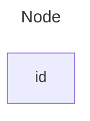
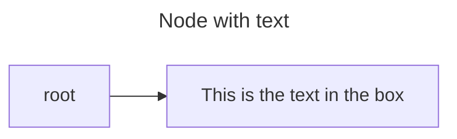
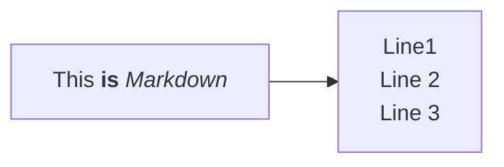
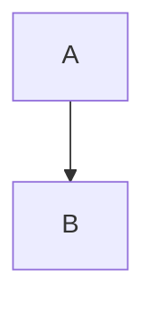
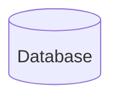
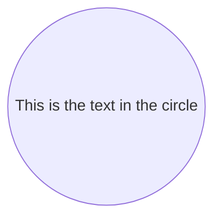
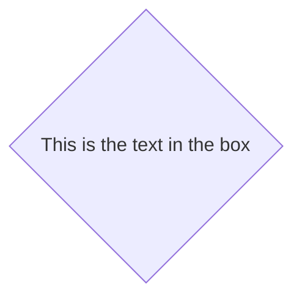
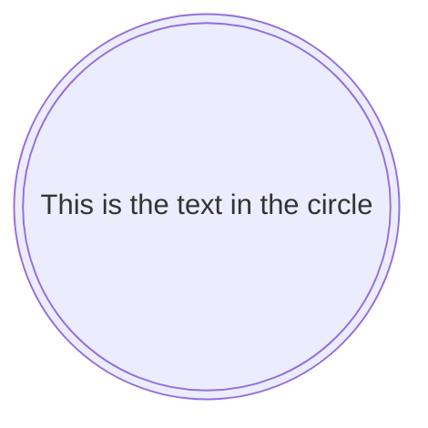

# 一级标题
```markdown
#一级标题
```
## 二级标题
```markdown
##二级标题
```
### 三级标题
```markdown
###三级标题
```
#### 四级标题
```markdown
####四级标题
```
##### 五级标题
```markdown
#####五级标题
```
###### 六级标题
```markdown
######六级标题
```


一级标题
===
```Markdown
一级标题
===
```

二级标题
---
```Markdown
二级标题
---
```

## 分割线:
- - - 
```markdown
- - - 
```

**粗体**
```markdown
**粗体**
```

*斜体*
```Markdown
*斜体*
```

***斜体+粗体***
```Markdown
***斜体+粗体***
```

~~删除线~~
```Markdown
~~删除线~~
```

- - - 
[超链接](http://www.baidu.com)  
[超链接+悬浮文字](http://www.baidu.com "悬浮文字")
```markdown
[超链接](http://www.baidu.com)  
[超链接+悬浮文字](http://www.baidu.com "悬浮文字")
```
[超链接引用][1]  
[超链接引用+悬浮文字][2]

[1]:http://baidu.com
[2]:http://baidu.com "跳转百度"
```markdown
[超链接引用][1]  
[超链接引用+悬浮文字][2]

[1]:http://baidu.com
[2]:http://baidu.com "悬浮文字"
```


```markdown

```

<a id="this">锚点</a>  
[跳转到锚标记](#this)
```markdown
<a id="this">锚点</a>  
[跳转到锚标记](#this)
```

- - -

## 有序列表:
1. 一层
   1. 二层
   2. 二层
2. 二层

```Markdown
1. 一层
   1. 二层
   2. 二层
2. 二层
```

## 无序列表:
+ 一层
  - 二层
  - 二层
    * 三层
      + 四层
+ 一层
 
```markdown
+ 一层
  - 二层
  - 二层
    * 三层
      + 四层
+ 一层
```

## TodoList
近期任务安排:
- [x] 整理Markdown手册
- [ ] 改善项目
   - [x] 优化首页显示方式
   - [x] 修复闪退问题
   - [ ] 修复视频卡顿
- [ ] A3项目修复
   - [x] 修复数值错误

```markdown
近期任务安排:
- [x] 整理Markdown手册
- [ ] 改善项目
   - [x] 优化首页显示方式
   - [x] 修复闪退问题
   - [ ] 修复视频卡顿
- [ ] A3项目修复
   - [x] 修复数值错误
```

- - -
## 文字引用
> 第一层
> > 第二层
> > > 第三层
> 
> 跳出来

```markdown
> 第一层
> > 第二层
> > > 第三层
> 
> 跳出来
```

- - - 
`行内代码块`
```markdown
`行内代码块`
```

## 代码块:
```java
public static void main(String args[]){
    System.out.print("Hello World!");
}
```

```
```java
public static void main(String args[]){
    System.out.print("Hello World!");
}
```(忽略括号)
```

- - -
## 表格:
| 商品 | 数量 |  单价  |
| ---- | ---: | :----: |
| 苹果 |   10 |  \$1   |
| 电脑 |    1 | \$1000 |

```markdown
| 商品 | 数量 |  单价  |
| ---- | ---: | :----: |
| 苹果 |   10 |  \$1   |
| 电脑 |    1 | \$1000 |
```

### 表格默认左对齐,第二行中的-可以是任意数量,默认是左对齐.
### :--- `左对齐` 
### :--: `居中对齐` 
### ---: `右对齐` 

- - - 
## 转义符:
\*  
\*\*  
\-  
\>  
\[\]  
\(\)  


```markdown
\*
\*\*
\-
\>
\[\]
\(\)
```

- - -
## HTML标签:
1. ### &nbsp;&nbsp;不断行的空白格
    ### &ensp;&ensp;半方大的空白
    ### &emsp;&emsp;全方大的空白
    ```markdown
    ### &nbsp;&nbsp;不断行的空白格
    ### &ensp;&ensp;半方大的空白
    ### &emsp;&emsp;全方大的空白
    ```
2. ### 上标标签<sup>上标</sup>
   ```markdown
   上标标签<sup>上标</sup>
   ```
3. ### 上标标签<sub>下标</sub>
   ```markdown
    上标标签<sub>下标</sub>
   ```
4. ### <u>下划线</u>
   ```markdown
   <u>下划线</u>
   ```
5. ### 换行标签<br>换行
   ```markdown
   换行标签<br>换行
   ```
6. ### <kbd>Ctrl</kbd>+<kbd>Alt</kbd>+<kbd>Del</kbd> 键盘按键特效
   ```markdown[](Markdown.md)
    <kbd>Ctrl</kbd>+<kbd>Alt</kbd>+<kbd>Del</kbd> 键盘按键特效
   ```
7. ### <font color="#dd0000">文字着色</font>
   ```markdown
   <font color="#dd0000">文字着色</font>
   ```
8. ### <p align="center">文字居中显示</p>

- - - 
## Mermaid  
**分类:**  
* [x] 流程图(graph)  
* [x] 时序图(sequenceDiagram)  
* [ ] 甘特图(gantt)  
* [ ] 类图(classDiagram)  
* [ ] Git图(gitGraph)  
* [ ] 实体关系图(erDiagram)  
* [ ] 用户旅程图(journey)  
* [ ] 象限图(quadrantChart)  
* [ ] XY图(xychart-beta)

### 流程图  
1.一个节点  


```markdown
mermaid
---
title: Node
---
graph LR
  id
```
*提示:graph的效果是等价于flowchart的*

2.带有文本的节点  


```markdown
---
title: Node with text
---
flowchart LR
    id1[This is the text in the box]
    root --> id1
```

**解释:**  
可以看到在示例1中,节点的内容就是节点的名称;而如果一个节点的内容很多,显然把这个节点的内容就写成节点的名称是不合适的.  
所以可以在节点的名称后面紧跟\[\]中括号在里面填上该节点的内容


3.统一码文本   


```markdown
flowchart LR
    id["This ❤ Unicode"]
```

**解释:**  
节点的内容最好使用双引号括起来\"

4.markdown格式  
使用双引号和反引号\"\`text\`\"将Markdown文本括起来  
也就是说如果想在mermaid图中使用markdown语法中,必须使用`"'`将markdown语法包住  


```markdown
%%{init: {"flowchart": {"htmlLabels": false}} }%%
flowchart LR
   markdown["`This **is** _Markdown_`"]
   newLines["`Line1
   Line 2
   Line 3`"]
   markdown --> newLines
```

5.方向  
可以在flowchart(graph)的后面指定流程图的方向  


```markdown
graph TD;
  A-->B
```

*解释:TD是从上到下的*  


```markdown
graph LR;
  A-->B
```

*解释:LR是从左到右的*  

**可能的流程方向有:**  
* TB - 从上到下
* TD - 自上而下/与自上而下相同
* BT - 从下到上
* RL - 从右到左
* LR - 从左到右

6.节点的形状  


```markdown
graph LR;
  Hello[Hello World]
```

**解释:**  
\[xxx]:如果节点是被中括号括起来,那节点的形状就是矩形的  


```markdown
flowchart LR
  id1(This is the text in the box)
```

**解释:**  
\(xxx):如果节点是被圆括号括起来的,那节点的形状就是圆角矩形的  


```markdown
graph LR;
    id1([This is the text in the box])
```

**解释:**  
([xxx]):管道形状的节点  


**解释:**  
[[xxx]\]:子程序中的节点  



**解释:**  
\[(xxx)]:圆柱节点形状



**解释:**  
((xxx)):双圆括号就是一个大圆  


**解释:**  
\>xxx]:是一个形状不对称的节点  




**解释:**  
{}:大括号就是菱形


**解释:**  
{{xxx}}:双括号就是六边形  


**解释:**  
\[/xxx/]:平行四边形  


**解释:**  
[\xxx\\]:反向平行四边形  


**解释:**  
[/xxx\\]:梯形  



**解释:**  
((())):双圈  

7.节点之间的链接  


```markdown
flowchart LR
    A-->B
```

**解释:**-->带箭头的链接  

```mermaid  
graph LR;
  A --- B
```

```markdown
graph LR;
  A --- B
```

**解释:** 没有箭头的链接  

```mermaid  
flowchart LR
    A---|This is the text!|B
```
```mermaid  
flowchart LR
    A--> |This is the text!|B
```

```markdown
flowchart LR
    A---|This is the text!|B
```

```markdown  
flowchart LR
    A--> |This is the text!|B
```

**解释:** 链接带文字  


```mermaid
flowchart LR
   A-.->B;
```

```markdown
flowchart LR
   A-.->B;
```

**解释:** 虚线链接

```mermaid
flowchart LR
   A-. text .-> B
```

```markdown
flowchart LR
   A-. text .-> B
```

**解释:** 虚线带文字

```mermaid
flowchart LR
   A ==> B
```
```mermaid
flowchart LR
   A == text ==> B
```

```markdown
flowchart LR
   A ==> B
```

**解释:** 粗实线

```mermaid
flowchart LR
    A ~~~ B
```

```markdown
flowchart LR
    A ~~~ B
```

**解释:** 看不见的链接  

```mermaid
flowchart LR
   A -- text --> B -- text2 --> C
```

```markdown
flowchart LR
   A -- text --> B -- text2 --> C
```


```mermaid
flowchart LR
   a --> b & c--> d
```

```markdown
flowchart LR
   a --> b & c--> d
```

```mermaid
flowchart TB
    A --> C
    A --> D
    B --> C
    B --> D
```

```markdown
flowchart TB
    A --> C
    A --> D
    B --> C
    B --> D
```

**解释:** 链接的链接  

8.不同的箭头类型  

```mermaid
flowchart LR
    A --o B
    B --x C
```

```markdown
flowchart LR
    A --o B
    B --x C
```

9.多方向箭头  
```mermaid
flowchart LR
    A o--o B
    B <--> C
    C x--x D
```

```markdown
flowchart LR
    A o--o B
    B <--> C
    C x--x D
```


