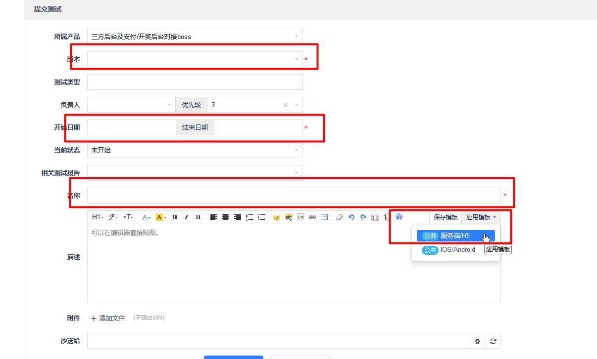
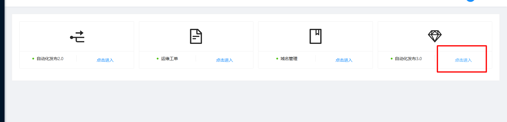
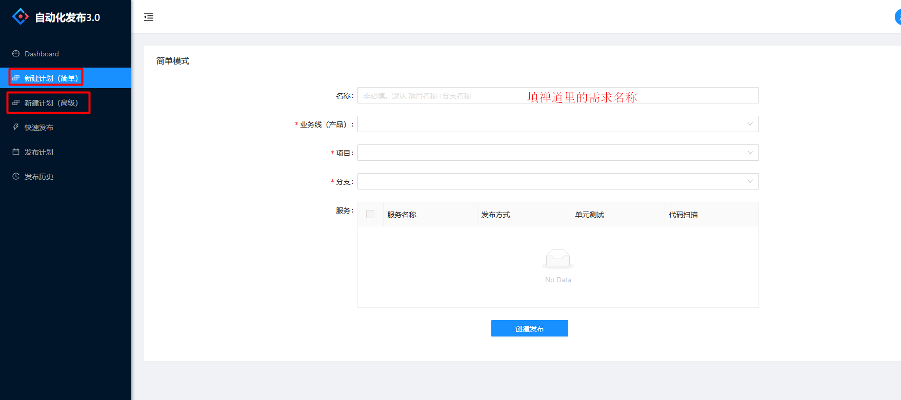
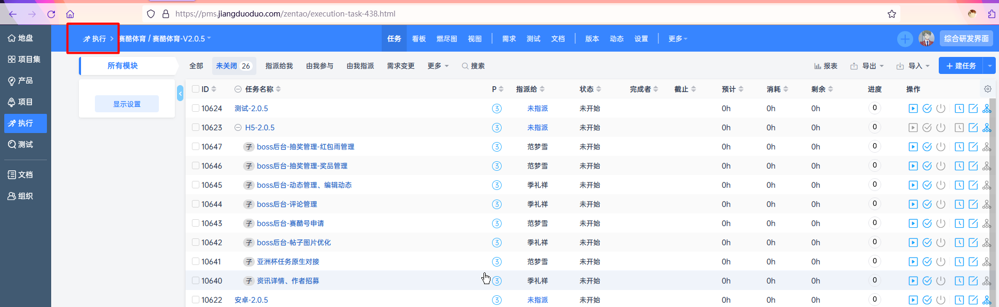

### 侧边栏功能介绍  
* 项目集:存放个人当前的所有项目
* 产品:存放个人所有的产品
* 项目:存放个人的所有项目
* 执行:存放当前个人所需要执行的所有需求
* 测试:分各个模块进行测试

**在禅道里面所有的侧边栏都是要再分具体的项目的**  

### 创建测试单:  
* 创建测试单
  

* 编写测试单
  

### 持续集成平台  
* 进入自动化发布平台  
    
* 新建计划  
  选择具体的业务线、项目、分支即可
    

### 查看个人的所有任务  
  

