# 目录  
1.CompletableFuture  
2.锁  
3.LockSupport与线程中断  
4.Java内存模型之JMM  
5.volatile与JMM  
6.CAS  
7.原子操作类  
8.ThreadLocal  
9.Java对象内存布局和对象头  
10.synchronized与锁升级  
11.AbstractQueuedSynchronizer之AQS  
12.ReentrantLock、ReentrantReadWriteLock、StampedLock  


## 1.CompletableFuture 
**目录:**  
1.1 Future接口理论知识复习  
1.2 CompletableFuture的改进  


### 1.1 Future接口理论知识复习  
1.基本介绍  
Future接口定义了操作<font color="#00FF00">异步任务执行</font>的一些方法,如获取异步任务的执行结果、取消任务的执行、判断任务是否被取消、判断任务执行是否完毕等.  

2.接口方法  
`cancel(boolean) return boolean` 取消一个任务  
`get() return V` 获取Future执行的结果  
`get(long,TimeUnit) return V` 一定时间内获取任务的结果  
`isCancelled() return boolean` 任务是否被取消  
`isDone() return boolean` 任务是否被完成  

3.常见实现类  
FutureTask是Future接口的常见实现类  

4.异步接口规范  
异步接口需要满足三个条件:多线程、返回值、异步任务  

5.类层级结构  
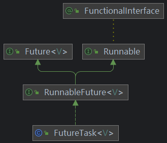  
FutureTask通过构造方法注入`Callable`接口来实现异步接口的规范  

6.FutureTask代码演示  
```java
public class DaemonThread {
    public static void main(String[] args) throws ExecutionException, InterruptedException {
        // FutureTask需要传入一个Callable接口
        // FutureTask自身是一个Runnable接口
        FutureTask<String> futureTask = new FutureTask<>(new MyThread());
        // Thread需要传入一个Thread接口
        Thread t1 = new Thread(futureTask, "t1");
        // 异步执行任务
        t1.start();
        // 获取异步执行任务的结果
        System.out.println(futureTask.get());
    }

}

class MyThread implements Callable<String> {

    @Override
    public String call() throws Exception {
        System.out.println("come in...");
        return "hello world";
    }
}
```

7.FutureTask优缺点分析  
* 优点:
  * Future+线程池异步多线程任务配合,能显著提高程序的执行效率
* 缺点:
  * `get`方法同步阻塞
  * `isDone`方法造成CPU空转
    ```java
    // 不停轮询
    while(true){
        if(futureTask.isDone()){
            System.out.println(futureTask.get());
            break;
        } else {
            // do another things...
            System.out.println("正在处理中...");
        }
    }
    ```
    可以通过`isDone`方法来优化`get`方法阻塞的问题,每隔一段时间调用`isDone`方法来判断异步任务是否处理结束,如果确认已经处理结束了再调用`get`方法获取返回值,而不是一直处于阻塞的状态,但是使用`isDone`方法可能会<font color="#00FF00">造成CPU空转消耗资源的问题</font>

### 1.2 CompletableFuture的改进  
1.异步回调  
为了解决`get`和`isDone`方法的问题,CompletableFuture提供了一种观察者机制,当任务执行完毕之后直接通知监听的一方.  

2.类层级结构  
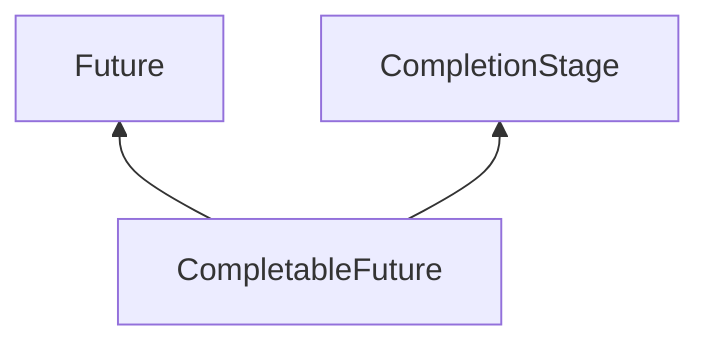

3.CompletionStage  
该接口内部有很多方法,CompletionStage代表异步计算过程中的某一个阶段,<font color="#00FF00">一个阶段完成后可能会触发另外一个阶段</font>,一个阶段的执行可能由单个阶段的完成触发,也可能是由多个阶段一起触发  

4.核心四个静态方法  
*提示:不推荐使用new的方式来创建CompletableFuture类*  
* `supplyAsync(Supplier<U>) return CompletableFuture<U>`
* `supplyAsync(Supplier<U>,Executor) return CompletableFuture<U>`
* `runAsync(Runnable) return CompletableFuture<Void>`
* `runAsync(Runnable,Executor) return CompletableFuture<Void>`

**解释:** 四个核心静态方法分为两组,supplyAsync方法有返回值;runAsync方法无返回值,每组方法又分为有线程池和无线程池的两个版本;<font color="#00FF00">如果没有指定线程池,则会默认使用ForkJoinPool.commonPool()线程池</font>  
*注意:ForkJoinPool内部的线程均为守护线程,主线程(用户线程)结束会导致CompletableFuture中的任务结束,可以通过<font color="#00FF00">创建自定义的线程池</font>作为第二个入参来解决该问题*  
*注意:CompletableFuture一旦被创建里面的任务就会被运行,至于后续的get和join方法只是获取结果的一种手段,并不代表执行*  

5.普通方法  
* `get() return T`
* `join() return T` 获取计算结果,该方法不会产生检查时异常(相较于Future的get方法而言)
* `getNow(T) return T` 获取计算结果,如果计算未结束或者计算的返回值是null,则该方法返回入参
* `complete(T) return boolean` 尝试终止异步计算,<font color="#00FF00">并设置当前异步计算的结果值为本方法的入参</font>;本方法返回值为终止是否成功,如果终止成功再调用get/join方法会获取到这里设置的值,而不是原本计算的值  
- - -
* `whenComplete(BiConsumer<? super T, ? super Throwable>) return CompletableFuture<T>` 当上一个阶段结束之后进入该方法(不管上一个阶段是正确运行还是运行失败都回调该方法),BiConsumer接口传入回调函数,BiConsumer的accept方法的第一个参数是上一个阶段结束后的返回值,第二个参数是上一个阶段结束后产生的异常(如果有);这个方法可以实操一下
* `exceptionally(Function<Throwable, ? extends T>) return T` 当上一个阶段产生异常时会回调该方法的Function函数,回调函数Function的入参为上阶段产生的异常,返回值为当前CompletableFuture期望的返回值,该方法是终止函数,没有后续流程了(因为返回值是T)
* `thenApply(Function<? super T,? extends U>) return CompletableFuture<U>` 依赖于上一个阶段的结果进行本阶段的计算,本阶段同步等待上一阶段的返回值;Function回调函数的入参是上一阶段的结果,返回值是当前阶段计算后的结果,注意这里返回值泛型不是T,<font color="#00FF00">说明本阶段的返回值类型可以和上一阶段不一致</font>
* `thenApplyAsync(Function<? super T,? extends U>) return CompletableFuture<U>` 解释见下面第7点线程池
* `thenAccept(Consumer<? super T>) return CompletableFuture<Void>` 依赖于上一阶段的结果进行本阶段的计算,Consumer回调函数的入参是上一阶段的结果,注意Consumer接口没有返回值,所以本方法仅仅是用于消费上一阶段的结果,本方法返回的CompletableFuture的泛型是Void,所以本方法成功执行后如果调用`join`函数返回的结果是null
* `thenAcceptAsync(Consumer<? super T>) return CompletableFuture<Void>` 解释见下面第7点线程池
* `thenRun(Runnable) return CompletableFuture<Void>` 本阶段同步等待上一阶段计算结束,但不依赖上一阶段计算后的结果,并且本方法返回的CompletableFuture的泛型<font color="#00FF00">也</font>是Void
* `thenRunAsync(Runnable) return CompletableFuture` 解释见下面第7点线程池
* `handle(BiFunction<? super T, Throwable, ? extends U>) return CompletableFuture<U>` 类似于thenApply也是依赖于上一个阶段进行本阶段的计算,但如果thenApply依赖的上一个阶段产生了异常,则当前阶段的thenApply不会执行;而handle则不同,handle依赖的上一个阶段出现异常后依旧可以正常执行这里的BiFunction回调函数,回调函数BiFunction有两个入参一个返回值,第一个入参是上一个阶段的结果,如果上一个阶段产生异常则入参为null,第二个参数是上一个阶段产生的异常,回调函数的返回值是当前阶段计算后的结果,注意这里返回值泛型不是T  
- - -
* `applyToEither(CompletionStage<? extends T>,Function<? super T, U>) return CompletableFuture<U>` 让当前CompletableFuture类与args0的CompletableFuture进行比较计算,<font color="#00FF00">这两个CompletableFuture谁先计算出结果就使用该结果作为args1回调函数的入参</font>  
* `thenCombine(CompletionStage<? extends U>,BiFunction<? super T,? super U,? extends V>) return CompletableFuture<V>` 使当前CompletableFuture类与agrs0对应的CompletableFuture类进行<font color="#00FF00">结果合并</font>,当这两个CompletableFuture的结果都计算完毕之后;将这两个结果作为args1的回调函数的入参  
* 


6.同时执行样例  
```java
List<Integer> productId = new ArrayList<>();
productId.add(1);
productId.add(2);
productId.add(3);
List<String> result = productId.stream()
        .map(integer -> CompletableFuture.supplyAsync(() -> String.format("查询%s商品", integer)))
        .toList()
        .stream()
        .map(CompletableFuture::join)
        .toList();
```

**解释:**  
这里遍历productId的第一个map方法很重要,它遍历id列表并映射成一个CompletableFuture对象,因为`supplyAsync`方法是异步的所以执行不阻塞,由后台线程默默执行查询商品的逻辑,此时三个CompletableFuture对象同时开始执行,最后对每个CompletableFuture对象调用join方法获取结果,当然join方法还是阻塞的,所以如果第一个商品查询时间过长确实会影响到整体的执行时间.  

7.线程池  
thenApply、thenAccept、thenRun方法执行的时候会默认使用CompletableFuture类创建时使用的线程池(指定了自定义线程池就用自定义线程池,未指定就使用ForkJoinPool.commonPool()线程池),与之对应这些方法都有其<font color="#00FF00">Async</font>版本,它的意思是这些版本的方法会<font color="#FF00FF">将当前CompletableFuture类的线程池改为ForkJoinPool</font>  
**知识点:每个CompletableFuture类是绑定一个线程池对象的**  


## 2.锁
**目录:**  
2.1 锁的分类  
2.2 悲观锁和乐观锁  
2.3 对象锁和类锁  
2.4 公平锁和非公平锁  
2.5 可重入锁  
2.6 死锁  


### 2.1 锁的分类  
*提示:关于锁的分类可以看操作系统相关的知识*  


### 2.2 悲观锁和乐观锁  
<font color="#FF00FF">synchronized和Lock的实现类都是悲观锁</font>  
悲观锁适合多写少读的场景  
乐观锁适合多读少写的场景  

对于乐观锁有时我总是不理解,实际上可以用可见性的例子来说明,不要惧怕乐观锁;`volatile int a = 0`;两个线程同时对该变量作自增,假设volatile底层通过乐观锁实现,那么b线程更改时如果发现读取到的数据已经过时,则会重新读取放弃本次操作,所以数据更改并不可怕,<font color="#00FF00">因为针对读取到的数据的代码处理逻辑是不变的</font>  

### 2.3 对象锁和类锁  
1.对象锁  
```java
public synchronized void hello() {
    // do something...
}

// 上述锁法等同于
public void hello() {
    synchronized (this) {
       // do something...
    }
}
```

**解释:**  
普通方法的synchronized相当于对当前这个对象加锁,`this`关键字在Java中指代当前对象,锁的是堆内存中的对象;<font color="#00FF00">所以如果两个线程同时调用不同对象的同一加锁方法是不是产生竞争的</font>  

2.类锁  
```java
public class HelloWorld {
    public static synchronized void hello() {
        // do something...
    }
}


// 上述锁法等同于
public class HelloWorld {
    public void hello() {
        synchronized (HelloWorld.class) {
        // do something...
        }
    }
}
```

**解释:**  
由于当前方法是静态方法,而静态方法不依赖类的实例化,所以这里`this`关键字指代的必然不可能是当前对象,而应该是<font color="#FF00FF">当前类对象,此时锁住的就是由类加载器实例化当前类产生的Class对象</font><font color="#00FF00">由于该对象存在于方法区有且仅有一份,所以多个线程调用该方法最终竞争的都是同一把锁</font>  
*提示:对象.静态方法() = 类.静态方法() 通过对象调用静态方法和通过类调用静态方法本质上是一样的*  

3.Java反编译命令  
使用`javap -c xxx.class`来查看字节码的信息  
使用`javap -v xxx.class`来查看字节码的更多信息  

4.synchronize底层字节码  
4.1 synchronize加锁  
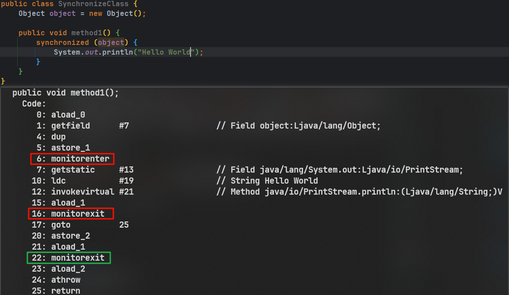  
使用`javap -c`命令查看字节码,结果如图所示,Java中的同步代码块底层是通过`monitorenter`和`monitorexit`指令进行实现的,但查看字节码文件发现会有两个`monitorexit`这是因为第6-16行之间的指令有可能会产生异常,如果不产生异常则正常走16行的`monitorexit`,否则会走低22行的`monitorexit`并紧跟一个24行的athrow异常抛出  

4.2 普通同步方法  
普通同步方法需要使用`javap -v`命令查看字节码,结果如图所示  
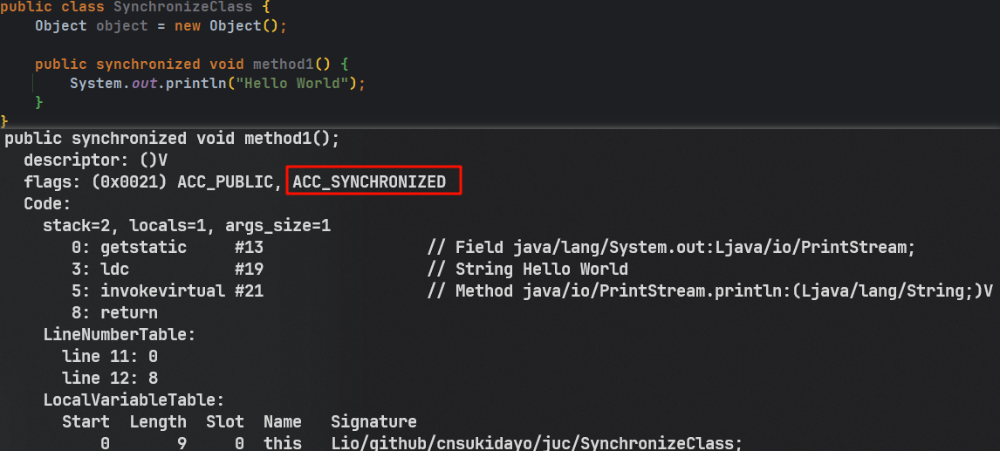  
可以看到普通同步方法有关键字`ACC_SYNCHRONIZED`进行标识,此时JVM就知道该方法是同步方法  

4.3 静态同步方法  
静态同步方法需要使用`javap -v`命令查看字节码,结果如图所示  
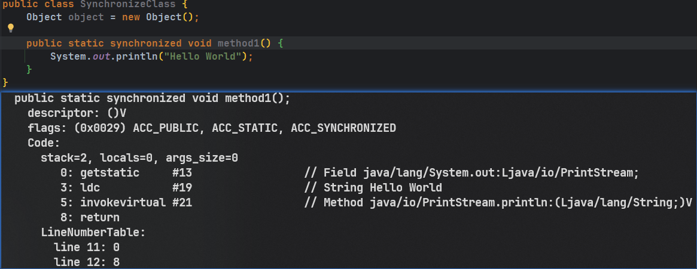  
相较于普通同步方法之外,静态同步方法还多了一个`ACC_STATIC`的标识  

5.管程  
在HotSpot虚拟机中,monitor采用ObjectMonitor实现
ObjectMonitor.java -> objectMonitor.cpp -> objectMonitor.hpp

并且objectMonitor.cpp中实现了Object类中的`notify`、`notifyAll`、`wait`等线程相关的方法  

*提示:路径如下*  
objectMonitor.cpp(hotspot\src\share\vm\runtime\objectMonitor.cpp)  
objectMonitor.cpp(hotspot\src\share\vm\runtime\objectMonitor.cpp)  

objectMonitor.hpp有几个关键的属性  
* `_owner`:指向持有当前ObjectMonitor对象的线程
* `_WaitSet`:存放处于wait状态的线程队列
* `_EntryList`:存放处于等待锁block状态的线程队列
* `_recursions`:锁的重入次数
* `_count`:用来记录该线程获取锁的次数

<font color="#FF00FF">每个对象都有与之对应的对象监视器</font>,由ObjectMonitor对象的`_owner`属性就能知道当前是哪个线程获取了对象锁  


### 2.4 公平锁和非公平锁  
*解释:公平锁和非公平锁即多个线程抢占一把锁时,锁的分配是完全随机还是尽量平均分给每个线程,如果是非公平锁就可能造成一个线程多次占用同一把锁,导致别的线程饥饿,而公平锁可以保证每个线程都能至少获得一次锁*  

1.非公平锁代码示例  
```java
public class TickLock {

    public static void main(String[] args) {
        TickSeal tickSeal = new TickSeal();
        new Thread(() -> { for (int i = 0; i < 50; i++) { tickSeal.sale("A"); }}).start();
        new Thread(() -> { for (int i = 0; i < 50; i++) { tickSeal.sale("B"); }}).start();
        new Thread(() -> { for (int i = 0; i < 50; i++) { tickSeal.sale("C"); }}).start();
    }

}

class TickSeal {
    ReentrantLock reentrantLock = new ReentrantLock();
    private int tick = 50;
    public void sale(String name) {
        reentrantLock.lock();
        if(tick > 0){
            System.out.printf("售票员[%s],正在售卖第[%s]张票!%n", name, tick--);
        }
        reentrantLock.unlock();
    }
}
```

**解释:**  
一共有三个售票员(线程)售票,ReentrantLock默认为非公平锁;同时执行最终可能所有的票都被售票员A售卖,这就是<font color="#00FF00">非公平锁可能会导致其它线程饥饿的情况</font>  

2.公平锁代码示例  
*提示:将ReentrantLock的构造函数改为`ReentrantLock reentrantLock = new ReentrantLock(true);就是公平锁`*  
使用公平锁执行后会发现此时不仅仅是A线程能够获得到资源,别的线程也可以获取到资源,甚至在我的本次测试中完全按照ABC的方式一人获取一次  

3.公平锁与非公平锁的区别  
<font color="#FF00FF">非公平锁能够高效利用CPU资源</font>,因为线程的切换涉及资源的保存与恢复会产生开销  
具体什么时候使用公平锁和非公平锁得看业务,如非必要尽量使用非公平锁  

4.ReentrantLock公平锁与非公平锁的实现  
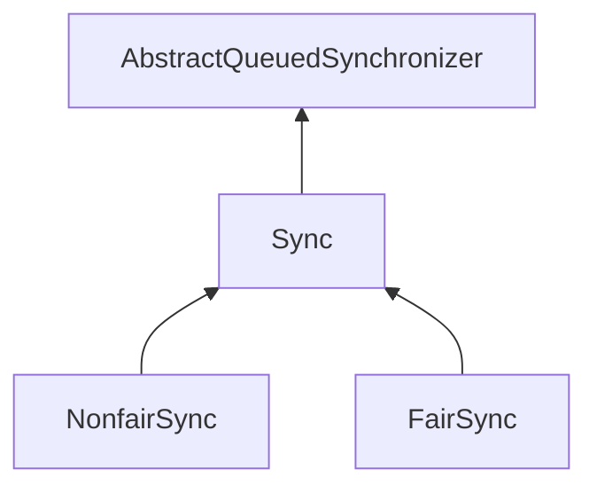

本质上是基于AQS实现的,通过构造函数的传值来创建NonfairSync和FairSync分别实现非公平锁和公平锁  

5.synchronize默认为非公平锁  

### 2.5 可重入锁  
1.解释  
可重入锁的意思是一个线程申请了一把锁资源后,如果再次申请同一把锁能够申请成功就称该锁为可重入锁,在Java中锁就是对象,所以这里实际上说的是锁的获取方法  

2.可重入锁分类  
<font color="#00FF00">synchronize和ReentrantLock方式获取的锁是可重入锁</font>  
synchronize是隐式的可重入锁,即JVM层面自已实现了锁的计数重入  
ReentrantLock是显式的可重入锁,需要用户自已手动`lock`+`unlock`  


3.synchronize重入锁实现机制  
Java中每个对象有与之唯一对应的ObjectMonitor对象,ObjectMonitor本质是objectMonitor.cpp,通过objectMonitor.cpp中的`_count`和`_owner`属性(锁计数器和指向持有该锁线程的指针)来实现锁的可重入  

当执行`monitorenter`指令时,如果目标锁对象的计数器为零,那么说明它没有被其它线程所持有,Java会将该锁对象(objectMonitor.cpp)的持有线程设置为当前线程(_owner),并将其计数器加一(_count)  

在目标对象的计数器不为零的情况下,如果锁对象的持有线程是当前线程,那么Java虚拟机可以将其计数器加1,否则将当前线程添加到objectMonitor的`_EntryList`队列中,然后一直等待直至别的线程释放该锁  

当执行`monitorexit`时Java虚拟机需要将锁对象的计数器减1,计数器为0代表锁已经释放  

### 2.6 死锁
1.定义  
多个线程在运行过程中因争夺资源而造成的一种互相等待的现象  

2.如何发现死锁  
首先执行`jps`命令查看当前操作系统(实际上是执行该jps命令的JVM)上正在运行的Java程序  
*提示:jps命令就相当于Java版本的ps命令,用于查看宿主机上运行的所有Java进程*  
结果显示如下,发现它由一个进程号 + 进程名组成:  
```shell
11808 Launcher
16960 SynchronizeClass
22384 Jps
```
接着再使用`jstack [processId]`命令来查看Java程序的堆栈信息,其中`processId`就是上面`jps`方法执行后显示的进程号  
```shell
# 执行shell命令
jstack 16960  

# ... something

"Thread-0":
        at io.github.cnsukidayo.juc.SynchronizeClass.lambda$main$0(SynchronizeClass.java:22)
        - waiting to lock <0x0000000625264360> (a java.lang.Object)
        - locked <0x0000000625264350> (a java.lang.Object)
        at io.github.cnsukidayo.juc.SynchronizeClass$$Lambda$14/0x0000000800c01200.run(Unknown Source)
        at java.lang.Thread.run(java.base@17/Thread.java:833)
"Thread-1":
        at io.github.cnsukidayo.juc.SynchronizeClass.lambda$main$1(SynchronizeClass.java:34)
        - waiting to lock <0x0000000625264350> (a java.lang.Object)
        - locked <0x0000000625264360> (a java.lang.Object)
        at io.github.cnsukidayo.juc.SynchronizeClass$$Lambda$15/0x0000000800c01420.run(Unknown Source)
        at java.lang.Thread.run(java.base@17/Thread.java:833)
# 最终这里会打印死锁信息
Found 1 deadlock.
```

除了使用上面这两个命令之外还可以使用`jconsole`图形化工具,直接在控制台输入`jconsole`打开图形化界面,连接对应的Java程序,在顶部栏(概览、内存、线程、类xxx)中选择线程界面,点击检测死锁便会显示出当前监控的进程的死锁情况  


## 3.LockSupport与线程中断
**目录:**  
3.1 中断机制  
3.2 中断停止代码案例  
3.3 LockSupport  


### 3.1 中断机制  
1.中断机制介绍  
*提示:这里参考操作系统中的知识*  
一个线程不应该由其它线程来强制中断或停止,而是应该<font color="#FF00FF">由线程自已自行停止</font>,<font color="#00FF00">所以Thread.stop、Thread.suspend、Thread.resume方法都已经被废弃</font>  
因此Java提供了一种用于停止线程的<font color="#00FF00">协商机制</font>即<font color="#FF00FF">中断</font>,<font color="#00FF00">中断只是一种协商机制,Java并没有给中断机制增加任何语法,中断的过程完全需要程序员自已实现</font>,若要中断一个线程,你需要手动调用该线程的`interrupt`方法,而改方法也仅仅是将线程中对象的中断标识设置为true,`interrupt`方法可以在当前线程中调用也可以在别的线程中调用,所以当前线程需要在代码里面手动检查线程的`interrupt`标识,<font color="#00FF00">然后根据标识的状态自行进行下一步逻辑的处理</font>  

2.中断机制三大方法  
*提示:下面所述的方法均为Thread类的方法*  
* `static interrupted() return boolean` 判断当前线程是否已经被中断并<font color="#FF00FF">清除当前线程的中断状态</font>,该方法是一个静态方法;
* `interrupt() return void` 发起线程中断的协商,该方法仅仅是将线程的中断标识设置为true,不会立即中断方法
* `isInterrupted() return boolean` 判断当前线程是否已经被中断
  另外如果当前线程已经运行结束了,则调用该方法会始终返回false

3.源码分析  
`interrupt`方法的底层通过调用JVM的本地方法`interrupt0`来实现,如果被中断的线程在这之前调用了Object类的`wait`、`wait(long)`、`wait(long,int)`方法或者调用了Thread类的`join()`、`join(long)`、`join(long,int)`、`sleep(long)`、`sleep(long,int)`方法,<font color="#FF00FF">那么它的中断状态将被清除</font>,并<font color="#00FF00">抛出InterruptedException异常</font>,相当于说如果线程已经执行了上述阻塞方法期间时被调用了`interrupt`则此次interrupt方法根本不会生效,此时的中断标识就是false,中断不活动的线程不会产生异常  

在JDK17下,`isInterrupted`方法返回的是一个可见的`interrupted`布尔型变量来表明当前线程是否中断  

`interrupted`静态方法会将`interrupted`布尔变量保存起来以作为结果返回,然后将`interrupted`改为false,并且调用JVM的本地方法`clearInterruptEvent`产生一个清除事件,以此来清除当前线程的中断状态  

*提示:不同版本的JDK实现是不一样的*  
**注意:InterruptedException异常是一种很重要的异常**  


### 3.2 中断停止代码案例
1.通过volatile实现线程中断  
```java
public class SynchronizeClass {

    private static volatile boolean isStop = false;

    public static void main(String[] args) {
        new Thread(() -> {
            while (!isStop) {
                try { TimeUnit.SECONDS.sleep(1); } catch (InterruptedException e) { throw new RuntimeException(e); }
                System.out.println("Hello World");
            }
        }).start();

        new Thread(() -> {
            try { TimeUnit.SECONDS.sleep(3); } catch (InterruptedException e) { throw new RuntimeException(e); }
            isStop = true;
        }).start();
    }
}
```
**解释:**  
通过volatile关键字的可见性来实现,这段代码比较经典不过多介绍,最终会打印三个Hello World  

2.通过AtomicBoolean原子类实现中断  
```java
public class SynchronizeClass {

    private static AtomicBoolean isStop = new AtomicBoolean(false);

    public static void main(String[] args) {
        new Thread(() -> {
            while (!isStop.get()) {
                try { TimeUnit.SECONDS.sleep(1); } catch (InterruptedException e) { throw new RuntimeException(e); }
                System.out.println("Hello World");
            }
        }).start();

        new Thread(() -> {
            try { TimeUnit.SECONDS.sleep(3); } catch (InterruptedException e) { throw new RuntimeException(e); }
            isStop.set(true);
        }).start();
    }
}
```

3.通过interrupt实现线程中断  
```java
public class SynchronizeClass {

    public static void main(String[] args) {
        Thread tOne = new Thread(() -> {
            while (!Thread.currentThread().isInterrupted()) {
                try {
                    TimeUnit.SECONDS.sleep(1);
                } catch (InterruptedException e) {
                    throw new RuntimeException(e);
                }
                System.out.println("Hello World");
            }
        });
        tOne.start();

        new Thread(() -> {
            try { TimeUnit.MILLISECONDS.sleep(3500); } catch (InterruptedException e) { throw new RuntimeException(e); }
            tOne.interrupt();
        }).start();
    }
}
```
*提示:如果打断一个正在睡眠的线程是会产生异常的,所以这里会抛出InterruptedException*  


### 3.3 LockSupport  
**目录:**  
3.3.1 LockSupport基本介绍  
3.3.2 Object实现线程等待与唤醒  
3.3.3 Condition实现线程等待与唤醒  
3.3.4 LockSupport实现线程等待与唤醒  


#### 3.3.1 LockSupport基本介绍
1.介绍  
LockSupport是JUC下的一个类,<font color="#00FF00">用于创建锁和其他同步类的基本线程阻塞原语</font>;LockSuppoort的`park`和`unpark`方法的作用分别是阻塞线程和解除阻塞线程  
<font color="#FF00FF">实际上LockSupport就是wait和notify方法的一种优化机制</font>  

2.三种线程等待和唤醒的方法  

2.1 Object  
使用Object类中的wait方法暂停线程,使用Object类中的notify方法唤醒线程  

2.2 Condition  
使用Condition类中的await方法让线程等待,使用signal方法唤醒线程  

2.3 LockSupport  
LockSupport类可以阻塞当前线程以及唤醒指定被阻塞的线程  


#### 3.3.2 Object实现线程等待与唤醒
1.正常情况  
```java
public class SynchronizeClass {

    public static void main(String[] args) {
        Object o = new Object();
        new Thread(() -> {
            synchronized (o) {
                System.out.println("t1 come in ----");
                try {
                    o.wait();
                } catch (InterruptedException e) {
                    throw new RuntimeException(e);
                }
                System.out.println("t1被唤醒了");
            }
        }).start();


        new Thread(() -> {
            synchronized (o) {
                o.notify();
                System.out.println("t2发出通知");
            }
        }).start();
    }
}
```
输出结果如下  
```shell
t1 come in ----
t2发出通知
t1被唤醒了
```

2.异常情况1  
如果把第一步正常情况下的两个Thread的synchronized同步代码块去除,则运行后将产生两个异常IllegalMonitorStateException,分别是在调用wait和notify方法时产生的,<font color="#00FF00">所以wait和notify方法必须结合synchronized才可以使用</font>  

3.异常情况2  
如果把第一步正常情况下,让t1线程先延迟一秒执行,让t2线程先执行notify方法,再让t1线程执行,此时不会报错,结果是t1线程打印完come in信息之后一直被阻塞  


#### 3.3.3 Condition实现线程等待与唤醒  
1.正常情况
```java
public class SynchronizeClass {

    public static void main(String[] args) throws InterruptedException {
        Lock lock = new ReentrantLock();
        Condition condition = lock.newCondition();
        new Thread(() -> {
            lock.lock();
            try {
                System.out.println("come in");
                condition.await();
                System.out.println("t1 被唤醒");
            } catch (InterruptedException e) {
                throw new RuntimeException(e);
            } finally {
                lock.unlock();
            }
        }).start();

        TimeUnit.SECONDS.sleep(1);

        new Thread(new Runnable() {
            @Override
            public void run() {
                lock.lock();
                try {
                    condition.signal();
                    System.out.println("t2 发出通知!");
                } finally {
                    lock.unlock();
                }
            }
        }).start();

    }
}
```
最终输出的内容如下  
```shell
come in
t2 发出通知!
t1 被唤醒
```

2.异常情况  
同理如果把第一步正常情况下的两个Thread的`lock`和`unlock`方法去掉,则运行后将产生两个异常IllegalMonitorStateException,分别是在调用await和signal方法时产生的,<font color="#00FF00">所以await和signal方法必须结合lock+unlock才可以使用</font>  

3.异常情况  
参考3.3.2中的异常情况2,效果一模一样;所以ReentrantLock就可以理解为synchronize的一种实现,但ReentrantLock还提供公平锁功能,synchronize默认是非公平锁  

#### 3.3.4 LockSupport实现线程等待与唤醒  
1.LockSupport  
LockSupport是JUC下的一个类,<font color="#00FF00">用于创建锁和其他同步类的基本线程阻塞原语</font>;LockSuppoort的`park`和`unpark`方法的作用分别是阻塞线程和解除阻塞线程  
<font color="#FF00FF">实际上LockSupport就是wait和notify方法的一种优化机制</font>  
LockSupport类使用了一种名为`Permit`(许可)的概念来做到<font color="#00FF00">阻塞和唤醒线程</font>的功能,每个线程都有一个`Permit`(许可),与Semaphore不同的是,<font color="#00FF00">许可证不会累计,最多只有一个</font>  

2.静态方法  
*提示:LockSupport的构造器是私有的,它只有静态方法*  
* `static park() return void` 阻塞当前线程,底层通过调用`Unsafe`类的`park`方法进行实现,`Unsafe`类的`park`方法是一个JVM的本地方法
* `static unpark(Thread) return void` 唤醒一个线程,底层通过调用`Unsafe`类的`unpark`方法进行实现,`Unsafe`类的`unpark`方法也是一个JVM的本地方法,调用该方法后会向该Thread线程发放`Permit`许可证,会自动唤醒被park的线程
  * args0:要唤醒哪一个线程

3.基本使用  
```java
public class SynchronizeClass {
    public static void main(String[] args) throws InterruptedException {
        Thread threadOne = new Thread(() -> {
            System.out.println("t1 come in");
            LockSupport.park();
            System.out.println("t1 wake");
        });
        threadOne.start();

        TimeUnit.SECONDS.sleep(1);

        new Thread(() -> {
            System.out.println("t2 signal");
            LockSupport.unpark(threadOne);
        }).start();
    }
}
```
打印结果如下  
```shell
t1 come in
t2 signal
t1 wake
```

4.先唤醒再等待  
```java
public class SynchronizeClass {
    public static void main(String[] args) throws InterruptedException {
        Thread threadOne = new Thread(() -> {
            try { TimeUnit.SECONDS.sleep(1); } catch (InterruptedException e) { throw new RuntimeException(e); }
            System.out.println("t1 come in");
            LockSupport.park();
            System.out.println("t1 wake");
        });
        threadOne.start();
        
        new Thread(() -> {
            System.out.println("t2 signal");
            LockSupport.unpark(threadOne);
        }).start();
    }
}
```
打印结果如下  
```shell
t1 come in
t2 signal
t1 wake
```

**优点**  
* 无锁
* 支持先唤醒后等待
  能够先唤醒后等待的原因本质是因为`unpark`方法已经发送了许可证permit,此时线程调用park方法因为已经有了许可证所以阻塞不会产生效果

这两个优点解决的就是之前synchronize和ReentrantLock的缺点  

5.许可证不会累计  
```java
public class SynchronizeClass {
    public static void main(String[] args) throws InterruptedException {
        Thread threadOne = new Thread(() -> {
            try { TimeUnit.SECONDS.sleep(1); } catch (InterruptedException e) { throw new RuntimeException(e); }
            System.out.println("t1 come in");
            LockSupport.park();
            LockSupport.park();
            System.out.println("t1 wake");
        });
        threadOne.start();

        new Thread(() -> {
            System.out.println("t2 signal");
            LockSupport.unpark(threadOne);
            LockSupport.unpark(threadOne);
            LockSupport.unpark(threadOne);
            LockSupport.unpark(threadOne);
        }).start();
    }
}
```
**代码解释**  
LockSupport对唤醒顺序没有要求,这段代码多次调用unpark方法给threadOne发送许可证,但由于许可证不会累计最多只有一个,所以threadOne方法的第一个LockSupport.park();可以成功被唤醒,但被唤醒的同时紧接着又执行了LockSupport.park()方法,因为许可证已经被用掉了,所以这段程序最终会被阻塞在第二个LockSupport.park()方法上  


## 4.Java内存模型之JMM
4.1 计算机存储体系  
4.2 JMM  
4.3 happens-before  


### 4.1 计算机存储体系
*提示:详情可以参考计算机操作系统或者计算机组成原理,存储管理这一章*  

### 4.2 JMM
1.JMM由来  
CPU的运行并不是直接操作内存而是先把内存里面的数据读到缓存中,进而导致内存读写数据不一致的问题  
<font color="#FF00FF">JVM试图定义一种内存模型来屏蔽掉各种硬件和操作系统的内存访问差异</font>,<font color="#00FF00">以实现让Java程序在各个平台下达到一致的内存访问效果</font>  

2.JMM基本介绍  
JMM是一种抽象的概念并不真实存在,它描述的仅仅是一组规范,通过这组规范定义了程序中各个变量的读写访问方式并决定一个线程对共享变量的写入何时以及如何变成对另一个线程可见,关键技术点都是围绕多线程的<font color="#00FF00">原子性、可见性和有序性</font>展开的  

3.JMM作用
* 通过JMM来实现线程和主存之间的抽象关系
* <font color="#00FF00">屏蔽各个硬件平台和操作系统的内存访问差异</font>以实现让Java程序在各个平台下都能达成一致的内存访问效果

4.可见性  
<font color="#00FF00">当一个线程修改了某一个共享变量的值,其它线程是否能够立即知道该变更</font>,JMM规定所有的变量都存储在主存中  
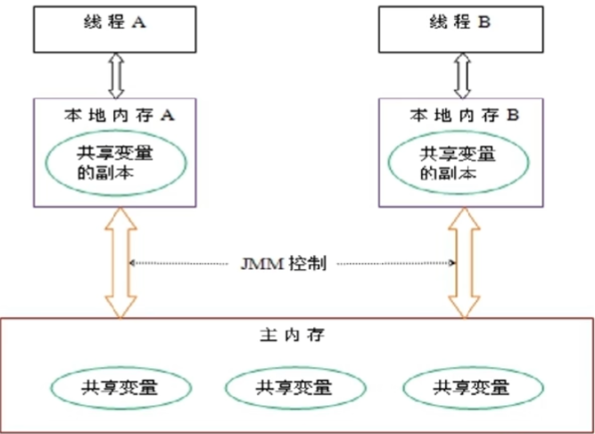  
系统主内存共享变量数据修改被写入的时机是不确定的,多线程并发下很可能出现"脏读",所以每个线程都有自己的工作内存,<font color="#00FF00">线程自已的工作内存中保存了该线程使用到的变量的主内存<font color="#FF00FF">副本拷贝</font></font>,线程对变量的所有操作(读取,赈赋值等)都必需在线程自已的工作内存中进行,而不能够直接读主内存中的变量;不同线程之间也无法直接访问对方工作内存中的变量,线程间变量值的传递均需要通过主内存来完成,由此产生<font color="#FF00FF">脏读</font>  

5.原子性  
指临界区的代码不可被打断,是最小的执行单元,里面的代码同一时间只能被一个线程所执行;实现的方法就是加锁  

6.有序性  
有序性指,编写出的程序代码在CPU底层执行时并不会按照编写的顺序去执行,编译器和CPU底层会在保证最终计算结果一致的前提下,通过指令(<font color="#00FF00">指令序列</font>)重排序的方式来优化代码执行以提升性能(即编写的程序顺序≠CPU执行顺序);最经典的例子就是CPU计算加减乘除时是按照逆波兰表达式执行的  
JVM能根据处理器特性(CPU核数、CPU多级缓存)适当对机器指令进行重排序,使机器指令能更加符合CPU的执行性能,但<font color="#00FF00">指令重排序仅仅保证串行语义一致</font>,<font color="#FF00FF">没有义务在多线程场景下也保证语义一致</font>(即可能产生脏读)

7.多线程变量的读写过程  
由于JVM运行程序的实体是线程,而每个线程创建时JVM都会为其创建一个工作内存(即线程私有的<font color="#00FF00">栈空间</font>),而Java内存模型中规定所有变量都存储在主存,主内存是共享内存区域,所有线程都可以访问,但线程对变量的操作(读取赋值等)必须在工作内存中进行,<font color="#00FF00">线程读取变量时要先将变量从主存拷贝到的线程自己的工作内存空间,然后对变量进行操作,操作完成后再将变量写回主存</font>,各个线程中的工作内存中存储着主内存中的变量副本拷贝,因此不同的线程间无法访问对方的工作内存,线程间的通信(传值)必须通过主内存来完成,当有线程更改了主存中的变量时,<font color="#FF00FF">可以通过总线嗅探机制强制刷新别的线程栈空间中的变量</font>  


### 4.3 happens-before  
1.happens-before  
happens-before<font color="#00FF00">包含可见性和有序性的约束</font>  
有序性的解释在4.2第6点讲解过,说白了就是要保证代码的执行顺序与编码顺序一致  
JVM在实现时已经保证了happens-before(先行发生)原则  

2.happens-before总原则  
* 如果第一个操作happens-before(先行)另一个操作,那么第一个操作的执行结果将对第二个操作<font color="#00FF00">可见</font>,而且第一个操作的执行<font color="#00FF00">顺序</font>排在第二个操作之前  
* 两个操作之间存在happens-before关系,并不意味着一定要按照happens-before原则制定的顺序来执行,如果重排序之后的执行结果与按照happens-before关系来执行的<font color="#00FF00">结果一致</font>,那么这种重排序并不非法
  ```java
  int a = 1;
  int b = 2;
  int c = 3;
  // 此时这一步无论是先计算a + b还是先计算a + c 还是先计算b + c都是一样的 
  System.out.println(a + b + c);
  ```

3.happens-before八条原则  
8条原则分别是:次序规则、锁定规则、volatile变量规则、传递规则、线程启动规则(Thread Start Rule)、线程中断规则(Thread Interruption Rule)、线程终止规则(Thread Termination Rule)、对象终结规则(Finalizer Rule)

3.1 次序规则
一个线程内,按照代码顺序,写在前面的指令要先行发生于写在它后面的指令  

3.2 锁定规则  
一个unLock操作先行发生于后面对同一个锁的lock操作  
大白话就是,对于同一把锁,一定是先执行unlock操作才能执行lock操作

3.3 volatile变量规则  
对一个volatile变量的写操作先行发生于后面对这个变量的读操作,<font color="#00FF00">前面的写对后面的读是可见的</font>

3.4 传递规则  
如果操作A先行发生于操作B,而操作B又先行发生于操作C,则可以得出操作A先行发生于操作C  

3.5 线程启动规则(Thread Start Rule)
Thread对象的`start()`方法先行发生于此线程的每一个动作  

3.6 线程中断规则(Thread Interruption Rule)  
对线程interrupt方法的调用先行发生于被中断线程的代码检测到中断事件的发生,也就是中断发生必须早于检测到中断事件的发生  

3.7 线程终止规则(Thread Termination Rule)
线程中的所有操作都先行发生于对线程的终止检测,可以通过`isAlive()`方法检测线程是否已经终止执行  

3.8 对象终结规则(Finalizer Rule)  
一个对象的初始化完成(构造函数执行结束)先行发生于它的`finalize()`方法的开始,即对象终止回收操作一定在对象被创建之后执行  


## 5.volatile与JMM
**目录:**  
5.1 volatile介绍  
5.2 内存屏障  
5.3 禁止重排序  
5.4 正确使用volatile  


### 5.1 volatile介绍
1.volatile特点  
volatile仅仅保证可见性和有序性

2.volatile内存语义  
* 当写一个volatile变量时,JMM会把线程对应的本地内存中的共享变量值<font color="#00FF00">立即刷新回主存中</font>
* 当读一个volatile变量时,JMM会把该线程对应的本地内存设置为无效,重新回到主内存中读取最新共享变量
* 所以volatile的写内存语义是直接刷新到主内存中,读的内存语义是直接从主内存中读取

*提示:volatile是不保证写可见的,这点也很容易理解,原本线程读取非volatile的变量会直接从线程栈中读取,如果主存中的变量被其它线程更改,则读取线程栈变量的线程将不会感知到本次更改,而是一直读取老的数据;所以如果多个线程对加了volatile关键字的变量进行并发修改,volatile是无法保证最终的值是正确的,虽然volatile可以强制将变量刷新回主存,也能强制从主存中读取变量,假设现在volatile变量a被线程1刷新到主存中的同时,有10个线程也从主存中读取volatile变量a并且将自增后的值刷新回主存,此时变量就是2,不会是11,也就是说强制从主存中读取和刷新并不能保证并发写的原子性,但是加上volatile变量可以保证变量的正确值能够最终被别的线程读取到;有一种情况便是,线程1将变量a修改为2,线程2读取变量a将永远是修改为2之前的值,因为它只会从线程栈中读取变量a,永远不会同步主存的最新值*  
*提示:关于volatile为什么不能保证变量的可见性,详情可以参考5.2节的第8点*  

### 5.2 内存屏障  
1.基本介绍  
屏障这个词的本意就是阻挡、禁止的意思,内存屏障是一类<font color="#00FF00">同步屏障指令</font>,<font color="#FF00FF">是CPU或编译器在对内存随机访问的操作中的一个同步点,使得次点之前的所有读写操作都执行后才开始执行此点之后的操作</font>,避免代码重排序,内存屏障的本质是一种JVM指令,Java内存模型的重排序规则会要求Java编译器在生成JVM指令时<font color="#00FF00">插入特定的内存屏障指令</font>,通过这些内存屏障指令,volatile实现了Java内存屏障中的可见性和有序性(禁止重排序),但<font color="#00FF00">volatile无法保证原子性</font>  

<font color="#00FF00">内存屏障之前的所有写操作都要写回到主存中,内存屏障之后的所有读操作都能获得内存屏障之前的所有写操作的最新结果</font>  
* 写屏障(Store Memory Barrier):告诉处理器在写屏障之前将所有存储在缓存(store bufferes)中的数据同步到主存
* 读屏障(Load Memory Barrier):处理器在读屏障之后的读操作,都在读屏障之后执行

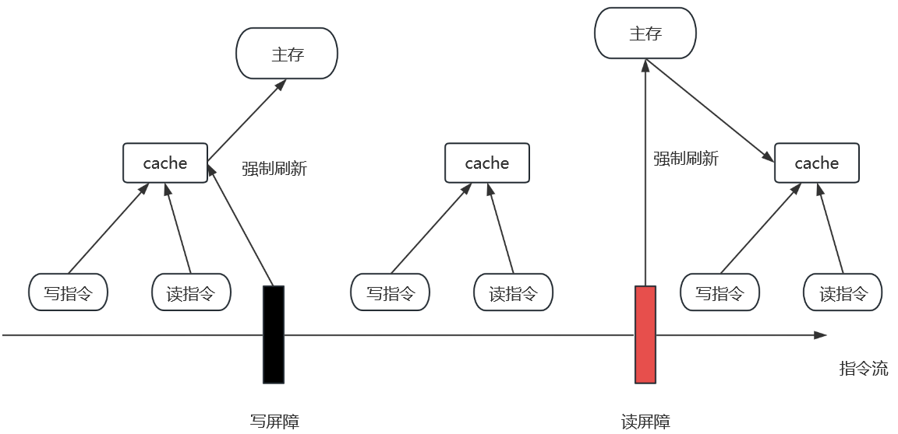  
**<font color="#FF00FF">对于重排序,不允许把内存屏障之后的指令重排序到内存屏障之前 </font>**  

2.内存屏障分类  
按照读写性质分为:读屏障和写屏障  
按照底层性质分为:读后读、写后写、读后写、写后读

3.Unsafe类  
Unsafe中有三个本地方法`storeFence`、`loadFence`、`fullFence`分别对应写屏障、读屏障、读写屏障  
既然是本地方法与此对应便有Unsafe.cpp的C语言代码,在hotspot\src\share\vm\prims\unsafe.cpp路径下可以找到,该类中有对应的三个方法
```c++
UNSAFE_ENTRY(void, Unsafe_LoadFence(JNIEnv *env, jobject unsafe))
  UnsafeWrapper("Unsafe_LoadFence");
  OrderAccess::acquire();
UNSAFE_END

UNSAFE_ENTRY(void, Unsafe_StoreFence(JNIEnv *env, jobject unsafe))
  UnsafeWrapper("Unsafe_StoreFence");
  OrderAccess::release();
UNSAFE_END

UNSAFE_ENTRY(void, Unsafe_FullFence(JNIEnv *env, jobject unsafe))
  UnsafeWrapper("Unsafe_FullFence");
  OrderAccess::fence();
UNSAFE_END
```
可以发现者三个方法又调用了OrderAccess文件对应的类(\hotspot\src\share\vm\runtime\orderAccess.hpp),双冒号就类似方法引用,这个类中定义了如下重要的静态方法  
```c++
class OrderAccess : AllStatic {
 public:
  // 读后读
  static void     loadload();
  // 写后写
	static void     storestore();
  // 读后写
	static void     loadstore();
  // 写后读
	static void     storeload();

  static void     acquire();
  static void     release();
  static void     fence();
}
```
其中的loadload、storestore、loadstore、storeload方法就非常类似计算机组成原理里涉及到的知识点  
最终来到linux底层的源码实现  
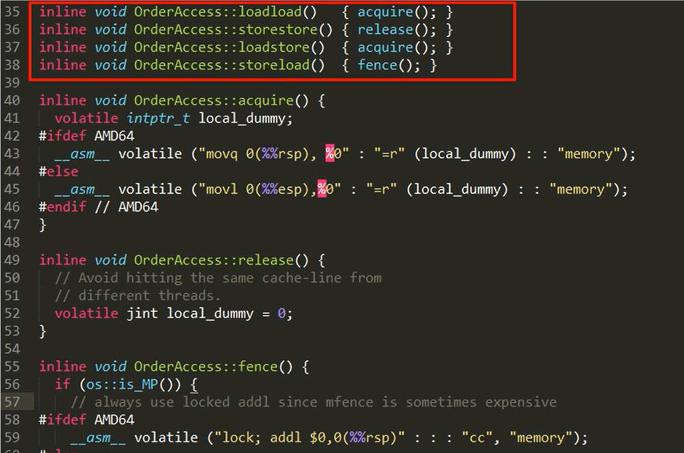  
*提示:asm为内联汇编,这里的汇编指令后面加了类型*  


4.<font color="#FF00FF">4类屏障介绍</font>  
|  屏障类型  |         指令示例         |                               说明                               |
|:----------:|:------------------------:|:----------------------------------------------------------------:|
|  LoadLoad  |   Load1;LoadLoad;Load2   |         保证load1的读取操作在load2及后续读取操作之前执行         |
| StoreStore | Store1,StoreStore;Store2 |    在load2及其后的写操作执行前,保证store1的写操作已刷新到主存    |
| LoadStore  |  Load1;LoadStore;Store2  |     在stroe2及其后的写操作执行前,保证load1的读操作已读取结束     |
| StoreLoad  |  Store1;StoreLoad;Load2  | 保证store1的写操作已刷新到主内存之后,load2及其后的读操作才能执行 |


5.happens-before之volatile变量规则  
| 第一个操作 | 第二个操作:普通读写 | 第二个操作:volatile读 | 第二个操作:volatile写 |
|:----------:|:-------------------:|:---------------------:|:---------------------:|
|  普通读写  |      可以重排       |       可以重排        |      不可以重排       |
| volatile读 |     不可以重排      |      不可以重排       |      不可以重排       |
| volatile写 |      可以重排       |      不可以重排       |      不可以重排       |

* 当第一个操作为volatile读时,不论第二个操作是什么,都不能重排序;这个操作保证了volatile读之后的操作不会被重排到volatile读之前
* 当第二个操作为volatile写时,不论第一个操作是什么,都不能重排序;这个操作保证了volatile写之前的操作不会被重排到volatile写之后
* 当第一个操作为volatile写时,第二个操作为volatile读时,不能重排

6.读写屏障插入顺序  
*提示:通过第6节的内容就能够理解第5节表格中的内容*  

6.1 读屏障插入
在每个volatile读操作的后面先插入一个LoadLoad屏障再插入一个LoadStore屏障  
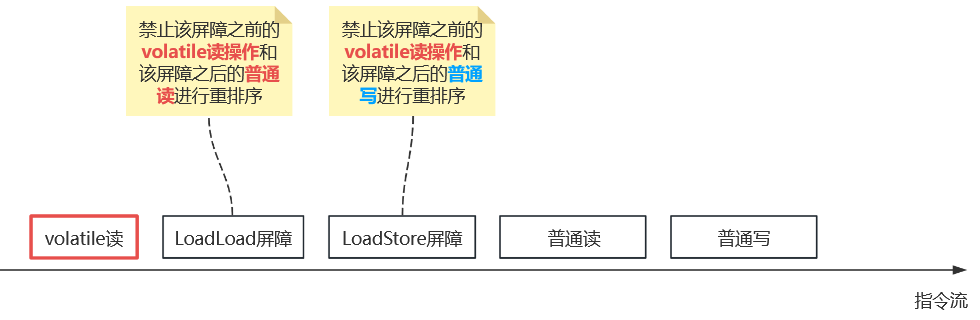  

6.2 写屏障插入  
在每个volatile写操作前插入一个StoreStore屏障,在每个volatile写操作的后面插入一个StoreLoad屏障  
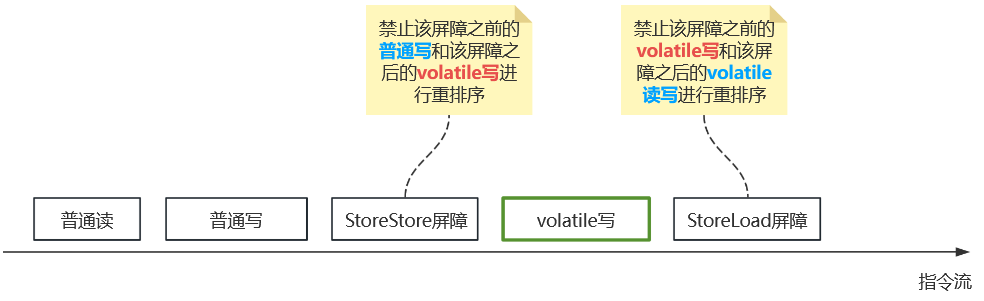  

7.volatile变量的读写过程  
JMM中定义了8种<font color="#00FF00">每个线程自已的工作内存与主物理内存之间的原子操作</font>  
<font color="#00FF00">read(读取)->load(加载)->use(使用)->assign(赋值)->store(存储)->write(写入)-></font><font color="#FF00FF">lock(锁定)->unlock(解锁)</font>  
  
*提示:上图从read作为第一步开始看起,主内存是主存(仅有一份),工作内存是线程私有的内存*  
<font color="#FF00FF">案例</font>:第一个线程从read开始从主存中读取变量,将变量load到工作内存,接着执行use指令便可以正常使用该变量使用CPU进行计算,此时第二个线程也从read开始将变量读取到工作内存,接着执行user指令正常使用该变量,接着该线程使用assign将变量更改并赋值给工作内存,最后store操作将变量回写到主存中;以上6条指令便可以保证单线程场景的可见性,对于多线程场景额外增加lock和unlock指令,所以在执行write操作执行必须先执行lock操作再执行write操作,write操作将最新的变量写回主存中后执行unlock操作解锁该变量,另外当执行lock操作的同时会清空第一个线程工作内存中该变量的值,此时线程一需要重新执行read操作,至此便完成了变量的可见性操作  

* read:作用于主内存,将变量的值从主内存传输到工作内存,主内存到工作内存
* load:作用于工作内存,将read从主内存传输的变量值放入工作内存变量副本中,即数据加载
* use:作用于工作内存,将工作内存变量副本的值传递给执行引擎,每当JVM遇到需要改变量的字节码指令时会执行该操作
* assign:作用于工作内存,将从执行引擎接受到的值复制给工作内存变量,每当JVM遇到一个给变量赋值字节码指令时会执行该操作
* store:作用于工作内存,将赋值完毕的工作变量的值写回给主内存
* write:作用于主内存,将store传输过来的变量值赋值给主内存中的变量
* lock:作用于主内存,将一个变量标记为一个线程独占的状态,只是写时候加锁,就只是锁了写变量的过程
* unlock:作用于主内存,一个处于锁定状态的变量释放,然后才能被其他线程占用

8.字节码层面是如何添加读写屏障的
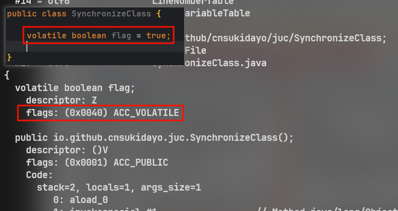  
可以看到被volatile修饰的变量会添加一个<font color="#FF00FF">ACC_VOLATILE</font>的flags标志,这样JVM在把字节码生成机器码的时候,判断如果操作变量的标识是ACC_VOLATILE时,就会按照JMM的规范在相应的位置插入内存屏障  

9.volatile为什么不能保证原子性  
  
*提示:实际上原理就是5.1节中提到的那段,第二个线程在第一个线程先回的过程中可能修改数据*  

对于volatile变量具备可见性,JVM只是保证从主存加载到线程工作内存的值是最新的,也<font color="#00FF00">仅是数据加载时是最新的</font>,但是多线程环境下,"数据计算"和"数据赋值"操作可能多次出现,若数据在加载之后,若主内存volatile修饰变量发生修改之后,线程工作内存中的操作将会作废去读主存最新值,操作出现写丢失问题.即<font color="#00FF00">各个线程私有内存和主存公共内存中变量不同步</font>,进而导致数据不一致,由此可见volatile解决的是变量读时的可见性问题,<font color="#FF00FF">但无法保证原子性,对于多线程修改内存共享变量的场景必须使用加锁同步</font>  

10.volatile使用场景  
只有在满足以下两条规则的场景下才推荐使用volatile  
* 运算结果并不依赖变量的当前值,或者能够确保只有单一的线程修改变量的值
* 变量不需要与其他的状态变量共同参与不变约束

*总结:volatile不适合参与到依赖当前值的运算,例如i += 1或者i++的场景,通常volatile用作保存某个<font color="#00FF00">状态</font>的boolean值或int值*  

### 5.3 禁止重排序
1.基本介绍
重排序是指编译器和处理器为了优化程序性能而对指令序列进行重排序的一种手段,有时候会改变程序语句的先后顺序,如果<font color="#00FF00">数据之间不存在依赖关系则可以重排序</font>,<font color="#FF00FF">存在数据依赖关系禁止重排序</font>,<font color="#00FF00">但指令重排序仅仅保证串行语义一致,没有义务在多线程场景下也保证语义一致</font>  
编写出的源代码会经过编辑器优化重排序、指令级并行重排序、内存系统的重排序  
* 编译器优化的重排序:编译器在不改变单线程串行语义的前提下,可以重新调整指令的执行顺序
* 指令级并行的重排序:处理器使用指令级并行技术来讲多条指令重叠执行,若不存在数据依赖性,处理器可以改变语句对应机器指令的执行顺序
* 内存系统的重排序:由于处理器使用缓存和读/写缓冲区,这使得加载和存储操作看上去可能是乱序执行

<font color="#00ccff">数据依赖:</font>若两个操作访问同一变量,且这两个操作中有一个为写操作,此时两操作间就存在数据依赖项  

### 5.4 正确使用volatile  
1.单一赋值场景推荐使用volatile,复合运算赋值不可用(例如:i++)

2.状态标志,判断业务是否结束

3.在读写联合的场景下,可以对变量加volatile,读方法作为普通方法(因为变量课件),写方法加锁(保证原子);从而以此来保证可见性
```java
volatile int a = 10;

public int read() {
  return this.a;
}

public synchronized void write() {
  this.a++;
}
```

4.双检加锁  
```java
public class DoubleCheck {
  private static DoubleCheck single;
  // 私有构造方法
  private DoubleCheck {

  }

  public static getInstance() {
    if(single == null){
      synchronized (DoubleCheck.this){
        if (single == null){
          // 多线程环境下,由于重排序,该对象可能还未初始化就被其它线程读取
          single = new DoubleCheck();
        }
      }
    }
    return single;
  }

}
```
*提示:上述这段经典的代码,理论上在不涉及重排序的前提下是没问题的,但这段代码一旦被重排序执行则会存在问题*  
在单线程环境下,指令的执行顺序如下  
```java
memory = allocate();      // 1分配对象的内存空间
ctorInstance(momory);     // 2初始化对象
instance = memory;        // 3设置instance指向刚分配的内存地址
```
但在多线程环境下,如果第2条和第3条指令重拍,后果就是其它线程得到的是null而不是完成初始化的对象,如下  
```java
momory = allocate();      // 1分配对象的内存空间
instance = momory;        // 3设置instance指向刚分配的内存地址,注意此时对象还没有被初始化
ctorInstance(momory);     // 2初始化对象
```

所以正确的执行方式应该如下:  
```java
public class DoubleCheck {
  // 加上volatile关键字即可
  private volatile static DoubleCheck single;
  // 私有构造方法
  private DoubleCheck {

  }

  public static getInstance() {
    if(single == null){
      synchronized (DoubleCheck.this){
        if (single == null){
          // 多线程环境下,由于重排序,该对象可能还未初始化就被其它线程读取
          single = new DoubleCheck();
        }
      }
    }
    return single;
  }
}
```

## 6.CAS  
**目录:**  
6.1 CAS基本介绍  
6.2 Unsafe类  
6.3 原子引用  

### 6.1 CAS基本介绍
1.CAS的使用  
没有CAS之前,多线程环境下不使用原子类保证线程安全操作i++,一般通过对变量加volatile关键字并对写操作加锁来实现  
```java
volatile int a = 10;

public int read() {
  return this.a;
}

public synchronized void write() {
  this.a++;
}
```
使用CAS之后,多线程环境下使用原子类保证线程安全操作i++,CAS类似于乐观锁,对于乐观锁和悲观锁强烈建议这里再看一下2.2悲观锁和乐观锁的知识点  
```java
AtomicInteger atomicInteger = new AtomicInteger();

public int getAtomicInteger() {
    return atomicInteger.get();
}

public void setAtomicInteger() {
    this.atomicInteger.getAndIncrement();
}
```

2.CAS基本介绍  
*提示:CAS的操作也可以见操作系统*
CAS全称为compare and swap,中文翻译为<font color="#00FF00">比较并交换 </font>,它包含三个操作数:内存位置、预期原值、更新值  
执行CAS操作时,将内存位置的值与预期原值进行比较:  
* 如果匹配,那么会将该内存值更新为<font color="#00FF00">更新值</font>
* 如果不匹配,<font color="#00FF00">处理器不做任何操作</font>,多个线程同时执行CAS操作只有一个会成功

大白话就是,CAS有三个操作数,<font color="#00FF00">内存位置偏移量V、旧的预期值A、要修改的更新值B</font>;当且仅当旧的预期值A和内存值V相同时,将内存值V修改为更新值B,否则什么也不做或重来,这种重试机制就被称为<font color="#FF00FF">自旋</font>

3.基本使用  
* `compareAndSet(int,int) return boolean` 比较并设置,如果当前AtomicInteger对象的值是args0则将当前AtomicInteger的值设置为agrs1,否则什么也不做;若修改成功改方法返回true,否则返回false
* `getAndIncrement() return int` 让当前原子类的int值自增,底层调用Unsafe类的`compareAndSetInt`的方法实现
* `get() return int` 返回当前AtomicInteger对象存储的值

4.硬件级别保证  
CAS是JDK提供的非阻塞原子性操作,它通过<font color="#00FF00">硬件保证</font>了比较-更新的原子性,它是非阻塞的且自身具有原子性  
CAS是一条CPU的原子指令(<font color="#00FF00">cmpxchg指令</font>),不会造成数据不一致问题,Unsafe提供的CAS方法(如compareAndSwapxxx)底层实现即为CPU的cmpxchg指令(汇编指令,X86指令集)  
执行cmpxchg指令的时候,会判断当前系统是否为多核系统,如果是就给<font color="#00FF00">总线</font>加锁,只有一个线程会对总线加锁成功,加锁成功之后会执行CAS操作,即<font color="#00FF00">CAS原子操作实际上是CPU实现独占的</font>,相较于synchronize的重量级锁,这里的互斥时间要短很多,所以在多线程环境下性能会更好  
`compareAndSet`方法的本质是通过调用Unsafe类的`compareAndSetInt`方法,`compareAndSetInt`方法是一个本地方法,<font color="#FF00FF">每个原子类的内部都通过调用`Unsafe.getUnsafe()`方法持有对Unsafe类的引用</font>  

### 6.2 Unsafe类
1.API介绍    
*提示:这里介绍的是jdk.internal.misc这个包下的Unsafe类,因为Unsafe不止一个,这个Unsafe类是JDK自已使用的,用户自已无法使用,用户使用的Unsafe类是sun.misc包下的,在该类中又组合了jdk.internal.misc.Unsafe类对象*  
* `compareAndSetInt(Object,long,int,int)` cas操作设置int值
  * agrs0:要对哪个原子类操作
  * args1:该原子类保存的变量的地址偏移量
  * args2:旧的预期值
  * args3:要修改的目标值
* `compareAndSetReference(Object,long,Object,Object)` 同理
* `compareAndSetLong(Object,long,long,long)` 同理
* `getAndAddInt(Object,long,int)` 在原子类已有值的基础上增加值,例如原本原子类的值是3,调用该方法传入args2为3,则代表要对该原子类的值加上3
  该方法内部会先调用getIntVolatile方法,读取原子类的原有值然后再调用`compareAndSetInt`方法将原子类变量的值设置为 原有值+agrs2
  * agrs0:要对哪个原子类操作
  * agrs1:该原子类保存的变量的地址偏移量
  * args2:增加多少值
  ```java
  public final int getAndAddInt(Object o, long offset, int delta) {
      int v;
      do {
          v = getIntVolatile(o, offset);
      } while (!weakCompareAndSetInt(o, offset, v, v + delta));
      return v;
  }
  ```
  这段源码十分有意思,首先会调用`getIntVolatile`方法,强制刷新主存可见地读到变量的值,并且这里是do-while循环,然后循环调用`weakCompareAndSetInt`方法,`weakCompareAndSetInt`的本质就是`compareAndSetInt`方法,如果更改不成功就重新读取最新值然后修改,<font color="#FF00FF">保证原子类值增长这步操作最终会完成</font>,这便是之前提到的<font color="#00FF00">自旋、乐观锁</font>的相关概念
* `objectFieldOffset1(Class<?>,String)` 得到一个类中变量的地址偏移量
  * args0:类对象
  * args1:args0指定的类对象中,要查询的变量的名称

2.Unsafe类介绍  
Unsafe是CAS的核心类,由于Java程序无法进行系统调用操作,故需要通过本地native方法来进行访问,Unsafe类就相当于一个后门,基于该类可以<font color="#FF00FF">直接操作特定内存的数据</font>,这也是为什么swap方法需要变量偏移量的原因,UnSafe类存在于sun.misc包中,其内部方法操作可以像C的<font color="#00FF00">指针</font>一样直接操作内存,因为Java中CAS操作的执行依赖于Unsafe类的方法,<font color="#00FF00">Unsafe类中的所有方法都是native修饰的,即Unsafe类中的方法都是直接调用操作系统底层资源执行相应任务</font>  

3.Unsafe.cpp  
Unsafe.java必然有其对应的Unsafe.cpp实现(存放在hotspot\src\share\vm\prims\Unsafe.cpp),CAS  
```c++
// 注意这里的几个参数unsafe、obj、offset、e、x都能和Java中Unsafe类的CompareAndSwapInt对上
UNSAFE_ENTRY(jboolean, Unsafe_CompareAndSwapInt(JNIEnv *env, jobject unsafe, jobject obj, jlong offset, jint e, jint x))
  // 包装了CompareAndSwapInt方法
  UnsafeWrapper("Unsafe_CompareAndSwapInt");
  // 调用JNIHandles类的resolve方法,解析出原子类对象
  oop p = JNIHandles::resolve(obj);
  // 根据原子类对象+偏移值,先拿到变量value在内存中的地址,保存在addr这个指针变量中
  jint* addr = (jint *) index_oop_from_field_offset_long(p, offset);
  // 调用Atomic中的函数cmpxchg来进行比较交换,其中参数x是新值 e是旧值
  // cas成功,返回旧值e,判断结果等于e则本方法返回true
  // cas失败,返回内存中的值,判断结果不等于e则本方法返回false
  return (jint)(Atomic::cmpxchg(x, addr, e)) == e;
UNSAFE_END
```

4.cmpxchg方法  
c++中Atomic类的cmpxchg方法定义如下  
```c++
unsigned Atomic::cmpxchg(unsigned int exchange_value,volatile unsigned int* dest,unsigned int compare_value) {
  assert(sizeof(unsigned int) == sizeof(jint),"more work to do");
  // 根据操作系统类型调用不同平台下的重载函数,这个在预编译期间编译器会决定调用哪个平台下的重载函数
  return (unsigned int)Atomic::cmpxchg((jint)exchange_value,(volatile jint*)dest,(jint)compare_value);
}
```

在Windows10下cmpxchg的重载方法如下  
```c++
inline jint Atomic::cmpxchg(jint exchange_value,volatile jint* dest,jint compare_value) {
  // 判断是否为多核CPU,这个地方应该是系统调用
  int mp = os::is_MP();
  // 内联汇编
  __asm{
    // 三个move指令表示的是将后面的值移动到前面的寄存器上
    mov edx,dest
    mov ecx.exchange_value
    mov eax,compare_value
    // CPU 原语级别,CPU触发;实际上还是加了一把总线层面的锁
    LOCK_IF_MP(mp)
    // 比较并交换指令
    // cmpxchg:即"比较并交换指令",汇编层面
    // dword:全称是double word表示两个字,一共四个字节
    // ptr:全称是pointer,与前面的dword连起来使用,表明访问的内存单元是一个双字单元
    // 将eax寄存器中的值(compare_value)与[edx]双字内存单元中的值进行对比 
    cmpxchg dword ptr [edx],ecx
  }
}
```

### 6.3 原子引用 
1.原子类型  
除了类似AtomicInteger、AtomicBoolean等基本数据类型的原子类型外,还可以自定义原子类型,为此JDK设计了原子引用类AtomicReference  


**附录:**  
A.Java并发编程实战  
B.线程基础知识  


## A.Java并发编程实战
**目录:**  
1.各种demo  


### 1.各种demo
`demo1:`  
```java
public class Demo1 {
    private int count;
    // object指向堆内存当中的一个对象
    Object object = new Object();	
    public void m(){
        synchronized (object){
            count++;
            System.out.println(count);
        }
    }
}
```

**解释:**  
当第一个线程访问m方法时,通过synchronized关键字会对<font color="#00FF00">堆内存中的Object对象</font>,加上一把锁(锁信息记录在堆内存的对象中,如果此时object指向别的对象,那么锁的对象就改变了(你想想如果原先的对象不再被引用就会被回收,新的对象再被加锁,所以锁所在的对象也就改变了)),然后进行方法的访问,此时正好运行到count++;语句结束时  
第二个线程需要调用该方法,synchronized需要再次对堆内存中的Object对象加锁,但是此时由于第一个线程还在对该方法的访问中(没有释放锁)所以第二个线程就会进行等待,直到第一个线程释放锁,第二个线程才有资格加锁访问方法,如果有第三个线程也是一样的.  
只要一个线程在访问加锁,别的线程不能访问的就称之为<font color="#00FF00">互斥锁</font>  

`demo2:`  
```java
public class Demo2 {
    private int count = 100;
    public void m(){
        synchronized (this){
            count++;
            System.out.println(count);
        }
    }
}
```
例子1方法的问题是,Object对象是被手动创建的,除了当锁别的什么也不干有些浪费.  
这种锁法在于,如果你需要调用m方法势必要创建这个对象才能调用,这里的this直接指向自身,会给当前本身的这个在堆内存当中的对象添加一把锁.所以synchronized根本不是锁什么代码块,synchronized就是锁一个对象.  
如果一个方法在开始的时候就synchronized(this)(一定是this)直到结束的时候才释放锁,那么有一种等价的写法;如下:  
```java
public class Demo2 {
    private int count = 100;
    public synchronized void m(){
            count++;
            System.out.println(count);

    }
}
```

`demo3:`  
```java
public class Demo4 {
    private static int count = 100;
    public static void m(){
        synchronized (Demo4.class){
            count++;
            System.out.println(count);
        }
    }
}
```
之前说的锁都是锁住<font color="#00FF00">堆内存当中的对象</font>,但是一个类的静态方法是不需要new就可以访问的,所以你就没有办法在堆内存中给这个对象加上锁了.  
不过你可以通过 **对象.class** 来锁住一个Class对象,也能起到同样的效果.(对象.class本质也是一个存放在堆内存中的对象,所以synchronized锁住的还是一个对象)  

`demo4:`模拟多线程访问同一个对象的run方法  
```java
public class Demo5 implements Runnable{
    private int count = 10;
    /**
     * run()方法的本质就是将count--;并打印内容
     */
    @Override
    public void run() {
        count--;
        System.out.print(count);
    }

    public static void main(String[] args) {
        Demo5 demo5 = new Demo5();			//这里只创建了一个对象
        for (int i = 0; i < 5; i++) {
            new Thread(demo5).start();		//通过这一个对象创建了5个线程,同时去访问count变量
        }
    }
}
```

**正常的结果:**  
76958 顺序原因是由于CPU的调度你不知道先进行那个线程

**错误(实际)的打印结果可能是:**  
86679  
*每次执行的结果都可能不一样*

**分析:**  
主要是因为运算方法和打印方法分开执行(或者说是两个方法被执行的时间不确定)  
分析86679产生的原因:  
一共五个线程,当第一个线程进入方法运行到count--时,此时值变成9,但是由于执行打印方法不够快(没有无间隙执行打印命令),导致第二个线程进来了并且执行count--,此时值变成8,此时第一个线程(也有可能是第二个线程)执行打印语句,但此时值已经变成8,输出就是8.  
一个线程的执行过程中(方法没有完全执行完毕就算执行过程)被另外一个线程打断了,就称之为线程重路.  

**加上synchronized:**  
```java
public class Demo5 implements Runnable{
    private int count = 10;

    /**
     * run()方法的本质就是将count--
     */
    @Override
    public synchronized void run() {
        count--;
        System.out.print(count);
    }

    public static void main(String[] args) {
            Demo5 demo5 = new Demo5();
            for (int i = 0; i < 5; i++) {
                new Thread(demo5).start();
            }
    }
}
```
**此时输出的结果一定是98765**  

`demo5:`  
**结论:**  
在同一个类,在一个synchronized的方法执行中,非synchronized方法也是可以执行的.因为非synchronized没被锁.  

`demo6:`脏读问题  
```java
public class Account {
    String name;
    double salary;

    public synchronized void set(String name, double salary) {
        this.name = name;
        try {
            Thread.sleep(2000);
        } catch (InterruptedException e) {
            e.printStackTrace();
        }
        this.salary = salary;
    }
    public double getSalary(String name){
        return this.salary;
    }

    public static void main(String[] args) {
        Account account = new Account();
        new Thread(()->account.set("张三",100)).start();	//创建一个线程,并设置属性
        System.out.println(account.getSalary("张三"));

        try {
            Thread.sleep(3000);
        } catch (InterruptedException e) {
            e.printStackTrace();
        }
        System.out.println(account.getSalary("张三"));
    }
}
```
**代码结果分析:**  
目前这里只对写入数据添加了同步锁,但没有对读取数据添加同步锁,根据上述知识可知同步方法和非同步方法可以同时执行.  
| 提示 | 实际打印结果 | 理想的打印结果 |
|:----:|:------------:|:--------------:|
|      |     0.0      |     100.0      |
|      |    100.0     |     100.0      |

**出现错误结果的原因:脏读**  
由于写和读是两个线程操控的,当我代码执行到this.name=name;的时候就有可能被另外一个线程打断,去执行读的方法,显然此时写数据还没写完就会读到0.这个0可以理解为读到了还没有提交的数据(过时的数据),也就是脏读.  
但这不绝对,这主要取决你你的业务逻辑,如果你的业务就是支持脏读的,你不需要对读方法加锁(同时也会增加性能).哪个方法加锁哪个不加锁完全也是根据你的业务逻辑来的,所以你要考虑清楚.  

`demo7:`锁的可重入  
```java
public class Demo7 {
    public synchronized void m1() {
        System.out.println("m1");
        m2();
    }

    public synchronized void m2() {
        System.out.println("m2");
    }

    public static void main(String[] args) {
        new Demo6().m1();
    }
}
```
**代码说明:**  
在同一个线程当中(一定是同一个线程),m1和m2方法都锁住同一个对象.并且m1方法在执行的过程中调用了m2方法.  

**结果:**  
```shell
m1
m2
```

**原因分析:**  
当运行m1方法时,会给当前对象加上一把锁,然后m1方法体又去执行了m2方法,但是m2又需要当前对象的锁.貌似不太合适  
但是由于在同一个线程当中如果后面的方法要加的锁是当前锁的对象,那么就没有问题.  
注意一定是同一个线程.这种情况称之为锁的<font color="#00FF00">可重入</font>.  

`demo8:`死锁  
**产生原因:**  
*可以从操作系统的层面说明死锁产生的四个必要条件*  
* 互斥条件:进程对所分配到的资源进行排他性使用,即在一段时间内,某资源只能被一个进程占用.如果此时还有其他进程请求该资源,则请求进程只能等待,死锁就不会发生.  
* 请求和保持条件:进程已经占有了至少一个资源,但又提出了新的资源请求,而该被请求的资源以被其它进程占有,此时请求进程被阻塞,同时其对自已的资源保持不放.  
* 不可抢占条件:进程已获得的资源在未使用完之前不能抢占,只能在进程使用完时由其自已释放.  
* 循环等待条件:该条件指发生死锁时,必然存在一个"进程-资源"循环链,即进程集合{P0、P1、P2...Pn}中的P0正在等待已被P1占用的资源,P1正在等待已被P2占用的资源,......,Pn正在等待以被P0占用的资源

*从JVM层面说明死锁产生的条件*  
发生在多个线程中,如果现在有两个(多个)线程,第一个线程先锁住A对象,再锁住B对象.第二个线程先锁住B对象,再锁住A对象.  
当第一个线程锁完A,第二个线程锁完B时.如果第一个线程要锁B就要等待第二个线程释放B锁,但第二个线程释放B锁的前提是代码执行结束,要代码执行结束就需要锁A锁,此时第一个和第二个线程都无法释放锁造成死锁.  

```java
public class Demo8 {
    Object o1 = new Object();
    Object o2 = new Object();

    public void m1() {
        synchronized (o1) {
            try {
                Thread.sleep(300);
            } catch (InterruptedException e) {
                e.printStackTrace();
            }
            synchronized (o2) {
                System.out.println("m1");
            }
        }
    }

    public void m2() {
        synchronized (o2) {
            try {
                Thread.sleep(500);
            } catch (InterruptedException e) {
                e.printStackTrace();
            }
            synchronized (o1) {
                System.out.println("m2");
            }
        }
    }

    public static void main(String[] args) {
        Demo7 demo7 = new Demo7();
        new Thread(() -> {		//对同一对象产生两个线程.
            demo7.m1();
        }).start();
        new Thread(() -> {
            demo7.m2();
        }).start();

    }
}
```

`demo9:`通过父类实现锁可重入  
```java
public class Demo9 {
    public synchronized void m(){
        System.out.println("father");
    }

    public static void main(String[] args) {
        new Deom8Children().m();
    }
}

class Deom8Children extends Demo9 {
    public synchronized void m(){
        System.out.println("Children");
        super.m();
    }
}
```

**打印结果:**  
```
children
father
```

**原因:**  
还是同一个线程中的原因.注意这里锁定的是同一个对象  

`demo10:`  
**知识点:**  
程序在执行过程中,如果出现异常,默认情况锁会被释放  
所以在并发处理的过程中,有异常要多加小心,不然可能会发生不一致的情况  

```java
public class Demo9 {
    public synchronized void t1() {
        int i = 0;
        while (true) {
            try {
                Thread.sleep(1000);
            } catch (InterruptedException e) {
                e.printStackTrace();
            }
            System.out.println("tOne" + i);
            i++;
            if (i == 5) {		//当i增加到5的时候抛出异常
                i = 1 / 0;
            }
        }
    }

    public synchronized void t2() {
        System.out.println("t2start");
    }

    public static void main(String[] args) {
        Demo9 demo9 = new Demo9();
        new Thread(()->demo9.t1()).start();
        try {
            Thread.sleep(1000);
        } catch (InterruptedException e) {
            e.printStackTrace();
        }
        new Thread(()->demo9.t2()).start();		//一旦t1抛出异常,t2立即获得该锁
    }
}
```

**代码说明:**  
此时如果有一份资源,被多个线程访问,如果获得那把锁的线程(第一个线程)数据处理到一半时发生了异常,如果不处理异常(使用异常抛出),直接释放锁.那么紧接着获得这把锁的线程访问到的数据将是你处理到一半的错误数据.  

**打印结果:**  
```shell
tOne0
tOne1
tOne2
tOne3
tOne4
t2start
```

`demo11`:volatile关键字  
**作用:**  
volatile关键字使一个变量在多个线程间可见  

```java
public class Demo11 {
    private boolean running = true;
    public void m(){				
        System.out.println("mStart");
        while (running){			//死循环方法
        }
        System.out.println("mEnd");
    }

    public static void main(String[] args) {
        Demo11 demo11 = new Demo11();
        new Thread(()->demo11.m()).start();
        try {
            Thread.sleep(500);
        } catch (InterruptedException e) {
            e.printStackTrace();
        }
        demo11.running=false;
    }
}
```

**解决办法:** 加上volatile关键字  
加上这个关键字并不代表,线程每次运行都会去读取主内存中的内容,而是当被加关键字的属性发生改变时,会通知所有的线程数据(缓冲区数据)已经过期,需要重新读取.  
```java
public class Demo11 {
    private volatile boolean running = true;		//加上关键字
    public void m(){
        System.out.println("mStart");
        while (running){
        }
        System.out.println("mEnd");
    }

    public static void main(String[] args) {
        Demo11 demo11 = new Demo11();
        new Thread(()->demo11.m()).start();
        try {
            Thread.sleep(500);
        } catch (InterruptedException e) {
            e.printStackTrace();
        }
        demo11.running=false;
    }
}
```
*注意:*  
如果这里的死循环不是一个空循环,而是中间存在一些语句,那么就不会出现上面所说的那种情况(设置false无效).  
*原因:*  
如果你的循环里面有一些sleep语句打印语句之类的,可能执行的时候会使CPU空出时间,从而CPU回去读取主内存的数据.(很模糊,原因比较复杂)  
*另外:*  
如果这个方法加上了线程同步synchronized也不会出现这样的问题.但是使用volatile的效率要比synchronized高很多.但是volatile不能代替synchronized,因为volatile只有可见性,而synchronized既有可见性又有原子性.  

`demo12:`  
```java
public class Demo12 {
    volatile int count = 0;
    public void m (){
        for (int i = 0; i < 1000; i++) {
            count++;
        }
    }

    public static void main(String[] args) {
        Demo12 demo12 = new Demo12();
        List<Thread> list = new ArrayList<>();
        for (int i = 0; i < 10; i++) {
            list.add(new Thread(()->demo12.m()));//创建十个线程对象
        }
        list.forEach((t)->t.start());//遍历容器启动线程
        list.forEach((t)-> {
            try {
                t.join();//保证当前的每个线程执行完毕后才执行下一线程
            } catch (InterruptedException e) {
                e.printStackTrace();
            }
        });
        try {
            Thread.sleep(3000);//保证线程代码运行结束
        } catch (InterruptedException e) {
            e.printStackTrace();
        }
        System.out.println(demo11.count);
    }
}
```
理想的打印情况:10000  
实际的打印情况:小于10000  

**原因:**  
主要还是因为volatile虽然读可见,但是写不可见.  
当第一个线程从主内存中读取到数据为100,放到缓冲区进行自增为101,但还没有写给主内存的时候.第二个线程从主内存读取数据也为100,同样放到缓冲区进行自增为101,并提交数据给主内存,此时主内存count为101.第二个线程提交结束后第一个线程紧接着提交数据也为101.此时虽然是增加了两次数据但写出的时候是以覆盖的形式写出的.  

**volatile和synchronized的区别:**  
* volatile:效率较高,只保证可见性.
* synchronized:效率较低,保证可见性和原子性.  

如果只需要保证可见性的时候使用volatile.

**解决方法:**  
为m方法增加synchronized,删除volatile(没必要在存在了)  

`demo13:`
如果你只是进行一些++这种简单的运算,可以使用Atomic家族类(不同的类型类名不同)  
```java
public class Demo13 {
    AtomicInteger count = new AtomicInteger(0);		//AtomicInteger针对Integer类型,构造方法丢入默认值
    public void m() {
        for (int i = 0; i < 1000; i++) {
            count.incrementAndGet();		//相当于自增操作
        }	
    }

    public static void main(String[] args) {
        Demo13 demo13 = new Demo13();
        List<Thread> list = new ArrayList<>();
        for (int i = 0; i < 10; i++) {
            list.add(new Thread(() -> demo13.m()));
        }
        list.forEach((t) -> t.start());
        list.forEach((t) -> {
            try {
                t.join();
            } catch (InterruptedException e) {
                e.printStackTrace();
            }
        });
        System.out.println(demo13.count);
    }
}
```
**特性:**  
Atomic家族类的方法都是具有原子性的,但用的不是synchronized而是非常底层的东西,所以效率比较高.  

**问题:**  
但是Atomic类的多个方法之间并不构成原子性  
```java
public class Demo13 {
    AtomicInteger count = new AtomicInteger(0);
    public void m() {
        for (int i = 0; i < 1000; i++) {
            int temp = count.incrementAndGet();// 1
            count.set(temp);                   // 2
        }
    }

    public static void main(String[] args) {
        Demo13 demo13 = new Demo13();
        List<Thread> list = new ArrayList<>();
        for (int i = 0; i < 10; i++) {
            list.add(new Thread(() -> demo13.m()));
        }
        list.forEach((t) -> t.start());
        list.forEach((t) -> {
            try {
                t.join();
            } catch (InterruptedException e) {
                e.printStackTrace();
            }
        });
        System.out.println(demo13.count);
    }
}
```
**原因:**  
有点类似之前的情况,方法1和方法2之间不是顺序执行的.  
第一个线程执行到1步骤时,增加到了101,还没有执行步骤2时.线程2进来了将数据增加到102后,并运行步骤2设置值为102.此时线程一继续执行步骤2将值设置为101.  

`demo14:`关于synchronized优化问题  
**结论:**  
同步代码块中的语句越少越好

```java
public class Demo13 {
    int count = 0;

    public synchronized void m1() {
        count++;
        System.out.println(count);
    }

    public void m2() {
        synchronized (this) {
            count++;
        }
        System.out.println(count);
    }
}
```

比较m1和m2方法:  
m1的锁将整个方法全部锁定  
m2只在业务逻辑里面增加了同步锁,所以m2的效率比m1要高.  
细力度的锁  

`demo15:`永远不要锁一个字符串对象  
```java
public class Demo14 {
    String s1 = "String";
    String s2 = "String";

    public void m1() {
        synchronized (s1) {
        }
    }

    public void m2() {
        synchronized (s2) {
        }
    }
}
```
你以为m1和m2方法锁定的是两个不同的对象,但实际上s1和s2锁定的是同一个对象.  
原因:分析jvm内存  
栈内存中的s1和s2指向堆内存中的两个对象,因为是字符串常量,所以堆内存中的两个对象又指向堆中的字符串常量池(又因为内容相同,所以指向同一个字符串常量),所以这两个是同一个对象.

`demo16:`曾经淘宝面试题  
有一个容器,A线程负责给容器添加10个元素.B线程负责监视这个容器直到容器大小为5的时候打印一个通知.  

写法一:  
```java
public class Demo15 {
    volatile List list = new ArrayList<>();

    public void add(Object o) {
        list.add(o);
    }

    public int size() {
        return list.size();
    }

    public static void main(String[] args) {
        Demo15 demo15 = new Demo15();
        new Thread(() -> {
            while (true) {
                if (demo15.size() == 5) {
                    System.out.println("数量达到5");
                    break;
                }
            }
        }).start();
        new Thread(() -> {
            for (int i = 0; i < 10; i++) {
                demo15.add(i);
            }
        }).start();
    }
}
```
**问题:**  
使用while(true)太浪费资源,并且线程二的监测不是那么的精准.

**思路:**  
使用wait和notify以及notifyAll  
wait和notify的用法:javaSE中有讲到过  
这两个方法只能是被锁定对象去调用.  
wait:当一个线程的方法获已经得到锁,但是条件没有满足无法执行语句的时候,调用被锁的对象的wait方法,可以暂停该线程,并释放锁.  
notify:调用一个被锁住对象的notify方法,会唤醒正在这个对象上等待的某一个线程.继续执行调用wait方法后面的代码,不是重新进方法.  
但是nofity方法不会释放锁,而且被唤醒的线程需要重新获得锁.  
notifyAll:和notify类似,只不过会唤醒这个对象的所有线程.  

写法二:  
```java
public class Demo15 {
    volatile List list = new ArrayList<>();
    boolean flag = true;
    public synchronized void add(Object o) {
        if(flag){
            try {
                this.wait();
            } catch (InterruptedException e) {
                e.printStackTrace();
            }
        }
        System.out.println("add");
        list.add(o);
        flag=true;
        this.notify();
    }

    public synchronized int size() {
        if(!flag){
            try {
                this.wait();
            } catch (InterruptedException e) {
                e.printStackTrace();
            }
        }
        System.out.println("size");
        flag=false;
        this.notify();
        return list.size();
    }

    public static void main(String[] args) {
        Demo15 demo15 = new Demo15();
        new Thread(() -> {
            while (true) {
                if (demo15.size() == 5) {
                    System.out.println("数量达到5");
                    break;
                }
            }
        }).start();
        new Thread(() -> {
            for (int i = 0; i < 10; i++) {
                demo15.add(i);
            }
        }).start();
    }
}
```

**问题:**  
还是需要while(true),而且当线程一结束之后,线程二就会wait造成算法无法结束.

写法三:  
```java
public class Demo16 {
    volatile List list = new ArrayList<>();

    public void add(Object o) {
        list.add(o);
    }

    public int size() {
        return list.size();
    }

    public static void main(String[] args) {
        Demo16 demo15 = new Demo16();
        new Thread(() -> {
            synchronized (demo15){
                System.out.println("线程开头");
                if (demo15.size() != 5) {
                    try {
                        demo15.wait();
                    } catch (InterruptedException e) {
                        e.printStackTrace();
                    }
                }
                System.out.println("数量达到5");
            }

        }).start();
        new Thread(() -> {
            synchronized (demo15){
                for (int i = 0; i < 10; i++) {
                    demo15.add(i);
                    if(demo15.size()==5){
                        demo15.notify();
                    }
                    System.out.println(demo15.size());
                    try {
                        Thread.sleep(500);
                    } catch (InterruptedException e) {
                        e.printStackTrace();
                    }
                }
            }
        }).start();
    }
}
```
**输出结果:**  
| 线程开头 |  1  |  2  |  3  |  4  |  5  |  6  |  7  |  8  |  9  | 10  | 数量5 |
|:--------:|:---:|:---:|:---:|:---:|:---:|:---:|:---:|:---:|:---:|:---:|:-----:|

**原因:**  
当数量达到5的时候,线程一虽然被唤醒了,但是需要重新获得这把锁.由于notify方法不会释放锁,所以需要等待线程二方法执行完毕线程一才可以获得锁.

写法四:  
```java
public class Demo16 {
    volatile List list = new ArrayList<>();
    boolean flag = true;

    public void add(Object o) {
        list.add(o);
    }

    public int size() {
        return list.size();
    }

    public static void main(String[] args) {
        Demo16 demo15 = new Demo16();
        new Thread(() -> {
            synchronized (demo15) {
                if (demo15.size() != 5) {
                    try {
                        demo15.wait();
                    } catch (InterruptedException e) {
                        e.printStackTrace();
                    }
                }
                System.out.println("数量达到5");
                demo15.notify();
            }

        }).start();
        new Thread(() -> {
            synchronized (demo15) {
                for (int i = 0; i < 10; i++) {
                    demo15.add(i);
                    System.out.println(demo15.size());
                    if (demo15.size() == 5) {
                        demo15.notify();
                        try {
                            demo15.wait();
                        } catch (InterruptedException e) {
                            e.printStackTrace();
                        }
                    }
                }
            }
        }).start();
    }
}
```

**输出结果:**  
| 线程开头 |  1  |  2  |  3  |  4  |  5  | 数量5 |  6  |  7  |  8  |  9  | 10  |
|:--------:|:---:|:---:|:---:|:---:|:---:|:-----:|:---:|:---:|:---:|:---:|:---:|

**原因:**  
正是因为notify不会释放锁,所以调用完notify在调用wait方法释放锁,所以这里wait不是用于暂停线程的,而是用于释放锁的.  

写法五:使用门栓  
```java
public class Demo17 {
    volatile List list = new ArrayList<>();

    public void add(Object o) {
        list.add(o);
    }

    public int size() {
        return list.size();
    }

    public static void main(String[] args) {
        Demo17 demo15 = new Demo17();
        CountDownLatch latch = new CountDownLatch(1);
        new Thread(() -> {
            System.out.println("线程一启动");
            if(demo15.size()!=5){
                try {
                    latch.await();//直到调用latch.countDown();方法否则方法暂停在这
                } catch (InterruptedException e) {
                    e.printStackTrace();
                }
                System.out.println("数量达到5");
            }
        }).start();
        new Thread(() -> {
            for (int i = 0; i <10 ; i++) {
                demo15.add(i);
                System.out.println(demo15.size());
                if(demo15.size()==5){
                    latch.countDown();			//门栓打开
                }
            }

        }).start();
    }
}
```
**问题:**  
有时结果输出正确,有时不正确.只能保证线程一会执行,但不能保证顺序.

**优点:**  
效率高(没有同步快)  

`demo17:`ReentrantLock  
**介绍:**  
ReentrantLock用于替代`synchronized`  
ReentrantLock实现了<font color="#FF00FF">Lock</font>接口
```java
public class Demo18 {
    Lock lock = new ReentrantLock();

    public void m1() {
        lock.lock();					//锁住
        try {
            for (int i = 0; i < 10; i++) {
                System.out.println(i);
                Thread.sleep(1000);
            }
        } catch (InterruptedException e) {
            e.printStackTrace();
        } finally {
            lock.unlock();				//在finally中手动释放锁
        }
    }

    public void m2() {
        lock.lock();
        System.out.println("m2");
        lock.unlock();
    }

    public static void main(String[] args) {
        Demo18 demo18 = new Demo18();
        new Thread(() -> demo18.m1()).start();
        try {
            Thread.sleep(1000);
        } catch (InterruptedException e) {
            e.printStackTrace();
        }
        new Thread(() -> demo18.m2()).start();
    }

}
```
**注意:**  
必须要手动释放锁,使用synchronized锁定如果遇到异常,jvm会自动释放,但是lock必须手动释放锁,因此经常在finally中进行锁的释放  

`demo18:`  
可以通过ReentrantLock的tryLock方法进行尝试性的加锁,这个方法会返回一个布尔值.你可以根据这个返回值来进行你想要的操作.比如返回值为false不可锁定我可能会执行别的方法而不是像synchronized那样只能干等着.  
```java
public class Demo19 {
    Lock lock = new ReentrantLock();

    public void m1() {
        lock.lock();
        try {
            for (int i = 0; i < 10; i++) {
                System.out.println(i);
                Thread.sleep(1000);
            }
        } catch (InterruptedException e) {
            e.printStackTrace();
        } finally {
            lock.unlock();
        }
    }

    public void m2() {
        boolean locked = false;
        try {
            /*
            另外一种用法
            参数一:锁定的时间	
            参数二:锁定时间的单位	
            这是个阻塞方法,就是如果这么长时间还不能获得到这把锁就返回false,一旦可以锁定就返回true
            */
            locked = lock.tryLock(5, TimeUnit.SECONDS);			
            System.out.println("m2方法是否可以锁定");
        } catch (InterruptedException e) {
            e.printStackTrace();
        }finally {
            if(locked){			//如果已经锁定
                lock.lock();		//释放锁
            }
        }

    }

    public static void main(String[] args) {
        Demo19 demo18 = new Demo19();
        new Thread(() -> demo18.m1()).start();
        try {
            Thread.sleep(1000);
        } catch (InterruptedException e) {
            e.printStackTrace();
        }
        new Thread(() -> demo18.m2()).start();
    }

}
```
 
`demo19:`  
使用ReentrantLock还可以调用lockInterruptibly方法,可以对线程interrupt做出响应.
```java
public class Demo19 {
    public static void main(String[] args) {
        Lock lock = new ReentrantLock();
        new Thread(() -> {
            lock.lock();
            System.out.println("线程1");
            try {
                Thread.sleep(Integer.MAX_VALUE);		//谁很长时间
            } catch (InterruptedException e) {
                e.printStackTrace();
            } finally {
                lock.unlock();
            }
        }).start();

        Thread thread = new Thread(() -> {
            boolean locked = false;
            try {
                lock.lockInterruptibly();//这种锁可以对interrupt方法做出响应
                System.out.println("线程2");
                locked = true;		//只有进入到该方法才能证明执行成功,因为如果出现异常会直接跳到catch里面
            } catch (InterruptedException e) {
                System.out.println("线程2被打断");
            } finally {
                if (locked) {
                    lock.unlock();
                }
            }
        });
        thread.start();
        try {
            Thread.sleep(2000);
        } catch (InterruptedException e) {
            e.printStackTrace();
        }
        thread.interrupt();     //打断线程二的等待,如果被打断会直接抛出异常
    }
}
```
**结果:**  
线程1  
线程2被打断  

`demo20:`  
ReentrantLock还可以指定公平锁.所谓的公平锁就是哪个线程等待的时间长,哪个线程就能的到这把锁.  
synchronized是非公平锁:如果有多个线程需要访问同一个方法,当一个线程拿到锁之后别的线程就需要等待,当拿到锁的线程释放锁的时候,根据CPU的调度问题,你指不定是哪个线程能拿到那把锁.就算一个线程等了很长时间,一个线程等了很短的时间,但有可能拿到这把锁的是那个等了不短不长的那个线程.相比于公平锁,synchronized的效率要高因为不需要计算那个线程等待的时间长.  
**公平锁:**  
`Lock lock = new ReentrantLock(true);`  
//构造参数为true就代表公平锁,如果没有设置就是非公平锁.公平锁效率低于非公平锁.

**非公平锁:**  
```java
public class Demo20 {
    Lock lock = new ReentrantLock();

    public void m() {
        for (int i = 0; i < 100; i++) {
            lock.lock();
            System.out.println(Thread.currentThread().getName());
            lock.unlock();		//循环一次就重新锁
        }
    }

    public static void main(String[] args) {
        Demo20 demo20 = new Demo20();
        new Thread(()->demo20.m(),"线程1").start();
        new Thread(()->demo20.m(),"线程2").start();
    }
}
```
**打印结果:**  
112111222211  
总之就是没有规律,不知道给哪个线程锁

**公平锁:**  
111 2121212121 222  
给一下线程1给一下线程2.很公平前面的111是因为线程一执行的太快了  

`demo21:`  
**面试题:**  
写一个固定容量同步容器,拥有put和get方法,以及getCount方法.能够支持两个生产者线程以及10个消费者线程的阻塞调用.使用wait和notify/notifyAll  
何为同步容器?如果你的容器满了那么put方法就必须等待,如果你的容器空了,那么get方法就必须等待.  
写法一:使用wait和notify  
```java
public class Demo21 {
    private LinkedList list = new LinkedList();
    private final int MAX = 10;
    int count = 0;

    public synchronized void put(Object o) {
        while (list.size() == MAX) {           //为什么是while不是if?
            /*
            在effective java中说到wait基本上就是和while使用而不是if
            原因:
             */
            try {
                this.wait();
            } catch (InterruptedException e) {
                e.printStackTrace();
            }
        }

        list.add(o);
        count++;
        this.notifyAll();		// 在effective java中说到永远你要使用nofityAll不要使用notify
    }

    public synchronized Object get() {
        Object o = null;
        while (list.size() == 0) {
            try {
                this.wait();
            } catch (InterruptedException e) {
                e.printStackTrace();
            }
        }

        o = list.removeFirst();
        count--;
        this.notifyAll();
        return o;
    }

    public static void main(String[] args) {
        Demo21 demo21 = new Demo21();
        for (int i = 0; i < 10; i++) {
            new Thread(() -> {
                for (int j = 0; j < 5; j++) {
                    System.out.println(demo21.get());
                }
            },"c"+i).start();
        }
        for (int i = 0; i < 2; i++) {
            new Thread(() -> {
                for (int j = 0; j < 25; j++) {
                    demo21.put(Thread.currentThread().getName()+" "+j);
                }
            }).start();
        }

    }

}
```
为什么是while不是if?  
如果现在容器元素是10个,第一个生产者线程会调用wait方法释放锁,第二个生产者线程也会调用wait释放锁.此时消费者线程将10消费成9,并通过notifyAll同时唤醒了两个生产者线程.被唤醒的线程需要重新获得当前对象的锁(假定这里就是生产者的某一个获得了锁,而不是消费者获得锁),但你不知道这两个线程是哪个线程会得到锁,如果这里使用的是if,假如此时线程1得到锁,那么他会顺着wait后面的语句继续执行,添加一个元素并唤醒所有等待的线程(注意此时消费者没有线程wait只是得不到这把搜所以无法执行get的代码),线程一执行完毕会释放锁,如果下一次还是线程一得到这把锁,那么由于此时的size是10所以线程一会被wait,wait释放锁恰巧被生产者的线程二获得这把锁,由于线程是被唤醒的所以会执行wait后面的代码,此时添加一个元素size就变成了10.  
如果使用while,主要的区别就是生产者线程二被唤醒之后且拿到这把锁之后的区别:wait释放锁恰巧被生产者的线程二获得这把锁(前面的和上面一样),虽然线程是被唤醒的,但是由于while语句的特性,上一次执行wait语句的时候说明while里面的判断条件是true,既然是true 执行wait后的代码就需要再循环一次,再循环一次的时候发现size已经变成10了,所以生产者线程二再次wait.  

写法二:使用Lock和Condition  
```java

public class Demo22 {
    private LinkedList list = new LinkedList();
    private final int MAX = 10;
    int count = 0;

    private Lock lock = new ReentrantLock();
    private Condition producer = lock.newCondition();			//生产者线程
    private Condition consumer = lock.newCondition();			//消费者线程

    public void put(Object o) {
        lock.lock();
        try {
            while (list.size() == MAX) {           //为什么是while不是if?
                producer.await();      //调用await而不是wait,因为wait是针对被锁的对象的方法
            }
            list.add(o);
            count++;
            consumer.signalAll();   //唤醒所有消费者线程
        } catch (InterruptedException e) {
            e.printStackTrace();
        } finally {
            lock.unlock();
        }
    }

    public Object get() {
        lock.lock();
        Object o = null;
        try {
            while (list.size() == 0) {
                consumer.await();
            }
            o = list.removeFirst();
            count--;
            producer.signalAll();
        } catch (InterruptedException e) {
            e.printStackTrace();
        } finally {
            lock.unlock();
        }
        return o;
    }

    public static void main(String[] args) {
        Demo22 demo21 = new Demo22();
        for (int i = 0; i < 10; i++) {
            new Thread(() -> {
                for (int j = 0; j < 5; j++) {
                    System.out.println(demo21.get());
                }
            },"c"+i).start();
        }
        for (int i = 0; i < 2; i++) {
            new Thread(() -> {
                for (int j = 0; j < 25; j++) {
                    demo21.put(Thread.currentThread().getName()+" "+j);
                }
            }).start();
        }

    }

}
```
使用这种方法的好处是:  
你可以指定唤醒哪个阵营的线程(是消费者还是生产者)而不是用notifyAll一次性唤醒所有的线程(消费者和生产者线程).  
关于指定线程的问题:  
在一个线程中是通过producer线程进行等待的  
而在另外一个线程中是通过consumer进行唤醒的,所以唤醒的线程只有可能是producer线程.  
*提示:signal联系操作系统信号量机制的知识点*  


## B.线程基础知识
**目录:**  
1.1 前置知识学习  
1.2 为什么需要多线程  
1.3 线程的start方法  
1.4 进程、线程、管程  
1.5 用户线程和守护线程  
1.6 Thread类方法总结  


### 1.1 前置知识学习
1.什么是JUC  
JUC就是指java.util.concurrent包下的类,其中主要有三个java.util.concurrent、java.util.concurrent.atomic、java.util.concurrent.locks  

2.要求的基本工具类的使用  
* ReentrantLock(锁)
  * ReentrantReadWriteLock
  * Condition
* CountDownLatch(门栓)
* CyclicBarrier
* Semaphore
* 线程池与阻塞队列
* ForkJoinPool与ForkJoinTask
* 原子操作类Atomic
* volatile
* Callable和FutureTask

### 1.2 为什么需要多线程  
1.硬件方面  
简而言之就是单机的美好年代一去不复返,现在CPU的发展已经从对主频的提升转变为对多核多线程的发展.  
所以为了能更好地利用CPU的性能,由此引入的了多线程  
即单处理机转变为多处理机的过程  
<font color="#00FF00">并发与并行编程</font>

2.软件方面  
* 充分利用多处理器  
* 提高程序性能,当处理大批量数据的时候使用多线程来提高程序性能  
* 提高程序吞吐量,实现异步+回调等生产需求
* 同时处理多阻塞任务  

3.弊端及问题  
* 线程安全问题
* 线程锁问题
* 线程性能问题

### 1.3 线程的start方法
1.`start0`  
Java中Thread类的start方法本质上是调用了native方法start0  
`private native void start0();`  

2.C语言`satrt0`方法分析  
首先自已下载openJdk8的源码,可以去OpenJdk的github上下载  
* jdk/src/share/navite/java/lang/thread.c  
* hotspot/src/share/vm/runtime/Thread.cpp  
* hotspot/src/share/vm/prims/jvm.cpp

thread.c中的部分代码:  
实际上java调用的native方法`start0`调用就是JVM层面的`JVM_StartThread`方法.  
```c
static JNINativeMethod methods[] = {
    {"start0",           "()V",        (void *)&JVM_StartThread}
};
```

jvm.cpp:  
thread.c中调用了JVM层面的`JVM_StartThread`方法,实际上该方法会调用jvm.cpp中的对应的方法.  
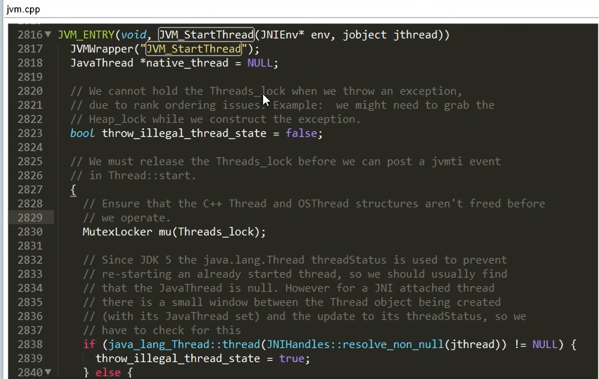  

thread.cpp:  
最终jvm.cpp会调用thread.cpp中的代码来创建线程  
`os:start_thread(thread);` 调用操作系统的方法来创建线程  
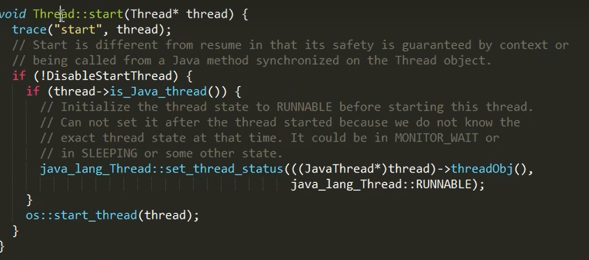  

### 1.4 进程、线程、管程  
* 进程:资源分配的基本单位
* 线程:资源调度的基本单位
* 管程:Monitor(监视器),平常所说的锁

Monitor其实是一种同步机制,保证<font color="#00FF00">同一时间只能有一个线程可以进入临界区</font>,JVM中同步是基于进入和退出监视器对象(<font color="#FF00FF">Monitor管程对象</font>)来实现的,<font color="#00FF00">每个对象都会有一个Monitor对象</font>  
```java
Object o = new Object();
new Thread(() -> {
    synchronize(o) {

    }
},"t1").start();
```
<font color="#00FF00">Monitor对象会和Java对象一同创建并销毁</font>(例如这里的Object对象),它的底层是通过C++实现的  
*提示:在深入理解Java虚拟机第6.4.10节的同步指令一章提到过<font color="#00FF00">管程</font>的作用*  


### 1.5 用户线程和守护线程  
一般情况下不做特殊说明默认就是<font color="#00FF00">用户线程</font>  
* 用户线程:传统意义上的线程
* 守护线程(Daemon Thread):精灵线程,<font color="#00FF00">起到守护其它线程的作用</font>,垃圾回收就是守护线程的一个例子,当系统中只剩下守护线程时JVM就会自动退出.

*提示:Thread的`isDaemon()`方法可以获取一个线程是否是守护线程*  

1.用户线程  
```java
// 默认是用户线程
Thread t1 = new Thread(() -> {
    System.out.println(Thread.currentThread().getName() + "开始运行" +
            Thread.currentThread().isDaemon());
    while (true) {

    }
});
t1.start();

TimeUnit.SECONDS.sleep(3);

System.out.println(Thread.currentThread().getName() + "\t 主线程结束!");
```

**执行结果:** main线程打印完主线程结束后,JVM进程依旧没有退出,因为还存在t1这个用户线程  

2.守护线程  
```java
Thread t1 = new Thread(() -> {
    System.out.println(Thread.currentThread().getName() + "开始运行" +
            Thread.currentThread().isDaemon());
    while (true) {

    }
});
// 设置为守护线程
t1.setDaemon(true);
t1.start();

TimeUnit.SECONDS.sleep(3);

System.out.println(Thread.currentThread().getName() + "\t 主线程结束!");
```
**执行结果:** main线程打印完主线程结束后,系统只剩下t1这个守护线程,JVM进程退出  


### 1.6 Thread类方法总结  
* `static currentThread() return Thread` 获取执行该方法的线程对象

