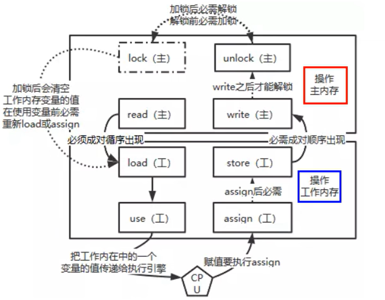
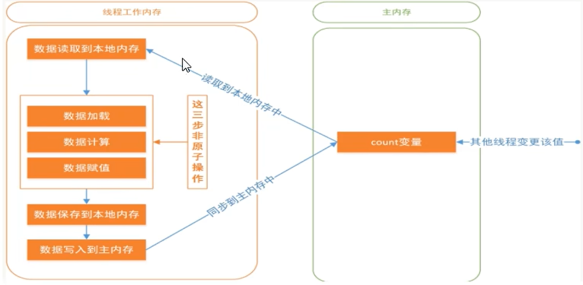

# 目录  
1.CompletableFuture  
2.锁  
3.LockSupport与线程中断  
4.Java内存模型之JMM  
5.volatile与JMM  
6.CAS  
7.原子操作类  
8.ThreadLocal  
9.Java对象内存布局和对象头  
10.synchronized与锁升级  
11.AbstractQueuedSynchronizer之AQS  
12.ReentrantLock、ReentrantReadWriteLock、StampedLock  


## 1.CompletableFuture 
**目录:**  
1.1 Future接口理论知识复习  
1.2 CompletableFuture的改进  


### 1.1 Future接口理论知识复习  
1.基本介绍  
Future接口定义了操作<font color="#00FF00">异步任务执行</font>的一些方法,如获取异步任务的执行结果、取消任务的执行、判断任务是否被取消、判断任务执行是否完毕等.  

2.接口方法  
`cancel(boolean) return boolean` 取消一个任务  
`get() return V` 获取Future执行的结果  
`get(long,TimeUnit) return V` 一定时间内获取任务的结果  
`isCancelled() return boolean` 任务是否被取消  
`isDone() return boolean` 任务是否被完成  

3.常见实现类  
FutureTask是Future接口的常见实现类  

4.异步接口规范  
异步接口需要满足三个条件:多线程、返回值、异步任务  

5.类层级结构  
  
FutureTask通过构造方法注入`Callable`接口来实现异步接口的规范  

6.FutureTask代码演示  
```java
public class DaemonThread {
    public static void main(String[] args) throws ExecutionException, InterruptedException {
        // FutureTask需要传入一个Callable接口
        // FutureTask自身是一个Runnable接口
        FutureTask<String> futureTask = new FutureTask<>(new MyThread());
        // Thread需要传入一个Thread接口
        Thread t1 = new Thread(futureTask, "t1");
        // 异步执行任务
        t1.start();
        // 获取异步执行任务的结果
        System.out.println(futureTask.get());
    }

}

class MyThread implements Callable<String> {

    @Override
    public String call() throws Exception {
        System.out.println("come in...");
        return "hello world";
    }
}
```

7.FutureTask优缺点分析  
* 优点:
  * Future+线程池异步多线程任务配合,能显著提高程序的执行效率
* 缺点:
  * `get`方法同步阻塞
  * `isDone`方法造成CPU空转
    ```java
    // 不停轮询
    while(true){
        if(futureTask.isDone()){
            System.out.println(futureTask.get());
            break;
        } else {
            // do another things...
            System.out.println("正在处理中...");
        }
    }
    ```
    可以通过`isDone`方法来优化`get`方法阻塞的问题,每隔一段时间调用`isDone`方法来判断异步任务是否处理结束,如果确认已经处理结束了再调用`get`方法获取返回值,而不是一直处于阻塞的状态,但是使用`isDone`方法可能会<font color="#00FF00">造成CPU空转消耗资源的问题</font>

### 1.2 CompletableFuture的改进  
1.异步回调  
为了解决`get`和`isDone`方法的问题,CompletableFuture提供了一种观察者机制,当任务执行完毕之后直接通知监听的一方.  

2.类层级结构  


3.CompletionStage  
该接口内部有很多方法,CompletionStage代表异步计算过程中的某一个阶段,<font color="#00FF00">一个阶段完成后可能会触发另外一个阶段</font>,一个阶段的执行可能由单个阶段的完成触发,也可能是由多个阶段一起触发  

4.核心四个静态方法  
*提示:不推荐使用new的方式来创建CompletableFuture类*  
* `supplyAsync(Supplier<U>) return CompletableFuture<U>`
* `supplyAsync(Supplier<U>,Executor) return CompletableFuture<U>`
* `runAsync(Runnable) return CompletableFuture<Void>`
* `runAsync(Runnable,Executor) return CompletableFuture<Void>`

**解释:** 四个核心静态方法分为两组,supplyAsync方法有返回值;runAsync方法无返回值,每组方法又分为有线程池和无线程池的两个版本;<font color="#00FF00">如果没有指定线程池,则会默认使用ForkJoinPool.commonPool()线程池</font>  
*注意:ForkJoinPool内部的线程均为守护线程,主线程(用户线程)结束会导致CompletableFuture中的任务结束,可以通过<font color="#00FF00">创建自定义的线程池</font>作为第二个入参来解决该问题*  
*注意:CompletableFuture一旦被创建里面的任务就会被运行,至于后续的get和join方法只是获取结果的一种手段,并不代表执行*  

5.普通方法  
* `get() return T`
* `join() return T` 获取计算结果,该方法不会产生检查时异常(相较于Future的get方法而言)
* `getNow(T) return T` 获取计算结果,如果计算未结束或者计算的返回值是null,则该方法返回入参
* `complete(T) return boolean` 尝试终止异步计算,<font color="#00FF00">并设置当前异步计算的结果值为本方法的入参</font>;本方法返回值为终止是否成功,如果终止成功再调用get/join方法会获取到这里设置的值,而不是原本计算的值  
- - -
* `whenComplete(BiConsumer<? super T, ? super Throwable>) return CompletableFuture<T>` 当上一个阶段结束之后进入该方法(不管上一个阶段是正确运行还是运行失败都回调该方法),BiConsumer接口传入回调函数,BiConsumer的accept方法的第一个参数是上一个阶段结束后的返回值,第二个参数是上一个阶段结束后产生的异常(如果有);这个方法可以实操一下
* `exceptionally(Function<Throwable, ? extends T>) return T` 当上一个阶段产生异常时会回调该方法的Function函数,回调函数Function的入参为上阶段产生的异常,返回值为当前CompletableFuture期望的返回值,该方法是终止函数,没有后续流程了(因为返回值是T)
* `thenApply(Function<? super T,? extends U>) return CompletableFuture<U>` 依赖于上一个阶段的结果进行本阶段的计算,本阶段同步等待上一阶段的返回值;Function回调函数的入参是上一阶段的结果,返回值是当前阶段计算后的结果,注意这里返回值泛型不是T,<font color="#00FF00">说明本阶段的返回值类型可以和上一阶段不一致</font>
* `thenApplyAsync(Function<? super T,? extends U>) return CompletableFuture<U>` 解释见下面第7点线程池
* `thenAccept(Consumer<? super T>) return CompletableFuture<Void>` 依赖于上一阶段的结果进行本阶段的计算,Consumer回调函数的入参是上一阶段的结果,注意Consumer接口没有返回值,所以本方法仅仅是用于消费上一阶段的结果,本方法返回的CompletableFuture的泛型是Void,所以本方法成功执行后如果调用`join`函数返回的结果是null
* `thenAcceptAsync(Consumer<? super T>) return CompletableFuture<Void>` 解释见下面第7点线程池
* `thenRun(Runnable) return CompletableFuture<Void>` 本阶段同步等待上一阶段计算结束,但不依赖上一阶段计算后的结果,并且本方法返回的CompletableFuture的泛型<font color="#00FF00">也</font>是Void
* `thenRunAsync(Runnable) return CompletableFuture` 解释见下面第7点线程池
* `handle(BiFunction<? super T, Throwable, ? extends U>) return CompletableFuture<U>` 类似于thenApply也是依赖于上一个阶段进行本阶段的计算,但如果thenApply依赖的上一个阶段产生了异常,则当前阶段的thenApply不会执行;而handle则不同,handle依赖的上一个阶段出现异常后依旧可以正常执行这里的BiFunction回调函数,回调函数BiFunction有两个入参一个返回值,第一个入参是上一个阶段的结果,如果上一个阶段产生异常则入参为null,第二个参数是上一个阶段产生的异常,回调函数的返回值是当前阶段计算后的结果,注意这里返回值泛型不是T  
- - -
* `applyToEither(CompletionStage<? extends T>,Function<? super T, U>) return CompletableFuture<U>` 让当前CompletableFuture类与args0的CompletableFuture进行比较计算,<font color="#00FF00">这两个CompletableFuture谁先计算出结果就使用该结果作为args1回调函数的入参</font>  
* `thenCombine(CompletionStage<? extends U>,BiFunction<? super T,? super U,? extends V>) return CompletableFuture<V>` 使当前CompletableFuture类与agrs0对应的CompletableFuture类进行<font color="#00FF00">结果合并</font>,当这两个CompletableFuture的结果都计算完毕之后;将这两个结果作为args1的回调函数的入参  
* 


6.同时执行样例  
```java
List<Integer> productId = new ArrayList<>();
productId.add(1);
productId.add(2);
productId.add(3);
List<String> result = productId.stream()
        .map(integer -> CompletableFuture.supplyAsync(() -> String.format("查询%s商品", integer)))
        .toList()
        .stream()
        .map(CompletableFuture::join)
        .toList();
```

**解释:**  
这里遍历productId的第一个map方法很重要,它遍历id列表并映射成一个CompletableFuture对象,因为`supplyAsync`方法是异步的所以执行不阻塞,由后台线程默默执行查询商品的逻辑,此时三个CompletableFuture对象同时开始执行,最后对每个CompletableFuture对象调用join方法获取结果,当然join方法还是阻塞的,所以如果第一个商品查询时间过长确实会影响到整体的执行时间.  

7.线程池  
thenApply、thenAccept、thenRun方法执行的时候会默认使用CompletableFuture类创建时使用的线程池(指定了自定义线程池就用自定义线程池,未指定就使用ForkJoinPool.commonPool()线程池),与之对应这些方法都有其<font color="#00FF00">Async</font>版本,它的意思是这些版本的方法会<font color="#FF00FF">将当前CompletableFuture类的线程池改为ForkJoinPool</font>  
**知识点:每个CompletableFuture类是绑定一个线程池对象的**  


## 2.锁
**目录:**  
2.1 锁的分类  
2.2 悲观锁和乐观锁  
2.3 对象锁和类锁  
2.4 公平锁和非公平锁  
2.5 可重入锁  
2.6 死锁  
2.7 自旋锁  
2.8 偏向锁、轻量级锁、重量级锁  
2.9 独占锁、读写锁、邮戳锁  

### 2.1 锁的分类  
*提示:关于锁的分类可以看操作系统相关的知识*  


### 2.2 悲观锁和乐观锁  
<font color="#FF00FF">synchronized和Lock的实现类都是悲观锁</font>  
悲观锁适合多写少读的场景  
乐观锁适合多读少写的场景  

对于乐观锁有时我总是不理解,实际上可以用可见性的例子来说明,不要惧怕乐观锁;`volatile int a = 0`;两个线程同时对该变量作自增,假设volatile底层通过乐观锁实现,那么b线程更改时如果发现读取到的数据已经过时,则会重新读取放弃本次操作,所以数据更改并不可怕,<font color="#00FF00">因为针对读取到的数据的代码处理逻辑是不变的</font>  

### 2.3 对象锁和类锁  
1.对象锁  
```java
public synchronized void hello() {
    // do something...
}

// 上述锁法等同于
public void hello() {
    synchronized (this) {
       // do something...
    }
}
```

**解释:**  
普通方法的synchronized相当于对当前这个对象加锁,`this`关键字在Java中指代当前对象,锁的是堆内存中的对象;<font color="#00FF00">所以如果两个线程同时调用不同对象的同一加锁方法是不是产生竞争的</font>  

2.类锁  
```java
public class HelloWorld {
    public static synchronized void hello() {
        // do something...
    }
}


// 上述锁法等同于
public class HelloWorld {
    public void hello() {
        synchronized (HelloWorld.class) {
        // do something...
        }
    }
}
```

**解释:**  
由于当前方法是静态方法,而静态方法不依赖类的实例化,所以这里`this`关键字指代的必然不可能是当前对象,而应该是<font color="#FF00FF">当前类对象,此时锁住的就是由类加载器实例化当前类产生的Class对象</font><font color="#00FF00">由于该对象存在于方法区有且仅有一份,所以多个线程调用该方法最终竞争的都是同一把锁</font>  
*提示:对象.静态方法() = 类.静态方法() 通过对象调用静态方法和通过类调用静态方法本质上是一样的*  

3.Java反编译命令  
使用`javap -c xxx.class`来查看字节码的信息  
使用`javap -v xxx.class`来查看字节码的更多信息  

4.synchronize底层字节码  
4.1 synchronize加锁  
  
使用`javap -c`命令查看字节码,结果如图所示,Java中的同步代码块底层是通过`monitorenter`和`monitorexit`指令进行实现的,但查看字节码文件发现会有两个`monitorexit`这是因为第6-16行之间的指令有可能会产生异常,如果不产生异常则正常走16行的`monitorexit`,否则会走低22行的`monitorexit`并紧跟一个24行的athrow异常抛出  

4.2 普通同步方法  
普通同步方法需要使用`javap -v`命令查看字节码,结果如图所示  
  
可以看到普通同步方法有关键字`ACC_SYNCHRONIZED`进行标识,此时JVM就知道该方法是同步方法  

4.3 静态同步方法  
静态同步方法需要使用`javap -v`命令查看字节码,结果如图所示  
  
相较于普通同步方法之外,静态同步方法还多了一个`ACC_STATIC`的标识  

5.管程  
在HotSpot虚拟机中,monitor采用ObjectMonitor实现
ObjectMonitor.java -> objectMonitor.cpp -> objectMonitor.hpp

并且objectMonitor.cpp中实现了Object类中的`notify`、`notifyAll`、`wait`等线程相关的方法  

*提示:路径如下*  
objectMonitor.cpp(hotspot\src\share\vm\runtime\objectMonitor.cpp)  
objectMonitor.cpp(hotspot\src\share\vm\runtime\objectMonitor.cpp)  

objectMonitor.hpp有几个关键的属性  
* `_owner`:指向持有当前ObjectMonitor对象的线程
* `_WaitSet`:存放处于wait状态的线程队列
* `_EntryList`:存放处于等待锁block状态的线程队列
* `_recursions`:锁的重入次数
* `_count`:用来记录该线程获取锁的次数

<font color="#FF00FF">每个对象都有与之对应的对象监视器(通过对象头中的对象标记(Mark Word)找到该ObjectMonitor)</font>,由ObjectMonitor对象的`_owner`属性就能知道当前是哪个线程获取了对象锁  
**<font color="#FF00FF">注意:只有重量级锁才是通过ObjectMonitor实现的,即只有重量级锁才是通过管程实现的,此时重量级锁(对象)的Mark Word(对象标记)才存储指向它对应的ObjectMonitro的指针</font>**  


### 2.4 公平锁和非公平锁  
*解释:公平锁和非公平锁即多个线程抢占一把锁时,锁的分配是完全随机还是尽量平均分给每个线程,如果是非公平锁就可能造成一个线程多次占用同一把锁,导致别的线程饥饿,而公平锁可以保证每个线程都能至少获得一次锁*  

1.非公平锁代码示例  
```java
public class TickLock {

    public static void main(String[] args) {
        TickSeal tickSeal = new TickSeal();
        new Thread(() -> { for (int i = 0; i < 50; i++) { tickSeal.sale("A"); }}).start();
        new Thread(() -> { for (int i = 0; i < 50; i++) { tickSeal.sale("B"); }}).start();
        new Thread(() -> { for (int i = 0; i < 50; i++) { tickSeal.sale("C"); }}).start();
    }

}

class TickSeal {
    ReentrantLock reentrantLock = new ReentrantLock();
    private int tick = 50;
    public void sale(String name) {
        reentrantLock.lock();
        if(tick > 0){
            System.out.printf("售票员[%s],正在售卖第[%s]张票!%n", name, tick--);
        }
        reentrantLock.unlock();
    }
}
```

**解释:**  
一共有三个售票员(线程)售票,ReentrantLock默认为非公平锁;同时执行最终可能所有的票都被售票员A售卖,这就是<font color="#00FF00">非公平锁可能会导致其它线程饥饿的情况</font>  

2.公平锁代码示例  
*提示:将ReentrantLock的构造函数改为`ReentrantLock reentrantLock = new ReentrantLock(true);就是公平锁`*  
使用公平锁执行后会发现此时不仅仅是A线程能够获得到资源,别的线程也可以获取到资源,甚至在我的本次测试中完全按照ABC的方式一人获取一次  

3.公平锁与非公平锁的区别  
<font color="#FF00FF">非公平锁能够高效利用CPU资源</font>,因为线程的切换涉及资源的保存与恢复会产生开销  
具体什么时候使用公平锁和非公平锁得看业务,如非必要尽量使用非公平锁  

4.ReentrantLock公平锁与非公平锁的实现  


本质上是基于AQS实现的,通过构造函数的传值来创建NonfairSync和FairSync分别实现非公平锁和公平锁  

5.synchronize默认为非公平锁  

**<font color="#FF00FF">非常重要:所以非公平锁实际上并不是队列中的线程之间非公平竞争,而是队首线程与新晋线程的竞争</font>**  
*提示:这个结论可以参考第11.3 ReentrantLock源码切入AQS节的相关知识*  

### 2.5 可重入锁  
1.解释  
可重入锁的意思是一个线程申请了一把锁资源后,如果再次申请同一把锁能够申请成功就称该锁为可重入锁,在Java中锁就是对象,所以这里实际上说的是锁的获取方法  

2.可重入锁分类  
<font color="#00FF00">synchronize和ReentrantLock方式获取的锁是可重入锁</font>  
synchronize是隐式的可重入锁,即JVM层面自已实现了锁的计数重入  
ReentrantLock是显式的可重入锁,需要用户自已手动`lock`+`unlock`  


3.synchronize重入锁实现机制  
Java中每个对象有与之唯一对应的ObjectMonitor对象,ObjectMonitor本质是objectMonitor.cpp,通过objectMonitor.cpp中的`_count`和`_owner`属性(锁计数器和指向持有该锁线程的指针)来实现锁的可重入  

当执行`monitorenter`指令时,如果目标锁对象的计数器为零,那么说明它没有被其它线程所持有,Java会将该锁对象(objectMonitor.cpp)的持有线程设置为当前线程(_owner),并将其计数器加一(_count)  

在目标对象的计数器不为零的情况下,如果锁对象的持有线程是当前线程,那么Java虚拟机可以将其计数器加1,否则将当前线程添加到objectMonitor的`_EntryList`队列中,然后一直等待直至别的线程释放该锁  

当执行`monitorexit`时Java虚拟机需要将锁对象的计数器减1,计数器为0代表锁已经释放  

### 2.6 死锁
1.定义  
多个线程在运行过程中因争夺资源而造成的一种互相等待的现象  

2.如何发现死锁  
首先执行`jps`命令查看当前操作系统(实际上是执行该jps命令的JVM)上正在运行的Java程序  
*提示:jps命令就相当于Java版本的ps命令,用于查看宿主机上运行的所有Java进程*  
结果显示如下,发现它由一个进程号 + 进程名组成:  
```shell
11808 Launcher
16960 SynchronizeClass
22384 Jps
```
接着再使用`jstack [processId]`命令来查看Java程序的堆栈信息,其中`processId`就是上面`jps`方法执行后显示的进程号  
```shell
# 执行shell命令
jstack 16960  

# ... something

"Thread-0":
        at io.github.cnsukidayo.juc.SynchronizeClass.lambda$main$0(SynchronizeClass.java:22)
        - waiting to lock <0x0000000625264360> (a java.lang.Object)
        - locked <0x0000000625264350> (a java.lang.Object)
        at io.github.cnsukidayo.juc.SynchronizeClass$$Lambda$14/0x0000000800c01200.run(Unknown Source)
        at java.lang.Thread.run(java.base@17/Thread.java:833)
"Thread-1":
        at io.github.cnsukidayo.juc.SynchronizeClass.lambda$main$1(SynchronizeClass.java:34)
        - waiting to lock <0x0000000625264350> (a java.lang.Object)
        - locked <0x0000000625264360> (a java.lang.Object)
        at io.github.cnsukidayo.juc.SynchronizeClass$$Lambda$15/0x0000000800c01420.run(Unknown Source)
        at java.lang.Thread.run(java.base@17/Thread.java:833)
# 最终这里会打印死锁信息
Found 1 deadlock.
```

除了使用上面这两个命令之外还可以使用`jconsole`图形化工具,直接在控制台输入`jconsole`打开图形化界面,连接对应的Java程序,在顶部栏(概览、内存、线程、类xxx)中选择线程界面,点击检测死锁便会显示出当前监控的进程的死锁情况  

3.死锁产生的条件  
*可以从操作系统的层面说明死锁产生的四个必要条件*  
* 互斥条件:进程对所分配到的资源进行排他性使用,即在一段时间内,某资源只能被一个进程占用.如果此时还有其他进程请求该资源,则请求进程只能等待,死锁就不会发生.  
* 请求和保持条件:进程已经占有了至少一个资源,但又提出了新的资源请求,而该被请求的资源以被其它进程占有,此时请求进程被阻塞,同时其对自已的资源保持不放.  
* 不可抢占条件:进程已获得的资源在未使用完之前不能抢占,只能在进程使用完时由其自已释放.  
* 循环等待条件:该条件指发生死锁时,必然存在一个"进程-资源"循环链,即进程集合{P0、P1、P2...Pn}中的P0正在等待已被P1占用的资源,P1正在等待已被P2占用的资源,......,Pn正在等待以被P0占用的资源

### 2.7 自旋锁  
*提示:本节与第6章CAS有很多关联知识点*  
1.通过CAS实现线程Lock与Unlock操作  
*提示:如何利用自旋锁CAS实现线程Lock与Unlock操作*  
```java
public class SpinLockDemo {

    private AtomicReference<Thread> atomicReference = new AtomicReference<>();

    public void lock() {
        Thread currentThread = Thread.currentThread();
        // 如果设置成功则跳出循环,否则一直循环设置
        while (!atomicReference.compareAndSet(null, currentThread)) {
        }
    }

    public void unlock() {
        Thread currentThread = Thread.currentThread();
        atomicReference.compareAndSet(currentThread, null);
    }

    public static void main(String[] args) {
        SpinLockDemo spinLockDemo = new SpinLockDemo();
        new Thread(() -> {
            spinLockDemo.lock();
            try { TimeUnit.SECONDS.sleep(3); } catch (InterruptedException e) { throw new RuntimeException(e); }
            spinLockDemo.unlock();
        },"t1").start();
        new Thread(() -> {
            spinLockDemo.lock();
            System.out.println("thread2进入");
            spinLockDemo.unlock();
        },"t2").start();
    }
}
```
**运行结果:**  
上述代码运行3秒之后t2线程输出thread2进入  
需要注意的是AtomicReference如果不设置值,则该类默认包装的值是null

### 2.8 偏向锁、轻量级锁、重量级锁  
*提示:本节内容详情见第10章synchronized与锁升级*  

### 2.9 独占锁、读写锁、邮戳锁  
*提示:本节的内容参考第12章*  

## 3.LockSupport与线程中断
**目录:**  
3.1 中断机制  
3.2 中断停止代码案例  
3.3 LockSupport  


### 3.1 中断机制  
1.中断机制介绍  
*提示:这里参考操作系统中的知识*  
一个线程不应该由其它线程来强制中断或停止,而是应该<font color="#FF00FF">由线程自已自行停止</font>,<font color="#00FF00">所以Thread.stop、Thread.suspend、Thread.resume方法都已经被废弃</font>  
因此Java提供了一种用于停止线程的<font color="#00FF00">协商机制</font>即<font color="#FF00FF">中断</font>,<font color="#00FF00">中断只是一种协商机制,Java并没有给中断机制增加任何语法,中断的过程完全需要程序员自已实现</font>,若要中断一个线程,你需要手动调用该线程的`interrupt`方法,而改方法也仅仅是将线程中对象的中断标识设置为true,`interrupt`方法可以在当前线程中调用也可以在别的线程中调用,所以当前线程需要在代码里面手动检查线程的`interrupt`标识,<font color="#00FF00">然后根据标识的状态自行进行下一步逻辑的处理</font>  

2.中断机制三大方法  
*提示:下面所述的方法均为Thread类的方法*  
* `static interrupted() return boolean` 判断当前线程是否已经被中断并<font color="#FF00FF">清除当前线程的中断状态</font>,该方法是一个静态方法;
* `interrupt() return void` 发起线程中断的协商,该方法仅仅是将线程的中断标识设置为true,不会立即中断方法
* `isInterrupted() return boolean` 判断当前线程是否已经被中断
  另外如果当前线程已经运行结束了,则调用该方法会始终返回false

3.源码分析  
`interrupt`方法的底层通过调用JVM的本地方法`interrupt0`来实现,如果被中断的线程在这之前调用了Object类的`wait`、`wait(long)`、`wait(long,int)`方法或者调用了Thread类的`join()`、`join(long)`、`join(long,int)`、`sleep(long)`、`sleep(long,int)`方法,<font color="#FF00FF">那么它的中断状态将被清除</font>,并<font color="#00FF00">抛出InterruptedException异常</font>,相当于说如果线程已经执行了上述阻塞方法期间时被调用了`interrupt`则此次interrupt方法根本不会生效,此时的中断标识就是false,中断不活动的线程不会产生异常  

在JDK17下,`isInterrupted`方法返回的是一个可见的`interrupted`布尔型变量来表明当前线程是否中断  

`interrupted`静态方法会将`interrupted`布尔变量保存起来以作为结果返回,然后将`interrupted`改为false,并且调用JVM的本地方法`clearInterruptEvent`产生一个清除事件,以此来清除当前线程的中断状态  

*提示:不同版本的JDK实现是不一样的*  
**注意:InterruptedException异常是一种很重要的异常**  


### 3.2 中断停止代码案例
1.通过volatile实现线程中断  
```java
public class SynchronizeClass {

    private static volatile boolean isStop = false;

    public static void main(String[] args) {
        new Thread(() -> {
            while (!isStop) {
                try { TimeUnit.SECONDS.sleep(1); } catch (InterruptedException e) { throw new RuntimeException(e); }
                System.out.println("Hello World");
            }
        }).start();

        new Thread(() -> {
            try { TimeUnit.SECONDS.sleep(3); } catch (InterruptedException e) { throw new RuntimeException(e); }
            isStop = true;
        }).start();
    }
}
```
**解释:**  
通过volatile关键字的可见性来实现,这段代码比较经典不过多介绍,最终会打印三个Hello World  

2.通过AtomicBoolean原子类实现中断  
```java
public class SynchronizeClass {

    private static AtomicBoolean isStop = new AtomicBoolean(false);

    public static void main(String[] args) {
        new Thread(() -> {
            while (!isStop.get()) {
                try { TimeUnit.SECONDS.sleep(1); } catch (InterruptedException e) { throw new RuntimeException(e); }
                System.out.println("Hello World");
            }
        }).start();

        new Thread(() -> {
            try { TimeUnit.SECONDS.sleep(3); } catch (InterruptedException e) { throw new RuntimeException(e); }
            isStop.set(true);
        }).start();
    }
}
```

3.通过interrupt实现线程中断  
```java
public class SynchronizeClass {

    public static void main(String[] args) {
        Thread tOne = new Thread(() -> {
            while (!Thread.currentThread().isInterrupted()) {
                try {
                    TimeUnit.SECONDS.sleep(1);
                } catch (InterruptedException e) {
                    throw new RuntimeException(e);
                }
                System.out.println("Hello World");
            }
        });
        tOne.start();

        new Thread(() -> {
            try { TimeUnit.MILLISECONDS.sleep(3500); } catch (InterruptedException e) { throw new RuntimeException(e); }
            tOne.interrupt();
        }).start();
    }
}
```
*提示:如果打断一个正在睡眠的线程是会产生异常的,所以这里会抛出InterruptedException*  


### 3.3 LockSupport  
**目录:**  
3.3.1 LockSupport基本介绍  
3.3.2 Object实现线程等待与唤醒  
3.3.3 Condition实现线程等待与唤醒  
3.3.4 LockSupport实现线程等待与唤醒  


#### 3.3.1 LockSupport基本介绍
1.介绍  
LockSupport是JUC下的一个类,<font color="#00FF00">用于创建锁和其他同步类的基本线程阻塞原语</font>;LockSuppoort的`park`和`unpark`方法的作用分别是阻塞线程和解除阻塞线程  
<font color="#FF00FF">实际上LockSupport就是wait和notify方法的一种优化机制</font>  

2.三种线程等待和唤醒的方法  

2.1 Object  
使用Object类中的wait方法暂停线程,使用Object类中的notify方法唤醒线程  

2.2 Condition  
使用Condition类中的await方法让线程等待,使用signal方法唤醒线程  

2.3 LockSupport  
LockSupport类可以阻塞当前线程以及唤醒指定被阻塞的线程  


#### 3.3.2 Object实现线程等待与唤醒
1.正常情况  
```java
public class SynchronizeClass {

    public static void main(String[] args) {
        Object o = new Object();
        new Thread(() -> {
            synchronized (o) {
                System.out.println("t1 come in ----");
                try {
                    o.wait();
                } catch (InterruptedException e) {
                    throw new RuntimeException(e);
                }
                System.out.println("t1被唤醒了");
            }
        }).start();


        new Thread(() -> {
            synchronized (o) {
                o.notify();
                System.out.println("t2发出通知");
            }
        }).start();
    }
}
```
输出结果如下  
```shell
t1 come in ----
t2发出通知
t1被唤醒了
```

2.异常情况1  
如果把第一步正常情况下的两个Thread的synchronized同步代码块去除,则运行后将产生两个异常IllegalMonitorStateException,分别是在调用wait和notify方法时产生的,<font color="#00FF00">所以wait和notify方法必须结合synchronized才可以使用</font>  

3.异常情况2  
如果把第一步正常情况下,让t1线程先延迟一秒执行,让t2线程先执行notify方法,再让t1线程执行,此时不会报错,结果是t1线程打印完come in信息之后一直被阻塞  


#### 3.3.3 Condition实现线程等待与唤醒  
1.正常情况
```java
public class SynchronizeClass {

    public static void main(String[] args) throws InterruptedException {
        Lock lock = new ReentrantLock();
        Condition condition = lock.newCondition();
        new Thread(() -> {
            lock.lock();
            try {
                System.out.println("come in");
                condition.await();
                System.out.println("t1 被唤醒");
            } catch (InterruptedException e) {
                throw new RuntimeException(e);
            } finally {
                lock.unlock();
            }
        }).start();

        TimeUnit.SECONDS.sleep(1);

        new Thread(new Runnable() {
            @Override
            public void run() {
                lock.lock();
                try {
                    condition.signal();
                    System.out.println("t2 发出通知!");
                } finally {
                    lock.unlock();
                }
            }
        }).start();

    }
}
```
最终输出的内容如下  
```shell
come in
t2 发出通知!
t1 被唤醒
```

2.异常情况  
同理如果把第一步正常情况下的两个Thread的`lock`和`unlock`方法去掉,则运行后将产生两个异常IllegalMonitorStateException,分别是在调用await和signal方法时产生的,<font color="#00FF00">所以await和signal方法必须结合lock+unlock才可以使用</font>  

3.异常情况  
参考3.3.2中的异常情况2,效果一模一样;所以ReentrantLock就可以理解为synchronize的一种实现,但ReentrantLock还提供公平锁功能,synchronize默认是非公平锁  

#### 3.3.4 LockSupport实现线程等待与唤醒  
1.LockSupport  
LockSupport是JUC下的一个类,<font color="#00FF00">用于创建锁和其他同步类的基本线程阻塞原语</font>;LockSuppoort的`park`和`unpark`方法的作用分别是阻塞线程和解除阻塞线程  
<font color="#FF00FF">实际上LockSupport就是wait和notify方法的一种优化机制</font>  
LockSupport类使用了一种名为`Permit`(许可)的概念来做到<font color="#00FF00">阻塞和唤醒线程</font>的功能,每个线程都有一个`Permit`(许可),与Semaphore不同的是,<font color="#00FF00">许可证不会累计,最多只有一个</font>  

2.静态方法  
*提示:LockSupport的构造器是私有的,它只有静态方法*  
* `static park() return void` 阻塞当前线程,底层通过调用`Unsafe`类的`park`方法进行实现,`Unsafe`类的`park`方法是一个JVM的本地方法
* `static unpark(Thread) return void` 唤醒一个线程,底层通过调用`Unsafe`类的`unpark`方法进行实现,`Unsafe`类的`unpark`方法也是一个JVM的本地方法,调用该方法后会向该Thread线程发放`Permit`许可证,会自动唤醒被park的线程
  * args0:要唤醒哪一个线程

3.基本使用  
```java
public class SynchronizeClass {
    public static void main(String[] args) throws InterruptedException {
        Thread threadOne = new Thread(() -> {
            System.out.println("t1 come in");
            LockSupport.park();
            System.out.println("t1 wake");
        });
        threadOne.start();

        TimeUnit.SECONDS.sleep(1);

        new Thread(() -> {
            System.out.println("t2 signal");
            LockSupport.unpark(threadOne);
        }).start();
    }
}
```
打印结果如下  
```shell
t1 come in
t2 signal
t1 wake
```

4.先唤醒再等待  
```java
public class SynchronizeClass {
    public static void main(String[] args) throws InterruptedException {
        Thread threadOne = new Thread(() -> {
            try { TimeUnit.SECONDS.sleep(1); } catch (InterruptedException e) { throw new RuntimeException(e); }
            System.out.println("t1 come in");
            LockSupport.park();
            System.out.println("t1 wake");
        });
        threadOne.start();
        
        new Thread(() -> {
            System.out.println("t2 signal");
            LockSupport.unpark(threadOne);
        }).start();
    }
}
```
打印结果如下  
```shell
t1 come in
t2 signal
t1 wake
```

**优点**  
* 无锁
* 支持先唤醒后等待
  能够先唤醒后等待的原因本质是因为`unpark`方法已经发送了许可证permit,此时线程调用park方法因为已经有了许可证所以阻塞不会产生效果

这两个优点解决的就是之前synchronize和ReentrantLock的缺点  

5.许可证不会累计  
```java
public class SynchronizeClass {
    public static void main(String[] args) throws InterruptedException {
        Thread threadOne = new Thread(() -> {
            try { TimeUnit.SECONDS.sleep(1); } catch (InterruptedException e) { throw new RuntimeException(e); }
            System.out.println("t1 come in");
            LockSupport.park();
            LockSupport.park();
            System.out.println("t1 wake");
        });
        threadOne.start();

        new Thread(() -> {
            System.out.println("t2 signal");
            LockSupport.unpark(threadOne);
            LockSupport.unpark(threadOne);
            LockSupport.unpark(threadOne);
            LockSupport.unpark(threadOne);
        }).start();
    }
}
```
**代码解释**  
LockSupport对唤醒顺序没有要求,这段代码多次调用unpark方法给threadOne发送许可证,但由于许可证不会累计最多只有一个,所以threadOne方法的第一个LockSupport.park();可以成功被唤醒,但被唤醒的同时紧接着又执行了LockSupport.park()方法,因为许可证已经被用掉了,所以这段程序最终会被阻塞在第二个LockSupport.park()方法上  


## 4.Java内存模型之JMM
4.1 计算机存储体系  
4.2 JMM  
4.3 happens-before  


### 4.1 计算机存储体系
*提示:详情可以参考计算机操作系统或者计算机组成原理,存储管理这一章*  

### 4.2 JMM
1.JMM由来  
CPU的运行并不是直接操作内存而是先把内存里面的数据读到缓存中,进而导致内存读写数据不一致的问题  
<font color="#FF00FF">JVM试图定义一种内存模型来屏蔽掉各种硬件和操作系统的内存访问差异</font>,<font color="#00FF00">以实现让Java程序在各个平台下达到一致的内存访问效果</font>  

2.JMM基本介绍  
JMM是一种抽象的概念并不真实存在,它描述的仅仅是一组规范,通过这组规范定义了程序中各个变量的读写访问方式并决定一个线程对共享变量的写入何时以及如何变成对另一个线程可见,关键技术点都是围绕多线程的<font color="#00FF00">原子性、可见性和有序性</font>展开的  

3.JMM作用
* 通过JMM来实现线程和主存之间的抽象关系
* <font color="#00FF00">屏蔽各个硬件平台和操作系统的内存访问差异</font>以实现让Java程序在各个平台下都能达成一致的内存访问效果

4.可见性  
<font color="#00FF00">当一个线程修改了某一个共享变量的值,其它线程是否能够立即知道该变更</font>,JMM规定所有的变量都存储在主存中  
  
系统主内存共享变量数据修改被写入的时机是不确定的,多线程并发下很可能出现"脏读",所以每个线程都有自己的工作内存,<font color="#00FF00">线程自已的工作内存中保存了该线程使用到的变量的主内存<font color="#FF00FF">副本拷贝</font></font>,线程对变量的所有操作(读取,赈赋值等)都必需在线程自已的工作内存中进行,而不能够直接读主内存中的变量;不同线程之间也无法直接访问对方工作内存中的变量,线程间变量值的传递均需要通过主内存来完成,由此产生<font color="#FF00FF">脏读</font>  

5.原子性  
指临界区的代码不可被打断,是最小的执行单元,里面的代码同一时间只能被一个线程所执行;实现的方法就是加锁  

6.有序性  
有序性指,编写出的程序代码在CPU底层执行时并不会按照编写的顺序去执行,编译器和CPU底层会在保证最终计算结果一致的前提下,通过指令(<font color="#00FF00">指令序列</font>)重排序的方式来优化代码执行以提升性能(即编写的程序顺序≠CPU执行顺序);最经典的例子就是CPU计算加减乘除时是按照逆波兰表达式执行的  
JVM能根据处理器特性(CPU核数、CPU多级缓存)适当对机器指令进行重排序,使机器指令能更加符合CPU的执行性能,但<font color="#00FF00">指令重排序仅仅保证串行语义一致</font>,<font color="#FF00FF">没有义务在多线程场景下也保证语义一致</font>(即可能产生脏读)

7.多线程变量的读写过程  
由于JVM运行程序的实体是线程,而每个线程创建时JVM都会为其创建一个工作内存(即线程私有的<font color="#00FF00">栈空间</font>),而Java内存模型中规定所有变量都存储在主存,主内存是共享内存区域,所有线程都可以访问,但线程对变量的操作(读取赋值等)必须在工作内存中进行,<font color="#00FF00">线程读取变量时要先将变量从主存拷贝到的线程自己的工作内存空间,然后对变量进行操作,操作完成后再将变量写回主存</font>,各个线程中的工作内存中存储着主内存中的变量副本拷贝,因此不同的线程间无法访问对方的工作内存,线程间的通信(传值)必须通过主内存来完成,当有线程更改了主存中的变量时,<font color="#FF00FF">可以通过总线嗅探机制强制刷新别的线程栈空间中的变量</font>  


### 4.3 happens-before  
1.happens-before  
happens-before<font color="#00FF00">包含可见性和有序性的约束</font>  
有序性的解释在4.2第6点讲解过,说白了就是要保证代码的执行顺序与编码顺序一致  
JVM在实现时已经保证了happens-before(先行发生)原则  

2.happens-before总原则  
* 如果第一个操作happens-before(先行)另一个操作,那么第一个操作的执行结果将对第二个操作<font color="#00FF00">可见</font>,而且第一个操作的执行<font color="#00FF00">顺序</font>排在第二个操作之前  
* 两个操作之间存在happens-before关系,并不意味着一定要按照happens-before原则制定的顺序来执行,如果重排序之后的执行结果与按照happens-before关系来执行的<font color="#00FF00">结果一致</font>,那么这种重排序并不非法
  ```java
  int a = 1;
  int b = 2;
  int c = 3;
  // 此时这一步无论是先计算a + b还是先计算a + c 还是先计算b + c都是一样的 
  System.out.println(a + b + c);
  ```

3.happens-before八条原则  
8条原则分别是:次序规则、锁定规则、volatile变量规则、传递规则、线程启动规则(Thread Start Rule)、线程中断规则(Thread Interruption Rule)、线程终止规则(Thread Termination Rule)、对象终结规则(Finalizer Rule)

3.1 次序规则
一个线程内,按照代码顺序,写在前面的指令要先行发生于写在它后面的指令  

3.2 锁定规则  
一个unLock操作先行发生于后面对同一个锁的lock操作  
大白话就是,对于同一把锁,一定是先执行unlock操作才能执行lock操作

3.3 volatile变量规则  
对一个volatile变量的写操作先行发生于后面对这个变量的读操作,<font color="#00FF00">前面的写对后面的读是可见的</font>

3.4 传递规则  
如果操作A先行发生于操作B,而操作B又先行发生于操作C,则可以得出操作A先行发生于操作C  

3.5 线程启动规则(Thread Start Rule)
Thread对象的`start()`方法先行发生于此线程的每一个动作  

3.6 线程中断规则(Thread Interruption Rule)  
对线程interrupt方法的调用先行发生于被中断线程的代码检测到中断事件的发生,也就是中断发生必须早于检测到中断事件的发生  

3.7 线程终止规则(Thread Termination Rule)
线程中的所有操作都先行发生于对线程的终止检测,可以通过`isAlive()`方法检测线程是否已经终止执行  

3.8 对象终结规则(Finalizer Rule)  
一个对象的初始化完成(构造函数执行结束)先行发生于它的`finalize()`方法的开始,即对象终止回收操作一定在对象被创建之后执行  


## 5.volatile与JMM
**目录:**  
5.1 volatile介绍  
5.2 内存屏障  
5.3 禁止重排序  
5.4 正确使用volatile  


### 5.1 volatile介绍
1.volatile特点  
volatile仅仅保证可见性和有序性

2.volatile内存语义  
* 当写一个volatile变量时,JMM会把线程对应的本地内存中的共享变量值<font color="#00FF00">立即刷新回主存中</font>
* 当读一个volatile变量时,JMM会把该线程对应的本地内存设置为无效,重新回到主内存中读取最新共享变量
* 所以volatile的写内存语义是直接刷新到主内存中,读的内存语义是直接从主内存中读取

*提示:volatile是不保证写可见的,这点也很容易理解,原本线程读取非volatile的变量会直接从线程栈中读取,如果主存中的变量被其它线程更改,则读取线程栈变量的线程将不会感知到本次更改,而是一直读取老的数据;所以如果多个线程对加了volatile关键字的变量进行并发修改,volatile是无法保证最终的值是正确的,虽然volatile可以强制将变量刷新回主存,也能强制从主存中读取变量,假设现在volatile变量a被线程1刷新到主存中的同时,有10个线程也从主存中读取volatile变量a并且将自增后的值刷新回主存,此时变量就是2,不会是11,也就是说强制从主存中读取和刷新并不能保证并发写的原子性,但是加上volatile变量可以保证变量的正确值能够最终被别的线程读取到;有一种情况便是,线程1将变量a修改为2,线程2读取变量a将永远是修改为2之前的值,因为它只会从线程栈中读取变量a,永远不会同步主存的最新值*  
*提示:关于volatile为什么不能保证变量的可见性,详情可以参考5.2节的第8点*  

### 5.2 内存屏障  
1.基本介绍  
屏障这个词的本意就是阻挡、禁止的意思,内存屏障是一类<font color="#00FF00">同步屏障指令</font>,<font color="#FF00FF">是CPU或编译器在对内存随机访问的操作中的一个同步点,使得次点之前的所有读写操作都执行后才开始执行此点之后的操作</font>,避免代码重排序,内存屏障的本质是一种JVM指令,Java内存模型的重排序规则会要求Java编译器在生成JVM指令时<font color="#00FF00">插入特定的内存屏障指令</font>,通过这些内存屏障指令,volatile实现了Java内存屏障中的可见性和有序性(禁止重排序),但<font color="#00FF00">volatile无法保证原子性</font>  

<font color="#00FF00">内存屏障之前的所有写操作都要写回到主存中,内存屏障之后的所有读操作都能获得内存屏障之前的所有写操作的最新结果</font>  
* 写屏障(Store Memory Barrier):告诉处理器在写屏障之前将所有存储在缓存(store bufferes)中的数据同步到主存
* 读屏障(Load Memory Barrier):处理器在读屏障之后的读操作,都在读屏障之后执行

  
**<font color="#FF00FF">对于重排序,不允许把内存屏障之后的指令重排序到内存屏障之前 </font>**  

2.内存屏障分类  
按照读写性质分为:读屏障和写屏障  
按照底层性质分为:读后读、写后写、读后写、写后读

3.Unsafe类  
Unsafe中有三个本地方法`storeFence`、`loadFence`、`fullFence`分别对应写屏障、读屏障、读写屏障  
既然是本地方法与此对应便有Unsafe.cpp的C语言代码,在hotspot\src\share\vm\prims\unsafe.cpp路径下可以找到,该类中有对应的三个方法
```c++
UNSAFE_ENTRY(void, Unsafe_LoadFence(JNIEnv *env, jobject unsafe))
  UnsafeWrapper("Unsafe_LoadFence");
  OrderAccess::acquire();
UNSAFE_END

UNSAFE_ENTRY(void, Unsafe_StoreFence(JNIEnv *env, jobject unsafe))
  UnsafeWrapper("Unsafe_StoreFence");
  OrderAccess::release();
UNSAFE_END

UNSAFE_ENTRY(void, Unsafe_FullFence(JNIEnv *env, jobject unsafe))
  UnsafeWrapper("Unsafe_FullFence");
  OrderAccess::fence();
UNSAFE_END
```
可以发现者三个方法又调用了OrderAccess文件对应的类(\hotspot\src\share\vm\runtime\orderAccess.hpp),双冒号就类似方法引用,这个类中定义了如下重要的静态方法  
```c++
class OrderAccess : AllStatic {
 public:
  // 读后读
  static void     loadload();
  // 写后写
	static void     storestore();
  // 读后写
	static void     loadstore();
  // 写后读
	static void     storeload();

  static void     acquire();
  static void     release();
  static void     fence();
}
```
其中的loadload、storestore、loadstore、storeload方法就非常类似计算机组成原理里涉及到的知识点  
最终来到linux底层的源码实现  
  
*提示:asm为内联汇编,这里的汇编指令后面加了类型*  


4.<font color="#FF00FF">4类屏障介绍</font>  
|  屏障类型  |         指令示例         |                               说明                               |
|:----------:|:------------------------:|:----------------------------------------------------------------:|
|  LoadLoad  |   Load1;LoadLoad;Load2   |         保证load1的读取操作在load2及后续读取操作之前执行         |
| StoreStore | Store1,StoreStore;Store2 |    在load2及其后的写操作执行前,保证store1的写操作已刷新到主存    |
| LoadStore  |  Load1;LoadStore;Store2  |     在stroe2及其后的写操作执行前,保证load1的读操作已读取结束     |
| StoreLoad  |  Store1;StoreLoad;Load2  | 保证store1的写操作已刷新到主内存之后,load2及其后的读操作才能执行 |


5.happens-before之volatile变量规则  
| 第一个操作 | 第二个操作:普通读写 | 第二个操作:volatile读 | 第二个操作:volatile写 |
|:----------:|:-------------------:|:---------------------:|:---------------------:|
|  普通读写  |      可以重排       |       可以重排        |      不可以重排       |
| volatile读 |     不可以重排      |      不可以重排       |      不可以重排       |
| volatile写 |      可以重排       |      不可以重排       |      不可以重排       |

* 当第一个操作为volatile读时,不论第二个操作是什么,都不能重排序;这个操作保证了volatile读之后的操作不会被重排到volatile读之前
* 当第二个操作为volatile写时,不论第一个操作是什么,都不能重排序;这个操作保证了volatile写之前的操作不会被重排到volatile写之后
* 当第一个操作为volatile写时,第二个操作为volatile读时,不能重排

6.读写屏障插入顺序  
*提示:通过第6节的内容就能够理解第5节表格中的内容*  

6.1 读屏障插入
在每个volatile读操作的后面先插入一个LoadLoad屏障再插入一个LoadStore屏障  
  

6.2 写屏障插入  
在每个volatile写操作前插入一个StoreStore屏障,在每个volatile写操作的后面插入一个StoreLoad屏障  
  

7.volatile变量的读写过程  
JMM中定义了8种<font color="#00FF00">每个线程自已的工作内存与主物理内存之间的原子操作</font>  
<font color="#00FF00">read(读取)->load(加载)->use(使用)->assign(赋值)->store(存储)->write(写入)-></font><font color="#FF00FF">lock(锁定)->unlock(解锁)</font>  
  
*提示:上图从read作为第一步开始看起,主内存是主存(仅有一份),工作内存是线程私有的内存*  
<font color="#FF00FF">案例</font>:第一个线程从read开始从主存中读取变量,将变量load到工作内存,接着执行use指令便可以正常使用该变量使用CPU进行计算,此时第二个线程也从read开始将变量读取到工作内存,接着执行user指令正常使用该变量,接着该线程使用assign将变量更改并赋值给工作内存,最后store操作将变量回写到主存中;以上6条指令便可以保证单线程场景的可见性,对于多线程场景额外增加lock和unlock指令,所以在执行write操作执行必须先执行lock操作再执行write操作,write操作将最新的变量写回主存中后执行unlock操作解锁该变量,另外当执行lock操作的同时会清空第一个线程工作内存中该变量的值,此时线程一需要重新执行read操作,至此便完成了变量的可见性操作  

* read:作用于主内存,将变量的值从主内存传输到工作内存,主内存到工作内存
* load:作用于工作内存,将read从主内存传输的变量值放入工作内存变量副本中,即数据加载
* use:作用于工作内存,将工作内存变量副本的值传递给执行引擎,每当JVM遇到需要改变量的字节码指令时会执行该操作
* assign:作用于工作内存,将从执行引擎接受到的值复制给工作内存变量,每当JVM遇到一个给变量赋值字节码指令时会执行该操作
* store:作用于工作内存,将赋值完毕的工作变量的值写回给主内存
* write:作用于主内存,将store传输过来的变量值赋值给主内存中的变量
* lock:作用于主内存,将一个变量标记为一个线程独占的状态,只是写时候加锁,就只是锁了写变量的过程
* unlock:作用于主内存,一个处于锁定状态的变量释放,然后才能被其他线程占用

8.字节码层面是如何添加读写屏障的
  
可以看到被volatile修饰的变量会添加一个<font color="#FF00FF">ACC_VOLATILE</font>的flags标志,这样JVM在把字节码生成机器码的时候,判断如果操作变量的标识是ACC_VOLATILE时,就会按照JMM的规范在相应的位置插入内存屏障  

9.volatile为什么不能保证原子性  
  
*提示:实际上原理就是5.1节中提到的那段,第二个线程在第一个线程先回的过程中可能修改数据*  

对于volatile变量具备可见性,JVM只是保证从主存加载到线程工作内存的值是最新的,也<font color="#00FF00">仅是数据加载时是最新的</font>,但是多线程环境下,"数据计算"和"数据赋值"操作可能多次出现,若数据在加载之后,若主内存volatile修饰变量发生修改之后,线程工作内存中的操作将会作废去读主存最新值,操作出现写丢失问题.即<font color="#00FF00">各个线程私有内存和主存公共内存中变量不同步</font>,进而导致数据不一致,由此可见volatile解决的是变量读时的可见性问题,<font color="#FF00FF">但无法保证原子性,对于多线程修改内存共享变量的场景必须使用加锁同步</font>  

10.volatile使用场景  
只有在满足以下两条规则的场景下才推荐使用volatile  
* 运算结果并不依赖变量的当前值,或者能够确保只有单一的线程修改变量的值
* 变量不需要与其他的状态变量共同参与不变约束

*总结:volatile不适合参与到依赖当前值的运算,例如i += 1或者i++的场景,通常volatile用作保存某个<font color="#00FF00">状态</font>的boolean值或int值*  

### 5.3 禁止重排序
1.基本介绍
重排序是指编译器和处理器为了优化程序性能而对指令序列进行重排序的一种手段,有时候会改变程序语句的先后顺序,如果<font color="#00FF00">数据之间不存在依赖关系则可以重排序</font>,<font color="#FF00FF">存在数据依赖关系禁止重排序</font>,<font color="#00FF00">但指令重排序仅仅保证串行语义一致,没有义务在多线程场景下也保证语义一致</font>  
编写出的源代码会经过编辑器优化重排序、指令级并行重排序、内存系统的重排序  
* 编译器优化的重排序:编译器在不改变单线程串行语义的前提下,可以重新调整指令的执行顺序
* 指令级并行的重排序:处理器使用指令级并行技术来讲多条指令重叠执行,若不存在数据依赖性,处理器可以改变语句对应机器指令的执行顺序
* 内存系统的重排序:由于处理器使用缓存和读/写缓冲区,这使得加载和存储操作看上去可能是乱序执行

<font color="#00ccff">数据依赖:</font>若两个操作访问同一变量,且这两个操作中有一个为写操作,此时两操作间就存在数据依赖项  

### 5.4 正确使用volatile  
1.单一赋值场景推荐使用volatile,复合运算赋值不可用(例如:i++)

2.状态标志,判断业务是否结束

3.在读写联合的场景下,可以对变量加volatile,读方法作为普通方法(因为变量课件),写方法加锁(保证原子);从而以此来保证可见性
```java
volatile int a = 10;

public int read() {
  return this.a;
}

public synchronized void write() {
  this.a++;
}
```

4.双检加锁  
```java
public class DoubleCheck {
  private static DoubleCheck single;
  // 私有构造方法
  private DoubleCheck {

  }

  public static getInstance() {
    if(single == null){
      synchronized (DoubleCheck.this){
        if (single == null){
          // 多线程环境下,由于重排序,该对象可能还未初始化就被其它线程读取
          single = new DoubleCheck();
        }
      }
    }
    return single;
  }

}
```
*提示:上述这段经典的代码,理论上在不涉及重排序的前提下是没问题的,但这段代码一旦被重排序执行则会存在问题*  
在单线程环境下,指令的执行顺序如下  
```java
memory = allocate();      // 1分配对象的内存空间
ctorInstance(momory);     // 2初始化对象
instance = memory;        // 3设置instance指向刚分配的内存地址
```
但在多线程环境下,如果第2条和第3条指令重拍,后果就是其它线程得到的是null而不是完成初始化的对象,如下  
```java
momory = allocate();      // 1分配对象的内存空间
instance = momory;        // 3设置instance指向刚分配的内存地址,注意此时对象还没有被初始化
ctorInstance(momory);     // 2初始化对象
```

所以正确的执行方式应该如下:  
```java
public class DoubleCheck {
  // 加上volatile关键字即可
  private volatile static DoubleCheck single;
  // 私有构造方法
  private DoubleCheck {

  }

  public static getInstance() {
    if(single == null){
      synchronized (DoubleCheck.this){
        if (single == null){
          // 多线程环境下,由于重排序,该对象可能还未初始化就被其它线程读取
          single = new DoubleCheck();
        }
      }
    }
    return single;
  }
}
```

## 6.CAS  
**目录:**  
6.1 CAS基本介绍  
6.2 Unsafe类  
6.3 CAS缺点  

### 6.1 CAS基本介绍
1.CAS的使用  
没有CAS之前,多线程环境下不使用原子类保证线程安全操作i++,一般通过对变量加volatile关键字并对写操作加锁来实现  
```java
volatile int a = 10;

public int read() {
  return this.a;
}

public synchronized void write() {
  this.a++;
}
```
使用CAS之后,多线程环境下使用原子类保证线程安全操作i++,CAS类似于乐观锁,对于乐观锁和悲观锁强烈建议这里再看一下2.2悲观锁和乐观锁的知识点  
```java
AtomicInteger atomicInteger = new AtomicInteger();

public int getAtomicInteger() {
    return atomicInteger.get();
}

public void setAtomicInteger() {
    this.atomicInteger.getAndIncrement();
}
```

2.CAS基本介绍  
*提示:CAS的操作也可以见操作系统*
CAS全称为compare and swap,中文翻译为<font color="#00FF00">比较并交换 </font>,它包含三个操作数:内存位置、预期原值、更新值  
执行CAS操作时,将内存位置的值与预期原值进行比较:  
* 如果匹配,那么会将该内存值更新为<font color="#00FF00">更新值</font>
* 如果不匹配,<font color="#00FF00">处理器不做任何操作</font>,多个线程同时执行CAS操作只有一个会成功

大白话就是,CAS有三个操作数,<font color="#00FF00">内存位置偏移量V、旧的预期值A、要修改的更新值B</font>;当且仅当旧的预期值A和内存值V相同时,将内存值V修改为更新值B,否则什么也不做或重来,这种重试机制就被称为<font color="#FF00FF">自旋</font>

3.基本使用  
* `compareAndSet(int,int) return boolean` 比较并设置,如果当前AtomicInteger对象的值是args0则将当前AtomicInteger的值设置为agrs1,否则什么也不做;若修改成功改方法返回true,否则返回false
* `getAndIncrement() return int` 让当前原子类的int值自增,底层调用Unsafe类的`compareAndSetInt`的方法实现
* `get() return int` 返回当前AtomicInteger对象存储的值

4.硬件级别保证  
CAS是JDK提供的非阻塞原子性操作,它通过<font color="#00FF00">硬件保证</font>了比较-更新的原子性,它是非阻塞的且自身具有原子性  
CAS是一条CPU的原子指令(<font color="#00FF00">cmpxchg指令</font>),不会造成数据不一致问题,Unsafe提供的CAS方法(如compareAndSwapxxx)底层实现即为CPU的cmpxchg指令(汇编指令,X86指令集)  
执行cmpxchg指令的时候,会判断当前系统是否为多核系统,如果是就给<font color="#00FF00">总线</font>加锁,只有一个线程会对总线加锁成功,加锁成功之后会执行CAS操作,即<font color="#00FF00">CAS原子操作实际上是CPU实现独占的</font>,相较于synchronize的重量级锁,这里的互斥时间要短很多,所以在多线程环境下性能会更好  
`compareAndSet`方法的本质是通过调用Unsafe类的`compareAndSetInt`方法,`compareAndSetInt`方法是一个本地方法,<font color="#FF00FF">每个原子类的内部都通过调用`Unsafe.getUnsafe()`方法持有对Unsafe类的引用</font>  

5.原子引用
除了类似AtomicInteger、AtomicBoolean等基本数据类型的原子类型外,还可以自定义原子类型,为此JDK设计了原子引用类AtomicReference  
```java
public class AtomicClass {

    public static void main(String[] args) {
        User user1 = new User("z3", 18);
        User user2 = new User("l4", 23);
        AtomicReference<User> atomicReference = new AtomicReference<>();
        atomicReference.set(user1);
        atomicReference.compareAndSet(user1, user2);
    }
}

class User {
    String name;
    int age;

    public User(String name, int age) {
        this.name = name;
        this.age = age;
    }
}
```
*提示:API使用层面与AtomicInteger并无区别,<font color="#00FF00">但该类的底层实现是通过VarHandle类完成的</font>*  


### 6.2 Unsafe类
1.API介绍    
*提示:这里介绍的是jdk.internal.misc这个包下的Unsafe类,因为Unsafe不止一个,这个Unsafe类是JDK自已使用的,用户自已无法使用,用户使用的Unsafe类是sun.misc包下的,在该类中又组合了jdk.internal.misc.Unsafe类对象*  
* `compareAndSetInt(Object,long,int,int)` cas操作设置int值
  * agrs0:要对哪个原子类操作
  * args1:该原子类保存的变量的地址偏移量
  * args2:旧的预期值
  * args3:要修改的目标值
* `compareAndSetReference(Object,long,Object,Object)` 同理
* `compareAndSetLong(Object,long,long,long)` 同理
* `getAndAddInt(Object,long,int)` 在原子类已有值的基础上增加值,例如原本原子类的值是3,调用该方法传入args2为3,则代表要对该原子类的值加上3
  该方法内部会先调用getIntVolatile方法,读取原子类的原有值然后再调用`compareAndSetInt`方法将原子类变量的值设置为 原有值+agrs2
  * agrs0:要对哪个原子类操作
  * agrs1:该原子类保存的变量的地址偏移量
  * args2:增加多少值
  ```java
  public final int getAndAddInt(Object o, long offset, int delta) {
      int v;
      do {
          v = getIntVolatile(o, offset);
      } while (!weakCompareAndSetInt(o, offset, v, v + delta));
      return v;
  }
  ```
  这段源码十分有意思,首先会调用`getIntVolatile`方法,强制刷新主存可见地读到变量的值,并且这里是do-while循环,然后循环调用`weakCompareAndSetInt`方法,`weakCompareAndSetInt`的本质就是`compareAndSetInt`方法,如果更改不成功就重新读取最新值然后修改,<font color="#FF00FF">保证原子类值增长这步操作最终会完成</font>,这便是之前提到的<font color="#00FF00">自旋、乐观锁</font>的相关概念
* `objectFieldOffset1(Class<?>,String)` 得到一个类中变量的地址偏移量
  * args0:类对象
  * args1:args0指定的类对象中,要查询的变量的名称

2.Unsafe类介绍  
Unsafe是CAS的核心类,由于Java程序无法进行系统调用操作,故需要通过本地native方法来进行访问,Unsafe类就相当于一个后门,基于该类可以<font color="#FF00FF">直接操作特定内存的数据</font>,这也是为什么swap方法需要变量偏移量的原因,UnSafe类存在于sun.misc包中,其内部方法操作可以像C的<font color="#00FF00">指针</font>一样直接操作内存,因为Java中CAS操作的执行依赖于Unsafe类的方法,<font color="#00FF00">Unsafe类中的所有方法都是native修饰的,即Unsafe类中的方法都是直接调用操作系统底层资源执行相应任务</font>  

3.Unsafe.cpp  
Unsafe.java必然有其对应的Unsafe.cpp实现(存放在hotspot\src\share\vm\prims\Unsafe.cpp),CAS  
```c++
// 注意这里的几个参数unsafe、obj、offset、e、x都能和Java中Unsafe类的CompareAndSwapInt对上
UNSAFE_ENTRY(jboolean, Unsafe_CompareAndSwapInt(JNIEnv *env, jobject unsafe, jobject obj, jlong offset, jint e, jint x))
  // 包装了CompareAndSwapInt方法
  UnsafeWrapper("Unsafe_CompareAndSwapInt");
  // 调用JNIHandles类的resolve方法,解析出原子类对象
  oop p = JNIHandles::resolve(obj);
  // 根据原子类对象+偏移值,先拿到变量value在内存中的地址,保存在addr这个指针变量中
  jint* addr = (jint *) index_oop_from_field_offset_long(p, offset);
  // 调用Atomic中的函数cmpxchg来进行比较交换,其中参数x是新值 e是旧值
  // cas成功,返回旧值e,判断结果等于e则本方法返回true
  // cas失败,返回内存中的值,判断结果不等于e则本方法返回false
  return (jint)(Atomic::cmpxchg(x, addr, e)) == e;
UNSAFE_END
```

4.cmpxchg方法  
c++中Atomic类的cmpxchg方法定义如下  
```c++
unsigned Atomic::cmpxchg(unsigned int exchange_value,volatile unsigned int* dest,unsigned int compare_value) {
  assert(sizeof(unsigned int) == sizeof(jint),"more work to do");
  // 根据操作系统类型调用不同平台下的重载函数,这个在预编译期间编译器会决定调用哪个平台下的重载函数
  return (unsigned int)Atomic::cmpxchg((jint)exchange_value,(volatile jint*)dest,(jint)compare_value);
}
```

在Windows10下cmpxchg的重载方法如下  
```c++
inline jint Atomic::cmpxchg(jint exchange_value,volatile jint* dest,jint compare_value) {
  // 判断是否为多核CPU,这个地方应该是系统调用
  int mp = os::is_MP();
  // 内联汇编
  __asm{
    // 三个move指令表示的是将后面的值移动到前面的寄存器上
    mov edx,dest
    mov ecx.exchange_value
    mov eax,compare_value
    // CPU 原语级别,CPU触发;实际上还是加了一把总线层面的锁
    LOCK_IF_MP(mp)
    // 比较并交换指令
    // cmpxchg:即"比较并交换指令",汇编层面
    // dword:全称是double word表示两个字,一共四个字节
    // ptr:全称是pointer,与前面的dword连起来使用,表明访问的内存单元是一个双字单元
    // 将eax寄存器中的值(compare_value)与[edx]双字内存单元中的值进行对比 
    cmpxchg dword ptr [edx],ecx
  }
}
```

### 6.3 CAS缺点
1.CAS缺点    
* 循环时间越长导致CPU开销越大
* 引入ABA问题

2.ABA问题  
CAS算法实现的一个重要前提是需要去除内存中某时刻的数据并在当下时刻比较并替换,那么这中间存在的<font color="#00FF00">时间差</font>就会导致数据发生变化  
例如线程1从内存位置V中取出A,这时线程2也从内存中取出A,线程2进行了一些操作将值改为了B,然后线程2又将内存V处的数据变为了A,这时线程1继续CAS操作发现内存中的值仍然是A,与旧值相同,此时线程1操作成功,<font color="#00FF00">尽管线程1的CAS操作成功,但是这并不代表整个过程就没有问题</font>  
<font color="#FF00FF">但我个人并不觉得ABA是一个问题,因为乐观锁最重要的就是代码逻辑的不变性,应该是由数据导出代码逻辑,而不是由代码逻辑兼容数据</font>  

3.AtomicStampedReference  
ABA问题可以通过版本号进行解决,CAS操作比较的终究只有原子类本身封装的内容,如果再加一个版本号便可解决该问题,版本号本身也作为CAS比较的值  
* `AtomicStampedReference(V,int)` 实例化AtomicStampedReference对象
  args0:当前原子类包装的对象
  args1:初始化版本号(邮戳)
* `compareAndSet(V,V,int,int)` 比较并设置,注意该方法有四个参数,如果当前AtomicStampedReference封装的对象的值是agrs0并且当前对象的邮戳是agrs2,则将当前原子类封装的对象设置为args1,并将当前原子类的邮戳改为args3
  其实在CAS操作下,这个方法的args2值的写法是固定的,就是`AtomicStampedReference.getStamp()`得到当前原子类的邮戳值,args3一般也写作`AtomicStampedReference.getStamp() + 1`
  * args0:旧值对象
  * args1:新值对象
  * args2:旧邮戳(版本号)
  * args3:新邮戳(版本号)

*提示:需要注意的是,版本号必须不能回滚,每次更新之后至少要确保版本号是往前走的*  

## 7.原子操作类  
**目录:**  
7.1 原子操作类  
7.2 基本类型原子类  
7.3 数组类型原子类  
7.4 引用类型原子类  
7.5 对象属性修改原子类  
7.6 增强型原子类  


### 7.1 原子操作类  
1.原子操作类一览
Java的原子操作类有:AtomicBoolean、AtomicInteger、AtomicIntegerArray、AtomicIntegerFieldUpdater、AtomicLong、AtomicLongArray、AtomicLongFieldUpdater、AtomicMarkableReference、AtomicReference、AtomicReferenceArray、AtomicReferenceFieldUpdater、AtomicStampedReference、DoubleAccumulator、DoubleAdder、LongAccumulator、LongAdder

2.分类  
上述原子操作类,可以分为:<font color="#00FF00">基本类型原子类、数组类型原子类、引用类型原子类、对象的属性修改原子类、增强型原子类</font>  

### 7.2 基本类型原子类  
1.分类  
基本类型原子类包括:AtomicInteger、AtomicBoolean、AtomicLong  

2.常见API  
* `get() return int` 获取当前原子类封装的内容
* `getAndSet(int) return int` 设置新值并返回旧值
* `getAndIncrement() return int` 获取当前值并自增
* `getAndDecrement() return int` 获取当前值并自减
* `getAndAdd(int) return int` 获取当前值,并加上预期值(args0)
* `compareAndSet(int,int) return boolean` 比较并设置,如果当前AtomicInteger对象的值是args0则将当前AtomicInteger的值设置为agrs1,否则什么也不做;若修改成功改方法返回true,否则返回false

3.变量自增的demo  
```java
public class AtomicStampedReferenceDemo {

    private static final int SIZE = 50;

    public static void main(String[] args) throws InterruptedException {
        AtomicInteger atomicInteger = new AtomicInteger();
        CountDownLatch countDownLatch = new CountDownLatch(SIZE);
        for (int i = 0; i < SIZE; i++) {
            new Thread(() -> {
                try {
                    for (int j = 0; j < 1000; j++) {
                        atomicInteger.incrementAndGet();
                    }
                } finally {
                    countDownLatch.countDown();
                }
            }, String.valueOf(i)).start();
        }
        // 等待上述50个线程全部计算完毕后获取结果
        countDownLatch.await();
        System.out.println(atomicInteger.get());
    }
}
```

### 7.3 数组类型原子类  
1.分类  
数组类型原子类包括:AtomicIntegerArray、AtomicLongArray、AtomicReferenceArray  

2.常见API  
* `AtomicIntegerArray(int[])` 实例化原子数组,指定数组原子类封装的数组内容
* `getAndSet(int,int) return int` 将数组中索引为args0的元素值设置为args1,返回值为旧值
* `compareAndSet(int,int,int)` 比较并设置;args0为数组下标,args1为旧值,args2为新值
* `get(int) return int` 得到args0参数下标对应的值

*提示:大多数API皆是操作数组下标对应的元素*

### 7.4 引用类型原子类  
1.分类  
引用类型原子类包括:AtomicReference、AtomicStampedReference、AtomicMarkableReference  

2.AtomicMarkableReference类说明  
与AtomicStampedReference是带有版本号邮戳方式的更新不同,AtomicMarkableReference只记录当前原子类是否有被更改过,相当于弱化版的版本号,只记录true和false,<font color="#00FF00">一旦原子类被更新则状态置为true</font>  

* `AtomicMarkableReference(V,boolean)` 实例化,args0为当前引用类型原子类要封装的对象,args1为标记的初始默认值
* `compareAndSet(V,V,boolean,boolean)` 比较并设置
  * args0:旧值
  * args1:新值
  * args2:旧的标记值
  * args3:新的标记值
  *提示:实际上args2和args3的写法是固定的,就好似下面第3点的写法,当然获取有例外情况*

3.AtomicMarkableReference使用demo  
```java
Integer number = 100;
AtomicMarkableReference<Object> atomicMarkableReference = new AtomicMarkableReference<>(number, false);
new Thread(() -> atomicMarkableReference.compareAndSet(number, 1000, atomicMarkableReference.isMarked(), !atomicMarkableReference.isMarked())).start();
```

### 7.5 对象属性修改原子类  
1.分类  
对象属性原子类包括:AtomicIntegerFieldUpdater、AtomicLongFieldUpdater、AtomicReferenceFieldUpdater  
*提示:这三个类都是抽象类*  

2.基本介绍  
这三个原子类都是基于反射的实用程序,<font color="#FF00FF">可对指定类的`volatile`字段进行原子更新</font>;总结说就是以一种线程安全的方式操作非线程安全对象的某些字段,<font color="#FF00FF">通过下面的第5点和第6点可以发现,本类的功能十分强大</font>  

3.出现背景  
```java
public class BankAccount {
  private String bankName = "CCB";
  private String bankNo = "110209090802930943";
  private String owner = "zs";

  int money = 0;
  public synchronized void transfer() {
    money++;
  }
}
```
假设对于该业务类,其中大部分信息都是固定的,但某些值在多线程环境下可能有安全问题,例如这里的money,根据之前的知识对写场景一般要加锁进行解决,但如同这里的代码一样,锁的粒度太粗;能否不加锁以实现对money变量的原子更新?  

4.使用要求  
* 目标字段必须被`public volatile`关键字修饰
* 因为对象属性修改原子类(即本节论述的三个原子类)都是抽象类,所以每次使用的时候都必须调用类的静态方法`newUpdater()`创建一个更新器,并且设置需要想要更新的<font color="#00FF00">类和属性</font>

5.使用demo1  
```java
public class AtomicFieldUpdater {
    private static final int SIZE = 50;

    public static void main(String[] args) throws InterruptedException {
        BankAccount bankAccount = new BankAccount();
        CountDownLatch countDownLatch = new CountDownLatch(SIZE);
        for (int i = 0; i < SIZE; i++) {
            new Thread(() -> {
                for (int j = 0; j < 1000; j++) {
                    bankAccount.transMoney();
                }
                countDownLatch.countDown();
            }).start();
        }
        countDownLatch.await();
        System.out.println(bankAccount.money);
    }
}

class BankAccount {
    private String bankName = "CCB";

    public volatile int money = 0;

    AtomicIntegerFieldUpdater<BankAccount> fieldUpdater =
            AtomicIntegerFieldUpdater.newUpdater(BankAccount.class, "money");

    public void transMoney() {
        fieldUpdater.getAndIncrement(this);
    }

}
```
**执行结果为:50000**  

6.使用demo2  
*要求:多个线程同时调用某类的初始化方法,若未被初始化则执行初始化操作,要求只能有一个线程初始化成功,只有一个线程能够操作成功*  
```java
public class AtomicFieldUpdater {
    private static final int SIZE = 10;

    public static void main(String[] args) throws InterruptedException {
        BankAccount bankAccount = new BankAccount();
        CountDownLatch countDownLatch = new CountDownLatch(SIZE);
        for (int i = 0; i < SIZE; i++) {
            new Thread(() -> {
                bankAccount.initBankName(Thread.currentThread().getName());
                countDownLatch.countDown();
            }).start();
        }
        countDownLatch.await();
        System.out.println("账户名称为:" + bankAccount.bankName);
    }
}

class BankAccount {
    public volatile String bankName = null;
    /*
    注意:AtomicReferenceFieldUpdater有两个泛型,三个初始化参数
    第一个参数依旧是要修改的类
    第二个参数是第一个参数指定的类中字段类型的类
    第三个参数是该字段的名称
    别的原子类没有指定第二个字段是因为,AtomicIntegerFieldUpdater、AtomicLongFieldUpdater默认了要修改的字段类型就是Integer和Long
    */
    private AtomicReferenceFieldUpdater<BankAccount, String> fieldUpdater =
            AtomicReferenceFieldUpdater.newUpdater(BankAccount.class, String.class, "bankName");

    public void initBankName(String bankName) {
        if (!fieldUpdater.compareAndSet(this, null, bankName)) {
            System.out.println("已经初始化成功!");
        } else {
            System.out.println(String.format("线程:[%s],执行了初始化", Thread.currentThread().getName()));
        }
    }
}
```
**输出结果为:**  
```shell
已经初始化成功!
已经初始化成功!
已经初始化成功!
已经初始化成功!
线程:[Thread-0],执行了初始化
账户名称为:Thread-0
```

### 7.6 增强型原子类
**目录:**  
7.6.1 基本介绍  
7.6.2 热点商品点赞统计案例  
7.6.3 LongAdder源码分析  

#### 7.6.1 基本介绍
1.分类  
增强型原子类:DoubleAccumulator、DoubleAdder、LongAccumulator、LongAdder  
*提示:这里的四个增强原子类的命名规范都与上面其它的原子类不相同,可见一斑*  

2.面试题  
* 热点商品点赞计算器,点赞数自增,不要求实时精确
* 一个很大的List,里面都是int类型,如何实现自增

3.基本介绍  
当多个线程更新用于收集统计信息但<font color="#FF00FF">不用于细粒度同步控制的目的</font>的公共和时(不要求实时精准),使用LongAdder类的效果通常优于AtomicInteger,<font color="#00FF00">在高度竞争的情况下次类的吞吐量明细更高</font>,但代价是空间消耗更高,注意LongAdder的sum方法在并发场景下不保证返回精确值  

4.LongAdder常用API  
* `add(long) return void` 将当前原子类封装的值加args0
* `increment() return void` 将当前原子类封装的值自增
* `decrement() return void` 将当前原子类封装的值自减
* `sum() return long` 返回当前原子类封装的值,在没有并发控制的情况下该方法返回的值是精确值,存在并发情况下,该方法不保证返回精确值
* `reset() return void` 将原子类封装的值重置为0,可用于替代重新new一个LongAdder,但此方法只可以在没有并发更新的情况下调用
* `sumThenReset() return void` 获取当前封装的值并将封装的值设置为0

5.LongAccumulator常用API  
* `LongAccumulator(LongBinaryOperator,long)` 初始化LongAccumulator
  相较于LongAdder而言,LongAccumulator支持自定义<font color="#00FF00">累加函数</font>表达式
  * args0:LongBinaryOperator为函数式接口,该函数式接口由`applyAsLong(long,long) return long`构成,函数式接口的args0代表LongAccumulator当前封装的值,args1代表当前传入计算的值,后续调用`accumulate`函数传入的值便是这里的args1
  * args1:指定当前原子类封装的初始值,由args0的LongBinaryOperator接口可知,LongAccumulator必须要指定初始值,否则玩不转
* `accumulate(long) return void` 计算累加

**使用demo:**
```java
LongAccumulator longAccumulator = new LongAccumulator((left, right) -> left * right,1);
longAccumulator.accumulate(2);
longAccumulator.accumulate(3);
System.out.println(longAccumulator.get());
// 输出结果为6
```

#### 7.6.2 热点商品点赞统计案例  
*提示:本节对上述7.6.1的第2点的热点商品点赞案例进行解决,并对各种解决方案给出性能分析*  
```java
public class AdderDemo {

    private static final int SIZE = 50;
    private static final int _100W = 10000 * 100;

    public static void main(String[] args) throws InterruptedException {
        // 四种方式性能对比
        ClickNumber clickNumber = new ClickNumber();
        long startTime;
        long endTime;

        CountDownLatch countDownLatch1 = new CountDownLatch(SIZE);
        CountDownLatch countDownLatch2 = new CountDownLatch(SIZE);
        CountDownLatch countDownLatch3 = new CountDownLatch(SIZE);
        CountDownLatch countDownLatch4 = new CountDownLatch(SIZE);
        startTime = System.currentTimeMillis();
        for (int i = 0; i < SIZE; i++) {
            new Thread(() -> {
                for (int j = 0; j < _100W; j++) {
                    clickNumber.clickBySynchronized();
                }
                countDownLatch1.countDown();
            }).start();
        }
        countDownLatch1.await();
        endTime = System.currentTimeMillis();
        System.out.println(String.format("执行时长为:%s", endTime - startTime));
        startTime = System.currentTimeMillis();
        for (int i = 0; i < SIZE; i++) {
            new Thread(() -> {
                for (int j = 0; j < _100W; j++) {
                    clickNumber.clickByAtomicInteger();
                }
                countDownLatch2.countDown();
            }).start();
        }
        countDownLatch2.await();
        endTime = System.currentTimeMillis();
        System.out.println(String.format("执行时长为:%s", endTime - startTime));
        startTime = System.currentTimeMillis();
        for (int i = 0; i < SIZE; i++) {
            new Thread(() -> {
                for (int j = 0; j < _100W; j++) {
                    clickNumber.clickByLongAdder();
                }
                countDownLatch3.countDown();
            }).start();
        }
        countDownLatch3.await();
        endTime = System.currentTimeMillis();
        System.out.println(String.format("执行时长为:%s", endTime - startTime));
        startTime = System.currentTimeMillis();
        for (int i = 0; i < SIZE; i++) {
            new Thread(() -> {
                for (int j = 0; j < _100W; j++) {
                    clickNumber.clickByLongAccumulator();
                }
                countDownLatch4.countDown();
            }).start();
        }
        countDownLatch4.await();
        endTime = System.currentTimeMillis();
        System.out.println(String.format("执行时长为:%s", endTime - startTime));

    }

}

class ClickNumber {
    int number = 0;

    public synchronized void clickBySynchronized() {
        number++;
    }

    AtomicInteger atomicInteger = new AtomicInteger();

    public void clickByAtomicInteger() {
        atomicInteger.incrementAndGet();
    }

    LongAdder longAdder = new LongAdder();

    public void clickByLongAdder() {
        longAdder.increment();
    }

    LongAccumulator longAccumulator = new LongAccumulator((left, right) -> left + right, 0);

    public void clickByLongAccumulator() {
        longAccumulator.accumulate(1);
    }

}
```

<font color="#00FF00">运行结果</font>  
```shell
执行时长为:2651~4000
执行时长为:940
执行时长为:57
执行时长为:62
```
总结就是,<font color="#FF00FF">synchronize性能最差,它与AtomicInteger的性能相差4倍左右,LongAdder与LongAccumulator性能差距不大;与AtomicInteger相差越10倍左右</font>  


#### 7.6.3 LongAdder源码分析  
1.继承关系  
  
<font color="#00FF00">LongAdder继承自Striped64,Striped64继承自Number类</font>  

2.四个关键属性  
Striped64有如下四个关键属性  
```java
abstract class Striped64 extends Number {
  // 静态内部类,这里省略了类的内容,后续解释
  static final class Cell {}
  // CPU的核数,也是cells数组的最大长度
  static final int NCPU = Runtime.getRuntime().availableProcessors();
  // 单元格数组,一般是2的次方个数;Cell是
  transient volatile Cell[] cells;
  // 基础value值(即LongAdder原子类内部封装的值),当并发度较低时,只累加该值用于没有竞争的情况,通过CAS更新
  transient volatile long base;
  // 自旋锁,创建或者扩容cells数组时使用的自旋锁变量以此来调整单元格大小(扩容),创建单元格时使用的锁
  transient volatile int cellsBusy;
}
```
其它相关变量属性  
* `collide`:标识扩容意向,false一定不会扩容,true可能会扩容
* `cellsBusy`:初始化cells或者扩容cells需要获取锁,0表示无锁状态,1表示其它线程已经持有了锁
* `casCellsBusy()`通过cas操作修改cellsBusy的值,CAS成功代表获取锁,返回true
* `NCPU`:当前计算机CPU数量,Cell数组扩容时会使用到
* `getProbe()`获取当前线程的hash值
* `advanceProbe()`重置当前线程的hash值

3.LongAdder高性能原理  
在AtomicInteger中多线程环境下,所有线程都会CAS去更新一个value值,当线程多了之后会造成CPU空转的急剧上升,<font color="#FF00FF">LongAdder的原理是开辟多个单元</font>,<font color="#00FF00">一开始所有的计算都在base属性上进行这点与AtomicInteger无异</font><font color="#FF00FF">,但随着线程的增多LongAdder会扩容Cell开辟多个计算窗格,不同的线程在不同的计算窗格Cell上进行CAS计算,最终求和统计便是将base值加上每个Cell窗格中的值</font>,用空间换时间  
多个线程需要同时对value进行操作时,可以对线程id进行hash得到hash值,在根据hash值映射到数组的某个下标,在对该下标中保存的值进行CAS操作,<font color="#00FF00">这样就能解决在多个Cell的情况下,某个线程具体要操作的Cell对象是谁的问题</font>  

4.LongAdder的add方法源码讲解  
```java
public void add(long x) {
    Cell[] cs; long b, v; int m; Cell c;
    if ((cs = cells) != null || !casBase(b = base, b + x)) {
        int index = getProbe();
        boolean uncontended = true;
        if (cs == null || (m = cs.length - 1) < 0 ||
            (c = cs[index & m]) == null ||
            !(uncontended = c.cas(v = c.value, v + x)))
            longAccumulate(x, null, uncontended, index);
    }
}
```
```java
public void add(long x) {
    /*
    cs表示cells引用
    b表示获取的base值
    v表示期望值
    m表示cells数组的长度
    c表示当前线程命中的cell单元格
    */
    Cell[] cs; long b, v; int m; Cell c;
    /*
    1:第一个判断,首先让cs变量等于cells并判断是否不为null,如果是第一次调用该线程由于cells必然是null所以返回false
    2:接着把base值赋值给b,并调用casBase方法将base值更新为b+x,如果更新成功则返回true,取反后返回false,此时不会进入判断体内
    3:但如果因为线程争抢导致casBase更新失败,此时便会进入判断体内部,也代表此时有多个线程并发更改base值
    6:又有进程抢占,在(cs = cells ) !=null的判断会直接为true,此后任何进程调用该方法都会直接进入判断体内,因为此时cell数组已经被初始化过
    */
    if ((cs = cells) != null || !casBase(b = base, b + x)) {
        // 4:是否有冲突
        boolean uncontended = true;
        // getProbe方法用于得到当前线程的哈希值probe,或者说当前线程要修改的Cell数组对应的索引值
        int index = getProbe();
        /*
        5:由于cs此时依旧是null,所以第一个判断直接进入判断体内,执行longAccumulate方法,这步会初始化Cell数组
        7: cs == null || (m = cs.length - 1)这一步以后都会为false
        (c = cs[index & m]) == null这一步判断当前线程对应的槽位是否为null
        cs[index & m]就相当于对线程计算hash然后得到槽位,如果之前已经初始化创建过Cell所以这一步的判断也为false,如果该Cell没有被初始化则会进入到longAccumulate方法进行初始化操作,因为初始化Cells数组的时候,并不会创建数组中的每个Cell,仅仅只会创建一个,所以即使cells数组被创建,也不能保证其中的每个元素都不为null
        最后对当前线程对应的Cell进行cas更新操作,更新成功后uncontended被赋值为true,取反后为false,所以此时并不会走longAccumulate方法
        8:唯一存在变数的就是最后一步,当前线程对它对应的Cell做cas更新操作的时候如果已经有线程正在对该Cell做更新操作
        此时便产生冲突会进入到longAccumulate方法,为了解决这一问题,此时便会扩容
        */
        if (cs == null || (m = cs.length - 1) < 0 ||
            (c = cs[index & m]) == null ||
            !(uncontended = c.cas(v = c.value, v + x)))
            longAccumulate(x, null, uncontended, index);
    }
}

/**
 * 要想看懂本方法还需要前置知识本节第2点四个关键属性
 * args0:需要增长的值
 * args1:LongBinaryOperator累加表达式,在LongAdder类中传入的是null,即表达式就是累加,该参数是为了LongAccumulator的复用设计的
 * args2:是否有冲突/竞争,即当前Cell对应的cas操作是否更新成功,该参数需要重点关注
 * agrs3:为线程的probe值/hash值
 */
final void longAccumulate(long x, LongBinaryOperator fn,
                          boolean wasUncontended, int index) {
    // 9:如果线程的probe值为0代表线程还未初始化
    if (index == 0) {
        // 9:使用ThreadLocalRandom为当前线程重新计算一个hash值,强制初始化
        ThreadLocalRandom.current(); // force initialization
        // 9:重新获取probe值,hash值被重置就好比一个全新的线程一样,所以设置了wasUncontended的竞争状态为true
        index = getProbe();
        // 9:重新计算了当前线程的hash值后认为此次不算是一次竞争
        wasUncontended = true;
    }
    /*
    10:死循环
    对于collide值,如果hash取模映射得到的Cell单元不是null,则为true,此值也可以看做是扩容意向
    */
    for (boolean collide = false;;) {       // True if last slot nonempty
        Cell[] cs; Cell c; int n; long v;
        // case1:cells已经被初始化了  
        if ((cs = cells) != null && (n = cs.length) > 0) {
            // case1.1:如果当前线程要访问的cell还没有初始化,cells初始化和cell初始化是两码事要分清
            if ((c = cs[(n - 1) & index]) == null) {
                /*如果当前cells没有初始化cell的操作,注意这里cellsBusy变量的含义发生了改变
                对于case2而言cellsBusy代表当前是否有线程在初始化cells数组
                对于本处而言cellsBusy代表是否有线程正常初始化cell
                */
                if (cellsBusy == 0) {       // Try to attach new Cell
                    // 创建cell
                    Cell r = new Cell(x);   // Optimistically create
                    // 双检加锁,这里casCellsBusy()方法是cas层面的加锁操作 
                    if (cellsBusy == 0 && casCellsBusy()) {
                        try {               // Recheck under lock
                            Cell[] rs; int m, j;
                            if ((rs = cells) != null &&
                                (m = rs.length) > 0 &&
                                rs[j = (m - 1) & index] == null) {
                                // 将创建的cell赋值到cells数组中
                                rs[j] = r;
                                break;
                            }
                        } finally {
                            cellsBusy = 0;
                        }
                        continue;           // Slot is now non-empty
                    }
                }
                collide = false;
            }
            else if (!wasUncontended)       // CAS already known to fail cas已经知道本次更新失败
                wasUncontended = true;      // Continue after rehash 通过死循环进行下次更新,这个判断的意义在于执行下面的advanceProbe()方法重新计算索引,
                // 并且在下一次循环的时候能成功执行下一个else分支判断,即c.cas(v = c.value,(fn == null) ? v + x : fn.applyAsLong(v, x))的分支
            // 尝试重写当前线程对应的新的Cell,如果成功写入则跳出循环,后续的每次循环都会走该方法,原汁原味的cas操作
            else if (c.cas(v = c.value,
                            (fn == null) ? v + x : fn.applyAsLong(v, x)))
                break;
            // 如果尝试重新写新的Cell还是失败,则判断当前Cells数组的大小是否大于CPU的核心数,或者当前类的cells已经不是本次循环使用的cells对象,(代表cells已经被别的线程扩容的情况下)
            // 将collide设置为false,代表不希望进行扩容操作,进行下一次循环
            else if (n >= NCPU || cells != cs)
                collide = false;            // At max size or stale
            // 否则将collide扩容意向标识设置为true,collide是局部变量,不存在并发问题
            else if (!collide)
                collide = true;
            // 加锁,这里cellsBusy的含义又变为了是否有线程正在扩容
            else if (cellsBusy == 0 && casCellsBusy()) {
                try {
                    // 双检加锁
                    if (cells == cs)        // Expand table unless stale
                        // 扩容,左移
                        cells = Arrays.copyOf(cs, n << 1);
                } finally {
                    cellsBusy = 0;
                }
                collide = false;
                continue;                   // Retry with expanded table
            }
            // 重新计算cells数组的下标值
            index = advanceProbe(index);
        }
        /*
        case2:cells没有加锁且没有初始化,则尝试对它进行加锁,并初始化cells数组
        cellsBusy变量用于判断是否有别的线程正在初始化或扩容cells数组,0表示无锁状态,1表示其它线程已经持有了锁
        这里的casCellsBusy()相当于加锁操作
        */
        else if (cellsBusy == 0 && cells == cs && casCellsBusy()) {
            try {     // 5.1:初始化Cell Initialize table
                // 这里还有一个细节,这里又判断了一次cells == cs 类似于double check的操作
                if (cells == cs) {
                    // 5.1:Cell数组初始化的值是固定的为2
                    Cell[] rs = new Cell[2];
                    // 5.1:给Cell数组中的元素赋初始值,x为需要增长的值
                    rs[index & 1] = new Cell(x);
                    cells = rs;
                    break;
                }
            } finally {
                cellsBusy = 0;
            }
        }
        // case3:cells正在进行初始化,则尝试直接在基数base上进行累加操作
        // 如果多线程竞争太过激烈,并且Cell还处于初始化阶段中,这里需要有一个兜底的方案,尝试直接在base上进行操作,这个兜底的方法最终会调用break终止死循环
        // Fall back on using base
        else if (casBase(v = base,
                          (fn == null) ? v + x : fn.applyAsLong(v, x)))
            break;
    }
}
/**
 * cas操作更新CELLSBUSY从0变为1,正好应证了cellsBusy为0时代表无锁,1代表正在被
 * 更改,这里的cas操作类似AtomicReferenceFieldUpdater,
 * 是通过反射的方式直接修改Striped64类的cellsBusy变量以实现的
 */
final boolean casCellsBusy() {
    return CELLSBUSY.compareAndSet(this, 0, 1);
}
```

5.一图总结add方法  
  

6.LongAdder的sum方法源码讲解  
```java
public long sum() {
    Cell[] cs = cells;
    long sum = base;
    if (cs != null) {
        for (Cell c : cs)
            if (c != null)
                sum += c.value;
    }
    return sum;
}
```
本方法没有加锁,这也是为什么<font color="#00FF00">LongAdder的sum方法在并发场景下不保证返回精确值</font>的原因,sum方法的调用只是计算cells数组一瞬间的累加值,该方法没有加`synchronized`关键字,自然无法保证精确  

## 8.ThreadLocal  
**目录:**  
8.1 ThreadLocal  
8.2 ThreadLocal底层源码分析  
8.3 ThreadLocal内存泄漏问题  
8.4 Entry为什么是弱引用  
8.5 ThreadLocal使用建议  


### 8.1 ThreadLocal
1.ThreadLocal基本介绍  
ThreadLocal提供线程局部变量,这些变量与正常的变量不同,因为每一个线程在访问ThreadLocal实例的时候(通过其get或set方法)<font color="#00FF00">都有自已的、独立初始化的变量副本</font>,ThreadLocal实例通常是类中的私有静态字段,使用它的目的是希望将状态(如用户ID或事务ID)与线程关联起来  

2.api介绍  
* `static withInitial(Supplier<? extends S>) return ThreadLocal<S>` 创建一个线程局部变量副本,通过这种方式创建的ThreadLocal,调用其`get`方法将返回这里Supplier回调函数提供的值,而不是null,withInitial方法内部通过一个匿名内部类重写了`initialValue`方法来实现,通过调用该方法创建的ThreadLocal就相当于有了初始值,不至于在调用get方法时返回null
* `protected initialValue() return T` 返回当前线程局部变量副本中的初始值,也即通过静态方法创建ThreadLocal时指定的值,该方法默认实现返回null;<font color="#00FF00">该方法不可以直接被用户调用</font>
* `get() return T` 返回当前线程局部变量副本中保存的内容
* `remove() return void` 删除当前线程局部变量副本中保存的内容
* `set(T) return void` 设置当前线程局部变量副本中保存的内容

3.注意事项  
阿里巴巴Java开发规范手册中提到,必须回收自定义的ThreadLocal变量,尤其在线程池场景下,<font color="#FF00FF">线程经常会被复用</font>,如果不清理自定义的ThreadLocal变量,<font color="#00FF00">可能会影响后续业务逻辑和造成 **<font color="#FF00FF">内存泄漏</font>** 等问题</font>,所以要在代码块中使用try-finally进行回收  
```java
objectThreadLocal.set(userInfo);
try{
    // do something...
} finally {
    objectThreadLocal.remove();
}
```

### 8.2 ThreadLocal底层源码分析  
1.Thread、ThreadLocal、ThreadLocalMap之间的关系  
Thread类里拥有ThreadLocal和ThreadLocalMap的引用,ThreadLocalMap是ThreadLocal的一个静态内部类  
为什么每个线程都有唯一的ThreadLocal就是因为Thread拥有ThreadLocal的引用  
ThreadLocal内部有一个静态内部类ThreadLocalMap,ThreadLocalMap内部也有一个静态内部类Entry(Entry->Map细细体会这里的联系),并且<font color="#FF00FF">Entry继承自WeakReference弱引用类</font>  

2.ThreadLocal内部方法分析  
```java
public T get() {
    // 首先得到当前线程
    Thread t = Thread.currentThread();
    // 根据当前线程,调用getMap方法
    ThreadLocalMap map = getMap(t);
    // 如果map不为null则进入判断体
    if (map != null) {
        // 根据当前线程从map中获取Entry
        ThreadLocalMap.Entry e = map.getEntry(this);
        // 如果获得的entry不为null
        if (e != null) {
            // 则Entry的value就是当前线程保存的局部变量副本
            @SuppressWarnings("unchecked")
            T result = (T)e.value;
            return result;
        }
        // 否则还是还初始化
    }
    // 如果map为null,则初始化map;setInitialValue实际上调用的就是之前提到过的initialValue方法
    return setInitialValue();
}

/**
 * getMap方法的本质就是返回Thread对象内部的threadLocals
 * threadLocals实际上就是本节第1点所说的,Thread内部拥有的ThreadLocal的引用
 */
ThreadLocalMap getMap(Thread t) {
    return t.threadLocals;
}

/**
 * 设置初始值
 */
private T setInitialValue() {
    // 调用initialValue方法获取初始值
    T value = initialValue();
    Thread t = Thread.currentThread();
    ThreadLocalMap map = getMap(t);
    // 如果map不为null,则设置当前ThreadLocal(ThreadLocalMap)的初始值
    if (map != null) {
        map.set(this, value);
    } else {
        // 创建map的时候会一并创建Entry
        createMap(t, value);
    }
    if (this instanceof TerminatingThreadLocal) {
        TerminatingThreadLocal.register((TerminatingThreadLocal<?>) this);
    }
    return value;
}

void createMap(Thread t, T firstValue) {
    // 创建map同时一并创建Entry,并赋值了Thread里的threadLocals字段
    t.threadLocals = new ThreadLocalMap(this, firstValue);
}

public void set(T value) {
    Thread t = Thread.currentThread();
    ThreadLocalMap map = getMap(t);
    if (map != null) {
        map.set(this, value);
    } else {
        createMap(t, value);
    }
}
```
*提示:这里ThreadLocalMap的set和getEntry方法的分析详情见8.4章节有介绍*  

3.小总结  
每个线程都有其唯一对应的ThreadLocalMap对象,ThreadLocalMap的本质就是一个Map,<font color="#FF00FF">它的Key就是ThreadLocal</font>,value就是该ThreadLocal对象封装变量副本,<font color="#00FF00">因为一个线程可以对应多个ThreadLocal,所以Thread对应的ThreadLocalMap可以存放多个元素</font>,即这个map存放当前线程所创建的所有ThreadLocal,这样每个ThreadLocal在获取值时相当于把自已作为ThreadLocalMap的key进行获取,<font color="#00FF00">ThreadLocal自身其实并不存放值</font>  
ThreadLocal -> Thread -> ThreadLocalMap -> Entry -> value


4.Entry  
接下来看一下Entry的源码,注意继承是弱引用不是虚引用  
```java
static class Entry extends WeakReference<ThreadLocal<?>> {
    /** The value associated with this ThreadLocal. */
    Object value;

    Entry(ThreadLocal<?> k, Object v) {
        super(k);
        value = v;
    }
}
```
可以发现Entry继承了WeakReference,是一个弱引用,并且在构造方法里把ThreadLocal作为弱引用的对象传入,即Entry这个弱引用对象的Key封装了ThreadLocal  
  
*提示:为什么要用弱引用,详情见第8.4节*  

### 8.3 ThreadLocal内存泄漏问题
1.什么是内存泄漏  
大量不再被使用的对象无法回收,就是内存泄漏

2.强软弱虚  
2.1 类图继承关系如下  

*提示:其中Reference是强引用,一般new出来的对象都是该引用,SoftReference软引用、WeakReference弱引用、PhantomReference虚引用(Phantom=幽灵),一般虚引用会和ReferenceQueue勾搭上*  

3.强引用  
当内存不足,JVM开始垃圾回收,对于强引用的对象,就算是出现了OOM也不会对该对象进行回收;强引用是我们最常见的普通对象引用,只要还有强引用指向一个对象,就能表明对象还"活着",垃圾收集器不会碰这种对象.  
在Java中最常见的就是强引用,把一个对象赋给一个引用变量.这个引用变量就是一个强引用,当一个对象被强引用变量引用时,它处于可达状态,它是不可能被垃圾回收机制回收的,即使该对象以后永远都不会被用到,JVM也不会回收,因此强引用是造成Java内存泄漏的主要原因之一  
对于一个普通的对象,如果没有其他的引用关系,只要超过了引用的作用域或者显式地将相应(强)引用赋值为null,一般认为就是可以被垃圾收集的了  
```java
public class ThreadLocalDemo {
    public static void main(String[] args) {
        MyObject myObject = new MyObject();
        System.out.println("gc before " + myObject);
        myObject = null;
        // 手动GC
        System.gc();
        System.out.println("gc after " + myObject);
    }
}

class MyObject {
    @Override
    protected void finalize() throws Throwable {
        System.out.println("finalize");
    }
}
/**
 * 输出结果为:
 * gc before io.github.cnsukidayo.juc.MyObject@6d311334
 * finalize
 * gc after null
 */
```

4.软引用  
软引用是一种相对强引用弱化了一些的引用,需要用`java.lang.ref.SoftReference`类来实现,对于<font color="#00FF00">只有软引用</font>的对象来说,<font color="#00FF00">当系统内存充足时它不会被回收,当系统内存不足时它会被回收</font>  
软引用通常用在对内存敏感的程序中,比如高速缓存就有用到软引用,内存够用的时候就保留,不够用就回收  
```java
public class ThreadLocalDemo {
    public static void main(String[] args) throws InterruptedException {
        // 添加JVM运行参数 -Xms10m -Xmx10m 设置内存大小为10M
        MyObject myObject = new MyObject();
        SoftReference<MyObject> softReference = new SoftReference<>(myObject);
        System.out.println("gc before " + softReference.get());
        // 正常执行内存够用,不会回收;睡眠1s让GC运行起来
        System.gc();
        System.out.println("gc after " + softReference.get());
        try {
            // 创建20M的数组,内存铁定不够用
            byte[] bytes = new byte[20 * 1024 * 1024];
        } catch (Exception e) {
            e.printStackTrace();
        } finally {
            System.out.println("gc after " + softReference.get());
        }
    }
}

class MyObject {
}
/**
 * 运行结果如下
 * gc before io.github.cnsukidayo.juc.MyObject@6d311334
 * gc after io.github.cnsukidayo.juc.MyObject@6d311334
 * gc after io.github.cnsukidayo.juc.MyObject@6d311334
 * Exception in thread "main" java.lang.OutOfMemoryError: Java heap space
 * at io.github.cnsukidayo.juc.ThreadLocalDemo.main(ThreadLocalDemo.java:20)
 */
```

5.弱引用  
弱引用需要用java.lang.ref.WeakReference类来实现,它比软引用的生存周期更短,对于只有弱引用的对象来说,<font color="#00FF00">只要垃圾回收机制一运行,不管JVM的内存空间是否足够,都会回收该对象占用的内存</font>  
```java
public class ThreadLocalDemo {
    public static void main(String[] args) throws InterruptedException {
        MyObject myObject = new MyObject();
        WeakReference<MyObject> weakReference = new WeakReference<>(myObject);
        // 不让main方法引用该对象
        myObject = null;
        System.out.println("gc before " + weakReference.get());
        System.gc();
        System.out.println("gc atfer " + weakReference.get());
    }
}

class MyObject {
}
/**
 * 执行结果如下:
 * gc before io.github.cnsukidayo.juc.MyObject@6d311334
 * gc atfer null
 */
```

<font color="#00FF00">软引用和弱引用的使用场景</font>  
假如有一个应用需要读取大量的本地图片,如果每次读取图片都从硬盘中读取则会严重影响性能,但如果一次性把这些图片都加载到内存可能会造成内存溢出或者是内存利用率不高的问题,<font color="#00FF00">此时使用软引用/弱引用就可以解决这个问题</font>  
设计思路是用一个HashMap来保存图片的路径和包装该图片对象的软引用之间的映射关系,在内存不足时JVM会自动回收这些缓存图片对象所占用的空间,从而有效地避免了OOM的问题  
`Map<String,SoftReference<BitMap>> imageCache = new HahMap<>();`  

6.虚引用  
6.1 虚引用必须和引用对垒(ReferenceQueue)联合使用  
虚引用需要`java.lang.ref.PhantomReference`类来实现,与其它几种引用都不同,虚引用并不会决定对象的生命周期,<font color="#00FF00">如果一个对象仅持有虚引用,那么它就和没有任何引用一样,在任何时候都可能被垃圾回收期回收</font>,它不能单独使用也不能通过它访问对象,<font color="#FF00FF">虚引用必须和引用队列(ReferenceQueue)联合使用,当虚引用对象被回收时会自动添加到引用队列中去</font>

6.2 PhantomReference的get方法总是返回null  
虚引用的主要作用是跟踪对象被垃圾回收的状态,<font color="#00FF00">仅仅是提供了一种确保对象被finalize以后,做某些事情的通知机制</font>;<font color="#FF00FF">PhantomReference的get方法总是返回null</font>,因此无法访问对应的引用对象

6.3 处理监控通知使用  
换句话说,设置虚引用关联对象的唯一目的,就是在这个对象被收集器回收的时候收到一个系统通知或者后续添加进一步的处理,<font color="#00FF00">用来实现比finalize机制更灵活的回收操作</font>;可以从引用队列中找到被回收的对象,类似与死信队列;<font color="#FF00FF">只保障最终被回收的对象会加入到该队列中</font>  

6.4 api大全  
* `PhantomReference(T, ReferenceQueue<? super T>)` 实例化虚引用对象
  * args0:要被虚引用包装的对象
  * args1:引用队列
* `get() return T` 该方法总是返回null

6.5 代码demo  
```java
public class ThreadLocalDemo {
    public static void main(String[] args) throws InterruptedException {
        // 添加JVM运行参数 -Xms10m -Xmx10m 设置内存大小为10M
        MyObject myObject = new MyObject();
        System.out.println("myobject before " + myObject);
        ReferenceQueue<MyObject> referenceQueue = new ReferenceQueue<>();
        PhantomReference<MyObject> phantomReference = new PhantomReference<>(myObject, referenceQueue);
        // 该方法总是返回null
        System.out.println("phantomReference.get()---" + phantomReference.get());
        List<byte[]> list = new ArrayList<>();
        new Thread(() -> {
            while (true) {
                // 尝试打爆内存容量
                list.add(new byte[1024 * 1024]);
                try { TimeUnit.MILLISECONDS.sleep(500); } catch (InterruptedException e) { throw new RuntimeException(e); }
                System.out.println("list 添加成功 " + phantomReference.get());
            }
        }).start();
        new Thread(() -> {
            while (true) {
                Reference<? extends MyObject> poll = referenceQueue.poll();
                if (poll != null) {
                    System.out.println("有虚对象被回收 " + poll);
                    break;
                }
            }
        }).start();

    }
}

class MyObject {
    @Override
    protected void finalize() throws Throwable {
        System.out.println("MyObject finalize");
    }
}
/**
 * 执行的结果为
 * myobject before io.github.cnsukidayo.juc.MyObject@6d03e736
 * phantomReference.get()---null
 * list 添加成功 null
 * list 添加成功 null
 * list 添加成功 null
 * MyObject finalize
 * list 添加成功 null
 * Exception in thread "Thread-0" java.lang.OutOfMemoryError: Java heap space
 * at io.github.cnsukidayo.juc.ThreadLocalDemo.lambda$main$0(ThreadLocalDemo.java:27)
 * at io.github.cnsukidayo.juc.ThreadLocalDemo$$Lambda$14/0x0000000800c00c00.run(Unknown Source)
 * 有虚对象被回收 java.lang.ref.PhantomReference@54034183
 * at java.base/java.lang.Thread.run(Thread.java:833)
 */
```

7.一图总结强软弱虚的回收机制  
  

### 8.4 Entry为什么是弱引用  
假设在某个方法function中创建了ThreadLocal对象,此栈帧的变量强引用堆内存中的ThreadLocal变量,但当这个方法结束后栈帧销毁,此引用自然也就没有了;但此时线程对象Thread内部的ThreadLocalMap依旧还持有该ThreadLocal的引用(Entry的key指向该ThreadLocal),如果程序代码养成良好习惯手动remove也就罢了,如果代码没有remove,并且Thread被复用的情况下就会导致线程对象不会被回收,进而ThreadLocalMap不会被回收,从而ThreadLocalMap里存储的Entry越来越多,如果此时Entry设计成强引用ThreadLocal对象,就将导致这些Entry无法被回收,造成内存泄漏,<font color="#00FF00">使用<font color="#FF00FF">弱引用</font>就可以使ThreadLocal对象在方法执行完毕后顺利被回收且Entry的key引用指向为null,因为此时一旦GC就没有任何地方引用该ThreadLocal对象了</font>  
<font color="#FF00FF">此后再调用get、set或remove方法时,就会尝试删除key为null的entry,可以释放value对象所占用的内存</font>  

1.Key为null的Entry  
  
再来回顾这张图,虽然现在通过Key为弱引用解决了ThreadLocal对象不能被回收的问题,<font color="#00FF00">但value对象可还是强引用</font>,如果Thread被复用导致ThreadLocalMap不能被回收,从而导致内存中<font color="#00FF00">大量</font>key为null的Entry的value一直不能被回收(即这里的T对象)从而导致内存泄漏问题,<font color="#00FF00">注意这个Map底层是一个Entry数组,所以key为null的Entry是不止一个的(不像HashMap那样Key是唯一的)</font>  
虽然弱引用保证了key指向的ThreadLocal对象能被及时回收,但是v指向的value对象是需要ThreadLocalMap调用get、set时发现key为null时才会去回收整个entry、value,<font color="#00FF00">因此弱引用不能100%保证内存不泄露,我们要在不使用某个ThreadLocal对象后,手动调用remove方法来删除它</font>  

2.不手动remove为何会造成内存泄漏  
* 当前Thread对应的ThreadLocalMap中的Entry越来越多且不回收ThreadLocal对象,导致内存泄漏;当然由于弱引用设计一旦GC这些ThreadLocal将被回收
* 即使Entry中的ThreadLocal对象被回收,但Entry的value所引用的对象无法被回收,从而导致ThreadLocalMap中存在大量key为null的Entry导致内存泄漏

3.ThreadLocal内部方法补充  
*提示:之前在8.2章就已经讲解过ThreadLocal内部的get和set方法,这里补充其内部的ThreadLocalMap的`set`、`getEntry`、`remove`方法*  
```java
static class ThreadLocalMap {

  /**
   * 调用ThreadLocal的set方法,最终会进入该方法
   */
  private void set(ThreadLocal<?> key, Object value) {
      Entry[] tab = table;
      int len = tab.length;
      int i = key.threadLocalHashCode & (len-1);

      for (Entry e = tab[i];
              e != null;
              e = tab[i = nextIndex(i, len)]) {
          /**
           * refersTo是一个本地方法,这里的作用就是判断当前Map里的某个Entry和
           * 入参ThreadLocal是否是同一个对象,如果是则将该Entry的value覆盖为
           * 入参的value
           */
          if (e.refersTo(key)) {
              e.value = value;
              return;
          }
          /**
           * 如果Map里的某个Entry的Key是null的话,就调用replaceStaleEntr
           * 方法清除当前Entry
           * replaceStaleEntr方法内部会调用cleanSomeSlots+expungeStaleEntry
           * 方法来最终清除该Entry
           */
          if (e.refersTo(null)) {
              replaceStaleEntry(key, value, i);
              return;
          }
      }

      tab[i] = new Entry(key, value);
      int sz = ++size;
      if (!cleanSomeSlots(i, sz) && sz >= threshold)
          rehash();
  }

  private void remove(ThreadLocal<?> key) {
      Entry[] tab = table;
      int len = tab.length;
      int i = key.threadLocalHashCode & (len-1);
      for (Entry e = tab[i];
            e != null;
            e = tab[i = nextIndex(i, len)]) {
          // 同理
          if (e.refersTo(key)) {
              e.clear();
              expungeStaleEntry(i);
              return;
          }
      }
  }

  /**
   * ThreadLocal的get方法最终会进入该方法
   */
  private Entry getEntry(ThreadLocal<?> key) {
    int i = key.threadLocalHashCode & (table.length - 1);
    Entry e = table[i];
    if (e != null && e.refersTo(key))
        return e;
    else
        // 调用getEntryAfterMiss
        return getEntryAfterMiss(key, i, e);
  }

  private Entry getEntryAfterMiss(ThreadLocal<?> key, int i, Entry e) {
    Entry[] tab = table;
    int len = tab.length;

    while (e != null) {
        if (e.refersTo(key))
            return e;
        // 这一步同样会清除key为null的Entry
        if (e.refersTo(null))
            expungeStaleEntry(i);
        else
            i = nextIndex(i, len);
        e = tab[i];
    }
    return null;
  }

}
```

4.小总结  
从前面的set、getEntry、remove方法看出,在threadLocal的生命周期里,针对threadLocal存在的内存泄漏的问题,都会通过expungeStaleEntry、cleanSomeSlots、replaceStaleEntry这三方法清理掉key为null的脏entry  

### 8.5 ThreadLocal使用建议  
* 通过ThreadLocal.withInitial()方法创建ThreadLocal
* 建议把ThreadLocal设置为static变量
  关于这一点说明一下,ThreadLocal能够实现线程变量的隔离,不在于它自已而在于ThreadLocalMap,所以ThreadLocal可以只被初始化一次(可以被到处使用),只分配一块固定的内存空间即可,没必要作为成员变量被多次初始化
  <font color="#00FF00">一般操作ThreadLocal都是自已封装静态方法API来操作静态的ThreadLocal对象</font>
* 用完记得remove

## 9.Java对象内存布局和对象头  
目录:  
9.1 Java对象内存布局  
9.2 JOL  


### 9.1 Java对象内存布局  
1.对象内存布局  
在Hotspot虚拟机中,对象在堆内存中的存储布局可以划分为三个部分:<font color="#00FF00">对象头(Header)、实例数据(Instance Data)、对齐填充(Padding)</font>  

2.对象头  
对象头又可以划分成两个部分:对象标记(Mark Word)、类元信息(类型指针)  
  
*提示:数组类型的对象会比单纯的对象多一个Length信息*  
<font color="#FF00FF">在64位JDK中,对象标记(Mark Word)占用8个字节,类元信息(类型指针)占用8个字节一共占用16个字节</font>  
所以面试题,JVM中new Object()会占用多少内存?因为Object不包含实例数据,<font color="#00FF00">所以它占用的内存就是对象头占用的内存,即16个字节</font>,并且该字节数正好是8字节的倍数也不会对齐填充  

2.1 对象标记(Mark Word)  
对象标记主要包含以下信息:哈希码、GC标记、GC次数、同步锁标记、偏向锁持有者  
* 哈希码:Object类中的`hashCode`是一个本地方法,该方法本质上就是访问对象头中的哈希码内容
* GC次数:当前对象经历过的内存回收次数

|               存储内容               | 标志位 |       状态       |
|:------------------------------------:|:------:|:----------------:|
|              对象哈希码              |   01   |      未锁定      |
|           指向锁记录的指针           |   00   |    轻量级锁定    |
|          指向重量级锁的指针          |   10   | 膨胀(重量级锁定) |
|          空,不需要记录信息           |   11   |      GC标记      |
| 偏向线程ID、偏向时间戳、对象分代年龄 |   01   |      可偏向      |

<font color="#FF00FF">Mark Word(对象标记)的存储结构如下</font>,一共8个字节  
  

2.2 类元信息(类型指针)  
JDK底层在实现的时候(C++)把对象头分为对象标记(markOop)和类元信息/类型指针(kclassOop),<font color="#00FF00">类元信息存储的是指向该对象类元数据(kclass)的首地址</font>,也就是说对象是通过类进行实例化的,<font color="#FF00FF">而当前对象隶属于哪个类就通过这里的类元信息/类型指针(kclassOop)指针指向的类元数据来进行获取</font>  
<font color="#00FF00">类元数据(kclass)存放在JVM的方法区内</font>  

2.3 C++源代码  
hotspot\src\share\vm\oops\oop.hpp文件  
```c++
// 定义了oopDesc这个类
class oopDesc {
 private:
  // markOop这里的_mark就是对象标记信息
  volatile markOop  _mark;
  // union联合关键字,这里的_metadata就是类元信息
  // 内部存储了一个kclass指针指向类元数据
  union _metadata {
    // kclass指针
    Klass*      _klass;
    narrowKlass _compressed_klass;
  } _metadata;
}
```

3.实例数据  
所谓实例数据就是该对象内部的定义的各种属性信息,也包括父类的属性信息  

4.对齐填充  
<font color="#00FF00">对齐填充保证创建的对象占用内存是8字节的倍数</font>  

### 9.2 JOL  
1.JOL介绍  
JOL是JDK官网推出的一款用于分析Java对象在内存中占用情况分析的工具类,官网地址:[https://openjdk.org/projects/code-tools/jol/](https://openjdk.org/projects/code-tools/jol/)  
这个工具直接在Java的Maven中添加如下依赖便可使用  
```xml
<dependency>
    <groupId>org.openjdk.jol</groupId>
    <artifactId>jol-core</artifactId>
    <!-- 根据JDK版本选择合适的版本即可 -->
    <version>0.17</version>
</dependency>
```


2.分析Object对象占用内存大小  
```java
public static void main(String[] args) {
    Object o = new Object();
    // 输出分析结果
    System.out.println(ClassLayout.parseInstance(o).toPrintable());
}
/**
 * 输出结果如下
 */
java.lang.Object object internals:
OFF  SZ   TYPE DESCRIPTION               VALUE
  0   8        (object header: mark)     0x0000000000000001 (non-biasable; age: 0)
  8   4        (object header: class)    0x00000d58
 12   4        (object alignment gap)    
Instance size: 16 bytes
Space losses: 0 bytes internal + 4 bytes external = 4 bytes total
```
其中OFF(offset)表示内容在内存中的偏移量,SZ(size)表示该内容占用的字节大小,DESCRIPTION是描述信息,VALUE是该值的内容  
这里0-8的字节用于存储对象头-对象标记,接着8-12这四个字节用于存储类元信息即类元数据的地址,这里和之前说的类元信息占8个字节有冲突,原因是这里涉及<font color="#00FF00">指针压缩</font>的概念,这里的`0x00000d58`便是类元信息的内存地址,最后的12-16这四个字节是对齐填充  
Instance size表明当前对象在堆内存中占用16个字节  

3.分析普通对象占用的内存大小  
```java
public class JOLTest {

    public static void main(String[] args) {
        Customer customer = new Customer();
        // 输出分析结果
        System.out.println(ClassLayout.parseInstance(customer).toPrintable());
    }

}

class Customer {
    int id;
    boolean flag = false;
}
/**
 * 输出结果如下
 */
io.github.cnsukidayo.juc.Customer object internals:
OFF  SZ      TYPE DESCRIPTION               VALUE
  0   8           (object header: mark)     0x0000000000000001 (non-biasable; age: 0)
  8   4           (object header: class)    0x00c01200
 12   4       int Customer.id               0
 16   1   boolean Customer.flag             false
 17   7           (object alignment gap)    
Instance size: 24 bytes
Space losses: 0 bytes internal + 7 bytes external = 7 bytes total
```
同理对象头不做过多解释,观察发现这里多了实例数据的部分,之前说过实例数据就是对象内定义的各种属性,例如这里12-16这四个字节存储的是int类型的值,值为0;接着16-17这一个字节存储的是boolean类型的值,值为false(不过要注意boolean类型不一定是一个字节);最后17-24这7个字节是对齐填充  

4.指针压缩  
JVM启动的时候默认会加上`-XX:+UseCompressedClassPointers`参数,该参数的意思就是启动指针压缩功能,这就是为什么存储类元信息的指针只占用4字节内存的原因  
通过在JVM运行时添加`-XX:-UseCompressedClassPointers`参数来关闭指针压缩,关闭后再次查看Object对象内存占用的情况如下  
```java
java.lang.Object object internals:
OFF  SZ   TYPE DESCRIPTION               VALUE
  0   8        (object header: mark)     0x0000000000000001 (non-biasable; age: 0)
  8   8        (object header: class)    0x0000020092401cf0
Instance size: 16 bytes
Space losses: 0 bytes internal + 0 bytes external = 0 bytes total
```

## 10.synchronized与锁升级  
**目录:**  
10.1 JVM的锁类型分类  
10.2 synchronized的性能变化  
10.3 无锁  
10.4 偏向锁  
10.5 轻量级锁  
10.6 重量级锁  
10.7 锁消除与锁粗化  

### 10.1 JVM的锁类型分类
1.分类  
JVM中的锁分为无锁、偏向锁、轻量级锁、重量级锁  

2.锁类型的对象头内存布局  
在第9章介绍过对象头的内存布局,其中不同锁体现在对象头中的效果如下图所示  
  

* 偏向锁:MarkWord存储的是偏向的线程ID
* 轻量级锁:MarkWord存储的是指向<font color="#FF00FF">线程栈</font>中Lock Record(锁记录)的指针
* 重量级锁:MarkWord存储的是指向<font color="#FF00FF">堆</font>中的monitor对象的指针

### 10.2 synchronized的性能变化  
1.Java5版本  
在Java5之前只有synchronized,这个操作是操作系统级别的重量级操作;这就导致在高并发环境下如果锁竞争激烈将导致性能的急剧下降,这种实现方式将会导致程序频繁进行<font color="#00FF00">用户态和内核态的切换</font>  
  
Java的线程是映射到到操作系统原生线程之上,如果要阻塞或唤醒一个线程就需要操作系统介入,需要在户态与内核态之间切换,这种切换会消耗挣大量的系统资源,因为用户态与内核态都有各自专用的内存空间,专用的寄存器等,用户态切换至内核态需要传递给许多变量、参数给内核,内核也需要保护好用户态在切换时的一些寄存器值、变量等,以便内核态调用结束后切换回用户态继续工作  
在Java早期版本中,<font color="#00FF00">synchronized属于重量级锁,效率低下,因为监视器锁（monitor）是依赖于底层的操作系统的MutexLock(系统互斥量)来实现的</font>,挂起线程和恢复线程都需要转入内核态去完成,阻塞或唤醒一个Java线程需要操作系统切换CPU状态来完成,这种状态切换需要耗费处理器时间,为了减少获得锁和释放锁所带来的性能消耗,<font color="#FF00FF">Java6引入了轻量级锁和偏向锁</font>  

2.管程和ObjectMoniter
*提示:复习2.3 对象锁和类锁中的知识,以及管程的相关知识*  
Monitor是在JVM底层实现的(C++),<font color="#00FF00">本质是依赖操作系统的Mutex Lock进行实现</font>,操作系统实现线程之间的切换需要从用户态到内核态的转换,状态转换需要耗费很多的处理器时间,成本非常高,所以synchronized是Java语言中的一个重量级操作  

3.Monitor与Java对象以及线程的关联  
* 如果一个Java对象被某个线程锁住,则该Java对象的Mark Word(对象标记)字段中LockWord指向ObjectMonitor的起始地址
  *<font color="#00FF00">注意:只有重量级锁的对象头MarkWord存储的才是指向ObjectMonitor的指针</font>*  
* ObjectMonitor的`_owner`字段会存放持有当前对象锁的线程id


### 10.3 无锁  
**无锁时的对象头**  
```java
public static void main(String[] args) {
    Object o = new Object();
    // 输出分析结果
    System.out.println(ClassLayout.parseInstance(o).toPrintable());
    o.hashCode();
    System.out.println(ClassLayout.parseInstance(o).toPrintable());
}
/**
 * 输出结果如下,将对象头中的对象标记的16进制值转为二进制为
 * 00000000 00000000 00000000 00000000
 * 00000000 00000000 00000000 00000001
 * 观察发现此时确实为无锁标识
 * 此时有另外一个问题,为什么没有看到hashCode的内容?  
 * 这是因为新创建的对象默认不会赋值hashCode,必须调用hashCode方法后才会为对象生成hashCode
 */
java.lang.Object object internals:
OFF  SZ   TYPE DESCRIPTION               VALUE
  0   8        (object header: mark)     0x0000000000000001 (non-biasable; age: 0)
  8   4        (object header: class)    0x00000d58
 12   4        (object alignment gap)    
Instance size: 16 bytes
Space losses: 0 bytes internal + 4 bytes external = 4 bytes total

/**
 * 调用完hashCode方法后,第二次的打印结果如下,确实生成了hashCode,将值转为二进制后的内容为
 * 00000000 00000000 00000000 01010110
 * 01100111 01110110 10101101 00000001
 * 所以hashCode的二进制值为
 * 1010110 01100111 01110110 10101101
 * 将其转为十进制为1449621165
 */
1449621165
java.lang.Object object internals:
OFF  SZ   TYPE DESCRIPTION               VALUE
  0   8        (object header: mark)     0x000000566776ad01 (hash: 0x566776ad; age: 0)
  8   4        (object header: class)    0x00000d58
 12   4        (object alignment gap)    
Instance size: 16 bytes
Space losses: 0 bytes internal + 4 bytes external = 4 bytes total
```

### 10.4 偏向锁  
1.解释  
当线程A第一次竞争到锁时,通过操作修改Mark Word(对象标识)中的偏向线程ID、偏向模式,如果不存在其它线程竞争,<font color="#00FF00">那么持有偏向锁的线程将永远不需要进行同步</font>  
*提示:偏向锁主要是单线程竞争的场景*  
当一段同步代码一直被同一个线程多次访问,由于只有一个线程那么该线程在后续访问时便会自动获得锁;<font color="#00FF00">这样就不需要程序频繁在用户态和内核态之间切换</font>  

HotSpot的作者进过研究发现,大多数情况下在多线程场景下,<font color="#00FF00">锁不仅不存在多线程竞争,还存在锁由同一个线程多次获取的情况</font>,偏向锁就是在这种情况下出现的,它的出现是为了解决<font color="#00FF00">只有在一个线程执行同步代码时提高性能</font>  
偏向锁会偏向于第一个访问锁的线程,如果在接下来的运行过程中,该锁没有被其他的线程访问,则持有偏向锁的线程将永远不需要触发同步.也即偏向锁在资源没有竞争情况下消除了同步语句,懒的连CAS操作都不做了,直接提高程序性能  

2.理论实现  
在实际应用运行过程中发现,"锁总是同一个线程持有,很少发生竞争",<font color="#00FF00">也就是说锁总是被第一个占用他的线程拥有,这个线程就是锁的偏向线程</font>  
那么只需要在锁第一次被拥有的时候,记录下偏向线程ID(threadId,可以参考10.1章的图).这样偏向线程就一直持有着锁(后续这个线程进入和退出这段加了同步锁的代码块时,<font color="#00FF00">不需要再次加锁和释放锁</font>;而是直接会去检查锁的MarkWord里面是不是放的自己的线程ID)  
如果相等,表示偏向锁是偏向于当前线程的,就不需要再尝试获得锁了,直到竞争发生才释放锁.以后每次同步,检查锁的偏向线程ID与当前线程ID是否一致,如果一致直接进入同步.无需每次加锁解锁都去CAS更新对象头.<font color="#00FF00">如果自始至终使用锁的线程只有一个</font>,很明显偏向锁几乎没有额外开销,性能极高
如果不等,表示发生了竞争,锁已经不是总是偏向于同一个线程了,<font color="#FF00FF">这个时候会尝试使用CAS来替换MarkWord里面的线程ID为新线程的ID</font>,即第二个线程自旋一段时间等待第一个线程退出
* 如果CAS竞争成功,表示之前的线程不存在了,MarkWord里面的线程ID为新线程的ID,锁不会升级,仍然为偏向锁;
* 如果CAS竞争失败,这时候可能需要升级变为<font color="#FF00FF">轻量级锁</font>,才能保证线程间公平竞争锁.  

*注意:偏向锁只有遇到其他线程尝试竞争偏向锁时,持有偏向锁的线程才会释放锁,线程是不会主动释放偏向锁的*  

3.技术实现  
一个synchronized方法被一个线程抢到了锁时,那这个方法所在的对象就会在其所在的Mark Word(对象标识)中将偏向锁修改状态位,同时还会有占用前54位来存储线程指针作为标识(threadId).若该线程再次访问同一个synchronized方法时,<font color="#00FF00">该线程只需去对象头的MarkWord中去判任务信息断一下是否有偏向锁指向本身的ID,无需再进入Monitor去竞争对象了</font>  
  

4.偏向锁的JVM参数  
在控制台执行`java -XX:+PrintFlagsInitial | grep  BiasedLock*`命令查看JDK启动时偏向锁相关的启动参数,结果如下  
```shell
intx BiasedLockingBulkRebiasThreshold         = 20                                        {product} {default}
intx BiasedLockingBulkRevokeThreshold         = 40                                        {product} {default}
intx BiasedLockingDecayTime                   = 25000                                     {product} {default}
# 偏向锁开启的启动延迟时间(毫秒),即程序启动后偏向锁不会立即生效,会间隔这里的时候后才生效
intx BiasedLockingStartupDelay                = 0                                         {product} {default}
# 是否开启偏向锁,JDK8为true,本笔记的环境为JDK17已经不开启偏向锁了
bool UseBiasedLocking                         = false                                     {product} {default}
```
通过以下参数来设置JVM偏向锁参数  
* `-XX:+UseBiasedLocking` 开启偏向锁
* `-XX:BiasedLockingStartupDelay=0` 设置偏向锁启动延迟时间
* `-XX:-UseBiasedLocking` 关闭偏向锁,<font color="#FF00FF">关闭后程序的加锁操作会直接进入轻量级锁状态</font>

5.代码演示  
*注意:因为JDK15之后默认偏向锁已经不开启了,所以为了演示效果在JDK17的版本下要添加JVM运行参数,即`-XX:+UseBiasedLocking`开启偏向锁,如果是JDK8则要添加`-XX:BiasedLockingStartupDelay=0`参数设置偏向锁延迟开启的时间为0,否则下述代码的加锁操作将直接为轻量级锁*  
```java
public class JOLTest {
    public static void main(String[] args) throws InterruptedException {
        Object o = new Object();
        synchronized (o) {
            System.out.println(ClassLayout.parseInstance(o).toPrintable());
        }
    }
}
/**
 * 输出结果如下
 * 0x000001e7f92d3805转为二进制为
 * 00000000 00000000 00000000 00000000
 * 01111001 11111110 01001011 01001110
 * 这里的最后三位理论上应该是010代表偏向锁,但考虑到JDK版本的问题
 * 并不是010,不过这里已经打印了确实是biased就不去细究了
 * 
 */
java.lang.Object object internals:
OFF  SZ   TYPE DESCRIPTION               VALUE
  0   8        (object header: mark)     0x000001e7f92d3805 (biased: 0x0000000079fe4b4e; epoch: 0; age: 0)
  8   4        (object header: class)    0x00000d58
 12   4        (object alignment gap)    
Instance size: 16 bytes
Space losses: 0 bytes internal + 4 bytes external = 4 bytes total
```

5.偏向锁的撤销  
之前的第2点提到过第二个线程抢占锁时发现偏向锁的ID不是当前线程的ID就表明发生了锁竞争,此时第二个线程就会使用CAS来竞争锁,如果竞争失败此时就会将锁升级为<font color="#00FF00">轻量级锁</font>,所以就要先撤销原先的偏向锁,而偏向锁的撤销必须要等待进入<font color="#FF00FF">全局安全点(此时不会执行任何代码,有点类似JVM的Stop The World)</font>后才会执行,所以第二个线程会一直CAS直到代码进入全局安全点  

偏向锁使用一种等到<font color="#00FF00">竞争出现才释放锁的机制</font>,只有当其他线程竞争锁时,持有偏向锁的原来线程才会被撤销,<font color="#FF00FF">撤销需要等待全局安全点(该时间点上没有字节码正在执行)</font>,同时检查持有偏向锁的线程是否还在执行(因为进入安全点并不代表持有偏向锁的线程已经执行完临界区的代码了),所以针对原有线程是否已经执行完临界区的代码就分为两种情况  
* 若第一个线程还要继续执行临界区的代码,它还没有执行完其他线程就来抢锁,该偏向锁会被取消掉并出现<font color="#FF00FF">锁升级</font>,此时轻量级锁由原来持有偏向锁的线程持有,继续执行其临界区的代码,而正在竞争的线程会进入<font color="#FF00FF">CAS自旋</font>等待获得该轻量级锁,如果自旋到一定次数(自适应自旋)依旧没有成功则会升级为<font color="#FFC800">重量级锁</font>  
* 第一个线程已经执行完临界区的代码(退出同步代码块),<font color="#00FF00">则将对象头设置为无锁状态该并撤销偏向锁,重新偏向</font>  

*注意:这里出现了两次CAS自旋,分别有不同的含义*

6.锁的升级全流程图  
至此通过偏向锁作为承上启下的一个锁,这里给出JVM锁升级的全貌图  
  

7.偏向锁不在被推荐  
自JDK15开始偏向锁就被Java官方废弃了,当然偏向锁还是保留的,只是不再推荐使用了;从本节的第4点也可以看出,偏向锁已经默认不开启了,主要原因就是偏向锁的维护成本太高了  


### 10.5 轻量级锁  
1.基本介绍  
轻量级锁:多线程竞争,但是任意时刻最多只有一个线程竞争,即不存在锁竞争太过激烈的情况,也就没有线程阻塞,轻量级锁是为了在线程近乎<font color="#FF00FF">交替执行</font>同步块时提高性能  
根据之前10.4章的知识,轻量级锁必然是从偏向锁升级过来的,<font color="#00FF00">当轻量级锁由原来持有偏向锁的线程持有后,参与竞争的线程会自旋等待获取该轻量级锁</font>,<font color="#FF00FF">但自旋的时间非常短暂,不存在进一步的锁竞争,此时就会保持该锁为轻量级锁,</font>避免进一步升级到重量级锁  

2.轻量级锁的加锁  
  
JVM会为每个线程在当前线程的栈帧中创建用于存储<font color="#00FF00">锁记录</font>的空间,官方称为Displaced Mark Word,若一个线程获取锁时发现是轻量级锁,会把锁的MarkWord复制到自已的Displaced Mark Word,然后线程尝试用CAS将锁的MarkWord替换为指向<font color="#00FF00">锁记录(存在当前线程栈中的锁记录)</font>的指针,如果成功则线程获得锁,如果失败表示Mark Word已经抢先一步被替换成了其他线程的锁记录,说明在与其他线程竞争锁,当前线程就尝试使用自旋来获取锁  
*解惑:Displaced Mark Word(拷贝锁记录)中存储的是锁对象在升级为轻量级锁之前的信息,例如一开始对象是无锁或偏向锁状态,那么对象头的对象标记应该含有hashCode、cms_free、对象分代年龄等信息,转为偏向锁之后相当于要把这些信息覆盖为指向栈中锁记录的指针,那就会导致原来的信息丢失?为了避免原来的信息不丢失,于是乎就将原先对象头的信息拷贝一份存放在<font color="#00FF00">锁记录中(Displaced Mark Word)</font>,<font color="#FFC800">而现在对象头存放的是指向该锁记录的指针</font>*  
*提示:这里的知识要和10.6 重量级锁的第3点hashCode与锁的知识来看*  
*提示:这里图中指向栈中<font color="#00FF00">锁记录</font>的指针,说的就是这里栈帧中的锁记录*  

3.轻量级锁的解锁  
在释放锁时,当前线程会使用CAS操作将Displaced Mark Word的内容复制回锁的Mark Word里面(这样竞争的线程再CAS就能成功了),如果没有发生竞争,那么这个复制的操作就会成功,<font color="#00FF00">如果有其他线程因为自旋多次导致轻量级锁升级为了重量级锁,那么CAS操作失败,此时会释放所并唤醒被阻塞额线程</font>  

4.加锁解锁流程解释  
假设一开始偏向锁就是null,所有的Displaced Mark Word去CAS申请的时候也都是判断指向锁记录的指针是不是null,如果是则替换为当前线程的锁记录指针,如果不是则代表有别的线程已经竞争了,此时自旋;当线程释放偏向锁时相当于再把已有的锁记录变回为null,此时别的线程CAS发现它变为null了,不就CAS成功了么  

5.代码演示  
```java
/**
 * JDK17之后默认就是轻量级锁
 */
public static void main(String[] args) throws InterruptedException {
    Object o = new Object();
    synchronized (o) {
        System.out.println(ClassLayout.parseInstance(o).toPrintable());
    }
}
/**
 * 输出结果如下 0x000000d60daff800 转为二进制后的结果为
 * 00000000 00000000 00000000 11010110
 * 00001101 10101111 11111000 00000000
 * 可以发现最后两位确实是00代表轻量级锁
 */
java.lang.Object object internals:
OFF  SZ   TYPE DESCRIPTION               VALUE
  0   8        (object header: mark)     0x000000d60daff800 (thin lock: 0x000000d60daff800)
  8   4        (object header: class)    0x00000d58
 12   4        (object alignment gap)    
Instance size: 16 bytes
Space losses: 0 bytes internal + 4 bytes external = 4 bytes total
```

6.轻量级锁升级为重量级锁  
之前说过若某线程CAS自旋获取轻量级锁总是失败,则将使轻量级锁升级为重量级锁,<font color="#00FF00">于是轻量级锁升级为重量级锁的触发条件如下</font>  
现代的JDK采用自适应自旋锁,即线程如果CAS自旋成功了,那么下一次自旋的次数就会增加,因为JVM认为既然该锁上次自旋获取成功了,那么这一次很大概率也会自旋成功,反之如果CAS自旋获取轻量级锁很少成功,那么下次会相应减少自旋的次数甚至不自旋,避免CPU空转  
<font color="#00FF00">自适应意味着自旋的次数是不固定的</font>  

### 10.6 重量级锁
1.重量级锁原理  
Java中synchronized的重量级锁,是基于进入和退出ObjectMonitor对象实现的,在编译时会将同步块的开始位置插入monitor enter指令,在结束位置插入monitor exit指令  
当线程执行到monitor enter指令时,会尝试获取对象所对应的ObjectMonitor所有权,如果获取到了,即获取到了锁,会在ObjectMonitor的`_owner`中存放当前线程的id,这样它将处于锁定状态,除非退出同步块,否则其他线程无法获取到这个ObjectMonitor,并且该对象的Mark Word(对象标记)会存放指向该ObjectMonitor的指针  


2.代码演示  
```java
  public static void main(String[] args) throws InterruptedException {
      Object o = new Object();
      new Thread(() -> {
          synchronized (o) {
              System.out.println(ClassLayout.parseInstance(o).toPrintable());
          }
      }, "t1").start();

      new Thread(() -> {
          synchronized (o) {
              System.out.println(ClassLayout.parseInstance(o).toPrintable());
          }
      }, "t2").start();
  }
/**
 * 输出结果如下,将0x00000236d8d3d212转为二进制值为
 * 00000000 00000000 00000010 00110110
 * 11011000 11010011 11010010 00010010
 * 发现最后两位标志是10确实是重量级锁的标志,fat lock即重量级锁
 */
java.lang.Object object internals:
OFF  SZ   TYPE DESCRIPTION               VALUE
  0   8        (object header: mark)     0x00000236d8d3d212 (fat lock: 0x00000236d8d3d212)
  8   4        (object header: class)    0x00000d58
 12   4        (object alignment gap)    
Instance size: 16 bytes
Space losses: 0 bytes internal + 4 bytes external = 4 bytes total

java.lang.Object object internals:
OFF  SZ   TYPE DESCRIPTION               VALUE
  0   8        (object header: mark)     0x00000236d8d3d212 (fat lock: 0x00000236d8d3d212)
  8   4        (object header: class)    0x00000d58
 12   4        (object alignment gap)    
Instance size: 16 bytes
Space losses: 0 bytes internal + 4 bytes external = 4 bytes total
```

3.hashCode与锁  
  
还是这张图,在无锁状态下对象头有31bit用于存储对象的hashCode值,但在轻量级锁和重量级锁甚至是偏向锁下,由于这些bit已经被指针占用了,此时的hashCode存在什么地方?  
JVM规定,如果一个对象已经调用过hashCode方法,它就再也无法进入偏向锁状态了,而当一个对象正处于偏向锁时,又收到需要计算hashCode的请求时,偏向锁会立即膨胀为重量级锁(fat lock),在重量级锁中由于Mark Word指向了ObjectMonitor的位置,而ObjectMonitro(C++)类中有字段可以存放非加锁状态下的Mark Word,<font color="#00FF00">也即原先存放在对象头中的hashCode、cms_free、对象分代年龄信息被挪到了ObjectMonitor中进行存放</font>  
偏向锁对于hashCode方法是不受影响的,因为它不需要膨胀到重量级锁也可以解决hashCode、cms_free、对象分代年龄信息的存放,这些信息都存放在栈帧的锁记录(Displaced Mark Word)中,这部分知识可以参考10.5 轻量级锁章的相关知识  
*注意:或许是JDK版本实现的不同,在JDK17的版本下如果锁正在被持有则轻量级锁调用hashCode方法会直接升级为重量级锁;如果锁对象先调用hashCode方法再获取锁则锁依旧是轻量级锁(JDK17没有偏向锁)*  

```java
public static void main(String[] args) throws InterruptedException {
    Object o = new Object();
    synchronized (o) {
        System.out.println(ClassLayout.parseInstance(o).toPrintable());
        o.hashCode();
        System.out.println(ClassLayout.parseInstance(o).toPrintable());
    }
    Object obj = new Object();
    obj.hashCode();
    synchronized (obj) {
        System.out.println(ClassLayout.parseInstance(obj).toPrintable());
    }
}
/**
 * 打印结果如下,thin lock是轻量级锁,现在JDK默认加锁都是轻量级锁
 * 这里会发现在同一个代码块中,第一次打印锁为轻量级锁,但调用hashCode
 * 方法之后锁却变为了重量级锁fat lock
 */
java.lang.Object object internals:
OFF  SZ   TYPE DESCRIPTION               VALUE
  0   8        (object header: mark)     0x0000007346bff200 (thin lock: 0x0000007346bff200)
  8   4        (object header: class)    0x00000d58
 12   4        (object alignment gap)    
Instance size: 16 bytes
Space losses: 0 bytes internal + 4 bytes external = 4 bytes total

java.lang.Object object internals:
OFF  SZ   TYPE DESCRIPTION               VALUE
  0   8        (object header: mark)     0x000001b94abc4f72 (fat lock: 0x000001b94abc4f72)
  8   4        (object header: class)    0x00000d58
 12   4        (object alignment gap)    
Instance size: 16 bytes
Space losses: 0 bytes internal + 4 bytes external = 4 bytes total
/**
 * 依旧是轻量级锁
 */
java.lang.Object object internals:
OFF  SZ   TYPE DESCRIPTION               VALUE
  0   8        (object header: mark)     0x000000e0d2fff510 (thin lock: 0x000000e0d2fff510)
  8   4        (object header: class)    0x00000d58
 12   4        (object alignment gap)    
Instance size: 16 bytes
Space losses: 0 bytes internal + 4 bytes external = 4 bytes total
```

### 10.7 锁消除与锁粗化  
1.锁消除
```java
/**
 * 如下这段代码中创建了十个线程
 */
public class JOLTest {
  public static void main(String[] args) {
      JOLTest jolTest = new JOLTest();
      for (int i = 0; i < 10; i++) {
          new Thread(jolTest::method).start();
      }
  }
  public void method() {
      // method方法对新创建的Object对象进行加锁操作
      // JIT编译器会无视这把锁,这把锁是没有意义的
      // 因为每次进入该方法都对一个新的对象加锁,并不涉及争用情况
      // 编译还是正常的,只不过是JIT会忽视该锁
      Object o = new Object();
      synchronized (o) {
          System.out.println("1111");
      }
  }
}
```
即当前线程对当前方法栈中新创建的对象加锁是没有意义的  

2.锁粗化  
```java
public class JOLTest {

    static final Object object = new Object();

    public static void main(String[] args) {
        /**
         * 经过JIT编译器的优化,t1的加锁代码就相当于t2
         */
        new Thread(() -> {
            synchronized (object) {
                System.out.println("1111");
            }
            synchronized (object) {
                System.out.println("2222");
            }
            synchronized (object) {
                System.out.println("3333");
            }
            synchronized (object) {
                System.out.println("4444");
            }
        },"t1").start();
        new Thread(() -> {
            synchronized (object) {
                System.out.println("1111");
                System.out.println("2222");
                System.out.println("3333");
                System.out.println("4444");
            }
        },"t1").start();
    }
}
```
加入方法中首尾相接,前后相邻的都是同一个锁对象,那么JIT编译器就会把这几个synchronized代码块合并为一个大的同步代码块,<font color="#00FF00">加粗锁的范围</font>,避免多次申请锁与释放锁,从而提升代码性能  

## 11.AbstractQueuedSynchronizer之AQS  
**目录:**  
11.1 AQS入门知识  
11.2 AQS类介绍  
11.3 ReentrantLock源码切入AQS  

### 11.1 AQS入门知识
1.什么是AQS  
AQS(AbstractQueuedSynchronizer)直接翻译过来为抽象的队列同步器  
AQS采用了模板方法设计模式,是用来实现锁或者其它同步器组件的公共基础部分的抽象实现,<font color="#00FF00">是JUC体系的基石,主要用于解决锁分配给哪个线程的问题</font>,本质上它就是一个抽象的FIFO列(先进先出)来完成资源获取线程的排队工作,并通过一个int类变量(state)表示持有锁的状态   
  
CLH:Craig、Landin And Hagerstent队列,是个单向链表,AQS中的队列是CLH变体的虚拟双向队列(FIFO)  
如果共享资源被占用,<font color="#FF00FF">就需要一定的阻塞等待唤醒机制来保证锁分配</font>,这个机制主要用的就是CLH队列的变体实现,<font color="#00FF00">将暂时获取不到锁的线程加入到队列中,这个队列就是AQS同步队列的抽象表现,它将要请求共享资源的线程及线程自身的等待状态(status)封装成队列的节点对象Node</font>,通过CAS、自旋以及LockSupport.park()的方式,<font color="#FFC800">维护state变量的状态(AQS的变量)</font>,使并发达到同步的效果  

*提示:这里有两个变量,一个是AQS的状态变量state、一个是Node自已的状态变量status*  

2.类继承关系  

AQS特指这里的AbstractQueuedSynchronizer  

3.基于AQS框架实现的并发工具类  
包括但不限于CountDownLatch、ReentrantLock、Semaphore、CyclicBarrier、ReentrantReadWriteLock  
并且这四个类内部都各自封装了一个静态内部类Sync,并且该类都继承了AbstractQueuedSynchronizer  

4.AQS源码粗析  
  
可以发现AQS内部封装了Node静态内部类(和上面对应,它封装了请求共享资源的线程及线程自身的等待状态),并且还包含了head、tail指针,以及存储当前锁状态的volatile int类型的变量state  

5.AQS内部体系架构  
  

### 11.2 AQS类介绍  
1.AQS的int变量  
AQS中封装了当前锁状态的int型变量,<font color="#00FF00">如果该变量值为0代表当前没有线程争用这把锁,如果大于等于1则代表当前锁被正在别的线程争用</font>  

2.Node中的变量介绍  
2.1 Node与Thread的关系  
它封装了请求共享资源的线程及线程自身的等待状态  

2.2 类变量  
```java
abstract static class Node {
    volatile Node prev;      
    volatile Node next;
    // 当前正在等待的线程对象      
    Thread waiter;
    // 线程当前的等待状态
    volatile int status;
}
```

2.3 继承自Node的两个静态内部类  
```java
// 线程以独占的方式等待锁
static final class ExclusiveNode extends Node { }
// 线程以共享的方式等待锁
static final class SharedNode extends Node { }
```

### 11.3 ReentrantLock源码切入AQS  
1.构造方法  
```java
private final Sync sync;
abstract static class Sync extends AbstractQueuedSynchronizer {}
public ReentrantLock(boolean fair) {
    sync = fair ? new FairSync() : new NonfairSync();
}
```
根据构造方法的入参决定当前ReentrantLock是公平锁还是非公平锁,内部实现就是创建FairSync或者NonfairSync  
FairSync -> 公平锁
NonfairSync -> 非公平锁

2.lock方法的实现  
ReentrantLock实现了Lock接口,所以自然要实现`lock`方法,而ReentrantLock的lock方法本质上是调用Sync对象的lock方法  
```java
abstract static class Sync extends AbstractQueuedSynchronizer {
    
    abstract boolean initialTryLock();

    @ReservedStackAccess
    final void lock() {
      // 调用FairSync或NonfairSync的实现
        if (!initialTryLock())
            // acquire是父类方法,但父类方法又会调用tryAcquire方法
            // FairSync和NonfairSync也都重写了tryAcquire方法
            // 所以这里也会调用FairSync和NonfairSync的tryAcquire方法
            acquire(1);
    }
}
public abstract class AbstractQueuedSynchronizer
    extends AbstractOwnableSynchronizer
    implements java.io.Serializable {
    public final void acquire(int arg) {
        // FairSync和NonfairSync也都重写了tryAcquire方法
        // tryAcquire方法的本意是尝试获取锁,如果获取失败了将调用这里的acquire方法
        if (!tryAcquire(arg))
            acquire(null, arg, false, false, false, 0L);
    }
}
```

3.FairSync和NonfairSync的tryAcquire方法  
上述说过lock方法最终会调用FairSync和NonfairSync的tryAcquire方法,它们的实现分别如下  
```java
static final class FairSync extends Sync {
    protected final boolean tryAcquire(int acquires) {
      // 多了一个hasQueuedPredecessors方法
      if (getState() == 0 && !hasQueuedPredecessors() &&
          compareAndSetState(0, acquires)) {
          // 将当前线程设置为独家线程
          setExclusiveOwnerThread(Thread.currentThread());
          return true;
      }
      return false;
    }
}

static final class NonfairSync extends Sync {
    protected final boolean tryAcquire(int acquires) {
      if (getState() == 0 && compareAndSetState(0, acquires)) {
          // 将当前线程设置为独家线程,当AQS的状态变量为0时,第一个获取锁的线程
          // 并不会被添加到FIFO队列中,而是会将当前线程设置为独家线程
          setExclusiveOwnerThread(Thread.currentThread());
          return true;
      }
      return false;
    }
}

public abstract class AbstractQueuedSynchronizer
    extends AbstractOwnableSynchronizer
    implements java.io.Serializable {
    
    /**
     * AQS的方法
     * 该方法就是用于判断CLH(FIFO)队列是否有排队的线程
     * 该方法如果返回true则代表有一个线程在当前线程之前等待
     * 改方法如果返回false则代表当前线程是队列中的第一个Node,或者当前是一个空队列
     */
    public final boolean hasQueuedPredecessors() {
      Thread first = null; Node h, s;
      if ((h = head) != null && ((s = h.next) == null ||
                                  (first = s.waiter) == null ||
                                  s.prev == null))
          first = getFirstQueuedThread(); // retry via getFirstQueuedThread
      return first != null && first != Thread.currentThread();
    }
} 
```
可以发现公平锁和非公平锁唯一的不同就是,公平锁多了一个`hasQueuedPredecessors`方法的之前,这个方法是判断队列是否有前置节点(Node)的方法  
`hasQueuedPredecessors`方法判断了是否需要排队,导致公平锁与非公平锁的差异如下  
公平锁:公平锁讲究先来先到,线程在获取锁时如果这个锁的等待队列中已经有线程在等待,那么当前线程就会进入等待队列中  
非公平锁:不管是否有等待队列,如果可以获取锁,则立刻占有锁对象.<font color="#00FF00">也就是说队列的第一个排队线程苏醒后,不一定就是排头的这个线程获得锁</font>,它还是需要参加竞争锁(存在线程竞争的情况下),后来的线程可能不讲武德插队夺锁了  
<font color="#00FF00">当AQS的状态变量为0时,第一个获取锁的线程,并不会被添加到FIFO队列中,而是会将当前线程设置为独家线程</font>,<font color="#FF00FF">并且后续正在持有锁的线程也会被设置为独家线程</font>  


4.FairSync和NonfairSync的initialTryLock方法  
之前说过Sync对象的lock方法第一步就是调用FairSync和NonfairSync的initialTryLock来初始化锁的获取  
```java
static final class FairSync extends Sync {
  final boolean initialTryLock() {
    Thread current = Thread.currentThread();
    int c = getState();
    if (c == 0) {
        // 公平锁会多一步判断当前线程是否是队列之首
        // compareAndSetState方法很关键,表明当前线程尝试用CAS的
        // 方式去修改AbstractQueuedSynchronizer类中的state变量为1,如果CAS成功代表抢占成功
        // 否则代表已有线程抢占
        if (!hasQueuedThreads() && compareAndSetState(0, 1)) {
            // 将当前线程设置为独家线程
            setExclusiveOwnerThread(current);
            return true;
        }
        // 保证锁的可重入,如果独家线程还是当前线程则加锁成功
        // 但状态变量要自增
    } else if (getExclusiveOwnerThread() == current) {
        if (++c < 0) // overflow
            throw new Error("Maximum lock count exceeded");
        setState(c);
        return true;
    }
    return false;
  }
}

static final class NonfairSync extends Sync {
    final boolean initialTryLock() {
        Thread current = Thread.currentThread();
        // 同理
        if (compareAndSetState(0, 1)) {
            setExclusiveOwnerThread(current);
            return true;
        } else if (getExclusiveOwnerThread() == current) {
            int c = getState() + 1;
            if (c < 0) // overflow
                throw new Error("Maximum lock count exceeded");
            setState(c);
            return true;
        } else
            return false;
    }
}
```

5.AbstractQueuedSynchronizer的acquire方法  
上述说过调用ReentrantLock的lock方法会先调用`initialTryLock`方法,如果该方法加锁失败,最终会调用回FairSync和NonfairSync的tryAcquire方法,如果在`tryAcquire`方法中获取了锁则皆大欢喜,如果没有获取锁则将进一步调用AbstractQueuedSynchronizer的`acquire`方法  
//todo 不同的JDK版本实现不太一样,JDK8的版本根本就没有acquire方法,所以当前实验环境是JDK17,这地方只能尝试自已阅读源码  

6.unLock方法的实现  
已经经历过上述加锁方法流程的洗礼,现在看看unLock方法的实现  
```java
/**
 * ReentrantLock的unLock方法的本质是调用Sync的release方法
 * Sync继承自AbstractQueuedSynchronizer,所以会调用
 * AbstractQueuedSynchronizer的release方法
 */
public class ReentrantLock implements Lock, java.io.Serializable {
    public void unlock() {
        sync.release(1);
    }
}
public abstract class AbstractQueuedSynchronizer
    extends AbstractOwnableSynchronizer
    implements java.io.Serializable {

    public final boolean release(int arg) {
        // 调用tryRelease方法,该方法由Sync重写
        // 如果锁已经被完全释放了,则调用signalNext方法,则唤醒队列中的下一个Node
        // 通过head对象的next指针(双向链表)
        if (tryRelease(arg)) {
            signalNext(head);
            return true;
        }
        return false;
    }
}

abstract static class Sync extends AbstractQueuedSynchronizer {
    @ReservedStackAccess
    protected final boolean tryRelease(int releases) {
        // 这个地方涉及到锁的可重入,releases参数传入的就是1
        // getState获取的是AQS的状态变量
        int c = getState() - releases;
        // 要释放锁的线程不为独家线程,一般不会出现这种情况
        // 如果出现就抛出异常
        if (getExclusiveOwnerThread() != Thread.currentThread())
            throw new IllegalMonitorStateException();
        // 如果当前线程是最后一个unLock方法了(锁的可重入)
        // 则将独家线程设置为null
        // 这样后续线程便又可以通过CAS来获取锁了
        boolean free = (c == 0);
        if (free)
            setExclusiveOwnerThread(null);
        setState(c);
        // 该方法的返回值实质上是返回当前锁是否已经被完全释放了(锁的可重入)
        return free;
    }
}

public abstract class AbstractQueuedSynchronizer
    extends AbstractOwnableSynchronizer
    implements java.io.Serializable {
    /**
     * 唤醒入参Node的下一个Node,让其获取锁资源
     */
    private static void signalNext(Node h) {
        Node s;
        // 还有一种情况是,当前FIFO队列中没有任何线程等待,即h.next为null
        // 此时就什么也不做
        if (h != null && (s = h.next) != null && s.status != 0) {
            // 将Node的状态由Wait设置为-2
            s.getAndUnsetStatus(WAITING);
            // 唤醒(放行)Node,注意waiter字段的定义在11.2 AQS类介绍的第2.2点
            // waiter就是Node封装的对应线程变量Thread
            LockSupport.unpark(s.waiter);
        }
    }
}
```
*注意:AQS的底层阻塞和唤醒队列中的线程是通过LockSupport来进行实现的,注意Object方法中的`wait`和`notify`方法是用于操作锁对象的,不是直接用于操作线程的;线程对象自已本身也可以是一个锁对象,不要搞混淆了;想要直接阻塞和唤醒一个线程就得用LockSupport类来实现*  
*提示:LockSupport的相关知识见3.3 LockSupport*  

对于最后一步`LockSupport.unpark(s.waiter)`还有补充的知识,这个地方就能体现公平锁和非公平锁的设计了,一旦CLH(FIFO)队列的第一个线程被唤醒(放行)后,此时不一定这个线程就能竞争得到这把锁,虽然说队列中已经被阻塞的线程肯定不可能来抢锁,但保不齐会有一个新的线程来竞争,这个时候就有可能这个新线程竞争成功导致队列中的第一个线程刚被唤醒就又被阻塞了,那么这就是非公平锁,对于公平锁而言,这也是为什么公平锁新线程在加锁时要调用`hasQueuedPredecessors`方法的原因,如果队列有线程则不允许你新线程与队列竞争,老老实实去排队  

**<font color="#FF00FF">非常重要:所以非公平锁实际上并不是队列中的线程之间非公平竞争,而是队首线程与新晋线程的竞争</font>** 

7.AbstractQueuedSynchronizer的cancelAcquire方法  
在第5点中提到的`acquire`方法的最后会执行`cancelAcquire`方法,这个方法放到最后执行代表新线程加入FIFO发生了异常,需要将该节点从FIFO队列中移除,所以该方法只在异常情况下才会被调用,<font color="#00FF00">但是这个方法的本意是清除队列中所有想要退出等待的Node</font>  
```java
public abstract class AbstractQueuedSynchronizer
    extends AbstractOwnableSynchronizer
    implements java.io.Serializable {
    private int cancelAcquire(Node node, boolean interrupted,
                            boolean interruptible) {
        if (node != null) {
            node.waiter = null;
            node.status = CANCELLED;
            if (node.prev != null)
                cleanQueue();
        }
        if (interrupted) {
            if (interruptible)
                return CANCELLED;
            else
                Thread.currentThread().interrupt();
        }
        return 0;
    }

    private void cleanQueue() {
        // 最完成大循环
        for (;;) {     
            // 内层小循环,开始时定义了q指向队尾node,s=null
            // q指向当前节点
            // s指向当前节点的下一个节点
            // p指向当前节点的上一个节点
            for (Node q = tail, s = null, p, n;;) {
                // 1:该方法会从队尾向前遍历直到遍历到队列中的第一个元素为止,会直接return退出整个方法
                // 为什么是第一个元素?因为队列中的第一个Node是人为创建的虚拟Node,没有实际含义
                // 用户真正有用的Node是从第二个开始计算的
                // 并且该方法的p = q.prev能够保证p指针每进过一次循环,指针都是在向前走的(不是死循环)
                if (q == null || (p = q.prev) == null)
                    return;                     
                // 9:如果当前遍历的这一个Node还不想退出则跳过该Node(通过break跳过,配合p = q.prev)
                if (s == null ? tail != q : (s.prev != q || s.status < 0))
                    break;                      
                // 2:如果当前节点的状态是要取消
                if (q.status < 0) {
                    // 3:如果s为null则代表当前节点是尾节点
                    // 则调用casTail方法将尾节点设置为p(p现在为null),也就是要把尾节点设置为null
                    // 如果s不为null,则代表当前节点不是尾节点,则调用casPrev方法
                    // 将当前节点的下一个节点s的上一个节点设置为p
                    if ((s == null ? casTail(q, p) : s.casPrev(q, p)) &&
                        q.prev == p) {
                        // 4:如果替换成功,则还要将当前节点的上一个节点p设置为当前节点的下一个节点s
                        // 这样就把当前节点q从队列中移除了
                        p.casNext(q, s);         // OK if fails
                        // 如果p节点的上一个节点为null,则p节点此时是哪个虚拟节点
                        // 此时p节点的下一个节点即s(已经不是q了)
                        // s是队首节点了
                        if (p.prev == null)
                            signalNext(p);
                    }
                    break;
                }
                // 
                if ((n = p.next) != q) {         // help finish
                    if (n != null && q.prev == p) {
                        p.casNext(n, q);
                        if (p.prev == null)
                            signalNext(p);
                    }
                    break;
                }
                s = q;
                q = q.prev;
            }
        }
    }
}
```
简而言之这个方法就是将FIFO队列中所有需要取消的Node从队列中移除,又因为队列是双向链表,所以需要手动调整Node对象上下指针指向的对象  


## 12.ReentrantLock、ReentrantReadWriteLock、StampedLock  
**目录:**  
12.1 基本概念串讲  
12.2 ReentrantReadWriteLock代码示例  
12.3 ReentrantReadWriteLock锁降级  
12.4 StampedLock  

### 12.1 基本概念串讲  
1.ReentrantReadWriteLock定义  
读写锁定义为:<font color="#00FF00">一个资源能够被多个读线程访问,或者被一个写线程访问.但是不能同时存在读写线程</font>  

2.ReentrantReadWriteLock类关系分析  

相关代码:
```java
/**
 * 读写锁接口的两个方法分别是获取读锁和写锁
 * 获取Lock对象
 */
public interface ReadWriteLock {
    Lock readLock();
    Lock writeLock();
}

public class ReentrantReadWriteLock
        implements ReadWriteLock, java.io.Serializable {
    // 分别持有读锁和写锁的引用
    private final ReentrantReadWriteLock.ReadLock readerLock;
    private final ReentrantReadWriteLock.WriteLock writerLock;
    // 内部也是通过Sync来实现的公平锁和非公平锁
    final Sync sync;

    public static class ReadLock implements Lock, java.io.Serializable {
        // 这里Sync就是用于实现公平锁和非公平锁的
        // 至于读写锁的功能则交由该内部类来实现
        private final Sync sync;
        protected ReadLock(ReentrantReadWriteLock lock) {
            sync = lock.sync;
        }
    }

    public static class WriteLock implements Lock, java.io.Serializable {
        private final Sync sync;
        protected WriteLock(ReentrantReadWriteLock lock) {
            sync = lock.sync;
        }
    }
}
```

3.ReentrantReadWriteLock的不同  
相较于synchronized关键词,不管是读还是写操作都需要加锁来保证原子性,在读多写少的场景下会导致性能的下降,于是乎就可以使用这里的ReentrantReadWriteLock来解决该问题(<font color="#00FF00">一个资源能够被多个读线程访问,或者被一个写线程访问,但是不能同时存在读写线程</font>)  
之前说过也可以使写方法单独加锁,读方法加volatile关键词来实现,但这种方法读写操作并非原子操作,volatile只是保证可见性,保证变量最终的值能够被正确读取到(不保证写可见),所以本质上和ReentrantReadWriteLock是不同的东西  

4.ReentrantReadWriteLock的缺点  
* 写锁饥饿
  在读多写少的场景下会导致写锁饥饿抢不到锁,因为读读不互斥只要有读后续就可以不停加入读锁,读锁一直占着你写锁自然没办法抢锁,极端场景999个读线程1个写线程,大概率这个写线程是获取不到锁的
* 锁降级
  
*提示:读写锁只有在读多写少的场景下才有较高的性能体现*

5.StampedLock  
为了解决上述读写锁ReentrantReadWriteLock的缺点,引入了StampedLock(邮戳锁)  
*提示:邮戳锁和之前的AtomicStampedReference是不同的,AtomicStampedReference是原子类不是锁*  

### 12.2 ReentrantReadWriteLock代码示例  
1.场景描述  
定义了一个Map类里面存放各种读写数据,现在要求读读共享,读写互斥,写写互斥  

2.ReentrantLock的代码实现  
```java
public class ReentrantReadWriteLockDemo {

    public static void main(String[] args) {
        MyResource myResource = new MyResource();
        for (int i = 0; i < 10; i++) {
            int finalI = i;
            new Thread(() -> myResource.write(String.valueOf(finalI), String.valueOf(finalI)), String.valueOf(i)).start();
        }
        for (int i = 0; i < 10; i++) {
            int finalI = i;
            new Thread(() -> myResource.read(String.valueOf(finalI)), String.valueOf(i)).start();
        }

    }
}

class MyResource {
    Map<String, String> resource = new HashMap<>();

    ReentrantReadWriteLock reentrantReadWriteLock = new ReentrantReadWriteLock();
    ReentrantLock reentrantLock = new ReentrantLock();

    public void write(String key, String value) {
        // 使用ReentrantLock完成上锁操作
        reentrantLock.lock();
        try {
            System.out.println(Thread.currentThread().getName() + "\t" + "正在写入");
            resource.put(key, value);
            TimeUnit.MILLISECONDS.sleep(500);
            System.out.println(Thread.currentThread().getName() + "\t" + "完成写入");
        } catch (InterruptedException e) {
            throw new RuntimeException(e);
        } finally {
            reentrantLock.unlock();
        }
    }

    public void read(String key) {
        reentrantLock.lock();
        try {
            System.out.println(Thread.currentThread().getName() + "\t" + "读取");
            String result = resource.get(key);
            TimeUnit.MILLISECONDS.sleep(200);
            System.out.println(Thread.currentThread().getName() + "\t" + "完成写入" + "\t" + result);
        } catch (InterruptedException e) {
            throw new RuntimeException(e);
        } finally {
            reentrantLock.unlock();
        }
    }
}
/**
 * 最终打印的结果如下
 * 0	正在写入
 * 0	完成写入
 * 1	正在写入
 * 1	完成写入
 * 3	正在写入
 * 3	完成写入
 * 4	正在写入
 * 4	完成写入
 * 2	正在写入
 * 2	完成写入
 * 0	正在读取
 * 0	完成读取	0
 * 1	正在读取
 * 1	完成读取	1
 * 2	正在读取
 * 2	完成读取	2
 * 3	正在读取
 * 3	完成读取	3
 * 4	正在读取
 * 4	完成读取	4
 */
```
*提示:注意代码中lock和unlock使用的是ReentrantLock来实现的*  
观察上述的打印结果可以发现,在写入的时候确实不允许读取,并且写写之间也是互斥的,正在写入与完成写入两个打印语句是成双出现的,但是读取的时候也是,正在读取与完成读取也是成双出现的,这是因为ReentrantLock无法完成读读共享的原因  

3.使用ReentrantReadWriteLock进行改写  
只需要将上述加锁部分的代码改成对应读锁或写锁的lock与unlock操作  
```java
public class ReentrantReadWriteLockDemo {

    public static void main(String[] args) {
        MyResource myResource = new MyResource();
        for (int i = 0; i < 5; i++) {
            int finalI = i;
            new Thread(() -> myResource.write(String.valueOf(finalI), String.valueOf(finalI)), String.valueOf(i)).start();
        }
        for (int i = 0; i < 5; i++) {
            int finalI = i;
            new Thread(() -> myResource.read(String.valueOf(finalI)), String.valueOf(i)).start();
        }
        // 在读操作还没有完成之前又来了三个写锁线程
        for (int i = 0; i < 3; i++) {
            int finalI = i;
            new Thread(() -> myResource.write(String.valueOf(finalI), String.valueOf(finalI)), String.valueOf(i)).start();
        }
    }
}

class MyResource {
    Map<String, String> resource = new HashMap<>();

    ReentrantReadWriteLock reentrantReadWriteLock = new ReentrantReadWriteLock();
    ReentrantLock reentrantLock = new ReentrantLock();

    public void write(String key, String value) {
        reentrantReadWriteLock.writeLock().lock();
        try {
            System.out.println(Thread.currentThread().getName() + "\t" + "正在写入");
            resource.put(key, value);
            TimeUnit.MILLISECONDS.sleep(500);
            System.out.println(Thread.currentThread().getName() + "\t" + "完成写入");
        } catch (InterruptedException e) {
            throw new RuntimeException(e);
        } finally {
            reentrantReadWriteLock.writeLock().unlock();
        }
    }

    public void read(String key) {
        reentrantReadWriteLock.readLock().lock();
        try {
            System.out.println(Thread.currentThread().getName() + "\t" + "正在读取");
            String result = resource.get(key);
            // 故意让读取的时间变长
            TimeUnit.MILLISECONDS.sleep(2000);
            System.out.println(Thread.currentThread().getName() + "\t" + "完成读取" + "\t" + result);
        } catch (InterruptedException e) {
            throw new RuntimeException(e);
        } finally {
            reentrantReadWriteLock.readLock().unlock();
        }
    }
}
/**
 * 打印的结果如下
 * 0	正在写入
 * 0	完成写入
 * 4	正在写入
 * 4	完成写入
 * 2	正在写入
 * 2	完成写入
 * 1	正在写入
 * 1	完成写入
 * 3	正在写入
 * 3	完成写入
 * 0	正在读取
 * 1	正在读取
 * 2	正在读取
 * 3	正在读取
 * 4	正在读取
 * 0	完成读取	0
 * 3	完成读取	3
 * 2	完成读取	2
 * 1	完成读取	1
 * 4	完成读取	4
 * 1	正在写入
 * 1	完成写入
 * 2	正在写入
 * 2	完成写入
 * 0	正在写入
 * 0	完成写入
 */
```
观察上述的打印发现,读取之间是可以共享的了,不一定要等到上一个线程读取完毕之后下一个线程才可以进入读取,即读读共享  
并且在读取期间无法进行写操作  

### 12.3 ReentrantReadWriteLock锁降级  
1.什么是锁降级  
如果一个线程持有了写锁,在没有释放写锁的情况下,它还可以继续获取读锁,<font color="#00FF00">若在不释放读锁的情况下释放写锁,那么写锁就降级为了读锁</font>;锁降级是针对写锁而言的,但是锁升级是不允许的,即从读锁升级为写锁是不被允许的  

2.读锁无法升级为写锁  
```java
public static void main(String[] args) {
    ReentrantReadWriteLock reentrantReadWriteLock = new ReentrantReadWriteLock();
    ReentrantReadWriteLock.ReadLock readLock = reentrantReadWriteLock.readLock();
    ReentrantReadWriteLock.WriteLock writeLock = reentrantReadWriteLock.writeLock();

    readLock.lock();
    System.out.println("读取");
    writeLock.lock();
    System.out.println("写入");
    writeLock.unlock();
    readLock.unlock();
}
/**
 * 输出结果,此时打印完读取后线程阻塞,程序卡主
 */
```
<font color="#00FF00">读锁在lock时必须不能有读锁,否则读锁就会阻塞(铁律)</font>

3.写锁降级为读锁  
```java
public static void main(String[] args) {
    ReentrantReadWriteLock reentrantReadWriteLock = new ReentrantReadWriteLock();
    ReentrantReadWriteLock.ReadLock readLock = reentrantReadWriteLock.readLock();
    ReentrantReadWriteLock.WriteLock writeLock = reentrantReadWriteLock.writeLock();
    writeLock.lock();
    System.out.println("写入");

    readLock.lock();
    System.out.println("读取");
    writeLock.unlock();
    readLock.unlock();
}
/**
 * 输出结果
 * 写入
 * 读取
 */
```

4.为什么要有锁降级  
先看一段伪代码,这段代码表示CacheData内部封装了一个data数据,如果该数据没有被写入过则可以被写入,在写入的过程中不释放写锁直接申请读锁,此时发生锁降级,这样做的目的是防止数据不一致,也就是说若我要使用刚写完的数据完成后续操作(写后读操作)时不要释放写锁再获取读锁,而是保持写锁不释放,因为一旦释放了写锁此时就有可能有别的线程获取读锁并修改数据,导致之前写完的数据data已经不是最新数据了,此时若不重新获取data数据就会发生数据错乱  
```java
class CacheData<T> {
    boolean cacheValid = false;
    T data;
    ReentrantReadWriteLock rwl = new ReentrantReadWriteLock();
    void processCacheData(){
        // 加读锁保证cacheValid变量的原子性
        rwl.readLock().lock();
        // 若没有添加过缓存
        if(!cacheValid){
            rwl.readLock().unlock();
            // 加写锁
            rwl.writeLock().lock();
            try{
                // 再次判断双检加锁
                if(!cacheValid){
                    // 更改data值
                    data = xxx
                    // 环境已设置
                    cacheValid = true;
                }
                // 降级为读锁
                rwl.readLock().lock();
            }finally{
                rwl.writeLock().unlock();
            }
        }
        try{
            use(data);
        }finally{
            rwl.readLock().unlock();
        }
    }
}
```


### 12.4 StampedLock  
1.介绍  
StampedLock相较于ReentrantReadWriteLock的改进之处在于,<font color="#00FF00">StampedLock在读取的过程中也允许写锁加入(但是写写还是冲突的)</font>,即线程获取写锁时不会被阻塞,但是这样会导致读取的数据可能存在不一致情况,所以就需要额外的方法来判断<font color="#FF00FF">读的过程中是否有数据写入,这是一种乐观的读锁</font>  
显然乐观锁的并发效率更高,但一旦有小概率的写入导致读取的数据不一致,需要能检测出来,再读一遍即可  
锁内部封装了一个`stamp`变量(long类型)代表了锁的状态,当stamp返回零时,表示线程获取锁失败,并且在加锁或解锁的时候都必须传入最初获取的stamp值  

2.特点介绍  
* 所有获取锁的方法,都会返回一个<font color="#00FF00">邮戳(Stamp)</font>,Stamp为0表示获取失败,其余情况全部表示获取成功
* 所有释放锁的方法,都需要申请锁时获得的<font color="#00FF00">邮戳(Stamp)</font>
* StampedLock是不可重入锁,危险(如果一个线程已经持有了写锁,再去获取写锁的话会造成阻塞)

3.访问模式  
StampedLock有三种方式模式  
* Reading(读模式悲观):功能和ReentrantReadWriteLock的读锁类似
* Writing(写模式):功能和ReentrantReadWriteLock的写锁类似
* Optimistic reading(乐观读模式):无锁机制,类似与数据库的乐观锁,支持读写并发,很乐观认为读取时没人修改,假如被修改则锁在升级为悲观读模式

4.StampedLock-传统读写互斥代码演示  
本示例代码和传统的ReentrantReadWriteLock效果一致,都是读写互斥,StampedLock本身完成可以当做读写锁来使用  
```java
public class StampedLockDemo {

    static int number = 10;
    static StampedLock stampedLock = new StampedLock();

    public void write() {
        long stamp = stampedLock.writeLock();
        System.out.println(Thread.currentThread().getName() + "\t" + "写线程准备修改");
        try {
            number += 1;
        } finally {
            stampedLock.unlockWrite(stamp);
        }
        System.out.println(Thread.currentThread().getName() + "\t" + "写线程修改结束");
    }

    public void read() {
        long stamp = stampedLock.readLock();
        System.out.println(Thread.currentThread().getName() + "\t" + "准备读取");
        for (int i = 0; i < 4; i++) {
            try { TimeUnit.SECONDS.sleep(1); } catch (InterruptedException e) { throw new RuntimeException(e); }
            System.out.println(Thread.currentThread().getName() + "\t" + "正在读取中");
        }
        try {
            int result = number;
            System.out.println(Thread.currentThread().getName() + "\t" + "获得结果 " + result);
        }finally {
            stampedLock.unlockRead(stamp);
        }
    }

    public static void main(String[] args) throws InterruptedException {
        StampedLockDemo resource = new StampedLockDemo();
        // 读线程
        new Thread(resource::read,"readThread").start();
        TimeUnit.SECONDS.sleep(1);
        new Thread(() -> {
            System.out.println(Thread.currentThread().getName() + "\t" + "尝试写入");
            resource.write();
        }, "writeThread").start();
    }

}
/**
 * 打印结果如下,可以发现写线程无法获取锁
 * readThread	准备读取
 * writeThread	尝试写入
 * readThread	正在读取中
 * readThread	正在读取中
 * readThread	正在读取中
 * readThread	正在读取中
 * readThread	获得结果 10
 * writeThread	写线程准备修改
 * writeThread	写线程修改结束
 */
```

5.StampedLock-读写不互斥代码演示  
```java
public class StampedLockDemo {

    static int number = 10;
    static StampedLock stampedLock = new StampedLock();

    public void write() {
        long stamp = stampedLock.writeLock();
        System.out.println(Thread.currentThread().getName() + "\t" + "写线程准备修改");
        try {
            number += 10;
        } finally {
            stampedLock.unlockWrite(stamp);
        }
        System.out.println(Thread.currentThread().getName() + "\t" + "写线程修改结束 "  + number);
    }
    
    public void tryOptimisticRead() {
        // 乐观读锁是没有释放锁的这个操作的
        long stamp = stampedLock.tryOptimisticRead();
        int result = number;
        System.out.println(Thread.currentThread().getName() + "\t" + "读线程进入验证数据,true无修改,false有修改" + "\t" + stampedLock.validate(stamp));
        for (int i = 0; i < 4; i++) {
            try { TimeUnit.SECONDS.sleep(1); } catch (InterruptedException e) { throw new RuntimeException(e); }
            System.out.println(Thread.currentThread().getName() + "\t" + "使用读取到的数据进行业务逻辑处理中....");
        }
        if (!stampedLock.validate(stamp)) {
            System.out.println(Thread.currentThread().getName() + "\t" + "数据被修改了,执行业务回滚逻辑!!!");
            // 悲观读锁
            long readStamp = stampedLock.readLock();
            try {
                result = number;
                System.out.println(Thread.currentThread().getName() + "\t" + "从乐观读升级为悲观读后的数据为 " + result);
            } finally {
                stampedLock.unlockRead(readStamp);
            }
        } else {
            System.out.println(Thread.currentThread().getName() + "\t" + "数据被修改了,执行业务commit操作!!!");
        }
    }

    public static void main(String[] args) throws InterruptedException {
        StampedLockDemo resource = new StampedLockDemo();
        // 读线程
        new Thread(resource::tryOptimisticRead, "readThread").start();
        // 如果这里写线程6秒后启动,则乐观读将会成功,业务不会回滚
        TimeUnit.SECONDS.sleep(1);
        new Thread(() -> {
            System.out.println(Thread.currentThread().getName() + "\t" + "尝试写入");
            resource.write();
        }, "writeThread").start();
    }

}
/**
 * 打印结果如下,发现读线程在已经处理的期间,写锁可以正常获取
 * 只不过最后在验证的时候发现数据已经被修改,此时应当执行回滚操作
 * 并将乐观读锁升级为悲观读锁,重新读取数据进行处理
 * readThread	读线程进入验证数据,true无修改,false有修改	true
 * readThread	使用读取到的数据进行业务逻辑处理中....
 * writeThread	尝试写入
 * writeThread	写线程准备修改
 * writeThread	写线程修改结束 20
 * readThread	使用读取到的数据进行业务逻辑处理中....
 * readThread	使用读取到的数据进行业务逻辑处理中....
 * readThread	使用读取到的数据进行业务逻辑处理中....
 * readThread	数据被修改了,执行业务回滚逻辑!!!
 * readThread	从乐观读升级为悲观读后的数据为 20
 */
```

6.<font color="#FF00FF">StampedLock的缺点</font>  
* StampedLock不支持重入
* StampedLock的悲观读锁和写锁都不支持条件变量(Condition)
* 使用StampedLock一定不要使用线程中断操作,不要调用`interrupt`方法  


**附录:**  
A.Java并发编程实战  
B.线程基础知识  


## A.Java并发编程实战
**目录:**  
1.synchronized原语  
2.synchronized与this  
3.synchronized与静态方法  


### 1.synchronized原语
```java
public class Demo1 {
    private int count;
    // object指向堆内存当中的一个对象
    Object object = new Object();	
    public void m(){
        synchronized (object){
            count++;
            System.out.println(count);
        }
    }
}
```

**解释:**  
当第一个线程访问m方法时,通过synchronized关键字会对<font color="#00FF00">堆内存中的Object对象</font>,加上一把锁(锁信息记录在堆内存的对象头中),然后进行方法的访问,此时正好运行到count++;语句结束时,第二个线程需要调用该方法,synchronized需要再次对堆内存中的Object对象加锁,但是此时由于第一个线程还在对该方法的访问中(没有释放锁)所以第二个线程就会进行等待,直到第一个线程释放锁,第二个线程才有资格加锁访问方法,如果有第三个线程也是一样的.只要一个线程在访问加锁,别的线程不能访问的就称之为<font color="#00FF00">互斥锁</font>  

### 2.synchronized与this  
```java
public class Demo2 {
    private int count = 100;
    public void m(){
        synchronized (this){
            count++;
            System.out.println(count);
        }
    }
}
```
例子1方法的问题是,Object对象是被手动创建的,除了当锁别的什么也不干有些浪费.  
这种锁法在于,如果你需要调用m方法势必要创建这个对象才能调用,这里的this直接指向自身,会给当前本身的这个在堆内存当中的对象添加一把锁.所以synchronized根本不是锁什么代码块,synchronized就是锁一个对象.  
如果一个方法在开始的时候就synchronized(this)(一定是this)直到结束的时候才释放锁,那么有一种等价的写法;如下:  
```java
public class Demo2 {
    private int count = 100;
    public synchronized void m(){
            count++;
            System.out.println(count);

    }
}
```

### 3.synchronized与静态方法  
```java
public class Demo4 {
    private static int count = 100;
    public static void m(){
        synchronized (Demo4.class){
            count++;
            System.out.println(count);
        }
    }
}
```
之前说的锁都是锁住<font color="#00FF00">堆内存当中的对象</font>,但是一个类的静态方法是不需要new就可以访问的,所以你就没有办法在堆内存中给这个对象加上锁了.  
不过你可以通过<font color="#00FF00">对象.class</font>来锁住一个Class对象,也能起到同样的效果(对象.class本质上也是一个存放在堆内存中的对象,<font color="#FF00FF">即类的Class对象</font>,所以synchronized锁住的还是一个对象)  

### 4.缓存一致性问题  
```java
public class Demo5 implements Runnable{
    private int count = 10;
    /**
     * run()方法的本质就是将count--;并打印内容
     */
    @Override
    public void run() {
        count--;
        System.out.print(count);
    }

    public static void main(String[] args) {
        Demo5 demo5 = new Demo5();			//这里只创建了一个对象
        for (int i = 0; i < 5; i++) {
            new Thread(demo5).start();		//通过这一个对象创建了5个线程,同时去访问count变量
        }
    }
}
```

**正常的结果:**  
76958 顺序原因是由于CPU的调度你不知道先进行那个线程

**错误(实际)的打印结果可能是:**  
86679  
*每次执行的结果都可能不一样*

**分析:**  
主要是因为运算方法和打印方法分开执行(或者说是两个方法被执行的时间不确定,即非原子操作)  
分析86679产生的原因:  
一共五个线程,当第一个线程进入方法运行到count--时,此时值变成9,但是由于执行打印方法不够快(没有无间隙执行打印命令),导致第二个线程进来了并且执行count--,此时值变成8,此时第一个线程(也有可能是第二个线程)执行打印语句,但此时值已经变成8,输出就是8.  
一个线程的执行过程中(方法没有完全执行完毕就算执行过程)被另外一个线程打断了,就称之为线程重路.  

**加上synchronized:**  
```java
public class Demo5 implements Runnable{
    private int count = 10;

    /**
     * run()方法的本质就是将count--
     */
    @Override
    public synchronized void run() {
        count--;
        System.out.print(count);
    }

    public static void main(String[] args) {
            Demo5 demo5 = new Demo5();
            for (int i = 0; i < 5; i++) {
                new Thread(demo5).start();
            }
    }
}
```
**此时输出的结果一定是98765**  

### 5.synchronized和非synchronized方法  
**结论:**  
在同一个类,在一个synchronized的方法执行中,非synchronized方法也是可以执行的.因为非synchronized没被锁.  

### 6.脏读问题
```java
public class Account {
    String name;
    double salary;

    public synchronized void set(String name, double salary) {
        this.name = name;
        try {
            Thread.sleep(2000);
        } catch (InterruptedException e) {
            e.printStackTrace();
        }
        this.salary = salary;
    }
    public double getSalary(String name){
        return this.salary;
    }

    public static void main(String[] args) {
        Account account = new Account();
        new Thread(()->account.set("张三",100)).start();	
        //创建一个线程,并设置属性
        System.out.println(account.getSalary("张三"));

        try {
            Thread.sleep(3000);
        } catch (InterruptedException e) {
            e.printStackTrace();
        }
        System.out.println(account.getSalary("张三"));
    }
}
```
**代码结果分析:**  
目前这里只对写入数据添加了同步锁,但没有对读取数据添加同步锁,根据上述知识可知同步方法和非同步方法可以同时执行.  
| 提示 | 实际打印结果 | 理想的打印结果 |
|:----:|:------------:|:--------------:|
|      |     0.0      |     100.0      |
|      |    100.0     |     100.0      |

**出现错误结果的原因:脏读**  
由于写和读是两个线程操控的,当我代码执行到this.name=name;的时候就有可能被另外一个线程打断,去执行读的方法,显然此时写数据还没写完就会读到0.这个0可以理解为读到了还没有提交的数据(过时的数据),也就是脏读.  
但这不绝对,这主要取决你你的业务逻辑,如果你的业务就是支持脏读的,你不需要对读方法加锁(同时也会增加性能).哪个方法加锁哪个不加锁完全也是根据你的业务逻辑来的,所以你要考虑清楚.  

### 7.锁的可重入 
```java
public class Demo7 {
    public synchronized void m1() {
        System.out.println("m1");
        m2();
    }

    public synchronized void m2() {
        System.out.println("m2");
    }

    public static void main(String[] args) {
        new Demo6().m1();
    }
}
/**
 * 执行结果
 * m1
 * m2
 */
```
**代码说明:**  
在同一个线程当中(一定是同一个线程),m1和m2方法都锁住同一个对象.并且m1方法在执行的过程中调用了m2方法.  

**原因分析:**  
当运行m1方法时,会给当前对象加上一把锁,然后m1方法体又去执行了m2方法,但是m2又需要当前对象的锁,所以当同一个线程当中如果后面的方法要加的锁是当前锁的对象,那么就没有问题.注意一定是同一个线程;这种情况称之为锁的<font color="#00FF00">可重入</font>
<font color="#00FF00">JVM在执行时判断当前线程要申请的锁对象的对象头中的ObjectMonitor指向的线程是不是当前线程,如果是则锁的可重入执行MonitroEnter</font>  

### 8.死锁  
8.1 产生原因  
*可以从操作系统的层面说明死锁产生的四个必要条件*  
* 互斥条件:进程对所分配到的资源进行排他性使用,即在一段时间内,某资源只能被一个进程占用.如果此时还有其他进程请求该资源,则请求进程只能等待,死锁就不会发生.  
* 请求和保持条件:进程已经占有了至少一个资源,但又提出了新的资源请求,而该被请求的资源以被其它进程占有,此时请求进程被阻塞,同时其对自已的资源保持不放.  
* 不可抢占条件:进程已获得的资源在未使用完之前不能抢占,只能在进程使用完时由其自已释放.  
* 循环等待条件:该条件指发生死锁时,必然存在一个"进程-资源"循环链,即进程集合{P0、P1、P2...Pn}中的P0正在等待已被P1占用的资源,P1正在等待已被P2占用的资源,......,Pn正在等待以被P0占用的资源

*从JVM层面说明死锁产生的条件*  
发生在多个线程中,如果现在有两个(多个)线程,第一个线程先锁住A对象,再锁住B对象.第二个线程先锁住B对象,再锁住A对象.  
当第一个线程锁完A,第二个线程锁完B时.如果第一个线程要锁B就要等待第二个线程释放B锁,但第二个线程释放B锁的前提是代码执行结束,要代码执行结束就需要锁A锁,此时第一个和第二个线程都无法释放锁造成死锁.  

```java
public class Demo8 {
    Object o1 = new Object();
    Object o2 = new Object();

    public void m1() {
        synchronized (o1) {
            try {
                Thread.sleep(300);
            } catch (InterruptedException e) {
                e.printStackTrace();
            }
            synchronized (o2) {
                System.out.println("m1");
            }
        }
    }

    public void m2() {
        synchronized (o2) {
            try {
                Thread.sleep(500);
            } catch (InterruptedException e) {
                e.printStackTrace();
            }
            synchronized (o1) {
                System.out.println("m2");
            }
        }
    }

    public static void main(String[] args) {
        Demo7 demo7 = new Demo7();
        new Thread(() -> {		//对同一对象产生两个线程.
            demo7.m1();
        }).start();
        new Thread(() -> {
            demo7.m2();
        }).start();

    }
}
```

### 9.synchronized与父类  
```java
public class Demo9 {
    public synchronized void m(){
        System.out.println("father");
    }

    public static void main(String[] args) {
        new Deom8Children().m();
    }
}

class Deom8Children extends Demo9 {
    public synchronized void m(){
        System.out.println("Children");
        super.m();
    }
}
/**
 * 输出结果
 * children
 * father
 */
```

**原因:**  
还是同一个线程中的原因;注意这里锁定的是同一个对象,<font color="#00FF00">线程是否能取得锁只看<font color="#FF00FF">锁对象</font>是否已被其他线程占有</font>  

### 10.synchronized与异常  
10.1 知识点
程序在执行过程中,<font color="#00FF00">如果出现异常,默认情况锁会被释放</font>,关于这一点还可以参考JVM层面的字节码指令,在释放锁时有两个monitorexit指令,详情见2.3 对象锁和类锁->4.synchronize底层字节码  
所以在并发处理的过程中,有异常要多加小心,不然可能会发生不一致的情况  

10.2 代码演示  
```java
public class Demo9 {
    public synchronized void t1() {
        int i = 0;
        while (true) {
            try {
                Thread.sleep(1000);
            } catch (InterruptedException e) {
                e.printStackTrace();
            }
            System.out.println("tOne" + i);
            i++;
            if (i == 5) {		//当i增加到5的时候抛出异常
                i = 1 / 0;
            }
        }
    }

    public synchronized void t2() {
        System.out.println("t2start");
    }

    public static void main(String[] args) {
        Demo9 demo9 = new Demo9();
        new Thread(()->demo9.t1()).start();
        try {
            Thread.sleep(1000);
        } catch (InterruptedException e) {
            e.printStackTrace();
        }
        new Thread(()->demo9.t2()).start();		//一旦t1抛出异常,t2立即获得该锁
    }
}
/**
 * 输出结果
 * tOne0
 * tOne1
 * tOne2
 * tOne3
 * tOne4
 * t2start
 */
```

**代码说明:**  
此时如果有一份资源,被多个线程访问,如果获得那把锁的线程(第一个线程)数据处理到一半时发生了异常,如果不处理异常(使用异常抛出),直接释放锁.那么紧接着获得这把锁的线程访问到的数据将是你处理到一半的错误数据.  

### 11.volatile关键词的使用  
10.1 关键字介绍  
volatile关键字使一个变量在多个线程间可见  

10.2 缓存一致性问题  
```java
public class Demo11 {
    private boolean running = true;
    public void m(){				
        System.out.println("mStart");
        while (running){			//死循环方法
        }
        System.out.println("mEnd");
    }

    public static void main(String[] args) {
        Demo11 demo11 = new Demo11();
        new Thread(()->demo11.m()).start();
        try {
            Thread.sleep(500);
        } catch (InterruptedException e) {
            e.printStackTrace();
        }
        demo11.running=false;
    }
}
```
10.3 解决方案
<font color="#00FF00">加上volatile关键字</font>加上这个关键字并不代表,线程每次运行都会去读取主内存中的内容,而是当被加关键字的属性发生改变时,会通知所有的线程数据(缓冲区数据)已经过期,需要重新读取.  

```java
public class Demo11 {
    private volatile boolean running = true;		//加上关键字
    public void m(){
        System.out.println("mStart");
        while (running){
        }
        System.out.println("mEnd");
    }

    public static void main(String[] args) {
        Demo11 demo11 = new Demo11();
        new Thread(()->demo11.m()).start();
        try {
            Thread.sleep(500);
        } catch (InterruptedException e) {
            e.printStackTrace();
        }
        demo11.running=false;
    }
}
```
*注意:*  
如果这里的死循环不是一个空循环,而是中间存在一些语句,那么就不会出现上面所说的那种情况(设置false无效).  
*原因:*  
如果你的循环里面有一些sleep语句打印语句之类的,可能执行的时候会使CPU空出时间,从而CPU会去读取主内存的数据.(很模糊,原因比较复杂)  
*另外:*  
如果这个方法加上了线程同步synchronized也不会出现这样的问题.但是使用volatile的效率要比synchronized高很多.但是volatile不能代替synchronized,因为volatile只有可见性,而synchronized既有可见性又有原子性.  

*提示:本节可以参考的地方就太多了:)*  

### 12.volatile不保证写可见  
12.1 代码演示
```java
public class Demo12 {
    volatile int count = 0;
    public void m (){
        for (int i = 0; i < 1000; i++) {
            count++;
        }
    }

    public static void main(String[] args) {
        Demo12 demo12 = new Demo12();
        List<Thread> list = new ArrayList<>();
        for (int i = 0; i < 10; i++) {
            list.add(new Thread(()->demo12.m()));//创建十个线程对象
        }
        list.forEach((t)->t.start());//遍历容器启动线程
        list.forEach((t)-> {
            try {
                // 保证当前的每个线程执行完毕后才执行下一线程
                // join方法的本意是同步等待当前线程执行完毕
                t.join();
            } catch (InterruptedException e) {
                e.printStackTrace();
            }
        });
        try {
            Thread.sleep(3000);//保证线程代码运行结束
        } catch (InterruptedException e) {
            e.printStackTrace();
        }
        System.out.println(demo11.count);
    }
}
```
12.2 输出结果
理想的打印情况:10000  
实际的打印情况:小于10000  

12.3 原因解释
主要还是因为volatile虽然读可见,但是写不可见.  
当第一个线程从主内存中读取到数据为100,放到缓冲区进行自增为101,但还没有写给主内存的时候.第二个线程从主内存读取数据也为100,同样放到缓冲区进行自增为101,并提交数据给主内存,此时主内存count为101.第二个线程提交结束后第一个线程紧接着提交数据也为101.此时虽然是增加了两次数据但写出的时候是以覆盖的形式写出的.  

12.4 volatile和synchronized的区别  
* volatile:效率较高,只保证可见性.
  <font color="#00FF00">如果只需要保证可见性的时候使用volatile</font>
* synchronized:效率较低,保证可见性和原子性.  

12.5 解决方案  
为m方法增加synchronized,删除volatile(没必要在存在了)  

### 13.AtomicInteger的相关使用  
*提示:关于原子类的相关知识可以参考7.原子操作类这一章*  
如果你只是进行一些++这种简单的运算,可以使用Atomic家族类(不同的类型类名不同)  
```java
public class Demo13 {
    AtomicInteger count = new AtomicInteger(0);		//AtomicInteger针对Integer类型,构造方法丢入默认值
    public void m() {
        for (int i = 0; i < 1000; i++) {
            count.incrementAndGet();		//相当于自增操作
        }	
    }

    public static void main(String[] args) {
        Demo13 demo13 = new Demo13();
        List<Thread> list = new ArrayList<>();
        for (int i = 0; i < 10; i++) {
            list.add(new Thread(() -> demo13.m()));
        }
        list.forEach((t) -> t.start());
        list.forEach((t) -> {
            try {
                t.join();
            } catch (InterruptedException e) {
                e.printStackTrace();
            }
        });
        System.out.println(demo13.count);
    }
}
```
**特性:**  
Atomic家族类的方法都是具有原子性的,但用的不是synchronized而是CAS操作,所以效率比较高.  

**问题:**  
但是Atomic类的多个方法之间并不构成原子性  
```java
public class Demo13 {
    AtomicInteger count = new AtomicInteger(0);
    public void m() {
        for (int i = 0; i < 1000; i++) {
            int temp = count.incrementAndGet();// 1
            count.set(temp);                   // 2
        }
    }

    public static void main(String[] args) {
        Demo13 demo13 = new Demo13();
        List<Thread> list = new ArrayList<>();
        for (int i = 0; i < 10; i++) {
            list.add(new Thread(() -> demo13.m()));
        }
        list.forEach((t) -> t.start());
        list.forEach((t) -> {
            try {
                t.join();
            } catch (InterruptedException e) {
                e.printStackTrace();
            }
        });
        System.out.println(demo13.count);
    }
}
```
**原因:**  
有点类似之前的情况,方法1和方法2之间不是顺序执行的.  
第一个线程执行到1步骤时,增加到了101,还没有执行步骤2时.线程2进来了将数据增加到102后,并运行步骤2设置值为102.此时线程一继续执行步骤2将值设置为101.  


### 14.synchronized的粒度  
**结论:**  
同步代码块中的语句越少越好

```java
public class Demo13 {
    int count = 0;

    public synchronized void m1() {
        count++;
        System.out.println(count);
    }

    public void m2() {
        synchronized (this) {
            count++;
        }
        System.out.println(count);
    }
}
```

比较m1和m2方法:  
m1的锁将整个方法全部锁定  
m2只在业务逻辑里面增加了同步锁,所以m2的效率比m1要高.  
细力度的锁  

### 15.synchronized与字符串  
```java
public class Demo14 {
    String s1 = "String";
    String s2 = "String";

    public void m1() {
        synchronized (s1) {
        }
    }

    public void m2() {
        synchronized (s2) {
        }
    }
}
```
你以为m1和m2方法锁定的是两个不同的对象,但实际上s1和s2锁定的是同一个对象.  
原因:分析jvm内存  
栈内存中的s1和s2指向堆内存中的两个对象,因为是字符串常量,所以堆内存中的两个对象又指向堆中的字符串常量池(又因为内容相同,所以指向同一个字符串常量),所以这两个是同一个对象.  

### 16.notify与wait  
16.1 问题场景  
有一个容器,A线程负责给容器添加10个元素.B线程负责监视这个容器直到容器大小为5的时候打印一个通知.  

16.2 方法1
```java
public class Demo15 {
    volatile List list = new ArrayList<>();

    public void add(Object o) {
        list.add(o);
    }

    public int size() {
        return list.size();
    }

    public static void main(String[] args) {
        Demo15 demo15 = new Demo15();
        new Thread(() -> {
            while (true) {
                if (demo15.size() == 5) {
                    System.out.println("数量达到5");
                    break;
                }
            }
        }).start();
        new Thread(() -> {
            for (int i = 0; i < 10; i++) {
                demo15.add(i);
            }
        }).start();
    }
}
```
**问题:**  
使用while(true)太浪费资源,并且线程二的监测不是那么的精准.

**思路:**  
使用wait和notify以及notifyAll  
这两个方法只能是被锁定对象去调用,<font color="#00FF00">即由锁对象本身去调用,在Java中每个对象都有与之对应的ObjectMonitor</font>  
* wait:当一个线程的方法获已经得到锁,但是条件没有满足无法执行语句的时候,调用锁对象的wait方法,可以让当前线程释放锁并暂停线程,<font color="#FF00FF">wait本意是释放锁而不是暂停线程,因果关系不能导致</font>,是因为释放锁了才导致线程无权执行临界区的代码  
* notify:调用一个被锁住对象的notify方法,会唤醒正在这个对象上等待的某一个线程.继续执行调用wait方法后面的代码,不是重新进方法.  
  <font color="#00FF00">但是调用nofity方法的线程不会不会释放对象锁,<font color="#FF00FF">被唤醒的线程需要重新获得锁</font>(只是被唤醒的线程wait语句失效了)</font>  
* notifyAll:和notify类似,只不过会唤醒等待这个锁对象的所有线程(这些线程依旧要重新抢锁)  

16.3 写法2
```java
public class Demo15 {
    volatile List list = new ArrayList<>();
    boolean flag = true;
    public synchronized void add(Object o) {
        if(flag){
            try {
                this.wait();
            } catch (InterruptedException e) {
                e.printStackTrace();
            }
        }
        System.out.println("add");
        list.add(o);
        flag=true;
        this.notify();
    }

    public synchronized int size() {
        if(!flag){
            try {
                this.wait();
            } catch (InterruptedException e) {
                e.printStackTrace();
            }
        }
        System.out.println("size");
        flag=false;
        this.notify();
        return list.size();
    }

    public static void main(String[] args) {
        Demo15 demo15 = new Demo15();
        new Thread(() -> {
            while (true) {
                if (demo15.size() == 5) {
                    System.out.println("数量达到5");
                    break;
                }
            }
        }).start();
        new Thread(() -> {
            for (int i = 0; i < 10; i++) {
                demo15.add(i);
            }
        }).start();
    }
}
```

**问题:**  
还是需要while(true),而且当线程一结束之后,线程二就会wait造成算法无法结束.

16.4 写法3  
```java
public class Demo16 {
    volatile List list = new ArrayList<>();

    public void add(Object o) {
        list.add(o);
    }

    public int size() {
        return list.size();
    }

    public static void main(String[] args) {
        Demo16 demo15 = new Demo16();
        new Thread(() -> {
            synchronized (demo15){
                System.out.println("线程开头");
                if (demo15.size() != 5) {
                    try {
                        demo15.wait();
                    } catch (InterruptedException e) {
                        e.printStackTrace();
                    }
                }
                System.out.println("数量达到5");
            }

        }).start();
        new Thread(() -> {
            synchronized (demo15){
                for (int i = 0; i < 10; i++) {
                    demo15.add(i);
                    if(demo15.size()==5){
                        demo15.notify();
                    }
                    System.out.println(demo15.size());
                    try {
                        Thread.sleep(500);
                    } catch (InterruptedException e) {
                        e.printStackTrace();
                    }
                }
            }
        }).start();
    }
}
```
**输出结果:**  
| 线程开头 |  1  |  2  |  3  |  4  |  5  |  6  |  7  |  8  |  9  | 10  | 数量5 |
|:--------:|:---:|:---:|:---:|:---:|:---:|:---:|:---:|:---:|:---:|:---:|:-----:|

**原因:**  
当数量达到5的时候,线程一虽然被唤醒了,但是需要重新获得这把锁.由于notify方法不会释放锁,所以需要等待线程二方法执行完毕线程一才可以获得锁.

16.5 写法4  
```java
public class Demo16 {
    volatile List list = new ArrayList<>();
    boolean flag = true;

    public void add(Object o) {
        list.add(o);
    }

    public int size() {
        return list.size();
    }

    public static void main(String[] args) {
        Demo16 demo15 = new Demo16();
        new Thread(() -> {
            synchronized (demo15) {
                if (demo15.size() != 5) {
                    try {
                        demo15.wait();
                    } catch (InterruptedException e) {
                        e.printStackTrace();
                    }
                }
                System.out.println("数量达到5");
                demo15.notify();
            }

        }).start();
        new Thread(() -> {
            synchronized (demo15) {
                for (int i = 0; i < 10; i++) {
                    demo15.add(i);
                    System.out.println(demo15.size());
                    if (demo15.size() == 5) {
                        demo15.notify();
                        try {
                            demo15.wait();
                        } catch (InterruptedException e) {
                            e.printStackTrace();
                        }
                    }
                }
            }
        }).start();
    }
}
```

**输出结果:**  
| 线程开头 |  1  |  2  |  3  |  4  |  5  | 数量5 |  6  |  7  |  8  |  9  | 10  |
|:--------:|:---:|:---:|:---:|:---:|:---:|:-----:|:---:|:---:|:---:|:---:|:---:|

**原因:**  
正是因为notify不会释放锁,所以调用完notify在调用wait方法释放锁,所以这里wait不是用于暂停线程的,<font color="#00FF00">而是用于释放锁的</font>.  

16.6 写法5  
```java
public class Demo17 {
    volatile List list = new ArrayList<>();

    public void add(Object o) {
        list.add(o);
    }

    public int size() {
        return list.size();
    }

    public static void main(String[] args) {
        Demo17 demo15 = new Demo17();
        CountDownLatch latch = new CountDownLatch(1);
        new Thread(() -> {
            System.out.println("线程一启动");
            if(demo15.size()!=5){
                try {
                    latch.await();//直到调用latch.countDown();方法否则方法暂停在这
                } catch (InterruptedException e) {
                    e.printStackTrace();
                }
                System.out.println("数量达到5");
            }
        }).start();
        new Thread(() -> {
            for (int i = 0; i <10 ; i++) {
                demo15.add(i);
                System.out.println(demo15.size());
                if(demo15.size()==5){
                    latch.countDown();			//门栓打开
                }
            }

        }).start();
    }
}
```
**问题:**  
有时结果输出正确,有时不正确.只能保证线程一会执行,但不能保证顺序.

**优点:**  
效率高(没有同步快)  

### 17.ReentrantLock初步使用  
**介绍:**  
ReentrantLock用于替代`synchronized`;ReentrantLock实现了<font color="#FF00FF">Lock</font>接口  
```java
public class Demo18 {
    Lock lock = new ReentrantLock();

    public void m1() {
        lock.lock();					//锁住
        try {
            for (int i = 0; i < 10; i++) {
                System.out.println(i);
                Thread.sleep(1000);
            }
        } catch (InterruptedException e) {
            e.printStackTrace();
        } finally {
            lock.unlock();				//在finally中手动释放锁
        }
    }

    public void m2() {
        lock.lock();
        System.out.println("m2");
        lock.unlock();
    }

    public static void main(String[] args) {
        Demo18 demo18 = new Demo18();
        new Thread(() -> demo18.m1()).start();
        try {
            Thread.sleep(1000);
        } catch (InterruptedException e) {
            e.printStackTrace();
        }
        new Thread(() -> demo18.m2()).start();
    }

}
```
**注意:**  
必须要手动释放锁,使用synchronized锁定如果遇到异常,jvm会自动释放(两个monitorexit指令),但是lock必须手动释放锁,因此经常在finally中进行锁的释放  

### 18.ReentrantLock与tryLock  
可以通过ReentrantLock的tryLock方法进行尝试性的加锁,这个方法会返回一个布尔值.你可以根据这个返回值来进行你想要的操作.比如返回值为false不可锁定我可能会执行别的方法而不是像synchronized那样只能干等着.  
```java
public class Demo19 {
    Lock lock = new ReentrantLock();

    public void m1() {
        lock.lock();
        try {
            for (int i = 0; i < 10; i++) {
                System.out.println(i);
                Thread.sleep(1000);
            }
        } catch (InterruptedException e) {
            e.printStackTrace();
        } finally {
            lock.unlock();
        }
    }

    public void m2() {
        boolean locked = false;
        try {
            /*
            另外一种用法
            参数一:锁定的时间	
            参数二:锁定时间的单位	
            这是个阻塞方法,就是如果这么长时间还不能获得到这把锁就返回false,一旦可以锁定就返回true
            */
            locked = lock.tryLock(5, TimeUnit.SECONDS);			
            System.out.println("m2方法是否可以锁定 " + locked);
        } catch (InterruptedException e) {
            e.printStackTrace();
        }finally {
            if(locked){			//如果已经锁定
                lock.lock();		//释放锁
            }
        }

    }

    public static void main(String[] args) {
        Demo19 demo18 = new Demo19();
        new Thread(() -> demo18.m1()).start();
        try {
            Thread.sleep(1000);
        } catch (InterruptedException e) {
            e.printStackTrace();
        }
        new Thread(() -> demo18.m2()).start();
    }

}
```
 
### 19.ReentrantLock与Interrupted  
使用ReentrantLock还可以调用lockInterruptibly方法,可以对线程interrupt做出响应.
```java
public class Demo19 {
    public static void main(String[] args) {
        Lock lock = new ReentrantLock();
        new Thread(() -> {
            lock.lock();
            System.out.println("线程1");
            try {
                Thread.sleep(Integer.MAX_VALUE);		//睡很长时间
            } catch (InterruptedException e) {
                e.printStackTrace();
            } finally {
                lock.unlock();
            }
        }).start();

        Thread thread = new Thread(() -> {
            boolean locked = false;
            try {
                lock.lockInterruptibly();//这种锁可以对interrupt方法做出响应
                System.out.println("线程2");
                locked = true;		//只有进入到该方法才能证明执行成功,因为如果出现异常会直接跳到catch里面
            } catch (InterruptedException e) {
                System.out.println("线程2被打断");
            } finally {
                if (locked) {
                    lock.unlock();
                }
            }
        });
        thread.start();
        try {
            Thread.sleep(2000);
        } catch (InterruptedException e) {
            e.printStackTrace();
        }
        thread.interrupt();     //打断线程二的等待,如果被打断会直接抛出异常
    }
}
```
**结果:**  
线程1  
线程2被打断  

### 20.ReentrantLock与公平锁  
20.1 概念介绍  
ReentrantLock还可以指定公平锁,所谓的公平锁就是哪个线程等待的时间长,哪个线程就能的到这把锁(其实不是,是根据FIFO的队列顺序来决定的,详情见2.4 公平锁和非公平锁的内容,并且这里还涉及到AQS)  
synchronized是非公平锁:如果有多个线程需要访问同一个方法,当一个线程拿到锁之后别的线程就需要等待,当拿到锁的线程释放锁的时候,根据CPU的调度问题,你指不定是哪个线程能拿到那把锁.就算一个线程等了很长时间,一个线程等了很短的时间,但有可能拿到这把锁的是那个等了不短不长的那个线程.相比于公平锁,synchronized的效率要高因为不需要计算那个线程等待的时间长.
20.2 公平锁使用方式    
`Lock lock = new ReentrantLock(true);`  
//构造参数为true就代表公平锁,如果没有设置就是非公平锁.公平锁效率低于非公平锁.

20.3 非公平锁代码  
```java
public class Demo20 {
    Lock lock = new ReentrantLock();

    public void m() {
        for (int i = 0; i < 100; i++) {
            lock.lock();
            System.out.println(Thread.currentThread().getName());
            lock.unlock();		//循环一次就重新锁
        }
    }

    public static void main(String[] args) {
        Demo20 demo20 = new Demo20();
        new Thread(()->demo20.m(),"线程1").start();
        new Thread(()->demo20.m(),"线程2").start();
    }
}
```
**打印结果:**  
112111222211  
总之就是没有规律,不知道给哪个线程锁

20.4 公平锁执行结果  
**公平锁:**  
111 2121212121 222  
给一下线程1给一下线程2.很公平前面的111是因为线程一执行的太快了  

### 21.用wait、notify、notifyAll实现一个同步容器  
21.1 面试题  
写一个固定容量同步容器,拥有put和get方法,以及getCount方法.能够支持两个生产者线程以及10个消费者线程的阻塞调用.使用wait和notify/notifyAll  
何为同步容器?如果你的容器满了那么put方法就必须等待,如果你的容器空了,那么get方法就必须等待.  

21.2 使用wait和notify完成  
```java
public class Demo21 {
    private LinkedList list = new LinkedList();
    private final int MAX = 10;
    int count = 0;

    public synchronized void put(Object o) {
        while (list.size() == MAX) {           //为什么是while不是if?
            /*
            在effective java中说到wait基本上就是和while使用而不是if
            原因:
             */
            try {
                this.wait();
            } catch (InterruptedException e) {
                e.printStackTrace();
            }
        }

        list.add(o);
        count++;
        this.notifyAll();		// 在effective java中说到永远你要使用nofityAll不要使用notify
    }

    public synchronized Object get() {
        Object o = null;
        while (list.size() == 0) {
            try {
                this.wait();
            } catch (InterruptedException e) {
                e.printStackTrace();
            }
        }

        o = list.removeFirst();
        count--;
        this.notifyAll();
        return o;
    }

    public static void main(String[] args) {
        Demo21 demo21 = new Demo21();
        for (int i = 0; i < 10; i++) {
            new Thread(() -> {
                for (int j = 0; j < 5; j++) {
                    System.out.println(demo21.get());
                }
            },"c"+i).start();
        }
        for (int i = 0; i < 2; i++) {
            new Thread(() -> {
                for (int j = 0; j < 25; j++) {
                    demo21.put(Thread.currentThread().getName()+" "+j);
                }
            }).start();
        }

    }

}
```
为什么是while不是if?  
如果现在容器元素是10个,第一个生产者线程会调用wait方法释放锁,第二个生产者线程也会调用wait释放锁.此时消费者线程将10消费成9,并通过notifyAll同时唤醒了两个生产者线程.被唤醒的线程需要重新获得当前对象的锁(假定这里就是生产者的某一个获得了锁,而不是消费者获得锁),但你不知道这两个线程是哪个线程会得到锁,如果这里使用的是if,假如此时线程1得到锁,那么他会顺着wait后面的语句继续执行,添加一个元素并唤醒所有等待的线程(注意此时消费者没有线程wait只是得不到这把搜所以无法执行get的代码),线程一执行完毕会释放锁,如果下一次还是线程一得到这把锁,那么由于此时的size是10所以线程一会被wait,wait释放锁恰巧被生产者的线程二获得这把锁,由于线程是被唤醒的所以会执行wait后面的代码,此时添加一个元素size就变成了10.  
如果使用while,主要的区别就是生产者线程二被唤醒之后且拿到这把锁之后的区别:wait释放锁恰巧被生产者的线程二获得这把锁(前面的和上面一样),虽然线程是被唤醒的,但是由于while语句的特性,上一次执行wait语句的时候说明while里面的判断条件是true,既然是true 执行wait后的代码就需要再循环一次,再循环一次的时候发现size已经变成10了,所以生产者线程二再次wait.  

21.3 使用Lock和Condition完成  
```java
public class Demo22 {
    private LinkedList list = new LinkedList();
    private final int MAX = 10;
    int count = 0;

    private Lock lock = new ReentrantLock();
    private Condition producer = lock.newCondition();			//生产者线程
    private Condition consumer = lock.newCondition();			//消费者线程

    public void put(Object o) {
        lock.lock();
        try {
            while (list.size() == MAX) {           //为什么是while不是if?
                producer.await();      //调用await而不是wait,因为wait是针对被锁的对象的方法
            }
            list.add(o);
            count++;
            consumer.signalAll();   //唤醒所有消费者线程
        } catch (InterruptedException e) {
            e.printStackTrace();
        } finally {
            lock.unlock();
        }
    }

    public Object get() {
        lock.lock();
        Object o = null;
        try {
            while (list.size() == 0) {
                consumer.await();
            }
            o = list.removeFirst();
            count--;
            producer.signalAll();
        } catch (InterruptedException e) {
            e.printStackTrace();
        } finally {
            lock.unlock();
        }
        return o;
    }

    public static void main(String[] args) {
        Demo22 demo21 = new Demo22();
        for (int i = 0; i < 10; i++) {
            new Thread(() -> {
                for (int j = 0; j < 5; j++) {
                    System.out.println(demo21.get());
                }
            },"c"+i).start();
        }
        for (int i = 0; i < 2; i++) {
            new Thread(() -> {
                for (int j = 0; j < 25; j++) {
                    demo21.put(Thread.currentThread().getName()+" "+j);
                }
            }).start();
        }

    }

}
```
使用这种方法的好处是:  
你可以指定唤醒哪个阵营的线程(是消费者还是生产者)而不是用notifyAll一次性唤醒所有的线程(消费者和生产者线程).  
关于指定线程的问题:  
在一个线程中是通过producer线程进行等待的  
而在另外一个线程中是通过consumer进行唤醒的,所以唤醒的线程只有可能是producer线程.  
*提示:signal联系操作系统信号量机制的知识点*  

### 22.线程局部变量ThreadLocal  
如果对一个变量添加了volatile关键字,那么这个变量在线程之间将是可见的.现在如果想要一个线程对一个变量的改变不让另一个线程得知就需要使用线程局部变量.  

```java
public class Demo23 {
    static ThreadLocal<Person> threadLocal = new ThreadLocal();

    public static void main(String[] args) {
        new Thread(() -> {
            System.out.println(threadLocal.get());
        }).start();
        new Thread(() -> {
            threadLocal.set(new Person());
        }).start();

    }
}

class Person {
    String name = "张三";
}

/**
 * 打印结果如下
 * null
 */
```

<font color="#00FF00">意思也就是说线程二的变量在线程一当中无法使用</font>  

### 23.不加锁实现线程安全的懒加载  
```java
public class Demo24 {

    public static class Inner {
        private static Demo24 demo24 = new Demo24();
    }

    public static Demo24 getDemo24() {
        return Inner.demo24;
    }

    public static void main(String[] args) {
        for (int i = 0; i < 10; i++) {
            new Thread(() -> {
                Demo24.getDemo24();
            }).start();
        }
    }
}
/**
 * 只有当调用getDemo24()这个方法,执行到return语句的时候才会初始化Inner这个类
 * 实现懒加载.
 */
```

### 24.买车票  
24.1 问题
有N张火车票,每张票都有一个编号,同时又10个售票站,用代码模拟出来不会产生并发问题.

24.2 使用synchronized解决  
```java
public class Demo25 {
    static  List<String> list = new ArrayList<>();

    static {
        for (int i = 1; i < 10001; i++) {
            list.add("车票UID:" + i);
        }
    }

    public synchronized void sell() {
        while (list.size() > 0) {
            System.out.println("售卖车票" + list.remove(0));
        }
    }

    public static void main(String[] args) {
        Demo25 demo25 = new Demo25();
        for (int i = 0; i < 10; i++) {
            new Thread(() -> {
                demo25.sell();
            }).start();
        }
    }
}
// 缺点:效率不高
```

24.3 使用并发容器ConcurrentLinkedDeque解决  
```java
public class Demo26 {
    static Queue<String> queue = new ConcurrentLinkedDeque();		//并发容器

    static {
        for (int i = 1; i < 1001; i++) {
            queue.add("车票UID:" + i);
        }
    }

    public static void main(String[] args) {
        for (int i = 0; i < 10; i++) {
            new Thread(() -> {
                while (true) {
                    String poll = queue.poll();
                    if (poll == null) break;
                    else System.out.println("售卖车票" + poll);
                }

            }).start();
        }
    }
}
/**
 * 使用并发容器的特点如下:
 * poll()方法是一个并发的方法,这个方法会拿出容器的第一个元素,如果有内容就返回内
 * 容,如果没有就返回null.当值为null的时候说明容器已经没有元素了,此时就可以结束线
 * 程了.而且这个方法的底层没有使用synchronized,所以效率会比较高.
 */
```


### 25.并发容器之Map  
*注意:通过Collections.synchronizedXXX()可以将一个容器变为线程安全的.为一个不加锁的容器添加锁*  
* Hashtable:线程安全,效率低,键和值都不可以为null,键可以被覆盖,用于并发性不高
* HashMap:线程不安全,效率高.键可以有一个为null,值可以多个为null.键可以被覆盖.
* TreeMap:树结构,会排好顺序,线程不安全
* ConcurrentHashMap:并发容器,用于并发性特别高.
* ConcurrentSkipListMap:调表Map,<font color="#00FF00">用于并发性特别高,并且需要排序的情况</font>

25.1 在多线程的情况下,什么样的容器效率比较高  
```java
public class Demo27 {
    public static void main(String[] args) {

        Map map = new Map();				//关于实现类是不停变化的,因为要测试时间
        Random random = new Random();
        Thread[] thread = new Thread[100];		//一百个线程
        CountDownLatch countDownLatch = new CountDownLatch(thread.length);	//100个锁
        long start = System.currentTimeMillis();	//开始计时
        for (int i = 0; i < thread.length; i++) {	//每个线程需要为自已的map容器添加元素.key:随机数,value:随机数
            thread[i] = new Thread(()->{		
                for (int j = 0; j < 10000; j++) {
                    map.put(random.nextInt(100000),random.nextInt(100000));
                }
                countDownLatch.countDown();		//一个线程执行完毕之后,门栓减一
            });
        }

        Arrays.asList(thread).forEach((t)->t.start());      //将数组转换为容器
        try {
            countDownLatch.await();		//当所有线程全部减完之后,主线程继续执行
        } catch (InterruptedException e) {
            e.printStackTrace();
        }
        long end = System.currentTimeMillis();
        System.out.println(end-start);
    }
}
/**
 * 不同map的执行时间结果如下
 * 相对时间:
 * HashMap:219
 * Hashtable:272
 * ConcurrentHashMap:255
 * ConcurrentSkipListMap:307
 */
```

25.2 ConcurrentHashMap效率比Hashtable的原因  
* Hashtable:锁住整个对象
* ConcurrentHashMap:虽然也是并发容器,但是会默认把这个容器<font color="#00FF00">分成16段</font>,但每次往里面插入数据的时候只锁定这16段其中的一个数据;<font color="#FF00FF">细化锁</font>
  如果很多线程同时想要插入数据,假定一个线程锁定第一段,另外一个线程锁定第三段,那么这两个线程就可以同时插入数据.
  这种思路就很类似LongAdder类的思想,详情参考7.6 增强型原子类的相关知识

### 26.并发容器之List(写时复制(写数据的时候复制))
26.1 相关概念介绍
多线程环境下,写的效率较低,读的效率较高.适合少写多度的环境.
写入数据的时候,会将原容器复制一份,然后在这个新容器里面添加新元素,最后把指针指向这个心的容器,所以读的时候就不需要加锁了.  

26.2 代码演示  
```java
public class Demo28 {
    public static void main(String[] args) {
        List list = new Vector();
        Random random = new Random();
        Thread[] threads = new Thread[100];
        for (int i = 0; i < threads.length; i++) {
            threads[i] = new Thread(() -> {
                for (int j = 0; j < 1000; j++) {
                    list.add(random.nextInt(10000));
                }
            });
        }
        run(threads);
        System.out.println(list.size());
    }

    public static void run(Thread threads[]) {
        long start = System.currentTimeMillis();
        Arrays.asList(threads).forEach((t) -> t.start());
        Arrays.asList(threads).forEach((t) -> {
            try {
                t.join();
            } catch (InterruptedException e) {
                e.printStackTrace();
            }
        });
        long end = System.currentTimeMillis();
        System.out.println(end - start);
    }

}
```

26.3 效率排行   
* ArraysList:并发会出问题,效率最高;打印结果不对,效率28
* Vector:效率稍低,打印结果为10000.效率31
* CopyOnWriteArrayList:效率4317

### 27.并发容器之Queue(单向队列)
27.1 基本介绍  
单向队列,先进先出  

27.2 常用api介绍  
* `offer() retunrn boolean`为容器尾部添加一个元素,返回值用于判断添加方法是否执行成功,不会抛出异常
* `offer(E,long,TimeUnit) return boolean` 尝试往容器中添加元素,并指定在规定的时间内返回结果
  * args0:添加的元素
  * args1:多长时间给出相应的返回结果
  * args2:时间单位
* `poll` 拿出容器的第一个元素并将该元素删除
* `peek` 拿出容器的第一个元素,该方法会保留该元素

27.3 层次结构  
  
*注意:ConcurrentLinkedQueue是直接实现了Queue接口,而其它的实现类实现的时BlockingQueue子接口,为阻塞队列*  
阻塞队列(BlockQueue)新增的方法:
* `put`	为容器尾部添加一个元素,如果容器满了就会等待
* `take` 获取并删除容器的第一个元素,如果空了就会等待

27.4 实现类特征说明  
* ConcurrentLinkedQueue:链结构,你可以一直往里面放元素,直到内存不够.
* LinkedBlockingQueue:链结构,无界队列	
* ArrayBlockingQueue:数组,有大小
* DelayQueue:定时执行任务,每个元素都有一个等待时间	
* LinkedTransferQueue:适用于更高的高并发,将数据直接丢给消费者,要想使用新增方法必须new子类,<font color="#00FF00">这个类实际上是BlockingQueue的子接口TransferQueue的实现类</font>
* SynchronousQueue	同步队列,容量为0

27.5 使用LinkedBlockingQueue实现生产者消费者模式  
```java
public class Demo30 {
    static BlockingQueue<Integer> queue = new LinkedBlockingQueue();      //使用阻塞接口
    public static void main(String[] args) {
        new Thread(() -> {
            for (int i = 0; i < 100; i++) {
                try {
                    queue.put(i);
                    Thread.sleep(new Random().nextInt(1000));		//每生产一次之后让线程暂停一下
                } catch (InterruptedException e) {
                    e.printStackTrace();
                }
            }
        }).start();

        for (int i = 0; i < 5; i++) {
            new Thread(() -> {
                while (true) {		//不停的的尝试去获取
                    try {
                        System.out.println(Thread.currentThread().getName() + "---" + queue.take());
                    } catch (InterruptedException e) {
                        e.printStackTrace();
                    }
                }
            }).start();
        }

    }
}
```

27.6 使用ArrayBlockingQueue实现生产者消费者模式  
```java
public class Demo31 {
    public static void main(String[] args) {
        BlockingQueue<Integer> queue = new ArrayBlockingQueue(10);		//构造方法,传入数组大小
        for (int i = 0; i < 11; i++) {
            try {
                queue.put(i);
                System.out.println(i);
            } catch (InterruptedException e) {
                e.printStackTrace();
            }
        }
    }
}
```

27.7 DelayQueue使用简述  
该容器的特点在于,被放入的每一个元素自已记载一个时间,自已还有多长时间可以被消费者取走,所以想要取出这个容器的元素,必须等待该元素可以被消费.  
队列默认排好顺序,等待时间最短的排在最前面,等待时间最短的先往外拿.  
从这里的介绍可以发现,这个类的思路跟`ScheduledThreadPoolExecutor`线程池有异曲同工之妙  
DelayQueue实现类指定了泛型的上线,泛型E继承自Delay,所以该类的`put(E)`方法传入的对象必须是Delay的实现类,代码如下  
```java
public class Demo32 {
    static BlockingQueue<MyTask> queue = new DelayQueue();

    static class MyTask implements Delayed {

        private long runTime;		//注意传入的runTime一定是比当前系统时间要长的时间

        public MyTask(long runTime) {
            this.runTime = runTime;
        }

        /**
         * @param unit
         * @return 还有多长时间可以取出当前元素
         */
        @Override
        public long getDelay(TimeUnit unit) {
            return unit.convert(runTime - System.currentTimeMillis(), TimeUnit.MILLISECONDS);
        }

        /**
         * 比较器
         *getDelay()方法:获取元素已经等待的时间
         * @param o
         * @return
         */
        @Override
        public int compareTo(Delayed o) {
            if (this.getDelay(TimeUnit.MILLISECONDS) < o.getDelay(TimeUnit.MILLISECONDS)) {
                return -1;
            } else if (this.getDelay(TimeUnit.MILLISECONDS) == o.getDelay(TimeUnit.MILLISECONDS)) {
                return 0;
            } else {
                return 1;
            }
        }

        @Override
        public String toString() {
            return "MyTask{" +
                    "runTime=" + runTime +
                    '}';
        }
    }

    public static void main(String[] args) {
        try {
            long now = System.currentTimeMillis();
            MyTask myTask1 = new MyTask(now + 1000);
            MyTask myTask2 = new MyTask(now + 2000);
            MyTask myTask3 = new MyTask(now + 1500);
            MyTask myTask4 = new MyTask(now + 2500);
            MyTask myTask5 = new MyTask(now + 500);
            queue.put(myTask1);
            queue.put(myTask2);
            queue.put(myTask3);
            queue.put(myTask4);
            queue.put(myTask5);
            System.out.println(queue);		//保留容器本身有序这个说法,容器的最后两个元素顺序好像颠倒了
            for (int i = 0; i < 5; i++) {
                System.out.println(queue.take());
            }
        } catch (InterruptedException e) {
            e.printStackTrace();
        }

    }
}
/**
 * 执行结果如下
 * 打印:
 * MyTask{runTime=1562825640775}
 * MyTask{runTime=1562825641275}
 * MyTask{runTime=1562825641775}
 * MyTask{runTime=1562825642275}
 * MyTask{runTime=1562825642775}
 * 结论:队列中需要线被执行的任务,会被优先执行.
 */
```

27.7 LinkedTransferQueue使用简述  
适用于更高的高并发,之前的容器都是通过生产者线程的offer/put往容器中添加数据,然后消费者通过take来获取数据,通过一个队列,但是这样的效率太低了,现在使用LinkedTransferQueue会判断是否有消费者,如果有消费者直接把数据传给消费者.  
* `transfer()` 将数据直接丢给消费者,如果没有消费者,线程会阻塞

```java
public class Demo33 {
    static LinkedTransferQueue<String> queue = new LinkedTransferQueue();

    public static void main(String[] args) {
        new Thread(() -> {
            try {
                System.out.println(queue.take());
            } catch (InterruptedException e) {
                e.printStackTrace();
            }
        }).start();

        try {
            queue.transfer("aaa");
        } catch (InterruptedException e) {
            e.printStackTrace();
        }

    }
}
/**
 * 输出结果
 * 可以正常得到结果,消费者线程拿不到数据会阻塞.此时一旦生产者生产了,那么直接给消
 * 费者,消费者就能拿到数据了.
 * 如果先开启生产者线程后开启消费者线程则程序会一直阻塞,因为transfer方法会阻塞到
 * 有消费者线程拿到数据后才结束,如果main线程阻塞了,自然消费者线程都不会运行
 * 自然也就没有消费者从队列中获取数据
 */
```
27.8 SynchronousQueue使用简述  
同步队列(特殊的LinkedTransferQueue),容量为0,也就是说这个队列无法存放数据,生产出来的数据必须马上消费掉,或者等待消费  
```java
public class Demo34 {
    static BlockingQueue<String> queue = new SynchronousQueue();

    public static void main(String[] args) {
        new Thread(()->{
            try {
                System.out.println(queue.take());
            } catch (InterruptedException e) {
                e.printStackTrace();
            }
        }).start();
        //queue.add("aa");		如果调用add方法会立即报错
	try {
            queue.put("aaa");	//此时由于容量为0,也就是容器满了,容器放不下了.所以调用该方法就会被阻塞.等待消费者消费
        } catch (InterruptedException e) {
            e.printStackTrace();
        }
    }
}
```

### 28.并发容器之Deque(双端队列)  
28.1 基本介绍  
双端队列,既可以先进先出又可以先出后出.  

28.2 常用api介绍  
* `addFirst(E) return boolean` 在队首添加一个元素,返回值用于判断添加方法是否执行成功,不会抛出异常
* `addLast(E) return boolean` 往队尾添加一个元素,特性类似addFirst方法
* `peekFirst() return E` 查看队首元素,该方法不会删除队首元素,如果链表为空则返回null
* `peekLast() return E` 查看队尾元素,该方法不会删除队尾元素,如果链表为空则返回null
* `pollFirst() return E` 取出容器的队首元素,该方法会删除队首元素
* `pollLast() return E` 取出容器的队尾元素,该方法会删除队尾元素

* `getFirst() return E` 查看容器的队首元素,该方法不会删除队首元素,如果链表为空则会抛出异常,注意和peekFirst的区别
* `getLast() return E` 查看容器的队尾元素,该方法不会删除队尾元素,如果连链表为null会抛出异常
* `contains(Object o) return E` 判断容器中是否存在一个元素


### 29.Executor(执行器)基本介绍  
29.1 常用方法介绍   
`execute(Runnable command)` 调用线程执行任务
这个接口在java线程池中是一个顶层接口,这个接口有一个execute(Runnable command)抽象方法.这个方法是操作你传入的线程,是单纯的调用方法还是开辟一个线程,取决于你的实现.
```java
public class Demo35 implements Executor {
    @Override
    public void execute(Runnable command) {
        command.run();				//这种实现就是单纯的调用传入线程的run方法.
    }
}
```
29.2 实现类介绍  
`ThreadPerTaskExecutor` 传入一个线程(Runnable实现类),为该方法开辟一个线程

### 30.ExecutorService(执行器服务)
30.1 ExecutorService介绍
执行器服务:一堆服务(各种Runnable实现类)扔在那,一堆执行器在等待,等待服务调用执行器执行,定义一个Runnable或者Callable调用执行器就被执行了;执行器服务顾名思义解释提供执行器功能的服务类  

### 31.Callable  
31.1 Callable基本介绍  
Callable是类似于Runnable的接口,实现Callable接口的类和实现Runnable的类都是可被其他线程执行的任务.  
Callable和Runnable有几点不同:
* Cllable规定的方法是call(),而Runnable规定的方法是run().
* call()方法可抛出异常,而run()方法是不能抛出异常的.
* Callable的任务执行后可返回值(通过泛型指定)(这个返回值就是Futhre对象),运行Callable任务可拿到一个Future对象,而Runnable的任务是不能返回值的.

31.2 Futhre基本介绍  
Futhre表示异步计算的结果他提供了检查计算是否完成的方法,以等待计算的结果,并检索计算的结果.通过Futhre对象可了解任务执行情况,可取消任务的执行,还可获取执行的结果.  
Future是Java 5添加的类,用来描述一个异步计算的结果.你可以使用isDone方法检查计算是否完成,或者使用get阻塞住调用线程,直到计算完成返回结果,你也可以使用cancel方法停止任务的执行.在Java 8中,CompletableFuture提供了非常强大的Future的扩展功能,可以帮助我们简化异步编程的复杂性,提供了函数式编程的能力,可以通过回调的方式处理计算结果,并且提供了转换和组合CompletableFuture的方法.CompletableFuture和FutureTask同属于Future接口的实现类,都可以获取线程的执行结果.

### 32.Executors(工具类)基本介绍  
32.1 Executors基本介绍  
一个工具类,相当于Arrays(操作数组)、Collections(操作集合(容器))、Executors(操作Executor)

32.2 常用api介绍  
* `static newFixedThreadPool(int) return ExecutorService` 创建固定的线程池,args0表示线程个数
* `newCachedThreadPool() return ExecutorService` 创建缓存线程池
* `newSingleThreadExecutor() return ExecutorService` 创建只有一个线程的线程池
* `newScheduledThreadPool(int) return ScheduledExecutorService` 执行定时任务 
* `newWorkStealingPool() return ExecutorService` 工作窃取线程池
  线程大小是根据CPU的核心数来确定的,我这里是8核也就是8线程

32.3 ExecutorService接口的常用方法  
* `shutdown() return void`	关闭线程池,会等待所有的任务都执行完毕才会关闭线程池
* `shutdownNow() return void` 强制关闭
* `isTerminated() return void` 所有任务是否全部关闭(全部执行完毕)
* `isShutdown() return void` 线程池是否将要被关闭?

### 33.线程池(ThreadPool)之固定线程池  
33.1 基本概念介绍  
线程池就是线程数组(一堆线程),当一个任务执行结束时线程不会关闭而是归还到线程池当中,供下一个任务使用.这样就不需要频繁创建线程,你的效率就会提高,并发性会很好.线程能重用就重用,线程的启动和关闭时比较浪费资源的.
一个线程池维护两个队列:
* 线程队列:等待(排队)的任务
* 结束的线程队列
  线程池的大小不要小于CPU核心的数量,不然太浪费了.如果你是四核的那么线程数就不要小于4

33.2 代码演示  
```java
public class Demo36 {
    public static void main(String[] args) {
        ExecutorService services = Executors.newFixedThreadPool(5);			//创建线程池
        for (int i = 0; i < 6; i++) {
            services.execute(() -> {				//执行任务
                try {
                    Thread.sleep(500);
                } catch (InterruptedException e) {
                    e.printStackTrace();
                }
                System.out.println(Thread.currentThread().getName());
            });
        }
        System.out.println(services);
    }
}
/**
 * 输出结果
 * Running, pool size = 5, active threads = 5, queued tasks = 1, 
 * completed tasks = 0
 * Running:运行状态
 * pool size:线程池的线程个数
 * active threads:正在使用的线程个数
 * queued tasks:等待(排队)的任务,排在线程池所维护的一个线程队列
 * completed tasks:结束的线程队列个数(简单理解为执行完毕的任务的个数)
 */
```

### 34.FutureTask  
34.1 基本介绍  
通过FutureTask将Callable包装了一下,创建线程的方式还是new Thread(FutureTask).start();

34.2 常用api介绍  
* `get()` 返回Callable接口的call()方法的返回值.这是一个阻塞方法,直到call方法运行结束,获取到返回值.返回值的类型需要通过创建FutureTask类的泛型指定

34.3 代码演示
```java
public class Demo37 {
    public static void main(String[] args) {
        FutureTask<Integer> task = new FutureTask(() -> {		//这里指代的泛型就是call()方法返回的值的类型
            Thread.sleep(500);
            return 1000;
        });
        new Thread(task).start();           //启动线程
        try {
            System.out.println(task.get());	//阻塞		输出结果1000
        } catch (InterruptedException e) {
            e.printStackTrace();
        } catch (ExecutionException e) {
            e.printStackTrace();
        }
    }
}
```

### 35.线程池与Future  
35.1 基本概念  
例子34和前面的知识没什么关联.上面说到过执行Callable可以获得一个Future对象(返回值).call()方法的返回值就保存到这个对象里面  

35.2 常用api介绍  
* `get()` 和FutureTask用法一致
* `isDone()` 任务是否执行完毕

35.3 代码演示  
```java
public class Demo38 {
    public static void main(String[] args) {
        ExecutorService service = Executors.newFixedThreadPool(5);
        Future<Integer> future = service.submit(() -> {
            try {
                Thread.sleep(500);
            } catch (InterruptedException e) {
                e.printStackTrace();
            }
            return -1;
        });
        System.out.println(future.isDone());
        service.shutdown();		//关闭线程池
    }
}
```

### 36.线程池之缓存线程池-CachedThreadPool  
这种线程池一开始是没有线程的,当线程池中没有空闲线程分配的时候当你需要一个线程的时候就会创建一个线程,如果有线程就复用线程,如果一个线程超过60s(生命周期,当你可以指定生命周期的时长)没有使用就会自动销毁.  

### 37.线程池之缓存线程池-ScheduledThreadPool  
这种线程池会每隔一段时间去执行任务,方法返回ScheduledExecutorService类.如果每个线程执行任务的时间太长了,导致下一次间隔执行任务的时候没有线程了,那就得延迟执行,线程保证当前方法执行成功.
```java
public class Demo39 {
    public static void main(String[] args) {
        ScheduledExecutorService service = Executors.newScheduledThreadPool(4);
        service.scheduleAtFixedRate(() -> {
            try {
                Thread.sleep(new Random().nextInt(1000));
            } catch (InterruptedException e) {
                e.printStackTrace();
            }
            System.out.println(Thread.currentThread().getName());
        }, 0, 100, TimeUnit.MILLISECONDS);
    }
}
```

### 38.线程池之窃取任务-WorkStealingPool  
38.1 基本介绍  
假如这里有三个线程,<font color="#00FF00">每个线程都有自已的任务队列</font>(任务执行顺序),假如第一个线程有5个任务,第二个线程有一个,第三个线程有两个,如果第二个线程执行完了,就会去第一个线程里窃取任务执行,当一个线程全部执行完毕之后,会查看其余的线程是否有没执行的任务,如果有就拿过来执行.  
而且这个线程很有意思的一点是,如果主函数结束了,虽然在运行这个线程但是你看不到任何输出,所以这种线程也称之为精灵线程daemon
从这个线程的源码可知,newWorkStealingPool实际上就是对<font color="#FF00FF">ForkJoinPool</font>的一层封装  
```java
public class Demo40 {
    public static void main(String[] args) {
        ExecutorService service = Executors.newWorkStealingPool();
        System.out.println(Runtime.getRuntime().availableProcessors());     //查看CPU核心数
        System.out.println(service);
        service.execute(new Run(1000));		//这里起了9个任务,因为CPU核心是8.便于查看最后一次的打野结果.
        service.execute(new Run(2000));
        service.execute(new Run(2000));
        service.execute(new Run(2000));
        service.execute(new Run(2000));
        service.execute(new Run(2000));
        service.execute(new Run(2000));
        service.execute(new Run(2000));
        service.execute(new Run(2000));

        try {
            System.in.read();			//由于产生的是守护线程,不暂停的话看不到输出
        } catch (IOException e) {
            e.printStackTrace();
        }
    }

    static class Run implements Runnable {

        private int time;

        public Run(int time) {
            this.time = time;
        }

        @Override
        public void run() {
            try {
                TimeUnit.MILLISECONDS.sleep(time);		//睡眠
            } catch (InterruptedException e) {
                e.printStackTrace();
            }
            System.out.println(time + "---" + Thread.currentThread().getName());		//打印时间和当前线程的名称
        }
    }

}
/**
 * 输出结果如下
 * 打印:这里起了8个线程,名称是1 3 5 7 9 11 13 15	全是奇数(这点很奇怪)
 * 1000---ForkJoinPool-1-worker-3
 * 2000---ForkJoinPool-1-worker-9
 * 2000---ForkJoinPool-1-worker-7
 * 2000---ForkJoinPool-1-worker-5
 * 2000---ForkJoinPool-1-worker-13
 * 2000---ForkJoinPool-1-worker-15
 * 2000---ForkJoinPool-1-worker-11
 * 2000---ForkJoinPool-1-worker-1
 * 2000---ForkJoinPool-1-worker-3
 * 分析:
 * 线程3肯定是最先执行完的,所以他就会去窃取第9个任务用来执行
 */
```

### 39.线程池之ForkJoinPool  
39.1 基本介绍  
如果有一个任务只靠单线程来计算,耗时特别巨大.那就可以将这个大任务切分成一个个的小任务,如果切分后的任务还大 还可以继续切分.分完之后调用多个线程来计算,最后把结果合并.这种线程是一个精灵线程.线程的启动由ForkJoinPool这个线程本身来维护  

39.2 ForkJoinPool常用api介绍  
* `execute(ForkJoinTask<?>)`ForkJoinTask是一个抽象类,你只要传入一个RecursiveAction的子类,但是这个类的compute方法没有返回值

39.3 RecursiveAction类的常用方法介绍  
* `fork()` 开辟新线程,用来运行compute方法

39.4 RecursiveTask类的常用方法介绍  
* `fork()` 开辟新线程,用来运行compute方法

39.5 问题  
*问题:计算一个长度为1000000的数组的每个元素的和*  

39.6 继承RecursiveAction类来实现分片执行  
```java
public class Demo41 {

    static int[] values = new int[1000000];
    static final int MMAX_NUM = 50000;			//将数组按照50000来分割
    static Random random = new Random();
    static {
        for (int i = 0; i < values.length; i++) {
            values[i] = random.nextInt(100);
        }
    }

    static class AddTask extends RecursiveAction {		//需要继承RecursiveAction类重写compute方法

        int start, end;

        public AddTask(int start, int end) {
            this.start = start;
            this.end = end;
        }

        @Override
        protected void compute() {
            if (end - start <= MMAX_NUM) {
                long num = 0;
                for (int i = start; i < end; i++) {
                    num += values[i];
                }
                System.out.println(num);
            } else {
                int middle = start+((end-start)>>1);
                AddTask addTask1 =  new AddTask(start,middle);
                AddTask addTask2 =  new AddTask(middle,end);
                addTask1.fork();		//让当前的线程池开辟新线程调用该类的compute方法
                addTask2.fork();	//类似于递归
            }
        }
    }

    public static void main(String[] args) {
        ForkJoinPool forkJoinPool = new ForkJoinPool();
        AddTask addTask = new AddTask(0,values.length);
        forkJoinPool.execute(addTask);			//执行任务

        try {
            System.in.read();			//暂停main线程,(因为ForkJoinPool是精灵线程)
        } catch (IOException e) {
            e.printStackTrace();
        }
    }
}
```

39.7 通过RecursiveTask的泛型指定返回值  
```java
public class Demo42 {

    static int[] values = new int[1000000];
    static final int MMAX_NUM = 50000;
    static Random random = new Random();
    static {
        for (int i = 0; i < values.length; i++) {
            values[i] = random.nextInt(100);
        }
    }

    static class AddTask extends RecursiveTask<Long> {

        int start, end;

        public AddTask(int start, int end) {
            this.start = start;
            this.end = end;
        }

        @Override
        protected Long compute() {
            if (end - start <= MMAX_NUM) {
                long num = 0;
                for (int i = start; i < end; i++) {
                    num += values[i];
                }
                return num;
            } else {
                int middle = start+((end-start)>>1);
                AddTask addTask1 =  new AddTask(start,middle);
                AddTask addTask2 =  new AddTask(middle,end);
                addTask1.fork();
                addTask2.fork();
                /*
                一旦调用join,那么当前线程就被阻塞,直到别的线程运行结束
                先被阻塞的后不阻塞
                join方法的返回值就是泛型的返回值
                 */
                return addTask1.join()+addTask2.join();
            }
        }
    }

    public static void main(String[] args) {
        ForkJoinPool forkJoinPool = new ForkJoinPool();
        AddTask addTask = new AddTask(0,values.length);
        forkJoinPool.execute(addTask);
        Long join = addTask.join();     //当前线程被阻塞,直到别的线程运行结束,main线程被阻塞.
        System.out.println(join);
    }
}
/**
 * 适用场景
 * 就是计算一个任务为了提高效率把它分成几个线程,最后得到合并结果.
 */
```

### 40.线程池原理ThreadPoolExecutor  
除了WorkStealingPool和ForkJoinPool线程池
别的线程池的实现都是调用ThreadPoolExecutor这个类,可以从点开上面创建线程池的静态方法的源码中得知.

ThreadPoolExecutor的构造方法:
* `ThreadPoolExecutor(int corePoolSize,int maximumPoolSize,long keepAliveTime,TimeUnit unit,BlockingQueue<Runnable> workQueue)`
  * corePoolSize:核心线程数
  * maximumPoolSize:最多能允许多少个线程
  * keepAliveTime:当一个线程多长时间没有执行任务时会销毁
  * unit:时间的单位	TimeUnit类里的常量
  * workQueue:队列的并发容器

*提示:所以如果你想定义自已的线程池,你就可以简单的去new ThreadPoolExecutor()*


## B.线程基础知识
**目录:**  
1.1 前置知识学习  
1.2 为什么需要多线程  
1.3 线程的start方法  
1.4 进程、线程、管程  
1.5 用户线程和守护线程  
1.6 Thread类方法总结  


### 1.1 前置知识学习
1.什么是JUC  
JUC就是指java.util.concurrent包下的类,其中主要有三个java.util.concurrent、java.util.concurrent.atomic、java.util.concurrent.locks  

2.要求的基本工具类的使用  
* ReentrantLock(锁)
  * ReentrantReadWriteLock
  * Condition
* CountDownLatch(门栓)
* CyclicBarrier
* Semaphore
* 线程池与阻塞队列
* ForkJoinPool与ForkJoinTask
* 原子操作类Atomic
* volatile
* Callable和FutureTask

### 1.2 为什么需要多线程  
1.硬件方面  
简而言之就是单机的美好年代一去不复返,现在CPU的发展已经从对主频的提升转变为对多核多线程的发展.  
所以为了能更好地利用CPU的性能,由此引入的了多线程  
即单处理机转变为多处理机的过程  
<font color="#00FF00">并发与并行编程</font>

2.软件方面  
* 充分利用多处理器  
* 提高程序性能,当处理大批量数据的时候使用多线程来提高程序性能  
* 提高程序吞吐量,实现异步+回调等生产需求
* 同时处理多阻塞任务  

3.弊端及问题  
* 线程安全问题
* 线程锁问题
* 线程性能问题

### 1.3 线程的start方法
1.`start0`  
Java中Thread类的start方法本质上是调用了native方法start0  
`private native void start0();`  

2.C语言`satrt0`方法分析  
首先自已下载openJdk8的源码,可以去OpenJdk的github上下载  
* jdk/src/share/navite/java/lang/thread.c  
* hotspot/src/share/vm/runtime/Thread.cpp  
* hotspot/src/share/vm/prims/jvm.cpp

thread.c中的部分代码:  
实际上java调用的native方法`start0`调用就是JVM层面的`JVM_StartThread`方法.  
```c
static JNINativeMethod methods[] = {
    {"start0",           "()V",        (void *)&JVM_StartThread}
};
```

jvm.cpp:  
thread.c中调用了JVM层面的`JVM_StartThread`方法,实际上该方法会调用jvm.cpp中的对应的方法.  
  

thread.cpp:  
最终jvm.cpp会调用thread.cpp中的代码来创建线程  
`os:start_thread(thread);` 调用操作系统的方法来创建线程  
  

### 1.4 进程、线程、管程  
* 进程:资源分配的基本单位
* 线程:资源调度的基本单位
* 管程:Monitor(监视器),平常所说的锁

Monitor其实是一种同步机制,保证<font color="#00FF00">同一时间只能有一个线程可以进入临界区</font>,JVM中同步是基于进入和退出监视器对象(<font color="#FF00FF">Monitor管程对象</font>)来实现的,<font color="#00FF00">每个对象都会有一个Monitor对象</font>  
```java
Object o = new Object();
new Thread(() -> {
    synchronize(o) {

    }
},"t1").start();
```
<font color="#00FF00">Monitor对象会和Java对象一同创建并销毁</font>(例如这里的Object对象),它的底层是通过C++实现的  
*提示:在深入理解Java虚拟机第6.4.10节的同步指令一章提到过<font color="#00FF00">管程</font>的作用*  


### 1.5 用户线程和守护线程  
一般情况下不做特殊说明默认就是<font color="#00FF00">用户线程</font>  
* 用户线程:传统意义上的线程
* 守护线程(Daemon Thread):精灵线程,<font color="#00FF00">起到守护其它线程的作用</font>,垃圾回收就是守护线程的一个例子,当系统中只剩下守护线程时JVM就会自动退出.

*提示:Thread的`isDaemon()`方法可以获取一个线程是否是守护线程*  

1.用户线程  
```java
// 默认是用户线程
Thread t1 = new Thread(() -> {
    System.out.println(Thread.currentThread().getName() + "开始运行" +
            Thread.currentThread().isDaemon());
    while (true) {

    }
});
t1.start();

TimeUnit.SECONDS.sleep(3);

System.out.println(Thread.currentThread().getName() + "\t 主线程结束!");
```

**执行结果:** main线程打印完主线程结束后,JVM进程依旧没有退出,因为还存在t1这个用户线程  

2.守护线程  
```java
Thread t1 = new Thread(() -> {
    System.out.println(Thread.currentThread().getName() + "开始运行" +
            Thread.currentThread().isDaemon());
    while (true) {

    }
});
// 设置为守护线程
t1.setDaemon(true);
t1.start();

TimeUnit.SECONDS.sleep(3);

System.out.println(Thread.currentThread().getName() + "\t 主线程结束!");
```
**执行结果:** main线程打印完主线程结束后,系统只剩下t1这个守护线程,JVM进程退出  


### 1.6 Thread类方法总结  
* `static currentThread() return Thread` 获取执行该方法的线程对象

