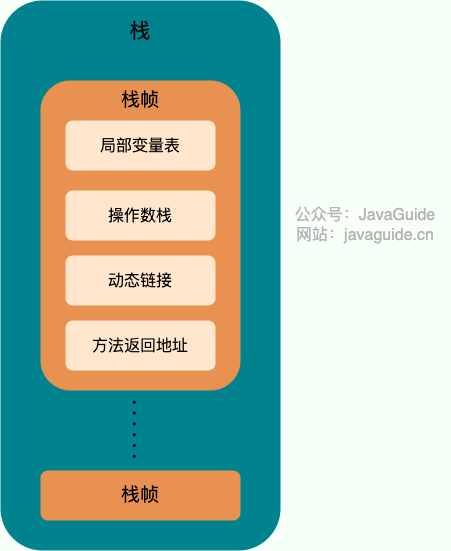
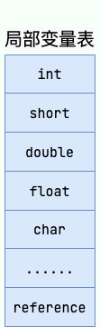
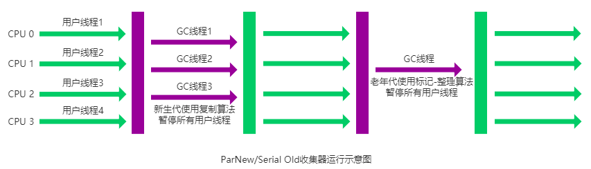
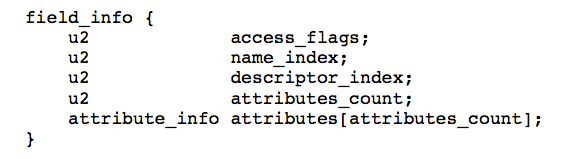
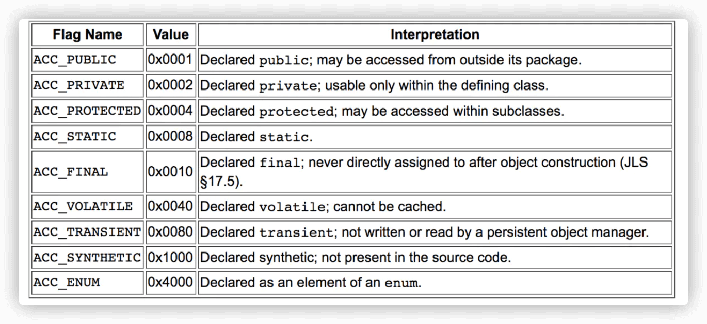

# 目录  
1.Java内存区域  
2.JVM垃圾回收  
3.类文件结构  
5.类加载器详解  


## 1.Java内存区域
**目录:**  
1.1 运行时数据区域  
1.2 程序计数器  
1.3 虚拟机栈  
1.4 本地方法栈  
1.5 堆  
1.6 元空间  
1.7 运行时常量池  
1.8 字符串常量池  
1.9 直接内存  
1.10 对象的创建  
1.11 对象的内存布局  
1.12 对象的访问定位    


### 1.1 运行时数据区域
  
从上图可以看出,JVM的内存主要由`运行时数据区域`+`本地内存`两个部分构成  
其中按照<font color="#00FF00">线程间是否共享</font>又可以做如下划分:  
**线程私有:**  
* 虚拟机栈  
* 本地方法栈
* 程序计数器  

**线程共享的:**  
* 堆
* 本地内存

### 1.2 程序计数器
<font color="#00FF00">线程私有的</font>,程序计数器是一块较小的内存空间;可以看作是字节码运行行号的指示器;主要作用也类似于CPU运行时的程序计数器,即用于指向下一条字节码指令的地址.  
正如操作系统中的线程一样,为了保证线程上下文切换后能回到原来的位置继续执行,需要将程序计数器内存保存在寄存器中;即每个线程都需要有一个独立的程序计数器.各线程之间计数器互不影响,独立存储  

*注意:程序计数器是唯一一个不会出现`OutOfMemoryError`的内存区域,它的生命周期随着线程的创建而创建,随着线程的结束而死亡*

### 1.3 虚拟机栈
<font color="#00FF00">线程私有的</font>,除了Java中native方法是通过本地方法栈实现的,其它所有的Java方法调用都是通过虚拟机栈来实现的.  
方法调用的数据需要通过栈进行传递,<font color="#00FF00">每一次方法调用都会有一个对应的栈帧被压入栈中,每一个方法调用结束后,都会有一个栈帧被弹出</font>  
栈由一个个<font color="#FF00FF">栈帧</font>组成,而每个栈帧中都拥有:局部变量表、操作数栈、动态链接、方法返回地址;和数据结构上的栈类似,两者都是先进后出的数据结构,只支持出栈和入栈两种操作  
**<font color="#FF00FF">一个方法调用对应一个栈帧</font>**

  

1.局部变量表  
主要存放了编译期可知的各种数据类型boolean、byte、char、short、int、float、long、double、对象引用(reference类型,它不同于对象本身,可能是一个指向对象起始地址的引用指针,也可能是指向一个代表对象的句柄或其他与此对象相关的位置)  
  

2.操作数栈  
主要作为方法调用的中转站使用,用于存放方法执行过程中产生的中间计算结果.另外,计算过程中产生的临时变量也会放在操作数栈中  

3.动态链接  
主要服务一个方法需要调用其他方法的场景.Class文件的常量池里保存有大量的符号引用比如方法引用的符号引用.当一个方法要调用其他方法,需要将常量池中指向方法的符号引用转化为其在内存地址中的<font color="#00FF00">直接引用</font>.动态链接的作用就是为了将符号引用转换为调用方法的直接引用,这个过程也被称为**动态连接**  
  
栈空间不是无限的,如果函数调用陷入无限循环的话,就会导致栈中被压入太多栈帧而占用太多空间,导致栈空间过深;那么当线程请求栈的深度超过当前Java虚拟机栈的最大深度的时候,就会抛出`StackOverFlowError`错误  

Java方法有两种返回方式,一种是`return`语句正常返回,一种是`抛出异常`.不管哪种返回方式,<font color="#00FF00">都会导致栈帧被弹出</font>.也就是说,栈帧随着方法调用而创建,随着方法结束而销毁.无论方法正常完成还是异常完成都算作方法结束  
除了`StackOverFlowError`错误之外,栈还可能会出现`OutOfMemoryError`错误,这是因为栈的内存大小可以动态扩展,如果虚拟机在动态扩展栈时无法申请得到足够的空间内存,则抛出`OutOfMemoryError`异常  

总结程序运行中栈可能会出现两种错误:  
* StackOverFlowError:若栈的内存大小不允许动态扩展,那么当线程请求栈的深度超过当前Java虚拟机栈的最大深度的时候,就抛出`StackOverFlowError`错误
* OutOfMemoryError:如果栈的内存大小可以动态扩展,如果虚拟机在动态扩展栈时无法申请到足够的内存空间,则抛出`OutOfMemoryError`异常  

### 1.4 本地方法栈
**介绍:**  
和虚拟机栈所发挥的作用非常相似,区别是:**虚拟机栈为虚拟机执行Java方法(也就是字节码)服务,而本地方法栈则为虚拟机使用到的Native方法服务**  
本地方法被执行的时候,在本地方法栈也会创建一个栈帧,用于存放该本地方法的局部变量表、操作数栈、动态链接、出口信息  
方法执行完毕后相应的栈帧也会出栈并释放内存空间,也会出现`StackOverFlowError`和`OutOfMemoryError`两种错误  


### 1.5 堆
<font color="#00FF00">线程共享</font>**此内存区域的唯一目的就是存放对象实例**  
Java堆是垃圾收集器管理的主要区域,因此也被称为GC堆,从垃圾回收的角度,由于现在收集器基本都采用分代垃圾收集算法,所以堆还可以细分为<font color="#00FF00">新生代和老年代</font>,再细分还可以分为Eden、Survivor、Old等空间,进一步划分的目的是更好地回收内存,或者更快地分配内存.  
堆内存通常分为以下三个部分:  
* 新生代
* 老年代
* 永久代(元空间)


下图所示的Eden区、两个Survivor区S0和S1都属于新生代,中间一层属于老年代,最下面一层属于永久代(元空间)  
  
**JDK8版本之后PermGen(永久代)已被 Metaspace(元空间)取代,元空间使用的是本地内存**  
大部分情况,对象都会首先在Eden区域分配(在Eden区域分配的对象的年龄默认是0),在一次新生代垃圾回收后,如果对象还存活,则会进入S0或者S1,并且对象的年龄还会加1(Eden区->Survivor区后对象的初始年龄变为1),当它的年龄增加到一定程度(默认为15岁),就会被晋升到老年代中.对象晋升到老年代的年龄阈值,可以通过参数`-XX:MaxTenuringThreshold`来设置  
<font color="#00FF00">实际上新生代晋升老年代的阈值是动态产生的:</font>  
Hotspot会遍历所有的对象,按照年龄从小到大对其占用的大小进行累积,当累积的某个年龄在survivor区占用的内存大小超过该区域内存的一半时;取这个年龄和`MaxTenuringThreshold`中更小的一个值,作为新的晋升年龄阈值  

### 1.6 元空间
元空间隶属于本地内存,所以是<font color="#00FF00">线程共享</font>  
元空间会存储已被虚拟机加载的**类信息、字段信息、方法信息、常量、静态变量、即时编译器编译后的代码缓存**等数据  

1.元空间使用的是本地内存,受到本机可用内存的限制;可以使用`-XX:MaxMetaspaceSize`参数来设置元空间大小,默认值为unlimited;意味着它只受系统内存限制,元空间会在运行时根据应用程序需求动态地重新调整大小.  

2.元空间里面存放的是类的元数据,这样加载多少类的元数据就不由MaxPermSize控制了,而由系统的实际可用空间来控制,这样能加载的类就更多了  

3.一些相关的参数设置  
```java
-XX:MetaspaceSize=N     //设置 Metaspace 的初始(和最小大小)
-XX:MaxMetaspaceSize=N //设置 Metaspace 的最大大小
```

### 1.7 运行时常量池
运行时常量池隶属于元空间,所以是<font color="#00FF00">线程共享</font>  
Class文件中除了有类的版本、字段、方法、接口等描述信息外,还有用于存放编译期生成的各种字面量(Literal)和符号引用(Symbolic Reference)的常量池表(Constant Pool Table)  
字面量是源代码中的固定值的表示法,即通过字面我们就能知道其值的含义.字面量包括整数、浮点数和字符串字面量.常见的符号引用包括类符号引用、字段符号引用、方法符号引用、接口方法符号  

### 1.8 字符串常量池
字符串常量池隶属于堆,所以是<font color="#00FF00">线程共享</font>  
字符串常量池是JVM为了提升性能和减少内存消耗针对<font color="#00FF00">字符串</font>(String 类)专门开辟的一块区域,主要目的是为了**避免字符串的重复创建**  

### 1.9 直接内存
直接内存是一种特殊的内存缓冲区,并不在Java堆或方法区中分配的,而是通过JNI的方式在本地内存上分配的  
直接内存受操作系统管理(而不是虚拟机),这样做的结果就是能够在一定程度上减少垃圾回收对应用程序造成的影响  

### 1.10 对象的创建
对象的创建分为5步  

1.类加载检查  
虚拟机遇到一条new指令时,首先将去检查这个指令的参数是否能在常量池中定位到这个类的符号引用,并且检查这个符号引用代表的类是否已被加载过、解析和初始化过.如果没有,那必须<font color="#00FF00">先执行相应的类加载过程</font>  

2.分配内存  
在类加载检查通过后,接下来虚拟机将为新生对象**分配内存**.<font color="#00FF00">对象所需的内存大小在类加载完成后便可确定</font>,为对象分配空间的任务等同于把一块确定大小的内存从Java堆中划分出来.分配方式有`指针碰撞`和`空闲列表`两种,选择哪种分配方式由Java堆是否规整决定,而Java堆是否规整又由所采用的垃圾收集器是否带有压缩整理功能决定  

**内存分配的两种方式**  
* 指针碰撞:  
  * 适用场合:堆内存规整(即没有内存碎片)的情况下
  * 原理:用过的内存全部整合到一边,没有用过的内存放在另一边,中间有一个分界指针,只需要沿着没用过的内存方向<font color="#00FF00">将该指针移动对象内存大小位置即可</font><font color="#FF00FF">效果类似操作系统的紧凑</font>
  * 使用该分配方式的GC收集器:Serial、ParNew
* 空闲列表:
  * 适用场合:堆内存不规整的情况下
  * 原理:虚拟机会维护一个列表,该列表中会记录哪些内存块是可用的,在分配的时候,找一块儿足够大的内存块儿来划分给对象实例,最后更新列表记录<font color="#FF00FF">效果类似操作系统的分区描述表</font>
  * 使用该分配方式的GC收集器:CMS

选择以上两种方式中的哪一种,取决于Java堆内存是否规整.而Java堆内存是否规整,取决于GC 收集器的算法是`标记-清除`,还是`标记-整理`,值得注意的是,`复制算法`内存也是规整的  

**内存分配并发问题**  
在创建对象的时候有一个很重要的问题,就是线程安全,因为在实际开发过程中,创建对象是很频繁的事情,作为虚拟机来说,必须要保证线程是安全的,通常来讲,虚拟机采用两种方式来保证线程安全:  
* CAS+失败重试:CAS是乐观锁的一种实现方式.所谓乐观锁就是,每次不加锁而是假设没有冲突而去完成某项操作,如果因为冲突失败就重试,直到成功为止.虚拟机采用CAS配上失败重试的方式保证更新操作的原子性.
* TLAB:为每一个线程预先在Eden区分配一块儿内存,JVM在给线程中的对象分配内存时,首先在TLAB分配,当对象大于TLAB中的剩余内存或TLAB的内存已用尽时,再采用上述的CAS进行内存分配

关于内存分配的详细内容见:2.JVM垃圾回收=>2.1内存分配和回收原则

3.初始化零值  
内存分配完成后,虚拟机需要将分配到的内存空间都初始化为零值(不包括对象头),这一步操作保证了对象的实例字段在Java代码中可以不赋初始值就直接使用,程序能访问到这些字段的数据类型所对应的零值  

4.设置对象头  
初始化零值完成之后,虚拟机要对对象进行必要的设置,例如这个对象是哪个类的实例、如何才能找到类的元数据信息、对象的哈希码、对象的 GC 分代年龄等信息.这些信息存放在对象头中.另外,根据虚拟机当前运行状态的不同,如是否启用偏向锁等,对象头会有不同的设置方式  

5.执行init方法  
在上面工作都完成之后,从虚拟机的视角来看,一个新的对象已经产生了,但从Java程序的视角来看,对象创建才刚开始,`init`方法还没有执行,所有的字段都还为零.所以一般来说,执行new指令之后会接着执行`init`方法,把对象按照程序员的意愿进行初始化,这样一个真正可用的对象才算完全产生出来.  

### 1.11 对象的内存布局
在Hotspot虚拟机中,对象在内存中的布局可以分为3块区域:**对象头、实例数据、对齐填充**  

Hotspot虚拟机的<font color="#00FF00">对象头</font>包括两部分信息:  
第一部分用于存储对象自身的运行时数据(哈希码、GC 分代年龄、锁状态标志等等)  
第二部分是类型指针-即对象指向它的类元数据的指针,虚拟机通过这个指针来确定这个对象是哪个类的实例  

<font color="#00FF00">实例数据</font>部分是对象真正存储的有效信息  

<font color="#00FF00">对齐填充</font>部分,因为Hotspot虚拟机的自动内存管理系统要求对象起始地址必须是8字节的整数倍;当当对象<font color="#00FF00">实例数据</font>部分没有对齐时,就需要通过对齐填充来补全  

### 1.12 对象的访问定位
Java程序通过栈上的<font color="#00FF00">reference数据</font>来操作堆上的具体对象.对象的访问方式由虚拟机实现而定,目前主流的访问方式有:`使用句柄`、`直接指针`  

1.句柄  
如果使用句柄的话,那么Java堆中将会划分出一块内存来作为句柄池,reference中存储的就是对象的句柄地址,而句柄中包含了对象实例数据与对象类型数据各自的具体地址信息  

2.直接指针  
如果使用直接指针访问,reference中存储的直接就是对象的地址  


## 2.JVM垃圾回收
**目录:**  
2.1 内存分配和回收原则  
2.2 死亡对象判断方法  
2.3 垃圾收集算法  
2.4 垃圾收集器  

### 2.1 内存分配和回收原则
由于现在收集器基本都采用分代垃圾收集算法,所以Java堆被划分为了几个不同的区域,这样我们就可以根据各个区域的特点选择合适的垃圾收集算法  
  

1.对象优先在Eden区分配  
大多数情况下,对象在新生代中Eden区分配.当Eden区没有足够空间进行分配时,虚拟机将发起一次<font color="#00FF00">Minor GC</font>  
当Eden区没有足够空间进行分配时,虚拟机将发起一次Minor GC.GC期间虚拟机又发现,如果S0或者S1这两个区域无法放入对象,所以只好通过<font color="#00FF00">分配担保机制</font>把新生代的对象提前转移到老年代中去,因为老年代足够放入对象,所以不会出现Full GC.执行Minor GC后,后面分配的对象如果能够存在Eden区的话,还是会在Eden区分配内存.  

**分配担保机制**  
空间分配担保是为了确保在Minor GC<font color="#FF00FF">之前</font>老年代本身还有容纳新生代所有对象的剩余空间  
JDK 6 Update 24 之前,在发生Minor GC之前,虚拟机必须先检查老年代最大可用的连续空间是否大于新生代所有对象总空间,如果这个条件成立,那这一次Minor GC可以确保是安全的.如果不成立,则虚拟机会先查看`-XX:HandlePromotionFailure`参数的设置值是否允许担保失败(Handle Promotion Failure);如果允许,那会继续检查老年代最大可用的连续空间是否大于历次晋升到老年代对象的平均大小,如果大于,将尝试进行一次Minor GC,尽管这次Minor GC是有风险的;如果小于,或者`-XX:HandlePromotionFailure`设置不允许冒险,那这时就要改为进行一次Full GC.<font color="#00FF00">JDK 6 Update 24之后的规则变为只要老年代的连续空间大于新生代对象总大小或者历次晋升的平均大小,就会进行Minor GC,否则将进行 Full GC.</font>


2.大对象直接进入老年代  
大对象就是需要大量连续内存空间的对象(比如:字符串、数组)  
大对象直接进入老年代的行为是由虚拟机动态决定的,它与具体使用的垃圾回收器和相关参数有关.大对象直接进入老年代是一种优化策略,<font color="#00FF00">旨在避免将大对象放入新生代,从而减少新生代的垃圾回收频率和成本.</font>  
* G1垃圾回收器会根据`-XX:G1HeapRegionSize`参数设置的堆区域大小和`-XX:G1MixedGCLiveThresholdPercent`参数设置的阈值,来决定哪些对象会直接进入老年代  
* Parallel Scavenge垃圾回收器中,默认情况下,并没有一个固定的阈值(`XX:ThresholdTolerance`是动态调整的)来决定何时直接在老年代分配大对象.而是由虚拟机根据当前的堆内存情况和历史数据动态决定  

3.长期存活的对象将进入老年代  
jvm虚拟机在每一个对象头信息中都设置了该对象年龄(age),通过这个年龄(age)JVM就能够判断出这个对象是存放于新生代还是老年代.  
大部分情况,对象都会**首先**在Eden区域分配.<font color="#00FF00">如果对象在Eden出生并经过第一次Minor GC后仍然能够存活,并且能被Survivor(Survivor是S0和S1的总称)容纳的话,将被移动到Survivor空间(s0或者s1)中</font>,并将对象年龄设为1(Eden区->Survivor区后对象的初始年龄变为1)  

对象在Survivor中每熬过一次<font color="#00FF00">MinorGC</font>,年龄就增加1岁,当它的年龄增加到一定程度(默认为15岁),就会被晋升到老年代中.对象晋升到老年代的年龄阈值,可以通过参数`-XX:MaxTenuringThreshold`来设置.  
<font color="#00FF00">实际上新生代晋升老年代的阈值是动态产生的:</font>  
Hotspot会遍历所有的对象,按照年龄从小到大对其占用的大小进行累积,当累积的某个年龄在survivor区占用的内存大小超过该区域内存的一半时;取这个年龄和`MaxTenuringThreshold`中更小的一个值,作为新的晋升年龄阈值  

4.GC分类  
针对HotSpot VM的实现,它里面的GC其实准确分类只有两大种:部分收集(Partial GC)、整堆收集(Full GC)  

部分收集(Partial GC):  
* 新生代收集(Minor GC / Young GC):只对新生代进行垃圾收集
* 老年代收集(Major GC / Old GC):只对老年代进行垃圾收集.需要注意的是Major GC在有的语境中也用于指代整堆收集
* 混合收集(Mixed GC):对整个新生代和<font color="#00FF00">部分</font>老年代进行垃圾收集  

整堆收集(Full GC):收集整个Java堆和元空间  

### 2.2 死亡对象判断方法
要回收对象之前必须先判断对象是否已经死亡,有两种方法分析:引用计数法、可达性分析  

1.引用计数法  
给对象中添加一个引用计数器  
* 每当有一个地方引用它,计数器就加1
* 当引用失效,计数器就减1
* 任何时候计数器为0的对象就是不可能再被使用的

这个方法实现简单,效率高,但是目前主流的虚拟机中并没有选择这个算法来管理内存,其最主要的原因是它<font color="#FF00FF">很难解决对象之间循环引用的问题</font>  
  

```java
public class ReferenceCountingGc {
    Object instance = null;
    public static void main(String[] args) {
        ReferenceCountingGc objA = new ReferenceCountingGc();
        ReferenceCountingGc objB = new ReferenceCountingGc();
        objA.instance = objB;
        objB.instance = objA;
        objA = null;
        objB = null;
    }
}
```
所谓循环引用就是两个对象互相引用对方,<font color="#00FF00">导致它们的引用计数器都不为0</font>于是引用计数算法无法通知GC回收器回收他们  

2.可达性分析  
这个算法的基本思想就是通过一系列的称为"GC Roots"的对象作为起点,从这些节点开始向下搜索,节点所走过的路径称为引用链,当一个对象到GC Roots没有任何引用链相连的话,则证明此对象是不可用的,需要被回收.  
下图中的`Object 6 ~ Object 10`之间虽有引用关系,但它们到GC Roots不可达,因此为需要被回收的对象  
  

**GC Roots对象的选举规则**  
* 虚拟机栈(栈帧中的局部变量表)中引用的对象
* 本地方法栈(Native方法)中引用的对象
* 方法区中类静态属性引用的对象
* 方法区中常量引用的对象
* 所有被同步锁持有的对象
* JNI引用的对象

3.引用类型总结  
无论是通过引用计数法判断对象引用数量,还是通过可达性分析法判断对象的引用链是否可达,判定对象的存活都与"引用"有关  
JDK1.2之前,Java中引用的定义很传统:如果reference类型的数据存储的数值代表的是另一块内存的起始地址,就称这块内存代表一个引用.  
JDK1.2以后,Java对引用的概念进行了扩充,将引用分为强引用、软引用、弱引用、虚引用四种(引用强度逐渐减弱)  

3.1 强引用(StrongReference)  
User user = new User()就是强引用,在Java中最常见的就是强引用,把一个对象赋给一个引用变量,这个引用变量就是一个强引用.当一个对象被强引用变量引用时,它始终处于可达状态,它是<font color="#00FF00">不可能被垃圾回收机制回收</font>的,即使该对象以后永远都不会被用到JVM也不会回收.因此强引用是造成Java内存泄露的主要原因之一.如果在方法内部new对象的话,只要方法弹栈,对象就会销毁.  

3.2 软引用(SoftReference)  
会用到SoftReference类,对于只有软引用的对象来说,当系统内存足够时它是不会被回收,当系统内存空间不足时它会被回收.软引用通常用在对内存敏感的程序中,作为缓存使用  

3.3 弱引用(WeakReference)  
在垃圾回收器线程扫描它所管辖的内存区域的过程中,一旦发现了只具有弱引用的对象,不管当前内存空间足够与否,都会回收它的内存.可以解决内存泄露问题,ThreadLocal就是基于弱引用解决内存泄露的问题.  

3.4 虚引用(PhantomReference)  
**虚引用主要用来跟踪对象被垃圾回收的活动**  
虚引用必须和引用队列(ReferenceQueue)联合使用  

4.如何判断一个常量是废弃常量  
*注意JDK字符串常量是存放在堆中的字符串常量池中的,而运行时常量是存放在元空间中的*  
假如在字符串常量池中存在字符串"abc",如果当前没有任何String对象引用该字符串常量的话,就说明常量"abc"就是废弃常量,如果这时发生内存回收的话而且有必要的话,"abc"就会被系统清理出常量池了  

5.如何判断一个类是无用的类  
<font color="#00FF00">元空间的主要回收对象就是无用的类信息</font>,类需要同时满足三个条件才能算是"无用的类"  
* 该类所有的实例都已经被回收,也就是Java堆中不存在该类的任何实例
* 加载该类的ClassLoader已经被回收
* 该类对应的java.lang.Class对象没有在任何地方被引用,无法在任何地方通过反射访问该类的方法

JVM可以对满足了上述三个条件的无用类进行回收,但也不是立即回收  

### 2.3 垃圾收集算法
1.标记-清除算法  
标记-清除(Mark-and-Sweep)算法分为"标记(Mark)"和"清除(Sweep)"阶段:首先标记出所有不需要回收的对象,在标记完成后统一回收掉所有没有被标记的对象  

**问题:**  
* 效率问题:标记和清除两个过程效率都不高
* 空间问题:标记清除后会产生大量不连续的<font color="#00FF00">内存碎片</font>  

  

2.复制算法  
**为了解决标记-清除算法的效率和内存碎片问题**,出现了`复制(Copying)收集`算法.它可以将内存分为大小相同的两块,每次使用其中的一块.当这一块的内存使用完后,就将还存活的对象复制到另一块去,然后再把使用的空间一次清理掉.这样就使每次的内存回收都是对内存区间的一半进行回收  
  

**问题:**  
* 可用内存变小:可用内存缩小为原来的一半
* 不适合老年代:如果存活对象数量比较大,复制性能会变得很差

3.标记-整理算法  
标记-整理(Mark-and-Compact)算法是根据老年代的特点提出的一种标记算法,标记过程仍然与"标记-清除"算法一样,但后续步骤不是直接对可回收对象回收,而是让所有存活的对象向一端移动,然后直接清理掉端边界以外的内存  

  

**问题:**  
* 多了整理这一步,因此效率也不高,适合老年代这种垃圾回收频率不是很高的场景

4.分代收集算法  
当前虚拟机的垃圾收集都采用分代收集算法,这种算法没有什么新思想;<font color="#FF00FF">只是根据对象存活周期的不同将内存分为几块</font>;JVM将堆内存划分为新生代和老年代就是为了可以<font color="#00FF00">根据各个年代的特点选择合适的垃圾收集算法.</font>  

比如在新生代中,每次收集都会有大量对象死去,所以可以选择"标记-复制"算法,只需要付出少量对象的复制成本就可以完成每次垃圾收集.而老年代的对象存活几率是比较高的,而且没有额外的空间对它进行分配担保,所以我们必须选择"标记-清除"或"标记-整理"算法进行垃圾收集  

### 2.4 垃圾收集器
1.Serial收集器  
单线程收集器,该收集器回收内存期间,<font color="#00FF00">所有的工作线程都必须暂停</font>直到回收完成.  
新生代采用`标记-复制`算法,老年代采用`标记-整理`算法  

  

2.ParNew收集器  
ParNew收集器其实就<font color="#00FF00">是Serial收集器的多线程版本</font>,除了使用多线程进行垃圾收集外,其余行为(控制参数、收集算法、回收策略等等)和Serial收集器完全一样;注意老年代还是使用串行  
新生代采用`标记-复制`算法,老年代采用`标记-整理`算法  
  

**特点:**  
除了Serial收集器外,只有ParNew收集器能与CMS垃圾收集器配合工作  

3.Parallel Scavenge收集器  
Parallel Scavenge收集器也是使用`标记-复制`算法的多线程收集器,它看上去几乎和ParNew都一样,主要区别在于Parallel Scavenge收集器可以指定老年代是串行还是并行收集 
```shell
-XX:+UseParallelGC

    使用 Parallel 收集器+ 老年代串行

-XX:+UseParallelOldGC

    使用 Parallel 收集器+ 老年代并行
```

Parallel Scavenge收集器关注点是吞吐量(高效率的利用 CPU)  
CMS等垃圾收集器的关注点更多的是用户线程的停顿时间(提高用户体验)

新生代采用`标记-复制`算法,老年代采用`标记-整理`算法 


4.CMS垃圾收集器  
**介绍:**  
CMS收集器是一种`标记-清除`算法实现的  
**CMS收集器是一种以获取最短回收停顿时间为目标的收集器;注重停顿时间**  
它的运作过程分为四步:  
* 初始标记:暂停所有的其他线程,并记录下直接与root相连的对象,速度很快  
* 并发标记:<font color="#00FF00">同时开启GC和用户线程</font>,用一个闭包结构去记录可达对象.但在这个阶段结束,这个闭包结构并不能保证包含当前所有的可达对象.因为用户线程可能会<font color="#00FF00">不断的更新引用域</font>,所以GC线程无法保证可达性分析的实时性.所以这个算法里会跟踪记录这些发生引用更新的地方.  
* 重新标记:<font color="#00FF00">重新标记阶段就是为了修正并发标记期间因为用户程序继续运行而导致标记产生变动的那一部分对象的标记记录</font>,这个阶段的停顿时间一般会比初始标记阶段的时间稍长,远远比并发标记阶段时间短
* 并发清除:开启用户线程,同时GC线程开始对未标记的区域做清扫

  


**缺点:**  
* 对CPU资源敏感
* 无法处理浮动垃圾
* 它使用的回收算法`标记-清除`算法会导致收集结束时会有大量空间碎片产生

5.G1收集器  
**介绍:**  
G1是一款面向服务器的垃圾收集器,主要针对配备多颗处理器及大容量内存的机器.以极高概率满足GC停顿时间要求的同时,还具备高吞吐量性能特征  
**G1收集器的主要特点是,它会尽最大努力达到用户指定的停顿时间**;G1能够建立可预测的停顿时间模型,能让使用者明确指定在一个长度为M毫秒的时间片段内,消耗在垃圾收集上的时间不得超过N毫秒  

它的运行过程:  
* 初始标记
* 并发标记
* 最终标记
* 筛选回收

  
G1收集器在后台维护了一个优先列表,每次根据允许的收集时间,优先选择<font color="#00FF00">回收价值最大的Region(区域)</font>这种使用Region划分内存空间以及有优先级的区域回收方式,<font color="#00FF00">保证了G1收集器在有限时间内可以尽可能高的收集效率</font>


## 3.类文件结构
**目录:**  
3.1 Class文件结构  


### 3.1 Class文件结构
根据Java虚拟机规范,class文件通过`ClassFile`定义,类似于C的结构体  
```c
ClassFile {
    u4             magic; //Class 文件的标志
    u2             minor_version;//Class 的小版本号
    u2             major_version;//Class 的大版本号
    u2             constant_pool_count;//常量池的数量
    cp_info        constant_pool[constant_pool_count-1];//常量池
    u2             access_flags;//Class 的访问标记
    u2             this_class;//当前类
    u2             super_class;//父类
    u2             interfaces_count;//接口数量
    u2             interfaces[interfaces_count];//一个类可以实现多个接口
    u2             fields_count;//字段数量
    field_info     fields[fields_count];//一个类可以有多个字段
    u2             methods_count;//方法数量
    method_info    methods[methods_count];//一个类可以有个多个方法
    u2             attributes_count;//此类的属性表中的属性数
    attribute_info attributes[attributes_count];//属性表集合
}
```

  

**接下来对这些字段进行详细介绍**  
1.魔数(Magic)  
`u 4magic; //Class 文件的标志`  
每个Class文件的头4个字节称为魔数(Magic Number),它的唯一作用是确定这个文件是否为一个能被虚拟机接收的Class文件.Java规范规定魔数为固定值:0xCAFEBABE.如果读取的文件不是以这个魔数开头,Java虚拟机将拒绝加载它.  

2.Class文件版本号(Minor Version &Major Version)  
```java
u2      minor_version;//Class 的小版本号
u2      major_version;//Class 的大版本号
```
紧接着魔数的四个字节存储的是Class文件的版本号:第5和第6个字节是**次版本号**,第7和第8个字节是**主版本号**  
每当Java发布大版本(比如 Java 8,Java9)的时候,主版本号都会加1.可以使用`javap -v`命令来快速查看Class文件的版本号信息  

3.常量池(Constant Pool)  
```java
u2          constant_pool_count;//常量池的数量
cp_info     constant_pool[constant_pool_count-1];//常量池
```

常量池主要存放两大常量:字面量和符号引用字面量比较接近于Java语言层面的的常量概念,如文本字符串、声明为final的常量值等.而符号引用则属于编译原理方面的概念.包括下面三类常量:  
* 类和接口的全限定名
* 字段的名称和描述符
* 方法的名称和描述符

<font color="#00FF00">常量池中每一项常量都是一个表</font>  
|               类型               | 标志(tag) |          描述          |
| :------------------------------: | :-------: | :--------------------: |
|        CONSTANT_utf8_info        |     1     |   UTF-8 编码的字符串   |
|      CONSTANT_Integer_info       |     3     |       整形字面量       |
|       CONSTANT_Float_info        |     4     |      浮点型字面量      |
|        CONSTANT_Long_info        |     5     |      长整型字面量      |
|       CONSTANT_Double_info       |     6     |   双精度浮点型字面量   |
|       CONSTANT_Class_info        |     7     |   类或接口的符号引用   |
|       CONSTANT_String_info       |     8     |    字符串类型字面量    |
|      CONSTANT_FieldRef_info      |     9     |     字段的符号引用     |
|     CONSTANT_MethodRef_info      |    10     |   类中方法的符号引用   |
| CONSTANT_InterfaceMethodRef_info |    11     |  接口中方法的符号引用  |
|    CONSTANT_NameAndType_info     |    12     |  字段或方法的符号引用  |
|     CONSTANT_MethodType_info     |    16     |      标志方法类型      |
|    CONSTANT_MethodHandle_info    |    15     |      表示方法句柄      |
|   CONSTANT_InvokeDynamic_info    |    18     | 表示一个动态方法调用点 |


4.访问标志(Access Flags)  
`u2     access_flags;   //Class 的访问标记`  
在常量池结束之后,紧接着的两个字节代表访问标志,这个标志用于识别一些类或者接口层次的访问信息,包括:这个Class是类还是接口,是否为`public`或者`abstract`类型,如果是类的话是否声明为`final`  
类访问和属性修饰符:  
  

5.当前类(This Class)、父类(Super Class)、接口(Interfaces)索引集合  
```java
u2      this_class;//当前类
u2      super_class;//父类
u2      interfaces_count;//接口数量
u2      interfaces[interfaces_count];//一个类可以实现多个接口
```
Java类的继承关系由类索引、父类索引和接口索引集合三项确定.类索引、父类索引和接口索引集合按照顺序排在访问标志之后  
类索引用于确定这个类的全限定名,父类索引用于确定这个类的父类的全限定名,由于Java语言的单继承,所以父类索引只有一个,除了`java.lang.Object`之外,所有的Java类都有父类,因此除了`java.lang.Object`外,所有Java类的父类索引都不为0.  
接口索引集合用来描述这个类实现了那些接口,这些被实现的接口将按`implements`(如果这个类本身是接口的话则是`extends`)后的接口顺序从左到右排列在接口索引集合中.  

5.字段表集合(Fields)  
```java
u2             fields_count;//字段数量
field_info     fields[fields_count];//一个类会可以有个字段
```
字段表(field info)用于描述接口或类中声明的变量.字段包括<font color="#00FF00">静态变量以及实例变量</font>,但不包括在方法内部声明的局部变量  
**field info(字段表)的结构:**  
  

* access_flags:字段的作用域(public,private,protected修饰符),是实例变量还是类变量(static修饰符),可否被序列化(transient修饰符),可变性(final),可见性(volatile修饰符,是否强制从主内存读写).
* name_index:对常量池的引用,表示的字段的名称
* descriptor_index:对常量池的引用,表示字段和方法的描述符
* attributes_count:一个字段还会拥有一些额外的属性,attributes_count存放属性的个数
* attributes[attributes_count]:存放具体属性具体内容

**字段表的access_flag的取值:**  
  

6.方法表集合(Methods) 
```java
u2             methods_count;//方法数量
method_info    methods[methods_count];//一个类可以有个多个方法
```
methods_count表示方法的数量,而method_info表示方法表  

Class文件存储格式中对方法的描述与对字段的描述几乎采用了完全一致的方式.方法表的结构如同字段表一样,依次包括了<font color="#00FF00">访问标志、名称索引、描述符索引、属性表集合</font>几项  

**method_info(方法表的)结构:**  
  
**方法表的access_flag取值:**  
  


7.属性表集合(Attributes)  
```java
u2                  dattributes_count;//此类的属性表中的属性数
attribute_info      dattributes[attributes_count];//属性表集合
```


## 5.类加载器详解
**目录:**  
5.1 类加载器  


### 5.1 类加载器

1.类加载器介绍
* 类加载器是一个负责加载类的对象,用于实现类加载过程中的加载这一步
* 每个Java类都有一个引用指向加载它的`ClassLoader`
* 数组类不是通过`ClassLoader`创建的(数组类没有对应的二进制字节流),是由JVM直接生成的

<font color="#FF00FF">类加载器主要就是加载Java类的字节码(.class文件)到JVM中</font>(在内存中生成一个代表该类的Class对象)  
除了加载类之外,类加载器还可以加载Java应用所需的资源如文本、图像、配置文件、视频等等文件资源  

2.类加载器加载规则  
<font color="#FF00FF">JVM启动的时候,并不会一次性加载所有的类,而是根据需要去动态加载</font>即类只有在真正被使用的时候才会被加载,这样对内存更友好  
对于已经加载的类会被放在`ClassLoader`中.在类加载的时候,系统会首先判断当前类是否被加载过.已经被加载的类会直接返回,否则才会尝试加载  

3.类加载器总结  


