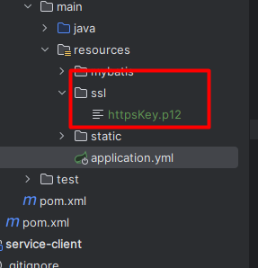

# 目录
1. 领域模型
2. HTTPS证书  
3. 参数校验  
4. 跨域请求  
5. log.error的使用  


* User一定是从controller层获取的,然后传给service层,service层不负责获取当前登录的用户.

## 领域模型
param:提交的表单,该对象可直接转为POJO进行数据库存储.  
VO:用于展示数据  
DTO:转换数据(也用于数据展示)  
BO:进行业务计算所使用的辅助数据;主要作用是把业务逻辑封装成一个对象,这个对象可以包括一个或多个其它的对象.比如一个简历有教育经历、工作经历、社会关系等.我们可以把教育经历对应一个PO,工作经历对应一个PO,社会关系对应一个PO,建立一个对应简历的BO对象处理简历,每个BO包含这些PO.(也就是说BO是多个PO的组合)  
POJO:数据库对象映射 POJO概念上和PO、entity基本一致.POJO实际上是DO/DTO/BO/VO的统称.  
TO:不同应用程序之间传输的对象,例如不同微服务之间传输的对象就可以称之为TO.再例如数据库与Java程序之间传输的对象也可以称之为TO.

VO和DTO在概念上是比较模糊的,一般VO作为DTO的扩展;VO会根据需要对DTO中的内容进行业务解释.  
VO原本指代的是前端用到的数据模型,前端页面提交的数据和在页面上进行展示的数据都是VO,而后端要对VO进行转换转为DTO.例如用户性别在DTO中封装的内容是0和1.并且返回到前端的数据是0和1.前端通过JS或EL等技术将1和0转换为男性或女性.真正在前端展示的这个叫VO;所以VO和后端关系不大,后端着重注意的是DTO对象.  
但现在前端并不进行数据的转换(如果前端不进行数据转换的话就由后端将DTO转为VO),那么就由后端将DTO进一步封装为前端可以直接展示的VO;前端直接拿到VO来进行展示.  
所以根据业务场景,如果一个场景可以直接使用DTO解决那就直接用DTO解决,如果要在DTO之上进一步进行封装那就使用VO.  
所以目前前端传给后端的参数依旧是param,但是前端接受的参数可能是VO也可能是DTO.而pojo是真正对前端隐藏的内容.  
**例子:**  
例如Service层有一个getUser的方法返回一个系统用户,其中有一个属性是gender(性别),对于Service层来说,它只从语义上定义：1-男性,2-女性,0-未指定,而对于展示层来说,它可能需要用"帅哥"代表男性,用"美女"代表女性,用"秘密"代表未指定.说到这里,可能你还会反驳,在服务层直接就返回"帅哥美女"不就行了吗?对于大部分应用来说,这不是问题,但设想一下,如果需求允许客户可以定制风格,而不同风格对于"性别"的表现方式不一样,又或者这个服务同时供多个客户端使用(不同门户),而不同的客户端对于表现层的要求有所不同,那么,问题就来了.再者,回到设计层面上分析,从职责单一原则来看,服务层只负责业务,与具体的表现形式无关,因此,它返回的DTO,不应该出现与表现形式的耦合.

[详情参考:https://blog.csdn.net/JokerLJG/article/details/119656022](https://blog.csdn.net/JokerLJG/article/details/119656022)  

## HTTPS证书
使用Java工具生成证书    
`keytool -genkey -alias anyname -storetype PKCS12 -keyalg RSA -keysize 2048  -keystore D:\httpsKey.p12 -validity 3650
`  
> keytool: 表示keytool工具  
genkey:表示要创建一个新的密钥.  
alias:表示 keystore的别名.anyname都可以(这里我填写wword)  
storetype:表示密钥的仓库类型,存储格式是PKCS12.  
keyalg:表示使用的加密算法是RSA,一种非对称加密算法.  
keysize:表示密钥的长度.这里是2048.  
keystore:表示生成的证书文件存放位置. 这里是D:\httpsKey.p12 ,有时候放C盘可能有权限问题  
validity:表示证书的有效时间,单位为天.这里是3650天也就是十年.  

  

再导出cer文件  
`keytool -export -alias wword -keystore D:/httpsKey.p12 -storepass abc123456789 -file D:/publickey.cer`  

  

**记住刚才输入的口令,待会在application.yml配置文件中需要用到.**  
将证书导入到项目中去  
  

在application.yml配置文件中添加如下内容  
```yml
server:
  ssl:
    key-store: classpath:ssl/httpsKey.p12
    key-store-password: abc123456789
    key-store-type: PKCS12
    key-alias: wword
```

key-store-password:就是刚才输入的密钥库口令

提供请求工具类:  
**构造方法里面传入publickey.cer文件的输入流即可**  
```java
public class SSLSocketFactoryCreate {

    private SSLSocketFactory sslSocketFactory;

    private X509TrustManager x509TrustManager;

    private final InputStream inputStream;

    private static SSLSocketFactoryCreate sslSocketFactoryCreate;

    public static SSLSocketFactoryCreate newInstance(InputStream inputStream) {
        sslSocketFactoryCreate = new SSLSocketFactoryCreate(inputStream);
        return sslSocketFactoryCreate;
    }

    private SSLSocketFactoryCreate(InputStream inputStream) {
        if (inputStream == null) throw new IllegalArgumentException("inputStream 必须不为null");
        this.inputStream = inputStream;
        initX509TrustManagerAndSSLSocketFactory();
    }

    public SSLSocketFactory getSslSocketFactory() {
        return sslSocketFactory;
    }

    public X509TrustManager getX509TrustManager() {
        return x509TrustManager;
    }

    /**
     * 初始化
     */
    private void initX509TrustManagerAndSSLSocketFactory() {
        try {
            x509TrustManager = trustManagerForCertificates(inputStream);//以流的方式读入证书
            if (null != x509TrustManager) {
                SSLContext sslContext = SSLContext.getInstance("TLS");
                sslContext.init(null, new TrustManager[]{x509TrustManager}, null);
                sslSocketFactory = sslContext.getSocketFactory();
            }
        } catch (GeneralSecurityException e) {
            e.printStackTrace();
        } finally {
            try {
                inputStream.close();
            } catch (IOException e) {
                e.printStackTrace();
            }
        }
    }

    /**
     * 以流的方式添加信任证书
     */

    private X509TrustManager trustManagerForCertificates(InputStream in) throws GeneralSecurityException {
        CertificateFactory certificateFactory = CertificateFactory.getInstance("X.509");
        Collection<? extends Certificate> certificates = certificateFactory.generateCertificates(in);
        if (certificates.isEmpty()) {
            throw new IllegalArgumentException("expected non-empty set of trusted certificates");
        }

        // Put the certificates a key store.
        char[] password = "password".toCharArray(); // Any password will work.
        KeyStore keyStore = newEmptyKeyStore(password);
        int index = 0;
        for (Certificate certificate : certificates) {
            String certificateAlias = Integer.toString(index++);
            keyStore.setCertificateEntry(certificateAlias, certificate);
        }

        // Use it to build an X509 trust manager.
        KeyManagerFactory keyManagerFactory = KeyManagerFactory.getInstance(KeyManagerFactory.getDefaultAlgorithm());
        keyManagerFactory.init(keyStore, password);
        TrustManagerFactory trustManagerFactory = TrustManagerFactory.getInstance(TrustManagerFactory.getDefaultAlgorithm());
        trustManagerFactory.init(keyStore);
        TrustManager[] trustManagers = trustManagerFactory.getTrustManagers();
        if (trustManagers.length != 1 || !(trustManagers[0] instanceof X509TrustManager)) {
            throw new IllegalStateException("Unexpected default trust managers:" + Arrays.toString(trustManagers));
        }
        return (X509TrustManager) trustManagers[0];
    }

    /**
     * 添加password
     *
     * @param password
     * @return
     * @throws GeneralSecurityException
     */

    private KeyStore newEmptyKeyStore(char[] password) throws GeneralSecurityException {
        try {
            KeyStore keyStore = KeyStore.getInstance(KeyStore.getDefaultType()); // 这里添加自定义的密码,默认
            InputStream in = null; // By convention, 'null' creates an empty key store.
            keyStore.load(in, password);
            return keyStore;
        } catch (IOException e) {
            throw new AssertionError(e);
        }
    }
}
```

## 参数校验  
校验分组的概念  
首先必须先定义分组,分组定义为接口,例如以下两个分组,CreateCheck和UpdateCheck.表示分别在创建对象时检查,更新对象时检查.  
```java
public interface CreateCheck {
}
```

```java
public interface UpdateCheck {
}
```

下面定义一个param类  
```java
@Data
public class TestValiated {
    @NotNull(message = "修改必须指定品牌id", groups = {UpdateGroup.class})
    @Null(message = "新增不能指定id", groups = {AddGroup.class})
    @Min(message = "用户名或邮箱长度不小于 {value}",value = 6,groups = {AddGroup.class})
    private Long brandId;
}
```

看看校验的时候是怎么指定校验参数的  
```java
@RequestMapping("/addValidated")
public String addValidated(@Validated(AddGroup.class) @RequestBody TestValiated brand){
    return "success";
}
```

此时只有上述的@Min注解和@Null参数校验生效,因为此时指定校验的分组为AddGroup

## 跨域请求  
**注意:** 跨域请求的预检请求方式是option  
**解决方案一:** nginx反向代理,前端和后端都部署到nginx上,所有的请求都走nginx,就不存在跨域问题.  
**解决方案二:** 在进行预检请求时,在响应头中指定相应内容.  

## log.error的使用  
永远不能再log.error方法中直接打印一个异常,必须只打印有价值的参数信息.这是因为在抛出异常的时候该异常会被全局异常处理器捕获,而全局异常处理器本身会调用log.error方法打印该异常的所有信息.  


