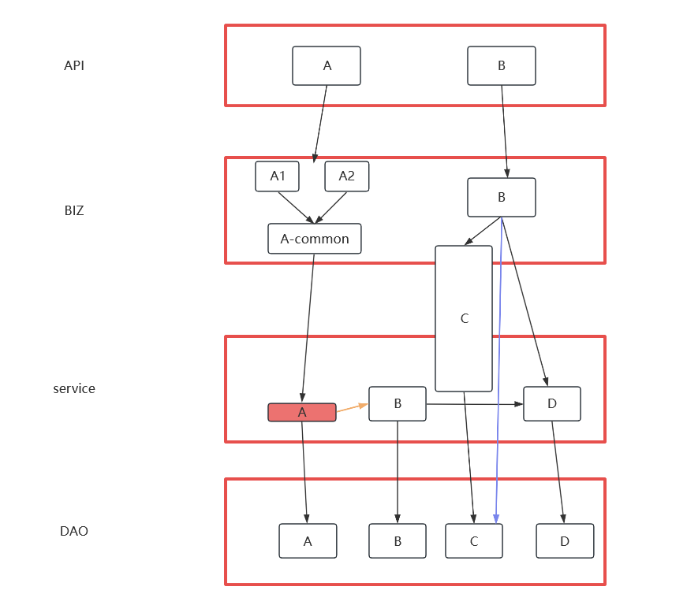
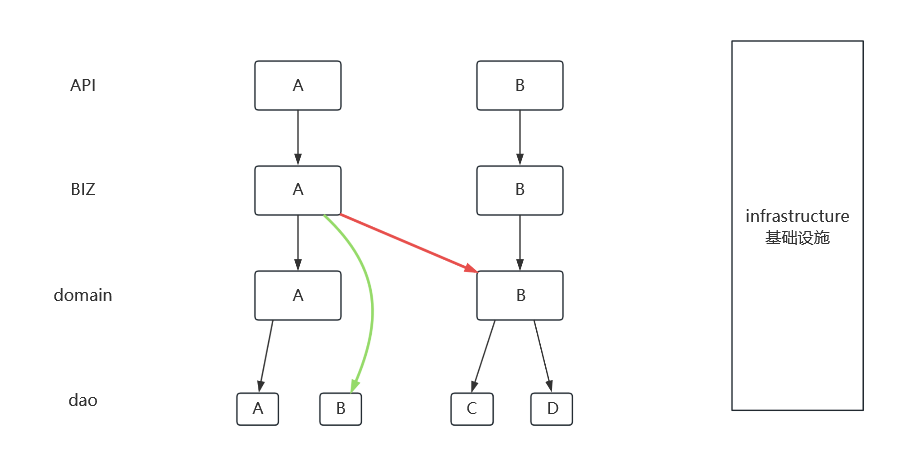

# 目录  
1.MVC存在的问题  
2.DDD领域模型  


## 1.MVC存在的问题  

1.MVC架构  
  
*提示:这里的BIZ可以理解为业务层,可以简单理解为逻辑上的一层,就是业务的执行流程*  

2.代码腐化  
*提示:代码腐化主要体现在以下四点,随着业务的庞大导致代码变成屎山*  

2.1 薄service  
有时会把service中公共的部分抽离出一个common,比如这里的A-common;那么就可能导致一些service只调用了dao层,也即它是名义上存在实质上和dao没什么区别,即<font color="#00FF00">薄service</font>  

2.2 大service  
与薄service对应的就是大service,本来应该由BIZ层完成的却由service层来完成;最终导致业务上浮,大service产生  

2.3 跨层调用  
例如这里蓝色的这条线,BIZ层直接调用了DAO层;当然这个影响不大  

2.4 <font color="#00FF00">层间调用</font>  
例如这里的serviceA调用了serviceB;就属于层间调用;这种层间调用就会导致业务链非常长,这就对业务流程的理解加深了难度  

  
## 2.DDD领域模型  
**目录:**  
2.1 DDD架构图概述  
2.2 领域的划分  

### 2.1 DDD架构图概述  
1.架构图  
  

2.各层说明  
2.1 API的三个作用  
* 定义API的方式
* 透传(就是把参数传递过去)
* 确定对应关系:即一个API对应几个业务

2.2 业务层BIZ  
<font color="#00FF00">业务层只做编排</font>,<font color="#FFC800">根据业务的服务流程</font>对业务进行编排  
编排的理想状态就是一行一行的代码,就不要有其他的代码了,例如:  
```java
// 下单服务
domain.order();
// 库存
domain.stock();
// 支付
domain.pay();
```

2.3 领域层(domain)  
负责领域内的调用,重点在于<font color="#FF00FF">领域层的划分</font>,这个放到后面将  

2.4 DAO层  
dao层不仅仅指数据库,而是任何数据源,甚至有可能是对接的一个应用  

3.DDD中需要遵守的原则  
* 允许跨层调用
  比如很多业务操作为了层级严谨,比如就是查询数据库里的一条记录实际上是没有必要去创建额外的内容,直接调用dao层即可
* 业务的细节放在领域层,即domain层(领域层)
* <font color="#FF00FF">领域层之间不允许相互调用</font>
  为了完全杜绝这种情况可以<font color="#00FF00">允许代码冗余</font>;为了避免层间调用直接从包名上就将领域进行分割
* 事务管理
  在DDD中事务管理有两种解决方案,一种是放在业务层,一种是放在领域层;<font color="#00FF00">放在业务层可能会导致大事务,放在领域层可能会导致一致性问题</font>,这两种方式虽说都有弊端,但只要控制好保持代码统一即可


### 2.2 领域的划分


