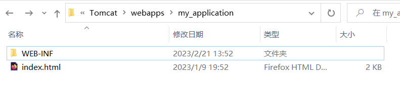

### 文件结构
bin:二进制目录  
* startup:启动Tomcat服务
* shutdown:关闭Tomcat服务
* version:输出版本信息  

conf:存放配置文件
* server.xml:可以配置端口号
* web.xml:  

lib:Tomcat自身依赖库  
logs:Tomcat运行日志  
temp:Tomcat临时文件  
webapps:Tomcat容器存放的所有web项目  
work:只存放运行期间由jsp编译出的.java源码和.class源码(而且是运行时动态编译的)  
### 如何创建一个自已的WebAPP?
直接去webapps下面复制一个项目,然后改名即可,其中一个webAPP有必须有一些基本的文件.  
index.html 默认的主页文件  
WEB-INF 必须有的文件夹

WEB-INF:  
* class:java项目的源文件
* lib:java项目的依赖库
* web.xml:当前web项目的配置文件  
 
`访问localhost:8080/my_applicaiton即可访问自已的项目`
### 如何将自已的项目设为默认项目,以及将项目的工程文件存放到别的路径下?
1. Tomcat中默认的web项目名为ROOT,你可以移花接木把ROOT里面的内容全部改为自已的.
2. 在Tomcat的conf/Catalina/localhost下面根据项目名称新建一个.xml文件,格式为`项目名称.xml`  
比如我可以新建ROOT.xml(就代表ROOT项目),然后再里面填入以下内容:
    ```xml
    <Context docBase="D:\Program\Java Project\my-application" path="/"></Context>
    ```
    这段意思代表的解释,当我们访问根路径的时候,会自动将项目路径定位到D:\Program\Java Project\my-application.
