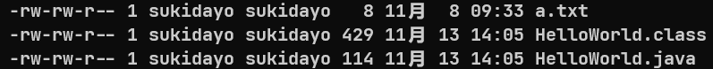

# Linux命令大全

## `Who`:查看登陆系统用户
### `语法:who [-Huqws]`
### 作用:查看登陆系统用户
|选项|作用|
|:-:|:-|
|-H|会在顶部显示头部提示信息|
|-u|显示闲置时间,如果该用户在1分钟之内有进行任何动作,则将其标记为"."号，如果该用户已超过24小时没有任何动作，则标示出"old"字符串|
|-q|只显示登入系统的账号名称和总人数|
|-w|显示用户的信息状态栏|
|-s|显示当前的运行级别|

## `Whoami`:查看当前登陆用户的信息
### `语法:whoami`
### 作用:查看登陆系统用户

## `Alias`:别名
### `语法:alias [aliasName]=`'`[command]`'
### 作用:给命令取别名,注意这种别名的方式关机之后就不起效了,所以只针对这次启动生效.
### 解释:[aliasName]填入别名,[command]处填入一个命令,注意命令需要用单引号括起来.当执行别名的命令时相当于执行了[command]命令.
### 例子:alias listFile='ls -A' 注意目标命令也是可以带参数的

## `Unalias`:释放别名
### `语法:unalias [-a] [aliasName]`
### 作用:释放别名,使别名不起效果.
### 解释:如果有-a代表释放所有别名,加上-a参数时就不需要写[aliasName]了.

## `History`:显示历史命令`
### `语法:history [n]`
### 作用:显示使用过的命令,其中n填入你需要显示多少行之前执行过的命令.
### 例子:history 10 显示刚才执行过的10行命令

## `Apt`:管理软件
### 语法:`apt list --installed` 列出所有已安装的软件包.
### 语法:`apt list --all-versions` 列出所有已安装的包的版本信息.
### 语法:`sudo apt update [packageName]` 更新软件包,packageName为软件包名,如果不写packageName参数则检查所有软件是否可更新.
### 语法:`sudo apt list --upgradable` 列出所有可更新的软件.
### 语法:`sudo apt upgrade` 更新所有软件(系统会分析软件更新的大小,并询问是否确认更新).
### 语法:`sudo apt full-upgrade` 升级软件包,升级前先删除需要更新的软件包.
### 语法:`sudo apt -get install [packageName]` 根据软件包名称下载软件.
### 语法:`sudo apt -get remove [packageName]` 根据软件包名称卸载软件.
### 语法:`sudo apt autoremove` 清除不在使用的依赖和库文件.
### 语法:`sudo apt purge [packageName]` 根据软件包名称卸载软件并删除配置文件.
### 语法:`sudo apt -cache search [packageName]` 根据软件包名搜索软件.
### 语法:`sudo apt -cache depends [packageName]` 显示软件包的依赖信息.
### 解释:软件包名相当于软件名,每个软件的软件包名都不相同,Linux根据软件包名的不同来区分软件.apt命令会从Ubuntu软件仓库中远程下载,这是它和dpkg命令的主要区别.

## `Dpkg`:安装.deb文件
### 语法:`sudo dpkg -i deb [packageName]` 安装deb包
### 语法:`sudo dpkg -l` 显示所有安装的软件包
### 语法:`sudo dpkg -S [packageName]` 列出软件包详细的状态信息
### 语法:`sudo dpkg -L [packageName]` 列出属于软件包的文件
### 作用:dpkg用来安装.deb文件,但不会解决模块的依赖问题 ,且不关心Ubuntu的软件仓库内的软件,可以用于本地安装deb文件,实现手动安装软件包文件.(相当于Firefox的本地安装,而Firefox还有一种方法是下载Firefox下载器后从远程下载软件对应于apt命令)

## `Runlevel`:运行级别
### 语法:`runlevel`
### 作用:显示当前系统的运行级别,Ubuntu图形化界面的运行级别为5.

## `Shutdown`:安全的关机命令
### 语法:`shutdown [-HPhkct] [minute] [message]`
### 作用:使用直接断掉电源的方式来关闭Linux是十分危险的,因为这会使系统处于不稳定的状态,甚至有可能损坏硬件设备.使用shutdown命令关机,系统会通知所有登陆的用户系统将要关闭,并且会冻结login指令(即新的用户不能再登陆),shutdown命令是最安全的一种关机方式.
### 解释:minute参数为多少分钟后执行关机命令,message参数为传送给所有使用者的警告信息.
|选项|作用|
|:-:|:-|
|-H|等价于halt|
|-P|等价于poweroff|
|-h|关闭计算机,等瑜伽halt或者poweroff|
|-k|仅发送警告信息,注销登陆用户,并没有关机(仅root用户可用)|
|-c|取消目前已经进行中的关机动作,这个选项没有时间参数|

## `Halt`:立即关机命令
### 语法:`halt [-nfwdip]`
### 作用:使用halt命令就是调用shutdown -h命令.执行halt命令时,将杀死应用进程执行sync系统调用,sync意味同步由于操作系统内部为了效率会吧文件数据加载进入内存中,这样就不用读写磁盘,但是如果突然宕机就会导致文件数据丢失,使用halt命令sync系统调用会保证内存中的数据与磁盘中的数据同步后再关机.
|选项|作用|
|:-:|:-|
|-n|在关机前不指向同步内存与磁盘数据的sync操作|
|-f|没有调用shutdown而强制关闭系统|
|-w|并不会真的关机,只是把记录写入/var/log/wtmp文件|
|-d|不把记录写入/var/log/wtmp文件|
|-i|在关机之前,先关闭所有的网络接口|
|-p|该选项为默认选项,当关机的时候调用关闭电源(poweroff)的动作|

## `Reboot`:重写启动机器命令
### 语法:`reboot [-nwdfi]`
### 作用:reboot的工作过程和halt一样,不过它是主机重启,而halt是关机.
|选项|作用|
|:-:|:-|
|-n|在重启之前不执行磁盘刷新|
|-w|做一次重启模拟,并不会真的重启|
|-f|强制重开机|
|-d|不把记录写入/var/log/wtmp文件|
|-i|在重开机之前,先关闭所有的网络接口|

## `Poweroff`:关闭系统后关闭电源命令
### 语法:`reboot [--halt][--reboot] -[-pfwd]`
### 作用:poweroff就是指向halt命令的软链接.
|选项|作用|
|:-:|:-|
|--reboot|重写启动机器|
|--halt|停止机器|
|-w|不真正关闭操作系统,仅记录在日志文件/var/log/wtmp中|
|-f|强制关闭操作系统|
|-d|关闭操作系统时,不把记录写入/var/log/wtmp文件|
|-p|关闭电源|

## `Cat`:串接文件或显示文件内容
### 语法:`cat [-nbsE] [file1] [file2]`
### 作用:用来创建文件或显示文件内容,也可以从标准输入流读取数据并将其结果重定向到一个新的文件中,达到建立新文件的目的.即cat命令支持输入输出重定向.
|选项|作用|
|:-:|:-|
|-n|由1开始对所有输出的行数编号|
|-b|和-n类似,只不过对空白行不编号|
|-s|当遇到有连续两行以上的空白行时,就代换为一行空白行|
|-E|在每行结束处显示$|

## `More`:分页显示内容
### 语法:`cat [+num] [-num] [+/pattern] [-cdlpsu] [file1]`
### 作用:显示输出的内容的,然后根据窗口的大小进行分页显示,在终端底部打印出"--More--"及已显示文本占全部文本的百分比.
### 当文件较大时,文本内容会在屏幕上快速显示,more命令解决了这个问题,一次只显示一屏幕的文本.输入命令后显示的文本内容的第一页,按<kbd>enter</kbd>显示下一行,按<kbd>f</kbd>或<kbd>space(空格)</kbd>显示下一页,按<kbd>Ctrl+B</kbd>组合键返回上一屏,按<kbd>q</kbd>退出显示.
|选项|作用|
|:-:|:-|
|+num|从第num行开始显示|
|-num|定义屏幕大小为num行|
|+/pattern|从patter前两行开始显示(把patter替换为数字,+/是不变的)|
|-c|从顶部清屏然后开始显示|
|-d|提示按空格键继续,按q键退出,禁止响铃功能|
|-l|忽略换页(Ctrl+l)字符|
|-p|通过清楚窗口而不是滚屏来对文件进行换页|
|-s|把连续的多个空行显示为一行|
|-u|把文件内容中的下划线去掉|

## `Less`:分页显示内容
### 语法:`less [-mMNscfiIp] [file1]`
|选项|作用|
|:-:|:-|
|-m|显示读取文件的百分比|
|-M|显示读取文件的百分比、行号及总行数|
|-N|在每行前输出行号|
|-s|把连续多个空白行作为一个空白行显示|
|-c|从上到下刷新屏幕,并显示文件内容|
|-f|强制打开文件,禁止文件显示时不给警告|
|-i|搜索时忽略大小写,除非搜索串中包含大写字母|
|-I|搜索时忽略大小写,除非搜索串中包含小写字母|
|-p|搜索pattern|

## `Head`:显示文件的前n行
### 语法:`head [-nc] [value] [file1]`
### 作用:显示文件的前n行/段,不带选项时,默认显示文件的前n行.
### 解释:当有参数n或c的时候,value处填上显示前value行,和前value个字节.
### 例子:`head -n -5 test.txt` 显示文件除后5行外的所有内容
|选项|作用|
|:-:|:-|
|-n|显示文件的前n行,系统默认为10|
|-c|显示文件的前n个字节|

## `Tail`:显示文件的后n行
### 语法:`tail [-nf] [value] [file1]`
|选项|作用|
|:-:|:-|
|-n|显示文件的后n行,系统默认为10|
|-f|不断读取文件的最新内容,达到对文件的实时监控|

## `Echo`:输出一段文字
### 语法:`echo [-ne] ["String1"] ["String2"]`
### 作用:echo命令的功能是在显示器上显示一段文件文字,一般起到提示的作用.
|作用|选项|作用|选项|
|:-:|:-:|:-:|:-:|
|-n|不输出末尾的换行符(也就是输出字符后不换行)|\b|退格|
|-e|启用字符转义功能|\\\ |反斜线|
|\a|发出警告声|\n|另起一行|
|\c|不加上换行符号|\r|回车|
|\f|换行但光标仍然停留在原来位置|\t|插入tab(制表符)|
|\mnn|插入nnn(八进制),所代表的ASCII字符|\v|垂直制表符|

## `Odd`:换种进制输出
### 语法:`od [-abcdeIiosx] ["String1"]`
### 作用:od命令用于输出文件的八进制、十六进制或其他格式编码的字节,通常用于显示或查看文件中不能直接显示在终端的字符.
|作用|选项|
|:-:|:-|
|-a|表示ASCII码的名字|
|-b|按照3个数值位的八进制进行解释|
|-c|选择ASCII码字符或者是转义字符|
|-d|选择无符号两字节单位|
|-f|选择单精度浮点数|
|-I|等价于-t DI 选择十进制整型|
|-l|等价于-t dL,选择十进制长整型|
|-o|等价于-t o2,选择两字节单元并按照八进制解释|
|-s|等价于-t d2,选择两字节单元并按照十进制解释|
|-x|等价于-t x2,选择两字节单元并按照十六进制解释|

## `Ls`:显示目录及文件
### 语法:`ls [-aAblFdtrRi] [file1] [file2]`
### 作用:列出目录的内容,是list的简写形式
|选项|作用|
|:-:|:-|
|-a|显示所有文件,包括隐藏文件(以"."开头的文件和目录是隐藏的),还包括本级目录"."和上一级目录".."|
|-A|显示所有文件,包括隐藏文件,但不列出"."和".."|
|-b|显示当前工作目录下的目录|
|-l|使用长格式显示文件的详情信息,包括文件状态、权限、拥有者,以及文件大小和文件名等|
|-F|附加文件类别,符号在文件名最后|
|-d|如果参数是目录,只显示其名称而不显示其下的各个文件|
|-t|将文件按照建立时间的先后次序列出|
|-r|将文件以相反次序显示(默认按英文字母顺序排序)|
|-R|递归显示目录,若目录下有文件,则以下的文件也会被依序列出|
|-i|显示文件的inode(索引节点)信息|
### 解释:ls -l会显示文件的详情信息,各列的含义如下.

### 第1列表示是文件还是目录(d开头的为目录)
### 第2列表示如果是目录,则目录下的子目录和文件数目;如果是文件,则是文件的数目或文件的链接数.
### 第3列表示文件的所有者的名字.
### 第4列表示所述组的名字.
### 第5列表示文件的字节数
### 第6-8列表示上一次修改的时间.
### 第9列表示文件名.

## `Stat`:显示文件/目录的inode信息
### 语法:`stat [file1]`
### 解释:使用stat命令,查看某个文件的iNode信息,总之除了文件名之外的所有信息都在iNode中.

## `Pwd`:显示当前工作目录的完整路径
### 语法:`pwd [-P]`
### 解释:显示当前工作目录的完整路径
|选项|作用|
|:-:|:-|
|-P|如果目录是链接时,显示出实际路径,而非使用链接路径|

## `Cd`:显示当前工作目录的完整路径
### 语法:`cd [path]`
### 解释:改变当前工作目录.

## `Touch`:生成空文件
### 语法:`touch [-acfm][-d date][-r file] [-t date] [file1]`
### 解释:修改文件([file1])存取时间,当执行了touch命令后,文件的创建时间或修改时间会更新为当前系统的时间,如果文件不存在就会自动添加一个空文件.
|选项|作用|
|:-:|:-:|
|-d|以yyyymmdd的形式给出要修改的时间,而非现在的系统时间|
|-a|只更改存取时间|
|-c|不建立任何文档|
|-f|此参数将忽略不予处理,仅负责解决BSD版本指令兼容性问题|
|-m|只更改变动时间|
|-r|把指定文档或目录的日期时间设成参考文档或目录的日期时间|
|-t|以yyyymmdd的形式给出档案的时间记录|

## `Rm`:删除文件
### 语法:`rm [-fiIr]`
### 解释:删除一个目录中的若干文件或子目录.
|选项|作用|
|:-:|:-:|
|-f|强制删除,忽略不存在的文件,不提示确认|
|-i|在删除前会有提示,需要确认|
|-I|在删除超过3个文件时或在递归删除前需要确认|
|-r|递归删除目录及其内容|

## `Mkdir`:创建目录
### 语法:`mkdir [-m authority] [-vp]`
### 解释:mkdir命令用来创建指定名称的目录,要求创建目录的用户在当前目录中具有写权限,并且指定的目录名不能是当前目录中已有的目录.
### -m参数的含义:文件权限由三个部分组成,分别代表目录`所有者的权限`、`组中其他人`对目录的权限和`系统中其他人`对目录的权限.
### 分别采用三个数字来表示它们的权限,对目录的读权限是4、写权限是2、执行权限是1,三个数字的和表达了对该目录的权限,如数字7代表同时拥有读、写、执行的权限,6代表具有读和写的权限.
### 例子:`mkdir -m 700 -p a/{b,c}` 
### 我们在使用mkdir创建文件的时候,可以使用{}来表示创建多个目录,例如这里会在目录a下创建目录b和目录c,相当于创建一个集合.

## `Rmdir`:删除空目录
### 语法:`rmdir [-pv] [path1]`
### 解释:删除空目录,rmdir只能删除空目录,如果目录中有文件需要先删除文件.
|选项|作用|
|:-:|:-:|
|-p|当子目录被删除后其父目录也为空目录时,也一起删除父目录|
|-v|显示详细的进行步骤|

## `Cp`:复制
### 语法:`cp [-bifpRaHlLnPstTuvx] [sourcePath/File] [destPath/File]` 
### 解释:见该文件或目录复制到另一个文件或目录中.如果同时指定两个以上的文件或目录,且最后的目的地是一个已经存在的目录,则它会吧前面指定的文件或目录复制到此目录中.若同时指定多个文件或目录,而最后的目的地并非一个已存在的目录,则会出现错误.
|选项|作用|
|:-:|:-:|
|-b|将要覆盖的文件做备份,但不接受参数递归时特殊文本的副本内容|
|-i|覆盖前查询,提示是否覆盖已经存在的目标文件|
|-f|强制复制文件,若目标文件无法打开则将其移除并重试|
|-p|保留源文件或目录的属性,如日期等信息|
|-R|复制所有文件及目录|
|-a|不进行文件数据复制,只对每一个现有目标文件的属性进行备份|
|-H|跟踪源文件中的命令行符号链接|
|-l|链接文件而不是复制|
|-L|总是跟随源文件中的符号链接|
|-n|不要覆盖以存在的文件|
|-P|不跟随源文件中的符号链接|
|-s|只创建符号链接而不复制文件|
|-t|将所有参数指定的源文件/目录复制到目录目录下|
|-T|将目标目录视为普通目录|
|-u|只在源文件比目标文件新或目标文件不存在时才进行复制|
|-v|显示详细的执行步骤|
|-x|不跨越文件系统进行操作|

## `mv`:将文件或目录改名,或将文件由一个目录移入另一个目录
### 语法:`mv [-finuv] [sourceFile/Path] [targetFile/Path]`
### 解释:将文件或目录改名,或将文件由一个目录移入另一个目录.
|选项|作用|
|:-:|:-:|
|-f|禁止交互模式,本选项会使mv命令执行移动而不给出提示(在权限足够的情况下直接执行;如果目标文件存在但用户没有写权限时,mv会给出提示)|
|-i|交互模式,当移动的目录已经存在同名的目标文件名时,用覆盖的方式写文件,但在写入之前系统会询问用户是否重写,要求用户回答y或者n,这样可以避免误覆盖文件.|
|-n|不要覆盖已存在的文件|
|-u|只在源文件比目标文件新或者目标文件不存在时才进行移动|
|-v|显示详细的执行步骤|

## `tar`:压缩、解压缩
### 语法:`tar [-zcvfxur] [targetFile] [sourceFile]`
### 解释:tar命令时Ubuntu中广泛应用的压缩解压缩命令,可以把许多文件打包成一个压缩包文件.其中[targetFile]为压缩后的压缩包的名称,[sourceFile]为待压缩的文件.
|选项|作用|
|:-:|:-:|
|-z|使用gzip或者gunzip压缩格式处理压缩文件.如果配合选项c使用是压缩,配合选项x使用是解压缩.(这个参数在压缩和解压缩时是一定要加上的)|
|-c|创建一个新的压缩文件,格式为.tar|
|-v|显示过程|
|-f|指定压缩后的文件名|
|-x|从压缩文件中还原文件|
|-u|仅转换比压缩文件新的内容|
|-r|新增文件至已存在的压缩文件中结尾部分|

## `gzip`:只压缩不打包
### 语法:`gzip [-19rcvdtl] [sourceFile]`
### 解释:gzip是Linux系统中经常使用的一个对文件进行压缩和解压缩的命令.压缩后文件格式为.gz,只压缩不打包(也就是说不会生成一个压缩包),而是直接将原文件压缩为一个新文件.
|选项|作用|
|:-:|:-:|
|-1|数字1表示快速压缩|
|-9|代表最佳状态压缩,即压缩体积最小但时间消耗最高|
|-r|递归式的查找指定目录并压缩其中的所有文件或者是解压缩(当压缩/解压缩一个文件夹时要用到该选项)|
|-c|压缩结果写入标准输入,源文件保持不变|
|-v|对每一个压缩和解压缩的文件,显示文件名和压缩比|
|-d|解压缩指定文件|
|-t|测试压缩文件的完整性|
|-l|对每个压缩文件,显示压缩文件的大小、未压缩文件的大小、压缩比、未压缩文件的名字等详细信息|

## `gunzip`:解压缩
### 语法:`gzip [-adcfhlnprStv] [File]`
### 解释:解压缩以gzip压缩的.gz文件
|选项|作用|
|:-:|:-:|
|-a|使用ASCII文字模式|
|-d|解压文件|
|-c|把解压后的文件输出标准输出设备|
|-f|强行解压压缩文件,不理会文件名称或硬链接是否存在|
|-h|在线帮助|
|-l|列出压缩文件的相关信息|
|-n|解压文件时,若压缩文件内容含有原来的文件名称及时间戳记,则将其忽略不予处理.|
|-p|不显示警告信息|
|-r|递归处理,将指定目录下的所有文件及子目录一并处理|
|-S|更改压缩字尾字符串|
|-t|测试压缩文件是否正确无误|
|-v|显示指令指向过程|

## `zip`:压缩打包
### 语法:`zip [-fudmrj19qv] [File]`
### 解释:zip是一个压缩和归档的工具,压缩文件时使用zip命令.会创建一个带.zip扩展名的zip文件,如果没有指定文件,则zip会将压缩数据输出到标准输出.
|选项|作用|
|:-:|:-:|
|-f|以新文件取代现有文件|
|-u|只更新改变过的文件和新文件|
|-d|从zip文件中移除一个文件|
|-m|将特定文件移入zip文件中,并且删除特定文件|
|-r|递归压缩子目录下的所有文件,包括子目录|
|-j|值存储文件的名称,不含目录|
|-1|最快压缩,压缩率最差|
|-9|表示最慢速度的压缩(最佳压缩)|
|-q|安静模式,不会显示相关信息和提示|
|-v|显示版本咨询或详细信息|

## `unzip`:解压缩zip文件
### 语法:`unzip [-xtvnod] [File]`
### 解释:解压缩zip文件
|选项|作用|
|:-:|:-:|
|-x|"文件列表"解压文件,但不包含文件列表中指定的文件|
|-t|测试压缩文件有无损坏,并不解压|
|-v|查看压缩文件的详细信息,具体包括压缩文件中包含的文件大小、文件名和压缩比等,并不压缩|
|-n|解压时不覆盖已经存在的文件|
|-o|解压时覆盖已经存在的文件,并且不要求用户确认|
|-d|按目录名把压缩文件解压到指定目录下|

## `chgrp`:改变文件或目录的所属组
### 语法:`chgrp [-Rcfv][-dereference][--no-dereference][--reference] [group] [File]`
### 解释:其中[group]代表群组,File为要改变的文件.在Linux系统中,文件或者目录的权限由拥有者和所属群组来管理,采用群组名称或者群组识别码来标记不同的权限,超级用户拥有最大权限.chgrp命令时change group的缩写,要被改变的组名必须在/ect/group文件内存才可以,默认情况下只有root权限才能执行.
|选项|作用|
|:-:|:-:|
|-R|处理指定目录以及其子目录下的所有文件|
|-c|当发生改变时输出调试信息|
|-f|不显示错误信息|
|-v|运行时显示详细的处理信息|
|-dereference|作用于符号链接的指向,而不是符号链接本身|
|--no-dereference|作用于符号链接本身|
|--reference|=文件1,文件2,改变文件2所属群组,使其与文件1相同|
### 例子:`chgrp --reference=test1.txt test2.txt`改变test1.txt文件所属群组,使其与test2.txt相同.

## `chown`:改变文件或目录的所有者
### 语法:`chown [-cfRv][-reference=File] [user:group] [File]`
### 解释:其中user:group代表改为哪个组中的哪个用户.file为待改变的文件.reference为将当前文件的所属者引用为一个文件的所属者.
|选项|作用|
|:-:|:-:|
|-c|显示更改的部分信息|
|-f|忽略错误信息|
|-R|处理指定目录以及其子目录下的所有文件,递归式地改变指定目录及其下的所有子目录和文件的拥有者|
|-v|显示详细的处理信息|
|-references=[file]|把指定的目录/文件作为参考,把操作的目录/文件设置成参数文件/目录相同所有者和群组|

## `chmod`:改变文件或目录的访问权限
### 基本语法:`chmod [-vcfR][-reference=File]`
### 符号模式:`chmod [-vcfR][-reference=File] [aoug] [operator] [permission] [file]`
### 绝对模式:`chmod [-vcfR][-reference=File] [mod] [file]`
### 解释:在系统应用中有时需要让其它用户使用某个原来其不能访问的文件或目录,这是就需要重新设置文件的权限.并不是谁都可以改变文件或目录的访问权限,只有文件和目录的所有者才有权限修改其权限.
|选项|作用|
|:-:|:-:|
|-v|运行时显示详细的处理信息|
|-c|显示改变部分的命令执行过程|
|-f|不显示错误信息|
|-R|将指定目录下的所有文件和子目录做递归处理|
|-references=[file]|设置成与指定目录或者文件具有相同的权限|
### 
对于符号模式:

|选项|作用|
|:-:|:-:|
|-a|所有用户均具有的权限|
|-o|除了目录或者文件的当前用户或群组以外的用户或者群组|
|-u|文件或目录的当前所有者|
|-g|文件或者目录的当前群组|

operator的取值:

|选项|作用|
|:-:|:-:|
|+|增加权限|
|-|取消权限|
|=|设定权限|

permission的取值:

|选项|作用|
|:-:|:-:|
|r|读权限|
|w|写权限|
|x|执行权限|
### 例子:`chmod a+rx,g-w file1`给file1文件所有用户增加可执行权限和可读权限,并且将file文件的组用户删除写权限.

### 
对于绝对模式:

### 其中mode代表权限等级,由三个八进制数表示.这三位数的每一位都表示一个用户类型的权限设置,取值是0~7,即二进制的[000]~[111].曾三维二进制数的每一位分别表示读、写、执行权限,如000表示三项权限均为无,100表示只读这样就有了下面的对应:
### 0[000]:无任何权限
### 1[001]:执行权限
### 2[010]:写权限
### 3[011]:学、执行权限
### 4[100]:只读权限
### 5[101]:读、执行权限
### 6[110]:读、写权限
### 7[111]:读、写、执行权限.
### 三个如上所述的二进制字符串([000]~[111])构成了绝对模式,第一位表示所有者的权限,第二位表示组用户的权限,第三位表示其它用户的权限.

## `whereis`:寻找命令的二进制文件
### 语法:`whereis [-bmsuBM] [file]`
### 解释:该命令的主要功能是寻找一个命令所在的位置,例如最常用的ls命令,它是在/bin目录下的.whereis命令只能用于程序名的搜索,而且只搜索二进制文件(参数-b)、帮助文件(参数-m)和源代码文件(参数-s).如果省略参数则返回所有信息.不过whereis是从Linux数据库中进行查找的,所以whereis的速度会非常快,但是该Linux数据库并不是实时更新的,可能一周更新一次,所以有时就可能会搜到已经被删除的命令或者刚刚创建的命令无法搜索到的情况.
|选项|作用|
|:-:|:-:|
|-b|定位可执行文件|
|-m|定位帮助文件|
|-s|定位源代码文件|
|-u|搜索默认路径下除可执行文件、源代码文件、帮助文件以外的其它文件|
|-B|指定搜索可执行文件的路径|
|-M|指定搜索帮助文件的路径|

## `help`:查看命令的内容和使用方法
### 语法:`help [-sdm] [command]`
### 解释:查看命令的内容和使用方法
|选项|作用|
|:-:|:-:|
|-s|输出短格式的帮助信息,仅包括命令格式|
|-d|输出命令的简短描述,仅包括命令的功能|
|-m|仿照man格式显示命令的功能、格式及用法|
### 注意:使用help查看命令的帮助信息时需要区分是内部命令还是外部命令,对于内部命令格式为`help [command]`.对于外部命令需要使用`[commad] --help`

## `man`:查看命令的帮助手册
### 语法:`man [-s options][-fwaE]`
### 解释:查找命令的帮助信息更常用的是man命令.man用来查看帮助手册,通常使用者只要在命令man后输入想要获取的帮助命令的名称(例如ls),man就会列出一份完整的说明,其内容包括命令语法、个选项的意义以及相关命令等.
|选项|作用|
|:-:|:-:|
|-s|根据章节显示,具体内容见下面的表格|
|-f|只显示出命令的功能而不显示其中详细的说明文件|
|-w|不显示手册页,只显示将被格式化和显示的文件所在位置|
|-a|显示所有的手册页,而不是只显示第一个|
|-E|在每行的末尾显示$符号|

选项-s的options参数:

|章节参数|作用|
|:-:|:-:|
|1|一般使用者的命令|
|2|系统调用的命令|
|3|C语言函数库的命令|
|4|有关驱动程序和系统设备的解释|
|5|配置文件的解释|
|6|游戏程序的命令|
|7|其它的软件或程序的命令和有关系统维护的命令|

## `find`:寻找文件或目录的位置
### 语法:`find [searchPath] [searchKey]`
### 作用:如果有大量的文件保存在许多不同的目录中,可能需要搜索它们,一遍找出某种类型的一个或者多个文件,这就需要find命令.find命令可以按照文件名、类型、所有者甚至最后更新的时间来搜索文件.注意find命令是可以使用通配符的.
### 解释:`[searchPath]`代表搜索的路径,[searchKey]代表搜素关键字.
### 
searchKey的常用选项

|选项|作用|
|:-:|:-:|
|-type|查找某一类型的文件,具体参数见下表|
|-name|按照文件名查找文件|
|-group|按照文件所属的组来查找文件|
|-user|按照文件所有者来查找文件|
|-print|find命令将匹配的文件输出到标准输出|
|-link|按照文件的连接数来查找文件|
|-size n:[c]|查找文件长度为n块的文件,带有c时表示文件长度以字节计算|
|-newer file1 ! file2|查找更改时间比文件file1新,但比文件file2旧的文件|
|-perm|按照文件权限来查找文件|
|-depth|在查找文件时,首先查找当前目录的文件,然后再其子目录中查找|
|-prune|不再指定的目录中查找,如同时使用-depth选项,-prune将被忽略|
|-nogroup|查找无有效所属组的文件,即该文件所属组在/etc/groups中不存在|
|-nouser|查找无有效属的文件,即该文件的属主在/etc/passwd中不存在|
### 
-type选项参数

|type参数|作用|
|:-:|:-:|
|b|块设备文件|
|d|目录|
|c|字符设备文件|
|p|管道文件|
|l|符号链接文件|
|f|普通文件|

## `locate`:寻找文件或目录
### 语法:`locate [-adehqV] [searchKey]`
### 作用:locate用于在文件系统内通过搜索数据库查找指定文件,但相对find命令查找速度快.但是该数据库和find命令一样数据库都不是实时更新的.
|type参数|作用|
|:-:|:-:|
|-a|输出所有匹配模式的文件|
|-d|指定文件库的路径|
|-e|将排除在寻找的范围之外|
|-h|显示辅助信息|
|-q|安静模式,不会显示任何错误信息|
|-V|显示程序的版本信息|

## `Grep`:使用正则表达式查找文件内容
### 语法:`grep [-vclhni] [targetString] [file1] [file2]`
### 解释:搜索fileList文件中的文本内容和targetString匹配的行,targetString为正则表达式.
### 例子:假设文件1.txt中的内容为,第一行为aaa 第二行为bbb.运行grep -n 'a' 1.txt 则结果显示为文件1.txt中和正则表达式a匹配的行,并添加行号即第一行.
|选项|作用|
|:-:|:-|
|-v|列出不匹配串或正则表达式的行,即显示不包含匹配文本的行|
|-c|对匹配的行计数|
|-l|只显示包含匹配的文件的文件名|
|-h|查询多文件时不显示文件名,抑制包含匹配文件的文件名的显示|
|-n|显示匹配到的文本的行号|
|-i|产生不区分大小写的匹配,默认状态是区分大小写的|

## `Wc`:统计命令
### 语法:`wc -[cwlLm] [file1] [file2]`
### 解释:该命令统计给定文件中的字节数、单词书、行数.如果没有给出文件名,则从标准输入流中读取.
|选项|作用|
|:-:|:-|
|-c|统计字节数|
|-w|统计字数,一个字被定义为由空白、跳格或换行字符分隔开的字符串|
|-l|统计行数|
|-L|统计最长行的长度|
|-m|统计字符数,不能与-c一起使用|

## `管道符`:
### 作用:一个右标准输入输出链接起来的进程集合,是一个连接两个进程的连接器.管道的命令操作符是`"|"`,他将操作符左侧命令的输出信息作为操作符右边命令的输入信息.
### 从功能上说,管道类似于输入输出重定向,但是管道触发的是两个子进程,分别执行"|"两边的程序,而重定向指向的是一个进程.一般如果是命令间传递参数,还是管道好,如果处理输出结果需要重定向到文件,还是用输出重定向比较好.
### 使用管道符时需要注意以下几点:
1. ### 管道符是单向的,一端只能输入,另一端只能用于输出,遵循"先进先出"原则.
2. ### 管道命令只处理前一个命令的正确输出,如果输出的是错误信息,则不处理.
3. ### 管道操作符右侧命令,必须能够接受标准输入流命令.
### 语法:`cat a1.txt|grep "a"` 查找文件a1.txt中包含a的字符串并显示.
### 语法:`cat a1.txt|grep "a"|wc -l` 查找文件a1.txt中包含a的字符串并统计行数,随后显示统计结果.

## `Ln`:链接命令
### 语法:`ln -[sbdfinvSV] [resourceFile] [targetFile]`
### 作用:为某一个文件在另外一个位置建立一个同步的链接.ln命令会保持每一处链接文件的同步性,也就是说,不论改动了哪一处,其他的文件都会发生相同的变化.关于Linux中链接的详细解释查看Linux技巧中有介绍.
|选项|作用|
|:-:|:-:|
|-s|软连接|
|-b|删除,覆盖以前建立的链接|
|-d|允许超级用户制作目录的硬链接|
|-f|强制执行|
|-i|交互模式,文件存在则提示用户是否覆盖|
|-n|把符号链接视为一般目录|
|-v|显示详细的处理过程|
|-S|"-S [字尾备份字符串]或--suffix=[字尾备份字符串]"|
|-V|"-V [备份方式]"或"--version-control=[备份方式]"|

## `useradd`:创建一个新用户
### 语法:`useradd [-d home] [-g groupID] [-u UID] [-G group] [-l] [-M] [-m] [-p password] [-r] [-s shell]`
### 作用:创建一个新用户,同时为新用户分配用户名、用户组、主目录和登陆shell等源.创建的用户组与用户名字相同,是一个基本组.这样将新用户与其他用户隔离开,提高了安全性.
|选项|作用|
|:-:|:-:|
|-d|指定用户主目录.如果此目录不存在,则同时使用-m选项,可以创建主目录|
|-g|指定gid|
|-u|指定uid|
|-G|指定用户所属的附加组|
|-l|不要把用户添加到lastlog和faillog中,这个用户的登陆记录不需要记载|
|-M|不要建立用户的主目录|
|-m|自动创建用户主目录|
|-p|指定新用户的密码|
|-r|建立一个系统账号|
|-s|指定shell|

## `adduser`:创建一个新用户
### 语法:`adduser`
### 作用:使用adduser创建用户时显示了建立用户的详细进程,同时包含部分人机交互的对话过程,系统会提示用户输入各种信息,然后根据这种信息创建新用户,使用简单.

## `passwd`:设置密码
### 语法:`passwd [-l] [-u] [-x] [-n] [-d] [-f]`
### 作用:为用户设定口令,修改用户的口令,管理员还可以使用passwd命令锁定某个用户账户,该命令需要root权限.
|选项|作用|
|:-:|:-:|
|-l|管理员通过锁定口令来锁定已经命名的账户,即禁用该账户|
|-u|管理员解开账户锁定状态|
|-x|管理员设置最大密码使用时间|
|-n|管理员设置最小密码使用时间|
|-d|管理员删除用户密码|
|-f|强迫用户下次登陆修改密码|

## `usermod`:修改用户账户信息
### 语法:`passwd [-d] [-e] [-f] [-g] [-G] [-l] [-L] [-s] [-u] [-U]`
### 作用:usermod命令可以修改已存在用户的属性,根据实际情况修改用户的相关属性,如用户ID号、账号名称、主目录、用户组、登陆shell等.
|选项|作用|
|:-:|:-:|
|-d|修改用户主目录|
|-e|修改账号的有效期限|
|-f|修改在密码过期后多少天即关闭该账号|
|-g|修改用户所属的组|
|-G|修改用户所属的附加组|
|-l|修改用户账号名称|
|-L|锁定用户密码,使密码无效|
|-s|修改用户登入后所使用的shell|
|-u|修改用户id|
|-U|接触密码锁定|

## `userdel`:删除用户
### 语法:`userdel [-r] [userName]`
### 作用:删除用户.userdel命令可以删除以存在的用户账号,将/etc/passwd等文件系统中的该用户记录删除,必要时还删除用户的主目录.
|选项|作用|
|:-:|:-:|
|-r|将用户的主目录一起删除|

## `groupadd`:创建新的用户组
### 语法:`groupadd [-g] [-o] [-r] [-f] [groupName]`
### 作用:用指定的组名称来建立新的组账号.
|选项|作用|
|:-:|:-:|
|-g|指定组id号,除非使用-o选项,否则该值必须唯一|
|-o|允许设置相同组id的群组,不必唯一|
|-r|建立系统组账号,即组id低于499|
|-f|强制执行,创建相同id的组|

## `groupmod`:更改群组属性
### 语法:`groupadd [-g] [-o] [-n] [groupName]`
### 作用:groupmod命令用户更改群组属性.
|选项|作用|
|:-:|:-:|
|-g|指定组id|
|-o|与-g选项同时使用,用户组的新gid可以与已有用户组的gid相同|
|-n|修改用户组名|

## `groupdel`:删除群组
### 语法:`groupdel [groupName]`
### 作用:groupmod命令用户更改群组属性.
|选项|作用|
|:-:|:-:|
|-g|指定组id|
|-o|与-g选项同时使用,用户组的新gid可以与已有用户组的gid相同|
|-n|修改用户组名|

## `gpasswd`:管理组
### 语法:`gpasswd [-a] [-d] [-A] [-M] [-r] [-R] [groupName]`
### 作用:gpasswd用来管理组,该命令可以把用户加入组(附加组),为组设定密码.
|选项|作用|
|:-:|:-:|
|-a|添加用户到群组|
|-d|从群组中删除用户|
|-A|指定管理员|
|-M|指定群组成员|
|-r|删除密码|
|-R|限制用户加入组,只有组中的成员才能用newgrp命令登陆该组|

## `su`:切换用户
### 语法:`su [-lpc] [-] [user]`
### 作用:该命令可以改变使用者身份.超级用户root向普通用户切换不需要密码,而普通用户切换到其它任何用户都需要密码验证.
|选项|作用|
|:-:|:-:|
|-l|如同重新登陆一样,大部分环境变量都是以切换后的用户为主.如果没有指定用户名,则默认为root|
|-p|切换当前用户,不切换用户工作环境,从为默认值|
|-c|以指定用户身份指向命令,执行命令后再变回原用户|
|-|切换当前用户时,雀环用户工作环境|

## `sudo`:提升普通用户权限
### 语法:`sudo [-h] [-V] [-l] [-u] [-k] [-b] [-p] [-e][command]`
### 作用:允许管理员分配给普通用户一些合理的权限,让它们执行一些只有超级用户或者其它特许用户才能完成的任务.
|选项|作用|
|:-:|:-:|
|-h|列出帮助信息|
|-V|列出版本信息|
|-l|列出当前用户客户可以执行的命令|
|-u|以指定用户的身份执行命令|
|-k|清除timestamp文件,下次使用sudo时需要再输入密码|
|-b|在后台指向指定的命令|
|-p|更改询问密码的提示语|
|-e|不是执行命令,而是修改文件,相当于命令sudoedit|

## `fdisk`:查看分区表信息
### 语法:`sudo fdisk -l`
### 作用:查看分区表信息

## `mkfs`:格式化分析
### 语法:`mkfs [-t fileSystemName] [devName]`
### 作用:分区完成后,需要对分区格式化、创建文件系统才能正常使用.

## `ps`:查看进程
### 语法:`ps [-A] [-w] [-au] [-aux] [-axl]`
### 作用:显示瞬间行程的动态
### 解释:`[-e]`相当于`[-a]`
### au(x)输出格式:
### USER PID %CPU %MEM VSZ RSS TTY STAT START TIME COMMAND
### USER:行程拥有者,user域指明了是哪个用户启动了这个命令
### PID进程的标识号
### %CPU:占用的CPU使用率,用户可用查看某个进程占用了多少CPU.
### %MEM:占用的内存使用率
### VSZ(虚拟内存大小):占用的虚拟记忆体大小,表示如有一个程序完全驻留在内存的话需要占用多少内存空间.
### RSS(常驻集大小):占用的内存大小,指明了当前实际占用了多少内的村.
### TTY:终端的号码
### STAT:该进程的状态,取值如下:
   * ### D:不可终中断的静止
   * ### R:正在执行中
   * ### S:静止状态
   * ### T:暂停执行
   * ### Z:不存在但暂时无法消除
   * ### W:没有足够的记忆体分页可分配
   * ### n或N:低优先级
   * ### <:高优先级的进程
   * ### s:包含子进程
   * ### +:位于后台的进程组
   * ### L或l:有记忆体分页分配并锁在记忆体内
### START:进程开始时间
### TIME:执行的时间
### COMMAND:所执行的时间

## `top`:监控进程
### 语法:`top`
### 作用:top命令用来实时显示进程的状态,每隔几秒自动更新一次,在显示进程的过程中,按下命令键执行相应的操作,命令建如下所示:
|命令|说明|
|:-:|:-:|
|q|退出|
|h或?|帮助|
|space|更新显示|
|M|根据内存大小对进程排序|
|P|根据CPU(处理器)占用情况对进程排序|
|u|显示特定用户的进程|
|k|杀死进程(给进程发送信号)|
|r|更改进程优先级|
|d secs|在两次刷新之间延迟secs秒(默认为5秒)|

## `kill`:结束进程
### 语法:`kill [-s 信号] [-p] [-a] PID`
### 语法:`kill -l`
### 作用:当需要中断一个前台进程时通常是使用Ctrl+c的组合键,但是对于一个后台进程用组合键就不能中断了,这时必须使用kill命令.该命令可以终止后台进程.终止后台进程的原因很多,或许是该进程占用的CPU时间过多,或许是该进程已经挂死.
### kill命令是通过向进程发送指定的信号来结束进程的.如果没有指定发送信号,那么默认值为sigtermterm信号.sigtermterm(15)信号将终止所有不能捕获该信号的进程.至于那些可以捕获该信号的进程,可能就需要使用kill(9)信号了,该信号是不能被捕捉的.
### 解释:
### -s:指定需要送出的信号,即可以是信号名也可以是对应的数字.
### -p:指定kill命令只是显示进程的PID.并不真正送出结束信号.
### -l:显示所有的信号名称列表(kill -l)

## `nice`:启动低优先级命令
### 语法:`nice [-n] 优先级的范围`
### 解释:(1)优先级的范围为-20~19 共40个等级,其中数值越小优先级越高,数值越大优先级越低,即-20的优先级最高,19的优先级最低.若调整后的程序运行优先级高于-20,则就以优先级-20来运行命令行,若调整后的程序运行优先级低于19,则就以优先级19来运行命令行.
### (2):若nice命令未指定优先级的调整值,则以默认值10来调整程序运行优先级,即在当前程序运行优先级基础上增加10.
### (3):若不带任何参数运行命令nice,则显示出当前的程序运行优先级.
### 例子:nice -n -5 ps -axl 把优先级提升5,由20变为15,提升5个优先级.

## `renice`:改变正在运行的进程
### 语法:`renice [-p pid] [-g pgrp] [-u user]`
### 作用:重写指定一个或多个进程的优先级.
### 解释:
### -p pid:重新指定进程的id为pid的进程的优先级
### -g pgrp:重新指定进程群组的id为pgrp的进程(一个或多个的优先级)
### -u user:重新指定进程所有者为user的进程的优先级.

## `进程的挂起及恢复`
### 作用:作业控制允许将进程挂起,并可以在需要的时候恢复允许,被挂起的作业恢复后将从终止处开始继续允许.要挂起当前的前台作业,只需要使用组合键Ctrl+Z即可.
### jobs命令显示shell的作业清单,包括具体的作业、作业号以及作业当前所处的状态.
### 恢复进程执行时,有两种选择:用fg命令将挂起的作业放回到前台执行,用bg命令将挂起的作业放到后台执行.
### 例子:
### cat > a.txt 输入命令后按Ctrl+Z组合键挂起该命令
### jobs 查看作业清单,可以看到有一个挂起的作业
### bg 将挂起的作业放到后台
### fg 将挂起的作业放回到前台

## `at`:执行一次的at命令
### 语法:`at [-f fileName] [m] [-l] [-r] [date]`
### 作用:at命令用来向atd守护进程提交需要在特定时间运行的作业,在一个指定的时间指向任务,只能执行一次.
### 解释:date为何时运行该作业
|选项|作用|
|:-:|:-:|
|-f filename|运行由filename指定的脚本|
|-m|完成时,用电子邮件通知用户,即便没有输出|
|-l|列出所提交的作业|
|-r|删除一个作业|

## `batch`:任意时间执行的batch命令
### 语法:`at [-f fileName] [m] [-l] [-r] [date]`
### 作用:batch命令不再特定时间运行,而是等到系统不忙于别的任务时运行,batch守护进程会监控系统的平均负载.
### (1)batch命令的语法与at命令一样,可以用标准输入规定作业,也可以用命令行选择把作业作为batch文件来提交.
### (2):输入batch命令后,"at"提示就会出现.输入要执行的命令,按enter键然后按Ctrl+D组合键.
### (3)可以指定多条命令,方法是输入每一条命令后按enter键.输入所有命令后,按enter键转入一个空行,然后再按Ctrl+D组合键.
### (4)也可以在提示后输入shell脚本,在脚本的每一行后按enter键,然后再空行处按Ctrl+D组合键退出.

## `crontab`:在指定时间执行的crontab命令
### 语法:`crontab [-l] [-i] [-r] [-e] [userName]`
### 作用:cron是系统主要的调度进程,可以在无需人工干预的情况下运行任务计划,有crontab命令来设定cron服务.
### crontab命令允许用户提交、编辑或删除相应的作业.每一个用户都可以有一个crontab文件来保存调度信息.可以使用它周期性地运行任意一个shell脚本或某个命令.系统管理员是通过cron.deny和cron.allow这两个文件来禁止或允许用户拥有自已的crontab文件的.
|选项|用法|
|:-:|:-:|
|-l|显示用户的crontab文件内容|
|-i|删除用户的crontab文件前给提示|
|-r|从crontab目录中删除用户的crontab文件|
|-e|编辑用户的crontab文件|
### 解释:用户建立的crontab文件名与用户名一直,存于/var/spool/cron/crontabs/中,crontab文件格式共分为6个字段,前5个字段用于时间设定,第6个字段为所要执行的命令,其中前5个时间字段的含义如下表所示:
|字段|含义|取值范围|
|:-:|:-:|:-:|
|1|分钟|0-59|
|2|小时|0-23|
|3|日期|1-31|
|4|月份|1-12|
|5|星期|0-6|

## `ifconfig`:查看和更改网络接口的地址和参数
### 语法:`ifconfig [interface] [up] [down] [broadcast address] [pointopoint] [netmask address] [address]`
### 作用:可以先用ifconfig查看当前电脑的网络信息,该命令需要root权限.
### 解释:interface是指定的网路接口名,如eth0和eth1.
### options指代如下:
### up:激活指定的网络接口
### down:关闭指定的网络接口
### broadcast address:设置接口的广播地址
### pointopoint:启用点对点方式
### netmask address:设置接口的子网掩码
### address:是设置指定接口设备的ip地址
### 例子:sudo ifconfig eth0 192.168.30.129 netmask 255.255.255.0 修改eth0接口的ip地址、子网掩码.
### 例子:sudo route add default gw 192.168.30.1 修改默认网关
### 例子:hostname Ubuntu 修改主机名

## `route`:查看主机路由表
### 语法:`route`
### 解释:网关地址为*,表示目标是本主机所属的网络,不需要路由.

## `hostname`:查看系统/修改主机名
### 语法:`hostname`
### 作用:查看系统/修改主机名

## `netstat`:网络连接状态
### 语法:`netstat [-s] [-c] [-i] [-r] [-a] [-n] [-t] [-u] [-p]`
### 作用:使用netstat命令可以查看网络连接状态,显示网络连接、路由表和网络接口信息.
|选项|作用|
|:-:|:-:|
|-s|显示各个协议的网络统计数据|
|-c|显示连续列出的网络状态|
|-i|显示网络接口信息表单|
|-r|显示关于路由表的信息,类似于route命令|
|-a|显示所有的有效连接信息|
|-n|显示所有已建立的有效连接|
|-t|显示TCP连接|
|-u|显示UDP连接|
|-p|显示正在使用的进程ID|

# Linux技巧
* ### 一般如果某项参数是让填入一个文件,如果该参数没有填入则默认会从标准输入流中读取作为输入.例如cat命令不指定文件,则会从标准输入流中读取内容并输出.Linux中按Ctrl+Z退出输入模式.
* ### 输入重定向:Linux支持输入重定向,可以把命令的标准输入重定向到指定的文件中,也就是说输入的数据不是来自键盘,而是来自一个指定的文件.`<`代表输入重定向.之前说过用cat不指定文件则会从标准输入流中读取内容并输出,假设使用`cat < test.txt`代表将test.txt文件作为cat命令的输入数据.
  ### 使用`<<`代表结束输入,例如`cat <<end`代表从控制台输入字符串,当输入为end时结束输入.
  ### `cat > ss.txt <<end` 从控制台输入字符串,当输入end时结束,并把内容保存到ss.txt文件中.
* ### 输出重定向:Linux支持输出重定向,即把原本输出到标准输出流(屏幕)上的内容输出到一个文件中,用符号`>`表示替换用符号`>>`表示追加.
  ### `cat > test.txt` 将控制台的输入信息保存到文件test.txt中,按Ctrl+Z组合键退出输入.
  ### `cat >> test.txt` 将控制台的输入信息追加到test.txt文件中.
  ### `ls -l >> test.txt`将命令ls -l的输出结果追加到文件test.txt中.
  ### `cat > 1.txt < 2.txt` 将2.txt文件的内容作为输入数据然后将数据输出到1.txt文件中.
* ### init是Linux操作系统中不可缺少的程序之一,它是一个由内核启动的用户级进程,内核自行启动(已经被载入内存,开始运行,并已初始化所有设备驱动程序和数据结构等)之后,通过启动一个用户级程序init的方式完成引导进程.所以init是所有进程的祖先,它的进程号始终为1,发送term信号给init会终止所有的用户进程、守护进程等.shutdown就是使用这种机制.init定义了7个运行级别(runlevel),init 0为关机,init 6为重启.
* ### 使用第三方终端登陆Linux操作系统:
  1. ### 首先需要在Linux上安装openssh-server,默认Ubuntu是没有安装openssh的,使用`sudo apt-get install openssh-server`来安装openssh.
  2. ### 安装完毕后使用`netstat -tl`命令来确认ssh-server是否已经启动.
  3. ### openssh服务器组件sshd持续监听来自任何客户端工具的连接请求.当一个连接请求发生时,ssh根据客户端连接的类型来设置当前连接.
  4. ### 在Linux下调用ip addr来查看当前Linux暴露的ip地址(ens33)以方便第三方客户端根据ip连接Linux操作系统.
* ### Linux操作系统文件与目录的定义:
  1. ### Linux的根目录下有/etc、/dev、/boot、/home、/lib、/lost+found、/mnt、/opt、/proc、/root、/sbin、/tmp、/var、/usr等重要目录.
  2. ### /ect
      ### 本目录下存放着许多系统所需的重要配置与管理文件,如/etc/hostname 存放配置主机名字的文件,/etc/network/interfaces存放配置修改网络接口的ip地址、子网掩码、网关的文件,/etc/resolve.conf存放指定dns服务器的文件等.通常在修改/etc目录下的配置文件内容后,只需要重写启动相关服务,一般不用重启系统.
  3. ### /dev
      ### 该目录包含所有在Linux系统中使用的外部设备,每个设备在/ev目录下均有一个相应的项目.注意Linux与Windows不同,不是存放外部设备的驱动程序,而是一个访问这些外部设备的端口.如/dev/cdrom下存放光驱中的文件,/dev/u下存放U盘中的文件.
  4. ### /boot
      ### 该目录下存放系统激活相关的文件,是系统启动时用到的程序.
  5. ### /home
      ### 存放用户的文件夹,登陆用户的主目录就放在此目录下,以用户的名称作为/home目录下各子目录的名称.
  6. ### /lib
      ### 本目录存放了许多系统激活时所需要的重要的共享函数库,几乎所有的应用程序都会用到这个目录下的共享库.
  7. ### /usr/lib
      ### 本目录下存放一些应用程序的共享函数库,很多应用程序都存放在该目录下,比如通过apt下载的JDK就存放在该目录下.
  8. ### /mnt
      ### 这个目录一般情况下是空的,是系统默认的挂载点,可以临时将别的文件系统挂在这个目录下.如果要挂载额外的文件系统到/mnt目录,需要在该目录下建立任一目录作为挂载目录.如建立/mnt/usb目录,作为USB移动设备的挂载点.包括与Windows的share目录也是在该目录下.
  9. ### /proc
      ### 本目录为一个虚拟文件系统,它不占用硬盘空间,该目录下的文件均放置于内存中,/proc会记录系统正在运行的进程、硬件状态、内存使用的多少信息,这些信息是在内存中由系统自已产生的.
  10. ### /root
      ### /root是系统管理用户的主目录,如果用户时以超级用户的身份登陆的,这个就是超级用户的主目录.
  11. ### /bin
      ### 本目录存放一些系统启动时所需要的普通程序和系统程序,及一些经常被其它程序调用的程序,是Linux常用的外部命令存放的目录.例如,ls、cat、cp等命令都是存放在该目录下.
  12. ### /tmp
      ### 该目录存放系统启动时产生的临时文件,有时某些应用程序执行中产生的临时文件也会存放在此目录.
  13. ### /var
      ### 该目录存放被系统修改过的数据.在这个目录下的重要目录有 /var/log、/var/spool、/var/run等,分别用于存放记录文件、新闻邮件、运行时信息.
* ### Linux的文件类型:
    ### Linux系统中主要根据文件头信息来判断文件类型,Linux系统的文件类型有以下几种:
    ### (1) 普通文件
    ### 普通文件就是用户通常访问的文件,例如test.txt这种就属于普通文件,由ls -l命令显示出来的属性中,第一个属性为`"-"`
    ### 例如:-rw-rw-r-- 1 sukidayo sukidayo 108 11月  5 17:12 HelloWorld.java
    ### (2) 目录文件
    ### 目录文件就是目录,相当于Windows中的文件夹
    ### 可以使用ls -l命令显示文件的属性,其中第一个属性为d的是目录文件.
    ### 例如:drwxrwxr-x 2 sukidayo sukidayo 4096 11月  5 17:12 JavaProject
    ### (3) 链接文件
    ### 在Linux中有两种链接方式:符号链接和硬链接.符号链接相当于windows中的快捷方式.可以使用ls -l命令查看文件属性,符号链接文件的第一个属性用l表示,只有符号链接才会显示属性l.
    ### 例如:(之后学到再补充)
    ### (4) 设备文件
    ### 设备文件时Linux系统中最特殊的文件.Linux系统为外部设备提供一种标准接口,将外部设备视为一种特殊的文件,即设备文件.它能够在系统设备初始化时动态地在/dev目录下创建好各种设备的文件节点,在设备卸载后自动删除/dev下对于的文件节点.
    ### 在Linux系统中设备文件分为字符设备文件和块设备文件.字符设备文件时指发送和接受数据以字符的形式进行,而块设备文件则以整个数据缓冲区的形式进行.字符设备文件的第一个属性是c,块设备文件的第一个属性是b.
    ### (5) 套接字文件
    ### 套接字文件通常用户网络数据链接.由ls -l命令显示出来的属性中,套接字文件的第一个属性用s表示.
    ### (6) 管道文件
    ### 主要用来解决多个程序同时访问一个文件所造成的错误,由ls -l命令显示出来的属性中,管道文件的第一个属性用p表示,管道一般的权限是:所属者有读写权限,而所属组与其他用户都只有只读权限,管道文件一般都是存放在/dev目录下面.
* ### Linux中的文件/目录权限:
    ### 文件权限由三个部分组成,分别代表目录`所有者的权限`、`组中其他人`对目录的权限和`系统中其他人`对目录的权限.
    ### 分别采用三个数字来表示它们的权限,对目录的读权限是4、写权限是2、执行权限是1,三个数字的和表达了对该目录的权限,如数字7代表同时拥有读、写、执行的权限,6代表具有读和写的权限.
* ### Linux的相对路径和绝对路径:
    1. ### Linux中以`/`开头的就是绝对路径,否则就是相对路径.
    2. ### 相对路径中,`.`代表当前目录,`..`代表上层目录.`~`代表用户的根目录.
* ### Linux系统中的内部命令和外部命令:
    ### 内部命令:随着DOS系统的启动同时被加载到内存里且常驻内存,只要启动了DOS系统就可以使用的命令.
    ### 外部命令:外部命令是存储在磁盘上的可执行文件,执行这些外部命令需要从磁盘将其文件调入内存.
* ### Linux中的链接:
    ### 要了解链接,首先得了解一个概念,即索引节点(inode).在Linux系统中,内核为每一个新创建的文件分配一个inode(索引节点),每个文件都有一个唯一的inode号.我们可以将inode简单理解成一个指针,它永远指向本文件的具体存储位置.文件属性保存在索引节点里,在访问文件时,索引节点被复制到内存里,从而实现文件的快速访问.系统时通过索引节点(而不是文件)来定位每一个文件的.
    ### Linux中包括两种链接:硬链接和软连接
    ### 硬链接:硬链接就是一个指针,指向文件索引节点,但系统并不为它重新分配inode,不占用实际空间.硬链接不能链接到目录和不同文件系统的文件.
    ### 软连接:软连接包含另一个文件的路径名,系统会为其重新分配inode,类似于Windows中的快捷方式.软连接可以是任意文件或目录,包括不同文件系统的文件和不存在的文件名.
    ### 硬链接记录的是目标的inode,软链接记录的是目标的路径.软连接就像是快捷方式,而硬链接就像备份.软连接可以做跨分区的链接,而硬链接由于inode的缘故,只能在本分区中做链接,所以软连接使用更多.
    ### 软连接和硬链接的区别:
    ### (1)硬链接和源文件/链接文件公用一个inode号,说明它们是同一个文件,而软连接原文/链接文件拥有不同的inode号,表明它们是两个不同的文件.
    ### (2)在文件属性上软连接明确写出了是链接文件,而硬链接没有写出来,因为在本质上硬链接文件和原文件是完全平等关系.
    ### (3)链接数目是不一样的,软链接的链接数目不会增加.
    ### (4)文件大小是不一样的,硬链接文件显示的大小是跟原文件一样的,而这里软链接显示的大小与原文件就不同.
    ### (5)软链接没有任何文件系统的限制,任何用户可用创建指向目录的符号链接.
* ### 用户相关文件:/ect/passwd
    ### 文件格式说明:username:password:uid:userinfo(普通用户通常省略):home:shell
    |字段名|说明|
    |:-:|:-:|
    |username|给一个用户可读的用户名称|
    |password|加密的用户密码|
    |uid|用户id,Linux内核用这个整数来识别用户|
    |gid|用户组id,Linux内核用咸亨整数识别用户组|
    |userinfo|用来保存帮助识别用户的简单文本|
    |home|当用户登陆时,分配给用户的主目录|
    |shell|登陆shell是用户登陆时默认shell,通常是/bin/bash|
    ### 从查询中的结果你会发现,password都是x,实际上这就代表用户的密码,而该用户的密码实际上是被存储在/etc/shadow文件中,这是为了保证用户密码的安全性,即用户信息谁都可以查看,但是shadow文件只有root管理员才能查看.
* ### 用户密码文件:/ect/shadow
    ### 文件格式说明:username:password:lastchg:min:max:warn:inactive:expire:flag
    |字段名|说明|
    |:-:|:-:|
    |username|用户的登录名|
    |password|加密的用户名|
    |lastchg|自1970.1.1起到上次修改口令经过的天数|
    |min|两次修改口令之间至少经过的天数|
    |max|口令还会有效的最大天数|
    |warn|口令失效前多少天内向用户发出警告|
    |inactive|禁止登陆前用户还有效的天数|
    |expire|用户被禁止登陆的时间|
    |flag|保留|
* ### 用户组文件:/etc/group
    ### Linux西永中,用户组的信息保存在配置文件/etc/group中,该文件时可读格式的文件,管理员可以修改.
    ### 文件格式说明:group_name:group_password:group_id:group_members
    |字段名|说明|
    |:-:|:-:|
    |group_name|用户组名|
    |group_password|加密后的用户组密码|
    |group_id|用户组id|
    |group_members|逗号分隔开的组成员|
* ### 用户组密码文件:/etc/gshadow
    ### 和用户账户文件/etc/passwd一样,为保护用户组的加密密码,防止暴力破解,用户组文件也采用将用户组口令与组的其它信息分离的安全机制,即使用/ect/gshadow文件存储各个用户组的加密密码.
    ### 文件格式说明:group_name:group_password:group_id:group_members    
    |字段名|说明|
    |:-:|:-:|
    |group_name|用户组名|
    |group_password|加密后的用户组密码|
    |group_id|用户组id(可以为空)|
    |group_members|逗号分隔开的组成员(可以为空)|
* ### Linux分区:
    ### 主分区、扩展分区、逻辑分区:
    ### 一个硬盘最多可以分4个主分区,因此因此硬盘可以被分为1-3个主分区+1个扩展分区,或者仅有1-4个主分区.对于扩展分区,可以继续对他进行划分,分成若干个逻辑分区,也就是说,扩展分区只不过是逻辑分区的"容器".主分区的名称分别是sda1、sda2、sda3、sda4,其中扩展分区也占用一个主分区的名称.逻辑分区一定是从sad5开始,每增加一个分区,分区名称的数字就加1,如sda6代表第二个逻辑分区.
    ### 说明:只能格式化主分区和逻辑分区,不能格式化扩展分区.
* ### 使用配置文件修改Linux网络参数:
  ### 使用ifconfig等命令的方式修改网络参数,在系统重启后会失效,要想重新启动系统后依然能够生效,就需要修改配置文件.
  ### 修改/etc/network/interface配置文件,可以修改网络接口的ip地址、子网掩码、默认网关.
  ### 使用命令 $sudo nano /etc/network/interface 打开文件,并按照一下格式修改后保存(然后保存并重启即可):
  ### auto eth0
  ### iface eth0 inet static
  ### address 192.168.30.129
  ### netmask 255.255.255.0
  ### gateway 192.168.30.1
  ### 修改/etc/hostname文件中保存的主机名,系统重启后,会从此文件中读出主机名.
  ### 
  ### 修改/etc/resolv.conf文件配置文件指定DNS服务器,保存其域名和ip地址,文件每行以一个关键字开头,后接配置参数.
  ### search // 定义域名的搜索列表
  ### nameserver // 定义DNS服务器的ip地址
