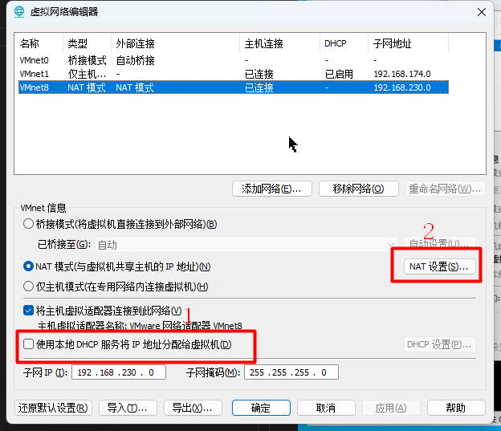

# 目录 
1.安装Linux虚拟机  
2.设置Linux虚拟机静态IP  
3.scp命令  


## 2.设置Linux虚拟机静态IP  
1.虚拟机网络选择NAT模式  

2.查看网络设置  
  

3.NAT设置  
这里要选择VMnet8这个网络,<font color="#00FF00">VMnet8</font>就是NAT模式;接着将"使用本地DHCP服务将IP地址分配给虚拟机"取消勾选  


进入到NAT设置的面板,有两个重要的参数<font color="#00FF00">网关IP</font>和<font color="#00FF00">子网IP</font>  
  

4.设置Windows网络  
进入Windows控制面板=>网络和Internet=>网络和共享中心=>更改适配器设置
  
双击1处的Internet协议版本,接着在跳出来的设置中,选择使用下面的IP地址单选框,这里需要配置三个内容;IP地址、子网掩码、默认网关  
* IP地址:配置为第三步子网IP对应网段下的一个IP即可;例如这里配置为<font color="#00FF00">192.168.230.2</font>  
* 子网掩码:255.255.255.0(固定)
* 默认网关:这里网关必须和第三步<font color="#00FF00">网关IP</font>中指定的值一致,即<font color="#00FF00">192.168.230.2</font>  


4.网关IP  
可以看到这里的网关IP是<font color="#FFC800">192.168.230.2</font>  
在Windows宿主机上运行`ipconfig`命令  
  
可以看到在宿主机上有与之对应的网络VMnet8;<font color="#FFC800">它的网关也和VMWare中指定的网关一致</font>  
要确保Windows能够ping通该网卡对应的IPV4地址(该地址就是上述我们自已指定的) 

5.启动虚拟机配置网卡  
编辑虚拟机网卡,执行`vim /etc/sysconfig/network-scripts/ifcfg-ens33`  
如果提示找不到该文件那就是网卡的名称不是默认的ens33,根据具体情况来  
参考下面的配置进行修改,不要改的别改  
```properties
DEVICE="ens33"
TYPE="Ethernet"
# ONBOOT开机启动,这个要改为yes
ONBOOT="yes"
# 这个要把dhcp改为static
BOOTPROTO="static"
# 参照上面的子网IP的网段,配置当前机器的IP
IPADDR="192.168.230.130"
# 网关必须配置为上述的网关IP
GATEWAY="192.168.230.2"
# 子网掩码地址固定
NETMASK="255.255.255.0"
# DNS固定配置为
DNS1="144.144.144.144"
```

6.重启网络  
执行`systemctl restart network`  

7.设置ssh连接  
执行`vim /etc/ssh/sshd_config`然后将#UseDNS yes改为<font color="#00FF00">UseDNS no</font>  
接着执行`systemctl restart sshd`即可  

8.测试  
虚拟机测试ping百度  
宿主机与虚拟机互相ping通  

9.SSH连接虚拟机太慢  
一般碰到这种情况就需要执行

## 3.scp命令  
使用scp命令可以将Windows上的文件上传到Linux上  
