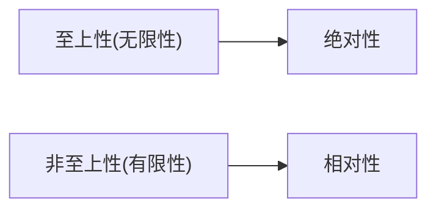
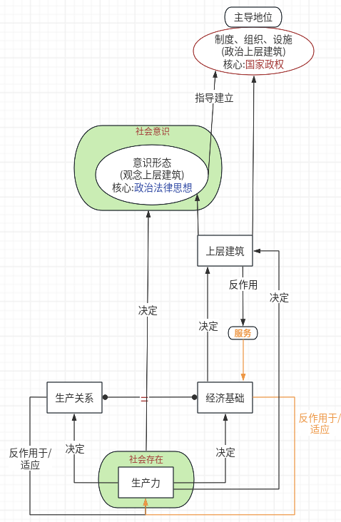

# 目录  
1.导论  
2.唯物论  
3.辩证法  
4.认识论  
5.唯物史观  

# 1.导论  
1.马哲板块分类  

1.1 唯物论  
唯物论回答世界的本源是什么,马克思给出我们身处于一个物质世界  

1.2 辩证法  
在唯物论的基础上,进一步探讨物质世界是怎样存在的

1.3 认识论  
在唯物论和辩证法的结论基础上,人该怎么认识这个世界  

1.4 唯物史观  
研究人类社会或叫人类历史这种特殊的物质有怎样的发展规律  

# 2.唯物论  
**目录:**  
2.1 哲学的基本问题  
2.2 世界多样性与物质统一性  

## 2.1 哲学的基本问题  
1.什么是哲学的基本问题  
哲学的基本问题是思维(也叫精神、意识)和存在(也叫物质)的关系问题  
*所谓基本问题即:任何哲学都要先回答意识和物质关系这个问题*  

2.哲学的基本问题的两个方面  
物质和意识何者为第一性的问题,物质和意识是否具有同一性的问题  
第一性问题:物质和意识,先有谁后有谁  
同一性问题:人类的意识能否认识外部世界的物质,如果能认识就称为有同一性,不能认识就是没有同一性  

2.1 第一性问题  
* 唯物主义:认为先有物质后有意识
  * 古典唯物主义
  * 机械唯物主义
  * 辨证唯物主义
* 唯心主义:认为先有意识后有物质
  * 主观唯心主义
  * 客观唯心主义

2.2 同一性问题
* 可知论:人类意识可以认识外部世界的物质
  唯物主力和唯心主义都是可知论
* 不可知论:物质和意识不具备同一性
  这里有一个二元论的例子,我觉得反而可以帮助理解这部分知识,二元论认为物质和意识都是世界的本源;那么就会同时产生一个物质世界和一个意识世界,在物质世界中我的右手有一个茶杯,但是在意识世界中我的右手是一个鼠标,这就造成了对世界认识的混乱

3.唯物主义内部对物质的定义  
唯物主义都承认物质是第一性的,但对物质的定义有分歧  
* 古典唯物主义(也叫朴素唯物主义):认为现实世界中的实物就是物质
* 机械唯物主义(也叫形而上学唯物主义):认为物质就是构成所有物质都最小粒子
  形而上学唯物主义一定是机械唯物主义,而机械唯物主义并不一定是行而上学唯物主义
* 辨证唯物主义(马克思唯物主义):一切客观实在
  * 辨证唯物主义是包含前三种唯物主义的(古典、机械、形而上学),也就是说前三种认为算物质的辨证唯物主义也认为是物质,但是辨证唯物主义认为算物质的,前三派则不一定认同,比如人类历史仅在辨证唯物主义中算是物质
  * 将人类历史当作物质研究,并探索其中的发展规律最终得出的观点就称之为 **唯物史观**  
  * 所以前三种唯物主义都称之为旧唯物(也称半截子的唯物主义),只有辨证唯物主义是新唯物
    旧唯物主义的特点是在观察自然界时是持唯物主义观点,但在人类历史上却是唯心的(唯心史观)

4.唯心主义内部对意识的定义  
* 主观唯心主义:本我的意识是世界的本源
* 客观唯心主义:独立于人之外的意识(比如上帝、道教)是世界的本源

5.哲学的重要问题-世界是怎样存在的(*见第三章辩证法*)  
哲学除了回答上述的基本问题之外,还需要回答世界是怎样存在的,即世界上的事物是联系的还是孤立的?是发展的还是静止的?  
* 形而上学:世界是独立的、片面的、静止的、无矛盾的
* **辩证法**:世界是联系的、全面的、发展的、矛盾的

*所以什么是辩证法?辩证法是一种观点,是认为世界是联系的、全面的、发展的、矛盾的一种观点*  

## 2.2 世界多样性与物质统一性  
1.物质的定义  
*提示:不同的人对物质有不同的定义方式*  
* 恩格斯:物、物质无非是各种物的综合,而这个概念就是从这一总和中抽象出来的
  即物质这个概念的提出,是从一切物质中抽象出的一个共有特征,即客观实在,不以人的意志为转移到客观实在
* 列宁:物质是不依赖于人类的意识而存在,并能为人类的意识所反映的客观实在.这种客观实在性,是从自然存在和社会存在种抽象出的共同特性

2.物质和运动  
运动的定义:运动是标志一切事物和现象的变化及其过程的哲学范畴  
物质和运动的关系:不可分割.运动是物质的运动,物质是运动的物质;物质的存在方式和根本属性是运动  

3.运动和静止  
静止的定义:相对静止是物质运动在一定条件下的稳定状态,具体包括空间的相对位置暂时不变和事物的根本性质暂时不变这样两种运动的特殊状态.  
运动和静止的关系:对立统一(也称辨证统一、斗争同一、矛盾关系)  
运动和静止的相互区别:运动的绝对性体现了物质运动的变动性、无条件性;静止的相对性体现了物质运动的稳定性、有条件性  
运动和静止的相互联系:运动和静止相互依赖、相互渗透、相互包含,动中有静、静中有动  

4.物质运动和时空  
时空的定义:时间是指物质运动的持续性、顺序性,特点是一维性,即时间的流逝一去不复返;空间是指物质运动的广延性、伸张性,特点是三维性  
物质运动和时空的关系:不可分割;运动着的物质的存在方式是时空  
时空的特点:物质运动与时间和空间的不可分割证明了时间和空间的客观性.具体物质形态的时空是有限的,而整个物质世界的时空是无限的;物质运动时间和空间的客观实在性是绝对的,物质运动时间和空间的具体特性是相对的  

5.**不可分割和对立统一**  
5.1 如何区别不可分割和对立统一  
*提示:使用不可分割和对立统一的时候,一定是有A和B两个事物的*  
* 如果A和B的词性不一样(比如名词和形容词),例如红色的和苹果,则这两个词之间的关系一般就是不可分割的  
* 如果A和B的词性是一样,例如苹果和橘子,则这两个词之间的关系一般就是对立统一

5.2 对立统一  
对立统一就是即有对立又有统一  
任何时候谈论A和B的对立统一,就是说明两者之间即相互区别又相互联系(这两点必须同时说明)  

6.物质世界的二重化  
二重化的定义:从物质的本源中分化出两种不同的物质,人类的出现,特别是人类改造世界的实践活动,极大地改变了世界的面貌,使世界发生了二重分化,即从自然界中分化出人类社会,从客观世界中分化出主观世界  
一方面,世界分化为自然界和人类社会,人类社会是最高级的物质存在形态,自然界和人类社会不是截然分开的,而是交叉重叠和相互作用的.  
另一方面,世界分化为客观世界和主观世界.主观世界从客观世界中分化出来,具有相对独立性.但主观世界并非独立存在的实体,而不是一个超然于客观世界而孤立存在的世界,它不能完全脱离客观世界,而是从属于客观世界  
人的实践活动是自然界与人类社会、客观世界与主观世界相分化的关键,也是它们相统一的关键  

7.相对独立性  
某个事物虽然受到其他事物制约,但并不是完全被动地跟着其他事物走,而是有自己相对独立的发展规律  
例如,老师的知识传授对学生的知识形成具有制约作用,但学生不会完全、机械地复制老师的知识,而会经过自己的理解、加工和重组,形成自己的认识  

8.意识到起源  
从意识到起源来看  
一方面,意识是自然界长期发展的产物,它的发展经历了三个阶段,(1)由一切物质所具有的反应特性到低等生物的刺激感应性(物理反应、化学反应、野生动物的生存本能的反应),(2)高等动物的感觉和心理(具有情感和心理活动的反应,例如狗、海豚、猩猩),(3)最终发展为人类的意识(意识是人类独有的)  
一方面,意识也是社会历史发展的产物,社会实践,特别是劳动,在意识到产生和发展中起着决定性的作用,在人们的劳动和交往中形成的语言促进了意识的发展  
*所以:意识的形成是多方面构成的,其中劳动对意识到形成起到决定性作用,而在劳动中形成的语言只是促进了意识到发展,当然,还有很多其它的因素构成意识*  

9.意识到本质  
意识(1)是人脑这样一种特殊物质的机能和属性(人脑包含意识),(2)是客观世界的主观映象  
意识在内容上是客观的,在形式上是主观的,"观念的东西(意识)无非就是移入人脑(反映)并在人脑中改造过(能动)的东西"  

10.意识对物质的反作用(能动)  
物质决定意识,意识对物质具有反作用,这种反作用就是意识的能动作用,意识到能动作用体现在  
(1) 意识具有目的性和计划性  
(2) 意识具有创造性
(3) 意识具有指导实践改造客观世界的作用  
(4) 意识具有调控人的行为和生理活动的作用  

11.物质与意识的关系  
物质与意识的关系:对立统一  
相互区别:物质是本源,意识是派生;物质不是意识,意识不是物质;物质不能代替意识,意识不能代替物质  
相互联系:物质可以转化为意识,意识可以转化为物质;意识对物质既有依赖性,又有相对独立性;物质决定意识,意识反作用于物质  

12.主观能动性(意识)和客观规律性(物质)的对立统一  
一方面,尊重客观规律是正确发挥主观能动性的前提  
一方面,只有充分发挥能动,才能正确认识和利用客观规律  
实践是客观规律性和主观能动性统一的基础,(1)从实际出发是正确发挥人的主观能动性的前提,(2)实践是正确发挥人的主观能动性的根本途径,(3)正确发挥人的主观能动性,还要依赖于一定的物质条件和物质手段  

13.世界的物质统一性原理  

# 3.辩证法  
*前提:哲学除了回答基本问题之外,还需要回答世界是怎样存在的这个问题,所以辩证法就是来回答这个问题的*  
**目录:**  
3.1 事物的普遍联系和变化发展  
3.2 唯物辩证法是认识世界和改造世界的根本方法  

## 3.1 事物的普遍联系和变化发展  
**目录:**  
3.1.1 唯物辩证法的两大总特征  
3.1.2 唯物辩证法三大规律  
3.1.3 唯物辩证法五对基本范畴  

### 3.1.1 唯物辩证法的两大总特征  
*提示:两大总特征就是普遍联系和变化发展*  
1.事物的普遍联系  
联系的特点:客观性(不以人的意志为转移,事物之间的联系上客观存在的,不管主观上怎么想它们的关系都是不变的)、普遍性、多样性、条件性  

联系的普遍性具有三层含义:
(1)任何事物内部的不同部分和要素之间都是相互联系的  
(2)任何事物都不能孤立存在,都同其他事物处于一定的联系中  
(3)整个世界是相互联系的统一整体,每一个事物都是世界普遍联系中的一个成分或环节,世界的普遍联系是通过"中介"来实现的  

条件性:
(1)条件对事物发展和人的活动具有支持或制约作用  
(2)条件是可以改变的,人们经过努力可以化不利条件为有利条件,推动事物的发展  
(3)改变和创造条件不是任意的,必须尊重事物发展的客观规律  

2.事物的变化发展  
发展的概念:一切形式的变化就是运动(运动=变化),发展则是事物变化中前进的、上升的运动(发展仅仅只的是前进的好的运动,运动有可能是向坏处运动的)  
发展的实质:发展的实质上新事物的产生和旧事物的灭亡  
新事物和旧事物的定义:这里的新和旧并不是时间上的新和旧;新事物是合乎历史前进方向、具有远大前途的东西;旧事物是丧失历史必然性、日趋灭亡的东西  

新事物必然战胜旧事物的原因:  
(1)从新事物与环境的关系而言,新事物有新的要素、结构和功能,它适应已经变化了的环境和条件;旧事物的各种要素已经不适应环境和客观条件的变化  
(2)从新事物与旧事物的关系而言,新事物是在旧事物的"母体"中孕育成熟的,它既否定了旧事物中消极腐朽的东西,又保留了旧事物中合理的、适应新条件的因素,并添加了旧事物所不能容纳的新内容  
(3)在社会历史领域中,新事物是社会上先进的、富有创造力的人们创造性活动的产物,它从根本上符合人名群众的利益和要求,能够得到人民群众的拥护  

事物发展的过程性:世界不是既成事物的集合体,而是过程的集合体  

### 3.1.2 唯物辩证法三大规律
**目录:**  
3.1.2.1 对立统一规律(唯物辩证法第一规律)  
3.1.2.2 量变质变规律(唯物辩证法第二规律)  
3.1.2.3 否定之否定规律(唯物辩证法第三规律)  

#### 3.1.1 对立统一规律(唯物辩证法第一规律)  
对立统一规律是唯物辩证法的实质和核心,因为对立统一规律揭示了事物普遍联系的根本内容和变化发展的内在动力,从根本上回答了事物为什么会发展的问题  

1.矛盾的同一性和斗争性及其辨证关系  
对立统一规律又称矛盾规律,矛盾是辩证法的核心概念  
矛盾的两种基本属性是对立和统一,矛盾的对立属性又称斗争性,矛盾的统一性又称同一性  

*提示:对立统一即斗争同一,对立=斗争,统一=同一*  
*提示:矛盾的斗争性和统一性是同时存在的,事物总是具有两面的*  

1.1 斗争性  
矛盾的斗争性是指矛盾着的对立面相互排斥、相互分离的性质和趋势  
由于矛盾的性质不同,矛盾的斗争形势也不同,对于多种多样的斗争形式,可以区分为对抗性矛盾和非对抗性矛盾两种基本形式  

1.2 同一性  
矛盾的同一性是指矛盾着的对立面相互依存、相互贯通的性质和趋势  
它有两个方面的含义,一是矛盾着的对立面相互依存,互为存在的前提,并共处于一个统一体中;二是矛盾着的对立面相互贯通,在一定条件下可以相互转化  

1.3 斗争和同一的关系  
矛盾的同一性和斗争性相互联结、相辅相成,同一性不能脱离斗争性而存在,没有斗争性就没有同一性,没有同一性就没有斗争性;斗争性寓于同一性之中,同一性通过斗争性来体现  
在事物的矛盾中,矛盾的斗争性是无条件的、绝对的,矛盾的同一性是有条件的、相对的  

*提示:寓于可以理解为附属于,即斗争性附属于同一中,同一包含了斗争*  

2.矛盾的同一性和斗争性在事物发展中的作用  

2.1 矛盾的同一性在事物发展中的作用主要表现在  
(1)由于矛盾双方相互依存,互为存在的条件,矛盾的双方可以利用对方的发展使自已得到发展  
(2)由于矛盾双方相互包含,矛盾双方可以相互吸引有利于自身的因素而得到发展  
(3)由于矛盾双方彼此相通,矛盾双方可以向着彼此的对立面转化而得到发展,并规定着事物发展的方向  

2.2 矛盾的斗争性在事物发展中的作用主要表现在  
(1)矛盾双方的斗争促进双方力量的对比发生变化,此消彼长,造成事物的量变  
(2)矛盾双方的斗争促使矛盾双方的地位或性质发生转化,实现事物的质变  

3.矛盾的普遍性(共性)和特殊性(个性)及其辨证关系  

3.1 矛盾的普遍性  
矛盾无处不在,矛盾无时不有  

3.2 矛盾的特殊性  
矛盾的特殊性是指各个具体事物的矛盾、每一矛盾的各个方面在发展的不同阶段上各有其特点,具体表现为三种情形  
(1)不同事物的矛盾各有其特点  
(2)同一事物的矛盾在不同发展过程和发展阶段各有不同特点  
(3)构成事物的诸多矛盾以及每一矛盾的不同方面各有不同的性质、地位和作用  

3.3 矛盾的普遍性和特殊性的关系  
矛盾的普遍性和特殊性的关系是辨证统一  
矛盾的普遍性即矛盾的共性,矛盾的特殊性即矛盾的个性  
矛盾的共性是无条件的、绝对的,矛盾的个性是有条件的、相对的,任何显示存在的事物的矛盾都是共性和个性的有机统一,共性寓于个性之中,没有离开个性的共性,也没有离开共性的个性  

*提示:关于寓于,技巧是看谁大谁小,共性小个性大,那就是共性寓于个性,个性包含共性*  

3.4 方法论  
(1)矛盾的共性和个性、绝对和相对的道理,是关于事物矛盾问题的精髓(和矛盾基本属性区分)  
即矛盾的精髓是共性和个性  
(2)人的认识的一般规律就是由认识个别上升到认识一般,再由认识一般到认识个别的辨证发展过程  
(3)矛盾的普遍性和特殊性辨证关系是马克思主义基本原理同各国实际相结合的哲学基础  

4.矛盾的不平衡发展原理  
主要矛盾是矛盾体系中处于支配地位,对事物发展起决定性作用的矛盾,次要矛盾是矛盾体系中处于从属地位、对事物发展起次要作用的矛盾,在每一对矛盾中又有矛盾的主要方面与矛盾的次要方面.事物的性质是由主要矛盾的主要方面决定的  

#### 3.1.2.2 量变质变规律(唯物辩证法第二规律)  
1.定义  
* 质:事物区别于其它事物的内在规定性
  认识质是认识和实践的起点和基础,只有认识质才能区别事物
* 量:事物的规模、程度、速度等可以用数量关系表示的规定性
  (1)认识事物的量少认识的深化和精确化
  (2)只有正确了解事物的量,才能正确估计事物在实践中的地位和作用
* 度:事物的量和质是统一的,量和质的统一在度中得到体现
  度是保持事物质的稳定性的数量界限,即事物的限度、幅度和范围,度的两端叫关节点或临界点超出度的范围,此物就转化为他物
  度这一哲学范畴启示我们,在认识和处理问题时要掌握适度的原则
* 量变:事物数量的增减和组成要素排列次序的变动,是保持事物质的相对稳定性的不显著变化,体现了事物发展渐进过程的连续性
* 质变:事物性质的根本变化,是事物由一种质态向另一种质态的飞跃,体现了事物发展渐进过程和连续性的中断

2.量变和质变的辨证关系  
*提示:区别就是上述的定义,所以本节只讲联系*  
(1)量变是质变的必要准备  
(2)质变是量变到必然结果(量变一定会质变)

一方面,在总的量变过程中有阶段性和局部性的部分质变  
一方面,在质变的过程中也有旧质在量上的收缩和新质在量上的扩张  

#### 3.1.2.3 否定之否定规律(唯物辩证法第三规律)  
1.事物发展过程中的肯定因素和否定因素  
事物内部都存在着肯定因素和否定因素  
肯定因素是维持显存事物存在的因素  
否定因素是促使显存事物灭亡的因素  

2.辨证否定的基本内容  
(1)否定是事物的自我否定、自我发展  
(2)否定是事物发展的环节  
(3)否定是新旧事物联系的环节  
(4)辨证否定的实质是"扬弃"(丢弃/抛弃),既新事物对旧事物既批判又继承,既克服其消极因素又保留其积极因素  

3.否定之否定规律  
事物的辨证发展过程经过第一次否定,使矛盾得到初步解决,而处于否定阶段的事物仍然具有片面性,还要经过再次否定,即否定之否定,实现对立面的统一,使矛盾得到根本解决.事物的辨证发展就是经过两次否定、三个阶段,即"肯定-否定-否定之否定",形成一个周期.其中,否定之否定阶段仿佛是向原来出发点的"回复",但这是在更高阶段的"回复",是"扬弃"的结果  
事物的发展呈现周期性,上一个周期和下一个周期的无限交替,使事物的发展呈现波浪式前进或螺旋式上升的总趋势  

### 3.1.3 唯物辩证法五对基本范畴  
*提示:其实这里的5对基本范畴完全可以从字面意思上理解,每什么难的*  
**目录:**  
3.1.3.1 内容和形式  
3.1.3.2 现象和本质  
3.1.3.3 原因和结果  
3.1.3.4 必然和偶然  
3.1.3.5 可能和现实  

#### 3.1.3.1 内容和形式  
1.定义  
内容是构成事物的一切要素的总和,是事物存在的基础  
形式指把诸要素统一起来的结构或表现内容的方式  

2.关系  
内容和形式是不可分割的,内容决定形式,形式反作用于内容  
当形式适合内容时,对内容的发展起着积极的推动作用  
当形式不适合内容时,对内容的发展起着消极的阻碍作用  

#### 3.1.3.2 现象和本质  
1.定义  
现象是事物的外部联系和表面特征,是事物本质的外在表现,人们可以通过感官感知   
本质则是事物的内在联系和根本性质,只有通过理性思维才能把握  

2.关系  
现象有真相和假象之分,假象与错觉不是一回事  
假象是客观存在的,只不过它是虚假的现象,歪曲地表现了本质  
错误是错误感觉,是主管上的错误  

现象和本质又是统一的,它们相互联系、相互依存,任何本质都是通过现象表现出来的,没有不表现为现象的本质,任何现象都从一定的方面表现着本质,现在是本质的外部表现,即使是假象也是本质的表现  

#### 3.1.3.3 原因和结果
1.定义  
引起某种现象的现象就是原因,而被某种现象引起的现象就是结果(理解一下这句话)  

2.关系  
原因和结果的关系是辨证的  
(1)**原因和结果的区分既是确定的,又是不确定的**  
(2)原因和结果相互作用,原因产生结果,结果反过来影响原因,互为因果  
(3)原因和结果互相渗透,结果存在于原因之中,原因表现在结果之中  
(4)**原因和结果的关系是复杂多样的,有一因多果、一过多因、异因同果、多因多果、复合因果**  

#### 3.1.3.4 必然和偶然  
1.定义  
必然是事物联系和发展过程中确定不移的趋势  
偶然是事物联系与发展中并非确定发生的,可以出现,也可以不出现,可以这样出现也可以那样出现的不确定趋势  

2.关系  
必然和偶然是对立统一的关系  

对立性:  
(1)它们产生和形成的原因不同;必然产生于事物内部的根本矛盾,偶然产生于非根本矛盾和外部条件  
(2)它们的表现形式不同;必然是在事物发展过程中比较稳定、时空上比较确定,是同类事物普遍具有的发展趋势,偶然则是不稳定的、暂时的、不确定的,是事物发展中的个别表现  
(3)它们在事物发展中的地位和作用不同;必然在事物发展中居于支配地位,决定着事物发展的方向,偶然居于从属地位,对发展的必然过程起促进或蔓延作用  

统一性:
必然存在于偶然之中,通过大量的偶然表现出来,并为自已开辟道路  
偶然背后隐藏着必然,受必然的支配,偶然是必然的表现形式和补充  
必然和偶然在一定条件下可以相互转化  

#### 3.1.3.5 可能和现实 
1.定义  
可能是指事物发展过程中潜在的东西,是指包含在事物中并预示事物发展前途的种种趋势  
现实是指相互联系着的实际存在的事物的综合  

2.关系  
可能和现实的关系是相互区别  
可能与现实相互转化  
一方面,现实蕴藏着未来的发展方向,会不断产生新的可能  
一方面,可能包含着发展成为现实的因素和根据,一旦主客观条件成熟,可能就会转化为现实  

## 3.2 唯物辩证法是认识世界和改造世界的根本方法  
**目录:**  
3.2.1 唯物辩证法本质上是批判的和革命的  
3.2.2 客观辩证法和主观辩证法的统一  

### 3.2.1 唯物辩证法本质上是批判的和革命的  

### 3.2.2 客观辩证法和主观辩证法的统一  
1.定义  
客观辩证法是指客观事物或客观存在的辩证法,即客观事物以相互作用、相互联系的形式呈现的各种物质形态的辨证运动和发展规律->客观辩证法就是物质->具有第一性  
主观辩证法是指人类认识和思维运动的辩证法,即以概念作为思维细胞的辩证思维运动和发展规律->主观辩证法就是意识->具有第二性  
唯物辩证法既包含客观辩证法也包括主观辩证法  

2.关系  
客观与主观的关系是反应与被反应的关系,主观反应客观,客观被主观反应  
客观辩证法与主观辩证法法在本质上是同一的,但在表现形式上却是不同的;客观辩证法采取外部必然性的形式(也就是物质规律,不以人的意志为转移),主观辩证法采取观念的、逻辑的形式(主观意识思维方式)  

# 4.认识论  
*前提:在唯物论和辩证法回答的两个问题的基础上,进一步回答如何认识这个世界,就是认识论*  
**目录:**  
4.1 实践与认识  
4.2 真理与价值  
4.3 认识世界和改造世界  

## 4.1 实践与认识  
**目录:**  
4.1.1 实践的相关问题  
4.1.2 实践对认识的决定作用  
4.1.3 认识的相关问题  

### 4.1.1 实践的相关问题  
**目录:**  
4.1.1.1 实践的本质和基本特征  
4.1.1.2 实践的基本结构和形式  

#### 4.1.1.1 实践的本质和基本特征  
1.概述  
马克思主义理论区别于其他理论的根本特征是实践性(也就是说实践性是马克思独有的观点)  
马克思主义的基本观点是实践性  

人与世界的关系主要就是两个方面:(1)认识世界、(2)改造世界  

2.实践的本质  
实践是感性的、对象性的物质活动,提出全部社会生活在本质上是实践的  
感性:实践要受到大脑的指挥,体现主体的目的、创造性的行为->感性  
对象:实践一定是主体指向客体的行为->必须对客体进行改造  
物质活动:物质性  

3.实践的基本特征  
(1)实践具有客观实在性(物质性),又称直接现实性,能够将脑中的物变成现实的物
(2)实践具有自觉能动性(感性),体现主体的目的、意愿、创造性  
(3)实践具有社会历史性,不同历史阶段不同  

#### 4.1.1.2 实践的基本结构和形式  
1.实践的基本结构  
实践的三项基本要素是主体、客体、中介  

2.实践主体  
实践主体是指具有一定的主体能力、从事现实社会实践活动的人(实践的主体一定是人)  
实践主体的能力包括自然能力和精神能力,精神能力又包括知识性因素和非知识性因素,其中知识性因素是首要的能力  

3.实践客体  
实践客体是指实践活动所指向的对象  
实践客体与客观存在的事物不完全等同,客观事物只有在被纳入主体实践活动的范围之内,为主体实践活动所指向并与主体相互作用时才成为现实的实践客体(比如一个客观存在的遥远星球,因为还没有被主体实践,所以它就不能称为实践客体)  

4.实践中介  
实践中介是指各种形式的工具、手段以及运用、操作这些工具、手段的程序和方法  
实践中介系统可以分为两个子系统;(1)作为人的肢体延长、感官延伸、体能放大的物质性工具系统,(2)语言符号工具系统  

5.主体和客体的关系  
实践的主体和客体相互作用的关系,包括实践关系、认识关系、价值关系  
其中实践关系是最根本的关系,实践的主体和客体与认识的主体和客体在本质上是一致的  

6.主体客体化于客体主体化  
实践的主体、客体和中介是不断变化发展的,因而实践的基本结构也是历史地变化发展的,这种变化主要变现为主体客体化与客体主体化的双向运动  
主体客体化,是人通过实践使自已的本质力量作用于客体,使其按照主体的需要发生结构和功能上的变化,形成了世界上本来不存在的对象物->客体发生改变  
客体主体化,是客体从客观对象的存在形式转化为主体生命结构的因素或主体本质力量的因素,客体失去客体行的形式,变成主体的一部分->主体发生改变  

7.实践形式的多样性  
从内容上看,实践可以分为三种基本形式:物质生产实践(劳动)、社会政治实践(人与人的关系)、科学文化实践(对未知领域探索)  
这三种实践各具不同的社会功能,又密切联系在一起,其中物质生产实践是最基本的实践活动,它构成全部社会生活的基础  

### 4.1.2 实践对认识的决定作用  
实践是认识的基础,实践在认识活动中起决定性作用  
实践=物质,认识=意识;实践决定认识,认识反作用于实践(物质决定意识,意识反作用于物质)  
实践的观点是辨证唯物论的认识论之第一的和基本的观点  

1.实践对认识的作用表现在4个方面  
(1)实践是认识的来源  
(2)实践是认识发展的动力  
(3)实践是认识的目的  
(4)实践是检验认识真理性的唯一标准  

实践->认识->再实践->再认识循环构成(但否定之否定告诉我们,这里的再实践和再认识已经是更高一级别的了)  

### 4.1.3 认识的相关问题  
**目录:**  
4.1.3.1 认识的本质
4.1.3.2 认识的过程(两次飞跃)  
4.1.3.3 认识过程中的影响因素(理性因素和非理性因素)  
4.1.3.4 认识的两大规律  

#### 4.1.3.1 认识的本质  
1.马克思的认识论和其它流派认识的区别  
* 从思想感觉到物->唯心论(先验论)❌
* 从物到感觉思想->唯物论(反应论)✅
  * 旧唯物->直观反映(机械)❌
  * 马克思唯物->创造反映(能动)✅

2.能动反应论  
辨证唯物主义认识论认为,认识的本质是主体在实践基础上对客体的能动反映,这种能动反映不但具有反映客体内容的反映性特征,而且具有实践所要求的主体能动的、创造性的特征  
一方面,认识的反映特性是人类认识的基本规定性,认识的反映特性是指人的认识必然要以客观事物为原型和摹本,在思维中再现或摹写客观事物的状态、属性和本质  
一方面,认识作为能动反映具有创造特性,认识是一种在思维中的能动的、创造性的活动,而不是主观对客观对象简单、直接的描摹或照镜子式的原物映现  

3.认识的反映特性和创造特性之间的关系  
认识的反映特性和创造特性之间的关系是不可分为  
反映和创造不是人类认识的两种不同的本质,而是同一本质的两种不同的功能,是一枚硬币的两面  

4.能动反映论的两个突出优点  
(1)把实践的观点引入认识论  
(2)把辩证法应用于反映论考察认识的发展过程,把认识看成一个由不知到知、由浅入深的充满矛盾的能动的认识过程,全面的揭示了认识过程的辨证性质  

#### 4.1.3.2 认识的过程(两次飞跃)  
1.从实践到认识(感性认识到理性认识的飞跃)  

1.1 定义  
感性认识是人们在实践基础上,由感觉器官直接感受到的关于事物的现象、事物的外部联系、事物的各个方面的认识,包括感觉、知觉和表象三种形式;感性认识是认识的初级阶段,感性认识的特点是直接性、具体性  

理性认识是认识的高级阶段,是指人们借助抽象思维,在概括整理大量感性材料的基础上,达到关于事物的本质、全体、内部联系和事物自身规律性的认识;理性认识包括概念、判断、推理三种形式;理性认识的特点是间接性、抽象性  

1.2 关系  
感性认识和理性认识的关系是辨证统一  
(1)理性依赖于感性认识,感性认识是认识过程的起点(现有感性认识),理性认识对感性认识的这种依赖关系,是认识对实践依赖关系的重要表现  
(2)感性认识有待于发展和深化为理性认识  
(3)感性和理性认识相互渗透、相互包含  

1.3 实现飞跃的基本条件  
(1)投身实践,深入调差,获取十分丰富和合乎实际的感性材料  
(2)经过思考的作用,运用理论思维和科学抽象,将丰富的感性材料加工制作  

2.从认识到实践(理性认识到实践的飞跃)  
这是认识过程的第二次能动飞跃,是认识过程中更为重要的一次飞跃  

#### 4.1.3.3 认识过程中的影响因素(理性因素和非理性因素)  
1.理性因素  
理性因素指人的理性直观、理想思维等能力,它在认识活动中的作用主要有指导作用、解释作用和预见作用  

2.非理性因素  
非理性因素只要指认识主体的情感和意志,从广义上看,人们还常把认识能力中具有不自觉、非逻辑性等特点的认识形式,如联想、想象、猜测、顿悟、灵感等,也包括在人的非理性因素中  
非理性因素对于人的认识能力和认识活动具有激活、驱动作用  

#### 4.1.3.4 认识的两大规律  
1.认识的反复性  
认识过程的反复性是指,人们对于一个复杂事物的认识往往要经过由感性认识到理性认识、再由理性认识到实践的多次反复才能完成  
原因:(1)从客观方面看,事物的各个侧面及其本质的暴露有一个过程,(2)从主观方面看,人的认识能力有一个提高到过程  

2.认识的无限性  
认识发展的无限性是指,对于事物发展过程的推移来说,人类的认识是永无止境、无限发展的,它表现为"实践-认识-再实践-再认识"的无限循环,由初级阶段向高级阶段不断推移的永无止境的前进运动,这种认识的无限发展过程,在形式上是循环往复的,在实质上是前进上升的  

## 4.2 真理与价值  
*提示:认识完世界后得出的结论,就分为真理和谬误*  
**目录:**  
4.2.1 真理及其特征  
4.2.2 真理和谬误  
4.2.3 真理的检验标准  
4.2.4 真理与价值的辨证统一  

### 4.2.1 真理及其特征  
1.真理的客观性  
真理是人们对于客观事物及其规律的正确反映,真理有三种属性  
(1)真理具有客观性,凡真理都是客观真理  
(2)真理的检验标准是客观的,客观的社会实践是检验真理的唯一标准  
(3)真理的形式的主观的(形式对应内容,真理的内容是客观的,但形式是内容的表现方式,所以它是主观的)  

真理的客观性决定了真理的一元性,真理的一元性是指在同一条件下对于特定认识客体来说,真理性认识只有一个,它不因主体认识和差别的变化而改变  

2.真理的绝对性和相对性  

2.1 真理的绝对性  
真理的绝对性:指真理主客观统一的确定性和发展的无限性  
(1)任何真理都必然包含客观对象相符合的客观内容,都同谬误有原则的界限,否则就不称其为真理,这一点是无条件的、绝对的  
(2)人类认识按其本性来说,能够正确认识无限发展着的物质世界,认识每前进一步,都是对无限发展着的物质世界的接近,这一点也是无条件的、绝对的,因此承认世界的可知性、承认人能够获得关于无限发展着的物质世界的正确认识,也就是承认了真理的绝对性  

2.2 真理的相对性  
真理的相对性:指人们在一定条件下对客观事物及其本质和发展规律的正确认识总是有限度的、不完善的  
(1)从客观世界的整体来看,任何真理都只是对客观世界的某一阶段、某一部分的正确认识,人类已经达到的认识的广度总是有限度的,因而,认识有待扩展  
(2)就特定事物而言,任何真理都只是对客观对象一定方面、一定层次和一定程度的正确认识,认识反映事物的深度是有限度的,或者近似性的,因而,认识有待深化  
**任何真理都只能是主管对客观事物近似正确即相对正确的反映**  

3.真理的绝对性和相对性的关系  
(1)相互依存  
(2)相互包含,绝对之中有相对,相对之中有绝对,真理的绝对性通过真理的相对性表现出来,任何真理的相对性之中都包含着真理绝对性的颗粒  

真理的发展规律:任何真理性的认识都是由真理的相对性向绝对性转化过程中的一个环节,它既是以往实践和认识业已达到的终点,又是进一步迈向真理的绝对性的起点  
相对真理+相对真理+相对真理=>绝对真理  

真理的绝对性和相对性根源于人的认识能力、思维能力的矛盾本性,是人的思维的至上性和非至上性或人的认识能力的无限性和有限性的矛盾  

*提示:由于人的认识能力即至上又非至上,所以认识出的真理就有绝对性和相对性*  

4.错误的观点  
**绝对主义:** 过分夸大真理的绝对性,把已有的理论看成永恒不变的教条,这种就是教条主义  
**相对主义:** 过分夸大真理的相对性,把真理看作主观随意的东西,这种就是诡辩论  

### 4.2.2 真理和谬误  
1.定义  
*提示:和真理的定义完全相反*  
真理是人们对于客观事物及其规律的错误反映  

2.真理和谬误的关系  
(1)真理和谬误相互对立  
(2)真理和谬误的对立是相对的,他们相互依存、相互转化,真理中包含着某种以后会暴露出来的错误的方面或因素,谬误中也隐藏着以后会显露出来的真理的成分或萌芽,在一定条件下,真理和谬误可以相互转化,真理和谬误在一定范围内的对立的绝对的,超出这个范围,它们就会相互转化,真理变成谬误,谬误变成真理  

### 4.2.3 真理的检验标准  
1.真理的检验标准  
实践是检验真理的唯一标准,这里由真理的本性和实践的特点决定的  
真理的本性->主客观相一致,只有实践才能将主观和客观之间相互联系  

实践是检验真理的唯一标准,并不排斥逻辑证明的作用,逻辑证明是指运用已知的正确概念和判断,通过一定的推理,从理论上确定另一个判断的正确性方法,逻辑证明是探索真理、论证真理和扩大真理范围的重要手段,是对实践标准的一个重要补充,但不是检验真理的标准  
*为什么逻辑不是检验真理的标准?*  
(1)首先逻辑就是从实践中得来的  
(2)依赖前提假设  

2.实践标准的确定性和不确定性  
实践标准的确定性(即绝对性):  
(1)实践是检验真理的唯一标准,此外再无别的标准  
(2)凡经过实践证明了的一切认识都是客观真理,都具有不可推翻的性质  
(3)实践能够检验一切认识,即使当前的实践还不能假定判断,最终也会被以后的实践作出裁决  

实践标准的不确定性:  
(1)一定历史阶段上的具体实践具有局限性,它往往不能充分证明或驳倒某一认识的真理性  
(2)实践检验真理是一个过程,不是一次完成的  
(3)已被实践检验过的真理还要继续经受实践的检验  

3.总结  
实践不断发展,真理也不断发展,在发展的实践中不断验证认识的真理性,这就是实践检验真理的辨证发展过程  

### 4.2.4 真理与价值的辨证统一  
1.价值的定义  
通俗解释,一个东西对你有没有用,那就是价值  

2.价值的基本特性  
(1)主体性:说白了就是因人而异,一个东西对不同的人而言是否有价值是因人而异的  
(2)客观性:不以人的意志为转移,有价值就是有价值,每价值就是没价值,不管你想不想,比如一碗米饭就是有价值的  
那么主体性如何体现?这碗米饭的价值是客观的,只是说对于不同的人而言,它的价值不同,对于刚吃饱的人而言,它就没什么价值,但是对于饿了几天的人而言,那就很有价值  
(3)多维性:一个东西对不同的而言有不同的价值  
(4)社会历史性:一个东西在不同历史时期的价值是不同的(比如光盘的价值,在00年和26年它的价值已经完全不一样了)  

3.价值评价的特点及其标准  
价值评价是一种关于价值现象的认识活动,是主体对客体的价值以及价值大小所作的评判或判断,因而也被称作价值判断,其基本特点有  
(1)评价以主体之间的价值关系为认识对象  
(2)评价结果与评价主体直接相关  
(3)评价结果的正确与否依赖于客体状况和主体需要的认识(评价的结果依赖于主体的知识性认识,依赖于对当前客体的认识和主体自身的认识)  
(4)价值评价有科学与非科学之别(评价也有对错之分)  
评价作为一种价值判断活动,虽具有主观性,但并不是一种主观随意的认识活动,只有正确反映价值关系的评价才是正确的评价.价值评价要以真理为根据,要有利于人类主体的生存和发展,与社会历史发展的客观规律相一致,推动社会历史进行,以最广大人民的需要和利益为根本(价值评价的标准)  

4.真理与价值的辨证统一关系  
人们的实践活动总是受着真理尺度(规律)和价值尺度(能动)的制约  
实践的真理尺度:在实践中人们必须遵循正确反映客观事物本质和规律的真理  
实践的价值尺度:在实践中人们都是按照自已的尺度和需要去认识世界和改造世界  

任何实践活动都是在这两种尺度共同制约下进行的,任何成功的实践都是真理尺度和价值尺度的统一,是合规律性和合目的性统一  
一方面,价值尺度必须以真理为前提  
一方面,人们自身需要的内在尺度,推动者人们不断发现新的真理  

## 4.3 认识世界和改造世界  
**目录:**  
4.3.1 从必然走向自由  

### 4.3.1 从必然走向自由  
1.自由的概念  
哲学上的自由是表示人的活动状态和范畴,是指人在活动中通过认识和利用必然所表现的一种自觉自主的状态  

2.必然的概念  
必然性即规律性,是指不依赖于人的意识而存在的自然和社会发展所固有的客观规律,自由是对必然的认识和对客观世界的改造  

3.认识必然和争取自由,是人类认识世界和改造世界的根本目标,是一个历史性的过程,有必然到自由表现为人类不断地从必然万国走向自由王国的过程  

4.自由是历史发展的产物,自由是有条件的  
(1)认识条件:认识越多越自由
(2)实践条件:以规律为前提、以不牺牲别人的自由为前提  

# 5.唯物史观  
*提示:唯物史观主要回答,人类社会历史这一特殊物质的运行规律、什么样的力量再推动该物质的发展、到底是谁创造了人类的历史*  
5.1 人类社会及其发展规律  
5.2 社会历史发展的动力  
5.3 人民群众在历史发展中的作用  

## 5.1 人类社会及其发展规律
**目录:**  
5.1.1 唯物史观和唯心史观的对立  
5.1.2 社会存在和社会意识及其辨证关系  
5.1.3 社会基本矛盾  
5.1.4 人类普遍交往与世界历史的形成发展  
5.1.5 社会进步与社会形态更替  

### 5.1.1 唯物史观和唯心史观的对立  
1.社会历史观的基本问题  
社会历史观的基本问题是社会存在(物质)和社会意识(意识)的关系问题  
社会历史观的基本问题其实就是哲学基本问题在历史领域的延伸  

2.唯心史观的问题  
(1)考察了人互动的思想动机,而没有进一步考察思想动机背后的物质动因和经济根源  
即唯心史观认为历史其实是人的思想决定的,是一个精神问题  
而唯物史观并不认为随心随欲的,也不是人的思想决定的,而是背后的一种物质力量决定的,人们想或者不想历史都会这么发展(客观的),*注意这并不表面唯物史观认为历史是早就写好的,只是说历史由物质推动跟人的思想无关,而跟物质本身是遵循量子力学还是经典力学是无关的,唯物史观中的"客观性"不等于经典力学意义上的机械决定论*  
(2)只看到个人在历史上的作用,而忽视了人民群众创造历史的决定作用  
*所以唯心史观也被称为英雄史观*  

### 5.1.2 社会存在和社会意识及其辨证关系  
1.社会存在及其在社会发展过程中的作用  
社会存在就是社会生活的物质方面,主要包括(1)物质生产方式、(2)自然地理环境、(3)人口因素  

1.1 物质生产方式  
物质生产方式对社会存在起决定性作用  
生产方式=生产力+生产关系  
在生产力和生产关系中,生产力又起到决定性作用

生产力=生产资料+劳动者 生产资料=劳动资料+劳动对象  
生产关系=生产资料所有制关系+生产中人与人的关系+产品分配关系  

1.2 自然地理环境  
一个人类社会的自然地理会对这个社会的发展造成影响,但马克思认为它仅仅是有影响而起不到决定性作用  

1.3 人口因素  
人口的数量、质量对社会的发展有影响,但同样也仅限于影响作用起不到决定性作用  

2.社会意识及其构成  
社会意识是社会生活的精神方面,是社会存在的反映  
社会意识=社会心理(低层次)+社会意识形式(高层次)  

2.1 社会心理(低层次)  
社会心理包含自然形成的风格、习俗、情感、情绪  
是一种很浅层次的感性层面的东西,不成系统的东西,比如旗舰手机数字系列一般不带4这个字  
*提示:宗教不是社会心理,宗教是成体系的*  

2.2 社会意识形式(高层次)  
社会意识形式和社会心理相反,它是理性的、深层次的、甚至理论化的东西  
社会意识形式=社会意识形态+非社会意识形态  

2.3 社会意识形态  
社会意识形式中与经济、阶级、利益有关的内容就称为社会意识形态  
比如政治法律思想、道德、艺术、宗教、哲学等等  
*怎么判断一个东西是阶级相关还是无关的?*  
如果一门学科,任何一个阶级它们的看法没有区别那就是阶级无关,不同的阶级对这个看法是有区别的就是阶级相关;同理经济和利益也是这样的判断方式  

2.4 非社会意识形态  
社会意识形式中与经济、阶级、利益无关的内容就称为非社会意识形态  
比如语言学、形式逻辑及自然科学等  
比如数学就是阶级无关的,资产阶级的数学和无产阶级的数学都是数学  

3.社会存在于社会意识的辨证关系  
*提示:社会存在与社会意识的关系就是物质与意识到关系*  
(1) 社会存在决定社会意识,社会意识是社会存在的反映,并反作用于社会存在  
[1] 首先,社会存在是社会意识内容的客观来源,社会意识是社会物质生活过程及其条件的主观反映  
[2] 其次,社会意识是人们进行社会物质交往的产物  
[3] 最后,随着社会存在的发展,社会意识也相应地或迟或早地变化和发展  
(2) 社会存在和社会意识辨证关系的另一个方面,是社会意识具有相对独立性,它在反映社会存在的同时具有自身特有的发展形式和发展规律  
[1] 首先,社会意识与社会存在发展具有不完全同步性和不平衡性  
*解释:什么叫不同步性和不平衡性,先来看平衡性和同步性,如果一个国家的经济越发达,则思想文化就越先进这就叫平衡,如果一个国家经济越不发达,则思想文化就越腐朽这就叫平衡,不平衡就正好反过来,现实生活中,有些经济很发达的国家但是它们的思想还很腐朽,而有些国家经济落后但思想很先进,这种就是不平衡*  
[2] 其次,社会意识内部各种形式之间存在相互影响且各自具有历史继承性
*解释:一个社会中形形色色很多人很多群体,大家都有各种想法,而在该社会内部几种不同的想法会互相碰撞互相影响,而且这些想法会有继承性比如个人的很多想法是从父母那里继承来的*  
[3] 最后,社会意识对社会存在具有能动的反作用,这是社会意识相对独立性的突出表现  
*解释:社会意识(社会心理、社会意识形式)能够反作用于社会存在(人口、自然环境、物质生产方式)*  

先进的社会意识对社会发展起积极的、促进作用;落后的社会意识对社会发展起消极的阻碍作用  

4.根本分野  
主张社会存在决定社会意识,还是社会意识决定社会存在,是唯物史观与唯心史观的根本分野  

### 5.1.3 社会基本矛盾  
**目录:**  
5.1.3.1 生产力和生产关系矛盾运动的规律  
5.1.3.2 经济基础和上层建筑矛盾运动的规律  

#### 5.1.3.1 生产力和生产关系矛盾运动的规律(第一对社会基本矛盾)  
1.生产力的含义  
生产力是标志人类改造自然的实际程度和实际能力的范畴,它表示人与自然的关系  

2.生产力的基本要素  
(1) 劳动资料(即劳动手段),其中最重要的是生产工具,它是生产力发展水平的客观尺度,是区分社会经济时代的客观依据
社会经济时代:蒸汽时代、电器时代、互联网时代、AI时代  

(2) 劳动对象是指劳动者在劳动过程中所作用、加工和改变的对象  
比如:农民种地则土地是劳动对象,矿工采矿则铁矿石等原材料是劳动对象  
*区分:劳动资料 = 用来加工它的东西、劳动对象 = 被加工的东西*  

(3) 劳动者是指能够运用一定劳动资料作用于劳动对象,从事生产实践活动的 **人** (记住,劳动者就是人)
*以代码来举例子,劳动者=程序员,劳动对象=代码,劳动资料=电脑、IDE、服务器*  
*这里有一个很有意思的例子,如果一家初创互联网公司,它的劳动资料就是上述说的这些,但随着公司的发展,公司把代码抽象复用为一套代码框架,那么后来的程序员就必须依赖这个框架进行代码生产工作,所以此时也意味着这部分代码框架已经转变为劳动资料,所以一个成熟的互联网公司的生产资料分为物理生产资料(服务器、电脑、网络设备、数据中心)和数字生产资料(代码框架、SDK、内部平台、数据库、算法模型、CI/CD系统、云平台)*  
*此外:不需要向资本家出售劳动力的,自产自销的人,其实都是小资,所以其实独立开发者/农民个体户都是小资产阶级*  

(补充) 生产力还包含着科学技术,在现代,科学技术日益成为生产发展的决定性因素,科学技术是先进生产力的集中体现和主要标志,是第一生产力  

3.生产关系的含义  
生产关系是人们在物质生产过程中形成的不以人的意志为转移的经济关系(客观/物质),生产关系是社会关系中最基本的关系(人与人的关系有师生、亲情、爱情,但最基本的是生产关系)  

狭义的生产关系是指在直接生产过程中结成的相互关系,包括(1)生产资料所有制关系、(2)生产中人与人的关系、(3)产品分配关系  

在生产关系中,生产资料所有制关系是最基本的、决定性的,它构成全部生产关系的基础,是区分不同生产方式、判定社会经济结构性质的客观依据  
社会经济结构:奴隶社会、封建社会、资本主义、社会主义、共产主义  

4.生产力与生产关系的辨证关系  
在社会生产中,生产力是生产的物质内容,生产关系是生产的社会形式,二者的有机统一构成社会的生产方式,生产力决定生产关系,生产关系反作用于生产力  

5.生产力与生产关系的矛盾运动及其规律(人类社会发展第一规律)  
生产关系一定要适应生产力状况的规律(人类社会发展第一规律),这是人类社会发展的基本规律  

#### 5.1.3.2 经济基础和上层建筑矛盾运动的规律(第二对社会基本矛盾)  
1.经济基础的定义  
经济基础是指由社会一定发展阶段的生产力所决定的生产关系的总和  
*解释:这句话拆成两方面来看,首先生产力决定生产关系,而经济基础是当前社会阶段所有生产关系的总和*  
  

2.上层建筑的定义  
上层建筑是指建立在一定经济基础之上的意识形态(社会意识形式,在此处也称观念上层建筑)以及与之相适应的制度、组织和设施(政治上层建筑)  
 
3.观念上层建筑和政治上层建筑的关系  
政治上层建筑是在一定意识形态指导下建立起来的,是统治阶级意志的体现,政治上层建筑一旦形成,就成为一种现实的力量,影响并制约着人们的思想理论观点  
在整个上层建筑中,政治上层建筑居于主导地位,国家政权是其核心  
国家的实质是一个阶级统治另一个阶级的工具  

4.经济基础与上层建筑的辨证关系  
(1) 经济基础决定上层建筑  
(2) 上层建筑对经济基础具有反作用,上层建筑为自已的经济基础的形成和巩固服务,确立或维护其在社会中的统治地位,上层建筑反作用的性质,取决于它所服务的经济基础的性质,归根到底取决于它是否有利于生产力的发展  
*解释:看一个上层建筑先不先进,不是看它能不能适应经济基础,而是看它服务的经济基础能不能适应生产力*  
*补充:所以建立在一定经济基础之上的上层建筑(制度、组织和设施),尤其具有以国家政权为手段来维护和巩固统治阶级所代表的生产关系的作用*  

5.经济基础和上层建筑的矛盾运动及其规律  
经济基础和上层建筑相互作用构成的二者矛盾运动规律,即上层建筑一定要适应经济基础状况的规律(人类社会发展第二规律)  

### 5.1.4 人类普遍交往与世界历史的形成发展  
1.交往  
交往就是生产关系的具体化  

2.交往与生产力的关系  
在人类社会发展过程中,交往是与生产力的发展相伴随的,交往是人类实践活动的重要组成部分,对社会生活有着重要的影响  
(1) 促进生产力的发展  
(2) 促进社会关系的进步  
(3) 促进文化的发展与传播  
(4) 促进人的全面发展  

3.世界历史的形成和发展  
生产方式的发展变革是世界历史形成和发展的基础,普遍交往是世界历史的基本特征,资本主义生产方式的发展和交往的普遍化推动了人类历史向世界历史的转变,人类历史向世界历史的转变是资本主义生产方式出现和向世界扩张的结果,世界历史的形成又反过来促进了生产力的普遍发展和人类的普遍交往,推动了社会发展,为人的发展创造了条件  

### 5.1.5 社会进步与社会形态更替  
1.社会进步  
社会进步作为对社会前进发展的总概括,主要表现在两个方面  
(1) 社会形态从低级到高级的发展  
(2) 同一社会形态内部的发展(资本主义->私人垄断->国家垄断->国际垄断->帝国主义)

2.人的发展  
指人的体力、智力、个性和交往能力等等的发展,其中最根本的是人的自由程度的提高,把人的发展从低级到高级一次概括为三个阶段  
(1) 人的依赖关系占统治地位的阶段(比如奴隶社会,奴隶以来奴隶主)  
(2) 以物的依赖关系为基础的人的独立性的阶段(比如资本主义,表面上不依赖于任何人,但是吃穿住行都需要钱,需要钱就需要出卖劳动力,所以还不是真正的自由)  
(3) 自由个性的阶段(共产主义阶段,只有在共产主义社会,人才能真正得到自由而全面的发展)  

3.社会形态的定义  
社会形态是关于社会运动的具体形式、发展阶段和不同质态的范畴,是同生产力发展一定阶段相适应的经济基础与上层建筑的统一体  
社会形态=经济基础(经济形态)+上层建筑(意识形态+政治形态)  

4.社会形态更替的特点  
(1) 社会形态更替的统一性和多样性  
统一性:所有的社会都会这么经历  
多样性:在这个过程中各有各的特色

它表现在两个方面(纵向和横向):  
从纵向看,统一性是社会形态运动由低级到高级、由简单到复杂的过程,人类的总体历史过程表现为五种社会形态的依次更替,多样性是不同的名族可以超越一种或几种社会形态而跳跃式地向前发展(比如中国结束了半殖民地半封建社会,跳过资本主义时期,直接进入社会主义)  
从横向看,在现实社会中,每一种社会形态在不同的名族那里都有自已的特殊表现形式  

(2) 社会形态更替中的必然性和选择性  
必然性:人类社会的发展要顺应规律,每个人类社会都在经历从低级到高级的转变  
选择性包含三种意思:(1)社会发展的必然性造成了一定历史阶段社会发展的基本趋势,为人们的历史选择提供了基础、范围和可能性空间(2)社会形态更替的过程也是一耳光主管能动性与客观规律性相统一的过程(3)人们的历史选择性归根结底是人民群众的选择性,人们对于社会形态的历史选择,最终取决于人民群众的根本利益、根本意愿以及对社会发展规律的把握和顺应程度  

可能性空间:比如当一个社会从封建主义结束时,有两种选择,进入资本主义社会或社会主义社会,这种有多种选择就叫可能性空间

(3)社会形态更替的前进性与曲折性  

## 5.2 社会历史发展的动力  
**目录:**  
5.2.1 社会基本矛盾是历史发展的根本动力  
5.2.2 阶级斗争和社会革命在社会发展中的作用  
5.2.3 改革在社会发展中的作用  
5.2.4 科学技术在社会发展中的作用  
5.2.5 文化在社会发展中的作用  

### 5.2.1 社会基本矛盾是历史发展的根本动力  
1.社会基本矛盾  
社会基本矛盾是生产力和生产关系、经济基础和上层建筑的矛盾  

2.社会基本矛盾在历史发展中的作用  
社会基本矛盾作为历史发展的根本动力,它在历史发展中的作用主要表现在,生产力是社会基本矛盾运动中最基本的动力因素,是人类社会发展和进步的最终决定力量,社会基本矛盾特别是生产力和生产关系的矛盾,是"一切历史冲突的根源",决定着社会中其他矛盾的存在和发展,社会基本矛盾具有不同的表现形式和解决方式,并从根本上影响和促进社会形态的变化和发展  
当这种解决方式很缓和的时候就是改良,当这种解决方式很激烈的时候就是革命  

### 5.2.2 阶级斗争和社会革命在社会发展中的作用  
阶级斗争和社会革命是推动社会发展的重要动力  

### 5.2.3 改革在社会发展中的作用  
改革是推动社会发展的又一重要动力  

### 5.2.4 科学技术在社会发展中的作用
科学技术是推动社会发展的重要动力  

### 5.2.5 文化在社会发展中的作用
文化是推动社会发展的重要动力  

## 5.3 人民群众在历史发展中的作用  
**目录:**  
5.3.1 关于历史创造者的问题  
5.3.2 人民群众创造历史  
5.3.3 个人在历史中的作用  

### 5.3.1 关于历史创造者的问题  
1.两种历史观在历史创造者问题上的对立  
是人名群众创造历史还是英雄创造历史,这是唯物史观和唯心史观的分水岭  

2.唯物史观考察历史创造者的原则  
(1) 唯物史观立足于现实的人及其本质来把握历史的创造者,马克思指出人的本质不是单个人所固有的抽象物,在其现实性上,它是一切社会关系的总和,所以人的本质是社会属性而不是自然属性  
(2) 唯物史观立足于整体的历史发展过程来探究谁是历史的创造者  
(3) 唯物史观从社会咯是发展的必然性入手来考察和说明谁是历史的创造者  
(4) 唯物史观从人与历史关系的不同层次上考察谁是历史的创造者  

### 5.3.2 人民群众创造历史  
1.任命群众在创造历史过程中的决定作用  
人民群众是一个历史范畴,从质上说,人民群众是指一切对社会历史发展起推动作用的人,从量上说,人民群众是指社会人口中的绝大多数,在不同的历史时期,人民群众有着不同的内容,包含不同的阶级、阶层和集团,人民群众中最稳定的主体部分是中是从事物质资料生产的劳动群众  
*提示:不顺应历史潮流,阻碍历史发展的人就是反动派*  
*解释:不同的历史时期意思是,例如资本家在封建时期它就是人民群众,因为它推动历史的发展,但是到了资本主义晚期它就是反动派,它阻碍了历史的发展*  

在社会历史发展过程中,人民群众起着决定性的作用,历史是人民群众创造的,但人民群众创造历史的活动又受到一定社会历史条件的制约,这个条件包括经济条件、政治条件和精神文化条件  

### 5.3.3 个人在历史中的作用  
1.杰出人物的历史作用  
杰出人物是历史人物中对推动历史社会发展做出重要贡献或起重要作用的人,在历史发展进程中,新的历史任务往往是由具有进步意义的历史人物首先发现或提出的  
不管什么样的历史人物,在历史上发挥什么样的作用,都要受到社会发展客观规律的制约,而不能决定和改变历史发展的总进程和总方向  
任何历史人物的出现都体现了必然与偶然的统一  

2.辨证地理解和评价个人的历史作用  
历史人物的作用性质取决于他们的思想、行为是否符合社会发展规律,是否符合人民群众的意愿  
*提示:所以哪怕是无产阶级的领袖也并不一定都是正确作用,而评判它们的作用就是根据上述的两个是否符合来判断*  
无产阶级领袖不同于以往历史上的杰出人物,他们所代表的是历史上最革命、最先进的阶级,在革命和建设中发挥了重大作用  
一方面要高度肯定他们带领人民群众推动历史发展的伟大功绩  
一方面也应该指出他们在认识和行动上所存在的历史局限性,包括但不回避他们的失误和错误  

3.群众、阶级、政党、领袖的关系  
群众本身就是分阶级的,而不同的阶级需要政党来代表(比如无产阶级政党、资产阶级政党),而政党需要领袖来主持  