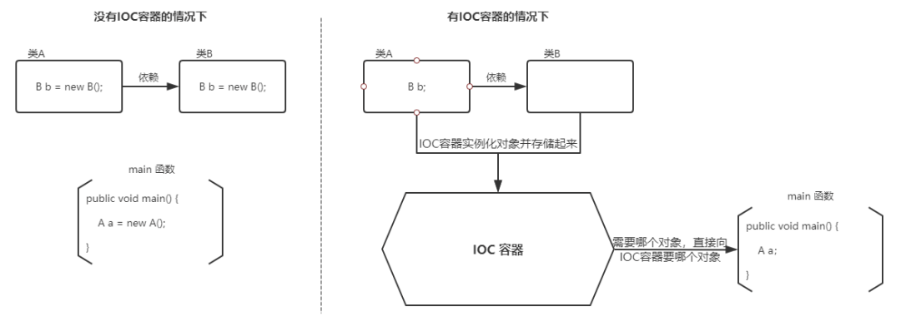

**目录:**  
1.Spring  
2.事务  
3.AOT  


## 1.Spring  
**目录:**  
1.1 模块介绍  
1.2 Spring IOC  
1.3 Spring Bean  
1.4 Spring AOP  


### 1.1 模块介绍  
spring5.x主要模块  
  
spring各个模块的依赖关系:  
  

1.Core模块  
**介绍:**  
Spring框架的核心模块,主要提供**IoC**依赖注入功能的支持.Spring其他所有的功能基本都需要依赖于该模块.  
* spring-core:Spring框架基本的核心工具类  
* spring-beans:提供对bean的创建、配置和管理等功能的支持
* spring-context:提供对国际化、事件传播、资源加载等功能的支持 
* spring-expression:提供对表达式语言(Spring Expression Language)<font color="#FF00FF">SpEL</font>的支持,只依赖于core模块,不依赖于其他模块,可以单独使用

2.AOP模块  
**介绍:**  
面向切面编程的支持
* spring-aspects:该模块为与<font color="#FF00FF">AspectJ</font>的集成提供支持
* spring-aop:提供了面向切面的编程实现
* spring-instrument:提供了为JVM添加代理(agent)的功能.具体来讲,它为Tomcat提供了一个<font color="#00FF00">织入</font>代理,能够为Tomcat传递类文件,就像这些文件是被类加载器加载的一样.没有理解也没关系,这个模块的使用场景非常有限

3.Message模块  
spring-messaging是从Spring4.0开始新加入的一个模块,主要职责是为Spring框架集成一些基础的报文传送应用

4.Data Access/Integration模块  
**介绍:**  
spring整合数据的支持  
* spring-jdbc:提供了对数据库访问的抽象JDBC.不同的数据库都有自己独立的API用于操作数据库,而Java程序只需要和JDBC API交互,这样就屏蔽了数据库的影响.
* spring-tx:提供对事务的支持
* spring-orm:提供对Hibernate、JPA、iBatis等ORM框架的支持.
* spring-oxm:提供一个抽象层支撑OXM(Object-to-XML-Mapping),例如:JAXB、Castor、XMLBeans、JiBX和XStream等;<font color="#00FF00">总结就是提供对XML映射的支持</font>
* spring-jms:消息服务(Java Message Service)Java消息服务;自Spring Framework 4.1以后,它还提供了对spring-messaging模块的继承.

5.Spring Web模块  
* spring-web:对Web功能的实现提供一些最基础的支持
* spring-webmvc:提供对<font color="#00FF00">Spring MVC</font>的实现
* spring-websocket:提供了对WebSocket的支持,WebSocket可以让客户端和服务端进行双向通信.
* spring-webflux:提供对<font color="#00FF00">WebFlux</font>的支持;WebFlux是Spring Framework 5.0中引入的新的响应式框架.与Spring MVC不同,它不需要Servlet API,是<font color="#00FF00">完全异步</font>  

6.Spring Test模块  
Spring团队提倡测试驱动开发(TDD).有了控制反转(IoC)的帮助,单元测试和集成测试变得更简单.  
Spring的测试模块对JUnit(单元测试框架)、TestNG(类似JUnit)、Mockito(主要用来Mock对象)、PowerMock等等常用的测试框架支持的都比较好.  

### 1.2 Spring IOC 
  

### 1.3 Spring Bean
下图展示了IOC如何使用配置文件来管理对象  
  

1.@Component和@Bean的区别  
* @Component注解作用于类,而@Bean注解作用于方法
* @Component通常是通过类路径扫描来自动侦测以及自动装配到Spring容器中(我们可以使用@ComponentScan注解定义要扫描的路径从中找出标识了需要装配的类自动装配到Spring的bean容器中).@Bean注解通常是我们在标有该注解的方法中定义产生这个bean,@Bean告诉了Spring这是某个类的实例,当我需要用它的时候还给我
* <font color="#00FF00">@Bean注解比@Component注解的自定义性更强</font>,而且很多地方我们只能通过@Bean注解来注册bean.比如当我们引用第三方库中的类需要装配到Spring容器时,则只能通过@Bean来实现

2.注入Bean的注解  
Spring内置的`@Autowired`以及JDK内置的`@Resource`和`@Inject`都可以用于注入Bean  
| Annotaion  |             Package              |    Source    |
| :--------: | :------------------------------: | :----------: |
| @Autowired | org.springframework.bean.factory | Spring 2.5+  |
| @Resource  |         javax.annotation         | Java JSR-250 |
|  @Inject   |           javax.inject           | Java JSR-330 |

*提示:`@Autowired`和`@Resource`使用的多一些*  

3.@Autowired和@Resource的区别  
`@Autowired`是Spring内置的注解,默认是按照**类型**进行注入的;当一个接口存在多个实现类时,仅仅通过`@Autowired`注解不做别的措施时是无法注入对象的;此时推荐使用`@Qualifier`注解来显式指定名称而不是依赖变量的名称.  
`@Resource`是JDK提供的注解,默认是按照**名称**进行注入的;如果无法通过名称匹配到bean时会按照**类型**进行注入  
`@Resource`注解内容如下:  
```java
public @interface Resource {
    String name() default "";
    Class<?> type() default Object.class;
}
```
如果仅指定`name`属性则按照**名称**进行注入  
如果仅指定`type`属性则按照**类型**进行注入  
如果同时指定`name`+`type`则会按照**类型**+**名称**的方式注入(通常不推荐这么使用)  

总结:  
* @Autowired是Spring提供的注解@Resource是JDK提供的注解;@Resource的侵入更小  
* Autowired默认的注入方式为byType(根据类型进行匹配),@Resource默认注入方式为 byName(根据名称进行匹配)
* 当一个接口存在多个实现类的情况下,@Autowired和@Resource都需要通过名称才能正确匹配到对应的Bean;@Autowired可以通过@Qualifier注解来显式指定名称,@Resource可以通过name属性来显式指定名称
* @Autowired支持在构造函数、方法、字段和参数上使用.@Resource主要用于字段和方法上的注入,不支持在构造函数或参数上使用

4.Bean的作用域  
SpringBean的作用域通常有以下几种:  
* `singleton`:IoC容器中只有唯一的bean实例.Spring中的bean默认都是单例的
* `prototype`:每次获取都会创建一个新的bean实例.也就是说,连续getBean()两次,得到的是不同的Bean实例
* `request`(仅Web应用可用):每一次HTTP请求都会产生一个新的bean(请求bean),该bean仅在当前HTTP request内有效.
* `session`(仅Web应用可用):每一次来自新session的HTTP请求都会产生一个新的bean(会话 bean),该bean仅在当前HTTP session内有效.
* `application`(仅Web应用可用):每个Web应用在启动时创建一个Bean,该bean仅在当前应用启动时间内有效
* `websocket`(仅Web应用可用):每一次WebSocket会话产生一个新的bean


5.Bean是线程安全的吗?  
Spring框架中的Bean是否线程安全,取决于其作用域和状态  
*这里着重关注prototype和singleton这两个作用域*  
<font color="#00FF00">prototype</font>作用域下,每次获得Bean都会创建一个新的Bean实例,不存在资源竞争问题;所以不存在线程安全问题
<font color="#00FF00">singleton</font>作用域下,IOC容器中只有唯一的bean实例,可能会存在资源竞争问题(取决于Bean是否有状态),如果这个Bean是有状态的,那就存在线程安全问题(有状态Bean是指包含可变的成员变量的对象)  

实际上大部分Bean都是无状态的(没有定义可变的成员变量,比如Dao、Service),这种情况下Bean是线程安全的.  
对于有状态的单利Bean的线程安全问题,有两种常见的解决方案:  
* 在Bean中尽量避免定义**可变**的成员变量
* 在类中定义一个ThreadLocal成员变量,将需要的可变成员变量保存在ThreadLocal中

6.Bean的生命周期  
* Bean容器找到配置文件中Spring Bean的定义
* Bean容器利用Java Reflection API(反射)创建一个Bean的实例
* 如果涉及到一些属性值利用set()方法设置一些属性值
* 如果Bean实现了BeanNameAware接口,调用setBeanName()方法,传入Bean的名字
* 如果Bean实现了BeanClassLoaderAware接口,调用setBeanClassLoader()方法,传入ClassLoader对象的实例
* 如果Bean实现了BeanFactoryAware接口,调用setBeanFactory()方法,传入BeanFactory对象的实例
* 与上面的类似,如果实现了其他 *.Aware接口,就调用相应的方法
* 如果有和加载这个Bean的Spring容器相关的BeanPostProcessor对象,执行postProcessBeforeInitialization()方法
* 如果Bean实现了InitializingBean接口,执行afterPropertiesSet()方法
* 如果Bean在<font color="#00FF00">配置文件</font>中的定义包含<font color="#00FF00">init-method属性</font>,执行指定的方法
* 如果有和加载这个Bean的Spring容器相关的BeanPostProcessor对象,执行postProcessAfterInitialization()方法
* 当要销毁Bean的时候,如果Bean实现了DisposableBean接口,执行destroy()方法
* 当要销毁Bean的时候,如果Bean在<font color="#00FF00">配置文件</font>中的定义包含destroy-method属性,执行指定的方法

*生命周期实例图:*  


### 1.4 Spring AOP
**介绍:**  
AOP(Aspect Oriented Programming-面向切面编程)能够将与业务无关,却为业务模块所共同调用的逻辑或责任(典型的如事务处理、权限管理、日志监控)封装起来,便于减少系统的重复代码,降低模块间的耦合度,并有利于未来的可拓展性和可维护性.  
SpringAOP是基于动态代理的,如果要代理的对象实现了某个接口,那么Spring AOP会使用JDK Proxy去创建代理对象;而对于没有实现接口的对象是无法使用动态代理的,只能使用Cglib来生成一个被代理对象的子类作为代理,如下图所示:  
  


## 2.事务  
**目录:**  
2.1 @Transactional 注解基本  
2.2 Isolation事务的隔离级别  
2.3 Propagation事务的传播行为  


### 2.1 @Transactional 注解基本  
```java
@Target({ElementType.TYPE, ElementType.METHOD})
@Retention(RetentionPolicy.RUNTIME)
@Inherited
@Documented
@Reflective
public @interface Transactional {

    String value();  //transactionManager的别名

    String transactionManager();  //事务管理

    Propagation propagation();  // 事务的传播行为  

    Isolation isolation();  // 事务的隔离级别

    int timeout();  // 在一个事务执行的过程中,过了多次时间之后会产生异常(回滚);单位是second

    String timeoutString();  // 同timeout()参数  

    boolean readOnly() default false;  // 是否只读,如果只读则代表当前事务只能查询不能修改,如果修改会产生异常.  

    Class<? extends Throwable>[] rollbackFor();  // 指定遇到哪些异常会产生回滚

    String[] rollbackForClassName();  // 指定遇到哪些异常会产生回滚,与rollbackFor效果一致,不过这里指定的是类全限定名(字符串形式)

    Class<? extends Throwable>[] noRollbackFor();  // 指定遇到哪些异常不回滚

    String[] noRollbackForClassName();  // 指定遇到哪些异常不回滚,类全限定名(字符串)

}
```

### 2.2 Isolation事务的隔离级别  
```java
// 枚举类
public enum Isolation {

	DEFAULT(TransactionDefinition.ISOLATION_DEFAULT),
    READ_UNCOMMITTED(TransactionDefinition.ISOLATION_READ_UNCOMMITTED),
    READ_COMMITTED(TransactionDefinition.ISOLATION_READ_COMMITTED),
	REPEATABLE_READ(TransactionDefinition.ISOLATION_REPEATABLE_READ),
    SERIALIZABLE(TransactionDefinition.ISOLATION_SERIALIZABLE);
}
```

* READ_UNCOMMITTED:读未提交
* READ_COMMITTED:读已提交
* REPEATABLE_READ:可重复读
* SERIALIZABLE:SERIALIZABLE
* DEFAULT:使用数据库的默认隔离级别(不同的数据库默认的隔离界别是不同的),例如MySQL默认的隔离级别就是REPEATABLE_READ.


### 2.3 Propagation事务的传播行为  
**设置:** 通过在@Transactional注解中设置propagation值来指定当前事务的传播行为.    
```java
public enum Propagation {
    // Spring中共有7种传播事务
    REQUIRED,SUPPORTS,MANDATORY,REQUIRES_NEW,NOT_SUPPORTED,NEVER,NESTED;
}
```

**解释:**  
什么是事务的传播行为?  
首先必须是两个**事务**,在service层中有functionA和functionB;它们都被@Transactional注解所修饰,假设functionA在执行的过程中调用了functionB,那么事务该如何传递.是继续沿用functionA的事务,还是开启一个新的事务?还是将A和B这两个函数合并为一个整体的事务?  

|        枚举         |                                                                 解释                                                                 |
| :-----------------: | :----------------------------------------------------------------------------------------------------------------------------------: |
| REQUIRED(常用/默认) |                                         如果A没有事务就新建事务,否则B加入A的事务构成一个整体                                         |
|      SUPPORTS       |                                          如果A没有事务,则B啥也不干.如果A有事务则B加入该事务                                          |
|      MANDATORY      |                                           如果A没有事务,则B抛出异常;否则B加入A构成一个整体                                           |
| REQUIRES_NEW(常用)  |                     直接对B开启一个新的事物,对A事务而言B的事务和它一点关系没有,完全属于两个事务;它们之间没有关联                     |
|    NOT_SUPPORTED    |                                         B不支持事务,如果A有事务则挂起事务A;B根A没有一点关系                                          |
|        NEVER        |                                                不支持事务;如果A有事务则B直接抛出异常                                                 |
|       NESTED        | 嵌套事务;如果A有事务,则在事务A的内部再嵌套一个事务B,事务B可以独立得回滚和提交.如果A没有事务,则效果和REQUIRED一样,就是B单独开一个事务 |

* REQUIRES_NEW和NESTED之间的区别:NESTED中的主和从事务本质都在一个事务中,嵌套的事务会和主事务一起提交.例如functionB完成工作后不会立即提交,而是回到functionA.等functionA也完成事务后两个事务一并提交.REQUIRES_NEW则是当functionB完成工作后会立即提交事务,然后再回到functionA(因为A和B现在就是两个单独的事务)  
  另外在REQUIRES_NEW传播行为下,如果B事务异常了产生回滚;A事务是不受影响的(A和B没有关联)

**注意:** @Transactional里的事务传播行为一般都是针对<font color="#00FF00">被调用函数</font>生效的(不针对调用者)  


## 2.AOT  
**目录:**  
2.1 JIT与AOT  
2.2 AOT-Native-Image构建  


### 2.1 JIT与AOT  
**注意:** AOT和JIT是有很强的关联的  

**JIT:** 即时编辑器,即Java程序在运行的过程中会一边运行一边编译为二进制文件,好处就是对于热点代码的编译可以使得程序执行的速度更快.但有一个缺陷是:在进行动态编译的过程中会降低程序的吞吐量.  

**AOT:** ahead of time 运行前编译,提前编译;这种技术可以直接将Java字节码转换成二进制代码.由于是提前编译所以不会影响系统的吞吐量(性能也得到了提升);并且运行时内存占用更低.缺陷是:运行时不能动态优化;程序安装时间变长、打包的这些二进制代码无法跨平台运行、理论峰值性能不如JIT.    

**为什么需要AOT?**  
在云原生时代,Java相比GO、Rust等其它编程语言最大的弊端就是启动编译和启动进程非常慢,这对于根据实时计算资源,弹性扩容的云原生技术相冲突,Spring6借助AOT技术在运行时内存占用低,启动速度快从而更好地满足Java在云原生时代的需求,所以推荐升级到JDK17.  


**什么是GraalVM?**  [GraalVM-云原生时代的JVM(Java)](https://www.lfge.net/news/2782.html)

**什么是Native Images?**  
目前业界除了这种在JVM中进行AOT的方案,还有另外一种实现JavaAOT的思路,那就是直接摒弃JVM,和C/C++一样通过编译器直接将代码编译成机器代码,然后运行.这无疑是一种直接颠覆Java语言设计的思路,那就
是GraalVM Native Image.它通过C语言实现了一个超微缩的运行时组件——Substrate VM,基本实现了JVM的各种特性,但足够轻量、可以被轻松内嵌,这就让Java语言和工程摆脱JVM的限制,能够真正意义上实现和C/C++一样的AOT编译.这一方案在经过长时间的优化和积累后,已经拥有非常不错的效果,基本上成为Oracle官方首推的Java AOT解决方案.  
Native Image是一项创新技术,可将Java代码编译成独立的本机可执行文件或本机共享库.在构建本机可执行文件期间处理的Java字节码包括所有应用程序类、依赖项、第三方依赖库和任何所需的JDK类.生成的自包含本机可执行文件特定于不需要JVM的每个单独的操作系统和机器体系结构.

### 2.2 AOT-Native-Image构建  


