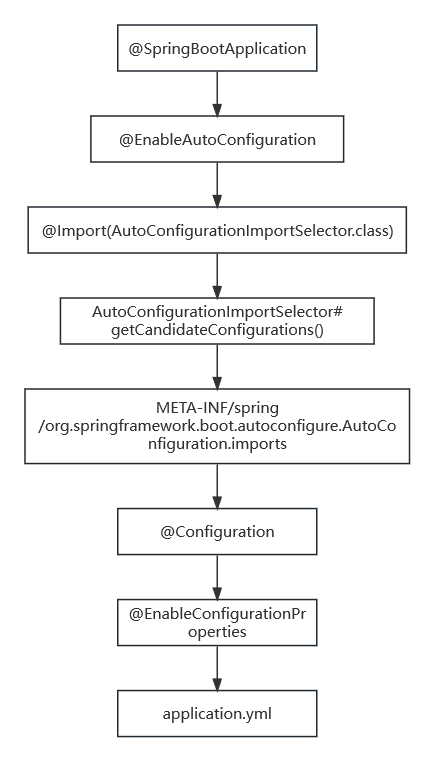

# 目录
1.快速开始(包含升级SpringBoot、通过SpringBoot开发)    
2.核心特性  
3.Web  
4.Data  
5.Message  
6.IO  
7.容器镜像  
8.生产就绪  
9.发布SpringBoot应用  
10.GraalVM Native Image Support(AOT镜像支持)  
11.Spring Boot CLI  
12.构建插件  
13.应用场景  
14.附录


## 3.Web 
**目录:**  
3.1 Servlet Web Application  
3.2 Reactive Web Application 


### 3.2 Reactive Web Application 
**目录:**  
3.2.1 RFC 7807 Problem Details 


#### 3.2.1 RFC 7807 Problem Details 
**介绍:** 一种新的错误处理方式,参照RFC 7807文档  
[Spring支持RFC 7807](https://docs.spring.io/spring-framework/reference/web/webmvc/mvc-ann-rest-exceptions.html)  

1.SpringBoot默认是不开启该错误处理的  
必须通过指定application.yml进行开启
```yml
spring:
  mvc:
    problemdetails:
      enabled: true
```

2.可以尝试开启和不开启两种情况下,错误响应数据的内容是什么  


## 14. 附录  
**目录:**  
14.1 自动配置原理  
14.2 自动配置类(@Configuration)  
14.3 自动配置文件类(@ConfigurationProperties)  

### 14.1 自动配置原理  
`@SpringBootApplication`是由三个注解构成的`@SpringBootConfiguration`、`@ComponentScan`、`@EnableAutoConfiguration`  

其中`@SpringBootConfiguration`注解又被`@Configuration`注解修饰,代表当前主启动类也是一个Configuration.  
`@ComponentScan` 默认会扫描Springboot主启动类下的Bean,当前也可以通过指定basePackages属性来指定扫描的路径.  
`@EnableAutoConfiguration`是自动配置中最重要的注解.

1.查看@EnableAutoConfiguration注解  
```java
@AutoConfigurationPackage
@Import(AutoConfigurationImportSelector.class)
public @interface EnableAutoConfiguration {
}
```

最重要的在于当前注解通过`@Import`注解向容器中导入了AutoConfigurationImportSelector这个组件,着重看这个方法
```java
protected List<String> getCandidateConfiguration(AnnotationMetadata metadata, AnnotationAttributesattributes) {
	List<String> configurations = ImportCandidates.load(AutoConfiguration.class, getBeanClassLoader())
		.getCandidates();
	Assert.notEmpty(configurations,
			"No auto configuration classes found in "
					+ "META-INF/spring/org.springframework.boot.autoconfigure.AutoConfiguration.imports. If you "
					+ "are using a custom packaging, make sure that file is correct.");
	return configurations;
}
```

SpringBoot会从`META-INF/spring/org.springframework.boot.autoconfigure.AutoConfiguration.imports`这个文件中读取内容(**而这个文件的内容正是,所有自动配置类的全限定名**).  

2.spring-boot-autoconfigure模块的作用  
在SpringBoot3中不管我们引入了哪一个场景启动器(spring-boot-starter-xxx)都会依赖(spring-boot-starter),而(spring-boot-starter)会依赖(spring-boot-autoconfigure).上述所说的`META-INF/spring/org.springframework.boot.autoconfigure.AutoConfiguration.imports`这个文件就存放在spring-boot-autoconfigure中.并且查看该依赖,你可以看到各种各样的**xxxxAutoConfiguration**和**xxxxProperties**.  
springboot在<font color="#00FF00">spring-boot-autoconfigure</font>中聚合了各种各样的自动配置类(`@Configuration`)和配置文件类(`@ConfigurationProperties`);并且几乎在每个配置类上面都使用了`@EnableConfigurationProperties`来导入配置文件类(也就是我们在yml中指定配置为何生效的原因)  

**可能存在的误导:** 注意SpringBoot扫描的时候会扫描所有jar的`META-INF/spring/org.springframework.boot.autoconfigure.AutoConfiguration.imports`不仅仅是spring-boot-autoconfigure模块,所以如果我们编写了一个自定义的场景启动器,也必须在该路径下创建配置文件,然后将自动配置类的全限定名填入.
**并且**每个自动配置类上必须标注`@AutoConfiguration`注解,仅仅在`imports`配置文件中配置还不行,必须添加`@AutoConfiguration`注解(因为SpringBoot会过滤掉不添加该注解的配置类)

3.并不是所有自动配置都会生效  
spring-boot-autoconfigure模块聚合了大量场景的自动配置(一共一百多个),难道这一百多个配置都会加载到容器中去吗?  
实际上并不会,SpringBoot通过`ConditionalOnxxxx`注解来判断当前是否要将某个Bean添加到容器中;例如有些类都没有引入SpringBoot自然就无法自动装配了.  
总结就是:**按需装配**

4.流程梳理  
`@SpringBootApplication`->`@EnableAutoConfiguration`->`@Import(AutoConfigurationImportSelector.class)`->`AutoConfigurationImportSelector#getCandidateConfigurations()`->`META-INF/spring/org.springframework.boot.autoconfigure.AutoConfiguration.imports`->`@Configuration`->`@EnableConfigurationProperties`->`application.yml`  





### 14.2 自动配置类(@Configuration)  
自动配置类大全:  
[https://docs.spring.io/spring-boot/docs/3.1.3/reference/htmlsingle/#appendix.auto-configuration-classes](https://docs.spring.io/spring-boot/docs/3.1.3/reference/htmlsingle/#appendix.auto-configuration-classes)


### 14.3 自动配置文件类(@ConfigurationProperties)  
自动配置文件大全:  
[https://docs.spring.io/spring-boot/docs/3.1.3/reference/htmlsingle/#appendix.application-properties](https://docs.spring.io/spring-boot/docs/3.1.3/reference/htmlsingle/#appendix.application-properties)  


