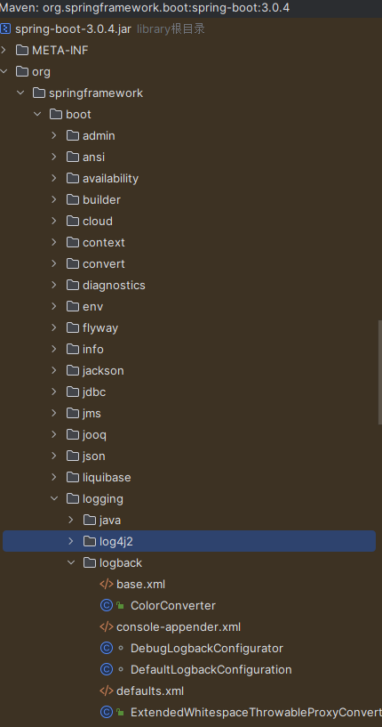
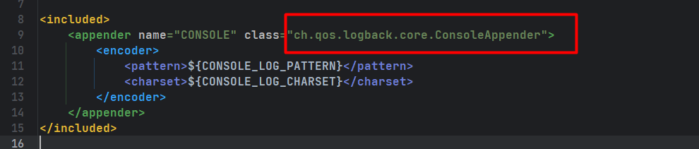
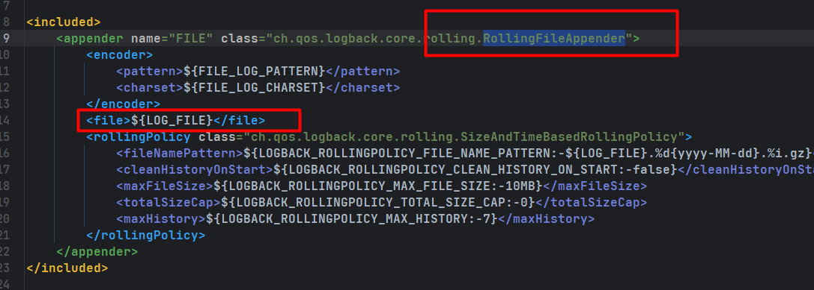

**路径:** 来到springboot的logging模块的logback包.在外部库路径下可以找到springboot的三个日志文件的配置.`spring-boot-3.0.4.jar!\org\springframework\boot\logging\logback\defaults.xml`  
  

主要看三个文件:**defaults.xml**、**console-appender.xml**、**file-appender.xml** 其中console文件用于处理控制台的日志打印信息,file配置文件用于配置文件输出的打印信息.  

ConsoleAppender:这个格式是固定的\<appender\>标签用于指定当前是什么类型的输出.  
console-appender.xml内容如下:
  

file-appender.xml内容如下:  
RollingFileAppender:用于处理文件的,格式也是固定的,并且它的意思是滚动输出文件.  
\<file\>标签用于指定文件的输出路径.
  

**整合springboot:**  
在当前项目的resources目录下创建一个`logback-spring.xml`那么该配置文件就会默认被springboot识别到,并且不会影响日志框架本身进行识别.  
这样带来的好处就是,我们的配置不会覆盖springboot自身的配置,并且能被spring接管.我们的配置就会在spring的基础上进行扩展.  
