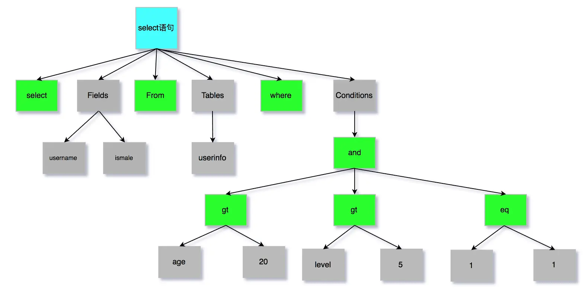
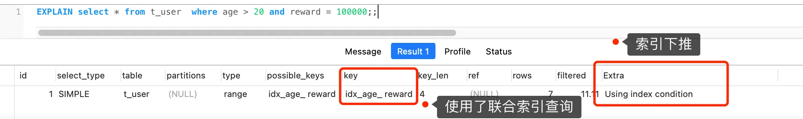
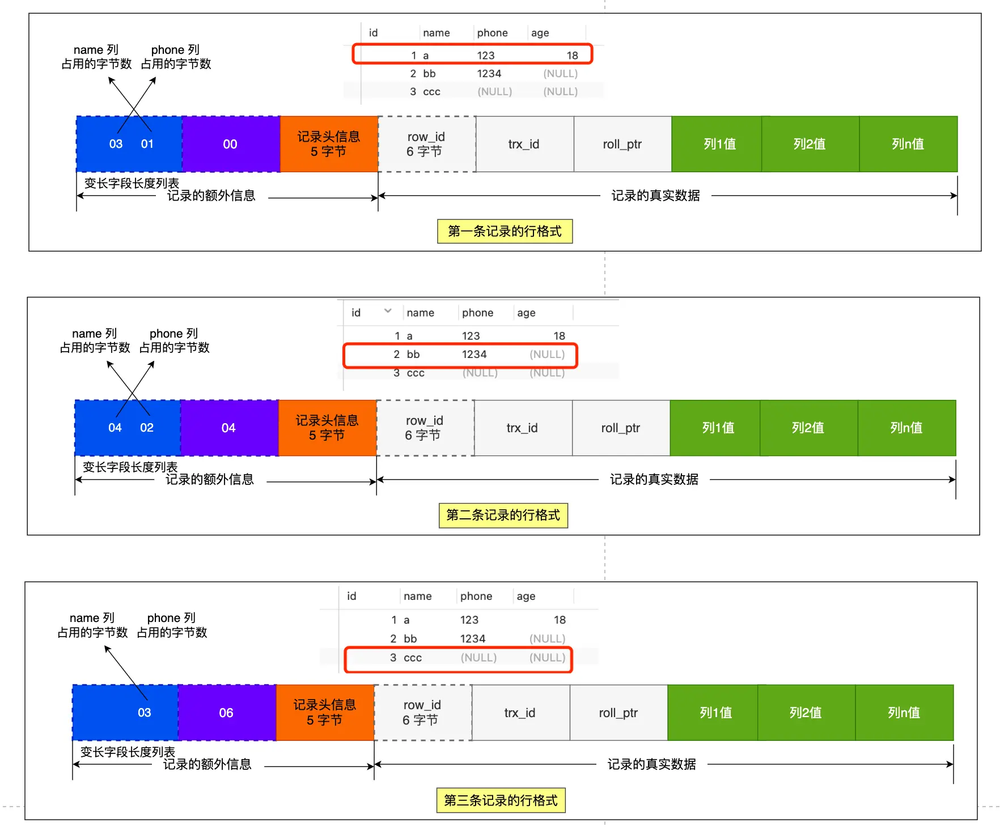
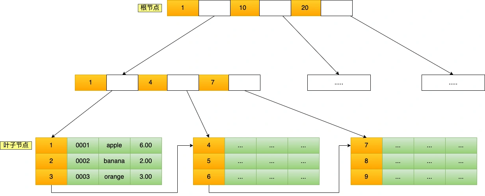
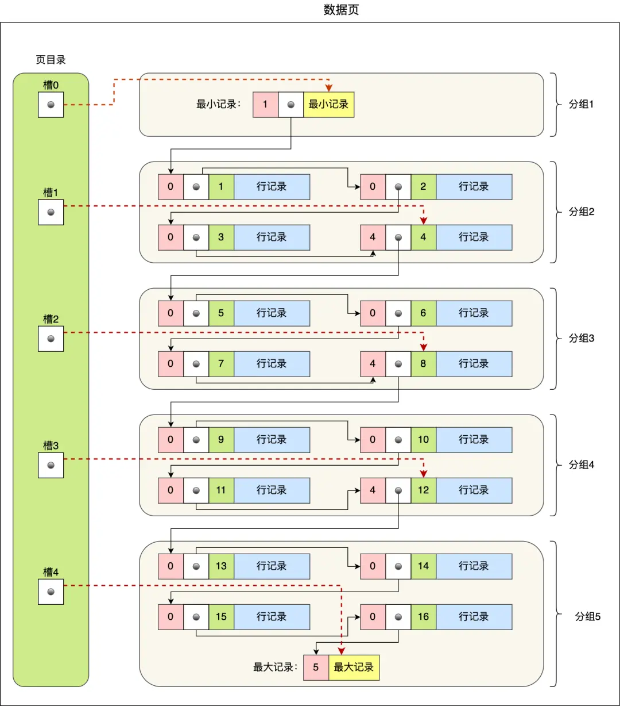
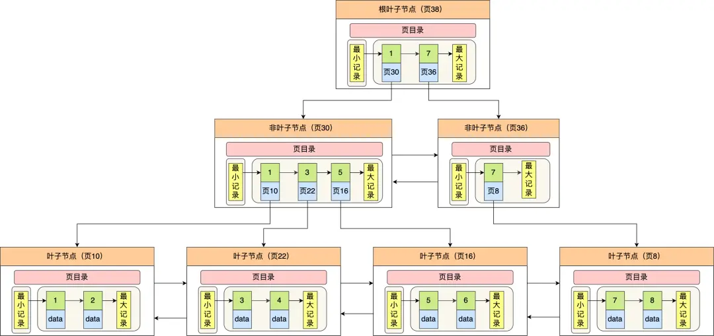

# 目录:  
1.SQL执行过程  
2.事务  
3.锁  
4.日志  
5.索引  

## 1. SQL执行过程  
**目录:**  
1.1 SQL的执行过程  
1.2 select语句的执行顺序  
1.3 MySQL一行记录的存储结构  

### 1.1 SQL的执行过程
1.SQL执行流程图  

  

2.Server层和存储引擎层  
只有**真真正正**涉及到数据的存储时才会调用存储引擎层,大部分内容都是在Server层完成的;Server与存储引擎层之间是通过**接口**进行交互的.  
相当于Server层定义了一套接口,不同的存储引擎实现了这套接口;Server层并不管存储引擎具体是怎么实现的.只要按照MySQL的实现规范完全可以写一个自定义的存储引擎;就包括innodb存储引擎最开始也不是MySQL官方的(就是大牛根据规范编写的自定义实现),后来因为该存储引擎太强大被招安了.  
<font color="#00FF00">引擎层是插件式的,目前主要包括InnoDB、MyISAM、Memory</font>  

* service层:负责建立连接、分析和执行SQL.MySQL大多数核心功能模块都在此层实现,主要包括连接器、查询缓存、解析器、预处理器、优化器、执行器等.此外所有的内置函数和跨存储引擎功能都在此实现.  
* 存储引擎:存储引擎负责数据的存储和提取,支持innodb、MYISAM、memory等多种存储引擎,不同的存储引擎<font color="#00FF00">共用server层</font>.  

3.连接器  
**过程:**  
连接的过程要经历TCP三次握手和四次挥手  

**获取用户权限:**  
连接成功之后MySQL会获取到当前用户的权限并保存在内存中,后序整个连接的生命周期内都会使用连接时获取到的权限进行判断,所以如果一个用户已经建立的连接,即使管理员中途修改了该用户的权限,也不会影响本次连接的权限;只有在新建连接时才会使用新的权限.  

`show processlist`命令可以查看当前MySQL的连接数  

MySQL定义了空闲连接的最大空闲时长,由`wait_timeout`参数控制,默认值是(28880秒-8小时),如果空闲连接超过了这个时长,则连接器就会自动断开.  
`show variables like 'wait_timeout'` 可以查看空闲连接的时长  

`show variables like 'max_connections'` 查看最大连接数量

**长连接占用资源问题:**  
MySQL也有长连接和短连接的概念,它们的区别如下  
> // 短连接  
连接mysql服务(TCP 三次握手)  
执行sql  
断开mysql服务(TCP 四次挥手)  
// 长连接  
连接mysql服务(TCP 三次握手)  
执行sql  
执行sql  
执行sql  
....  
断开mysql服务(TCP 四次挥手)  

<font color="#00FF00">一般是推荐使用长连接的</font>,因为这可以减少重复建立连接和断开的过程,但是MySQL是通过内存管理连接对象的,长连接会使得内存占用增多;只有当这些连接断开时MySQL才会释放内存.

**如何解决长连接占用内存问题:**  
* 定期断开长连接
* 客户端主动重置链接,在MySQL5.7版本中实现了mysql_reset_connection()函数接口,当客户端执行了一个很大的操作后可以调用该函数来重置连接,达到释放内存的效果;这个过程不需要重连和重新做权限验证,但是会将连接恢复到刚刚创建完时的状态.  

4.查询缓存  
建立连接之后,客户端向MySQL发送SQL语句,MySQL会初步判断一下这条SQL语句是不是select查询语句,如果是则MySQL会先去查询缓存里查找缓存数据,看之前有没有执行过这条SQL语句,查询缓存是以K-V的形式保存在内存中的,<font color="#00FF00">Key为SQL查询语句,value为查询的结果</font>.  
<font color="#00FF00">实际上查询缓存是很鸡肋的</font>  
对于更新比较频繁的表,只要一个表有更新操作,则该表对应的查询缓存会被全部清空;并且根据Key来查询,那只要Key的结果稍微不一样不就无法命中了.所以它的命中率也是很低的;于是MySQL8将查询缓存移除了.  

5.解析器  
解析器分为两个步骤:  
* 词法分析:  
  这步说白了就是识别关键字;例如SQL语句`select username from userinfo`在分析之后,会得到4个token,其中有两个keyword,分别为select和from;username和userinfo是非关键字
* 语法分析:  
  这步说白了就是构建语法树,主要是判断你输入的SQL语句是否满足MySQL语法,如果没问题就会构建出SQL语法树.SQL语法树可以帮助后续的执行模块获取SQL类型、表名、字段名、where条件.  
    

**注意:**  
在解析器这步中并不会判断SQL语句中的的表、字段是否存在,而是会放到执行器中进行判断.  

6.执行器(包含优化器)  
*提示:执行器之前是要先经过优化器的,这里把优化器和执行器合并一起来介绍*  
执行器分为三个阶段:prepare(预处理阶段)、optimize(优化阶段)、execute(执行阶段)  

**预处理器:**  
* 检查SQL语句中的表或者字段是否存在  
* 将select \* 中的 \* 符号,扩展为表上的所有列

**优化器:**  
<font color="#00FF00">该阶段用于生成执行计划,确定SQL语句的执行计划</font>  

通过`explain`命令来查询执行计划  

**执行器:**  
假设现在有一张product表,它的id是主键,执行以下SQL语句:  
`select * from product where id = 1;`  
首先这条语句用到了主键索引,而且是等值查询不会有id相同的记录的情况出现,所以优化器决定使用const的访问类型进行查询;此时执行器与存储引擎的执行流程如下:  
* 执行器第一次查询,会调用`read_first_record`函数指针指向的函数,因为优化器选择的访问类型为const,这个函数指针被指向为innodb引擎索引查询的接口(也就是server层有innodb层的函数引用),把条件id=1交给存储引擎,<font color="#00FF00">让存储引擎定位符合条件的第一条记录</font>  
* 存储引擎通过主键索引的B+树结构定位到id = 1的第一条记录,如果记录不存在则会向执行器上报记录找不到的错误,然后查询结束.如果记录是存在的,就会将记录返回给执行器.  
* 执行器从存储引擎读到记录后,接着判断记录是否符合查询条件,如果符合则发送给客户端,如果不符合则跳过该记录.  
* 执行器查询的过程是一个while循环,所以会不停查询;只不过在第一次查询的时候调用的是`read_first_record`函数对应的指针;而之后会调用`read_record`指针指向的函数,而由于当前的访问类型为const;对于server层而言该指针永远指向一个返回值为-1的函数,所以调用该函数时,执行器退出循环结束查询.  

现在执行另外一条没有使用索引的SQL语句:  
`select * from product where name = 'iphone';`  
此SQL语句没有使用索引,所以会走全表扫描;此时执行器与存储引擎的执行流程如下:  
* 执行器第一次查询,会调用`read_first_record`函数指针指向的函数,因为优化器选择的访问类型为all,这个函数指针被指向为InnoDB引擎全扫描的接口,让存储引擎读取表中的第一条记录  
* 执行器会判断读到的这条记录的name是不是iphone,如果不是则跳过;如果是则将记录发给客户的(是的没错,Server层每从存储引擎读到一条记录就会发送给客户端,之所以客户端显示的时候是直接显示所有记录的,是因为客户端是等查询语句查询完成后,才会显示出所有的记录)  
* 执行器查询的过程是一个while循环,所以还会再查一次,会调用`read_record`函数指针指向的函数,因为优化器选择的访问类型为all,`read_record`函数指针指向的还是InnoDB引擎全扫描的接口,所以接着向存储引擎层要求继续读刚才那条记录的下一条记录,存储引擎把下一条记录取出后就将其返回给执行器(Server层),执行器继续判断条件,不符合查询条件即跳过该记录,否则发送到客户端.  
* 一直重复上述过程,直到存储引擎把表中的所有记录读完,然后向执行器(Server层)返回了读取完毕的信息;执行器收到存储引擎查询完毕的信息,退出循环,停止查询  

**索引下推:**  
**作用:** 索引下推能够减少二级索引的回表次数,提高查询效率,它的原理是将server层负责的事情下推到存储引擎层面执行.  
有一张user表(id,name,age,reward);对(age,reward)建立了联合索引  
执行以下SQL语句:  
`select * from t_user  where age > 20 and reward = 100000;`  
**注意:**  
联合索引当遇到范围查询(>、<)就会停止匹配,也就是age字段能用到联合索引,但是reward字段则无法利用到索引  

**没有索引下推的执行过程:**
* server层首先调用存储引擎接口,定位到满足查询条件的第一条二级索引记录,也就是定位到age>20的第一条记录.  
* 存储引擎根据二级索引的B+树快速定位到这条记录,获取主键值,然后进行回表操作,将完整的记录返回给server层.  
* server层判断该记录的reward是否等于100000,如果等于则响应给客户端,否则跳过当前记录.  
* 存储引擎接着寻找下一条记录,<font color="#00FF00">存储引擎在二级索引查找到记录,获取主键值,然后回表操作,将完整的记录返回给server层</font>  
* 如此往复,直到查询完表中的所有记录  

**缺陷:** 可以看到在没有使用索引下推的时候,二级索引每查到一条记录都需要回表查询,然后再将记录返回给server层,由server层来判断查询条件是否吻合.    

**使用索引下推的执行过程:**  
由于是联合索引,所以索引存储的内容是age+reward,所以当匹配到age>20的记录之后就可以直接判断reward的值了.  
使用索引下推之后,判断记录的reward是否等于100000的工作交给了存储引擎层,过程如下:  
* Server层首先调用存储引擎的接口定位到满足查询条件的第一条二级索引记录,也就是定位到age > 20的第一条记录
* 存储引擎定位到二级索引后,<font color="#00FF00">先不进行回表操作</font>,而是先判断一下该索引中包含的列(复合索引)对reward=100000条件是否满足,如果满足则执行回表操作否则直接跳过.  
* server层拿到记录后再判断是否满足其它的查询条件,如果成立则返回客户端,否则跳过这条记录.  
* 如此往复,直到查询完表中的所有记录

*当你发现执行计划里的Extr部分显示了"Using index condition",说明使用了索引下推*  
  

7.总结  
执行一条SQL语句的期间发生了什么?  
* 连接器:建立连接,管理连接、校验用户身份;  
* 查询缓存:查询语句如果命中查询缓存则直接返回,否则继续往下执行.MySQL8.0已删除该模块
* 解析SQL,通过解析器对SQL查询语句进行词法分析、语法分析,然后构建语法树,方便后续模块读取表名、字段、语句类型
* 执行SQL:  
  执行SQL共有三个阶段
  * 预处理阶段:检查表或字段是否存在;将select \* 中的 \* 符号扩展为表上的所有列
  * 优化阶段:基于查询成本的考虑,选择查询成本最小的执行计划
  * 执行阶段:根据执行计划执行SQL查询语句,从存储引擎读取记录,返回给客户端


### 1.2 select语句的执行顺序  
SQL编写顺序:`select distinct field from left_table_name left join right_table_name on left_table_name.field=right_table_name.field where ... and/or ... group by field1,field2... with rollup having ... order by field desc/asc limit ...`

SQL解析顺序:`from ... on.. join.. where .. group by ... having ... select dinstinst order by limit ...`  

注意:having关键字是可以使用select后面指定的field别名的,所以field的解析顺序至少应该在hiving之前  

**特性:**
当select * from ... 后面指定的是多张表时,左表的输出会作为右表的输出(相对而言的左右表),最终会生成一个VT1虚拟表.计算这两张关联表的笛卡尔积,生成虚拟表VT1-J1.基于虚拟表VT1-J1这一个虚拟表进行过滤,过滤出所有满足ON谓词条件的列,生成并放到新虚拟表VT1-J2(注意是基于VT1-J1,所以这里产生了J2这张新表).如果使用了外连接(LEFT,RIGHT,FULL),主表(也就是外连接的时候,不是有一张表查出的内容作为另一张表的输入,作为另一张表的输入的这张表就是主表)主表中不符合ON条件的列也会被加入到VT1-J2中(也就是主表中不符合条件的数据还是会被添加到VT1-J2这张表里的),作为外部行,生成虚拟表VT1-J3.
对所有VT1的表进行过滤,满足where子句的列被插入到VT2表中(where和外连接中的on的区别在于,on针对过滤的是关联表,主表会返回所有的列,因为就算不符合条件的也会被添加到VT1-J2中).  
group by 这个子句会把VT2表按照group by中的列进行分组,生成VT3表  
having子句对VT3表中的不同的组进行过滤,只作用于分组后的数据,满足HAVING条件的子句被加入到VT4表中  
select对select子句中的元素进行处理,生成VT5表,计算表达式 计算select子句中的表达式,生成VT5-J1,寻找VT5-1中的重复列,并删掉,生成VT5-J2  
如果在查询中指定了DISTINCT子句,则会创建一张内存临时表(如果内存放不下,就需要存放在硬盘了).这张临时表的表结构和上一步产生的虚拟表VT5是一样的,不同的是对进行DISTINCT操作的列增加了一个唯一索引,以此来除重复数据.  
从VT5-J2中的表中,根据ORDER BY 子句的条件对结果进行排序,生成VT6表.  
limit子句从上一步得到的VT6虚拟表中选出从指定位置开始的指定行数据.  

### 1.3 MySQL一行记录的存储结构
1.查看MySQL数据文件的存放路径  
`show variables like 'datadir'`  
```sql
mysql> SHOW VARIABLES LIKE 'datadir';
+---------------+-----------------+
| Variable_name | Value           |
+---------------+-----------------+
| datadir       | /var/lib/mysql/ |
+---------------+-----------------+
1 row in set (0.00 sec)
```

我们每创建一个database数据库,都会在该目录下创建一个以database为名的目录,然后表结构和表数据文件都会存放在这个目录下.  
现在创建一个库my_test,该database里有一张名为t_order的表  
cd 进入/var/lib/mysql/my_test目录,查看结构  
```shell
[root@xiaolin ~]#ls /var/lib/mysql/my_test
db.opt  
t_order.frm  
t_order.ibd
```
* db.opt:用来存储当前数据库的默认字符集和字符校验规则  
* t_order.frm:该文件用于保存表结构文件,在MySQL中每建立一张表都会生成一个.frm文件,该文件是用来保存每个表的元数据信息的,主要包含表结构定义  
* t_order.ibd:保存t_order表数据的文件,表数据既可以存在共享表空间文件(文件名:ibdata1)里,也可以存放在独占表空间文件(文件名:表名.idb),这个行为是由参数`innodb_file_per_table`控制的,若设置了参数`innodb_file_per_table`为1,则会将存储的数据、索引等信息单独存储在一个独占表空间.MySQL8中该参数默认为1  

2.表空间文件的结构  
<font color="#00FF00">表空间由段(segment)、区(extend)、页(page)、行(row)组成</font>innodb存储引擎的逻辑结构大致如下:  
  

* 行(row):数据库表中的记录都是按行(row)进行存放的,每行记录根据不同的行格式,有不同的存储结构  
* 页(page):记录是按照页存储的,但是数据的读取不以行为单位,否则每次读取数据(一次I/O)只能处理一行数据,效率十分低下.  
  <font color="#00FF00">innodb的数据是以页为单位来读写的</font>,即读取的数据是按照页来读取放入内存的buffer pool  
  默认每个页的大小为16KB,也就是最多能保证16KB的连续存储空间  
  数据表中的记录存放在内存中buffer pool的数据页中  
  查看:4.日志=>4.3buffer pool
* 区(extent):  
  innodb存储引擎是通过B+树来组织数据的  
  B+树中每一层的数据都是通过双向链表组织起来的,如果是以页为单位来分配存储空间,由于链表中相邻两个页之间的物理位置可能不是连续的,可能离地非常远就会导致大量的随机IO,从而导致性能的下降.  
  解决方式是让链表中相邻的两个页面分配在连续的磁盘上的位置也相邻  
  <font color="#00FF00">在表数据量很大的情况下,为索引分配空间的时候就不再按照页为单位进行分配了,而是按照区为单位进行分配.每个区的大小为1M,可以容纳64个16KB的页面,这样就使得链表中相邻的页的物理位置也相邻,就能使用顺序I/O了</font>  
* 段(segment):  
  <font color="#FF00FF">表空间是由各个段组成的</font>,段是由多个区(extent)组成的,段一般分为数据段、索引段和回滚段等.(也就是说段也能再分,由不同的段再分为不同的区)  
  * 索引段:存放B+树的非叶子节点的<font color="#FF00FF">区</font>的集合  
  * 数据段:存放B+树的叶子节点的<font color="#FF00FF">区</font>的集合
  * 回滚段:存放的是回滚数据的区的集合

3.innodb的行格式有哪些  
行格式(row_format)就是一条记录的存储结构  
innodb提供四种行格式:Redundant、Compact、Dynamic和Compressed  
* Redundant:没人用不介绍  
* Compact:一种紧凑的行格式,目的是为了让一个数据页能放入更多的行记录;解决Redundant格式不紧凑的问题  
* Dynamic和Compressed:都是紧凑行格式,它们的行格式都和Compact差不多,都是基于Compact的改进,自MySQL5.7之后默认使用Dynamic  

4.Compact行格式  
  
<font color="#00FF00">一条完整的记录分为:记录的额外信息和记录的真实信息</font>  

**<font color="#FFC800">记录的额外信息:</font><font color="#FF00FF">变长字段长度列表、null值列表、记录头信息</font>**  

**变长字段长度列表:**  
varchar是可变长度,所以在存储varchar型数据的时候,不仅要存储数据内容本身也要存储数据的长度信息,这个长度信息就存储在**变长字段长度列表**中,读取的时候就通过**变长字段长度列表**去读取对应长度的数据.TEXT、BLOB的实现方式也是如此.  
假设这里t_user表的结构如下,其中name和phone都是可变字符串:  
```sql
CREATE TABLE `t_user` (
  `id` int(11) NOT NULL,
  `name` VARCHAR(20) DEFAULT NULL,
  `phone` VARCHAR(20) DEFAULT NULL,
  `age` int(11) DEFAULT NULL,
  PRIMARY KEY (`id`) USING BTREE
) ENGINE = InnoDB DEFAULT CHARACTER SET = ascii ROW_FORMAT = COMPACT;
```
现在t_user表里有这三条记录:  
  

* 第一条记录:  
  name列的值为a,真实数据占用的字节数是1字节,十六进制0x01  
  phone列的值为123,真实数据占用的字节数是3字节,十六进制0x03  
  age列和id列不是变长字段,所以这里不用管  

> 存放在变长字段列表中真实数据长度的信息会按照<font color="#00FF00">逆序存放</font>,所以变长字段长度列表中的内容是03 01 而不是01 03  

  

* 第二条记录中变长字段长度列表的值是04 02,如图:  
   

* 第三条记录中phone列的值是null,<font color="#00FF00">NULL是不会存放在行格式中记录的真实数据部分里的</font>,所以变长字段长度列表是不存放null的变长字段长度的  
  

> 为什么变长字段长度列表中的信息要逆序存放?  
> 主要是因为,<font color="#FFC800">记录头信息</font>中指向下一条记录的指针,指向的是下一条记录的<font color="#FFC800">记录头信息</font>和<font color="#FFC800">真实数据</font>.好处是向左读就是记录头信息,向右读就是真实数据,比较方便.  
> 这样在读取的时候,记录头指针往前左读到的第一个长度就是记录头指针往右读到的第一个变长字段的长度;使得位置靠前的记录的真实数据和数据对应的字段长度信息可以同时在一个CPU Cache Line中,这样就可以提高CPU Cache的命中率.  

*提示:并不是所有表的行格式都有变长字段长度列表这条数据的;当数据列表没有变长字段的时候,比如全部都是int类型的字段,这时候表里的行格式就不会有变长字段长度列表了*  

**null值列表:**  
在Compact的行组织格式下,并不会把null值存放到记录的真实数据中,因为这样会比较浪费空间,所以Compact组织方式把列的null值存放到null值列表中.  
如果允许列为null值(只要有一个允许为null后面的规则就生效),则每个列对应一个二进制位(bit),二进制位按照列的顺序逆序排列.  
* 二进制位的值为1时,代表该列的值为null  
* 二进制位的值为0时,代表该列的值不为null  

*提示:NULL值列表必须用整数个字节的位表示(1字节8位),如果使用的二进制位个数不足整数个字节,则在字节的高位补0*  
还是以刚才的t_user表为例子:  
  
* 第一条记录:  
    
  但是innodb是用整数字节的二进制来表示null值列表的,现在不足8位所以最高位要补0,最终的二进制表示如下:  
    
  对于第一条数据,null值列表用十六进制表示是0x00  
* 第二条记录:  
  age列是null值,所以对于第二条记录,null值列表用十六进制表示是0x04  
  
* 第三条记录:  
  phone和age值都是null,所以第三条记录的null值列表的十六进制表示是0x06  
    

小总结:  
  

> 每个表都有null值列表吗?  
> 同可变字段长度列表一样,如果数据库的所有表的字段都定义成not null时,这个时候表的行格式就没有null值列表了  
> 所以数据库表设计的时候一般推荐将字段设置为not null,这样可以至少节省1字节的空间.  

> null值列表的长度是固定1字节空间吗?如果这样的话,一条记录有9个null值字段,该怎么表示?
> 实际上null值列表不是固定1个字节,当一条记录有9个字段值都是NULL,那么就会创建2字节空间的<font color="#00FF00">NULL值列表</font>,以此类推  

**记录头信息:**  
记录头信息中包含的内容很多,这里讲解几个比较重要的  
* delete_mask:标识此条记录是否被删除(逻辑删除字段);所以MySQL语句并不会真正删除记录,而是将记录的delete_mask标记为1  
* next_record:下一条记录的位置.从这里可以知道,记录与记录之间是通过链表组织的.在前面我也提到了,指向的是下一条记录的<font color="#FFC800">记录头信息</font>和<font color="#FFC800">真实数据</font>之间的位置;这样做的好处就是是向左读就是记录头信息,向右读就是真实数据.  
* record_type:表示当前记录的类型,0表示普通记录,1表示B+树非叶子节点记录,2表示最小记录,3表示最大记录.  

**<font color="#FFC800">记录的真实信息隐藏列:</font><font color="#FF00FF">row_id、trx_id、roll_pointer</font>**  

  

* row_id:
  如果我们建表的时候指定了主键或者唯一约束列,那么就没有row_id 隐藏字段了.如果既没有指定主键,又没有唯一约束,那么InnoDB就会为记录添加row_id隐藏字段,row_id不是必需的,占用6个字节.  
* trx_id:
  事务的id,表示这个数据是由哪个事务生成的.trx_id是必须的,占用6个字节.  
* roll_pointer:
  这条记录的上一个版本的指针.roll_point是必须的,占用7个字节.  

5.varchar(n)中n的取值最大是多少  
<font color="#00FF00">MySQL规定除了TEXT、BLOBS这种大对象类型之外,其它所有的列(不包括隐藏列(<font color="#FFC800">特指不包括row_id、trx_id、roll_pointer</font>)和记录头信息列)占用的字节长度加起来不能超过65535个字节</font>  
也就是说,一行记录除了TEXT、BLOBs类型的列,限制最大为65535字节,注意是一行的总长度,不是一列.  
varchar(n)中的n代表的是最多存储的字符数量,并不是字节大小.  
其次要算varchar(n)最大允许存储多少字节数,还要取决于数据库表的字符集,因为字符集代表1个字符要占用多少字节,比如ASCII字符集,1个字符占用1字节,那么varchar(100)就代表最大允许存储100个字节.  

**单字段的情况:**  
现在我们清楚,一行记录最大能存储65535字节的数据,那假设数据库只有一个varchar(n)类型的列且字符集是ASCII,在这种情况下varchar(n)中n最大取值是65535吗?  
现在我们就创建一个表,它只有一个字段且类型是varchar(65535);结果是创建失败.  
原因是,一行记录的最大字节数65535,其实是包含<font color="#FF00FF">变长字段长度列表</font>和<font color="#FF00FF">null值列表</font>所占用的字节数.所以计算varchar(n)中n的最大值时要减去这两个列表占用的长度.  

> null值列表占用多少字节?  
> 之前说过null值列表最少需要1字节.  

> 变长字段长度列表占用多少字节?  
> <font color="#00FF00">变长字段长度列表</font>占用的字节数= 所有<font color="#00FF00">变长字段长度</font>占用的字节数之和  
> 那么<font color="#00FF00">变长字段长度</font>占用多少字节数呢?  
> * 条件一:如果变长字段允许存储的最大字节数小于等于255字节,就会用1字节表示<font color="#00FF00">变长字段长度</font>  
> * 条件二:如果变长字段允许存储的最大字节数大于255字节,就会用2字节表示<font color="#00FF00">变长字段长度</font>  
> 
> 由于这里字段类型是varchar(65535),字符集是ASCII,所以代表变长字段允许存储的最大字节数是65535,符合条件二,所以会用2字节来表示<font color="#00FF00">变长字段长度</font>  

<font color="#00FF00">在数据库表只有一个varchar(n)字段且字符集是ascii的情况下,varchar(n)中n最大值=65535 - 2 - 1 = 65532</font>  

*提示:如果是UTF-8字符集,一个字符最多需要三个字节,varchar(n)的n最大取值就是65532/3 = 21844*  

**多字段的情况:**  
<font color="#00FF00">如果有多个字段的话,要保证所有字段的长度 + 变长字段字节数列表所占用的字节数 + NULL值列表所占用的字节数 <= 65535</font>  

6.行溢出后,MySQL是怎么处理的  
MySQL中磁盘与内存交互的基本单位是页,一个页的大小一般是16KB,也就是<font color="#00FF00">16384字节</font>,而一个varchar(n)类型的列最多可以存储<font color="#00FF00">65532字节</font>,一些大对象例如TEXT、BLOB可能存储更多的数据,这是一个页可能就存不了一条记录;这个时候就会发生行溢出,多的数据就会存到另外的<font color="#00FF00">溢出页</font>中  
当发生行溢出时,在记录的真实数据处只会保存该列的一部分数据,而把剩余的数据放在<font color="#00FF00">溢出页</font>中,然后真实数据处用<font color="#00FF00">20字节存储指向溢出页的地址</font>,从而可以找到剩余数据所在的页.大致如下图所示:  
  
上面这个是Compact行格式在发生行溢出后的处理.  

Compressed和Dynamic这两个行格式和Compact非常类似,主要的区别在于处理行溢出数据时有些区别.  
这两种格式采用完全的行溢出方式,记录的真实数据处不会存储该列的一部分数据,只存储20个字节的指针来指向溢出页.而实际的数据都存储在溢出页中,看起来就像下面这样:  
  


## 2.事务  
**目录:**  
2.1 事务的四大特性  
2.2 脏读、幻读、不可重复读  
2.3 事务的隔离级别  
2.4 MVCC  
2.5 分布式事务  

### 2.1 事务的四大特性  
**解释:** 事务是MySQL执行的最小单元,一个事务内的操作要么全部成功要么全不成功.  

1.事务的四大特性ACID
* A(Atomicity):原子性 一个事务中的所有操作要么全都完成要么全都不完成. 
* C(Consistency):一致性 不管事务是否成功,数据库的状态是一致性的.  
* I(Isolation):隔离性 多个事务可以互相隔离,一个事务的操作不会影响到另一个事务.  
* D(Durability):持久性 事务处理结束后,落盘存储;对数据的修改是永久的.

2.InnoDB通过什么技术来保障这四个特性的?
* 原子性通过undo log(撤销日志)来保障
* 持久性通过redo log(重做日志)来保障
* 隔离性通过MVCC或锁机制来保障
* 一致性是通过原子性+隔离性+持久性得到保障的  
  原子性+隔离性+持久性=>一致性

### 2.2 脏读、幻读、不可重复读  
* 脏读:一个事务读到了另一个事务还未提交的数据  
* 不可重复读:一个事务(同一条SQL)前后两次读取到的数据不一致  
* 幻读:一个事务(同一条SQL)前后两次读取到的数据量不一致  

脏读:事务A读取到事务B未提交的数据  
不可重复度&幻读:事务A读取到事务B已提交的数据  

### 2.3 事务的隔离级别
1.事务的隔离级别是针对连接(session)而言的(而不是数据库)  

2.数据库的四种隔离级别  
|     隔离级别     | 脏读  | 不可重复读 | 幻读  |
| :--------------: | :---: | :--------: | :---: |
| READ-UNCOMMITTED |   √   |     √      |   √   |
|  READ-COMMITTED  |   x   |     √      |   √   |
| REPEATABLE-READ  |   x   |     x      |   √   |
|   SERIALIZABLE   |   x   |     x      |   x   |

*备注:打钩代表可能出现的情况*

* READ-UNCOMMITTED:一个事务可以读取到另一个事务未提交的数据
* READ-COMMITTED:一个事务只能读取到另一个事务已提交的数据  
* REPEATABLE-READ:一个事务读取的数据内容和它刚开始启动时读取对应数据的内容是一致的(从这个解释看出是不放幻读的)  
* SERIALIZABLE:事务执行时会对记录加上读/写锁,事务之间串行化完成  

3.数据库的默认隔离级别<font color="#00FF00">REPEATABLE-READ</font>

4.MySQL的InnoDB存储引擎的REPEATABLE-READ隔离级别可以很大程度避免幻读,所以SERIALIZABLE的这种隔离级别不常用.  

5.解决幻读的方法  
* **快照读:** 通过MVCC的版本号来保障,当前事务只会读取不大于事务开始时版本号的数据,所以后序插入的数据由于版本号过高就不会被当前事务读取到.它的SQL语句形式是(select ... from);也就是说REPEATABLE-READ隔离级别默认就是通过MVCC来实现的(但MVCC需要搭配undo日志).  
* **当前读:** 这里要结合MySQL**行**锁那一章,通过记录锁+间隙锁的方式解决了幻读;它的SQL语句的形式是:(select ... for update)当执行这段语句的时候,会加上next-key lock ,如果有其它事务在next-key lock范围内插入数据,那么这条插入语句就会被阻塞,从而避免了幻读问题. 
* ~~使用SERIALIZABLE隔离级别(划掉是因为效率不高,用是可以用的)~~

### 2.4 MVCC  
**解释:** MVCC称为多版本并发控制;它是一种概念,具体的实现手段通过Read View + undo log来实现.  
**解释:** Read View本质就是一个数据结构,如果是通过Read View来实现的话,每个事务都会有一个Read View对象.通过Read View对象可以实现**可重复读**、**读已提交**  

Read View的数据结构:  
```c
class ReadView {
private:
  trx_id_t m_low_limit_id;      /* 大于等于这个 ID 的事务均不可见 */

  trx_id_t m_up_limit_id;       /* 小于这个 ID 的事务均可见 */

  trx_id_t m_creator_trx_id;    /* 创建该 Read View 的事务ID */

  trx_id_t m_low_limit_no;      /* 事务 Number, 小于该 Number 的 Undo Logs 均可以被 Purge */

  ids_t m_ids;                  /* 创建 Read View 时的活跃事务列表 */

  m_closed;                     /* 标记 Read View 是否 close */
}
```
**属性解释:**  
|      属性      |                                 解释                                  |
| :------------: | :-------------------------------------------------------------------: |
| creator_trx_id |                       创建该Read View的事务的id                       |
|     m_ids      | 创建该Read View时当前数据库还有哪些事务没有提交的id列表(包含当前事务) |
|   min_trx_id   |   创建该Read View时未提交的事务的最小id(是从m_ids集合中选出的结果)    |
|    max_trx     |                    当前数据库应该给下一个事务的id                     |

**聚簇索引:**  
此外还需要了解聚簇索引的两个隐藏列
* trx_id 用于存储上一个修改该数据的事务的id
* roll_pointer 回滚指针每次对某条聚簇索引记录进行改动时,都会把旧版本的记录写入到undo日志中,然后这个隐藏列是个指针,指向每一个旧版本记录,于是就可以通过它找到修改前的记录.

1.接下来就是当前事务要去更新一条记录了:  
由于每个事务都会携带Read View对象;所以准备开始比较了  

* 如果数据隐藏列的trx_id值小于min_trx_id,则该记录对当前事务是可见的;因为现在的记录是创建当前事务之前的事务所修改的.  
* 如果trx_id值大于max_trx,则该记录对当前事务是不可见的;因为现在的记录是在当前事务后的事务中修改的.  
* 如果trx_id值在m_ids之中,则该记录对当前事务是不可见的;因为现在的记录是由比当前事务创建地更早的事务所修改的.  
* 如果trx_id值不在m_ids之中,则该记录对当前事务是可见的;因为现在的记录是在当前事务创建之前就已经提交了的.

2.区别  
**区别:** Read View可以实现可重复读和读已提交;它们的区别在于创建Read View的时机不同,**读已提交**是事务的每个语句执行之前重新生成一个Read View.**可重复读**是在事务启动时创建一个Read View并且在整个事务都复用这一个Read View.

3.多版本控制  
聚簇索引那边提到的**roll_pointer**,实际上就是一个链表指针;MVCC是真的会对一条记录组织许多版本,每条记录的隐含列roll_pointer都**指向**前一个版本的数据.

4.可重复读是如何工作的  

**参考:**[可重复读是如何工作的?](https://www.xiaolincoding.com/mysql/transaction/mvcc.html#%E5%8F%AF%E9%87%8D%E5%A4%8D%E8%AF%BB%E6%98%AF%E5%A6%82%E4%BD%95%E5%B7%A5%E4%BD%9C%E7%9A%84)  
5.读已提交是如何工作的  
**参考:**[读已提交是如何工作的?](https://www.xiaolincoding.com/mysql/transaction/mvcc.html#%E8%AF%BB%E6%8F%90%E4%BA%A4%E6%98%AF%E5%A6%82%E4%BD%95%E5%B7%A5%E4%BD%9C%E7%9A%84)  

6.REPEATABLE-READ隔离级别真的解决幻读了吗?  
**解释:** 之前说过REPEATABLE-READ隔离级别只是很大程度上避免了 幻读,并没有完全解决.  
之前已经解释过快照读是如何避免幻读的,现在介绍<font color="#00FF00">当前读</font>是如何避免幻读的.  

[MySQL可重复读隔离级别,完全解决幻读了吗?](https://xiaolincoding.com/mysql/transaction/phantom.html#%E7%AC%AC%E4%B8%80%E4%B8%AA%E5%8F%91%E7%94%9F%E5%B9%BB%E8%AF%BB%E7%8E%B0%E8%B1%A1%E7%9A%84%E5%9C%BA%E6%99%AF)

**小结:** 要避免特殊场景下发生幻读,就是尽量在开启事务之后马上执行`select ... for update`语句,利用next-key lock的间隙锁锁住这部分记录.  

### 2.5 分布式事务
分布式事务就是要在分布式系统中实现事务,它其实是由多个本地事务组合而成.  

1.二阶段提交  
*这里的二阶段提交思想上和日志的二阶段提交日志,但这里特指分布式事务*  
**二阶段提交是一种强一致性设计**  
这里的二阶段提交也分为准备阶段和提交阶段  
准备阶段**协调者**会给各参与者发送准备命令,也即准备阶段时除了提交事务之外的事情都已执行完毕  
<font color="#00FF00">同步等待所有的参与者都准备成功后进入第二阶段即提交阶段(注意提交阶段不一定是提交事务,也可能是回滚事务;即图中的第三步)</font>向所有参与者发送提交事务命令,然后等待所有事务都提交成功后返回事务执行成功  
  

假如在第一个阶段有一个参与者返回失败,那么协调者就会向所有参数者发送回滚事务的请求,即分布式事务执行失败  
  

**如果二阶段提交失败了呢?**  
* 如果二阶段执行的是回滚事务,则答案是不停重试直到所有参与者都回滚了,否则第一阶段准备成功的参与者会一直阻塞
* 如果二阶段执行的是提交事务,则答案是不停重试直到所有参与者都提交了,因为有可能一些参与者的事务已经提交成功了,所以这个时候只能不停重试,到最后不行只能人工干预了.  

**总结:**  
二阶段提交是一个**同步阻塞协议**,第一阶段必须等到所有参与者都响应后才能到第二阶段;当然第一阶段的协调者有超时机制,假设因为网络原因没有收到某些参与者的响应,则协调者会向所有参与者发送回滚命令.  
但在第二阶段没办法超时,因为按照上述分析只能不停重试  

2.三阶段提交  

3.TCC  
**二阶段提交和三阶段提交是数据库层面的,而TCC是业务层面的分布式事务**  
TCC(Try-Confirm-Cancel)  
* Try:预留,即资源的预留和锁定,注意是预留.
* Confirm:确认操作,这一步其实就是真正的执行了.
* Cancel:撤销操作,可以理解为把预留阶段的动作撤销了.

从思想上看和2PC差不多,都是先试探性执行,如果可以就真正执行,如果不行就回滚  
比如说一个事务要执行A、B、C三个操作,那么先对三个操作执行预留动作.如果都预留成功了那么就执行确认操作,如果有一个预留失败那就都执行撤销动作  
执行流程:  
  

TCC的难点在于业务上,对于每一个操作都需要定义三个动作分别对应`Try`-`Confirm`-`Cancel` 因此TCC对业务的侵入较大,并且对业务紧耦合,需要根据特定的场景和业务逻辑来设计相应的操作.  
另外撤销与确认操作可能需要重试,因为还需要保证**操作的幂等性.**  
相对于2PC、3PC而言,TCC适用的范围更大,但是开发量也更大;不过由于是在业务上实现,所以TCC**可以跨数据库、跨不同的业务系统来实现事务.**

4.本地消息表  

5.消息事务  
RocketMQ就很好的支持了消息事务  
第一步先给Broker(MQ实例)发送事务消息即半消息,**半消息不是说一半消息,而是这个消息对消费者来说不可见,然后发送成功后发送方再执行本地事务**  
再根据本地事务的结果向Broker(MQ实例)发送Commit或者RollBack命令  
并且RocketMQ的发送方会提供一个<font color="#00FF00">反查事务状态接口</font>,如果一段时间内半消息没有收到任何操作请求,<font color="#00FF00">那么Broker会通过反查接口得知发送方事务是否执行成功</font>,然后执行Commit或者RollBack命令  
如果是Commit(发送方执行本地事务的结果是commit)那么订阅方就能收到这条消息,然后再做对应的操作,做完了之后再消费这条消息即可  
如果是RollBack(发送方执行本地事务的结果是rollback)那么订阅方收不到这条消息,等于事务就没执行过  
流程图:  

**消息事务实现的也是最终一致性**  

6.最大努力通知  
本地消息表和事务消息都可以算尽最大努力通知  
**最大努力通知其实只是表明了一种柔性事务的思想**  


## 3.锁
**目录:**  
3.1 锁的分类(包括读锁、写锁)  
3.2 表级锁  
3.3 行级锁  
3.4 行级锁加锁时机  
3.5 MySQL死锁  
3.6 锁面试题  


### 3.1 锁的分类  
**简介:** 想要学好MySQL的锁,必须先了解锁的分类.从锁的粒度上来说一共分为三种锁:全局锁、表锁、行锁  
*提示:当然了只有innodb存储引擎支持行锁;也只有innodb引擎支持事务.*  

**全局锁:**  内容比较少也放到这里面来讲  
`flush tables with read lock` 开启全局锁  
`unlock tables` 释放全局锁;如果会话断开也会释放全局锁  
当使用全局锁之后,数据库就处于只读的状态了,此时如果对表中数据进行修改,如insert、update、delete或者对表结构进行修改,如alter table、drop table就会被**阻塞**.

**应用场景:** <font color="#FFC800">备份数据库</font>;但不推荐这种方式,可以使用REPEATABLE-READ的事务隔离级别来保障数据备份时的一致性.  

**表锁:** 表锁、元数据锁、意向锁、AUTO-INC锁  
*注意:* InnoDB和MyISAM引擎都支持表锁

**行锁:** 记录锁、间隙锁、Next-Key Lock  
*注意:* 行锁只有InnoDB引擎支持

**<font color="#FF00FF">读锁和写锁:</font>**  
不论是表锁还是行锁,根据它锁的特性又分为读锁和写锁  
读锁(S): 读锁也称之为共享锁  
写锁(X): 写锁也称之为排他锁  

|       |  S锁   |  X锁  |
| :---: | :----: | :---: |
|  S锁  | 不冲突 | 冲突  |
|  X锁  |  冲突  | 冲突  |

由于MVCC的存在,普通的查询是不会加锁的(快照读);只有**当前读**才会加锁.<font color="#00FF00">注意更新和删除是会加行锁的-写锁</font>  

### 3.2 表级锁
**分类:** 表锁、元数据锁、意向锁、AUTO-INC锁  

1.表锁  
**用法:**  
```sql
//表级别的共享锁,也就是读锁；
lock tables t_student read;

//表级别的独占锁,也就是写锁；
lock tables t_stuent write;
```

**特性:** 表锁不仅是对别的连接生效,对当前连接同样生效;如果当前连接加了表锁-读锁,接下来当前连接如果要对该表进行修改操作则当前连接阻塞.(如果连接/会话断开也会释放锁)    

2.元数据锁(MDL锁)  
**介绍:** 这也是数据库层面的,主要用户DML和DDL语句之间的互斥访问.MDL锁主要是保证当前用户对表执行CURD操作时,别的连接**修改表结构**.  

元数据锁同样也是表锁;但元数据锁的读锁和写锁概念就不太一样了  
* MDL读锁:对一张表进行CRUD操作时,加的是MDL读锁
* MDL写锁:对一张表结构进行变更时,加的是MDL写锁

|        | MDLS锁 | MDLX锁 |
| :----: | :----: | :----: |
| MDLS锁 | 不冲突 |  冲突  |
| MDLX锁 |  冲突  |  冲突  |


3.意向锁  
**作用:** 总结一句话就是,意向锁用于快速判断当前表中有没有行锁  
*提示:因为MyISAM引擎没有行锁,所以意向锁也是针对innodb引擎而言的*  

如果没有意向锁,那么在给表添加**表锁-写锁**的时候就需要判断表里面有没有记录已经加了**行锁-写锁**.因为表锁-写锁可以理解为给整张表的所有记录加了写锁,如果此时已经有某行记录加了读锁/或写锁再加表锁的话就冲突了.

所以每次加行锁之前都会先获取到表的意向锁(**意向锁是表级锁**),并且意向锁之间互不冲突.

**注意:** 意向锁是数据库自已维护的,用户无法手动操作意向锁;在为数据加行锁-读/写锁之前,innodb会先获取对应表的意向锁.

* 意向读锁(IS):事务对某行加读锁之前必须先获得意向读锁.  
* 意向写锁(IX):事务对某行加写锁之前必须先获得意向写锁.

|       |  IS锁  |  IX锁  |
| :---: | :----: | :----: |
| IS锁  | 不冲突 | 不冲突 |
| IX锁  | 不冲突 | 不冲突 |

**意向锁与表锁的互斥情况:**  
|       |  IS锁  | IX锁  |
| :---: | :----: | :---: |
|  S锁  | 不冲突 | 冲突  |
|  X锁  |  冲突  | 冲突  |

**结论:**
* 加表锁-读锁=>必须等表中所有的<font color="#FF00FF">意向写锁</font>释放=>必须等表中所有<font color="#FF00FF">行锁-写锁</font>释放.  
* 加表锁-写锁=>必须等表中所有<font color="#00FF00">意向读/写锁</font>释放=>必须等表中所有<font color="#00FF00">行锁-读/写锁</font>释放.  
* 加行锁-读锁=>必须获取<font color="#FF00FF">意向锁读锁</font>=>必须等<font color="#FF00FF">表锁-写锁</font>释放.  
* 加行锁-写锁=>必须获取<font color="#00FF00">意向锁写锁</font>=>必须等表中所有<font color="#00FF00">表锁-读/写锁</font>释放.  

4.AUTO-INC锁  
**介绍:** 就是自增锁  

### 3.3 行级锁  
**分类:** 记录锁、间隙锁、Next-Key Lock、插入意向锁  
*提示:只有innodb引擎支持行级锁*  
**注意:** 再次提示;由于MVCC的存在,普通的查询是不会加锁的(快照读);只有**当前读**才会加锁.<font color="#00FF00">注意更新和删除是会加行锁-写锁的</font>  
**释放锁的时机:** 事务提交就会释放锁;当然断开连接也会  

1.记录锁(Record Lock)  
**作用:** 只锁住一条记录  

2.间隙锁(Gap Lock)  
**作用:** 锁住一个范围的记录  
**注意:** 该锁只存在于可重复读的隔离级别中,目的是为了解决可重复读隔离级别下的幻读现象.  
**冲突性:** 间隙锁虽然存在读锁写锁,但是并没有什么区别,间隙锁之间是兼容的,即两个事务可以同时持有包含共同间隙范围的间隙锁,并不存在互斥关系,因为间隙锁的目的是防止插入幻影记录而提出的.  

3.临间锁(Next-Key Lock)  
**介绍:** Next-Key Lock = Record Lock + Gap Lock  
**冲突性:** 临间锁之间是冲突的,虽然间隙锁不冲突;但是记录锁之间是冲突的.  

4.插入意向锁(Insert Intention Lock)  
**介绍:** 插入意向锁是行级锁,不是<font color="#00FF00">意向锁</font>;它是一种特殊的间隙锁;不同于间隙锁,该锁只用于并发操作  
**特点:** 如果说意向锁锁住的是一个区间,那么插入意向锁锁住的就是一个点.  
**冲突性:** 如果两个不同的事务,事务A拥有某个区间的意向锁(间隙锁);事务B想获取该区间的插入意向锁时会发生冲突(哪怕事务B拥有该区间的意向锁(间隙锁)也会冲突);<font color="#00FF00">即插入意向锁与间隙锁之间是冲突的</font>.  
**提示:** 并且在MySQL中,是先生成锁结构再设置锁状态;如果一个事务获取某把锁的状态是`WAITING`那么代表这个事务并没有获取这把锁,而是处于阻塞状态;只有锁状态正常时才代表获取到了这把锁.  
  


### 3.4 行级锁加锁时机  
**目录:**  
3.4.1 什么SQL语句会导致加锁  
3.4.2 加什么类型的行锁  
3.4.3 唯一索引等值查询  
3.4.4 唯一索引范围查询  
3.4.5 非唯一索引等值查询  
3.4.6 非唯一索引范围查询  
3.4.7 没有加索引的查询  

#### 3.4.1 什么时候会加行锁  
1.首先对于普通查询innodb是不会加锁的;快照读是由MVCC来保障的.  
2.只有**当前读**即通过Next-Key Lock锁来实现时才会加行锁.  
```sql
-- 通过下面两种方式来显示地加锁
-- 共享锁
SELECT ... FOR SHARE;
-- 排他锁
SELECT ... FOR UPDATE;
```
3.update和delete操作会加行锁-写锁  

4.释放锁的时机:事务提交就会释放锁;当然断开连接也会

#### 3.4.2 加什么类型的行锁 
**行锁分类:** 记录锁、间隙锁、Next-Ket Lock  
**<font color="#FF00FF">在不同的隔离级别下,行锁的类型是不同的</font>**  
* 在读已提交的隔离级别下,加的行锁类型只会是记录锁
* 在可重复读隔离级别下,如果能加锁(就是不走MVCC,通过手动加锁的方式加锁)则加的是Next-Key Lock锁.
* Gap Lock间隙锁,该锁只存在于可重复读的隔离级别下.  

<font color="#00FF00">由于当前读是加锁的,所以当前读 读到的都是最新数据.</font>这是和MVCC最大的不同,因为别的事务没法对记录进行修改.   

1.锁加在什么上面  
<font color="#FF00FF">锁只加在聚簇索引上,如果加锁时用到了二级索引则会先在二级索引上加锁;然后在聚簇索引上加锁</font>

2.写在前面的总结性内容  
<font color="#00FF00">在可重复读的隔离环境下,锁是加在索引上的;加锁的基本单位是Next-Key Lock;但是在只加记录锁或间隙锁就能解决幻读的情况下,Next-Key Lock会退化为记录锁或间隙锁</font>  
*Tips:如果看不懂这句话,可以先看把这一节的所有知识点看完;因为这些是概括性的内容*  

3.查看加锁情况  
`select * from performance_schema.data_locks\G;`  
  
* LOCK_TYPE:锁类型
  * TABLE:表级锁
  * RECORD:行级锁(RECORD不是指记录锁)  
* LOCK_MODE:
  * IX:表级锁-意向锁-写锁
  * IS:表级锁-意向锁-读锁
  - - - 
  * X,REC_NOT_GAP:行级锁-记录锁-写锁
  * X,GAP:行级锁-间隙锁-写锁
  * X:行级锁-临间锁(Next-key Lock)-写锁

#### 3.4.3 唯一索引等值查询  
**测试环境:**  
接下来 3.4.3-3.4.6的测试都用到了这么一张表,它有一个主键id和一个普通索引age.还有一个无关紧要的name字段  

|  id   |  name  |  age  |
| :---: | :----: | :---: |
|   1   | 蔡徐坤 |  19   |
|   5   | 马嘉祺 |  21   |
|  10   | 林彦俊 |  22   |
|  15   | 黄明昊 |  20   |
|  20   | 张真源 |  39   |

**告知:**  
* 接下来的几种情况中都需要讨论,目标查询的记录是否在表中这种情况;所以就分为两种情况:目标记录在表中和不在表中  
* 唯一索引这里就是指用的索引是不是主键(而不是用的索引是不是唯一索引=>主键一定是唯一索引,但唯一索引不一定是主键)  
* 等值查询就是where后面是等于`=`;范围查询就是where后面用的是`>、<、>=、<=`  

1.唯一索引等值查询,目标记录在表中  
`select * from table where id = 1 for update` 能够查询到记录  
此时会给id=1的记录加上行锁-写锁-记录锁  

2.唯一索引等值查询,目标记录不在表中  
`select * from table where id = 2 for update` 不能查询到记录  
此时会给id = 1 到 5的记录加上行锁-间隙锁-写锁,即锁住(1,5)范围内的数据.  
为什么是(1,5)?  
首先由于记录2不在目标表中,所以会先从2往id更大的方向找记录;找到第一条记录为id=5;此时代表右边界就是5;接着从2向做找;找到第一条记录为1;此时代表左边界就是1.  

#### 3.4.4 唯一索引范围查询
**分类:** >、>=、<、<=  

**特性:** 唯一索引范围查询会对每一个扫描到的索引加Next-Key Lock锁;对索引加Next-Key Lock锁的意思就是用记录锁锁住当前记录(查询到的记录),用间隙锁锁住范围.  
<font color="#00FF00">间隙锁区间是左开右开(min,max);Next-Key Lock的区间是左开右闭(min,max]</font>

1.唯一索引范围查询-大于(>)  
`select * from table where id > 15 for update`  
* 此时会从15开始往右查询(往右查询就是指往id更大的方向查询),查到第一个记录为20;此时会在索引20加上Next-Key Lock-写锁锁住(15,20]范围的记录.  
* 接着再从索引20往右查询,一直到+∞;此时Next-key Lock写锁锁住(20,+∞]的记录.

**注意:** 大于查询对记录15本身是无关紧要的;因为不管你记录15是否存在;id>15都管辖不到记录15本身;所以记录15要杀要剐随便.  

2.唯一索引范围查询-大于等于(>=)-目标记录在表中  
`select * from table where id >= 15 for update`  
* 依旧先从记录15开始查询;发现记录15存在于表中,所以此时会将记录15加上行锁-记录锁-写锁  
* 接着从15开始往右查询,查到的第一个记录为20;此时会在索引20加上Next-Key Lock-写锁锁住(15,20]范围的记录.  
* 接着再从索引20往右查询,一直到+∞;此时Next-key Lock写锁锁住(20,+∞]的记录.

**注意:** <font color="#00FF00">如果目标记录不在表中</font>,则加锁的情况和大于查询的情况一模一样.而且正是因为Next-Key Lock是<font color="#00FF00">左开右闭</font>的;而现在15又在id>=15的管辖范围内,为了解决Next-Key Lock不能锁住左边的,那就再加一个记录锁嘛!  

3.唯一索引范围查询-小于(<)-目标记录不在表中  
`select * from table where id < 6 for update`  
**查询结果:** 查询到记录1和记录5,并且记录6不在表中  
**技巧:** 不管是大于还是小于,都是从左边开始扫描的;如果是大于查询就从where后面的id扫描到+∞;如果是小于查询就从-∞扫描到where后面的id.  
* 从-∞开始往右扫描,扫描到的第一条记录为1;并且1小于6;此时给(-∞,1]加上Next-Key Lock
* 从1开始往右扫描,扫描的第一条记录为5;并且5小于6;此时给(-∞,5]加上Next-Key Lock
* 从5开始往右扫描,扫描的第一条记录为10;但是10<font color="#FF00FF">不小于</font>6;此时给(5,10)加上间隙锁并停止扫描.  

4.唯一索引范围查询-小于等于(<=)-目标记录不在表中  
`select * from table where id < 6 for update`  
**注意:** 此时你会发现,貌似第3点加锁的策略完全适用于当前场景的加锁策略.  
**结论:** <font color="#00FF00">唯一索引范围查询,只要目标记录不在表中;不管是小于还是小于等于查询,除了最后一个Next-Key Lock会退化为间隙锁之外,别的锁依旧都是Next-Key Lock</font>

5.唯一索引范围查询-小于(<)-目标记录在表中  
`select * from table where id < 5 for update`  
**查询结果:** 查询到记录1;并且记录5在表中  
* 从-∞开始往右扫描,扫描到的第一条记录为1;并且1小于6;此时给(-∞,1]加上Next-Key Lock 
* 从1开始往右扫描,扫描的第一条记录为5;但是5<font color="#FF00FF">不小于</font>6;此时给(1,5)加上间隙锁  

**发现:** <font color="#00FF00">唯一索引范围查询-小于(<)-目标记录不在表中、唯一索引范围查询-小于(<)-目标记录在表中、唯一索引范围查询-小于等于(<=)-目标记录不在表中.好像都一样!都是最后一个Next-Key Lock退化为间隙锁.  </font>

6.唯一索引范围查询-小于等于(<=)-目标记录在表中  
`select * from table where id <= 5 for update`  
**查询结果:** 查询到记录1和记录5  
* 从-∞开始往右扫描,扫描到的第一条记录为1;此时给(-∞,1]加上Next-Key Lock  
* 从1开始往右扫描,扫描到的第一条记录为5;此时给(1,5]加上Next-Key Lock  
* 扫描结束(在这种情况下并不会继续向右扫描)  

#### 3.4.5 非唯一索引等值查询
**注意:** 当使用非唯一索引(二级索引)查询的时候,会先对二级索引加锁,如果满足查询条件才会对唯一索引加锁.  

1.非唯一索引等值查询-目标记录不在表中  
`select * from table where age = 25 for update`  
利用二级索引进行查询时会先将二级索引的字段进行排序,所以依照上面的表格,现在字段的顺序为:  
|  id   |  name  |  age  |
| :---: | :----: | :---: |
|   1   | 蔡徐坤 |  19   |
|  15   | 黄明昊 |  20   |
|   5   | 马嘉祺 |  21   |
|  10   | 林彦俊 |  22   |
|  20   | 张真源 |  39   |
* 同样和唯一索引等值查询-目标记录不在表中一样;此时会给age索引在(22,39)加上间隙锁  

**分析:** 此时如果其它的事务插入age值在[23-38]范围内的数据会发生阻塞.  
> 在什么情况下其它事务可以在age为22或39时插入数据;什么情况下又会阻塞?  

**关键:** 二级索引是按照索引值(age)进行顺序存放的,在相同的二级索引下值情况下,会再按照主键id顺序存放.  
* 当插入age=22,并且id>10时;会发生阻塞  
* 当插入age=22,并且id<10时;会插入成功
* 当插入age=39,并且id<20时;会发生阻塞
* 当插入age=39,并且id>20时;会插入成功  

**结论:** 实际上只要插入的记录在间隙锁<font color="#FF00FF">(22,39)</font>中间,那么就会发生阻塞;否则可以正常插入.  

2.非唯一索引等值查询-目标记录在表中  
`select * from table where age = 22 for update`  
*这里同样给出现在表的顺序*  
|  id   |  name  |  age  |
| :---: | :----: | :---: |
|   1   | 蔡徐坤 |  19   |
|  15   | 黄明昊 |  20   |
|   5   | 马嘉祺 |  21   |
|  10   | 林彦俊 |  22   |
|  20   | 张真源 |  39   |

* 此时可以查询到记录age=22,所以在age索引的记录22上添加Next-Key Lock锁(21,22];由于目标记录满足查询条件,所以会对age=22的这条记录的聚簇索引加行锁-记录锁-写锁  
* 继续从记录age=22的索引向右找,找到不满足条件的记录age=39;此时会对age=39的索引加间隙锁(22,39)    

**同理:** 加上这两把锁对age=21、age=22、age=39这三种记录能否插入的分析  
* 当插入age=21,并且id<5时;会插入成功
* 当插入age=21,并且id>5时;会发生阻塞
* 当插入age=22,并且id<10时;会发生阻塞
* 当插入age=22,并且id>10时;会发生阻塞;这是由于这里有(22,39)这把间隙锁导致插入阻塞,如果没有间隙锁则会插入成功.
* 当插入age=39,并且id<20时;会发生阻塞
* 当插入age=39,并且id>20时;会插入成功

*扩展:添加(22,39)这把间隙锁的目的就是防止幻读*

#### 3.4.6 非唯一索引范围查询  
**注意:** 非唯一索引范围查询最大的特点就是,二级索引加锁只会加Next-Key Lock  
`select * from table where age >=22 for update` 记录22是存在于表中的  
* 依旧先从记录22开始查询;发现记录22存在于表中,所以此时会将记录22加上行锁-Next-Key Lock-写锁;范围是(21,22];同时对该记录对应的聚簇索引的主键10加上记录锁  
* 接着从22开始往右查询,查到的第一个记录为39;此时会在索引39加上Next-Key Lock-写锁锁住(22,39]范围的记录;同时对该记录对应的聚簇索引的主键20加上记录锁  
* 接着再从索引39往右查询,一直到+∞;此时Next-key Lock写锁锁住(39,+∞]的记录.

#### 3.4.7 没有加索引的查询  
1.再次提醒必须是当前读、可重复读的隔离级别  

如果当前读的查询条件没有使用索引列进行查询,或者查询语句没有走索引,那么将会导致全表扫描,此时相当于对每一条记录都加上Next-Key Lock锁,此时相当于锁住全表了.  
不仅是当前读,如果是delete、update语句没有使用索引;同样也会导致对每一条记录加Next-Key Lock.  
<font color="#00FF00">在线上在执行update、delete、select ... for update等具有加锁性质的语句,一定要检查语句是否走了索引,如果是全表扫描的话,会对每一个索引加next-key锁,相当于把整个表锁住了,这是挺严重的问题</font>

2.避免update或delete没用索引导致全表索引加锁  
*提示:update或delete不使用索引导致全表扫描并不是会发生表锁,而是将索引的每个记录加Next-Key Lock;只不过效果等同于加表锁*  

可以将MySQL中的sql_safe_updates参数设置为1,开启安全更新模式;从而来避免update、delete给全索引加锁.  
`SET sql_safe_updates = [0|1];` 开启安全更新模式  

当sql_safe_updates设置为1时  
update语句必须满足如下条件之一才能执行成功:  
* 使用where,并且where条件中必须有索引列  
* 使用limit  
* 同时使用where和limit,此时where条件中可以没有索引列  

delete语句必须满足以下条件能执行成功:
* 同时使用where和limit,此时where条件中可以没有索引列

### 3.5 MySQL死锁  
1.死锁的发生  

2.为什么会产生死锁  

3.Insert语句是怎么加行级锁的  

4.如何避免死锁  
**死锁产生的四个必要条件:**  
互斥、不可抢占、请求和保持等待、循环等待  
避免死锁就是打破上述四个条件中的一个即可,在数据库层面打破**循环等待**有两种策略  
* 设置事务等待锁的超时时间:当一个事务等待时间超过`innodb_lock_wait_timeout`后事务就会自动回滚;默认值为50秒  
* 开启死锁检测:主动死锁检测发生在产生死锁后,主动回滚事务链条中的一个事务,得以让其它的事务继续执行(当然具体回滚哪个事务是有相关算法的);通过设置`innodb_deadlock_detect`参数为on开启自动死锁检测.  

### 3.6 锁面试题  
**目录:**  
3.6.1 死锁  


#### 3.6.1 死锁  
**问题:** 请问执行下述语句会发生什么  
  
**答:** 发生死锁  

*实验环境:MySQL8;事务隔离级别:可重复读*  

1.Time1阶段加锁分析  
Time1阶段加了两把锁;第一把:表级锁-意向锁-写锁;第二把:行级锁-间隙锁-写锁-(20,30)  

2.Time2阶段加锁分析  
Time2阶段加了两把锁;第一把:表级锁-意向锁-写锁;第二把:行级锁-间隙锁-写锁-(20,30)  
*注意:意向锁之间不冲突、间隙锁之间不冲突*  

3.Time3阶段加锁分析  
Time3阶段时事务A处于阻塞状态;因为事务A无法获取插入间隙锁,因为事务B持有(20,30)这把间隙锁.  

4.Time4阶段加锁分析  
Time3阶段时事务B处于阻塞状态;因为事务B无法获取插入间隙锁,因为事务A持有(20,30)这把间隙锁.  
*注意:此时发生死锁现象*  

## 4.日志  
**目录:**  
4.1 三种日志  
4.2 undo log  
4.3 buffer pool  
4.4 redo log  
4.5 bin log  
4.6 日志全流程分析  
4.7 二阶段提交  
4.8 MySQL磁盘IO很高,有什么优化方法?  
4.9 慢查询日志  

### 4.1 三种日志  
**初步介绍:**  
* undo log(回滚日志):是Innodb存储引擎层生成的日志,实现了事务中的原子性,主要用于事务回滚和MVCC.  
* redo log(重做日志):是Innodb存储引擎层生成的日志,实现了事务中的持久性,主要用于掉电等故障恢复.  
* binlog(归档日志):是Server层生成的日志,主要用于数据备份和主从复制.

**区别:**  
* redo log记录了此次事务[完成后]的数据状态,记录的是更新之后的值.  
* undo log记录了此次事务[开始前]的数据状态,记录的是更新之前的值  
* bin log用户备份恢复、主从复制

### 4.2 undo log

**1.undo日志是如何保证原子性的?**  
undo日志在事务执行过程中,都记录下回滚时需要的信息到一个日志里,那么事务执行中途发生了MySQL崩溃后就利用该日志进行回滚.  


每当InnoDB引擎对一条记录进行操作(修改、删除、新增)时,要把回滚时需要的信息都记录到undo log里,比如:  
* 在插入一条记录时,要把这条记录的主键值记下来,这样之后回滚时只需要把这个主键值对应的记录删掉就好了.
* 在删除一条记录时,要把这条记录中的内容都记下来,这样之后回滚时再把由这些内容组成的记录插入到表中就好了.
* 在更新一条记录时,要把被更新的列的旧值记下来,这样之后回滚时再把这些列更新为旧值就好了

<font color="#00FF00">回滚日志就是记录下事务的每一个步骤,回滚的时候执行逆操作即可</font>  

2.undo日志中的版本链与MVCC  

一条记录的每一次更新操作产生的undo log格式都有一roll_pointer 指针和一个trx_id事务id(这两个字段是隐含的,详情见2.事务=>2.4MVCC=>聚簇索引)  

* 通过trx_id可以知道该记录是被哪个事务修改的
* 通过roll_pointer指针可以将这些undo log串成一个链表,这个链表就被称为版本链.  
  
针对<font color="#00FF00">更新情况</font>下的undo日志它的组织方式是像上图这样  

读已提交和可重复读隔离级别实现是通过[事务的Read View里的字段]和[记录中的两个隐藏列(trx_id和roll_pointer)]的比对,如果不满足可见行,就会顺着**undo log**版本链里找到满足其可见性的记录,从而控制并发事务访问同一个记录时的行为,这就叫MVCC(多版本并发控制);也就是说MVCC在寻找当前事务可见的记录时是通过undo日志来完成的.所以MVCC是搭配undo日志共同完成的.

3.undo log的两大作用  
* 实现事务回滚,保障事务的原子性.事务处理过程中,如果出现了错误或者用户执行了ROLLBACK语句,MySQL可以利用undo log中的历史数据将数据恢复到事务开始之前的状态.
* 实现MVCC(多版本并发控制)关键因素之一:MVCC是通过ReadView + undo log实现的.undo log为每条记录保存多份历史数据,MySQL在执行快照读(普通select语句)的时候,会根据事务的Read View里的信息,顺着undo log的版本链找到满足其可见性的记录.  

4.undo log的刷盘机制  
查看buffer pool中的第4点,并且undo log的刷新还和redo log有很强的关联.  

### 4.3 buffer pool
1.MySQL是如何保存修改的数据的?  
当我们执行update语句时,MySQL从磁盘中读取数据放到内存;在内存中修改完毕之后不会直接将记录更新到磁盘(因为这会造成大量的IO);而是会将数据放入内存中的buffer pool(缓冲池)区域.  

  

2.buffer pool的读取机制  
* 读取数据时先从buffer pool中读取,如果读取不到再去磁盘中读取.  
* 当修改数据时,如果数据存在于Buffer Pool中,那直接修改Buffer Pool中数据所在的页,然后将其页设置为脏页(该页的内存数据和磁盘上的数据已经不一致),为了减少磁盘I/O,不会立即将脏页写入磁盘,后续由后台线程选择一个合适的时机将脏页写入到磁盘.

3.buffer pool缓存的内容  
MySQL启动时,innodb会为buffer pool申请一片连续的内存空间,然后按照默认16KB的大小划分出一个个页,buffer pool中的页就叫做缓存页.  

  

4.undo页是什么?  
之前说过undo log就是记录一个事务内的所有操作(为了通过逆操作来还原数据),那么undo log同样也会先写入buffer pool中undo页;等待统一刷新到磁盘.  

### 4.4 redo log
1.buffer pool的问题  
由于buffer pool中的数据是存在于内存中的,一旦服务器断电则内存中的数据都没了;这就会导致buffer pool中的脏页数据丢失.  

2.解决思路  
undo记录的是事务执行的过程,而当事务commit时会先更新buffer pool中的页并标记为脏页,然后将本次的事务记录到redo log中  
后续innodb会在合适的时机将buffer pool中的脏页刷新到磁盘中,这就是WAL技术.  
WAL:MySQL写操作不是立即写到磁盘上,而是先写日志,然后在合适的时机再写到磁盘上.  
  

3.什么是redo log?  
redo log是物理日志,记录了某个数据页做了什么修改,每当提交一个事务就会产生这样的一条或者多条物理日志.  
<font color="#00FF00">redo log保证了事务四大特性中的持久性</font>

4.redo log持久化的机制  
在事务提交时,只要先将redo log持久化到磁盘即可,可以不需要等到缓存在Buffer Pool里的脏页数据持久化到磁盘.  
当系统崩溃时,虽然脏页数据没有持久化,但是redo log已经持久化,接着MySQL重启后.可以根据redo log的内容,将所有数据恢复到最新的状态

5.redo log和数据持久化不是一样的吗?  
貌似redo log持久化就是为了保证数据一致,那不就不需要数据持久化了吗?  
数据写入到buffer pool,然后buffer pool再更新磁盘数据;为的是减少磁盘的IO次数,并且buffer pool中的数据才是磁盘真正需要写入的数据.  
redo log的本质还是做故障恢复用的,并且写入redo log使用了追加操作,所以磁盘是顺序写;而buffer pool中数据的写入需要先找到数据的写入位置,然后才能写到磁盘,所以磁盘操作时随机写.  
磁盘的**顺序写**比**随机写**要高效很多,因此redo log的开销更小.  

6.redo log和undo log的关系  
undo log记录的是事务执行过程中的每一步操作,这些每一步操作会生成undo log日志文件的内容,undo log会写入buffer pool的undo页面.  
但是commit之后相当于这些undo日志就没用的,此时redo log派上作用,<font color="#00FF00">所以在内存修改undo页面后,需要记录对应的redo日志.</font>  
<font color="#FFC800">事务提交之前发生了崩溃,重启后会通过 undo log 回滚事务,事务提交之后发生了崩溃,重启后会通过 redo log 恢复事务</font>  
  

7.redo log的刷盘机制  
之前说过redo log的写操作时顺序写,所以它的性能较高;但是redo log是一产生数据就写入磁盘中吗?  
实际上redo log有它专门的缓冲区redo log buffer,每当产生一条redo log日志的时候会写入到redo log buffer,后续在持久化到磁盘如下图:  
  
`redo log buffer`默认大小16MB,可以通过`innodb_log_Buffer_size`参数动态调整缓冲区大小,从而使得 MySQL处理大事务时不必立即写入磁盘.  

**8.缓存在redo log buffer中的数据还是存在于内存中,那么它什么时候刷盘呢?**  
* MySQL关闭时;写入磁盘
* 当redo log buffer中记录的写入量大于redo log buffer设置的内存空间的一半时,会触发落盘(写入磁盘).  
* InnoDB的后台线程每隔1秒,将redo log buffer持久化到磁盘(写入磁盘).  
* 每次提交事务时根据`innodb_flush_log_at_trx_commit`参数的值会有不同的刷盘策略.  

`innodb_flush_log_at_trx_commit`有三种不同的值:  
* 参数1:该值是默认值即默认策略,每次事务提交时都将缓存在redo log buffer中的redo log直接刷盘,这样就可以最大程度地保障MySQL的数据不会丢失.  
* 参数0:表示每次事务提交时,还是将redo log留在redo log buffer中,该模式下在事务提交时不会主动触发写入磁盘的操作(所以这种策略下就是通过前三个条件进行日志的刷盘)  
* 参数2:每次提交事务时都将缓存在redo log buffer中的redo log写到操作系统中的page cache中(内核空间),也就是写到了操作系统的文件系统的缓存中.

`innodb_flush_log_at_trx_commit`值为0或2时的<font color="#00FF00">后台线程每隔一秒执行刷盘的操作:</font>  
* 参数0:会把缓存在redo log buffer中的redo log,通过调用write()系统调用写到操作系统的Page Cache,然后调用fsync()系统调用持久化到磁盘.所以参数为0的策略,MySQL进程的崩溃会导致上一秒钟所有事务数据的丢失.  
* 参数2:调用fsync()系统调用,将缓存在操作系统Page Cache里的redo log持久化到磁盘.所以参数为2的策略,较取值为0情况下更安全,因为MySQL进程的崩溃并不会丢失数据,只有在操作系统崩溃或者系统断电的情况下,上一秒钟所有事务数据才可能丢失.  
**后台进程参与的情况下,redo log的刷盘策略:**  
  

9.`innodb_flush_log_at_trx_commit`三种参数不同场景下的性能  
* 数据安全性:参数1 > 参数2 > 参数0
* 写入性能:参数0 > 参数2 > 参数1

10.`innodb_flush_log_at_trx_commit`三种参数的使用场景  
* 参数1:用在一些对数据安全性要求比较高的场景
* 参数0:在一些可以容忍数据库崩溃时丢失1s数据的场景中,我们可以将该值设置为0,这样可以明显地减少日志同步到磁盘的I/O操作.  
* 安全性和性能折中的方案就是参数2,虽然参数2没有参数0的性能高,但是数据安全性方面比参数0强,因为参数2只要操作系统不宕机,即使数据库崩溃了,也不会丢失数据,同时性能方便比参数1高.

11.redo log文件的组织方式  
默认情况下,innodb有一个重做日志文件组(redo log group),该文件组由两个重做日志文件(redo log)组成;分别叫ib_logfile0和ib_logfile1.  
  
这两个文件的大小是一致的  

**工作方式:**  
重做日志文件组是以循环的方式工作的,从头开始写写到末尾时就回到头重新写.   
先写ib_logfile0文件,写满了会切换到ib_logfile1写.如果ib_logfile1也写满了会切换回ib_logfile0文件继续写.  
  

**两个指针:**  
实际上redo log文件是防止buffer pool中的数据丢失而设计的,所以当buffer pool中的数据写入到磁盘是,对应的redo log就失去了价值,这时候我们便可以擦除这部分数据,从而腾出新的空间写入新的redo log.  
redo log是循环写的方式,相当于一个环形,InnoDB用<font color="#00FF00">write pos</font>表示redo log当前记录写到的位置,用<font color="#00FF00">checkpoint</font>表示当前要擦除的位置.
  

**解释:**  
* write pos和checkpoint的移动都是顺时针方向  
* write pos ~ checkpoint之间的部分(图中的红色部分),用来记录新的更新操作
* check point ~ write pos之间的部分(图中蓝色部分):待落盘的脏数据页记录

如果<font color="#00FF00">write pos</font>追上了<font color="#FF00FF">checkpoint</font>,就意味着redo log文件满了,这时 MySQL不能再执行新的更新操作,也就是说MySQL会被阻塞(因此所以针对并发量大的系统,适当设置redo log的文件大小非常重要),此时会停下来将Buffer Pool中的脏页刷新到磁盘中,然后标记redo log中哪些记录可以被擦除,接着对旧的redo log记录进行擦除,等擦除完旧记录腾出了空间,<font color="#FF00FF">checkpoint</font> 就会往后移动(图中顺时针),然后MySQL恢复正常运行,继续执行新的更新操作

### 4.5 bin log 
**介绍:**  
MySQL在完成一条更新操作后,Server层还会生成一条bin log,等之后事务提交的时候,会将该事物执行过程中产生的所有binlog统一写入binlog文件  
binlog文件是记录了所有数据库表结构变更和表数据修改的日志,不会记录查询类的操作,比如SELECT和SHOW操作  
执行`show master status`命令查看当前master的binlog状态  
执行`show variables like 'log_bin'`命令查看binlog是否开启

**bin log和redo log的区别:**  
bin log和redo log都是记录事务对数据库造成的修改(这两个日志记录的东西实际上是差不多的),它们有四点区别:  
* 适用对象不同:
  * binlog是MySQL的Server层实现的日志,所有存储引擎都可以使用
  * redo log是Innodb存储引擎实现的日志
* 文件格式不同:
  * binlog有三种格式:
    * STATEMENT:每一条修改数据的SQL都会被记录到binlog中(相当于记录了逻辑操作,所以针对这种格式,binlog可以称为逻辑日志),主从复制中slave端再根据SQL语句重现.但STATEMENT有动态函数的问题,比如你用了uuid或者now这些函数,你在主库上执行的结果并不是你在从库执行的结果这种随时在变的函数会导致复制的数据不一致;
    * ROW:记录行数据最终被修改成什么样了(这种格式的日志,就不能称为逻辑日志了),不会出现STATEMENT下动态函数的问题.但ROW的缺点是每行数据的变化结果都会被记录,比如执行批量update语句,更新多少行数据就会产生多少条记录,使binlog文件过大,而在STATEMENT格式下只会记录一个update语句而已;
    * MIXED:包含了STATEMENT和ROW模式,它会根据不同的情况自动使用ROW模式和STATEMENT模式
  * redo log是物理日志,记录的是对某个数据页做了什么修改,比如对 XXX表空间中的YYY数据页ZZZ偏移量的地方做了AAA更新
* 写入方式不同:
  * binlog是**追加写**,写满一个文件,就创建一个新的文件继续写,不会覆盖以前的日志,保存的是全量的日志.
  * redo log是**循环写**,日志空间大小是固定,全部写满就从头开始,保存未被刷入磁盘的脏页日志(但其实redo log的循环写也是追加写的形式)
* 用途不同:
  * binlog用于<font color="#FF00FF">备份恢复、主从复制</font>
  * redo log用于掉电等故障恢复

1.恢复问题  
如果数据库被删库了,可以使用bin log日志进行恢复;因为bin log保存的是全量日志,即保存了所有数据的变更情况  
如果被删库了是不可以使用redo log恢复的,因为redo log是循环写,已经被刷盘的数据会从redo log文件中移除.  

2.主从复制是怎么实现的  
MySQL的主从复制依赖于binlog,也就是记录MySQL上的所有变化并以二进制形式保存在磁盘上.复制的过程就是将binlog中的数据从主库传输到从库上.  
这个过程一般是 **<font color="#00FF00">异步</font>** 的,也就是主库上执行事务操作的线程不会等待复制binlog的线程同步完成(也就不会阻塞).  

MySQL集群的三个阶段:  
* 写入binlog:主库写binlog日志,提交事务,并更新本地存储数据  
* 同步binlog:把binlog复制到所有从库上,每个从库把binlog写到暂存日志中
* 回放binlog:回放binlog,并更新存储引擎中的数据

**引出读写分离:**  
在完成主从复制之后,你就可以在写数据时只写主库,在读数据时只读从库,这样即使写请求会锁表或者锁记录,也不会影响读请求的执行.  
  

**从库数量:**  
从库数量不宜过多,因为从库数量的增加,主库也要创建同样多的log dump线程来处理从库复制的请求,对主库资源消耗较高,同时还受限于主库的网络带宽.  

**主从复制的模型:**  
* 同步复制:MySQL主库提交事务的线程要等待所有从库的复制成功响应,才返回客户端结果.这种方式在实际项目中,基本上没法用,原因有两个:一是性能很差,因为要复制到所有节点才返回响应;二是可用性也很差,主库和所有从库任何一个数据库出问题,都会影响业务.  
* 异步复制(默认模型):MySQL主库提交事务的线程并不会等待binlog同步到各从库,就返回客户端结果.这种模式一旦主库宕机,数据就会发生丢失.
* 半同步复制:MySQL 5.7版本之后增加的一种复制方式,介于两者之间,事务线程不用等待所有的从库复制成功响应,只要一部分复制成功响应回来就行,比如一主二从的集群,只要数据成功复制到任意一个从库上,主库的事务线程就可以返回给客户端.这种半同步复制的方式,兼顾了异步复制和同步复制的优点,即使出现主库宕机.至少还有一个从库有最新的数据,不存在数据丢失的风险.

3.bin log的刷盘时机  
事务执行过程中,会先把日志写到Server层的bin log cache中,事务提交的时候再把bin log cache写入bin log文件中(不是刷盘,而是写入到OS的磁盘缓存中)  

MySQL给每个线程(连接)分配了一片内存用于缓冲bin log,该内存就是bin log cache,参数binlog_cache_size指定了每个线程的bin log cache的大小,如果使用的过程中超过了这个值规定的大小就会暂存到磁盘的交换区.  

<font color="#00FF00">在提交事务的时候执行器把 binlog cache 里的完整事务写入到 binlog 文件中,并清空 binlog cache</font>
  
虽然每个线程有自己binlog cache,但是最终都写到同一个binlog文件:  

* 图中的write,指的就是指把日志写入到binlog文件,但是并没有把数据持久化到磁盘,因为数据还缓存在文件系统的page cache里,write的写入速度还是比较快的,因为不涉及磁盘I/O.  
* 图中的fsync,才是将数据持久化到磁盘的操作,这里就会涉及磁盘I/O,所以频繁的fsync会导致磁盘的I/O升高.  
  
通过设置`sync_binlog`参数来控制bin log刷盘策略:  
* 参数0:表示每次提交事务都只write将数据写入操作系统的page cache而不fsync,后续交由操作系统决定何时将数据持久化到磁盘中(和Redis中AOF持久化的一个策略一致)  
* 参数1:表示每次提交事务都会write,然后马上执行fsync.  
* 参数N:表示每次提交事务都write,但累积N个事务后才fsync  
  说白了这三个参数就是指<font color="#00FF00">page cache积累多少个事务后执行fsync</font>
  

**性能和安全性:**  
参数0的性能是最好的,但如果服务器发生宕机(非MySQL宕机);则未持久化到磁盘上的数据将会丢失.  
参数1是最安全的,即使发生服务器宕机也只会丢失最近的一条事务的bin log,但它的性能是最差的.  
如果能够容忍在服务器宕机情况下少量事务的丢失,为了提高写入性能可以将sync_binlog的值设置为100~1000

### 4.6 日志全流程分析
假设现在执行一条update SQL语句`update student set s_name = '蔡徐坤' where id = 25`它的执行过程如下  
首先优化器分析出执行计划之后,执行器就按照执行计划开始执行  
1.执行器负责具体执行,会调用存储引擎的接口,通过主键索引数获取id=1这一行记录:
* 如果id=1这一行所在的数据也本身就在buffer pool中,就直接返回给执行器更新  
* 如果记录不在buffer pool中,就数据页从磁盘读入到buffer pool中,返回记录给执行器  

2.执行器得到聚簇索引记录后,会看一下更新前的记录和更新后的记录是否一样
* 如果一样的话就不进行后续的更新流程  
* 如果不一样的话就把更新前的记录和更新后的记录都当作参数传给innodb,让innodb真正的执行更新记录的操作.  

3.innodb开始事务,innodb更新记录前首先要记录相应的undo log(因为是update操作),需要把被更新的列的旧值记录下来,生成一条undo log然后将该日志写入buffer pool中的undo页面,<font color="#00FF00">修改完成后</font>还需要记录对应的redo log(记录redo log的作用是告知这条undo log已经没价值了).  

4.innodb修改内存中的记录,同时将该内容标记为脏页,然后将记录写到redo log中,这个时候更新就算完成了.为了减少磁盘IO,不会立即将脏页写入磁盘,通过WAL技术由后台线程选择一个合适的时机将脏页写入到磁盘中.  

5.至此一条记录更新完毕  

6.在一条更新语句执行完成后,客户端commit了(此时才进入commit阶段),然后开始记录该语句对应的binlog,此时记录的binlog会被保存到binlog cache,并没有刷新到硬盘上的binlog文件,在事务提交时才会统一将该事务运行过程中的所有binlog刷新到硬盘/page cache.  

7.两阶段提交  

### 4.7 二阶段提交
**注意:**  
本质上redo log和bin log是两个独立的文件,所以就可能出现半成功状态.  

假设原本id=25的t_name的值为kun,接着执行`update student set s_name = '蔡徐坤' where id = 25`;如果在持久化redo log和bin log的过程中出现了半成功状态,那么就会出现两种情况:  
* <font color="#00FF00">如果在将redo log刷入到磁盘之后, MySQL突然宕机了,而binlog还没有来得及写入.</font>MySQL重启后,通过redo log能将Buffer Pool中id = 1这行数据的name字段恢复到新值蔡徐坤,但是binlog里面没有记录这条更新语句.在主从架构中,binlog会被复制到从库,由于binlog丢失了这条更新语句,从库的这一行name字段是旧值kun,与主库的值不一致性;
* <font color="#00FF00">如果在将binlog刷入到磁盘之后,MySQL突然宕机了,而redo log还没有来得及写入</font>由于redo log还没写,崩溃恢复以后这个事务无效,所以 id = 1 这行数据的name字段还是旧值kun,而binlog里面记录了这条更新语句,在主从架构中,binlog会被复制到从库,从库执行了这条更新语句,那么这一行name字段是新值蔡徐坤,与主库的值不一致性;

所以持久化redo log和bin log这两份日志的时候,如果出现半成功状态,就会造成主从环境的数据不一致.是因为redo log影响主库的数据,binlog影响从库的数据

**两阶段提交就是为了解决两份日志逻辑不一致的问题而出现的**  
两阶段提交其实是分布式事务一致性协议(见2.5 分布式事务=>1.二阶段提交),它可以保证多个逻辑操作要不全部成功,要不全部失败,不会出现半成功的状态.

两阶段提交把每个事务的提交拆分成了2个阶段,分别是<font color="#00FF00">准备</font>和<font color="#00FF00">提交</font>阶段.

1.两阶段提交的过程  
在MySQL的InnoDB存储引擎中,开启binlog的情况下,MySQL会同时维护binlog日志与InnoDB的redo log,为了保证这两个日志的一致性,MySQL使用了内部<font color="#00FF00">XA事务</font>.内部<font color="#00FF00">XA事务</font>由binlog作为协调者,存储引擎是参与者.  

当客户端执行commit语句或者在自动提交的情况下,MySQL内部开启一个XA事务,分两阶段来完成XA事务的提交.  
  

从图中可看出,事务的提交过程有两个阶段,就是将redo log的写入拆成了两个步骤:<font color="#00FF00">prepare和commit</font>,中间再穿插写入binlog.
* prepare阶段:将XID(内部XA事务的ID)写入到redo log,同时将redo log对应的事务状态设置为prepare,然后将redo log持久化到磁盘(innodb_flush_log_at_trx_commit = 1 的作用)
* commit阶段:把XID写入到binlog,然后将binlog持久化到磁盘(sync_binlog = 1 的作用),接着调用引擎的提交事务接口,将redo log对应的事务设置为commit,此时该状态并不需要持久化到磁盘,只需要write到文件系统的page cache中就够了,因为只要binlog写磁盘成功,就算redo log的状态还是prepare也没有关系,一样会被认为事务已经执行成功.(因为只要bin log日志写入page cache成功了,redo log的状态就不是那么重要了)

2.异常重启会有什么现象?  
我们来看看在两阶段提交的不同时刻,<font color="#00FF00">MySQL异常重启(不是操作系统宕机)</font>会出现什么现象?下图中有时刻A和时刻B都有可能发生崩溃:  
  

*首先:不管是时刻A还是时刻B崩溃,此时redo log对应事务的状态都是prepare*

在MySQL重启后会按顺序扫描redo log文件,碰到处于prepare状态的redo log,就拿着redo log中的XID去binlog查看是否存在此XID:  
* 如果bin log中没有当前内部XA事务的XID,说明redo log刷盘成功,但是bin log还没有完成刷盘,则回滚事务;对应时刻A崩溃的情况  
* 如果bin log中有当前内部事务的XID,说明redo log和bin log都已经完成了刷盘,则提交事务.对应时刻B崩溃发生的情况.  

**小总结:**  
对于处于prepare阶段的redo log,即可以提交事务,也可以回滚事务,这取决于是否能在binlog中查找到与redo log相同的XID.  
<font color="#00FF00">两阶段提交是以binlog写成功为事务提交成功的标识</font>

3.事务未提交时,redo log也会刷盘吗?  
会的,参考redo log刷盘时机,缓存在redo log buffer中的redo log信息回呗后台线程每隔一秒一起持久化到磁盘中.  
即<font color="#00FF00">事务没提交的时候,redo log也是可能被持久化到磁盘的</font>  
如果此时MySQL崩溃了,还没提交事务的redo log已经被持久化磁盘了,mysql重启后,数据不就不一致了?  
实际上并不会,虽然redo log已经持久化了,但是bin log还没有持久化所以并不会造成数据不一致.  

4.两阶段提交的问题  
两阶段提交能够保证了两个日志文件的数据一致性,但是其性能较差:  
* 磁盘I/O次数高:对于`"双1"`配置(即redo log和bin log每次提交都会刷盘的配置),每个事务提交都会进行两次fsync(),一次是redo log刷盘,另一次是binlog刷盘.  
* 锁竞争激烈:两阶段提交虽然能够保证<font color="#00FF00">单事务</font>两个日志的内容一致,但在<font color="#00FF00">多事务</font>的情况下,却不能保证两者的提交顺序一致,因此,在两阶段提交的流程基础上,还需要加一个锁来保证提交的原子性,从而保证多事务的情况下两个日志的提交顺序一致.  

*为什么两阶段提交的磁盘IO次数会很高?*  
binlog和redo log在内存中都对应的缓存空间,binlog会缓存在binlog cache,redo log,会缓存在redo log buffer(本质上是由于redo log和bin log是两个独立文件,它们的关联性较低导致的),它们持久化到磁盘的时机分别由下面这两个参数控制.一般我们为了避免日志丢失的风险,会将这两个参数设置为1:  
* 当sync_binlog = 1的时候,表示每次提交事务都会将binlog cache里的binlog直接持久到磁盘.  
* 当innodb_flush_log_at_trx_commit = 1时,表示每次事务提交时,都将缓存在redo log buffer里的redo log直接持久化到磁盘

可以看到,如果sync_binlog和innodb_flush_log_at_trx_commit都设置为1,那么在每个事务提交过程中,<font color="#00FF00">都会至少调用2次刷盘操作</font>,一次是redo log刷盘,一次是binlog落盘,所以这会成为性能瓶颈  

**为什么会产生锁竞争激烈?**  
在早期的MySQL版本中,通过使用prepare_commit_mutex锁来保证事务提交的顺序,在一个事务获取到锁时才能进入prepare阶段,一直到commit阶段结束才能释放锁,下个事务才可以继续进行prepare操作  
通过加锁虽然完美地解决了顺序一致性的问题,但在并发量较大的时候,就会导致对锁的争用,性能不佳.  
<font color="#00FF00">说白了锁就是为了保障多个事务写入redo log和bin log到cache page的顺序一致(注意执行过程中日志是写入内存缓冲区的)</font>

5.组提交优化  
MySQL引入了binlog组提交(group commit)机制,当有多个事务提交的时候,会将多个binlog刷盘操作合并成一个,从而减少磁盘I/O的次数,如果说10个事务依次排队刷盘的时间成本是10,那么将这10个事务一次性一起刷盘的时间成本则近似于1.  

引入了组提交机制后,prepare阶段不变,只针对commit阶段,将commit阶段拆分为三个过程:  
*再次提示:prepare阶段只做redo log的写操作;而commit阶段会操作bin log和redo log*  
* flush阶段:多个事务按进入的顺序将binlog从cache写入page cache(不刷盘)  
* sync阶段:对binlog文件做fsync操作(多个事务的binlog合并一次刷盘)  
* commit阶段:各个事务按顺序做InnoDB commit操作(<font color="#00FF00">这一步是提交redo log的</font>)  

上面的每个阶段都有一个队列,每个阶段有锁进行保护,因此保证了事务写入的顺序,第一个进入队列的事务会成为leader,leader领导所在队列的所有事务,全权负责整队的操作,完成后通知队内其他事务操作结束.  
  

也就是说现在还是要获取锁,只不过获取的是这三个阶段(队列)中的一个锁,<font color="#00FF00">这样就使锁的粒度减小了,并且每个队列中还包含了多个事务</font>;从而进一步提高性能.也使得多个阶段可以并发执行  

6.redo log的组提交优化  
第5点说的是对commit阶段做的优化,现在如果要对prepare阶段做优化(即对redo log的写操作做优化)  
新的改进是,在prepare阶段不再让事务各自执行redo log的刷盘操作,而是推迟到组提交的flush阶段,让prepare阶段融合到flush阶段.  
<font color="#00FF00">在sync阶段之前,通过延迟写redo log的方式,为redo log做了一次组写入,从而对bin log和redo log都进行了优化</font>

7.组提交每个阶段的流程  
**注意:** 这里的实验环境是针对`"双1配置"`即sync_binlog和innodb_flush_log_at_trx_commit都配置为1  
*再次提醒:组提交阶段的三个阶段是由commit阶段拆分下来的,这里的图实际上包含了prepare阶段(redo log延迟到flush阶段刷新)*  

> flush阶段  

第一个事务会成为flush阶段的Leader,此时后面到来的事务都是Follower  
  
接着,获取队列中的事务组,由绿色事务组的Leader对redo log做一次<font color="#FF00FF">write + fsync</font>,即一次将同组事务的redo log刷盘(<font color="#00FF00">redo log-prepare阶段的优化</font>)从图中也可以看到flush redo log和write binlog融合到一个阶段里面了  
  
完成了prepare阶段后,将绿色这一组事务执行过程中产生的bin log buffer写入binlog文件(调用write,不会调用fsync,所以不会刷盘,binlog缓存在操作系统的文件系统中,即page cahce)  
  
从上面这个过程,可以知道flush阶段队列的作用是**用于支撑redo log的组**提交.并且该阶段也会将bin log buffer写入到page cache  
如果在这一步完成后数据库崩溃,由于binlog中没有该组事务的记录,所以MySQL会在重启后回滚该组事务.  

> sync阶段  

绿色这一组事务的binlog写入到binlog文件后,并不会马上执行刷盘的操作,而是会等待一段时间,等待的时长由`Binlog_group_commit_sync_delay`参数控制,目的是为了组合更多事务的binlog,然后再一起刷盘,如下:  
  
不过,在等待的过程中,如果事务的数量提前达到了`Binlog_group_commit_sync_no_delay_count`参数设置的值,就不用继续等待了,就马上将binlog刷盘,如下图:  
  
从上面的过程,可以知道sync阶段队列的作用是用于支持**binlog的组**提交  
如果想提升bin log组提交的效果,可以通过设置下面这两个参数实现:  
* `binlog_group_commit_sync_delay=N`:表示在等待N微妙后,直接调用fsync,将处于文件系统中page cache中的binlog刷盘,也就是将[ binlog 文件]持久化到磁盘  
* `binlog_group_commit_sync_no_delay_count=N`:表示如果队列中的事务数达到N个,就忽视binlog_group_commit_sync_delay的设置,直接调用fsync,将处于文件系统中page cache中的binlog刷盘  

如果在这一步完成后数据库崩溃,由于binlog中已经有了事务记录,MySQL会在重启后通过redo log刷盘的数据继续进行事务的提交  

> commit阶段  

最后进入commit阶段,调用引擎的提交事务接口,将redo log状态设置为commit(<font color="#00FF00">这一步是提交redo log的</font>)  


commit阶段队列的作用是承接sync阶段的事务,完成最后的引擎提交,使得sync可以尽早的处理下一组事务,最大化组提交的效率  

### 4.8 MySQL磁盘IO很高,有什么优化方法?
现在我们知道事务在提交的时候,需要将binlog和redo log持久化到磁盘,那么如果出现MySQL磁盘I/O很高的现象,我们可以通过控制以下参数,来 "延迟"binlog和redo log刷盘的时机,从而降低磁盘I/O的频率

* 设置组提交的两个参数:`binlog_group_commit_sync_delay`和`binlog_group_commit_sync_no_delay_count`参数,延迟binlog刷盘的时机,从而减少binlog的刷盘次数.这个方法是基于"额外的故意等待"来实现的,因此可能会增加语句的响应时间,但即使MySQL进程中途挂了,也没有丢失数据的风险,因为binlog早被写入到page cache了,只要系统没有宕机,缓存在page cache里的binlog就会被持久化到磁盘.  
* 将`sync_binlog`设置为大于1的值(比较常见是100~1000),表示每次提交事务都write,但累积N个事务后才fsync,相当于延迟了binlog刷盘的时机.但是这样做的风险是,主机掉电时会丢N个事务的binlog日志
* 将`innodb_flush_log_at_trx_commit`设置为2;表示每次事务提交时,都只是缓存在redo log buffer里的redo log写到redo log文件,注意写入到[redo log 文件]并不意味着写入到了磁盘,因为操作系统的文件系统中有个Page Cache,专门用来缓存文件数据的,所以写入[redo log文件]意味着写入到了操作系统的文件缓存,然后交由操作系统控制持久化到磁盘的时机.但是这样做的风险是,主机掉电的时候会丢数据  

### 4.9 慢查询日志


## 5.索引
**目录:**  
5.1 索引组织方式  
5.2 索引与数据页  
5.3 查询执行计划  
5.4 索引失效
5.5 优化实战  
5.6 面试题(杂项)  
  

### 5.1 索引组织方式
**目录:**  
5.1.1 索引的分类  
5.1.2 按数据结构分类  
5.1.3 按物理存储分类  
5.1.4 按字段特性分类  
5.1.5 按字段个数分类  

#### 5.1.1 索引的分类
* 按数据结构分类:B+树索引、Hash索引、Full-text索引
* 按物理存储分类:聚簇索引、二级索引
* 按字段特性分类:主键索引、唯一索引、普通索引、前缀索引
* 按字段个数分类:单列索引、联合索引

#### 5.1.2 按数据结构分类
不同的存储引擎支持的索引情况  


2.innodb存储引擎聚簇索引的选择  
* 如果有主键,默认会使用主键作为聚簇索引的索引键
* 如果没有主键,就选择<font color="#00FF00">第一个不包含NULL值的唯一列作</font>为聚簇索引的索引键  
* 在上面两个都没有的情况下,InnoDB将自动生成一个隐式自增id列作为聚簇索引的索引键

<font color="#FF00FF">创建的主键索引和二级索引默认使用的都是B+树索引</font>

3.B+树  
**实验环境:**  
  
这张表的id是主键索引  
*<font color="#FF00FF">注意下面的实验环境都是基于这张表</font>*

B+树是一种<font color="#00FF00">多叉树</font>,叶子节点才存放数据,非叶子节点只存放索引,而且每个节点里的数据是按**主键顺序存放**的.每一层父节点的索引值都会出现在下层节点的索引值中,因此在叶子节点中包含了所有的索引值信息,并且每一个叶子节点都有两个指针,分别指向下一个叶子节点和上一个叶子结点,形成一个**双向链表**,每一个叶子节点就是一个数据页.  
效果图如下:  
  
注意这里是双向链表,只是图中画的是单向的,实际上每个节点还有一个指针指向上一个叶子节点.  

4.聚簇索引
执行语句`select * from product where id= 5`,这条语句使用了主键索引查询id为5的商品信息,**查询过程**如下:  
* 将5与根节点的索引数据(1,10,20)比较,5在1和10之间,所以根据B+树的搜索逻辑,找到第二层的索引数据(1,4,7)  
* 在第二层的索引数据(1,4,7)中进行查找,因为5在4和7之间,所以找到第三层的索引数据(4,5,6)
* 在叶子节点的索引数据(4,5,6)中进行查找,然后我们找到了索引值为5的行数据

数据库的索引和数据都是存储在硬盘的,我们可以把读取一个节点当作一次磁盘I/O操作.那么上面的整个查询过程一共经历了3个节点即进行了三次I/O  
B+树存储千万级的数据只需要3-4层高度就可以满足,即千万级数据量的表,要查询到目标数据只需要3-4次I/O即可.<font color="#00FF00">所以B+树相较于二叉树而言,最大的优势在于查询效率很高,即使在数据量很大的情况下,查询一个数据的磁盘I/O依然维持在3-4次</font>  

5.二级索引  
聚簇索引和二级索引的区别如下:  
* 主键索引的B+树的<font color="#00FF00">叶子节点存放的是实际数据</font>,所有完整的用户记录都存放在主键索引的B+树的叶子节点里(主键索引和数据是存放在一种表里的)  
* 二级索引的B+树的叶子节点存放的是主键值,而不是实际数据  

这里将product_no字段设置为二级索引,二级索引B+树的组织如下图:  
  
其中非叶子节点的值是product_no(索引值,图中橙色部分),叶子节点存储的数据是主键值(图中绿色部分)  

执行语句`select * from product where product_no = '0002'`  
**查询过程**:执行该语句会先通过二级索引找到对应的叶子节点,然后从叶子节点中获取记录的主键,再通过主键值从聚簇索引的叶子节点中获取完整数据.<font color="#00FF00">这个过程就叫做回表</font>.  
  

6.索引覆盖  
在5.1.3的基础上,如果查询的数据能直接在二级索引中的叶子节点查询到,例如:  
`select id from product where product_no = '0002'`  
<font color="#00FF00">这种能在二级索引B+树种直接查询到结果的就称为**索引覆盖**</font>

7.B+树索引的优势  

7.1 B+树 对比 B-树  
B+树只在叶子节点存放数据,而B-树的非叶子节点也要存放数据;所以B+树的单个节点的数据量更小,在相同的磁盘I/O次数下,就能查询到更多节点.  
此外B+树的叶子节点采用双链表连接,适合MySQL中常见的基于范围的顺序查找,而B-树无法做到这点.  

7.2 B+树 对比 二叉树  
对于N个节点的B+树,它的搜索复杂度为O(log<sub>d</sub><sup>N</sup>),其中d表示每个节点允许的最多子节点个数  
在实际应用中d的值是大于100的,这样就能保证数据达到千万级别时,<font color="#00FF00">B+树的高度依旧能维持在3-4层左右</font>,也就是说一次数据查询操作只需要做3-4次的磁盘I/O操作就能查询到目标数据(即<font color="#FF00FF">每有一层高度就对应一次I/O</font>)  
而二叉树中每个节点最多只能有两个子节点,所以它的搜索复杂度为O(log<sup>n</sup>),于是它的高度就要比B+树高很多,从而导致大量的磁盘I/O  

7.3 B+树 对比 Hash  
Hash在做等值查询的时候效率是很高的  
<font color="#FF00FF">但Hash没办法做范围查询</font>,你不可能把这个范围内的每一个key都计算hash然后去查询.

#### 5.1.3 按物理存储分类
从按物理存储分类,索引分为聚簇索引(主键索引)、二级索引  
聚簇索引和二级索引的区别如下:  
* 主键索引的B+树的<font color="#00FF00">叶子节点存放的是实际数据</font>,所有完整的用户记录都存放在主键索引的B+树的叶子节点里(主键索引和数据是存放在一种表里的)  
* 二级索引的B+树的叶子节点存放的是主键值,而不是实际数据 

#### 5.1.4 按字段特性分类
1.主键索引  
一张表里最多只能有一个主键索引,索引列值不允许有空值(null)  
**主键索引(聚簇索引)的确立方式见:5.1.2 按数据结构分类=>2.innodb存储引擎聚簇索引的选择**

2.唯一索引  
一张表可以有多个唯一索引,索引列的值必须唯一,允许有空值(null)  

3.普通索引  

4.前缀索引  
前缀索引是特指<font color="#00FF00">对字符类型 **<font color="#FF00FF">前几个字符</font>** 建立的索引</font>,前缀索引可以建立在char、varchar、binary、varbinary类型的列上  
使用前缀索引的目的是为了<font color="#00FF00">减少索引占用的存储空间,提升查询效率</font>

#### 5.1.5 按字段个数分类
1.单列索引(单值索引)  
建立在单个列上的索引  

2.联合索引  
建立在多列上的索引称为联合索引  
*假设还是上面那个实验环境,为它的`product_no`和`name`字段建立联合索引,示意图如下:*  
  
联合索引B+树的非叶子节点用两个字段的值作为B+树的key,当使用联合索引查询数据的时候会先按`product_no`字段,**在`product_no`字段值相同的情况下**再按`name`字段比较.  
即联合索引的查询的B+树是先按照`product_no`字段排序,然后再`product_no`**相同**的情况再按`name`字段排序.  
因此使用联合索引的时候,存在 **<font color="#FF00FF">最左匹配原则</font>** ,也就是按照最左优先的方式进行索引的匹配,在使用联合索引的时候如果不遵循**最左匹配原则**会导致索引失效.  

例如:  
创建一个联合索引(a,b,c),如果查询条件是以下这几种,就可以匹配上联合索引  
* where a = 1
* where a = 1 and b = 2 and c = 3
* where a = 1 and b = 1

因为有优化器的存在,所以a字段在子句中的顺序并不重要;也即where a = 1 and b = 2 and c = 3 就等价于 where b = 2 and c = 3  and a = 1  

但如果是以下这些情况就无法使用联合索引:  
* where b=2
* where c=3
* where b=2 and c=3

上面这些查询条件之所以会失效,是因为(a,b,c)联合索引是先按a排序,在a**相同**的情况再按b排序,在b**相同**的情况再按c排序.<font color="#00FF00">所以b和c是全局无序,局部相对有序的</font>;由于没有遵循最左匹配,所以无法使用联合索引  
<font color="#FF00FF">也即用的时候必须遵循最左匹配</font>,真正查询时用的什么顺序到无所谓;即你要用必须从a开始用,然后从b开始用  

举例联合索引(a,b)的图:  
  
注意仔细看这张图的中间一层(1,12-3,2);中间一层又分为上下两层,<font color="#00FF00">上面一层是索引a的值,下面一层是索引a对应字段的索引b的值</font>  
可以看到a是全局有序的(1,2,2,3,4,5,6,7,8),而b是全局无序的(12,7,8,2,3,8,10,5,2).因此直接执行`where b = 2`这种查询条件是没有办法使用联合索引的,**利用索引的前提是索引里的key是有序的.**  
此外只有在a相同的情况下,b才是有序的;例如a=2时b的值为(7,8)此时就是有序的,但这个有序的状态是**局部的**;因此执行`where a = 2 and b = 7`时a和b字段能使用联合索引.  

3.联合索引范围查询  
使用联合索引查询时,如果使用了联合索引并不代表联合索引中的**所有字段**都使用了联合索引,<font color="#00FF00">即可能部分字段使用了联合索引,部分字段没有使用联合索引.</font>  
这种特殊情况就发生在**范围查询**.联合索引的最左匹配原则会一直向右匹配直到遇到**范围查询**就会停止匹配.<font color="#00FF00">也就是范围查询的字段可以用到联合索引,但是在范围查询字段的后面的字段无法用到联合索引</font>  

> 查询一:对查询语句`select * from t_table where a > 1 and b = 2`对联合索引(a,b)使用索引情况的分析如下:  

由于联合索引(二级索引)是先按照a字段的值排序的,所以符合a > 1条件的二级索引记录肯定是相邻,于是在进行索引扫描的时候,可以定位到符合a > 1条件的第一条记录,然后沿着记录所在的链表向后扫描,直到某条记录不符合a > 1条件位置.所以a字段可以在联合索引的B+树中进行索引查询  

<font color="#00FF00">但是在符合a > 1条件的二级索引记录的范围里,b字段的值是无序的</font>,因此我们不能根据查询条件b = 2来进一步减少需要扫描的**记录数量**  
**因此查询一只有a字段用到了联合索引进行索引查询,而b字段并没有使用到联合索引**  

通过查询一我们可以发现,a字段使用了>进行范围查询,联合索引的最左匹配原则在遇到a字段的范围查询(>)后就停止匹配了,因此b字段并没有使用到联合索引  

> 查询二:`select * from t_table where a >= 1 and b = 2`

首先根据上面的分析a字段肯定是可以用到联合索引的,对于查询条件a >=1 的二级索引记录范围内,b字段的值是无序的.<font color="#00FF00">但是对于符合a=1的二级索引记录的范围里,b字段的值是有序的</font>  
于是,在确定需要扫描的二级索引的范围时,当二级索引记录的a字段值为1时,可以通过b = 2条件减少需要扫描的二级索引记录范围(b字段可以利用联合索引进行索引查询的意思).也就是说,从符合a = 1 and b = 2条件的第一条记录开始扫描,而不需要从第一个a字段值为1的记录开始扫描  
**因此查询二中a和b字段都用到了联合索引**

通过查询二我们可以知道,虽然a字段使用了>=进行范围查询,但是a索引后的字段并没有停止匹配,b字段还是可以用到了联合索引的

> 查询三:`select * from t_table where a between 2 and 8 and b = 2`  

分析:  
`a between 2 and 8`的意思是查询a字段的值在2和8之间的记录,在MySQL中between是包含2和8这两个值的,它的效果类似于`>= and <=`  
**因此查询三的效果类似查询二,其中a和b字段都用到了联合索引**  

> 查询四:`select * from t_user where name like 'j%' and age = 22`对联合索引(name,age)使用索引情况的分析如下:  

由于联合索引是**先**按照`name`字段的值进行排序的,所以前置为'j'的name字段的二级索引记录是相邻的,于是进行索引扫描的时候,可以定位到符合前缀为'j'的name字段的第一条记录,然后沿着链表向后扫描,直到某条记录的name前缀不为'j'为止.  

示意图如下:  
  

虽然在符合前缀为'j'的name字段的二级索引记录的范围里,age字段的值是**无序**的,但是对于符合name = j的二级索引记录的范围里,age字段的值是**有序**的  
于是乎,在确定需要扫描的二级索引范围时,当二级索引记录的name字段值为'j'时,可以通过age=22来减少需要扫描二级索引记录范围,即从符合 `name = 'j' and age = 22`条件的第一条记录时开始扫描,而不需要从第一个`name`为'j'的记录开始扫描  
  

**因此查询四中的name和age字段都用到了联合索引**

**小总结:**  
<font color="#00FF00">联合索引的最左匹配原则,在遇到范围查询(如>、<)的时候,就会停止匹配,也就是范围查询的字段可以用到联合索引,但是在范围查询字段的后面的字段无法用到联合索引.注意,对于>=、<=、BETWEEN、like前缀匹配的范围查询,并不会停止匹配,前面我也用了四个例子说明了</font>

4.索引下推  
**介绍:** 索引下推(Index Condition Pushdown)可以在非聚簇索引遍历过程中,对索引中包含的字段先做判断,过滤掉不符合条件的记录,减少回表次数

**这里说的太含糊了,可以看1.SQL执行过程=>1.1SQL的执行过程=>6.执行器=>索引下推**

5.索引区分度  
在联合索引中,越靠前的字段被用于索引过滤的概率越高,实际开发工作中建立联合索引时,<font color="#00FF00">要把区分度大的字段排在前面,这样区分度大的字段越有可能被更多的SQL使用到</font>  
**区分度的计算公式:**  
区分度=distinct(column)/count(\*)  
即表中某字段不同的值的个数除以表的记录数  

例如:  
性别的区分度就很小,不适合建立索引或不适合排在联合索引列的靠前的位置,而UUID这类字段就比较适合做索引或排在联合索引列的靠前的位置  

6.联合索引进行排序  
`select * from order where status = 1 order by create_time asc` 对于这条SQL如何通过建立索引的方式提高效率?  
一种想法是给status建立索引  
更好的方法是给status和create_time建立一个联合索引,这样就<font color="#00FF00">可以避免MySQL数据库发生文件排序.</font>  
因为在查询时,如果只用到status的索引,但是这条语句还要对create_time排序,这时就要用文件排序filesort,也就是在SQL执行计划中,Extra列会出现`Using filesort`  
所以,要利用索引的有序性,在`status`和`create_time`列建立联合索引,这样根据status筛选后的数据就是按照create_time排好序的,**避免在文件排序**,提高了查询效率。

### 5.2 索引与数据页
**目录:**  
5.2.1 innodb中数据的组织方式  
5.2.2 B+树是如何进行查询的  
5.2.3 聚簇索引和二级索引  


#### 5.2.1 innodb中数据的组织方式
*本节可参见:*  
*1.SQL执行过程=>1.3 MySQL一行记录的存储结构*  
*4.日志=>4.3buffer pool*  

记录是按照行来存储的,但数据库的<font color="#00FF00">读写是按照数据页为单位</font>进行的(否则**每读取一条数据就要进行一次I/O操作**(当然了一次I/O操作可能是多次I/O),效率太低),即当读取一条记录的时候不是将这个记录从磁盘读取,而是以页为单位将其整体读入内存(buffer pool)的数据页中.  
数据库中I/O操作的最小单位是页,<font color="#00FF00">innodb数据页的默认大小为16KB</font>,即每次内存页面与磁盘页面的换入换出的大小是16KB  
buffer pool:  

数据页的结构如下:  
  

这7个部分的作用如下图:  
  

在**File Header**中有两个指针,分别指向上一个数据页和下一个数据页,连接起来的页相当于一个双向的链表,如下图所示:  
  
采用链表的结构是让数据页<font color="#00FF00">之间</font>不需要是物理上的连续的,而是逻辑上的连续(正是因为只有逻辑上是连续的,所以为了让物理上也连续出现了<font color="#FF00FF">区</font>;详情见1.SQL执行过程=>1.3 MySQL一行记录的存储结构=>2.表空间文件的结构)  
数据页中的记录按照<font color="#00FF00">主键</font>顺序组成<font color="#FF00FF">单向链表</font>,单向链表的特点是插入、删除十分方便,但是检索效率不高,最差的情况下需要遍历链表上的所有节点才能完成检索.  
<font color="#00FF00">数据页与数据页之间是双向链表,数据页内部的记录与记录之间是单向链表.</font>  

因此通过数据页中的<font color="#00FF00">页目录</font>,起到记录的索引作用  
页目录与记录的关系如下:  
  
这张图中有几个要点:  
* 槽指向的是每个分组中的最后一条记录  
* 每个分组中的<font color="#ff9999">粉色格子</font>,只有最后一条记录的值不为0;最后一条记录的粉色格子记录当前分组的记录个数  
* 最小记录和最大记录都是记录  
* 白色方格是指向下一条记录的指针  
* <font color="#00FF00">绿色方格</font>是主键(row_id)

记录的行格式(Compact):  
  
**记录头信息:**  
记录头信息中包含的内容很多,这里讲解几个比较重要的  
* delete_mask:标识此条记录是否被删除(逻辑删除字段);所以MySQL语句并不会真正删除记录,而是将记录的delete_mask标记为1  
* next_record:下一条记录的位置.从这里可以知道,记录与记录之间是通过链表组织的.在前面我也提到了,指向的是下一条记录的<font color="#FFC800">记录头信息</font>和<font color="#FFC800">真实数据</font>之间的位置;这样做的好处就是是向左读就是记录头信息,向右读就是真实数据.  
* record_type:表示当前记录的类型,0表示普通记录,1表示B+树非叶子节点记录,2表示最小记录,3表示最大记录.  

<font color="#00FF00">页目录的创建过程:</font>  
* 将所有的记录划分成几个组,这些记录包括最小记录和最大记录,但不包括标记为"已删除"的记录
* 每个记录组的最后一条记录就是组内最大的那条记录,并且最后一条记录的头信息中会存储该组一共有多少条记录,作为n_owned字段即上<font color="#ff9999">图粉色块中的值</font>
* 页目录用来存储每组最后一条记录的地址<font color="#00FF00">偏移量</font>,这些地址偏移量会按照先后顺序存储起来,每组的地址偏移量也被称之为<font color="#00FF00">槽(slot)</font>,<font color="#00FF00">每个槽相当于指针指向了不同组的最后一个记录</font>

页目录是由多个槽组成的,槽相当于分组记录的索引.记录是按照主键值从大到小排序的(因为记录到内存中时肯定是知道主键值的),<font color="#00FF00">通过槽查找记录时,可以使用二分查找快速找到记录属于哪个块(哪个槽)</font>,然后再`遍历`槽中的所有记录便能得到目标记录.

假设现在要查找主键为11的用户的记录,查找过程如下:  
* 先二分得出槽中间位是(0+4)/2=2,2号槽里得到它最大的记录为8.因为11 > 8,所以需要从2号槽后继续搜索记录
* 再使用二分搜索出2号和4槽的中间位是(2+4)/2= 3,3号槽里最大的记录为12.因为11 < 12,所以主键为11的记录在3号槽里
* <font color="#00FF00">槽对应的值都是这个组的主键最大的记录,如何找到组里最小的记录?(因为是单向链表不能回头查)</font>比如槽3对应最大主键是12的记录,那如何找到最小记录9.解决办法是:通过槽3找到槽2对应的记录,也就是主键为8的记录.主键为8的记录的下一条记录就是槽3当中主键最小的9记录,然后开始向下搜索2次,定位到主键为11的记录.取出该条记录的信息即为我们想要查找的内容

另外innodb对每个组里的数据数量有规定,槽里的记录只能用几条:  
* 第一个分组中的记录只能有1条记录(这条记录就是最小记录)
* 最后一个分组中的记录条数范围只能在1-8条之间
* 剩下的分组中记录条数范围只能在4-8条之间

<font color="#00FF00">所以不用担心遍历会影响效率</font>

#### 5.2.2 B+树是如何进行查询的  
MySQL采用B+树作为索引,这是因为B+树矮胖的结构可以有效减少磁盘I/O的次数,从而提升性能.  
**<font color="#FF00FF">InnoDB里的B+树中的每个节点都是一个数据页(太关键了这句话)</font>**  
结构示意图(聚簇索引):  
  
要点:  
* 只有叶子节点(最底层的节点)才存放了数据,非叶子节点(其他上层节)仅用来存放目录项作为<font color="#FF00FF">索引值</font>;<font color="#00FF00">也即数据部分即可以是真正的记录数据,也可以是指向子节点的指针</font>
* 非叶子节点分为不同层次,通过分层来降低每一层的搜索量
* 所有节点按照索引键大小排序,构成一个双向链表,便于范围查询
* <font color="#00FF00">绿色方格</font>是索引值

假设现在要查找主键为6的用户的记录,查找过程如下:  
* 从根节点开始,通过<font color="#00FF00">二分法</font>快速定位到符合页内范围包含查询值的<font color="#00FF00">页</font>,因为查询的主键值为6,在\[1,7\)范围之间,所以到页30中查找更详细的目录项
* 在非叶子节点(页30)中,继续通过<font color="#00FF00">二分法</font>快速定位到符合页内范围包含查询值的页,主键值大于5,所以就到叶子节点(页16)查找记录
* 接着,在叶子节点(页16)中,通过槽查找记录时,使用<font color="#00FF00">二分法</font>快速定位要查询的记录在哪个槽(哪个记录分组),定位到槽后,再<font color="#00FF00">遍历</font>槽内的所有记录,找到主键为6的记录

<font color="#FF00FF">可以看到无论是最后定位记录还是定位页都是通过二分法查询页内的槽数据内容的.</font>

二级索引的结构示意图:  
  
因为是二级索引,所以叶子节点(<font color="#3366ff">蓝色块</font>)中存放的数据是聚簇索引的值,而非记录值  
<font color="#00FF00">绿色方格</font>存放的是当前索引列的索引值


### 5.3 查询执行计划  
1.**通过explain查询执行计划,返回一下列的内容**  
|     列名      |                    含义                     |
| :-----------: | :-----------------------------------------: |
|      id       |           SELECT查询的编号           |
|  select_type  |         SELECT的查询类型         |
|     table     |                 用到的表名                  |
|  partitions   |     匹配的分区,对于未分区的表,值为 NULL     |
|     type      |                表的访问方法                 |
| possible_keys |               可能用到的索引                |
|      key      |               实际用到的索引                |
|    key_len    |               所选索引的长度                |
|      ref      | 当使用索引等值查询时,与索引作比较的列或常量(表之间的引用) |
|     rows      |              预计要读取的行数               |
|   filtered    |     按表条件过滤后,留存的记录数的百分比     |
|     Extra     |                  附加信息                   |

* id:对与执行计划的结果,ID值相同的情况下,执行顺序从上往下.有时候不同的数据量会导致执行顺序不同,究其原因是因为笛卡尔积.如果ID值不同,越大的ID值会越优先查询.究其原因,很典型的子查询 也就是select * from where id = (select ...) 要想查询出来,肯定要先执行后面的查询语句.一般一个子查询就是一个新的ID值.

* select_type:当前查询的类型  
  * simple:简单查询,不包含UNION或者子查询.
  * primary:查询中如果包含子查询或其他部分,外层的SELECT将被标记为PRIMARY.
  * subquery:子查询(如果SQL语句包含子查询;最终会返回多个查询计划;没有规定说执行计划只有主查询哦!)  
  * union:联合查询,在union关键字之后的select查询  
  * union result:union result(即union result查询的结果)
  * derived:衍生查询;使用到了临时表;如在FROM中出现的子查询将被标记为derived  
* table:用到的表名  
* type:查询索引执行的类型  
  *查询执行的类型,描述了查询是如何执行的.所有值的顺序从最优到最差排序为:system > const > eq_ref > ref > fulltext > ref_or_null > index_merge > unique_subquery > index_subquery > range > index > ALL*  
  * system: 只有一条数据的系统表或衍生表(临时表)只有一条数据的主查询
  * const:仅仅能查出一条数据的SQL,而且该字段必须是Primary key 或unique索引  
  * eq_ref:唯一性索引,对于每个索引值的查询,返回匹配唯一行数据(有且只有1个,不能多,不能0),也就是这个字段下的所有值必须唯一,查的时候必须查到一条数据(不能查不到),一般这个也很难达到.
  * ref:非唯一性索引,对于每个索引键的查询,返回匹配的所有行(可以是0个,也可以是多个)  
  * index_merge:当查询条件使用了多个索引时,表示开启了Index Merge优化,此时执行计划中的key列列出了使用到的索引.  
  * range:检索指定范围的行,where后面是一个范围查询(where后面跟关键字 between/and/>/</= in(in有时候会导致索引失效;<font color="#00FF00">但是可以用in替代or来走索引</font>))此时就是range
  * index:查询遍历了整棵索引树,与ALL类似,只不过扫描的是索引,而索引一般在内存中,速度更快.
  * all:全表扫描  
* possible_keys:预测用到的索引;是一种预测,不准
* key:表示MySQL实际使用到的索引.如果为NULL,则表示未用到索引
* key_len:实际使用索引的长度,貌似是根据数据库编码决定的,可以用于判断复合索引是否被完全使用(a,b,c).
* extra:额外给出的信息  
  常见值如下:  
  * Using filesort:在排序时使用了外部的索引排序,没有用到表内索引进行排序.  
    例如:当查询语句中包含group by操作,而且无法利用索引完成排序操作的时,这时不得不选择相应的排序算法进行,甚至可能会通过 **`文件排序`** ,效率是很低的,所以要避免这种问题的出现
  * Using temporary:MySQL需要创建临时表来存储查询的结果,常见于 ORDER BY和GROUP BY.
  * Using index:表明查询使用了覆盖索引,不用回表,查询效率非常高.
  * Using index condition:表示查询优化器选择使用了索引条件下推这个特性.
  * Using where:表明查询使用了WHERE子句进行条件过滤.一般在没有使用到索引的时候会出现.
  * Using join buffer (Block Nested Loop):连表查询的方式,表示当被驱动表的没有使用索引的时候,MySQL会先将驱动表读出来放到join buffer中,再遍历被驱动表与驱动表进行查询.

*索引的优缺点:sql优化主要就是针对索引优化,使用索引的好处不多说了,使用索引的弊端是:索引本身就很大(一般索引存放在硬盘中,并且innodb引擎下索引与数据存放在一起)、索引会降低增删改的效率;索引只能加快查询的速度(因为以前改数据只要该数据库里的内容,现在改数据库的同时还要把索引改了).*  

**扩展知识点:**  
2.笛卡尔积  
这个也很好解释,和我之前做B站评论区中奖小伙伴筛选的过滤机制一样.总之为的就是减少执行次数,比如现在有三张表
A B C 数据量分别是 6 3 2 如果按照ABC的顺序查询结果就是6*3=18*2=36 但如果按照CBA的顺序查询结果就是:2*3=6*6=36 虽然结果是一样的,但是中间操作少了,减少执行次数,一个简单的结论就是数据越少的表会越优先执行.  
3.子查询  
select tc.tcdesc from teachercard tc,course c ,teacher t where 	c.tid = t.tid and t.tcid = tc.tcid and c.cname = 'sql';  
那么我们实际查询的表是老师的描述信息,所以teachercard被称为主查询表.另外的表值起到限制条件的作用(另外的表就被称之为子查询)  
4.衍生查询&临时表  
select cr.cname from (select * from course where tid in (1,2)) cr;  
此时的cr表就是临时表,首先我们对course表进行查询,查询出来的这张表作为临时表再对这张临时表的cname字段进行查询,这就是衍生查询.  
在from子查询中,如果table1 union table2 ,则table1的select_type值为derived,table2为union表  
explain select cr.cname from (select * from course where tid=1 union select * from course where tid=2) cr;  
5.合并查询  
上述的第二个例子中,右表为union  
6.联合查询  
告知开发人员那些表之间存在union查询  


### 5.4 索引失效
**目录:**  
5.4.1 对索引使用左或者左右模糊匹配  
5.4.2 对索引使用函数  
5.4.3 对索引进行表达式计算(了解)  
5.4.4 隐式类型转换  
5.4.5 联合索引非最左匹配  
5.4.6 where子句中的or  


#### 5.4.1 对索引使用左或者左右模糊匹配
当我们使用<font color="#00FF00">左或者左右</font>模糊匹配的时候,也就是`like %xx`或者`like %xx%`这两种方式都会造成索引失效  

> 为什么like关键字左或者左右模糊匹配无法走索引呢?  
> 答:因为索引B+树是按照`索引值`有序排列存储的,只能**根据前缀进行比较**.
> 即`like xx%`这种前缀匹配是没有问题的

  
假设在上面这个二级索引中查询name字段前缀为林的数据,也就是`name like '林%'`,它的执行过程如下:  
* 首节点查询比较:林这个字的拼音大小比首节点的第一个索引值中的陈字大,但是比首节点的第二个索引值中的周字小,所以选择去节点2继续查询
* 节点2查询比较:节点2的第一个索引值中的陈字的拼音大小比林字小,所以继续看下一个索引值,发现节点2有与林字前缀匹配的索引值,于是就往叶子节点查询,即叶子节点4
* 节点4查询比较:节点4的第一个索引值的前缀符合林字,于是就读取该行数据,接着继续往右匹配,直到匹配不到前缀为林的索引值

如果使用`name like '%林'`方式来查询,因为查询的结果可能是`陈林、张林、周林`等之类的,所以<font color="#00FF00">不知道从哪个索引值开始比较</font>,于是就只能通过全表扫描的方式来查询

#### 5.4.2 对索引使用函数
有时候我们会用一些MySQL自带的函数来得到我们想要的结果,<font color="#00FF00">但如果查询条件中对索引字段使用函数</font>,就会导致索引失效  
`select * from t_user where length(name)=6`  
例如上面这条查询语句,对name字段(建立了二级索引)使用了length函数,执行计划为全表扫描.  
> 为什么对索引使用函数,就无法走索引了呢?  
> 答:因为索引保存的是索引字段的原始值,<font color="#00FF00">而不是经过函数计算后的值</font>,自然就没办法走索引了.

不过在MySQL8.0开始,可以建立<font color="#FF00FF">函数索引</font>,即可以针对函数计算后的值建立一个索引;那么<font color="#00FF00">查询的时候如果使用同样的函数查询就可以使用索引了</font>.  

#### 5.4.3 对索引进行表达式计算
在查询条件中对索引进行表达式计算时,索引会失效  
`select * from t_user where id + 1 = 10`  
这条语句会导致索引失效,但是如果把查询语句的条件改成`where id = 10 - 1`就不算是对索引字段进行表达式计算了,于是就可以走索引了  
> 为什么对索引进行表达式计算,就无法走索引了呢?  
> 答:可以理解为MySQL很笨,它不知道哪个id加1之后等于10,所以它只能把所有的id都查出来然后计算并判断结果是否是10.(当然人一眼就可以看出来id=9的情况下是符合表达式的)

#### 5.4.4 隐式类型转换
如果索引字段是字符串类型,但是在条件查询中,输入的参数是整数;则会造成索引失效.  
假设有有一个表,表中有一个`number`字段(varchar类型),执行下面这段SQL会造成索引失效  
`select * from t_user where phone = 1300000001`  

反之如果索引字段是整数类型,查询条件中输入的是字符串,<font color="#00FF00">则**不会**造成索引失效</font>.
`select * from t_user where id = '1'`
这段语句可以正常走索引  

> 为什么第一个例子会导致索引失效,而第二例子不会呢?  
> 要搞明白这个问题,必须先知道MySQL的隐式转换规则是什么.  
> 有一个简单的测试方法:  
> 通过`select "10" > 9`的结果来知道MySQL 的数据类型转换规则是什么
> * 如果规则是字符串转数字,则查询语句就相当于`select 10 > 9`结果就是1
> * 如果规则是数字转字符串,则查询语句就相当于`select "10" > "9"`,那么字符串的比较是从高位向低位逐个比较,所以比较的时候会先拿'1'和'9'比较,发现'1'字符小于字符'9',所以结果是0  \
> 
> 最终的执行结果是1  
> 所以<font color="#FF00FF">MySQL在遇到字符串和数字比较的时候,会自动把字符串转为数字</font>  
> 所以**第一个查询**语句因为不会自动转换,即数据库里的是字符类型,而查询类型是整形;所以会把所有的数据都查出来后再调用转换函数(强转)与结果值进行比较,从而造成索引失效(它就类似于5.4.2对索引使用函数)  
> 而**第二个查询**语句会自动转换(隐式转换),所以就不会造成索引失效,数据库里的是整形,查询时字符型,直接隐式转换为整形,不造成索引失效

#### 5.4.5 联合索引非最左匹配
见5.索引=>5.1索引组织方式=>5.1.5 按字段个数分类

#### 5.4.6 where子句中的or
在where子句中,如果在or前的条件列是索引列,而在or后的条件列不是索引列,那么索引会失效  
`select * from t_user where id = 1 or age = 18`  
上面这条语句id是主键,age是普通列;结果是全表扫描  

>这是因为or的含义就是两个只要满足一个即可,因此只有一个条件列是索引列是没有意义的,只要有条件列不是索引列,就会进行全表扫描


### 5.5 优化实战  
**目录:**  
5.5.1 开启慢查询日志  
5.5.2 索引数量限制  
5.5.3 什么情况适合/不适合加索引  
5.5.4 索引覆盖的小案例  
5.5.5 前缀索引优化  
5.5.6 主键索引最好是自增的  
5.5.7 索引最好是设置为not null  

#### 5.5.1 开启慢查询日志 

#### 5.5.2 索引数量限制  
1.在MySQL5.7中,MyISAM最多16个索引  
2.在MySQL8的innodb中,最多1000个索引;在MyISAM中最多64个索引  
3.推荐一张表的索引数量  
**<font color="#FF00FF">建议单张表索引不超过5个</font>**  


#### 5.5.3 什么情况适合/不适合加索引  
**不适合加索引的情况:**  
* 如有一个字段的数据频繁更新(对于热点数据一般都是用redis),则不适合加索引
* `where`、`group by`、`order by`条件里面用不到的字段不需要创建索引,所以数据库需要定期分析并删除没有被使用到的索引  
* 存在大量重复数据的字段不需要加索引,例如性别、状态值;在这种情况下优化器会直接全表扫描而不是用索引
* 表数据太少时不需要创建索引

**适合加索引的情况:**  
* 字段有唯一性限制,例如商品编号
* 经常被`where`、`group by`、`order by`条件里用到的字段(和不加索引情况正好相反)
* 多查询少修改的字段


#### 5.5.4 索引覆盖的小案例
**环境:**  
假设有product表,有主键id和普通索引name,执行了以下这条SQL语句:  
`select id from product where id > 1  and name like 'i%';`
请问现在是走主键索引还是走普通索引?  
很显然这里用到了索引覆盖,直接在二级索引就能查找到结果(二级索引的B+树叶子节点存储的是主键值),没有必要在主键索引中查找了;因为<font color="#00FF00">查询主键索引的B+树的成本会比查询二级索引的B+的成本大</font>,所以这里会使用二级索引.  


#### 5.5.5 前缀索引优化
前缀索引就是使用某个字段中字符串的前几个字符建立索引,使<font color="#00FF00">用前缀索引是为了减小索引字段大小</font>可以增加一个索引页中存储的索引值,有效提高索引的查询速度.在一些大字符串的字段作为索引时,使用前缀索引可以帮助我们减小索引项的大小.  

前缀索引的限制:  
* order by 就无法使用前缀索引
* 无法把前缀索引用作覆盖索引

#### 5.5.6 主键索引最好是自增的
InnoDB创建主键索引默认为聚簇索引,数据被存放在了B+树的叶子节点上.也就是说,同一个叶子节点内的各个数据是按主键顺序存放的,因此每当有一条新的数据插入时,数据库会根据主键将其插入到对应的叶子节点中  
如果我们使用`自增主键`,那么每次插入的新数据就会按顺序添加到当前索引节点的位置,不需要移动已有的数据,当页面写满,就会自动开辟一个新页面,因为每次插入一条新记录,都是追加操作,不需要重新移动数据,因此这种插入数据的方法效率非常高  
如果我们使用`非自增主键`,由于每次插入主键的索引值都是随机的,因此每次插入新的数据时,就可能会插入到现有数据页中间的某个位置,这将不得不移动其它数据来满足新数据的插入,甚至需要从一个页面复制数据到另外一个页面,我们通常将这种情况称为<font color="#00FF00">页分裂</font>**.页分裂还有可能会造成大量的内存碎片,导致索引结构不紧凑,从而影响查询效率;**<font color="#00FF00">这种插入就很像数组插入扩容时需要移动拷贝,效率非常低下</font>  

例如:  
假设现在数据页中的数据是1、3、5、9,且数据页满了,现在准备插入一个数据7,则需要把数据页分割为两个数据页:  
  

如果是顺序插入,即插入数据11则不会发生页分裂  
  

另外主键字段不要太长,<font color="#00FF00">因为主键字段越短意味着二级索引的叶子节点就越小</font>(因为二级索引的叶子节点存放的是主键值)  


#### 5.5.7 索引最好是设置为not null
在=>1.3 MySQL一行记录的存储结构中讲过如果允许null值会对记录存储格式产生的影响  
索引列设置为not null约束的原因:  
* 索引列存在`NULL`就会导致优化器在做索引选择的时候更加复杂,因为可为`NULL`的列会使索引、索引统计和值比较都更复杂,比如进行索引统计时,count会省略值为NULL的行  
* `NULL`值是一个没意义的值,但是它会占用物理空间,所以会带来的存储空间的问题,因为InnoDB存储记录的时候,如果表中存在允许为NULL的字段,那么行格式(记录的组织格式)中<font color="#00FF00">至少会用1字节空间存储NULL值列表</font>  
    


### 5.6 面试题(杂项)
**目录:**  
5.6.1 count(1)和count(*)有什么区别?哪个性能好?  

#### 5.6.1 count(1)和count(*)有什么区别?哪个性能好?
结论:  
**按照性能排序**  
<font color="#00FF00">count(*) = count(1) > count(主键字段) > count(字段)</font>  

1.count()函数  
count()是一个聚合函数,函数的参数不仅可以是字段名,也可以是其他任意表达式,该函数作用是统计符合查询条件的记录中,**函数指定的参数不为NULL的记录有多少个**  

`select count(name) from t_order`  
这条语句是统计t_order表中,<font color="#00FF00">name字段不为NULL的记录</font>,也就是说如果某一条记录中的name字段的值为null,就不会被统计  

`select count(1) from t_order`  
这条语句统计t_order中记录的个数是多少  

2.count(主键字段)执行过程是怎样的?  
`select count(id) from t_order`  
以这条SQL为例子,如果表里只有主键索引,没有二级索引;则InnoDB循环遍历聚簇索引,将读取到的记录返回给server层,server层会读取记录中的id值并判断它是否为null,如果不为null则将结果count的值+1.直到符合查询的全部记录被读完,就退出循环

如果表里有二级索引时,InnoDB循环遍历的对象就<font color="#00FF00">不是聚簇索引,而是二级索引</font>  
这是因为<font color="#00FF00">相同数量的二级索引记录可以比聚簇索引记录占用更少的存储空间</font>所以二级索引树比聚簇索引树小,<font color="#00FF00">这样遍历二级索引的I/O成本比遍历聚簇索引的I/O成本小</font>,因此<font color="#FFC800">优化器</font>优先选择的是二级索引  

3.count(1)执行过程是怎样的  
`select count(1) from t_order`  
InnoDB循环遍历聚簇索引,将读取到的记录返回给server层,**但是不会读取记录中的任何字段的值**,因为count函数的参数是1不是字段,<font color="#00FF00">所以不需要读取记录中的字段值以及对null值的判断.</font>  
**所以相对而言,count(1)执行效率会被count(主键)高一点**  
同样如果有二级索引,InnoDB循环遍历的对象就二级索引了  

4.count(*)执行过程是怎样的?  
对于`count(*)`其实是等价于`count(0)`的,<font color="#00FF00">所以count(*)执行过程跟count(1)执行过程基本一样的</font>  


5.count(普通字段)执行过程是怎样的?  
因为它会走全表扫描,所以它的执行效率是最低的

6.如何优化count(*)  
方案一:采用近似值  
如果你的业务对于统计个数不需要很精确,可以使用`show table status`或者`explain`命令来进行估算  

