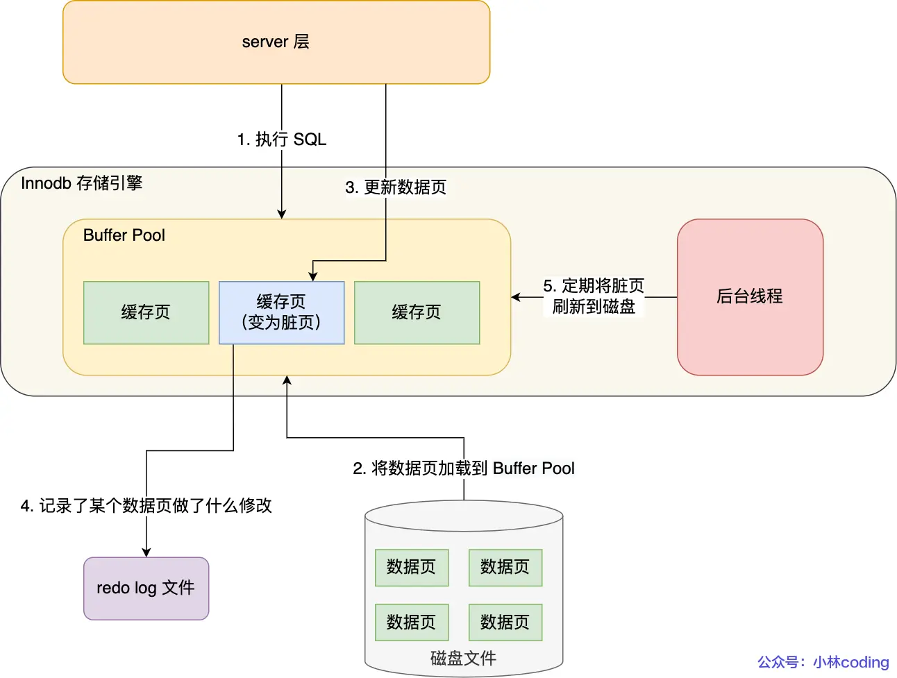
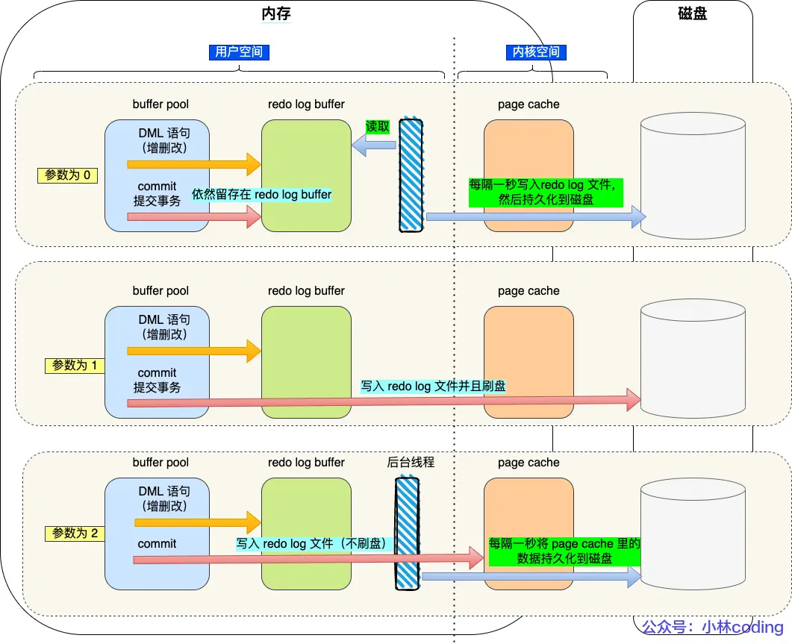
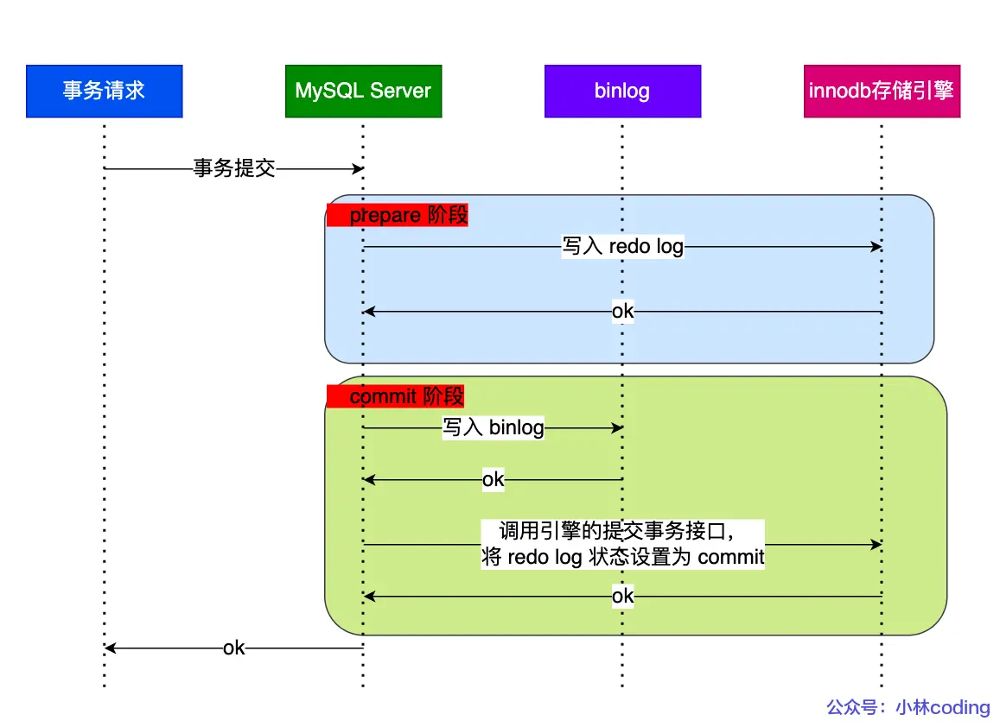
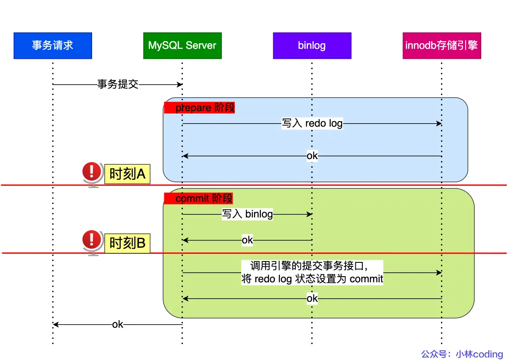

# 目录:  
1.SQL执行过程  
2.事务  
3.锁  
4.日志  
5.索引  

## 1. SQL执行过程  
**目录:**  
1.1 SQL的执行过程  
1.2 select语句的执行顺序  

### 1.1 SQL的执行过程
1.SQL执行流程图  

  

2.Server层和存储引擎层  
只有**真真正正**涉及到数据的存储时才会调用存储引擎层,大部分内容都是在Server层完成的;Server与存储引擎层之间是通过**接口**进行交互的.  
相当于Server层定义了一套接口,不同的存储引擎实现了这套接口;Server层并不管存储引擎具体是怎么实现的.只要按照MySQL的实现规范完全可以写一个自定义的存储引擎;就包括innodb存储引擎最开始也不是MySQL官方的(就是大牛根据规范编写的自定义实现),后来因为该存储引擎太强大被招安了.  
<font color="#00FF00">引擎层是插件式的,目前主要包括InnoDB、MyISAM、Memory</font>  


### 1.2 select语句的执行顺序  
SQL编写顺序:`select distinct field from left_table_name left join right_table_name on left_table_name.field=right_table_name.field where ... and/or ... group by field1,field2... with rollup having ... order by field desc/asc limit ...`

SQL解析顺序:`from ... on.. join.. where .. group by ... having ... select dinstinst order by limit ...`  

**特性:**
当select * from ... 后面指定的是多张表时,左表的输出会作为右表的输出(相对而言的左右表),最终会生成一个VT1虚拟表.计算这两张关联表的笛卡尔积,生成虚拟表VT1-J1.基于虚拟表VT1-J1这一个虚拟表进行过滤,过滤出所有满足ON谓词条件的列,生成并放到新虚拟表VT1-J2(注意是基于VT1-J1,所以这里产生了J2这张新表).如果使用了外连接(LEFT,RIGHT,FULL),主表(也就是外连接的时候,不是有一张表查出的内容作为另一张表的输入,作为另一张表的输入的这张表就是主表)主表中不符合ON条件的列也会被加入到VT1-J2中(也就是主表中不符合条件的数据还是会被添加到VT1-J2这张表里的),作为外部行,生成虚拟表VT1-J3.
对所有VT1的表进行过滤,满足where子句的列被插入到VT2表中(where和外连接中的on的区别在于,on针对过滤的是关联表,主表会返回所有的列,因为就算不符合条件的也会被添加到VT1-J2中).  
group by 这个子句会把VT2表按照group by中的列进行分组,生成VT3表  
having子句对VT3表中的不同的组进行过滤,只作用于分组后的数据,满足HAVING条件的子句被加入到VT4表中  
select对select子句中的元素进行处理,生成VT5表,计算表达式 计算select子句中的表达式,生成VT5-J1,寻找VT5-1中的重复列,并删掉,生成VT5-J2  
如果在查询中指定了DISTINCT子句,则会创建一张内存临时表(如果内存放不下,就需要存放在硬盘了).这张临时表的表结构和上一步产生的虚拟表VT5是一样的,不同的是对进行DISTINCT操作的列增加了一个唯一索引,以此来除重复数据.  
从VT5-J2中的表中,根据ORDER BY 子句的条件对结果进行排序,生成VT6表.  
limit子句从上一步得到的VT6虚拟表中选出从指定位置开始的指定行数据.  


## 2.事务  
**目录:**  
2.1 事务的四大特性  
2.2 脏读、幻读、不可重复读  
2.3 事务的隔离级别  
2.4 MVCC   

### 2.1 事务的四大特性  
**解释:** 事务是MySQL执行的最小单元,一个事务内的操作要么全部成功要么全不成功.  

1.事务的四大特性ACID
* A(Atomicity):原子性 一个事务中的所有操作要么全都完成要么全都不完成. 
* C(Consistency):一致性 不管事务是否成功,数据库的状态是一致性的.  
* I(Isolation):隔离性 多个事务可以互相隔离,一个事务的操作不会影响到另一个事务.  
* D(Durability):持久性 事务处理结束后,落盘存储;对数据的修改是永久的.

2.InnoDB通过什么技术来保障这四个特性的?
* 原子性通过undo log(撤销日志)来保障
* 持久性通过redo log(重做日志)来保障
* 隔离性通过MVCC或锁机制来保障
* 一致性是通过原子性+隔离性+持久性得到保障的  
  原子性+隔离性+持久性=>一致性

### 2.2 脏读、幻读、不可重复读  
* 脏读:一个事务读到了另一个事务还未提交的数据  
* 不可重复读:一个事务(同一条SQL)前后两次读取到的数据不一致  
* 幻读:一个事务(同一条SQL)前后两次读取到的数据量不一致  

脏读:事务A读取到事务B未提交的数据  
不可重复度&幻读:事务A读取到事务B已提交的数据  

### 2.3 事务的隔离级别
1.事务的隔离级别是针对连接(session)而言的(而不是数据库)  

2.数据库的四种隔离级别  
|     隔离级别     | 脏读  | 不可重复读 | 幻读  |
| :--------------: | :---: | :--------: | :---: |
| READ-UNCOMMITTED |   √   |     √      |   √   |
|  READ-COMMITTED  |   x   |     √      |   √   |
| REPEATABLE-READ  |   x   |     x      |   √   |
|   SERIALIZABLE   |   x   |     x      |   x   |

*备注:打钩代表可能出现的情况*

* READ-UNCOMMITTED:一个事务可以读取到另一个事务未提交的数据
* READ-COMMITTED:一个事务只能读取到另一个事务已提交的数据  
* REPEATABLE-READ:一个事务读取的数据内容和它刚开始启动时读取对应数据的内容是一致的(从这个解释看出是不放幻读的)  
* SERIALIZABLE:事务执行时会对记录加上读/写锁,事务之间串行化完成  

3.数据库的默认隔离级别<font color="#00FF00">REPEATABLE-READ</font>

4.MySQL的InnoDB存储引擎的REPEATABLE-READ隔离级别可以很大程度避免幻读,所以SERIALIZABLE的这种隔离级别不常用.  

5.解决幻读的方法  
* **快照读:** 通过MVCC的版本号来保障,当前事务只会读取不大于事务开始时版本号的数据,所以后序插入的数据由于版本号过高就不会被当前事务读取到.它的SQL语句形式是(select ... from);也就是说REPEATABLE-READ隔离级别默认就是通过MVCC来实现的(但MVCC需要搭配undo日志).  
* **当前读:** 这里要结合MySQL**行**锁那一章,通过记录锁+间隙锁的方式解决了幻读;它的SQL语句的形式是:(select ... for update)当执行这段语句的时候,会加上next-key lock ,如果有其它事务在next-key lock范围内插入数据,那么这条插入语句就会被阻塞,从而避免了幻读问题. 
* ~~使用SERIALIZABLE隔离级别(划掉是因为效率不高,用是可以用的)~~

### 2.4 MVCC  
**解释:** MVCC称为多版本并发控制;它是一种概念,具体的实现手段通过Read View + undo log来实现.  
**解释:** Read View本质就是一个数据结构,如果是通过Read View来实现的话,每个事务都会有一个Read View对象.通过Read View对象可以实现**可重复读**、**读已提交**  

Read View的数据结构:  
```c
class ReadView {
private:
  trx_id_t m_low_limit_id;      /* 大于等于这个 ID 的事务均不可见 */

  trx_id_t m_up_limit_id;       /* 小于这个 ID 的事务均可见 */

  trx_id_t m_creator_trx_id;    /* 创建该 Read View 的事务ID */

  trx_id_t m_low_limit_no;      /* 事务 Number, 小于该 Number 的 Undo Logs 均可以被 Purge */

  ids_t m_ids;                  /* 创建 Read View 时的活跃事务列表 */

  m_closed;                     /* 标记 Read View 是否 close */
}
```
**属性解释:**  
|      属性      |                                 解释                                  |
| :------------: | :-------------------------------------------------------------------: |
| creator_trx_id |                       创建该Read View的事务的id                       |
|     m_ids      | 创建该Read View时当前数据库还有哪些事务没有提交的id列表(包含当前事务) |
|   min_trx_id   |   创建该Read View时未提交的事务的最小id(是从m_ids集合中选出的结果)    |
|    max_trx     |                    当前数据库应该给下一个事务的id                     |

**聚簇索引:**  
此外还需要了解聚簇索引的两个隐藏列
* trx_id 用于存储上一个修改该数据的事务的id
* roll_pointer 回滚指针每次对某条聚簇索引记录进行改动时,都会把旧版本的记录写入到undo日志中,然后这个隐藏列是个指针,指向每一个旧版本记录,于是就可以通过它找到修改前的记录.

1.接下来就是当前事务要去更新一条记录了:  
由于每个事务都会携带Read View对象;所以准备开始比较了  

* 如果数据隐藏列的trx_id值小于min_trx_id,则该记录对当前事务是可见的;因为现在的记录是创建当前事务之前的事务所修改的.  
* 如果trx_id值大于max_trx,则该记录对当前事务是不可见的;因为现在的记录是在当前事务后的事务中修改的.  
* 如果trx_id值在m_ids之中,则该记录对当前事务是不可见的;因为现在的记录是由比当前事务创建地更早的事务所修改的.  
* 如果trx_id值不在m_ids之中,则该记录对当前事务是可见的;因为现在的记录是在当前事务创建之前就已经提交了的.

2.区别  
**区别:** Read View可以实现可重复读和读已提交;它们的区别在于创建Read View的时机不同,**读已提交**是事务的每个语句执行之前重新生成一个Read View.**可重复读**是在事务启动时创建一个Read View并且在整个事务都复用这一个Read View.

3.多版本控制  
聚簇索引那边提到的**roll_pointer**,实际上就是一个链表指针;MVCC是真的会对一条记录组织许多版本,每条记录的隐含列roll_pointer都**指向**前一个版本的数据.

4.可重复读是如何工作的  

**参考:**[可重复读是如何工作的?](https://www.xiaolincoding.com/mysql/transaction/mvcc.html#%E5%8F%AF%E9%87%8D%E5%A4%8D%E8%AF%BB%E6%98%AF%E5%A6%82%E4%BD%95%E5%B7%A5%E4%BD%9C%E7%9A%84)  
5.读已提交是如何工作的  
**参考:**[读已提交是如何工作的?](https://www.xiaolincoding.com/mysql/transaction/mvcc.html#%E8%AF%BB%E6%8F%90%E4%BA%A4%E6%98%AF%E5%A6%82%E4%BD%95%E5%B7%A5%E4%BD%9C%E7%9A%84)  

6.REPEATABLE-READ隔离级别真的解决幻读了吗?  
**解释:** 之前说过REPEATABLE-READ隔离级别只是很大程度上避免了 幻读,并没有完全解决.  
之前已经解释过快照读是如何避免幻读的,现在介绍<font color="#00FF00">当前读</font>是如何避免幻读的.  

[MySQL可重复读隔离级别,完全解决幻读了吗?](https://xiaolincoding.com/mysql/transaction/phantom.html#%E7%AC%AC%E4%B8%80%E4%B8%AA%E5%8F%91%E7%94%9F%E5%B9%BB%E8%AF%BB%E7%8E%B0%E8%B1%A1%E7%9A%84%E5%9C%BA%E6%99%AF)

**小结:** 要避免特殊场景下发生幻读,就是尽量在开启事务之后马上执行`select ... for update`语句,利用next-key lock的间隙锁锁住这部分记录.  


## 3.锁
**目录:**  
3.1 锁的分类(包括读锁、写锁)  
3.2 表级锁  
3.3 行级锁  
3.4 行级锁加锁时机  
3.5 MySQL死锁  
3.6 锁面试题  


### 3.1 锁的分类  
**简介:** 想要学好MySQL的锁,必须先了解锁的分类.从锁的粒度上来说一共分为三种锁:全局锁、表锁、行锁  
*提示:当然了只有innodb存储引擎支持行锁;也只有innodb引擎支持事务.*  

**全局锁:**  内容比较少也放到这里面来讲  
`flush tables with read lock` 开启全局锁  
`unlock tables` 释放全局锁;如果会话断开也会释放全局锁  
当使用全局锁之后,数据库就处于只读的状态了,此时如果对表中数据进行修改,如insert、update、delete或者对表结构进行修改,如alter table、drop table就会被**阻塞**.

**应用场景:** <font color="#FFC800">备份数据库</font>;但不推荐这种方式,可以使用REPEATABLE-READ的事务隔离级别来保障数据备份时的一致性.  

**表锁:** 表锁、元数据锁、意向锁、AUTO-INC锁  
*注意:* InnoDB和MyISAM引擎都支持表锁

**行锁:** 记录锁、间隙锁、Next-Key Lock  
*注意:* 行锁只有InnoDB引擎支持

**<font color="#FF00FF">读锁和写锁:</font>**  
不论是表锁还是行锁,根据它锁的特性又分为读锁和写锁  
读锁(S): 读锁也称之为共享锁  
写锁(X): 写锁也称之为排他锁  

|       |  S锁   |  X锁  |
| :---: | :----: | :---: |
|  S锁  | 不冲突 | 冲突  |
|  X锁  |  冲突  | 冲突  |

由于MVCC的存在,普通的查询是不会加锁的(快照读);只有**当前读**才会加锁.<font color="#00FF00">注意更新和删除是会加行锁的-写锁</font>  

### 3.2 表级锁
**分类:** 表锁、元数据锁、意向锁、AUTO-INC锁  

1.表锁  
**用法:**  
```sql
//表级别的共享锁,也就是读锁；
lock tables t_student read;

//表级别的独占锁,也就是写锁；
lock tables t_stuent write;
```

**特性:** 表锁不仅是对别的连接生效,对当前连接同样生效;如果当前连接加了表锁-读锁,接下来当前连接如果要对该表进行修改操作则当前连接阻塞.(如果连接/会话断开也会释放锁)    

2.元数据锁(MDL锁)  
**介绍:** 这也是数据库层面的,主要用户DML和DDL语句之间的互斥访问.MDL锁主要是保证当前用户对表执行CURD操作时,别的连接**修改表结构**.  

元数据锁同样也是表锁;但元数据锁的读锁和写锁概念就不太一样了  
* MDL读锁:对一张表进行CRUD操作时,加的是MDL读锁
* MDL写锁:对一张表结构进行变更时,加的是MDL写锁

|        | MDLS锁 | MDLX锁 |
| :----: | :----: | :----: |
| MDLS锁 | 不冲突 |  冲突  |
| MDLX锁 |  冲突  |  冲突  |


3.意向锁  
**作用:** 总结一句话就是,意向锁用于快速判断当前表中有没有行锁  
*提示:因为MyISAM引擎没有行锁,所以意向锁也是针对innodb引擎而言的*  

如果没有意向锁,那么在给表添加**表锁-写锁**的时候就需要判断表里面有没有记录已经加了**行锁-写锁**.因为表锁-写锁可以理解为给整张表的所有记录加了写锁,如果此时已经有某行记录加了读锁/或写锁再加表锁的话就冲突了.

所以每次加行锁之前都会先获取到表的意向锁(**意向锁是表级锁**),并且意向锁之间互不冲突.

**注意:** 意向锁是数据库自已维护的,用户无法手动操作意向锁;在为数据加行锁-读/写锁之前,innodb会先获取对应表的意向锁.

* 意向读锁(IS):事务对某行加读锁之前必须先获得意向读锁.  
* 意向写锁(IX):事务对某行加写锁之前必须先获得意向写锁.

|       |  IS锁  |  IX锁  |
| :---: | :----: | :----: |
| IS锁  | 不冲突 | 不冲突 |
| IX锁  | 不冲突 | 不冲突 |

**意向锁与表锁的互斥情况:**  
|       |  IS锁  | IX锁  |
| :---: | :----: | :---: |
|  S锁  | 不冲突 | 冲突  |
|  X锁  |  冲突  | 冲突  |

**结论:**
* 加表锁-读锁=>必须等表中所有的<font color="#FF00FF">意向写锁</font>释放=>必须等表中所有<font color="#FF00FF">行锁-写锁</font>释放.  
* 加表锁-写锁=>必须等表中所有<font color="#00FF00">意向读/写锁</font>释放=>必须等表中所有<font color="#00FF00">行锁-读/写锁</font>释放.  
* 加行锁-读锁=>必须获取<font color="#FF00FF">意向锁读锁</font>=>必须等<font color="#FF00FF">表锁-写锁</font>释放.  
* 加行锁-写锁=>必须获取<font color="#00FF00">意向锁写锁</font>=>必须等表中所有<font color="#00FF00">表锁-读/写锁</font>释放.  

4.AUTO-INC锁
**介绍:** 就是自增锁  

### 3.3 行级锁  
**分类:** 记录锁、间隙锁、Next-Key Lock、插入意向锁  
*提示:只有innodb引擎支持行级锁*  
**注意:** 再次提示;由于MVCC的存在,普通的查询是不会加锁的(快照读);只有**当前读**才会加锁.<font color="#00FF00">注意更新和删除是会加行锁-写锁的</font>  
**释放锁的时机:** 事务提交就会释放锁;当然断开连接也会  

1.记录锁(Record Lock)  
**作用:** 只锁住一条记录  

2.间隙锁(Gap Lock)  
**作用:** 锁住一个范围的记录  
**注意:** 该锁只存在于可重复读的隔离级别中,目的是为了解决可重复读隔离级别下的幻读现象.  
**冲突性:** 间隙锁虽然存在读锁写锁,但是并没有什么区别,间隙锁之间是兼容的,即两个事务可以同时持有包含共同间隙范围的间隙锁,并不存在互斥关系,因为间隙锁的目的是防止插入幻影记录而提出的.  

3.临间锁(Next-Key Lock)  
**介绍:** Next-Key Lock = Record Lock + Gap Lock  
**冲突性:** 临间锁之间是冲突的,虽然间隙锁不冲突;但是记录锁之间是冲突的.  

4.插入意向锁(Insert Intention Lock)  
**介绍:** 插入意向锁是行级锁,不是<font color="#00FF00">意向锁</font>;它是一种特殊的间隙锁;不同于间隙锁,该锁只用于并发操作  
**特点:** 如果说意向锁锁住的是一个区间,那么插入意向锁锁住的就是一个点.  
**冲突性:** 如果两个不同的事务,事务A拥有某个区间的意向锁;事务B想获取该区间的插入意向锁时会发生冲突(哪怕事务B拥有该区间的意向锁也会冲突);<font color="#00FF00">即插入意向锁与间隙锁之间是冲突的</font>.  
**提示:** 并且在MySQL中,是先生成锁结构再设置锁状态;如果一个事务获取某把锁的状态是`WAITING`那么代表这个事务并没有获取这把锁,而是处于阻塞状态;只有锁状态正常时才代表获取到了这把锁.  
  


### 3.4 行级锁加锁时机  
**目录:**  
3.4.1 什么SQL语句会导致加锁  
3.4.2 加什么类型的行锁  
3.4.3 唯一索引等值查询  
3.4.4 唯一索引范围查询  
3.4.5 非唯一索引等值查询  
3.4.6 非唯一索引范围查询  
3.4.7 没有加索引的查询  

#### 3.4.1 什么时候会加行锁  
1.首先对于普通查询innodb是不会加锁的;快照读是由MVCC来保障的.  
2.只有**当前读**即通过Next-Key Lock锁来实现时才会加行锁.  
```sql
-- 通过下面两种方式来显示地加锁
-- 共享锁
SELECT ... FOR SHARE;
-- 排他锁
SELECT ... FOR UPDATE;
```
3.update和delete操作会加行锁-写锁  

4.释放锁的时机:事务提交就会释放锁;当然断开连接也会

#### 3.4.2 加什么类型的行锁 
**行锁分类:** 记录锁、间隙锁、Next-Ket Lock  
**<font color="#FF00FF">在不同的隔离级别下,行锁的类型是不同的</font>**  
* 在读已提交的隔离级别下,加的行锁类型只会是记录锁
* 在可重复读隔离级别下,如果能加锁(就是不走MVCC,通过手动加锁的方式加锁)则加的是Next-Key Lock锁.
* Gap Lock间隙锁,该锁只存在于可重复读的隔离级别下.  

<font color="#00FF00">由于当前读是加锁的,所以当前读 读到的都是最新数据.</font>这是和MVCC最大的不同,因为别的事务没法对记录进行修改.   

1.锁加在什么上面  
<font color="#FF00FF">锁只加在聚簇索引上,如果加锁时用到了二级索引则会先在二级索引上加锁;然后在聚簇索引上加锁</font>

2.写在前面的总结性内容  
<font color="#00FF00">在可重复读的隔离环境下,锁是加在索引上的;加锁的基本单位是Next-Key Lock;但是在只加记录锁或间隙锁就能解决幻读的情况下,Next-Key Lock会退化为记录锁或间隙锁</font>  
*Tips:如果看不懂这句话,可以先看把这一节的所有知识点看完;因为这些是概括性的内容*  

3.查看加锁情况  
`select * from performance_schema.data_locks\G;`  
  
* LOCK_TYPE:锁类型
  * TABLE:表级锁
  * RECORD:行级锁(RECORD不是指记录锁)  
* LOCK_MODE:
  * IX:表级锁-意向锁-写锁
  * IS:表级锁-意向锁-读锁
  - - - 
  * X,REC_NOT_GAP:行级锁-记录锁-写锁
  * X,GAP:行级锁-间隙锁-写锁
  * X:行级锁-临间锁(Next-key Lock)-写锁

#### 3.4.3 唯一索引等值查询  
**测试环境:**  
接下来 3.4.3-3.4.6的测试都用到了这么一张表,它有一个主键id和一个普通索引age.还有一个无关紧要的name字段  

|  id   |  name  |  age  |
| :---: | :----: | :---: |
|   1   | 蔡徐坤 |  19   |
|   5   | 马嘉祺 |  21   |
|  10   | 林彦俊 |  22   |
|  15   | 黄明昊 |  20   |
|  20   | 张真源 |  39   |

**告知:**  
* 接下来的几种情况中都需要讨论,目标查询的记录是否在表中这种情况;所以就分为两种情况:目标记录在表中和不在表中  
* 唯一索引这里就是指用的索引是不是主键(而不是用的索引是不是唯一索引=>主键一定是唯一索引,但唯一索引不一定是主键)  
* 等值查询就是where后面是等于`=`;范围查询就是where后面用的是`>、<、>=、<=`  

1.唯一索引等值查询,目标记录在表中  
`select * from table where id = 1 for update` 能够查询到记录  
此时会给id=1的记录加上行锁-写锁-记录锁  

2.唯一索引等值查询,目标记录不在表中  
`select * from table where id = 2 for update` 不能查询到记录  
此时会给id = 1 到 5的记录加上行锁-间隙锁-写锁,即锁住(1,5)范围内的数据.  
为什么是(1,5)?  
首先由于记录2不在目标表中,所以会先从2往id更大的方向找记录;找到第一条记录为id=5;此时代表右边界就是5;接着从2向做找;找到第一条记录为1;此时代表左边界就是1.  

#### 3.4.4 唯一索引范围查询
**分类:** >、>=、<、<=  

**特性:** 唯一索引范围查询会对每一个扫描到的索引加Next-Key Lock锁;对索引加Next-Key Lock锁的意思就是用记录锁锁住当前记录(查询到的记录),用间隙锁锁住范围.  
<font color="#00FF00">间隙锁区间是左开右开(min,max);Next-Key Lock的区间是左开右闭(min,max]</font>

1.唯一索引范围查询-大于(>)  
`select * from table where id > 15 for update`  
* 此时会从15开始往右查询(往右查询就是指往id更大的方向查询),查到第一个记录为20;此时会在索引20加上Next-Key Lock-写锁锁住(15,20]范围的记录.  
* 接着再从索引20往右查询,一直到+∞;此时Next-key Lock写锁锁住(20,+∞]的记录.

**注意:** 大于查询对记录15本身是无关紧要的;因为不管你记录15是否存在;id>15都管辖不到记录15本身;所以记录15要杀要剐随便.  

2.唯一索引范围查询-大于等于(>=)-目标记录在表中  
`select * from table where id >= 15 for update`  
* 依旧先从记录15开始查询;发现记录15存在于表中,所以此时会将记录15加上行锁-记录锁-写锁  
* 接着从15开始往右查询,查到的第一个记录为20;此时会在索引20加上Next-Key Lock-写锁锁住(15,20]范围的记录.  
* 接着再从索引20往右查询,一直到+∞;此时Next-key Lock写锁锁住(20,+∞]的记录.

**注意:** <font color="#00FF00">如果目标记录不在表中</font>,则加锁的情况和大于查询的情况一模一样.而且正是因为Next-Key Lock是<font color="#00FF00">左开右闭</font>的;而现在15又在id>=15的管辖范围内,为了解决Next-Key Lock不能锁住左边的,那就再加一个记录锁嘛!  

3.唯一索引范围查询-小于(<)-目标记录不在表中  
`select * from table where id < 6 for update`  
**查询结果:** 查询到记录1和记录5,并且记录6不在表中  
**技巧:** 不管是大于还是小于,都是从左边开始扫描的;如果是大于查询就从where后面的id扫描到+∞;如果是小于查询就从-∞扫描到where后面的id.  
* 从-∞开始往右扫描,扫描到的第一条记录为1;并且1小于6;此时给(-∞,1]加上Next-Key Lock
* 从1开始往右扫描,扫描的第一条记录为5;并且5小于6;此时给(-∞,5]加上Next-Key Lock
* 从5开始往右扫描,扫描的第一条记录为10;但是10<font color="#FF00FF">不小于</font>6;此时给(5,10)加上间隙锁并停止扫描.  

4.唯一索引范围查询-小于等于(<=)-目标记录不在表中  
`select * from table where id < 6 for update`  
**注意:** 此时你会发现,貌似第3点加锁的策略完全适用于当前场景的加锁策略.  
**结论:** <font color="#00FF00">唯一索引范围查询,只要目标记录不在表中;不管是小于还是小于等于查询,除了最后一个Next-Key Lock会退化为间隙锁之外,别的锁依旧都是Next-Key Lock</font>

5.唯一索引范围查询-小于(<)-目标记录在表中  
`select * from table where id < 5 for update`  
**查询结果:** 查询到记录1;并且记录5在表中  
* 从-∞开始往右扫描,扫描到的第一条记录为1;并且1小于6;此时给(-∞,1]加上Next-Key Lock 
* 从1开始往右扫描,扫描的第一条记录为5;但是5<font color="#FF00FF">不小于</font>6;此时给(1,5)加上间隙锁  

**发现:** <font color="#00FF00">唯一索引范围查询-小于(<)-目标记录不在表中、唯一索引范围查询-小于(<)-目标记录在表中、唯一索引范围查询-小于等于(<=)-目标记录不在表中.好像都一样!都是最后一个Next-Key Lock退化为间隙锁.  </font>

6.唯一索引范围查询-小于等于(<=)-目标记录在表中  
`select * from table where id <= 5 for update`  
**查询结果:** 查询到记录1和记录5  
* 从-∞开始往右扫描,扫描到的第一条记录为1;此时给(-∞,1]加上Next-Key Lock  
* 从1开始往右扫描,扫描到的第一条记录为5;此时给(1,5]加上Next-Key Lock  
* 扫描结束(在这种情况下并不会继续向右扫描)  

#### 3.4.5 非唯一索引等值查询
**注意:** 当使用非唯一索引(二级索引)查询的时候,会先对二级索引加锁,如果满足查询条件才会对唯一索引加锁.  

1.非唯一索引等值查询-目标记录不在表中  
`select * from table where age = 25 for update`  
利用二级索引进行查询时会先将二级索引的字段进行排序,所以依照上面的表格,现在字段的顺序为:  
|  id   |  name  |  age  |
| :---: | :----: | :---: |
|   1   | 蔡徐坤 |  19   |
|  15   | 黄明昊 |  20   |
|   5   | 马嘉祺 |  21   |
|  10   | 林彦俊 |  22   |
|  20   | 张真源 |  39   |
* 同样和唯一索引等值查询-目标记录不在表中一样;此时会给age索引在(22,39)加上间隙锁  

**分析:** 此时如果其它的事务插入age值在[23-38]范围内的数据会发生阻塞.  
> 在什么情况下其它事务可以在age为22或39时插入数据;什么情况下又会阻塞?  

**关键:** 二级索引是按照索引值(age)进行顺序存放的,在相同的二级索引下值情况下,会再按照主键id顺序存放.  
* 当插入age=22,并且id>10时;会发生阻塞  
* 当插入age=22,并且id<10时;会插入成功
* 当插入age=39,并且id<20时;会发生阻塞
* 当插入age=39,并且id>20时;会插入成功  

**结论:** 实际上只要插入的记录在间隙锁<font color="#FF00FF">(22,39)</font>中间,那么就会发生阻塞;否则可以正常插入.  

2.非唯一索引等值查询-目标记录在表中  
`select * from table where age = 22 for update`  
*这里同样给出现在表的顺序*  
|  id   |  name  |  age  |
| :---: | :----: | :---: |
|   1   | 蔡徐坤 |  19   |
|  15   | 黄明昊 |  20   |
|   5   | 马嘉祺 |  21   |
|  10   | 林彦俊 |  22   |
|  20   | 张真源 |  39   |

* 此时可以查询到记录age=22,所以在age索引的记录22上添加Next-Key Lock锁(21,22];由于目标记录满足查询条件,所以会对age=22的这条记录的聚簇索引加行锁-记录锁-写锁  
* 继续从记录age=22的索引向右找,找到不满足条件的记录age=39;此时会对age=39的索引加间隙锁(22,39)    

**同理:** 加上这两把锁对age=21、age=22、age=39这三种记录能否插入的分析  
* 当插入age=21,并且id<5时;会插入成功
* 当插入age=21,并且id>5时;会发生阻塞
* 当插入age=22,并且id<10时;会发生阻塞
* 当插入age=22,并且id>10时;会发生阻塞;这是由于这里有(22,39)这把间隙锁导致插入阻塞,如果没有间隙锁则会插入成功.
* 当插入age=39,并且id<20时;会发生阻塞
* 当插入age=39,并且id>20时;会插入成功

*扩展:添加(22,39)这把间隙锁的目的就是防止幻读*

#### 3.4.6 非唯一索引范围查询  
**注意:** 非唯一索引范围查询最大的特点就是,二级索引加锁只会加Next-Key Lock  
`select * from table where age >=22 for update` 记录22是存在于表中的  
* 依旧先从记录22开始查询;发现记录22存在于表中,所以此时会将记录22加上行锁-Next-Key Lock-写锁;范围是(21,22];同时对该记录对应的聚簇索引的主键10加上记录锁  
* 接着从22开始往右查询,查到的第一个记录为39;此时会在索引39加上Next-Key Lock-写锁锁住(22,39]范围的记录;同时对该记录对应的聚簇索引的主键20加上记录锁  
* 接着再从索引39往右查询,一直到+∞;此时Next-key Lock写锁锁住(39,+∞]的记录.

#### 3.4.7 没有加索引的查询  
1.再次提醒必须是当前读、可重复读的隔离级别  

如果当前读的查询条件没有使用索引列进行查询,或者查询语句没有走索引,那么将会导致全表扫描,此时相当于对每一条记录都加上Next-Key Lock锁,此时相当于锁住全表了.  
不仅是当前读,如果是delete、update语句没有使用索引;同样也会导致对每一条记录加Next-Key Lock.  
<font color="#00FF00">在线上在执行update、delete、select ... for update等具有加锁性质的语句,一定要检查语句是否走了索引,如果是全表扫描的话,会对每一个索引加next-key锁,相当于把整个表锁住了,这是挺严重的问题</font>

2.避免update或delete没用索引导致全表索引加锁  
*提示:update或delete不使用索引导致全表扫描并不是会发生表锁,而是将索引的每个记录加Next-Key Lock;只不过效果等同于加表锁*  

可以将MySQL中的sql_safe_updates参数设置为1,开启安全更新模式;从而来避免update、delete给全索引加锁.  
`SET sql_safe_updates = [0|1];` 开启安全更新模式  

当sql_safe_updates设置为1时  
update语句必须满足如下条件之一才能执行成功:  
* 使用where,并且where条件中必须有索引列  
* 使用limit  
* 同时使用where和limit,此时where条件中可以没有索引列  

delete语句必须满足以下条件能执行成功:
* 同时使用where和limit,此时where条件中可以没有索引列

### 3.5 MySQL死锁  
1.死锁的发生  

2.为什么会产生死锁  

3.Insert语句是怎么加行级锁的  

4.如何避免死锁  
**死锁产生的四个必要条件:**  
互斥、不可抢占、请求和保持等待、循环等待  
避免死锁就是打破上述四个条件中的一个即可,在数据库层面打破**循环等待**有两种策略  
* 设置事务等待锁的超时时间:当一个事务等待时间超过`innodb_lock_wait_timeout`后事务就会自动回滚;默认值为50秒  
* 开启死锁检测:主动死锁检测发生在产生死锁后,主动回滚事务链条中的一个事务,得以让其它的事务继续执行(当然具体回滚哪个事务是有相关算法的);通过设置`innodb_deadlock_detect`参数为on开启自动死锁检测.  

### 3.6 锁面试题  
**目录:**  
3.6.1 死锁  


#### 3.6.1 死锁  
**问题:** 请问执行下述语句会发生什么  
  
**答:** 发生死锁  

*实验环境:MySQL8;事务隔离级别:可重复读*  

1.Time1阶段加锁分析  
Time1阶段加了两把锁;第一把:表级锁-意向锁-写锁;第二把:行级锁-间隙锁-写锁-(20,30)  

2.Time2阶段加锁分析  
Time2阶段加了两把锁;第一把:表级锁-意向锁-写锁;第二把:行级锁-间隙锁-写锁-(20,30)  
*注意:意向锁之间不冲突、间隙锁之间不冲突*  

3.Time3阶段加锁分析  
Time3阶段时事务A处于阻塞状态;因为事务A无法获取插入间隙锁,因为事务B持有(20,30)这把间隙锁.  

4.Time4阶段加锁分析  
Time3阶段时事务B处于阻塞状态;因为事务B无法获取插入间隙锁,因为事务A持有(20,30)这把间隙锁.  
*注意:此时发生死锁现象*  

## 4.日志  
**目录:**  
4.1 三种日志  
4.2 undo log  
4.3 buffer pool  
4.4 redo log  
4.5 bin log  
4.6 日志全流程分析  
4.7 二阶段提交    


### 4.1 三种日志  
**初步介绍:**  
* undo log(回滚日志):是Innodb存储引擎层生成的日志,实现了事务中的原子性,主要用于事务回滚和MVCC.  
* redo log(重做日志):是Innodb存储引擎层生成的日志,实现了事务中的持久性,主要用于掉电等故障恢复.  
* binlog(归档日志):是Server层生成的日志,主要用于数据备份和主从复制.

**区别:**  
* redo log记录了此次事务[完成后]的数据状态,记录的是更新之后的值.  
* undo log记录了此次事务[开始前]的数据状态,记录的是更新之前的值  
* bin log用户备份恢复、主从复制

### 4.2 undo log

**1.undo日志是如何保证原子性的?**  
undo日志在事务执行过程中,都记录下回滚时需要的信息到一个日志里,那么事务执行中途发生了MySQL崩溃后就利用该日志进行回滚.


每当InnoDB引擎对一条记录进行操作(修改、删除、新增)时,要把回滚时需要的信息都记录到undo log里,比如:  
* 在插入一条记录时,要把这条记录的主键值记下来,这样之后回滚时只需要把这个主键值对应的记录删掉就好了.
* 在删除一条记录时,要把这条记录中的内容都记下来,这样之后回滚时再把由这些内容组成的记录插入到表中就好了.
* 在更新一条记录时,要把被更新的列的旧值记下来,这样之后回滚时再把这些列更新为旧值就好了.

<font color="#00FF00">回滚日志就是记录下事务的每一个步骤,回滚的时候执行逆操作即可</font>  

2.undo日志中的版本链与MVCC  

一条记录的每一次更新操作产生的undo log格式都有一roll_pointer 指针和一个trx_id事务id(这两个字段是隐含的,详情见2.事务=>2.4MVCC=>聚簇索引)  

* 通过trx_id可以知道该记录是被哪个事务修改的
* 通过roll_pointer指针可以将这些undo log串成一个链表,这个链表就被称为版本链.  
  

读已提交和可重复读隔离级别实现是通过[事务的Read View里的字段]和[记录中的两个隐藏列(trx_id和roll_pointer)]的比对,如果不满足可见行,就会顺着**undo log**版本链里找到满足其可见性的记录,从而控制并发事务访问同一个记录时的行为,这就叫MVCC(多版本并发控制);也就是说MVCC在寻找当前事务可见的记录时是通过undo日志来完成的.所以MVCC是搭配undo日志共同完成的.

3.undo log的两大作用  
* 实现事务回滚,保障事务的原子性.事务处理过程中,如果出现了错误或者用户执行了ROLLBACK语句,MySQL可以利用undo log中的历史数据将数据恢复到事务开始之前的状态.
* 实现MVCC(多版本并发控制)关键因素之一:MVCC是通过ReadView + undo log实现的.undo log为每条记录保存多份历史数据,MySQL在执行快照读(普通select语句)的时候,会根据事务的Read View里的信息,顺着undo log的版本链找到满足其可见性的记录.  

4.undo log的刷盘机制  
查看buffer pool中的第4点,并且undo log的刷新还和redo log有很强的关联.  

### 4.3 buffer pool
1.MySQL是如何保存修改的数据的?  
当我们执行update语句时,MySQL从磁盘中读取数据放到内存;在内存中修改完毕之后不会直接将记录更新到磁盘(因为这会造成大量的IO);而是会将数据放入内存中的buffer pool(缓冲池)区域.  

  

2.buffer pool的读取机制  
* 读取数据时先从buffer pool中读取,如果读取不到再去磁盘中读取.  
* 当修改数据时,如果数据存在于Buffer Pool中,那直接修改Buffer Pool中数据所在的页,然后将其页设置为脏页(该页的内存数据和磁盘上的数据已经不一致),为了减少磁盘I/O,不会立即将脏页写入磁盘,后续由后台线程选择一个合适的时机将脏页写入到磁盘.

3.buffer pool缓存的内容  
MySQL启动时,innodb会为buffer pool申请一片连续的内存空间,然后按照默认16KB的大小划分出一个个页,buffer pool中的页就叫做缓存页.  

  

4.undo页是什么?  
之前说过undo log就是记录一个事务内的所有操作(为了通过逆操作来还原数据),那么undo log同样也会先写入buffer pool中undo页;等待统一刷新到磁盘.  

### 4.4 redo log
1.buffer pool的问题  
由于buffer pool中的数据是存在于内存中的,一旦服务器断电则内存中的数据都没了;这就会导致buffer pool中的脏页数据丢失.  

2.解决思路  
undo记录的是事务执行的过程,而当事务commit时会先更新buffer pool中的页并标记为脏页,然后将本次的事务记录到redo log中  
后续innodb会在合适的时机将buffer pool中的脏页刷新到磁盘中,这就是WAL技术.  
WAL:MySQL写操作不是立即写到磁盘上,而是先写日志,然后在合适的时机再写到磁盘上.  
  

3.什么是redo log?  
redo log是物理日志,记录了某个数据页做了什么修改,每当执行一个事务就会产生这样的一条或者多条物理日志.  
<font color="#00FF00">redo log保证了事务四大特性中的持久性</font>

4.redo log持久化的机制  
在事务提交时,只要先将redo log持久化到磁盘即可,可以不需要等到缓存在Buffer Pool里的脏页数据持久化到磁盘.  
当系统崩溃时,虽然脏页数据没有持久化,但是redo log已经持久化,接着MySQL重启后.可以根据redo log的内容,将所有数据恢复到最新的状态

5.redo log和数据持久化不是一样的吗?  
貌似redo log持久化就是为了保证数据一致,那不就不需要数据持久化了吗?  
数据写入到buffer pool,然后buffer pool再更新磁盘数据;为的是减少磁盘的IO次数,并且buffer pool中的数据才是磁盘真正需要写入的数据.  
redo log的本质还是做故障恢复用的,并且写入redo log使用了追加操作,所以磁盘是顺序写;而buffer pool中数据的写入需要先找到数据的写入位置,然后才能写到磁盘,所以磁盘操作时随机写.  
磁盘的**顺序写**比**随机写**要高效很多,因此redo log的开销更小.  

6.redo log和undo log的关系  
undo log记录的是事务执行过程中的每一步操作,这些每一步操作会生成undo log日志文件的内容,undo log会写入buffer pool的undo页面.  
但是commit之后相当于这些undo日志就没用的,此时redo log派上作用,<font color="#00FF00">所以在内存修改undo页面后,需要记录对应的redo日志.</font>  
<font color="#FFC800">事务提交之前发生了崩溃,重启后会通过 undo log 回滚事务,事务提交之后发生了崩溃,重启后会通过 redo log 恢复事务</font>  
  

7.redo log的刷盘机制  
之前说过redo log的写操作时顺序写,所以它的性能较高;但是redo log是一产生数据就写入磁盘中吗?  
实际上redo log有它专门的缓冲区redo log buffer,每当产生一条redo log日志的时候会写入到redo log buffer,后续在持久化到磁盘如下图:  
  
`redo log buffer`默认大小16MB,可以通过`innodb_log_Buffer_size`参数动态调整缓冲区大小,从而使得 MySQL处理大事务时不必立即写入磁盘.  

**8.缓存在redo log buffer中的数据还是存在于内存中,那么它什么时候刷盘呢?**  
* MySQL关闭时
* 当redo log buffer中记录的写入量大于redo log buffer设置的内存空间的一半时,会触发落盘.  
* InnoDB的后台线程每隔1秒,将redo log buffer持久化到磁盘.  
* 每次提交事务时根据`innodb_flush_log_at_trx_commit`参数的值会有不同的刷盘策略.  

`innodb_flush_log_at_trx_commit`有三种不同的值:  
* 参数1:该值是默认值即默认策略,每次事务提交时都将缓存在redo log buffer中的redo log直接刷盘,这样就可以最大程度地保障MySQL的数据不会丢失.  
* 参数0:表示每次事务提交时,还是将redo log留在redo log buffer中,该模式下在事务提交时不会主动触发写入磁盘的操作(所以这种策略下就是通过前三个条件进行日志的刷盘)  
* 参数2:每次提交事务时都将缓存在redo log buffer中的redo log写到操作系统中的page cazhe中,也就是写到了操作系统的文件系统的缓存中.

`innodb_flush_log_at_trx_commit`值为0或2时的<font color="#00FF00">后台线程每隔一秒执行刷盘的操作:</font>  
* 参数0:会把缓存在redo log buffer中的redo log,通过调用write()系统调用写到操作系统的Page Cache,然后调用fsync()系统调用持久化到磁盘.所以参数为0的策略,MySQL进程的崩溃会导致上一秒钟所有事务数据的丢失.  
* 参数2:调用fsync()系统调用,将缓存在操作系统Page Cache里的redo log持久化到磁盘.所以参数为2的策略,较取值为0情况下更安全,因为MySQL进程的崩溃并不会丢失数据,只有在操作系统崩溃或者系统断电的情况下,上一秒钟所有事务数据才可能丢失.  
**后台进程参与的情况下,redo log的刷盘策略:**  
  

9.`innodb_flush_log_at_trx_commit`三种参数不同场景下的性能  
* 数据安全性:参数1 > 参数2 > 参数0
* 写入性能:参数0 > 参数2 > 参数1

10.`innodb_flush_log_at_trx_commit`三种参数的使用场景  
* 参数1:用在一些对数据安全性要求比较高的场景
* 参数0:在一些可以容忍数据库崩溃时丢失1s数据的场景中,我们可以将该值设置为0,这样可以明显地减少日志同步到磁盘的I/O操作.  
* 安全性和性能折中的方案就是参数2,虽然参数2没有参数0的性能高,但是数据安全性方面比参数0强,因为参数2只要操作系统不宕机,即使数据库崩溃了,也不会丢失数据,同时性能方便比参数1高.

11.redo log文件的组织方式  
默认情况下,innodb有一个重做日志文件组(redo log group),该文件组由两个重做日志文件(redo log)组成;分别叫ib_logfile0和ib_logfile1.  
  
这两个文件的大小是一致的  

**工作方式:**  
重做日志文件组是以循环的方式工作的,从头开始写写到末尾时就回到头重新写.   
先写ib_logfile0文件,写满了会切换到ib_logfile1写.如果ib_logfile1也写满了会切换回ib_logfile0文件继续写.  
  

**两个指针:**  
实际上redo log文件是防止buffer pool中的数据丢失而设计的,所以当buffer pool中的数据写入到磁盘是,对应的redo log就失去了价值,这时候我们便可以擦除这部分数据,从而腾出新的空间写入新的redo log.  
redo log是循环写的方式,相当于一个环形,InnoDB用<font color="#00FF00">write pos</font>表示redo log当前记录写到的位置,用<font color="#00FF00">checkpoint</font>表示当前要擦除的位置.
  

**解释:**  
* write pos和checkpoint的移动都是顺时针方向  
* write pos ~ checkpoint之间的部分(图中的红色部分),用来记录新的更新操作
* check point ~ write pos之间的部分(图中蓝色部分):待落盘的脏数据页记录

如果<font color="#00FF00">write pos</font>追上了<font color="#FF00FF">checkpoint</font>,就意味着redo log文件满了,这时 MySQL不能再执行新的更新操作,也就是说MySQL会被阻塞(因此所以针对并发量大的系统,适当设置redo log的文件大小非常重要),此时会停下来将Buffer Pool中的脏页刷新到磁盘中,然后标记redo log中哪些记录可以被擦除,接着对旧的redo log记录进行擦除,等擦除完旧记录腾出了空间,<font color="#FF00FF">checkpoint</font> 就会往后移动(图中顺时针),然后MySQL恢复正常运行,继续执行新的更新操作

### 4.5 bin log 
**介绍:**  
MySQL在完成一条更新操作后,Server层还会生成一条bin log,等之后事务提交的时候,会将该事物执行过程中产生的所有binlog统一写入binlog文件  
binlog文件是记录了所有数据库表结构变更和表数据修改的日志,不会记录查询类的操作,比如SELECT和SHOW操作  

**bin log和redo log的区别:**  
bin log和redo log都是记录事务对数据库造成的修改(这两个日志记录的东西实际上是差不多的),它们有四点区别:  
* 适用对象不同:
  * binlog是MySQL的Server层实现的日志,所有存储引擎都可以使用
  * redo log是Innodb存储引擎实现的日志
* 文件格式不同:
  * binlog有三种格式:
    * STATEMENT:每一条修改数据的SQL都会被记录到binlog中(相当于记录了逻辑操作,所以针对这种格式,binlog可以称为逻辑日志),主从复制中slave端再根据SQL语句重现.但STATEMENT有动态函数的问题,比如你用了uuid或者now这些函数,你在主库上执行的结果并不是你在从库执行的结果这种随时在变的函数会导致复制的数据不一致;
    * ROW:记录行数据最终被修改成什么样了(这种格式的日志,就不能称为逻辑日志了),不会出现STATEMENT下动态函数的问题.但ROW的缺点是每行数据的变化结果都会被记录,比如执行批量update语句,更新多少行数据就会产生多少条记录,使binlog文件过大,而在STATEMENT格式下只会记录一个update语句而已;
    * MIXED:包含了STATEMENT和ROW模式,它会根据不同的情况自动使用ROW模式和STATEMENT模式
  * redo log是物理日志,记录的是在某个数据页做了什么修改,比如对 XXX表空间中的YYY数据页ZZZ偏移量的地方做了AAA更新
* 写入方式不同:
  * binlog是**追加写**,写满一个文件,就创建一个新的文件继续写,不会覆盖以前的日志,保存的是全量的日志.
  * redo log是**循环写**,日志空间大小是固定,全部写满就从头开始,保存未被刷入磁盘的脏页日志.
* 用途不同:
  * binlog用于<font color="#FF00FF">备份恢复、主从复制</font>
  * redo log用于掉电等故障恢复

1.恢复问题  
如果数据库被删库了,可以使用bin log日志进行恢复;因为bin log保存的是全量日志,即保存了所有数据的变更情况  
如果被删库了是不可以使用redo log恢复的,因为redo log是循环写,已经被刷盘的数据会从redo log文件中移除.  

2.主从复制是怎么实现的  
MySQL的主从复制依赖于binlog,也就是记录MySQL上的所有变化并以二进制形式保存在磁盘上.复制的过程就是将binlog中的数据从主库传输到从库上.  
这个过程一般是 **<font color="#00FF00">异步</font>** 的,也就是主库上执行事务操作的线程不会等待复制binlog的线程同步完成(也就不会阻塞).  

MySQL集群的三个阶段:  
* 写入binlog:主库写binlog日志,提交事务,并更新本地存储数据  
* 同步binlog:把binlog复制到所有从库上,每个从库把binlog写到暂存日志中
* 回放binlog:回放binlog,并更新存储引擎中的数据

**引出读写分离:**  
在完成主从复制之后,你就可以在写数据时只写主库,在读数据时只读从库,这样即使写请求会锁表或者锁记录,也不会影响读请求的执行.  
  

**从库数量:**  
从库数量不宜过多,因为从库数量的增加,主库也要创建同样多的log dump线程来处理从库复制的请求,对主库资源消耗较高,同时还受限于主库的网络带宽.  

**主从复制的模型:**  
* 同步复制:MySQL主库提交事务的线程要等待所有从库的复制成功响应,才返回客户端结果.这种方式在实际项目中,基本上没法用,原因有两个:一是性能很差,因为要复制到所有节点才返回响应;二是可用性也很差,主库和所有从库任何一个数据库出问题,都会影响业务.  
* 异步复制(默认模型):MySQL主库提交事务的线程并不会等待binlog同步到各从库,就返回客户端结果.这种模式一旦主库宕机,数据就会发生丢失.
* 半同步复制:MySQL 5.7版本之后增加的一种复制方式,介于两者之间,事务线程不用等待所有的从库复制成功响应,只要一部分复制成功响应回来就行,比如一主二从的集群,只要数据成功复制到任意一个从库上,主库的事务线程就可以返回给客户端.这种半同步复制的方式,兼顾了异步复制和同步复制的优点,即使出现主库宕机.至少还有一个从库有最新的数据,不存在数据丢失的风险.

3.bin log的刷盘时机  
事务执行过程中,会先把日志写到Server层的bin log cache中,事务提交的时候再把bin log cache写入bin log文件中(不是刷盘,而是写入到OS的磁盘缓存中)  

MySQL给每个线程(连接)分配了一片内存用于缓冲bin log,该内存就是bin log cache,参数binlog_cache_size指定了每个线程的bin log cache的大小,如果使用的过程中超过了这个值规定的大小就会暂存到磁盘的交换区.  

<font color="#00FF00">在提交事务的时候执行器把 binlog cache 里的完整事务写入到 binlog 文件中,并清空 binlog cache</font>
  
虽然每个线程有自己binlog cache,但是最终都写到同一个binlog文件:  

* 图中的write,指的就是指把日志写入到binlog文件,但是并没有把数据持久化到磁盘,因为数据还缓存在文件系统的page cache里,write的写入速度还是比较快的,因为不涉及磁盘I/O.  
* 图中的fsync,才是将数据持久化到磁盘的操作,这里就会涉及磁盘I/O,所以频繁的fsync会导致磁盘的I/O升高.  
  
通过设置`sync_binlog `参数来控制bin log刷盘策略:  
* 参数0:表示每次提交事务都只write将数据写入操作系统的page cache而不fsync,后续交由操作系统决定何时将数据持久化到磁盘中(和Redis中AOF持久化的一个策略一致)  
* 参数1:表示每次提交事务都会write,然后马上执行fsync.  
* 参数N:表示每次提交事务都write,但累积N个事务后才fsync

**性能和安全性:**  
参数0的性能是最好的,但如果服务器发生宕机(非MySQL宕机);则未持久化到磁盘上的数据将会丢失.  
参数1是最安全的,即使发生服务器宕机也只会丢失最近的一条事务的bin log,但它的性能是最差的.  
如果能够容忍在服务器宕机情况下少量事务的丢失,为了提高写入性能可以将sync_binlog的值设置为100~1000

### 4.6 日志全流程分析
假设现在执行一条update SQL语句`update student set s_name = '蔡徐坤' where id = 25`它的执行过程如下  
首先优化器分析出执行计划之后,执行器就按照执行计划开始执行  
1.执行器负责具体执行,会调用存储引擎的接口,通过主键索引数获取id=1这一行记录:
* 如果id=1这一行所在的数据也本身就在buffer pool中,就直接返回给执行器更新  
* 如果记录不在buffer pool中,就数据页从磁盘读入到buffer pool中,返回记录给执行器  

2.执行器得到聚簇索引记录后,会看一下更新前的记录和更新后的记录是否一样
* 如果一样的话就不进行后续的更新流程  
* 如果不一样的话就把更新前的记录和更新后的记录都当作参数传给innodb,让innodb真正的执行更新记录的操作.  

3.innodb开始事务,innodb更新记录前首先要记录相应的undo log,因为这是更新操作,需要把被更新的列的旧值记录下来,生成一条undo log然后将该日志写入buffer pool中的undo页面,修改完之后还需要记录对应的redo log.  

4.innodb修改内存中的记录,同时将该内容标记为脏页,然后将记录写到redo log中,这个时候更新就算完成了.为了减少磁盘IO,不会立即将脏页写入磁盘,通过WAL技术由后台线程选择一个合适的时机将脏页写入到磁盘中.  

5.至此一条记录更新完毕  

6.在一条更新语句执行完成后,客户端commit了(此时才进入commit阶段),然后开始记录该语句对应的binlog,此时记录的binlog会被保存到binlog cache,并没有刷新到硬盘上的 binlog文件,在事务提交时才会统一将该事务运行过程中的所有binlog刷新到硬盘.  

7.两阶段提交  

### 4.7 二阶段提交
**注意:**  
本质上redo log和bin log是两个独立的文件,所以就可能出现半成功状态.  

假设原本id=25的t_name的值为kun,接着执行`update student set s_name = '蔡徐坤' where id = 25`;如果在持久化redo log和bin log的过程中出现了半成功状态,那么就会出现两种情况:  
* <font color="#00FF00">如果在将redo log刷入到磁盘之后, MySQL突然宕机了,而binlog还没有来得及写入.</font>MySQL重启后,通过redo log能将Buffer Pool中id = 1这行数据的name字段恢复到新值蔡徐坤,但是binlog里面没有记录这条更新语句.在主从架构中,binlog 会被复制到从库,由于binlog丢失了这条更新语句,从库的这一行name字段是旧值kun,与主库的值不一致性;
* <font color="#00FF00">如果在将binlog刷入到磁盘之后,MySQL突然宕机了,而redo log还没有来得及写入</font>由于redo log还没写,崩溃恢复以后这个事务无效,所以 id = 1 这行数据的name字段还是旧值kun,而binlog里面记录了这条更新语句,在主从架构中,binlog会被复制到从库,从库执行了这条更新语句,那么这一行name字段是新值蔡徐坤,与主库的值不一致性;

所以持久化redo log和bin log这两份日志的时候,如果出现半成功状态,就会造成主从环境的数据不一致.是因为redo log影响主库的数据,binlog影响从库的数据

**两阶段提交就是为了解决两份日志逻辑不一致的问题而出现的**  
两阶段提交其实是分布式事务一致性协议,它可以保证多个逻辑操作要不全部成功,要不全部失败,不会出现半成功的状态.

两阶段提交把每个事务的提交拆分成了2个阶段,分别是<font color="#00FF00">准备</font>和<font color="#00FF00">提交</font>阶段.

1.两阶段提交的过程  
在MySQL的InnoDB存储引擎中,开启binlog的情况下,MySQL会同时维护binlog日志与InnoDB的redo log,为了保证这两个日志的一致性,MySQL使用了内部<font color="#00FF00">XA事务</font>.内部<font color="#00FF00">XA事务</font>由binlog作为协调者,存储引擎是参与者.  

当客户端执行commit语句或者在自动提交的情况下,MySQL内部开启一个XA事务,分两阶段来完成XA事务的提交.  
  

从图中可看出,事务的提交过程有两个阶段,就是将redo log的写入拆成了两个步骤:<font color="#00FF00">prepare和commit</font>,中间再穿插写入binlog.
* prepare阶段:将XID(内部XA事务的ID)写入到redo log,同时将redo log对应的事务状态设置为prepare,然后将redo log持久化到磁盘(innodb_flush_log_at_trx_commit = 1 的作用)
* commit阶段:把XID写入到binlog,然后将binlog持久化到磁盘(sync_binlog = 1 的作用),接着调用引擎的提交事务接口,将redo log对应的事务设置为commit,此时该状态并不需要持久化到磁盘,只需要write到文件系统的page cache中就够了,因为只要binlog写磁盘成功,就算redo log的状态还是prepare也没有关系,一样会被认为事务已经执行成功.(因为只要bin log日志写入page cache成功了,redo log的状态就不是那么重要了)

2.异常重启会有什么现象?  
我们来看看在两阶段提交的不同时刻,<font color="#00FF00">MySQL异常重启(不是操作系统宕机)</font>会出现什么现象?下图中有时刻A和时刻B都有可能发生崩溃:  
  

*首先:不管是时刻A还是时刻B崩溃,此时redo log对应事务的状态都是prepare*

在MySQL重启后会按顺序扫描redo log文件,碰到处于prepare状态的redo log,就拿着redo log中的XID去binlog查看是否存在此XID:  
* 如果bin log中没有当前内部XA事务的XID,说明redo log刷盘成功,但是bin log还没有完成刷盘,则回滚事务;对应时刻A崩溃的情况  
* 如果bin log中有当前内部事务的XID,说明redo log和bin log都已经完成了刷盘,则提交事务.对应时刻B崩溃发生的情况.  

**小总结:**  
对于处于prepare阶段的redo log,即可以提交事务,也可以回滚事务,这取决于是否能在binlog中查找到与redo log相同的XID.  
<font color="#00FF00">两阶段提交是以binlog写成功为事务提交成功的标识</font>

3.事务未提交时,redo log也会刷盘吗?  
会的,参考redo log刷盘时机,缓存在redo log buffer中的redo log信息回呗后台线程每隔一秒一起持久化到磁盘中.  
即<font color="#00FF00">事务没提交的时候,redo log也是可能被持久化到磁盘的</font>  
如果此时MySQL崩溃了,还没提交事务的redo log已经被持久化磁盘了,mysql重启后,数据不就不一致了?  
实际上并不会,虽然redo log已经持久化了,但是bin log还没有持久化所以并不会造成数据不一致.  

4.两阶段提交的问题  
两阶段提交能够保证了两个日志文件的数据一致性,但是其性能较差:  
* 磁盘I/O次数高:对于`"双1"`配置(即redo log和bin log每次提交都会刷盘的配置),每个事务提交都会进行两次fsync(),一次是redo log刷盘,另一次是binlog刷盘.  
* 锁竞争激烈:两阶段提交虽然能够保证<font color="#00FF00">单事务</font>两个日志的内容一致,但在<font color="#00FF00">多事务</font>的情况下,却不能保证两者的提交顺序一致,因此,在两阶段提交的流程基础上,还需要加一个锁来保证提交的原子性,从而保证多事务的情况下两个日志的提交顺序一致.  

*为什么两阶段提交的磁盘IO次数会很高?*  
binlog和redo log在内存中都对应的缓存空间,binlog会缓存在binlog cache,redo log,会缓存在redo log buffer(本质上是由于redo log和bin log是两个独立文件,它们的关联性较低导致的),它们持久化到磁盘的时机分别由下面这两个参数控制.一般我们为了避免日志丢失的风险,会将这两个参数设置为1:  
* 当sync_binlog = 1的时候,表示每次提交事务都会将binlog cache里的binlog直接持久到磁盘.  
* 当innodb_flush_log_at_trx_commit = 1时,表示每次事务提交时,都将缓存在redo log buffer里的redo log直接持久化到磁盘

可以看到,如果sync_binlog和innodb_flush_log_at_trx_commit都设置为1,那么在每个事务提交过程中,<font color="#00FF00">都会至少调用2次刷盘操作</font>,一次是redo log刷盘,一次是binlog落盘,所以这会成为性能瓶颈  

**为什么会产生锁竞争激烈?**  
在早期的MySQL版本中,通过使用prepare_commit_mutex锁来保证事务提交的顺序,在一个事务获取到锁时才能进入prepare阶段,一直到commit阶段结束才能释放锁,下个事务才可以继续进行prepare操作  
通过加锁虽然完美地解决了顺序一致性的问题,但在并发量较大的时候,就会导致对锁的争用,性能不佳.  
<font color="#00FF00">说白了锁就是为了保障多个事务写入redo log和bin log到cache page的顺序一致(注意执行过程中日志是写入内存缓冲区的)</font>

5.组提交优化  
MySQL引入了binlog组提交(group commit)机制,当有多个事务提交的时候,会将多个binlog刷盘操作合并成一个,从而减少磁盘I/O的次数,如果说10个事务依次排队刷盘的时间成本是10,那么将这10个事务一次性一起刷盘的时间成本则近似于1.  


## 5.索引
**目录:**  
5.1 索引组织方式  
5.2 查询执行计划  
5.3 优化实战  

### 5.1 索引组织方式
**目录:**  
5.1.x 索引下推  

#### 5.1.x 索引下推
**介绍:** 索引下推(Index Condition Pushdown)可以在非聚簇索引遍历过程中,对索引中包含的字段先做判断,过滤掉不符合条件的记录,减少回表次数

### 5.2 查询执行计划  
1.**通过explain查询执行计划,返回一下列的内容**  
|     列名      |                    含义                     |
| :-----------: | :-----------------------------------------: |
|      id       |           SELECT查询的编号           |
|  select_type  |         SELECT的查询类型         |
|     table     |                 用到的表名                  |
|  partitions   |     匹配的分区,对于未分区的表,值为 NULL     |
|     type      |                表的访问方法                 |
| possible_keys |               可能用到的索引                |
|      key      |               实际用到的索引                |
|    key_len    |               所选索引的长度                |
|      ref      | 当使用索引等值查询时,与索引作比较的列或常量(表之间的引用) |
|     rows      |              预计要读取的行数               |
|   filtered    |     按表条件过滤后,留存的记录数的百分比     |
|     Extra     |                  附加信息                   |

* id:对与执行计划的结果,ID值相同的情况下,执行顺序从上往下.有时候不同的数据量会导致执行顺序不同,究其原因是因为笛卡尔积.如果ID值不同,越大的ID值会越优先查询.究其原因,很典型的子查询 也就是select * from where id = (select ...) 要想查询出来,肯定要先执行后面的查询语句.一般一个子查询就是一个新的ID值.

* select_type:当前查询的类型  
  * simple:简单查询,不包含UNION或者子查询.
  * primary:查询中如果包含子查询或其他部分,外层的SELECT将被标记为PRIMARY.
  * subquery:子查询(如果SQL语句包含子查询;最终会返回多个查询计划;没有规定说执行计划只有主查询哦!)  
  * union:联合查询,在union关键字之后的select查询  
  * union result:union result(即union result查询的结果)
  * derived:衍生查询;使用到了临时表;如在FROM中出现的子查询将被标记为derived  
* table:用到的表名  
* type:查询索引执行的类型  
  *查询执行的类型,描述了查询是如何执行的.所有值的顺序从最优到最差排序为:system > const > eq_ref > ref > fulltext > ref_or_null > index_merge > unique_subquery > index_subquery > range > index > ALL*  
  * system: 只有一条数据的系统表或衍生表(临时表)只有一条数据的主查询
  * const:仅仅能查出一条数据的SQL,而且该字段必须是Primary key 或unique索引  
  * eq_ref:唯一性索引,对于每个索引值的查询,返回匹配唯一行数据(有且只有1个,不能多,不能0),也就是这个字段下的所有值必须唯一,查的时候必须查到一条数据(不能查不到),一般这个也很难达到.
  * ref:非唯一性索引,对于每个索引键的查询,返回匹配的所有行(可以是0个,也可以是多个)  
  * index_merge:当查询条件使用了多个索引时,表示开启了Index Merge优化,此时执行计划中的key列列出了使用到的索引.  
  * range:检索指定范围的行,where后面是一个范围查询(where后面跟关键字 between/and/>/</= in(in有时候会导致索引失效;<font color="#00FF00">但是可以用in替代or来走索引</font>))此时就是range
  * index:查询遍历了整棵索引树,与ALL类似,只不过扫描的是索引,而索引一般在内存中,速度更快.
  * all:全表扫描  
* possible_keys:预测用到的索引;是一种预测,不准
* key:表示MySQL实际使用到的索引.如果为NULL,则表示未用到索引
* key_len:实际使用索引的长度,貌似是根据数据库编码决定的,可以用于判断复合索引是否被完全使用(a,b,c).
* extra:额外给出的信息  
  常见值如下:  
  * Using filesort:在排序时使用了外部的索引排序,没有用到表内索引进行排序.
  * Using temporary:MySQL需要创建临时表来存储查询的结果,常见于 ORDER BY和GROUP BY.
  * Using index:表明查询使用了覆盖索引,不用回表,查询效率非常高.
  * Using index condition:表示查询优化器选择使用了索引条件下推这个特性.
  * Using where:表明查询使用了WHERE子句进行条件过滤.一般在没有使用到索引的时候会出现.
  * Using join buffer (Block Nested Loop):连表查询的方式,表示当被驱动表的没有使用索引的时候,MySQL会先将驱动表读出来放到join buffer中,再遍历被驱动表与驱动表进行查询.

*索引的优缺点:sql优化主要就是针对索引优化,使用索引的好处不多说了,使用索引的弊端是:索引本身就很大(一般索引存放在硬盘中,并且innodb引擎下索引与数据存放在一起)、索引会降低增删改的效率;索引只能加快查询的速度(因为以前改数据只要该数据库里的内容,现在改数据库的同时还要把索引改了).*  

**扩展知识点:**  
2.笛卡尔积  
这个也很好解释,和我之前做B站评论区中奖小伙伴筛选的过滤机制一样.总之为的就是减少执行次数,比如现在有三张表
A B C 数据量分别是 6 3 2 如果按照ABC的顺序查询结果就是6*3=18*2=36 但如果按照CBA的顺序查询结果就是:2*3=6*6=36 虽然结果是一样的,但是中间操作少了,减少执行次数,一个简单的结论就是数据越少的表会越优先执行.  
3.子查询  
select tc.tcdesc from teachercard tc,course c ,teacher t where 	c.tid = t.tid and t.tcid = tc.tcid and c.cname = 'sql';  
那么我们实际查询的表是老师的描述信息,所以teachercard被称为主查询表.另外的表值起到限制条件的作用(另外的表就被称之为子查询)  
4.衍生查询&临时表  
select cr.cname from (select * from course where tid in (1,2)) cr;  
此时的cr表就是临时表,首先我们对course表进行查询,查询出来的这张表作为临时表再对这张临时表的cname字段进行查询,这就是衍生查询.  
在from子查询中,如果table1 union table2 ,则table1的select_type值为derived,table2为union表  
explain select cr.cname from (select * from course where tid=1 union select * from course where tid=2) cr;  
5.合并查询  
上述的第二个例子中,右表为union  
6.联合查询  
告知开发人员那些表之间存在union查询  

### 5.3 优化实战  
**目录:**  
5.3.1 开启慢查询日志  
5.3.2 索引数量限制  
5.3.3 什么情况不适合加索引  

#### 5.3.1 开启慢查询日志 

#### 5.3.2 索引数量限制  
1.在MySQL5.7中,MyISAM最多16个索引  
2.在MySQL8的innodb中,最多1000个索引;在MyISAM中最多64个索引  
3.推荐一张表的索引数量  
**<font color="#FF00FF">建议单张表索引不超过5个</font>**  


#### 5.3.3 什么情况不适合加索引  
* 如有一个字段的数据频繁更新(对于热点数据一般都是用redis),则不适合加索引
* 这个字段很少使用,则不适合加索引  


