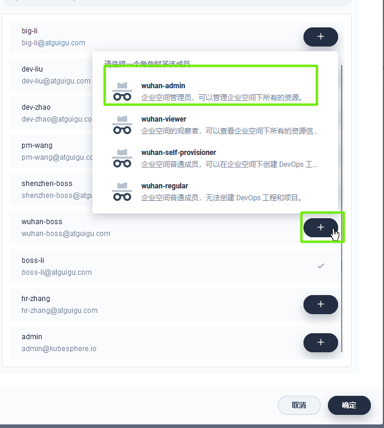
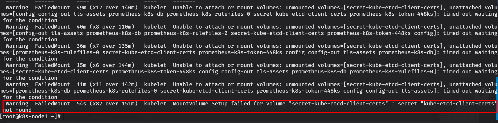
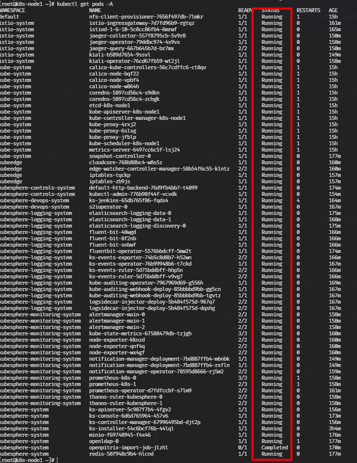

# 目录 
1.KubeSphere实战  


## 1.KubeSphere实战  
**目录:**  
1.1 多租户系统  
1.2 中间件部署  

### 1.1 多租户系统  
1.概述  
  

**企业空间介绍:**  


2.角色  
在kubersphere中一共有如下四种角色  
* workspaces-manager
* users-manager
* platform-regular
* platform-admin

3.创建users-manager用户管理员账号  
  
这里创建了一个用户管理角色的账号  

4.登陆hr-zhang账号  
<font color="#00FF00">登陆刚才创建的hr-zhang账号</font>;点击平台管理按钮就可以发现当前账号只有<font color="#00FF00">访问控制</font>这一项菜单  
访问控制就是管理用户账号的页面  

5.创建workspaces-manager企业空间管理员  
根据第一步的概述图可以看到企业空间管理员有三个作用:<font color="#00FF00">创建企业空间、邀请成员进入、指定成员角色</font>  
  

6.登录boss-li账号  
登陆成功之后可以点击左侧的企业空间=>点击创建  
接着输入如下内容进行创建;创建一个wuhan的企业名称空间;再创建一个shenzhen的企业名称空间  
  
不同的企业可以有不同的业务项目,<font color="#FF00FF">所以企业名称空间就是命名空间的效果</font>  

7.创建platform-regular平台普通账户  
*提示:所有用户的创建都是通过HR账号(用户管理角色)进行创建*  
  
依次类推再创建一个shenzhen-boss、pm-wang、dev-zhao、dev-liu、big-li、big-sun的普通用户  

8.用户一览  
  

9.邀请用户进入企业  
*提示:此时使用普通用户登录是什么也干不了的*  
登陆企业空间管理员boss-li的账号,点击企业管理=>wuhan=>企业空间设置=>企业成员  
此时便可以邀请用户进入企业,但邀请之前还需要给用户设置用户在当前企业中的角色;<font color="#FF00FF">用户在企业中的角色又可以分为以下四种:</font>  
* admin:企业空间管理员,可以管理企业空间下的所有资源
* viewer:企业空间观察者,可以查看企业空间下所有的资源信息
* self-provisioner:企业空间普通成员,可以在企业空间下创建DevOps工程和项目
* regular:企业空间普通成员,无法在企业空间下创建DevOps工程和项目

这里邀请wuhan-boss用户并赋予其在wuhan企业中wuhan-admin的权限;同理邀请shenzhen-boss用户并赋予其在shenzhen企业中shenzhen-admin权限  
    

10.登陆wuhan-boss用户  
登陆成功后发现当前用户只能看到武汉分校这个企业名称空间(boss-li是可以看到所有企业名称空间的)  
  

11.继续邀请用户进入企业空间  
登陆wuhan-boss的账号,邀请所有当前企业的员工进入当前的企业名称空间;注意这些员工的角色  
将<font color="#00FF00">big-sun、big-li、dev-liu、dev-zhao</font>邀请成为普通成员(regular)  
将<font color="#00FF00">pm-wang</font>邀请成为普通成员(self-provisioner)

12.创建项目  
登陆pm-wang的账号,创建一个新的项目,内容如下:  
  
同理创建一个名称为his的在线医疗项目、创建一个名为mall的商城项目  

13.邀请项目成员  
进入刚才创建的his项目,点击项目设置=>项目成员=>邀请成员  
即可邀请当前企业名称空间下的用户进入当前项目;  
项目成员一共有三种角色  
* viewer:项目观察者,可以查看项目下所有的资源
* operator:项目维护者,可以管理项目下除用户和角色之外的资源
* admin:项目管理员,可以管理项目下的所有资源(创建项目的人默认就是项目管理员)

将<font color="#00FF00">big-sun、big-li</font>邀请成为项目管理者(admin)  
将<font color="#00FF00">dev-liu、dev-zhao</font>邀请成为项目维护者(operator)  
  

**小总结:**  
企业名称空间管理员=>创建企业名称空间  
企业空间管理员=>邀请成员进入企业名称空间  
企业普通成员(self-provisioner)=>创建项目=>邀请企业下的成员进入项目  


### 1.2 中间件部署  
*提示:本节对his项目进行操作*  
1.部署应用概述  
  
来到工作负载页面,可以创建工作负载;所谓的工作负载就是之前将K8S中提到的<font color="#00FF00">Controller控制器</font>(Deployment、StatefulSet、DaemonSet)  
由于本节部署中间件,而大部分中间件都是有状态应用所以需要部署<font color="#00FF00">有状态应用</font>  
<font color="#DDDD00">应用负载列表详解:</font>  
* 应用部署完毕之后可以点击左侧的容器组查看应用部署的情况;<font color="#00FF00">容器组实际上就是当前命名空间的pods列表</font>  
* 应用部署完毕之后要想外网访问还必须部署服务(service,详情见K8S笔记),部署服务主要就是内网访问(ClusterIP)和外网访问(NodePort);可以通过左侧的服务按钮进行部署  
* 左侧的任务实际上就是Job(controller控制器的一种类型)
* 左侧的应用路由实际上就是<font color="#00FF00">ingress</font>
* 左侧的应用是一键部署的方式,相当于Helm

<font color="#DDDD00">存储管理:</font>  
* 存储卷:就是K8S的PVC

<font color="#DDDD00">配置中心:</font>  
* 配置:就是K8S的ConfigMap
* 密钥:就是K8S的Secret

<font color="#FF00FF">部署应用的三要素:应用的部署方式、应用的数据挂载(数据、配置文件)、应用的可访问性</font>  
  


**附录:**  
A.阿里云三集群搭建  
B.KubeSphere  


## 附录  
**目录:**  
A.阿里云三集群搭建  
B.KubeSphere  


### B.KubeSphere  
**目录:**  
1.1 KubeSphere基本概念介绍  
1.2 Kubernetes安装教程  
1.3 KubeSphere安装教程  

#### 1.1 KubeSphere基本概念介绍  
1.官网  
[KubeSphere企业版](https://kubesphere.com.cn/)  
[KubeSphere官网地址](https://www.kubesphere.io/zh/)  

2.简介  
KubeSphere是基于K8S构建(所以要先安装K8S)的分布式、多集群、多租户、企业级开源容器平台  


#### 1.2 Kubernetes安装教程
1.集群规划  
*提示:这里为了同步实验环境重新准备了三台虚拟机,IP的配置如下;确保三台虚拟机能够ping通*  
* k8s-node1:192.168.230.130
* k8s-node2:192.168.230.131
* k8s-node3:192.168.230.132

2.设置主机名  
```shell
hostnamectl set-hostname k8s-node1
hostnamectl set-hostname k8s-node2
hostnamectl set-hostname k8s-node3
```

**提示:对每一个节点执行以下内容**
3.修改hosts文件
```shell
cat >> /etc/hosts <<EOF
192.168.230.130  k8s-node1
192.168.230.131  k8s-node2
192.168.230.132  k8s-node3
EOF
```

4.关闭防火墙  
```shell
systemctl stop firewalld && systemctl disable firewalld
```

5.关闭selinux  
```shell
sed -i 's/^SELINUX=.*/SELINUX=disabled/' /etc/selinux/config
```

6.关闭swap分区  
```shell
swapoff -a && sed -ri 's/.*swap.*/#&/' /etc/fstab
```

7.同步所有节点的时间  
```shell
yum install ntpdate -y
ntpdate time.windows.com
```

8.安装docker容器  
一步步执行下述的命令,依旧在所有节点上
```shell
# 卸载docker
sudo yum remove docker*
# 安装yum工具
sudo yum install -y yum-utils
#配置docker的yum地址
sudo yum-config-manager \
--add-repo \
http://mirrors.aliyun.com/docker-ce/linux/centos/docker-ce.repo
#安装指定版本
sudo yum install -y docker-ce-20.10.7 docker-ce-cli-20.10.7 containerd.io-1.4.6
#	启动&开机启动docker
systemctl enable docker --now
# docker加速配置
sudo mkdir -p /etc/docker
# 添加docker镜像地址
sudo tee /etc/docker/daemon.json <<-'EOF'
{
  "registry-mirrors": ["https://82m9ar63.mirror.aliyuncs.com"],
  "exec-opts": ["native.cgroupdriver=systemd"],
  "log-driver": "json-file",
  "log-opts": {
    "max-size": "100m"
  },
  "storage-driver": "overlay2"
}
EOF
# 重启docker
sudo systemctl daemon-reload
sudo systemctl restart docker
#允许 iptables 检查桥接流量
cat <<EOF | sudo tee /etc/modules-load.d/k8s.conf
br_netfilter
EOF
# 配置K8S网络设置
cat <<EOF | sudo tee /etc/sysctl.d/k8s.conf
net.bridge.bridge-nf-call-ip6tables = 1
net.bridge.bridge-nf-call-iptables = 1
EOF
# 重启
sudo sysctl --system
```

10.添加源  
```shell
#配置k8s的yum源地址
cat <<EOF | sudo tee /etc/yum.repos.d/kubernetes.repo
[kubernetes]
name=Kubernetes
baseurl=http://mirrors.aliyun.com/kubernetes/yum/repos/kubernetes-el7-x86_64
enabled=1
gpgcheck=0
repo_gpgcheck=0
gpgkey=http://mirrors.aliyun.com/kubernetes/yum/doc/yum-key.gpg
   http://mirrors.aliyun.com/kubernetes/yum/doc/rpm-package-key.gpg
EOF
```

11.安装K8S  
```shell
#安装 kubelet，kubeadm，kubectl
sudo yum install -y kubelet-1.20.9 kubeadm-1.20.9 kubectl-1.20.9
#启动kubelet
sudo systemctl enable --now kubelet
```

12.在master上初始化集群  
注意这里的命令只在Master节点上即控制平面上初始化集群,注意这里需要设置apiserver的IP地址为Matser(node1)的IP;并且control-plane-endpoint的值为当前master节点的hostname  
```shell
kubeadm init \
--apiserver-advertise-address=192.168.230.130 \
--control-plane-endpoint=k8s-node1 \
--image-repository registry.cn-hangzhou.aliyuncs.com/lfy_k8s_images \
--kubernetes-version v1.20.9 \
--pod-network-cidr=10.244.0.0/16 
```
成功之后会打印如下内容,把绿色方框中的内容先复制下来  
  

13.执行以下命令(还是在Matser节点)  
```shell
mkdir -p $HOME/.kube
sudo cp -i /etc/kubernetes/admin.conf $HOME/.kube/config
sudo chown $(id -u):$(id -g) $HOME/.kube/config
```

14.Work节点加入  
在所有的work节点执行刚才保存的内容,表明当前Work节点要加入的Master节点,复制的这段内容实际上就是token和master节点的地址,第一次加入使用的是token这样可以保证第一次加入的安全性,后续使用证书进行通信  
在所有的work节点执行上述的命令  
```shell
kubeadm join k8s-node1:6443 --token 42wjv6.95pxsh47fci2an2e \
    --discovery-token-ca-cert-hash sha256:fcefa39f891dda96a501cf4bff2ce64de8e38815eb141078dc3d9d67399b3f85
```
默认token有效期为24小时,当过期之后,该token就不可用了.这时就需要重新创建token,操作如下:
`kubeadm token create --print-join-command`

执行完毕后回到master执行如下命令就可以看到节点已经加入  
`kubectl get nodes`  
  

15.在master节点上创建配置文件  
*问题:根据上面的截图可以发现,目前所有的节点都是NoReady这是因为缺少了一个网络插件导致的,所以现在要配置该网络插件.*
`kubectl apply -f https://docs.projectcalico.org/v3.18/manifests/calico.yaml`  
如果该文件实在无法下载,则直接将该文件拉取到本地,需要将文件命名为[calico.yml](resources/DevOps/yml/calico.yaml),然后依旧执行  
运行完毕之后,调用`kubectl get pods -n kube-system`命令以及`kubectl get nodes`查看效果:
    

<font color="#00FF00">到此为止K8S集群的安全就已经完成了</font>  

#### 1.3 KubeSphere安装教程
*提示:安装KubeSphere之前还必须先安装NFS文件系统*  
1.在每个节点运行以下命令  
`yum install -y nfs-utils` 安装NFS工具类  

2.在master节点运行如下命令  
*提示:这里相当于把master节点作为NFS服务器的server,正常NFS服务器是要单独部署的*  
```shell
# 将nfs/data作为共享目录
echo "/nfs/data/ *(insecure,rw,sync,no_root_squash)" > /etc/exports
# 执行以下命令,启动nfs服务;创建共享目录
mkdir -p /nfs/data
# 在master执行
systemctl enable rpcbind
systemctl enable nfs-server
systemctl start rpcbind
systemctl start nfs-server
# 使配置生效
exportfs -r
#检查配置是否生效
exportfs
```

3.配置nfs-client  
*提示:这一步在<font color="#00FF00">两个WorkNode上执行</font>,因为master节点已经作为服务器了,这一步是让两个工作节点能够访问到NFS服务器*  
```shell
# IP设置为master节点的IP地址
showmount -e 192.168.230.130
mkdir -p /nfs/data
# IP设置为master节点的IP地址
mount -t nfs 192.168.230.130:/nfs/data /nfs/data
```

4.配置默认存储  
将[sc.yml](resources/DevOps/yml/sc.yml)配置文件复制到虚拟机,记得修改其中的IP地址为master(NFS服务器)节点的地址  
执行`kubectl apply -f sc.yml`配置文件  
执行`kubectl get storageclass` 查看配置是否生效  
若能够看到图中的配置代表已经生效  
  

5.安装集群监控指标组件  
5.1 编写metrics-components.yml配置文件  
[点击跳转至配置文件](resources/DevOps/yml/metrics-components.yml)  

5.2 执行`kubectl apply -f metrics-components.yml` 安装metrics  

5.3 当看到metrics运行成功后就代表安装成功  
  

5.4 查看Pod资源占用  
执行完第二步之后,再次执行`kubectl top pod [podName]`看到如下效果,这里查看的是之前容器生命周期那边的pod,即lifecycle  
  

6.下载KubeSphere的YML文件  
这里有两个文件,分别是kubesphere-installer和cluster-configuration  

[kubesphere-installer.yml](resources/DevOps/yml/kubesphere-installer.yml)下载地址:[https://github.com/kubesphere/ks-installer/releases/download/v3.1.1/kubesphere-installer.yaml](https://github.com/kubesphere/ks-installer/releases/download/v3.1.1/kubesphere-installer.yaml)  

[cluster-configuration.yaml](resources/DevOps/yml/cluster-configuration.yml)下载地址:[https://github.com/kubesphere/ks-installer/releases/download/v3.1.1/cluster-configuration.yaml](https://github.com/kubesphere/ks-installer/releases/download/v3.1.1/cluster-configuration.yaml)  

7.修改cluster-configuration.yml的内容  
主要是该两个地方,一个是将etcd的IP改为当前master节点的IP;还有一个是将文件中部分为false的值改为true表示启用这些组件的功能(因为KubeSphere采用的是可插拔设计)  
具体参见这里给出的配置文件中的内容即可  

8.安装KubeSphere  
执行以下命令安装KubeSphere  
```shell
kubectl apply -f kubesphere-installer.yaml
kubectl apply -f cluster-configuration.yaml
```

9.检查安装进度  
执行`kubectl logs -n kubesphere-system $(kubectl get pod -n kubesphere-system -l app=ks-install -o jsonpath='{.items[0].metadata.name}') -f`命令查看安装状态  
执行到最后会打印如下内容  
  

10.查看所有Pod是否全部运行成功  
*提示:必须要所有的Pod全部运行成功才可以,这里有一个Pod没有运行成功,使用kubectl describe命令来查看该Pod的信息*  
  

11.解决etcd监控证书找不到问题  
执行`kubectl -n kubesphere-monitoring-system create secret generic kube-etcd-client-certs  --from-file=etcd-client-ca.crt=/etc/kubernetes/pki/etcd/ca.crt  --from-file=etcd-client.crt=/etc/kubernetes/pki/apiserver-etcd-client.crt  --from-file=etcd-client.key=/etc/kubernetes/pki/apiserver-etcd-client.key`命令解决该问题  

稍等一段时候后再次查看所有Pod的运行情况,可以发现此时所有的Pod全部处于running状态  
  

12.浏览器访问KubeSphere  
浏览器访问第9步给出的内容,输入账号和密码并重置密码为K8s123  
  

<font color="#00FF00">到此为止KubeSphere集群的安全就已经完成了</font>  

13.jetkins服务启动失败解决  
有可能jetkins在启动的时候报探针异常,这是由于探针给的时间范围太短了导致第一次jetkins启动不起来  
进入KubeSphere=>应用负载=>工作负载=>jenkins(搜索)=>更多=>编辑配置文件=>将`initialDelaySeconds`的时间修改长一点,例如600秒  
当然也有可能是因为虚拟机内存不足的原因  
  


