# 目录
1.docker基本知识介绍  
2.docker镜像  

**附录:**  
A.docker命令大全  
B.常用docker镜像大全  
C.Docker安装教程  


## 1.docker基本知识介绍  
**目录:**  
1.1 docker基本知识介绍  
1.2 Docker三大件  
1.3 Docker的虚悬镜像  
1.4 Docker镜像  


### 1.1 docker基本知识介绍
1.为什么出现docker  
使用docker就是为了解决云端环境和本地环境不一致的问题,开发人员可以利用docker消除协作编码时<font color="#00FF00">"在我的机器上可以正常工作"</font>的问题  
<font color="#00FF00">软件迁移时可以带环境迁移</font>  
<font color="#00FF00">一次镜像处处运行</font>

2.docker特点  
2.1 容器应该是解决某个问题的功能单元，让容器保持单一用途才是正确的方式.如果一个容器中包含多个功能模块,则这个容器是不对的  
2.2 docker最核心的功能是它的打包技术即<font color="#00FF00">容器镜像</font>  
2.3 docker的核心是<font color="#FF00FF">进程隔离(name space)、资源管理(cgroup)、文件系统(mount namespace)</font>  
2.4 容器内的应用进程复用宿主机的内核  
2.5 便捷的扩缩容  


3.容器与虚拟机有什么区别  
下面这张图很重要
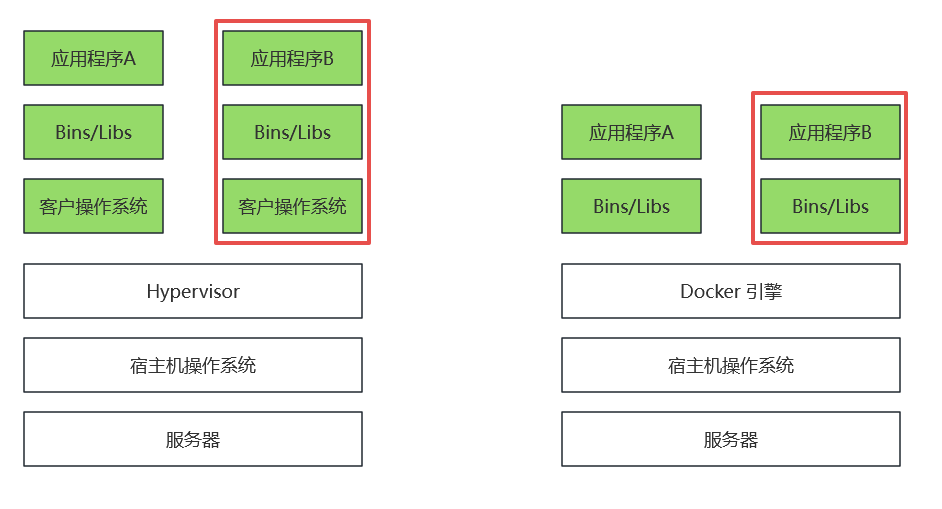  
* 传统虚拟机基于安装在主操作系统上的虚拟机管理系统(如VirtualBox和VMWare),创建虚拟机(<font color="#00FF00">虚拟出各种硬件</font>),在虚拟机上安装从操作系统,在从操作系统中安装部署各种应用  
  * 传统虚拟机的主要缺点是:资源占用多、冗余步骤多、启动慢、性能消耗大
		关于性能消耗大的解释:原本执行一条系统调用只需要从用户态切换到内核态,而现在在中间挡了一层虚拟机拦截,从而降低了性能
* 容器将软件运行所需的所有资源打包到一个隔离的容器中,容器与虚拟机不同,不需要捆绑一整套操作系统,<font color="#00FF00">只需提供该容器运行所需的全部文件即可</font>  
  * <font color="#FF00FF">容器内的应用进程复用宿主机的内核</font>
  * 进程隔离、资源管理、文件系统
  * 便捷的扩缩容

4.docker的交互原理  
docker启动时会创建一个守护线程用于接收用户的命令并管理docker容器;  
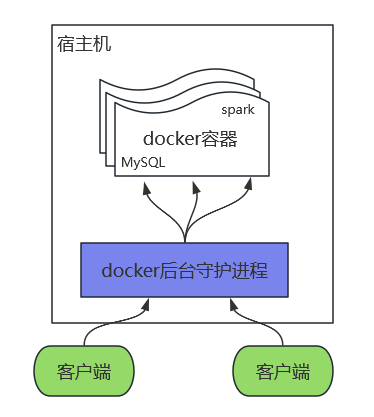  

5.docker运行流程  
Docker是一个C/S模式的架构,后端是一个松耦合架构,众多模块各司其职  
Docker运行的基本流程为:  
5.1 用户使用Docker Client与Docker Daemon建立通信,并发送请求给Docker Daemon  
5.2 Docker Daemon作为Docker架构中的主体部分,首先提供Docker Server的功能使其可以接受Docker Client的请求  
5.3 Docker Engine执行Docker内部的一些列工作,每一项工作都是以一个Job的形式存在  
5.4 Job的运行过程中,当需要容器镜像时,则从Docker Register中下载镜像,并通过镜像管理驱动Graph Driver将下载镜像以Graph的形式存储  
5.5 当需要为Docker创建网络环境时,通过网络管理驱动Network driver创建并配置<font color="#00FF00">Docker容器网络环境</font>  
5.6 当需要限制Docker容器运行资源或执行用户指令等操作时,则通过Exec driver来完成  
5.7 Libcontainer是一项独立的容器管理包,Network driver以及Exec driver都是通过Libcontainer来实现具体对容器进行的操作  

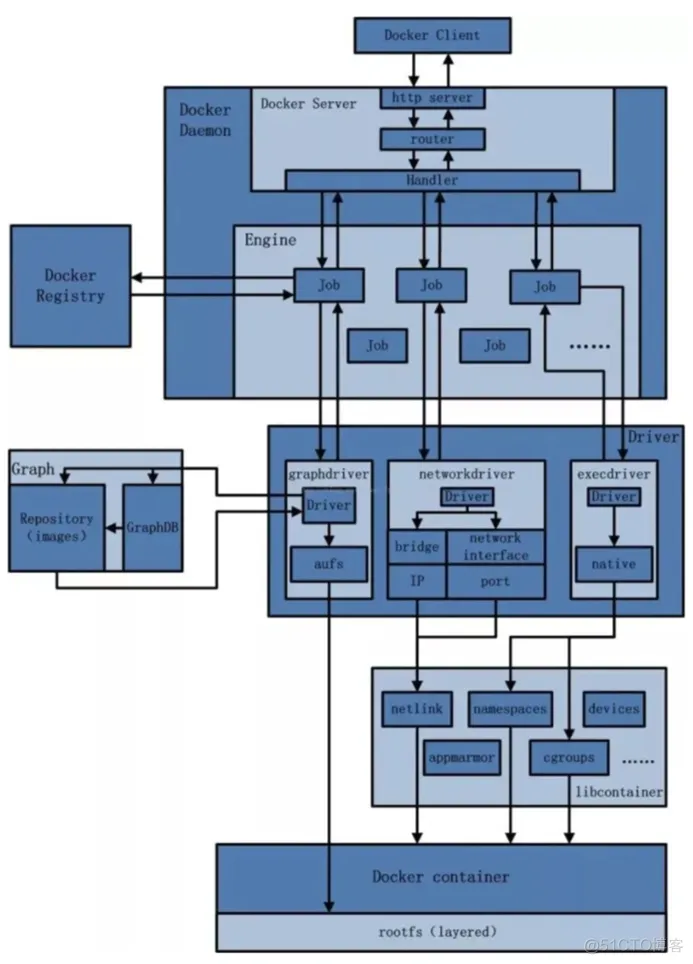  


### 1.2 Docker三大件
*提示:本章内容较为基础可以暂且略过*  
Docker的三大件指的是镜像、容器、仓库  
* 镜像:docker镜像是一个只读模板,<font color="#00FF00">一个镜像可以创建多个容器</font>;它包含应用程序的<font color="#FF00FF">最小运行环境</font>  
* 容器:<font color="#00FF00">容器是镜像创建的运行实例</font>  
* 仓库:仓库,集中存放镜像文件的场所;Docker仓库也分为<font color="#00FF00">公开仓库和私有仓库</font>两种形式;Docker官方仓库[Docker Hub](https://hub.docker.com/search?q=)  

### 1.3 Docker的虚悬镜像
<font color="#00FF00">镜像名称和镜像版本都是none的镜像,就是虚悬镜像</font>  
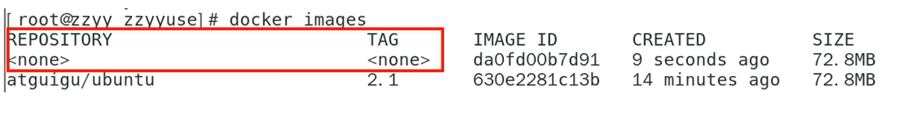  
碰到这种镜像把它删掉就行了  

## 2.docker镜像
**目录:**  
2.1 docker镜像的基本概念介绍  
2.2 Docker Commit  
2.3 本地镜像发布到阿里云  
2.4 搭建Dokcker私有仓库  
2.5 容器数据卷  


### 2.1 docker镜像的基本概念介绍
1.UnionFS   
UnionFS(联合文件系统)即AFS<font color="#00FF00">支持对文件系统的修改作为一次提交来一层层的叠加</font>,<font color="#FF00FF">同时可以将不同目录挂载到同一个虚拟文件系统下</font>.UnionFS是docker镜像的基础,镜像可以通过分层来进行继承,基于基础镜像可以制作各种具体的应用镜像  
镜像的层都放置在/var/lib/docker/aufs/diff目录下,然后被联合挂载到/var/lib/docker/aufs/mnt中;从该结构可以看出容器的rootfs由三部分组成  
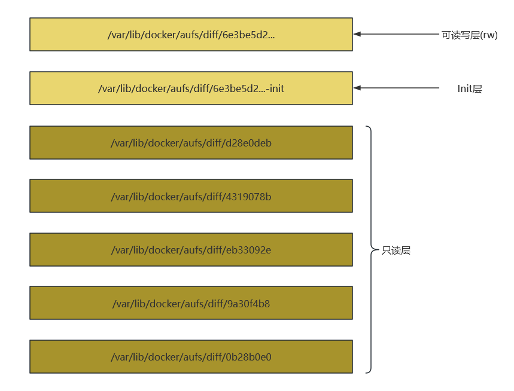  

2.Docker镜像加载原理  
Docker的镜像实际上是由一层层的文件系统组成的,这种层级的文件系统UnionFS  
bootfs主要包含bootloader和kernel,bootloader主要是引导加载kernel,Linux刚启动时会加载bootfs文件系统,<font color="#00FF00">在docker镜像的最底层是引导文件系统bootfs</font>.这一层与Linux操作系统是一样的,包含boot加载器和内核.当boot加载完成之后整个内核都在内存中了,此时内存的使用权已由bootfs转交给内核,此时系统也会卸载bootfs  
不同的Linux发行版本bootfs基本是一致的,rootfs可能会有差异(比如CentOS的根文件系统和Ubuntu的根文件系统就有差异);<font color="#00FF00">所以docker的根文件系统rootfs的底层也是基于bootfs的</font>  

3.Docker镜像采用分层的好处  
Docker镜像是一层层叠加最后利用UnionFS挂载到同一个目录下的结果,<font color="#00FF00">所以多个容器就可以共享一部分层、多个镜像也可以共享一部分层</font>,比如有多个镜像都从相同的base镜像构建而来,那么Docker Host只需要在磁盘上保存一份base镜像,同时内存中也只需加载一份base镜像,就可以为所有容器服务了  

### 2.2 Docker Commit
*提示:由于docker镜像只包含应用的最小运行环境,现在要通过docker commit的方式给容器添加vim命令的支持*  
**首先先安装一个Ubuntu的镜像并启动,作为本次的实验环境;即为Ubuntu添加vim命令的支持**  
1.运行`docker run -it ubuntu`拉取并运行最新的Ubuntu镜像并进入到容器  

2.安装vim  
运行`apt-get update` 更新apt安装工具  
运行`apt-get -y install vim` 安装vim

3.commit  
使用commit命令提交容器使之成为一个新的<font color="#00FF00">镜像</font>;此时该镜像就具备了vim指令  
运行`docker commit -m "vim add" -a "cnsukidayo" cea1b1d519dc cnsukidayo/iubuntu:1.3` 提交并创建一个新的镜像  
*提示:多提一嘴,按照docker镜像的命令规范,镜像名称之前可以加上公司名称(包名),例如这里的包名就是cnsukidayo;可以看到很多镜像都采用了这种命名规范*  

此时运行`docker images`就可以看到刚才提交的镜像了  

4.启动并进入新创建的镜像  
执行`docker run -it cnsukidayo/iubuntu:1.3`运行并进入刚才创建的镜像  
此时可以发现vim命令确实可以使用  

### 2.3 本地镜像发布到阿里云
1.本地镜像发布到阿里云流程  
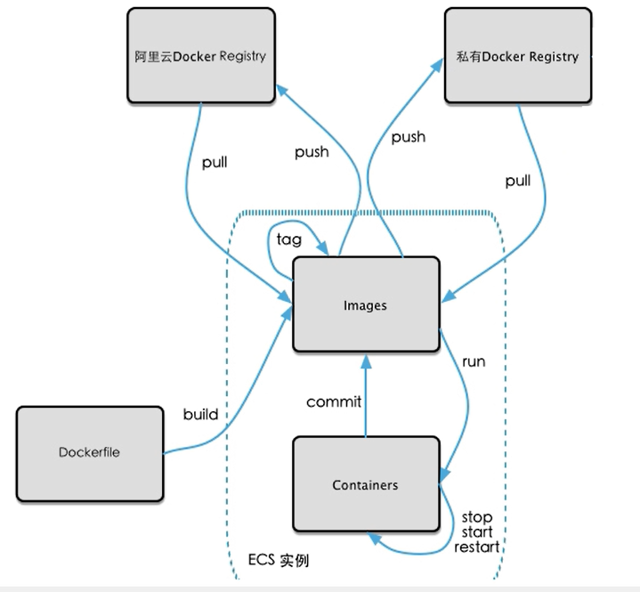  
**注意:** 之前提到过docker仓库分为两种,一种是公共仓库例如Docker Hub、阿里云Docker Registry;另外一种就是私有库(类似Git Lab)

2.阿里云镜像仓库注册流程  
2.1 进入容器镜像服务  
访问[阿里云](https://home.console.aliyun.com/home/dashboard/ProductAndService)进入控制台->选择容器镜像服务  
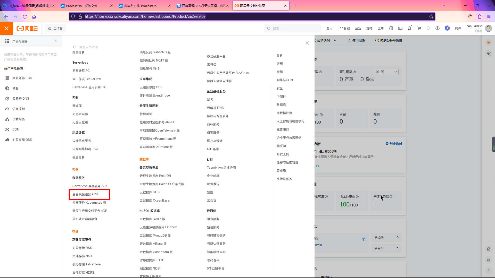  

2.2 配置镜像加速地址  
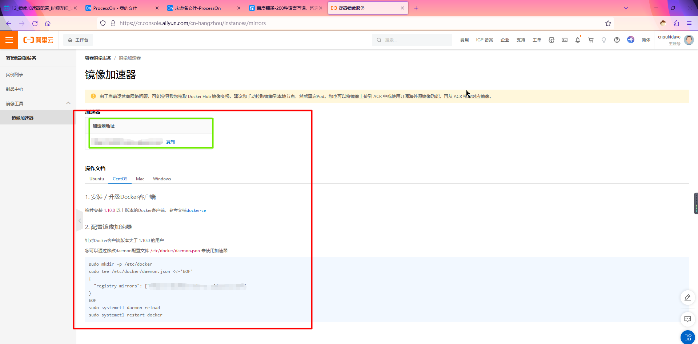  
可以使用开发者的个人镜像加速地址  

3.推送镜像  
3.1 个人中心  
点击左侧实例列表=>个人实例  
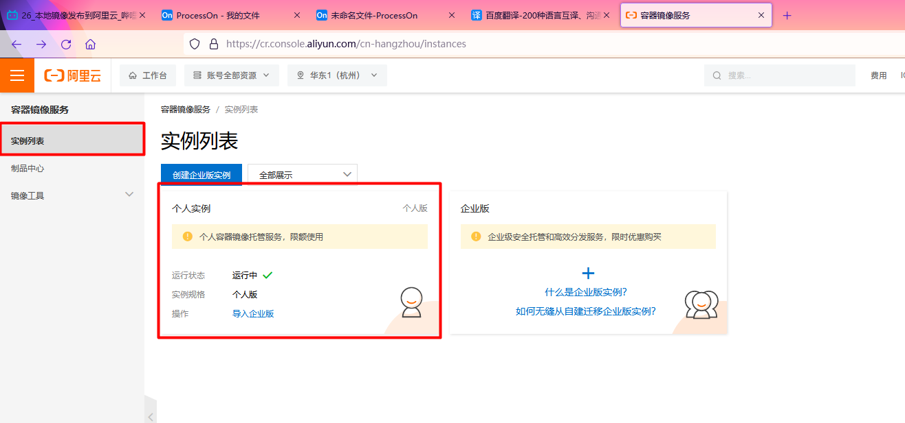  

3.2 创建命名空间  
点击个人中心页面左侧的创建命令空间,然后在创建命名空间中创建一个命名空间  
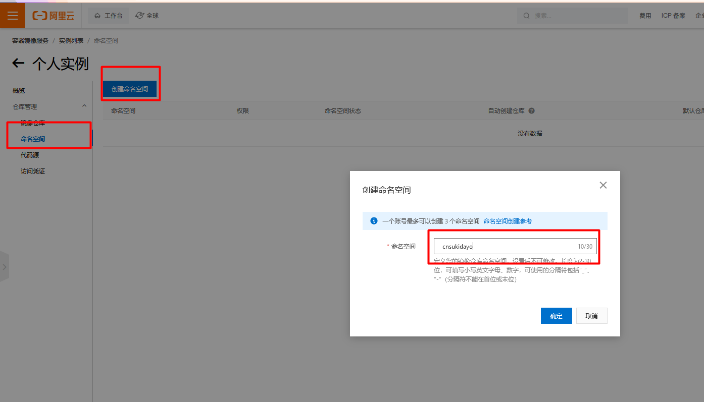  

3.3 创建镜像仓库  
点击个人中心页面左侧的创建仓库镜像,然后为当前的Ubuntu镜像创建一个仓库;注意这里选择的命名空间就是刚才创建的命名空间  
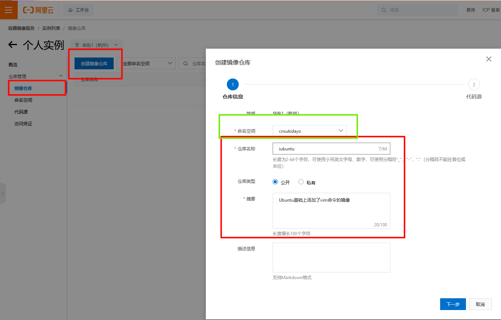  
接着在第二步代码源中选择本地仓库=>创建仓库镜像即可  

3.4 运行阿里云提供的命令  
创建好镜像仓库后在弹出的页面中有一个第三步"将镜像推送到Registry";重点关注这一步的三条命令  
*提示:这里强烈建议使用自已的镜像加速地址*

**登入阿里云**
```shell
# 登录阿里云镜像仓库;第一次需要输入密码
docker login --username=cnsukidayo registry.cn-hangzhou.aliyuncs.com
```

**给镜像打标记**  
```shell
# ImageId是我们镜像的ID
# registry.cn-hangzhou.aliyuncs.com/cnsukidayo/iubuntu这一段是远程仓库的地址
# 镜像版本号是远程仓库的镜像版本
docker tag [ImageId] registry.cn-hangzhou.aliyuncs.com/cnsukidayo/iubuntu:[镜像版本号]
```
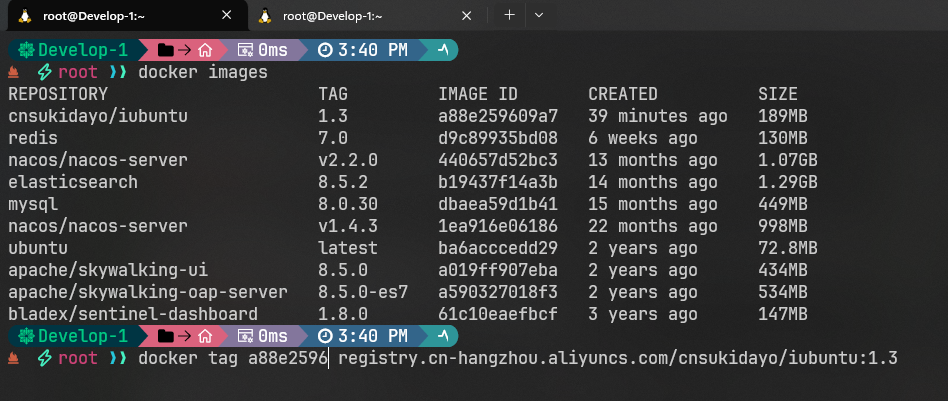  
打完标记之后会出现一个新的镜像,镜像仓库为`registry.cn-hangzhou.aliyuncs.com/cnsukidayo/iubuntu`,版本号为1.3;所以其实这一步相当于以ImageId镜像创建一个新的镜像  
但是这种说法又不准确,因为<font color="#00FF00">新创建的这个镜像的ID和老镜像的ID是一致的</font>

**推送镜像**  
```shell
# 推送镜像;把刚才创建的镜像推送到阿里云,所以其实这一步和我们最开始ImageId指定的镜像没什么关系了已经
docker push registry.cn-hangzhou.aliyuncs.com/cnsukidayo/iubuntu:[镜像版本号]
```

推送成功之后就可以在网页上看到刚才推送的镜像了  
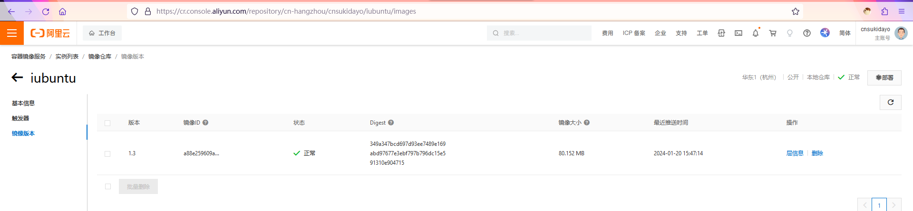  

4.拉取镜像  
在刚才iubuntu镜像仓库中还有一个第二步"从Registry中拉取镜像"  
```shell
docker pull registry.cn-hangzhou.aliyuncs.com/cnsukidayo/iubuntu:[镜像版本号]
```
此时运行该命令就可以从阿里云上拉取刚才推送的镜像了  

### 2.4 搭建Dokcker私有仓库
1.Docker Register  
Docker Register是docker官方提供的私有Docker仓库的平台(类似Git Lab)  

2.创建registry目录  
```shell
mkdir ~/software/registry
```

3.运行docker register容器  
```shell
docker run \
-p 5000:5000 \
-v ~/registry:/tmp/registry \
--privileged=true \
-d registry
```

4.查询本地私服库的所有镜像  
<font color="#00FF00">docker registry是以Restful风格进行交互的</font>  
```shell
# 查询registry仓库中的所有镜像 IP地址和端口号要对应宿主机
curl -XGET http://192.168.230.128:5000/v2/_catalog
```

5.给镜像打TAG标记  
*提示:这里还是提交cnsukidayo/iubuntu:1.3这个镜像*  
```shell
# 给镜像打TAG标记;IP地址和端口号要对应宿主机
docker tag [ImageId] [remoteAddress]/[imageName]:[imageVersion]
# 例如:
docker tag [ImageId] 192.168.230.128:5000/cnsukidayo/iubuntu:1.3
```
所以其实这里的TAG也可以理解为<font color="#FF00FF">关联远程仓库</font>,这里可以和之前发布到阿里云打TAG标记联系起来看;  
值得注意的是仓库地址是由<font color="#00FF00">远程地址+镜像名称</font>(镜像名称也称为是仓库地址,这里叫法有点乱但能明白意思就行)组成的  

6.修改配置文件使registry支持http  
*提示:默认情况下registry是不支持http的,所以现在要修改/etc/docker/daemon.json配置文件使它支持*  
```json
{
"registry-mirrors": ["https://xxxxx.mirror.aliyuncs.com"],
"insecure-registries":["192.168.230.128:5000"]
}
```
在insecure-registries里面填上私服的IP和端口即可,这里的话就是宿主机  

7.重启docker  
```shell
sudo systemctl daemon-reload
sudo systemctl restart docker
```
重启docker后记得重启registry私服  

8.推送镜像到registry私服  
```shell
docker push 192.168.230.128:5000/cnsukidayo/iubuntu:[镜像版本号]
```
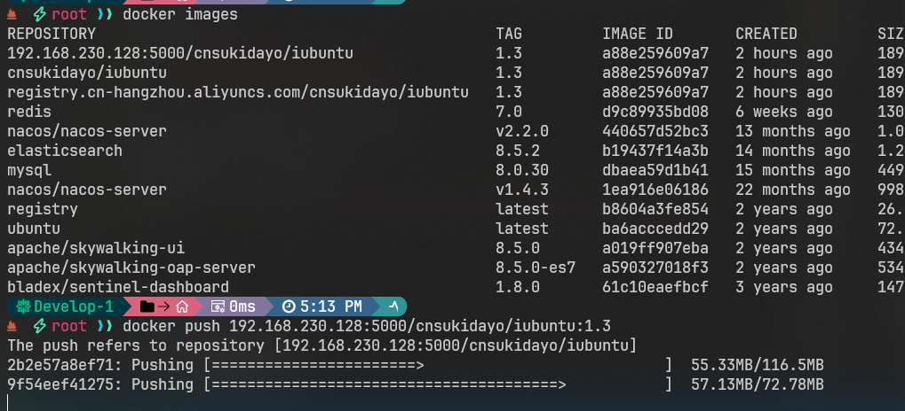  

9.再次查询私有仓库所有镜像  
返回如下结果:  
```json
{"repositories":["cnsukidayo/iubuntu"]}
```

10.拉取镜像  
此时就可以从私服库拉取镜像了,这里不再介绍了  

### 2.5 容器数据卷
**目录:**  
2.5.1 


## 附录:  
A. docker命令大全  
B. 常用docker镜像大全  
C. Docker安装教程  


### A. docker命令大全  
[docker命令官方网站](https://docs.docker.com/engine/reference/commandline/docker/)  

#### 1.镜像相关  
* `docker pull [image-name]:[version]` 拉取镜像  
  * `image-name`(必填):镜像名称
  * `version`(必填):镜像版本
* `docker images` 查看所有镜像  
* `docker exec -it [image-id] ` 进入一个镜像  
  * `image-id`(必填):image-id是容器的id(不是镜像的id;是docker ps结果的CONTAINER ID字段)
* `docker rmi [imageName0]:[imageTag0]/[imageId0] [imageName1...]:[imageTag1...]/[imageId1...]` 删除多个镜像
  * `imageName`(必填):镜像名称,与imageId二选一
  * `imageTag`(必填):镜像的TAG,和imageName一起使用
  * `imageId`(必填):镜像ID,与imageName二选一
	注意有的时候如果使用docker tag给镜像打标签,<font color="#00FF00">则打完标签后的镜像ID是不变的</font>,此时就会出现多个镜像ID相同的镜像,此时使用镜像ID删除镜像就不好使了;<font color="#FF00FF">此时只能通过镜像名称+TAG的方式进行删除</font>
* `docker rmi -f [imageName]/[imageId]` 强制删除一个镜像,推荐不使用-f参数,如果用上面没有-f删除docker镜像时出现问题(可能是当前要删除的镜像依赖某个容器,可以使用上面的docker rm [containerId]删除该容器后重试)
  * `imageName`(必填):镜像名称,与imageId二选一
  * `imageId`(必填):镜像ID,与imageName二选一
* ~~`docker rmi -f $(docker images -qa)`~~ <font color="#00FF00">组合命令</font>;强制删除所有镜像,该命令不要使用
  * `$(docker images -qa)` 这相当于一个表达式会将该命令执行的结果作为docker rmi -f命令的参数,docker images -qa的命令的意思是显示所有镜像的ID(不显示额外的信息)
* `docker system df` 查看镜像占用磁盘空间的情况

#### 2.容器相关  
* `docker ps [-a] [-l] [-n [number] -q]` 查询运行的所有镜像
  * `-a`:代表所有的镜像(包括没有正在运行的镜像)
  * `-l`:显示最近创建的容器
  * `-n [number]`:显示最近创建的number个容器
  * `-q`:静默模式,只显示容器ID(不显示额外的信息)
* `docker exec -it [containerId] /bin/bash` 进入一个容器  
  注意:/bin/bash也可以是/bin/sh、bash
* `docker attach [containerId]` 进入一个容器;这种方式进入容器用exit退出容器时会导致容器停止
* `docker rm [containerId] [-f]` 删除一个容器(是容器不是镜像)  
  * `-f`:强制删除
* `docker run [--name=[containerName]] [--privileged] [-d] [-p masterPort:containerPort] [-v [hostPath]:[containerPaht]:[mode(default=rw)]] [-it bin/bash] [command] [imageName]:[imageVersion] ` 运行一个镜像(注意和start区分)
  * `imageName`(必填):镜像名称
  * `imageVersion`(必填):镜像版本
  * `--privileged`(必填):加强挂载权限,推荐使用以后就带上该参数就行
  - - -
  * `-e` 指定环境变量
  * `--name [containerName]`:将容器取名为containerName
  * `-d`:以后台运行方式运行容器并返回容器ID;与`-it`互斥使用
  * `-p masterPort:containerPort`:将容器的containerPort端口映射到宿主机的masterPort
  * `-it  bin/bash`:以交互模式运行容器;它与<font color="#00FF00">docker exec -it [containerId] /bin/bash</font>命令的区别在于,docker exec是容器已经启动的情况下进入容器
  * `-v [hostPath]:[containerPaht]:[mode(default=rw)]`  挂载容器文件路径到本机;将containerPaht(容器)路径的文件挂载到hostPath(主机)
    * `mode`:容器读写挂载文件的模式;有rw和ro两种模式
      * `rw`(默认):容器内部可以读写挂载的目录
      * `ro`:容器内部只能读取挂载的目录
  * `command`:启动参数
  * 退出容器的时候有两种退出方式,<font color="#00FF00">一种是使用exit直接退出,另一种是使用Ctrl+p+q</font>  
  	<font color="#FF00FF">如果是利用docker run命令进入的容器,则exit的退出方式会连带将容器停止</font>  
		如果是docker exec -it的方式进入容器,则可以随意退出容器,容器不会停止
* `docker stop [containerId]` 停止一个容器  
* `docker start [containerId]` 启动一个容器  
* `docker restart [containerId]` 重启一个容器  
* `docker kill [containerId]` 强制停止一个容器
* `docker container update --mount type=bind,source=[hostPath],target=[containerPath] [containerId]` 挂载已经启动的容器目录(需要先将容器stop);source是宿主机的路径,target是容器内的路径.
* `docker cp [hostPath] [containerId]:[containerPath]` 将宿主机的文件拷贝到容器中
* `docker cp [containerId]:[containerPath] [hostPath]` 将容器中的内容拷贝到宿主机
* `docker logs [containerId]` 查看容器启动的日志
* `docker top [containerId]` 监控容器内运行的进程情况
* `docker inspect [containerId]` 查看容器的内部细节;该命令会以Json串返回容器的详情情况
  - - -
	* "Mounts":容器挂载情况
* `docker export [containerId] > [fileName].tar` 
  将整个容器导出为一个tar归档文件;采用这种导出方式,可以保留在容器内部修改的文件  
	这个命令就相当于一个压缩
	* `containerId`(必填):容器ID
	* `fileName`(必填):导出的文件名
* `cat [fileName].tar | docker import - [imageName]:[imageVersion]` 导入一个镜像
  以fileName.tar对应的容器备份文件创建一个新的镜像(注意是镜像),镜像名称为imageName,版本为imageVersion
	* `fileName`(必填):要导入的镜像压缩包
	* `imageName`(必填):镜像名称,该名称自拟
	* `imageVersion`(必填):镜像版本,该版本自拟

#### 3.版本控制相关  
* `docker commit -m "[commitMessage]" -a "[author]" [containerId] [targetImageName]:[targetImageVersion]` 提交containerId对应的容器并创建一个新的镜像
  * `commitMessage`(必填):提交的信息
  * `author`(必填):作者
  * `containerId`(必填):<font color="#00FF00">commit命令是基于容器的</font>;将该容器提交创建一个新的镜像
  * `targetImageName`(必填):创建的新镜像的名称
  * `targetImageVersion`(必填):创建的新镜像的版本
* `docker tag [imageId] [remoteAddress]/[imageName]:[imageVersion]` 给某个镜像打标签
	详情见:2.3 本地镜像发布到阿里云  
	**注意:因为是给镜像打标签,所以打完标签前后镜像的ID是不变的,所以此时就会存在多个镜像ID相同的镜像,可以通过docker images查看所有镜像,包括打标签的镜像**
  * `ImageId`(必填):镜像的id
  * `remoteAddress`(必填):镜像的远程地址,这个值一般都会给出
  * `[imageName]:[imageVersion]`(必填):镜像的名称和版本;自已拟定
* `docker push [remoteAddress]/[imageName]:[imageVersion]` 发布镜像
* `docker pull [remoteAddress]/[image-name]:[version]` 拉取镜像
  所以之前拉取镜像的时候理论上是要填写`remoteAddress`远程地址的,<font color="#00FF00">没有填写意味着默认从docker官方仓库拉取</font>


#### 3.网络相关
* `docker network ls` 查看docker所有的网络
* `docker network rm [netWorkId]` 根据network的ID移除一个docker网络
* `docker network create [netWordName]` 创建一个docker网络,网络名称为[netWordName];docker网络在搭建nacos集群的时候会用到

#### 4.其它  
* `docker version` 查看docker版本信息
* `docker info` docke概要说明
* `docker --help` docker帮助命令
* `docker [command] --help` 查看docker某条命令的帮助
* `sudo systemctl start docker` 启动docker
* `sudo systemctl stop docker` 停止docker
* `sudo systemctl restart docker` 重启docker
* `sudo systemctl status docker` 查看docker状态
* `sudo systemctl enable docker` 开机启动docker

### B. 常用docker镜像大全  
**目录:**  
1.MySQL  
2.Redis  
3.Nacos  
4.RabbitMQ  
5.ElasticSearch  
6.Nginx  


#### 1.MySQL安装  
1.下载镜像  
`docker pull mysql:8.0.30`  

2.创建实例并启动  
```shell
docker run -p 7901:3306 --name mysql8.0 \
-v ~/software/mysql8.0/log:/var/log/mysql \
-v ~/software/mysql8.0/data:/var/lib/mysql \
-v ~/software/mysql8.0/conf:/etc/mysql/conf.d:rw \
-e MYSQL_ROOT_PASSWORD=root \
-d mysql:8.0.30
```

参数解释:  
* -v [hostPath]:[containerPaht]  挂载容器文件路径到本机;将containerPaht(容器)路径的文件挂载到(hostPath)  
* -e MYSQL_ROOT_PASSWORD=[password] -e参数的本质是启动容器时给容器设置参数,这里的参数意思是设置MySQL root用户的密码为root(看上面的例子)  
* --name 给当前容器其名  
* -p [hostPort]:[containerPort] 将容器的容器的端口(containerPort)映射到宿主机的端口(hostPort).  
* -d [repository]:[version] 启动的目标镜像坐标,通过docker images 命令可以查看到所有的镜像,目标镜像有仓库+version来决定  

3.进入到容器中修改密码  
`ALTER USER 'root'@'%' IDENTIFIED BY '这里是你要设置的密码';`

`flush privileges;` 刷新权限  

4.注意可能需要删除用户  


#### 2.Redis  
1.下载镜像  
`docker pull redis:7.0`  

2.先创建配置文件  
**解释:** 这有个小坑,在docker挂载的时候有可能将最后一个文件识别成目录,所有这里要先创建Redis配置文件的.  
`mkdir -p ~/software/redis/conf`  创建配置文件目录  
`touch ~/software/redis/conf/redis.conf` 创建Redis配置文件  
*提示:这个配置文件来源于Redis的官方github*  
**[redis.conf](resources/redis/redis.conf)**  
**注意:** 这个配置就是看一下,不要上传到Linux服务器上,有什么需要改的配置直接在刚才touch创建的配置文件中修改.  

3.创建容器并启动
```shell
docker run -p 7902:6379 --name redis \
-v ~/software/redis/data:/data \
-v ~/software/redis/conf/redis.conf:/etc/redis/redis.conf \
-d redis:7.0 redis-server /etc/redis/redis.conf
```

**解释:** 后面的/etc/redis/redis.conf是容器里面的配置文件,意思是启动redis的时候携带的配置文件  

4.设置Redis密码  
`vim ~/software/redis/conf/redis.conf` 编辑Redis配置文件,设置Redis密码  
`requirepass [password]` 在配置文件中设置Redis密码  
`redis-cli -a [password] --raw -h [host] -p [port]` 使用密码连接Redis客户局
* `-a [password]` 设置密码启动客户端
* `--raw` 解决中文乱码问题  
* `-h [host]`(非必填):连接的目标RedisIP  
* `-p [port]`(非必填):连接的目标Redis的port

**Redis详细配置见:Redis=>B.Redis命令大全=>5.redis.conf**  

5.Redis默认安装路径 /usr/local/bin(可以进入容器中访问)  

6.Redis中sentinel.conf配置文件  
该配置文件存放的路径应该与redis.conf配置文件中设置的`dir`路径的目录一致;sentinel.conf是Redis负载均衡的配置.  
如果redis.conf没有指定dir,则将sentinel.conf配置文件放到与redis.conf配置文件相同的目录下.  

7.启动sentinel  
sentinel的启动和Redis服务的启动是完全不一样的,虽然可以使用同一个镜像来完成  
```shell
docker run -p 7903:26379 --name redis-sentinel \
-v ~/software/redis/data:/data \
-v ~/software/redis/conf/sentinel.conf:/etc/redis/sentinel.conf \
-e --sentinel \
-d redis:7.0 redis-sentinel /etc/redis/sentinel.conf
```
**解释:**  
* -e --sentinel 启动sentinel时需要带上的参数

8.启动集群  
```shell
docker run -p 7903:26379 --name redis-sentinel \
-v ~/software/redis/data:/data \
-v ~/software/redis/conf/sentinel.conf:/etc/redis/sentinel.conf \
-e -c \
-d redis:7.0 redis-sentinel /etc/redis/sentinel.conf
```

**解释:**  
* -e -c 代表启动的有路由(这是集群中的概念,详情见Redis.md=>基础篇=>8.Redis集群=>8.3 三主三从集群环境=>8.3.3 主从容错切换迁移案例)

#### 3.Nacos
1.下载镜像  
`docker pull nacos/nacos-server:v2.2.0`  

2.启动容器  
```shell
docker run \
-p 8848:8848 \
-p 9848:9848 \
-p 9849:9849 \
--name nacos2 \
--env MODE=standalone \
--env NACOS_AUTH_ENABLE=true \
--env NACOS_AUTH_TOKEN_EXPIRE_SECONDS=18000 \
--env NACOS_AUTH_TOKEN=VGhpc0lzTXlDdXN0b21TZWNyZXRLZXkwMTIzNDU2Nzg= \
-e JVM_XMS=256m \
-e JVM_XMX=256m \
-d nacos/nacos-server:v2.2.0
```
**解释:**  
* --env NACOS_AUTH_ENABLE=true 代表开启新版本nacos的鉴权  
* --restart=always 重启  
* --env MODE=standalone 启动模式为单击启动  
* --env NACOS_AUTH_TOKEN_EXPIRE_SECONDS=18000 token默认的时效时间  
* nacos2.0之后还需要加上9848、9849端口

3.挂载目录(先启动再挂载)  
**这个第三点是无效的,不用看了,所以nacos就不指定挂载就行了**  
这里逻辑会非常混乱,可以看帖子:[https://www.yii666.com/blog/511435.html](https://www.yii666.com/blog/511435.html)  

**环境:**  
我这里启动了两个nacos;一个是没有挂载目录的;一个是正常挂载目录的.  
挂载目录实际上是由两个文件来共同决定的:hostconfig.json和config.v2.json  

没有挂载的hostconfig.json文件:
```json
{
  "Binds": null,
  "ContainerIDFile": "",
  "...":"..." // 后面的内容省略了
}
```

有挂载的hostconfig.json文件:
```json
{
	"Binds": ["/root/software/nacos/conf:/home/nacos/conf", "/root/software/nacos/data:/home/nacos/data", "/root/software/nacos/logs:/home/nacos/logs"],
	"ContainerIDFile": "",
  "...":"..."
}
```
着重看Binds属性,可以看到和挂载一样,冒汗前面指定的是宿主机路径,冒号后面指定的是容器内路径.  

没有挂载的config.v2.json:
```json
{
  "MountPoints":{}
}
```

有挂载的config.v2.json(省略部分不重要内容):  
```json
{
  	"MountPoints": {
		"/home/nacos/conf": {
			"Source": "/root/software/nacos/conf",
			"Destination": "/home/nacos/conf",
			"RW": true,
			"Name": "",
			"Driver": "",
			"Type": "bind",
			"Propagation": "rprivate",
			"Spec": {
				"Type": "bind",
				"Source": "/root/software/nacos/conf",
				"Target": "/home/nacos/conf"
			},
			"SkipMountpointCreation": false
		},
		"/home/nacos/data": {
			"Source": "/root/software/nacos/data",
			"Destination": "/home/nacos/data",
			"RW": true,
			"Name": "",
			"Driver": "",
			"Type": "bind",
			"Propagation": "rprivate",
			"Spec": {
				"Type": "bind",
				"Source": "/root/software/nacos/data",
				"Target": "/home/nacos/data"
			},
			"SkipMountpointCreation": false
		},
		"/home/nacos/logs": {
			"Source": "/root/software/nacos/logs",
			"Destination": "/home/nacos/logs",
			"RW": true,
			"Name": "",
			"Driver": "",
			"Type": "bind",
			"Propagation": "rprivate",
			"Spec": {
				"Type": "bind",
				"Source": "/root/software/nacos/logs",
				"Target": "/home/nacos/logs"
			},
			"SkipMountpointCreation": false
		}
	}
}
```

那实际上我们就把有挂载的容器的配置复制到给没有挂载的容器配置上即可.  

#### 4.RabbitMQ  
1.拉取镜像  
`docker pull rabbitmq:3.12.4-management`  

2.启动容器  
```shell
docker run --name rabbitmq \
-p 5671:5671 \
-p 5672:5672 \
-p 4369:4369 \
-p 25672:25672 \
-p 15671:15671 \
-p 15672:15672 \
-d rabbitmq:management
```
**解释:**  
* 4369:Erlang发现端口(必须指定)  
* 15672:Web前端管理端口(可以不指定,推荐指定)  
* 25672:集群端口(暂不指定)  
* 5672;5671:AMQP端口(暂不指定)
* 61613;61614:STOMP协议端口(暂不指定)  
* 1883;8883:MQTT协议端口(暂不指定)  

**可以这么指定:**
```shell
docker run --name rabbitmq \
--restart=always \
-p 7903:4396 \
-p 7904:15672 \
-d rabbitmq:3.12.4-management
```

3.进入容器修改密码  
`docker exec -it [containerId] /bin/bash`

运行`rabbitmqctl  list_users` 查看当前所有用户  
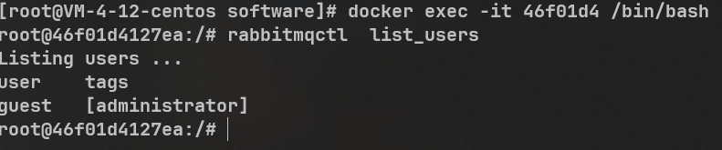  

运行`rabbitmqctl change_password [Username] [Newpassword]` 修改密码  


#### 5.ElasticSearch  
1.拉取镜像  
`docker pull elasticsearch:8.5.2`

2.在宿主机创建两个文件目录  
`mkdir -p ~/software/elasticsearch/plugins`  
`mkdir -p ~/software/elasticsearch/data`

3.运行容器  
```shell
docker run --name elasticsearch \
-p 9200:9200 \
-p 9300:9300 \
-e "discovery.type=single-node" \
-e ES_JAVA_OPTS="-Xms512m -Xmx512m" \
-e xpack.security.enabled=false \
-v ~/software/elasticsearch/plugins:/usr/share/elasticsearch/plugins \
-d elasticsearch:8.5.2
```

**解释:**
* 9200端口:HTTP协议(RESTful风格的接口)  
* 9300端口:TCP协议(主要是开放给java服务调用以及ES集群之间使用,微服务yml配置文件中配置该端口)  

4.停止容器  
`docker stop [containerId]`  

5.安装分词器插件  
分词器的下载见尚上优选  
将下载的分词器解压到~/elasticsearch/plugins 文件夹下(因为设置了挂载)  

`unzip -o -d [targetPath] [zipPath]`  解压zip到目标目录 -o 覆盖模式 -d 制定解压到的路径为(targetPath)  

当然可以先创建一个目录用于备份下载的分词插件压缩包,因为plugins目录下是不允许有压缩包的(只能有插件)  

6.进入容器
ElasticSearch8之后默认有权限验证,来到config/elasticsearch.yml配置文件,先备份该文件查看该文件内容:  
```yml
cluster.name: "docker-cluster"
network.host: 0.0.0.0

#----------------------- BEGIN SECURITY AUTO CONFIGURATION -----------------------
#
# The following settings, TLS certificates, and keys have been automatically
# generated to configure Elasticsearch security features on 16-09-2023 11:19:38
#
# --------------------------------------------------------------------------------

# Enable security features
xpack.security.enabled: true

xpack.security.enrollment.enabled: true

# Enable encryption for HTTP API client connections, such as Kibana, Logstash, and Agents
xpack.security.http.ssl:
  enabled: true
  keystore.path: certs/http.p12

# Enable encryption and mutual authentication between cluster nodes
xpack.security.transport.ssl:
  enabled: true
  verification_mode: certificate
  keystore.path: certs/transport.p12
  truststore.path: certs/transport.p12
#----------------------- END SECURITY AUTO CONFIGURATION -------------------------
```  

由于不好在容器内进行编辑,故先退出容器 来到容器外部  
在~/software/elasticsearch/config目录下创建elasticsearch.yml配置文件  
将配置改为以下内容:  
```yml
cluster.name: "docker-cluster"
network.host: 0.0.0.0

#----------------------- BEGIN SECURITY AUTO CONFIGURATION -----------------------
#
# The following settings, TLS certificates, and keys have been automatically
# generated to configure Elasticsearch security features on 16-09-2023 11:19:38
#
# --------------------------------------------------------------------------------

# Enable security features 是否开启权限校验
xpack.security.enabled: false

xpack.security.enrollment.enabled: false

# Enable encryption for HTTP API client connections, such as Kibana, Logstash, and Agents
xpack.security.http.ssl:
  enabled: false
  keystore.path: certs/http.p12

# Enable encryption and mutual authentication between cluster nodes 是否开启https
xpack.security.transport.ssl:
  enabled: false
  verification_mode: certificate
  keystore.path: certs/transport.p12
  truststore.path: certs/transport.p12
#----------------------- END SECURITY AUTO CONFIGURATION -------------------------
```
执行命令拷贝文件:  
`docker cp ./elasticsearch.yml [containerId]:/usr/share/elasticsearch/config `

7.重启容器
`docker start [containerId]`

#### 6.Nginx
1.拉取镜像  
`docker pull nginx`  

2.直接先启动(为了拷贝配置文件)  
*<font color="#00FF00">提示</font>:有的时候docker挂载配置文件,启动容器后会提示找不到conf,这是因为这种镜像在启动的时候并没有同步配置文件;那么一种解决方案就是先启动一个容器,把容器中的配置文件拷贝出来,然后把该容器删掉;之后再启动一次并且设置挂载*  
```shell
docker run \
-p 80:80 \
--name nginx \
-d nginx
```

3.拷贝文件  
```shell
mkdir {~/software/nginx,~/software/nginx/html,~/software/nginx/logs}
# 把containerID替换为你的NGINX镜像id
docker container cp [containerID]:/etc/nginx ~/software/nginx/conf/
```

4 停止容器删除容器  
```shell
docker stop [containerID]
docker rm [containerID]
```

5 启动nginx  
```shell
docker run -p 9001:80 --name nginx \
-v ~/software/nginx/html:/usr/share/nginx/html \
-v ~/software/nginx/logs:/var/log/nginx \
-v ~/software/nginx/conf:/etc/nginx \
-d nginx
```

此时访问`LinuxIP:9001`就能够看到nginx的响应信息了  


### C. Docker安装教程  
**目录:**  
1.1 安装docker  
1.2 安装JDK  

#### 1.1 安装docker  
*提示:内核版本需要3.8以上,通过uname -r命令查看当前Linux的内核版本*  

1.安装GCC  
*提示:该步骤非必要*  
```shell
yum -y install gcc \
yum -y install gcc-c++
```

2.卸载系统之前的 docker
```shell
sudo yum remove docker \
docker-client \
docker-client-latest \
docker-common \
docker-latest \
docker-latest-logrotate \
docker-logrotate \
docker-engine
```

3.安装Docker-CE
```shell
sudo yum install -y yum-utils \
device-mapper-persistent-data \
lvm2
```

4.设置docker-repo的yum位置(设置镜像仓库)
```shell
sudo yum-config-manager \
--add-repo \
https://download.docker.com/linux/centos/docker-ce.repo
```

5.安装docker引擎
```shell
sudo yum install docker-ce docker-ce-cli containerd.io
```

6.启动docker
```shell
sudo systemctl start docker
```

7.开机自启docker
```shell
sudo systemctl enable docker
```

8.配置阿里云镜像 **一共四条命令**  
```shell
sudo mkdir -p /etc/docker
```
```shell
sudo tee /etc/docker/daemon.json <<-'EOF'
{
"registry-mirrors": ["https://82m9ar63.mirror.aliyuncs.com"]
}
EOF
```
```shell
sudo systemctl daemon-reload
```
```shell
sudo systemctl restart docker
```

**提示:** 这里的镜像加速地址可以配置成个人的镜像加速地址,详情见2.3 本地镜像发布到阿里云=>2.2 配置镜像加速地址

9.卸载docker  
```shell
systemctl stop docker \
yum remove docker-ce docker-ce-cli containerd.io \
rm -rf /var/lib/docker \
rm -rf /var/lib/containerd \
```


#### 1.2 安装JDK  
**详情可以看附录B的安装及各种参数解释**    

1.docker仓库[https://hub.docker.com/search?q=](https://hub.docker.com/search?q=)  

2.拉取JDK17镜像  
```shell
docker pull openjdk:17
```

3.查看所有镜像  
```shell
docker images
```
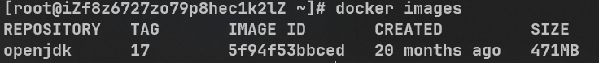  

4.启动容器  
```shell
docker run --name openjdk17 \
-v /jdk/bin:
-d openjdk:17
```

5.进入容器  
```shell
docker exec -it bf80164 /bin/bash
```
bf80164是容器的id(不是镜像的id);后面的bin/bash是必须的  

6.将