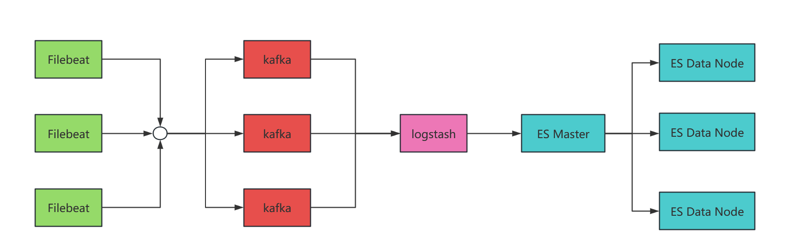
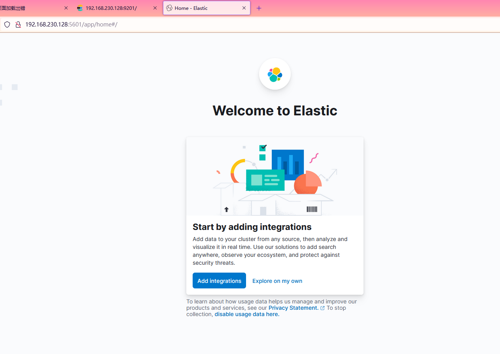
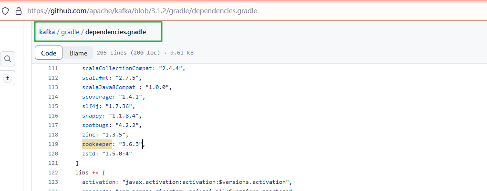
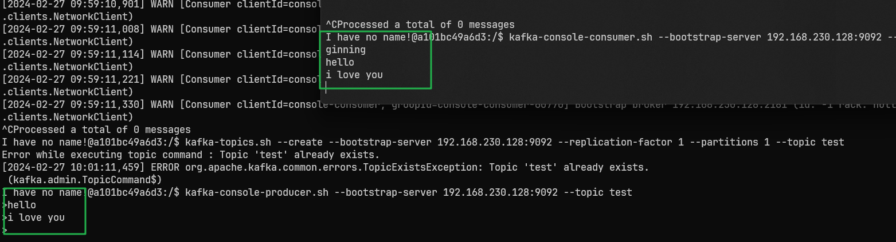
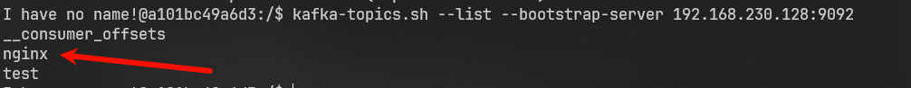
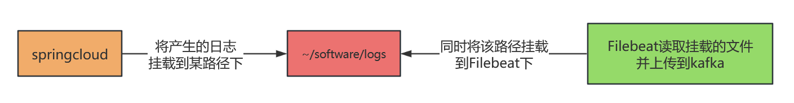
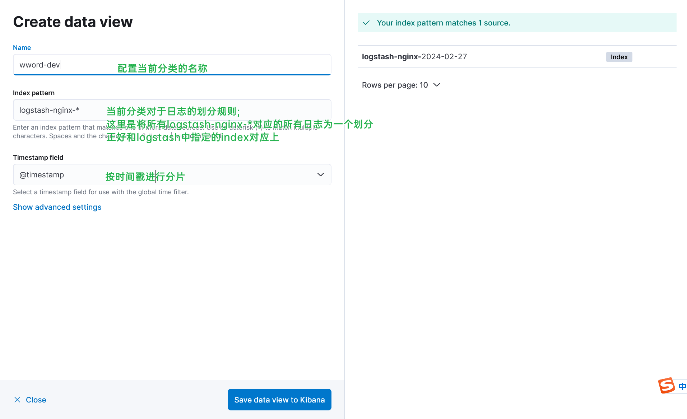
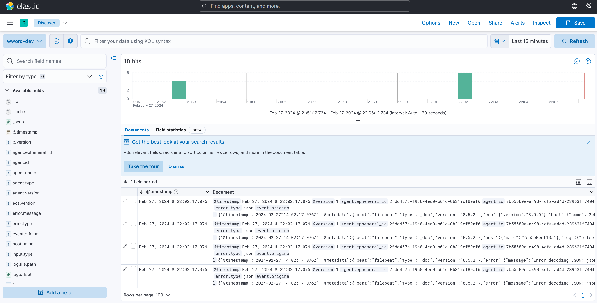

# 目录  
1.ELK基本环境搭建  


## 1.ELK基本环境搭建  
**目录:**  
1.1 ELK介绍  
1.2 安装ElasticSearch集群  
1.3 部署Kibana  
1.4 部署zookpeer集群  
1.5 部署kafka集群  
1.6 部署Logstash  
1.7 部署Filebeat  


### 1.1 ELK介绍
1.组件介绍  
* ElasticSearch:<font color="#00FF00">分布式</font>多用户搜索引擎
* Logstash:用于日志收集、分析、过滤的工具
* Kibana:ElasticSearch的图形化界面
* Filebeat:基于Logstash的一款轻量级<font color="#00FF00">数据收集引擎</font>
* Kafka:消息队列,<font color="#FF00FF">在ELK中起到缓冲</font>;接收日志并同步到ElasticSearch中,防止Logstash对服务端造成过大的压力
* Zookeeper:注册中心,这里<font color="#00FF00">作为Kafka的注册中心</font>

2.架构图  
  

**解释:**  
最开始先从<font color="#00FF00">Filebeat</font>采集日志,将收集到的日志发送到<font color="#FF0000">kafka</font>中再由<font color="#FF00FF">Logstash</font>处理日志并将日志发送到<font color="#00FFFF">ES集群</font>中进行保存最终使用<font color="#FFC800">Kibana</font>将数据进行展示  

**kafka消息堆积**  
如果消息在消费的过程中在kafka中产生了堆积,那么一般从两个方面来考虑:  
* kafka本身性能不足,考虑增加kafka集群数量
* logstash处理消息的性能不足

### 1.2 安装ElasticSearch集群  
**目录:**  
1.2.1 安装ElasticSearch集群(单机)  
1.2.2 安装ElasticSearch集群(集群)  

#### 1.2.1 安装ElasticSearch集群(单机)
1.拉取镜像  
`docker pull elasticsearch:8.5.2`  

2.在宿主机创建目录  
`mkdir -p ~/software/elk/elasticsearch/config`  
`mkdir -p ~/software/elk/elasticsearch/data`  

3.运行容器  
```shell
docker run \
--name elk-elasticsearch \
-p 9201:9200 \
-p 9302:9300 \
-e "discovery.type=single-node" \
-e ES_JAVA_OPTS="-Xms512m -Xmx512m" \
-e xpack.security.enabled=false \
-d elasticsearch:8.5.2
```

4.将容器中的配置拷贝到宿主机  
```shell
# 把containerID替换为容器的id
docker container cp [containerID]:/usr/share/elasticsearch/config ~/software/elk/elasticsearch
docker container cp [containerID]:/usr/share/elasticsearch/data ~/software/elk/elasticsearch
docker container cp [containerID]:/usr/share/elasticsearch/logs ~/software/elk/elasticsearch
```

5 停止容器删除容器  
```shell
docker stop [containerID]
docker rm [containerID]
```

6.启动ElasticSearch  
```shell
docker run \
--name elk-elasticsearch \
-p 9201:9200 \
-p 9301:9300 \
-e "discovery.type=single-node" \
-e ES_JAVA_OPTS="-Xms512m -Xmx512m" \
-e xpack.security.enabled=false \
-v ~/software/elk/elasticsearch/config:/usr/share/elasticsearch/config \
-v ~/software/elk/elasticsearch/logs:/usr/share/elasticsearch/logs \
-d elasticsearch:8.5.2
```

### 1.3 部署Kibana  
1.拉取镜像  
`docker pull kibana:8.5.2`  
*注意:这里的版本要和ElasticSearch的版本对应上*  

2.在宿主机创建目录  
`mkdir -p ~/software/elk/kibana/config`  

3.运行容器  
```shell
docker run \
--name elk-kibana \
-p 5601:5601 \
-d kibana:8.5.2
```

4.将容器中的配置拷贝到宿主机  
```shell
# 把containerID替换为容器的id
docker container cp [containerID]:/usr/share/kibana/config ~/software/elk/kibana
```

5 停止容器删除容器  
```shell
docker stop [containerID]
docker rm [containerID]
```

6.修改kibana配置文件内容  
进入~/software/elk/kibana/config;修改kibana.yml配置文件的内容如下:  
```yml
server.host: "0.0.0.0"
server.shutdownTimeout: "5s"
# 主要是修改elasticsearch的地址
elasticsearch.hosts: [ "http://192.168.230.128:9201" ]
monitoring.ui.container.elasticsearch.enabled: true
```

7.启动Kibana  
```shell
docker run \
--name elk-kibana \
-p 5601:5601 \
-v ~/software/elk/kibana/config:/usr/share/kibana/config \
-d kibana:8.5.2
```

8.访问kibana  
  

### 1.4 部署zookpeer集群
**解释:**  
部署kafka集群必须使用zookpeer集群作为注册中心,所以部署kafka集群之前必须部署zookpeer  

1.下载镜像  
`docker pull zookeeper:3.6.3`

2.运行容器  
```shell
docker run \
--name elk-zookeeper \
-p 2181:2181 \
-d zookeeper:3.6.3
```

### 1.5 部署kafka集群
1.如何根据kafka版本确定zookeeper的版本  
一般来到kafka的源码选择一个对应的版本,进入它的gradle目录下的dependencies.gradle文件进行查看  
  

2.下载镜像  
`docker pull bitnami/kafka:3.1.2`  

3.启动容器  
```shell
docker run \
--name elk-kafka \
-p 9092:9092 \
-e KAFKA_BROKER_ID=0 \
-e KAFKA_ZOOKEEPER_CONNECT=192.168.230.128:2181 \
-e KAFKA_ADVERTISED_LISTENERS=PLAINTEXT://192.168.230.128:9092 \
-e KAFKA_LISTENERS=PLAINTEXT://0.0.0.0:9092 \
-e KAFKA_OFFSETS_TOPIC_REPLICATION_FACTOR=1 \
-e ALLOW_PLAINTEXT_LISTENER=yes \
-d bitnami/kafka:3.1.2
```
*提示:把IP替换为zookpeer集群的IP*  

4.测试kafka消息队列  
开两个单独的窗口分别执行`docker exec`命令进入kafka容器中  
第一个窗口先执行`kafka-topics.sh --create --bootstrap-server 192.168.230.128:9092 --replication-factor 1 --partitions 1 --topic test`命令创建一个名为test的主题  
接着第一个窗口执行`kafka-console-producer.sh --bootstrap-server 192.168.230.128:9092 --topic test`命令,等待向test主题中生产消息  
最后第二个窗口执行`kafka-console-consumer.sh --bootstrap-server 192.168.230.128:9092 --topic test --from-beginning`对test主题进行监听并消费消息  

最终实现效果如下:  
  

### 1.6 部署Logstash
1.下载镜像  
`docker pull logstash:8.5.2`  
*注意:这里的版本要和ElasticSearch的版本对应上*  

2.在宿主机创建目录  
`mkdir -p {~/software/elk/logstash/config,~/software/elk/logstash/pipeline}`  

3.运行容器  
```shell
docker run \
--name elk-logstash \
-d logstash:8.5.2
```

4.将容器中的配置拷贝到宿主机  
```shell
# 把containerID替换为容器的id
docker container cp [containerID]:/usr/share/logstash/config ~/software/elk/logstash/
docker container cp [containerID]:/usr/share/logstash/pipeline ~/software/elk/logstash/
```

5 停止容器删除容器  
```shell
docker stop [containerID]
docker rm [containerID]
```

6.修改logstash配置文件内容  
主要修改input和output两个配置文件,input表示从kafka消息队列中读取数据,output表示logstash将处理完的数据发送到ElasticSearch中  
进入~/software/elk/logstash/config;修改logstash.yml配置文件的内容如下:  
```shell
http.host: "0.0.0.0"
xpack.monitoring.elasticsearch.hosts: [ "http://192.168.230.128:9201" ]
```

修改logstash.conf配置文件的内容如下:  
```shell
input {
  # 从kafka作为input输入
  kafka {
    # 指定类型
    type => "nginx_kafka"
    codec => "json"
    # 主题的名称
    topics => "nginx"
    decorate_events => true
    bootstrap_servers => "192.168.230.128:9092"
  }
  # redis{} 从redis中读取、nginx{} 从nginx中读取
}

output {
  if [type] == "nginx_kafka" {
    elasticsearch {
      # 如果是集群则逗号隔开
      hosts => ["192.168.230.128:9201"]
      # 指定日志输入到elasticsearch时使用的索引
      index => 'logstash-nginx-%{+YYYY-MM-dd}'
    }
  }
}
```


7.启动logstash  
```shell
docker run \
--name elk-logstash \
-v ~/software/elk/logstash/config:/usr/share/logstash/config \
-v ~/software/elk/logstash/pipeline:/usr/share/logstash/pipeline \
-d logstash:8.5.2
```

8.验证logstash是否启动成功  
进入kafka容器中执行`kafka-topics.sh --list --bootstrap-server 192.168.230.128:9092`命令查看当前消息队列中所有的topic;  
*提示:该命令后面的IP替换为zookeeper的IP和端口而不是kafka*  
执行效果如下:  
  


### 1.7 部署Filebeat
*提示:Filebeat在K8S中可以使用边车代理模式,因为日志收集工具需要在每一个微服务中进行部署,它是一个守护进程*  
**介绍:**  
由于Logstash是跑在JVM上⾯,资源消耗比较大,后来作者用GO写了⼀个功能较少但是资源消耗也⼩的轻量级的Agent叫Logstash-forwarder.  
之后作者加⼊elastic.co公司,Logstash-forwarder的开发⼯作给公司内部GO团队来搞,最后命名为Filebeat.  
<font color="#00FF00">所以Filebeat是一个轻量级高性能的日志采集工具</font>  

1.Docker部署Filebeat原理  
Filebeat的原理是读取操作系统某路径下的一个文件,所以可以将容器内Filebeat读取的路径挂载到宿主机上,而宿主机上该路径又被我们的应用所挂载  
  

2.下载镜像  
`docker pull elastic/filebeat:8.5.2`  
*注意:这里的版本要和ElasticSearch的版本对应上*

3.在宿主机创建目录  
`mkdir -p {~/software/elk/filebeat,~/software/logs}`  

4.运行容器  
```shell
docker run \
--name elk-filebeat \
-d elastic/filebeat:8.5.2
```

4.将容器中的配置拷贝到宿主机  
```shell
# 把containerID替换为容器的id
docker container cp [containerID]:/usr/share/filebeat/filebeat.yml ~/software/elk/filebeat/
```

5 停止容器删除容器  
```shell
docker stop [containerID]
docker rm [containerID]
```

6.修改filebeat.yml配置文件  
```yml
filebeat.inputs:
  - type: log
    enabled: true
    paths:
      # 注意该路径是filebeat要读取的日志路径;需要挂载到宿主机
      - /usr/share/filebeat/service-logs/*.log
    # 可以让字段位于根节点
    json.keys_under_root: true
    # 对于同名的key,覆盖原有的key
    json.add_error_key: true
    # 将解析错误的消息记录存储在error.message字段中
    json.message_key: log

filebeat.config:
  modules:
    path: ${path.config}/modules.d/*.yml
    reload.enabled: false

processors:
  - add_cloud_metadata: ~
  - add_docker_metadata: ~

# 输出到kafka
output.kafka:
  hosts: ["192.168.230.128:9092"]
  # 注意主题是nginx
  topic: 'nginx'
```

7.启动容器  
```shell
docker run \
--name elk-filebeat \
-v ~/software/elk/filebeat/filebeat.yml:/usr/share/filebeat/filebeat.yml \
-v ~/software/logs/:/usr/share/filebeat/service-logs/ \
-d elastic/filebeat:8.5.2
```

8.启动nginx  
*提示:这里启动nginx产生一些日志输出到~/software/logs/这个路径下供采集*  

8.1 创建目录:`mkdir {~/software/nginx,~/software/nginx/html,~/software/nginx/logs}`  

8.2 启动nginx  
```shell
docker run -p 9001:80 --name nginx \
-v ~/software/nginx/html:/usr/share/nginx/html \
-v ~/software/logs:/var/log/nginx \
-v ~/software/nginx/conf:/etc/nginx \
-d nginx
```
*注意:这里需要把nginx的日志目录挂载到宿主机对应被logstash挂载的目录上*  

9.配置kibana  
此时点击kibana左侧菜单栏的discover就可以看到如下界面,如果没有成功是不会显示该界面的,kibana会让你导入数据  
  
点击按钮之后进入如下界面  

  

打印成功!  
  


