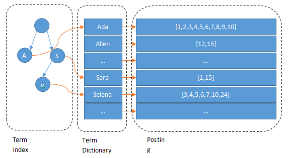

# 目录:  
1.常用注解  

**附录:**  
A.ElasticSearch基本环境搭建  
B.八股文  
C.ElasticSearch命令大全  

## 1. 常用注解


1.参考文章[https://blog.csdn.net/u013089490/article/details/84323762?ydreferer=aHR0cHM6Ly9ibG9nLmNzZG4ubmV0L3dlaXhpbl81MjQyNDIzNi9hcnRpY2xlL2RldGFpbHMvMTMxMDUxODA3](https://blog.csdn.net/u013089490/article/details/84323762?ydreferer=aHR0cHM6Ly9ibG9nLmNzZG4ubmV0L3dlaXhpbl81MjQyNDIzNi9hcnRpY2xlL2RldGFpbHMvMTMxMDUxODA3)  
```java
@Persistent
@Inherited
@Retention(RetentionPolicy.RUNTIME)
@Target({ElementType.TYPE})
public @interface Document {
    //索引库名称
    String indexName();
    //类型
    String type() default "";
    //
    boolean useServerConfiguration() default false;
    //默认分片数5
    short shards() default 5;
    //默认副本数1
    short replicas() default 1;
    //刷新间隔
    String refreshInterval() default "1s";
    //索引文件存储类型
    String indexStoreType() default "fs";
   //是否创建索引
    boolean createIndex() default true;
}
```

## 附录
A.ElasticSearch基本环境搭建  
B.八股文  
C.ElasticSearch命令大全  


### A.ElasticSearch基本环境搭建
**目录:**  
1.安装SlasticSearch  
2.编辑配置文件  

#### 1. 安装SlasticSearch
docker安装,详情见[Docker.md](Docker.md)附录=>B.常用docker镜像大全=>5.ElasticSearch  

#### 2. 编辑配置文件  
1.ElasticSearch8之后默认有权限验证,来到config/elasticsearch.yml配置文件.编辑如下配置:  
```yml
xpack.security.enabled: false #是否开启权限校验
xpack.security.enrollment.enabled: false
xpack.security.http.ssl: 
  enabled: false #是否开启https
xpack.security.transport.ssl:
  enabled: false
```

2.调整ElasticSearch启动时的JVM内存大小  
官方推荐的做法是将config目录下的jvm.options配置文件先拷贝到同目录下的jvm.options.d目录下(即`cp jvm.options ./jvm.options.d/`)  
编辑jvm.options配置文件,在里面添加:    
```properties
-Xms1g
-Xmx1g
```


### B.八股文  
**目录:**  
1.倒排索引机制  


#### 1. 倒排索引机制
它十分适用于**全文检索**的情况,例如数据库中存储了5条记录,分别是:  
1.红海行动  
2.探索红海行动  
3.红海特别行动  
4.红海记录篇  
5.特工红海特别探索  
然后ElasticSearch会对它们进行分词并形成一个所谓的倒排索引:  
|   词   |   记录    |
| :----: | :-------: |
|  红海  | 1,2,3,4,5 |
|  行动  |   1,2,3   |
|  探索  |    2,5    |
|  特别  |    3,5    |
| 纪录片 |     4     |
|  特工  |     5     |

查询的请求是:红海特工行动
通过分词器,把红海特工行动拆分为三个单词,分别是红海、特工、行动.  
然后这三个单词匹配到的记录是第1行的1,2,3,4,5;第5行的5;第2行的1,2,3.  
最后根据相关性得分得出结果,这里会发现第3条和第5条记录都匹配到了两个词.但是第三条记录中一共6个字我们的搜索词占了4个,也就是它的占比达到2/3.而第5条记录,一共8个字我们的搜索词也占了4个,它的占比达到了1/2.所以最终会发现第3条记录的相关性更高.  
<font color="#00FF00">也就是说它会根据词来找对应关联的文章(文档)</font>  
但问题是现实中的单词数量太多了,如果每次搜索都需要完整遍历单词列表然后找出对应的文档id,效率实在太慢;于是乎需要对单词进行排序,就像B+树一样.  
但仅仅排序是不够的,因为单词都存放在磁盘上,而磁盘的IO速度又太慢,那如果直接把单词信息放入内存;内存直接就爆炸了也放不下,于是乎:  
  
即倒排索引在单词上又加了一层字典树`[term index]`,它存储所有的单词只存储单词前缀,通过字典树找到单词所在的块(即单词所在的位置),再在块里二分查找找到对应的单词,再找到单词对应的文档列表.  
所以只有字典树`[term index]`是存放于内存中的,并且ES还使用FST对其进一步压缩以节省内存.  
**而如果这些搜索用MySQL来实现则会十分复杂,而且效率也未必高**  


### C.ElasticSearch命令大全
**目录:**  


