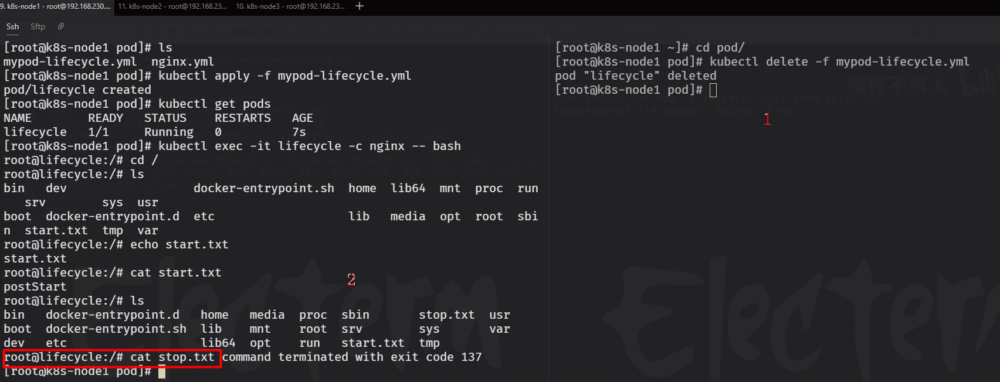
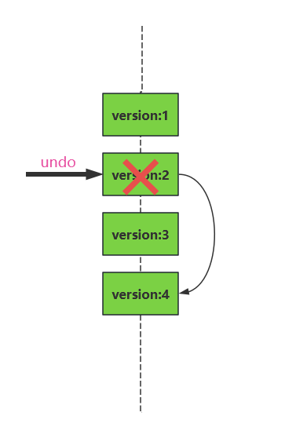
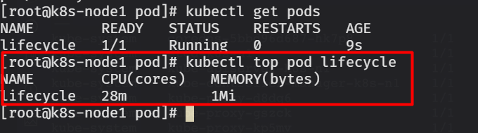

# 目录:
1.Pod  
2.Controller控制器  
3.Service  
4.存储  

**附录:**  
A.K8S基本环境搭建  


## 1.Pod  
**目录:**  
1.1 Pod的基本介绍  
1.2 声明式Pod  
1.3 Pod的标签(labels)  
1.4 Pod的生命周期  
1.5 容器特性  
1.6 init容器  
1.7 指派Pod到指定节点上  


### 1.1 Pod的基本介绍
Pod是可以在kubernetes中创建和管理的<font color="#00FF00">最小的可部署的计算单元</font>Pod是一组容器  
最主要的问题是docker的容器相互之间是比较隔离的,<font color="#00FF00">而Pod中运行的容器可以共享存储、网络以及怎样运行这些容器的声明;并且可以共享运行的上下文环境</font>  

1.Pod管理多容器的方式  
Pod中的容器被自动地安排到集群中的同<font color="#00FF00">一个</font>服务器上,并且可以一起进行调度  
  
有如图所示的系统,它由两个容器组成其中的WEB容器用于向用户提供文件浏览服务,而另外一个文件拉取程序从网络收集文件,<font color="#00FF00">这样Pod定义了两个容器,其中一个容器允许读取数据卷,一个容器允许写入数据卷</font>  

2.如何使用Pod  
K8S中的Pod有两种用法  
* 运行单个容器的Pod:每个Pod只运行一个容器,在这种情况下可以将Pod看作单个容器的包装器,并且K8S直接管理Pod而不是容器   
* 运行多个协作容器的Pod:相当于在一个Pod中允许多个容器,创建多个Pod是实现不是Pod本身来完成的,而是通过Deployment、Job等组件来创建Pod

### 1.2 声明式Pod
*提示:K8S推荐使用声明式的yml来创建pod,也就是容器编排*  

1.创建一个nginx相关的podYml   
创建yml配置文件,~/nginx-pod.yml  
```yml
# nginx-pod.yml
#表示API版本
apiVersion: v1
#代表创建类型
kind: Pod
#用来书写元数据信息 这里指定pod的名称为nginx
metadata:
  name: nginx
spec:
  containers:
    # 指定pod中容器的名称为nginx,指定镜像、指定端口
    - name: nginx
      image: nginx:1.19
      ports:
      - containerPort: 80
```

编写完毕退出保存,执行`kubectl apply -f nginx-pod.yml`命令来创建pod

2.podYml文件的组成  
上述第1步中的yml由以下几个内容组成,启动status是非必须的,其余都是必须  
* apiVersion:api的版本,对于pod类型的yml;版本固定为1
* kind:表示当前配置文件的类型,例如上述为Pod表明当前配置是创建pod的配置文件
* metadata:元数据
* spec:对Pod预期行为的约束
* status:最近观察到的Pod的装填(非必须)

3.使用IDEA插件生成podYml  
首先进入IDEA安装Kubernetes插件  
  
安装完成后再任意目录下创建一个yml(文件名称随意),接着在该yml中输入kpod会有提示  
  
回车后创建的内容如下,此时就会生成对应的模板  
  

**注意:** <font color="#00FF00">这里有一个labels标签,它的意思是给当前的Pod加标签</font>, 当前标签内的值是任意的;使用的K-V键值对的方式指定

4.使用IDEA连接linux  
工具=>部署=>浏览远程主机=>在弹出的界面选择三个小点新增SFTP=>按步骤输入相关内容连接linux=>注意要点击自动检测(Autodetect)  

5.在Pod中允许多个容器  
*提示:推荐使用IDEA的插件编写podYml配置文件*  
在~/pod目录下创建PodYml配置文件,内容如下  
```yml
apiVersion: v1
kind: Pod
metadata:
  name: mypod
  labels:
    app: mypod
spec:
  # containers是一个数组,在YML中指定数组的方式用-
  containers:
    - name: nginx
      image: nginx:1.19
      imagePullPolicy: IfNotPresent
      ports:
        - containerPort: 80

    - name: redis
      image: redis:5.0.10
      imagePullPolicy: IfNotPresent
      ports:
        - containerPort: 6379

  restartPolicy: Always

```

<font color="#00FF00">将创建的配置文件使用IDEA拖拽上传到linux</font>,然后执行`kubectl apply -f nginx-pod.yml`命令来创建多容器pod

### 1.3 Pod的标签(labels)
1.标签的基本概念介绍  
标签(labels)是附加到kubernetes对象(比如Pod)上的<font color="#FF00FF">键值对</font>,<font color="#00FF00">标签可以在创建时附加到对象,也可以在运行时创建</font>;标签的作用说白了就是给K8S中的对象起别名,有了别名就可以过滤和筛选  

2.标签的语法介绍  
* 必须为63个字符或者更少
* 除非标签值为空,必须以字母数字字符开头和结尾
* 可以包含破折号(-)、下划线(_)、点(.)和字母或数字

3.示例  
```yml
apiVersion: v1
kind: Pod
metadata:
  # 指定KV键值对
  app: myapp
spec:
  containers:
    - name: nginx
      image: nginx:1.19
      ports:
      - containerPort: 80
```

### 1.4 Pod的生命周期
1.Pod的生命周期基本介绍  
Pod最开始的状态为`Pending`,如果Pod中至少有一个主要容器正常启动,则进入`Running`状态;之后取决于Pod中是否有容器以失败状态结束而进入`Succeeded`或者`Failed`状态(<font color="#00FF00">如果所有容器都成功就是Succeeded,否则就是Failed</font>);与此同时Pod再其生命周期只会被调度一次,一旦Pod被调度到某个节点运行(即Succeeded状态后),则Pod会一直在该节点运行,直到Pod停止或者被终止

如果一个节点宕机了,则运行在该节点的Pod将会在一段时间(超时时间)后被删除  
Pod自身<font color="#00FF00">不具有自愈能力,如果Pod被调度到的节点失效了,则该Pod会被删除</font>,<font color="#FF00FF">K8S使用控制器来管理这些会被随时抛弃的Pod对象</font>  

K8S中有很多对象,例如Pod、存储卷等;如果某个K8S对象声明自已的声明周期与某个Pod相同,那么该K8S对象在Pod存在的期间是会一直存在的,如果Pod因为任何原因被删除或替换,则该K8S对象也会被删除  

2.Pod的阶段(状态)  
|      取值       |                                                         描述                                                          |
|:---------------:|:---------------------------------------------------------------------------------------------------------------------:|
|  Pending(悬决)  | Pod已被Kubernetes系统接受,但有一个或者多个容器尚未创建亦未运行.此阶段包括等待Pod被调度的时间和通过网络下载镜像的时间. |
| Running(运行中) |           Pod已经绑定到了某个节点,Pod中所有的容器都已被创建.至少有一个容器仍在运行,或者正处于启动或重启状态           |
| Succeeded(成功) |                                      Pod中的所有容器都已成功终止,并且不会再重启.                                      |
|  Failed(失败)   |          Pod 中的所有容器都已终止,并且至少有一个容器是因为失败终止.也就是说,容器以非0状态退出或者被系统终止.          |
|  Unknow(未知)   |                       因为某些原因无法取得Pod的状态.这种情况通常是因为与 Pod 所在主机通信失败.                        |

> 1.当一个Pod被删除时,执行kubectl命令会展示这个Pod的状态为Terminating(终止),这个Terminating状态<font color="#00FF00">并不是Pod阶段之一</font>,这表明Pod可以以一种优雅的方式终止,可以使用`--force`参数来强制终止该Pod
> 2.如果某节点宕机或与集群中的其它节点失联,K8S会实施一种策略,将失去节点上运行的所有Pod的阶段设置为Faild

### 1.5 容器特性
**目录:**  
1.5.1 容器的生命周期  
1.5.2 容器重启策略  
1.5.3 自定义容器启动命令  
1.5.4 容器探针  
1.5.5 容器资源限制  


#### 1.5.1 容器的生命周期
K8S会跟踪Pod中每个容器的状态,容器在不同的生命周期会触发<font color="#00FF00">事件回调</font>,那么就可以在容器的不同阶段编写相应的回调事件  
容器一共有三种状态:<font color="#00FF00">Waiting(等待)、Running(运行)、Terminal(终止)</font>  
可以通过支持`kubectl describe pod [podName]` 命令来查看Pod中每个容器的状态  

1.状态详解  
* Waiting(等待):当容器处于waiting状态时,<font color="#00FF00">表明容器仍在运行它完成启动所需要的操作</font>;例如从某个容器镜像仓库拉取容器镜像,或者向容器应用secret数据等.通过`kubectl`查询waiting状态的容器,可以通过返回的reason字段得到当前waiting的原因  
* Running(运行中):该状态表明容器正在运行状态,并且在running状态之前,它对应的回调事件`postStart`会先执行完毕  
* Terminal(终止):处于Terminal状态的容器已经正常退出或者因为某些原因失败;并且它对应的回调事件`preStop`会在容器进行Terminal状态之前执行
  应用场景:比如说在容器结束之前需要释放连接资源等情况  

*提示:也就是说所有的回调事件都是在进入该状态之前执行的*  

2.容器生命周期的回调  
容器对外暴露两个回调函数:  
* `PostStart` 这个回调在<font color="#00FF00">容器创建的刹那</font>立即被执行,也就是说<font color="#FF00FF">该方法不能保证是在容器创建之前还是在容器创建之后执行</font>
* `PreStop` 在容器因API请求(K8S关闭容器指令)或者管理事件(诸如存活态探针、启动探针失败、资源抢占、资源竞争等)而被终止之前,此回调会被调用.如果容器已经处于已终止状态,则对PreStop回调的调用将失败,在用来停止容器的`TERM`信号被发出之前,回调必须执行结束.<font color="#00FF00">无论回调函数的执行结果如何,容器最终都会在Pod的终止宽限期内被终止</font>  

**使用方法:**  
```yml
apiVersion: v1
kind: Pod
metadata:
  name: lifecycle
spec:
  containers:
    - name: nginx
      image: nginx:1.19
      lifecycle:
        # 容器创建的过程中执行
        postStart: 
          exec:
            # command表示回调函数是执行命令,注意command实际上是一个JSON形式数组
            command: [ "/bin/sh","-c","echo postStart >> /start.txt" ]
            # 实际上还有别的类型的回调函数
        # 容器终止之前执行
        preStop:
          exec:
            command: [ "/bin/sh","-c","echo postStop >> /stop.txt && sleep 30" ]
      imagePullPolicy: IfNotPresent
      ports:
        - containerPort: 80
```

*提示:这些命令是在容器内部执行的,所以这里通过echo创建的文件是在容器内部创建的,和宿主机没有关系*  

**运行测试:**  
  
可以看到start.txt成功创建了  
  
可以看到先在右侧执行销毁Pod,接着在左侧就能看到这个stop.txt的内容了,容器不会立即销毁而是会等待30s再销毁  


#### 1.5.2 容器重启策略
*提示:说容器的重启策略有点不准确了,实际上应该称为Pod的重启策略,因为在一个Pod中不允许容器有不同的重启策略*  
容器的重启策略包括:Always(总是)、OnFailure(只有在容器是异常退出时才重启,即退出状态码是0时重启)、Never(不重启);默认的策略是Always  
kubelet重启时<font color="#00FF00">只会对当前节点进行重启</font>(即当前节点的Pod宕机了,不可能重启所有节点的Pod),当Pod重启时会延迟重启(10s、20s、40s);也就是说当容器宕机后10s内会重启一次,如果还是失败则20s内会重启,以此推类,上线为5分钟  
一旦容器运行了10分钟没有出现问题,则kubectl的重启技术会回到从10s开始  


#### 1.5.3 自定义容器启动命令
*提示:和docker-compose一样,K8S也可以通过command和args来修改容器启动时执行的命令,就类似docker-compose中的CMD和ENTRYPOINT命令,详情见docker笔记*
注意:<font color="#00FF00">command用于指定启动命令,args用于指定启动参数</font>  
```yml
apiVersion: v1
kind: Pod
metadata:
  name: redis
  labels:
    app: redis
spec:
  containers:
    - name: redis
      image: redis:5.0.10
      command: ["redis-server"] #用来指定启动命令
      args: ["--appendonly yes"] # 用来为启动命令传递参数
      #args: ["redis-server","--appendonly yes"] # 单独使用修改启动命令并传递参数
       # 另一种语法格式
      #args:                                    
      #  - redis-server
      #  - "--appendonly yes"
      imagePullPolicy: IfNotPresent
  restartPolicy: Always
```

#### 1.5.4 容器探针
1.介绍  
容器的探针就是用来<font color="#00FF00">定期对容器的监控状态进行检查的</font>,要进行检查可以通过两种手段,一种是在容器内部执行命令,一种是发出一个网络请求  
<font color="#FF00FF">个人理解为探针就是一种监控容器的心跳机制</font>,<font color="#00FF00">只不过心跳的"测量"方式不局限于传统的ping包</font>,如果心跳失败则K8S会执行相应的操作  

2.探针类型  
kubelet可以选择以下三种探针,以及如何针对探测结果做出反应  
* `livenessProbe`:指示容器是否正常运行,如果存活态探测失败,则kubelet会杀死容器,并且容器将根据其重启策略执行下一步操作,如果容器不提供存活探针,则默认状态为success
* `readinessProbe`:指示容器是否准备好为请求提供服务,如果就绪态探测失败,端点控制器将从与Pod匹配的所有服务的端点列表中删除该Pod的IP地址.如果容器不提供就绪态探针,则默认状态为success  
  如果没有设置就绪态,则当容器启动成功之后就认为它是启动成功了(success)
* `startupProbe`:指示容器中的应用是否已经启动

3.探测方式  
利用探针来检查容器有以下四种不同的方式(也就是第一步说的检查手段),每个探针都必须准确定义为这四种中的一种:  
* `exec`:在容器内执行指定命令,如果命令退出时返回码为0则认为诊断成功
* `grpc`:使用GRPC执行一个远程调用,目标应该实现gRPC健康检查.如果响应状态是service则认为诊断成功
* `httpGet`:对容器的IP上指定端口和路径执行GET请求,如果响应码在200-399之间则认为是成功的
* `tcpSocket`:对容器的IP地址上的端口进行TCP检查,如果端口打开则认为是成功的

*提示:上述的四种类型实际上就是对应,一种是在容器内部执行命令,一种是发出一个网络请求*  

4.探测结果  
* `Success`:成功(容器通过了诊断)
* `Failure`:失败(容器未通过诊断)
* `unknow`:未知(诊断失败,因此不会采取行动)

5.探针参数  
```yml
initialDelaySeconds: 5 # 初始化延时时间5s
periodSeconds: 4 # 检测间隔时间4s
timeoutSeconds: 1 # 默认检测超过时间为1s
failureThreshold: 3 # 默认失败次数为3次,达到3次后重启pod
successThreshold: 3 # 默认成功次数为1次,1次监控成功代表成功
```

*提示:这个探针不是说当容器启动成功后变为success就不探测了,实际上会间隔timeoutSeconds的时间一直循环探测*  

6.使用示例  
*提示:这里全部以livenessProbe探针为例进行说明,使用不同的探测方式来进行演示说明*  

6.1 <font color="#00FF00">exec</font>  
```yml
apiVersion: v1
kind: Pod
metadata:
  name: liveness-exec
  labels:
    exec: exec
spec:
  containers:
    - name: nginx
      image: nginx:1.19
      ports:
        - containerPort: 80
      # 启动参数,之前是使用Json数组的形式指定的,效果是一样的
      # 这一步会和初始化同时开始运行,也就是在初始化5s后和7秒之间,会检测出一次失败,7秒后启动后检测正常,所以pod不会重启
      args:
        - /bin/sh
        - -c
        - sleep 7;nginx -g "daemon off;"
      # 使用 livenessProbe 探针
      livenessProbe:
        # 这里使用 exec 执行 shell 命令检测容器状态
        exec:
          # 同理command是命令数组
          command:
            - ls
            - /var/run/nginx.pid  #查看是否有pid文件
        # 初始化时间5s
        initialDelaySeconds: 5
        # 检测间隔时间4s
        periodSeconds: 4
        # 默认检测超时时间为1s
        timeoutSeconds: 1
        # 默认失败次数为3次,达到3次后重启pod
        failureThreshold: 3
        # 默认成功次数为1次,1 次代表成功
        successThreshold: 1
      imagePullPolicy: IfNotPresent
```

**解释:**  
容器启动的时候会睡眠7s,而initialDelaySeconds参数指定探针5s后才进行检测(即运行ls命令查看是否有对应的pid文件,正常nginx启动后就会出现该文件,该文件是进程文件);第一次由于nginx还没有启动,所以探测失败,此时会等待4s后重试,发现存在该文件,探测成功1次此时探测结果为success  
如果启动的时候睡眠30s,则最终kubelet会重启pod(因为已经超过最大的重试次数),并且该pod永远无法启动  

6.2 <font color="#00FF00">tcpSocket</font>  
```yml
apiVersion: v1
kind: Pod
metadata:
  name: liveness-tcpsocket
  labels:
    tcpsocket: tcpsocket
spec:
  containers:
  - name: nginx
    image: nginx:1.19
    ports:
    - containerPort: 80
    args:
    - /bin/sh
    - -c
    - sleep 7;nginx -g "daemon off;"  #这一步会和初始化同时开始运行,也就是在初始化5s后和7秒之间,会检测出一次失败,7秒后启动后检测正常,所以pod不会重启
    imagePullPolicy: IfNotPresent
    livenessProbe:
      # 通过检测80端口是否占用来判断nginx是否成功启动
      tcpSocket:
        port: 80
      initialDelaySeconds: 5   #初始化时间5s
      periodSeconds: 4    #检测间隔时间4s
      timeoutSeconds: 1   #默认检测超时时间为1s
      failureThreshold: 3   #默认失败次数为3次,达到3次后重启pod
      successThreshold: 1   #默认成功次数为1次,1 次代表成功

#上述的讲解
#让命令睡眠7秒的同时,探针也开始初始化5秒,然后1秒检测,然后间隔4秒这是已经启动了,所有不会失败

```

6.3 <font color="#00FF00">httpGet</font>  
```yml
apiVersion: v1
kind: Pod
metadata:
  name: liveness-httpget
  labels:
    httpget: httpget
spec:
  containers:
  - name: nginx
    image: nginx:1.19
    ports:
    - containerPort: 80
    args:
    - /bin/sh
    - -c
    - sleep 7;nginx -g "daemon off;" #这一步会和初始化同时开始运行,也就是在初始化5s后和7秒之间,会检测出一次失败,7秒后启动后检测正常,所以pod不会重启
    imagePullPolicy: IfNotPresent
    # 发送HTTP请求,根据响应码来判断探测结果
    livenessProbe:
      httpGet:     #httpget
        port: 80   #访问的端口
        path: /index.html   #访问的路径
      initialDelaySeconds: 5   #初始化时间5s
      periodSeconds: 4    #检测间隔时间4s
      timeoutSeconds: 1   #默认检测超时时间为1s
      failureThreshold: 3   #默认失败次数为3次,达到3次后重启pod
      successThreshold: 1   #默认成功次数为1次,1 次代表成功
     
```

6.4 <font color="#00FF00">gPRC</font>  
> 官方参考地址: https://kubernetes.io/zh-cn/docs/tasks/configure-pod-container/configure-liveness-readiness-startup-probes/


#### 1.5.5 容器资源限制
**介绍:**  
我们需要对容器的资源进行限制,否则当一个容器需要大量计算资源时可能会对别的容器产生挤兑,导致别的容器无法正常运行  

1.资源限制  
K8S中对容器资源的限制主要分为以下两类:  
* 内存资源限制
  <font color="#00FF00">内存请求和内存限制</font>,保证容器拥有其请求的需要的内存大小,但不允许使用超出使用内存限制的内存
* CPU资源限制  
  <font color="#00FF00">CPU请求和CPU限制</font>,容器使用CPU不能超过配置的限制,如果系统有空闲的CPU时间则可以保证给容器分配它所需要的CPU请求

*提示:说白了请求就是一上来我能保证给到容器的资源,而限制是容器不能超过的资源*
<font color="#00FF00">一旦容器运行超过了该限制,则会kill掉容器 OOM异常</font>  

2.metrices-server  
执行`kubectl top pod [podName]` 可以查看Pod的资源占用情况
发现报错,这是因为默认K8S没有安装metrices-server这个APIService  
Kubernetes Metrics Server(Kubernetes指标服务器),它是一个可扩展的、高效的容器资源度量源.Metrics Server<font color="#00FF00">用于监控每个Node和Pod的负载</font>(用于Kubernetes内置自动扩缩管道).Metrics Server从Kubelets收集资源指标,并<font color="#00FF00">通过Metrics API在Kubernetes apiserver中公开</font>.  

**安装metrics-server**  
2.1 创建目录:`mkdir ~/metrics`  
2.2 进入目录,编写metrics-server.yml配置文件  
[点击跳转至配置文件](resources/K8S/metrics-components.yml)  
2.3 执行`kubectl apply -f metrics-components.yml` 安装metrics

当看到metrics运行成功后就代表安装成功  
  

3.查看Pod资源占用  
执行完第二步之后,再次执行`kubectl top pod [podName]`看到如下效果,这里查看的是之前容器生命周期那边的pod,即lifecycle  

4.指定内存请求和限制  
```yml
#内存资源的基本单位是字节（byte）.你可以使用这些后缀之一,将内存表示为 纯整数或定点整数：E、P、T、G、M、K、Ei、Pi、Ti、Gi、Mi、Ki. 例如,下面是一些近似相同的值：128974848, 129e6, 129M, 123Mi
apiVersion: v1
kind: Pod
metadata:
  name: nginx-memory-demo
spec:
  containers:
  - name: nginx-memory-demo
    image: nginx:1.19
    resources:
      requests:
        # 设置请求内存大小为100M
        memory: "100M" 
        # 设置最大内存大小为200M
      limits:
        memory: "200M"
```

如果容器没有指定内存限制
* 则容器可以无限制地使用内存,容器可以使用其所在节点所有可用的内存,进而可能导致该节点调用OOM杀死容器  
* Pod运行时是运行在某个命名空间上的,所以运行Pod所在的命名空间有默认的资源限制,那么容器会被自动分配默认限制
* 如果指定了内存限制没有指定内存请求则内存请求就是内存限制

5.指定CPU的请求和限制  
```yml
#CPU资源以CPU时间片作为单位.小数值是可以使用的.一个请求0.5 CPU的容器保证会获得请求1个CPU的容器的CPU的一半.你可以使用后缀m表示毫秒,例如100m CPU、100 milliCPU和0.1 CPU都相同;CPU 请求只能使用绝对数量,而不是相对数量.0.1 在单核、双核或 48 核计算机上的 CPU 数量值是一样的
# 说白了就是以时间片进行分配的 0.1 = 100ms
apiVersion: v1
kind: Pod
metadata:
  name: nginx-cpu-demo
spec:
  containers:
  - name: nginx-cpu-demo
    image: nginx:1.19
    resources:
      limits:
        # CPU限制时间片
        cpu: "1m"
      requests:
        # CPU请求时间片
        cpu: "5m"
```
如果容器没有指定CPU限制
* 则容器可以无限制地使用CPU,容器可以使用其所在节点所有可用的CPU 
* Pod运行时是运行在某个命名空间上的,所以运行Pod所在的命名空间有默认的CPU限制,那么容器会被自动分配CPU限制
* 如果指定了CPU限制没有指定CPU请求则CPU请求就是CPU限制


### 1.6 init容器
1.init容器的基本介绍  
一个Pod中可以运行多个容器,想nginx、redis这种都是正常的容器,除了这种容器之外还有一种特殊的容器称为<font color="#00FF00">init容器</font>  
Init容器在<font color="#00FF00">Pod内的所有应用容器启动之前运行</font>,init容器可以包括一些应用镜像不存在的实用工具和安装脚本  

2.作用  
init容器可以做一些预先的操作,例如在应用容器启动之前做一些预先的检查、执行预安装脚本  

3.init容器的特点  
* init容器必须运行完成,如果Pod中的init容器运行失败,则kubelet会不断地重启该init容器直到成功为止.
  如果init容器对应Pod的restartPolicy策略为`Nerver`,并且如果Pod中的Init容器运行失败,则kubernetes会将整个Pod状态设置为失败  
* <font color="#00FF00">一个Pod中的init容器可以为多个</font>
  每个init容器都必须在下个容器启动之前完成,当所有的init容器全部完成后K8S才会为Pod初始化应用容器并像平常一样运行
* 同时init容器<font color="#00FF00">不支持生命周期、探针</font>,因为init容器必须在Pod就绪之前完成
* Init容器支持应用容器的全部字段和特性(也就是在编写yml文件时,基本和`container`下面的字段一致),包括资源限制、数据卷和安全设置

4.使用init容器  
```yml
apiVersion: v1
kind: Pod
metadata:
  name: init-demo
spec:
  containers:
  - name: myapp-container
    image: busybox:1.28
    command: ['sh', '-c', 'echo The app is running! && sleep 3600']
  # 指定init容器
  initContainers:
  - name: init-myservice
    image: busybox:1.28
    command: ['sh', '-c', 'echo init-myservice is running! && sleep 5']
  - name: init-mydb
    image: busybox:1.28
    command: ['sh', '-c', 'echo init-mydb is running! && sleep 10']
```

5.运行测试  
在~/pod目录下创建init-pod.yml配置文件,并在配置文件中填入以上内容  
执行`kubectl apply -f init-pod.yml`  
运行结果如下:
  
依次启动两个init容器,最后启动应用容器  

### 1.7 指派Pod到指定节点上  
**目录:**  
1.7.1 指派方式说明  
1.7.2 使用标签将Pod分派到指定节点  
1.7.3 根据节点的名称将Pod分派到指定节点  
1.7.4 亲和性和反亲和性  
1.7.5 污点和容忍度  
1.7.6 Pod拓扑分布约束  


#### 1.7.1 指派方式说明
因为Pod默认的调度规则是由K8S完成的,所以某个Pod具体调度在哪个Node上是不知道的,所以为了能够指定Pod调度到某个节点上,我们可以使用以下几种方法:  
* 与节点标签匹配的nodeSelector(推荐),即使用标签的方式
  节点标签匹配就会被调度,<font color="#DDDD00">如果找不到节点标签则会等待不调度Pod</font>
* 亲和性和反亲和性
  亲和性相对节点标签没有那么强硬,<font color="#00FF00">使用节点亲和性可以把Pod分配到指定节点</font>
* nodeName(<font color="#DDDD00">不推荐</font>)
  直接写目标节点的名称
* Pod拓扑分布约束(根据地理位置来进行调度)

#### 1.7.2 使用标签将Pod分派到指定节点
1.执行以下命令给节点添加标签  
```shell
# 注意k8s-node2替换为自已真实的节点名称即可
kubectl label nodes k8s-node2 disk=ssd
kubectl label nodes k8s-node2 cpu=fast
kubectl label nodes k8s-node3 cpu=slow
# 添加完成之后,查看节点的标签情况
kubectl get nodes --show-labels
```

2.编写podYml时根据标签调度到指定节点上  
```yml
apiVersion: v1
kind: Pod
metadata:
  name: nginx-nodeselect
  labels:
    env: nodeselect
spec:
  containers:
  - name: nginx
    image: nginx:1.19
    imagePullPolicy: IfNotPresent
  # 指定调度到的目标节点的标签为disk=ssd,就是上面的k8s-node2节点
  nodeSelector:
    disk: ssd  
```


#### 1.7.3 根据节点的名称将Pod分派到指定节点
```yml
apiVersion: v1
kind: Pod
metadata:
  name: nginx
spec:
  # 指定调度到k8s-node3这个节点上
  nodeName: k8s-node3
  containers:
  - name: nginx
    image: nginx
    imagePullPolicy: IfNotPresent
```

同理如果没有该节点则同样会等待不会调度当前的Pod,直到出现了该node后会立即调度到该节点  


#### 1.7.4 亲和性和反亲和性
1.使用亲和性与反亲和性的好处:
* 亲和性和反亲和性的表达能力更强,亲和性与反亲和性能够在<font color="#00FF00">标签指定</font>的基础上提供更强的控制逻辑
* 亲和性与反亲和性在无法找到匹配的节点时仍然能够调度该Pod
  这点是和标签指定(nodeSelector)、节点名称(nodeName)区别下来的
* 可以使用节点上运行的其它Pod标签来实施调度约束,而不是只能使用节点本身的标签,<font color="#00FF00">也就是给某些Pod归类,让这些Pod运行在一起</font>  

2.亲和性的分类:  
* 节点亲和性:描述节点与Pod之间的亲和性
  节点的亲和性又分为如下两种
  * `requiredDuringSchedulingIgnoredDuringExecution`
    调度器(schedule)只有在规则被满足时才能执行调度,此功能类似于<font color="#00FF00">nodeSelector</font>但其语法表达能力更强
    <font color="#FF00FF">这种方式就可以理解是nodeSelector的增强版本</font>  
    *提示:在这种调度方式下,如果Pod已经被调度了,之后如果将标签删除则不会影响Pod的运行状态*  
  * `preferredDuringSchedulingIgnoredDuringExecution`:
    调度器会尝试寻找满足对应规则的节点,<font color="#00FF00">如果找不到匹配的节点,调度器仍然会调度该Pod</font>
* Pod间亲和性:描述Pod与Pod之间的亲和性
  这种调度和节点的关系不大,<font color="#00FF00">而是取决于目标节点上运行的Pod与当前Pod的亲和性</font>
  Pod间亲和性也分为如下两种  
  * `requiredDuringSchedulingIgnoredDuringExecution`
    使用这种亲和性策略来告知调度器,将两个服务的Pod放到同一个云提供商<font color="#00FF00">可用区内</font>,因为它们彼此之间通信非常频繁  
  * `preferredDuringSchedulingIgnoredDuringExecution`
    可以使用该策略将分配到同一个区的Pod尝试调度到同一台节点上  
    也可以使用该策略的反亲和性<font color="#00FF00">将同一个微服务的Pod调度到不同的云服务商的区域中</font>  


3.节点亲和性示例  
```yml
apiVersion: v1
kind: Pod
metadata:
  name: with-node-affinity
spec:
  affinity:
    # nodeAffinity:节点亲和性
    nodeAffinity:
    	# 必须包含
      requiredDuringSchedulingIgnoredDuringExecution: 
        nodeSelectorTerms:
        # 匹配对应的表达式
        - matchExpressions:
          # 目标node需要有key=disk
          # 并且对应的value必须是ssd或者superfast
          # 关于operator操作符的取值见下面
          - key: disk
            operator: In
            values:
            - ssd
            - superfast
       # 尝试包含,找不到也会调度
      preferredDuringSchedulingIgnoredDuringExecution:
      # 权重值,取值范围为1-100
      # 当调度时如果匹配到disk=machinery的会被优先调度,权重就是优先调度的比例
      - weight: 10
        preference:
          matchExpressions:
          - key: disk
            operator: In
            values:
            - ssd
      - weight: 90
        preference:
          matchExpressions:
          - key: disk
            operator: In
            values:
            - machinery
  containers:
  - name: nginx
    image: nginx:1.19
```
operator的取值见下面:  
* In:在这之中
* NotIn:不在这之中
  通过NotIn和DoesNotExist可以实现返亲和性的行为
* Exists:存在
* DoesNotExist:不存在
* LT:
* GT:

4.Pod间亲和性示例  
**域概念介绍:**  
  
假设现在分布式系统由各个地区的K8S集群组成,现在需要运行一个新的Pod,并且该Pod和nginx这个Pod亲和性高,我希望新的Pod运行在nginx运行的Pod上  
那么此时由于并不知道目标nginx运行在哪个节点上,所以需要挨个寻找,这样不方便;<font color="#00FF00">所以如果能够先指定目标节点在某个域上就会很方便</font>;就像 上图中的这样  
<font color="#FF00FF">具体实现起来也是通过打标签的形式来完成的</font>  

4.1 执行以下指令给节点打标签  
```shell
kubectl label nodes k8s-node2 region=bj
kubectl label nodes k8s-node3 region=sh
```

4.2 在k8s-node2(bj)节点上运行一个Pod  
```yml
apiVersion: v1
kind: Pod
metadata:
  name: nginx
  # 注意这里给Pod添加了一个nginx标签
  labels:
    app: nginx
spec:
  affinity:
    nodeAffinity:
      requiredDuringSchedulingIgnoredDuringExecution:
        nodeSelectorTerms:
          - matchExpressions:
              - key: region
                operator: In
                values:
                  - bj
  containers:
    - name: nginx
      image: nginx:1.19
```

4.3 Pod间亲和性调度  
```yml
apiVersion: v1
kind: Pod
metadata:
  name: redis
  labels:
    app: redis
spec:
  containers:
    - name: redis
      image: redis:5.0.10
      imagePullPolicy: IfNotPresent
  restartPolicy: Always
  affinity:
    # Pod间亲和性
    podAffinity:
      # 必须包含
      requiredDuringSchedulingIgnoredDuringExecution:
        # 调度到的目标节点必须要有region这个key
        - topologyKey: region
          # 目标节点必须有app=nginx的标签Pod
          labelSelector:
            matchExpressions:
              - key: app
                operator: In
                values:
                  - nginx
      # 尝试包含
      preferredDuringSchedulingIgnoredDuringExecution:
        - podAffinityTerm:
            topologyKey: bj
            labelSelector:
              matchExpressions:
                - key: app
                  operator: In
                  values:
                    - nginx
          weight: 20
```

#### 1.7.5 污点和容忍度  
节点亲和性是Pod的一种属性,它使Pod被吸引到一类特定的节点;<font color="#00FF00">污点(Taint)</font>则相反,它使节点能够排斥一类特定的Pod  
容忍度(Toleration)是<font color="#00FF00">应用于Pod</font>,容忍度允许调度器调度带有对应污点的Pod,容忍度允许调度但不保证调度  
<font color="#FF00FF">容忍度就是Pod在上节点的时候能不能忍受它的污点</font>  

1.打污点  
执行`kubectl taint nodes [nodeName] [key]=[value]:[NoShedule]` 给nodeName打污点  

2.Pod设置容忍度  
```yml
# 设置容忍度
tolerations:
# 表示当前Pod能够忍受一个Node带有key1=value1这个污点
- key: "key1"
  operator: "Equal"
  value: "value1"
  effect: "NoSchedule"
```
operator为操作,可取值有:  
* Equal:相等
* Exists:存在Key,使用该操作符时不需要填写value,意思是能够忍受对应的key,value值随意

#### 1.7.6 Pod拓扑分布约束
> 参考: http://kubernetes.p2hp.com/docs/concepts/scheduling-eviction/topology-spread-constraints/


## 2.Controller控制器
**目录:**  
2.1 Controller控制器的基本介绍  
2.2 Deployment  
2.3 StatefulSet  
2.4 DaemonSet  
2.5 Job  


### 2.1 Controller控制器的基本介绍
1.什么是控制器  
在K8S中,<font color="#00FF00">控制器通过监控集群的公共状态,并致力于将当前状态转换为期望状态</font>  
例如:设置空调的温度为期望状态,房间实际的温度是当前状态;通过对设备的开关控制,温度自动调节让其当前状态接近期望状态  
K8S通常不会直接创建Pod,而是通过Controller来管理Pod;controller中定义了Pod的部署特性,比如有几个副本、在什么样的Node上运行  

2.控制器分类  
* `Deployment`:是最常用的Controller,Deployment可以管理Pod的多个副本并确保 Pod按照期望的状态运行
* `Daemonset`:用于<font color="#00FF00">每个Node最多只运行一个Pod副本的场景</font>;DaemonSet通常用于运行daemon(守护进程),例如日志采集
* `Statefuleet`:<font color="#00FF00">能够保证Pod的每个副本在整个生命周期中名称是不变的</font>,而其他Controller不提供这个功能.<font color="#00FF00">当某个Pod发生故障需要删除并重新启动时,Pod的名称会发生变化</font>,同时StatefuleSet会保证副本按照固定的顺序启动、更新或者删除
* `Job`:用于运行结束就删除的应用,而其他Controller中的Pod通常是长期持续运行

3.控制器是如何管理Pod的  
<font color="#00FF00">控制器通过label关联Pods</font>  
  
例如图中有三个节点,对应有两个控制器Deployment1和Deployment2;它们是通过标签来管理目标Pod  

4.控制器不能解决的问题  
* 不能为Pod提供网络服务  
  比如之前一直到本章结束的所有Pod示例,都无法访问Pod中的Nginx  
* 不能实现多个Pod间的负载均衡

目前所有的Pod都是不能访问的,而且K8S也没有提供类似docker中将容器的端口映射到宿主机的形式,而是通过为每个Pod指定不同的IP,后续通过<font color="#FF00FF">service最为统一的入口</font>来自动感知Pod对外暴露的情况,从而提供访问

### 2.2 Deployment  
**目录:**  
2.2.1 构建Deployment  
2.2.2 Deployment动态扩缩  
2.2.3 Deployment回滚  


#### 2.2.1 构建Deployment
1.概念介绍  
一个Dseployment为Pod和ReplicaSet提供声明式的更新能力  
你负责描述Deployment中的目标状态,而Deployment控制器以受控速率更改实际状态,使其变为期望状态  

2.创建Deployment  
*提示:在IDEA中可以输入kdep来快速创建Deployment模板*  
```yml
apiVersion: apps/v1
# 类型是Deployment
kind: Deployment
metadata:
  # controller的名字
  name: nginx-deployment
  # controller的标签,注意不是Pod的标签
  labels:
    app: nginx-deployment

spec:
  # 默认有几个副本,这里是3
  replicas: 3
  selector:
    # 选择控制器要控制带有哪些标签的Pod
    matchLabels:
      app: nginx
  # 下面就是类似Pod的配置信息,表示当前Deployment要控制哪些Pod
  # 注意,这里的值必须和上面的matchLabels指定的标签对应上
  template:
    metadata:
      name: nginx  #指定pod的名字
      labels:
        app: nginx #指定pod的标签
    spec:
      containers:
        - name: nginx #容器的名字
          image: nginx:1.21
          imagePullPolicy: IfNotPresent
      restartPolicy: Always
```

*提示:这个地方的标签很多可能会混淆,首先第一个标签是控制器自已的标签,第二个标签是指定控制器控制带有哪些标签的Pod(因为控制器是根据Pod的标签进行控制的),第三个标签就是给内部Pod打上的标签(和之前Pod那一章一样);<font color="#00FF00">另外第二个标签必须和第三个标签对应</font>*  

3.测试运行  
执行`kubectl apply -f nginx-deployment.yml` 创建Deployment控制器  

4.查看控制器  
  
可以看到这里的相关命令也发送了变化  
<font color="#00FF00">运行起来的deployment也是可以通过`kubectl get Pods`查看到的</font>  
所以可以理解为<font color="#DDDD00">Deployment(controller)=Deployment(controller)+Pod  </font>
所以在附录=>K8S相关命令 <font color="#FF00FF">既有Pod相关的又有Deployment相关的</font>  


#### 2.2.2 Deployment动态扩缩
1.查看controller控制副本数量  
* `kubectl get rs` 查看副本状态,该命令可以查看controller控制的Pod的数量信息;期望的副本数量、已经运行的副本数量
* `kubectl scale deployment [deploymentName] --replicas=[number]` 修改deployment的副本数量  
  * `deploymentName`:deployment的名称
  * `number`:需要修改的目标数量


#### 2.2.3 Deployment回滚
1.版本记录  
以下面这个deployment举例  
```yml
apiVersion: apps/v1
kind: Deployment
metadata:
  name: nginx-deployment
  labels:
    app: nginx-deployment
spec:
  replicas: 3
  selector:
    matchLabels:
      app: nginx
  template:
    metadata:
      name: nginx
      labels:
        app: nginx
    spec:
      containers:
        - name: nginx 
          image: nginx:1.21
          imagePullPolicy: IfNotPresent
      restartPolicy: Always
```
<font color="#00FF00">只有当spec.template下面的内容发生改变时才会触发Deployment的版本上线(例如这里Pod的标签和容器)</font>  

2.相关命令  
* `kubectl rollout status deployment [deploymentName]` 查看deployment的上线状态
* `kubectl rollout history deployment [deploymentName] --revision=[REVISION]` 查看deployment的历史版本信息
  * `--revision=[REVISION]` 查看指定版本(REVISION)的详情信息
* `kubectl rollout undo deployment [deploymentName] [--to-revision=[REVISION]]` 回退到指定版本
  * `--to-revision=[REVISION]` 回退到的指定版本,REVISION是版本号
    如果不填写当前参数,默认回退到上一个版本
* `kubectl rollout restart deployment [deploymentName]` 重新部署
* `kubectl rollout pause deployment [deploymentName]` 暂停运行,暂停后对deployment的修改不会立即生效(即使用apply命令应用deploymentYml配置文件不会立即生效),恢复后才应用设置
* `kubectl rollout resume deployment [deploymentName]` 恢复运行
* `kubectl rollout resume deployment [deploymentName]` 恢复运行

3.回退时的特性  
  
假设现在有三个版本1、2、3;现在要从版本3回退到版本2,<font color="#00FF00">则回退之后会创建一个新的版本4它的内容来自版本2,并且版本2将被删除(因为4和2的内容一致,所以<font color="#FF00FF">回退会创建新版本</font>)</font>  


### 2.3 StatefulSet
1.基本介绍  
StatefulSet是用于管理<font color="#00FF00">有状态应用</font>的工作负载API对象  
* 无状态应用:应用本身不存储任何数据的应用称为无状态应用
* 有状态应用:应用本身需要存储相关数据的应用称为有状态应用

StatefulSet用来管理某Pod集合的部署和扩缩,<font color="#00FF00">并为这些Pod提供持久存储和持久标识符</font>  
  
如上图所示,正常我们创建的例如MySQL应用;如果Pod宕机了重启MySQL应用中的数据也没了;之前在docker中的做法是使用挂载的方式来保留数据,在K8S中推荐将这些数据保存到统一的NFS(Network File System)中去,但是保存的时候如果使用deployment,则每个新的Pod都会将数据保存在不同的位置;<font color="#00FF00">此时就可以使用StatefulSet让这种类型的Pod始终保存到一个位置,尽管它们是不同的Pod</font><font color="#FF00FF">也相当于一种绑定机制</font>  

<font color="#00FF00">实际上StatefulSet的本意是部署有粘性ID的Pod(不管Pod部署到哪里,是否重新创建粘性ID保持不变)</font>,只是说这种特性很方便地能够部署有状态应用  

2.特点  
* 稳定的、唯一的网络标识符
  类似Docker里面的网络,可以直接通过服务名来调用对应的Pod服务;而不是根据IP,因为IP始终在变化
* 稳定的、持久的存储
* 有序的、优雅的部署和扩缩
* 有序的、自动的滚动更新

### 2.4 DaemonSet
1.介绍  
DaemonSet确保所有节点或某些节点上运行一个DaemonSet类型的Pod;<font color="#FF00FF">当有节点加入集群时会为它们自动新增一个Pod</font>  
<font color="#00FF00">DaemonSet类型的Pod只允许存在一个,如果想运行不同类型的DaemonSet是不被允许的</font>  

2.DaemonSet的应用场景  
* 在每个节点上运行集群守护进程
* 在每个节点上运行日志收集守护进程
* 在每个节点上运行监控守护进程

3.使用DaemonSet  
```yml
apiVersion: apps/v1
# 主要就是修改了这一块的内容  
kind: DaemonSet
metadata:
  name: fluentd-elasticsearch
  namespace: kube-system
  labels:
    k8s-app: fluentd-logging
spec:
  selector:
    matchLabels:
      name: fluentd-elasticsearch
  template:
    metadata:
      labels:
        name: fluentd-elasticsearch
    spec:
      tolerations:
      # 这些容忍度设置是为了让该守护进程集在控制平面节点上运行
      # 如果你不希望自己的控制平面节点运行 Pod,可以删除它们
      - key: node-role.kubernetes.io/control-plane
        operator: Exists
        effect: NoSchedule
      - key: node-role.kubernetes.io/master
        operator: Exists
        effect: NoSchedule
      containers:
      - name: fluentd-elasticsearch
        image: quay.io/fluentd_elasticsearch/fluentd:v2.5.2
        resources:
          limits:
            memory: 200Mi
          requests:
            cpu: 100m
            memory: 200Mi
        volumeMounts:
        - name: varlog
          mountPath: /var/log
      terminationGracePeriodSeconds: 30
      volumes:
      - name: varlog
        hostPath:
          path: /var/log
```

### 2.5 Job
1.介绍  
见名思意,Job类型的Pod本质上就是一个Job,当一个Job运行完毕之后就会立即结束,不像之前的Pod是一直运行的  
<font color="#00FF00">Job会创建一个或多个Pod,并将继续重试Pod的执行,直到指定数量的Pod成功终止</font>;也就是说可以指定Job执行的次数(数量),如果没有成功则会一直重试  

2.使用Job  
```yml
apiVersion: batch/v1
kind: Job
metadata:
  name: pi
spec:
  # ttl自动删除;即当Job运行完成之后多少秒自动删除当前Pod,该属性建议加上;否则会对ApiServer造成压力
  ttlSecondsAfterFinished: 100
  template:
    spec:
      containers:
      # 这是一个计算PI值的容器,大约需要10s完成
      - name: pi
        image: perl:5.34.0
        command: ["perl",  "-Mbignum=bpi", "-wle", "print bpi(2000)"]
      restartPolicy: Never
  # 当前任务出现失败时,最大的重试次数;超过这个次数则该Pod内的所有容器全部运行失败
  backoffLimit: 4
```

3.测试运行  
执行以下命令  
```shell
mkdir -p ~/controller
# 创建对应Job的yml,并填入第2步的yml配置信息
vim ~/controller/job-pi.yml
cd  ~/controller
kubectl apply -f job-pi.yml
# 查看Pod的运行状态,像这种Job类型的Pod一旦运行完毕就立即complete
kubectl get pods -o wide
# 查看Pi值计算的结果,查看运行日志;把podName替换为对应的即可
kubectl logs [podName]
```

执行效果如下  
  

## 3.Service
**目录:**  
3.1 Service基本概念  
3.2 Service负载均衡  
3.3 Service的多端口  
3.4 Service的类型  
3.5 内部通讯  


### 3.1 Service基本概念
K8S的Service的作用是能够将Pod上运行的网络程序公开为网络服务的API  

1.Service的作用  
如果有一组前端Pod想要连接后端Pod,那么前端如何找出并跟踪要连接的IP地址,以便前端可以负载均衡地使用后端提供的服务  
  
<font color="#00FF00">此时就可以通过Service来解耦这种关联</font>,前端并不需要去找后端;直接通过service中间层来实现;service主要是做K8S集群内部流量的转发;(其实nacos也能做到这一点,感觉没啥必要)  
  

2.特性  
* Service通过label关联对应的Pod  
  和controller一样,<font color="#00FF00">service也是通过label标签来关联控制对应的Pod</font>
* Service生命周期不跟Pod绑定,不会因为Pod重新创建而改变IP;service一旦创建IP不会改变
* 提供了负载均衡,自动转发流量到不同的Pod
* 可对集群外部提供访问端口
* 集群内部可通过服务名称进行访问

3.使用service  
```yml
apiVersion: apps/v1
kind: Deployment
metadata:
  name: deploy-nginx
  labels:
    app: deploy-nginx
spec:
  replicas: 1
  template:
    metadata:
      name: service-nginx
      labels:
        app: service-nginx
    spec:
      containers:
        - name: service-nginx
          image: nginx:1.21
          imagePullPolicy: IfNotPresent
      restartPolicy: Always
  selector:
    matchLabels:
      app: service-nginx
---
apiVersion: v1
kind: Service
metadata:
  name: service-nginx
spec:
  selector:
    # 这里的标签要与Pod的标签一致,而不是deployment的标签
    # 即spec.template.metadata.labels
    app: service-nginx
  ports:
    # 协议,一般就是TCP/UDP
    - protocol: TCP
      # Pod内部的端口号,这里就是nginx的默认端口号80
      # 这个端口是需要指定的,相当于端口映射中容器端的端口
      targetPort: 80
      # service对集群内暴露的端口号
      port: 80
  type: NodePort
```
*提示:在同一个Yml中不同的对象使用---进行分割*  


4.访问测试  
*提示:运行成功之后会创建一个deployment,一个Service*
```shell
# 查看当前的所有service
kubectl get services
# 访问nginx
curl 10.96.40.146:80
```
  
成功打印nginx的首页信息  
注意这里的IP,10.96.40.146是集群内部的IP;集群内部可以访问到这个IP;所以该IP是不对外暴露的  
这里在PORT列中显示了两个端口,<font color="#00FF00">80端口是service像K8S集群内部暴露的端口,32743是K8S向集群外部暴露的端口</font>  

5.外部访问  
上述说过10.96.40.146是集群内部的IP,如果想要在外部访问,则需要使用后面生成的`32743`这个端口,访问的IP是三个节点的IP(node1、node2、node3)  
  


### 3.2 Service负载均衡  
1.动态扩容  
接着使用3.1的deployment,执行`kubectl scale deployment deploy-nginx --replicas=4`将Nginx动态扩容为4台
  

2.修改n3节点上的nginx  
*提示:这里为了凸显出负载均衡的效果,需要修改n3节点上nginx默认返回的主页信息*  
在第一步中已经启动了四个nginx,其中两台在n2节点上,两台在n3节点上;只不过这里图中没有显示出来  
执行`kubectl exec -it [podName] -- bash`进入两个n3节点,修改其对应的文件  
```shell
# 进入nginx的目录
cd /usr/share/nginx/html/  
# 修改index.html文件内容
echo "NGINX-3" > index.html
```

3.访问测试  
此时疯狂访问`某节点的IP`+`32743`就可以实现负载均衡了,一定要访问的多;否则负载均衡不会生效  

### 3.3 Service的多端口  
```yml
apiVersion: apps/v1
kind: Deployment
metadata:
  name: deploy-nginx
  labels:
    app: deploy-nginx
spec:
  replicas: 1
  template:
    metadata:
      name: service-nginx
      labels:
        app: service-nginx
    spec:
      containers:
        - name: service-nginx
          image: nginx:1.21
          imagePullPolicy: IfNotPresent
      restartPolicy: Always
  selector:
    matchLabels:
      app: service-nginx
---
apiVersion: v1
kind: Service
metadata:
  name: service-nginx
spec:
  selector:
    app: service-nginx
  # ports字段本质是一个数组
  ports:
    # 协议,一般就是TCP/UDP
    - protocol: TCP
      # 暴露多端口必须指定名称
      name: read
      # Pod内部的端口号,这里就是nginx的默认端口号80
      # 这个端口是需要指定的,相当于端口映射中容器端的端口
      targetPort: 80
      # service对集群内暴露的端口号
      port: 8080
      # service对集群外暴露的端口号,范围在30000-32767之间
      # 如果不指定的话由K8S自已来暴露,就像上面的32743端口一样
      nodePort: 31001
    - protocol: TCP
      # 暴露多端口必须指定名称
      name: write
      targetPort: 80
      port: 8081
      nodePort: 31002
  # service的类型
  type: NodePort
```

### 3.4 Service的类型
1.介绍  
这里service的类型实际上就是指代刚才编写的yml中的spec.type属性  

2.分类  
* `ClusterIP`:在集群内部暴露service,只能被集群内部的其它对象访问,通常用于内部服务发现,<font color="#00FF00">不向集群外部暴露</font>
  service一般还是倾向于对内部暴露服务,而不是外部
* `NodePort`:将service暴露在Node的某个端口上,从而可以通过Node的IP地址和端口号来访问service,通常用于开发和测试环境
* `LoadBalancer`:通过云服务商提供的负载均衡器来将Service暴露到公网上,使得外部用户可以访问Service
* `ExternalName`:将Service映射到一个DNS名称上,从而可以通过DNS名称来访问Service,通常用于访问外部服务

3.ClusterIP类型  
这是最常用的Service类型之一.在集群内部创建一个虚拟IP地址,<font color="#00FF00">它可以被其他在同一集群内的Pod访问,但不能被集群外部的请求所访问</font>.这种类型的服务通常用于内部服务的暴露,例如数据库或者缓存服务.比如在一个 Web应用中,你可能需要连接到一个数据库,但是这个数据库并不需要在应用之外暴露.这时候,你可以使用ClusterIP类型的Service,让应用可以访问到数据库.        
也就是下面这张图中的<font color="#00FF00">CLUSTER-IP</font>是不可以被外部访问的,<font color="#FF00FF">只能被集群内部访问</font>;并且可以看到该service也没有了对外暴露的端口  


4.NodePort类型  
* 这种类型的Service将会创建一个端口,<font color="#00FF00">并绑定到每个集群节点上</font>(3.1章演示的时候就是所有的节点都可以访问对外暴露的端口),从而允许外部流量访问Service.这个类型通常用于公共服务的暴露,例如Web应用或者API.比如你需要在集群外部访问到一个运行在集群中的Web应用,你就可以创建一个NodePort类型的Service,通过指定Service的`nodePort`字段,来将Service暴露给集群外部.
* 如果你将type字段设置为NodePort,则Kubernetes控制平面将在--service-node-port-range标志指定的范围内分配端口(默认值:30000-32767)

5.LoadBalancer类型  
这种类型的Service类似于NodePort,但是会在云厂商中创建一个负载均衡器.这个类型通常用于在云平台上部署应用.云平台的负载均衡器将流量分发到集群中的节点.这个类型的Service只能在云平台上使用,并且需要云厂商提供支持.  

6.ExternalName类型  
这种类型的Service允许Service到任何需要访问的CNAME DNS条目的转发.与其它类型的Service不同,它并不会代理请求到任何Pod.相反,它将请求转发到配置的外部地址.这种类型的Service通常用于将服务代理到集群外部的其他服务.比如你有一个运行在外部网络上的服务,你希望在Kubernetes集群中使用该服务,这时候你可以创建一个ExternalName类型的Service,将服务的DNS解析到Kubernetes集群中.  

### 3.5 内部通讯  
1.需求  
这里需要在K8S集群中启动一个MySQL,接着启动一个nginx;通过nginx来访问MySQL  

2.编写配置文件  
在~/service下创建mysql.yml  
```yml
apiVersion: apps/v1
kind: Deployment
metadata:
  name: deploy-mysql
  labels:
    app: deploy-mysql
spec:
  selector:
    matchLabels:
      app: mysql
  replicas: 1
#pod
  template:
    metadata:
      labels:
        app: mysql
    spec:
      containers:
        - name: mysql
          image: mysql/mysql-server:8.0
          env:
            - name: MYSQL_ROOT_PASSWORD
              value: root
          ports:
            - name: mysql
              containerPort: 3306
---
#Service
apiVersion: v1
kind: Service
metadata:
  name: service-mysql
spec:
  selector:
    app: mysql
  ports:
    - name: mysql
      port: 3306
      targetPort: 3306
  type: ClusterIP
```

在~/service下创建nginx-c.yml配置文件  
```yml
apiVersion: apps/v1
kind: Deployment
metadata:
  name: deploy-nginx-1
  labels:
    app: nginx
spec:
  selector:
    matchLabels:
      app: nginx
  replicas: 1
#pod
  template:
    metadata:
      labels:
        app: nginx
    spec:
      hostNetwork: true
      containers:
        - name: nginx
          image: nginx:latest
          #command: ["/bin/sh", "-c"]
          #args:
          #- apt-get update && apt-get install -y mysql-client && nginx -g 'daemon off;'
          ports:
            - name: http
              containerPort: 80
---
apiVersion: v1
kind: Service
metadata:
  name: nginx
spec:
  selector:
    app: nginx
  ports:
    - name: http
      port: 8081
      targetPort: 80
  type: ClusterIP
```

3.测试运行  
接着进入~/service目录下执行  
`kubectl apply -f mysql.yml  -f nginx-c.yml` 启动两个配置文件    
查看一下service运行的情况  
  
执行`kubectl exec -it [mysqlPodName] -- bash` 执行该命令进入nginx容器
进入容器后,使用服务名来调用nginx  
  
此时就实现了K8S集群节点MySQL访问nginx  
注意由于这里使用的是ClusterIP类型的service,<font color="#00FF00">所以暴露的端口是针对集群内部的</font>,而不是针对集群外部的访问  


## 4.存储  
**目录:**  
4.1 基本概念介绍  
4.2 卷的使用  


### 4.1 基本概念介绍  
1.卷(volume)  
Pod中允许的Container的文件在磁盘上是临时存放的,这就会带来两个问题;一是当容器崩溃时文件丢失;二是在同一个Pod中会运行多个容器,这些容器想共享文件系统  
<font color="#00FF00">K8S的volume这一抽象概念将解决这两个问题</font>  
卷说白了就是Pod中的容器不再自已管理自已的文件系统,而是将文件统一交由K8S的卷进行管理;就是之前的那张图  
  

2.卷的类型  
*提示:卷的类型就是卷的多种实现方式,例如本地存储、网络存储等*  
K8S支持很多类型的卷<font color="#00FF00">,Pod可以同时使用任意数目的卷;临时卷(一种卷类型)的生命周期和Pod相同,但持久卷(一种卷类型)可以比Pod的生命周期更长;</font>对于任何类型的卷,容器重启都不会使卷丢失(言外之意即临时卷会随着Pod的终止而销毁)  
<font color="#00FF00">临时卷和持久卷又可以分为以下几种类型:</font>  
* `ConfigMap`:可以将配置文件以键值对的形式保存到ConfigMap中,并且可以在Pod中以文件或环境变量的形式使用.ConfigMap可以用来存储不敏感的配置信息,如应用程序的配置文件
* `EmptyDir`:是一个空目录,可以在Pod中用来存储临时数据,当Pod被删除时,该目录也会被删除.这种类型就是临时卷
* `Local`:将本地文件系统的目录或文件映射到Pod中的一个Volume中,可以用来在Pod中共享文件或数据.  
  这种方式会使得pod与节点之间的粘性提高
* `NFS`:将网络上的一个或多个NFS共享目录挂载到Pod中的Volume中,可以用来在多个Pod之间共享数据.
* `Secret`:<font color="#00FF00">将敏感信息以密文的形式保存到Secret中</font>,并且可以在Pod中以文件或环境变量的形式使用.Secret可以用来存储敏感信息,如用户名密码、证书等.

3.使用方式  
```yml
apiVersion: v1
kind: Pod
metadata:
  name: configmap-pod
spec:
  containers:
    - name: test
      image: busybox:1.28
      # 声明当前容器需要使用哪些卷,将当前容器内的路径映射到哪个卷上
      volumeMounts:
     		..........
  # 这是一个数组,声明当前Pod提供哪些卷;这些卷可以供容器使用;和volumeMounts形成一种绑定的关系
  volumes:
  	............
```

### 4.2 卷的使用  
**目录:**  
4.2.1 EmptyDir  
4.2.2 HostPath  
4.2.3 NFS  
4.2.4 PV&PVC  
4.2.5 动态供给  


#### 4.2.1 EmptyDir  
1.EmptyDir的使用示例  
```yml
apiVersion: apps/v1
kind: Deployment
metadata:
  name: emptydir-deployment
  labels:
    app: emptydir-deployment
spec:
  replicas: 1
  selector:
    matchLabels:
      app: emptydir-deployment
  template:
    metadata:
      name: emptydir-deployment
      labels:
        app: emptydir-deployment
    spec:
      containers:
        - name: writer
          image: busybox:1.28
          command: [ "/bin/sh", "-c", "echo 'Hello World!' > /data/hello.txt ; sleep 3600" ]
          volumeMounts:
            # 需要注意的是这里有一个name,这里的name要和下面Pod的卷对应上
            # 表示将当前容器的/data目录挂载到Pod的对应volume卷上
            - name: shared-data
              mountPath: /data
        - name: reader
          image: busybox:1.28
          command: [ "/bin/sh", "-c", "cat /data/hello.txt ; sleep 3600" ]
          volumeMounts:
            # 同理这里也是把当前容器的/data目录挂载到容器对应的卷上
            - name: shared-data
              mountPath: /data
      restartPolicy: Always
      volumes:
          # 指定当前Pod的卷名称
        - name: shared-data
          # 指定volume类型为emptyDir
          emptyDir: {}
```

2.测试运行  
这里查看一下`reader`这个容器的日志看是否打印了Hello World!即可  
  

3.总结  
EmptyDir是由K8S在宿主机上维护的临时目录;其优点是<font color="#00FF00">能够方便地为Pod中的容器提供共享存储</font>,不需要额外的配置.
当Pod被删除后该目录也随之被删除  

#### 4.2.2 HostPath
1.HostPath使用示例  
```yml
apiVersion: v1
kind: Pod
metadata:
  name: busybox-hostpath
  labels:
    app: busybox-hostpath
spec:
  containers:
    - name: busybox
      image: busybox:1.28
      command: [ "/bin/sh", "-c", "echo 'hello' > /data/data.txt && sleep 3600" ]
      volumeMounts:
        # 要使用的卷名称
        - name: data
          # 挂载路径
          mountPath: /data
  volumes:
    # 指定当前Pod有哪些卷
    - name: data
      # hostPath类型指定该卷挂载到宿主机的哪个目录上
      hostPath:
        path: /root/data/
```

2.测试运行  
运行成功之后通过`kubectl get pods -o wide`命令查看当前的Pod在哪个节点上  
进入到与之对应的节点上,进入/root/data/目录下就能够看到data.txt了  

3.总结  
如果Pod被销毀了,hostPath对应的目录还是会被保留;不过一旦Host崩溃了,hostPath也就无法访问了.<font color="#00FF00">并且采用这种方式会增强Pod与节点的耦合度</font>,体现在上面的例子中就是产生的data.txt只存在于当前的节点上,如果Pod被调度到另外的节点上这些数据就无法得到  
<font color="#00FF00">生产上这种类型的卷用的不多(可用性太差)</font>  


#### 4.2.3 NFS  
1.NFS(Network File System)使用示例  
*提示:NFS的示例之前在StatefulSet有相关的介绍,只不过那边暂时跳过了很多内容*  
```yml
apiVersion: apps/v1
kind: Deployment
metadata:
  name: nfs-deploy
  labels:
    app: nfs-deploy
spec:
  selector:
    matchLabels:
      app: nfs
  replicas: 1
  #pod
  template:
    metadata:
      name: nfs
      labels:
        app: nfs
    spec:
      containers:
        - name: busybox
          image: busybox:1.28
          command: ["/bin/sh","-c","echo 'hello,world' > /data/data.txt && sleep 3600" ]
          volumeMounts:
             - name: nfs-vloume #挂载路径别名
               mountPath: /data  #要挂载的路径
          imagePullPolicy: IfNotPresent
      volumes:
        - name: nfs-vloume  #与挂载路径名字一致
          nfs:
            # 指定挂载到NFS机器上的哪个目录
            path: /root/nfs/data 
            # NFS 服务器的IP
            server: 192.168.91.25 
```

2.总结  
相对于emptyDir和hostPath,这种volume类型的最大特点就是不依赖Kuberees Volume的底层基础设施由独立的存储系统管理,<font color="#00FF00">与Kubernetes集群是分离的</font>.数据被持久化后,即使整个Kubernetes崩溃也不会受损.  
<font color="#00FF00">当然使用NFS也会增加运维的成本,所以为了解决这种问题,引入了PV&PVC</font>  

#### 4.2.4 PV&PVC  
1.问题  
拿上述NFS使用volume来距离,Pod必须事先知道以下几个信息:  
* 必须知道当前的volume类型,并且volume已经被创建好
* 必须知道volume的具体地址信息

但是通常Pod是开发人员维护的,而volume则通常是由存储系统的管理员维护,所以开发人员要想获得上述的信息,就必须询问运维人员,<font color="#00FF00">这就造成了职责的耦合</font>  

2.PV&PVC基本介绍  
K8S给出的解决方案是`Persistent Volume`和`Persistent Volume Claim`  
* `Persistent Volume`(PV):<font color="#00FF00">是外部存储系统中的一块存储空间,由管理员创建和维护</font>.与Volume一样,PV具有持久性,生命周期独立于Pod  
* `Persistent Volume Claim`(PVC):PVC是对PV的申请,<font color="#00FF00">通常由普通用户创建和维护</font>.需要为Pod分配存储资源时,用户可以创建一个PVC,指明存储资源容量大小和访问模式.
  之后K8S会根据用户创建的PVC自动查找并提供满足要求的PV
  通过PVC用户只需要告诉K8S当前Pod需要什么样的存储资源,而不必关心真正的空间从哪里分配、如何访问等底层细节信息.
  这些Store Provider的底层信息交给管理员处理,只有管理员需要真正关心如何创建PV;  
  <font color="#FF00FF">说白了就是开发人员只管怎么用,具体怎么实现交给运维</font>

3.创建PV  
```yml
apiVersion: v1
kind: PersistentVolume
metadata:
  name: nfs-pv
spec:
  capacity:
    # 指定容量大小
    storage: 1Gi
  # 访问模式 
  accessModes: 
    - ReadWriteMany
  persistentVolumeReclaimPolicy: Retain
  storageClassName: nfs
  nfs:
    path: /{nfs-server目录名称}
    server: {nfs-server IP 地址}
```
* `accessModes`:访问模式
  * `ReadWriteOnce`:表示PV能以读写的方式挂载到单个节点上
    这个PV只能被某个节点以PV的方式挂载,如果尝试将该PV挂载到多个节点就会失败
  * `ReadOnlyMany`:表示PV能以只读模式挂载到多个节点上
  * `ReadWriteMany`:表示PV能以读写模式挂载到多个节点上
* `persistentVolumeReclaimPolicy`:指定PV的回收策略
  * `Retain`:在PVC被删除后,保留PV和其数据;如果需要删除PV需要手动清理<font color="#00FF00">(推荐)</font>
  * `Delete`:在PVC被删除后,自动删除PV和其中的数据
  * `Recycle`:在PVC被删除后,它只会删除PV中的数据,接着保留当前PV供之后使用
* `storageClassName`:相当于为PV设置一个分类,例如这里为当前PV设置的分类是nfs;以后PVC在寻找该类型的PV时寻找就更加方便

运行成功后执行`kubectl get pv`来查看PV的情况

4.创建PVC  
```yml
apiVersion: v1
kind: PersistentVolumeClaim
metadata:
  name: nfs-pvc
spec:
  accessModes:
    - ReadWriteMany
  resources:
    requests:
      storage: 1Gi
   # 通过PV分类进行快速
  storageClassName: nfs
  # 也可以通过标签的方式快速匹配PV,这里标签就和上面PV的标签匹配了
  #selector:  
  #  matchLabels:
  #    name: nfs-pv
```

运行成功后执行`kubectl get pvc`来查看PV的情况  
  
运行成功之后会发现此时的PV和PVC已经绑定了,<font color="#00FF00">PV和PVC是一一绑定的</font>,一旦绑定就不能再被绑定了  

5.使用PVC  
```yml
apiVersion: apps/v1
kind: Pod
metadata:
  name: pv-pvc-deploy
spec:
  selector:
    matchLabels:
      app: pv-pvc
  replicas: 1
  #pod
  template:
    metadata:
      name: pv-pvc
      labels:
        app: pv-pvc
    spec:
      containers:
        - name: busybox
          image: busybox:1.28
          command: ["/bin/sh"]
          args: ["-c", "while true; do echo 'Hello NFS!' >> /data/index.html; sleep 1; done"]
          volumeMounts:
            # 申明使用哪个卷
            - name: nfs-vloume
              # 挂载的路径
              mountPath: /data  #挂载路径
      volumes:
        # 申明Pod的volume
        - name: nfs-vloume
          # 引用PVC
          persistentVolumeClaim:
            # 通过标签匹配
            claimName: nfs-pvc
```

6.删除测试  
删除PV或PVC的方式和之前删除Pod的方式一致;这里如果删除了Pod对PV或PVC是没有影响的,因为它们之间本质上是不同的API对象  
在当前`Retain`的这种策略下,假设删除了PVC;则PV是不会有任何影响的,如果此时重新启动PVC则<font color="#00FF00">PV和PVC之间是不会相互关联的</font>因为此时的PV已经有数据了,后续想要与它绑定的PVC是无法绑定的  
接着这里吧PV删除,<font color="#00FF00">PV删除后保存在NFS中的数据是不会被删除的(在Retain策略下)</font>  
所以如果还想要让新的PVC绑定PV,就必须创建一个新的PV  


#### 4.2.5 动态供给
1.基本概念  
在上面的示例中,必须先创建PV再创建PVC最后Pod才能使用PVC,这种方式叫做<font color="#00FF00">静态供给</font>  
<font color="#00FF00">动态供给</font>的意思是如果没有满足条件的PVC条件的PV会动态创建PV;动态供给是通过`StorageClass`来实现的  
`StorageClass`就相当于Java中的类,在动态创建PV的时候这个PV的定义信息(类信息)就是定义在StorageClass中的  
但是StorageClass只是存放定义信息,真正创建的时候需要一个<font color="#00FF00">制备器(provisioner)</font>;  
但是provisioner创建PV的时候又遇到一个问题,正常的PV创建是通过编写pvYml,然后通过`kubectl`命令来进行创建的,<font color="#00FF00">这是K8S管理通过APIServer实现的</font>;但是provisioner本身是没有这个权限去创建PV的,所以为了让provisioner有足够的权限创建PV还必须拥有创建PV的K8S权限;也称为<font color="#FF00FF">RBAC</font>(基于角色的访问控制)  
使用动态供给的三个组件:<font color="#FF00FF">PVC、StorageClass、provisioner</font>  

2.创建provisioner  
```yml
apiVersion: apps/v1
kind: Deployment
metadata:
  name: nfs-client-provisioner
  labels:
    app: nfs-client-provisioner
  # replace with namespace where provisioner is deployed
  namespace: kube-system
spec:
  replicas: 1
  strategy:
    type: Recreate
  selector:
    matchLabels:
      app: nfs-client-provisioner
      # pod
  template:
    metadata:
      labels:
        app: nfs-client-provisioner
    spec:
      serviceAccountName: nfs-client-provisioner
      containers:
        - name: nfs-client-provisioner
          image: chronolaw/nfs-subdir-external-provisioner:v4.0.2
          volumeMounts:
            - name: nfs-client-root
              mountPath: /persistentvolumes
          env:
            - name: PROVISIONER_NAME
              value: k8s-sigs.io/nfs-subdir-external-provisioner    #与stroageclass中provisioner 对应
            - name: NFS_SERVER
              value: 192.168.91.25
            - name: NFS_PATH
              value: /root/nfs/data
      volumes:
        - name: nfs-client-root
          nfs:
            server: 192.168.91.25
            path: /root/nfs/data
```

3.创建RBAC  
这是给provisioner赋权的YML  
```yml
apiVersion: v1
kind: ServiceAccount
metadata:
  name: nfs-client-provisioner
  # replace with namespace where provisioner is deployed
  namespace: kube-system
---
kind: ClusterRole
apiVersion: rbac.authorization.k8s.io/v1
metadata:
  name: nfs-client-provisioner-runner
rules:
  - apiGroups: [""]
    resources: ["nodes"]
    verbs: ["get", "list", "watch"]
  - apiGroups: [""]
    resources: ["persistentvolumes"]
    verbs: ["get", "list", "watch", "create", "delete"]
  - apiGroups: [""]
    resources: ["persistentvolumeclaims"]
    verbs: ["get", "list", "watch", "update"]
  - apiGroups: ["storage.k8s.io"]
    resources: ["storageclasses"]
    verbs: ["get", "list", "watch"]
  - apiGroups: [""]
    resources: ["events"]
    verbs: ["create", "update", "patch"]
---
kind: ClusterRoleBinding
apiVersion: rbac.authorization.k8s.io/v1
metadata:
  name: run-nfs-client-provisioner
subjects:
  - kind: ServiceAccount
    name: nfs-client-provisioner
    # replace with namespace where provisioner is deployed
    namespace: kube-system
roleRef:
  kind: ClusterRole
  name: nfs-client-provisioner-runner
  apiGroup: rbac.authorization.k8s.io
---
kind: Role
apiVersion: rbac.authorization.k8s.io/v1
metadata:
  name: leader-locking-nfs-client-provisioner
  # replace with namespace where provisioner is deployed
  namespace: kube-system
rules:
  - apiGroups: [""]
    resources: ["endpoints"]
    verbs: ["get", "list", "watch", "create", "update", "patch"]
---
kind: RoleBinding
apiVersion: rbac.authorization.k8s.io/v1
metadata:
  name: leader-locking-nfs-client-provisioner
  # replace with namespace where provisioner is deployed
  namespace: kube-system
subjects:
  - kind: ServiceAccount
    name: nfs-client-provisioner
    # replace with namespace where provisioner is deployed
    namespace: kube-system
roleRef:
  kind: Role
  name: leader-locking-nfs-client-provisioner
  apiGroup: rbac.authorization.k8s.io

```

4.创建StorageClass  
```yml
apiVersion: storage.k8s.io/v1
kind: StorageClass
metadata:
  # 与StatefulSet中的storageClassName保持一致
  name: mysql-nfs-sc 
# 与provider中的PROVISIONER_NAME值对应
provisioner: k8s-sigs.io/nfs-subdir-external-provisioner 
parameters:
  onDelete: "remain"
```

5.使用StorageClass  
这里以MySQL举例子  
```yml
apiVersion: apps/v1
kind: StatefulSet
metadata:
  name: mysql
  labels:
    app: mysql
spec:
  selector:
    matchLabels:
      app: mysql
  serviceName: mysql #headless 无头服务  保证网络标识符唯一  必须存在
  replicas: 1
#Pod
  template:
    metadata:
      name: mysql
      labels:
        app: mysql
    spec:
      containers:
        - name: mysql
          image: mysql/mysql-server:8.0
          imagePullPolicy: IfNotPresent
          env:
            - name: MYSQL_ROOT_PASSWORD
              value: root
          volumeMounts:
            - mountPath: /var/lib/mysql  # 挂载路径
              name: data                 # 挂载别名
          ports:
            - containerPort: 3306
      restartPolicy: Always
  # 声明动态创建数据卷模板;不再使用volumes
  volumeClaimTemplates:
    - metadata:
        name: data      #  与挂载别名一致
      spec:
        accessModes:    #  访问模式
          - ReadWriteMany
        # 与storageClass中Name保持一致
        storageClassName: mysql-nfs-sc   
        resources:
          requests:
            storage: 2G
```

6.测试运行  


## 1.基本概念介绍
### K8S涉及的功能有:  
1. 自动装箱:基于容器的自动部署功能
2. 自我修复:当容器失败时,会对容器进行重启.当所部署的Node节点有问题时,会对容器进行重新部署和重新调度;类似熔断、分布式的思想.
3. 水平扩展:K8S可以对容器(应用)进行规模夸大或剪裁(缩小);概念类似集群,高峰期的时候可以开多个应用,低流量期间可以减少应用个数.
4. 服务发现:和微服务的概念一致;负载均衡.多个应用对外提供统一的入口,然后内部可以将多个请求分摊到不同的容器上;类似于虚拟化(虚拟设备的概念)
5. 滚动更新:可以根据应用的变化,对应用容器运行的应用,进行一次或批量式更新.
6. 版本回退:可以根据应用部署的情况,对容器中运行的应用,进行历史版本的回退.
7. 密码配置管理:类似热部署的概念,不需要重启整个应用.
8. 存储编排:自动实现存储系统挂载及应用;存储系统可以来自本地目录、网络存储、公有云存储服务.
9. 批处理:提供一次性、定时任务;满足批量数据分析和处理的场景.

### 集群架构组件图:


Node(节点)分为MasterNode(主控节点)和WorkerNode(工作节点).  
MasterNode内部由三部分组成:APIS(API Server)、Scheduler、controller-manager、etcd;MasterNode的主要功能就是做管理的.
* APIServer:集群的统一入口(就是系统对外的接口,你系统暴露的接口)各个组件的协调者,基于Restful风格的请求方式;交给etcd进行存储.
* Scheduler:完成节点调度的,选择一个WorkderNode进行节点调度.
* controller-manager:集群中后台的统一任务的管理,一个资源对应一个控制器;进行模块(节点)映射的.
* etcd:存储系统,用于保存集群(K8S本身)中的一些相关数据.
WorkerNode由两部分组成:kubelet、kube-proxy
* kubelet:Master如何管理WorkerNode?实际上是通过在WorkerNode中派遣一个代表kubelet来完成的.由kubelet来管理本机容器.
* kube-proxy:实现网络代理,可以实现负载均衡等操作.

### K8S的核心概念有:
* pod:最小部署单元;它是一组容器的集合.一个pod中的容器是共享网络的;生命周期是短暂的(服务器重启pod就不存在了)
* controller:确保预期的pod副本数量,分为有状态应用部署、无状态用用部署.无状态就是可以随便用,有状态就是有特定的启动条件.确保所有的node运行同一个pod(用的不多,但也是一种功能)、一次性任务和定时任务.
* Service:定义一组Pod的访问规则.  
总体流程可以总结为:通过Service统一入口进行访问,由controller创建Pod进行部署.

### 平台规划和部署:
1. 搭建K8S环境平台规划
2. 服务器硬件配置要求
3. 搭建K8S集群部署方式

1.平台规划部署  
分类:单集群master、多集群master

单集群Master:

缺点:Matser一旦宕机就无法管理WorkerNode

多集群Master:

特点:需要添加一个中间的负载均衡来完成MasterNode与WorkderNode之间的交互.是一种高可用的集群.

2.服务器硬件配置要求  
配置越高越好

3.搭建K8S集群部署方式  
分类:分为两种部署方式,分别为kubeadm、二进制(bin)

### kubeadm部署方式之kubeadm:  
<a id="doKubeadm"></a>

提示:对每一个节点执行以下内容  
1.关闭防火墙  
`systemctl stop firewalld`  
2.关闭selinux  
`sed -i 's/enforcing/disabled' /etc/selinux/config` 永久关闭  
`setenforce 0` 临时关闭  
3.关闭swap交换分区  
`swapoff -a` 临时关闭  
`sed -ri 's/.*swap.*/#&/' /etc/fstab` 永久关闭

4.根据规划设置主机名称  
`hostnamectl set-hostname [yourNmae]`  
例如:  
hostnamectl set-hostname k8smaster 设置master主机的名称为该名称为k8smaster
hostnamectl set-hostname k8snode1 设置node1主机的名称为k8snode1
hostnamectl set-hostname k8snode1 设置node2主机的名称为k8snode2

5.在master主机上修改hosts  
路径:/etc/hosts  
说明:现在一共三台主机,一台master,两台node 根据master主机的IP和node主机的IP添加hosts文件内容  
例如:  
``` c
192.168.217.131 k8smaster  
192.168.217.132 k8sndoe1  
192.168.217.133 k8snode2  
```

6.将桥接的IPV4流量传递到iptables的链上  
提示:三个节点需要全部设置  
`vi /etc/sysctl.d/k8s.conf` 第一次该文件应该不存在  
<font color="#00FF00">net.bridge.bridge-nf-call-ip6tables = 1</font>  
<font color="#00FF00">net.bridge.bridge-nf-call-iptables = 1</font>  
`sysctl --system`  运行该名称使得配置生效

7.时间同步  
`yum install ntpdate -y`  
`ntpdate time.windows.com`

8.所有节点安装Docker  
`wget https://mirrors.aliyun.com/docker-ce/linux/centos/docker-ce.repo -O /etc/yum.repos.d/docker-ce.repo`    
`yum -y install docker-ce-18.06.1.ce-3.el7`  
`systemctl enable docker && systemctl start docker` 设置docker开机启动  
`docker --version`显示的结果为:
Docker version 18.06.1-ce, build e68fc7a 代表启动成功  
在/etc/dockerdaemon.json中添加如下内容:  
`vi /etc/docker/daemon.json`  
```json
{
    "registry-mirrors": ["https://b9pmyelo.mirror.aliyuncs.com"]
}
```
`systemctl restart docker` 重启docker

9.添加阿里云YUM软件源  
提示:针对所有节点  
`vi /etc/yum.repos.d/kubernetes.repo`
```properties
[kubernetes]
name=Kubernetes
baseurl=https://mirrors.aliyun.com/kubernetes/yum/repos/kubernetes-el7-x86_64
enabled=1
gpgcheck=0
repo_gpgcheck=0
gpgkey=https://mirrors.aliyun.com/kubernetes/yum/doc/yum-key.gpg https://mirrors.aliyun.com/kubernetes/yum/doc/rpm-package-key.gpg
```

10.所有节点安装kubeadm、kubelet、kubectl  
`yum install -y kubelet-1.18.0 kubeadm-1.18.0 kubect1-1.18.0`  
`systemctl enable kubelet` 设置为开机自启

11.在master节点上执行下述命令  
注意:将apiserver-advertise-address后面的值改为当前master的IP地址  
`kubeadm init --apiserver-advertise-address=192.168.217.131 --image-repository registry.aliyuncs.com/google_containers --kubernetes-version v1.18.0 --service-cidr=10.96.0.0/12 --pod-network-cidr=10.244.0.0/16`  
执行该命令将会去云端拉取相关的image(docker中的概念)到docker中,实际上拉取的内容就是之前在Master节点中提到的Master节点的相关的组件,例如controller、apiService等.

完成之后系统会提示相关的友好信息

首先执行第一个绿色方框的内容,需要根据具体的运行的情况来执行!  
`mkdir -p $HOME/.kube`  
`sudo cp -i /etc/kubernetes/admin.conf $HOME/.kube/config`  
`sudo chown $(id -u):$(id -g) $HOME/.kube/config`

运行完毕之后调用`kubectl get nodes`方法来查看结果


在WorkderNode节点中执行第二个绿色方框的内容,不是在master节点中执行!需要根据具体的运行的情况来执行!  
`kubeadm join 192.168.217.131:6443 --token wml7nm.plkx6spwpcpt6myk \`
`--discovery-token-ca-cert-hash sha256:1e77ada31e93285d265c5a252ed4a6f22a13b269069135dc1fa554b3fb8b24a4`  
添加完成之后,回到master节点运行如下命令查看节点的添加情况  
`kubectl get nodes`

默认token有效期为24小时,当过期之后,该token就不可用了.这时就需要重新创建token,操作如下:  
`kubeadm token create --print-join-command`

12.部署CNI网络插件  
问题:根据上面的截图可以发现,目前所有的节点都是NoReady这是因为缺少了一个网络插件导致的,所以现在要配置该网络插件.  
`kubectl apply -f https://raw.githubusercontent.com/coreos/flannel/master/Documentation/kube-flannel.yml`  
如果该文件实在无法下载,则直接将该文件拉取到本地,然后依旧执行  
`kubectl apply -f kube-flannel.yml`  
效果如下:

运行完毕之后,调用`kubectl get pods -n kube-system`命令以及`kubectl get nodes`查看效果:


13.测试kubernetes集群  
`kubectl create deployment nginx --image=nginx`  
运行完毕之后调用`kubectl get pods`命令就可以看到刚才拉取的nginx了

稍等一会等到nginx变为running状态后可以,可以对外暴露端口  

`kubectl expose deployment nginx --port=80 --type=NodePort`  
`kubectl get pod,svc` 调用该命令查看对外暴露的端口

此时找任意一个WorkderNode的节点的IP+看到的端口(这里是30436),就可以访问到nginx了.(这里WorkderNode1节点的IP为192.168.217.132)


### kubeadm部署方式之二进制(bin):  
1.[执行kubeadm的1~7步](#doKubeadm)也是对每个节点执行该步骤,现在一共两个节点,一个master一个worker.

2.将TLS.tar.gz压缩包复制到master机器中并且解压缩.  
`tar zxvf TLS.tar.gz`
  
进入TLS目录下,执行`./cfssl.sh`脚本文件,然后在该目录下会出现一个etcd文件夹,进入该文件夹.  
调用`cat generate_etcd_cert.sh`查看脚本文件的内容

接着执行绿色方框内的第一行的内容,执行完毕之后会生成ca.pem和ca-key.pem这两个证书.  
`cfssl gencert -initca ca-csr.json | cfssljson -bare ca -`  
接着运行`vi server-csr.json`命令编辑json文件的内容
修改hosts部分的IP为当前master和worker节点的IP
```json
{
    "CN":"etcd",
    "hosts":[
        "192.168.217.134",
        "192.168.217.135"
        ],
    "key":{
        "algo":"rsa",
        "size":2048
    },
    "names":[
        {
            "C":"CN",
            "L":"BeiJing",
            "ST":"BeiJing"
        }
    ]
}
```

接着执行绿色方框的下面一条命令  
`cfssl gencert -ca=ca.pem -ca-key=ca-key.pem -config=ca-config.json -profile=www server-csr.json | cfssljson -bare server`  
此时运行ls可以看到出现server开头的以pem结尾的证书文件,分别是:ca-key.pem、ca.pem、server-key.pem、server.pem  

3.为etcd和apiserver自签证书  
由来:集群内部需要证书,外部访问需要证书,颁发需要可信任的证书.  
将etcd.tar.gz文件复制到master本机上进行解压缩  
`tar zxvf etcd.tar.gz`  
进入`cd etcd/ssl/`目录,将该目录下的三个证书文件删除.  
进入`cd etcd/cfg/`目录,编辑etcd.conf文件,将ETCD_LISTEN_PEER_URLS、ETCD_LISTEN_CLIENT_URLS、ETCD_INITIAL_ADVERTISE_PEER_URLS、ETCD_ADVERTISE_CLIENT_URLS字段的值改为当前master本机的IP.  
注意将ETCD_INITIAL_CLUSTER字段中的etcd-1和tecd-2改成当前master和worker节点的IP.

将之前TLS生成的证书复制到当前的ssl目录下面,进入到etcd文件夹内,运行以下命令:  
`cp /root/k8s/TLS/etcd/{ca,server,server-key}.pem ssl/`
  
将master节点中etcd文件复制到worker节点中  
`scp -r etcd root@192.168.217.135:/opt/`  
[etcd]是当前复制的文件夹;[root]是目标linux的用户名;[192.168.217.135]是目标主机的IP地址;冒号后面是将该文件夹复制到那个目录下面.
进入到etcd的上一级目录,将刚才从etcd.tar.gz压缩包中解压出来的etcd.service文件复制到worker节点中.  
`scp etcd.service root@192.168.217.135:/usr/lib/systemd/system/`  
etcd.service实际上是一个可执行文件,同理也将该文件复制到本机master节点的/usr/lib/systemd/system/目录下  
`cp etcd.service /usr/lib/systemd/system`  
进入worker节点的opt目录下(即刚才从master节点复制到worker节点的目录)  
`cd etcd/cfg/`进入etcd/cfg目录,使用`vi etcd.conf`编辑配置文件,将IP改为当前worker节点的IP.
  
在master和worker节点中运行以下命令:  
`systemctl daemon-reload` 先重新加载  
`systemctl start etcd` 启动  
`systemctl enable etcd` 设置开机自启  

4.部署etcd存储的集群

5.部署master组件


6.部署node组件


7.部署集群网络插件  

## 2.kubernetes集群命令行工具kubectl
**概述:**
kubectl是kubernetes集群的命令行工具,通过kubectl能够对集群本身进行管理,并能够在集群上进行容器化应用的安装部署.

**语法格式**:  
`kubectl [command] [TYPE] [NAME] [flags]`  
command:指定要对资源执行的操作,例如create、get、describe和delete  
type:指定资源类型,资源类型是大小写敏感的,开发者能有以单数、复数和缩图的形式.例如:
```console
kubectl get pod pod1
kubectl get pods pod1
kubectl get po pod1
```
name:指定资源名称,名称大小写也是敏感的.如省略名称,则会显示所有的资源,例如:注意比较两个的区别  
`kubectl get nodes`  
`kubectl get nodes k8smaster`  

\*flags:指定可选参数,例如-s或者-server参数指定Kubernetes API server地址和端口

**帮助命令:**  
`kubectl --help` 查看kubectkl命令的帮助信息  
`kubectl [command] --help` 查看某个具体命令的帮助信息  
**command命令分类:**  
(1)基础命令:  
create 通过文件名或标准输入创建资源  
expose 将一个资源公开为一个新的service  
get 显示一个或多个资源  

举例子:  
`kubectl create deployment nginx --image=nginx` 创建nginx资源  
`kubectl expose deployment nginx --port=80 --type=NodePort` 对外暴露端口  
`kubectl get pod,svc`  获取pod的状态、当前端口暴露的情况  
`kubectl get nodes`  获取当前所有的节点  

(2)部署和集群管理命令:

`kubectl api-resources` 获得所有API资源的类型

**yaml文件:**  
提示:现在以kubeadm方式部署为例.  
描述:资源清单文件、资源编排  
进入k8s目录下方,存在一个**kube-flannel.yml**文件,可以查看该文件的内容.  
yaml文件由两部分组成,分别是:控制器定义、被控制对象  
查看该文件:

|   字段名   |    描述    |
|:----------:|:----------:|
| apiVersion |  API版本   |
|    kind    |  资源类型  |
|  metadata  | 资源元数据 |
|    spec    |  资源规格  |
|  replicas  |  副本数量  |
|  selector  | 标签选择器 |
|  template  |  Pod模板   |
|  metadata  | Pod元数据  |
|    spec    |  Pod规格   |
| containers |  容器配置  |

**如何快速编写yaml文件:**  
1.使用kubectl create命令生成yaml文件(适用于还没有部署的场景)  
`kubectl create deployment web --image=nginx -o yaml --dry-run`  
可以看到该命令和之前创建nginx的命令很相似,但这里多加了-o yaml --dry-run 命令代表现在会尝试创建nginx并不会真正创建,它会把尝试创建的结果yaml输出出来.  
2.使用kubectl get命令导出yaml文件(适用于项目已经部署的情况)  
现在master已经部署了一个nginx,所以现在要通过kubectl命令将该nginx的内容导出.
`kubectl get deploy nginx -o=yaml > my.yaml`  
其中nginx是部署的pod的名称(资源名称name),后面-o 是附加参数.

## 3.Pod
**基本你概念:**  
1.pod是K8S中最小的部署单元,k8s是之间管理pod而不是管理容器的.  
2.pod是由一个或多个container组成的;pod包含多个容器(一组容器的集合)  
3.一个pod中容器共享网络命名空间
4.生命周期是短暂的(服务器重启pod就不存在了)  
**pod存在的意义:**  
1.创建容器使用docker,一个docker对应是一个容器,一个容器有进程,一个容器运行一个应用程序.  
2.pod是多进程设计,运行多个应用程序.一个pod有多个容器,一个容器里面运行一个应用程序.所以pod是多进程的.  
3.pod存在也是为了亲密性应用  
3.1两个应用之间进行交互  
3.2网络之间调用  
3.3两个应用之间需要频繁调用  
例如之前如果有两个应用之间需要进行调用,那就必须使用IP进行调用;而现在如果两个应用在同一个pod中,那这两个应用之间就可以通过127.0.0.1和socket方式进行交互.简而言之就是pod的存在方便了两个应用之间进行交互的场景.

**pod实现机制:**  
它是由**共享网络**和**共享存储**这两个机制来实现的  
1.共享网络:  
容器通过docker创建,容器之间本身是相互隔离的,它的隔离是通过linux系统的namespace和group进行隔离的.
现在要让在同一个pod中的容器共享网络,需要一个前提条件:所有容器在同一个namespace中.  
pod首先会在创建一个**pause容器**,该容器不是我们的应用容器是默认创建的,称之为**根容器**.接着会创建我们的应用(业务)容器(例如nginx),创建的这些业务容器会加入到pause容器中.而pause容器它有独立的IP地址、MAC地址、port,此时就可以把所有的业务容器放到同一个namespace中.  

2.共享存储:  
pod中需要持久化的数据有日志数据、业务数据等  
为什么需要持久化?  
答:假如现在有三个节点node1、node2、node3.假设node1中有一个pod,该pod会做相关的业务操作,假设node1在执行的过程中突然宕机了,那么现在就需要node2来接替node1继续提供服务.而node1里面运行的内容实际上是镜像,现在node2接替之后也需要拉取该镜像,但是新镜像默认是没有数据的.所以我们就需要将节点中运行的数据进行持久化操作.也就是将所有节点的数据存储到一个统一的地方.
在

## 附录  
**目录:**  
A.K8S基本环境搭建  
B.K8S命令大全  
C.PodYml规约  


### A.K8S基本环境搭建
**目录:**  
1.1 K8S基本概念介绍  
1.2 组件&架构  
1.3 K8S集群搭建  


#### 1.1 K8S基本概念介绍
1.什么是云原生?  
元原生需要分为云和原生两个词来理解  
* 云:云上
* 原生:使用各种语言开发的<font color="#00FF00">原生应用</font>,例如Java、Go、Python

总结一句话就是:<font color="#FF00FF">云原生就是将原生应用上云的一个过程以及云上的一些列解决方案</font>  

2.Kubernetes介绍  
Kubernetes是用于自动部署、扩缩和管理容器化应用程序的开源系统,是一个生产级别的<font color="#00FF00">容器编排系统</font>  

3.为什么需要K8S  
  
看图中的三种部署模式  
* 传统部署:应用与应用之间不隔离,可能导致资源分配不均衡
  一种解决方式是将这些应用部署在不同的服务器上,但是当某个应用程序资源利用率不足时,<font color="#00FF00">剩余资源无法被分配给其他应用程序</font>,而且维护许多物理服务器成本太高
* 虚拟化部署:容器与虚拟机的区别见docker笔记=>1.1 docker基本知识介绍=>3.容器与虚拟机有什么区别
* 容器部署:容器与虚拟机的区别见docker笔记=>1.1 docker基本知识介绍=>3.容器与虚拟机有什么区别

基于容器部署还有以下问题(<font color="#00FF00">即K8S的作用</font>):  
* 生产环境中,你需要管理运行着应用程序的容器,并确保服务不会下线.例如,如果一个容器发生故障,则你需要启动另一个容器.
* 高并发时,你需要启动多个应用程序容器为系统提高高可用,并保证多个容器能负载均衡
* 在维护、升级版本时,你需要将运行应用程序容器从新部署,部署时必须对之前应用容器备份,一旦出现错误,需要手动启动之前容器保证系统运行

<font color="#00FF00">容器的出现解决了应用和基础环境异构的问题,实现了一次镜像处处运行,但它没有解决自身存在的无法高并发、无法扩缩、无法编排的问题;</font><font color="#FF00FF">于是K8S就是着手解决以上问题</font>  
docker-compose也具备一定的容器管理能力,但docker-compose是单机容器编排并且功能也十分有限,<font color="#00FF00">而K8S是集群的容器编排管理</font>

4.K8S的作用  
* 服务发现和负载均衡
  K8S可以使用DNS名称或自已的IP地址来暴露容器,如果进入容器的流量很大K8S可以进行负载均衡分配网络流量,从而使部署稳定  
  <font color="#00FF00">所以K8S首先可以动态地发现容器的新增与减少,并且将流量负载均衡到这些容器上</font>
* 存储编排  
  K8S允许你自动挂载你选择的存储系统,例如本地存储、公共云提供商等;<font color="#00FF00">它是让所有容器从同一个地方读取文件</font>,因为容器本身只能挂载到本机
* 自动部署和回滚
  可以使用K8S描述已部署容器的所需状态,它可以以受控的速率将实际状态改为期望状态.例如,<font color="#00FF00">可以让K8S自动化地为你部署创建容器,删除现有的容器并将它们的资源用于新的容器</font>
  <font color="#00FF00">K8S会记录部署的历史容器,如果新的容器出现问题,可以很方便地回退到旧容器</font>
* 自动完成装箱计算/自动资源调度
  你为K8S提供许多节点组成的集群,在这个集群上运行容器化的任务.<font color="#00FF00">你告诉Kubernetes每个容器需要多少CPU和内存(RAM),Kubernetes可以将这些容器按实际情况调度到你的节点上,以最佳方式利用你的资源.</font>
* 自我修复
  K8S将重写启动失败的容器、替换容器、杀死不响应用户定义的运行状况检查的容器(杀死没有心跳的容器),新的容器在准备好之前是不会告知客户端即不会参与调度的
* 密钥与配置管理
  K8S可以存储和管理敏感信息,例如密码、OAuth令牌和SSH密钥,可以在不重建容器的情况下部署和更新密码以及应用程序配置,也无需在堆栈配置中暴露密钥

K8S的地位:  
  

5.K8S不是什么  
<font color="#00FF00">Kubernetes不是传统的、包罗万象的PaaS(平台即服务)系统</font> 由于Kubernetes是在容器级别运行,而非在硬件级别,它提供了PaaS产品<font color="#00FF00">共有的一些普遍适用的功能</font>,例如部署、扩展、负载均衡,允许用户集成他们的日志记录、监控和警报方案.但是,Kubernetes不是单体式(monolithic)系统,那些默认解决方案都是可选、可插拔的.Kubernetes为构建开发人员平台提供了基础,但是在重要的地方保留了用户选择权,能有更高的灵活性

* 不限制支持的应用程序类型,<font color="#00FF00">如果应用程序可以在容器中运行,那么它应该可以在Kubernetes上很好地运行</font>
* 不部署源代码,也不构建你的应用程序.持续集成(CI)、交付和部署(CI/CD)工作流取决于组织的文化和偏好以及技术要求
  K8S仅仅是用于管理容器,它本身并不具备各种数据库、中间件、缓存的功能;它们只是可以在K8S上运行
* 不是日志记录、监视或警报的解决方案,K8S仅对这些功能做了支持
* 不提供也不采用任何全面的机器配置、维护、管理或自我修复系统
* K8S不仅仅是一个编排系统,容器编排的概念很简单;或者说K8S重新定义了容器编排的概念,即在第4步中提出的那些容器需要的功能,<font color="#00FF00">K8S提供声明式的API来实现这些功能</font>


#### 1.2 组件&架构
1.集群组件  
K8S集群必须有多个节点(服务器),每个节点对应两种角色中的一种;<font color="#00FF00">每个K8S集群至少有一个Master节点和一个Work节点</font>  
全局架构图:  
  
* Master节点:Master节点也称为<font color="#00FF00">控制平面</font>,控制平面用于管理集群中的Work节点
  控制平面的所有组件(cm、api、schedule)一般都会运行在一台机器上,<font color="#00FF00">并且控制平面一般不运行用户的容器</font>
  * API Server:负责接受用户发出的控制请求,API Server也是基于Restful风格来进行使用的
  * etcd:一致且高度可用的键值对存储,用作K8S的<font color="#00FF00">所有集群数据</font>的后台数据库
  * schedule:负责监视新创建的、未指定运行节点(node)的Pods,并<font color="#00FF00">选择节点来让Pod在上面运行</font>;
    选择Pod运行在哪个node上时主要依据单个Pod即Pods集合的资源需求、软硬件及策略约束、亲和性及返亲和性规范、数据位置、工作负载间的干扰及最后期限  
    亲和性:允许Pod运行在哪个node节点上  
    返亲和性:不允许Pod运行在哪个node节点上  
    关于亲和性详情见:1.7 节点的亲和性  
    <font color="#FF00FF">关于schedule的介绍实际上就是第一章1.Pod</font>  
  * controller-manager:负责运行控制器进程,从逻辑性上讲;每个控制器都是一个单独的进程,但是为了降低复杂度,它们都被编译到同一个可执行文件,并在同一个进程中运行,这些控制器包括
    * 节点控制器(Node Controller):负责在节点出现故障时进行通知和响应
    * 任务控制器(Job Controller):监测代表一次性任务的Job对象,然后创建Pods来运行这些任务直至完成
    * 端点分片控制器(EndpointSlice Controller):填充端点分片(EndpointSlice)对象(以提供Service和Pod之间的链接)
    * 服务账号控制器(ServiceAccount Controller):为新的命名空间创建默认的服务账号(ServiceAccount)
  
    <font color="#FF00FF">关于控制器的介绍详情见=>2.controller控制器</font>  
  * cloud-controller-manager(可选):嵌入了特定于云平台的控制逻辑
* Work节点:<font color="#00FF00">用于运行Pod即应用程序容器的</font>;Pod相当于对容器包装了一层,一个Pod可以运行多个容器

2.插件  
kubernetes官方还提供了很多丰富的插件  
* DNS:在K8S集群中进行DNS解析,**该插件必须安装**
* kube-proxy:是集群中每个节点上所运行的网络代理,实现<font color="#00FF00">K8S Service</font>;**该插件必须安装**
  kube-proxy会维护节点上的一些网络规则,这些网络规则会允许从集群内部或外部的网络会话与Pod进行网络通信
  Service说白了就是用于解决两个Pod之间互相调用的问题,即微服务想要调用数据库,但数据库的IP又是变化的,此时就可以让Pod绑定一个<font color="#00FF00">Service</font>,这个Service服务的主要作用就是作为Pod的代理入口
* Web界面:DashBoard图形化界面操作K8S
* 容器资源监控:容器资源监控将关于容器的一些常见的时间序列度量值保存到一个集中的数据库中,并提供浏览这些数据的界面
* 集群层面日志:集群层面日志机制负责将容器的日志数据保存到一个集中的日志存储中,这种集中日志存储提供搜索和浏览接口;<font color="#00FF00">分布式日志系统</font>

3.集群架构  
  

#### 1.3 K8S集群搭建
**目录:**  
1.3.1 K8S集群搭建方式  
1.3.2 裸机安装  

##### 1.3.1 K8S集群搭建方式  
* 裸机安装:需要自已安装kubernetes组件,配置会稍微麻烦一点
  这种安装方式的缺点:配置麻烦,缺少生态支持例如负载均衡、云存储
* kubeadm:一种部署工具
* k3s:轻量级配置要求低,安装简单、生态齐全
* minikube:只是一个K8S集群模拟器,只有一个节点的集群;只为测试使用;通过Docker官方提供的Docker应用进行K8S的安装


##### 1.3.2 裸机安装
1.集群规划  
*提示:这里一共使用三台虚拟机,IP的配置如下;确保三台虚拟机能够ping通*  
* k8s-node1:192.168.230.130
* k8s-node2:192.168.230.131
* k8s-node3:192.168.230.132
  
2.设置主机名  
```shell
 hostnamectl set-hostname k8s-node1
 hostnamectl set-hostname k8s-node2
 hostnamectl set-hostname k8s-node3
```

**提示:对每一个节点执行以下内容**
3.修改hosts文件
```shell
cat >> /etc/hosts <<EOF
192.168.230.130  k8s-node1
192.168.230.131  k8s-node2
192.168.230.132  k8s-node3
EOF
```

4.关闭防火墙  
```shell
systemctl stop firewalld && systemctl disable firewalld
```

5.关闭selinux  
```shell
sed -i 's/^SELINUX=.*/SELINUX=disabled/' /etc/selinux/config
```

6.关闭swap分区  
```shell
swapoff -a && sed -ri 's/.*swap.*/#&/' /etc/fstab
```

7.同步所有节点的时间  
```shell
yum install ntpdate -y
ntpdate time.windows.com
```

8.安装containerd  
*提示:早期版本底层容器是需要使用Docker的,现在被containerd替代*  
一步步执行下述的命令,依旧在所有节点上  
```shell
# 安装 yum-config-manager 相关依赖
yum install -y yum-utils device-mapper-persistent-data lvm2
# 添加 containerd yum 源
yum-config-manager --add-repo http://mirrors.aliyun.com/docker-ce/linux/centos/docker-ce.repo
#安装 containerd
yum install  -y containerd.io cri-tools  
# 配置 containerd的镜像
cat >  /etc/containerd/config.toml <<EOF
disabled_plugins = ["restart"]
[plugins.linux]
shim_debug = true
[plugins.cri.registry.mirrors."docker.io"]
endpoint = ["https://frz7i079.mirror.aliyuncs.com"]
[plugins.cri]
sandbox_image = "registry.aliyuncs.com/google_containers/pause:3.2"
EOF
# 启动 containerd 服务 并 开机配置自启动
systemctl enable containerd && systemctl start containerd && systemctl status containerd 
# 配置 containerd 配置
cat > /etc/modules-load.d/containerd.conf <<EOF
overlay
br_netfilter
EOF
#配置 k8s 网络配置
cat  > /etc/sysctl.d/k8s.conf <<EOF
net.bridge.bridge-nf-call-ip6tables = 1
net.bridge.bridge-nf-call-iptables = 1
net.ipv4.ip_forward = 1
EOF

# 加载 overlay br_netfilter 模块
modprobe overlay
modprobe br_netfilter
# 查看当前配置是否生效
sysctl -p /etc/sysctl.d/k8s.conf
```
最后一个命令之后的效果如下图:  
  

9.重启所有节点  

10.添加源  
```shell
# 设置源信息
cat <<EOF > kubernetes.repo
[kubernetes]
name=Kubernetes
baseurl=https://mirrors.aliyun.com/kubernetes/yum/repos/kubernetes-el7-x86_64
enabled=1
gpgcheck=0
repo_gpgcheck=0
gpgkey=https://mirrors.aliyun.com/kubernetes/yum/doc/yum-key.gpg https://mirrors.aliyun.com/kubernetes/yum/doc/rpm-package-key.gpg
EOF
# 移动
mv kubernetes.repo /etc/yum.repos.d/
```

11.安装K8S  
```shell
#安装最新版本
yum install -y kubelet kubeadm kubectl
#指定版本安装,这个不需要执行
# yum  install -y kubelet-1.26.0 kubectl-1.26.0 kubeadm-1.26.0
#启动 kubelet
sudo systemctl enable kubelet && sudo systemctl start kubelet && sudo systemctl status kubelet
```

12.在master上初始化集群  
注意这里的命令只在Master节点上即控制平面上初始化集群,注意这里需要设置apiserver的IP地址为Matser(node1)的IP  
```shell
kubeadm init  \
--apiserver-advertise-address=192.168.230.130 \
--pod-network-cidr=10.244.0.0/16 \
--image-repository registry.aliyuncs.com/google_containers 
```
成功之后会打印如下内容,把绿色方框中的内容先复制下来  
  

13.执行以下命令(还是在Matser节点)  
```shell
mkdir -p $HOME/.kube
sudo cp -i /etc/kubernetes/admin.conf $HOME/.kube/config
sudo chown $(id -u):$(id -g) $HOME/.kube/config
```

14.Work节点加入  
在所有的work节点执行刚才保存的内容,表明当前Work节点要加入的Master节点,复制的这段内容实际上就是token和master节点的地址,第一次加入使用的是token这样可以保证第一次加入的安全性,后续使用证书进行通信  
在所有的work节点执行上述的命令  
```shell
kubeadm join 192.168.230.130:6443 --token mvq64p.kkzenbymccwvii9g \
        --discovery-token-ca-cert-hash sha256:9442f93e6f7f9778bbe579729d9d5a687c2175b5a71bd0c8c54d699625dff072
```
默认token有效期为24小时,当过期之后,该token就不可用了.这时就需要重新创建token,操作如下:
`kubeadm token create --print-join-command`

执行完毕后回到master执行如下命令就可以看到节点已经加入  
`kubectl get nodes`  
  

15.在master节点上创建配置文件  
*问题:根据上面的截图可以发现,目前所有的节点都是NoReady这是因为缺少了一个网络插件导致的,所以现在要配置该网络插件.*
`kubectl apply -f https://raw.githubusercontent.com/coreos/flannel/master/Documentation/kube-flannel.yml`  
如果该文件实在无法下载,则直接将该文件拉取到本地,需要将文件命名为<font color="#00FF00">kube-flannel.yml</font>,然后依旧执行  
`kubectl apply -f kube-flannel.yml`  
效果如下:  
  
运行完毕之后,调用`kubectl get pods -n kube-system`命令以及`kubectl get nodes`查看效果:
  
  
可以看到K8S默认启动了一些pod,<font color="#00FF00">之前说过的K8S提供的那些功能也是通过系统Pod来进行实现的</font>  

<font color="#00FF00">到此为止K8S集群的安全就已经完成了</font>  

### B.K8S命令大全  
*提示:所有的命令都*
#### 1. Pod相关  
* `kubectl get [pods|deployments|service|pv|pvc] [-n [namespace(default=default)]] [-A] [-o [wide|yaml|json]] [-w] [--show-labels] [-l [rule]]` 查询
  * `pods|deployments`:查询类型
    * pods:查看所有的pod
    * deployments:查看所有的deployments
    * service:查看所有的service
    * pv:查看所有的pv
    * pvc:查看所有的pvc
  * `-n [namespace]`:指定查询的命名空间  
  K8S集群启动之后存在两个命名空间(default和kube-system),命名空间的作用是用于归类Pod的;如果不指定该参数,默认会查询default命名空间的所有Pod
  * `-A`:查询所有命名空间的Pod
  * `-o [wide|yaml|json]`:查看Pod的详情信息
    <font color="#00FF00">wide|yaml|json:查询类型</font>
    * wide:以表格的方式输出详情信息
    <font color="#00FF00">返回信息说明:</font>  
      * name:pod的名称
      * ready:pod中所有容器的运行情况
      * status:pod运行的状态
      * restarts:pod重启的次数
      * age:年龄(运行的时长)
      * ip:pod运行的IP地址
      * node:pod运行在集群中的那个节点上
    * yaml:输出pod原本的定义信息(即pod的yml格式信息),这种输出信息更全面
    * json:输出json格式
  * `-w`:实时监控Pod的状态
  * `--show-labels`:查看当前Pod有哪些标签
  * `[-l [rule]]` 根据label标签筛选出想要的Pod
  例如:  
    * <font color="#00FF00">kubectl get pods -l env=test</font> 筛选出所有label中有env=test键值对的pod
    * <font color="#00FF00">kubectl get pods -l env</font> 筛选出所有label中有env这个Key的
    * <font color="#00FF00">kubectl get pods -l '!env'</font> 筛选出所有label中不包含key=env的pod
    * <font color="#00FF00">kubectl get pods -l 'env in (test,prod)'</font> 筛选出所有label中env的value是test或prod的pod
    * <font color="#00FF00">kubectl get pods -l 'env notin (test,prod)'</font> 筛选出所有label中env的value不是test或prod的pod
* `kubectl run [podName] --image=[imageName]:[imagesTag]` 手动创建一个Pod
  *提示:官方推荐创建Pod的方式是使用声明式API(即YML),命令的方式并不常用*
  * `podName`:pod的名称随意指定即可
  * `imageName`:镜像名称(就是docker的镜像名称)
  * `imagesTag`:镜像版本(就是docker的镜像版本)
  
  例如:<font color="#00FF00">kubectl run nginx --image=nginx:1.19</font>
* `kubectl apply -f [podYml]` 使用`podYml`对应的配置文件创建Pod
  详情见:1.2 声明式Pod
* `kubectl describe [pod [podName]] [deployment [deploymentName]]` 查看某个详细信息
  * `pod [podName]` 查看某个pod的详细信息,podName的值可以通过`kubectl get pods`得到
  * `deployment [deploymentName]` 查看某个deployment的详细信息
* `kubectl delete [pod [podName]] [-f [podYml]] [deployment [deployment] [-f [deploymentYml]]` 删除
  * `pod [podName]` 删除某个pod,podName的值可以通过`kubectl get pods`得到
  * `-f [podYml]` 根据创建pod时使用的yml来删除pod
  - - -
  * `deployment [deployment]` 删除某个deployment
* `kubectl exec -it [podName] [-c [containrName]] -- bash` 进入某个Pod中的容器
  * `-c [containrName]` 指定进入哪一个容器,因为一个Pod里面可能有很多容器,所以这里需要指定进入Pod的哪个容器
  *提示:如果这里没有通过-C指定进入Pod中的哪个容器,则默认会进入Pod中的第一个容器*
  例如:这里以1.2 声明式Pod=>1.创建一个nginx相关的podYml中的nginx举例  
  <font color="#00FF00">kubectl exec -it nginx -c nginx -- bash</font>这段命令表示进入podName=nginx的Pod中的containerName=nginx的容器
* `kubectl logs [podName] -f [-c [containerName]]` 查看pod的运行日志
  * `-f`:是否实时显示
  * `-c [containerName]`:查看指定容器的日志,如果不写默认是查看Pod中第一个容器的日志
* `kubectl label [pod [podName] [labelKey0]=[labelValue0] [labelKey1...]=[labelValue1...]] [--overwrite [podName] [labelKey0]=[labelValue0]] [pod [podName] [labelKey0]-]` 打标签 
  * `pod [podName] [labelKey0]=[labelValue0] [labelKey1...]=[labelValue1...]` 给Pod打标签
    * `podName`:Pod的名称
    * `labelKey0`:标签的Key
    * `labelValue0`:标签的value
  * `--overwrite [podName] [labelKey0]=[labelValue0]` 修改KV键值对的值,将labelKey0的值修改为labelValue0
    * `podName`:Pod的名称
    * `labelKey0`:要修改的Key
    * `labelValue0`:要修改的value
  * `pod [podName] [labelKey0]-` 删除podName对应Pod的labelKey0这个Key
* `kubectl top pod [podName]` 查看Pod的资源占用情况  

#### 2. Node相关  
* `kubectl get nodes [--show-labels]` 查询所有的Node节点信息
  * `--show-labels` 显示当前节点的所有标签;节点也是可以打标签的
* `kubectl label [nodes [nodeName] [labelKey0]=[labelValue0] [labelKey1...]=[labelValue1...]] [--overwrite [podName] [labelKey0]=[labelValue0]] [nodes [nodeName] [labelKey0]-]` 打标签
  参见<font color="#00FF00">kubectl label [pod [podName]</font>命令都是一样的
* `kubectl taint nodes [nodeName] [key]=[value]:[NoShedule] [NoShedule-]` 给node打污点
  * `nodeName`:节点名称
  * `NoShedule`:固定写法表示打污点,和NoShedule-二选一使用
  * `NoShedule-`:删除节点的污点

#### 3.Controller相关  
Controller相关的命令和Pod相关的命令非常类似,灵活调整使用就可以了  
运行起来的deployment也是可以通过`kubectl get Pods`查看到的  
* `kubectl get rs` 查看副本状态,该命令可以查看controller控制的Pod的数量信息;期望的副本数量、已经运行的副本数量
* `kubectl scale deployment [deploymentName] --replicas=[number]` 修改deployment的副本数量  
  * `deploymentName`:deployment的名称
  * `number`:需要修改的目标数量
* `kubectl rollout status deployment [deploymentName]` 查看deployment的上线状态
* `kubectl rollout history deployment [deploymentName] --revision=[REVISION]` 查看deployment的历史版本信息
  * `--revision=[REVISION]` 查看指定版本(REVISION)的详情信息
* `kubectl rollout undo deployment [deploymentName] [--to-revision=[REVISION]]` 回退到指定版本
  * `--to-revision=[REVISION]` 回退到的指定版本,REVISION是版本号
    如果不填写当前参数,默认回退到上一个版本
* `kubectl rollout restart deployment [deploymentName]` 重新部署
* `kubectl rollout pause deployment [deploymentName]` 暂停运行,暂停后对deployment的修改不会立即生效(即使用apply命令应用deploymentYml配置文件不会立即生效),恢复后才应用设置
* `kubectl rollout resume deployment [deploymentName]` 恢复运行
* `kubectl rollout resume deployment [deploymentName]` 恢复运行


#### 6.其它  
* `kubectl [command] --help` 查看kubectl某条命令的帮助
* `kubectl version` 查看K8S的版本
* `kubectl get apiservices` 查看K8S提供的所有API情况(对外暴露的所有API接口)

### C.PodYml规约

#### 1.Pod类型  
```yml
# api的版本
apiVersion: v1
# 当前配置文件的类型
# 可以填写的配置有Pod、Deployment等
kind: Pod
# 元数据
metadata:
  # 指定pod的名称
  name: Title
  # 指定pod的标签
  labels:
    app: Title
spec:
  # 指定Pod中运行的容器
  containers:
    # 运行在pod中的容器的名称
    - name: Title
      # 该容器的镜像地址
      image: Image
      command: ["redis-server"] #用来指定启动命令
      args: ["--appendonly yes"] # 用来为启动命令传递参数
      # 镜像下载的策略
      # IfNotPresent:如果镜像不存在才去远程仓库中下载镜像
      imagePullPolicy: IfNotPresent
      lifecycle:
        # 容器创建的过程中执行
        postStart: 
          exec:
            # command表示回调函数是执行命令,注意command实际上是一个数组,即可以执行多个命令
            command: [ "/bin/sh","-c","echo postStart >> /start.txt" ]
            # 实际上还有别的类型的回调函数
        # 容器终止之前执行
        preStop:
          exec:
            command: [ "/bin/sh","-c","echo postStop >> /stop.txt && sleep 30" ]
      # 使用 livenessProbe 探针
      livenessProbe:
        # 这里使用 exec 执行 shell 命令检测容器状态
        # 关于其他的探测方式,详情见1.5 容器特性=>1.5.4 容器探针
        exec:
          # 同理command是命令数组
          command:
            - ls
            - /var/run/nginx.pid  #查看是否有pid文件
        # 初始化时间5s
        initialDelaySeconds: 5
        # 检测间隔时间4s
        periodSeconds: 4
        # 默认检测超时时间为1s
        timeoutSeconds: 1
        # 默认失败次数为3次,达到3次后重启pod
        failureThreshold: 3
        # 默认成功次数为1次,1 次代表成功
        successThreshold: 1
      requests:
        # 设置请求内存大小为100M
        memory: "100M" 
        # 设置请求CPU时间片
        cpu: "1"
      limits:
        # 设置最大内存大小为200M
        memory: "200M"
        # 设置最大CPU时间片
        cpu: "1"
      imagePullPolicy: IfNotPresent
  # 指定init容器
  initContainers:
    - name: init-myservice
      image: busybox:1.28
      command: ['sh', '-c', 'echo init-myservice is running! && sleep 5']
  # 当前这个pod中所有容器的重启策略
  restartPolicy: Always
  # 指定节点按标签进行调度,这里调度到的目标节点有disk=ssd这个标签的节点
  nodeSelector:
    disk: ssd  
  # 指定调度Pod到k8s-node3这个节点上
  nodeName: k8s-node3
  # 亲和性与反亲和性
  affinity:
    # nodeAffinity:节点亲和性
    nodeAffinity:
    	# 必须包含
      requiredDuringSchedulingIgnoredDuringExecution: 
        nodeSelectorTerms:
        # 匹配对应的表达式
        - matchExpressions:
          # 目标node需要有key=disk
          # 并且对应的value必须是ssd或者superfast
          # 关于operator操作符的取值见下面
          - key: disk
            operator: In
            values:
            - ssd
            - superfast
       # 尝试包含,找不到也会调度
      preferredDuringSchedulingIgnoredDuringExecution:
      # 权重值,取值范围为1-100
      # 当调度时如果匹配到disk=machinery的会被优先调度,权重就是优先调度的比例
      - weight: 10
        preference:
          matchExpressions:
          - key: disk
            operator: In
            values:
            - ssd
      - weight: 90
        preference:
          matchExpressions:
          - key: disk
            operator: In
            values:
            - machinery
    # Pod间亲和性
    podAffinity:
      # 必须包含
      requiredDuringSchedulingIgnoredDuringExecution:
        # 调度到的目标节点必须要有region这个key
        - topologyKey: region
          # 目标节点必须有app=nginx的标签Pod
          labelSelector:
            matchExpressions:
              - key: app
                operator: In
                values:
                  - nginx 
      # 尝试包含
      preferredDuringSchedulingIgnoredDuringExecution:
        - podAffinityTerm:
            topologyKey: bj
            labelSelector:
              matchExpressions:
                - key: app
                  operator: In
                  values:
                    - nginx
          weight: 20
  # 设置容忍度
  tolerations:
  # 表示当前Pod能够忍受一个Node带有key1=value1这个污点
    - key: "key1"
      operator: "Equal"
      value: "value1"
      effect: "NoSchedule"
```

#### 2.Deployment类型  
```yml
apiVersion: apps/v1
# 类型是Deployment
kind: Deployment
metadata:
  # controller的名字
  name: nginx-deployment 
  # controller的标签,注意不是Pod的标签
  labels:
    app: nginx-deployment 

spec:
  # 默认有几个副本,这里是3
  replicas: 3 
    selector:
    # 选择控制器要控制带有哪些标签的Pod
    matchLabels:
      app: nginx
  # 下面就是类似Pod的配置信息,表示当前Deployment要控制哪些Pod
  # 注意,这里的值必须和上面的matchLabels指定的标签对应上
  template:
    metadata:
      name: nginx  #指定pod的名字
      labels:
        app: nginx #指定pod的标签
    spec:
      containers:
        - name: nginx #容器的名字
          image: nginx:1.21
          imagePullPolicy: IfNotPresent
      restartPolicy: Always
```
