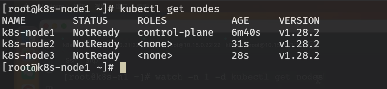
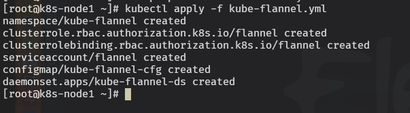
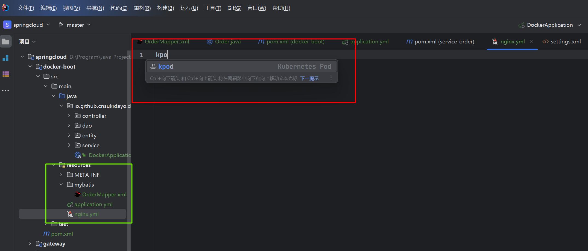
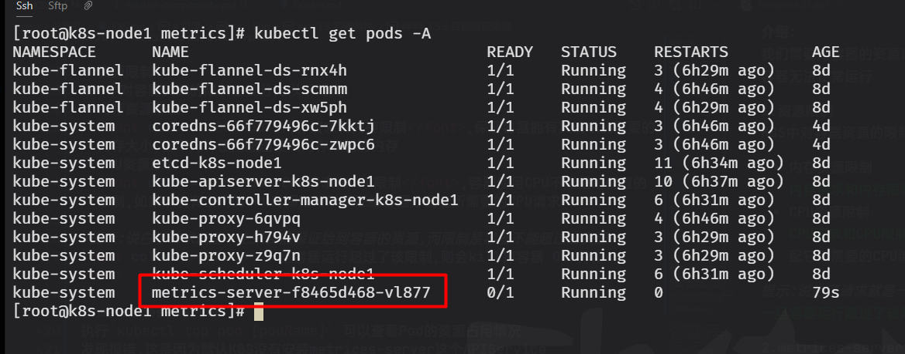

# K8S目录:
1. 基本概念介绍
2. kubernetes集群命令行工具kubectl
3. Pod
4. Controller
5. Service
6. Ingress
7. RABC
8. Helm
9. 持久化


## 1.基本概念介绍
### K8S涉及的功能有:  
1. 自动装箱:基于容器的自动部署功能
2. 自我修复:当容器失败时,会对容器进行重启.当所部署的Node节点有问题时,会对容器进行重新部署和重新调度;类似熔断、分布式的思想.
3. 水平扩展:K8S可以对容器(应用)进行规模夸大或剪裁(缩小);概念类似集群,高峰期的时候可以开多个应用,低流量期间可以减少应用个数.
4. 服务发现:和微服务的概念一致;负载均衡.多个应用对外提供统一的入口,然后内部可以将多个请求分摊到不同的容器上;类似于虚拟化(虚拟设备的概念)
5. 滚动更新:可以根据应用的变化,对应用容器运行的应用,进行一次或批量式更新.
6. 版本回退:可以根据应用部署的情况,对容器中运行的应用,进行历史版本的回退.
7. 密码配置管理:类似热部署的概念,不需要重启整个应用.
8. 存储编排:自动实现存储系统挂载及应用;存储系统可以来自本地目录、网络存储、公有云存储服务.
9. 批处理:提供一次性、定时任务;满足批量数据分析和处理的场景.

### 集群架构组件图:


Node(节点)分为MasterNode(主控节点)和WorkerNode(工作节点).  
MasterNode内部由三部分组成:APIS(API Server)、Scheduler、controller-manager、etcd;MasterNode的主要功能就是做管理的.
* APIServer:集群的统一入口(就是系统对外的接口,你系统暴露的接口)各个组件的协调者,基于Restful风格的请求方式;交给etcd进行存储.
* Scheduler:完成节点调度的,选择一个WorkderNode进行节点调度.
* controller-manager:集群中后台的统一任务的管理,一个资源对应一个控制器;进行模块(节点)映射的.
* etcd:存储系统,用于保存集群(K8S本身)中的一些相关数据.
WorkerNode由两部分组成:kubelet、kube-proxy
* kubelet:Master如何管理WorkerNode?实际上是通过在WorkerNode中派遣一个代表kubelet来完成的.由kubelet来管理本机容器.
* kube-proxy:实现网络代理,可以实现负载均衡等操作.

### K8S的核心概念有:
* pod:最小部署单元;它是一组容器的集合.一个pod中的容器是共享网络的;生命周期是短暂的(服务器重启pod就不存在了)
* controller:确保预期的pod副本数量,分为有状态应用部署、无状态用用部署.无状态就是可以随便用,有状态就是有特定的启动条件.确保所有的node运行同一个pod(用的不多,但也是一种功能)、一次性任务和定时任务.
* Service:定义一组Pod的访问规则.  
总体流程可以总结为:通过Service统一入口进行访问,由controller创建Pod进行部署.

### 平台规划和部署:
1. 搭建K8S环境平台规划
2. 服务器硬件配置要求
3. 搭建K8S集群部署方式

1.平台规划部署  
分类:单集群master、多集群master

单集群Master:

缺点:Matser一旦宕机就无法管理WorkerNode

多集群Master:

特点:需要添加一个中间的负载均衡来完成MasterNode与WorkderNode之间的交互.是一种高可用的集群.

2.服务器硬件配置要求  
配置越高越好

3.搭建K8S集群部署方式  
分类:分为两种部署方式,分别为kubeadm、二进制(bin)

### kubeadm部署方式之kubeadm:  
<a id="doKubeadm"></a>

提示:对每一个节点执行以下内容  
1.关闭防火墙  
`systemctl stop firewalld`  
2.关闭selinux  
`sed -i 's/enforcing/disabled' /etc/selinux/config` 永久关闭  
`setenforce 0` 临时关闭  
3.关闭swap交换分区  
`swapoff -a` 临时关闭  
`sed -ri 's/.*swap.*/#&/' /etc/fstab` 永久关闭

4.根据规划设置主机名称  
`hostnamectl set-hostname [yourNmae]`  
例如:  
hostnamectl set-hostname k8smaster 设置master主机的名称为该名称为k8smaster
hostnamectl set-hostname k8snode1 设置node1主机的名称为k8snode1
hostnamectl set-hostname k8snode1 设置node2主机的名称为k8snode2

5.在master主机上修改hosts  
路径:/etc/hosts  
说明:现在一共三台主机,一台master,两台node 根据master主机的IP和node主机的IP添加hosts文件内容  
例如:  
``` c
192.168.217.131 k8smaster  
192.168.217.132 k8sndoe1  
192.168.217.133 k8snode2  
```

6.将桥接的IPV4流量传递到iptables的链上  
提示:三个节点需要全部设置  
`vi /etc/sysctl.d/k8s.conf` 第一次该文件应该不存在  
<font color="#00FF00">net.bridge.bridge-nf-call-ip6tables = 1</font>  
<font color="#00FF00">net.bridge.bridge-nf-call-iptables = 1</font>  
`sysctl --system`  运行该名称使得配置生效

7.时间同步  
`yum install ntpdate -y`  
`ntpdate time.windows.com`

8.所有节点安装Docker  
`wget https://mirrors.aliyun.com/docker-ce/linux/centos/docker-ce.repo -O /etc/yum.repos.d/docker-ce.repo`    
`yum -y install docker-ce-18.06.1.ce-3.el7`  
`systemctl enable docker && systemctl start docker` 设置docker开机启动  
`docker --version`显示的结果为:
Docker version 18.06.1-ce, build e68fc7a 代表启动成功  
在/etc/dockerdaemon.json中添加如下内容:  
`vi /etc/docker/daemon.json`  
```json
{
    "registry-mirrors": ["https://b9pmyelo.mirror.aliyuncs.com"]
}
```
`systemctl restart docker` 重启docker

9.添加阿里云YUM软件源  
提示:针对所有节点  
`vi /etc/yum.repos.d/kubernetes.repo`
```properties
[kubernetes]
name=Kubernetes
baseurl=https://mirrors.aliyun.com/kubernetes/yum/repos/kubernetes-el7-x86_64
enabled=1
gpgcheck=0
repo_gpgcheck=0
gpgkey=https://mirrors.aliyun.com/kubernetes/yum/doc/yum-key.gpg https://mirrors.aliyun.com/kubernetes/yum/doc/rpm-package-key.gpg
```

10.所有节点安装kubeadm、kubelet、kubectl  
`yum install -y kubelet-1.18.0 kubeadm-1.18.0 kubect1-1.18.0`  
`systemctl enable kubelet` 设置为开机自启

11.在master节点上执行下述命令  
注意:将apiserver-advertise-address后面的值改为当前master的IP地址  
`kubeadm init --apiserver-advertise-address=192.168.217.131 --image-repository registry.aliyuncs.com/google_containers --kubernetes-version v1.18.0 --service-cidr=10.96.0.0/12 --pod-network-cidr=10.244.0.0/16`  
执行该命令将会去云端拉取相关的image(docker中的概念)到docker中,实际上拉取的内容就是之前在Master节点中提到的Master节点的相关的组件,例如controller、apiService等.

完成之后系统会提示相关的友好信息

首先执行第一个绿色方框的内容,需要根据具体的运行的情况来执行!  
`mkdir -p $HOME/.kube`  
`sudo cp -i /etc/kubernetes/admin.conf $HOME/.kube/config`  
`sudo chown $(id -u):$(id -g) $HOME/.kube/config`

运行完毕之后调用`kubectl get nodes`方法来查看结果


在WorkderNode节点中执行第二个绿色方框的内容,不是在master节点中执行!需要根据具体的运行的情况来执行!  
`kubeadm join 192.168.217.131:6443 --token wml7nm.plkx6spwpcpt6myk \`
`--discovery-token-ca-cert-hash sha256:1e77ada31e93285d265c5a252ed4a6f22a13b269069135dc1fa554b3fb8b24a4`  
添加完成之后,回到master节点运行如下命令查看节点的添加情况  
`kubectl get nodes`

默认token有效期为24小时,当过期之后,该token就不可用了.这时就需要重新创建token,操作如下:  
`kubeadm token create --print-join-command`

12.部署CNI网络插件  
问题:根据上面的截图可以发现,目前所有的节点都是NoReady这是因为缺少了一个网络插件导致的,所以现在要配置该网络插件.  
`kubectl apply -f https://raw.githubusercontent.com/coreos/flannel/master/Documentation/kube-flannel.yml`  
如果该文件实在无法下载,则直接将该文件拉取到本地,然后依旧执行  
`kubectl apply -f kube-flannel.yml`  
效果如下:

运行完毕之后,调用`kubectl get pods -n kube-system`命令以及`kubectl get nodes`查看效果:


13.测试kubernetes集群  
`kubectl create deployment nginx --image=nginx`  
运行完毕之后调用`kubectl get pods`命令就可以看到刚才拉取的nginx了

稍等一会等到nginx变为running状态后可以,可以对外暴露端口  

`kubectl expose deployment nginx --port=80 --type=NodePort`  
`kubectl get pod,svc` 调用该命令查看对外暴露的端口

此时找任意一个WorkderNode的节点的IP+看到的端口(这里是30436),就可以访问到nginx了.(这里WorkderNode1节点的IP为192.168.217.132)


### kubeadm部署方式之二进制(bin):  
1.[执行kubeadm的1~7步](#doKubeadm)也是对每个节点执行该步骤,现在一共两个节点,一个master一个worker.

2.将TLS.tar.gz压缩包复制到master机器中并且解压缩.  
`tar zxvf TLS.tar.gz`
  
进入TLS目录下,执行`./cfssl.sh`脚本文件,然后在该目录下会出现一个etcd文件夹,进入该文件夹.  
调用`cat generate_etcd_cert.sh`查看脚本文件的内容

接着执行绿色方框内的第一行的内容,执行完毕之后会生成ca.pem和ca-key.pem这两个证书.  
`cfssl gencert -initca ca-csr.json | cfssljson -bare ca -`  
接着运行`vi server-csr.json`命令编辑json文件的内容
修改hosts部分的IP为当前master和worker节点的IP
```json
{
    "CN":"etcd",
    "hosts":[
        "192.168.217.134",
        "192.168.217.135"
        ],
    "key":{
        "algo":"rsa",
        "size":2048
    },
    "names":[
        {
            "C":"CN",
            "L":"BeiJing",
            "ST":"BeiJing"
        }
    ]
}
```

接着执行绿色方框的下面一条命令  
`cfssl gencert -ca=ca.pem -ca-key=ca-key.pem -config=ca-config.json -profile=www server-csr.json | cfssljson -bare server`  
此时运行ls可以看到出现server开头的以pem结尾的证书文件,分别是:ca-key.pem、ca.pem、server-key.pem、server.pem  

3.为etcd和apiserver自签证书  
由来:集群内部需要证书,外部访问需要证书,颁发需要可信任的证书.  
将etcd.tar.gz文件复制到master本机上进行解压缩  
`tar zxvf etcd.tar.gz`  
进入`cd etcd/ssl/`目录,将该目录下的三个证书文件删除.  
进入`cd etcd/cfg/`目录,编辑etcd.conf文件,将ETCD_LISTEN_PEER_URLS、ETCD_LISTEN_CLIENT_URLS、ETCD_INITIAL_ADVERTISE_PEER_URLS、ETCD_ADVERTISE_CLIENT_URLS字段的值改为当前master本机的IP.  
注意将ETCD_INITIAL_CLUSTER字段中的etcd-1和tecd-2改成当前master和worker节点的IP.

将之前TLS生成的证书复制到当前的ssl目录下面,进入到etcd文件夹内,运行以下命令:  
`cp /root/k8s/TLS/etcd/{ca,server,server-key}.pem ssl/`
  
将master节点中etcd文件复制到worker节点中  
`scp -r etcd root@192.168.217.135:/opt/`  
[etcd]是当前复制的文件夹;[root]是目标linux的用户名;[192.168.217.135]是目标主机的IP地址;冒号后面是将该文件夹复制到那个目录下面.
进入到etcd的上一级目录,将刚才从etcd.tar.gz压缩包中解压出来的etcd.service文件复制到worker节点中.  
`scp etcd.service root@192.168.217.135:/usr/lib/systemd/system/`  
etcd.service实际上是一个可执行文件,同理也将该文件复制到本机master节点的/usr/lib/systemd/system/目录下  
`cp etcd.service /usr/lib/systemd/system`  
进入worker节点的opt目录下(即刚才从master节点复制到worker节点的目录)  
`cd etcd/cfg/`进入etcd/cfg目录,使用`vi etcd.conf`编辑配置文件,将IP改为当前worker节点的IP.
  
在master和worker节点中运行以下命令:  
`systemctl daemon-reload` 先重新加载  
`systemctl start etcd` 启动  
`systemctl enable etcd` 设置开机自启  

4.部署etcd存储的集群

5.部署master组件


6.部署node组件


7.部署集群网络插件  

## 2.kubernetes集群命令行工具kubectl
**概述:**
kubectl是kubernetes集群的命令行工具,通过kubectl能够对集群本身进行管理,并能够在集群上进行容器化应用的安装部署.

**语法格式**:  
`kubectl [command] [TYPE] [NAME] [flags]`  
command:指定要对资源执行的操作,例如create、get、describe和delete  
type:指定资源类型,资源类型是大小写敏感的,开发者能有以单数、复数和缩图的形式.例如:
```console
kubectl get pod pod1
kubectl get pods pod1
kubectl get po pod1
```
name:指定资源名称,名称大小写也是敏感的.如省略名称,则会显示所有的资源,例如:注意比较两个的区别  
`kubectl get nodes`  
`kubectl get nodes k8smaster`  

\*flags:指定可选参数,例如-s或者-server参数指定Kubernetes API server地址和端口

**帮助命令:**  
`kubectl --help` 查看kubectkl命令的帮助信息  
`kubectl [command] --help` 查看某个具体命令的帮助信息  
**command命令分类:**  
(1)基础命令:  
create 通过文件名或标准输入创建资源  
expose 将一个资源公开为一个新的service  
get 显示一个或多个资源  

举例子:  
`kubectl create deployment nginx --image=nginx` 创建nginx资源  
`kubectl expose deployment nginx --port=80 --type=NodePort` 对外暴露端口  
`kubectl get pod,svc`  获取pod的状态、当前端口暴露的情况  
`kubectl get nodes`  获取当前所有的节点  

(2)部署和集群管理命令:

`kubectl api-resources` 获得所有API资源的类型

**yaml文件:**  
提示:现在以kubeadm方式部署为例.  
描述:资源清单文件、资源编排  
进入k8s目录下方,存在一个**kube-flannel.yml**文件,可以查看该文件的内容.  
yaml文件由两部分组成,分别是:控制器定义、被控制对象  
查看该文件:

|   字段名   |    描述    |
| :--------: | :--------: |
| apiVersion |  API版本   |
|    kind    |  资源类型  |
|  metadata  | 资源元数据 |
|    spec    |  资源规格  |
|  replicas  |  副本数量  |
|  selector  | 标签选择器 |
|  template  |  Pod模板   |
|  metadata  | Pod元数据  |
|    spec    |  Pod规格   |
| containers |  容器配置  |

**如何快速编写yaml文件:**  
1.使用kubectl create命令生成yaml文件(适用于还没有部署的场景)  
`kubectl create deployment web --image=nginx -o yaml --dry-run`  
可以看到该命令和之前创建nginx的命令很相似,但这里多加了-o yaml --dry-run 命令代表现在会尝试创建nginx并不会真正创建,它会把尝试创建的结果yaml输出出来.  
2.使用kubectl get命令导出yaml文件(适用于项目已经部署的情况)  
现在master已经部署了一个nginx,所以现在要通过kubectl命令将该nginx的内容导出.
`kubectl get deploy nginx -o=yaml > my.yaml`  
其中nginx是部署的pod的名称(资源名称name),后面-o 是附加参数.

## 3.Pod
**基本你概念:**  
1.pod是K8S中最小的部署单元,k8s是之间管理pod而不是管理容器的.  
2.pod是由一个或多个container组成的;pod包含多个容器(一组容器的集合)  
3.一个pod中容器共享网络命名空间
4.生命周期是短暂的(服务器重启pod就不存在了)  
**pod存在的意义:**  
1.创建容器使用docker,一个docker对应是一个容器,一个容器有进程,一个容器运行一个应用程序.  
2.pod是多进程设计,运行多个应用程序.一个pod有多个容器,一个容器里面运行一个应用程序.所以pod是多进程的.  
3.pod存在也是为了亲密性应用  
3.1两个应用之间进行交互  
3.2网络之间调用  
3.3两个应用之间需要频繁调用  
例如之前如果有两个应用之间需要进行调用,那就必须使用IP进行调用;而现在如果两个应用在同一个pod中,那这两个应用之间就可以通过127.0.0.1和socket方式进行交互.简而言之就是pod的存在方便了两个应用之间进行交互的场景.

**pod实现机制:**  
它是由**共享网络**和**共享存储**这两个机制来实现的  
1.共享网络:  
容器通过docker创建,容器之间本身是相互隔离的,它的隔离是通过linux系统的namespace和group进行隔离的.
现在要让在同一个pod中的容器共享网络,需要一个前提条件:所有容器在同一个namespace中.  
pod首先会在创建一个**pause容器**,该容器不是我们的应用容器是默认创建的,称之为**根容器**.接着会创建我们的应用(业务)容器(例如nginx),创建的这些业务容器会加入到pause容器中.而pause容器它有独立的IP地址、MAC地址、port,此时就可以把所有的业务容器放到同一个namespace中.  

2.共享存储:  
pod中需要持久化的数据有日志数据、业务数据等  
为什么需要持久化?  
答:假如现在有三个节点node1、node2、node3.假设node1中有一个pod,该pod会做相关的业务操作,假设node1在执行的过程中突然宕机了,那么现在就需要node2来接替node1继续提供服务.而node1里面运行的内容实际上是镜像,现在node2接替之后也需要拉取该镜像,但是新镜像默认是没有数据的.所以我们就需要将节点中运行的数据进行持久化操作.也就是将所有节点的数据存储到一个统一的地方.
在

