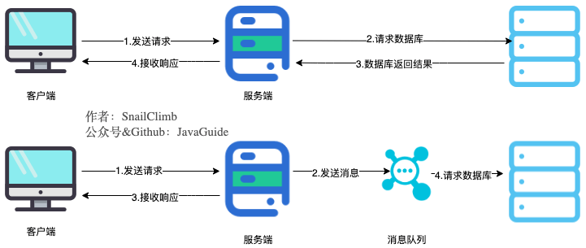
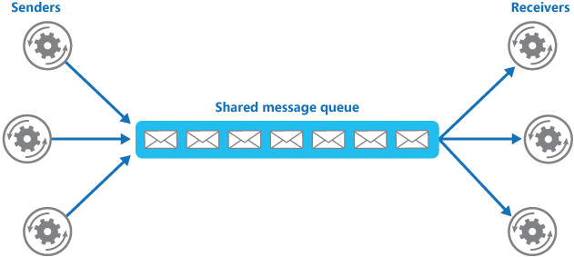
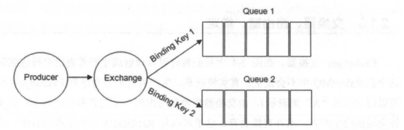
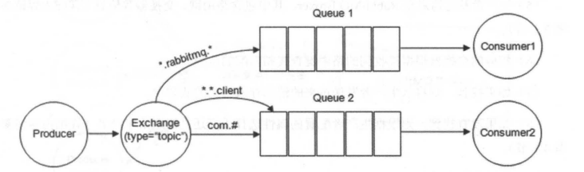
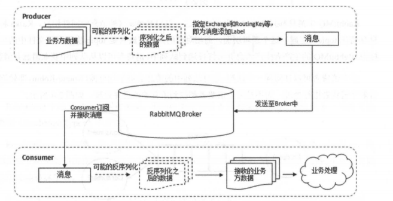
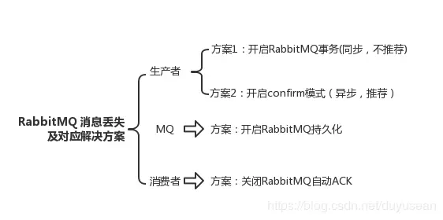

# 目录: 

**附录:**  
A.RabbitMQ基本环境搭建  
B.八股文  


## 附录
A.RabbitMQ基本环境搭建  
B.八股文  


### B.八股文  
**目录:**  
1.消息中间件的基本介绍  
2.RabbitMQ基本介绍  
3.常见面试题  


#### 1.消息中间件的基本介绍
1.消息队列有什么用?  
* 通过异步处理提高系统性能(减少响应所需时间)
* 削峰/限流
* 降低系统耦合性

**通过异步处理提高系统性能(减少响应所需时间)**  
  
关于第二步的说明,必须要等本次消息被MQ确认收到后才能响应客户端;如果请求失败了是需要客户端重新请求的,也即一种防止消息丢失的手段.  

**削峰/限流**  
先将短时间高并发产生的事务消息存储在消息队列中,然后后端服务再慢慢根据自己的能力去消费这些消息,<font color="#00FF00">这样就避免直接把后端服务打垮掉.</font>  
  

**降低系统耦合性**  
模块之间不通过直接调用,而是通过消息交互;那么新增模块或修改模块就对其它模块的影响较小,从而达到解耦的效果  
  

另外为了避免消息队列服务器宕机造成消息丢失,会将成功发送到消息队列的消息存储在消息生产者服务器上,等消息真正被消费者服务器处理后才删除消息.在消息队列服务器宕机后,<font color="#00FF00">生产者服务器会选择分布式消息队列服务器集群中的其他服务器发布消息;即通过MQ集群保证高可用</font>

2.通过消息队列实现分布式事务  
分布式事务一共有6中解决方案,其中一种便是MQ事务(付费知识看不到)  

3.消息队列的缺点  
* 系统可用性降低:在加入MQ之前,你不用考虑消息丢失或者说MQ挂掉等等的情况,但是引入MQ之后这些问题都必须要考虑.  
* 系统复杂性提高:加入MQ之后,你需要保证消息没有被重复消费、处理消息丢失的情况、保证消息传递的顺序性等等问题
* 一致性问题:消息队列可以实现异步,并且可以提高对客户端的响应速度.但是万一消息没有被消费者正确消费就会导致消息不一致的情况

3.JMS  
JMS(Java Message Service;Java消息服务)是一个消息服务的标准或者说是规范.  
JMS客户端之间可以通过JMS服务进行异步的消息传输.  
<font color="#00FF00">ActivityMQ和HornetMQ就是基于JMS规范实现的,不过这两个MQ都被淘汰了.</font>  

4.AMQP  
AMQP(Advanced Message Queuing Protocol)一个提供统一消息服务的应用层标准 **<font color="#FF00FF">高级消息队列协议</font>**,它是二进制应用层协议,是应用层协议的一个开放标准,兼容JMS;基于该协议客户端可与消息中间件传递消息,并且不受不同开发语言、不同消息中间件产品的限制(通用协议).  
<font color="#00FF00">RabbitMQ就是基于AMQP实现的;RabbitMQ还支持STOMP、MQTT、XMPP、SMTP等多种消息中间件协议</font>  
|   对比方向   |                                                 JMS                                                  |                                                                                                                       AMQP                                                                                                                       |
|:----------:|:--------------------------------------------------------------------------------------------------:|:----------------------------------------------------------------------------------------------------------------------------------------------------------------------------------------------------------------------------------------------:|
|     定义     |                                               Java API                                               |                                                                                                                       协议                                                                                                                       |
|    跨语言    |                                                  否                                                  |                                                                                                                        是                                                                                                                        |
|    跨平台    |                                                  否                                                  |                                                                                                                        是                                                                                                                        |
| 支持消息类型 |                   提供两种消息模型:</br>点对点(Peer-2-Peer)<br/>发布订阅(pub/sub)                    | 提供五种消息模型:</br>direct exchange</br>fanout exchange</br>topic change</br>headers exchange</br>system exchange<br><br/>后面四种模型<br/>本质上和JMS<br/>的发布订阅(pub/sub)<br/>模型没有太大区别<br/>,仅是在路由机制<br/>上做了更详细的划分 |
| 支持消息类型 | 支持多种消息类型<br/>StreamMessage<br/>MapMessage</br>TextMessage</br>ObjectMessage</br>BytesMessage |                                                                                                                      二进制                                                                                                                      |


5.消息中间件选择  
总体来说:kafka>RocketMQ=Pulsar>RabbitMQ>~~ActivityMQ~~

#### 2.RabbitMQ基本介绍
1.RabbitMQ的特点  
* 可靠性:RabbitMQ使用一些机制来保证可靠性,如持久化、传输确认及发布确认等.
* 灵活的路由:在消息进入队列之前,通过交换器来路由消息.对于典型的路由功能,RabbitMQ己经提供了一些内置的交换器来实现.针对更复杂的路由功能,可以将多个交换器绑定在一起,也可以通过插件机制来实现自己的交换器.
* 扩展性:<font color="#00FF00">多个RabbitMQ节点可以组成一个集群</font>,也可以根据实际业务情况动态地扩展集群中节点.
* 高可用性:队列可以在集群中的机器上设置镜像,使得在部分节点出现问题的情况下队列仍然可用.
* 多种协议:RabbitMQ除了原生支持AMQP协议,还支持STOMP、MQTT、XMPP、SMTP等多种消息中间件协议.
* 多语言客户端:RabbitMQ几乎支持所有常用语言,比如Java、Python、Ruby、PHP、C#、JavaScript等.
* 管理界面:RabbitMQ提供了一个易用的用户界面,使得用户可以监控和管理消息、集群中的节点等.
* 插件机制:RabbitMQ提供了许多插件,以实现从多方面进行扩展,当然也可以编写自己的插件.

2.RabbitMQ的核心概念  
RabbitMQ整体上是一个生产者与消费者模型,主要负责接收、存储和转发消息.可以把消息传递的过程想象成:当你将一个包裹送到邮局,邮局会暂存并最终将邮件通过邮递员送到收件人的手上,RabbitMQ就好比由邮局、邮箱和邮递员组成的一个系统.从计算机术语层面来说,<font color="#FF00FF">RabbitMQ模型更像是一种交换机模型</font>.  
而交换机的核心概念正是<font color="#00FF00">存储转发</font>  
RabbitMQ模型架构:  
  
<font color="#00FF00">由此引出一系列要点:Producer(生产者)和Consumer(消费者)、Exchange(交换器)、Queue(消息队列)、Broker(消息中间件的服务节点)、Exchange Types(交换器类型)</font>  

3.Producer(生产者)和Consumer(消费者)  
* Producer(生产者):消息生产者
* Consumer(消费者):消息消费者

4.消息的组成  
消息一般由两部分组成:消息头和消息体,消息体是<font color="#00FF00">不透明的</font>;而消息头则由一系列的可选属性组成(<font color="#00FF00">即消息头是一种数据结构</font>);其中的属性包括routing-key(路由键)、priority(相对于其他消息的优先权)、delivery-mode(指出该消息可能需要持久性存储)  

5.Exchange(交换机)  
在RabbitMQ中,消息并不是直接被投递到Queue(消息队列)中的,中间还必须经过Exchange(交换机);通过Exchange(交换机)将消息路由转发到对应的Queue(消息队列)中.  
交换机用来接收生产者发送的消息并将这些消息路由给服务器中的消息队列,如果路由不到或许会返回给Producer(生产者),或许会被直接丢弃.  
RabbitMQ中交换器有<font color="#00FF00">四种不同的类型</font>,分别为:direct、fanout、topic、headers.  
<font color="#00FF00">不同的交换机类型对应着不同的路由策略(交换机类型在下面)</font>  
交换机示意图:  
  

<font color="#00FF00">生产者</font>将消息发给交换器的时候,一般会指定一个**RoutingKey(路由键)**,用来指定这个消息的路由规则,而这个**RoutingKey**需要与**交换器类型**和 **绑定键(BindingKey)** 联合使用才能最终生效.  

RabbitMQ中通过 **Binding(绑定)** 将 **Exchange(交换器)** 与 **Queue(消息队列)** 关联起来,在绑定的时候一般会指定一个 **BindingKey(绑定建)**  
生产者将消息发送给交换机时,需要一个RoutingKey,<font color="#00FF00">当BindingKey和RoutingKey相匹配时</font>,消息会被路由到对应的队列中.在绑定多个队列到同一个交换器的时候,这些绑定允许使用相同的BindingKey.BindingKey并不是在所有的情况下都生效,它依赖于交换器类型;<font color="#00FF00">即不同的交换机类型对应着不同的路由策略</font>  
Binding(绑定)示意图:  
  

也就是说不同的Exchange(快递员)负责不同的Queue(菜鸟驿站);但是Producer(寄件人)希望快递员将Message(货物)送到一个或多个菜鸟驿站(Queue),那么寄件人就需要告诉快递员走哪条道(RoutingKey),快递员看看这条道在不在它的地图上(BindingKey),如果能走放入菜鸟驿站最后被Consumer(取件人)取走.当然了不同的快递员有不同的脾气(Exchange Types)

6.Exchange Types(交换器类型)  
**分类:**  
RabbitMQ常用的交换机类型有四种:<font color="#00FF00">fanout、direct、topic、headers</font>;此外还有两种system、自定义  

**fanout**  
fanout类型的Exchange路由规则非常简单,它会把所有发送到该Exchange的消息路由到所有与它绑定的Queue中,不需要做任何判断操作(<font color="#FF00FF">即不判断RoutingKey与BindingKey是否匹配</font>),所以fanout类型是所有的交换机类型里面<font color="#00FF00">速度最快</font>的.<font color="#00FF00">fanout类型常用来广播消息.</font>

**direct**  
direct会把消息路由到Bindingkey与RoutingKey完全匹配的Queue中.  
  
以上图为例,如果发送消息的时候设置路由键(RoutingKey)为`warning`,那么消息会路由到Queue1和Queue2.如果在发送消息的时候设置路由键为"Info"或者"debug",消息只会路由到Queue2.如果以其他的路由键发送消息,则消息不会路由到这两个队列中.  

<font color="#00FF00">direct类型常用在处理有优先级的任务</font>,根据任务的优先级把消息发送到对应的队列,这样可以指派更多的资源去处理高优先级的队列

**topic**  
topic也是基于Bindingkey与RoutingKey完全匹配的路由规则,但是它提供了模糊匹配的路由规则,规则如下:  
* RoutingKey<font color="#00FF00">为一个点号"."分隔的字符串</font>(被点号"."分隔开的每一段独立的字符串称为一个单词),如 "com.rabbitmq.client"(它被分割为com、rabbitmq、client这三个单词)、"java.util.concurrent"(它被分割为java、util、concurrent这三个单词)、"com.hidden.client"(以此类推);  
* BindingKey和RoutingKey一样也是<font color="#00FF00">点号"."分隔的字符串</font>
* BindingKey中可以存在两种特殊字符串"\*"和"#",用于做模糊匹配,其中"*"用于匹配一个<font color="#00FF00">单词</font>(而不是单个字符),"#"用于匹配多个<font color="#00FF00">单词</font>(可以是零个)

  
以上图为例(图中指定的是BindingKey):  
* 路由键为(RoutingKey)"com.rabbitmq.client"的消息会同时路由到Queue1和Queue2
* 路由键为"com.hidden.client"的消息只会路由到Queue2中
* 路由键为"com.hidden.demo"的消息只会路由到Queue2中
* 路由键为"java.rabbitmq.demo"的消息只会路由到Queue1中
* 路由键为"java.util.concurrent"的消息将会被丢弃或者返回给生产者(需要设置mandatory参数),因为它没有匹配任何路由键.

**headers(不推荐使用)**
headers 类型的交换器不依赖于路由键的匹配规则来路由消息,而是根据发送的消息内容中的headers属性进行匹配.在绑定队列和交换器时指定一组键值对,当发送消息到交换器时,RabbitMQ会获取到该消息的headers(也是一个键值对的形式),对比其中的键值对是否完全匹配队列和交换器绑定时指定的键值对,如果完全匹配则消息会路由到该队列,否则不会路由到该队列.<font color="#00FF00">headers类型的交换器性能会很差,而且也不实用,基本上不会看到它的存在.</font>

7.Queue(消息队列)  
Queue(消息队列)用来保存消息直到发送给消费者.它是消息的容器,<font color="#00FF00">也是消息的终点</font>.<font color="#00FF00">一个消息可投入一个或多个队列</font>.消息一直在队列里面,等待消费者连接到这个队列将其取走.  
**多个消费者可以订阅同一个队列**,这时队列中的消息会被平均分摊(Round-Robin,即轮询)给多个消费者进行处理,<font color="#00FF00">而不是每个消费者都收到所有的消息并处理</font>,这样避免消息被重复消费.  
**RabbitMQ不支持队列层面的广播消费**,即不可以通过队列来实现消息广播,队列中的消息只能被消费一次  

8.Broker(消息中间件的服务节点)
对于RabbitMQ来说,一个RabbitMQ Broker可以简单地看作一个RabbitMQ服务节点,或者RabbitMQ服务实例.大多数情况下也可以将一个RabbitMQ Broker看作一台RabbitMQ服务器.  

9.消息队列运转流程  
  


#### 3.常见面试题
**1.什么是AMQP?**  
AMQP的三层协议:  
* Module Layer:协议最高层,主要定义了一些客户端调用的命令,客户端可以用这些命令实现自己的业务逻辑.
* Session Layer:中间层,主要负责客户端命令发送给服务器,再将服务端应答返回客户端,提供可靠性同步机制和错误处理.
* TransportLayer:最底层,主要传输二进制数据流,提供帧的处理、信道服用、错误检测和数据表示等

**2.什么是死信队列?**  
DLX(Dead-Letter-Exchange,死信交换机),当消息在一个队列中变成死信息(dead-message)之后,它能被重新被发送到另一个交换器中,这个交换机就是DLX,<font color="#00FF00">绑定DLX的队列就称之为死信队列.</font>  
导致消息成为<font color="#00FF00">死信</font>(dead-message)的几种情况:  
* 消息被拒`(Basic.Reject / Basic.Nack)且requeue = false`  
* 消息TTL过期(消息在队列中的时间超过了TTL/消息在TTL时间内没有被消费)
* 队列满了,无法再添加

**3.什么是延迟队列?RabbitMQ怎么实现延迟队列?**  
<font color="#00FF00">延迟队列</font>指的是存储对应的延迟消息,消息被发送以后,并不想让消费者立刻拿到消息,而是等待特定时间后,消费者才能拿到这个消息进行消费.  
RabbitMQ本身并不支持延迟队列,可以通过<font color="#00FF00">死信队列</font>或<font color="#00FF00">RabbitMQ插件</font>来实现延迟队列.

**4.什么是优先级队列?**  
RabbitMQ自V3.5.0有优先级队列实现,优先级高的队列会先被消费  
可以通过`x-max-priority`参数来实现优先级队列.不过,当消费速度大于生产速度且Broker没有堆积的情况下,优先级显得没有意义  

**5.RabbitMQ消息怎么传输**  
由于TCP链接的创建和销毁开销较大,且并发数受系统资源限制,会造成性能瓶颈,所以RabbitMQ使用信道的方式来传输数据.信道(Channel)是生产者、消费者与RabbitMQ通信的渠道,<font color="#00FF00">信道是建立在TCP链接上的虚拟链接,且每条TCP链接上的信道数量没有限制</font>.<font color="#FF00FF">即RabbitMQ在一条TCP 链接上建立成百上千个信道来达到多个线程处理</font>,这个TCP被多个线程共享,每个信道在RabbitMQ都有唯一的ID,保证了信道私有性,每个信道对应一个线程使用.  

**6.如何保证消息的可靠性?**  
分为三种情况:消息到MQ的过程中丢失、MQ自身丢失消息、MQ到消费者过程中丢失  
* 生产者到RabbitMQ丢失:事务机制和Confirm机制  
  注意:事务机制和Confirm机制是互斥的,两者不能共存,会导致RabbitMQ报错.
* RabbitMQ自身丢失:持久化、集群、普通模式、镜像模式.
* RabbitMQ到消费者:basicAck机制(ACK机制)、死信队列、消息补偿机制.

**消息丢失解决方案**  
  

6.1 针对生产者之开启rabbitMQ事务  
可以选择用RabbitMQ提供的事务功能,就是生产者发送数据之前开启RabbitMQ事务`channel.txSelect`,然后发送消息.  
如果消息没有成功被RabbitMQ接收到,那么生产者会收到异常报错,此时就可以回滚事务`channel.txRollback`,然后重试发送消息.  
如果收到了消息,那么可以提交事务`channel.txCommit`  
```java
// 开启事务  
channel.txSelect();  
try {  
   // 这里发送消息  
} catch (Exception e) {  
   channel.txRollback(); 
// 这里再次重发这条消息
}
// 提交事务  
channel.txCommit();  
```

缺点:  
RabbitMQ事务机制是同步的,你提交一个事务之后会阻塞在那儿,采用这种方式会造成吞吐量下降  

6.2 针对生产者之使用confirm机制  
事务机制和confirm机制最大的不同在于,事务机制是同步的,你提交一个事务之后会阻塞在那儿,但是<font color="#00FF00">confirm机制是异步</font>的  
在生产者开启了confirm模式之后,<font color="#00FF00">每次写的消息都会分配一个唯一的id</font>,然后如果写入了rabbitmq之中,<font color="#00FF00">rabbitmq会立即给你回传一个ack消息,告诉你这个消息发送OK了</font>.如果rabbitmq没能处理这个消息,会回调你一个`nack`接口,告诉你这个消息失败了,你可以进行重试.而且你可以结合这个机制知道自己在内存里维护每个消息的id,如果超过一定时间还没接收到这个消息的回调,那么你可以进行重发.  
```java
//开启confirm  
channel.confirm();  
//发送成功回调  
public void ack(String messageId){
}
// 发送失败回调  
public void nack(String messageId){  
    //重发该消息  
}
```

6.3 针对MQ之消息持久化  
RabbitMQ的消息默认存放在内存上面,如果不特别声明设置,消息不会持久化保存到硬盘上面的,如果节点重启或者意外crash掉,消息就会丢失.  
要想做到持久化必须满足这三个条件:<font color="#00FF00">Exchange设置持久化、Queue设置持久化、Message持久化发送</font>  
持久化的设置是在创建队列的时候设置的,<font color="#00FF00">也就是在调用Java代码的时候设置上述三个条件为持久化</font>;对于message持久化是设置消息发送模式为deliveryMode=2实现的;其余两个都是设置参数为true实现的(具体可以百度)

6.4 针对MQ之设置镜像集群  
镜像集群在=>7.如何保证RabbitMQ高可用的?  

6.5 针对MQ之消息补偿机制  

6.6 <font color="#00FF00">针对消费者之ACK确认机制(重)</font>  
消费者接收消息接收到一半,消费者宕机了;这种情况如何保证消息不丢失?  
使用rabbitmq提供的ack机制,服务端首先关闭rabbitmq的自动ack,然后每次在确保处理完这个消息之后,`在代码里手动调用ack`.这样就可以避免消息还没有处理完就ack.  


**7.如何保证RabbitMQ高可用的?**  
RabbitMQ有三种运行模式:单机、普通集群模式、镜像集群模式  

**单机:**  
单机测试环境,生产上不可以使用  

**普通集群模式**  
在多台机器上启动多个MQ实例,我们创建的queue只会存在于一个MQ实例上,但是每个MQ实例都会同步queue的元数据(元数据可以认为是queue的一些配置信息,通过元数据,可以找到queue所在的MQ实例)  
你消费的时候,实际上如果连接到了另外一个实例,那么那个实例会从queue所对应的真实MQ实例上拉取数据过来.这方案主要是提高吞吐量的,就是说让集群中多个节点来服务某个queue的读写操作  

**镜像集群模式**  
这种模式才是RabbitMQ的高可用模式,与普通集群模式不同的是,在镜像集群模式下我们创建的queue无论是元数据还是消息都会存在于多个实例之中,<font color="#00FF00">通过后台配置可以将某个MQ中的数据同步到指定的多个节点上</font>,从而保证MQ的高可用;而不至于一台服务器宕机后这台服务器中对应的queue数据全都不可使用.  
<font color="#FF00FF">它就类似Redis的主从复制</font>  

**8.如何解决消息队列的延时以及过期失效问题**  
RabbtiMQ是可以设置过期时间的,也就是 TTL.如果消息在queue中积压超过一定的时间就会被RabbitMQ给清理掉,这个数据就没了.那这就是第二个坑了.这就不是说数据会大量积压在mq里,而是大量的数据会直接搞丢.我们可以采取一个方案,就是批量重导,这个我们之前线上也有类似的场景干过.就是大量积压的时候,我们当时就直接丢弃数据了,然后等过了高峰期以后,比如大家一起喝咖啡熬夜到晚上12点以后,用户都睡觉了.这个时候我们就开始写程序,将丢失的那批数据,写个临时程序,一点一点的查出来,然后重新灌入mq里面去,把白天丢的数据给他补回来.也只能是这样了.假设1万个订单积压在mq里面,没有处理,其中1000个订单都丢了,你只能手动写程序把那1000个订单给查出来,手动发到mq里去再补一次.


