# 目录:  
A.基础篇  
B.高级篇  
C.实战篇  

# 基础篇
**目录:**  
1.10大数据类型  
2.Redis持久化  
3.Redis事务  
4.Redis管道  
5.~~Redis发布订阅~~(了解)  
6.Redis主从复制(replica)  
7.Redis哨兵(sentinel)  
8.Redis集群(cluster)  
9.Springboot整合Redis  

**附录:**  
A.Redis基本环境搭建  
B.Redis命令大全  

## 1. 10大数据类型

**注意:** 一般类型说的都是value的类型,key一直都是string  
**哪里获取命令的操作手册:**  
[Redis官网命令手册](https://redis.io/commands/)  
[中文命令手册](http://redis.cn/commands.html)  
详情可见附录  

**目录:**  
1.1 String(字符串)  
1.2 List(列表)  
1.3 Hash(哈希表)  
1.4 Set(集合)  
1.5 ZSet(有序集合)  
1.6 GEO(地理空间)  
1.7 HyperLogLog(基数统计)  
1.8 bitmap(位图)  
1.9 bitfield(位域)  
1.10 Stream(流)

### 1.1 String(字符串)  

**介绍:**  
一个Key对应一个Value;String类型是二进制安全的,二进制安全就是String可以包含任意数据,比如jpg图片或者序列化对象;String类型最大为512M  

### 1.2 List(列表)  

**介绍:**  
Redis列表是简单的字符串列表,可以将元素添加到列表的头部或者尾部;素以它实质上就是一个双端链表,最多可以包含2^32-1个元素.  

**特点:**  
主要功能有push/pop,一般用在栈、队列、消息队列等场景.  
由于是双端链表,所以可以对头和尾节点操作,并且效率是很高的;如果对中间的小标做操作则性能较差.  
如果key不存在则会创建key  
如果所有的value都不存在了,则key也消失了  

### 1.3 Hash(哈希表)  

**疑问:** 你会问和String类型有什么区别  
*提醒:Redis的类型说的是value的类型,也就是说Redis-Hash类型表明value的类型是Hash类型;整体看就是 Key (Key Value)*  

*相当于:Map<String,Map<Object,Object>>* 

### 1.4 Set(集合)  

**介绍:**  
同样也是字符串集合,不允许元素重复的类型,最多可以包含2^32-1个元素.Set是通过哈希表实现的,所以添加、删除、查找的时间复杂度都是O(1)  

**区别:**  
Set和List的区别,两者都是集合;还是那句话一个表明value的类型是List,一个表明value的类型是Set;就是说Redis的List类型中的元素允许重复,Redis的Set类型中的元素不允许重复   

### 1.5 ZSet(有序集合)  

**介绍:**  
字符串集合,不允许元素重复的类型,最多可以包含2^32-1个元素.ZSet是通过哈希表实现的,所以添加、删除、查找的时间复杂度都是O(1)  

**特点:**  
每个元素都关联一个double类型的分数,Redis通过分数来为集合中的元素进行从小到大排序.  
Set集合是:key value0 value1...  
ZSet集合是:key score:value0 score:value1...  

### 1.6 GEO(地理空间)  

**介绍:**  
主要用于存储地理位置,并对存储的信息进行操作;包括:  
* 添加地理位置的坐标  
* 获取地理位置的坐标
* 计算两个位置之间的距离  
* 根据用户给定的金纬度坐标来获取指定范围内的地理位置的集合  

**特点:**  
如果用`type`命令查看GEO的类型,它的返回值实际上是ZSet;

### 1.7 HyperLogLog(基数统计)  

**介绍:**  
HyperLogLog是用来做基数统计的算法,HyperLogLog的优点是,在输入元素的数量或者体积非常非常大时,计算基数所需的空间总是固定且是很小的.  
在Redis里面,每个HyperLogLog键只需要花费12KB内存,就可以计算接近2^64个不同元素的基数,这和计算基数时,元素越多耗费内存就越多的集合形成鲜明对比.  
但是,因为<font color="#00FF00">HyperLogLog只会根据输入元素来计算基数,而不会储存输入元素本身,所以HyperLogLog不能像集合那样,返回输入的各个元素</font>.  

**场景:**  
统计某个网站的UV(unique visitor)、统计某个文章的UV  
UV就是独立访客,例如统计某个文章的访问量,同一个IP多次访问肯定是只算一次的;但是又不需要把每次访问的IP都存到数据库中,直接在Redis中就完成这个操作,所以UV是需要考虑去重的.  

**特点:**  
HyperLogLog的作用只用户统计,不做保存;比如HyperLogLog可以统计出当前文章的访问量是多少,但是HyperLogLog无法返回给你哪些IP看过这个文章.<font color="#00FF00">HyperLogLog有0.81%的误差</font>  
如果用`type`命令查看HyperLogLog的类型,它的返回值实际上是String;但是你没办法通过get得到它的内容


### 1.8 bitmap(位图)

**介绍:**  
由01状态表现的二进制位的bit数组,所以这就是个bit类型;想想最终返回的类型也是0101100这种.  

**特点:**  
bitmap的底层还是Stirng;如果用`type`命令查看bitmap的类型,它的返回值实际上是String

### 1.9 bitfield(位域)  

**介绍:**  
通过bitfield命令可以一次性操作多个<font color="#FF0000">比特位域(指的是连续的多个比特位)</font>,它会执行一系列操作并返回一个响应数组,这个数组中的元素对应参数列表中的相应操作的执行结果.  
说白了就是通过bitfield命令我们可以一次性对多个比特位域进行操作.  

*提示:目前阶段了解即可,这个用的不是很多*

**解释:**  
假设对于字符串"Redis",它在Redis中是咋存储的?究极根本字符串在计算机中的存储是以ASCII码来存储的,而8位二进制构成一个ASCII码,所以最终该字符串就是一个二进制.  
假设现在我要把Redis改为redis;就是把第一个字母从大写改成小写;以前的思路是用set把它覆盖掉.  
那么利用bitfield直接把它的二进制改掉不就可以了,也就是先定位到Redis中字符R对应的ASCII码,然后把该ASCII码中对应的几个二进制改成r的ASCII码二进制即可.  

### 1.10 Stream(流)

**介绍:**  
Redis版本的消息中间件,Redis本身是有一个Redis发布/订阅(pub/sub)来实现消息队列的功能,但是它有个缺点就是消息无法持久化,如果出现网络断开、Redis宕机等,消息就会被丢弃.  

**由来:**  
Redis实际上也可以实现消息中间件的特性,一共有两种方案:  
* 利用List列表来实现,之前说过List列表是双端链表;左右两端可以同时进和同时出,那么就一端进一端出就可以实现消息队列了;但这种方式是点对点的形式.  
* 利用Redis的发布和订阅(pub/sub)可以实现消息的广播;但是Redis相较于传统的消息中间件,它不支持持久化;如果网络断开、Redis宕机消息就会丢失.而且也没有ACK机制来保证数据的可靠性.  

<font color="#00FF00">Redis的Stream就是消息中间件+阻塞队列</font>

**特点:**  
实现消息队列,它支持消息的持久化、支持自动生成全局唯一ID、支持ACK确认消息的模式、支持消费组模式等,让消息队列更加的稳定和可靠.如果用`type`命令查看Stream的类型,它返回的就是stream  

**结构:**  


|        属性        |                                                                                                          解释                                                                                                          |
| :----------------: | :--------------------------------------------------------------------------------------------------------------------------------------------------------------------------------------------------------------------: |
|  Message Content   |                                                                                                        消息内容                                                                                                        |
|   Consumer Group   |                                                                             消费组,通过XGROUP CREATE 命令创建,同一个消费组可以有多个消费者                                                                             |
| Last_deliveryed_id | 游标,每个消费组会有一个游标Last_deliveryed_id,任何一个组内成员读取了消息都会使游标Last_deliveryed_id往前移动;<font color="#00FF00">比如一个消费组要消费10条记录,一旦有消费者消费了第1条,那么游标就指向第2条消息</font> |
|      Consumer      |                                                                                                消费者,消费组中的消费者                                                                                                 |
|    Pending_ids     |  这是一个数组,用于保存当前组内已经读取过该消息的但还没有ACK确认的消费者的id;如果客户端没有ACK则该数组内的消息id会越来越多,一旦某个记录被ack它就开始减少.它用来确保客户端至少消费了一次,而不会在网络传输的中途丢失处理  |

个人理解的结构:
```java
public class Stream{
  private MessageContent messageContent;
  private int[] consumerIdGroup;
  private Iterator<Integer> lastDeliveryedId;
  private Consumer[] consumer;
  private int[] pendingIds;
}
```

**解释:**  
实际上消息就是一个数据结构  
每个消息都有它们的id;每个消息也有它对应的消息内容;每个消息还封装了它的消费者组的id;  
通过消费者组id就能得到组内的消费者是哪些(从而实现广播的机制)

## 2.Redis持久化
**目录:**  
2.1 总体介绍  
2.2 RDB  
2.3 AOF  
2.4 RDB+AOF混合持久化  
2.5 纯缓存模式  


### 2.1 总体介绍  
**持久化类型分类:** RDB、AOF、混合模式  
RDB:Redis DataBase  
AOF:Append Only File  
混合模式:RDB+AOF  

1.RDB持久化方式  
拍摄快照的方式,把内存中的数据快照到磁盘上  
恢复的时候把打包的内存数据RBD恢复到内存  

2.AOF持久化方式  
类似于写日志文件的方式,将每条执行的命令append到日志文件上  
恢复的时候一条一条地执行文件中的命令  

  

### 2.2 RDB  
**目录:**  
2.2.1 介绍  
2.2.2 自动触发  
2.2.3 手动触发  
2.2.4 RDB的优势  
2.2.5 RDB的劣势  
2.2.6 RDB修复命令    

#### 2.2.1 介绍  
1.RDB持久化是以指定的时间间隔执行数据集的时间点快照  

2.实现类似照片记录效果的方式,就是把某一时刻的数据和状态以文件的形式写到磁盘上,也就是快照.这样一来就是故障宕机,快照文件也不会丢失,数据的可靠性也就得到了保证.  

3.在指定的时间间隔内将内存中的数据集快照写入磁盘,也就是行话讲的snapshot内存快照,它恢复时再将硬盘快照文件直接读回到内存里.  
Redis的数据都在内存里,保存备份时它执行的是<font color="#FF0000">全量快照</font>,也就是说,把内存中的所有数据都记录到磁盘中.

4.设置RDB的持久化规则  
<font color="#00FF00">附录=>A.Redis基本环境搭建=>redis.conf</font>  

#### 2.2.2 自动触发 
1.只要满足redis.conf配置文件中`save [second] [count]` 指定的值就会自动持久化  

2.类似`flushdb`命令也会导致Redis序列化到磁盘  

3.`shutdown`命令会导致Redis序列化到磁盘  

4.主从同步的时候,当有新的slave连接master的时候,master也会触发RDB(详情见:基础篇=>6.Redis复制机制=>6.4复制原理和工作流程)

#### 2.2.3 手动触发
**介绍:**  
Redis提供了两个命令来生成RDB文件,分别是save和bgsave  
**<font color="#FFC800">生产中只允许用bgsave;不允许用save</font>**  

1.Redis是如何进行手动触发的  
参照官方文档,在调用save或bgsave命令的时候,Redis会新开一个子进程(child process)去序列化当前的内存文件.

2.为什么不能用save序列化?  
**解释:**  
在主程序中执行会阻塞当前的Redis服务器,直到Redis持久化工作完成.执行save命令期间,Redis不能处理其它命令,**线上禁止使用**.  

3.bgsave的特点  
Redis会在后台异步进行快照操作,<font color="#FFC800">不阻塞</font>快照同时还可以响应客户端请求,该触发方式会fork一个子进程由子进程复制持久化过程.  
<font color="#FFC800">Redis自动触发备份默认走的是bgsave模式</font>

4.`lastsave` 获取上一次备份的时间  

#### 2.2.4 RDB的优势
* RDB是Redis数据的一个非常紧凑的单文件时间点表示.RDB文件非常适合备份.例如,您可能希望在最近的24小时内每小时归档一次RDB文件,并在30天内每天保存一个RDB快照.这使您可以在发生灾难时轻松恢复不同版本的数据集.  
* RDB非常适合灾难恢复,它是一个可以传输到远程数据中心或AmazonS3(可能已加密)的压缩文件.  
* RDB最大限度地提高了Redis的性能,因为Redis父进程为了持久化而需要做的唯一工作就是派生一个将完成所有其余工作的子进程.父进程永远不会执行磁盘I/O或类似操作.  
* 与AOF相比,RDB允许大数据集更快地重启.  
* 在副本上,RDB支持重启和故障转移后的部分重新同步.

**小总结:** 适合大规模的数据恢复、对照业务定时备份、对数据完整性和一致性要求不好、RDB文件在内存中的加载速度比AOF快很多.

#### 2.2.5 RDB的劣势
* 如果您需要在Redis停止工作时(例如断电后)将数据丢失的可能性降到最低,那么RDB并不好.您可以配置生成RDB的不同保存点(如,在对数据集至少5分钟和100次写入之后,您可以有多个保存点).但是,您通常会每五分钟或更长时间创建一次RDB快照,因此,如果Redis由于任何原因在没有正确关闭的情况下停止工作,您应该准备好丢失最新几分钟的数据.
* RDB需要经常fork()以便使用子进程在磁盘上持久化.如果数据集很大,fork()可能会很耗时,并且如果数据集很大并且CPU性能不是很好,可能会导致Redis停止为客户端服务几毫秒甚至一秒钟.AOF也需要fork()但频率较低,您可以调整要重写日志的频率.而不需要对持久性进行任何权衡.

**小总结(劣势):**  
* RDB的备份方式是在一定时间内做备份,如果Redis意外宕机的话就会导致从当前至最新一次的快照数据丢失.  
* 内存数据的全量同步,如果数据量太大会导致I/O严重影响服务器性能.  
* RDB依赖于主进程的fork,而fork子进程时,子进程时会拷贝父进程的页表,即虚实映射关系;在很大的数据集中这可能会导致服务请求的瞬间延迟.fork时内存中的数据被克隆了一份,大致2倍膨胀;需要慎重.  

#### 2.2.6 RDB修复命令
查看:基础篇=>附录=>A.Redis基本环境搭建=>4.安装文件说明=>redis-check-rdb  
**作用:**  
`redis-check-rdb [file.rbd]` 修复破损的RDB文件(需要来到file.rbd文件所在路径下执行该命令)  

### 2.3 AOF
**目录:**  
2.3.1 基本介绍  
2.3.2 AOF文件的持久化流程  
2.3.3 多AOF持久化文件  
2.3.4 修复AOF文件  
2.3.5 AOF的优势  
2.3.6 AOF的劣势  
2.3.7 AOF的重写机制  

#### 2.3.1 基本介绍
1.基本介绍  
以日志的形式来记录每个写操作,将Redis执行过的所有写指令记录下来(读操作不记录),只许追加文件但不可以改写文件,redis启动之初会读取该文件重新构建数据,换言之,redis重启的话就根据日志文件的内容将写指令从前到后执行一次以完成数据的恢复工作.  
和RDB的

2.开启AOF持久化  
默认情况下Redis是没有开启AOF持久化的  
`appendonly [yes|no(default)]` 设置appendonly为yes开启AOF  

3.持久化文件名称  
默认aof的持久化文件名称为:appendonly.aof  
`appendfilename [fileName(default="appendonly.aof")]`  设置AOF持久化文件的名称  

4.持久化文件路径  
`appenddirname [dir(default="appendonlydir")]` 设置AOF持久化文件的路径;  
注意该路径最终的效果是`dir`+`appenddirname`;也就是说会在配置文件`dir`的目录下的`appenddirname`目录下创建aof文件.  
查看:基础篇=>附录=>A.Redis基本环境搭建=>5.redis.conf

5.持久化方式  
同理也是通过子进程异步写入  

#### 2.3.2 AOF文件的持久化流程
*提示:AOF只记录Redis的增删改操作不记录查询操作*  

1.客户端提交命令到Redis服务器,Redis先执行命令再写入日志  
**为什么AOF是在执行完命令之后再写日志?**  
* 避免额外的检查开销,AOF记录日志时就不需要对命令进行语法检查
* 在命令执行完之后再记录,不会阻塞当前的命令执行

由此引发的风险:  
* 如果刚执行完命令Redis就宕机会导致对应的修改日志丢失

2.Redis服务器产生的AOF日志内存并不是实时写回到AOF文件中,而是先写入一个**AOF缓冲区**,它就类似MySQL中的日志,MySQL中的日志也不是实时写入磁盘中,也是写入一个内存(**内核**)的缓冲区中.所以AOF缓冲区也是Redis在内存中开辟的一块区域  

3.写入到AOF缓冲区的AOF日志文件会有三种不同的策略来刷盘  
策略的设置见:基础篇=>附录=>A.Redis基本环境搭建=>5.redis.conf  

* always:同步写回,每个写命令执行完立刻同步地将日志写回磁盘(很安全但是性能不高)  
* everysec(默认):每秒写回,主线程将日志写入AOF缓冲区(内核)后立即返回,后台线程每隔一秒将AOF缓冲区的内容写入刷盘
* no:由操作系统控制写回,每个写命令执行完只是先把AOF日志文件写入到内存缓冲区(内核),由操作系统决定何时将缓冲区内容写入磁盘.  

**AOF阻塞:**  
当AOF采用everysec策略时虽然是后台线程线程(aof_fsync线程)每秒调用`fsync`(系统调用)将缓冲区的内容写入AOF文件,但写入缓冲区的过程是由主线程完成的,当磁盘压力太大时,fsync函数阻塞,从而造成主线程写入缓冲区阻塞.  

性能小总结:  
  

4.为了避免写入到磁盘上的AOF文件过度膨胀,会根据规则进行命令的合并(即AOF重写),从而起到压缩AOF的作用.  

5.Redis重启时根据AOF文件恢复数据  

#### 2.3.3 多AOF持久化文件
*高版本使用多AOF文件持久化策略*  
现在一个AOF文件由三个文件构成即:appendonly.aof.1.base.rdb、appendonly.aof.1.incr.aof、appendonly.aof.manifest;当然文件的名称还是通过`appendfilename`来指定  
* base:表示基础AOF,它一般由子进程通过重写产生,该文件最多只有一个  
* incr:表示增量AOF,它一般会在AOFRW开始执行时被创建,该文件可能存在多个(一般Redis的写操作会持久化到该文件里)  
* history:表示历史AOF,它由base和incr AOF变化而来,每次AOFRW成功完成时,本次AOFRW之前对应的base和incr AOF都将变为history,history类型的AOF会被Redis删除.  

为了管理这些AOF,引入了一个manifest(清单)文件来跟踪、管理这些AOF.同时,为了便于AOF备份和拷贝,我们将所有的AOF文件和manifest文件放入一个单独的文件目录中,目录名由`appenddirname`来决定.  

#### 2.3.4 修复AOF文件  
来到AOF持久化文件的路径下,ls查看当前路径下有哪些文件:  
```shell
ls
appendonly.aof.1.base.rdb  appendonly.aof.1.incr.aof  appendonly.aof.manifest
```
其中写Redis的语句会被保存到appendonly.aof.1.incr.aof文件内,再次提醒AOF文件不会记录Redis查询操作.实际上可以直接通过vim命令来编辑该文件,里面存放的就是一条条写入Redis的语句.  

1.现在模拟Redis错误写入  
在`appendonly.aof.1.incr.aof`文件的末尾随便加上一段乱码字符,然后关闭Redis;  
再次重启Redis会发现在AOF文件错误的情况下(假设现在不使用RDB文件)Redis服务器根本无法启动.  

2.修复AOF文件  
查看:基础篇=>附录=>A.Redis基本环境搭建=>4.安装文件说明=>redis-check-aof  
**作用:**  
`redis-check-aof --fix [filePath]` 修复破损的AOF文件  
* `filePath`:修复的文件路径

**举例:**  
`redis-check-aof --fix appendonly.aof.1.incr.aof` 一般修复就是修复`appendonly.aof.1.incr.aof`这个文件,注意一定要来到`appendonly.aof.1.incr.aof`文件所在的目录下执行该命令  

3.AOF校验和  
AOF校验机制是Redis在启动时对AOF文件进行检查,以判断文件是否完整,是否有损坏或者丢失的数据.这个机制的原理其实非常简单,就是通过使用一种叫做<font color="#00FF00">校验和(checksum)</font>的数字来验证AOF文件.这个校验和是通过对整个AOF文件内容进行CRC64算法计算得出的数字.如果文件内容发生了变化,那么校验和也会随之改变.因此,Redis在启动时会比较计算出的校验和与文件末尾保存的校验和(计算的时候会把最后一行保存校验和的内容给忽略掉),从而判断AOF文件是否完整.如果发现文件有问题,Redis就会拒绝启动并提供相应的错误信息.AOF校验机制十分简单有效,可以提高Redis数据的可靠性.  
类似地,RDB文件也有类似的校验机制来保证RDB文件的正确性  


#### 2.3.5 AOF的优势  
* 使用AOF的Redis更加持久:  
  通过`appendfsync`配置来指定不同的fsync策略,如由操作系统决定刷盘、每秒刷盘、每次写入时刷盘.使用每秒fsync的默认策略,写入性能依旧很棒.fsync是使用后台线程执行的,当没有fsync正在进行时,主线程将努力执行写入,因此最多只会丢失一秒钟的写入.  
* AOF日志文件是追加写入(append),所以不会造成大量的随机磁盘I/O;即使出现某种原因使得写日志出现问题,也可以通过`redis-check-aof `工具来修复AOF文件.  
* 当AOF变得太大时,Redis能够在后台自动重写AOF,重写是完全安全的,因为当Redis继续附加到旧文件时,会使用创建当前数据集所需的最少操作集生成一个全新的文件,一旦第二个文件准备就绪,Redis就会切换两者并开始附加到新的哪一个,此时旧的文件就不要了  
* AOF以易于理解和解析的格式依次包含所有操作的日志,您甚至可以轻松导出AOF文件.例如,即使您不小心使用该FLUSHALL命令刷新了所有内容,只要在此期间没有执行日志重写,仍然可以通过停止服务器、删除最新命令并重新启动Redis来恢复数据.  

#### 2.3.6 AOF的劣势  
* AOF文件通常比相同数据集的等效RDB文件大  
* 根据确切的fsync策略,AOF可能比RDB慢.一般来说,将fsync设置为每秒写的性能依然非常高,并且在禁用fsync的情况下,即使在高负载下它也应该与RDB一样快.即使在巨大的写入负载的情况下,RDB仍然能够提供关于最大延迟的更多保证.(<font color="#00FF00">AOF运行效率慢于rdb,每秒fsync同步策略效率较高,不同步(交由操作系统刷盘)的效率和rbd相同</font>)  

#### 2.3.7 AOF的重写机制
*提示:重写是用于瘦身AOF文件过大而提出的,在2.3.5 AOF的优势的第三点提到过,这里做进一步说明*  
**介绍:**  
由于AOF持久化是Redis不断将写命令记录到AOF文件中,随着Redis不断的进行,AOF文件会越来越大这会导致服务器占用内存越大以及AOF恢复时间变长.  
为了解决这个问题,Redis新增了重写机制,当AOF文件的大小超过所设定的峰值时,Redis就会自动启动AOF文件的压缩机制,只保留可以恢复数据的最小数据集.  
或者手动使用`bgrewriteaof`命令来重写  

**重写的时机:**  
基础篇=>附录=>A.Redis基本环境搭建=>5.redis.conf=>`auto-aof-rewrite-percentage`和`auto-aof-rewrite-min-size`配置  
首先配置文件的小写必须满足`auto-aof-rewrite-min-size`的要求,其次本次文件校上次文件膨胀的比例达到`auto-aof-rewrite-percentage`之后才会触发重写.  

**什么叫保留最小数据集?**  
例如:  
```shell
set k1 v1
set k1 v2
set k1 v3
```
表面上是三条命令,实际上最终的效果只有`set k1 v3`这一条命令.  
所以只需要保存`set k1 v1`这一条命令即可  
当然也包括删除过期的Key等等;就是想办法瘦身  

**AOF重写流程:**  
*实验环境:将`aof-use-rdb-preamble`混合模式设置为no*  
最开始的时候`appenddirname`目录下有这三个文件`appendonly.aof.1.base.aof  appendonly.aof.1.incr.aof appendonly.aof.manifest`注意这里的文件和之前是不一样的(之前的base文件是rdb文件,这里是aof文件),`appendonly.aof.1.base.aof  appendonly.aof.1.incr.aof`这两个文件的大小都是0;现在开始往Redis中添加添加内容,随着添加的过程,appendonly.aof.1.incr.aof会慢慢膨胀;直到该文件大小膨胀到`auto-aof-rewrite-min-size`指定的大小时;再次查看目录下的文件有`appendonly.aof.2.base.aof  appendonly.aof.2.incr.aof appendonly.aof.manifest`表明此时AOF文件已经<font color="#00FF00">重写</font>过了  
`appendonly.aof.manifest`文件的大小是不变的,两个文件名本来为1的变为2了,并且appendonly.aof.2.incr.aof的<font color="#00FF00">大小变为0</font>;appendonly.aof.2.base.aof中的内容是刚才appendonly.aof.1.incr.aof文件瘦身后的内容.  
以此类推,如果`appendonly.aof.2.incr.aof`文件达到了设定的重写大小,并且大小比`appendonly.aof.2.base.aof`的大小膨胀到指定比例时又会发生重写,将文件名2改为3.  
<font color="#FF00FF">但是重写并不是将appendonly.aof.x.incr.aof文件中的内容进行重写;而是直接读取服务器现有的键值对,然后用一条命令去代替之前记录这个键值对的多条命令,生成一个新的appendonly.aof.(x+1).base.aof文件去代替原来的AOF文件</font>

* fork出一条子线程来将文件重写,在执行`bgrewriteaof`命令时,Redis服务器会维护一个AOF重写缓冲区,该缓冲区会在子线程创建新AOF文件期间,记录服务器执行的所有写命令
* 当子线程完成创建新AOF文件 **(appendonly.aof.(x+1).base.aof)** 的工作之后,服务器会将重写缓冲区中的所有内容追加到<font color="#00FF00">新AOF文件</font>的末尾,<font color="#00FF00">使得新的AOF文件保存的数据库状态与现有的数据库状态一致</font>.  
* 最后,服务器用新的AOF文件替换旧的AOF文件,以此来完成AOF文件重写操作

**手动重写:**  
通过`bgrewriteaof`命令手动重写AOF文件  

**AOF的整体小总结:**  
  

### 2.4 RDB+AOF混合持久化
1.AOF和RDB同时共存  
AOF和RDB能够同时共存,默认AOF是不开启的;<font color="#00FF00">如果AOF开启,则在Redis启动阶段会优先加载AOF</font>  
所以AOF默认不开启,一旦开启就以AOF优先  

2.如果同时开启RDB和AOF文件,启动时只会加载AOF不会加载RDB  
  

3.选哪个?  
*提示:这里实际上是做一个小总结,具体的选择还是根据RDB和AOF的优缺点来考量*  
* RDB持久化方式能够在指定的时间间隔能对你的数据进行快照存储  
* AOF持久化方式记录每次对服务器写的操作,当服务器重启的时候会重新执行这些命令来恢复原始的数据,AOF命令以redis协议追加保存每次写的操作到文件末尾.

<font color="#FF00FF">推荐还是使用混合的方式使用</font>  

通过`aof-use-rdb-preamble yes`配置来开启混合模式  

**结论:**  
RDB镜像做全量持久化,AOF做增量持久化  
先使用RDB进行快照存储,然后使用AOF持久化记录所有的写操作,当重写策略满足或手动触发重写策略时,<font color="#00FF00">将最新的数据存储为RDB记录.</font>这样的话,重启服务器的时候会从RDB和AOF两部分恢复数据,即保证数据的完整性又提高了数据的恢复性能.简单来说:混合持久化方式产生的文件一部分是RDB格式,一部分是AOF格式-><font color="#00FF00">AOF包括了RDB头部+AOF混写</font>.  
  


### 2.5 纯缓存模式
**介绍:**  
通过关闭RDB和AOF的方式,进一步提高Redis的性能(至于如何持久化那不需要Redis考虑).这就是纯缓存模式  
关闭Redis持久化实际上分为两个步骤:关闭RDB、关闭AOF  
通过redis.conf文件中设置`save ""`关闭rdb  
通过redis.conf文件中设置`appendonly no`关闭aof  

## 3.Redis事务
**目录:**  
3.1 什么是Redis的事务  
3.2 用法总结  


### 3.1 什么是Redis的事务
*提示:个人感觉Redis事务的说法有点歧义,其实Redis的事务和传统数据库的事务差别还是很大的,因为Redis只支持单线程,所以多线程中的那些问题并不会发生在Redis上,称之为<font color="#00FF00">Redis命令队列更合适</font>*  

**介绍:**  
首先Redis是单线程的,每次只能保证一个提交到Redis;所以Redis中的单命令天生就是原子性的.Redis的事务很大程序上说的是Redis事务的原子性(也不是全部),即Redis可以一次性执行多个命令,<font color="#00FF00">本质是一组命令的集合</font>,<font color="#FF00FF">在执行这组命令的时候不允许别的命令插队</font>.  
虽然单命令是原子性的,但是多个不同的命令直接实际上并不能保障它们的执行顺序,通过Redis的事务可以解决这个问题;它的本质实质上就是,客户端每次向Redis提交命令的时候提交的是一个<font color="#00FF00">队列</font>,这个队列中可以有很多命令,<font color="#FF00FF">即Redis执行的最小单元是队列</font>,只提交一个命令给Redis服务器相当于提交了一个只有一个命令的队列供Redis执行,而队列之间的执行顺序Redis是无法保障的.  
大概的示意图:  
  
<font color="#FFC800">一个队列中一次性、顺序性、排他性的执行一系列命令</font>  

Redis事务VS传统数据库的事务:  
* 单独的隔离操作:Redis实质上没有什么隔离性的说法  
* 原子性:Redis也没有什么原子性的说法,关于一个队列中如果有命令执行失败的情况,详情见=>3.2 用法总结  

**开启事务(队列)**  
`multi` 开启一个事务  
`exec` 提交事务
```shell
multi #开启事务

command0

command1

command2

exec #提交事务
```  

### 3.2 用法总结
1.正常执行  
```shell
multi #开启事务

command0

command1

command2

exec #提交事务
```  

2.放弃事务  
`discard` 命令放弃事务  
```shell
multi #开启事务

command0

command1

discard #放弃事务,command0和command1丢弃

```

3.全部失败  
*如果在一个事务还没有exec之前就执行了一条错误的Redis命令,那么当执行exec的时候整个事务(队列)中的命令都不会执行成功*  
```shell
multi #开启事务

set k1 v1 #正常命令语法

set k2 v2 #正常命令语法

set k3 #不正常的命令语法

exec #执行事务,报错:整个队列中的命令全部不执行

```

4.成功的成功,失败的失败  
*如果一个Redis事务中命令的语法检查都是正确的,但是执行时候出现错误了,那么在这个事务中不会造成所有命令全部执行失败,而是能够成功的就成功执行,不能成功的才报错.*  
```shell 
multi #开启事务

set k1 v1 #正常命令语法,能够执行成功

set k2 v2 #正常命令语法,能够执行成功

incr email #正常命令语法,不能执行成功(email不是数字)

set k3 v3 #正常命令语法,能够执行成功

exec #执行事务

```

结果:
```shell
ok
ok
error
ok
```

5.watch监控  
`watch [key0] [key1]...` 监控多个key  
Redis使用watch来提供乐观锁,如果在Redis事务执行exec之前watch的key发生了修改则当前事务中的所有命令都不会生效.  
`unwatch` 取消当前连接的监控的所有key  

**锁的释放时机:**  
* `unwatch`  
* 一旦执行了exec之前加的监控锁都会被取消
* 当客户端连接丢失的时候(比如退出连接),该连接监控的所有锁都会被取消监控

redis是单线程的,为什么会有乐观锁的说法?  
<font color="#00FF00">原因在于Redis的watch命令是执行在事务multi之前的</font>;看例子(括号的数字表示执行的顺序):  

客户端1:
```shell
set k1 v1 #初始数据的环境(1)

set balance 100 #初始数据的环境(2)

watch balance #开启key监控(3)

multi #开启事务(5)

set balance 200 #队列中的一条命令(5)

set k1 v1111111 ##队列中的一条命令(5)

exec #提交事务(5)

get balance

get k1

```

客户端2:
```shell
set balance 300 #修改balance的值(4)
```

执行结果:
```shell
300
v1
```

**解释:**  
是的,Redis是单线程的没错;但之前说过Redis不能保证每个队列之间的执行顺序,坏就坏在watch命令与multi命令不在一个队列中;于是乎导致客户端1的乐观锁失效,导致客户端1的整个事务执行失败.  

`unwatch`命令也是在`multi`之前执行的,例如:  

客户端1:
```shell
set k1 v1 #初始数据的环境(1)

set balance 100 #初始数据的环境(2)

get balance #结果为100(3)

watch balance #开启key监控(4)

unwatch #解除所有watch(7)

multi #开启事务(8)

set balance 300 #队列中的一条命令(8)

set k1 v1111111 ##队列中的一条命令(8)

exec #提交事务(8)

get balance

get k1
```

客户端2:
```shell
set balance 200 #修改balance(5)

get balance #结果为200(6)
```

执行结果:  
```shell
300
v1111111
```

## 4. Redis管道
**目录:**  
4.1 Redis管道基本介绍  
4.2 Redis管道的使用方法  

### 4.1 Redis管道基本介绍
**Redis管道的由来:**  
Redis是一种基于客户端-服务端模型以及请求/响应协议的TCP服务.一个请求会遵循以下步骤:  
* 客端向服务端发送命令分四步(发送命令->命令排队->命令执行->返回结果)并监听Socket返回,通常以阻塞模式等待服务端响应.  
* 服务端处理命令,并将结果返回给客户端

上述两步称为:Round Trip Time(简称:RTT,数据包往返于两端的时间)  
  
如果同时需要执行大量的命令,就需要等待上一条命令应答之后再去执行,这中间不仅多了RTT(Round Trip Time),还需要频繁调用系统的IO,发送网络请求,同时需要Redis调用多次read()和write()系统调用,系统方法会将数据从用户态转为内核态,这样就会对进程上下文有较大的影响,从而影响Redis性能.  

**解决思路:**  
管道(pipeline)可以一次性发送多条命令给服务端,服务端依次处理完毕之后,<font color="#00FF00">通过一条响应将一次性将结果返回,通过减少客户端与Redis的通信次数来降低往返延时时间.</font><font color="#FF00FF">pipeline的实现原理是队列,先进先出特性就保证数据的顺序性.</font>  
*提示:其实mset这种命令就有点这种思想*


**与Redis事务的区别:**  
你会发现Redis事务和管道十分类似,都是批量执行命令;它们的区别在哪里?  
* Redis事务侧重队列中的命令是顺序执行,不会被其它的命令穿插执行,强调命令执行之间的顺序.<font color="#00FF00">并且Redis事务中的各个命令本质还是一条条地发送给Redis服务器</font>,只是这些命令被保存到一个队列中,只有客户端发送<font color="#FF00FF">exec</font>命令时,服务器才会批量执行该队列中的命令.
* Redis管道侧重多命令与服务器之间多次交互而导致性能下降的问题,通过一次性向服务器发送多条命令,服务器全部处理完毕后一次性将结果返回给客户端从而达到提升性能的效果.  
  执行事务时不允许其它的命令穿插执行;但是执行管道时是允许其它命令穿插执行的,<font color="#00FF00">虽然说管道命令是批量发送过去的,但在执行期间是允许别的命令插队的.</font>
  如果管道质量执行的过程中发生异常,是不会影响到后续指令的执行的.  
  **建议:**  
  使用pipeline组装命令的个数不宜太多,不然数据量过大会可能会导致客户端的长时间阻塞,同时服务端给客户端的答复内容也会很多,从而占用服务端过多的内存.  

### 4.2 Redis管道的使用方法
**介绍:**  
Redis管道说白了效果类似于执行sql脚本,需要先在Redis的外部将所有redis命令写入到一个文件中,然后通过linux的管道符`|`将这写命令作为参数批量传递给redis-cli;接着redis-cli就会利用管道批量发布命令.  

**案例:**  
创建一个pipeline.txt文件,内如如下:  
```shell
set k1 v11
set k2 v22
hset k3 name zhangsan
hset k3 age 18
```
直接运行<font color="#00FF00">linux</font>命令:`cat cmd.txt | redis-cli -a [password] --raw --pipe`  
* --pipe:就代表使用redis管道  


## 5. Redis发布订阅
**本章知识点了解即可**  
**目录:**  
5.1 基本介绍  
5.2 常用命令  
5.3 发布订阅的缺点  


### 5.1 基本介绍
1.Redis发布订阅是一种消息通信模式,发送者(publish)发送消息,订阅者(subscribe)接收消息,可以实现进程间的消息传递.  
说白了就是Redis版的消息中间件  

2.和Stream的区别
其实Redis发布订阅就是早起的消息中间件,这是因为它不够完善,所以才产生了后来的Stream,所以宁可使用Stream也不会使用这里的发布订阅.<font color="#00FF00">所以本章知识只做了解</font>

3.Redis客户端可以订阅任意数量的频道,类似于微信公众号  
  
当有新的消息发送到某个频道的时候,所有的client就可以接受到该消息.  
  

  

### 5.2 常用命令
* `subscribe [channel0] [channel1]...` 订阅一个或多个频道信息  
  *提示:频道是不需要创建的,直接订阅就可以了*
* `publish [channel] [message]` 将[message]发送到指定的[channel] 
* `psubscribe [pattern]...` 按照模式(pattern的正则表达式)订阅一个或多个频道信息  
  比如有一个channel的名称为a1,那么这里订阅的时候[pattern]参数可以填写a1,也可以填写a*;说白了就是通过通配符来订阅频道
* `pubsub [subcommand]` 查看订阅与发布系统状态.[subcommand]处不同的命令有不同的效果 
* `unsubscribe [channel]` 退订[channel]频道
* `punsubscribe [pattern]` 退订[pattern]\(正则表达式匹配的频道\)

### 5.3 发布订阅的缺点
* 发布的消息无法在Redis中做持久化,必须先执行订阅再等待消息发布.如果先发布了消息,则由于消息没有订阅者这条消息就相当于丢失了.  
* 消息只管发送对于发布者而言消息是即发即失的,不管接收,也没有ACK机制,无法保证消息的消费成功.  
* 以上的缺点导致Redis的Pub/Sub模式就像个小玩具,在生产环境中几乎无用武之地,为此Redis5.0版本新增了Stream数据结构,不但支持多播,还支持数据持久化,相比pub/Sub更加的强大.


## 6. Redis主从复制(replica)
**目录:**  
6.1 总体介绍  
6.2 相关命令  
6.3 实际操作  
6.4 复制原理和工作流程  
6.5 主从复制的缺点  


### 6.1 总体介绍
  

**master以写为主,slave以读为主;当master数据变化的时候自动将新的数据异步同步到其它的slave数据库**  

**解决的问题:**  
主从复制可以解决这些问题:<font color="#00FF00">读写分离、容灾恢复、数据备份、水平扩容支持高并发</font>  

**怎么实现?**  
<font color="#FF00FF">配置从库不配主库</font>  
大哥是不主动收小弟的,只有小弟找大哥!  

**密码问题:**  
现代的Redis都需要配置密码,如果master通过`requirepass`参数设置了密码,则slave就要配置`masterauth`来设置校验密码,否则主机会拒绝访问.  

### 6.2 相关命令
* `info replication` 可以查看复制节点的主从关系和配置信息  
* `slaveof [masterIP] [masterPort]` 如果没有在Redis.conf配置文件中指定当前从机连接哪个master的信息,则从机每次与master断开之后都需要重新连接.该命令可以指定当前的slave与哪个master进行同步(<font color="#00FF00">是从机与目标主机</font>),如果当前从机原本已经指定了主机,<font color="#00FF00">则该命令会使得从机强制同步新的主机</font>.
* `slaveof no one` 使当前从机停止同步主机,自已变成master  

### 6.3 实际操作
**目录:**  
6.3.1 基本环境搭建  
6.3.2 一主二从  
6.3.3 薪火相传(传递性)  
6.3.4 反客为主  

#### 6.3.1 基本环境搭建
1.修改配置文件  
*提示:这里的教程是Redis应用,如果是docker安装的话有些配置可能不太一样*  
* 开启`daemonize yes` 后台运行redis(docker不需要配置)  
* 注释掉`bind 127.0.0.1` 绑定IP(如果有改配置只允许该IP连接当前Redis),docker环境下不需要配置  
* `protected-mode no` 关闭保护模式(docker不需要配置)  
* `port [port(default=6379)]` 指定Redis服务器端口(docker不需要配置)
* `dir [path]` 指定当前工作目录
* `pidfile [pidfilePath]` 文件的进程id(这个不需要修改)
* `loglevel [debug|verbose|notice(default)|warning]` 设置redis的日志级别
* `logfile "[fileName(default=)]"` 设置日志文件名称,默认就是空的,注意该配置要包含日志的名称,例如:  
  <font color="#00FF00">logfile "/data/redis.log"</font>
* `requirepass [password]` 设置当前Redis服务器的密码  
* `dbfilename [fileName(default=dump.rdb)]` 指定RBD持久化文件的名称
* `appendonly` aof相关配置,开启AOF、设置AOF保存路径、文件名称
* `masterauth [masterPassword]` 设置从机访问主机的密码,该配置只针对从机生效  
* `replicaof [masterIP] [masterPort]` 指定当前从机与哪个主机进行同步

效果如下:  
  

#### 6.3.2 一主二从
*提示:slave是没有写的权限的,当尝试往slave中写是会报错*

1.查看效果  
这里配置成功后,来到master的Redis,执行命令`info replication`结果如下:  
```shell
# Replication
# 当前的角色是master
role:master
# 连接的slave数量
connected_slaves:1
# slave信息
slave0:ip=47.113.148.127,port=6379,state=online,offset=1739,lag=0
master_failover_state:no-failover
master_replid:d744b74d603ab33712d01ab4b5f4685ac7e4f757
master_replid2:e93066cfc16ea555d3d7ff97d55d457cdd1ce993
# master当前同步数据的offset信息
master_repl_offset:1739
second_repl_offset:967
repl_backlog_active:1
repl_backlog_size:1048576
repl_backlog_first_byte_offset:967
repl_backlog_histlen:773
```

来到slave的Redis,执行命令`info replication`结果如下:  
```shell
# Replication
# 当前的角色是slave
role:slave
# master的IP
master_host:124.221.158.98
# master的端口
master_port:7902
# 当前slave与master的连接状态,up:连接 down:掉线
master_link_status:up
# 上一次与masterIO发生在多少秒之前;这里是1s;如果master宕机这里会显示-1
master_last_io_seconds_ago:1
master_sync_in_progress:0
slave_read_repl_offset:2047
slave_repl_offset:2047
slave_priority:100
# slave是否只读
slave_read_only:1
replica_announced:1
# 连接当前Redis的slave数量(是的slave也是可以被slave连接的,见6.3.3 薪火相传(传递性))
connected_slaves:0
master_failover_state:no-failover
master_replid:d744b74d603ab33712d01ab4b5f4685ac7e4f757
master_replid2:e93066cfc16ea555d3d7ff97d55d457cdd1ce993
master_repl_offset:2047
second_repl_offset:967
repl_backlog_active:1
repl_backlog_size:1048576
repl_backlog_first_byte_offset:1
repl_backlog_histlen:2047
```

2.一些问题  
* 从机是不可写入的,只可以读取  
* 同步时机:如果master先启动并且已经写入了很多的数据,此时slave才启动并且同步,slave是可以获取到master已经写入的数据的.
* 如果主机宕机了,<font color="#00FF00">从机是不会上位的.</font>  
  如果此时主机又重启了,那么主机与从机之间的关系<font color="#00FF00">依旧保留</font>
  
3.使用命令指定主机  
之前说过除了使用配置文件的方式指定同步的主机外,还可以使用命令的方式动态指定主机(详情见:基础篇=>6.Redis复制机制=>6.2 相关命令)

主要是`slaveof [masterIP] [masterPort]`这条命令的使用  
*注意:该命令是单次使用,如果Redis重启之后它又会变为master*

#### 6.3.3 薪火相传(传递性)
**存在的问题:**  
目前有一个问题,随着一台master连接的slave数量越来越多;会导致master不堪重负.所以薪火相传(传递性)的思想是,<font color="#00FF00">一个master连接有限的slave,别的slave不直接去连接master而是连接与master直接相连或间接相连的slave.</font>  
  

1.在这张架构图下,它们的`info replication`信息是什么?  
* 对于6379这台机器,连接它的slave数量不在是两个;而是6380这一台slave.  
* 对于6380这台机器,它本身作为slave;并且连接它(6380这个slave)的slave数量是一个(即6381)  
  此时显示的配置中`connected_slaves:1`这一项的值从原来的0改为1  
  虽然6380是6381的master,但<font color="#00FF00">依旧无法对6380进行写操作</font>  

#### 6.3.4 反客为主
`slaveof no one` 使当前从机停止同步主机,自已变成master  

### 6.4 复制原理和工作流程
1.slave启动,同步初请  
* slave启动成功连接到master会发送一个sync同步命令  
* slave首次全新连接master,一次完全同步(全量复制)将被自动执行,slave自身原有数据会被master数据覆盖清除  

2.首次连接,全量复制  
* master节点收到sync命令后会开始在后台保存快照(即RDB持久化,主从复制时会触发RDB),同时收集所有接收到的用于修改数据集命令缓存起来,master节点执行RDB持久化完后,master将rdb快照文件和所有缓存的命令发送到所有slave,以完成一次完全同步  
* 而slave服务在接受到数据库文件数据后,将其存盘并加载到内存,从而完成复制初始化  

3.心跳持续,保持通讯  
`repl-ping-replica-period [second(default=10)]` master向slave发出ping包的周期(心跳周期)

4.进入平稳,增量复制  
master继续将新的所有收集到的修改命令自动依次传递给slave,完成同步  

5.从机下线,重连续传  
master会检查backlog里面的offset,master和slave都会保存一个复制的offset还有一个masterId,offset是保存在backlog中的.master只会把已经复制的offset后面的数据复制给slave,类似断点续传(<font color="#00FF00">就是slave再上线的时候不需要从头开始重新全量复制了</font>)  
这个offset还用于选举slave当选新master时的参考(详情见:基础篇=>7.Redis哨兵=>7.3 哨兵的运行流程和选举原理=>4.兵王leader选举新master的算法)  

### 6.5 主从复制的缺点
1.master一点问题不能出  
其实不用想也知道了,在这种架构下master无疑是最重要的不能出问题的;如果master宕机由于剩下的slave不能上位就无法保证Redis的高可用了.  
为了解决该痛点就引入了<font color="#00FF00">哨兵模式和集群</font>

2.复制延时  
虽然slave可以不与master直接相连,但是slave连接slave会造成延时积累;因为只有master能进行写操作,当master写入一条记录要传播到最下面的slave就可能造成延时的积累.  
  

## 7.Redis哨兵(sentinel)
**目录:**  
7.1 总体介绍  
7.2 基本环境搭建  
7.3 哨兵的运行流程和选举原理  
7.4 哨兵的使用建议  


### 7.1 总体介绍
1.什么是哨兵?  
说白了有哨兵监控master主机是否故障,如果发生故障了则根据<font color="#00FF00">投票数</font>自动将某一个从库转换为新的主库,继续对外服务.  

2.哨兵的作用  
**简单来说就是不需要人工干预的运维机制**  
* 监控Redis运行状态,包括master和slave  
* 当master宕机时,能自动将slave转为新的master

  
<font color="#00FF00">注意:图中黑色的节点就是哨兵;所以也可以看出哨兵也不止一个;哨兵也需要配置集群;并且哨兵也是Redis机器;一般建议sentinel采取奇数台</font>

3.哨兵的作用  
* 主从监控:监控主从Redis库运行是否正常  
* 消息通知:哨兵可以将故障转移的结果发送给客户端  
* 故障转移:如果master异常,则会进行主从切换,将其中一个slave作为新的master  
* 配置中心:客户端通过连接哨兵来获得当前Redis服务的主节点地址

### 7.2 基本环境搭建
1.准备环境  
3个哨兵:自动监控和维护集群,不存放数据,只是吹哨人  
1主2从:用于数据读取和存放  
  

2.sentinel.conf  
哨兵的配置文件和Redis的配置文件是不一样的,哨兵的配置文件是sentinel.conf  
**拷贝sentinel.conf配置文件到`dir`目录下**  
`dir`目录就是redis的工作目录,可以通过redis.conf指定  
<font color="#00FF00">sentinel也是有自已的工作目录dir的设置,注意不要搞混</font>  
其中的部分配置和6. Redis主从复制(replica)=>6.3 实际操作=>6.3.1 基本环境搭建的配置一样,但是docker环境下不需要配置这些.  
sentinel.conf的相关配置可以见:基础篇=>附录=>A.Redis基本环境搭建=>6.sentinel.conf

3.基本环境搭建的配置  
*tips:还是决定列举一下配置*
* `bind 0.0.0.0` 绑定的IP(docker环境不需要配置)
* `daemonize yes` 是否后台运行(docker环境不需要配置)  
* `port 26379` 哨兵的端口号(docker环境不需要配置)  
* `logfile "/data/sentinel.log"` 日志文件的路径  
* `pidfile /var/run/redis-sentinel.pid` 进程id的文件路径指定(docker环境不需要配置)  
* `dir /data` 工作目录(docker环境不需要配置)  
* `sentinel monitor [masterName(default=mymaster)] [masterIP] [redisPort] [quorum]` 配置当前哨兵监控的master  
* `sentinel auth-pass [masterName] [password]` 配置监控的master的密码  

*扩展:哨兵是可以对多个master进行监控的;官网的截图如下*  
  

4.启动sentinel  
由于是通过docker容器进行启动;详情见[docker](Docker.md):附录=>B.常用docker镜像大全=>2.Redis=>7.启动sentinel  

5.sentinel是怎么知道master后面有哪些slave的?  
照目前的场景来看,sentinel只监控了master主机;如果master宕机了那sentinel也要知道从机的IP和端口才行啊;但是这里并没有配置从机的地址.  
<font color="#00FF00">实际上sentinel会自动进行配置重写</font>  
当sentinel启动成功后,再看一眼sentinel.conf配置文件,你会发现它在原有的配置上多了一些内容:  
```shell
# generate by config rewrite 
...
... # 正这之中就会自动配置slave的地址
... # 也会自动配置监控当前master的别的sentinel的地址
```

6.系统稳步正常运行中...  

7.手动宕机master(shutdown)  

**master宕机后的现状:**  
* master宕机后两台从机的数据依旧是OK的  
* 两个slave中的一个晋升成为master  
* 现在旧的master宕机后重新连接,旧的master会变成slave;即master已被之前的slave夺权,老master无翻盘之力  

**注意:**  
当master宕机之后,此时如果立即去读写slave可能会出现两种错误:Error Server closed the connection、Error Broken pipe  
实际上这两种错误的本质都是一样的,都是由于远程的master已经断开连接而导致的,并且此时新的master还没有选举成功.  
  
解决方案:实际上并不需要解决啥,客户端只需要稍后重连即可(等待网络恢复);这种错误一般是针对客户端而言并不是服务端.

**选取新master的小坑:**  
(redis.conf)最开始的时候主机master是不需要配置`masterauth`和`replicaof`这两个参数的,因为这两个参数只针对slave有效.  
但是当master宕机后重连,它是会成为新的master的slave的;既然是slave就必须配置`masterauth`和`replicaof`;那么这两个配置哪里来?  
实际上最开始不管是master还是slave都必须配置`masterauth`并且都需要和`requirepass`配置保持一致;而旧master的`replicaof`配置会自动重写(不需要操心),会写到旧master的redis.conf文件的最后一行;所以可以把`masterauth`理解为集群内的token标识,集群内一致即可  
而新master原本的`replicaof`配置会被重写抹除  

8.小总结  
哨兵模式启动成功后,文件的内容在运行期间会被sentinel动态地修改  
master-slave切换后,master_redis.conf、slave_redis.conf、sentinel.conf的内容都会随之发生改变.  

### 7.3 哨兵的运行流程和选举原理
1.主观下线  
主观下线是<font color="#00FF00">单个sentinel</font>检测到目标master的状态在`down-after-milliseconds`指定的时间内没有收到合法的回复,就主观上认为目标master宕机了.(<font color="#00FF00">所以主观下线是针对单台sentinel而言的</font>)  

2.客观下线  
需要一定数量的sentinel,<font color="#00FF00">多个哨兵</font>(通过`sentinel monitor ... [quorum]`配置中的[quorum]投票数来决定)达成一致的意见才能认为一个master客观上已经宕机了.

3.从哨兵中选举兵王  
当客观上已经认为一台master宕机后.  
当一台master宕机后,需要选举出一个兵王leader,接着由leader来进行failover(故障迁移),即从剩下的slave中选举一个master(并不是所有的sentinel都参与master与slave的切换).  

**兵王的选举算法:**  
从sentinel中选举兵王的raft算法:
  
简单来说就是:当一个sentinel想成为兵王的时候,它会先检测在它选举之前有没有别的sentinel已经发消息给过它,如果有那么当前sentinel只能回复给该sentinel同意你选举;接着当前sentinel会向其余的sentinel发消息说我想选举.  
最后票数最多的sentinel当选leader

4.兵王leader选举新master的算法(重点)  
*CVTE面试问过*  
当剩余slave节点都健康的情况下:  
* 首先看剩下的slave谁的权限高(priority);priority值越小优先级越高
* 如果权限一样,则看谁的同步偏移量offset的值高(关于offset的解释见:基础篇=>6.Redis主从复制=>6.4复制原理和工作流程=>5.从机下线,断点续传)
* 如果offset都一致,则选举slave的ID值最小的slave(每个Redis节点运行的时候都有一个ID)  

  

5.sentinel leader对选出出的master执行以下内容    
* 因为新的master以前是slave,所以它会先执行`slaveof no one` 命令自已成为master  
* sentinel leader向其它slave发送命令,让剩余的slave成为新的master节点的slave;`slaveof`这条命令是可以临时更改master的

6.旧master上线后的操作  
* 老master上线之后会成为新master的slave  
* sentinel leader会让原来的master降级为slave并恢复正常工作  

**注意:**  
第三步由sentinel集群自主完成,4、5、6这三步都由sentinel leader自主完成,完全无需人工干预.  

### 7.4 哨兵的使用建议
* 哨兵节点的数量应为多个,哨兵本身应该集群,数量最好为奇数保证高可用  
* 各个哨兵节点的配置应该<font color="#00FF00">一致</font>
* 如果哨兵节点部署在docker容器中,尤其要注意端口的正确映射  
* 哨兵集群+主从复制的这种模式,并不能保证数据0丢失  
  在生产环境中,master宕机之后所有的写操作都不能执行;而选举新master一般需要5-10s;那么在这中间的所有数据都会丢失;  
  其次由于master与slave之间同步也不是完全实时的(是**异步**的),就会导致部分已经写入master但还没来得及同步到slave的数据丢失.  
  正是由于这种缺陷从而引出了<font color="#FF00FF">集群</font>


## 8.Redis集群(cluster)
**目录:**  
8.1 总体介绍  
8.2 集群算法-分片-槽位slot  
8.3 3主3从集群环境  
8.4 小总结  

### 8.1 总体介绍
1.为什么引入集群  
集群就是为了解决哨兵集群+主从复制下,master宕机之后所有的写操作都不能执行;而选举新master一般需要5-10s;那么在这中间的所有数据都会丢失的问题.  

2.什么是Redis集群  
<font color="#00FF00">由于数据量过大,单个Master复制集</font>难以承担,因此需要对多个复制集进行集群,形成水平扩展每个复制集只负责存储整个数据集的一部分,这就是Redis的集群,其作用是提供在多个Redis节点间共享数据的程序集.  

3.本章的重点是学习集群的算法和网络拓扑(八股)不是学怎么安装配置  

4.架构图  
  
现在是多个master,一个master后面有多个slave做支撑,同样还是读写分离的模式.  
如果M1宕机了,那么M1下的slave还能顶上  
Redis集群是一个提供在多个Redis节点间共享数据的程序集  
Redis集群可以支持多个master  
**注意:**  
M1的数据并没有拷贝到M2和M3中,只是从宏观的角度上来说Redis集群对外提供共享的数据集;只是说从宏观上来看当M1宕机后并不影响整个Redis集群对外提供写服务的能力.  

5.Redis集群的功能  
* Redis集群支持多个master,每个master又可以挂载多个slave(可以实现读写分离、支持数据的高可用、支持海量数据的读写存储操作)  
* 由于cluster自带sentinel的故障转移机制,内置了高可用的支持,<font color="#00FF00">无需再去使用哨兵功能</font>  
* 客户端与Redis的节点连接,不再需要连接集群中所有的节点,<font color="#FF00FF">只需要任意连接集群中的一个可用节点即可</font>(所以使用redis客户端的时候只需要连接集群中的一个节点即可)  
* <font color="#00FF00">槽位slot</font>负责分配到各个物理服务节点,由对应的集群来负责维护节点、插槽和数据之间的关系  

### 8.2 集群算法-分片-槽位slot
1.什么是Redis的槽位  
*提示:这里要紧紧扣住上面Redis集群的架构图*  
集群的密钥被分为16384个槽,一个槽就是一个master;所以Redis集群节点上线为16384(<font color="#00FF00">但是建议最大节点数量大小约为1000个节点</font>)  
Redis集群没有使用一致性hash,而是引入了**哈希槽**的概念.  
Redis集群有16384个哈希槽,每个key通过CRC16校验后对16384<font color="#00FF00">取模</font>来决定放置哪个槽.集群的每个节点负责一部分hash槽(也就是说一个节点可以负责多个哈希槽),举个例子,比如当前集群有3个节点那么:  
  

2.什么是分片  
使用Redis集群时我们会将存储的数据分散到多台Redis机器上,这称之为分片.即集群中的每个Redis实例都被认为是整个数据的一个分片.<font color="#00FF00">(一个Redis就是一个分片)</font>  
为了找到给定key的分片,我们对key进行CRC16(key)算法处理并通过对总分片数量取模.然后,使用确定性哈希函数,这意味着给定的key将多次始终映射到同一个分片,我们可以推断将来读取特定key的位置.  

3.槽位和分片的优势  
* 好写好找;写的时候用的算法和取的时候用的算法一致  
* 方便扩容和数据分派查找  
  这种结构很容易添加或删除节点,现在上面有3个节点(3个master)假设现在要新增一个节点D,就需要从ABC三个节点中得到部分槽分配到槽D上.如果我想移除节点A,需要将A中的槽位移到B和C节点上,然后将没有任何槽的A节点从集群中移除即可.由于一个节点将哈希槽移动到另一个节点并不会停止服务,<font color="#00FF00">所以无论添加删除或者改变某个节点的哈希槽的数量都不会造成集群的不可用状态</font>.

4.如何得到槽位(slot槽位映射)  
*即如何通过key得到它的对应的槽位算法(当向Redis写入数据时,它最终会落入哪个槽/master节点的算法)*  
一共有三种算法:哈希取余分区、一致性哈希算法分区、哈希槽分区  
4.1 哈希取余分区:  
  
2亿条记录就是2亿个Key,单机存不下必须使用分布式,假设有三台器构成一个集群,每次用户读写都是根据公式:hash(key) % N个机数量,计算出哈希值,用来决定数据映射到哪一个节点上.  
**优点:**  
简单粗暴,直接有效,只需要预估好数据规划好节点,例如台、8台、10台,就能保证一段时间的数据支撑.使用Hash算法让固的一部分请求落到同一台服务器上,这样每台服务器固定处理一部分求(并维护这些请求的信息),起到负载均衡+分而治之的作用.  
**缺点:**  
如果节点数量是一成不变的,那么使用该方式没有什么题.但如果需要对Redis进行扩容或缩容就比较麻烦了,不管扩还是缩每次节点有变动导致数据有变动,映射关系也会重新计算,原来取模公式也会发生变化:hash(key)/3会变成hash(key)/?.此时地址经取余运算结果将发生很大变化,根据公式获取服务器的数据也会变得可控.  
<font color="#00FF00">某个Redis宕机了,由于台数数量变化,导致hash取余全部数据重新洗牌</font>

4.2 一致性哈希算法分区:  
为了解决分布式缓存数据变动和映射问题,某台机器宕机了,分母数量改变了,哈希算法自然就不一致了.一致性哈希解决方案目的是当服务器个数发生变动时,尽量减少影响客户端到服务器的映射关系.  

**三大步骤:**  
* 算法构建一致性哈希环:  
  一致性哈希算法通过hash函数计算并产生hash值,hash算法的所有可能的hash值会构成一个全量集,这个集合可以成为一个hash空间<font color="#00FF00">[0,2^32 - 1]</font>,这是一个线性空间,在算法中我们通过适当的逻辑控制它首尾相连(**0= 2 ^32**),这样让其在逻辑上形成一个环形空间.(即对于每个hash值都可以用一个整数id来标识它)  
  它同样也是使用取模的方法,<font color="#00FF00">哈希取余分区算法是对节点(服务器)的数量进行取模.而一致性hash是对2^32取模,简单来说;一致性hash算法将整个哈希值空间组织成一个虚拟的圆环</font>,如假设某哈希函数H的值空间为0 - 2^32 -1(即哈希值是一个32位无符号整数),整个哈希环如下图:整个空间按顺时针方式组织,圆环的正上方的点代表0,0点右侧的第一个点代表1,以此类推2、3、4...直到2^32 - 1,也就是说0点左侧的第一个点代表2^32 - 1,0和2^32 - 1在零点中方向重合,我们把这个由2^32个点组成的圆环称为hash环.  
    
* Redis服务器IP节点映射:  
  将集群中各个IP节点映射到环上的某一个位置  
  将各个服务器使用hash函数计算其hash值,具体可以选择服务器IP或主机名作为关键字进行哈希,这样每台机器就能确定其在哈希环上的位置.假如4个节点NodeA、B、C、D经过IP地址的<font color="#00FF00">哈希函数</font>计算(hash(ip)),<font color="#00FF00">使用IP地址哈希后在环空间的位置如下</font>:  
    
* key落到服务器的落键规则:  
  当需要存储一个键值对的时候,首先计算key的hash值,通过hash的结果值确定该key在环上的位置.  
  <font color="#00FF00">从此位置沿环顺时针行走,第一台遇到的服务器就是其应该定位到的服务器,并将该键值对存储在该节点上.</font>    
  如我们有Object A、Object B、Object C、Object D四个数据对象,经过哈希计算后,在环空间上的位置如下:根据一致性Hash算法,数据A会被定为到Node A上,B被定为到Node B上,C被定为到Node C上,D被定为到Node D上.  
    

**优点:**  
一致性哈希环具有<font color="#00FF00">容错性</font>  
  
假设Node C宕机可以看到此时对象A、B、D不会受到影响.一般的,在一致性Hash算法中,如果一台服务器不可用,则受影响的数据仅仅是此服务器到其环空间中前一台服务器(即沿着逆时针方向行走遇到的第一台服务器;例如这里的NodeB和NodeC之间的数据)之间数据,其它不会受到影响.简单说,就是C挂了,受到影响的只是B、C之间的数据且这些数据会转移到D进行存储.  
所以可以很大限度地保障已有节点之前数据的可靠性  

一致性哈希环具有<font color="#00FF00">扩展性</font> 
  
数据量增加了,需要增加一台节点NodeX,X的位置在A和B之间,那受到影响的也就是A到X之间的数据,重新把A到X的数据录入到X上即可,不会导致hash取余全部数据重新洗牌.  
<font color="#00FF00">总结就是他解决了哈希取余算法动态增减节点时导致hash取余全部数据重新洗牌</font>

**缺点:**  
容易造成<font color="#00FF00">数据倾斜</font>问题  
一致性Hash算法在服务节点太少时,容易因为<font color="#00FF00">节点分布不均匀(服务器hash后分布在环上不均匀)</font>而造成数据倾斜(被缓存的对象大部分集中缓存在某一台服务器上)问题,列如系统中只有两台服务器:  
  

4.3 哈希槽分区:  
为了解决一致性哈希出现的**数据倾斜**问题提出了哈希槽分区  
哈希槽实质就是一个数组,数组[0,2^14 - 1]形成hash slot空间.  
  
哈希槽分区解决<font color="#00FF00">均匀分配问题</font>,在<font color="#FF00FF">数据和节点之间又加入了一层,把这层称为哈希槽(slot),用于管理数据和节点之间的关系</font>,现在就相当于节点上方的是槽,槽里放的是数据.  
槽解决的是粒度问题,相当于把粒度变大了,这样便于数据移动.哈希解决的是映射问题,使用Key的哈希值来计算所在的槽,便于数据分配.  
一个集群只能有16384个槽,编号0-16383(0-2^14-1).这些槽会分配给集群中的所有主节点,分配策略没有要求.  
<font color="#00FF00">集群会记录节点和槽的对应关系</font>,解决了节点和槽的关系后,接下来就需要对key求哈希值,然后对16384取模,余数是几key就落入对应的槽里.<font color="#00FF00">所以数据只需要关心在哪个槽里,而槽与节点的关系自动维护.</font>  
HASH_SLOT=CRC16(key) mod 16384,以槽为单位移动数据,因为槽的数目是固定的,处理起来比较容易,这样数据移动问题就解决了.  

**哈希槽的计算:**  
Redis集群中内置了16384个哈希槽,redis会根据节点数量大致均等的将哈希槽映射到不同的节点.当需要在Redis集群中放置一个key-value时,<font color="#00FF00">redis先对key使用CRC16算法算出一个结果然后用结果对16384求余数</font>`CRC16(key)%16384`,这样每个key都会对应一个编号  
在0-16383之间的哈希槽,也就是映射到某个节点上.如下代码,key之A、B在Node2,key之C落在Node3上.  
  

5.为什么redis集群的最大槽数是16384?(经典面试题)  
*提示:CRC16算法产生的hash值有16bit,该算法可以产生2^16=65536个值;为什么不用65536而使用16384就够用?*  
作者原文的回答:    
  
翻译:  
<font color="#00FF00">正常的心跳数据包</font>带有节点的完整配置,可以用幂等方式用旧的节点替换旧节点,以便更新旧的配置.  
这意味着它们包含原始节点的插槽配置,该节点使用2k的空间和16k的插槽,但是会使用8k的空间(使用65k的插槽)  
同时,由于其他设计折衷,Redis集群不太可能扩展到1000个以上的主节点.  
因此16k处于正确的范围内,以确保每个主机具有足够的插槽,最多可容纳1000个矩阵,但数量足够少,可以轻松地将插槽配置作为原始位图传播.请注意,在小型群集中,位图将难以压缩,因为当N较小时,位图将设置的slot/ N位占设置位的很大百分比.  

  

(1)如果槽位为65536,发送心跳信息的消息头达到8k,发送的心跳包过于庞大.  
在消息头中最占空间的是myslots[CLUSTER_SLOTS/8].当槽位为65536时,这块的大小是:65536 ÷ 8 ÷ 1024 = 8kb  
在消息头中最占空间的是myslots[CLUSTER_SLOTS/8].当槽位为16384时,这块的大小是:16384 ÷ 8 ÷ 1024 = 2kb  
因为每秒钟,redis节点需要发送一定数量的ping消息作为心跳包,如果槽位为65536,这个ping消息的消息头太大了,浪费带宽.  
<font color="#00FF00">也就是说每次发送心跳,实际上需要同步的信息是槽的信息,所以如果槽太多由于每个槽占1位信息,所以就会导致信息太大?</font>

(2)redis的集群主节点数量基本不可能超过1000个  
集群节点越多,心跳包的滑息体内携带的数据越多.如果节点过1000个,也会导致网络拥堵.因此redis作者不建议redis cluster节点数量超过1000个.那么,对于节点数在1000以内的redis cluster集群,16384个槽位够用了.没有必要拓展到65536个.  

(3)槽位越小,节点少的情况下,压缩比高,容易传输  
Redis主节点的配置信息中它所负责的哈希槽是通过一张<font color="#00FF00">bitmap</font>的形式来保存的,在传输过程中会对bitmap进行压缩,但是如果bitmap的填充率slots / N很高的话(N表示节点数),bitmap的压缩率就很低.如果节点数很少,而哈希槽数量很多的话,bitmap的压缩率就很低.

因为问题较老,评论区大神给出的新回答:  
  

6.Redis集群不保证强一致性  
在基础篇=>7.Redis哨兵=>7.4哨兵的使用建议中曾经说过  
Redis哨兵的两个缺陷:一个是选举新slave需要一定时间不能对外提供服务,一个是主从同步不及时导致的数据丢失.  
但Redis集群也是没办法解决第二个问题的,它有可能造成一个时间窗口内的数据丢失;<font color="#00FF00">所以Redis集群是AP不是CP</font>(分布式中的CAP理论)  

### 8.3 3主3从集群环境
**目录:**  
8.3.1 3主3从Redis集群配置  
8.3.2 启动6台Redis主机实例  
8.3.3 三主三从Redis集群读写  
8.3.4 主从容错切换迁移案例  
8.3.5 主从扩容案例  
8.3.6 主从缩容案例  


#### 8.3.1 3主3从Redis集群配置
*tips:还是决定列举一下配置*  
master&slave的配置(一共6台都是该配置,端口号和对应的内容可能需要更改):  
* `bind 0.0.0.0` 绑定的IP(docker环境不需要配置)
* `daemonize yes` 是否后台运行(docker环境不需要配置)  
* `port 6379` 哨兵的端口号(docker环境不需要配置)  
* `logfile "/data/sentinel.log"` 日志文件的路径  
* `pidfile /var/run/redis-sentinel.pid` 进程id的文件路径指定(docker环境不需要配置)  
* `dir /data` 工作目录(docker环境不需要配置)  
* `dbfilename dump.rdb` rdb文件名称(docker环境不需要配置)  
* `appendonly yes` 开启aof  
* `appendfilename "appendonly.aof"` aof配置文件名称
* `requirepass 111111` master的密码
* `masterauth 111111` 当master变为slave是请求目标master密码配置
* `cluster-enabled yes` 开启集群
* `cluster-config-file nodes-6379.conf` 节点配置文件
* `cluster-node-timeout 5000` 集群超时时间5s;单位毫秒

  
  

#### 8.3.2 启动6台Redis主机实例
启动命令:`redis-sever /xxx/redis.conf`  
启动的时候带上redis.conf配置文件就行,如果是docker启动的话道理也是一样的;主要配置文件对了就行  
现在这6台服务器全部启动,只不过它们现在都是master  

1.通过redis-cli命令为6台机器构建集群关系  
  
执行:`redis-cli -a [password] --cluster create --cluster-replicas 1 [ipAddr]...`  
--cluster-replicas 1 表示为每个master创建一个slave节点  
[ipAddr] 是当前6台机器的IP和端口  
例如:  
`redis-cli -a 111111 --cluster create --cluster-replicas 1 192.168.111.175:6381 192.168.111.175:6382 192.168.111.176:6383`  
**注意:**  
该命令并不是要连接到redis服务器,仅仅是启动集群关系;所以该命令执行完毕之后并不会连接到redis,会直接退出redis;回到linux控制台;<font color="#00FF00">相当于redis客户端连接了服务器然后配置了一下集群信息就退出了</font>

2.启动成功之后打印日志  
  
```shell
master[0] -> 0-5460 #master0号机器的槽为0-5460
master[1] -> 5461-10922 #master1号机器的槽为5461-10922
master[2] -> 10923-16383 #master1号机器的槽为10923-16383
# 以下列举产生的三主三从配置
M:xxx
S:xxx
M:xxx
S:xxx
M:xxx
S:xxx
# 问你是否接受上述的这种主从配置;输入yes表示接受
Can I set the above configuration? (type 'yes' to accept): yes
# 接着输出一大段日志
xxx
xxx
```
*最后退出控制台(并不会连接redis服务器)*

3.查看工作目录内容  
启动成功并完成三主三从的设定之后,回到工作目录下;正常情况来讲应该会有.rdb、appendonly等文件;除此之外还会有<font color="#00FF00">nodes-6379.conf</font>这个文件,该文件就是上面`cluster-config-file`配置设定的文件名称  

4.查看节点状态  
此时用`redis-cli`连接到一个master,查看集群状态  
  

执行`cluster nodes`查看集群之间节点的关系  
  
看slave和master之间的对应关系  

执行`cluster info`查看某一个节点的状态  
```shell
cluster_state: ok
cluster_slots_assigned: 16384
cluster_slots_ok: 16384
cluster_slots_pfail:o
cluster_slots_fail:0
cluster_known_nodes:6
cluster_size: 3
cluster_current_epoch: 6
cluster_my_epoch: 1
cluster_stats_messages_ping_sent: 593
cluster_stats_messages_pong_sent: 586
cluster_stats_messages_sent: 1179
cluster_stats_messages_ping_received: 581
cluster_stats_messages_pong_received: 593
cluster_stats_messages_meet_received: 5
cluster_stats_messages_received: 1179
total_cluster_links_buffer_limit_exceeded:o
```

#### 8.3.3 三主三从Redis集群读写
*提示:现在有3主*  
1.设置两个key
在master1上运行命令:  
```shell
set k1 v1  
(error) MOVED 12706 192.168.111.184:6385  
set k2 v2  
OK
keys *
"k2"
```  
此时会发现根本无法设置k1,难道说k1设置到6385这台master上了?  
进入6385这台master上,试试看能不能获取到k1,结果是nil  
但是可以在6385这台master上设置k1  
如果在6385上设置k2它又会报错(error) MOVED 449 192.168.111.185 6381(意思是让你移动到6381执行该命令)  

2.为什么报错  
<font color="#00FF00">一定要注意槽位的范围,需要**路由到位**</font>  

Redis客户端启动的时候加上`-c`参数即可,例如`redis-cli -c`  

3.再次写入key  
在master1上运行命令:  
```shell
set k1 v1
# 重定向到192.168.111.184:6385这台机器(自动完成)
# 12706是当前key对应的槽值
-> Redirected to slot [12706] located at 192.168.111.184:6385
OK
```
所以这就是8.1 总体介绍=>4.架构图;所说的<font color="#00FF00">从宏观的角度上来说Redis集群对外提供共享的数据集</font>客户端并不需要知道key最终落入哪个Redis.

执行`cluster keyslot [key]` 查看[key]属于哪个槽位

#### 8.3.4 主从容错切换迁移案例
1.master1宕机  
master1宕机后与之对应的那个slave会上位  

2.旧的master1重新连接后不会上位,旧master会变为slave  
并且此时该slave监控的是之前它当master时后面跟着的那个slave  

3.集群不保证数据的一致性,一定会有数据的丢失情况  
Redis集群不保证强一致性,这意味着在特定的条件下,Redis集群可能会丢掉一些被系统收到的写入请求命令.  

4.手动故障转移(<font color="#00FF00">节点从属调整</font>)  
**需求:**  
现在master1宕机后再启动后发现自已成为了slave1,先有需求让slave1还是上位为master1.  
`cluster failover` 集群节点从属调整  
在slave1中执行`cluster failover`,一段时间后会发现slave1已经变回为master1  

#### 8.3.5 主从扩容案例
1.扩容节点  
假设现在要扩容一个master和与之对应的slave  
扩容之后原有的<font color="#00FF00">槽位(slot)</font>就需要做重新调整
  

2.新建这两个节点并启动  

3.将新建的两个节点加入集群  
将新增的master4加入集群,在master4中执行以下命令  
`redis cli -a [password] --cluster add-node [selfIP]:[selfPort] [clusterIP]:[clusterPort]`  
* `selfIP`:是当前要加入集群的节点IP(即master4的IP)  
* `selfPort`:是当前要加入集群的节点端口(即master4的Port)
* `clusterIP`:是之前集群中某个节点的IP(例如master1的IP:192.168.111.175)  
* `clusterPort`:是之前集群中某个节点的端口(例如master1的6381端口)  

*注意该命令执行后同样不会进入到redis节点,会回到linux控制台*  

执行`redis-cli -a [password] --cluster check [clusterIP]:[clusterPort]` 查看集群状态  
* `clusterIP`:集群中某个节点的IP
* `clusterPort`:集群中某个节点的Port 

  
可以看到新加入的节点并没有被分配槽位,并且它下面也没有slave  

4.槽位的重新分配  
执行  
`redis-cli -a [password] --cluster reshard [clusterIP]:[clusterPort]`  
* `clusterIP`:集群中某个节点的IP
* `clusterPort`:集群中某个节点的Port  

**注意:**  
`redis-cli`命令就相当于是连接redis服务器,所以这里填的IP和端口仅仅是连接到redis服务器时需要指定的IP和端口,<font color="#00FF00">并不是说因为我当前是对master4进行重新分配槽的操作就一定要连接master4.</font>因为redis的集群连接只需要连接集群中的一台redis即可  

重新分配槽位,实际上这里相当于连接到了cluster指定的主机上,执行成功之后它会询问你要移动多少个槽位给目标节点,这里填<font color="#00FF00">4096</font>  
  
接着它会询问要将这些槽位移给哪个节点  
`what is the receiving node ID?`  
这里需要填写一个节点的ID,节点的ID可以从上面打印的信息中看到  
  
接着填写all  
然后再填写yes  

5.再次查看集群状态  
执行`redis-cli -a [password] --cluster check [clusterIP]:[clusterPort]` 查看集群状态  
  
此时看到之前1、2、3master都各自匀了一点槽位给master4  
  
并且在分配的时候,只有master1、2、3的槽位是连续的,而master4的槽位是由master1、2、3的槽位组装出来的;为的就是尽量减少以前已经存放的key移动的消耗.  

6.为主节点分配从节点  
可以看到现在的master下面还是没有slave的  
执行:  
`redis-cli -a [password] --cluster add node [slaveIP]:[slavePort] [masterIP]:[masterPort] --cluster-slave --cluster-master-id [masterID]`  
* `slaveIP`:slave的IP
* `slavePort`:slave的port
* `masterIP`:要被同步的主masterIP
* `masterPort`:要被同步的主masterPort
* `masterID`:要被同步的主masterID(注意填写的是ID,例如这里master4的ID是<font color="#00FF00">4feb6a7ee0ed2b39ff86474cf4189ab2a554a40f</font>)    

此时再查看集群节点状态,发现slave也已经挂载到master上  

#### 8.3.6 主从缩容案例
*提示:现在的环境是4主4从*  
  

现在要缩容回3主3从  
  

1.首先获取从节点slave4(6388)的节点ID  
执行:`redis-cli -a [password] --cluster check [clusterIP]:[6388] ` 命令获取slave4节点的ID  

2.从集群中将slave4节点移除  
执行:  
`redis-cli -a [password] --cluster del-node [slaveIP]:[slavePort] [slaveID]` 从集群中删除一个节点 
* `slaveIP`:从机IP  
* `slavePort`:从机端口  
* `slaveID`:从机ID

3.再次执行`redis-cli -a [password] --cluster check [clusterIP]:[clusterPort]` 查看节点状态发现slave4已经被移除  

4.将master4的槽位清空,重新分配.本例中将所有清除的槽位全部分配回给master1  
`redis-cli -a [password] --cluster reshard [targetClusterIP]:[targetClusterPort]`  
* `clusterIP`:集群中某个节点的IP
* `clusterPort`:集群中某个节点的IP

**注意:**  
`redis-cli`命令就相当于是连接redis服务器,所以这里填的IP和端口仅仅是连接到redis服务器时需要指定的IP和端口,<font color="#00FF00">并不是说因为我当前是对master4进行重新分配槽的操作就一定要连接master4.</font>  
重新分配槽位,执行成功之后它会询问你要移动多少个槽位给目标节点,这里填<font color="#00FF00">4096</font>  
  
接着它会询问要将这些槽位移给哪个节点  
`what is the receiving node ID?`  
这里需要填写一个节点的ID,节点的ID可以从上面打印的信息中看到  
  
<font color="#00FF00">这里移动到的目标节点是master1,所以填写master1节点的ID</font>  

接着它会询问`Source Node #1:`  
这一步填写从哪个节点移除槽(也就是这里master4),填写该节点的ID  
接着它会询问`Source Node #2:`  
这一步直接填写done表示结束  
接着填写yes  

5.此时再检查集群节点的状态  
  
可以看到此时的master4已经消失了,并且master1的slave变成了2台  
<font color="#00FF00">这是由于将之前master4的所有槽分配给master1之后,master4自动变成了master1的slave.</font>  

6.将master4节点删除  
此时master4已经变成slave,所以它的删除就和之前删除master4的slave是一样的.  
`redis-cli -a [password] --cluster del-node [slaveIP]:[slavePort] [slaveID]` 从集群中删除一个节点  

### 8.4 小总结
1.不在同一个slot槽位下的多建操作不友好  
在集群环境下执行,这里加了路由所以不同的key会自动重定向
```shell
set k1 v1
set k2 v2
-> Redirect to slot ...
set k3 v3
mget k1 k2 k3 
(error) CROSSSLOT Keys in request donnot hash to the same slot #报错
```
<font color="#00FF00">不在同一个slot槽位下的键值无法使用mset、mget等多键操作</font>  

**解决方法:**  
可以通过{}来定义同一个组的概念,使key中`{}`内相同内容的键值放到一个slot槽位中去.  
```shell
mset k1{x} v1 k2{x} v2 k3{x} v3  
mget k1 k2 k3 #出现对应的结果
```

**解释:**  
由于这三个key的`{}`中的内容都一致,所以它们会放到同一个槽中

2.是否服务完整才能对外提供服务  
*场景:现在master1有与之对应的slave1,假设master1宕机了,slave1会上位成为master,假设新上位的master也宕机了,那么此时整个Redis集群是否还要对外提供服务呢?*  
`cluster-require-full-coverage [yes(default)|no]`  
是否服务完整才能对外提供服务,默认是yes.也就是说一旦服务不完整Redis集群将不再对外暴露服务  
如果设置成no,则不完整的集群也会对外提供服务,则挂掉的那个节点对应的槽是没办法使用了的,别的槽还是可以正常使用的.  

3.查看某个槽下key的数量  
`cluster countkeysinslot [slot]` 查看[slot]槽下key的数量  
slot范围:0-16384  

4.查看某个键应该放在哪个槽下  
`cluster keyslot [key]` 查看某个键应该放在哪个槽下 

## 9.Springboot整合Redis
**目录:**  
9.1 总体介绍  
9.2 Jedis  
9.3 lettuce  
9.4 RedisTemplate   


### 9.1 总体介绍
1.jedis
就像java连接数据库一样,java连接Redis也需要一个驱动包;jedis就是java连接Redis的驱动包,地位类似于JDBC中的Connection、Driver、Statement  

2.lettuce  
就像原生的JDBC不好用一样,出现了lettuce.它相当于jedis的升级版  

3.RedisTemplate(推荐)  
SpringBoot提供的用于访问Redis的工具;它是基于lettuce的

### 9.2 Jedis 
**介绍:**  
jedis client是Redis官网推荐的一个面向java客户端,库文件实现了对各类API进行封装调用.  
1.引入maven  
```xml
<dependency>
  <groupId>redis.clients</groupId>
  <artifactId>jedis</artifactId>
  <version>xxx</version>
</dependency>
```

2.创建demo测试类  
```java
public class Demo {
  public static void main(String[] args){
    // 1 获取connection,指定IP和端口
    Jedis jedis = new Jedis("192.168.111.185",6379);
    // 2 指定服务器访问密码
    jedis.auth("111111");
    // 3 获得了jedis客户端,可以像jdbc一样,访问我们的redis
System.out.println(jedis.ping());
    // keys
    Set<string> keys = jedis.keys(pattern: "*");
    System.out.println(keys);
    // string
    jedis.set("k3","hello-jedis");
    system.out.println(jedis.get("k3"));
    // list
    jedis.lpush("list","11","13");
    List<string> list = jedis.lrange("list",0,-1);
    for (String element : list) {
      System.out.println(element);
    }
  }
}
```

### 9.3 lettuce
1.jedis和lettuce的区别  
  
主要高并发的情况下需要反复创建和销毁jedis客户端导致性能下降.  

2.引入maven  
```xml
<dependency>
  <groupId>io.lettuce</groupId>
  <artifactId>lettuce-core</artifactId>
  <version>xxx</version>
</dependency>
```

3.创建demo测试类  
```java
public class Demo {
  public static void main(String[] args){
    // 1 使用Redis构建器链式编程来builder出RedisURI
    RedisURI redisUri = RedisURI.builder()
    .redis("192.168.111.185")
    .withPort(6379)
    .withAuthentication("default","111111")
    .build();
    // 2 创建连接客户端
    RedisClient redisClient = RedisClient.create(uri);
    StateRedisConnection conn = redisClient.connect();
    // 3 创建操作的command,通过conn创建  
    RedisCommand commands = conn.sync();

    //========biz==
    //keys
    List keys = commands.keys("*");
    System.out.println(keys);
    //string
    commands.set("k5","hello-lettuce");
    System.out.println(commands.get("k5"));
    //========biz

    // 4 各种关闭资源
    conn.close();
    redisClient.shutdown();
  }
}
```

### 9.4 RedisTemplate  
**目录:**  
9.4.1 连接单机  
9.4.1 连接集群  


#### 9.4.1 连接单机
1.引入maven  
```xml
<dependency>
  <groupId>org.springframework.boot</groupId>
  <artifactId>spring-boot-starter-data-redis</artifactId>
</dependency>
```

2.配置文件yml  
```yml
spring:
  redis:
    host: localhost # IP
    port: 6379 # 端口
    database: 0 # 使用哪个数据库
    timeout: 1800000
    password: 111111 # 密码
    lettuce: # lettuce的连接池
      pool:
        max-active: 20 #最大连接数
        max-wait: -1 #最大阻塞等待时间(负数表示没限制)
        max-idle: 5    #最大空闲
        min-idle: 0     #最小空闲
```

3.编写主启动类  

4.业务类  
OrderService  
```java
@Service
public class OrderService{
public static final String ORDER_KEY = "ord:";
  @Resource
  private RedisTemplate redisTemplate;
  public void addorder(){
    int keyId = ThreadLocalRandom.current().nextInt(bound: 1000)+1;
    String serialNo = UUID.randomUUID().toString();
    String key = ORDER_KEY+keyId;
    String value ="京东订单"+serialNo;
  redisTemplate.opsForValue().set(key,value);
  }

  public String getOrder(Integer keyId){
    return (String)redisTemplate.opsForValue().get(ORDER_KEY + keyId);
  } 

}
```

5.controller  
```java
public class OrderController{
  @Resource
  private OrderService orderService;
  @ApiOperation("新增订单")
  @RequestMapping(value ="/order/add",method=RequestMethod.POST)
  public void addorder(){
  orderservice.addorder();
  }
  @ApiOperation("按照keyId查询订单")
  @RequestMapping(value = "/order/{keyId}",method=RequestMethod.GET)
  public String addorder(@PathVariable Integer keyId){
    return orderService.getOrder(keyId);
  }
}
```

6.不出意外的话就是出意外了  
现在新增订单没啥问题,但是进入redis中查询数据会出现乱码  
  

7.解决中文序列化问题  
**方案一:**  
使用`StringRedisTemplate`替代RedisTemplate;OrderService代码改写如下  
```java
@Service
public class OrderService{
public static final String ORDER_KEY = "ord:";
  @Resource
  private StringRedisTemplate stringRedisTemplate;
  // ...
}
```

**<font color="#00FF00">方案二:(推荐)</font>**  
为什么使用RedisTemplate会出现乱码问题?  
  
使用Spring提供的官方配置  
```java
@Configuration
@EnableCaching
public class RedisConfig {

    // 使用默认标签做缓存
    @Bean
    public KeyGenerator wiselyKeyGenerator() {
        return (target, method, params) -> {
            StringBuilder sb = new StringBuilder();
            sb.append(target.getClass().getName());
            sb.append(method.getName());
            for (Object obj : params) {
                sb.append(obj.toString());
            }
            return sb.toString();
        };
    }

    // 声明模板
    /*
    ref = 表示引用
    value = 具体的值
    <bean class="org.springframework.data.redis.core.RedisTemplate" >
        <property name="defaultSerializer" ref = "">
    </bean>
     */
    //  工具类:
    @Bean
    public RedisTemplate<Object, Object> redisTemplate(RedisConnectionFactory redisConnectionFactory) {
        RedisTemplate<Object, Object> redisTemplate = new RedisTemplate<>();
        // 设置连接工厂;指定当前RedisTemplate去连接哪个Redis服务器
        // redisConnectionFactory对象封装了,用户在yml配置文件中填写的RedisIP、端口号等连接信息
        redisTemplate.setConnectionFactory(redisConnectionFactory);
        Jackson2JsonRedisSerializer jackson2JsonRedisSerializer = new Jackson2JsonRedisSerializer(Object.class);
        ObjectMapper objectMapper = new ObjectMapper();
        objectMapper.setVisibility(PropertyAccessor.ALL, JsonAutoDetect.Visibility.ANY);
        objectMapper.enableDefaultTyping(ObjectMapper.DefaultTyping.NON_FINAL);
        jackson2JsonRedisSerializer.setObjectMapper(objectMapper);
        //  将Redis 中 string ,hash 数据类型,自动序列化！
        redisTemplate.setKeySerializer(new StringRedisSerializer());
        redisTemplate.setValueSerializer(jackson2JsonRedisSerializer);
        redisTemplate.setHashKeySerializer(new StringRedisSerializer());
        redisTemplate.setHashValueSerializer(jackson2JsonRedisSerializer);

        redisTemplate.afterPropertiesSet();
        return redisTemplate;
    }

    @Bean
    public CacheManager cacheManager(RedisConnectionFactory factory) {
        RedisSerializer<String> redisSerializer = new StringRedisSerializer();
        Jackson2JsonRedisSerializer jackson2JsonRedisSerializer = new Jackson2JsonRedisSerializer(Object.class);

        //解决查询缓存转换异常的问题
        ObjectMapper om = new ObjectMapper();
        om.setVisibility(PropertyAccessor.ALL, JsonAutoDetect.Visibility.ANY);
        om.enableDefaultTyping(ObjectMapper.DefaultTyping.NON_FINAL);
        jackson2JsonRedisSerializer.setObjectMapper(om);

        // 配置序列化(解决乱码的问题),过期时间600秒
        RedisCacheConfiguration config = RedisCacheConfiguration.defaultCacheConfig()
                .entryTtl(Duration.ofDays(365))
                .serializeKeysWith(RedisSerializationContext.SerializationPair.fromSerializer(redisSerializer))
                .serializeValuesWith(RedisSerializationContext.SerializationPair.fromSerializer(jackson2JsonRedisSerializer))
                .disableCachingNullValues();

        RedisCacheManager cacheManager = RedisCacheManager.builder(factory)
                .cacheDefaults(config)
                .build();
        return cacheManager;
    }
}
```

#### 9.4.1 连接集群
*基础环境:启动6台Redis集群*  
1.改写yml连接Redis集群  
```yml
spring:
  redis:
    password: 111111 # 密码
    timeout: 1800000 # 超时时间,单位毫秒
    cluster: 
      max-redir: 3 # 获取失败 最大重定向次数
      nodes: 192.168.111.175:6381,192.168.111.175:6382,192.168.111.172:6383,192.168.111.172:6384,192.168.111.174:6385,192.168.111.174:6386 # 指定集群的所有节点;IP:port 节点之间的配置用逗号隔开
    lettuce: # lettuce的连接池
      pool:
        max-active: 20 #最大连接数
        max-wait: -1 #最大阻塞等待时间(负数表示没限制)
        max-idle: 5    #最大空闲
        min-idle: 0     #最小空闲
```

2.master宕机后出现问题  
现在SpringBoot服务启动,和之前一样正常读写;但假设人为宕机master1.按照之前Redis集群的理论,slave1会很快上位并接管master1.此时再linux上用Redis客户端访问一点问题没有.  
但是现在再拿springboot服务去读写Redis,发现超时异常,<font color="#00FF00">也即默认情况下springboot还是会去找先前的连接,从而导致超时异常</font>  
<font color="#FF00FF">springboot客户端没有感知到RedisCluster的最新集群信息</font>  

3.<font color="#00FF00">刷新节点集群拓扑动态感应</font>  
*这是解决方案中官网比较推荐的一种*  
解决方案:(三选一即可)  
* 调用RedisClusterClient.reloadPartitions
* 后台基于时间间隔的周期刷新
* 后台基于持续的`断开`和`移动`、`重定向`的自适应更新

**修改yml配置文件:**  
```yml
spring:
  redis:
    password: 111111 # 密码
    timeout: 1800000 # 超时时间,单位毫秒
    cluster: 
      max-redir: 3 # 获取失败 最大重定向次数
      nodes: 192.168.111.175:6381,192.168.111.175:6382,192.168.111.172:6383,192.168.111.172:6384,192.168.111.174:6385,192.168.111.174:6386 # 指定集群的所有节点;IP:port 节点之间的配置用逗号隔开
    lettuce: # lettuce的连接池
      pool:
        max-active: 20 #最大连接数
        max-wait: -1 #最大阻塞等待时间(负数表示没限制)
        max-idle: 5    #最大空闲
        min-idle: 0     #最小空闲
      cluster: 
        refresh:
          adaptive: true #支持集群拓扑动态感知刷新,自适应拓扑刷新是否使用所有可用的更新,默认false关闭
          period: 2000 # 定时刷新,单位毫秒
```


## 附录:  
A.Redis基本环境搭建  
B.Redis命令大全  

### A.Redis基本环境搭建  
**目录:**  
1.Redis资料查询  
2.Redis版本的选择  
3.Redis安装  
4.安装文件说明  
5.redis.conf  
6.sentinel.conf  

#### 1. Redis资料查询  
[Redis官网](https://redis.io/)  
[Redis-GitHub仓库](https://github.com/redis/redis)  
[Redis版本大全](https://download.redis.io/releases/)  
[Redis命令大全](https://redis.com.cn/)  
[民间中文Redis](http://redis.cn/)  


#### 2. Redis版本的选择  
**注意:** Redis版本的选择一般是选择两位<font color="#00FF00">偶数</font>版;例如3.6、7.0、7.2,不要选择三位版本号的版本,并且不要选择末尾版本号是奇数的版本,因为奇数版本相当于是偶数版的开发版本.  
**本次实验使用的版本号是Linux-7.0**  

#### 3. Redis安装  
这里采用Docker的方式进行安装,具体安装方法见[Docker](./Docker.md)  

#### 4. 安装文件说明  
`docker exec -it [containerId] /bin/bash` 首先执行命令进入docker容器  
`cd /usr/local/bin` 进入Redis安装路径  
`ls -al` 查看路径内容  
* redis-benchmark:测试redis性能工具  
* redis-check-aof:修复有问题的AOF
* redis-check-rdb:修复有问题的dump.rdb(查看2.2.6 RDB修复命令)
* redis-cli:客户端
* redis-sentinel:redis集群;sentinel翻译为<font color="#00FF00">哨兵;通过该配置启动Redis节点为哨兵而不是Redis服务器</font>  
* redis-server:redis服务
* /etc/redis/redis.conf 是redis的配置文件  

#### 5. [redis.conf](resources/redis/redis.conf)  
*编辑容器挂载到宿主机的redis.conf文件*    

常见redis.conf配置文件的设置内容  

* `requirepass [password]` 设置当前服务器的密码(1036行)
* `masterauth [masterPassword]` 只有当前服务器是slave的情况下设置改参数才有意义  
  [masterPassword]是从机备份主机时需要提供的密码(因为主机也是有密码的,不可能随便一个从机来都能允许连接)  
* `replicaof [masterIP] [masterPort]` 指定当前从机与哪个主机进行同步
  * `masterIP`:目标主机的IP
  * `masterPort`:目标主机的端口
* `repl-ping-replica-period [second(default=10)]` master向slave发出ping包的周期(心跳周期)
* `replica-priority [value(default=100)]` 当前节点的优先级,值越小优先级越高
* `cluster-enabled [yes|no(default)]` 是否开启集群
* `cluster-config-file nodes-6379.conf` 节点配置
* `cluster-node-timeout [milliseconds(default=15000)]` 集群超时时间;单位毫秒
* `cluster-require-full-coverage [yes(default)|no]` 是否服务完整才能对外提供服务
* `loglevel [debug|verbose|notice(default)|warning]` 设置redis的日志级别  
* `logfile "[fileName(default=)]"` 设置日志文件名称,默认就是空的,注意该配置要包含日志的名称,例如:  
  <font color="#00FF00">logfile "/data/redis.log"</font>
* `timeout 0` 当客户端闲置多长时间后关闭连接,如果指定为0,表示关闭该功能  
* `databases [number(default=16)]` 设置redis数据库的数量(默认16)
* `save [second] [count]` 指定redis距离上一次过了更新过了second秒后,如果产生了count次更新就将数据持久化;  
  默认为save 3600 1 300 100 60 10000  
  表示:分别表示距离上一次更新后的3600s(1小时)内有一个更改,距离上一次更新后的300秒(5分钟)内有100个更改以及距离上一次更新后的60秒内有10000个更改.
* `save ""` 这种设置方式会禁用RDB持久化方式
* `rdbcompression [yse(default)|no]` 是否开启压缩持久化,默认为true;开启这项功能相对而言会占用CPU资源,关闭后会导致持久化文件变大  
* `dbfilename [fileName(default=dump.rdb)]` 指定RBD持久化文件的名称
* `dir [filePath(default=./)]` 指定持久化文件的存放路径(默认为当前路径)  
* `stop-writes-on-bgsave-error [yes(default)|no]` 如果配置成no表示Redis不在乎数据不一致或者有其他的手段发现和控制这种不一致,那么在快照写入失败时,也能确保Redis继续接受新的请求.  
  其实这段话翻译过来就是:停止写入当bgsave失败的时候;推荐使用yes  
* `rdbchecksum [yes(default)|no]` 如果配置成yes,则Redis在存储rdb文件时会进行CRC64校验,大约会损失10%的性能;如果对性能要求很高可以关闭;推荐不关闭 
* `rdb-del-sync-files [yes|no(default)]` 就用默认的no就可以了;在没有持久化的情况下删除复制中使用的RDB文件启用;该配置是主从复制中会使用到
* `` *前提:当前Redis服务为从* 该配置设置当前从Redis去哪个IP和端口同步主Redis
* ` ` *前提:当前Redis服务为从* 当主Redis设置密码时,从Redis同步主Redis时要提供的主Redis密码;也就是说如果主Redis设置了`requirepass`这里要提供主Redis设置的密码
* `maxclients [connectCount(default=10000)]` 设置Redis可以同时打开的客户端连接数
* `maxmemory [bytes]` 设置Redis最大内存限制;如果达到该限制则Redis会尝试清除已经过期的或即将过期的Key;如果清除过后还是不够则Redis将不允许写入,但允许读取;不过现在的Redis会将Key放入内存,将value放入swap(交换区)  
* `appendonly [yes|no(default)]` 设置Redis是否每次更新数据都写入日志文件;如果设置成yes会造成性能损耗;如果设置成false则由于Redis默认持久化策略是按照上面的`save`策略来保证的;就可能导致Redis宕机时部分数据丢失.  
* `appendfilename "[fileName(default=appendonly.aof)]"` 指定更新日志文件名  
* `appenddirname "[filePath(default=appendonlydir)]"` 指定AOF文件的存放路径;注意存放路径是`dir`+`appenddirname`拼接的路径.而`dir`路径下直接存放的是rbd持久化文件
* `appendfsync [no|always|everysec(default)]` 指定更新日志文件条件;这里和MySQL中持久化是一样的,持久化文件不是直接刷盘,而是写入到内存中的缓冲区;只有当系统调用fsync()时才会真正刷盘(见基础篇=>2. Redis持久化=>2.3 AOF=>2.3.2 AOF文件的持久化流程)
  * no:表示等操作系统进行数据缓存同步到磁盘(块)
  * always:表示每次更新操作后手动调用fsync()将数据写到磁盘(慢,安全)
  * everysec:表示每秒同步一次(折中,默认值)
* `auto-aof-rewrite-percentage [percent(default=100)]` 当前文件距离上次重写后碰撞[percent倍]才执行重新  
* `auto-aof-rewrite-min-size [fileSize(default=64mb)]` 重写时满足的文件大小  
  **注意:** 这里auto-aof-rewrite-percentage和auto-aof-rewrite-min-size是<font color="#00FF00">与</font>的关系,只有这两个同时满足才会触发重写.  
* `aof-use-rdb-preamble [yes(default)|no]` 是否采用aof-rdb持久化日志的混合模式
* `no-appendfsync-on-rewrite [yes|no(default)]` aof重写期间是否允许编写aof
* `activerehashing [yes(default)|no]` 指定是否激活重置哈希  
* `slowlog-log-slower-than [microsecond(default=10000)]` 如果命令执行时间超过`microsecond`微秒,则会被慢查询日志记录  
* `slowlog-max-len [length(default=128)]` 慢查询日志的记录上限值
* `activedefrag [no(default)|yes]` 是否开启Redis自动内存碎片整理
* `active-defrag-threshold-lower [percent(default=10)]` 内存碎片率大于1.1时开始清理,如果设置为50就代表大于1.5开始清理
* `active-defrag-ignore-bytes [memory(default=100mb)]` 内存碎片达到多少时开始清理
* `active-defrag-cycle-min [percent(default=1)]` 内存碎片清理时间所占用CPU时间的比例不低于1%
* `active-defrag-cycle-max [percent(default=25%)]` 内存碎片清理时间所占用CPU时间的比例不高于25%
* `include [filePath]` 指定包含其它的配置文件,可以在同一主机上多个redis实例之间使用同一份配置文件,而同时各个实例又拥有自已的特定配置文件
* `io-threads [threadCount]` io线程数量;默认是未开启的  
  对于一个实例,如果你又4核CPU,建议使用2~3个IO线程;  
  如果你有8个核心,可以尝试使用6个io线程  
* `io-threads-do-reads [yes|no(default)]` 是否启用多线程
* `rename-command [command] "[renameCommand]"` 重命名命令,该配置项可以配置多个  
  另外:如果[renameCommand]什么也不写,则代表禁用[command]  
* `lazyfree-lazy-server-del [yes|no(default)]` 惰性服务器删除
* `replica-lazy-flush [yes|no(default)]` 惰性刷新
* `lazyfree-lazy-user-del [yes|no(default)]` 惰性用户删除
* `lazyfree-lazy-eviction [yes|no(default)]` 是否启用惰性删除
* `maxmemory-policy [policy(default=noeviction)]` 设置Redis的默认内存淘汰策略  
  * `policy`:过期策略
    * `volatile-lru` 对所有设置了过期时间的key使用LRU算法进行删 除
    * `allkeys-lru` 对所有key使用LRU算法进行删除,优先删除掉最近 最 不经常使用的key,用以保存新数据
    * `volatile-lfu` 对所有设置了过期时间的key使用LFU算法进行删 除
    * `allkeys-lfu` 对所有key使用LFU算法进行删除
    * `volatile-random` 对所有设置了过期时间的key随机删除
    * `allkeys-random`对所有设置了过期时间的key随机删除
    * `volatile-ttl` 删除马上要过期的key
    * `noeviction` 不会驱逐任何key,表示即使内存达到上限也不进行置换,所有能引起内存增加的命令都会返回error
* `enable-debug-command [local|no(default)]` 开启debug命令;注意开启是设置为`local`不是yes

*改完配置,重启docker容器*  

#### 6. [sentinel.conf](resources/redis/sentinel.conf)  
*编辑容器挂载到宿主机的sentinel.conf文件*  
如果没有该文件,则在当前挂载到的目录下创建一个sentinel.conf配置文件.  

其实sentinel.conf配置文件和redis.conf配置文件的内容很多都很相似,只不过sentinel.conf是针对哨兵而言的,而哨兵只是一个监控者并不是一个传统的redis服务器
哨兵的默认端口是26379  
*关于主观下线和客观下线的概念见:基础篇=>7.redis哨兵=>7.3哨兵的运行流程和选举原理*

常见redis.conf配置文件的设置内容:  
*提示:下面所有涉及到[masterName]的配置都用mymaster即可*
* `sentinel monitor [masterName(default=mymaster)] [masterIP] [redisPort] [quorum]`  
  * `masterName`(必填):监控的master的名称(就用默认的mymaster即可)  
  * `masterIP`(必填):监控的master的IP
  * `redisPort`(必填):监控的master的端口  
  * `quorum`(必填):法定投票数;<font color="#00FF00">该值表示最少有几个哨兵认可<font color="#FF00FF">客观</font>下线,同意故障迁移的法定票数</font>  
    **重点:**  
    哨兵在进行是否需要从机上位操作时主要就依赖该投票参数;  
    由于网络是不可靠的,有的时候一个sentinel(哨兵)会因为网络堵塞而<font color="#00FF00">误以为</font>一个master redis已经死掉了,在sentinel集群环境下需要多个sentinel互相沟通来确认某个<font color="#00FF00">master是否真的宕机了</font>,`quorum`这个参数是进行客观下线的一个依据,意思是至少有`quorum`个sentinel认为这个master有故障,才会对这个master进行下线以及故障转移.  
    <font color="#FF00FF">说白了quorum就是用于判断是否要进行从机上位操作了</font>
* `sentinel auth-pass [masterName] [password]` sentinel连接master的时候需要设置的密码;效果相当于`masterauth`从机连接主机时需要提供主机密码的配置.
  * `masterName`(必填):主节点名称(就用默认的mymaster即可)
  * `password`(必填):主节点密码  
* `sentinel down-after-milliseconds [masterName] [milliseconds(default=30000)]` 指定[milliseconds]毫秒之后,主节点没有应答哨兵,此时哨兵<font color="#FF00FF">主观</font>上认为主节点下线
  * `masterName`(必填):主节点名称(就用默认的mymaster即可)  
  * `milliseconds`(必填):未响应的毫秒时长;默认是30s  
* `sentinel parallel-syncs [masterName(default=mymaster)] [nums(default=1)]` 表示允许<font color="#00FF00">并行同步的slave个数</font>,当master宕机后,哨兵会选出新的master,此时剩余的slave会向新的master发起同步数据.(即master宕机后,允许[nums]个slave同时并行向新的master同步数据)  
* `sentinel failover-timeout [masterName] [milliseconds(default=180000)]` 故障转移的超时时间,进行故障转移时,如果超过[milliseconds]指定的毫秒数,表示故障转移失败.(sentinel选举slave成功,但是slave长时间无法上位,则表明故障转移是失败的)  
* `sentinel notification-script [masterName] [scriptPath]` 配置当某一事件发生时所需要执行的脚本  
  * `masterName`(必填):主机名称  
  * `scriptPath`(必填):脚本路径  
* `sentinel client-reconfig-script [masterName] [scriptPath]` 客户端重新配置主节点参数脚本
  * `masterName`(必填):主机名称 
  * `scriptPath`(必填):脚本路径  
* `loglevel [debug|verbose|notice(default)|warning]` 设置redis的日志级别
* `logfile "[fileName(default=)]"` 设置日志文件名称,默认就是空的,注意该配置要包含日志的名称,例如:  
  <font color="#00FF00">logfile "/data/redis.log"</font>


 
*改完配置,重启docker容器*  

### B. Redis命令大全

*help:命令可以帮助我们获取帮助*  
*help @[type]* 获取一个类型的帮助命令,其中type是Redis十大类型  
*help [command]* 获取一个命令的帮助信息  
**<font color="#FF00FF">实战使用的时候key一定要设置缓存过期时间!!!</font>**

**目录:**  
1.key相关  
2.String类型相关  
3.List类型相关  
4.Hash类型相关  
5.Set类型相关  
6.ZSet类型相关  
7.bitmap类型相关  
8.HyperLogLog类型相关  
9.GEO类型相关  
10.Stream类型相关  
11.BitField类型相关  
12.事务相关  
13.集群相关  
A.其它  

#### 1. key相关
* `keys *` 查看当前库所有key  
* `exists [key]` 判断某个key是否存在  
* `type [key]` 查看某个key的类型
* `object encoding [key]` 查看某个[key]对应的value的编码类型
* `debug object [key]` 调试一个key(详情见10.Redis经典5大类型源码及底层实现=>10.4.4 RedisObject结构的作用=>4.`debug object key`命令)
* `del [key]` 删除指定的key  
* `unlink [key]` 非阻塞删除,仅仅将key从keyspace元数据中删除,真正的删除会在后续异步中操作(<font color="#00FF00">Redis多线程</font>)
* `ttl [key]` 查看还有多次时间过期  
  return -1 代表永不过期  
  return -2 代表已经过期  
* `expire [key] [second]` 设置指定key的过期时间  
* `move [key] [db_index]` 将key移动到db_index库中  
  默认16个库,范围是[0-15] 可以通过redis.conf配置的`databases`修改库的数量    
* `select [db_index]` 切换到[db_index]数据库  
* `dbsize` 查看当前数据库key的数量  
* `flushdb [async|sync(default)]` 清空当前数据库  
  * `async|sync(default)`:默认不填就是sync同步删除,如果设置成async会使用异步线程来删除
* `flushall [async|sync(default)]` 清空所有数据库  
  * `async|sync(default)`:默认不填就是sync同步删除,如果设置成async会使用异步线程来删除
* `dbsize` 当前数据库key的数量
* `scan [cursor] [match [pattern]] [count [countNumber]]` 基于游标的迭代器,用于迭代当前数据库中的Key,针对string类型  
  * `cursor`(必填):游标的值  
  游标的值从0开始为一次新的迭代,并且执行该命令都会返回一个游标值,该值作为下一次[cursor]的值进行迭代,当游标值跌倒回到0时代表迭代结束
  * `match`(必填):
    * `pattern`:匹配Key的表达式  
  * `count`(必填):
    * `countNumber`:每次迭代返回的key的个数,返回数量不可控只能说是大概率符合[countNumber]参数  
  - - -
  效果大致如下:  
  
* `sscan [cursor] [match [pattern]] [count [countNumber]]` 针对set类型 
* `hscan [cursor] [match [pattern]] [count [countNumber]]` 针对hash类型
* `zscan [cursor] [match [pattern]] [count [countNumber]]` 针对ZSet类型
* `memory usage [key]` 查看某个[key]对应的value占多少字节数


#### 2.String类型相关  
*提示:分割线以下的内容选填*  

* `set [key] [value] [NX|XX] [GET] [EX [second]|PX [milliseconds]|EXAT [unix-time-seconds] |PXAT [unix-time-milliseconds]|KEEPTTL]`  
  * `key`(必填):key
  * `value`(必填):value
  - - -
  *  `EX [second]`:设置以秒为单位的过期时间  
  *  `PX [milliseconds]` 设置以毫秒为单位的过期时间  
  *  `EXAT [unix-time-seconds]` 设置以unix时间戳-秒为单位的过期时间(就是到了这个时间戳就过期)  
  *  `PXAT [unix-time-milliseconds]` 设置以unix时间戳-毫秒为单位的过期时间
  *  `KEEPTTL` 保持之前的key的过期时间(因为set是覆盖方法,有可能之前已经有过这个key了)  
  - - -
  * `NX`:键不存在时设置该值;nx(not exist)=>不存在
  * `XX`:键存在时设置该值
  - - - 
  * `GET`:返回指定键原本的值,若键不存在则返回null
* `mset [key0] [value0] [key1...] [value1...]` 批量设置  
  注意这种批量操作的命令,可以增加性能;因为单值set命令需要和服务器不停地往来交换数据,性能是比较低的.  
  用这种一次性交付命令可以提高性能,除了这种方式提高性能之外还可以通过=>`4.Redis管道`来提高性能  
* `mget [key...]` 批量获取多个  
* `msetnx [key...]` 键不存在时批量设置,并且只要有一个存在;则整条命令执行失败(类似于MySQL中的原子性)  
* `getrange [key] [startIndex] [endIndex]` 获取一个value并截取片段返回  
  * `key`(必填):key
  * `value`(必填):value
  * `startIndex`(必填):截取的开始下标  
  * `endIndex`(必填):截取的结束下标
  - - -
   例如:一个key它的value是abcd  
   执行:`getrange k1 0 -1` 返回abcd  
   执行:`getrange k1 0 1` 返回ab  
   总结:它的作用相当于Java中的subString
* `setrange [key] [startIndex] [value]` 其实该命令相当于Java的replace  
  * `key`(必填):key
  * `value`(必填):value
  * `startIndex`(必填):开始覆盖的下标  
  * `value`(必填):覆盖的值  
  - - - 
  例如:一个key它的value为abcd1234  
  执行:`setrange k1 1 xxyy` 结果是axxyy234 相当于从索引1开始,将xxyy覆盖原字符串内容  
* `incr [key]` 将key对应的value值加1  
  *提示:value必须是数字此命令才有意义*
* `incrby [key] [increment]` 将key对应的value加[increment]
  * `increment`(必填):实际上代表步长
* `decr [key]` 将key对应的value值减1
* `decr [key] [increment]` 将key对应的value减[increment]
* `strlen [key]` 获取value的长度  
* `append [key] [value]` append拼接
* `setnx [key] [second] [value]` 键不存在时设置改值<font color="#00FF00">分布式锁会用到</font>  
  * `key`(必填):key
  * `second`(必填):过期时间,单位秒
  * `value`(必填):value
  - - -
  **解释:**  
  这个命令为什么能用到分布式锁中?  
  实际上这个命令是一个原子操作,以前设置一个键值对需要先调用`set`命令,然后在调用`expire`命令设置key的过期时间;这个命令相当于把set和expire命令合二为一变成一个原子操作.从而来实现分布式锁.
* `setex [key] [second] [value]` 键存在时设置改值;ex(exist)=>存在
* `getset [key] [value]` 先get再set;先获取到[key]对应的value,然后再将[value]设置进去  
  该命令等同于`set [key] [value] get`

#### 3.List类型相关  
* `lpush [key] [value...]` 向List集合中设置数据,l代表left的意思,意思是从左边插入
  - - - 
  例如:  
  执行:`lpush k1 1 2 3 4 5`  
  此时List数据的顺序为:5 => 4 => 3 => 2 => 1;因为它是从左边插入的  
* `rpush [key] [value...]` 向List集合中设置数据,r代表right的意思,意思是从右边插入
  - - -
  例如:  
  执行:`rpush k1 1 2 3 4 5`
  此时List数据的顺序位:1 => 2 => 3 => 4 => 5;因为它是从右边插入的;<font color="#00FF00">并且我们看的顺序都是从左往右看的</font>;因为只有lrange,没有rrange命令  
* `lrange [key] [startIndex] [endIndex]` 获取一个List中的元素  
  `key`(必填):key对应的value必须是List类型  
  `startIndex`(必填):开始的索引  
  `endIndex`(必填):结束的索引  
  - - -   
  例如:  
  上面`lpush k1 1 2 3 4 5 `的数据  
  执行:`lrange k1 0 -2` 结果是5 => 4 => 3 => 2 => 1
* `lpop [key]` 左边出队
* `rpop [key]` 右边出队
* `lindex [key] [index]` 获取从左到右顺序下index下标对应的元素  
* `llen [key]` 获取列标中元素的个数  
* `lrem [key] [count] [element]` 从左向右删除count个值为element的元素  
* `ltrim [key] [startIndex] [endIndex]` 截取[key]对应的List的[startIndex]到[endIndex]下标之间的值后再赋值给key;从左向右截取  
* `rpoplpush [originKey] [targetKey]`意思是从[originKey]的右边出一个元素然后将将该元素插入[targetKey]对应的列表中去(在左边插入)  
  * `originKey`(必填):源列表
  * `targetKey`(必填):目的列表  
* `lset [key] [index] [value]` 设置某个[key]对应的List中下标为[index]的值为[value];索引是从左往右的  
* `linsert [key] [before|after] [alreadyValue] [newValue]` 在已有的[alreadyValue]值之前或之后插入一个[newValue]

#### 4. Hash类型相关  
* `hset [key] [field0] [value0] [field...] [value...]`
  * `key`(必填):key  
  * `field`(必填):value的key
  * `value`(必填):value的value
* `hget [key] [field]` 获取一个Hash值(获取value的value)  
* `hmset [key] [field] [value] [field...] [value...]` 该命令和`hset`效果一致  
* `hget [key] [field...]` 批量获取value中的value(即批量获取field对应的value)  
* `hgetall [key]` 遍历一个key对应的value的所有K-V键值对  
* `hdel [key] [field...]` 批量删除Key对应的Hash中的某个Key  
* `hexists [key] [field]` 判断某个Key对应的Hash中是否存在某个Key  
* `hkeys [key]` 展示某个Hash所有的key  
* `hvals [key]` 展示某个Hash所有的value
* `hincrby [key] [field] [increment]` 将Key对应的Hash中的某个Key对应的value值加[increment];该命令效果类似`incrby`  
  * `increment`(必填):实际上代表步长  
* `hincrbyfloat [key] [field] [increment]` 将Key对应的Hash中的某个Key对应的value值加[increment];该命令效果类似`hincrby`;  
  * `increment`(必填):实际上代表步长;<font color="#00FF00">这里步长的值是一个浮点数</font>
* `hsetnx [key] [field] [value]` 不存在则设置  

#### 5. Set类型相关  
* `sadd [key] [value0] [value...]` 添加元素
* `smembers [key]` 遍历Set集合  
* `sismembers [key] [value]` 判断元素是否在Set集合中  
* `srem [key] [member0] [member...]` 删除Set集合中的元素  
* `scard [key]` 获取集合中元素的个数  
* `srandmember [key] [number]` 从集合中随机展示[number]个元素,被展示的元素不会删除  
* `spop [key] [number]` 从集合中随机弹出[number]个元素,弹出的元素会被删除  
* `smove [key0] [key1] [key0-value]` 将[key0]中的元素[key0-value]移动到[key1]  
* `sdiff [key0] [key1] [key...]` 集合元素A-B;即展示出属于集合[key0],但不属于集合[key1]和[key...]的元素  
* `sunion [key0] [key...]` 求并集[key0]和[key...]  
* `sinter [key0] [key...]` 求交集[key0]和[key...]  
* `sintercard [number] [key0] [key1] [key...] [limit [limitNumber]]`求交集[key0]和[key...],返回的是结果集中元素的数量  
  * `number`(必填):表明后面有几个key  
  * `key..`(必填):什么key求交集;key能填写的数量和number指定的数量是一致的
  - - -
  * `[limit [limitNumber]]`:限制结果的数量,也就是说如果命令求得的结果是100,但我这里限制limitNumber的值10,最终结果就是10.*这东西也不知道有什么用感觉脱裤子放屁*  

#### 6. ZSet类型相关  
* `zadd [key] [score] [value0] [score]... [value]...`  
  * `score`(必填):该value对应的分数  
* `zrange [key] [startIndex] [endIndex] [withscores]` 按照set集合中的分数进行排序(从小到大排序),然后返回[startIndex]到[endIndex]下标之间的元素  
  * `key`(必填):key  
  - - - 
  * `startIndex`:要返回的排序集合的开始下标
  * `endIndex`:要返回的排序结合的结束下标
  * `withscores`:返回的时候带上分数(如果不带该参数,默认是返回ZSet集合中所有的元素和Set效果一样)
  - - -
  例如:  
  执行:`zrange key 0 -1 withscores` 结果是展示所有的元素并且带上分数
* `zrevrange [key] [startIndex] [endIndex] [withscores]`效果等同于`zrange`;不过该命令对分数会按照从大到小排序
* `zrangebyscore [key] [min] [max] [withscores] [limit [offset] [count]]` 筛选出分数在[min]到[max]之间的元素
  * `min`(必填):最小分数;默认包含min(即闭区间)
  * `max`(必填):最大分数;默认包含max(即闭区间)  
  **特性:** 如果向要开区间,则写的时候这么写  
  `zrangebyscore [key] (60 90) withscores` 表示筛选出分数在(60,90)这个区间的元素
  - - -
  * `withscores`:返回结果中显示分数  
  * `limit`:限制返回的结果数量
    * `offset`:偏移量;即从那个下标开始返回
    * `count`:返回的结果数量
* `zsocre [key] [value]` 获取ZSet集合中元素value对应的分数  
* `zcard [key]` 获取集合中元素的数量
* `zrem [key] [value]` 删除集合中的[value]元素
* `zremrangebyrank` 删除集合中的元素(待补充,当时记笔记没记全)
* `zincrby [key] [increment] [value]` 给ZSet集合中[value]元素的分数增加[increment]  
* `zcount [key] [min] [max]` 统计指定返回内元素的个数
* `zmpop [keyCount] [key0] [key...] [min|max] [count [countNumber]]` 弹出[key]对应的ZSet集合中最[min|max]的[countNumber]个元素  
  * `keyCount`(必填):表明选择要弹出的ZSet的集合的个数
  * `key...`(必填):要弹出的ZSet集合的key;注意这里指定的key的数量要和`keyCount`保持一致  
  * `[min|max]`(必选):选择弹出时的排序,是弹出最小的还是弹出最大的
  * `count`(必填)
    * `countNumber`(必填):指定弹出的数量
* `zrank [key] [value]` 获取某个[value]在ZSet中的下标值(也可以理解为顺序);排序按照从小到大排序  
* `zrevrank [key] [value]` 作用类似zrank,只不过排序按照从大到小进行排序 

#### 7. bitmap类型相关  
* `setbit [key] [offset] [value]` 
  * `key`(必填):key
  * `offset`(必填):偏移量,相当于索引下标  
  * `value`(必填):值,只能取0或1
  - - -
  例如:  
  执行:`setbit key 2 1` 相当于给key对应的bit数组下标为2的值设置为1
* `getbit [key] [offset]`  获取索引下标为[offset]的比特值  
* `strlen [key]` 获取一个bitmap的<font color="#00FF00">字节</font>长度  
  注意和之前的`strlen`区分下来;该命令不显示字符串长度,而是显示占用多少个字节;因为bitmap是以8位为一组,不满8位的算一组.  
  例如:  
  001 => 长度为1  
  1000 0000 1 => 长度为2
* `bitcount [key] [start] [end] [byte|bit]` 统计一个区间有bit=1的个数
  - - -  
  * `start`:开始的区间  
  * `end`:结束的区间
  * `byte|bit`:开始和结束区间的单位,如果是byte表明开始和结束时按byte(8位一组)进行区分的,否则bit(默认)就是按位进行区分的
* `bitop [AND|OR|NOT|XOR] [newKey] [key0] [key1]` 对[key0]和[key1]做位运算(AND|OR|NOT|XOR)=>将结果保存到一个[newKey]
  * `AND|OR|NOT|XOR`(必填):具体的操作类型  
  * `newKey`(必填):合并到的目标key  
  * `key0`(必填):key0
  * `key1`(必填):key1
  - - - 
  **注意:** 重点关注场景  

#### 8. HyperLogLog类型相关  
* `pfadd [key] [value0] [value1]...`  添加数据到HyperLogLog中(自带去重)  
* `pfcount [key]` 统计HyperLogLog中有多少个元素  
* `pfmerge [distKey] [key0] [key1]...` 将[key0]和[key1]...合并到[distKey]中去  

#### 9. GEO类型相关  
*如何获取某个位置的经纬度坐标?访问:[百度地图](https://api.map.baidu.com/)*
* `geoadd [key] [longitude0] [latitude0] [member0] [longitude]... [latitude]... [member]...` 多个经度(longitude)、纬度(latitude)、位置名称(member)添加到指定key中
  * `key`(必填):key
  * `longitude0`(必填):经度
  * `latitude0`(必填):纬度
  * `member0`:成员名称(可以认为该值设置的是地点名称) 
* `geopos [key] [member]...` 返回key对应的ZSet集合中,[member]...成员的经度纬度坐标  
  - - -
  例如:  
  执行:`geopos city 北京 故宫` 将返回北京与故宫的坐标
* `geohash [key] [member]...` 返回key对应的ZSet集合中,[member]...成员的经度纬度的<font color="#00FF00">哈希</font>坐标;可以使用这种方式来讲经纬度进行一个映射
* `geodist [key] [member0] [member1] [M|KM|FT|MI]` 返回[member0]和[member1]两个位置之间的距离
  * `M|KM|FT|MI` 返回的距离单位
* `georadius [key] [longitude] [latitude] [radius] [M|KM|FI|MI] [WITHCOORD] [WITHDIST] [WITHHASH] [count [countNumber] [ASC|DESC]]` 以当前给定的[longitude]和[latitude]坐标为中心,从[key]对应的ZSet集合中查找出距离为[radius]长度的,距离单位为[M|KM|FI|MI]的所有元素.
  * `key`(必填):要从那个geo(ZSet)集合中查找元素  
  * `longitude`(必填):经度  
  * `latitude`(必填):纬度
  * `radius`(必填):距离  
  * `M|KM|FI|MI`(必填):距离单位  
  - - -
  * `WITHDIST`:返回结果的同时返回目标元素距离当前位置的距离
  * `WITHCOORD`:返回结果的同时返回目标元素的经纬度坐标
  * `WITHHASH`:返回结果的同时返回目标元素的经纬度坐标的哈希(以52位基于哈希编码的方式返回)
  * `count`:
    * `countNumber`:限制结果的个数
    * `ASC|DESC`:升序还是降序显示(是对查询的结果最终进行升序或降序返回)
* `georadiusbymember [key] [member] [radius] [M|KM|FI|MI] [WITHCOORD] [WITHDIST] [WITHHASH] [count [countNumber] [ASC|DESC]]` 与georadius类似;只不过经纬度改成了以ZSet集合中某个具体元素[member]的坐标为基准

#### 10. Stream类型相关
* `xdd [key] [id|*] [field0] [value0] [field1]... [value1]...`  
  该命令用户向Steam队列中添加消息,如果指定的Stream队列不存在,则该命令执行时会新建一个Stream队列.  
  * `key`(必填):key  
  * `id|*`(必填):id的生成规则
    * `*`:代表系统生成;生成的规则是Redis节点服务器的毫秒时间戳-该毫秒内产的第一个消息.例如`1695543120504-0`;自增id的长度是64位的不存在超过的问题  
    * `id`:手动填写id,Redis对于id的格式有强制要求,格式必须是<font color="#00FF00">时间戳-自增id</font>这样的方式,并且后序的id不能小于前一个id.  
  * `fiedl`(必填):消息的key
  * `value`(必填):消息的value  
  也就是说<font color="#00FF00">每个消息本身又是一个K-V键值对</font>
* `xrange [key] [start] [end] [count [countNumber]]` 显示[key]对应的stream下所有的消息(每个消息表现出来的形式是K-V)
  * `start`(必填):表示开始值,-代表最小值
  * `end`(必填):表示结束值,+代表最大值
  - - -
  * `count`:
    * `countNumber`:限制返回的消息数量  
* `xrevrange [key] [end] [start] [count [countNumber]]` `xrange`的反转;`xrange`输出的顺序是按照消息产生的顺序输出的;`xrevrange`则是反转(最新的消息最先输出)  
* `xdel [key] [id]` 根据消息的[id]删除消息  
* `xlen [key]` 返回消息列表的长度 
* `xtrim [key] [maxlen] [count]` 截取Stream  
  * `key`(必填):key
  * `maxlen`(必填)
  * `count`(必填):截取(保留)当前Stream最新的几条消息
* `xtrim [key] [minid] [id]` 截取Stream
  * `key`(必填):key
  * `minid`(必填)
  * `id`(必填):去掉Stream中比[id]值还小的消息 
* `xread [count [countNumber]] [block [milllisecond]] streams [key0] [key1]... [id0] [id1]...` 读取stream流  
  * `count`(必填):
    * `countNumber`(必填):读取的消息数量
  * `key`(必填):key
  * `id`(必填):消息的id;Redis会从Stream中获取比当前id大的消息  
    &:特殊值,消息的id可以填&;表示当前Stream已经存储的最大的id作为最后一个id;该结果将返回null(但是可以搭配`block`参数使用)  
    0-0:表示从最小的id开始获取Stream中的消息,当不指定count的时候,将会返回Stream中的所有消息 
  - - - 
  * `block`:是否采用阻塞队列
    * `milllisecond`(必填):阻塞的毫秒数;如果填0表示一直阻塞  
    例如:  
    执行:`xread count 1 block 0 streams key &` 此时该命令会一直阻塞等待一个比当前ID还大的消息;此时新开一个客户端,在里面新创建一个消息时,这边的客户端就会立即读取到.(相当于Java里面的生产者消费者模式)  
- - - 
*接下来是Stream中消费组的相关命令*  
**提示:** 消费者要想消费消息,那么必须将消费者添加到某个消费组中去  
* `xgroup create [key] [groupName] [id]` 创建消费组  
  * `key`(必填):key
  * `groupName`(必填):消费组的名称  
  * `id`(必填):消费的消息id    
    `$`:特殊值代表从最新的消息开始消费  
    `0`:特殊值代表从最老的消息开始消费  
    ----------------->时间  
    新消息-------->老消息
* `xreadgroup group [groupName] [consumerName] [count [countNumber]] streams [key] [id]` 让一个组去读消息  
  **注意:** 这种消费方式是没有进行确认的(即没有ACK);通过`xack`命令来确认消息  
  * `groupName`(必填):消费组名称  
  * `consumerName`(必填):消费者名称  
  * `key`(必填):消费哪个组
  * `id`:读取的消息的id  
    `>`:特殊id以游标的方式读取  
  **注意:** Stream中的消息一旦被消费组里的一个消费者读取了,就不能再被该消费组内的其它消费者读取了,即同一个消费组里的消费者不能消费同一条消息  
  但是一个Stream里的消息是可以被消费组之间重复消费的,意思就是假设Stream现在有三条消息,被消费组A里的消费者A1消费之后,A2就不能再消费了;但是现在有一个消费组B,它里面的消费者B1是可以重复消费Stream里面的消息的.
  - - -
  * `count`:读取的消息数
    * `countNumber`:从Stream流中读取几条消息(不写的话默认是读取所有消息)  
    通过这个countNumber就可以限制让组内的多个消费者分担消费消息(类似于负载均衡的概念)  
* `xpending [key] [groupName]` 查询每个消费组内每个消费者<font color="#00FF00">已读取但未确认的消息</font>
  * `groupName`(必填):指定查询的目标消费组    
* `xpending [key] [groupName] [start] [end] [count] [consumer]` 查询[groupName]消费组里[consumer]消费的消息情况,范围从[start]到[end],数量为[count]  
  - - -
  * `start`:开始的id位置
  * `end`:结束的id位置  
  * `count`:限制结果数量
    **注意:**  
    同样start的值是一个id;end的值也是一个id  
    例子:  
    执行:`xpending key groupName - + 10 consumerA` 意思是查看key这个Stream中groupName分组下consumerA消费所有消息的情况,并限制返回的数量为10;注意这里-、+的意思和`xrange`中的id是一样的
* `xack [key] [groupName] [id]` 确认签收一条消息  
  * `groupName`(必填):组名称  
  * `id`(必填):消息的id
* `xinfo stream [key]` 用于获取Stream、消费组、消费者的一些情况

#### 11 BitField类型相关  
* `bitfield [key] [overflow [sat|warp(default)|fail]] [get|set] [i|u][count] [offset] [value]` 取值  
  *提示:offset开始为0*  
  * `get|set`  
  `get`:获取二进制值  
  `set`:设置二进制值  
  * `i|u`(必填):有符号还是无符号;i代表有符号的二进制;u代表无符号的二进制  
  * `count`(必填):取几位  
  * `offset`(必填):偏移量
  例子:  
  `set k1 hello` 先设置值  
  `bitfield k1 get i8 0` 意思是获取k1的二进制值,长度为8位有符号数;从0开始获取;最终的结果是104(正好对应字符'h'的十进制ASCII码)
  - - -  
  * `value`:设置的十进制值  
  * `overflow`:溢出控制  
    * `sat`:使用饱和计算方法处理溢出;下溢出计算为最小整数值,上溢出为最大整数值.也就是说如果溢出了会限死溢出的值;例如127+1还等于127  
    * `warp`:使用回绕方法处理溢出情况(下面有举例子)  
    * `fail`:命令拒绝溢出情况  
  例子:  
  `bitfield k1 set i8 8 120` 在上面那个例子的基础上修改;从偏移量第8位开始修改,修改长度为8位;修改的目标值为120的二进制  
  `get k1` 输出结果"hxllo"  
  `bitfield k1 set i8 8 158` 溢出问题,因为8为二进制的范围是(-128~127);现在这个值早已超出158了,此时再get显示的结果为-98;这就是循环溢出了(default=wrap)
* `bitfield [key] incrby [i|u][offset] [increment]` 增加二进制  
  * `key`(自增):key
  * `i|u`(自增):无符号数还是有符号数
  * `offset`(自增):从哪里开始增加
  * `increment`(必填):自增的步长  

#### 12.事务相关  
* `mulit` 开启事务
* `exec` 执行事务
* `discard` 取消事务,放弃执行事务块内的所有命令  
* `watch [key0] [key1]...` 监视一个或多个Key,如果在事务执行之前这些Key被其他命令所改动,那么事务将被打断.  

#### 13.集群相关  
* `info replication` 可以查看复制节点的主从关系和配置信息  
* `slaveof [masterIP] [masterPort]` 如果没有在Redis.conf配置文件中指定当前从机连接哪个master的信息,则从机每次与master断开之后都需要重新连接.该命令可以指定当前的slave与哪个master进行同步(<font color="#00FF00">是从机与目标主机</font>),如果当前从机原本已经指定了主机,<font color="#00FF00">则该命令会使得从机强制同步新的主机</font>.
* `slaveof no one` 使当前从机停止同步主机,自已变成master
* `cluster nodes` 查看集群之间节点的关系
* `cluster keyslot [key]` 查看[key]属于哪个槽位
* `cluster failover` 集群节点从属调整
* `cluster countkeysinslot [slot]` 查看[slot]槽下key的数量
  * `slot`(必填):槽的值,范围0-16384
* `cluster keyslot [key]` 查看某个键应该放在哪个槽下

#### A. 其它
* `config get [propertiesKey]` 获取系统配置  
  * `propertiesKey`(必填):配置文件的key  
  propertiesKey的取值情况:  
    * `maxmemory`:获取当前Redis的默认内存占用量,默认为0  
  - - -
* `lastsave` 获取最后一次备份的时间戳  
* `bgrewriteaof` 手动重写AOF  
* `bgsave` 创建一个子进程持久化写入rdb文件
* `save` 阻塞持久化rdb文件(不推荐使用该命令)
* `eval "[luaScript]" [numkeys] [key [key]...] [arg [arg]...]`  
  * `luaScript`:lua脚本语句
  * `numkeys`:key的数量
  * `key`:`luaScript`脚本中指定的key占位符的值
  * `arg`:`luaScript`脚本中指定的agr占位符的值
* `config set maxmemory [bytes]` 手动设置Redis的内存占用量为[bytes]  
* `info memory` 显示内存的使用情况
* `monitor` 监控key的使用情况
* `slowlog get [number(default=10)]` 查询`number`条慢查询日志

# 高级篇
**目录:**  
1.Redis单线程和多线程  
2.BigKey  
3.缓存双写一致性  
4.bitmap、hyperloglog、geo实战  
5.布隆过滤器(BloomFilter)  
6.缓存预热、缓存雪崩、缓存击穿、缓存穿透  
7.手写Redis分布式锁  
8.RedLock算法和底层源码分析  
9.Redis缓存过期策略  
10.Redis经典5大类型源码及底层实现  
11.Redis为什么快?epoll和IO多路复用深度解析  


## 1.Redis单线程和多线程  
**目录:**  
1.1 Redis到底是单线程还是多线程  
1.2 IO多路复用(入门)  
1.3 Redis为什么快  
1.4 Redis默认是否开启了多线程    


### 1.1 Redis到底是单线程还是多线程  
答:首先这个问题就不够严谨  
Redis有很多版本,不同的版本架构也是不同的.Redis4之后才开始慢慢支持多线程,直到Redis6/7才趋于稳定.  
* Redis3.x最早的版本,Redis确确实实是单线程的  
* Redis4.x严格来说也不是单线程,而是负责处理客户端请求的线程是单线程,但开始引入了一些多线程的特性(如异步删除、异步持久化aof、rdb)  
* Redis6.x及Redis7采用<font color="#00FF00">全新的多线程</font>来解决问题  

  

**通常所述的Redis单线程是什么意思?**  
主要是指Redis的网络IO和键值对读写是由一个线程来完成的,Redis在处理客户端的请求时包括获取(socket读)、解析、执行、内容返回(socket写)等都由一个顺序串行的主线程处理,这就是所谓的"单线程".这也是Redis对外提供键值对存储服务的主要流程.<font color="#00FF00">这也是为什么Redis中的命令都是原子性的原因(没有多线程自然就没有别的线程来争抢,并且也不需要加锁)</font>  
  
但Redis的其它功能,<font color="#00FF00">比如持久化RDB、AOF、异步删除、集群数据同步等等,其实是由额外的线程执行的.</font>  
<font color="#FF00FF">Redis命令工作线程是单线程的,整体是多线程的.</font> 

**为什么在Redis3.x采用单线程依旧很快?**  
* 基于内存操作:Redis的所有数据都存在内存中,因此所有的运算都是内存级别的,所以他的性能比较高  
* 数据结构简单:Redis的数据结构是专门设计的,而这些简单的数据结构的查找和操作的时间大部分复杂度都是O(1),因此性能较高
* 多路复用和非阻塞I/O:<font color="#00FF00">Redis使用I/O多路复用功能来监听多个socket连接客户端</font>,这样就可以<font color="#00FF00">使用一个线程来连接处理多个请求</font>,减少线程切换带来的开销,同时也避免了I/O阻塞的操作
* 避免上下文切换:因为是单线程模型,因此就避免了不必要的上下文切换和多线程竞争,这就省去了多线程切换带来的时间和性能上的消耗,而且单线程不会导致死锁问题的发生

**Redis是单线程,如何利用多个CPU/内核?**  
这是以前官网上的一个问题(现在已经没有了)  
即在Redis3.x时代,<font color="#00FF00">Redis认为CPU并不是Redis性能的瓶颈</font>;造成瓶颈的很有可能是机器的内存或者网络的带宽而非CPU,既然CPU不是瓶颈那贸然引入多线程反而会造成多线程下的很多问题.<font color="#00FF00">所以Redis不利用多个CPU.</font>  
更何况现代的Redis也已经支持多线程了,所以这个问题就被移除了;Redis会越来越多地引入多线程.  

**为什么又引入多线程?**  
例子:  
正常情况下Redis的`del`命令可以很快地删除数据,而当被删除的key是一个big key的时候;例如包含成千上万个元素的hash集合时,那么单线程下`del`就会造成Redis主线程的卡顿.  
<font color="#00FF00">这就是Redis3.x单线程时代最经典的故障,big key删除问题.</font>  
*提示:这里所说的big key不是说key很大,而是该key对应的那个value类型存放了很多的数据*  
<font color="#00FF00">使用惰性删除可以有效避免该问题</font>(惰性删除见9.Redis缓存过期策略)  
在Redis4.0中引入了多线程模块,<font color="#00FF00">此版本中使用多线程主要是为了解决删除数据效率较低的问题.</font>  
例如像`unlink [key]`、`flushdb async`、`flushall async`等命令使用的都是多线程异步删除  

### 1.2 IO多路复用(入门)
*<font color="#00FF00">Redis认为CPU并不是Redis性能的瓶颈</font>;造成瓶颈的很有可能是机器的内存或者网络的带宽而非CPU*  

1.Redis的瓶颈可以初步认定为网络I/O  
**Redis6/7真正的多线程**  
*tips:Redis4还不算真正的多线程*  
<font color="#00FF00">从Redis6/7开始全面支持多线程,</font>随着网络硬件性能的提升,Redis的性能瓶颈有时会出现在网络IO的处理上,也就是说单个主线程处理网络请求的速度跟不上底层网络硬件的速度.  
为了应对这个问题,<font color="#00FF00">Redis6/7采用了多个IO线程来处理网络请求,提高网络请求处理的并行度.</font>  
但Redis的多线程IO仅仅是用于处理网络请求的(因为网络处理经常是瓶颈),<font color="#00FF00">对于读写操作命令Redis仍然使用单线程来处理</font>,继续使用单线程执行命令操作,就不用为了lua脚本、事务的原子性<font color="#00FF00">额外开发多线程互斥加锁机制了</font>,从而使得Redis线程模型实现更简单了.

**主线程和IO线程怎么协作完成<font color="#00FF00">一条</font>命令的请求处理的-四个阶段**  
  
  

* 阶段一:服务端和客户端建立socket连接,并分配处理线程  
  首先,<font color="#00FF00">主线程</font>负责接收建立连接请求.当有客户端请求和实例建立Socket连接时,主线程会创建和客户端的连接,并把Socket放入全局等待队列中.紧接着,主线程通过轮询方法把Socket连接分配给IO线程.
* 阶段二:IO线程读取并解析请求  
  主线程一旦把Socket分配给IO线程,就会进入阻塞状态,等待IO线程完成客户端请求读取和解析.因为有多个IO线程在并行处理,所以这个过程很快就可以完成.  
* 阶段三:主线程执行请求操作  
  等到IO线程解析完请求,主线程还是会以<font color="#00FF00">单线程</font>的方式执行这些命令操作.  
* 阶段四:IO线程回写Socket和主线程清空全局队列  
  当主线程执行完请求操作后,会把需要返回的结果写入缓冲区,然后主线程会阻塞等待IO线程,<font color="#00FF00">IO线程把这些结果回写到Socket中</font>,并返回给客户端.和IO线程读取和解析请求一样,IO线程回写Socket时,也是有多个线程在并发执行,所以回写Socket的速度也很快.等到IO线程回写Socket完毕,主线程会清空全局等待队列,等待客户端的后续请求,<font color="#00FF00">并且此时会把socket对应的fd通过epoll函数进行注册</font>. 

### 1.3 Redis为什么快 
Redis为什么这么快?  
答:主要是IO多路复用和epoll函数的使用;而不仅仅是单线程命令+Redis是内存数据库  

1.Unix网络编程中的五种IO模型  
* BlockingIO-阻塞IO  
* NoneBlockingIO-BIO非阻塞IO
* IO Multiplexing-IO多路复用  
* Signal Driven IO-信号驱动IO
* Asynchronous IO-异步IO

2.IO Multiplexing-IO多路复用  
**Linux中一切皆文件**  
文件描述符、简称FD(句柄)、FileDescriptor:  
文件描述符(File descriptor)是计算机科学中的一个术语,是一个用于表述<font color="#00FF00">指向文件的引用</font>的抽象化概念.文件描述符在形式上是一个非负整数,实际上,<font color="#00FF00">它是一个索引值</font>,指向内核为每一个进程所维护的该进程打开文件的记录表.<font color="#00FF00">当程序打开一个现有文件或者创建一个新文件时,内核向进程返回一个文件描述符</font>.在程序设计中,文件描述符这一概念往往只适用于UNIX、Linux这样的操作系统.  
那么每当客户端与Redis服务器建立一次连接时,Redis服务端都会返回一个<font color="#00FF00">fd(文件句柄)</font>,通过该文件句柄就能对应上每个客户端.后续的客户端就有命令时就带上这个fd进行后续操作.  
**IO多路复用**  
一种同步的IO模型,<font color="#FF00FF">实现一个线程监视多个文件句柄</font>,<font color="#00FF00">一旦某个文件句柄就绪就能够通知到对应应用程序进行相应的读写操作</font>,没有文件句柄就绪时就会阻塞应用程序,从而释放CPU资源.
* I/O:网络I/O,尤其在操作系统层面指数据在内核态和用户态之间的读写操作
* 多路:多个客户端连接(连接就是套接字描述符,即socket或者channel)  
* 复用:复用一个或几个线程
* IO多路复用:一个或一组线程就可以处理多个TCP连接,使用单进程就能够实现同时处理多个客户端连接,<font color="#00FF00">无需创建或者维护过多的进程/线程</font>  
* 小总结:一个服务端进程可以同时处理多个套接字描述符  
  实现IO多路复用的模型有三种:可以分select->poll-><font color="#00FF00">epoll</font>三个阶段来描述  

**epoll概念的引入**  
  
<font color="#00FF00">这个知识点在计算机组成原理=>吃糖的例子中讲过;也是在IO那一章</font>  

<font color="#FF00FF">IO复用模型</font>(这张图里的每句话都很重要)  
  

这里的概念有点类似于字节多路通道?(操作系统的知识)  
  

**小总结:**  
只使用一个服务端进程可以同时处理多个套接字描述符连接  
  

  
首先是引入了多IO线程(成为多线程),为的是将主线程中的IO操作独立出去;主线程只负责读写操作命令;其次对于每个IO线程又采用了IO多路复用技术,为的是可以让单个线程高效地处理多个连接请求.

  

### 1.4 Redis默认是否开启了多线程
如果在实际应用中,发现Redis实例的<font color="#00FF00">CPU开销不大但吞吐量却没有提升</font>,可以考虑使用Redis7的多线程机制,加速网络处理,进而提升实例的吞吐量.  
Redis7将所有数据放在内存中,内存的响应时长大约为100纳秒,对于小数据包,Redis服务器可以处理8W到10W的QPS,这也是Redis处理的极限了,<font color="#00FF00">对于80%的公司来说,单线程的Redis已经足够使用了</font>.  
在Redis6/7后,多线程机制默认是关闭的,如果需要使用多线程功能,需要在redis.conf中完成两个设置  
* `io-threads [threadCount]` io线程数量;默认是未开启的  
  对于一个实例,如果你又4核CPU,建议使用2~3个IO线程;  
  如果你有8个核心,可以尝试使用6个io线程  
* `io-threads-do-reads [yes|no(default)]` 是否启用多线程

## 2.BigKey
**目录:**  
2.1 面试题  
2.2 MoreKey案例  
2.3 BigKey案例  
2.4 BigKey生产调优  


### 2.1 面试题
* 阿里广告平台,海量数据里查询某一固定前缀的key  
* 小红书,你如何生产上限制key */flushdb/flushall等危险命令以防止误删误用?  
* 美团`memory usage`命令使用过吗
* BigKey问题,多大算big?你如何发现?如何删除?如何处理?
* BigKey你做过调优吗?惰性释放lazyfree了解过吗?
* MoreKey(大量Key)问题,生产上redis数据库有1000W条记录,你如何遍历?key * 可以吗?

### 2.2 MoreKey案例
1.向redis中插入100W条数据模拟多key  
* linux bash执行脚本生成redis插入命令  
  `for((i=1;i<=100*10000;i++)); do echo "set k$i v$i" >> /tmp/redisTest.txt ;done;`  
  在linux下执行该脚本,生成插入语句的文本
* 通过redis提供的管道--pipe命令插入100w条数据  
  `cat /tmp/redisTest. txt | redis-cli -h 127.0. 0. 1 -p 6379 -a 111111 –-pipe`  

2.执行dbsize命令查看redis中的数据量  
`dbsize`  

3.顺丰P0级生产事故  


4.头铁执行keys *  
数据库花费33s执行该命令,在这期间所有读写Redis的其它的指令都会被延后甚至会超时报错,可能会引起缓存雪崩甚至数据库宕机.  
**<font color="#FF00FF">生产上绝对不可以使用keys \*/flushdb/flushall这样的危险命令的</font>**

5.生产上限制keys */flushdb/flushall等危险命令以防止误删误用?  
修改redis.conf配置文件:  
* `rename-command keys ""` 禁用keys命令
* `rename-command flushdb ""` 禁用flushdb命令
* `rename-command flushall ""` 禁用flushall命令
  
6.不能使用keys * 遍历,那用什么?  
*本小节也解释了阿里广告平台,海量数据里查询某一固定前缀的key这个条面试题*  

* `scan [cursor] [match [pattern]] [count [countNumber]]` 基于游标的迭代器,用于迭代当前数据库中的Key,针对string类型  
  * `cursor`(必填):游标的值  
  游标的值从0开始为一次新的迭代,并且执行该命令都会返回一个游标值,该值作为下一次[cursor]的值进行迭代,当游标值跌倒回到0时代表迭代结束
  * `match`(必填):
    * `pattern`:匹配Key的表达式  
  * `count`(必填):
    * `countNumber`:每次迭代返回的key的个数,返回数量不可控只能说是大概率符合[countNumber]参数  
  - - -
  效果大致如下:  
  
* `sscan` 针对set类型 
* `hscan` 针对hash类型
* `zscan` 针对ZSet类型

**注意:**  
redis的游标并不是从第一纬数组的第零位一直遍历到末尾,而是采用了高位进位加法来遍历,之所以采用这种方法是考虑到字典的扩容和缩容时避免槽位的遍历重复和遗留.  

### 2.3 BigKey案例
**多大算BigKey?**  
<font color="#00FF00">String类型控制在10kb以内,hash、list、set、zset元素个人不要超过5000.</font>  
所以超过这个限定的都算BigKey  
非字符串的BigKey不要使用del删除,使用hscan、sscan、zscan方式<font color="#00FF00">渐进式删除</font>,同时要注意防止bigkey过期时间自动删除问题,自动删除走的是`del`命令,如果是大key则会造成Redis阻塞.  

**哪些危害?**  
* 内存不均匀,集群迁移困难  
* 超时删除,大key删除阻塞
* 网络流量阻塞

**如何产生**  
* 王心凌粉丝列表,典型案例粉丝逐步递增  
* 某个报表,月日年积年累月地增加  

**如何发现大key**  
1.`redis-cli --bigkeys -i 0.1`  
* `-i 0.1` 如果不加则Redis直接扫描,但是会造成ops剧增;-i 0.1的意思代表每隔100条scan指令就会休眠0.1s

使用--bigkeys的好处是,<font color="#00FF00">它会给出每种数据结构Top 1 bigkey,同时给出每种数据类型的键值个数+平均大小</font>  
执行结果如下  
  

2.`memory usage`  
执行:  
`memory usage [key]` 查看某个key对应的value占多少字节数

3.使用第三方工具  

4.使用Redis云服务厂商提供的服务  

**如何删除**  
什么叫渐进式删除?  
假设对于hash类似,它下面有n个key  
删除的时候不使用`del`删除整个hash类型,而是先使用`hdel` 删除这个hash下面的部分key,再接着删除部分key;每次删一部分最终再调用`del`命令删除整个hash.  
<font color="#00FF00">这个时候就可以搭配之前讲到的scan命令,先迭代得到一部分key后删除这部分key(因为你不知道有哪些key),然后再接着迭代</font>

3.删除string类型  
一般使用`del`删除,如果过于庞大可以使用`unlink`删除  

4.删除hash类型  
`hscan`+`sdel`渐进式删除  
java示例代码:
```java
public void delBigHash(String host, int port, String password, String bigHashKey) {
    Jedis jedis = new Jedis(host, port);
    if (password != null && !"".equals(password)) {
        jedis.auth(password);
    }
    ScanParams scanParams = new ScanParams().count(100);
    String cursor = "0";
    do {
        ScanResult<Entry<String, String>> scanResult = jedis.hscan(bigHashKey, cursor, scanParams)
        List<Entry<String, String>> entryList = scanResult.getResult();
        if (entryList != null && !entryList.isEmpty()) {
            for (Entry<String, String> entry : entryList) {
                jedis.hdel(bigHashKey, entry.getKey());
            }
        }
        cursor = scanResult.getStringCursor();
    } while (!"0".equals(cursor));
    //删除bigkey
    jedis.del(bigHashKey);
}
```

5.删除list类型  
利用`ltrim`命令删除,可以每次删除100个  
java示例代码:  
```java
    public void delBiglist(String host, int port, String password, String biglistKey) {
        Jedis jedis = new Jedis(host, port);
        if (password != null && !"".equals(password)) {
            jedis.auth(password);
        }
        long llen = jedis.llen(biglistKey);
        int counter = 0;
        int left = 100;
        while (counter < llen) {
        //每次从左侧裁掠100个
            jedis.ltrim(biglistKey, left, llen);
            counter += left;
        }
        //最终删除key
        jedis.del(bigListKey);
    }

```

6.删除set类型  
利用`sscan`+`srem`渐进式删除  
java示例代码:
```java
    public void delBigSet(String host, int port, String password, String bigSetkey) {
        Jedis jedis = new Jedis(host, port);
        if (password != null && !"".equals(password)) {
            jedis.auth(password);
        }
        ScanParams scanParams = new ScanParams().count(100);
        String cursor = "0";
        do {
            ScanResult<String> scanResult = jedis.sscan(bigSetKey, cursor, scanParams);
            List<String> memberList = scanResult.getResult();
            if (memberList != null && !memberList.isEmpty()) {
                for (String member : memberList) {
                    jedis.srem(bigSetKey, member);
                }
            }
            cursor = scanResult.getStringCursor();
        } while (!"8".equals(cursor));
        //删除bigkey
        jedis.del(bigSetKey);
    }
```

7.删除ZSet类型  
利用`zscan`+`zremrangebyrank`
java代码示例:  
```java
    public void delBigZset(String host, int port, String password, String bigZsetKey) {
        Jedis jedis = new Jedis(host, port);
        if (password != null && !"".equals(password)) {
            jedis.auth(password);
        }
        ScanParams scanParams = new ScanParams().count(100);
        String cursor = "o";
        do {
            ScanResult<Tuple> scanResult = jedis.zscan(bigZsetKey, cursor, scanParams);
            List<Tuple> tupleList = scanResult.getResult();
            if (tupleList != null && !tupleList.isEmpty()) {
                for (Tuple tuple : tuplelist) {
                    jedis.zrem(bigZsetKey, tuple.getElement());
                }
            }
            cursor = scanResult.getStringCursor();
        } while (!"o".equals(cursor));
        //删除bigkey
        jedis.del(bigZsetKey);
    }
```

### 2.4 BigKey生产调优
*本节是对BigKey你做过调优吗?惰性释放lazyfree了解过吗?问题的解答*  
1.阻塞和非阻塞删除命令  
  
2.打开redis.conf配置文件,找到lazy freeing相关说明  
  
* `lazyfree-lazy-server-del no` 惰性服务器删除
* `replica-lazy-flush no` 惰性刷新
* `lazyfree-lazy-user-del no` 惰性用户删除


## 3.缓存双写一致性
**目录:**  
3.1 什么是缓存双写一致性  
3.2 面试题  
3.3 缓存双写一致性理解  
3.4 数据库和缓存一致性的几种更新策略  
3.5 双写一致性落地工程案例  


### 3.1 什么是缓存双写一致性  
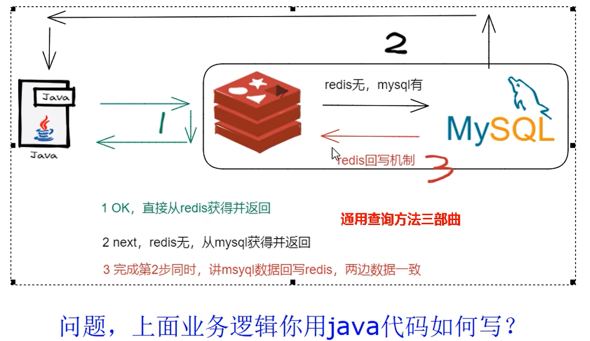  
在上面的这张图中分为以下三种情况:  
* java访问redis,如果有数据直接返回  
* java访问redis,如果没有数据则查询数据库,数据库返回数据
* 数据库返回数据的同时把本次查询的内容写入到redis

那么如何保证redis和数据库中的数据之间的匹配度尽量是接近完整的?  
<font color="#00FF00">这就是双写一致性问题</font>

### 3.2 面试题
* 有这么一种情况,微服务查询redis无数据,mysql有数据;为保证数据双写一致性回写redis你需要注意什么?<font color="#00FF00">双检加锁</font>策略你了解过吗?如何尽量避免缓存击穿?  
* 你只要用缓存,就可能会涉及到redis缓存与数据库双存储双写.你只要是双写,就一定会有数据一致性问题,<font color="#00FF00">那么你如何解决一致性问题</font>?  
* 双写一致性,你先动缓存redis还是数据库mysql?为什么?  
  * 先更新redis再更新mysql?
  * 先更新mysql再更新redis?
  * 先删除redis再删除mysql?
  * 先删除mysql再删除redis?
* <font color="#00FF00">延时双删</font>你做过吗?会有哪些问题?
* redis和mysql双写100%会出纰漏,做不到强一致性,你如何保证<font color="#00FF00">最终一致性</font>?

### 3.3 缓存双写一致性理解
* 如果redis中有数据,需要和数据库中值相等
* 如果redis中无数据,数据库中的值要是最新值,且准备写回redis
* 缓存按照操作分为两种  
  * 只读缓存:redis只有读操作,mysql中的数据不写回到redis  
    这种适合业务场景简单,并且也不会出错(因为没有回写的过程)  
  * 读写缓存:
    * 同步直写策略:  
      也即完成上图第二步(即从mysql中查询到数据后立即写回给redis)  
      对于读写缓存而言,要想保证缓存和数据库的一致就要采用同步直写策略
    * 异步缓写策略(推荐):  
      正常业务运行中,mysql数据变动了,但是可以在业务上容许出现一定时间后才作用于redis,比如仓库、物流系统  
      出现异常情况,不得不将失败的动作重新修补,有可能需要借助kafka或者rabbitMQ等消息中间件,实现重试重写

**如何用<font color="#0000FF">java代码实现上面那张图的业务逻辑?(即如何实现回写)</font>**  
*该代码解决了:有这么一种情况,微服务查询redis无数据,mysql有数据;为保证数据双写一致性回写redis你需要注意什么?<font color="#00FF00">双检加锁</font>策略你了解过吗?如何尽量避免缓存击穿?*
*<font color="#00FF00">双检加锁就是双重检查锁</font>*  

先看错误的写法:
```java
public User findUserById(Integer id) {
    User user = null;
    String key = "user:" + id;
    // 先从redis中查询数据,如果有数据直接返回没有必要从redis中查询数据
    user = (User) redisTemplate.opsForValue().get(key);
    if (user == null) {
        // redis中没有,继续查询mysql
        user = userMapper.selectById(id);
        if (user == null) {
            // 具体再细化,防止多次穿透,我们业务规定,记录下这个null值的key,列入黑名单或者记录或者异常
            return user;
        } else {
            // mysql有数据需要将数据写回redis,保证下一次缓存命中率
            redisTemplate.opsForValue().set(key, user);
        }
    }
    return user;
}
```
上面这段代码的写法有什么问题?  
因为在高并发的系统下,可能一瞬间有很多请求过来;由于这些请求之间的间隔很小,它们可能全部去请求mysql导致mysql瞬时的压力过大,并且mysql查询到数据之后;这些请求多次回写了redis库(最后一行代码);主要是因为mysql查询语句和写redis不是一个原子操作.  

双检加锁:
```java
public User findUserById(Integer id) {
    User user = null;
    String key = "user:" + id;
    // 先从redis中查询数据,如果有直接返回,如果没有再去查询mysql
    user = (User) redisTemplate.opsForValue().get(key);
    // 缓存存在直接返回
    if (user == null) {
        // 对于高QPS的优化,进来就先加锁,保证一个请求操作,让外面的redis等待一下,避免击穿mysql
        synchronized (YourService.class) {
            // 再查一次redis
            user = (User) redisTemplate.opsForValue().get(key);
            // 二次查询redis还是null,可以查询mysql了
            if (user == null) {
                // 有数据直接返回
                user = userMapper.selectById(id);
                if (user == null) {
                    return null;
                } else {
                    // mysql中有数据,需要回写redis,完成数据一致性同步
                    redisTemplate.opsForValue().setIfAbsent(key, user, 7L, TimeUnit.DAYS);
                }
            }
        }
    }
    return user;
}
```
多个线程同时去查询数据库的这条记录时,我们可以在第一个查询数据的请求上使用一个互斥锁来锁住它.其它的线程走到这一步等待拿锁,等第一个线程查询到了数据,然后做缓存.<font color="#00FF00">后面的线程进入临界区时发现已经有缓存了直接拿走缓存即可</font>.  
在这之后的线程就不需要加锁了,因为第一次查询redis就可以直接查询到数据返回  

### 3.4 数据库和缓存一致性的几种更新策略
1.这一章解决剩下的所有面试题  
* *你只要用缓存,就可能会涉及到redis缓存与数据库双存储双写.你只要是双写,就一定会有数据一致性问题,<font color="#00FF00">那么你如何解决一致性问题</font>?*  
* *双写一致性,你先动缓存redis还是数据库mysql?为什么?*  
* *<font color="#00FF00">延时双删</font>你做过吗?会有哪些问题?*  
* *redis和mysql双写100%会出纰漏,做不到强一致性,你如何保证<font color="#00FF00">最终一致性</font>?*

*提示:*  
*先动数据库=>引出延时双删*  
*先动redis=>引出最终一致性*

**目标:** 达到最终一致性  
<font color="#00FF00">给缓存设置过期时间,定期清理缓存并回写缓存,是保证最终一致性的解决方案.</font>  
我们可以对存入缓存的数据设置过期时间,所有的<font color="#FF00FF">写操作以数据库为准</font>,对缓存操作只是尽最大努力即可.也就是说如果数据库写成功,缓存更新失败,那么只要到达过期时间,则后面的读请求自然会从数据库中读取新值然后回填缓存,达到一致性,<font color="#00FF00">切记,如果redis与mysql数据库不一致,要以mysql的数据库写入库为准.</font>


2.可以停机的更新策略  
夜间运维上线,系统暂停对外服务;在此期间运维人员负责完成数据的双写一致性.  

3.不可停机的更新策略  
* 先更新mysql,再更新redis
* 先更新redis,再更新mysql
* 先删除redis,再更新mysql
* 先更新mysql,再删除redis

**先更新mysql,再更新redis(不行)**  
异常1:  
先更新mysql的某商品库存,当前商品的库存是100,更新为99个  
先更新mysql修改为99成功,然后更新redis  
此时假设异常出现,更新redis失败了,这导致mysql里面的库存是99而redis里面的还是100  
这种情况会造成数据库和redis中的数据不一致问题,读到redis脏数据  

异常2:  
  

**先更新redis,再更新mysql(不行)**  
不推荐:  
业务上一般把mysql作为底单数据库,保证最后解释  

异常:  
  
此时mysql和redis数据不一致  

**先删除redis,再更新mysql(不推荐)**  
<font color="#00FF00">巧用回写机制</font>  
异常问题:以下模拟一个多线程并发操作  
1 A线程先成功删除了redis中的数据,然后再去更新mysql,<font color="#00FF00">此时mysql正在更新中但还没有结束</font>(由于网络延时)  
<font color="#00FF00">B突然出现要来读取缓存中的数据</font>  
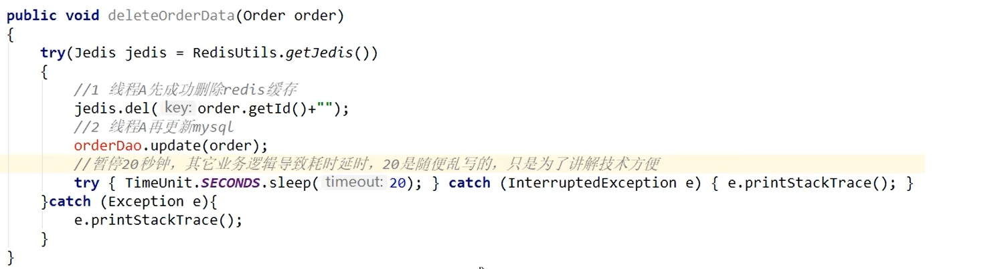  

2 此时redis中的数据是空的(因为被A线程删除了),B线程来读取redis中的数据;此时会出现两个问题:  
2.1 B无法从redis中读取数据,于是从mysql中读取数据,但此时的数据还没有被A线程更新,<font color="#00FF00">所以读到的是旧值</font>  
2.2 B会把读取到的旧值写回到redis  
<font color="#00FF00">获得旧值数据后返回前台并回写进redis(刚被A线程删除的旧数据有极大可能又被写回了)</font>  

  

3 A线程更新完mysql,发现redis里面的缓存是脏数据,A线程直接懵逼  
两个并发操作,一个是更新操作.一个是查询操作  
<font color="#00FF00">A删除缓存后,B查询操作没有命中缓存,B先把老数据读出来后放到缓存中,然后A更新操作更新了数据库.  
于是,在缓存中的数据还是老的数据,导致缓存中的数据是脏的,而且还一直这样脏下去了.</font>

4 总结流程  
  

5 为了解决上述问题,引入延时<font color="#00FF00">双删策略</font>  
  
说白了就是当A线程更新完数据库之后<font color="#FF00FF">主动延迟一段时间后</font>再执行一次删除redis的操作,<font color="#00FF00">那么只要能够保证A线程在B线程写入redis缓存之后再删除redis就可以了</font>.

5.1 <font color="#00FF00">那么这个延时的时间应该设置为多少?</font>  
* 方法一:在业务程序运行的时候,统计下线程读数据和写缓存的操作时间,自行评估自己的项目的读数据业务逻辑的耗时,以此为基础来进行估算.然后写数据的休眠时间则在读数据业务逻辑的耗时基础上加<font color="#00FF00">百毫秒</font>即可.  
  这么做的目的就是确保读请求结束,<font color="#00FF00">写请求可以删除读请求造成的缓存脏数据</font>
* 方法二:新启动一个后台监控程序,比如后面要讲的WatchDog监控程序会加时  

5.2 <font color="#00FF00">手动延迟造成的吞吐量降低如何解决?</font>  
  
<font color="#00FF00">通过Future在第二次删除的时候异步删除,不影响主线程的执行流程.</font>  

**先更新数据库,再删除redis(推荐)**  
*这种方案也不是最完美的,它同样也有问题只是比较推荐这种方式*  
异常:  
  
<font color="#00FF00">这种方式可能会读取到缓存旧值</font>  
*此外还有一个问题,有没有可能删除缓存失败?*  
*由此就引入了最后一个问题*  
*redis和mysql双写100%会出纰漏,做不到强一致性,你如何保证<font color="#00FF00">最终一致性</font>?*  

<font color="#FF00FF">最终一致性解决方案:</font>  
流程图:  
  

* 可以把要删除的缓存值或者是要更新的数据库值暂存到消息队列中(例如使用Kafka/RabbitMQ等)  
* 当程序没有能够成功地删除缓存值或者是更新数据库值时,可以从消息队列中重新读取这些值,然后再次进行删除或更新.
* 如果能够成功地删除或更新,我们就要把这些值从消息队列中去除,以免重复操作,此时我们也可以保证数据库和缓存的数据一致了,否则还需要再次进行重试
* 如果重试超过的一定次数后还是没有成功,我们就需要向业务层发送报错信息了,通知运维人员

**如何选择方案?利弊如何?**  
大多数业务场景下,优先使用<font color="#00FF00">先更新数据库,再删除redis(先更库->后删存)</font>,理由如下:  
* 先删除缓存值再更新数据库,有可能导致请求因缓存缺失而访问数据库,给数据库带来压力导致打满mysql(感觉这不是原因啊...不是有双检方案么)  
* 如果业务应用中读取数据库和写缓存的时间不好估算,<font color="#00FF00">那么延迟双删中的等待时间就不好设置(即之前说的延时双删如何确定延时时长)</font>  

如果使用先更新数据库再删除缓存的方案  
如果业务要求必须读写一致性的数据,那么我们就需要在更新数据库时,先在redis缓存客户端暂停并发读请求,等数据库更新完、缓存值删除后,再读取数据,从而保证数据一致性,这是理论可以达到的效果,但实际不推荐,因为真实生产环境中,分布式下很难做到<font color="#00FF00">实时一致性</font>,<font color="#00FF00">一般都是最终一致性</font>(最终一致性即保证数据最终是一致的,好好评鉴下面的图),请大家参考.  

**一图总结:**  
  


### 3.5 双写一致性落地工程案例
**目录:**  
3.5.1 面试题  
3.5.2 canal  
3.5.3 mysql-canal-redis双写一致性编码  

#### 3.5.1 面试题
问:mysql有记录改动了(有增删改写操作),立刻同步反应到redis?该如何做?  
答:通过读取mysql中的binlog日志,一旦binlog日志有改动读取该日志后理解将数据同步到redis.  

<font color="#00FF00">那么就需要有一种技术,能够监听到mysql的变动且能够通知给redis</font>,它就是<font color="#FF00FF">canal</font>  


#### 3.5.2 canal 
1.介绍  
canal主要用途是用于mysql数据库增量日志数据的订阅、消费和解析,是阿里巴巴开发并开源的,采用java语言编写.  
历史背景是早期阿里巴巴因为杭州和美国双机房部署,存在跨机房数据同步的业务需求,实现方式主要是基于业务trigger(触发器)获取增量变更.从2010年开始,阿里巴巴逐步尝试采用解析数据库日志获取增量变更进行同步,由此衍生出了canal项目;

  

<font color="#00FF00">canal自已伪装成master的一个slave,当数据库有变动的时候数据库会发送binlog给slave(canal);接着canal再将这些日志发送给下游节点(例如mysql、kakfa、elasticsearch)</font>  

2.基于日志增量订阅和消费的业务包括
* 数据库镜像
* 数据库实时备份
* 索引构建和实时维护(拆分异构索引、倒排索引等)
* 业务cache刷新
* 带业务逻辑的增量数据处理

3.下载  
[canal官方GitHub](https://github.com/alibaba/canal/releases)  
下载1.1.6版本  

5.传统mysql主从复制工作原理  
  
* master上的数据发生改变,将变更内容写入mysql的binlog中  
* slave从机会每个一段时间对master主机上的二进制日志进行探测,探测其是否发生了改变;如果发生了改变则开始一个I/O线程请求master二进制日志
* 同时master为每个从机I/O线程启动一个dump线程用于向其发送binlog日志
* slave从机将接收到的二进制日志保存在自已本地的中继日志文件中  
* slave从机将启动sql线程从中继日志中读取二进制日志,在本地重放,使得其数据和主服务器保持一致

6.canal工作原理  
  
* canal模拟mysql slave的交互协议,伪装自已为mysql slave,向mysql master发送dump协议  
* mysql master收到dump请求,开始推送binlog给slave(即canal)  
* canal解析binlog对象(原始为byte流)

#### 3.5.3 mysql-canal-redis双写一致性编码
1.java案例来源出处  
[https://github.com/alibaba/canal/wiki/ClientExample](https://github.com/alibaba/canal/wiki/ClientExample)  

2.执行`show master status`命令查看当前master的binlog状态

3.执行`show variables like 'log_bin'`命令查看binlog是否开启

4.配置mysql的my.ini配置文件  
*编写配置文件之前先备份*  
在[mysqld]配置项下添加如下内容:  
```shell
[mysqld]
# 开启bin-log
log-bin="DESKTOP-979QMU8-bin"
# 选择ROW模式
binlog-fortamt=ROW
# 配置mysql replication需要定义,不需要和canal的slaveID重复
server-id=1
```
`binlog-fortamt`:  
* ROW:除了记录sql语句之外,还会记录每个字段的变化情况,能够清楚的记录每行数据的变化历史,但会占用较多的空间.
* STATEMENT:只记录了sql语句,但是没有记录上下文信息,在进行数据恢复的时候可能会导致数据的丢失情况
* MIX:比较灵活的记录,理论上说当遇到了表结构变更的时候,就会记录为statement模式.当遇到了数据更新或者删除情况下就会变为row模式

5.重启mysql

6.再次执行`show variables like 'log_bin'`命令查看binlog是否开启  
<font color="#00FF00">如果显示on代表开启</font>  

7.创建canal用户  
```sql
DROP USER IF EXISTS 'canal'@'%';
CREATE USER 'canal'@'%' IDENTIFIED BY 'canal';
GRANT ALL PRIVILEGES ON *.* TO 'canal'@'%' IDENTIFIED BY 'canal';
FLUSH PRIVILEGES;
```

8.下载  
[canal官方GitHub](https://github.com/alibaba/canal/releases)  
下载1.1.6版本的开发者版本  
canal.deployer-1.1.6.tar.gz  

9.上传到linux,放入~/software/canal路径下  
解压后的文件结构如下:  
* bin:二进制
* conf:配置文件
* lib:依赖
* logs:日志文件
* plugin:插件

10.修改配置  
修改`~/software/canal/conf/example/instance.properties`  
配置canal监控的mysql的地址  
* `canal.instance.master.address=127.0.0.1:3306` 修改master的地址  
* `canal.instance.dbUsername=[userName]` 修改canal连接mysql时需要的账号和密码
* `canal.instance.dbPassword=[password]` 修改canal连接mysql时需要的账号和密码
* `canal.instance.filter.regex=[pattern(default=.*\\..*)]` 配置canal的监听范围(默认是全库全表)  
* `canal.instance.filter.black.regex=[pattern(default=mysql\\.slave_.)]` 配置canal的监听范围的黑名单


11.canal启动  
进入到bin目录下,执行`./startup.sh`  

12.查看canal是否启动成功  
查看logs/canal/canal.log日志  
  
如果能够看到这段日志表明启动成功  

查看logs/canal/example.log  
  

13.Java创建模块  
*大体的思路是,canal监控mysql;将监控到的数据传递给Java,Java再将数据回写到redis*  
专门编写一个Java的canal模块处理这份工作(一定是springboot模块)  

14.添加pom  
```xml
<dependency>
    <groupId>com.alibaba.otter</groupId>
    <artifactId>canal.client</artifactId>
    <version>1.1.0</version>
</dependency>
```

15.配置yml文件  
  
这里配置的数据源是MySQL数据库,不是canal  

16.编写RedisUtils工具类  
```java
public class RedisUtils {
    public static final String REDIS_IP_ADDR = "192.168.111.185";
    public static final String REDIS_pwd = "111111";
    public static JedisPool jedisPool;

    static {
        JedisPoolConfig jedisPoolConfig = new JedisPoolConfig();
        jedisPoolConfig.setMaxTotal(20);
        jedisPoolConfig.setMaxIdle(10);
        jedisPool = new JedisPool(jedisPoolConfig, REDIS_IP_ADDR, 6379, 10000, REDIS_pwd);
    }

    public static Jedis getJedis() throws Exception {
        if (null != jedisPool) {
            return jedisPool.getResource();
        }
        throw new Exception("Jedispool is not ok");
    }
}
```

17.编写RedisCanalClientExample  
```java
public class RedisCanalClientExample {

    public static final Integer _60SECONDS = 60;
    public static final String REDIS_IP_ADDR = "127.0.0.1";

    public static void redisInsert(List<Column> columns) {

        JSONObject jsonObject = new JSONObject();
        for (Column column : columns) {
            System.out.println(column.getName() + ": " + column.getValue() + " insert = " + column.getUpdated());
            jsonObject.put(column.getName(), column.getValue());
        }

        if (columns.size() > 0) {
            try (Jedis jedis = RedisUtils.getJedis()) {
                jedis.set(columns.get(0).getValue(), jsonObject.toJSONString());
            } catch (Exception e) {
                e.printStackTrace();
            }
        }
    }

    public static void redisDelete(List<Column> columns) {
        JSONObject jsonObject = new JSONObject();
        for (Column column : columns) {
            System.out.println(column.getName() + ": " + column.getValue() + " delete = " + column.getUpdated());
            jsonObject.put(column.getName(), column.getValue());
        }

        if (columns.size() > 0) {
            try (Jedis jedis = RedisUtils.getJedis()) {
                jedis.del(columns.get(0).getValue());
            } catch (Exception e) {
                e.printStackTrace();
            }
        }
    }

    public static void redisUpdate(List<Column> columns) {

        JSONObject jsonObject = new JSONObject();
        for (Column column : columns) {
            System.out.println(column.getName() + ": " + column.getValue() + " update = " + column.getUpdated());
            jsonObject.put(column.getName(), column.getValue());
        }

        if (columns.size() > 0) {
            try (Jedis jedis = RedisUtils.getJedis()) {
                jedis.set(columns.get(0).getValue(), jsonObject.toJSONString());
            } catch (Exception e) {
                e.printStackTrace();
            }
        }
    }
    // 官方代码,打印一个节点的信息(监听到的事件信息)
    public static void printEntry(List<Entry> entrys) {
        for (Entry entry : entrys) {
            if (entry.getEntryType() == EntryType.TRANSACTIONBEGIN || entry.getEntryType() == EntryType.TRANSACTIONEND) {
                continue;
            }

            RowChange rowChage = null;
            try {
              // 获取变更的row数据
                rowChage = RowChange.parseFrom(entry.getStoreValue());
            } catch (Exception e) {
                throw new RuntimeException("ERROR ## parser of eromanga-event has an error , data:" + entry.toString(),
                        e);
            }
            // 获得提交的变动类型,insert、update、delete
            EventType eventType = rowChage.getEventType();
            System.out.println(String.format("================&gt; binlog[%s:%s] , name[%s,%s] , eventType : %s",
                    entry.getHeader().getLogfileName(), entry.getHeader().getLogfileOffset(),
                    entry.getHeader().getSchemaName(), entry.getHeader().getTableName(),
                    eventType));
            // 自已新增的业务逻辑(官方没有)
            for (RowData rowData : rowChage.getRowDatasList()) {
                if (eventType == EventType.DELETE) {
                    redisDelete(rowData.getBeforeColumnsList());
                } else if (eventType == EventType.INSERT) {
                    redisInsert(rowData.getAfterColumnsList());
                } else {
                    System.out.println("-------&gt; before");
                    redisUpdate(rowData.getBeforeColumnsList());
                    System.out.println("-------&gt; after");
                }
            }
        }
    }

    public static void main(String[] args) {
        /*
         创建canal连接
         args0:需要指定canal的地址和端口号
         args1:example
         args2:canal的用户名
         args2:canal的密码(这里没写代表使用默认的用户名和密码canal)
         */
        CanalConnector connector = CanalConnectors.newSingleConnector(new InetSocketAddress(AddressUtils.getHostIp(),
                11111), "example", "", "");
        int batchSize = 1000;
        // 空闲空转监听器
        int emptyCount = 0;
        try {
            // 获得connection
            connector.connect();
            // 监听当前库的所有表
            // connector.subscribe(".*\\..*");
            // 这里是正则表达式,代表监听哪个库的哪个表([database].[table]这里是jmall库的t_user表)
            connector.subscribe("jmall.t_user");
            connector.rollback();
            int totalEmptyCount = 10 * _60SECONDS;
            // 这里代表监听10分钟,如果十分钟内都没有监听到数据程序就停止;如果需要一直监听就写true
            while (emptyCount < totalEmptyCount) {
                System.out.println("我是canal,每秒监听一次:" + UUID.randomUUID().toString());
                Message message = connector.getWithoutAck(batchSize); // 获取指定数量的数据
                long batchId = message.getId();
                int size = message.getEntries().size();
                if (batchId == -1 || size == 0) {
                    // MySQL数据没有变动
                    emptyCount++;
                    System.out.println("empty count : " + emptyCount);
                    try {
                        Thread.sleep(1000);
                    } catch (InterruptedException e) {
                    }
                } else {
                    emptyCount = 0;
                    // System.out.printf("message[batchId=%s,size=%s] \n", batchId, size);
                    // 打印节点
                    printEntry(message.getEntries());
                }

                connector.ack(batchId); // 提交确认
                // connector.rollback(batchId); // 处理失败, 回滚数据
            }

            System.out.println("empty too many times, exit");
        } finally {
            connector.disconnect();
        }
    }
}
```

**这段代码实现了什么效果?**  
该java程序会每隔1s去读取MySQL的binlog日志,它会去监控设定的表;如果表中的数据发生了改变它会实时感知到,并且<font color="#00FF00">当MySQL新增一条数据时它会同步到redis,MySQL更新一条数据时会同步到redis,MySQL删除一条数据时会同步到redis.</font>  
实际上只要启动这个main方法即可,可以不需要和springboot整合.  
<font color="#FF00FF">通过这种方法就可以实现**双写一致**性(最终一致性)</font>  

**表的监控问题:**  
canal是通过`subscribe`方法设置监控范围的,该方法采用正则表达式进行监控,它的规则参考如下:  
  
除了在代码中指定监听范围还可以通过上面讲的`instance.properties`配置文件来指定  


## 4.bitmap、hyperloglog、geo实战
**目录:**  
4.1 面试题  
4.2 亿级系统中常见的四种统计  
4.3 hyperloglog  
4.4 GEO  
4.5 bitmap  


### 4.1 面试题
* 抖音电商直播,主播介绍的商品有评论,1个商品对应了1系列的评论,排序+展现+取前10条记录  
* 用户在手机App上的签到打卡信息:1天对应1系列用户的签到记录,新浪微博、钉钉打卡签到,对用户来没来如何统计?
* 应用网站上的网页访问信息:1个网页对应1系列的访问点击,淘宝网首页,每天有多少人浏览首页?
* 你们公司系统上线后,说一下UV、PV、DAU分别是多少?  
* 对集合中的数据进行统计  
  痛点:类似今日头条、抖音、淘宝这样的额用户访问级别都是亿级的,请问如何处理?  
  在移动应用中,需要统计每天的新增用户数和第2天的留存用户数
* 在电商网站的商品评论中,需要统计评论列表中的最新评论
* 在签到打卡中,需要统计一个月内连续打卡的用户数
* 在网页访问记录中,需要统计独立访客(unique visitor,UV)量

**需求痛点:**  
* 亿级数据的收集+清洗+统计+展现
* 能不能存?能不能取?能不能多维度展现?

### 4.2 亿级系统中常见的四种统计
**分类:** 聚合统计、排序统计、二值统计、基数统计  
**聚合统计:**  
统计多个集合元素的聚合结果,就是前面讲解过的<font color="#00FF00">交差并</font>等集合统计  
应用场景:聚合统计,用于社交场景;猜你喜欢、你可能认识、你们的共同好友  

**排序统计:**  
抖音短视频最新评论留言的场景,请你设计一个展现列表.  
考察你的数据结构和设计思路  
  
我第一个想到的也是<font color="#00FF00">zset</font>  
在面对需要展示最新列表、排行榜等场景时,如果数据更新频繁或者需要分页显示,建议使用zset  

**二值统计:**  
适用于集合取值元素只有0和1两种场景.在钉钉上班签到打卡的场景中,我们只要记录有签到(1)或没有签到(0)  
见bitmap  

**基数统计:**  
指统计一个集合中不<font color="#00FF00">重复的元素的个数</font>  
见hyperloglog

### 4.3 hyperloglog 
**目录:**  
4.3.1 名词介绍  
4.3.2 模拟需求  
4.3.3 hyperloglog原理讲解  
4.3.4 淘宝首页亿级UV的redis统计方案  

#### 4.3.1 名词介绍
1.什么是UV  
UV就是独立访客,例如统计某个文章的访问量,同一个IP多次访问肯定是只算一次的;但是又不需要把每次访问的IP都存到数据库中,直接在Redis中就完成这个操作,所以UV是需要考虑去重的.  

2.什么是PV  
PageView页面浏览量,不需要去重  

3.什么是DAU  
DayActivityUser(日活跃用户量)  
登陆或者使用某个产品的用户数(去重复登陆的用户)  
常用于反映网站、互联网应用或者网络游戏的运营情况  

4.什么是MAU  
MountActivityUser(月活跃用户量)  

#### 4.3.2 模拟需求
很多计数类场景,比如每日注册IP数、每日访问IP数、页面实时访问数PV、访问用户数UV等.  
因为主要的目标高效、巨量地进行计数,所以对存储的数据的内容并不太关心.  
也就是说它(hyperloglog)只能用于统计巨量数量,不太涉及具体的统计对象的内容和精准性.  
统计单日一个页面的访问量(PV)单次访问就算一次.  
统计单日一个页面的用户访问量(UV),即按照用户为维度计算,单个用户一天内多次访问也只算一次.  
多个key的合并统计,某个门户网站的所有模块的PV聚合统计就是整个网站的总PV.  

#### 4.3.3 hyperloglog原理讲解
1.基数统计就是hyperloglog  

2.去重复统计有哪些方式?  
HashSet、BitMap  
这两种方式都存在问题,样本元素越多内存消耗急剧增大,难以管控+慢,对于亿级统计不太合适.  
BitMap在小数据集,百万级都是吃的住的;并且它有一个好处是bitmap的统计是精确的,但bitmap的坏处就是数据集上去之后内存消耗太大.  
<font color="#00FF00">量变引起质变</font>

3.解决办法(概率算法)  
<font color="#00FF00">通过牺牲准确率来换取空间</font>,对于不要求<font color="#00FF00">绝对准确率</font>的场景下可以使用,因为<font color="#00FF00">概率算法不直接存储数据本身</font>,通过一定的概率统计方法预估基数值,同时保证误差在一定范围内,由于又不储存数据故此可以大大节约内存.  
<font color="#00FF00">HyperLogLog就是一种概率算法的实现</font>.

4.原理说明  
只是进行不重复的基数统计,不是集合也不保存数据,只记录数量而不是具体内容.  
hyperloglog提供不精确的去重计数方案,<font color="#00FF00">通过牺牲准确率来换取空间,误差仅仅只是0.81%左右</font>  
为什么是0.81%,理论出处来源:[antirez的博客](http://antirez.com/news/75)  

#### 4.3.4 淘宝首页亿级UV的redis统计方案  
**需求:**  
UV的统计需要去重,一个用户一天内的多次访问只能算作一次  
淘宝、天猫首页的UV,平均每天是1~1.5个亿左右  
每天存1.5个亿的IP,访问者来了后先去查是否存在,不存在加入  

**方案讨论:**  
1.使用redis的hash类型  
每次存储的时候都填写上IP,例如:  
`hset 20230918 192.168.0.1 1`  
问题:  
按照ipv4的结构来说明,每个ipv4的地址最多是15个字节(ip="192.168.111.1",最多xxx.xxx.xxx.xxx)  
某一天的1.5亿*15个字节=2G,一个月60G,redis死定了(内存吃不住)  

2.使用hyperloglog类型  
为什么只需要花费12kb?  
  

**java代码**  
3.HyperLogLogService  
```java
@Service
public class HyperLogLogService {

    private RedisTemplate redisTemplate;

    public HyperLogLogService(RedisTemplate redisTemplate) {
        this.redisTemplate = redisTemplate;
    }

    @PostConstruct
    // PostConstruct注解代表依赖注入完整后会自动调用该方法
    public void initIP() {
        new Thread(new Runnable() {
            @Override
            public void run() {
                String ip = null;
                Random random = new Random();
                for (int i = 0; i < 200; i++) {
                    ip = random.nextInt(256) + "." +
                            random.nextInt(256) + "." +
                            random.nextInt(256) + "." +
                            random.nextInt(256);
                    redisTemplate.opsForHyperLogLog().add("hll", ip);
                    try {
                        // 暂停3秒
                        TimeUnit.SECONDS.sleep(3);
                    } catch (InterruptedException e) {
                        throw new RuntimeException(e);
                    }
                }
            }
        }, "t1").start();
    }

    /**
     * 统计UV
     *
     * @return 返回数量
     */
    public long uv() {
        return redisTemplate.opsForHyperLogLog().size("hll");
    }

}
```

4.HyperLogLogController
```java
@RestController
public class HyperLogLogController {

    private final HyperLogLogService hyperLogLogService;

    public HyperLogLogController(HyperLogLogService hyperLogLogService) {
        this.hyperLogLogService = hyperLogLogService;
    }
    // 获取UV数量
    @RequestMapping(value = "uv", method = RequestMethod.GET)
    public long uv() {
        return hyperLogLogService.uv();
    }

}
```

### 4.4 GEO
**目录:**  
4.4.1 面试题  
4.4.2 美团地理位置附近酒店推送  


#### 4.4.1 面试题  
移动互联网时代LBS应用越来越多,交友软件中附近的小姐姐、外卖软件中附近的美食店铺、打车软件附近的车辆等等.  
那这种附近各种形形色色的XXX地址位置选择是如何实现的?

**会有什么问题?**  
* 查询性能问题,如果并发高,数据量大这种查询是要搞垮mysql数据库的
* 一般mysql查询的是一个平面矩形访问,而叫车服务要以我为中心N公里为半径的圆形覆盖
* 精准度的问题,我们知道地球不是平面坐标系,而是一个圆球,这种矩形计算在长距离计算时会有很大误差,mysql不合适  

#### 4.4.2 美团地理位置附近酒店推送
**需求分析:**  
* 美团app附近酒店
* 摇一摇附近的人
* 高德地图附近的人或者一公里以内的各种营业厅、加油站、理发店
* 找个小黄车

1.GeoController(不再赘述)  

2.GeoService(示例代码)
```java
public class GeoService{

    public static final String CITY = "city";

    private RedisTemplate redisTemplate;

    // 提供注入的构造方法

    public string geoAdd() {
        Map<String, point> map = new HashMap<>();
        map.put("天安门", new Point(116.403963, 39.915119));
        map.put("故宫", new point(116.403414, 39.924091));
        map.put("长城", new Point(116.024067, 40.362639));
        redisTemplate.opsForGeo().add(CITY, map);
        return map.tostring();
    }

    public Point position(string member) {
        // 获取经纬度坐标,这里的member可以有多个,返回的list也可以有多个
        list<Point> list = redisTemplate.opsForGeo().position(CITY, member);
        return list.get(0);
    }

    public string hash(string member) {
        //geohash算法生成的base32编码值,这里的member可以有多个,返回的list也可以有多个
        List<string> list = redisTemplate.opsForGeo().hash(CITY, member);
        return list.get(o);
    }

    public Distance distance(string member1,string member2) {
        //获取两个给定位置之间的距离
        // agrs3:结果的距离单位
        Distance distance = redisTemplate.opsForGeo().distance(CITY, member1, member2, RedisGeoCommands.DistanceUnit.KILOMETERS);
        return distance;
    }

    public GeoResults radiusByxy() {
        //通过经度,纬度查找附近的,北京王府井位置116.418017, 39.914402
        Circle circle = new Circle(116.418017, 39.914402, Metrics.KILOMETERS.getMultiplier());
        //返回50条记录:
        RedisGeoCommands.GeoRadiusCommandArgs args =
                RedisGeoCommands.GeoRadiusCommandArgs.newGeoRadiusArgs().includeDistance().includeCoordinates().sortAscending().limit(50);
        GeoResults<RedisGeoCommands.GeoLocation<String>> geoResults =
                this.redisTemplate.opsForGeo().radius(CITY, circle, args);
        return geoResults;
    }

    public GeoResults radiusByMember() {
        //通过地方查找附近
        String member = "天安门";
        //返回50条
        RedisGeoCommands.GeoRadiusCommandArgs args = RedisGeoCommands.GeoRadiusCommandArgs.newGeoRadiusArgs().includeDistance().includeCoordinates().sortAscending().limit(5e);
        //半径10公里内
        Distance distance = new Distance(10,Metrics.KILOMETERS);
        GeoResults<RedisbeoCommands.GeoLocation<String>> geoResults = this.redisTemplate.opsForbeol().radius(CITY, member, distance, angs);
        return geoResults;
    }
}
```

### 4.5 bitmap
**目录:**  
4.5.1 面试题  
4.5.2 京东签到领取京东豆  
4.5.3 实战案例  


#### 4.5.1 面试题  
* 日活统计
* 连续签到打卡
* 最近一周的活跃用户
* 统计指定用户一年之中的登陆天数
* 某用户按照一年365天,哪几天登陆过?哪几天没有登陆?全年中登陆的天数共计有多少?  

#### 4.5.2 京东签到领取京东豆
1.需求说明:  
  

2.小厂解决方案:  
可以使用MySQL  
**痛点:**  
方法正确但是难以落地实现  
签到用户小这么设计能行,但京东这个体量的用户(估算3000W签到用户,一天一条数据,一个月就是9亿数据)  
对于京东这样的体量,如果一条签到记录对应着当日用记录,那会很恐怖  

**如何解决该痛点?**  
* 一条签到记录对应一条记录,会占据越来越大的空间.
* 一个月最多31天,刚好我们的int类型是32位,那这样一个int类型就可以搞定一个月,32位大于31天,当天来了位是1没来就是0. 
* 一条数据直接存储一个月的签到记录,不再是存储一天的签到记录

3.大厂解决方案  
基于redis的bitmap实现签到日历  

#### 4.5.3 实战案例
**案例实战见下一章,bitmap类型签到+<font color="#00FF00">布隆过滤器</font>**

## 5.布隆过滤器(BloomFilter)
**目录:**  
5.1 面试题  
5.2 基本介绍  
5.3 布隆过滤器原理  
5.4 布隆过滤器使用场景  
5.5 尝试手写布隆过滤器  
5.6 布谷鸟过滤器  


### 5.1 面试题  
* 已有50亿个电话号码,现有10万个电话号码,如何快速准确判断这10万电话号码是否存在于50亿个当中  
  **难点:**  
  通过数据库查询,可以实现但速度很慢  
  数据预放到内存集合:50亿*8字节大约40GB,内存吃不住
* 判断是否存在,布隆过滤器了解吗?
* 安全连接网址,全球数10亿的网址判断
* 黑名单校验,识别垃圾邮件
* 白名单校验,识别出合法用户进行后续处理

### 5.2 基本介绍
布隆过滤器:是由一个初值都为0的bit数组和<font color="#00FF00">多个哈希函数</font>构成,用于快速判断集合中是否存在某个元素.  
  
布隆过滤器是一种<font color="#00FF00">类似set</font>的数据结构,<font color="#00FF00">只是统计结果在巨量数据下有点小瑕疵,不够完美</font>.  
它实际上是一个很长的<font color="#00FF00">二进制数组(00000000)+一系列随机hash算法</font>映射函数,主要用于判断一个元素是否在集合中.  
通常我们会遇到很多要判断一个元素是否在某个集合中的业务场景,一般想到的是将集合中所有元素保存起来,然后通过比较确定.  
链表、树、哈希表等等数据结构都是这种思路.但是随着集合中元素的增加,我们需要的存储空间也会呈现线性增长,最终达到瓶颈.同时检索速
度也越来越慢,上述三种结构的检索时间复杂度分别为O(n),O(logn),O(1).这个时候,布隆过滤器(Bloom Filter)就应运而生  
  

**布隆过滤器的作用:**  
* 高效地插入和查询,占用空间少,返回的结果是不确定性(它就很类似bitmap,不保存数据的具体信息,只做逻辑判断)+不够完美
* <font color="#FF00FF">一个结果如果判定为存在时则该元素不一定存在,如果判定为不存在时则该元素一定不存在</font>  
  因为是<font color="#00FF00">一系列hash算法</font>,但凡是涉及到hash算法都有可能存在hash冲突.那么就出现一种情况假设某个坑位(某位)已经被之前的判断占用为1;那么对当前这个坑位的判断它是存在的,但具体是哪个值存在就不清楚了(有可能是A也有可能是B)
* 布隆过滤器可以添加元素,但是<font color="#00FF00">不能删除元素</font>,由于涉及hashcode判断依据,删掉元素会<font color="#FF00FF">导致误判率的增加</font>.  
  例如上面讲的例子,现在某个坑位是1(判断存在);但这个坑位1是由A、B、C三个元素都存放在这个坑位上的,<font color="#00FF00">假设把A元素删除会导致B和C元素连带删除;即哈希冲突共用坑位</font>.

### 5.3 布隆过滤器原理
**目录:**  
5.3.1 布隆过滤器实现原理和数据结构  
5.3.2 使用3步骤  
5.3.3 布隆过滤器误判率,为什么不要删除  
5.3.4 小总结  


#### 5.3.1 布隆过滤器实现原理和数据结构  
**原理:**  
布隆过滤器(Bloom Filter)是一种专门用来解决去重问题的高级数据结构.  
实质就是<font color="#00FF00">一个大型位数组和几个不同的无偏hash函数</font>(无偏表示分布均匀;即希望桶/坑位的分配均匀).由一个初值都为零的bit数组和多个个哈希函数构成,用来快速判断某个数据是否存在.但是跟HyperLogLog一样,它也一样有那么一点点不精确,也存在一定的误判概率  

2.添加key、查询key:  
**添加key**  
使用多个hash函数对key进行hash运算得到一个整数索引值,对位数组长度进行取模运算得到一个位置,<font color="#00FF00">每个hash函数都会得到一个不同的位置(并且尽量均匀分配到位数组中),将这几个位置都置1就完成了add操作</font>.  

**查询key**  
只要有其中一位是0就表示这个key不存在,但如果都是1,<font color="#00FF00">则不一定存在对应的key</font>.  
<font color="#FF00FF">也就是说我可以用一个坑位来表示一个元素是否存在;但我也可以使用多个hash函数多个坑位来表示一个元素是否存在.</font>  

**结论:**  
有,可能是有  
无,一定是无  

3.hash冲突导致数据不精准  
当有变量被加入集合时,通过N个映射函数将这个变量映射成位图中的N个点,把它们置为1(假定有两个变量都通过3个映射函数)
  
查询某个变量的时候我们只要看看这些点是不是都是1,就可以大概率知道集合中有没有它了.  
*通过这个例子,再次说明为啥布隆过滤器不可以删除,假设这里要删除obj1,通过删除坑位3来实现;<font color="#00FF00">但是坑位3既是obj1又是obj2</font>;当删除坑位3时不仅删除了obj1还删除了obj2*  
如果这些点,有任何一个为0则被查询的对象一定不存在  
如果都是1,则被查询的变量很可能存在;例如现在有个obj3它从来都没有被添加到过滤器中,但是计算obj3它的映射函数得到的坑位是1、8、12会发现这三个坑都是1,结果就是obj3存在;<font color="#00FF00">而实际上我们知道出现这种情况并不是因为obj3存在而是出现了hash碰撞.</font>  
正是基于布隆过滤器的快速检测特性,我们可以在把数据写入数据库时,使用布隆过滤器做个标记.当缓存缺失后,应用查询数据库时,可以通过查询布隆过滤器快速判断数据是否存在.如果不存在,就不用再去数据库中查询了.这样一来,即使发生缓存穿透了,大量请求只会查询Redis和布隆过滤器,而不会积压到数据库,也就不会影响数据库的正常运行.<font color="#00FF00">布隆过滤器可以使用Redis实现,本身就能承担较大的并发访问压力.</font>  
<font color="#FF00FF">也就是说布隆过滤器先档在最前面,当查询一个数据的时候先查询布隆过滤器,如果布隆过滤器判断数据不存在就不需要去请求redis与数据库;从而避免数据既不在redis又不在数据库时发生的缓存穿透.如果查询到有数据,那就去访问数据.</font>

4.再讲hash冲突导致数据不精准  
**哈希函数:**  
哈希函数的概念是:将任意大小的输入数据转换成特定大小的输出数据的函数,转换后的数据称为哈希值或哈希编码,也叫散列值.  
  
图中画红圈的表示哈希冲突了  
如果两个散列值是不相同的(根据同一函数)那么这两个散列值的原始输入也是不相同的.  
这个特性是散列函数具有确定性的结果,具有这种性质的散列函数称为单向散列函数.  
散列函数的输入和输出不是唯一对应关系的,<font color="#00FF00">如果两个散列值相同,两个输入值很可能是相同的,但也可能不同</font>,这种情况称为"散列碰撞(collision)".  
用hash表存储大数据量时,空间效率还是很低,当只有一个hash函数时,还很容易发生哈希碰撞.


#### 5.3.2 使用3步骤
1.初始化bitmap  
布隆过滤器本质上是由长度为m的位向量或位列表(仅包含0或1位值列表)组成,最初所有的值均设置为0  
  

2.添加占坑位  
当我们向布隆过滤器中添加数据时,为了尽量地址不冲突,<font color="#00FF00">会使用多个hash函数对key进行运算</font>,算得一个下标索引值,然后对位数组长度进行<font color="#00FF00">取模运算</font>得到一个位置,每个hash函数都会算得一个不同的位置.再把位数组的这几个位置都置为1就完成了add操作.  
例如,我们添加一个字符串wmyskxz,对字符串进行多次hash(key)->取模运行->得到坑位  
  

3.判断是否存在  
向布隆过滤器查询某个key是否存在时,先把这个key通过相同(和放入时相同)的多个hash函数进行运算,查看对应的位置是否都为1,<font color="#00FF00">只要有一个位为零,那么说明布隆过滤器中这个key不存在;</font>  
<font color="#00FF00">如果这几个位置全都是1,那么说明极有可能存在;</font>  
因为这些位置的1可能是因为其他的key存在导致的,也就是前面说过的hash冲突  
例如:  
我们在add了字符串wmyskxz数据之后,很明显下面1/3/5这几个位置的1是因为第一次添加的wmyskxz而导致的;  
此时我们查询一个没添加过的不存在的字符串inexistent-key,它有可能计算后坑位也是1/3/5,这就是误判了

#### 5.3.3 布隆过滤器误判率,为什么不要删除
布隆过滤器的误判是指多个输入经过哈希之后在相同的bit位置1了,这样就无法判断究竟是哪个输入产生的,因此误判的根源在于相同的bit位被多次映射且置1.  
这种情况也造成了布隆过滤器的删除问题,因为布隆过滤器的每一个bit并不是独占的,很有可能多个元素<font color="#00FF00">共享了某一位</font>.  
如果我们直接删除这一位的话,会影响其他的元素  
特性:  
布隆过滤器可以添加元素,但是不能删除元素.因为删掉元素会导致误判率增加.


#### 5.3.4 小总结
是否存在:  
有,可能是有  
无,一定是无  

使用时最好不要让实际元素数量远大于初始化数量,一次给够避免扩容

当实际元素数量超过初始化数量时,应该对布隆过滤器进行重建,
重新分配一个size更大的过滤器,再将所有的历史元素批量add拷贝进去

### 5.4 布隆过滤器使用场景
1.解决缓存穿透的问题,和redis结合bitmap使用  
**缓存穿透是什么?**  
一般情况下,先查询缓存redis是否有该数据,缓存中没有时再查询数据库  
当数据库也不存在该条数据时,每次查询都要访问数据库,这就是缓存穿透(即redis名存实亡,并没有挡在MySQL前面)  
缓存穿透带来的问题是,当有大量请求查询数据库不存在的数据时,就会给数据库带来压力,甚至会拖垮数据库.  

**可以使用布隆过滤器解决缓存穿透问题**  
把已存在数据的key存在布隆过滤器中,相当于redis前面挡着一个布隆过滤器.  
当有新的请求时,<font color="#00FF00">先到布隆过滤器中查询是否存在</font>:
如果布隆过滤器中不存在该条数据则直接返回;
如果布隆过滤器中已存在,才去查询缓存redis,如果redis里没查询到则再查询Mysql数据库  
  

2.黑名单校验,识别垃圾邮件  
发现存在黑名单中的,就执行特定操作.比如:识别垃圾邮件,只要是邮箱在黑名单中的邮件,就识别为垃圾邮件.  
假设黑名单的数量是数以亿计的,存放起来就是非常耗费存储空间的,布隆过滤器则是一个较好的解决方案.  
把所有黑名单都放在布隆过滤器中,在收到邮件时,判断邮件地址是否在布隆过滤器中即可.  

3.安全连接网站,全球上10亿的网址判断  

### 5.5 尝试手写布隆过滤器
**目录:**  
5.5.1 整体架构  
5.5.2 步骤设计
5.5.3 springboot+redis+mybatis环境搭建  
5.5.4 springboot+redis+mybatis实战编写布隆过滤器  

#### 5.5.1 整体架构  
  

#### 5.5.2 步骤设计  
1.redis的setbit/getbit  
  
即这里的<font color="#00FF00">whitelistCustomer</font>就是布隆过滤器(bitmap类型),对customer:11这个key计算hash值它的坑位是1772098756;那么将对应1772098756的值设置为1  
当查询的时候就查看1772098756对应的坑位是不是1;如果是1则代表大概率是可能存在这个值的.

2.setbit的构建过程  
* @PostConstruct初始化白名单
* 计算元素的hash值
* 通过上一步hash值算出对应的二进制数组的坑位  
* 将对应坑位的值修改为1,表示存在

3.getbit查询是否存在  
* 计算元素的hash值
* 通过上一步hash值算出对应的二进制数组坑位  
* 返回对应坑位的值,0表示无;1表示存在

#### 5.5.3 springboot+redis+mybatis环境搭建
1.mybatis通用mapper4  
* mybatis-generator:[http://mybatis.org/generator/](http://mybatis.org/generator/)  
* mybatis通用mapper4官网:[https://github.com/abel533/Mapper](https://github.com/abel533/Mapper)  

2.t_customer用户表sql  
```sql
CREATE TABLE `t_customer` (
  `id` int(20) NOT NULL AUTO_INCREMENT,
  `cname` varchar(50) NOT NULL,
  `age` int(10) NOT NULL,
  `phone` varchar(20) NOT NULL,
  `sex` tinyint(4) NOT NULL,
  `birth` timestamp NOT NULL DEFAULT CURRENT_TIMESTAMP ON UPDATE CURRENT_TIMESTAMP,
  PRIMARY KEY (`id`),
  KEY `idx_cname` (`cname`)
) ENGINE=InnoDB AUTO_INCREMENT=10 DEFAULT CHARSET=utf8mb4;
```

3.创建springboot模块  

4.编写pom  
```xml
<dependency>
  <groupId>tk.mybatis</groupId>
  <artifactId>mapper</artifactId>
  <version>${mapper.version}</version>
</dependency>
```

5.编写yml

6.mgb配置相关;在src/main/resources路径下新建两个文件  
`config.properties`  
```properties
#t_customer表包名
# 包名
package.name = com.atguigu.redis7
jdbc.driverClass = com.mysql.jdbc.Driver
jdbc.url = jdbc:mysql://localhost:3306/bigdata
jdbc.user = root
jdbc.password =123456
```
`generatorConfig.xml`(生成配置)  
```xml
<?xml version="1.0" encoding="UTF-8"?>
<!DOCTYPE generatorConfiguration
        PUBLIC "-//mybatis.org//DTD MyBatis Generator Configuration 1.0//EN"
        "http://mybatis.org/dtd/mybatis-generator-config_1_0.dtd">

<generatorConfiguration>
    <!-- 配置文件的路径 -->
    <properties resource="config.properties"/>
    <!-- 通用插件 -->
    <context id= "Mysql" targetRuntime="MyBatis3Simple" defaultModelType="flat" >
        <property name="beginningDelimiter" value="`" />
        <property name="endingDelimiter" value="`" />

        <plugin type="tk.mybatis.mapper.generator.MapperPlugin">
            <property name="mappers" value= "tk.mybatis.mapper.common.Mapper" />
            <property name="caseSensitive" value="true" />
        </plugin>
        <!-- JDBC配置 -->
        <jdbcConnection driverClass="${jdbc.driverClass}"
                        connectionURL="${jdbc.url}"
                        userId="${jdbc.user}"
                        password="${jdbc.password}">
        </jdbcConnection>
        <!-- 根路径的包名(这里从config.properties配置文件中获取) -->
        <javaModelGenerator targetPackage="${package.name}.entities" targetProject="src/main/java" />
        <!-- 这两行配置不动 -->
        <sqlMapGenerator targetPackage="${package.name}.mapper" targetProject="src/main/java" />
        <javaClientGenerator targetPackage="${package.name}.mapper" targetProject="src/main/java" type="XMLMAPPER" />
        <!-- 
          tableName:要生成的目标表名 
          domainObjectName:生成的实体类名称
        -->
        <table tableName="t_customer" domainObjectName="Customer">
            <generatedKey column="id" sqlStatement="JDBC"/>
        </table>
    </context>
</generatorConfiguration>
```

7.运行mybatis-generator的maven插件一键生成  
  

8.生成的效果  
  

9.将生成的类和mapper复制到5.5.4节中创建的redis-bloom模块下对应的目录下

#### 5.5.4 springboot+redis+mybatis实战编写布隆过滤器
1.创建模块redis-bloom  

2.编写pom  
一个正常的springboot项目的pom  

3.配置yml  
这里只列出redis相关的配置,别的配置不再举例;这里没有连接集群  
```yml
spring:
  redis:
    host: localhost # IP
    port: 6379 # 端口
    database: 0 # 使用哪个数据库
    timeout: 1800000
    password: 111111 # 密码
    lettuce: # lettuce的连接池
      pool:
        max-active: 20 #最大连接数
        max-wait: -1 #最大阻塞等待时间(负数表示没限制)
        max-idle: 5    #最大空闲
        min-idle: 0     #最小空闲
```

4.主启动类  
主启动类上标注的`@MapperScan`注解得是tk.mybatis.spring.annotation.MapperScan包下注解.不是mybatis官方的  

5.业务类  
CustomerService:  
```java
@Service
@Slf4j
public class CustomerService {

    public static final String CACHE_KEY_CUSTOMER = "customer:";

    @Resource
    private CustomerMapper customerMapper;
    @Autowired
    private RedisTemplate redisTemplate;

    public void addCustomer(Customer customer) {
        int i = customerMapper.insertSelective(customer);
        if (i > 0) {
            // mysql插入成功,需要重新查询一次将数据捞出来,写进Redis
            Customer result = customerMapper.selectByPrimaryKey(customer.getId());
            // redis 缓存key
            String key = CACHE_KEY_CUSTOMER + result.getId();
            redisTemplate.opsForValue().set(key, result);
        }
    }

    public Customer findCustomerById(Integer customerId) {
        Customer customer = null;
        // 缓存redis的key名称
        String key = CACHE_KEY_CUSTOMER + customerId;
        // 查看redis是否存在
        customer = (Customer) redisTemplate.opsForValue().get(key);

        // redis 不存在,取MySQL中查找
        if (null == customer) {
            // 双检加锁
            synchronized (CustomerService.class) {
                customer = (Customer) redisTemplate.opsForValue().get(key);
                if (null == customer) {
                    customer = customerMapper.selectByPrimaryKey(customerId);
                    if (null == customer) {
                        // 数据库没有放入redis设置缓存过期时间
                        redisTemplate.opsForValue().set(key, customer, 60, TimeUnit.SECONDS);
                    } else {
                        redisTemplate.opsForValue().set(key, customer);
                    }
                }
            }

        }

        return customer;
    }
}
```

CustomerController:  
```java
@Api(tags = "客户Customer接口+布隆过滤器讲解")
@RestController
@Slf4j
public class CustomerController {

    @Autowired
    private CustomerService customerService;

    @ApiOperation("数据库初始化两条Customer记录")
    @PostMapping(value = "/customer/add")
    public void addCustomer() {
        for (int i = 0; i < 2; i++) {
            Customer customer = new Customer();
            customer.setCname("customer" + i);
            customer.setAge(new Random().nextInt(30) + 1);
            customer.setPhone("139546556");
            customer.setSex((byte)new Random().nextInt(2));
            customer.setBirth(Date.from(LocalDateTime.now().atZone(ZoneId.systemDefault()).toInstant()));

            customerService.addCustomer(customer);
        }
    }

    @ApiOperation("单个customer查询操作")
    @PostMapping(value = "/customer/{id}")
    public Customer findCustomerById(@PathVariable int id) {
        return customerService.findCustomerById(id);
    }

}

```

6.添加布隆过滤器  
**主要编写四个类:** BloomFilterInit、CheckUtils、CustomerController、CustomerService  

BloomFilterInit(白名单):  
```java
/**
 * 布隆过滤器白名单初始化工具类,一开始就设置一部分数据为白名单所有
 * 白名单业务默认规定:布隆过滤器有,Redis是极大可能有
 * 白名单:whitelistCustomer
 */
@Component
@Slf4j
public class BloomFilterInit {

    @Autowired
    private RedisTemplate redisTemplate;

    @PostConstruct
    public void init() {
        // 1 白名单客户加载到布隆过滤器
        String key = "customer:12";
        // 2 计算hashvalue,由于存在计算出来负数的可能,需要取绝对值
        int hashValue = Math.abs(key.hashCode());
        // 3 通过hashValue和2^32取余,获得对应的下标坑位
        long index = (long) (hashValue % Math.pow(2, 32));
        log.info(key + "对应的坑位index:{}", index);
        // 4 设置Redis 里面的bitmap对应白名单类型的坑位,并设置为1
        redisTemplate.opsForValue().setBit("whitelistCustomer", index, true);
    }
}
```

CheckUtils:
```java
@Component
@Slf4j
public class CheckUtils {

    @Autowired
    private RedisTemplate redisTemplate;
    
    public boolean checkWithBloomFilter(String checkItem, String key) {
        int hashValue = Math.abs(key.hashCode());
        long index = (long) (hashValue % Math.pow(2, 32));
        Boolean exitOk = redisTemplate.opsForValue().getBit(checkItem, index);
        log.info("---> key：{}对应坑位下标index：{}是否存在：{}", key, index, exitOk);
        return exitOk;
    }
}
```

CustomerController:  
```java
@ApiOperation("BloomFilter, 单个customer查询操作")
@PostMapping(value = "/customerBloomFilter/{id}")
public Customer findCustomerByIdWithBloomFilter(@PathVariable int id) {
    return customerService.findCustomerByIdWithBloomFilter(id);
}
```

CustomerService:  
```java
    /**
     * BloomFilter -> redis -> mysql
     * @param customerId
     * @return
     */
public Customer findCustomerByIdWithBloomFilter(Integer customerId) {
    Customer customer = null;
    // 缓存redis的key名称
    String key = CACHE_KEY_CUSTOMER + customerId;

    // 布隆过滤器check
    if (!checkUtils.checkWithBloomFilter("whitelistCustomer", key)) {
        log.info("白名单无此顾客,不可以访问,{}", key);
        return null;
    }

    // 查看redis是否存在
    customer = (Customer) redisTemplate.opsForValue().get(key);
    // redis 不存在,取MySQL中查找
    if (null == customer) {
        // 双端加锁策略
        synchronized (CustomerService.class) {
            customer = (Customer) redisTemplate.opsForValue().get(key);
            if (null == customer) {
                customer = customerMapper.selectByPrimaryKey(customerId);
                if (null == customer) {
                    // 数据库没有放入redis设置缓存过期时间
                    redisTemplate.opsForValue().set(key, customer, 60, TimeUnit.SECONDS);
                } else {
                    redisTemplate.opsForValue().set(key, customer);
                }
            }
        }

    }
    return customer;
}
```
此时查询分三种情况:  
* 布隆过滤器有,redis有(直接从redis中查询数据)
* 布隆过滤器有,redis无(先从redis中查询发现没有后查询数据库,数据库查询结果回写进入redis)
* 布隆过滤器无,直接返回,不再继续执行

### 5.6 布谷鸟过滤器
**由来:**  
解决了<font color="#00FF00">布隆过滤器不能删除元素的问题</font>  
[布谷鸟过滤器官方文档](https://www.cs.cmu.edu/~binfan/papers/conext14_cuckoofilter.pdf)  


## 6.缓存预热、缓存雪崩、缓存击穿、缓存穿透
**目录:**  
6.1 面试题  
6.2 缓存预热  
6.3 缓存雪崩  
6.4 缓存穿透  
6.5 缓存击穿  
6.6 热点key  
6.7 慢查询  

### 6.1 面试题
* 缓存预热、雪崩、穿透、击穿分别是什么?你遇到过那几个情况? 
* 缓存预热你是怎么做的?
* 如何避免或者减少缓存雪崩?
* 穿透和击穿有什么区别?他两是一个意思还是截然不同?
* 穿透和击穿你有什么解决方案?如何避免?
* 假如出现了缓存不一致,你有哪些修补方案?

### 6.2 缓存预热
**介绍:**  
msyql假如新增100条记录,一般默认以mysql为准作为底单数据,如何同步给redis(布隆过滤器)这100条合法数据?  
方案一:  
什么也不做,MySQL有新增数据,利用redis回写机制,让它逐步实现100条新增记录的同步.  
最好在发布前的晚上,由运维把这些数据同步到redis,不要把这个问题留给用户.  
方案二:  
通过中间件或者程序自动完成  

### 6.3 缓存雪崩
**介绍:**  
redis主机挂了,redis全盘崩溃,偏硬件运维  
<font color="#00FF00">redis中有大量key同时过期大面积失效</font>,偏软件开发(重要)  

**如何解决和预防(大量key失效场景)**  
1.加钱加硬件(最推荐)  
[使用阿里云-云数据库Redis版](https://www.aliyun.com/product/redis)  

2.redis中key设置为永不过期或过期时间错开  

3.redis缓存集群实现高可用
* 主从+哨兵
* Redis集群
* 开启redis持久化机制aof/rdb,尽快恢复缓存集群  

简而言之这种实现方式,就是不要让挂掉的一台redis影响整个对外提供服务的redis集群

4.多缓存结合预防雪崩  
通过ehcache本地缓存(客户端缓存)+redis缓存  

5.服务降级  
sentinel完成服务的限流或降级  


### 6.4 缓存穿透
**目录:**  
6.4.1 介绍  
6.4.2 参数校验  
6.4.3 空对象缓存  
6.4.4 Guava布隆过滤器(推荐)  


#### 6.4.1 介绍  
请求去查询一条记录,先查redis无,后查mysql无,<font color="#00FF00">都查询不到该条记录</font>,但是请求每次都会打到数据库上面去,导致后台数据库压力暴增,这种现象我们称为缓存穿透,这个redis变成了一个摆设.  
既不在Redis缓存库,也不在mysql,数据库存在被多次暴击风险  
那么如果不做相关的措施,就可能被别人恶意攻击从而导致MySQL崩溃  
  

**解决方案:**  
参数校验、空对象缓存、Guava布隆过滤器  

#### 6.4.2 参数校验  
最基本的就是首先做好参数校验,一些不合法的参数请求直接抛出异常信息返回给客户端.比如查询的数据库id不能小于0、传入的邮箱格式不对的时候直接返回错误消息给客户端等等.  

#### 6.4.3 空对象缓存(回写增强)  
如果发生了缓存穿透,可以针对要查询的数据与业务部门商定出一个缺省值(比如-1、0、null等)  
一个请求查询Redis和MySQL都没有(发生一次缓存穿透),<font color="#00FF00">此时需要在Redis中存入刚才查询的key,value为缺省值</font>  
那么相同的请求再来查询的时候就能从Redis中查询到数据库了,这种方案就能<font color="#00FF00">避免大量相同的请求</font>把MySQL打爆了  
但是此方法无法避免恶意攻击,<font color="#FF00FF">只能解决key相同的情况</font>;并且Redis中无关紧要的key也会越来越多(<font color="#00FF00">记得设计key的过期时间</font>)  

#### 6.4.4 Guava布隆过滤器(推荐)
**介绍:**  
为了解决空对象缓存方案带来的只能对相同key有效的问题;提出了使用布隆过滤器  
布隆过滤器的基本介绍详情见(高级篇=>5.布隆过滤器(BloomFilter))  
本节主要介绍 **<font color="#00FF00">Google-Guava</font>**  
之前在高级篇=>5.布隆过滤器=>5.5 尝试手写布隆过滤器中有手写一个布隆过滤器.  

实际上Google-Guava提供了一个权威的布隆过滤器组件,可以直接使用.  
[Guava's BloomFilter 源码出处](https://github.com/google/guava/blob/master/guava/src/com/google/common/hash/BloomFilter.java)  


**案例:白名单过滤器**  
1.架构说明  
  

2.存在误判率问题,但是概率较小可以接受;不能从布隆过滤器中删除  

3.全部合法的key都需要放入Guava版布隆过滤器+Redis里面,不然数据返回就是null  

4.创建java-springboot模块  

5.修改pom  
```xml
<!--guava Google 开源的 Guava 中带的布隆过德器-->
<dependency>
    <groupId>com.google.guava</groupId>
    <artifactId>guava</artifactId>
    <version>23.0</version>
</dependency>
```

编写主启动类、编写yml配置文件(正常写就行没有什么额外的东西)

6.创建guava版布隆过滤器,入门演示案例  
```java
@Test 
public void testGuava() { 
  // 1 创建Guava 版本布隆过滤器 
  /*
  args0:指定Key的类型
  args1:布隆过滤器里存放的样本数据量大小(这里假设为100即布隆过滤器中存放100数据量)
  */
  BloomFilter bloomFilter = BloomFilter.create(Funnels.integerFunnel(), 100); 
  // 2 判断指定的元素是否存在 
  System.out.println(bloomFilter.mightContain(1));
  // false 
  System.out.println(bloomFilter.mightContain(2));
  // false 
  System.out.println("======================="); 
  // 3 将元素新增进入布隆过滤器 
  bloomFilter.put(1); 
  bloomFilter.put(2); 
  System.out.println(bloomFilter.mightContain(1));
  // true 
  System.out.println(bloomFilter.mightContain(2));
  // true 
}
```

7.guava实战  
GuavaBloomFilterController:  
```java
@Api(tags = "google工具Guava处理布隆过滤器")
@RestController
@Slf4j
public class GuavaBloomFilterController {

    @Autowired
    private GuavaBloomFilterService guavaBloomFilterService;

    @ApiOperation("guava布隆过滤器插入100万样本数据并额外10万测试是否存在")
    @GetMapping("/guavafilter")
    public void guavaBloomFIlterService() {
        guavaBloomFilterService.guavaBloomFilterService();
    }
}
```

GuavaBloomFilterService:  
```java
@Service
@Slf4j
public class GuavaBloomFilterService {

    public static final int _1w = 10000;
    public static final int SIZE = 100 * _1w;
    // 误判率,它越小误判的个数也就越少(是否可以无限小?没有误判率岂不是更好)
    public static double fpp = 0.03;
    // 创建Guava 版本布隆过滤器
    /*
    args0:int类型
    args1:guava大小'
    args2:误判率
    */
    BloomFilter<Integer> bloomFilter = BloomFilter.create(Funnels.integerFunnel(), SIZE, fpp);

    public void guavaBloomFilterService() {
        // 1 先让bloomFilter加入100w白名单数据
        for (int i = 0; i < SIZE; i++) {
            bloomFilter.put(i);
        }
        // 2 故意去10w不在合法范围内的数据,来进行误判率演示
        ArrayList<Integer> list = new ArrayList<>(10 * _1w);
        // 3 验证
        for (int i = SIZE; i < SIZE + (10 * _1w); i++) {
            if(bloomFilter.mightContain(i)) {
                log.info("被误判了：{}", i);
                list.add(i);
            }
        }
        log.info("误判的总数量：{}", list.size());
    }
}
// 运行之后,结果为:误判的总数量:3033;正好和上面的误判率0.03对应
```

**误判率不是越小越好?**  
debug进入源码观察  
  
**解释:**  
现在样本数据为100W  
误判率为0.03  
guava准备的坑位(bitmap)大小位数为7298440  
使用hash函数的个数为5  
- - -
  
**解释:**  
现在样本数据为100W  
误判率为0.01  
guava准备的坑位(bitmap)大小位数为9585058  
使用hash函数的个数为7  

**<font color="#FF00FF">即误判率越低占用的可坑位大小就越多,hash函数也会越多.</font>**  
<font color="#00FF00">为什么是0.03?因为guava默认的误判率就是0.03;如果不写误判率则值就是0.03</font>  

8.布隆过滤器说明  
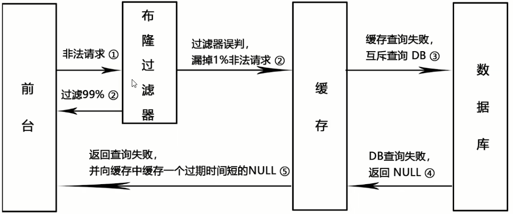  
**注意:**  
<font color="#00FF00">布隆过滤器还是需要和空对象缓存同时使用的;否则恶意攻击者一旦找到一个key是能通过布隆过滤器的,那么它就可以利用这个key打崩MySQL</font>  


### 6.5 缓存击穿
**目录:**  
6.5.1 介绍  
6.5.2 解决方案  
6.5.3 缓存击穿案例  
6.5.4 springboot+Redis实现高并发的聚划算业务    


#### 6.5.1 介绍
**介绍:**  
大量的请求同时查询一个key时,此时这个key正好失效了,就会导致大量的请求都打到数据库上面去  
<font color="#00FF00">简单来说就是热点key突然失效了,全部落入了MySQL</font>  
这个问题其实在之前讲双写一致性时提到过(<font color="#FF00FF">双检加锁</font>)  

**区别:**  
缓存击穿和缓存穿透的区别,从表象上来看它们<font color="#00FF00">最终的效果都是一样的;都是打崩MySQL</font>  
缓存穿透是一直持续干MySQL  
缓存击穿是一瞬间猛干MySQL  

**什么场景会出现缓存击穿**  
* 高频访问的key到期失效了
* delete老key,换上新的key;`del`动作发生的同时,key失效了;还没来得及换上新key时,大量请求访问该key

**危害:**  
会造成某一时刻数据库请求量过大,压力剧增  
一般技术部门<font color="#00FF00">需要知道热点key是哪些</font>,防止缓存被击穿.  
热点Key的发现方法见:高级篇=>6.缓存预热、缓存雪崩、缓存击穿、缓存穿透=>6.6热点Key  

#### 6.5.2 解决方案
方案一:差异失效时间,对于访问频繁的热点key,干脆就不设置过期时间  
<font color="#00FF00">方案二:互斥更新,采用双检加锁策略</font>  

#### 6.5.3 缓存击穿案例
1.天猫聚划算功能实现+防止缓存击穿  
  
天猫聚划算网页的这些商品信息一定是存放在redis中的  

现在商品折扣信息显示的都是`限时折扣 品牌正品`  
  

而以前是显示还有多长时间折扣结束  
  

为什么现在这么设计?  
为的就是防止有恶意攻击者,在时间结束的一瞬间(即redis的key过期时)下单导致打崩MySQL;现在就是前端给限制了不让你看到什么时候过期  

2.分析过程  
* 100%高并发,绝对不可以用MySQL实现  
* 先把MySQL里面参加活动的数据抽取进redis,一般采用定时器扫描来决定上线活动还是下线取消
* 支持分页功能,一页20条记录

问:Redis中什么数据类型支持上述功能?  
<font color="#00FF00">高并发+定时任务+分页显示</font>  
答:用list;一般list就是用于分页显示;虽然zset也可以,但zset一般用于带排行榜的场景  

#### 6.5.4 springboot+Redis实现高并发的聚划算业务
1.创建springboot模块、pom、yml、主启动类  

2.实体类  
```java
@ApiModel(value="聚划算活动Product信息")
public class Product {

    // 产品id
    private Long id;
    // 产品名称
    private String name;
    // 产品价格
    private Integer price;
    // 产品详情
    private String detail;

}
```

3.采用定时器将参与聚划算活动的特价商品新增进入redis中  
JHSTaskService:  
```java
@Service
@Slf4j
public class JHSTaskService {

    public static final String JHS_KEY = "jhs";
    public static final String JHS_KEY_A = "jhs:a";
    public static final String JHS_KEY_B = "jhs:b";

    @Autowired
    private RedisTemplate redisTemplate;

    /**
     * 假设此处是从数据库读取
     * @return
     */
    private List<Product> getProductsFromMysql() {
        ArrayList<Product> list = new ArrayList<>();
        for (int i = 0; i < 20; i++) {
            Random random = new Random();
            int id = random.nextInt(10000);
            Product product = new Product((long) id, "product" + i, i, "detail");
            list.add(product);
        }
        return list;
    }

    @PostConstruct
    public void initJHS() {
        log.info("模拟定时任务从数据库中不断获取参加聚划算的商品");
        // 1 用多线程模拟定时任务,将商品从数据库刷新到redis
        new Thread(() -> {
            while(true) {
                // 2 模拟从数据库查询数据,用于加载到Redis并给聚划算页面显示
                List<Product> list = this.getProductsFromMysql();
                // 3 删除原来的数据
                redisTemplate.delete(JHS_KEY);
                // 4 加入最新的数据给Redis参加活动;采用lpush命令来实现存储
                redisTemplate.opsForList().leftPushAll(JHS_KEY, list);
                // 5 暂停1分钟,模拟聚划算参加商品下架上新等操作
                try {
                    Thread.sleep(60000);
                } catch (InterruptedException e) {
                    e.printStackTrace();
                }
            }
        }, "t1").start();
    }
}
```

4.JHSTaskController  
```java
@Api(tags = "模拟聚划算商品上下架")
@RestController
public class JHSTaskController {

    public static final String JHS_KEY = "jhs";
    public static final String JHS_KEY_A = "jhs:a";
    public static final String JHS_KEY_B = "jhs:b";

    @Autowired
    private RedisTemplate redisTemplate;

    @ApiOperation("聚划算案例,每次1页,每页5条数据")
    @GetMapping("/product/find")
    public List<Product> find(int page, int size) {
        long start = (page - 1) * size;
        long end = start + size - 1;
        // 先去Redis中查询
        List list = redisTemplate.opsForList().range(JHS_KEY, start, end);
        if (CollectionUtils.isEmpty(list)) {
            // todo Redis找不到,去数据库中查询(存在安全隐患)
        }
        log.info("参加活动的商家: {}", list);
        return list;
    }
}
```

5.上面这些代码在高并发场景下的生产问题  
热点key突然失效,导致可怕的缓存击穿  
导致的原因是service层中的`delete`和`leftPushAll`这两个方法不是原子的.  
  
  

**解决方案:** 6.5.2 解决方案

6.互斥更新  
见:高级篇=>3.缓存双写一致性=>3.3 缓存双写一致性理解

7.差异失效时间  
  
同一份数据对应两个key  

8.代码更新  
JHSTaskService:  
```java
// 双缓存
@PostConstruct
public void initJHSAB() {
    log.info("模拟定时任务从数据库中不断获取参加聚划算的商品");
    // 1 用多线程模拟定时任务,将商品从数据库刷新到redis
    new Thread(() -> {
        while(true) {
            // 2 模拟从数据库查询数据
            List<Product> list = this.getProductsFromMysql();
            // 3 先更新B缓存且让B缓存过期时间超过A缓存,如果突然失效还有B兜底,防止击穿
            redisTemplate.delete(JHS_KEY_B);
            redisTemplate.opsForList().leftPushAll(JHS_KEY_B, list);
            // 设置过期时间为1天+10秒
            redisTemplate.expire(JHS_KEY_B, 86410L, TimeUnit.SECONDS);
            // 4 在更新缓存A
            redisTemplate.delete(JHS_KEY_A);
            redisTemplate.opsForList().leftPushAll(JHS_KEY_A, list);
            redisTemplate.expire(JHS_KEY_A, 86400L, TimeUnit.SECONDS);
            // 5 暂停1分钟,模拟聚划算参加商品下架上新等操作
            try {
                Thread.sleep(60000);
            } catch (InterruptedException e) {
                e.printStackTrace();
            }
        }
    }, "t1").start();
}
```

JHSTaskController:
```java
@ApiOperation("聚划算案例,AB双缓存,防止热key突然失效")
@GetMapping("/product/findab")
public List<Product> findAB(int page, int size) {
    List<Product> list = null;
    long start = (page - 1) * size;
    long end = start + size - 1;
    list = redisTemplate.opsForList().range(JHS_KEY_A, start, end);
    if (CollectionUtils.isEmpty(list)) {
        //  Redis找不到,去数据库中查询
        log.info("A缓存已经失效或活动已经结束");
        list = redisTemplate.opsForList().range(JHS_KEY_B, start, end);
        if (CollectionUtils.isEmpty(list)) {
            // todo Redis找不到,去数据库中查询
        }
    }
    log.info("参加活动的商家: {}", list);
    return list;
}
```

说白了就是同一份数据用两个key来保存,一个是正常过期时间;另一个在正常过期时间上加上一点时间.  
查询的时候如果查询不到正常时间的key,说明已经过期;<font color="#00FF00">但为了防止本次查询打入数据库(因为可能是海量查询)</font>;让本次查询去查询时间长一点的key.

### 6.6 热点key
1.什么是热点key  
如果一个key的访问次数比较多且明显多于其他key的话,那这个key就可以看作是hotkey  
hotkey出现的原因主要是某个热点数据访问量暴增,如重大的热搜事件、参与秒杀的商品  

2.热点Key的失效可能会造成缓存击穿  

3.如何发现热点Key  
* 使用Redis自带的`--hotkeys`参数来查找  
  使用该命令来发现热点Key的前提是Redis内存淘汰策略使用的是`LFU算法`  
  例如:`redis-cli -p 6379 --hotkeys`
* 使用`monitor`命令  
  `monitor`命令是Redis提供的一种实时查看Redis的所有操作的方式,可以用于临时监控Redis实例的操作情况,包括读写、删除等操作.  
  由于该命令对Redis性能的影响比较大,<font color="#00FF00">因此禁止长时间开启MONITOR</font>(生产环境中建议谨慎使用该命令)  
* 借助三方工具  
  京东零售的[hotkey](https://gitee.com/jd-platform-opensource/hotkey)这个项目不光支持hotkey的发现,还支持hotkey的处理
* 根据业务提前预估  
  可以根据业务情况来预估一些hotkey,例如电商秒杀活动的数据;不过我们无法预估所有hotkey的出现,比如突发的热点新闻事件等  
* 业务代码中记录分析  
  通过在业务代码中添加相应的逻辑来对key的访问量进行统计,不过这种方式会增加业务代码的复杂度,一般也不推荐使用  
* 借助公有云的Redis分析服务

4.如何解决热点key  
* 读写分离:主节点处理写请求,从节点处理读请求
* Redis集群:将热点数据分散存储在多个Redis节点上

### 6.7 慢查询
1.慢查询日志配置  
通过在`redis.conf`配置文件中设置`slowlog-log-slower-than`参数设置耗时命令的阈值,并使用`slowlog-max-len`参数设置耗时命令的最大记录条数.  
当Redis服务器检测到执行时间超过`slowlog-log-slower-than`阈值的命令时,就会将该命令记录在慢查询日志(slow log)中,这点和MySQL记录慢查询语句类似.当慢查询日志超过设定的最大记录条数之后,Redis会把最早的执行命令依次舍弃  
*注意:由于慢查询日志会占用一定内存空间,如果设置最大记录条数过大,可能会导致内存占用过高的问题.*  

2.查询慢查询日志  
执行`slowlog get [number(default=10)]` 查询`number`条慢查询日志
```java
127.0.0.1:6379> SLOWLOG GET //慢日志查询
 1) 1) (integer) 5
   2) (integer) 1684326682
   3) (integer) 12000
   4) 1) "KEYS"
      2) "*"
   5) "172.17.0.1:61152"
   6) ""
  // ...

```
慢查询日志中的每个条目都由以下六个值组成:  
* 唯一渐进的日志标识符.
* 处理记录命令的Unix时间戳.
* 执行所需的时间量,以微秒为单位.
* 组成命令参数的数组.
* 客户端IP地址和端口.
* 客户端名称.


## 7.手写Redis分布式锁
*本章和第8章强关联*  
**目录:**  
7.1 面试题  
7.2 介绍  
7.3 基础案例  
7.4 分布式锁实现  


### 7.1 面试题  
* Redis除了拿来做缓存,你还见过基于Redis的什么用法  
* Redis做分布式锁的时候需要注意什么问题
* 你们公司自己实现的分布式锁是否用的setnx命令实现?
  这个是最合适的吗?你如何考虑分布式锁的可重入问题?  
* 如果是Redis是单点部署的,会带来什么问题?
* Redis集群模式下,比如主从模式,CAP方面有没有什么问题呢?
* 那你简单的介绍一下Redlock吧?你简历上写redisson,你谈谈
* Redid分布式锁如何续期?看门狗知道吗?

- [x] 问:Redis除了拿来做缓存,你还见过基于Redis的什么用法  
答:这个问题就是Redis实战的所有场景  
* 数据共享,分布式session
* 分布式锁
* 全局ID
* 计算器、点赞
* 位统计
* 购物车
* 轻量消息队列(list、stream)
* 抽奖
* 点赞、签到、打卡
* 差集交集并集,用户关注、可能认识的人
* 热点新闻、热搜排行榜、延迟写

- [x] 问:如果是Redis是单点部署的,会带来什么问题?  
(单点部署的意思是只有一台主机,但可以有主从复制与哨兵)  
答:  
因为之前说过Redis是不能保证一致性的,因为Redis是AP(基础篇=>8.Redis集群=>8.2集群算法-分片-槽位slot=>6.Redis集群不保证强一致性)  
假设使用Redis完成分布式锁,锁的信息存放到一台master上,当master正要向它的slave同步信息时,master突然宕机了;按照哨兵模式,会有slave上位变为master;但是之前的<font color="#00FF00">锁信息就丢失了</font>(因为Redis不保证一致性);这种情况就是比较严重的  

### 7.2 介绍
1.锁的种类  
* 单机版同一个JVM内,synchronize或者Lock接口
* 分布式不同的JVM虚拟机,单击的线程锁机制不再起作用,资源类在不同的服务器之间共享了  

分布式锁原理:  
一个JVM虚拟机向Redis中获取锁;调用setnx命令;如果获取成功那么它就有权利执行后续的代码.如果没有获取成功则该JVM只能重试获取.  

2.分布式锁具备的特性  
* 独占性:任何时刻,只能有且仅有一个线程持有
* 高可用:  
  若Redis集群环境,不能因为某一个节点挂了而出现获取锁和释放锁失败的情况  
  高并发请求下,依旧性能良好
* 防死锁:杜绝死锁,必须有超时控制机制或者撤销操作,有个兜底的终止跳出方案
* 不乱抢:不能unlock其它JVM的锁,只能自已加锁自已释放
* 重入性:同一个节点的同一个线程如果获得锁后,它可以再次获得这把锁

3.分布式锁  
* `set [key] [value] [ex [second]] [px [milliSecond]] [nx|xx]`  
  * `nx`:当key不存在时,才创建key,效果等同于setnx
  * `xx`:当key存在的时候,覆盖key 
* `setnx [key] [value]`  
  **问题:**  
  setnx + expire不安全,两条命令<font color="#00FF00">非原子性</font>  

4.参考JUC中AQS的规范+可重入锁+lua脚本+Redis命令一步步实现分布式锁

### 7.3 基础案例
1.使用场景  
多个服务间保证同一时刻同一时间段内同一用户只能有一个请求(防止关键业务出现并发攻击)  

2.建立模块  
建立两个模块,分别演示不同的JVM进程(但内容是一致的,都是扣减库存的模块,以此来模拟不同的微服务扣减库存竞争分布式锁)  

3.修改pom、编写yml、主启动类(都是常规写法)  
这里配置的是Redis单机  
这里暂时不配置mybatis  
注意记得配置RedisConfig

4.业务类  
InventoryController:  
```java
@RestController
@Api(tags = "redis分布式锁测试")
public class InventoryController {
    @Autowired
    private InventoryService inventoryService;

    @GetMapping("/inventory/sale")
    @ApiOperation("扣减库存,一次卖一个")
    public void sale() {
        inventoryService.sale();
    }
}
```
InventoryService:  
```java
@Service
public class InventoryService {
    
    @Autowired
    private StringRedisTemplate stringRedisTemplate;
    @Value("${server.port}")
    private String port;

    private Lock lock = new ReentrantLock();

    public String sale() {
        String resMessgae = "";
        lock.lock();
        try {
            // 1 查询库存信息
            String result = stringRedisTemplate.opsForValue().get("inventory01");
            // 2 判断库存书否足够
            Integer inventoryNum = result == null ? 0 : Integer.parseInt(result);
            // 3 扣减库存,每次减少一个库存
            if (inventoryNum > 0) {
                stringRedisTemplate.opsForValue().set("inventory01", String.valueOf(--inventoryNum));
                resMessgae = "成功卖出一个商品,库存剩余：" + inventoryNum;
                log.info(resMessgae + "\t" + ",服务端口号：" + port);
            } else {
                resMessgae = "商品已售罄.";
                log.info(resMessgae + "\t" + ",服务端口号：" + port);
            }
        } finally {
            lock.unlock();
        }
        return resMessgae;
    }
}
```

### 7.4 分布式锁实现
**目录:**  
7.4.1 模拟微服务集群  
7.4.2 分布式部署  
7.4.3 Redis分布式锁  
7.4.4 防止死锁  
7.4.5 防止误删key  
7.4.6 判断+删除原子操作(lua)  
<font color="#00FF00">7.4.7 可重入锁</font>  
<font color="#00FF00">7.4.8 锁续期</font>   


#### 7.4.1 模拟微服务集群
*在7.3的基础案例上慢慢配置成以下这张图的架构*  

将7.3 基础案例中的模块中的代码完全拷贝到另外一个模块中(模拟两台JVM微服务)  

#### 7.4.2 分布式部署
模拟出7.4.1的效果后会发现,<font color="#00FF00">单机锁会出现超卖问题</font>,需要分布式锁  

1.nginx配置负载均衡+反向代理  
不再赘述,简单来说就是访问nginx,nginx会反向代理+负载均衡到两个微服务下.nginx的配置可以见尚上优选.  

2.启动两个微服务  
通过访问nginx来访问微服务  
高并发访问`http://[nginx]/inventory/sale`地址  
  
通过jmeter并发访问nginx  

3.访问结果  
理论上此时redis中`inventory01`这个key对应的value应该是0;但实际并不是0,例如这里测试的结果为12  
<font color="#FF00FF">超卖了</font>  

4.为什么加了synchronize或者Lock还是没有控制住?  
在单机环境下,可以使用synchronized或Lock来实现.  
但是在分布式系统中,因为竞争的线程可能不在同一个节点上(同一个jvm中),所以需要一个让所有进程都能访问到的锁来实现(<font color="#00FF00">比如redis或者zookeeper来构建</font>)  
不同进程jvm层面的锁就不管用了,那么可以利用第三方的一个组件,来获取锁,未获取到锁,则阻塞当前想要运行的线程

5.分布式锁的应用  
* 跨进程+跨服务
* 解决超卖
* 防止缓存击穿

6.解决方法  
利用Redis的`setnx`命令

#### 7.4.3 Redis分布式锁
1.修改InventoryService实现分布式锁  
```java
public String sale() {
    String resMessgae = "";
    String key = "luojiaRedisLocak";
    String uuidValue = IdUtil.simpleUUID() + ":" + Thread.currentThread().getId();

    Boolean flag = stringRedisTemplate.opsForValue().setIfAbsent(key, uuidValue);
    // flase=false,抢不到的线程继续重试
    if (!flag) {
        // 线程休眠20毫秒,进行递归重试
        try {
            TimeUnit.MILLISECONDS.sleep(20);
        } catch (InterruptedException e) {
            e.printStackTrace();
        }
        sale();
    } else {
      // 抢锁成功的请求线程,进行正常的业务逻辑操作,扣减库存
        try {
            // 1 抢锁成功,查询库存信息
            String result = stringRedisTemplate.opsForValue().get("inventory01");
            // 2 判断库存书否足够
            Integer inventoryNum = result == null ? 0 : Integer.parseInt(result);
            // 3 扣减库存,每次减少一个库存
            if (inventoryNum > 0) {
                stringRedisTemplate.opsForValue().set("inventory01", String.valueOf(--inventoryNum));
                resMessgae = "成功卖出一个商品,库存剩余：" + inventoryNum + "\t" + ",服务端口号：" + port;
                log.info(resMessgae);
            } else {
                resMessgae = "商品已售罄." + "\t" + ",服务端口号：" + port;
                log.info(resMessgae);
            }
        } finally {
            stringRedisTemplate.delete(key);
        }
    }
    return resMessgae;
}
```

2.开始测试  
设置Redis中`inventory01`对应的value为5000  
利用jmeter进行测试  
运行成功,发现值为0  

3.这一版代码存在的问题  
通过递归重试的方法,在真正高并发的请求情况下,很容易导致<font color="#00FF00">StackOverFlowError</font>,即递归方法不停地去重试,导致栈溢出  
高并发唤醒后推荐用while判断而不是if  

4.修改InventoryService防止栈溢出  
```java
public String sale() {
    String resMessgae = "";
    String key = "luojiaRedisLocak";
    String uuidValue = IdUtil.simpleUUID() + ":" + Thread.currentThread().getId();

    // 不用递归了,高并发容易出错,我们用自旋代替递归方法重试调用；也不用if,用while代替
    while (!stringRedisTemplate.opsForValue().setIfAbsent(key, uuidValue)) {
        // 线程休眠20毫秒,进行递归重试
        try {TimeUnit.MILLISECONDS.sleep(20);} catch (InterruptedException e) {e.printStackTrace();}
    }

    try {
        // 1 抢锁成功,查询库存信息
        String result = stringRedisTemplate.opsForValue().get("inventory01");
        // 2 判断库存书否足够
        Integer inventoryNum = result == null ? 0 : Integer.parseInt(result);
        // 3 扣减库存,每次减少一个库存
        if (inventoryNum > 0) {
            stringRedisTemplate.opsForValue().set("inventory01", String.valueOf(--inventoryNum));
            resMessgae = "成功卖出一个商品,库存剩余：" + inventoryNum + "\t" + ",服务端口号：" + port;
            log.info(resMessgae);
        } else {
            resMessgae = "商品已售罄." + "\t" + ",服务端口号：" + port;
            log.info(resMessgae);
        }
    } finally {
        stringRedisTemplate.delete(key);
    }
    return resMessgae;
}
```

#### 7.4.4 防止死锁
**问题:**  
由于目前<font color="#00FF00">微服务对设置的key是没有加过期时间的</font>,假如一个微服务获取到锁了,但是在执行业务代码的过程中宕机了;那么就不会执行到`delete`删除key的方法,所以别的微服务想获取到这把锁就一直无法获取到,造成程序死锁.  
<font color="#00FF00">所以需要给key加一个过期时间</font>  

1.修改InventoryService加锁的同时设置过期时间  
```java
public String sale() {
    String resMessgae = "";
    String key = "luojiaRedisLocak";
    String uuidValue = IdUtil.simpleUUID() + ":" + Thread.currentThread().getId();

    // 不用递归了,高并发容易出错,我们用自旋代替递归方法重试调用；也不用if,用while代替;注意加锁和设置过期时间必须调用原子性的方法,否则还是会出现问题
    while (!stringRedisTemplate.opsForValue().setIfAbsent(key, uuidValue, 30L, TimeUnit.SECONDS)) {
        // 线程休眠20毫秒,进行递归重试
        try {TimeUnit.MILLISECONDS.sleep(20);} catch (InterruptedException e) {e.printStackTrace();}
    }

    try {
        // 1 抢锁成功,查询库存信息
        String result = stringRedisTemplate.opsForValue().get("inventory01");
        // 2 判断库存书否足够
        Integer inventoryNum = result == null ? 0 : Integer.parseInt(result);
        // 3 扣减库存,每次减少一个库存
        if (inventoryNum > 0) {
            stringRedisTemplate.opsForValue().set("inventory01", String.valueOf(--inventoryNum));
            resMessgae = "成功卖出一个商品,库存剩余：" + inventoryNum + "\t" + ",服务端口号：" + port;
            log.info(resMessgae);
        } else {
            resMessgae = "商品已售罄." + "\t" + ",服务端口号：" + port;
            log.info(resMessgae);
        }
    } finally {
        stringRedisTemplate.delete(key);
    }
    return resMessgae;
}
```
*<font color="#FF00FF">加锁和过期时间设置必须同一个方法完成,保证原子性</font>*  
也就是说不能先获取锁,再设置过期时间;必须获取锁的同时设置过期时间

#### 7.4.5 防止误删key
**问题:**  
现在还是有一个问题,假设服务A获取到锁(并且锁的时间是30s);但是它执行的时间超过了30s,那么此时key过期了;被服务B获取到,服务B刚开始执行没多长时间,<font color="#00FF00">结果服务A执行完毕了把key删除了</font>.此时造成系统数据<font color="#00FF00">不一致</font>了.  
  

1.修改InventoryService只能删除自已的key  
```java
public String sale() {
    String resMessgae = "";
    String key = "luojiaRedisLocak";
    String uuidValue = IdUtil.simpleUUID() + ":" + Thread.currentThread().getId();

    // 不用递归了,高并发容易出错,我们用自旋代替递归方法重试调用；也不用if,用while代替;注意加锁和设置过期时间必须调用原子性的方法,否则还是会出现问题
    while (!stringRedisTemplate.opsForValue().setIfAbsent(key, uuidValue, 30L, TimeUnit.SECONDS)) {
        // 线程休眠20毫秒,进行递归重试
        try {TimeUnit.MILLISECONDS.sleep(20);} catch (InterruptedException e) {e.printStackTrace();}
    }

    try {
        // 1 抢锁成功,查询库存信息
        String result = stringRedisTemplate.opsForValue().get("inventory01");
        // 2 判断库存书否足够
        Integer inventoryNum = result == null ? 0 : Integer.parseInt(result);
        // 3 扣减库存,每次减少一个库存
        if (inventoryNum > 0) {
            stringRedisTemplate.opsForValue().set("inventory01", String.valueOf(--inventoryNum));
            resMessgae = "成功卖出一个商品,库存剩余：" + inventoryNum + "\t" + ",服务端口号：" + port;
            log.info(resMessgae);
        } else {
            resMessgae = "商品已售罄." + "\t" + ",服务端口号：" + port;
            log.info(resMessgae);
        }
    } finally {
      // 改进点,判断加锁与解锁是不同客户端,自己只能删除自己的锁,不误删别人的锁;
      if (stringRedisTemplate.opsForValue().get(key).equalsIgnoreCase(uuidValue)) {
            stringRedisTemplate.delete(key);
      }
    }
    return resMessgae;
}
```
因为在添加key的时候设置了对应的value为当前方法生成的UUID,<font color="#00FF00">而这个UUID只有当前方法持有</font>,所以在删除的时候可以判断这个UUID是否相等,如果相等则删除.  

#### 7.4.6 判断+删除原子操作(lua)
**问题:**  
```java
if (stringRedisTemplate.opsForValue().get(key).equalsIgnoreCase(uuidValue)) {
      stringRedisTemplate.delete(key);
}
```
这段代码还是有问题,原因是判断和删除是两步操作,而非原子操作.  
假如服务A判断key是吻合的,准备要删除key了(还没有删除);<font color="#00FF00">但此时key正好过期了,那么服务B就获取到这个key</font>;接着服务A把服务B刚获取到的key删除了,造成了不一致.

**lua脚本解决:**  
1.lua脚本  
lua是一种轻量小巧的脚本语言,用标准C语言编写并以源代码形式开放,其设计目的是<font color="#00FF00">为了嵌入应用程序中,从而为应用程序提供灵活的扩展和定制功能</font>.  

2.脚本浅谈  
* Redis调用lua脚本通过eval命令保证代码执行的原子性,直接用return返回脚本执行后的结果值
* `eval "[luaScript]" [numkeys] [key [key]...] [arg [arg]...]`  
  * `luaScript`:lua脚本语句
  * `numkeys`:key的数量
  * `key`:`luaScript`脚本中指定的key占位符的值
  * `arg`:`luaScript`脚本中指定的agr占位符的值

3.执行案例  
* Redis中执行`eval "return 'hello world'" 0` 输出HelloWorld  
* Redis中执行`eval "redis.call('set','k1','v1') redis.call('expire','k1','30' redis.call('get','k1')) 0` 执行了三条redis命令  
* Redis中执行`eval "return redis.call('mset', KEYS[1],ARGV[1],KEYS[2],ARGV[2])" 2 k1 k2 lua1 lua2`  
  **解释:**  
  `numkeys`:有多少个key,这里就填多少  
  `KEYS[1]`:占位符;和后面的k1对应(lua下标从1开始)  
  `ARGV[1]`:占位符;和后面的arg对应(注意arg的数量可以超过`numkeys`因为本质上是占位符,它和keys没什么关系)

4.原子删除的脚本  
这段脚本来源于官网  
`eval "if redis.call('get',KEYS[1]) == ARGV[1] then return redis.call('del',KEYS[1]) else return 0 end" 1 redisson UUID-s13x-ad33`  
这段脚本的内容就是上面原子删除的脚本  

5.条件判断语法  
```shell
if(operation) then
  xxxx
elseif(operation) then
  xxx
else
  xxx
end
```
很像linux的shell脚本  

6.条件判断案例  
执行:  
`EVAL "if KEYS[1] > KEYS[ 2] then return ARGV[1] elseif KEYS[1] < KEYS[2] then return ARGV[2] else return ARGV[3]end" 2 8 8 1 2 3`  
输出的结果为3  


**编写java代码:**  
7.修改InventoryService使用lua脚本原子判断+删除
```java
public String sale() {
    String resMessgae = "";
    String key = "luojiaRedisLocak";
    String uuidValue = IdUtil.simpleUUID() + ":" + Thread.currentThread().getId();

    // 不用递归了,高并发容易出错,我们用自旋代替递归方法重试调用；也不用if,用while代替;注意加锁和设置过期时间必须调用原子性的方法,否则还是会出现问题
    while (!stringRedisTemplate.opsForValue().setIfAbsent(key, uuidValue, 30L, TimeUnit.SECONDS)) {
        // 线程休眠20毫秒,进行递归重试
        try {TimeUnit.MILLISECONDS.sleep(20);} catch (InterruptedException e) {e.printStackTrace();}
    }

    try {
        // 1 抢锁成功,查询库存信息
        String result = stringRedisTemplate.opsForValue().get("inventory01");
        // 2 判断库存书否足够
        Integer inventoryNum = result == null ? 0 : Integer.parseInt(result);
        // 3 扣减库存,每次减少一个库存
        if (inventoryNum > 0) {
            stringRedisTemplate.opsForValue().set("inventory01", String.valueOf(--inventoryNum));
            resMessgae = "成功卖出一个商品,库存剩余：" + inventoryNum + "\t" + ",服务端口号：" + port;
            log.info(resMessgae);
        } else {
            resMessgae = "商品已售罄." + "\t" + ",服务端口号：" + port;
            log.info(resMessgae);
        }
    } finally {
      // 改进点,判断加锁与解锁是不同客户端,自己只能删除自己的锁,不误删别人的锁;
      // 使用lua脚本原子判断+删除
 String luaScript =
            "if redis.call('get',KEYS[1]) == ARGV[1] then " +
            "return redis.call('del',KEYS[1]) " +
            "else " +
            "return 0 " +
            "end";
            /*
            args0:(luaScript) lua脚本
            args1:(Long.class) 返回值类型,这里既可以写Long.class也可以写Boolean.class
            args2:key 占位符key对应的值
            args3...:可变参数arg对应的占位符
            */
        stringRedisTemplate.execute(new DefaultRedisScript(luaScript, Long.class), Arrays.asList(key), uuidValue);
    }
    return resMessgae;
}
```

8.测试运行  

#### 7.4.7 可重入锁
**问题:**  
如何兼顾锁的可重入性?  

1.可重入锁的概念复习  
是指同一个线程在外层方法获取锁时,再进入该线程的内层方法会自动获取锁(获取的锁是同一个对象).  
例如被synchronize修饰的方法递归调用自已  
所以java中的synchronize和ReentrantLock都是可冲入锁  
<font color="#00FF00">每个锁对象拥有一个锁计数器和一个指向持有该锁的线程的指针.</font>  
当执行monitorenter时,如果目标锁对象的计数器为零,那么说明它没有被其他线程所持有,Java虚拟机会将该锁对象的持有线程设置为当前线程,并且将其计数器加1.  
在目标锁对象的计数器不为零的情况下,如果锁对象的持有线程是当前线程,那么Java虚拟机可以将其计数器加1,否则需要等待,直至持有线程释放该锁.  
当执行monitorexit时,Java虚拟机则需将锁对象的计数器减1.计数器为零代表锁已被释放.  

2.lock/unlock配合可重入锁进行AQS源码分析讲解  
*包括ReentrantLock这个对象,调用了多少次lock;就要与之对应调用多少次unlock*  
<font color="#00FF00">即lock了几次就要unlock几次</font>  

3.为了实现上述所说的可重入锁的计数问题,Redis中的哪个类型可以替代?  
可以使用hsha类型来代替  
K K V  
* 第一个K:代表目标锁;通过它来判断目标锁是否有线程已经获得(判断K对应的hash元素个数)  
* 第二个K:代表某个线程已经获取到的锁;通过它来获取当前线程得到目标锁后lock的计数
* 第三个V:代表当前线程获取到目标锁后lock的计数量

<font color="#00FF00">第一个K目标锁,第二个K哪个线程获取到了目标锁,第三个V获取到这把锁的线程重入了几次</font>

  
大致的结构如上图所示  

4.`hset`和`setnx`的区别  
* `setnx`:只能解决有无问题,够用但是不够完美  
* `hset`:不但解决有无,还解决可重入问题  

5.设计  
要保证同一时间只有一个线程持有锁进入Redis完成扣减库存的动作  
一是要保证加锁/解锁(lock/unlock)  
二是扣减库存Redis命令原子性  
  
<font color="#00FF00">因为lock和unlock涉及到很多判断,所以需要使用lua脚本来完成</font>  

6.加锁流程  
<font color="#00FF00">加锁流程图:</font>    
  

**加锁lua脚本lock设计**  
先判断Redis分布式锁这个key是否存在  
`exists [key]` 命令来判断key是否存在,<font color="#00FF00">如果返回0则代表不存在</font>;hset新建属于当前线程的锁 UUID:ThreadID  
  
如果返回1则表明已经有锁(和上面步骤3的思想一致),需要进一步判断是不是当前线程的锁(通过`hexistis`来判断),如果返回0则说明这把锁不是自已的;如果返回1则说明这把锁是当前线程的锁,自增1表示重入  

**编写lua脚本lock**  
版本一:  
```lua
// 加锁的Lua脚本,对标我们的lock方法
// 先判断key存不存在(判断有没有线程获取到目标锁);
if redis.call('exists', 'key') == 0 then
  // 如果没有则创建这个key并放入获得到这把锁的线程表示(流水号+UUID)设置锁的可重入为1
	redis.call('hset', 'key', 'uuid:threadid', 1)
  // 设置过期时间
	redis.call('expire', 'key', 50)
	return 1
elseif redis.call('hexists', 'key', 'uuid:threadid') == 1 then
  // 如果这把锁已经被获取了,并且是当前线程获取的,则锁的可重入+1
	redis.call('hincrby', 'key', 'uuid:threadid', 1)
	redis.call('expire', 'key', 50)
	return 1
else
	return 0
end
```
这段代码不够简洁,实际上`hincrby`这条命令;如果目标hash的key是不存在的则会自动创建hash的key(指的是Redis-hash类型的key)  

版本二:  
当key不存在的时候,`hincrby`可以自动创建这个key并且自增
```lua
// V2 合并相同的代码,用hincrby替代hset,精简代码
if redis.call('exists', 'key') == 0 or redis.call('hexists', 'key', 'uuid:threadid') == 1 then
	redis.call('hincrby', 'key', 'uuid:threadid', 1)
	redis.call('expire', 'key', 50)
	return 1
else
	return 0
end
```

版本三:  
脚本OK,换上参数替代  
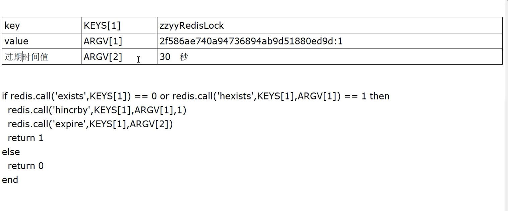  
```lua
// V3 脚本OK,换上参数来替代写死的key,value
if redis.call('exists', KEYS[1]) == 0 or redis.call('hexists', KEYS[1], ARGV[1]) == 1 then
	redis.call('hincrby', KEYS[1], ARGV[1], 1)
	redis.call('expire', KEYS[1], ARGV[2])
	return 1
else
	return 0
end
```

测试:  
```shell
eval "if redis.call('exists', KEYS[1]) == 0 or redis.call('hexists', KEYS[1], ARGV[1]) == 1 then redis.call('hincrby', KEYS[1], ARGV[1], 1) redis.call('expire', KEYS[1], ARGV[2]) return 1 else return 0 end" 1 luojiaRedisLock 001122:1 50
```
  

*注意锁每次重入的时候都会重新设置过期时间,这点还是不错的!*

7.解锁流程  
**解锁lua脚本unlock设计**  
先判断`hexistis [key] [uuid:ThreadId]` 当前线程是否获取到了目标锁;如果返回0说明根本没有锁,程序块返回nil  
不是0,说明有锁并且这把锁是当前线程的锁,直接调用`hincrby -1`表示每次减一unlock;直到该值变为0表示可以删除该[key],删除获取到的目标锁  

<font color="#00FF00">解锁流程图</font>  


**编写lua脚本unlock**  
版本一:  
```lua
// 解锁的Lua脚本,对标我们的lock方法
// 判断当前线程是否已经加锁了
if redis.call('hexists', 'key', uuid:threadid) == 0 then
	// 如果没有则返回nil
  return nil
  // 否则代表有锁并且是当前线程的锁
  // unlock之后判断结果是不是0
elseif redis.call('hincrby', key, uuid:threadid, -1) ==0 then
    // 如果是0则代表要删除锁
    return redis.call('del', key)
else 
    return 0
end
```

版本二:  
脚本OK,换上参数占位符  
```lua
if redis.call('hexists', KEYS[1], ARGV[1]) == 0 then
	return nil
elseif redis.call('hincrby', KEYS[1], ARGV[1], -1) == 0 then
    return redis.call('del', KEYS[1])
else 
    return 0
end
```

测试:  
```shell
eval "if redis.call('hexists', KEYS[1], ARGV[1]) == 0 then return nil elseif redis.call('hincrby', KEYS[1], ARGV[1], -1) == 0 then return redis.call('del', KEYS[1]) else return 0 end " 1 luojiaRedisLock 001122:1
```

8.编写java代码整合lua  
**将程序复原为初始无锁版**  
```java
public String sale() {
    String resMessgae = "";

    try {
        // 1 抢锁成功,查询库存信息
        String result = stringRedisTemplate.opsForValue().get("inventory01");
        // 2 判断库存是否足够
        Integer inventoryNum = result == null ? 0 : Integer.parseInt(result);
        // 3 扣减库存,每次减少一个库存
        if (inventoryNum > 0) {
            stringRedisTemplate.opsForValue().set("inventory01", String.valueOf(--inventoryNum));
            resMessgae = "成功卖出一个商品,库存剩余：" + inventoryNum + "\t" + ",服务端口号：" + port;
            log.info(resMessgae);
        } else {
            resMessgae = "商品已售罄." + "\t" + ",服务端口号：" + port;
            log.info(resMessgae);
        }
    } finally {

    }
    return resMessgae;
}
```

**新建RedisDistributedLock实现JUC规范里的Lock**  
通过实现JUC的Lock类从而让我们的代码变为真正通用的方法  
```java
/**
 * 自研的分布式锁,实现了Lock接口
 */
public class RedisDistributedLock implements Lock {
    // 引入RedisTemplate
    private StringRedisTemplate stringRedisTemplate;

    private String lockName; // KEYS[1] 目标锁
    private String uuidValule; // ARGV[1] 线程标识
    private long expireTime; // ARGV[2] 过期时间

    public RedisDistributedLock(StringRedisTemplate stringRedisTemplate, String lockName) {
        this.stringRedisTemplate = stringRedisTemplate;
        this.lockName = lockName;
        this.uuidValule = IdUtil.simpleUUID() + ":" + Thread.currentThread().getId();
        this.expireTime = 50L;
    }

    @Override
    public void lock() {
        // lock实际上调用的就是tryLock;这里它们的逻辑都是一样的
        tryLock();
    }

    @Override
    public boolean tryLock() {
        try {
            // 
            tryLock(-1L, TimeUnit.SECONDS);
        } catch (InterruptedException e) {
            e.printStackTrace();
        }
        return false;
    }

    @Override
    public boolean tryLock(long time, TimeUnit unit) throws InterruptedException {
        if (-1 == time) {
            // 加锁的lua脚本
            String script =
                    "if redis.call('exists', KEYS[1]) == 0 or redis.call('hexists', KEYS[1], ARGV[1]) == 1 then " +
                        "redis.call('hincrby', KEYS[1], ARGV[1], 1) " +
                        "redis.call('expire', KEYS[1], ARGV[2]) " +
                        "return 1 " +
                    "else " +
                         "return 0 " +
                    "end";
            System.out.println("lockName:" + lockName + "\t" + "uuidValue:" + uuidValule);

            // 加锁失败需要自旋一直获取锁
            while (!stringRedisTemplate.execute(
                    new DefaultRedisScript<>(script, Boolean.class),
                    Arrays.asList(lockName),
                    uuidValule,
                    String.valueOf(expireTime))) {
                // 休眠60毫秒再来重试
                try {TimeUnit.MILLISECONDS.sleep(60);} catch (InterruptedException e) {e.printStackTrace();}
            }
            return true;
        }
        return false;
    }

    @Override
    public void unlock() {
        String script = "" +
                "if redis.call('hexists', KEYS[1], ARGV[1]) == 0 then " +
                "return nil " +
                "elseif redis.call('hincrby', KEYS[1], ARGV[1], -1) == 0 then " +
                "return redis.call('del', KEYS[1]) " +
                "else " +
                "return 0 " +
                "end";
        System.out.println("lockName:" + lockName + "\t" + "uuidValue:" + uuidValule);
        
        // LUA脚本由C语言编写,nil -> false; 0 -> false; 1 -> true;
        // 所以此处DefaultRedisScript构造函数返回值不能是Boolean,Boolean没有nil
        Long flag = stringRedisTemplate.execute(
                new DefaultRedisScript<>(script, Long.class),
                Arrays.asList(lockName),
                uuidValule);
        if (null == flag) {
            throw new RuntimeException("this lock does not exists.");
        }
    }

    // 下面两个暂时用不到,不用重写
    @Override
    public void lockInterruptibly() throws InterruptedException {

    }

    @Override
    public Condition newCondition() {
        return null;
    }
}
```


**修改InventoryService整合lua脚本,完成lock&unlock**  
<font color="#00FF00">中间的业务逻辑不变,实现效果非常完美</font>

```java
// v7.0 使用自研的lock/unlock+LUA脚本自研的Redis分布式锁
Lock redisDistributedLock = new RedisDistributedLock(stringRedisTemplate, "luojiaRedisLock");
public String sale() {
    String resMessgae = "";
    redisDistributedLock.lock();
    try {
        // 1 抢锁成功,查询库存信息
        String result = stringRedisTemplate.opsForValue().get("inventory01");
        // 2 判断库存书否足够
        Integer inventoryNum = result == null ? 0 : Integer.parseInt(result);
        // 3 扣减库存,每次减少一个库存
        if (inventoryNum > 0) {
            stringRedisTemplate.opsForValue().set("inventory01", String.valueOf(--inventoryNum));
            resMessgae = "成功卖出一个商品,库存剩余：" + inventoryNum + "\t" + ",服务端口号：" + port;
            log.info(resMessgae);
        } else {
            resMessgae = "商品已售罄." + "\t" + ",服务端口号：" + port;
            log.info(resMessgae);
        }
    } finally {
        redisDistributedLock.unlock();
    }
    return resMessgae;
}
```

**问题:**  
写的太死了,只能使用Redis提供的分布式锁解决方案,能不能有一个工厂?具体要获得哪种类似的分布式锁传入一个type进去.  
  

9.引入工厂设计模式  
编写DistributedLockFactory工厂:  
```java
@Component
public class DistributedLockFactory {

    @Autowired
    private StringRedisTemplate stringRedisTemplate;

    public Lock getDistributedLock(String lockType, String lockName) {
        if (lockType == null) {
            return null;
        }
        // 如果是Redis类型的则返回Redis类型的分布式锁
        if ("REDIS".equalsIgnoreCase(lockType)) {
            return new RedisDistributedLock(stringRedisTemplate, lockName);
        } else if ("ZOOKEEPER".equalsIgnoreCase(lockType)) {
            // 后面存在就返回对应的分布式锁-
        } else if ("MYSQL".equalsIgnoreCase(lockType)) {
            // 后面存在就返回对应的分布式锁
        }

        return null;
    }
}
```

修改InventoryService整合工厂模式  
```java
// v7.0 使用自研的lock/unlock+LUA脚本自研的Redis分布式锁
// 注入工厂
@Autowired
private DistributedLockFactory distributedLockFactory;
public String sale() {
    String resMessgae = "";
    // 需要什么就传参
    Lock redisLock = distributedLockFactory.getDistributedLock("REDIS", "luojiaRedisLock");
    redisLock.lock();
    try {
        // 1 抢锁成功,查询库存信息
        String result = stringRedisTemplate.opsForValue().get("inventory01");
        // 2 判断库存书否足够
        Integer inventoryNum = result == null ? 0 : Integer.parseInt(result);
        // 3 扣减库存,每次减少一个库存
        if (inventoryNum > 0) {
            stringRedisTemplate.opsForValue().set("inventory01", String.valueOf(--inventoryNum));
            resMessgae = "成功卖出一个商品,库存剩余：" + inventoryNum + "\t" + ",服务端口号：" + port;
            log.info(resMessgae);
            // 测试锁的可重入
            testReEntry();
        } else {
            resMessgae = "商品已售罄." + "\t" + ",服务端口号：" + port;
            log.info(resMessgae);
        }
    } finally {
        redisLock.unlock();
    }
    return resMessgae;
}
// 测试锁的可重入
public void testReEntry(){
      Lock redisLock = distributedLockFactory.getDistributedLock("REDIS", "luojiaRedisLock");
      redisLock.lock();
      try{
        System.out.println("===测试锁的可重入===");
      }finally{
        redisLock.unlock();
      }
}

```

10.测试锁的可重入  
调用Service层的`sale()`方法查看结果  
  
发现出错了,<font color="#00FF00">因为第二次拿锁的时候发现UUID是不一样的;</font>虽然线程id是一样的  
因为每次调用DistributedLockFactory工厂的getDistributedLock()方法时都会生成一个新的对象(RedisDistributedLock),而这个新的对象中的`uuidValule`方法的值是随机生成的.  

11.解决  
由工厂传入RedisDistributedLock的UUID,而工厂的UUID是全局的;这样就能保证UUID有且只有一个  

修改DistributedLockFactory工厂:  
```java
@Component
public class DistributedLockFactory {

    @Autowired
    private StringRedisTemplate stringRedisTemplate;
    private String lockName;
    private String uuid;
    public DistributedLockFactory(){
      this.uuid = IdUtil.simpleUUID();
    }

    public Lock getDistributedLock(String lockType, String lockName) {
        if (lockType == null) {
            return null;
        }
        // 如果是Redis类型的则返回Redis类型的分布式锁
        if ("REDIS".equalsIgnoreCase(lockType)) {
            this.lockName = "zzyyRedisLock";
            return new RedisDistributedLock(stringRedisTemplate, lockName,uuid);
        } else if ("ZOOKEEPER".equalsIgnoreCase(lockType)) {
            this.lockName = "zzyyZookeeperLock";
            // 后面存在就返回对应的分布式锁-
        } else if ("MYSQL".equalsIgnoreCase(lockType)) {
            // 后面存在就返回对应的分布式锁
        }

        return null;
    }
}
```

修改RedisDistributedLock:  
```java
/**
 * 自研的分布式锁,实现了Lock接口
 */
public class RedisDistributedLock implements Lock {
    // 引入RedisTemplate
    private StringRedisTemplate stringRedisTemplate;

    private String lockName; // KEYS[1] 目标锁
    private String uuidValule; // ARGV[1] 线程标识
    private long expireTime; // ARGV[2] 过期时间

    public RedisDistributedLock(StringRedisTemplate stringRedisTemplate, String lockName,String uuid) {
        this.stringRedisTemplate = stringRedisTemplate;
        this.lockName = lockName;
        this.uuidValule = uuid + ":" + Thread.currentThread().getId();
        this.expireTime = 25L;
    }

    @Override
    public void lock() {
        // lock实际上调用的就是tryLock;这里它们的逻辑都是一样的
        tryLock();
    }

    @Override
    public boolean tryLock() {
        try {
            // 
            tryLock(-1L, TimeUnit.SECONDS);
        } catch (InterruptedException e) {
            e.printStackTrace();
        }
        return false;
    }

    @Override
    public boolean tryLock(long time, TimeUnit unit) throws InterruptedException {
        if (-1 == time) {
            // 加锁的lua脚本
            String script =
                    "if redis.call('exists', KEYS[1]) == 0 or redis.call('hexists', KEYS[1], ARGV[1]) == 1 then " +
                        "redis.call('hincrby', KEYS[1], ARGV[1], 1) " +
                        "redis.call('expire', KEYS[1], ARGV[2]) " +
                        "return 1 " +
                    "else " +
                         "return 0 " +
                    "end";
            System.out.println("lockName:" + lockName + "\t" + "uuidValue:" + uuidValule);

            // 加锁失败需要自旋一直获取锁
            while (!stringRedisTemplate.execute(
                    new DefaultRedisScript<>(script, Boolean.class),
                    Arrays.asList(lockName),
                    uuidValule,
                    String.valueOf(expireTime))) {
                // 休眠60毫秒再来重试
                try {TimeUnit.MILLISECONDS.sleep(60);} catch (InterruptedException e) {e.printStackTrace();}
            }
            return true;
        }
        return false;
    }

    @Override
    public void unlock() {
        String script = "" +
                "if redis.call('hexists', KEYS[1], ARGV[1]) == 0 then " +
                "return nil " +
                "elseif redis.call('hincrby', KEYS[1], ARGV[1], -1) == 0 then " +
                "return redis.call('del', KEYS[1]) " +
                "else " +
                "return 0 " +
                "end";
        System.out.println("lockName:" + lockName + "\t" + "uuidValue:" + uuidValule);
        
        // LUA脚本由C语言编写,nil -> false; 0 -> false; 1 -> true;
        // 所以此处DefaultRedisScript构造函数返回值不能是Boolean,Boolean没有nil
        Long flag = stringRedisTemplate.execute(
                new DefaultRedisScript<>(script, Long.class),
                Arrays.asList(lockName),
                uuidValule);
        if (null == flag) {
            throw new RuntimeException("this lock does not exists.");
        }
    }

    // 下面两个暂时用不到,不用重写
    @Override
    public void lockInterruptibly() throws InterruptedException {

    }

    @Override
    public Condition newCondition() {
        return null;
    }
}
```

12.最终测试  


#### 7.4.8 锁续期
**问题:**  
和7.4.5 防止误删key小节讲的问题一样,虽然现在的代码不会导致误删key了;但是还是有可能因为key提到过期导致系统状态不一致(key现在的过期时间是25s).<font color="#00FF00">即需要确保RedisLock过期时间大于业务执行问题的时间.</font>  
<font color="#00FF00">Redis分布式锁如何续期?</font>  

*本节解决面试题:Redid分布式锁如何续期?看门狗知道吗?*

**回顾CAP理论:**  
指在一个分布式系统中,一致性(Consistency)、可用性(Availability)、分区容错性(Partition tolerance);要么是AP、要么CP、要么AC;但是不存在ACP  
* 一致性:在分布式系统中的所有数据备份,在同一时刻是否同样的值,即写操作之后的读操作,必须返回该值.(分为弱一致性、强一致性和最终一致性)  
* 可用性:在集群中一部分节点故障后,集群整体是否还能响应客户端的读写请求
* 分区容忍性:以实际效果而言,分区相当于对通信的时限要求.系统如果不能在时限内达成数据一致性,就意味着发生了分区的情况,必须就当前操作在C和A之间做出选择;分区容错性是分布式系统必须要保证的,<font color="#00FF00">所以CAP实际上只要关注是AP还是CP</font>

**各大组件的CAP情况:**  
* Redis集群是AP:  
  <font color="#00FF00">Redis异步复制造成锁信息丢失</font>  
  主节点还没来得及把新写的信息同步给slave的时候,master宕机了;此时slave上位后发现并没有刚才写入的那条信息
* Zookeeper集群是CP:  
    
  所以可以看出Zookeeper集群对比Redis就有点慢了  
    
  上图表示Zookeeper发生故障时的情况
* eureak集群是AP:  
    
* nacos集群是AP:  
    

1.编写lua脚本  
自动续期的lua脚本  
```lua
// 自动续期的LUA脚本
if redis.call('hexists', KEYS[1], ARGV[1]) == 1 then
    return redis.call('expire', KEYS[1], ARGV[2])
else
    return 0
end
```

2.测试验证  
```shell
hset luojiaRedisLock test 001
expire luojiaRedisLock 30
eval "if redis.call('hexists', KEYS[1], ARGV[1]) == 1 then return redis.call('expire', KEYS[1], ARGV[2]) else return 0 end" 1 luojiaRedisLock test 1
```

**补充说明:**  
这里实现续期的方法是后台起一个线程来轮询(间隔可能为10s),然后去判断有没有key需要续期的,如果有就续期.  

3.整合java代码  
修改RedisDistributedLock:  
主要是修改`tryLock`方法和新增`resetExpire`
```java
@Override
public boolean tryLock(long time, TimeUnit unit) throws InterruptedException {
    if (-1 == time) {
        String script =
            "if redis.call('exists', KEYS[1]) == 0 or redis.call('hexists', KEYS[1], ARGV[1]) == 1 then " +
            "redis.call('hincrby', KEYS[1], ARGV[1], 1) " +
            "redis.call('expire', KEYS[1], ARGV[2]) " +
            "return 1 " +
            "else " +
            "return 0 " +
            "end";
        System.out.println("lock() lockName:" + lockName + "\t" + "uuidValue:" + uuidValule);

        // 加锁失败需要自旋一直获取锁
        while (!stringRedisTemplate.execute(
            new DefaultRedisScript<>(script, Boolean.class),
            Arrays.asList(lockName),
            uuidValule,
            String.valueOf(expireTime))) {
            // 休眠60毫秒再来重试
            try {TimeUnit.MILLISECONDS.sleep(60);} catch (InterruptedException e) {e.printStackTrace();}
        }
        // 新建一个后台扫描程序,来检查Key目前的ttl,是否到我们规定的剩余时间来实现锁续期
        resetExpire();
        return true;
    }
    return false;
}

// 自动续期
private void resetExpire() {
    String script =
        "if redis.call('hexists', KEYS[1], ARGV[1]) == 1 then " +
        "return redis.call('expire', KEYS[1], ARGV[2]) " +
        "else " +
        "return 0 " +
        "end";
    new Timer().schedule(new TimerTask() {
        @Override
        public void run() {
            if (stringRedisTemplate.execute(
                new DefaultRedisScript<>(script, Boolean.class),
                Arrays.asList(lockName),
                uuidValule,
                String.valueOf(expireTime))) {
                // 续期成功,继续监听
                System.out.println("resetExpire() lockName:" + lockName + "\t" + "uuidValue:" + uuidValule);
                resetExpire();
            }
        }
    }, (this.expireTime * 1000 / 3));
}
```

## 8.RedLock算法和底层源码分析
*本章和第7章强关联*  
**目录:**  
8.1 面试题  
8.2 Redis分布式锁-Redlock红锁算法  
8.3 使用Redisson完善程序  
8.4 Redisson源码解析  
8.5 多机案例  


### 8.1 面试题
1.说说你实现Redis分布式锁的思路  
答:  
* 按照JUC中Lock接口的规范编写  
* lock加锁关键逻辑(保证锁的特性)  
  * 加锁:加锁实际上就是在redis中,给Key键设置一个值,为避免死锁,并给定一个过期时间  
    通过Redis中的hash类型,加锁和可重入性都要保证
  * 自旋:加锁失败时while自旋
  * 续期
* unlock解锁关键逻辑  
  将key删除但也不能乱删,只能删除当前线程的锁  
  考虑可重入性的递减,加锁几次就要减锁几次  
  最后到0了,直接del删除

### 8.2 Redis分布式锁-Redlock红锁算法
RedLock官方介绍:  
  

**问题:**  
第7章=>7.4.8 锁续期代码中的锁还有什么问题?  
实际上代码层面已经没有什么问题了,<font color="#00FF00">只不过由于目前锁的信息是存放在一台Redis上面的</font>,如果这台Redis宕机了;则整个分布式锁服务都不可用了.  
由此引入了<font color="#00FF00">Redisson</font>  

**为什么基于故障转移的实施是不够的?**  
这里故障转移的意思就是:当master宕机后会转移到slave  
  
如果master宕机了,使用slave上位也是不可行的;<font color="#00FF00">主要的原因就是因为Redis的复制是异步的;master中的数据还没来得及写入到slave时,master就宕机了</font>  

**更加通俗的解释**  
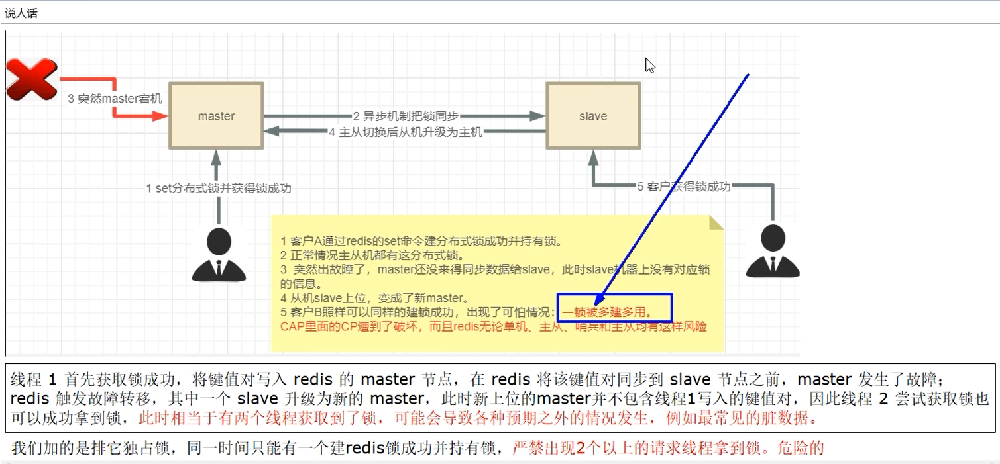  

1.Redlock算法设计理念  

**Redlock算法是怎么解决这个问题的?**  
Redis也提供了Redlock算法,用来实现<font color="#00FF00">基于多个实例(节点)的分布式锁</font>.锁变量由多个实例维护,即使有实例发生了故障,锁变量仍然是存在的,客户端还是可以完成锁操作.  

<font color="#00FF00">在该算法的分布式版本中,我们假设我们有N个Redis主节点.**<font color="#FF00FF">这些节点是完全独立的</font>**,所以我们不使用复制或任何其他隐式协调系统.</font>  
之前的算法已经完成了在单个master中获取和释放锁.我们想当然地认为算法会使用这个方法在单个实例中获取和释放锁.在我们的示例中,我们设置N=5,这是一个合理的值,<font color="#00FF00">因此我们需要在不同的计算机或虚拟机上运行5个Redis master</font>,以确保它们以**几乎独立**的方式发生故障.  

**设计理念**  
  
客户端只有在满足下面的这两个条件时,才能认为是加锁成功.  
* 条件1:客户端从超过半数(大于等于N/2+1)的Redis实例上成功获取到了锁;
* 条件2:客户端获取锁的总耗时没有超过锁的有效时间

2.容错公式  
为什么推荐的Redis master数量是奇数?  
  
容错公式:`N = 2X + 1 ` (N是最终部署的机器数,X是容错机器数)  
假如希望某一台机器宕机也不影响对外的服务,<font color="#00FF00">则最少需要3台机器</font>;此时X=1算出N=3  
假如希望某两台机器宕机也不影响对外的服务,<font color="#00FF00">则最少需要5台机器</font>;此时X=2算出N=5  

**什么是容错**  
失败了多少个机器实例后我还是可以容忍的,所谓的容忍就是数据一致性还是可以Ok的,CP数据一致性还是可以满足  
加入在集群环境中,redis失败1台,可接受.2X+1=2\*1+1=3,部署3台,死了1个剩下2个可以正常工作,那就部署3台.  
加入在集群环境中,redis失败2台,可接受.2X+1=2\*2+1=5,部署5台,死了2个剩下3个可以正常工作,那就部署5台.  

**为什么是奇数**  
最少的机器,最多的产出效果  
假如公式是N = 2X +2;允许一台机器宕机,则X=1算出N=4 和 部署3台没有区别.所以选择部署奇数  

3.RedLock的Java实现之Redisson  
**介绍:**  
Redisson是Java的Redis客户端之一,提供了一些api方便操作Redis  
Redisson之官网:[https://redisson.org](https://redisson.org)  
Redisson之github:[https://github.com/redisson/redisson/wiki](https://github.com/redisson/redisson/wiki)  
Redisson之解决分布式锁:[https://github.com/redisson/redisson/wiki/8.-distributed-locks-and-synchronizers](https://github.com/redisson/redisson/wiki/8.-distributed-locks-and-synchronizers)

### 8.3 使用Redisson完善程序
1.引入pom  
```xml
<dependency>
    <groupId>org.redisson</groupId>
    <artifactId>redisson</artifactId>
    <version>3.13.4</version>
</dependency>
```

2.修改RedisConfig添加内容
```java
@Configuration
public class RedisConfig{
  public Redisson redisson(){
    Config config = new Config();
    // 设置目标master节点
    config.useSingleServer()
    .setAddress("redis://192.168.111.185:6379")
    .setDataBase(0)
    .setPassword("111111");
    return (Redisson)Redisson.create(config);
  }
}
```

3.修改InventoryService整合Redisson  
*提示:实际案例中,要把做分布式锁的Redis和业务Redis区分下来,不能在同一台机器上*  
```java
// V9.0, 引入Redisson对应的官网推荐RedLock算法实现类
@Autowired
private Redisson redisson;
public String saleByRedisson() {
    String resMessgae = "";
    RLock redissonLock = redisson.getLock("luojiaRedisLock");
    redissonLock.lock();
    try {
        // 1 抢锁成功,查询库存信息
        String result = stringRedisTemplate.opsForValue().get("inventory01");
        // 2 判断库存书否足够
        Integer inventoryNum = result == null ? 0 : Integer.parseInt(result);
        // 3 扣减库存,每次减少一个库存
        if (inventoryNum > 0) {
            stringRedisTemplate.opsForValue().set("inventory01", String.valueOf(--inventoryNum));
            resMessgae = "成功卖出一个商品,库存剩余：" + inventoryNum + "\t" + ",服务端口号：" + port;
            log.info(resMessgae);
        } else {
            resMessgae = "商品已售罄." + "\t" + ",服务端口号：" + port;
            log.info(resMessgae);
        }
    } finally {
        redissonLock.unlock();
    }
    return resMessgae;
}
```

4.jmeter测试出现错误  
  
这是因为unlock的时候可能锁正好过期了,于是乎会报错;所以在finally代码块中在加新的内容  
```java
@Autowired
private Redisson redisson;
public String saleByRedisson() {
    String resMessgae = "";
    RLock redissonLock = redisson.getLock("luojiaRedisLock");
    redissonLock.lock();
    try {
        // 1 抢锁成功,查询库存信息
        String result = stringRedisTemplate.opsForValue().get("inventory01");
        // 2 判断库存书否足够
        Integer inventoryNum = result == null ? 0 : Integer.parseInt(result);
        // 3 扣减库存,每次减少一个库存
        if (inventoryNum > 0) {
            stringRedisTemplate.opsForValue().set("inventory01", String.valueOf(--inventoryNum));
            resMessgae = "成功卖出一个商品,库存剩余：" + inventoryNum + "\t" + ",服务端口号：" + port;
            log.info(resMessgae);
        } else {
            resMessgae = "商品已售罄." + "\t" + ",服务端口号：" + port;
            log.info(resMessgae);
        }
    } finally {
        // 改进点,只能删除属于自己的key,不能删除别人的
        if(redissonLock.isLocked() && redissonLock.isHeldByCurrentThread()) {
            redissonLock.unlock();
        }
    }
    return resMessgae;
}

```

### 8.4 Redisson源码解析
*本节解答面试题:*  
* *那你简单的介绍一下Redlock吧?你简历上写redisson,你谈谈*
* *Redid分布式锁如何续期?看门狗知道吗?*

1.Redis分布式锁过期了,但是业务还没有完成怎么办?  
答:缓存续期  

2.怎么实现缓存续期的?  
额外起一个线程,定期检查线程是否还持有锁,如果有则延长过期时间.  
Redisson里面就实现了这个方案,使用"看门狗"定期检查(每1/3的锁时间检查1次),如果线程还持有锁,则刷新过期时间;  
<font color="#00FF00">在获取锁成功后,给锁加一个watchdog,watchdog会起一个定时任务,在锁没有被释放且快要过期的时候会续期</font>

3.加锁源码分析 
通过Redisson新建的锁默认key是30s  

**加锁的核心逻辑**  
  

**流程解释:**  
* 通过exists判断,如果锁不存在,则设置值和过期时间,加锁成功
* 通过hexists判断,如果锁已存在,并且锁的是当前线程,则证明是重入锁,加锁成功
* 如果锁已存在,但锁的不是当前线程,则证明有其他线程持有锁.
  返回当前锁的过期时间(代表了锁key的剩余生存时间),加锁失败

  

`scheduleExpirationRenewal`方法:
  

4.watchdog自动延期机制  
  

**续期的lua脚本**  
  

5.解锁源码分析  
**解锁的核心逻辑**  
  

**解锁的lua脚本**  
  

### 8.5 多机案例  
**目录:**  
8.5.1 代码参考来源  
8.5.2 多重锁  
8.5.3 案例实战  
8.5.4 另一种配置方式  


#### 8.5.1 代码参考来源
<font color="#00FF00">本节解决单机Redis分布式锁,master宕机后slave上线导致锁数据可能丢失的问题.</font>  
见8.2 Redis分布式锁-Redlock红锁算法  
算法是如何实现的?  
  

**代码参考来源**  
参考redisson官网案例:[https://github.com/redisson/redisson/wiki/8.-distributed-locks-and-synchronizers](https://github.com/redisson/redisson/wiki/8.-distributed-locks-and-synchronizers)  

<font color="#00FF00">2022年第8章第4小节的代码:</font>  

基于Redis的Redisson红锁`RedissonRedLock`对象实现了Redlock介绍的加锁算法.该对象也可以用来将多个`RLock`对象关联为一
个红锁,每个RLock对象实例可以来自于不同的Redisson实例.  
```java
RLock lock1 = redisson1.getLock("lock1");
RLock lock2 = redisson2.getLock("lock2");
RLock lock3 = redisson3.getLock("lock3");

RLock multiLock = anyRedisson.getMultiLock(lock1, lock2, lock3);

// traditional lock method
multiLock.lock();
```
大家都知道,如果负责储存某些分布式锁的某些Redis节点宕机以后,而且这些锁正好处于锁住的状态时,这些锁会出现锁死的状态.为了避免这种情况的发生,Redisson内部提供了一个监控锁的看门狗,它的作用是在Redisson实例被关闭前,不断的延长锁的有效期.默认情况下,看门狗的检查锁的超时时间是30秒钟,也可以通过修改`Config.lockWatchdogTimeout`来另行指定.  
另外Redisson还通过加锁的方法提供了leaseTime的参数来指定加锁的时间.超过这个时间后锁便自动解开了.  
```java
RedissonRedLock lock = new RedissonRedLock(lock1,lock2,lock3);  
// 给lock1,lock2,lock3加锁,如果没有手动解开的话,10秒钟后会自动解开
lock.lock(10,TimeUtil.SECOND);
// 为加锁等待100秒时间,并在加锁成功10秒钟后自动解开
boolean res = lock.tryLock(100,10,TimeUtil.SECOND);
lock.unlock();
```

<font color="#00FF00">2023年第8章第4小节的代码:</font> 

  
直接说RedLock被废弃了  

#### 8.5.2 多重锁
<font color="#00FF00">2023年推荐使用第8章第3小节的代码MultiLock</font>  
  

代码示例:  
```java
RLock lock1 = redisson1.getLock("lock1");
RLock lock2 = redisson2.getLock("lock2");
RLock lock3 = redisson3.getLock("lock3");

RLock multiLock = anyRedisson.getMultiLock(lock1, lock2, lock3);

// traditional lock method
multiLock.lock();

// or acquire lock and automatically unlock it after 10 seconds
multiLock.lock(10, TimeUnit.SECONDS);

// or wait for lock aquisition up to 100 seconds 
// and automatically unlock it after 10 seconds
boolean res = multiLock.tryLock(100, 10, TimeUnit.SECONDS);
if (res) {
   try {
     ...
   } finally {
       multiLock.unlock();
   }
}
```

#### 8.5.3 案例实战  
1.docker走起3台Redis的master机器,本次设置3台master各自独立无从属关系  
  

2.进入上一步刚启动的redis容器实例  
  

3.创建springboot模块、修改pom、主启动类  

4.编写yml  
```yml
spring:
  redis:
    host: localhost # IP
    port: 6379 # 端口
    database: 0 # 使用哪个数据库
    timeout: 1800000
    password: 111111 # 密码
    mode: single
    pool: # 自定义的连接池,这里没有加lettuce
      max-active: 20 #最大连接数
      max-wait: -1 #最大阻塞等待时间(负数表示没限制)
      max-idle: 5    #最大空闲
      min-idle: 0     #最小空闲
    single: # 三台redis实例
      address1: 192.168.111.185:6379
      address2: 192.168.111.185:6380
      address3: 192.168.111.185:6381
```

5.编写配置类  

**RedisSingleProperties**  
```java
public class RedisSingleProperties{
    private String address1;
    private String address2;
    private String address3;
    // 自已提供get/set
}
```

**RedisProperties**  
```java
@ConfigurationProperties
public class RedisProperties{
    private int database;
    // 等待节点回复命令,该时间从命令发送成功时开始计时
    private int timeout = 3000;

    private String password;

    private String mode;
    // 池配置
    private RedisPoolProperties pool;
    // 单机信息配置
    private RedisSingleProperties single;
}
```

**RedisPoolProperties**  
```java
public class RedisPoolProperties{
    private int maxIdle;

    private int minIdle;

    private int maxActivite;

    private int maxWait;

    private int connTimeOut = 10000;

    private int soTimeout;
    // 池大小
    private int size;
}
```

**CacheConfiguration**  
```java
@Configuration
@EnableConfigurationProperties(RedisProperties.class)
public class CacheConfiguration {
    // 注入配置
    @Autowired
    RedisProperties redisProperties;

    @Bean
    RedissonClient redissonClient1() {
        Config config = new Config();
        String node = redisProperties.getSingle().getAddress1();
        node = node.startsWith("redis://") ? node : "redis://" + node;
        SingleServerConfig serverConfig = config.useSingleServer()
                .setAddress(node)
                .setTimeout(redisProperties.getPool().getConnTimeout())
                .setConnectionPoolSize(redisProperties.getPool().getSize())
                .setConnectionMinimumIdleSize(redisProperties.getPool().getMinIdle());
        if (StringUtils.isNotBlank(redisProperties.getPassword())) {
            serverConfig.setPassword(redisProperties.getPassword());
        }
        return Redisson.create(config);
    }

    @Bean
    RedissonClient redissonClient2() {
        Config config = new Config();
        String node = redisProperties.getSingle().getAddress2();
        node = node.startsWith("redis://") ? node : "redis://" + node;
        SingleServerConfig serverConfig = config.useSingleServer()
                .setAddress(node)
                .setTimeout(redisProperties.getPool().getConnTimeout())
                .setConnectionPoolSize(redisProperties.getPool().getSize())
                .setConnectionMinimumIdleSize(redisProperties.getPool().getMinIdle());
        if (StringUtils.isNotBlank(redisProperties.getPassword())) {
            serverConfig.setPassword(redisProperties.getPassword());
        }
        return Redisson.create(config);
    }

    @Bean
    RedissonClient redissonClient3() {
        Config config = new Config();
        String node = redisProperties.getSingle().getAddress3();
        node = node.startsWith("redis://") ? node : "redis://" + node;
        SingleServerConfig serverConfig = config.useSingleServer()
                .setAddress(node)
                .setTimeout(redisProperties.getPool().getConnTimeout())
                .setConnectionPoolSize(redisProperties.getPool().getSize())
                .setConnectionMinimumIdleSize(redisProperties.getPool().getMinIdle());
        if (StringUtils.isNotBlank(redisProperties.getPassword())) {
            serverConfig.setPassword(redisProperties.getPassword());
        }
        return Redisson.create(config);
    }


    /**
     * 单机
     * @return
     */
    /*@Bean
    public Redisson redisson()
    {
        Config config = new Config();

        config.useSingleServer().setAddress("redis://192.168.111.147:6379").setDatabase(0);

        return (Redisson) Redisson.create(config);
    }*/
}

```

6.编写业务类  
RedLockController:  
```java
@RestController
@Slf4j
public class RedLockController {

    public static final String CACHE_KEY_REDLOCK = "ATGUIGU_REDLOCK";

    @Autowired
    RedissonClient redissonClient1;

    @Autowired
    RedissonClient redissonClient2;

    @Autowired
    RedissonClient redissonClient3;

    boolean isLockBoolean;

    @GetMapping(value = "/multiLock")
    public String getMultiLock() throws InterruptedException
    {
        String uuid =  IdUtil.simpleUUID();
        String uuidValue = uuid+":"+Thread.currentThread().getId();
        // 获得三把锁
        RLock lock1 = redissonClient1.getLock(CACHE_KEY_REDLOCK);
        RLock lock2 = redissonClient2.getLock(CACHE_KEY_REDLOCK);
        RLock lock3 = redissonClient3.getLock(CACHE_KEY_REDLOCK);
        // 联合三把锁
        RedissonMultiLock redLock = new RedissonMultiLock(lock1, lock2, lock3);
        redLock.lock();
        try
        {
            System.out.println(uuidValue+"\t"+"---come in biz multiLock");
            try { TimeUnit.SECONDS.sleep(30); } catch (InterruptedException e) { e.printStackTrace(); }
            System.out.println(uuidValue+"\t"+"---task is over multiLock");
        } catch (Exception e) {
            e.printStackTrace();
            log.error("multiLock exception ",e);
        } finally {
            redLock.unlock();
            log.info("释放分布式锁成功key:{}", CACHE_KEY_REDLOCK);
        }
        return "multiLock task is over  "+uuidValue;
    }
}

```

6.开始测试  

正常情况下能够跑通  

**如果人为宕机一台master?**  
宕机的master重新上线后会立马跟上大部队的key的过期时间  


7.结论  
  

#### 8.5.4 另一种配置方式
1.修改RedissonClient的配置内容  
```java
@Bean
public RedissonClient getRedissonClient() {
// 这里填写节点列表,每一个节点要加上前缀redis://ip:port
String[] nodes = {"redis://192.168.111.185:6379", "redis://192.168.111.185:6389"};

Config config = new Config();
// 主要在这里使用的是useClusterServers方法
config.useClusterServers()
	.setScanInterval(2000)
	.addNodeAddress(nodes);

return Redisson.create(config);
}
```

2.此时使用的就是多机的红锁

## 9.Redis缓存过期策略  
**目录:**  
9.1 面试题  
9.2 Redis内存模型  
9.3 Redis的key是怎么删除的?   
9.4 Redis内存淘汰策略   
9.5 Redis内存淘汰策略配置性能建议   
9.6 Redis是如何判断数据是否过期的   


### 9.1 面试题
* 生产上你们的redis内存设置多少?
* 如何配置、修改redis的内存大小
* 如果内存满了你怎么办
* redis清理内存的方式?定期删除和惰性删除了解过吗
* redis缓存淘汰策略有哪些?分别是什么?你用那个?
* [x] redis的LRU了解过吗?请手写LRU  
  答:算法手写code见阳哥大厂第3季视频
* LRU和LFU算法的区别是什么

### 9.2 Redis内存模型  
`maxmemory [bytes(default=0)]` Redis的内存占用量配置  
`config get maxmemory` 获取当前Redis的默认内存占用量,默认为0  
`config set maxmemory [bytes]` 手动设置Redis的内存占用量  
`info memory` 显示内存的使用情况


如果不设置最大内存大小或者设置最大内存大小为0,在64位操作系统下不限制内存大小,在32位操作系统下最多使用3GB内存(因为32位操作系统寻址量最多只有4G)

一般生产上推荐设置内存为最大物理内存的<font color="#00FF00">四分之三</font>  

1.如果Redis超出了内存上限  
  
<font color="#00FF00">会产生OOM异常</font>  

2.内存淘汰策略  
为了避免key没有填写过期时间而导致出现OOM异常,Redis提出了<font color="#00FF00">内存淘汰策略</font>

3.内存利用率  
通过`info memory`得到的内存使用情况中,注意有这么几个参数  
`mem_fragmentation_ratio`(内存碎片率)=`used_memory_rss`(操作系统实际分配给Redis的物理内存空间大小)/`used_memory`(Redis内存分配器为了存储数据实际申请使用的内存空间大小)  
也就是说,`mem_fragmentation_ratio`(内存碎片率)的值越大代表内存碎片率越严重.  

通常情况下,我们认为`mem_fragmentation_ratio` > <font color="#00FF00">1.5</font>的话才需要清理内存碎片.  
`mem_fragmentation_ratio` > 1.5 意味着你使用Redis存储实际大小2G的数据需要使用大于3G的内存  

4.Redis内存碎片整理  
通过设置redis.conf配置文件来开启Redis自动内存碎片整理  
* `activedefrag [no(default)|yes]` 是否开启Redis自动内存碎片整理 

具体什么时候清理需要通过下面两个参数控制:  
* `active-defrag-threshold-lower [percent(default=10)]` 内存碎片率大于1.1时开始清理,如果设置为50就代表大于1.5开始清理
* `active-defrag-ignore-bytes [memory(default=100mb)]` 内存碎片达到多少时开始清理

通过Redis自动内存碎片清理机制可能会对Redis的性能产生影响,我们可以通过下面两个参数来减少对Redis性能的影响:
* `active-defrag-cycle-min [percent(default=1)]` 内存碎片清理时间所占用CPU时间的比例不低于1%
* `active-defrag-cycle-max [percent(default=25%)]` 内存碎片清理时间所占用CPU时间的比例不高于25%

另外,重启节点可以做到内存碎片重新整理.如果你采用的是高可用架构的Redis集群的话,你可以将碎片率过高的主节点转换为从节点,以便进行安全重启  


### 9.3 Redis的key是怎么删除的?
1.Redis过期键的删除策略  
<font color="#00FF00">如果一个键过期了,它并不会被立即删除</font>  

2.三种不同的删除策略  
**分类:** 立即删除、惰性删除、定期删除

**立即删除:**  
Redis不可能时时刻刻遍历所有被设置了生存时间的key,来检测数据是否已经到达过期时间,然后对它进行删除.  
立即删除能保证内存中数据的最大新鲜度,因为它保证过期键值会在过期后马上被删除,其所占用的内存也会随之释放.<font color="#00FF00">但是立即删除对cpu是最不友好的</font>.因为删除操作会占用cpu的时间,如果刚好碰上了cpu很忙的时
候,比如正在做交集或排序等计算的时候,就会给cpu造成额外的压力,让CPU心累,时时需要删除,忙死.
<font color="#00FF00">这会产生大量的性能消耗,同时也会影响数据的读取操作</font>.  

总结:对CPU不友好,用处理器性能换取存储空间(拿时间换空间)  

**惰性删除:**  
数据到达过期时间时,不做处理;得到下次访问数据的时候判断该数据是否过期了,如果未过期则返回数据;否则删除数据返回不存在  
<font color="#00FF00">惰性删除的缺点是对内存非常不友好</font>  
如果一个键已经过期,而这个键又仍然保留在redis中,那么只要这个过期键不被删除,它所占用的内存就不会释放.  
在使用惰性删除策略时,如果数据库中有非常多的过期键,而这些过期键又恰好没有被访问到的话,那么它们也许永远也不会被删除(除非用户手动执行FLUSHDB),我们甚至可以将这种情况看作是一种内存泄漏-无用的垃圾数据占用了大量的内存,而服务器却不会自己去释放它们,这对于运行状态非常依赖于内存的Redis服务器来说,肯定不是一个好消息.  

`lazyfree-lazy-eviction [yes|no(default)]` 是否启用惰性删除

**定期删除:**  
定期删除策略是前两种策略的折中:  
定期删除策略<font color="#00FF00">每隔一段时间执行一次删除过期键操作</font>并通过限制删除操作执行时长和频率来减少删除操作对CPU时间的影响.
周期性轮询redis库中的时效性数据,采用随机抽取的策略,利用过期数据占比的方式控制删除频度  
特点1:CPU性能占用设置有峰值,检测频度可自定义设置  
特点2:内存压力不是很大,长期占用内存的冷数据会被持续清理  
总结:周期性抽查存储空间(随机抽查,重点抽查)  

举例:  
redis默认每隔100ms检查是否有过期的key,有过期key则删除.注意:<font color="#00FF00">redis不是每隔100ms将所有的key检查一次而是随机抽取进行检查</font>;因此,如果只采用定期删除策略,会导致很多key到时间没有删除.    
定期删除策略的难点是确定删除操作执行的时长和频率:如果删除操作执行得太频繁或者执行的时间太长,定期删除策略就会退化成立即删除策略,以至于将CPU时间过多地消耗在删除过期键上面.如果删除操作执行得太少,或者执行的时间太短,定期删除策略又会和惰性删除策略一样,出现浪费内存的情况.因此,如果采用定期删除策略的话,服务器必须根据情况.<font color="#00FF00">合理地设置删除操作的执行时长和执行频率</font>.

<font color="#00FF00">这种策略的问题是可能存在一些key永远没有被扫描到</font>  
<font color="#FF00FF">所以惰性删除和定期删除都有可能造成大量的key堆积在内存中,导致Redis内存空间紧张或者很快耗尽.由此引入Redis的过期淘汰策略</font> 


### 9.4 Redis内存淘汰策略 
1.配置文件配置Redis的淘汰策略
* `maxmemory-policy [policy(default=noeviction)]` 设置Redis的默认内存淘汰策略  
  * `policy`:过期策略
    * `volatile-lru` 对所有设置了过期时间的key使用LRU算法进行删 除
    * `allkeys-lru` 对所有key使用LRU算法进行删除,优先删除掉最近 最 不经常使用的key,用以保存新数据
    * `volatile-lfu` 对所有设置了过期时间的key使用LFU算法进行删 除
    * `allkeys-lfu` 对所有key使用LFU算法进行删除
    * `volatile-random` 对所有设置了过期时间的key随机删除
    * `allkeys-random`对所有设置了过期时间的key随机删除
    * `volatile-ttl` 删除马上要过期的key
    * `noeviction` 不会驱逐任何key,表示即使内存达到上限也不进行置换,所有能引起内存增加的命令都会返回error


2.LRU和LFU算法的区别  
* LRU:最近最少使用页面置换算法,淘汰最长时间未被使用的页面,看页面最后一次被使用到发生调度的时间长短,首先淘汰最长时间未被使用的页面.(偏时间)  
* LFU:最近最不常用页面置换算法,淘汰一定时期内被访问次数最少的页,看一定时间段内页面被使用的频率,淘汰一定时期内被访问次数最少的页(偏使用频率)

3.淘汰策略总结  
2*4=8  
2个纬度:要么从过期key中删除、要么从所有key中删除  
4个方面:LRU、LFU、random、ttl  
8个选项  

4.选择哪一种?
* 在所有的key都是最近最经常使用,那么就需要选择allkeys-lru进行置换最近最不经常使用的key,如果你不确定使用哪种策略,那么推荐使用allkeys-lru  
* 如果所有的key的访问概率都是差不多的,那么可以选用allkeys-random策略去置换数据
* 如果对数据有足够的了解,能够为key指定hint(通过expire/ttI指定),那么可以选择volatile-ttl进行置换


### 9.5 Redis内存淘汰策略配置性能建议
1.避免存储bigkey  
2.开启惰性淘汰`lazyfree-lazy-eviction yes`

### 9.6 Redis是如何判断数据是否过期的
Redis通过一个叫做过期字典(可以看作是hash表)来保存数据过期的时间.过期字典的键指向 Redis数据库中的某个key(键),过期字典的值是一个long long类型的整数,这个整数保存了key所指向的数据库键的过期时间(毫秒精度的UNIX时间戳)  
  
注意看**dict**指向的是真实的K-V键值对  
**expires**指向的是过期字典,该字典中存储的key和**dict**中存储的key一致,只不过它指向的是该key的过期时间(long long类型)  


## 10.Redis经典5大类型源码及底层实现
**目录:**  
10.1 面试题  
10.2 如何学习源码包?  
10.3 平时所说的RedisK-V键值对数据库到底是什么  
10.4 传统5大类型C语言源码分析  


### 10.1 面试题
* Redis的跳表了解吗?这个数据结构有什么缺点?  
* Redis项目里面怎么用?Redis的数据结构有哪些?布隆过滤器怎么用?  
* Redis的多路IO复用如何理解,为什么单线程还可以扛着那么高的QPS?
* Redis的ZSet底层实现;说说它的优点和缺点  
* Redis跳表说一下,解决了哪些问题,时间复杂度和空间复杂度.  

1.Redis底层的数据类型  
* SDS动态字符串
* 双向链表
* 压缩列表ziplist
* 哈希表hashtable
* 跳表skiplist
* 整数集合intset
* 快速列表quicklist
* 紧凑列表listpack

2.本章的意义  
普通人背八股  
大牛看技术,定制化Redis  

3.Redis源码  
[Redis7.0源码:https://github.com/redis/redis/tree/7.0/src](https://github.com/redis/redis/tree/7.0/src)  

4.推荐两本书深入学习Redis  
《Redis设计与实现》  
《Redis5设计与源码分析》

### 10.2 如何学习源码包?
1.github官方说明  
  
结合官网着重关注以下几个源码:  
* Redis对象 object.c
* 字符串t_string.c
* 列表t_list.c
* 字典t_hash.c
* 集合及有序集合t_set.c和t_zset.c
* 数据流t_stream.c  
  底层的实现结构是listpack.c和rax.c(了解即可)

2.基本数据结构骨架  
* 简单动态字符串sds.c
* 整数集合intset.c
* 压缩列表ziplist.c
* 快速链表quicklist.c
* listpack
* 字典dict.c


3.object.c  
其实Redis中的类型都是基于RedisObject的,Redis高度抽象之后可以用一个对象表示即RedisObject  

4.dict.c  
字典dict.c也是贯穿始终的一个类型  

5.Redis数据库的实现  
* 数据库的底层实现db.c
* 持久化rdb.c和aof.c

6.Redis服务端和客户端的实现  
* 事件驱动ae.c和ae_epoll.c
* 网络连接anet.c和networking.c
* 服务端程序server.c
* 客户端程序redis-cli.c

7.其它  
* 主从复制replication.c
* 哨兵sentinel.c
* 集群cluster.c
* 其他数据结构,如hyperloglog.c、geo.c等
* 其他功能,如pub/sub、Lua脚本

### 10.3 平时所说的RedisK-V键值对数据库到底是什么
1.Redis是如何实现键值对数据库的?  
key一般是String类型的字符串对象  
<font color="#00FF00">value类型则是Redis对象(RedisObject)</font>  
value可以是字符串对象,也可以是集合数据类型的对象,比如List对象、Hash对象、Set对象和ZSet对象  
  

2.传统的5大类型  
* String
* List
* Hash
* Set
* ZSet

3.新增的5大类型  
* BitMap-实质是String
* Hyperloglog-实质是String
* GEO-实质是ZSet
* Stream-实质是Stream
* BitField-看具体是什么类型(因为BitField就是操作它的二进制)

4.上帝视角  
  

5.Redis定义了RedisObject结构体来表示string、hash、list、set、zset等数据结构  

**C语言struct结构体语法说明**  
  
  

**Redis中每个对象都是一个RedisObject结构**  

**字典、KV是什么**  
* 每个键值对都会有一个dictEntry
* 源码dict.h文件(C语言中.h是定义(头文件),与之对应的是.c实现)  
    
* <font color="#00FF00">从dictEntry到RedisObject</font>
    
    

**这些键值对是如何保存进Redis并进行读取操作,O(1)时间复杂度**  
  
首先RedisServer启动加载Redisdb,Redisdb加载进入内存形成数据库,形成数据库后立即去读取字典dict,形成字典之后马上去找hash;hash其中的一个就是K-V键值对dictEntry;每个K-V键值对形成实体dictEntry;每个dictEntry的K-V键值对封装了之后形成的是RedisObject对象  

**redisObject +Redis数据类型+Redis 所有编码方式(底层实现)三者之间的关系**
  
<font color="#00FF00">其中\*prt这个指针指向的是真正的Redis类型(字符串、跳表、压缩列表;这些和10.1 面试题=>1.Redis底层的数据类型都对应上了)</font>
  
<font color="#00FF00">所以第二节说的传统5大类型,只是对外而言暴露的;它的底层实际上是后面跳表、压缩列表、字段这些数据类型.</font>  

### 10.4 传统5大类型C语言源码分析
**目录:**  
10.4.1 Redis数据类型总纲  
10.4.2 源码分析总体数据结构大纲  
10.4.3 从set hello world开始分析  
10.4.4 RedisObject结构的作用  
10.4.5 各个类型的数据结构的编码映射和定义  
10.4.6 String数据结构介绍  
10.4.7 Hash数据结构介绍  
10.4.8 List数据结构介绍  
10.4.9 Set数据结构介绍  
10.4.10 ZSet数据结构介绍  

#### 10.4.1 Redis数据类型总纲
1.源码分析总体数据结构大纲  
* SDS动态字符串
* 双向链表
* 压缩列表ziplist
* 哈希表hashtable
* 跳表skiplist
* 整数集合intset
* 快速列表quicklist
* 紧凑列表listpack

2.Redis6版本下-Redis数据类型(外部使用的)与数据结构(内部实现的)之间的关系  
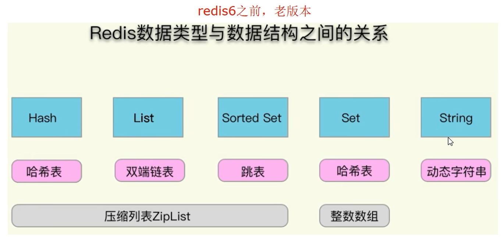  

redis6相关的底层模型和结构
* String = SDS
* Set = intset + hashtable
* ZSet = skipList + ziplist(压缩列表)
* List = quickList + ziplist
* Hash = hashtable + ziplist

3.<font color="#00FF00">Redis7版本下-Redis数据类型(外部使用的)与数据结构(内部实现的)之间的关系</font>


redis7相关的底层模型和结构
* String = SDS
* Set = intset + hashtable
* ZSet = skipList + listpack(紧凑列表)
* List = quickList 
* Hash = hashtable + listpack(紧凑列表)

<font color="#00FF00">Redis7之后不再使用ziplist(压缩列表);但是为了兼容性还是保留了这个数据结构</font>


#### 10.4.2 源码分析总体数据结构大纲
*交互逻辑图,外部使用与内部实现*
  

*这些内部实现的类型在何处定义的?*  
  

#### 10.4.3 从set hello world开始分析
1.设置hello world  
`set hello world` 设置一个K-V  

2.看看类型  
`type hello` 查看hello的类型,结果是string  

3.看看编码  
`object encoding hello` 查看hello的编码,结果是embstr

4.<font color="#00FF00">每个键值对都会有一个dictEntry</font>  
  
<font color="#00FF00">即一切value都是RedisObject</font>  

#### 10.4.4 RedisObject结构的作用
  

1.RedisObject各个字段的含义  
  
`embstr`  
即可以理解为,type+encoding才能代表一个数据类型  
* LRU字段表示当内存超限时采用LRU算法清除内存中的对象
* refcount表示对象的引用计数
* \*ptr指针指向真正的底层数据结构的指针

2.什么叫同一个类型有不同的编码方式?  
```shell
set hello world
type hello # 输出string
object encoding hello #输出embstr

set age 17
type age #输出string
object encoding age #输出int
```
<font color="#00FF00">所以面上Redis中所有的类型(不管是string、hash、list;这和类型是无关的)它们真正存储的值都是字符串(string);但它们的编码方式是有可能不同的.</font>

3.set age 17  
  
|  field   |              解释              |
| :------: | :----------------------------: |
|   type   |              类型              |
| encoding |      编码(string,int,raw)      |
|   lru    |        最近被访问的时间        |
| refcount | 等于1,表示当前对象被引用的次数 |
|  \*ptr   |     value值是多少,这里是17     |

4.`debug object key`命令  
上面的5个属性中`type`、`encoding`、`*ptr`都理解了,剩下的对`lru`和`refcount`该怎么理解  

要使用`debug object key`命令需要先修改redis.conf配置文件  
`enable-debug-command [local|no(default)]` 开启debug命令;注意开启是设置为`local`不是yes  

此时再次调用`debug object age`命令,效果如下  
```shell
debug object age
# 输出如下:
# Value at: 0x7f236a8c4200 refcount:2147483647 encoding:int serializedlength:2 lru:141ga771 lru_seconds_idle:14
```

|      field       |                                                                   解释                                                                    |
| :--------------: | :---------------------------------------------------------------------------------------------------------------------------------------: |
|     value at     |                                                                 内存地址                                                                  |
|     refcount     |                                                                 引用次数                                                                  |
|     encoding     |                                                               物理编码类型                                                                |
| serializedlength | 序列化后的长度(注意这里的长度是序列化后的长度,保存为rdb文件时使用了该算法,不是真正存贮在内存的大小),会对字串 做一些可能的压缩以便底层优化 |
|       lru        |                                                           记录最近使用的时间戳                                                            |
| lru_seconds_idle |                                                                 空闲时间                                                                  |


#### 10.4.5 各个类型的数据结构的编码映射和定义
1.各个类型的<font color="#00FF00">数据结构</font>的<font color="#00FF00">编码映射</font>和定义  
  

#### 10.4.6 String数据结构介绍
1.三大物理编码方式(int、embstr、raw)  
**int**  
保存long型(长整型)的64位(8个字节)有符号数  
9223372036854775807(最多19位)  
  
只有整数才会使用int,如果是浮点数,Redis内部其实先将浮点数转化为字符串值,然后再保存.

**embstr**  
代表embstr格式的SDS(Simple Dynamic String 简单动态字符串),保存长度小于44字节的字符串  
EMBSTR顾名思义即:embedded string,表示嵌入式的String  

**raw**  
保存长度大于44字节的字符串

2.案例演示  
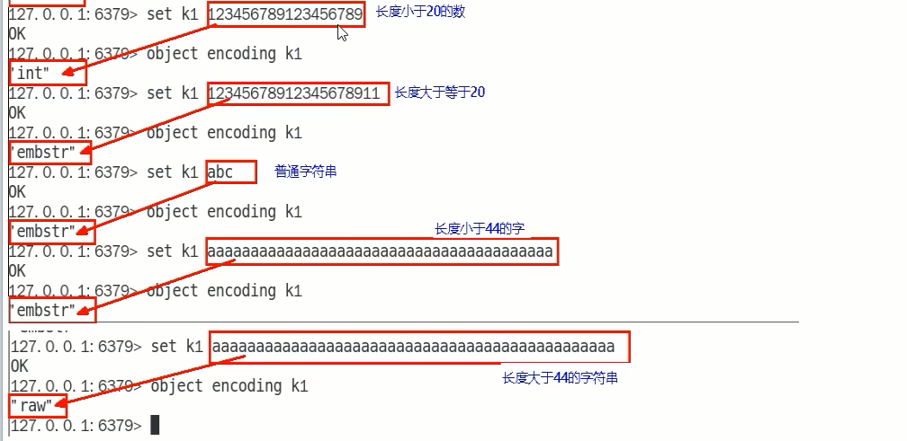  

3.C语言中的字符串  
  

4.<font color="#00FF00">SDS简单动态字符串</font>  
<font color="#00FF00">Redis没有直接复用C语言的字符串</font>,而是新建了属于自己的结构-----<font color="#FF00FF">SDS</font>  
在Redis数据库里,包含字符串值的键值对都是由SDS实现的(Redis中所有的键都是由字符串对象实现的即底层是由SDS实现,Redis中所有的值对象中包含的字符串对象底层也是由SDS实现).
  

**源码分析:**  
  

**说明:SDS类型value的结构**  
  
Redis中字符串的实现,SDS有多种结构(sds.h):  
sdshdr5(2^5=32byte)一般这个是不会被使用的,是由内部使用  
sdshdr8(2 ^ 8=256byte)  
sdshdr16(2 ^ 16=65536byte=64KB)  
sdshdr32(2 ^ 32byte=4GB)  
sdshdr64(2 ^ 64byte=17179869184G)  
用于存储不同的长度的字符串
| field |                                                            解释                                                             |
| :---: | :-------------------------------------------------------------------------------------------------------------------------: |
|  len  | 表示SDS的长度,使我们在获取字符串长度的时候可以在O(1)情况下拿到,<font color="#00FF00">而不是像C那样需要遍历一遍字符串</font> |
| alloc |     可以用来计算free就是字符串已经分配的未使用的空间,有了这个值就可以引入预分配空间的算法了,而不用去考虑内存分配的问题      |
|  buf  |                                                   表示字符串数组,真实数据                                                   |


5.Redis为什么重新设计一个SDS数据结构  
  
<font color="#00FF00">C语言没有Java里面的String类型</font>,只能是靠自己的char[]来实现,字符串在C语言中的存储方式,<font color="#FF00FF">想要获取[Redis]的长度,需要从头开始遍历,直到遇到'\O'为止</font>.所以,Redis没有直接使用C语言传统的字符串标识,而是自己构建了一种名为简单动态字符串SDS(simple dynamic string)的抽象类型,并将SDS作为Redis的默认字符串.

|      要点      |                                                           C语言                                                           |                                                                                                                                                                                       SDS                                                                                                                                                                                        |
| :------------: | :-----------------------------------------------------------------------------------------------------------------------: | :------------------------------------------------------------------------------------------------------------------------------------------------------------------------------------------------------------------------------------------------------------------------------------------------------------------------------------------------------------------------------: |
| 字符串长度处理 |                                     需要从头开始遍历,直到遇到'\0’为止,时间复杂度O(N)                                      |                                                                                                                                                                  记录当前字符串长度,直接读取即可,时间复杂度O(1)                                                                                                                                                                  |
|  内存重新分配  |                                   分配内存空间超过后,会导致数组下标越界或者内存分配溢出                                   | <font color="#00FF00">空间预分配:</font><br/>SDS修改后,len长度小于1M,那么将会额外分配与len相同长度的未使用空间.如果修改后长度大于1M,那么将分配1M的使用空间.<br/><font color="#00FF00">惰性空间释放:</font><br/> 有空间分配对应就有空间释放.SDS缩短时并不会回收多余的内存空间,而是使用free字段将多出来的空间记录下来.如果后续有变更操作,直接使用free中记录的空间,减少了内存的分配 |
|   二进制安全   | 二进制数据并不是规则的字符串格式,可能会包含一些特殊的字符串,比如'\0'等.前面提到过,C中字符串遇到'\0'之后的数据就读取不上了 |                                                                                                                                                               根据len长度来判断字符串结束,二进制的安全问题就解决了                                                                                                                                                               |
|                |                                                                                                                           |                                                                                                                                                                                                                                                                                                                                                                                  |

6.源码分析  
**set k1 v1底层发生了什么**  
  
set命令调用的了`setCommand`方法  
`setCommand`方法内部又调用了`setGenericCommand`方法,`setGenericCommand`方法才是真正的核心方法.  

**三大物理编码方式**  
int编码格式  
    
Redis启动时会预先建立10000个分别存储0~9999的redisObject变量作为共享对象,这就意味着如果set字符串的键值在0~10000之间的话,<font color="#00FF00">则可以直接指向共享对象面不需要再建立新对象,此时值不占空间</font>  
此时\*prt指针指向的是共享变量(不占空间)  
set k1 123  
set k2 123  
  
  
redis6源代码(redis7代码变了,但效果是一样的)  
  

embstr编码格式  

 由`tryObjectEncoding`方法来决定当前key对应的value编码格式;该方法调用的是object.c中的`tryObjectEncoding`方法;`tryObjectEncoding`方法又调用了`createEmbeddedStringObject`方法  

  
对于长度小于44的字符串,Redis对键值采用OBJ_ENCODING_EMBSTR方式,EMBSTR顾名思义即:embedded string,表示嵌入式的String.从内存结构上来讲即字符串sds结构体与其对应的redisObject对象分配在同一块连续的内存空间,字符串sds嵌入在redisObject对象之中一样.  
  

raw编码格式  
当字符串的键值为长度大于44的超长字符串时,Redis则会将键值的内部编码方式改为OBJ_ENCODING_RAW格式,这与<font color="#00FF00">OBJ_ENCODING_EMBSTR</font>编码方式的不同之处在于,此时动态字符串sds的内存与<font color="#00FF00">其依赖的edisObject的内存不再连续了</font>  
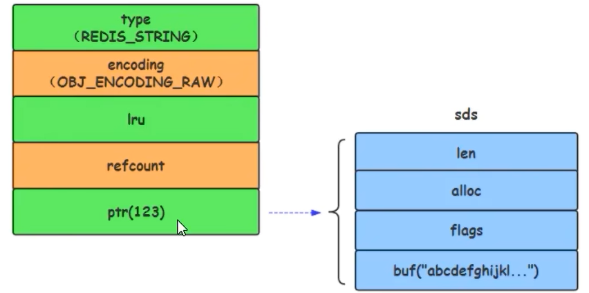  

*embstr是只读的,如果更改过后会变成raw;无论是否达到44字节*  
  

7.转变逻辑图  
  

8.案例结论  
只有整数才会使用int,如果是浮点数,<font color = '00FF00'>Redis内部其实先将浮点数转化为字符串值,然后再保存</font>  
embstr与raw类型底层的数据结构其实都是<font color = '00FF00'>SDS(简单动态字符串,</font>Redis内部定义sdshdr一种结构)

| 类型   | 解释                                                                                                                                                                                                                      |
| ------ | ------------------------------------------------------------------------------------------------------------------------------------------------------------------------------------------------------------------------- |
| int    | Long类型整数时,RedisObiect中的ptr指针直接赋值为整数数据,<font color="#00FF00">不再额外的指针再指向整数了</font>,节省了指针的空间开                                                                                                                     |
| embstr | 当保存的是字符串数据且字符串小于等于44字节时,emstr类型将会调用内存分配函数,只分配一块连续的内存空间,空间中依次包含 redisObject 与 sdshdr 两个数据结构,让元数据、指针和SDS是一块连续的内存区域,这样就可以避免内存碎片      |
| raw    | 当字符串大于44字节时,SDS的数据量变多变大了,SDS和RedisObject布局分家各自过,会给SDS分配多的空间并用指针指SDS结构,raw类型将会调用<font color="#00FF00">两次内存分配函数</font>,分配两块内存空间,一块用于包含 redisObject结构,而另一块用于包含sdshdr 结构 |

  

9.总结  
Redis内部会根据用户给的不同键值而使用不同的编码格式,自适应地选择较优化的内部编码格式,而这一切对用户完全透明  

#### 10.4.7 Hash数据结构介绍
1.hash的两种编码格式  
* redis6:ziplist+hashtable
* redis7:listpack+hahstable  

2.redis6

执行`config get hash*`  
  

<font color="#00FF00">hash-max-ziplist-entries:使用压缩列表保存时哈希集合中的最大元素个数.</font>  
<font color="#00FF00">hash-max-ziplist-value:使用压缩列表保存时哈希集合中单个元素的最大长度.</font>  

Hash类型键的字段个数`小于`hash-max-ziplist-entries并且每个字段名和字段值的长度`小于`hash-max-ziplist-value时,Redis才会使用OBJ_ENCODING_ZIPLIST(压缩列表)来存储该键,前述条件任意一个不满足则会转换为OBJ_ENCODING_HT(hashtable)的编码方式  
  
  

**结论:**  
* 哈希对象保存的键值对数量小天512个;
* 所有的键值对的健和值的字符串长度都小于等于64byte(一个英文字母一个字节)时用ziplist,反之用hashtable
* ziplist升级到hashtable可以,反过来降级不可以

**流程图:**


**源码分析**  
在Redis中,hashtable被称为字典(dictionary),它是一个数组+链表的结构  
OBJ_ENCODING_HT编码分析:  
OBJ_ENCODING_HT这种编码方式内部才是真正的哈希表结构,或称为字典结构,其可以实现O(1)复杂度的读写操作,因此效率很高.  
在Redis内部,从OBJ_ENCODING_HT类型到底层真正的散列表数据结构是一层层嵌套下去的,组织关系见面图:  
  
<font color="#00FF00">源代码dict.h:</font>  
  
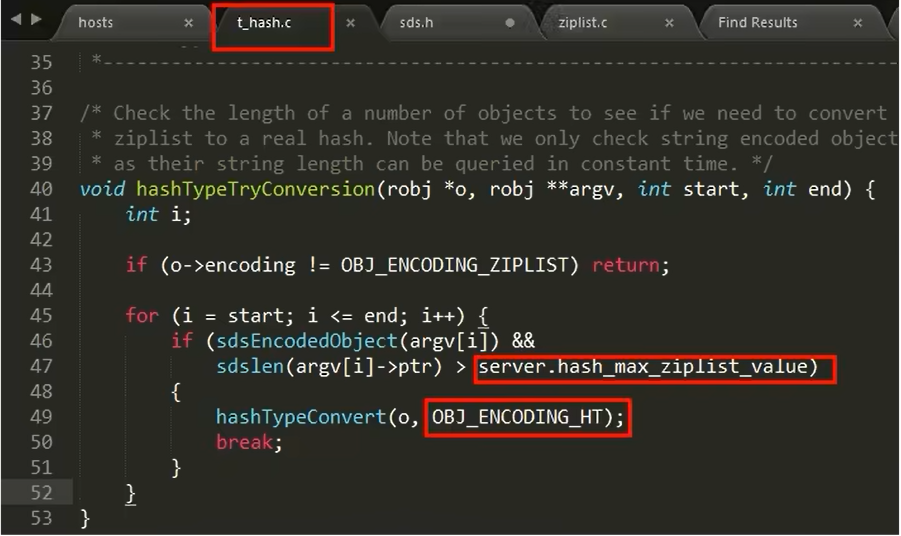  
<font color="#FF00FF">每个键值对都会有一个dictEntry</font>  

**hset命令解读**  
  
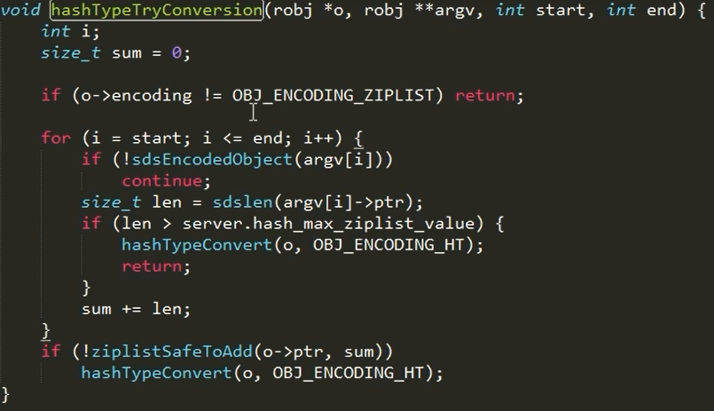  

ziplist压缩列表是一种紧凑编码格式,总体思想是<font color="#00FF00">多花时间来换取节约空间</font>,即以部分读写性能为代价,来换取极高的内存空间利用率  
因此<font color="#00FF00">只会用于字段个数少,且字段值也较小的场景</font>.压缩列表内存利用率极高的原因与其连续内存的特性是分不开的.

**ziplist什么样**  
为了节约内存而开发的,它是由连续内存块组成的顺序型数据结构,有点类似于数组  
ziplist是一个经过特殊编码的<font color="#00FF00">双向链表,它不存储指向前一个链表节点prev和指向下一个链表节点的指针next</font>而是<font color="#00FF00">存储上一个节点长度和当前节点长度</font>,通过牺牲部分读写性能,来换取高效的内存空间利用率,节约内存,是一种时间换空间的思想.只用在<font color="#00FF00">字段个数少,字段值小的场景里面</font>  
  

**ziplist各个组成单元什么意思**  
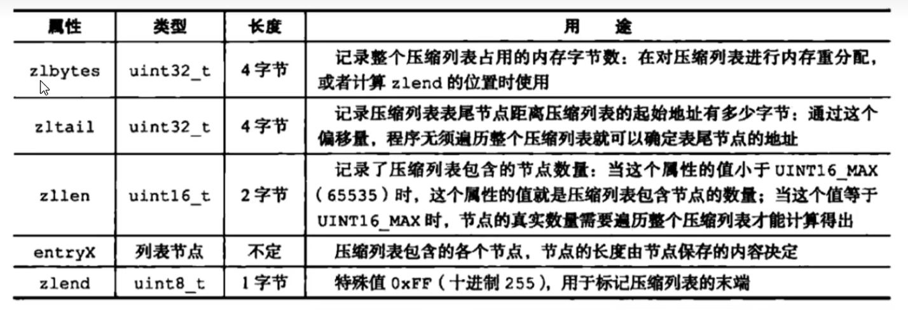  

**zlentry,压缩列表节点的构成:**  
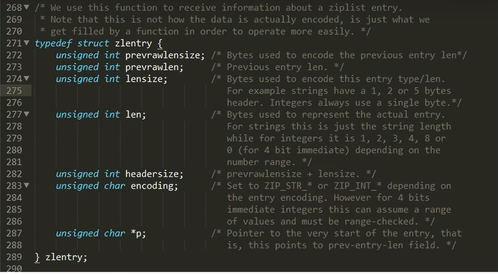  
  

**ziplist存储情况**  
  
|  field   |                 解释                 |
| :------: | :----------------------------------: |
| prevlen  |        记录了前一个节点的长度        |
| encoding | 记录了当前节点实际数据的类型以及长度 |
|   data   |       记录了当前节点的实际数据       |

**zlentry解析**  
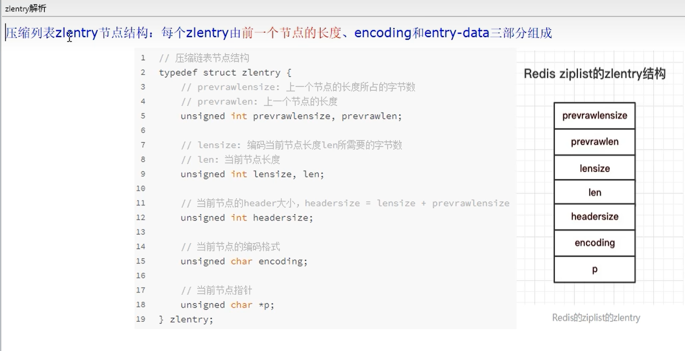  
前节点(prevlen):(前节点占用的内存字节数)表示前1个zlentry的长度,privious_entry_length有两种取值情况:<font color="#00FF00">1字节或5字节</font>.取值1字节时,表示上一个entry的长度小于254字节.虽然1字节的值能表示的数值范围是0到255,但是压缩列表中zlend的取值默认是255,因此,就默认用255表示整个压缩列表的结束,其他表示长度的地方就不能再用255这个值了.所以,当上一个entry长度小于254字节时,prev_len取值为1字节,否则,就取值为5字节.记录长度的好处:占用内存小,1或者5个字节  
encoding:记录节点的content保存数据的类型和长度  
content:保存实际数据内容  
  

**为什么zlentry这么设计?数组和链表数据结构对比**  
privious_entry_length,encoding长度都可以根据编码方式推算,真正变化的是content,而content长度记录在encoding里,因此entry的长度就知道了.entry总长度=privious_entry_length字节数+encoding字节数+content字节数  
  
为什么entry这么设计?记录前一个节点的长度?  
链表在内存中,一般是不连续的,遍历相对比较馒,而ziplist可以很好的解决这个问题.如果知道了当前的起始地址,因为entry是连续的,entry后一定是另一个entry,想知道下一个entry的地址,只要将当前的起始地址加上当前entry总长度.如果还想遍历下一个entry,只要继续同样的操作  

**明明有链表了,为什么还需要压缩链表?**  
  

**总结:**  
ziplist为了节省内存,采用了紧凑的连续存储.  
ziplist是一个双向链表,可以在时间复杂度为O(1)下从头部、尾部进行pop或push.  
<font color="#00FF00">新增或更新元素可能会出现连锁更新现象(致命缺点导致被listpack替换)</font>  
不能保存过多的元素,否则查询效率就会降低,数量小和内容小的情况下可以使用.  


3.redis7

执行`config get hash*`  
  

redis7的ziplist已经不在使用了,但是为了兼容性还是保留了  
```shell
config set hash-max-listpack-entries 3
config set hash-max-listpack-value 5
config get hash*
"hash-max-ziplist-value"
"5"
"halch-max-ziplist-entries"
"3"
"hash-max-listpack-value"
"5"
"hash-max-listpack-entries"
"3"
```
可以看到更新listpack之后会自动更新ziplist  

```shell
config set hash-max-ziplist-entries 7
config set hash-max-ziplist-value 7
config get hash*
"hash-max-ziplist-value"
"7"
"halch-max-ziplist-entries"
"7"
"hash-max-listpack-value"
"7"
"hash-max-listpack-entries"
"7"
```
同样更新ziplist之后也会连带更新listpack  
<font color="#00FF00">所以可以理解为在redis7下ziplist就是listpack的别名</font>  
Hash类型键的字段个数小于hash-max-listpack-entries且每个字段名和字段值的长度小于hash-max-listpack-value时,Redis才会使用OBJ_ENCODING_LISTPACK来存储该键,前述条件任意一个不满足则会转换为OBJ_ENCODING_HT的编码方式  

```shell
hset user02 id 2 cname zs
object encoding user02 
"listpack" #从6-7 ziplist已经被替换成listpack了
```

**结论:**  
* 哈希对象保存的键值对数量小于512个
* 所有的键值对的健和值的字符串长度都小于等于64byte(一个英文字母一个字节)时用hashtable,反之用listpack  
* listpack升级到hashtable可以,反过来降级不可以

**源码说明**  
object.c  
  
listpack.c  
  
IpNew函数创建了一个空的listpack,一开始分配的大小是LP_HDR_SIZE再加1个字节.LP_HDR_SIZE宏定义是在listpack.c中,它默认是6个字节,其中4个字节是记录listpack的总字节数,2个字节是记录listpack的元素数量.  
此外,listpack的最后一个字节是用来标识listpack的结束,其默认值是宏定义LP_EOF.  
和ziplist列表项的结束标记一样,LP_EOF的值也是255
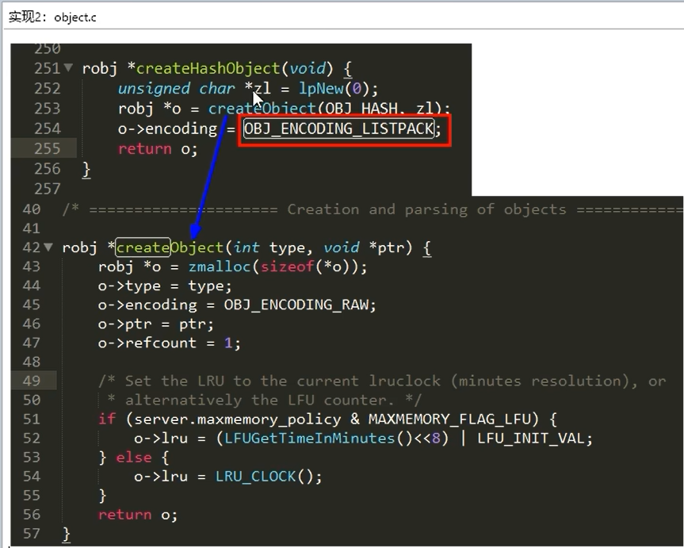  

**已经有ziplist了,为什么还需要listpack紧凑列表?**  
ziplist的连锁更新问题  
  
因为entry1节点的prevlen属性只有1个字节大小,无法保存新节点的长度,此时就需要对压缩列表的空间重分配操作并将entry1节点的prevlen属性从原来的1字节大小扩展为5字节大小.  
  
entry1节点原本的长度在250~253之间,因为刚才的扩展空间,此时entry1节点的长度就大于等于254,因此原本entry2节点保存entry1节点的prevlen属性也必须从1字节扩展至5字节大小.entry1节点影响entry2节点,entry2节点影响entry3节点.....一直持续到结尾.<font color="#00FF00">这种在特殊情况下产生的连续多次空间扩展操作就叫做[连锁更新]</font>  
listpack是Redis设计用来取代掉ziplist的数据结构,它通过每个节点记录自己的长度且放在节点的尾部,来彻底解决掉了ziplist存在的连锁更新的问题  

**listpack的结构**  
  
  

**listpack中每一个元素entry的结构**  
|     field      |              解释              |
| :------------: | :----------------------------: |
| entry-encoding |       当前元素的编码类型       |
|   entry-data   |            元素数据            |
|   entry-len    | 编码类型和元素数据这两部分长度 |

  

4.两种数据模型的对比  
 
和ziplist列表项类似,listpack列表项也包含了元数据信息和数据本身.不过,为了避免ziplist引起的连锁更新问题,listpack中的每个列表项不再像ziplist列表项那样保存其前一个列表项的长度.


#### 10.4.8 List数据结构介绍  
1.redis中list结构的底层数据类型是quickList  
* redis6下quicklist里面装的是ziplist
* redis7下quicklist里面装的是listpack
  

2.redis6  
```shell
config get list*  
"list-max-ziplist-size"
-2
"list-compress-depth"
0
```
ziplist压缩配置:`list-compress-depth 0`  
表示一个quicklist两端不被压缩的节点个数.这里的节点是指quicklist双向链表的节点,而不是指ziplist里面的数据项个数
参数list-compress-depth的取值含义如下:  
<font color="#00FF00">0:是个特殊值,表示都不压缩.这是Redis的默认值.</font>  
1:表示quicklist两端各有1个节点不压缩,中间的节点压缩.  
2:表示quicklist两端各有2个节点不压缩,中间的节点压缩.  
3:表示quicklist两端各有3个节点不压缩,中间的节点压缩.  

ziplist中entry配置:`list-max-ziplist-size -2`  
当取正值的时候,表示按照数据项个数来限定每个quicklist节点上的ziplist长度.比如,当这个参数配置成5的时候,表示每个quicklist节点的ziplist最多包含5个数据项.<font color="#00FF00">当取负值的时候,表示按照占用字节数来限定每个quicklist节点上的ziplist长度</font>.这时,它只能取-1到-5这五个值,每个值含义如下:  
-5:每个quicklIst节点上的ziplist大小不能超过64Kb.(注:1kb:>1024bytes)  
-4:每个quicklist节点上的ziplist大小不能超过32Kb.  
-3:每个quicklist节点上的ziplist大小不能超过16Kb.  
<font color="#00FF00">-2:每个quicklist节点上的ziplist大小不能超过8Kb.(-2是Redis给出的默认值) </font>  
-1:每个quicklist节点上的ziplist大小不能超过4Kb.  

**redis6版本前list的编码格式**  
list用quicklist来存储,quicklist存储了一个双向链表(linkedlist),每个节点都是一个ziplist  
  
在Redis3.0之前,list采用的底层数据结构是ziplist压缩列表+linkedList双向链表  
然后在高版本的Redis中底层数据结构是quicklist(替换了ziplist+linkedList),而quicklist也用到了ziplist  
<font color="#00FF00">结论:quicklist就是[双向链表+压缩列表]组合,因为一个quicklist就是一个链表,而链表中的每个元素又是一个压缩列表</font>  

在较早版本的redis中,list有两种底层实现:  
* 当列表对象中元素的长度比较小或者数量比较少的时候,采用压缩列表ziplist来存储
* 当列表对象中元素的长度比较大或者数量比较多的时候,则会转而使用双向列表linkedlist来存储  

两者各有优缺点:  
* ziplist的优点是内存紧凑,访问效率高,缺点是更新效率低,并且数据量较大时,可能导致大量的内存复制
* linkedlist的优点是节点修改的效率高,但是需要额外的内存开销,并且节点较多时,会产生大量的内存碎片
为了结合两者的优点,在redis 3.2之后,list的底层实现变为快速列表quicklist.  

**quicklist总纲**  
quicklist是ziplist和linklist的结合体  
  
linklist就是图中的quickListNode  

**quicklist结构**  
  

**quicklistNode结构**  
  

**quicklistNode中的*zl指向一个ziplist一个ziplist可以存放多个元素**  
  

3.redis7  
```shell
config get list*
"list- compress- depth"
"0"
"list-max-ziplist-size"
"-2"
"list-max-listpack-size"
"-2"
```
同样的道理在redis7下保留了ziplist,它作为listpack的别名而存在  

**t_list.c**  
  

**object.c**  
  

**redis7的list一种编码格式**  
* list用quicklist来存储,quicklist存储了一个双向链表,每个节点都是一个listpack
* quicklist是listpack和linklist的结合体 


#### 10.4.9 Set数据结构介绍

**set的两种编码方式**  
inset、hashtable  

Redis用intset或hashtable存储set.如果元素都是整数类型,就用intset存储.  
如果不是整数类型,就用hashtable(数组+链表的存来储结构).key就是元素的值,value为null.  

```shell
config get set*  
"set-max-intset-entries"
"512"
```
`set-max-intset-entries` 元素个数小于该值编码就是intset(并且都是整数类型);超过该值就是hashtable

**t_set.c源码**  
  


#### 10.4.10 ZSet数据结构介绍
1.ZSet的两种编码格式  
* redis6:ziplist+skiplist
* redis7:listpack+skiplist

2.配置  
redis6:  
```shell
config get zset* 
"zset-max-ziplist-entries"
"128"
"zset-max-ziplist-value"
"64"
```

redis7:  
```shell
config get zset* 
"zset-max-listpack-entries"
"64"
"zset-max-ziplist-value"
"64"
"zset-max-ziplist-entries"
"128"
"zset-max-listpack-value"
"128"
```
和之前的效果是一样的,就是用listpack替换了ziplist  

3.redis6  
当有序集合中包含的元素数量超过服务器属性server.zset_max_ziplist_entries 的值(默认值为128)  
或者有序集合中新添加元素的member的长度大于服务器属性server.zset_max_ziplist_value的值(默认值为64)时  
redis会使用<font color="#00FF00">跳跃表</font>作为有序集合的底层实现  
否则会使用ziplist作为有序集合的底层实现  

4.skiplist  
**为什么使用跳表?**  
单链表:  
对于一个单链表来讲,即便链表中存储的数据是有序的,如果我们要想在其中查找某个数据,也只能从头到尾遍历链表.  
这样查找效率就会很低,时间复杂度会很高O(N)  
  
链表的痛点:  
数组和链表各有优缺点链表遍历的时候,时间复杂度最差会出现O(N),我们优化一下,尝试空间换时间,给链表加个索引,称为"索引升级",两两取首即可.  
加索引:  
  
  
<font color="#00FF00">实际上这种加索引的效果就类似于二叉树</font>  

**跳表:**  
跳表:可以实现二分查找的有序链表  
跳表=链表+多级索引  
skiplist是一种以空间换取时间的结构.  
由于链表,无法进行二分查找,因此借鉴数据库索引的思想,提取出链表中关键节点(索引),先在关键节点上查找,再进入下层链表查找,提取多层关键节点,就形成了跳跃表  
<font color="#00FF00">注意:由于索引也要占据一定空间的,所以索引添加的越多,空间占用的越多</font>

**跳表的时间空间复杂度**  
时间复杂度:O(logN)  
跳表查询的时间复杂度分析,如果链表里有N个结点,会有多少级索引呢?  
按照我们前面讲的,两两取首.每两个结点会抽出一个结点作为上一级索引的结点,以此估算:  
第一级索引的结点个数大约就是n/2,  
第二级索引的结点个数大约就是n/4,  
第三级索引的结点个数大约就是n/8,依次类推....  
也就是说,第k级索引的结点个数是第k-1级索引的结点个数的1/2,那第k级索引结点的个数就是n/(2^k)  
假设索引有h级,最高级的索引有2个结点.通过上面的公式,  
我们可以得到n/(2^h)=2,从而求得h=log<sub>2</sub>n-1  
如果包含原始链表这一层,整个跳表的高度就是log<sub>2</sub>n  

**跳表的空间复杂度**  
比起单纯的单链表,跳表需要存储多级索引,肯定要消耗更多的存储空间.那到底需要消耗多少额外的存储空间呢?  
我们来分析一下跳表的空间复杂度.  
第一步:首先原始链表长度为n  
第二步:两两取首,每层索引的结点数:n/2,n/4,n/8...,8,4,2每上升一级就减少一半,直到剩下2个结点,以此类推;如果我们把每层索引的
结点数写出来,就是一个等比数列.  
这几级索引的结点总和就是n/2+n/4+n/8...+8+4+2=n-2.所以,跳表的空间复杂度是O(n).也就是说,如果将包含n个结点的单链表构造成
跳表,我们需要额外再用接近n个结点的存储空间.  

**为什么是两两取首?不能三三取首?**  
第三步:思考三三取首,每层索引的结点数:n/3,n/9,n/27...,9,3,1以此类推;
第一级索引需要大约n/3个结点,第二级索引需要大约n/9个结点.每往上一级,索引结点个数都除以3.为了方便计算,我们假设最高一级的索
引结点个数是1.我们把每级索引的结点个数都写下来,也是一个等比数列  
通过等比数列求和公式,总的索引结点大约就是n/3+n/9+n/27+...+9+3+1=n/2.尽管空间复杂度还是O(n),但比上面的每两个结点抽一个结点的索引构建方法,要减少了一半的索引结点存储空间  
所以空间复杂度是o(n)

**跳表的优点**  
跳表是一个最典型的<font color="#00FF00">空间换时间</font>解决方案,而且只有在<font color="#00FF00">数据量较大</font>的情况下才能体现出来优势.而且应该是<font color="#00FF00">读多写少</font>的情况下才能使用,所以它的适用范围应该还是比较有限的  

**跳表的缺点**  
维护成本相对要高  
在单链表中,一旦定位好要插入的位置,插入结点的时间复杂度是很低的,就是O(1)  
新增或者删除时需要把所有索引都更新一遍,为了保证原始链表中数据的有序性,我们需要先找到要动作的位置,这个查找操作就会比较耗时最后在新增和删除的过程中的更新,时间复杂度也是O(log n)

## 11.Redis为什么快?epoll和IO多路复用深度解析
**目录:**  
11.1 为什么使用多路复用?  
11.2 Unix网络编程中的五种IO模型  
11.3 BIO  
11.4 NIO  
11.5 IO Multiplexing(IO多路复用)  
11.6 select  
11.7 poll  
11.8 epoll  
11.9 总结  


### 11.1 为什么使用多路复用?
1.没有多路复用  
<font color="#00FF00">并发多客户端连接,同步阻塞网络IO模型</font>  
也即Redis为了处理每一个连接请求,都需要创建一个进程来单独处理(对接);使用这种方式的缺点就是性能非常差  

2.IO多路复用  
由于创建进程的开销太大了,并且进程上下文切换的开销也非常大(还涉及到用户态到内核态的转换);为了让一个进程能够同时处理很多TCP连接,由此引出了IO多路复用.  
一种实现方式是让这个IO线程轮询遍历所有连接的客户端来发现IO事件,但这种方式并不高效,随着连接数量的增多性能也会急剧下降.  
<font color="#00FF00">希望有一种更高效的机制,在很多连接中一旦有IO事件发生时就快速地把它找出来.</font>  

* I/O:网络I/O,尤其在操作系统层面指数据在内核态和用户态之间的读写操作
* 多路:多个客户端连接(连接就是套接字描述符,即socket或者channel),指的是多条TCP连接  
* 复用:复用一个或几个线程来处理多条连接
* IO多路复用:一个或一组线程就可以处理多个TCP连接,使用单进程就能够实现同时处理多个客户端连接,<font color="#00FF00">无需创建或者维护过多的进程/线程</font> 
* 小总结:一个服务端进程可以同时处理多个套接字描述符  
  实现IO多路复用的模型有三种:可以分select->poll-><font color="#00FF00">epoll</font>三个阶段来描述 


3.Redis单线程如何处理那么多并发客户端连接,为什么单线程,为什么快?  
Redis利用epoll来实现IO多路复用,<font color="#00FF00">将连接信息和事件放到队列中</font>,一次放到文件事件<font color="#00FF00">分派器</font>,事件分派器将事件分发给事件<font color="#00FF00">处理器</font>.  
  
Redis是跑在单线程中的,所有的操作都是按照顺序线性执行的,但是由于读写操作等待用户输入或输出都是阻塞的,所以I/O操作在一般情况下往往不能直接返回,这会导致某一文件的I/O阻塞导致整个进程无法对其它客户提供服务,而I/O多路复用就是为了解决这个问题而出现  
所谓I/O多路复用机制,就是说通过一种机制,可以监视多个描述符(linux中一个socket对应一个文件),一旦某个描述符就绪(一般是读就绪或写就绪),能够通知程序进行相应的读写操作.这种机制的使用需要<font color="#00FF00">select、poll、epoll</font>来配合.<font color="#00FF00">多个连接共用一个阻塞对象,应用程序只需要在一个阻塞对象上等待,无需 阻塞等待所有连接.当某条连接有新的数据可以处理时,操作系统通知应用程序,线程从阻塞状态返回,开始进行业务处理.</font>
Redis服务采用Reactor(响应式)的方式来实现文件事件处理器(每一个网络连接其实都对应一个文件描述符)  
Redis基于Reactor模式开发了网络事件处理器,这个处理器被称为文件事件处理器.它的组成结构为4部分:多个套接字、IO多路复用、文件事件分派器、事件处理器.  
<font color="#00FF00">因为文件事件分派器队列的消费是单线程的,所以Redis才叫单线程模型.</font>  


### 11.2 Unix网络编程中的五种IO模型
**分类**
* BlockingIO-阻塞IO  
* NoneBlockingIO-BIO非阻塞IO
* IO Multiplexing-IO多路复用  
* Signal Driven IO-信号驱动IO
* Asynchronous IO-异步IO

这里有个吃米线的故事非常有意思,但是太长了就不粘贴了(P168)  
* 同步:调用者要一直等待调用结果的通知后才能进行后续的执行  
* 异步:指被调用方先应答让调用者先回去,然后再计算调用结果,计算完最终结果后再通知并返回给调用方  
  异步调用要想获得结果一般通过回调  
* 同步与异步的理解:同步、异步的讨论对象是被调用者(服务提供者),<font color="#00FF00">获得调用结果的消息通知方式上</font>
* 阻塞:调用方一直在等待而且别的事情什么都不做,当前进程/线程会被挂起,啥都不干
* 非阻塞:调用在发出后,调用方接着执行别的事情,不会阻塞当前进程/线程,而是立即返回
* 阻塞与非阻塞的理解:阻塞、非阻塞的讨论对象是调用者(服务请求者),重点在于等消息时候的行为,调用者是否能干其它事
* 总结:  
  同步与异步是针对服务提供者而言的,当调用者调用服务提供者时;如果服务提供者需要完整运行完流程才能给调用者答复就是同步(答复内容是:收到+数据),如果服务提供者可以立即给调用者答复就是异步(答复内容是:收到).  
  阻塞与非阻塞是针对调用者而言的,当调用者调用服务提供者时;当服务提供者给应答之前(可能是数据也可能只是一个应答);服务调用者是等待啥也不干就是阻塞,如果服务调用者可以做别的事情就是非阻塞. 
  * 同步阻塞:调用者请求数据,服务者要获取到完整数据之后才把应答+数据信息传给调用者;并且调用者在拿到数据之前一直等待
  * 同步非阻塞:调用者请求数据,服务者要获取到完整数据之后才把应答+数据信息传给调用者;调用者在拿到数据之前可以干别的事情
  * 异步阻塞:调用者请求数据,服务者立即应答(表明已经收到请求);调用者拿到应答信息,但在拿到数据之前一直等待
  * 异步非阻塞:调用者请求数据,服务者立即应答(表明已经收到请求);调用者拿到应答信息,但在拿到数据之前可以干别的事情

### 11.3 BIO
  
当用户进程调用了recvfrom这个系统调用,kernel就开始了IO的第一个阶段:准备数据(对于网络IO来说,很多时候数据在一开始还没有到达.比如,还没有收到一个完整的UDP包.这个时候kernel就要等待足够的数据到来).这个过程需要等待,也就是说数据被拷贝到操作系统内核的缓冲区中是需要一个过程的.而在用户进程这边,整个进程会被阻塞(当然,是进程自己选择的阻塞).当kernel一直等到数据准备好了,它就会将数据从kernel中拷贝到用户内存,然后kernel返回结果,用户进程才解除block的状态,重新运行起来.所以,<font color="#00FF00">BIO的特点就是在IO执行的两个阶段都被block了</font>  
<font color="#FF00FF">复习一下Java的网络BIO编程(没新东西)</font>  
<font color="#00FF00">Tomcat7之前就是用BIO多线程来解决多连接的问题</font> 

### 11.4 NIO
  
当用户进程发出read操作时,如果kernel中的数据还没有准备好,那么它并不会block用户进程,而是立刻返回一个error.从用户进程角度讲
,它发起一个read操作后,并不需要等待,而是马上就得到了一个结果(应答).用户进程判断结果是一个error时,它就知道数据还没有准备好,于是它可以再次发送read操作.一旦kernel中的数据准备好了,并且又再次收到了用户进程的system call,那么它马上就<font color="#00FF00">将数据拷贝到了用户内存</font>
,然后返回.<font color="#00FF00">NIO特点是用户进程需要不断的主动询问内核数据准备好了吗?即用轮询替代阻塞!</font>  

1.在NIO模式中,一切都是非阻塞的  
accept()方法是非阻塞的,如果没有客户端连接,就返回无连接标识  
read()方法是非阻塞的,如果read()方法读取不到数据就返回空闲中标识,如果读取到数据时只阻塞read()方法读数据的时间  

2.在NIO中只有一个线程  
当一个客户端与服务端进行连接,这个socket就会加入到一个数组中,隔一段时间遍历一次  
看这个socket的read()方法能否读到数据,这样<font color="#00FF00">一个线程就能处理多个客户端的连接和读取了</font>  
<font color="#FF00FF">它是通过轮询来实现的</font>

3.NIO存在的问题和缺点  
NIO成功的解决了BIO需要开启多线程的问题,<font color="#00FF00">NIO中一个线程就能解决多个socket连接</font>,但是还存在2个问题.  

问题一:  
这个模型在客户端少的时候十分好用,但是客户端如果很多.  
比如有1万个客户端进行连接,那么每次循环就要遍历1万个socket,如果一万个socket中只有10个socket有数据,也会遍历一万个socket,就会
做很多无用功,每次遍历遇到read返回-1时(返回-1代表socket没有数据)仍然是一次浪费资源的系统调用.  

问题二:  
<font color="#00FF00">遍历socket的过程是在用户态完成的,用户态判断socket是否有数据是通过调用内核态的read()方法实现的</font>,这就涉及到用户态和内核态的转换,而每遍历一个socket就需要切换一次,开销太大!  

* 优点:不会阻塞在内核的等待数据过程,每次发起的I/O请求可以立即返回,不用阻塞等待,实时性较好.  
* 缺点:轮询将会不断地询问内核,这将占用大量的CPU时间,系统资源利用率较低,所以一般Web服务器不使用这种I/O模型.  

问题一解决方案:  
将用户socket对应的fd注册进epoll,然后epoll帮你监听哪些socket上有消息到达,<font color="#00FF00">这样就避免了大量的无用操作</font>.此时的socket应该采用非阻塞模式.这样,整个过程只在Redis调用select、poll、epoll这些调用的时候才会阻塞,收发客户消息是不会阻塞的,整个进程或者线程就被充分利用起来,这就是事件驱动,<font color="#00FF00">所谓的reactor反应模式</font>.


问题二解决方案:  
由于遍历每个socket都涉及到用户态到内核态的转换;能不能直接让linux内核完成上述的需求,程序将一批文件描述符通过一次系统调用传给内核<font color="#FF00FF">由内核去遍历</font>.于是IO多路复用应运而生,也即将上述工作直接放入linux内核,不在两态之间转换而是直接从内核获取结果,<font color="#00FF00">因为内核是非阻塞的</font>.

### 11.5 IO Multiplexing(IO多路复用)
1.文件描述符  
文件描述符(File descriptor)是计算机科学中的一个术语,是一个用于表述<font color="#00FF00">指向文件的引用</font>的抽象化概念.文件描述符在形式上是一个非负整数,实际上,<font color="#00FF00">它是一个索引值</font>,指向内核为每一个进程所维护的该进程打开文件的记录表.<font color="#00FF00">当程序打开一个现有文件或者创建一个新文件时,内核向进程返回一个文件描述符</font>.在程序设计中,文件描述符这一概念往往只适用于UNIX、Linux这样的操作系统.  

2.IO多路复用模型  
  
IO multiplexing就是我们说的select、poll、epoll,有些技术书籍也称这种IO方式为event driven IO事件驱动IO.就是通过一种机制,一
个进程可以监视多个描述符,一旦某个描述符就绪(一般是读就绪或者写就绪),能够通知程序进行相应的读写操作.可以基于一个阻塞对象并同时在多个描述符上等待就绪,而不是使用多个线程(每个文件描述符一个线程,每次new一个线程),这样可以大大节省系统资源.<font color="#00FF00">所以,I/O多路复用的特点是通过一种机制一个进程能同时等待多个文件描述符而这些文件描述符(套接字描述符)其中的任意一个进入读就绪状态</font>,select、poll、epoll等函数就可以返回(就可以读取).  

3.Reactor响应模式  
基于I/O复用模型:<font color="#00FF00">多个连接共用一个阻塞对象</font>,应用程序只需要在一个阻塞对象上等待,无需阻塞等待所有连接.<font color="#00FF00">当某条连接有新的数据可以处理时,操作系统通知应用程序,线程从阻塞状态返回</font>,开始进行业务处理.  
Reactor模式,是指通过一个或多个输入同时传递给服务处理器的服务请求的事件驱动处理模式.服务端程序处理传入多路请求,并将它们同步分
派给请求对应的处理线程,Reactor模式也叫Dispatcher模式.<font color="#00FF00">即I/O多路复用统一监听事件,收到事件后分发(Dispatch给某进程),是编写高性能网络服务器的必备技术.</font>

  
Reactor模式中有2个关键组成:  
* Reactor:Reactor在一个单独的线程中运行,负责监听和分发事件,分发给适当的处理程序来对IO事件做出反应.它就像公司的电话接线员,它接听来自客户的电话并将线路转移到适当的联系人;  
* Handlers:处理程序执行I/O事件要完成的实际事件,类似于客户想要与之交谈的公司中的实际办理人.Reactor通过调度适当的处理程序来响应I/O事件,处理程序执行非阻塞操作.  

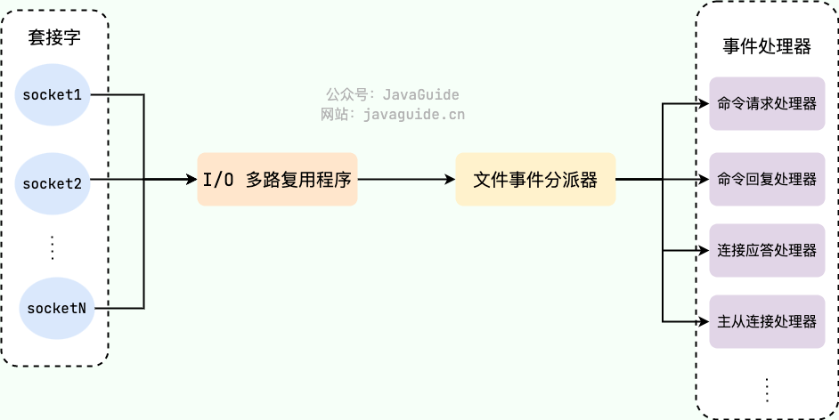


### 11.6 select
`select`指代的是linux的系统调用  
  
**`select`函数的执行流程:**  
select是一个阻塞函数,当没有数据时,会一直阻塞在select哪一行  
当有数据时会将rset中对应的那一位置**位**为1  
select函数返回不再阻塞  
遍历文件描述符数组(即&rset),判断哪个fd被置为1  
遍历到fd为1的文件读取数据,然后返回  

**优点:**  
<font color="#00FF00">select其实就是把NIO中用户态要遍历的fd数组(我们的每一个socket连接)拷贝到了内核态,让内核态来遍历</font>,因为用户态判断socket是否有数据还是要调用内核态的,所有拷贝到内核态后,<font color="#00FF00">这样遍历判断的时候就不用一直用户态和内核态频繁切换了</font>  
从代码中可以看出,select系统调用后,返回了一个置位后的&rset,这样用户态只需进行很简单的二进制比较,就能很快知道哪些socket需要read数据,有效提高了效率

**缺点:**  
* select函数通过bitmap数据结构来观察哪一个socket有数据;bitmap默认大小为1024,虽然可以调整但还是有限度.
* rset每次循环都必须重新置**位**为0,不可重复使用
* 尽管将rset从用户态拷贝到内核态,由内核态判断是否有数据,但还是有拷贝开销
* 当有数据时select就会返回,但是select函数并不知道哪个文件描述符有数据了,<font color="#00FF00">后面还需要再次对又件描述符数组进行遍历</font>.效率比较低

**小总结:**  
select方式,既做到了一个线程处理多个客户端连接(文件描述符),又减少了系统调用的开销,多个文件描述符只有一次select的系统调用+N次就绪状态的文件描述符的read系统调用

### 11.7 poll
**`poll`函数的执行流程:**   
将五个fd从用户态拷贝到内核态  
poll为阻塞方法,执行poll方法,如果有数据会将fd对应的revents置POLLIN  
poll方法返回  
循环遍历,查找哪个fd被置位为POLLIN了  
将revents重置为0便于复用  
对置位的fd进行读取和处理  

**解决的问题:**  
* 解决了bitmap大小限制  
  poll使用pollfd数组来代替select中的bitmap,数组没有1024的限制,可以一次管理更多的client.它和select的主要区别就是,去掉了select只能监听1024个文件描述符的限制.
* 解决了rset不可重用的情况  
  当pollfds数组中有事件发生,相应的revents置位为1,遍历的时候又置位回零,实现了pollfd数组的重用


**缺点:**  
*poll解决了select函数缺点的前两条,select函数的后两条问题还是没有解决*
* pollfds数组拷贝到了内核态,仍然有开销
* poll并没有通知用户态哪一个socket有数据,仍然需要O(n)的遍历


### 11.8 epoll
1.epoll不是一个函数,而是由三个函数构成  
`epoll_create`、`epoll_ctl`、`epoll_wait`
```c
// 创建epoll并且设置它的空间值为多少
int epoll_create(int size);
/*
将fd文件注册到epoll中
args0:是epoll_create方法的返回值
args1:表示operation,用三个宏定义来表示;可选值有:EPOLL_ADD添加、EPOLL_CTL_DELETE删除、EPOLL_CTL_MOD修改.三操作对fd的监听
args2:是需要监听的fd(文件描述符)
args3:告诉内核要监听什么事(结构体定义在下面)
*/
int epoll_ctl(int epfd,int op,int fd,struct epoll_event *event);

// 等待epfd上的io事件,最多返回maxevents个事件.参数events用来从内核得到事情的集合,maxevents告知内核这个events有多大
int epoll_wait(int epfd,struct epoll_event *events,int maxevents,int timeout);

// epoll_event结构体
struct epoll_event{
  __uint32_t events;
  epoll_data_t data;
};
/*
events可以是以下几个宏的集合:  
EPOLLIN:表示对应的文件描述符可以读(包括对socket正常关闭)
EPOLLOUT:表示对应的文件描述符可以写
*/
```

2.**`epoll`函数的执行流程**  
*<font color="#00FF00">epoll函数是非阻塞的</font>*  
epoll的执行流程:
当有数据的时候,会把相应的文件描述符"置位",但是epoll没有revent标志位,所以并不是真正的置位.这时候会把有数据的文件描述符放到队首.  
epoll会返回有数据的文件描述符的个数  
根据返回的个数读取前N个文件描述符即可  
读取、处理  
**注意点:** fd文件是如何创建的?是客户端与Redis之间建立连接后创建出来的,而连接的创建是在主线程(工作线程)中完成的  

3.epoll的特点  
多路复用快的原因在于,操作系统提供了这样的系统调用,使得原来的while循环里多次系统调用,<font color="#00FF00">变成了一次系统调用+内核层遍历这些文件描述符(并且epoll只会遍历那些有事件的文件描述符)</font>  
* 一个socket的生命周期中只有一次从用户态拷贝到内核态的过程,开销小  
* 使用event事件通知机制,每次socket中有数据会主动通知内核,并加入到就绪链表中,不需要遍历所有的socket  

在多路复用IO模型中,会有一个内核线程不断地去轮询多个socket的状态,只有当真正读写事件发送时,才真正调用实际的IO读写操作.因为在
多路复用IO模型中,只需要使用一个线程就可以管理多个socket,系统不需要建立新的进程或者线程,也不必维护这些线程和进程,并且只有真正
有读写事件进行时,才会使用IO资源,所以它大大减少来资源占用.<font color="#00FF00">多路I/O复用模型是利用select、poll、epoll可以同时监察多个流的I/O事件的能力,在空闲的时候,会把当前线程阻塞掉,当有一个或多个流有I/O事件时,就从阻塞态中唤醒,于是程序就会轮询一遍所有的流(epoll是只轮询那些真正发出了事件的流),并且只依次顺序的处理就绪的流,这种做法就避免了大量的无用操作.采用多路I/O复用技术可以让单个线程高效的处理多个连接请求(尽量减少网络IO的时间消耗),且Redis在内存中操作数据的速度非常快,也就是说内存内的操作不会成为影响Redis性能的瓶颈</font>

### 11.9 总结
1.`select、poll、epoll`三种方法的总结  
  

2.五种IO模型的总结  
多路复用快的原因在于,操作系统提供了这样的系统调用,使得原来的while循环里多次系统调用<font color="#00FF00">变成了一次系统调用+内核层遍历这些文件描述符.</font>  
所谓I/O多路复用机制,就是说通过一种机制,可以监视多个描述符,一旦某个描述符就绪(一般是读就绪或写就绪),能够通知程序进行相应的读写操作.这种机制的使用需要select、poll、epoll来配合.多个连接共用一个阻塞对象,应用程序(Redis)只需要在一个阻塞对象上等待,无需阻塞等待所有连接.当某条连接有新的数据可以处理时,操作系统通知应用程序,线程从阻塞状态返回,开始进行业务处理.  

  

3.如果Redis装在Windows操作系统上,会选择使用select函数;而不会使用epoll函数  
所以Redis一定要装在linux上  


# 实战篇
**目录:**  
1.丰富系统功能  
2.bitmap、hyperloglog、geo实战  
3.迷你版微信抢红包  


## 1. 丰富系统功能  
**目录:**  
1.1 利用incr命令增加用户点赞信息  
1.2 利用lpush命令实现文章推送功能  
1.3 利用Hash类型完成购物车功能  
1.4 利用Set类型完成抽奖小程序、社交场景  
1.5 利用ZSet类型完成热点数据的存放  
1.6 利用bitmap类型完成布尔逻辑的存放  
1.7 利用HyperLogLog类型完成UV统计  


### 1.1 利用incr命令增加用户点赞信息  
**介绍:** 因为Redis命令是原子性的,所以用这种很合适.  


### 1.2 利用lpush命令实现文章推送功能
假设,现在CSDN和尚硅谷发布了两篇文章,id分别为10 22  
执行`lpush uuid 10 22`  
那么查询的时候带上个人的uuid,去查询当前我们的文章时,执行`lrange uuid 0 9` 分页查询一次查询10条数据  
显示的结果为:10=>20

### 1.3 利用Hash类型完成购物车功能
  
为什么购物车功能推荐使用hash类型来完成?  
<font color="#00FF00">由于购物车中的商品频繁修改和变动</font>,购物车信息建议使用Hash存储.  

### 1.4 利用Set类型完成抽奖小程序、社交场景 
1.利用Set完成抽奖程序  
假设现在有抽奖程序,用户点击参加后就将用户的uuid放到一个Set集合中去,最后开奖的时候调用`srandmember`来随机开奖  

2.微信朋友圈点赞查看同赞的朋友  
  

3.QQ内推可能认识的人  
用`sinter`命令来求两个人共同的好友关系  

#### 1.5 利用ZSet类型完成热点数据的存放
1.完成热销商品的数据存储  

#### 1.6 利用bitmap类型完成布尔逻辑的存放
1.用户是否已经登陆过(布尔值场景);比如默默背单词的每日签到  
2.电影、广告是否被播放过  
3.钉钉打卡上班签到机制

**怎么用:**  
例如统计用户一个月的签到情况,那么就可以用一个长度为31的bit数组来存放这个数据,签到为1未签到为0.这样的好处就是不用每天反复读写数据库了.  

<font color="#FF00FF">bitmap本身并不复杂,但它的运用场景才是着重需要关注的. </font>

4.利用bitop完成用户连续多少天签到的场景  

假设设置了一个bitmap为:
`setbit 2023-9-16 0 1`这就代表在2023年9月16号这天,用户id为0的用户登录了  
`setbit 2023-9-16 5 1` 2023年9月16号这天,用户id为5的用户登录了  
`setbit 2023-9-17 5 1` 2023年9月17号这天,用户id为5的用户登录了  
`bitop and union 2023-9-16 2023-9-17` 将2023年9月16号和17号这两天用户的bitmap进行and运算;这样不就能统计出哪些用户连续两天登陆了吗?(通过查询union)

采用这种方法又快又省内存又高效!

### 1.7 利用HyperLogLog类型完成UV统计
1.统计网站每天的UV、统计某个文章的UV  
2.用户搜索网站关键词数量  
3.统计用户每天搜索不同词条个数  

## 2.bitmap、hyperloglog、geo实战 
详情见:高级篇=>4.bitmap、hyperloglog、geo实战


## 3.迷你版微信抢红包
**目录:**  
3.1 总体介绍  
3.2 架构设计  
3.3 代码编写  


### 3.1 总体介绍
1.需求分析  
* 各种节假日,发红包+抢红包,100%高并发业务要求,不能用mysql来做
* 一个总的大红包,会有可能拆分为多个小红包,总金额=分金额1+分金额2+分金额3
* 每个人只能抢一次,需要有记录,比如100块钱,被拆分为10个红包发出去总计有10个红包,抢一个少一个,总数显示(10/6)直到完,需要记录那些人抢到了红包,重复抢作弊不可以.
* 有可能还需要你计时,从发出红包到完全抢完花费了多长时间?
* 红包过期,或者没人抢完红包,红包资金原封不动退回.

2.难点分析  
* 拆分算法如何实现?  
  红包其实就是金额,拆分算法如何?给你100块,分成10个小红包(金额有可能小概率相同,有2个红包都是2.58),如何拆分随机金额设定每个红包里面安装多少钱?
* 次数限制  
  每个人只能抢一次,次数限制
* 原子性  
  每抢走一个红包就减少一个(类似库存),那这就需要保证库存的原子性(不能加锁实现)


### 3.2 架构设计
1.发送包流程  
发红包使用Redis中的list类型  
```shell
# 往list数组中添加本次红包的信息
# orderId是订单号,coin根据红包大小的不同会拆分出多个子金额
lpush redpackage:orderId [coin]...  

# 例如100元红包,5个人抢
lpush redpackage:001 20 20 20 30 10
``` 

2.抢红包流程  
要求:保证高并发、多线程、不加锁保证原子性  
```shell
# 利用lpop命令弹出就能实现抢红包
# 不用加锁也能保证原子性
lpop redpackage:001
```

3.记录红包  
为了防止作弊,同一个用户不可以抢夺两次红包,所以需要记录红包被抢情况  
利用Redis中的hash类型  
```shell
# 用一个新的hash类型来存放用户抢红包的记录
# userID表示是哪个用户抢的
# coin表示该用户抢的金额是多少
hset redpackage:customer:001 [userID]... [coin]...
# 例如;表明user0抢了10 user12抢了20
hset redpackage:customer:001 user:0 10 user:12 20
```

4.红包拆分算法之<font color="#00FF00">二倍均值算法</font>  
剩余红包金额为M,剩余人数为N,那么有如下公式  
`每次抢到的金额 = 随机区间(0,(剩余红包金额M ÷ 剩余人数N) × 2)`  
该公式保证了每次随机金额的平均值是相等的,不会因为抢红包的先后顺序而造成不公平.  
举个例子:  
假设有10个人,红包总额100元.  
第1次:  
100 ÷ 10 × 2 = 20,所以第一个人的随机范围是(0,20)平均可以抢到10元.假设第一个人随机到10元,那么剩余金额是100-10=90元.  
第2次:  
90 ÷ 9 × 2 = 20,所以第二个人的随机范围同样是(0,20)平均可以抢到10元.假设第二个人随机到10元,那么剩余金额是90 - 10 = 80元.  
第3次:  
80 ÷ 8 × 2 = 20,所以第三个人的随机范围同样是(0,20),平均可以抢到10元.以此类推,每一次随机范围的均值是相等的.

### 3.3 代码编写
这里直接写controller了  
RedPackageController:  
```java
@RestController
public class RedPackageController {
    // 定义的两个key常量
    public static final String RED_PACKAGE_KEY = "redpackage:";
    public static final String RED_PACKAGE_CONSUME_KEY = "redpackage:consume";

    @Autowired
    private RedisTemplate redisTemplate;

    @RequestMapping(value = "/send")
    public String sendRedPackage(int totalMoney, int redpackageNumber) {
        // 1 拆红包将总金额totalMoney拆分成redpackageNumber个子红包
        Integer[] splitRedPackages = splitRedPackageAlgorithm(totalMoney, redpackageNumber);
        // 2 发红包并保存进list结构里面且设置过期时间
        String key = RED_PACKAGE_KEY + IdUtil.simpleUUID();
        redisTemplate.opsForList().leftPushAll(key, splitRedPackages);
        redisTemplate.expire(key, 1, TimeUnit.DAYS);

        return key + "\t" + Ints.asList(Arrays.stream(splitRedPackages).mapToInt(Integer::valueOf).toArray());
    }

    @RequestMapping(value = "/rob")
    public String robRedPackage(String redpackageKey, String userId) {
        // todo 个人感觉这里是存在并发问题的,因为判断和抢等操作是非原子性操作
        // 验证某个用户是否抢过红包,不可以多抢
        Object redPackage = redisTemplate.opsForHash().get(RED_PACKAGE_CONSUME_KEY + redpackageKey, userId);
        if (redPackage == null) {
            // 红包没有抢完才能让用户接着抢
            Object partRedPackage = redisTemplate.opsForList().leftPop(RED_PACKAGE_KEY + redpackageKey);
            if(partRedPackage != null) {
                redisTemplate.opsForHash().put(RED_PACKAGE_CONSUME_KEY+redpackageKey, userId, partRedPackage);
                System.out.println("用户：" + userId + "\t 抢到了" + partRedPackage + "");
                // TODO 后续异步操作或者回滚操作
                return String.valueOf(partRedPackage);
            }
            // 抢完了
            return "errorCode:-1, 红包抢完了";
        }
        // 抢过了,不能抢多次
        return "errorCode:-2," + userId + "\t已经抢过了";

    }

    // 拆分红包算法 --》 二倍均值算法
    private Integer[] splitRedPackageAlgorithm(int totalMoney, int redpackageNumber) {
        Integer[] redpackageNumbers = new Integer[redpackageNumber];
        // 已经被抢夺的红包金额
        int useMoney = 0;
        for (int i = 0; i < redpackageNumber; i++) {
            if (i == redpackageNumber - 1) {
                redpackageNumbers[i] = totalMoney - useMoney;
            } else {
                // 二倍均值算法,每次拆分后塞进子红包的金额
                // 金额 = 随机区间(0,(剩余红包金额M ÷ 剩余人数N ) * 2)
                int avgMoney = ((totalMoney - useMoney) / (redpackageNumber - i)) * 2;
                redpackageNumbers[i] = 1 + new Random().nextInt(avgMoney - 1);
                useMoney = useMoney + redpackageNumbers[i];
            }
        }
        return redpackageNumbers;
    }
}
```

**多学一手**  
假设现在Redis中已经存储了很多红包信息,如何批量删除这些红包?  
执行命令:  
`redis-cli -a 111111 keys "red*" | xargs redis-cli -a 111111 del `
