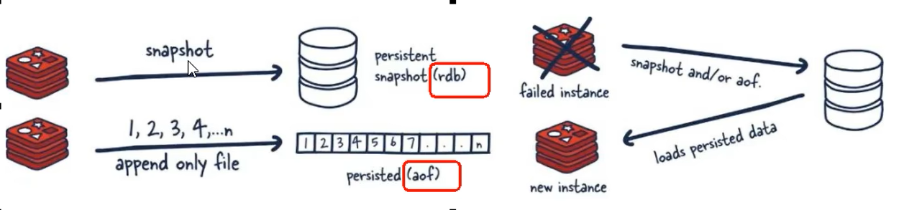
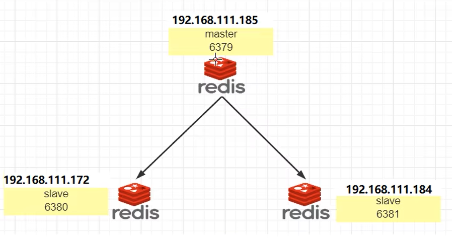
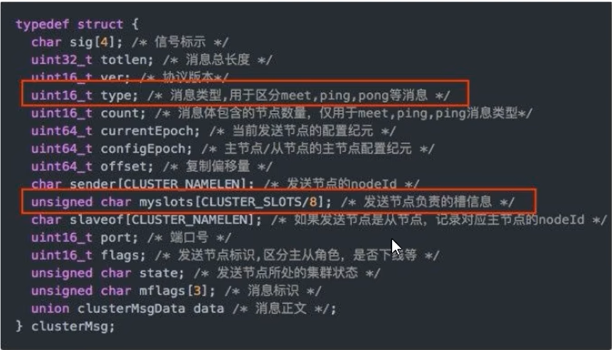
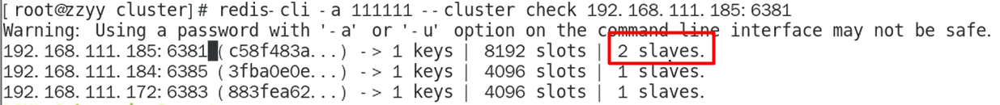

# 目录:  
A.基础篇  
B.高级篇  
C.实战篇  

# 基础篇
**目录:**  
1.10大数据类型  
2.Redis持久化  
3.Redis事务  
4.Redis管道  
5.~~Redis发布订阅~~(了解)  
6.Redis主从复制(replica)  
7.Redis哨兵(sentinel)  
8.Redis集群(cluster)  
9.Springboot整合Redis  

**附录:**  
A.Redis基本环境搭建  
B.Redis命令大全  

## 1. 10大数据类型

**注意:** 一般类型说的都是value的类型,key一直都是string  
**哪里获取命令的操作手册:**  
[Redis官网命令手册](https://redis.io/commands/)  
[中文命令手册](http://redis.cn/commands.html)  
详情可见附录  

**目录:**  
1.1 String(字符串)  
1.2 List(列表)  
1.3 Hash(哈希表)  
1.4 Set(集合)  
1.5 ZSet(有序集合)  
1.6 GEO(地理空间)  
1.7 HyperLogLog(基数统计)  
1.8 bitmap(位图)  
1.9 bitfield(位域)  
1.10 Stream(流)

### 1.1 String(字符串)  

**介绍:**  
一个Key对应一个Value;String类型是二进制安全的,二进制安全就是String可以包含任意数据,比如jpg图片或者序列化对象;String类型最大为512M  

### 1.2 List(列表)  

**介绍:**  
Redis列表是简单的字符串列表,可以将元素添加到列表的头部或者尾部;素以它实质上就是一个双端链表,最多可以包含2^32-1个元素.  

**特点:**  
主要功能有push/pop,一般用在栈、队列、消息队列等场景.  
由于是双端链表,所以可以对头和尾节点操作,并且效率是很高的;如果对中间的小标做操作则性能较差.  
如果key不存在则会创建key  
如果所有的value都不存在了,则key也消失了  

### 1.3 Hash(哈希表)  

**疑问:** 你会问和String类型有什么区别  
*提醒:Redis的类型说的是value的类型,也就是说Redis-Hash类型表明value的类型是Hash类型;整体看就是 Key (Key Value)*  

*相当于:Map<String,Map<Object,Object>>* 

### 1.4 Set(集合)  

**介绍:**  
同样也是字符串集合,不允许元素重复的类型,最多可以包含2^32-1个元素.Set是通过哈希表实现的,所以添加、删除、查找的时间复杂度都是O(1)  

**区别:**  
Set和List的区别,两者都是集合;还是那句话一个表明value的类型是List,一个表明value的类型是Set;就是说Redis的List类型中的元素允许重复,Redis的Set类型中的元素不允许重复   

### 1.5 ZSet(有序集合)  

**介绍:**  
字符串集合,不允许元素重复的类型,最多可以包含2^32-1个元素.ZSet是通过哈希表实现的,所以添加、删除、查找的时间复杂度都是O(1)  

**特点:**  
每个元素都关联一个double类型的分数,Redis通过分数来为集合中的元素进行从小到大排序.  
Set集合是:key value0 value1...  
ZSet集合是:key score:value0 score:value1...  

### 1.6 GEO(地理空间)  

**介绍:**  
主要用于存储地理位置,并对存储的信息进行操作;包括:  
* 添加地理位置的坐标  
* 获取地理位置的坐标
* 计算两个位置之间的距离  
* 根据用户给定的金纬度坐标来获取指定范围内的地理位置的集合  

**特点:**  
如果用`type`命令查看GEO的类型,它的返回值实际上是ZSet;

### 1.7 HyperLogLog(基数统计)  

**介绍:**  
HyperLogLog是用来做基数统计的算法,HyperLogLog的优点是,在输入元素的数量或者体积非常非常大时,计算基数所需的空间总是固定且是
很小的.  
在Redis里面,每个HyperLogLog键只需要花费12KB内存,就可以计算接近2へ64个不同元素的基数,这和计算基数时,元素越多耗费内存
就越多的集合形成鲜明对比.  
但是,因为<font color="#00FF00">HyperLogLog只会根据输入元素来计算基数,而不会储存输入元素本身,所以HyperLogLog不能像集合那样,返回输入的各个元素</font>.  

**场景:**  
统计某个网站的UV(unique visitor)、统计某个文章的UV  
UV就是独立访客,例如统计某个文章的访问量,同一个IP多次访问肯定是只算一次的;但是又不需要把每次访问的IP都存到数据库中,直接在Redis中就完成这个操作,所以UV是需要考虑去重的.  

**特点:**  
HyperLogLog的作用只用户统计,不做保存;比如HyperLogLog可以统计出当前文章的访问量是多少,但是HyperLogLog无法返回给你哪些IP看过这个文章.<font color="#00FF00">HyperLogLog有0.81%的误差</font>  
如果用`type`命令查看HyperLogLog的类型,它的返回值实际上是String;但是你没办法通过get得到它的内容


### 1.8 bitmap(位图)

**介绍:**  
由01状态表现的二进制位的bit数组,所以这就是个bit类型;想想最终返回的类型也是0101100这种.  

**特点:**  
bitmap的底层还是Stirng;如果用`type`命令查看bitmap的类型,它的返回值实际上是String

### 1.9 bitfield(位域)  

**介绍:**  
通过bitfield命令可以一次性操作多个<font color="#FF0000">比特位域(指的是连续的多个比特位)</font>,它会执行一系列操作并返回一个响应数组,这个数组中的元素对应参数列表中的相应操作的执行结果.  
说白了就是通过bitfield命令我们可以一次性对多个比特位域进行操作.  

*提示:目前阶段了解即可,这个用的不是很多*

**解释:**  
假设对于字符串"Redis",它在Redis中是咋存储的?究极根本字符串在计算机中的存储是以ASCII码来存储的,而8位二进制构成一个ASCII码,所以最终该字符串就是一个二进制.  
假设现在我要把Redis改为redis;就是把第一个字母从大写改成小写;以前的思路是用set把它覆盖掉.  
那么利用bitfield直接把它的二进制改掉不就可以了,也就是先定位到Redis中字符R对应的ASCII码,然后把该ASCII码中对应的几个二进制改成r的ASCII码二进制即可.  

### 1.10 Stream(流)

**介绍:**  
Redis版本的消息中间件,Redis本身是有一个Redis发布/订阅(pub/sub)来实现消息队列的功能,但是它有个缺点就是消息无法持久化,如果出现网络断开、Redis宕机等,消息就会被丢弃.  

**由来:**  
Redis实际上也可以实现消息中间件的特性,一共有两种方案:  
* 利用List列表来实现,之前说过List列表是双端链表;左右两端可以同时进和同时出,那么就一端进一端出就可以实现消息队列了;但这种方式是点对点的形式.  
* 利用Redis的发布和订阅(pub/sub)可以实现消息的广播;但是Redis相较于传统的消息中间件,它不支持持久化;如果网络断开、Redis宕机消息就会丢失.而且也没有ACK机制来保证数据的可靠性.  

<font color="#00FF00">Redis的Stream就是消息中间件+阻塞队列</font>

**特点:**  
实现消息队列,它支持消息的持久化、支持自动生成全局唯一ID、支持ACK确认消息的模式、支持消费组模式等,让消息队列更加的文档和可靠.如果用`type`命令查看Stream的类型,它返回的就是stream  

**结构:**  


|        属性        |                                                                                                          解释                                                                                                          |
| :----------------: | :--------------------------------------------------------------------------------------------------------------------------------------------------------------------------------------------------------------------: |
|  Message Content   |                                                                                                        消息内容                                                                                                        |
|   Consumer Group   |                                                                             消费组,通过XGROUP CREATE 命令创建,同一个消费组可以有多个消费者                                                                             |
| Last_deliveryed_id | 游标,每个消费组会有一个游标Last_deliveryed_id,任何一个组内成员读取了消息都会使游标Last_deliveryed_id往前移动;<font color="#00FF00">比如一个消费组要消费10条记录,一旦有消费者消费了第1条,那么游标就指向第2条消息</font> |
|      Consumer      |                                                                                                消费者,消费组中的消费者                                                                                                 |
|    Pending_ids     |  这是一个数组,用于保存当前组内已经读取过该消息的但还没有ACK确认的消费者的id;如果客户端没有ACK则该数组内的消息id会越来越多,一旦某个记录被ack它就开始减少.它用来确保客户端至少消费了一次,而不会在网络传输的中途丢失处理  |

个人理解的结构:
```java
public class Stream{
  private MessageContent messageContent;
  private int[] consumerIdGroup;
  private Iterator<Integer> lastDeliveryedId;
  private Consumer[] consumer;
  private int[] pendingIds;
}
```

**解释:**  
实际上消息就是一个数据结构  
每个消息都有它们的id;每个消息也有它对应的消息内容;每个消息还封装了它的消费者组的id;  
通过消费者组id就能得到组内的消费者是哪些(从而实现广播的机制)

## 2.Redis持久化
**目录:**  
2.1 总体介绍  
2.2 RDB  
2.3 AOF  
2.4 RDB+AOF混合持久化  
2.5 纯缓存模式  


### 2.1 总体介绍  
**持久化类型分类:** RDB、AOF、混合模式
RDB:Redis DataBase  
AOF:Append Only File  
混合模式:RDB+AOF  

1.RDB持久化方式  
拍摄快照的方式,把内存中的数据快照到磁盘上  
恢复的时候把打包的内存数据RBD恢复到内存  

2.AOF持久化方式  
类似于写日志文件的方式,将每条执行的命令append到日志文件上  
恢复的时候一条一条地执行文件中的命令  

  

### 2.2 RDB  
**目录:**  
2.2.1 介绍  
2.2.2 自动触发  
2.2.3 手动触发  
2.2.4 RDB的优势  
2.2.5 RDB的劣势  
2.2.6 RDB修复命令    

#### 2.2.1 介绍  
1.RDB持久化是以指定的时间间隔执行数据集的时间点快照  

2.实现类似照片记录效果的方式,就是把某一时刻的数据和状态以文件的形式写到磁盘上,也就是快照.这样一来就是故障宕机,快照文件也不会丢失,数据的可靠性也就得到了保证.  

3.在指定的时间间隔内将内存中的数据集快照写入磁盘,也就是行话讲的snapshot内存快照,它恢复时再将硬盘快照文件直接读回到内存里.  
Redis的数据都在内存里,保存备份时它执行的是<font color="#FF0000">全量快照</font>,也就是说,把内存中的所有数据都记录到磁盘中.

4.设置RDB的持久化规则  
<font color="#00FF00">附录=>A.Redis基本环境搭建=>redis.conf</font>  

#### 2.2.2 自动触发 
1.只要满足redis.conf配置文件中`save [second] [count]` 指定的值就会自动持久化  

2.类似`flushdb`命令也会导致Redis序列化到磁盘  

3.`shutdown`命令会导致Redis序列化到磁盘  

4.主从同步的时候,当有新的slave连接master的时候,master也会触发RDB(详情见:基础篇=>6.Redis复制机制=>6.4复制原理和工作流程)

#### 2.2.3 手动触发
**介绍:**  
Redis提供了两个命令来生成RDB文件,分别是save和bgsave  
**<font color="#FFC800">生产中只允许用bgsave;不允许用save</font>**  

1.Redis是如何进行手动触发的  
参照官方文档,在调用save或bgsave命令的时候,Redis会新开一个子进程(child process)去序列化当前的内存文件.

2.为什么不能用save序列化?  
**解释:**  
在主程序中执行会阻塞当前的Redis服务器,直到Redis持久化工作完成.执行save命令期间,Redis不能处理其它命令,**线上禁止使用**.  

3.bgsave的特点  
Redis会在后台异步进行快照操作,<font color="#FFC800">不阻塞</font>快照同时还可以响应客户端请求,该触发方式会fork一个子进程由子进程复制持久化过程.  
<font color="#FFC800">Redis自动触发备份默认走的是bgsave模式</font>

4.`lastsave` 获取上一次备份的时间  

#### 2.2.4 RDB的优势
* RDB是Redis数据的一个非常紧凑的单文件时间点表示.RDB文件非常适合备份.例如,您可能希望在最近的24小时内每小时归档一次RDB文件,并在30天内每天保存一个RDB快照.这使您可以在发生灾难时轻松恢复不同版本的数据集.  
* RDB非常适合灾难恢复,它是一个可以传输到远程数据中心或AmazonS3(可能已加密)的压缩文件.  
* RDB最大限度地提高了Redis的性能,因为Redis父进程为了持久化而需要做的唯一工作就是派生一个将完成所有其余工作的子进程.父进程永远不会执行磁盘I/O或类似操作.  
* 与AOF相比,RDB允许大数据集更快地重启.  
* 在副本上,RDB支持重启和故障转移后的部分重新同步.

**小总结:** 适合大规模的数据恢复、对照业务定时备份、对数据完整性和一致性要求不好、RDB文件在内存中的加载速度比AOF快很多.

#### 2.2.5 RDB的劣势
* 如果您需要在Redis停止工作时(例如断电后)将数据丢失的可能性降到最低,那么RDB并不好.您可以配置生成RDB的不同保存点(如,在对数据集至少5分钟和100次写入之后,您可以有多个保存点).但是,您通常会每五分钟或更长时间创建一次RDB快照,因此,如果Redis由于任何原因在没有正确关闭的情况下停止工作,您应该准备好丢失最新几分钟的数据.
* RDB需要经常fork()以便使用子进程在磁盘上持久化.如果数据集很大,fork()可能会很耗时,并且如果数据集很大并且CPU性能不是很好,可能会导致Redis停止为客户端服务几毫秒甚至一秒钟.AOF也需要fork()但频率较低,您可以调整要重写日志的频率.而不需要对持久性进行任何权衡.

**小总结(劣势):**  
* RDB的备份方式是在一定时间内做备份,如果Redis意外宕机的话就会导致从当前至最新一次的快照数据丢失.  
* 内存数据的全量同步,如果数据量太大会导致I/O严重影响服务器性能.  
* RDB依赖于主进程的fork,而fork子进程时,子进程时会拷贝父进程的页表,即虚实映射关系;在很大的数据集中这可能会导致服务请求的瞬间延迟.fork时内存中的数据被克隆了一份,大致2倍膨胀;需要慎重.  

#### 2.2.6 RDB修复命令
查看:基础篇=>附录=>A.Redis基本环境搭建=>4.安装文件说明=>redis-check-rdb  
**作用:**  
`redis-check-rdb [file.rbd]` 修复破损的RDB文件(需要来到file.rbd文件所在路径下执行该命令)  

### 2.3 AOF
**目录:**  
2.3.1 基本介绍  
2.3.2 AOF文件的持久化流程  
2.3.3 多AOF持久化文件  
2.3.4 修复AOF文件  
2.3.5 AOF的优势  
2.3.6 AOF的劣势  
2.3.7 AOF的重写机制  

#### 2.3.1 基本介绍
1.基本介绍
以日志的形式来记录每个写操作,将Redis执行过的所有写指令记录下来(读操作不记录),只许追加文件但不可以改写文件,redis启动之初会读取该文件重新构建数据,换言之,redis重启的话就根据日志文件的内容将写指令从前到后执行一次以完成数据的恢复工作.  

2.开启AOF持久化  
默认情况下Redis是没有开启AOF持久化的  
`appendonly [yes|no(default)]` 设置appendonly为yes开启AOF  

3.持久化文件名称  
默认aof的持久化文件名称为:appendonly.aof  
`appendfilename [fileName(default="appendonly.aof")]`  设置AOF持久化文件的名称  

4.持久化文件路径  
`appenddirname [dir(default="appendonlydir")]` 设置AOF持久化文件的路径;  
注意该路径最终的效果是`dir`+`appenddirname`;也就是说会在配置文件`dir`的目录下的`appenddirname`目录下创建aof文件.  
查看:基础篇=>附录=>A.Redis基本环境搭建=>5.redis.conf


#### 2.3.2 AOF文件的持久化流程
*提示:AOF只记录Redis的增删改操作不记录查询操作*  

1.客户端提交命令到Redis服务器  

2.Redis服务器产生的AOF日志内存并不是实时写回到AOF文件中,而是先写入一个**AOF缓冲区**,它就类似MySQL中的日志,MySQL中的日志也不是实时写入磁盘中,也是写入一个内存的缓冲区中.所以AOF缓冲区也是Redis在内存中开辟的一块区域  

3.写入到AOF缓冲区的AOF日志文件会有三种不同的策略来刷盘  
策略的设置见:基础篇=>附录=>A.Redis基本环境搭建=>5.redis.conf  

* always:同步写回,每个写命令执行完立刻同步地将日志写回磁盘(很安全但是性能不高)  
* everysec(默认):每秒写回,每隔一秒将AOF缓冲区的内容写入刷盘
* no:由操作系统控制写回,每个写命令执行完只是先把AOF日志文件写入到内存缓冲区,由操作系统决定何时将缓冲区内容写入磁盘.  

性能小总结:  
  

4.为了避免写入到磁盘上的AOF文件过度膨胀,会根据规则进行命令的合并(即AOF重写),从而起到压缩AOF的作用.  

5.Redis重启时根据AOF文件恢复数据  

#### 2.3.3 多AOF持久化文件
*高版本使用多AOF文件持久化策略*  
现在一个AOF文件由三个文件构成即:appendonly.aof.1.base.rdb、appendonly.aof.1.incr.aof、appendonly.aof.manifest;当然文件的名称还是通过`appendfilename`来指定  
* base:表示基础AOF,它一般由子进程通过重写产生,该文件最多只有一个  
* incr:表示增量AOF,它一般会在AOFRW开始执行时被创建,该文件可能存在多个(一般Redis的写操作会持久化到该文件里)  
* history:表示历史AOF,它由base和incr AOF变化而来,每次AOFRW成功完成时,本次AOFRW之前对应的base和incr AOF都将变为history,history类型的AOF会被Redis删除.  

为了管理这些AOF,引入了一个manifest(清单)文件来跟踪、管理这些AOF.同时,为了便于AOF备份和拷贝,我们将所有的AOF文件和manifest文件放入一个单独的文件目录中,目录名由`appenddirname`来决定.  

#### 2.3.4 修复AOF文件  
来带AOF持久化文件的路径下,ls查看当前路径下有哪些文件:  
```shell
ls
appendonly.aof.1.base.rdb  appendonly.aof.1.incr.aof  appendonly.aof.manifest
```
其中写Redis的语句会被保存到appendonly.aof.1.incr.aof文件内,再次提醒AOF文件不会记录Redis查询操作.实际上可以直接通过vim命令来编辑该文件,里面存放的就是一条条写入Redis的语句.  

1.现在模拟Redis错误写入  
在`appendonly.aof.1.incr.aof`文件的末尾随便加上一段乱码字符,然后关闭Redis;  
再次重启Redis会发现在AOF文件错误的情况下(假设现在不使用RDB文件)Redis服务器根本无法启动.  

2.修复AOF文件  
查看:基础篇=>附录=>A.Redis基本环境搭建=>4.安装文件说明=>redis-check-aof  
**作用:**  
`redis-check-aof --fix [filePath]` 修复破损的AOF文件  
* `filePath`:修复的文件路径

**举例:**  
`redis-check-aof --fix appendonly.aof.1.incr.aof` 一般修复就是修复`appendonly.aof.1.incr.aof`这个文件,注意一定要来到`appendonly.aof.1.incr.aof`文件所在的目录下执行该命令 

#### 2.3.5 AOF的优势  
* 使用AOF的Redis更加持久:  
  通过`appendfsync`配置来指定不同的fsync策略,如由操作系统决定刷盘、每秒刷盘、每次写入时刷盘.使用每秒fsync的默认策略,写入性能依旧很棒.fsync是使用后台线程执行的,当没有fsync正在进行时,主线程将努力执行写入,因此最多只会丢失一秒钟的写入.  
* AOF日志文件是追加写入(append),所以不会造成大量的随机磁盘I/O;即使出现某种原因使得写日志出现问题,也可以通过`redis-check-aof `工具来修复AOF文件.  
* 当AOF变得太大时,Redis能够在后台自动重写AOF,重写是完全安全的,因为当Redis继续附加到旧文件时,会使用创建当前数据集所需的最少操作集生成一个全新的文件,一旦第二个文件准备就绪,Redis就会切换两者并开始附加到新的哪一个(没读懂)  
* AOF以易于理解和解析的格式依次包含所有操作的日志,您甚至可以轻松导出AOF文件.例如,即使您不小心使用该FLUSHALL命令刷新了所有内容,只要在此期间没有执行日志重写,仍然可以通过停止服务器、删除最新命令并重新启动Redis来恢复数据.  

#### 2.3.6 AOF的劣势  
* AOF文件通常比相同数据集的等效RDB文件大  
* 根据确切的fsync策略,AOF可能比RDB慢.一般来说,将fsync设置为每秒写的性能依然非常高,并且在禁用fsync的情况下,即使在高负载下它也应该与RDB一样快.即使在巨大的写入负载的情况下,RDB仍然能够提供关于最大延迟的更多保证.(<font color="#00FF00">AOF运行效率慢于rdb,每秒fsync同步策略效率较高,不同步(交由操作系统刷盘)的效率和rbd相同</font>)  

#### 2.3.7 AOF的重写机制
*提示:重写是用于瘦身AOF文件过大而提出的,在2.3.5 AOF的优势的第三点提到过,这里做进一步说明*  
**介绍:**  
由于AOF持久化是Redis不断将写命令记录到AOF文件中,随着Redis不断的进行,AOF文件会越来越大这会导致服务器占用内存越大以及AOF恢复时间变长.  
为了解决这个问题,Redis新增了重写机制,当AOF文件的大小超过所设定的峰值时,Redis就会自动启动AOF文件的压缩机制,只保留可以恢复数据的最小数据集.  
或者手动使用`bgrewriteaof`命令来重写  

**重写的时机:**  
基础篇=>附录=>A.Redis基本环境搭建=>5.redis.conf=>`auto-aof-rewrite-percentage`和`auto-aof-rewrite-min-size`配置  
首先配置文件的小写必须满足`auto-aof-rewrite-min-size`的要求,其次本次文件校上次文件膨胀的比例达到`auto-aof-rewrite-percentage`之后才会触发重写.  

**什么叫保留最小数据集?**  
例如:  
```shell
set k1 v1
set k1 v2
set k1 v3
```
表面上是三条命令,实际上最终的效果只有`set k1 v3`这一条命令.  
所以只需要保存`set k1 v1`这一条命令即可  
当然也包括删除过期的Key等等;就是想办法瘦身  

**AOF重写流程:**  
*实验环境:将`aof-use-rdb-preamble`混合模式设置为no*  
最开始的时候`appenddirname`目录下有这三个文件`appendonly.aof.1.base.aof  appendonly.aof.1.incr.aof appendonly.aof.manifest`注意这里的文件和之前是不一样的(之前的base文件是rdb文件,这里是aof文件),`appendonly.aof.1.base.aof  appendonly.aof.1.incr.aof`这两个文件的大小都是0;现在开始往Redis中添加添加内容,随着添加的过程,appendonly.aof.1.incr.aof会慢慢膨胀;直到该文件大小膨胀到`auto-aof-rewrite-min-size`指定的大小时;再次查看目录下的文件有`appendonly.aof.2.base.aof  appendonly.aof.2.incr.aof appendonly.aof.manifest`表明此时AOF文件已经<font color="#00FF00">重写</font>过了  
`appendonly.aof.manifest`文件的大小是不变的,两个文件名本来为1的变为2了,并且appendonly.aof.2.incr.aof的<font color="#00FF00">大小变为0</font>;appendonly.aof.2.base.aof中的内容是刚才appendonly.aof.1.incr.aof文件瘦身后的内容.  
以此类推,如果`appendonly.aof.2.incr.aof`文件达到了设定的重写大小,并且大小比`appendonly.aof.2.base.aof`的大小膨胀到指定比例时又会发生重写,将文件名2改为3.  
<font color="#FF00FF">但是重写并不是将appendonly.aof.x.incr.aof文件中的内容进行重写;而是直接读取服务器现有的键值对,然后用一条命令去代替之前记录这个键值对的多条命令,生成一个新的appendonly.aof.x+1.base.aof文件去代替原来的AOF文件</font>

**手动重写:**  
通过`bgrewriteaof`命令手动重写AOF文件  

**AOF的整体小总结:**  
  

### 2.4 RDB+AOF混合持久化
1.AOF和RDB同时共存  
AOF和RDB能够同时共存,默认AOF是不开启的;<font color="#00FF00">如果AOF开启,则在Redis启动阶段会优先加载AOF</font>  
所以AOF默认不开启,一旦开启就以AOF优先  

2.如果同时开启RDB和AOF文件,启动时只会加载AOF不会加载RDB  
  

3.选哪个?  
*提示:这里实际上是做一个小总结,具体的选择还是根据RDB和AOF的优缺点来考量*  
* RDB持久化方式能够在指定的时间间隔能对你的数据进行快照存储  
* AOF持久化方式记录每次对服务器写的操作,当服务器重启的时候会重新执行这些命令来恢复原始的数据,AOF命令以redis协议追加保存每次写的操作到文件末尾.

<font color="#FF00FF">推荐还是使用混合的方式使用</font>  

通过`aof-use-rdb-preamble yes`配置来开启混合模式  

**结论:**  
RDB镜像做全量持久化,AOF做增量持久化  
先使用RDB进行快照存储,然后使用AOF持久化记录所有的写操作,当重写策略满足或手动触发重写策略时,<font color="#00FF00">将最新的数据存储为RDB记录.</font>这样的话,重启服务器的时候会从RDB和AOF两部分恢复数据,即保证数据的完整性又提高了数据的恢复性能.简单来说:混合持久化方式产生的文件一部分是RDB格式,一部分是AOF格式-><font color="#00FF00">AOF包括了RDB头部+AOF混写</font>.  
  


### 2.5 纯缓存模式
**介绍:**  
通过关闭RDB和AOF的方式,进一步提高Redis的性能(至于如何持久化那不需要Redis考虑).这就是纯缓存模式  
关闭Redis持久化实际上分为两个步骤:关闭RDB、关闭AOF  
通过redis.conf文件中设置`save ""`关闭rdb  
通过redis.conf文件中设置`appendonly no`关闭aof  

## 3.Redis事务
**目录:**  
3.1 什么是Redis的事务  
3.2 用法总结  


### 3.1 什么是Redis的事务
*提示:个人感觉Redis事务的说法有点歧义,其实Redis的事务和传统数据库的事务差别还是很大的,因为Redis只支持单线程,所以多线程中的那些问题并不会发生在Redis上,称之为<font color="#00FF00">Redis命令队列更合适</font>*  

**介绍:**  
首先Redis是单线程的,每次只能保证一个提交到Redis;所以Redis中的单命令天生就是原子性的.Redis的事务很大程序上说的是Redis事务的原子性(也不是全部),即Redis可以一次性执行多个命令,<font color="#00FF00">本质是一组命令的集合</font>,<font color="#FF00FF">在执行这组命令的时候不允许别的命令插队</font>.  
虽然单命令是原子性的,但是多个不同的命令直接实际上并不能保障它们的执行顺序,通过Redis的事务可以解决这个问题;它的本质实质上就是,客户端每次向Redis提交命令的时候提交的是一个<font color="#00FF00">队列</font>,这个队列中可以有很多命令,<font color="#FF00FF">即Redis执行的最小单元是队列</font>,只提交一个命令给Redis服务器相当于提交了一个只有一个命令的队列供Redis执行,而队列之间的执行顺序Redis是无法保障的.  
大概的示意图:  
  
<font color="#FFC800">一个队列中一次性、顺序性、排他性的执行一系列命令</font>  

Redis事务VS传统数据库的事务:  
* 单独的隔离操作:Redis实质上没有什么隔离性的说法  
* 原子性:Redis也没有什么原子性的说法,关于一个队列中如果有命令执行失败的情况,详情见=>3.2 用法总结  

**开启事务(队列)**  
`multi` 开启一个事务  
`exec` 提交事务
```shell
multi #开启事务

command0

command1

command2

exec #提交事务
```  

### 3.2 用法总结
1.正常执行  
```shell
multi #开启事务

command0

command1

command2

exec #提交事务
```  

2.放弃事务  
`discard` 命令放弃事务  
```shell
multi #开启事务

command0

command1

discard #放弃事务,command0和command1丢弃

```

3.全部失败  
*如果在一个事务还没有exec之前就执行了一条错误的Redis命令,那么当执行exec的时候整个事务(队列)中的命令都不会执行成功*  
```shell
multi #开启事务

set k1 v1 #正常命令语法

set k2 v2 #正常命令语法

set k3 #不正常的命令语法

exec #执行事务,报错:整个队列中的命令全部不执行

```

4.成功的成功,失败的失败  
*如果一个Redis事务中命令的语法检查都是正确的,但是执行时候出现错误了,那么在这个事务中不会造成所有命令全部执行失败,而是能够成功的就成功执行,不能成功的才报错.*  
```shell 
multi #开启事务

set k1 v1 #正常命令语法,能够执行成功

set k2 v2 #正常命令语法,能够执行成功

incr email #正常命令语法,不能执行成功(email不是数字)

set k3 v3 #正常命令语法,能够执行成功

exec #执行事务

```

结果:
```shell
ok
ok
error
ok
```

5.watch监控  
`watch [key0] [key1]...` 监控多个key  
Redis使用watch来提供乐观锁,如果在Redis事务执行exec之前watch的key发生了修改则当前事务中的所有命令都不会生效.  
`unwatch` 取消当前连接的监控的所有key  

**锁的释放时机:**  
* `unwatch`  
* 一旦执行了exec之前加的监控锁都会被取消
* 当客户端连接丢失的时候(比如退出连接),该连接监控的所有锁都会被取消监控

redis是单线程的,为什么会有乐观锁的说法?  
<font color="#00FF00">原因在于Redis的watch命令是执行在事务multi之前的</font>;看例子(括号的数字表示执行的顺序):  

客户端1:
```shell
set k1 v1 #初始数据的环境(1)

set balance 100 #初始数据的环境(2)

watch balance #开启key监控(3)

multi #开启事务(5)

set balance 200 #队列中的一条命令(5)

set k1 v1111111 ##队列中的一条命令(5)

exec #提交事务(5)

get balance

get k1

```

客户端2:
```shell
set balance 300 #修改balance的值(4)
```

执行结果:
```shell
300
v1
```

**解释:**  
是的,Redis是单线程的没错;但之前说过Redis不能保证每个队列之间的执行顺序,坏就坏在watch命令与multi命令不在一个队列中;于是乎导致客户端1的乐观锁失效,导致客户端1的整个事务执行失败.  

`unwatch`命令也是在`multi`之前执行的,例如:  

客户端1:
```shell
set k1 v1 #初始数据的环境(1)

set balance 100 #初始数据的环境(2)

get balance #结果为100(3)

watch balance #开启key监控(4)

unwatch #解除所有watch(7)

multi #开启事务(8)

set balance 300 #队列中的一条命令(8)

set k1 v1111111 ##队列中的一条命令(8)

exec #提交事务(8)

get balance

get k1
```

客户端2:
```shell
set balance 200 #修改balance(5)

get balance #结果为200(6)
```

执行结果:  
```shell
300
v1111111
```

## 4. Redis管道
**目录:**  
4.1 Redis管道基本介绍  
4.2 Redis管道的使用方法  

### 4.1 Redis管道基本介绍
**Redis管道的由来:**  
Redis是一种基于客户端-服务端模型以及请求/响应协议的TCP服务.一个请求会遵循以下步骤:  
* 客端向服务端发送命令分四步(发送命令->命令排队->命令执行->返回结果)并监听Socket返回,通常以阻塞模式等待服务端响应.  
* 服务端处理命令,并将结果返回给客户端

上述两步称为:Round Trip Time(简称:RTT,数据包往返于两端的时间)  
  
如果同时需要执行大量的命令,就需要等待上一条命令应答之后再去执行,这中间不仅多了RTT(Round Trip Time),还需要频繁调用系统的IO,发送网络请求,同时需要Redis调用多次read()和write()系统调用,系统方法会将数据从用户态转为内核态,这样就会对进程上下文有较大的影响,从而影响Redis性能.  

**解决思路:**  
管道(pipeline)可以一次性发送多条命令给服务端,服务端依次处理完毕之后,<font color="#00FF00">通过一条响应将一次性将结果返回,通过减少客户端与Redis的通信次数来降低往返延时时间.</font><font color="#FF00FF">pipeline的实现原理是队列,先进先出特性就保证数据的顺序性.</font>  
*提示:其实mset这种命令就有点这种思想*


**与Redis事务的区别:**  
你会发现Redis事务和管道十分类似,都是批量执行命令;它们的区别在哪里?  
* Redis事务侧重队列中的命令是顺序执行,不会被其它的命令穿插执行,强调命令执行之间的顺序.<font color="#00FF00">并且Redis事务中的各个命令本质还是一条条地发送给Redis服务器</font>,只是这些命令被保存到一个队列中,只有客户端发送<font color="#FF00FF">exec</font>命令时,服务器才会批量执行该队列中的命令.
* Redis管道侧重多命令与服务器之间多次交互而导致性能下降的问题,通过一次性向服务器发送多条命令,服务器全部处理完毕后一次性将结果返回给客户端从而达到提升性能的效果.  
  执行事务时不允许其它的命令穿插执行;但是执行管道时是允许其它命令穿插执行的,<font color="#00FF00">虽然说管道命令是批量发送过去的,但在执行期间是允许别的命令插队的.</font>
  如果管道质量执行的过程中发生异常,是不会影响到后续指令的执行的.  
  **建议:**  
  使用pipeline组装命令的个数不宜太多,不然数据量过大会可能会导致客户端的长时间阻塞,同时服务端给客户端的答复内容也会很多,从而占用服务端过多的内存.  

### 4.2 Redis管道的使用方法
**介绍:**  
Redis管道说白了效果类似于执行sql脚本,需要先在Redis的外部将所有redis命令写入到一个文件中,然后通过linux的管道符`|`将这写命令作为参数批量传递给redis-cli;接着redis-cli就会利用管道批量发布命令.  

**案例:**  
创建一个pipeline.txt文件,内如如下:  
```shell
set k1 v11
set k2 v22
hset k3 name zhangsan
hset k3 age 18
```
直接运行<font color="#00FF00">linux</font>命令:`cat cmd.txt | redis-cli -a [password] --raw --pipe`  
* --pipe:就代表使用redis管道  


## 5. Redis发布订阅
**本章知识点了解即可**  
**目录:**  
5.1 基本介绍  
5.2 常用命令  
5.3 发布订阅的缺点  


### 5.1 基本介绍
1.Redis发布订阅是一种消息通信模式,发送者(publish)发送消息,订阅者(subscribe)接收消息,可以实现进程间的消息传递.  
说白了就是Redis版的消息中间件  

2.和Stream的区别
其实Redis发布订阅就是早起的消息中间件,这是因为它不够完善,所以才产生了后来的Stream,所以宁可使用Stream也不会使用这里的发布订阅.<font color="#00FF00">所以本章知识只做了解</font>

3.Redis客户端可以订阅任意数量的频道,类似于微信公众号  
  
当有新的消息发送到某个频道的时候,所有的client就可以接受到该消息.  
  

  

### 5.2 常用命令
* `subscribe [channel0] [channel1]...` 订阅一个或多个频道信息  
  *提示:频道是不需要创建的,直接订阅就可以了*
* `publish [channel] [message]` 将[message]发送到指定的[channel] 
* `psubscribe [pattern]...` 按照模式(pattern的正则表达式)订阅一个或多个频道信息  
  比如有一个channel的名称为a1,那么这里订阅的时候[pattern]参数可以填写a1,也可以填写a*;说白了就是通过通配符来订阅频道
* `pubsub [subcommand]` 查看订阅与发布系统状态.[subcommand]处不同的命令有不同的效果 
* `unsubscribe [channel]` 退订[channel]频道
* `punsubscribe [pattern]` 退订[pattern]\(正则表达式匹配的频道\)

### 5.3 发布订阅的缺点
* 发布的消息无法在Redis中做持久化,必须先执行订阅再等待消息发布.如果先发布了消息,则由于消息没有订阅者这条消息就相当于丢失了.  
* 消息只管发送对于发布者而言消息是即发即失的,不管接收,也没有ACK机制,无法保证消息的消费成功.  
* 以上的缺点导致Redis的Pub/Sub模式就像个小玩具,在生产环境中几乎无用武之地,为此Redis5.0版本新增了Stream数据结构,不但支持多播,还支持数据持久化,相比pub/Sub更加的强大.


## 6. Redis主从复制(replica)
**目录:**  
6.1 总体介绍  
6.2 相关命令  
6.3 实际操作  
6.4 复制原理和工作流程  
6.5 主从复制的缺点  


### 6.1 总体介绍
  

**master以写为主,slave以读为主;当master数据变化的时候自动将新的数据异步同步到其它的slave数据库**  

**解决的问题:**  
主从复制可以解决这些问题:<font color="#00FF00">读写分离、容灾恢复、数据备份、水平扩容支持高并发</font>  

**怎么实现?**  
<font color="#FF00FF">配置从库不配主库</font>  
大哥是不主动收小弟的,只有小弟找大哥!  

**密码问题:**  
现代的Redis都需要配置密码,如果master通过`requirepass`参数设置了密码,则slave就要配置`masterauth`来设置校验密码,否则主机会拒绝访问.  

### 6.2 相关命令
* `info replication` 可以查看复制节点的主从关系和配置信息  
* `slaveof [masterIP] [masterPort]` 如果没有在Redis.conf配置文件中指定当前从机连接哪个master的信息,则从机每次与master断开之后都需要重新连接.该命令可以指定当前的slave与哪个master进行同步(<font color="#00FF00">是从机与目标主机</font>),如果当前从机原本已经指定了主机,<font color="#00FF00">则该命令会使得从机强制同步新的主机</font>.
* `slaveof no one` 使当前从机停止同步主机,自已变成master  

### 6.3 实际操作
**目录:**  
6.3.1 基本环境搭建  
6.3.2 一主二从  
6.3.3 薪火相传(传递性)  
6.3.4 反客为主  

#### 6.3.1 基本环境搭建
1.修改配置文件  
*提示:这里的教程是Redis应用,如果是docker安装的话有些配置可能不太一样*  
* 开启`daemonize yes` 后台运行redis(docker不需要配置)  
* 注释掉`bind 127.0.0.1` 绑定IP(如果有改配置只允许该IP连接当前Redis),docker环境下不需要配置  
* `protected-mode no` 关闭保护模式(docker不需要配置)  
* `port [port(default=6379)]` 指定Redis服务器端口(docker不需要配置)
* `dir [path]` 指定当前工作目录
* `pidfile [pidfilePath]` 文件的进程id(这个不需要修改)
* `loglevel [debug|verbose|notice(default)|warning]` 设置redis的日志级别
* `logfile "[fileName(default=)]"` 设置日志文件名称,默认就是空的,注意该配置要包含日志的名称,例如:  
  <font color="#00FF00">logfile "/data/redis.log"</font>
* `requirepass [password]` 设置当前Redis服务器的密码  
* `dbfilename [fileName(default=dump.rdb)]` 指定RBD持久化文件的名称
* `appendonly` aof相关配置,开启AOF、设置AOF保存路径、文件名称
* `masterauth [masterPassword]` 设置从机访问主机的密码,该配置只针对从机生效  
* `replicaof [masterIP] [masterPort]` 指定当前从机与哪个主机进行同步

效果如下:  
  

#### 6.3.2 一主二从
*提示:slave是没有写的权限的,当尝试往slave中写是会报错*

1.查看效果  
这里配置成功后,来到master的Redis,执行命令`info replication`结果如下:  
```shell
# Replication
# 当前的角色是master
role:master
# 连接的slave数量
connected_slaves:1
# slave信息
slave0:ip=47.113.148.127,port=6379,state=online,offset=1739,lag=0
master_failover_state:no-failover
master_replid:d744b74d603ab33712d01ab4b5f4685ac7e4f757
master_replid2:e93066cfc16ea555d3d7ff97d55d457cdd1ce993
# master当前同步数据的offset信息
master_repl_offset:1739
second_repl_offset:967
repl_backlog_active:1
repl_backlog_size:1048576
repl_backlog_first_byte_offset:967
repl_backlog_histlen:773
```

来到slave的Redis,执行命令`info replication`结果如下:  
```shell
# Replication
# 当前的角色是slave
role:slave
# master的IP
master_host:124.221.158.98
# master的端口
master_port:7902
# 当前slave与master的连接状态,up:连接 down:掉线
master_link_status:up
# 上一次与masterIO发生在多少秒之前;这里是1s;如果master宕机这里会显示-1
master_last_io_seconds_ago:1
master_sync_in_progress:0
slave_read_repl_offset:2047
slave_repl_offset:2047
slave_priority:100
# slave是否只读
slave_read_only:1
replica_announced:1
# 连接当前Redis的slave数量(是的slave也是可以被slave连接的,见6.3.3 薪火相传(传递性))
connected_slaves:0
master_failover_state:no-failover
master_replid:d744b74d603ab33712d01ab4b5f4685ac7e4f757
master_replid2:e93066cfc16ea555d3d7ff97d55d457cdd1ce993
master_repl_offset:2047
second_repl_offset:967
repl_backlog_active:1
repl_backlog_size:1048576
repl_backlog_first_byte_offset:1
repl_backlog_histlen:2047
```

2.一些问题  
* 从机是不可写入的,只可以读取  
* 同步时机:如果master先启动并且已经写入了很多的数据,此时slave才启动并且同步,slave是可以获取到master已经写入的数据的.
* 如果主机宕机了,<font color="#00FF00">从机是不会上位的.</font>  
  如果此时主机又重启了,那么主机与从机之间的关系<font color="#00FF00">依旧保留</font>
  
3.使用命令指定主机  
之前说过除了使用配置文件的方式指定同步的主机外,还可以使用命令的方式动态指定主机(详情见:基础篇=>6.Redis复制机制=>6.2 相关命令)

主要是`slaveof [masterIP] [masterPort]`这条命令的使用  
*注意:该命令是单次使用,如果Redis重启之后它又会变为master*

#### 6.3.3 薪火相传(传递性)
**存在的问题:**  
目前有一个问题,随着一台master连接的slave数量越来越多;会导致master不堪重负.所以薪火相传(传递性)的思想是,<font color="#00FF00">一个master连接有限的slave,别的slave不直接去连接master而是连接与master直接相连或间接相连的slave.</font>  
  

1.在这张架构图下,它们的`info replication`信息是什么?  
* 对于6379这台机器,连接它的slave数量不在是两个;而是6380这一台slave.  
* 对于6380这台机器,它本身作为slave;并且连接它(6380这个slave)的slave数量是一个(即6381)  
  此时显示的配置中`connected_slaves:1`这一项的值从原来的0改为1  
  虽然6380是6381的master,但<font color="#00FF00">依旧无法对6380进行写操作</font>  

#### 6.3.4 反客为主
`slaveof no one` 使当前从机停止同步主机,自已变成master  

### 6.4 复制原理和工作流程
1.slave启动,同步初请  
* slave启动成功连接到master会发送一个sync同步命令  
* slave首次全新连接master,一次完全同步(全量复制)将被自动执行,slave自身原有数据会被master数据覆盖清除  

2.首次连接,全量复制  
* master节点收到sync命令后会开始在后台保存快照(即RDB持久化,主从复制时会触发RDB),同时收集所有接收到的用于修改数据集命令缓存起来,master节点执行RDB持久化完后,master将rdb快照文件和所有缓存的命令发送到所有slave,以完成一次完全同步  
* 而slave服务在接受到数据库文件数据后,将其存盘并加载到内存,从而完成复制初始化  

3.心跳持续,保持通讯  
`repl-ping-replica-period [second(default=10)]` master向slave发出ping包的周期(心跳周期)

4.进入平稳,增量复制  
master继续将新的所有收集到的修改命令自动依次传递给slave,完成同步  

5.从机下线,重连续传  
master会检查backlog里面的offset,master和slave都会保存一个复制的offset还有一个masterId,offset是保存在backlog中的.master只会把已经复制的offset后面的数据复制给slave,类似断点续传(<font color="#00FF00">就是slave再上线的时候不需要从头开始重新全量复制了</font>)  
这个offset还用于选举slave当选新master时的参考(详情见:基础篇=>7.Redis哨兵=>7.3 哨兵的运行流程和选举原理=>4.兵王leader选举新master的算法)  

### 6.5 主从复制的缺点
1.master一点问题不能出  
其实不用想也知道了,在这种架构下master无疑是最重要的不能出问题的;如果master宕机由于剩下的slave不能上位就无法保证Redis的高可用了.  
为了解决该痛点就引入了<font color="#00FF00">哨兵模式和集群</font>

2.复制延时  
虽然slave可以不与master直接相连,但是slave连接slave会造成延时积累;因为只有master能进行写操作,当master写入一条记录要传播到最下面的slave就可能造成延时的积累.  
  

## 7.Redis哨兵(sentinel)
**目录:**  
7.1 总体介绍  
7.2 基本环境搭建  
7.3 哨兵的运行流程和选举原理  
7.4 哨兵的使用建议  


### 7.1 总体介绍
1.什么是哨兵?  
说白了有哨兵监控master主机是否故障,如果发生故障了则根据<font color="#00FF00">投票数</font>自动将某一个从库转换为新的主库,继续对外服务.  

2.哨兵的作用  
**简单来说就是不需要人工干预的运维机制**  
* 监控Redis运行状态,包括master和slave  
* 当master宕机时,能自动将slave转为新的master

  
<font color="#00FF00">注意:图中黑色的节点就是哨兵;所以也可以看出哨兵也不止一个;哨兵也需要配置集群;并且哨兵也是Redis机器;一般建议sentinel采取奇数台</font>

3.哨兵的作用  
* 主从监控:监控主从Redis库运行是否正常  
* 消息通知:哨兵可以将故障转移的结果发送给客户端  
* 故障转移:如果master异常,则会进行主从切换,将其中一个slave作为新的master  
* 配置中心:客户端通过连接哨兵来获得当前Redis服务的主节点地址

### 7.2 基本环境搭建
1.准备环境  
3个哨兵:自动监控和维护集群,不存放数据,只是吹哨人  
1主2从:用于数据读取和存放  
  

2.sentinel.conf  
哨兵的配置文件和Redis的配置文件是不一样的,哨兵的配置文件是sentinel.conf  
**拷贝sentinel.conf配置文件到`dir`目录下**  
`dir`目录就是redis的工作目录,可以通过redis.conf指定  
<font color="#00FF00">sentinel也是有自已的工作目录dir的设置,主要不要搞混</font>  
其中的部分配置和6. Redis主从复制(replica)=>6.3 实际操作=>6.3.1 基本环境搭建的配置一样,但是docker环境下不需要配置这些.  
sentinel.conf的相关配置可以见:基础篇=>附录=>A.Redis基本环境搭建=>6.sentinel.conf

3.基本环境搭建的配置  
*tips:还是决定列举一下配置*
* `bind 0.0.0.0` 绑定的IP(docker环境不需要配置)
* `daemonize yes` 是否后台运行(docker环境不需要配置)  
* `port 26379` 哨兵的端口号(docker环境不需要配置)  
* `logfile "/data/sentinel.log"` 日志文件的路径  
* `pidfile /var/run/redis-sentinel.pid` 进程id的文件路径指定(docker环境不需要配置)  
* `dir /data` 工作目录(docker环境不需要配置)  
* `sentinel monitor [masterName(default=mymaster)] [masterIP] [redisPort] [quorum]` 配置当前哨兵监控的master  
* `sentinel auth-pass [masterName] [password]` 配置监控的master的密码  

*扩展:哨兵是可以对多个master进行监控的;官网的截图如下*  
  

4.启动sentinel  
由于是通过docker容器进行启动;详情见[docker](Docker.md):附录=>B.常用docker镜像大全=>2.Redis=>7.启动sentinel  

5.sentinel是怎么知道master后面有哪些slave的?  
照目前的场景来看,sentinel只监控了master主机;如果master宕机了那sentinel也要知道从机的IP和端口才行啊;但是这里并没有配置从机的地址.  
<font color="#00FF00">实际上sentinel会自动进行配置重写</font>  
当sentinel启动成功后,再看一眼sentinel.conf配置文件,你会发现它在原有的配置上多了一些内容:  
```shell
# generate by config rewrite 
...
... # 正这之中就会自动配置slave的地址
... # 也会自动配置监控当前master的别的sentinel的地址
```

6.系统稳步正常运行中...  

7.手动宕机master(shutdown)  

**master宕机后的现状:**  
* master宕机后两台从机的数据依旧是OK的  
* 两个slave中的一个晋升成为master  
* 现在旧的master宕机后重新连接,旧的master会变成slave;即master已被之前的slave夺权,老master无翻盘之力  

**注意:**  
当master宕机之后,此时如果立即去读写slave可能会出现两种错误:Error Server closed the connection、Error Broken pipe  
实际上这两种错误的本质都是一样的,都是由于远程的master已经断开连接而导致的,并且此时新的master还没有选举成功.  
  
解决方案:实际上并不需要解决啥,客户端只需要稍后重连即可(等待网络恢复);这种错误一般是针对客户端而言并不是服务端.

**选取新master的小坑:**  
(redis.conf)最开始的时候主机master是不需要配置`masterauth`和`replicaof`这两个参数的,因为这两个参数只针对slave有效.  
但是当master宕机后重连,它是会成为新的master的slave的;既然是slave就必须配置`masterauth`和`replicaof`;那么这两个配置哪里来?  
实际上最开始不管是master还是slave都必须配置`masterauth`并且都需要和`requirepass`配置保持一致;而旧master的`replicaof`配置会自动重写(不需要操心),会写到旧master的redis.conf文件的最后一行  
而新master原本的`replicaof`配置会被重写抹除  

8.小总结  
哨兵模式启动成功后,文件的内容在运行期间会被sentinel动态地修改  
master-slave切换后,master_redis.conf、slave_redis.conf、sentinel.conf的内容都会随之发生改变.  

### 7.3 哨兵的运行流程和选举原理
1.主观下线  
主观下线是<font color="#00FF00">单个sentinel</font>检测到目标master的状态在`down-after-milliseconds`指定的时间内没有收到合法的回复,就主观上认为目标master宕机了.(<font color="#00FF00">所以主观下线是针对单台sentinel而言的</font>)  

2.客观下线  
需要一定数量的sentinel,<font color="#00FF00">多个哨兵</font>(通过`sentinel monitor ... [quorum]`配置中的[quorum]投票数来决定)达成一致的意见才能认为一个master客观上已经宕机了.

3.从哨兵中选举兵王  
当客观上已经认为一台master宕机后.  
当一台master宕机后,需要选举出一个兵王leader,接着由leader来进行failover(故障迁移),即从剩下的slave中选举一个master(并不是所有的sentinel都参与master与slave的切换).  

**兵王的选举算法:**  
从sentinel中选举兵王的raft算法:
  
简单来说就是:当一个sentinel想成为兵王的时候,它会先检测在它选举之前有没有别的sentinel已经发消息给过它,如果有那么当前sentinel只能回复给该sentinel同意你选举;接着当前sentinel会向其余的sentinel发消息说我想选举.  
最后票数最多的sentinel当选leader

4.兵王leader选举新master的算法(重点)  
*CVTE面试问过*  
当剩余slave节点都健康的情况下:  
* 首先看剩下的slave谁的权限高(priority);priority值越小优先级越高
* 如果权限一样,则看谁的同步偏移量offset的值高(关于offset的解释见:基础篇=>6.Redis主从复制=>6.4复制原理和工作流程=>5.从机下线,断点续传)
* 如果offset都一致,则选举slave的ID值最小的slave(每个Redis节点运行的时候都有一个ID)  

  

5.sentinel leader对选出出的master执行以下内容    
* 因为新的master以前是slave,所以它会先执行`slaveof no one` 命令自已成为master  
* sentinel leader向其它slave发送命令,让剩余的slave成为新的master节点的slave;`slaveof`这条命令是可以临时更改master的

6.旧master上线后的操作  
* 老master上线之后会成为新master的slave  
* sentinel leader会让原来的master降级为slave并恢复正常工作  

**注意:**  
第三步由sentinel集群自主完成,4、5、6这三步都由sentinel leader自主完成,完全无需人工干预.  

### 7.4 哨兵的使用建议
* 哨兵节点的数量应为多个,哨兵本身应该集群,数量最好为奇数保证高可用  
* 各个哨兵节点的配置应该一致
* 如果哨兵节点部署在docker容器中,尤其要注意端口的正确映射  
* 哨兵集群+主从复制的这种模式,并不能保证数据0丢失  
  在生产环境中,master宕机之后所有的写操作都不能执行;而选举新master一般需要5-10s;那么在这中间的所有数据都会丢失;  
  其次由于master与slave之间同步也不是完全实时的(是**异步**的),就会导致部分已经写入master但还没来得及同步到slave的数据丢失.  
  正是由于这种缺陷从而引出了<font color="#FF00FF">集群</font>


## 8.Redis集群(cluster)
**目录:**  
8.1 总体介绍  
8.2 集群算法-分片-槽位slot  
8.3 3主3从集群环境  
8.4 小总结  

### 8.1 总体介绍
1.为什么引入集群  
集群就是为了解决哨兵集群+主从复制下,master宕机之后所有的写操作都不能执行;而选举新master一般需要5-10s;那么在这中间的所有数据都会丢失的问题.  

2.什么是Redis集群  
<font color="#00FF00">由于数据量过大,单个Master复制集</font>难以承担,因此需要对多个复制集进行集群,形成水平扩展每个复制集只负责存储整个数据集的一部分,这就是Redis的集群,其作用是提供在多个Redis节点间共享数据的程序集.  

3.本章的重点是学习集群的算法和网络拓扑(八股)不是学怎么安装配置  

4.架构图  
  
现在是多个master,一个master后面有多个slave做支撑,同样还是读写分离的模式.  
如果M1宕机了,那么M1下的slave还能顶上  
Redis集群是一个提供在多个Redis节点间共享数据的程序集  
Redis集群可以支持多个master  
**注意:**  
M1的数据并没有拷贝到M2和M3中,只是从宏观的角度上来说Redis集群对外提供共享的数据集;只是说从宏观上来看当M1宕机后并不影响整个Redis集群对外提供写服务的能力.  

5.Redis集群的功能  
* Redis集群支持多个master,每个master又可以挂在多个slave(可以实现读写分离、支持数据的高可用、支持海量数据的读写存储操作)  
* 由于cluster自带sentinel的故障转移机制,内置了高可用的支持,<font color="#00FF00">无需再去使用哨兵功能</font>  
* 客户端与Redis的节点连接,不再需要连接集群中所有的节点,<font color="#00FF00">只需要任意连接集群中的一个可用节点即可</font>  
* <font color="#00FF00">槽位slot</font>负责分配到各个物理服务节点,由对应的集群来负责维护节点、插槽和数据之间的关系  

### 8.2 集群算法-分片-槽位slot
1.什么是Redis的槽位  
*提示:这里要紧紧扣住上面Redis集群的架构图*  
集群的密钥被分为16384个槽,一个槽就是一个master;所以Redis集群节点上线为16384(<font color="#00FF00">但是建议最大节点数量大小约为1000个节点</font>)  
Redis集群没有使用一致性hash,而是引入了**哈希槽**的概念.  
Redis集群有16384个哈希槽,每个key通过CRC16校验后对16384<font color="#00FF00">取模</font>来决定放置哪个槽.集群的每个节点负责一部分hash槽(也就是说一个节点可以负责多个哈希槽),举个例子,比如当前集群有3个节点那么:  
  

2.什么是分片  
使用Redis集群时我们会将存储的数据分散到多台Redis机器上,这称之为分片.即集群中的每个Redis实例都被认为是整个数据的一个分片.  
为了找到给定key的分片,我们对key进行CRC16(key)算法处理并通过对总分片数量取模.然后,使用确定性哈希函数,这意味着给定的key将多次始终映射到同一个分片,我们可以推断将来读取特定key的位置.  

3.槽位和分片的优势  
* 好写好找;写的时候用的算法和取的时候用的算法一致  
* 方便扩容和数据分派查找  
  这种结构很容易添加或删除节点,现在上面有3个节点(3个master)假设现在要新增一个节点D,就需要从ABC三个节点中得到部分槽分配到槽D上.如果我想移除节点A,需要将A中的槽位移到B和C节点上,然后将没有任何槽的A节点从集群中移除即可.由于一个节点将哈希槽移动到另一个节点并不会停止服务,<font color="#00FF00">所以无论添加删除或者改变某个节点的哈希槽的数量都不会造成集群的不可用状态</font>.

4.如何得到槽位(slot槽位映射)  
*即如何通过key得到它的对应的槽位算法(当向Redis写入数据时,它最终会落入哪个槽/master节点的算法)*  
一共有三种算法:哈希取余分区、一致性哈希算法分区、哈希槽分区  
4.1 哈希取余分区:
  
2亿条记录就是2亿个Key,单击存不下必须使用分布式,假设有三台器构成一个集群,每次用户读写都是根据公式:hash(key) % N个机数量,计算出哈希值,用来决定数据映射到哪一个节点上.  
**优点:**  
简单粗暴,直接有效,只需要预估好数据规划好节点,例如台、8台、10台,就能保证一段时间的数据支撑.使用Hash算法让固的一部分请求落到同一台服务器上,这样每台服务器固定处理一部分求(并维护这些请求的信息),起到负载均衡+分而治之的作用.  
**缺点:**  
如果节点数量是一成不变的,那么使用该方式没有什么题.但如果需要对Redis进行扩容或缩容就比较麻烦了,不管扩还是缩每次节点有变动导致数据有变动,映射关系也会重新计算,原来取模公式也会发生变化:hash(key)/3会变成hash(key)/?.此时地址经取余运算结果将发生很大变化,根据公式获取服务器的数据也会变得可控.  
<font color="#00FF00">某个Redis宕机了,由于台数数量变化,导致hash取余全部数据重新洗牌</font>

4.2 一致性哈希算法分区:  
为了解决分布式缓存数据变动和映射问题,某台机器宕机了,分母数量改变了,哈希算法自然就不一致了.一致性哈希解决方案目的是当服务器个数发生变动时,尽量减少影响客户端到服务器的映射关系.  

**三大步骤:**  
* 算法构建一致性哈希环:  
  一致性哈希算法通过hash函数计算并产生hash值,hash算法的所有可能的hash值会构成一个全量集,这个集合可以成为一个hash空间<font color="#00FF00">[0,2^32 - 1]</font>,这是一个线性空间,在算法中我们通过适当的逻辑控制它首尾相连(**0= 2 ^32**),这样让其在逻辑上形成一个环形空间.(即对于每个hash值都可以用一个整数id来标识它)  
  它同样也是使用取模的方法,<font color="#00FF00">哈希取余分区算法是对节点(服务器)的数量进行取模.而一致性hash是对2^32取模,简单来说;一致性hash算法将整个哈希值空间组织成一个虚拟的圆环</font>,如假设某哈希函数H的值空间为0 - 2^32 -1(即哈希值是一个32位无符号整数),整个哈希环如下图:整个空间按顺时针方式组织,圆环的正上方的点代表0,0点右侧的第一个点代表1,以此类推2、3、4...直到2^32 - 1,也就是说0点左侧的第一个点代表2^32 - 1,0和2^32 - 1在零点中方向重合,我们把这个由2^32个点组成的圆环称为hash环.  
    
* Redis服务器IP节点映射:  
  将集群中各个IP节点映射到环上的某一个位置  
  将各个服务器使用hash函数计算其hash值,具体可以选择服务器IP或主机名作为关键字进行哈希,这样每台机器就能确定其在哈希环上的位置.假如4个节点NodeA、B、C、D经过IP地址的<font color="#00FF00">哈希函数</font>计算(hash(ip)),<font color="#00FF00">使用IP地址哈希后在环空间的位置如下</font>:  
    
* key落到服务器的落键规则:  
  当需要存储一个键值对的时候,首先计算key的hash值,通过hash的结果值确定该key在环上的位置.  
  <font color="#00FF00">从此位置沿环顺时针行走,第一台遇到的服务器就是其应该定位到的服务器,并将该键值对存储在该节点上.</font>    
  如我们有Object A、Object B、Object C、Object D四个数据对象,经过哈希计算后,在环空间上的位置如下:根据一致性Hash算法,数据A会被定为到Node A上,B被定为到Node B上,C被定为到Node C上,D被定为到Node D上.
    

**优点:**  
一致性哈希环具有<font color="#00FF00">容错性</font>  
  
假设Node C宕机可以看到此时对象A、B、D不会受到影响.一般的,在一致性Hash算法中,如果一台服务器不可用,则受影响的数据仅仅是此服
务器到其环空间中前一台服务器(即沿着逆时针方向行走遇到的第一台服务器;例如这里的NodeB和NodeC之间的数据)之间数据,其它不会受到影响.简单说,就是C挂了,受到影响的只是B、C之间的数据且这些数据会转移到D进行存储.  
所以可以很大限度地保障已有节点之前数据的可靠性  

一致性哈希环具有<font color="#00FF00">扩展性</font> 
  
数据量增加了,需要增加一台节点NodeX,X的位置在A和B之间,那受到影响的也就是A到X之间的数据,重新把A到X的数据录入到X上即可,不会导致hash取余全部数据重新洗牌.  
<font color="#00FF00">总结就是他解决了哈希取余算法动态增减节点时导致hash取余全部数据重新洗牌</font>

**缺点:**  
容易造成<font color="#00FF00">数据倾斜</font>问题  
一致性Hash算法在服务节点太少时,容易因为<font color="#00FF00">节点分布不均匀(服务器hash后分布在环上不均匀)</font>而造成数据倾斜(被缓存的对象大部分集中缓存在某一台服务器上)问题,列如系统中只有两台服务器:  
  

4.3 哈希槽分区:  
为了解决一致性哈希出现的**数据倾斜**问题提出了哈希槽分区  
哈希槽实质就是一个数组,数组[0,2^14 - 1]形成hash slot空间.  

哈希槽分区解决<font color="#00FF00">均匀分配问题</font>,在<font color="#FF00FF">数据和节点之间又加入了一层,把这层称为哈希槽(slot),用于管理数据和节点之间的关系</font>,现在就相当于节点上方的是槽,槽里放的是数据.  
槽解决的是粒度问题,相当于把粒度变大了,这样便于数据移动.哈希解决的是映射问题,使用Key的哈希值来计算所在的槽,便于数据分配.  
一个集群只能有16384个槽,编号0-16383(0-2^14-1).这些槽会分配给集群中的所有主节点,分配策略没有要求.  
<font color="#00FF00">集群会记录节点和槽的对应关系</font>,解决了节点和槽的关系后,接下来就需要对key求哈希值,然后对16384取模,余数是几key就落入对应的槽里.<font color="#00FF00">所以数据只需要关心在哪个槽里,而槽与节点的关系自动维护.</font>  
HASH_SLOT=CRC16(key) mod 16384,以槽为单位移动数据,因为槽的数目是固定的,处理起来比较容易,这样数据移动问题就解决了.  

**哈希槽的计算:**  
Redis集群中内置了16384个哈希槽,redis会根据节点数量大致均等的将哈希槽映射到不同的节点.当需要在Redis集群中放置一个
key-value时,<font color="#00FF00">redis先对key使用CRC16算法算出一个结果然后用结果对16384求余数</font>`CRC16(key)%16384`,这样每个key都会对应一个编号  
在0-16383之间的哈希槽,也就是映射到某个节点上.如下代码,key之A、B在Node2，key之C落在Node3上.  
  

5.为什么redis集群的最大槽数是16384?(经典面试题)  
*提示:CRC16算法产生的hash值有16bit,该算法可以产生2^16=65536个值;为什么不用65536而使用16384就够用?*  
作者原文的回答:    
  
翻译:  
<font color="#00FF00">正常的心跳数据包</font>带有节点的完整配置,可以用幂等方式用旧的节点替换旧节点,以便更新旧的配置.  
这意味着它们包含原始节点的插槽配置,该节点使用2k的空间和16k的插槽,但是会使用8k的空间(使用65k的插槽)  
同时,由于其他设计折衷,Redis集群不太可能扩展到1000个以上的主节点.  
因此16k处于正确的范围内,以确保每个主机具有足够的插槽,最多可容纳1000个矩阵,但数量足够少,可以轻松地将插槽配置作为原始位图传播.请注意,在小型群集中,位图将难以压缩,因为当N较小时,位图将设置的slot/ N位占设置位的很大百分比.  

  

(1)如果槽位为65536,发送心跳信息的消息头达到8k,发送的心跳包过于庞大.  
在消息头中最占空间的是myslots[CLUSTER_SLOTS/8].当槽位为65536时,这块的大小是:65536 ÷ 8 ÷ 1024 = 8kb  
在消息头中最占空间的是myslots[CLUSTER_SLOTS/8].当槽位为16384时,这块的大小是:16384 ÷ 8 ÷ 1024 = 2kb  
因为每秒钟,redis节点需要发送一定数量的ping消息作为心跳包,如果槽位为65536,这个ping消息的消息头太大了,浪费带宽.  
<font color="#00FF00">也就是说每次发送心跳,实际上需要同步的信息是槽的信息,所以如果槽太多由于每个槽占1位信息,所以就会导致信息太大?</font>

(2)redis的集群主节点数量基本不可能超过1000个  
集群节点越多,心跳包的滑息体内携带的数据越多.如果节点过1000个,也会导致网络拥堵.因此redis作者不建议redis cluster节点数量超过
1000个.那么,对于节点数在1000以内的redis cluster集群,16384个槽位够用了.没有必要拓展到65536个.  

(3)槽位越小,节点少的情况下,压缩比高,容易传输  
Redis主节点的配置信息中它所负责的哈希槽是通过一张<font color="#00FF00">bitmap</font>的形式来保存的,在传输过程中会对bitmap进行压缩,但是如果bitmap的填充率slots / N很高的话(N表示节点数),bitmap的压缩率就很低.如果节点数很少,而哈希槽数量很多的话,bitmap的压缩率就很低.

因为问题较老,评论区大神给出的新回答:  
  

6.Redis集群不保证强一致性  
在基础篇=>7.Redis哨兵=>7.4哨兵的使用建议中曾经说过  
Redis哨兵的两个缺陷:一个是选举新slave需要一定时间不能对外提供服务,一个是主从同步不及时导致的数据丢失.  
但Redis集群也是没办法解决第二个问题的,它有可能造成一个时间窗口内的数据丢失;<font color="#00FF00">所以Redis集群是AP不是CP</font>(分布式中的CAP理论)  

### 8.3 3主3从集群环境
**目录:**  
8.3.1 3主3从Redis集群配置  
8.3.2 启动6台Redis主机实例  
8.3.3 三主三从Redis集群读写  
8.3.4 主从容错切换迁移案例  
8.3.5 主从扩容案例  
8.3.6 主从缩容案例  


#### 8.3.1 3主3从Redis集群配置
*tips:还是决定列举一下配置*  
master&slave的配置(一共6台都是该配置,端口号和对应的内容可能需要更改):  
* `bind 0.0.0.0` 绑定的IP(docker环境不需要配置)
* `daemonize yes` 是否后台运行(docker环境不需要配置)  
* `port 6379` 哨兵的端口号(docker环境不需要配置)  
* `logfile "/data/sentinel.log"` 日志文件的路径  
* `pidfile /var/run/redis-sentinel.pid` 进程id的文件路径指定(docker环境不需要配置)  
* `dir /data` 工作目录(docker环境不需要配置)  
* `dbfilename dump.rdb` rdb文件名称(docker环境不需要配置)  
* `appendonly yes` 开启aof  
* `appendfilename "appendonly.aof"` aof配置文件名称
* `requirepass 111111` master的密码
* `masterauth 111111` 当master变为slave是请求目标master密码配置
* `cluster-enabled yes` 开启集群
* `cluster-config-file nodes-6379.conf` 节点配置文件
* `cluster-node-timeout 5000` 集群超时时间5s;单位毫秒

  
  

#### 8.3.2 启动6台Redis主机实例
启动命令:`redis-sever /xxx/redis.conf`  
启动的时候带上redis.conf配置文件就行,如果是docker启动的话道理也是一样的;主要配置文件对了就行  
现在这6台服务器全部启动,只不过它们现在都是master  

1.通过redis-cli命令为6台机器构建集群关系  
  
执行:`redis-cli -a [password] --cluster create --cluster-replicas 1 [ipAddr]...`  
--cluster-replicas 1 表示为每个master创建一个slave节点  
[ipAddr] 是当前6台机器的IP和端口  
例如:  
`redis-cli -a 111111 --cluster create --cluster-replicas 1 192.168.111.175:6381 192.168.111.175:6382 192.168.111.176:6383`  
**注意:**  
该命令并不是要连接到redis服务器,仅仅是启动集群关系;所以该命令执行完毕之后并不会连接到redis,会直接退出redis;回到linux控制台

2.启动成功之后打印日志  
  
```shell
master[0] -> 0-5460 #master0号机器的槽为0-5460
master[1] -> 5461-10922 #master1号机器的槽为5461-10922
master[2] -> 10923-16383 #master1号机器的槽为10923-16383
# 以下列举产生的三主三从配置
M:xxx
S:xxx
M:xxx
S:xxx
M:xxx
S:xxx
# 问你是否接受上述的这种主从配置;输入yes表示接受
Can I set the above configuration? (type 'yes' to accept): yes
# 接着输出一大段日志
xxx
xxx
```
*最后退出控制台(并不会连接redis服务器)*

3.查看工作目录内容  
启动成功并完成三主三从的设定之后,回到工作目录下;正常情况来讲应该会有.rdb、appendonly等文件;除此之外还会有<font color="#00FF00">nodes-6379.conf</font>这个文件,该文件就是上面`cluster-config-file`配置设定的文件名称  

4.查看节点状态  
此时用`redis-cli`连接到一个master,查看集群状态  
  

执行`cluster nodes`查看集群之间节点的关系  
  
看slave和master之间的对应关系  

执行`cluster info`查看某一个节点的状态  
```shell
cluster_state: ok
cluster_slots_assigned: 16384
cluster_slots_ok: 16384
cluster_slots_pfail:o
cluster_slots_fail:0
cluster_known_nodes:6
cluster_size: 3
cluster_current_epoch: 6
cluster_my_epoch: 1
cluster_stats_messages_ping_sent: 593
cluster_stats_messages_pong_sent: 586
cluster_stats_messages_sent: 1179
cluster_stats_messages_ping_received: 581
cluster_stats_messages_pong_received: 593
cluster_stats_messages_meet_received: 5
cluster_stats_messages_received: 1179
total_cluster_links_buffer_limit_exceeded:o
```

#### 8.3.3 三主三从Redis集群读写
*提示:现在有3主*  
1.设置两个key
在master1上运行命令:  
```shell
set k1 v1  
(error) MOVED 12706 192.168.111.184:6385  
set k2 v2  
OK
keys *
"k2"
```  
此时会发现根本无法设置k1,难道说k1设置到6385这台master上了?  
进入6385这台master上,试试看能不能获取到k1,结果是nil  
但是可以在6385这台master上设置k1  
如果在6385上设置k2它又会报错(error) MOVED 449 192.168.111.185 6381(意思是让你移动到6381执行该命令)  

2.为什么报错  
<font color="#00FF00">一定要注意槽位的范围,需要**路由到位**</font>  
  

3.再次写入key  
在master1上运行命令:  
```shell
set k1 v1
# 重定向到192.168.111.184:6385这台机器(自动完成)
# 12706是当前key对应的槽值
-> Redirected to slot [12706] located at 192.168.111.184:6385
OK
```
所以这就是8.1 总体介绍=>4.架构图;所说的<font color="#00FF00">从宏观的角度上来说Redis集群对外提供共享的数据集</font>客户端并不需要知道key最终落入哪个Redis.

执行`cluster keyslot [key]` 查看[key]属于哪个槽位

#### 8.3.4 主从容错切换迁移案例
1.master1宕机  
master1宕机后与之对应的那个slave会上位  

2.旧的master1重新连接后不会上位,旧master会变为slave  
并且此时该slave监控的是之前它当master时后面跟着的那个slave  

3.集群不保证数据的一致性,一定会有数据的丢失情况  
Redis集群不保证强一致性,这意味着在特定的条件下,Redis集群可能会丢掉一些被系统收到的写入请求命令.  

4.手动故障转移(<font color="#00FF00">节点从属调整</font>)  
**需求:**  
现在master1宕机后再启动后发现自已成为了slave1,先有需求让slave1还是上位为master1.  
`cluster failover` 集群节点从属调整  
在slave1中执行`cluster failover`,一段时间后会发现slave1已经变回为master1  

#### 8.3.5 主从扩容案例
1.扩容节点  
假设现在要扩容一个master和与之对应的slave  
扩容之后原有的<font color="#00FF00">槽位(slot)</font>就需要做重新调整
  

2.新建这两个节点并启动  

3.将新建的两个节点加入集群  
将新增的master4加入集群,在master4中执行以下命令  
`redis cli -a [password] --cluster add-node [selfIP]:[selfPort] [clusterIP]:[clusterPort]`  
* `selfIP`:是当前要加入集群的节点IP(即master4的IP)  
* `selfPort`:是当前要加入集群的节点端口(即master4的Port)
* `clusterIP`:是之前集群中某个节点的IP(例如master1的IP:192.168.111.175)  
* `clusterPort`:是之前集群中某个节点的端口(例如master1的6381端口)  

*注意该命令执行后同样不会进入到redis节点,会回到linux控制台*  

执行`redis-cli -a [password] --cluster check [clusterIP]:[clusterPort]` 查看集群状态  
* `clusterIP`:集群中某个节点的IP
* `clusterPort`:集群中某个节点的Port 

  
可以看到新加入的节点并没有被分配槽位,并且它下面也没有slave  

4.槽位的重新分配  
执行  
`redis-cli -a [password] --cluster reshard [clusterIP]:[clusterPort]`  
* `clusterIP`:集群中某个节点的IP
* `clusterPort`:集群中某个节点的Port  

**注意:**  
`redis-cli`命令就相当于是连接redis服务器,所以这里填的IP和端口仅仅是连接到redis服务器时需要指定的IP和端口,<font color="#00FF00">并不是说因为我当前是对master4进行重新分配槽的操作就一定要连接master4.</font>

重新分配槽位,实际上这里相当于连接到了cluster指定的主机上,执行成功之后它会询问你要移动多少个槽位给目标节点,这里填<font color="#00FF00">4096</font>  
  
接着它会询问要将这些槽位移给哪个节点  
`what is the receiving node ID?`  
这里需要填写一个节点的ID,节点的ID可以从上面打印的信息中看到  
  
接着填写all  
然后再填写yes  

5.再次查看集群状态  
执行`redis-cli -a [password] --cluster check [clusterIP]:[clusterPort]` 查看集群状态  
  
此时看到之前1、2、3master都各自匀了一点槽位给master4  
  
并且在分配的时候,只有master1、2、3的槽位是连续的,而master4的槽位是由master1、2、3的槽位组装出来的;为的就是尽量减少以前已经存放的key移动的消耗.  

6.为主节点分配从节点  
可以看到现在的master下面还是没有slave的  
执行:  
`redis-cli -a [password] --cluster add node [slaveIP]:[slavePort] [masterIP]:[masterPort] --cluster-slave --cluster-master-id [masterID]`  
* `slaveIP`:slave的IP
* `slavePort`:slave的port
* `masterIP`:要被同步的主masterIP
* `masterPort`:要被同步的主masterPort
* `masterID`:要被同步的主masterID(注意填写的是ID,例如这里master4的ID是<font color="#00FF00">4feb6a7ee0ed2b39ff86474cf4189ab2a554a40f</font>
)  

此时再查看集群节点状态,发现slave也已经挂载到master上  

#### 8.3.6 主从缩容案例
*提示:现在的环境是4主4从*  
  

现在要缩容回3主3从  
  

1.首先获取从节点slave4(6388)的节点ID  
执行:`redis-cli -a [password] --cluster check [clusterIP]:[6388] ` 命令获取slave4节点的ID  

2.从集群中将slave4节点移除  
执行:  
`redis-cli -a [password] --cluster del-node [slaveIP]:[slavePort] [slaveID]` 从集群中删除一个节点 
* `slaveIP`:从机IP  
* `slavePort`:从机端口  
* `slaveID`:从机ID

3.再次执行`redis-cli -a [password] --cluster check [clusterIP]:[clusterPort]` 查看节点状态发现slave4已经被移除  

4.将master4的槽位清空,重新分配.本例中将所有清除的槽位全部分配回给master1  
`redis-cli -a [password] --cluster reshard [targetClusterIP]:[targetClusterPort]`  
* `clusterIP`:集群中某个节点的IP
* `clusterPort`:集群中某个节点的IP

**注意:**  
`redis-cli`命令就相当于是连接redis服务器,所以这里填的IP和端口仅仅是连接到redis服务器时需要指定的IP和端口,<font color="#00FF00">并不是说因为我当前是对master4进行重新分配槽的操作就一定要连接master4.</font>  
重新分配槽位,执行成功之后它会询问你要移动多少个槽位给目标节点,这里填<font color="#00FF00">4096</font>  
  
接着它会询问要将这些槽位移给哪个节点  
`what is the receiving node ID?`  
这里需要填写一个节点的ID,节点的ID可以从上面打印的信息中看到  
  
<font color="#00FF00">这里移动到的目标节点是master1,所以填写master1节点的ID</font>  

接着它会询问`Source Node #1:`  
这一步填写从哪个节点移除槽(也就是这里master4),填写该节点的ID  
接着它会询问`Source Node #2:`  
这一步直接填写done表示结束  
接着填写yes  

5.此时再检查集群节点的状态  
  
可以看到此时的master4已经消失了,并且master1的slave变成了2台  
<font color="#00FF00">这是由于将之前master4的所有槽分配给master1之后,master4自动变成了master1的slave.</font>  

6.将master4节点删除  
此时master4已经变成slave,所以它的删除就和之前删除master4的slave是一样的.  
`redis-cli -a [password] --cluster del-node [slaveIP]:[slavePort] [slaveID]` 从集群中删除一个节点  

### 8.4 小总结
1.不在同一个slot槽位下的多建操作不友好  
在集群环境下执行,这里加了路由所以不同的key会自动重定向
```shell
set k1 v1
set k2 v2
-> Redirect to slot ...
set k3 v3
mget k1 k2 k3 
(error) CROSSSLOT Keys in request donnot hash to the same slot #报错
```
<font color="#00FF00">不在同一个slot槽位下的键值无法使用mset、mget等多键操作</font>  

**解决方法:**  
可以通过{}来定义同一个组的概念,使key中`{}`内相同内容的键值放到一个slot槽位中去.  
```shell
mset k1{x} v1 k2{x} v2 k3{x} v3  
mget k1 k2 k3 #出现对应的结果
```

**解释:**  
由于这三个key的`{}`中的内容都一致,所以它们会放到同一个槽中

2.是否服务完整才能对外提供服务  
*场景:现在master1有与之对应的slave1,假设master1宕机了,slave1会上位成为master,假设新上位的master也宕机了,那么此时整个Redis集群是否还要对外提供服务呢?*  
`cluster-require-full-coverage [yes(default)|no]`  
是否服务完整才能对外提供服务,默认是yes.也就是说一旦服务不完整Redis集群将不再对外暴露服务  
如果设置成no,则不完整的集群也会对外提供服务,则挂掉的那个节点对应的槽是没办法使用了的,别的槽还是可以正常使用的.  

3.查看某个槽下key的数量  
`cluster countkeysinslot [slot]` 查看[slot]槽下key的数量  
slot范围:0-16384  

4.查看某个键应该放在哪个槽下  
`cluster keyslot [key]` 查看某个键应该放在哪个槽下 

## 9.Springboot整合Redis
**目录:**  
9.1 总体介绍  
9.2 Jedis  
9.3 lettuce  
9.4 RedisTemplate   


### 9.1 总体介绍
1.jedis
就像java连接数据库一样,java连接Redis也需要一个驱动包;jedis就是java连接Redis的驱动包,地位类似于JDBC中的Connection、Driver、Statement  

2.lettuce  
就像原生的JDBC不好用一样,出现了lettuce.它相当于jedis的升级版  

3.RedisTemplate(推荐)  
SpringBoot提供的用于访问Redis的工具;它是基于lettuce的

### 9.2 Jedis 
**介绍:**  
jedis client是Redis官网推荐的一个面向java客户端,库文件实现了对各类API进行封装调用.  
1.引入maven  
```xml
<dependency>
  <groupId>redis.clients</groupId>
  <artifactId>jedis</artifactId>
  <version>xxx</version>
</dependency>
```

2.创建demo测试类  
```java
public class Demo {
  public static void main(String[] args){
    // 1 获取connection,指定IP和端口
    Jedis jedis = new Jedis("192.168.111.185",6379);
    // 2 指定服务器访问密码
    jedis.auth("111111");
    // 3 获得了jedis客户端，可以像jdbc一样，访问我们的redis
System.out.println(jedis.ping());
    // keys
    Set<string> keys = jedis.keys(pattern: "*");
    System.out.println(keys);
    // string
    jedis.set("k3","hello-jedis");
    system.out.println(jedis.get("k3"));
    // list
    jedis.lpush("list","11","13");
    List<string> list = jedis.lrange("list",0,-1);
    for (String element : list) {
      System.out.println(element);
    }
  }
}
```

### 9.3 lettuce
1.jedis和lettuce的区别  
  
主要高并发的情况下需要反复创建和销毁jedis客户端导致性能下降.  

2.引入maven  
```xml
<dependency>
  <groupId>io.lettuce</groupId>
  <artifactId>lettuce-core</artifactId>
  <version>xxx</version>
</dependency>
```

3.创建demo测试类  
```java
public class Demo {
  public static void main(String[] args){
    // 1 使用Redis构建器链式编程来builder出RedisURI
    RedisURI redisUri = RedisURI.builder()
    .redis("192.168.111.185")
    .withPort(6379)
    .withAuthentication("default","111111")
    .build();
    // 2 创建连接客户端
    RedisClient redisClient = RedisClient.create(uri);
    StateRedisConnection conn = redisClient.connect();
    // 3 创建操作的command,通过conn创建  
    RedisCommand commands = conn.sync();

    //========biz==
    //keys
    List keys = commands.keys("*");
    System.out.println(keys);
    //string
    commands.set("k5","hello-lettuce");
    System.out.println(commands.get("k5"));
    //========biz

    // 4 各种关闭资源
    conn.close();
    redisClient.shutdown();
  }
}
```

### 9.4 RedisTemplate  
**目录:**  
9.4.1 连接单击  
9.4.1 连接集群  


#### 9.4.1 连接单击
1.引入maven  
```xml
<dependency>
  <groupId>org.springframework.boot</groupId>
  <artifactId>spring-boot-starter-data-redis</artifactId>
</dependency>
```

2.配置文件yml  
```yml
spring:
  redis:
    host: localhost # IP
    port: 6379 # 端口
    database: 0 # 使用哪个数据库
    timeout: 1800000
    password: 111111 # 密码
    lettuce: # lettuce的连接池
      pool:
        max-active: 20 #最大连接数
        max-wait: -1 #最大阻塞等待时间(负数表示没限制)
        max-idle: 5    #最大空闲
        min-idle: 0     #最小空闲
```

3.编写主启动类  

4.业务类  
OrderService  
```java
@Service
public class OrderService{
public static final String ORDER_KEY = "ord:";
  @Resource
  private RedisTemplate redisTemplate;
  public void addorder(){
    int keyId = ThreadLocalRandom.current().nextInt(bound: 1000)+1;
    String serialNo = UUID.randomUUID().toString();
    String key = ORDER_KEY+keyId;
    String value ="京东订单"+serialNo;
  redisTemplate.opsForValue().set(key,value);
  }

  public String getOrder(Integer keyId){
    return (String)redisTemplate.opsForValue().get(ORDER_KEY + keyId);
  } 

}
```

5.controller  
```java
public class OrderController{
  @Resource
  private OrderService orderService;
  @ApiOperation("新增订单")
  @RequestMapping(value ="/order/add",method=RequestMethod.POST)
  public void addorder(){
  orderservice.addorder();
  }
  @ApiOperation("按照keyId查询订单")
  @RequestMapping(value = "/order/{keyId}",method=RequestMethod.GET)
  public String addorder(@PathVariable Integer keyId){
    return orderService.getOrder(keyId);
  }
}
```

6.不出意外的话就是出意外了  
现在新增订单没啥问题,但是进入redis中查询数据会出现乱码  
  

7.解决中文序列化问题  
**方案一:**  
使用`StringRedisTemplate`替代RedisTemplate;OrderService代码改写如下  
```java
@Service
public class OrderService{
public static final String ORDER_KEY = "ord:";
  @Resource
  private StringRedisTemplate stringRedisTemplate;
  // ...
}
```

**<font color="#00FF00">方案二:(推荐)</font>**  
为什么使用RedisTemplate会出现乱码问题?  
  
使用Spring提供的官方配置  
```java
@Configuration
@EnableCaching
public class RedisConfig {

    // 使用默认标签做缓存
    @Bean
    public KeyGenerator wiselyKeyGenerator() {
        return (target, method, params) -> {
            StringBuilder sb = new StringBuilder();
            sb.append(target.getClass().getName());
            sb.append(method.getName());
            for (Object obj : params) {
                sb.append(obj.toString());
            }
            return sb.toString();
        };
    }

    // 声明模板
    /*
    ref = 表示引用
    value = 具体的值
    <bean class="org.springframework.data.redis.core.RedisTemplate" >
        <property name="defaultSerializer" ref = "">
    </bean>
     */
    //  工具类:
    @Bean
    public RedisTemplate<Object, Object> redisTemplate(RedisConnectionFactory redisConnectionFactory) {
        RedisTemplate<Object, Object> redisTemplate = new RedisTemplate<>();
        // 设置连接工厂;指定当前RedisTemplate去连接哪个Redis服务器
        // redisConnectionFactory对象封装了,用户在yml配置文件中填写的RedisIP、端口号等连接信息
        redisTemplate.setConnectionFactory(redisConnectionFactory);
        Jackson2JsonRedisSerializer jackson2JsonRedisSerializer = new Jackson2JsonRedisSerializer(Object.class);
        ObjectMapper objectMapper = new ObjectMapper();
        objectMapper.setVisibility(PropertyAccessor.ALL, JsonAutoDetect.Visibility.ANY);
        objectMapper.enableDefaultTyping(ObjectMapper.DefaultTyping.NON_FINAL);
        jackson2JsonRedisSerializer.setObjectMapper(objectMapper);
        //  将Redis 中 string ,hash 数据类型,自动序列化！
        redisTemplate.setKeySerializer(new StringRedisSerializer());
        redisTemplate.setValueSerializer(jackson2JsonRedisSerializer);
        redisTemplate.setHashKeySerializer(new StringRedisSerializer());
        redisTemplate.setHashValueSerializer(jackson2JsonRedisSerializer);

        redisTemplate.afterPropertiesSet();
        return redisTemplate;
    }

    @Bean
    public CacheManager cacheManager(RedisConnectionFactory factory) {
        RedisSerializer<String> redisSerializer = new StringRedisSerializer();
        Jackson2JsonRedisSerializer jackson2JsonRedisSerializer = new Jackson2JsonRedisSerializer(Object.class);

        //解决查询缓存转换异常的问题
        ObjectMapper om = new ObjectMapper();
        om.setVisibility(PropertyAccessor.ALL, JsonAutoDetect.Visibility.ANY);
        om.enableDefaultTyping(ObjectMapper.DefaultTyping.NON_FINAL);
        jackson2JsonRedisSerializer.setObjectMapper(om);

        // 配置序列化(解决乱码的问题),过期时间600秒
        RedisCacheConfiguration config = RedisCacheConfiguration.defaultCacheConfig()
                .entryTtl(Duration.ofDays(365))
                .serializeKeysWith(RedisSerializationContext.SerializationPair.fromSerializer(redisSerializer))
                .serializeValuesWith(RedisSerializationContext.SerializationPair.fromSerializer(jackson2JsonRedisSerializer))
                .disableCachingNullValues();

        RedisCacheManager cacheManager = RedisCacheManager.builder(factory)
                .cacheDefaults(config)
                .build();
        return cacheManager;
    }
}
```

#### 9.4.1 连接集群
*基础环境:启动6台Redis集群*  
1.改写yml连接Redis集群  
```yml
spring:
  redis:
    password: 111111 # 密码
    timeout: 1800000 # 超时时间,单位毫秒
    cluster: 
      max-redir: 3 # 获取失败 最大重定向次数
      nodes: 192.168.111.175:6381,192.168.111.175:6382,192.168.111.172:6383,192.168.111.172:6384,192.168.111.174:6385,192.168.111.174:6386 # 指定集群的所有节点;IP:port 节点之间的配置用逗号隔开
    lettuce: # lettuce的连接池
      pool:
        max-active: 20 #最大连接数
        max-wait: -1 #最大阻塞等待时间(负数表示没限制)
        max-idle: 5    #最大空闲
        min-idle: 0     #最小空闲
```

2.master宕机后出现问题  
现在SpringBoot服务启动,和之前一样正常读写;但假设人为宕机master1.按照之前Redis集群的理论,slave1会很快上位并接管master1.此时再linux上用Redis客户端访问一点问题没有.  
但是现在再拿springboot服务去读写Redis,发现超时异常,<font color="#00FF00">也即默认情况下springboot还是会去找先前的连接,从而导致超时异常</font>  
<font color="#FF00FF">springboot客户端没有感知到RedisCluster的最新集群信息</font>  

3.<font color="#00FF00">刷新节点集群拓扑动态感应</font>  
*这是解决方案中官网比较推荐的一种*  
解决方案:(三选一即可)  
* 调用RedisClusterClient.reloadPartitions
* 后台基于时间间隔的周期刷新
* 后台基于持续的`断开`和`移动`、`重定向`的自适应更新

**修改yml配置文件:**  
```yml
spring:
  redis:
    password: 111111 # 密码
    timeout: 1800000 # 超时时间,单位毫秒
    cluster: 
      max-redir: 3 # 获取失败 最大重定向次数
      nodes: 192.168.111.175:6381,192.168.111.175:6382,192.168.111.172:6383,192.168.111.172:6384,192.168.111.174:6385,192.168.111.174:6386 # 指定集群的所有节点;IP:port 节点之间的配置用逗号隔开
    lettuce: # lettuce的连接池
      pool:
        max-active: 20 #最大连接数
        max-wait: -1 #最大阻塞等待时间(负数表示没限制)
        max-idle: 5    #最大空闲
        min-idle: 0     #最小空闲
      cluster: 
        refresh:
          adaptive: true #支持集群拓扑动态感知刷新,自适应拓扑刷新是否使用所有可用的更新,默认false关闭
          period: 2000 # 定时刷新,单位毫秒
```


## 附录:  
A.Redis基本环境搭建  
B.Redis命令大全  

### A.Redis基本环境搭建  
**目录:**  
1.Redis资料查询  
2.Redis版本的选择  
3.Redis安装  
4.安装文件说明  
5.redis.conf  
6.sentinel.conf  

#### 1. Redis资料查询  
[Redis官网](https://redis.io/)  
[Redis-GitHub仓库](https://github.com/redis/redis)  
[Redis版本大全](https://download.redis.io/releases/)  
[Redis命令大全](https://redis.com.cn/)  
[民间中文Redis](http://redis.cn/)  


#### 2. Redis版本的选择  
**注意:** Redis版本的选择一般是选择两位<font color="#00FF00">偶数</font>版;例如3.6、7.0、7.2,不要选择三位版本号的版本,并且不要选择末尾版本号是奇数的版本,因为奇数版本相当于是偶数版的开发版本.  
**本次实验使用的版本号是Linux-7.0**  

#### 3. Redis安装  
这里采用Docker的方式进行安装,具体安装方法见[Docker](./Docker.md)  

#### 4. 安装文件说明  
`docker exec -it [containerId] /bin/bash` 首先执行命令进入docker容器  
`cd /usr/local/bin` 进入Redis安装路径  
`ls -al` 查看路径内容  
* redis-benchmark:测试redis性能工具  
* redis-check-aof:修复有问题的AOF
* redis-check-rdb:修复有问题的dump.rdb(查看2.2.6 RDB修复命令)
* redis-cli:客户端
* redis-sentinel:redis集群;sentinel翻译为<font color="#00FF00">哨兵;通过该配置启动Redis节点为哨兵而不是Redis服务器</font>  
* redis-server:redis服务
* /etc/redis/redis.conf 是redis的配置文件  

#### 5. [redis.conf](resources/redis/redis.conf)  
*编辑容器挂载到宿主机的redis.conf文件*    

常见redis.conf配置文件的设置内容  

* `requirepass [password]` 设置当前服务器的密码(1036行)
* `masterauth [masterPassword]` 只有当前服务器是slave的情况下设置改参数才有意义  
  [masterPassword]是从机备份主机时需要提供的密码(因为主机也是有密码的,不可能随便一个从机来都能允许连接)  
* `replicaof [masterIP] [masterPort]` 指定当前从机与哪个主机进行同步
  * `masterIP`:目标主机的IP
  * `masterPort`:目标主机的端口
* `repl-ping-replica-period [second(default=10)]` master向slave发出ping包的周期(心跳周期)
* `replica-priority [value(default=100)]` 当前节点的优先级,值越小优先级越高
* `cluster-enabled [yes|no(default)]` 是否开启集群
* `cluster-config-file nodes-6379.conf` 节点配置
* `cluster-node-timeout [milliseconds(default=15000)]` 集群超时时间;单位毫秒
* `cluster-require-full-coverage [yes(default)|no]` 是否服务完整才能对外提供服务
* `loglevel [debug|verbose|notice(default)|warning]` 设置redis的日志级别  
* `logfile "[fileName(default=)]"` 设置日志文件名称,默认就是空的,注意该配置要包含日志的名称,例如:  
  <font color="#00FF00">logfile "/data/redis.log"</font>
* `timeout 0` 当客户端闲置多长时间后关闭连接,如果指定为0,表示关闭该功能  
* `databases [number(default=16)]` 设置redis数据库的数量(默认16)
* `save [second] [count]` 指定redis距离上一次过了更新过了second秒后,如果产生了count次更新就将数据持久化;  
  默认为save 3600 1 300 100 60 10000  
  表示:分别表示距离上一次更新后的3600s(1小时)内有一个更改,距离上一次更新后的300秒(5分钟)内有100个更改以及距离上一次更新后的60秒内有10000个更改.
* `save ""` 这种设置方式会禁用RDB持久化方式
* `rdbcompression [yse(default)|no]` 是否开启压缩持久化,默认为true;开启这项功能相对而言会占用CPU资源,关闭后会导致持久化文件变大  
* `dbfilename [fileName(default=dump.rdb)]` 指定RBD持久化文件的名称
* `dir [filePath(default=./)]` 指定持久化文件的存放路径(默认为当前路径)  
* `stop-writes-on-bgsave-error [yes(default)|no]` 如果配置成no表示Redis不在乎数据不一致或者有其他的手段发现和控制这种不一致,那么在快照写入失败时,也能确保Redis继续接受新的请求.  
  其实这段话翻译过来就是:停止写入当bgsave失败的时候;推荐使用yes  
* `rdbchecksum [yes(default)|no]` 如果配置成yes,则Redis在存储rdb文件时会进行CRC64校验,大约会损失10%的性能;如果对性能要求很高可以关闭;推荐不关闭 
* `rdb-del-sync-files [yes|no(default)]` 就用默认的no就可以了;在没有持久化的情况下删除复制中使用的RDB文件启用;该配置是主从复制中会使用到
* `` *前提:当前Redis服务为从* 该配置设置当前从Redis去哪个IP和端口同步主Redis
* ` ` *前提:当前Redis服务为从* 当主Redis设置密码时,从Redis同步主Redis时要提供的主Redis密码;也就是说如果主Redis设置了`requirepass`这里要提供主Redis设置的密码
* `maxclients [connectCount(default=10000)]` 设置Redis可以同时打开的客户端连接数
* `maxmemory [bytes]` 设置Redis最大内存限制;如果达到该限制则Redis会尝试清除已经过期的或即将过期的Key;如果清除过后还是不够则Redis将不允许写入,但允许读取;不过现在的Redis会将Key放入内存,将value放入swap(交换区)  
* `appendonly [yes|no(default)]` 设置Redis是否每次更新数据都写入日志文件;如果设置成yes会造成性能损耗;如果设置成false则由于Redis默认持久化策略是按照上面的`save`策略来保证的;就可能导致Redis宕机时部分数据丢失.  
* `appendfilename "[fileName(default=appendonly.aof)]"` 指定更新日志文件名  
* `appenddirname "[filePath(default=appendonlydir)]"` 指定AOF文件的存放路径;注意存放路径是`dir`+`appenddirname`拼接的路径.而`dir`路径下直接存放的是rbd持久化文件
* `appendfsync [no|always|everysec(default)]` 指定更新日志文件条件;这里和MySQL中持久化是一样的,持久化文件不是直接刷盘,而是写入到内存中的缓冲区;只有当系统调用fsync()时才会真正刷盘(见基础篇=>2. Redis持久化=>2.3 AOF=>2.3.2 AOF文件的持久化流程)
  * no:表示等操作系统进行数据缓存同步到磁盘(块)
  * always:表示每次更新操作后手动调用fsync()将数据写到磁盘(慢,安全)
  * everysec:表示每秒同步一次(折中,默认值)
* `auto-aof-rewrite-percentage [percent(default=100)]` 当前文件距离上次重写后碰撞[percent倍]才执行重新  
* `auto-aof-rewrite-min-size [fileSize(default=64mb)]` 重写时满足的文件大小  
  **注意:** 这里auto-aof-rewrite-percentage和auto-aof-rewrite-min-size是<font color="#00FF00">与</font>的关系,只有这两个同时满足才会触发重写.  
* `aof-use-rdb-preamble [yes(default)|no]` 是否采用aof-rdb持久化日志的混合模式
* `no-appendfsync-on-rewrite [yes|no(default)]` aof重写期间是否允许编写aof
* `activerehashing [yes(default)|no]` 指定是否激活重置哈希  
* `include [filePath]` 指定包含其它的配置文件,可以在同一主机上多个redis实例之间使用同一份配置文件,而同时各个实例又拥有自已的特定配置文件
* `io-threads [threadCount]` io线程数量;默认是未开启的  
  对于一个实例,如果你又4核CPU,建议使用2~3个IO线程;  
  如果你有8个核心,可以尝试使用6个io线程  
* `io-threads-do-reads [yes|no(default)]` 是否启用多线程
* `rename-command [command] "[renameCommand]"` 重命名命令,该配置项可以配置多个  
  另外:如果[renameCommand]什么也不写,则代表禁用[command]  
* `lazyfree-lazy-server-del [yes|no(default)]` 惰性服务器删除
* `replica-lazy-flush [yes|no(default)]` 惰性刷新
* `lazyfree-lazy-user-del [yes|no(default)]` 惰性用户删除

*改完配置,重启docker容器*  

#### 6. [sentinel.conf](resources/redis/sentinel.conf)  
*编辑容器挂载到宿主机的sentinel.conf文件*  
如果没有该文件,则在当前挂载到的目录下创建一个sentinel.conf配置文件.  

其实sentinel.conf配置文件和redis.conf配置文件的内容很多都很相似,只不过sentinel.conf是针对哨兵而言的,而哨兵只是一个监控者并不是一个传统的redis服务器
哨兵的默认端口是26379  
*关于主观下线和客观下线的概念见:基础篇=>7.redis哨兵=>7.3哨兵的运行流程和选举原理*

常见redis.conf配置文件的设置内容:  
*提示:下面所有涉及到[masterName]的配置都用mymaster即可*
* `sentinel monitor [masterName(default=mymaster)] [masterIP] [redisPort] [quorum]`  
  * `masterName`(必填):监控的master的名称(就用默认的mymaster即可)  
  * `masterIP`(必填):监控的master的IP
  * `redisPort`(必填):监控的master的端口  
  * `quorum`(必填):法定投票数;<font color="#00FF00">该值表示最少有几个哨兵认可<font color="#FF00FF">客观</font>下线,同意故障迁移的法定票数</font>  
    **重点:**  
    哨兵在进行是否需要从机上位操作时主要就依赖该投票参数;  
    由于网络是不可靠的,有的时候一个sentinel(哨兵)会因为网络堵塞而<font color="#00FF00">误以为</font>一个master redis已经死掉了,在sentinel集群环境下需要多个sentinel互相沟通来确认某个<font color="#00FF00">master是否真的宕机了</font>,`quorum`这个参数是进行客观下线的一个依据,意思是至少有`quorum`个sentinel认为这个master有故障,才会对这个master进行下线以及故障转移.  
    <font color="#FF00FF">说白了quorum就是用于判断是否要进行从机上位操作了</font>
* `sentinel auth-pass [masterName] [password]` sentinel连接master的时候需要设置的密码;效果相当于`masterauth`从机连接主机时需要提供主机密码的配置.
  * `masterName`(必填):主节点名称(就用默认的mymaster即可)
  * `password`(必填):主节点密码  
* `sentinel down-after-milliseconds [masterName] [milliseconds(default=30000)]` 指定[milliseconds]毫秒之后,主节点没有应答哨兵,此时哨兵<font color="#FF00FF">主观</font>上认为主节点下线
  * `masterName`(必填):主节点名称(就用默认的mymaster即可)  
  * `milliseconds`(必填):未响应的毫秒时长;默认是30s  
* `sentinel parallel-syncs [masterName(default=mymaster)] [nums(default=1)]` 表示允许<font color="#00FF00">并行同步的slave个数</font>,当master宕机后,哨兵会选出新的master,此时剩余的slave会向新的master发起同步数据.(即master宕机后,允许[nums]个slave同时并行向新的master同步数据)  
* `sentinel failover-timeout [masterName] [milliseconds(default=180000)]` 故障转移的超时时间,进行故障转移时,如果超过[milliseconds]指定的毫秒数,表示故障转移失败.(sentinel选举slave成功,但是slave长时间无法上位,则表明故障转移是失败的)  
* `sentinel notification-script [masterName] [scriptPath]` 配置当某一事件发生时所需要执行的脚本  
  * `masterName`(必填):主机名称  
  * `scriptPath`(必填):脚本路径  
* `sentinel client-reconfig-script [masterName] [scriptPath]` 客户端重新配置主节点参数脚本
  * `masterName`(必填):主机名称 
  * `scriptPath`(必填):脚本路径  
* `loglevel [debug|verbose|notice(default)|warning]` 设置redis的日志级别
* `logfile "[fileName(default=)]"` 设置日志文件名称,默认就是空的,注意该配置要包含日志的名称,例如:  
  <font color="#00FF00">logfile "/data/redis.log"</font>


 
*改完配置,重启docker容器*  

### B. Redis命令大全

*help:命令可以帮助我们获取帮助*  
*help @[type]* 获取一个类型的帮助命令,其中type是Redis十大类型  
*help [command]* 获取一个命令的帮助信息

**目录:**  
1.key相关  
2.String类型相关  
3.List类型相关  
4.Hash类型相关  
5.Set类型相关  
6.ZSet类型相关  
7.bitmap类型相关  
8.HyperLogLog类型相关  
9.GEO类型相关  
10.Stream类型相关  
11.BitField类型相关  
12.事务相关  
13.集群相关  
A.其它  

#### 1. key相关
* `keys *` 查看当前库所有key  
* `exists [key]` 判断某个key是否存在  
* `type [key]` 查看某个key的类型
* `del [key]` 删除指定的key  
* `unlink [key]` 非阻塞删除,仅仅将key从keyspace元数据中删除,真正的删除会在后续异步中操作(<font color="#00FF00">Redis多线程</font>)
* `ttl [key]` 查看还有多次时间过期  
  return -1 代表永不过期  
  return -2 代表已经过期  
* `expire [key] [second]` 设置指定key的过期时间  
* `move [key] [db_index]` 将key移动到db_index库中  
  默认16个库,范围是[0-15] 可以通过redis.conf配置的`databases`修改库的数量    
* `select [db_index]` 切换到[db_index]数据库  
* `dbsize` 查看当前数据库key的数量  
* `flushdb [async|sync(default)]` 清空当前数据库  
  * `async|sync(default)`:默认不填就是sync同步删除,如果设置成async会使用异步线程来删除
* `flushall [async|sync(default)]` 清空所有数据库  
  * `async|sync(default)`:默认不填就是sync同步删除,如果设置成async会使用异步线程来删除
* `dbsize` 当前数据库key的数量
* `scan [cursor] [match [pattern]] [count [countNumber]]` 基于游标的迭代器,用于迭代当前数据库中的Key,针对string类型  
  * `cursor`(必填):游标的值  
  游标的值从0开始为一次新的迭代,并且执行该命令都会返回一个游标值,该值作为下一次[cursor]的值进行迭代,当游标值跌倒回到0时代表迭代结束
  * `match`(必填):
    * `pattern`:匹配Key的表达式  
  * `count`(必填):
    * `countNumber`:每次迭代返回的key的个数,返回数量不可控只能说是大概率符合[countNumber]参数  
  - - -
  效果大致如下:  
  
* `sscan [cursor] [match [pattern]] [count [countNumber]]` 针对set类型 
* `hscan [cursor] [match [pattern]] [count [countNumber]]` 针对hash类型
* `zscan [cursor] [match [pattern]] [count [countNumber]]` 针对ZSet类型
* `memory usage [key]` 查看某个[key]对应的value占多少字节数

#### 2.String类型相关  
*提示:分割线以下的内容选填*  

* `set [key] [value] [NX|XX] [GET] [EX [second]|PX [milliseconds]|EXAT [unix-time-seconds] |PXAT [unix-time-milliseconds]|KEEPTTL]`  
  * `key`(必填):key
  * `value`(必填):value
  - - -
  *  `EX [second]`:设置以秒为单位的过期时间  
  *  `PX [milliseconds]` 设置以毫秒为单位的过期时间  
  *  `EXAT [unix-time-seconds]` 设置以unix时间戳-秒为单位的过期时间(就是到了这个时间戳就过期)  
  *  `PXAT [unix-time-milliseconds]` 设置以unix时间戳-毫秒为单位的过期时间
  *  `KEEPTTL` 保持之前的key的过期时间(因为set是覆盖方法,有可能之前已经有过这个key了)  
  - - -
  * `NX`:键不存在时设置该值;nx(not exist)=>不存在
  * `XX`:键存在时设置该值
  - - - 
  * `GET`:返回指定键原本的值,若键不存在则返回null
* `mset [key0] [value0] [key1...] [value1...]` 批量设置  
  注意这种批量操作的命令,可以增加性能;因为单值set命令需要和服务器不停地往来交换数据,性能是比较低的.  
  用这种一次性交付命令可以提高性能,除了这种方式提高性能之外还可以通过=>`4.Redis管道`来提高性能  
* `mget [key...]` 批量获取多个  
* `msetnx [key...]` 键不存在时批量设置,并且只要有一个存在;则整条命令执行失败(类似于MySQL中的原子性)  
* `getrange [key] [startIndex] [endIndex]` 获取一个value并截取片段返回  
  * `key`(必填):key
  * `value`(必填):value
  * `startIndex`(必填):截取的开始下标  
  * `endIndex`(必填):截取的结束下标
  - - -
   例如:一个key它的value是abcd  
   执行:`getrange k1 0 -1` 返回abcd  
   执行:`getrange k1 0 1` 返回ab  
   总结:它的作用相当于Java中的subString
* `setrange [key] [startIndex] [value]` 其实该命令相当于Java的replace  
  * `key`(必填):key
  * `value`(必填):value
  * `startIndex`(必填):开始覆盖的下标  
  * `value`(必填):覆盖的值  
  - - - 
  例如:一个key它的value为abcd1234  
  执行:`setrange k1 1 xxyy` 结果是axxyy234 相当于从索引1开始,将xxyy覆盖原字符串内容  
* `incr [key]` 将key对应的value值加1  
  *提示:value必须是数字此命令才有意义*
* `incrby [key] [increment]` 将key对应的value加[increment]
  * `increment`(必填):实际上代表步长
* `decr [key]` 将key对应的value值减1
* `decr [key] [increment]` 将key对应的value减[increment]
* `strlen [key]` 获取value的长度  
* `append [key] [value]` append拼接
* `setnx [key] [second] [value]` 键不存在时设置改值<font color="#00FF00">分布式锁会用到</font>  
  * `key`(必填):key
  * `second`(必填):过期时间,单位秒
  * `value`(必填):value
  - - -
  **解释:**  
  这个命令为什么能用到分布式锁中?  
  实际上这个命令是一个原子操作,以前设置一个键值对需要先调用`set`命令,然后在调用`expire`命令设置key的过期时间;这个命令相当于把set和expire命令合二为一变成一个原子操作.从而来实现分布式锁.
* `setex [key] [second] [value]` 键存在时设置改值;ex(exist)=>存在
* `getset [key] [value]` 先get再set;先获取到[key]对应的value,然后再将[value]设置进去  
  该命令等同于`set [key] [value] get`

#### 3.List类型相关  
* `lpush [key] [value...]` 向List集合中设置数据,l代表left的意思,意思是从左边插入
  - - - 
  例如:  
  执行:`lpush k1 1 2 3 4 5`  
  此时List数据的顺序为:5 => 4 => 3 => 2 => 1;因为它是从左边插入的  
* `rpush [key] [value...]` 向List集合中设置数据,r代表right的意思,意思是从右边插入
  - - -
  例如:  
  执行:`rpush k1 1 2 3 4 5`
  此时List数据的顺序位:1 => 2 => 3 => 4 => 5;因为它是从右边插入的;<font color="#00FF00">并且我们看的顺序都是从左往右看的</font>;因为只有lrange,没有rrange命令  
* `lrange [key] [startIndex] [endIndex]` 获取一个List中的元素  
  `key`(必填):key对应的value必须是List类型  
  `startIndex`(必填):开始的索引  
  `endIndex`(必填):结束的索引  
  - - -   
  例如:  
  上面`lpush k1 1 2 3 4 5 `的数据  
  执行:`lrange k1 0 -2` 结果是5 => 4 => 3 => 2 => 1
* `lpop [key]` 左边出队
* `rpop [key]` 右边出队
* `lindex [key] [index]` 获取从左到右顺序下index下标对应的元素  
* `llen [key]` 获取列标中元素的个数  
* `lrem [key] [count] [element]` 从左向右删除count个值为element的元素  
* `ltrim [key] [startIndex] [endIndex]` 截取[key]对应的List的[startIndex]到[endIndex]下标之间的值后再赋值给key;从左向右截取  
* `rpoplpush [originKey] [targetKey]`意思是从[originKey]的右边出一个元素然后将将该元素插入[targetKey]对应的列表中去(在左边插入)  
  * `originKey`(必填):源列表
  * `targetKey`(必填):目的列表  
* `lset [key] [index] [value]` 设置某个[key]对应的List中下标为[index]的值为[value];索引是从左往右的  
* `linsert [key] [before|after] [alreadyValue] [newValue]` 在已有的[alreadyValue]值之前或之后插入一个[newValue]

#### 4. Hash类型相关  
* `hset [key] [field0] [value0] [field...] [value...]`
  * `key`(必填):key  
  * `field`(必填):value的key
  * `value`(必填):value的value
* `hget [key] [field]` 获取一个Hash值(获取value的value)  
* `hmset [key] [field] [value] [field...] [value...]` 该命令和`hset`效果一致  
* `hget [key] [field...]` 批量获取value中的value(即批量获取field对应的value)  
* `hgetall [key]` 遍历一个key对应的value的所有K-V键值对  
* `hdel [key] [field...]` 批量删除Key对应的Hash中的某个Key  
* `hexists [key] [field]` 判断某个Key对应的Hash中是否存在某个Key  
* `hkeys [key]` 展示某个Hash所有的key  
* `hvals [key]` 展示某个Hash所有的value
* `hincrby [key] [field] [increment]` 将Key对应的Hash中的某个Key对应的value值加[increment];该命令效果类似`incrby`  
  * `increment`(必填):实际上代表步长  
* `hincrbyfloat [key] [field] [increment]` 将Key对应的Hash中的某个Key对应的value值加[increment];该命令效果类似`hincrby`;  
  * `increment`(必填):实际上代表步长;<font color="#00FF00">这里步长的值是一个浮点数</font>
* `hsetnx [key] [field] [value]` 不存在则设置  

#### 5. Set类型相关  
* `sadd [key] [value0] [value...]` 添加元素
* `smembers [key]` 遍历Set集合  
* `sismembers [key] [value]` 判断元素是否在Set集合中  
* `srem [key] [member0] [member...]` 删除Set集合中的元素  
* `scard [key]` 获取集合中元素的个数  
* `srandmember [key] [number]` 从集合中随机展示[number]个元素,被展示的元素不会删除  
* `spop [key] [number]` 从集合中随机弹出[number]个元素,弹出的元素会被删除  
* `smove [key0] [key1] [key0-value]` 将[key0]中的元素[key0-value]移动到[key1]  
* `sdiff [key0] [key1] [key...]` 集合元素A-B;即展示出属于集合[key0],但不属于集合[key1]和[key...]的元素  
* `sunion [key0] [key...]` 求并集[key0]和[key...]  
* `sinter [key0] [key...]` 求交集[key0]和[key...]  
* `sintercard [number] [key0] [key1] [key...] [limit [limitNumber]]`求交集[key0]和[key...],返回的是结果集中元素的数量  
  * `number`(必填):表明后面有几个key  
  * `key..`(必填):什么key求交集;key能填写的数量和number指定的数量是一致的
  - - -
  * `[limit [limitNumber]]`:限制结果的数量,也就是说如果命令求得的结果是100,但我这里限制limitNumber的值10,最终结果就是10.*这东西也不知道有什么用感觉脱裤子放屁*  

#### 6. ZSet类型相关  
* `zadd [key] [score] [value0] [score]... [value]...`  
  * `score`(必填):该value对应的分数  
* `zrange [key] [startIndex] [endIndex] [withscores]` 按照set集合中的分数进行排序(从小到大排序),然后返回[startIndex]到[endIndex]下标之间的元素  
  * `key`(必填):key  
  - - - 
  * `startIndex`:要返回的排序集合的开始下标
  * `endIndex`:要返回的排序结合的结束下标
  * `withscores`:返回的时候带上分数(如果不带该参数,默认是返回ZSet集合中所有的元素和Set效果一样)
  - - -
  例如:  
  执行:`zrange key 0 -1 withscores` 结果是展示所有的元素并且带上分数
* `zrevrange [key] [startIndex] [endIndex] [withscores]`效果等同于`zrange`;不过该命令对分数会按照从大到小排序
* `zrangebyscore [key] [min] [max] [withscores] [limit [offset] [count]]` 筛选出分数在[min]到[max]之间的元素
  * `min`(必填):最小分数;默认包含min(即闭区间)
  * `max`(必填):最大分数;默认包含max(即闭区间)  
  **特性:** 如果向要开区间,则写的时候这么写  
  `zrangebyscore [key] (60 90) withscores` 表示筛选出分数在(60,90)这个区间的元素
  - - -
  * `withscores`:返回结果中显示分数  
  * `limit`:限制返回的结果数量
    * `offset`:偏移量;即从那个下标开始返回
    * `count`:返回的结果数量
* `zsocre [key] [value]` 获取ZSet集合中元素value对应的分数  
* `zcard [key]` 获取集合中元素的数量
* `zrem [key] [value]` 删除集合中的[value]元素
* `zremrangebyrank` 删除集合中的元素(待补充,当时记笔记没记全)
* `zincrby [key] [increment] [value]` 给ZSet集合中[value]元素的分数增加[increment]  
* `zcount [key] [min] [max]` 统计指定返回内元素的个数
* `zmpop [keyCount] [key0] [key...] [min|max] [count [countNumber]]` 弹出[key]对应的ZSet集合中最[min|max]的[countNumber]个元素  
  * `keyCount`(必填):表明选择要弹出的ZSet的集合的个数
  * `key...`(必填):要弹出的ZSet集合的key;注意这里指定的key的数量要和`keyCount`保持一致  
  * `[min|max]`(必选):选择弹出时的排序,是弹出最小的还是弹出最大的
  * `count`(必填)
    * `countNumber`(必填):指定弹出的数量
* `zrank [key] [value]` 获取某个[value]在ZSet中的下标值(也可以理解为顺序);排序按照从小到大排序  
* `zrevrank [key] [value]` 作用类似zrank,只不过排序按照从大到小进行排序 

#### 7. bitmap类型相关  
* `setbit [key] [offset] [value]` 
  * `key`(必填):key
  * `offset`(必填):偏移量,相当于索引下标  
  * `value`(必填):值,只能取0或1
  - - -
  例如:  
  执行:`setbit key 2 1` 相当于给key对应的bit数组下标为2的值设置为1
* `getbit [key] [offset]`  获取索引下标为[offset]的比特值  
* `strlen [key]` 获取一个bitmap的<font color="#00FF00">字节</font>长度  
  注意和之前的`strlen`区分下来;该命令不显示字符串长度,而是显示占用多少个字节;因为bitmap是以8位为一组,不满8位的算一组.  
  例如:  
  001 => 长度为1  
  1000 0000 1 => 长度为2
* `bitcount [key] [start] [end] [byte|bit]` 统计一个区间有bit=1的个数
  - - -  
  * `start`:开始的区间  
  * `end`:结束的区间
  * `byte|bit`:开始和结束区间的单位,如果是byte表明开始和结束时按byte(8位一组)进行区分的,否则bit(默认)就是按位进行区分的
* `bitop [AND|OR|NOT|XOR] [newKey] [key0] [key1]` 对[key0]和[key1]做位运算(AND|OR|NOT|XOR)=>将结果保存到一个[newKey]
  * `AND|OR|NOT|XOR`(必填):具体的操作类型  
  * `newKey`(必填):合并到的目标key  
  * `key0`(必填):key0
  * `key1`(必填):key1
  - - - 
  **注意:** 重点关注场景  

#### 8. HyperLogLog类型相关  
* `pfadd [key] [value0] [value1]...`  添加数据到HyperLogLog中(自带去重)  
* `pfcount [key]` 统计HyperLogLog中有多少个元素  
* `pfmerge [distKey] [key0] [key1]...` 将[key0]和[key1]...合并到[distKey]中去  

#### 9. GEO类型相关  
*如何获取某个位置的经纬度坐标?访问:[百度地图](https://api.map.baidu.com/)*
* `geoadd [key] [longitude0] [latitude0] [member0] [longitude]... [latitude]... [member]...` 多个经度(longitude)、纬度(latitude)、位置名称(member)添加到指定key中
  * `key`(必填):key
  * `longitude0`(必填):经度
  * `latitude0`(必填):纬度
  * `member0`:成员名称(可以认为该值设置的是地点名称) 
* `geopos [key] [member]...` 返回key对应的ZSet集合中,[member]...成员的经度纬度坐标  
  - - -
  例如:  
  执行:`geopos city 北京 故宫` 将返回北京与故宫的坐标
* `geohash [key] [member]...` 返回key对应的ZSet集合中,[member]...成员的经度纬度的<font color="#00FF00">哈希</font>坐标;可以使用这种方式来讲经纬度进行一个映射
* `geodist [key] [member0] [member1] [M|KM|FT|MI]` 返回[member0]和[member1]两个位置之间的距离
  * `M|KM|FT|MI` 返回的距离单位
* `georadius [key] [longitude] [latitude] [radius] [M|KM|FI|MI] [WITHCOORD] [WITHDIST] [WITHHASH] [count [countNumber] [ASC|DESC]]` 以当前给定的[longitude]和[latitude]坐标为中心,从[key]对应的ZSet集合中查找出距离为[radius]长度的,距离单位为[M|KM|FI|MI]的所有元素.
  * `key`(必填):要从那个geo(ZSet)集合中查找元素  
  * `longitude`(必填):经度  
  * `latitude`(必填):纬度
  * `radius`(必填):距离  
  * `M|KM|FI|MI`(必填):距离单位  
  - - -
  * `WITHDIST`:返回结果的同时返回目标元素距离当前位置的距离
  * `WITHCOORD`:返回结果的同时返回目标元素的经纬度坐标
  * `WITHHASH`:返回结果的同时返回目标元素的经纬度坐标的哈希(以52位基于哈希编码的方式返回)
  * `count`:
    * `countNumber`:限制结果的个数
    * `ASC|DESC`:升序还是降序显示(是对查询的结果最终进行升序或降序返回)
* `georadiusbymember [key] [member] [radius] [M|KM|FI|MI] [WITHCOORD] [WITHDIST] [WITHHASH] [count [countNumber] [ASC|DESC]]` 与georadius类似;只不过经纬度改成了以ZSet集合中某个具体元素[member]的坐标为基准

#### 10. Stream类型相关
* `xdd [key] [id|*] [field0] [value0] [field1]... [value1]...`  
  该命令用户向Steam队列中添加消息,如果指定的Stream队列不存在,则该命令执行时会新建一个Stream队列.  
  * `key`(必填):key  
  * `id|*`(必填):id的生成规则
    * `*`:代表系统生成;生成的规则是Redis节点服务器的毫秒时间戳-该毫秒内产的第一个消息.例如`1695543120504-0`;自增id的长度是64位的不存在超过的问题  
    * `id`:手动填写id,Redis对于id的格式有强制要求,格式必须是<font color="#00FF00">时间戳-自增id</font>这样的方式,并且后序的id不能小于前一个id.  
  * `fiedl`(必填):消息的key
  * `value`(必填):消息的value  
  也就是说<font color="#00FF00">每个消息本身又是一个K-V键值对</font>
* `xrange [key] [start] [end] [count [countNumber]]` 显示[key]对应的stream下所有的消息(每个消息表现出来的形式是K-V)
  * `start`(必填):表示开始值,-代表最小值
  * `end`(必填):表示结束值,+代表最大值
  - - -
  * `count`:
    * `countNumber`:限制返回的消息数量  
* `xrevrange [key] [end] [start] [count [countNumber]]` `xrange`的反转;`xrange`输出的顺序是按照消息产生的顺序输出的;`xrevrange`则是反转(最新的消息最先输出)  
* `xdel [key] [id]` 根据消息的[id]删除消息  
* `xlen [key]` 返回消息列表的长度 
* `xtrim [key] [maxlen] [count]` 截取Stream  
  * `key`(必填):key
  * `maxlen`(必填)
  * `count`(必填):截取(保留)当前Stream最新的几条消息
* `xtrim [key] [minid] [id]` 截取Stream
  * `key`(必填):key
  * `minid`(必填)
  * `id`(必填):去掉Stream中比[id]值还小的消息 
* `xread [count [countNumber]] [block [milllisecond]] streams [key0] [key1]... [id0] [id1]...` 读取stream流  
  * `count`(必填):
    * `countNumber`(必填):读取的消息数量
  * `key`(必填):key
  * `id`(必填):消息的id;Redis会从Stream中获取比当前id大的消息  
    &:特殊值,消息的id可以填&;表示当前Stream已经存储的最大的id作为最后一个id;该结果将返回null(但是可以搭配`block`参数使用)  
    0-0:表示从最小的id开始获取Stream中的消息,当不指定count的时候,将会返回Stream中的所有消息 
  - - - 
  * `block`:是否采用阻塞队列
    * `milllisecond`(必填):阻塞的毫秒数;如果填0表示一直阻塞  
    例如:  
    执行:`xread count 1 block 0 streams key &` 此时该命令会一直阻塞等待一个比当前ID还大的消息;此时新开一个客户端,在里面新创建一个消息时,这边的客户端就会立即读取到.(相当于Java里面的生产者消费者模式)  
- - - 
*接下来是Stream中消费组的相关命令*  
**提示:** 消费者要想消费消息,那么必须将消费者添加到某个消费组中去  
* `xgroup create [key] [groupName] [id]` 创建消费组  
  * `key`(必填):key
  * `groupName`(必填):消费组的名称  
  * `id`(必填):消费的消息id    
    `$`:特殊值代表从最新的消息开始消费  
    `0`:特殊值代表从最老的消息开始消费  
    ----------------->时间  
    新消息-------->老消息
* `xreadgroup group [groupName] [consumerName] [count [countNumber]] streams [key] [id]` 让一个组去读消息  
  **注意:** 这种消费方式是没有进行确认的(即没有ACK);通过`xack`命令来确认消息  
  * `groupName`(必填):消费组名称  
  * `consumerName`(必填):消费者名称  
  * `key`(必填):消费哪个组
  * `id`:读取的消息的id  
    `>`:特殊id以游标的方式读取  
  **注意:** Stream中的消息一旦被消费组里的一个消费者读取了,就不能再被该消费组内的其它消费者读取了,即同一个消费组里的消费者不能消费同一条消息  
  但是一个Stream里的消息是可以被消费组之间重复消费的,意思就是假设Stream现在有三条消息,被消费组A里的消费者A1消费之后,A2就不能再消费了;但是现在有一个消费组B,它里面的消费者B1是可以重复消费Stream里面的消息的.
  - - -
  * `count`:读取的消息数
    * `countNumber`:从Stream流中读取几条消息(不写的话默认是读取所有消息)  
    通过这个countNumber就可以限制让组内的多个消费者分担消费消息(类似于负载均衡的概念)  
* `xpending [key] [groupName]` 查询每个消费组内每个消费者<font color="#00FF00">已读取但未确认的消息</font>
  * `groupName`(必填):指定查询的目标消费组    
* `xpending [key] [groupName] [start] [end] [count] [consumer]` 查询[groupName]消费组里[consumer]消费的消息情况,范围从[start]到[end],数量为[count]  
  - - -
  * `start`:开始的id位置
  * `end`:结束的id位置  
  * `count`:限制结果数量
    **注意:**  
    同样start的值是一个id;end的值也是一个id  
    例子:  
    执行:`xpending key groupName - + 10 consumerA` 意思是查看key这个Stream中groupName分组下consumerA消费所有消息的情况,并限制返回的数量为10;注意这里-、+的意思和`xrange`中的id是一样的
* `xack [key] [groupName] [id]` 确认签收一条消息  
  * `groupName`(必填):组名称  
  * `id`(必填):消息的id
* `xinfo stream [key]` 用于获取Stream、消费组、消费者的一些情况

#### 11 BitField类型相关  
* `bitfield [key] [overflow [sat|warp(default)|fail]] [get|set] [i|u][count] [offset] [value]` 取值  
  *提示:offset开始为0*  
  * `get|set`  
  `get`:获取二进制值  
  `set`:设置二进制值  
  * `i|u`(必填):有符号还是无符号;i代表有符号的二进制;u代表无符号的二进制  
  * `count`(必填):取几位  
  * `offset`(必填):偏移量
  例子:  
  `set k1 hello` 先设置值  
  `bitfield k1 get i8 0` 意思是获取k1的二进制值,长度为8位有符号数;从0开始获取;最终的结果是104(正好对应字符'h'的十进制ASCII码)
  - - -  
  * `value`:设置的十进制值  
  * `overflow`:溢出控制  
    * `sat`:使用饱和计算方法处理溢出;下溢出计算为最小整数值,上溢出为最大整数值.也就是说如果溢出了会限死溢出的值;例如127+1还等于127  
    * `warp`:使用回绕方法处理溢出情况(下面有举例子)  
    * `fail`:命令拒绝溢出情况  
  例子:  
  `bitfield k1 set i8 8 120` 在上面那个例子的基础上修改;从偏移量第8位开始修改,修改长度为8位;修改的目标值为120的二进制  
  `get k1` 输出结果"hxllo"  
  `bitfield k1 set i8 8 158` 溢出问题,因为8为二进制的范围是(-128~127);现在这个值早已超出158了,此时再get显示的结果为-98;这就是循环溢出了(default=wrap)
* `bitfield [key] incrby [i|u][offset] [increment]` 增加二进制  
  * `key`(自增):key
  * `i|u`(自增):无符号数还是有符号数
  * `offset`(自增):从哪里开始增加
  * `increment`(必填):自增的步长  

#### 12.事务相关  
* `mulit` 开启事务
* `exec` 执行事务
* `discard` 取消事务,放弃执行事务块内的所有命令  
* `watch [key0] [key1]...` 监视一个或多个Key,如果在事务执行之前这些Key被其他命令所改动,那么事务将被打断.  

#### 13.集群相关  
* `info replication` 可以查看复制节点的主从关系和配置信息  
* `slaveof [masterIP] [masterPort]` 如果没有在Redis.conf配置文件中指定当前从机连接哪个master的信息,则从机每次与master断开之后都需要重新连接.该命令可以指定当前的slave与哪个master进行同步(<font color="#00FF00">是从机与目标主机</font>),如果当前从机原本已经指定了主机,<font color="#00FF00">则该命令会使得从机强制同步新的主机</font>.
* `slaveof no one` 使当前从机停止同步主机,自已变成master
* `cluster nodes` 查看集群之间节点的关系
* `cluster keyslot [key]` 查看[key]属于哪个槽位
* `cluster failover` 集群节点从属调整
* `cluster countkeysinslot [slot]` 查看[slot]槽下key的数量
  * `slot`(必填):槽的值,范围0-16384
* `cluster keyslot [key]` 查看某个键应该放在哪个槽下

#### A. 其它
* `config get [propertiesKey]` 获取系统配置  
  * `propertiesKey`(必填):配置文件的key  
* `lastsave` 获取最后一次备份的时间戳  
* `bgrewriteaof` 手动重写AOF  
* `bgsave` 创建一个子进程持久化写入rdb文件
* `save` 阻塞持久化rdb文件(不推荐使用该命令)

# 高级篇
**目录:**  
1.Redis单线程和多线程  
2.BigKey  
3.缓存双写一致性  


## 1.Redis单线程和多线程  
**目录:**  
1.1 Redis到底是单线程还是多线程  
1.2 IO多路复用(入门)  
1.3 Redis为什么快  
1.4 Redis默认是否开启了多线程    


### 1.1 Redis到底是单线程还是多线程  
答:首先这个问题就不够严谨  
Redis有很多版本,不同的版本架构也是不同的.Redis4之后才开始慢慢支持多线程,直到Redis6/7才趋于稳定.  
* Redis3.x最早的版本,Redis确确实实是单线程的  
* Redis4.x严格来说也不是单线程,而是负责处理客户端请求的线程是单线程,但开始引入了一些多线程的特性(如异步删除、异步持久化aof、rdb)  
* Redis6.x及Redis7采用<font color="#00FF00">全新的多线程</font>来解决问题  

  

**通常所述的Redis单线程是什么意思?**  
主要是指Redis的网络IO和键值对读写是由一个线程来完成的,Redis在处理客户端的请求时包括获取(socket读)、解析、执行、内容返回(socket写)等都由一个顺序串行的主线程处理,这就是所谓的"单线程".这也是Redis对外提供键值对存储服务的主要流程.<font color="#00FF00">这也是为什么Redis中的命令都是原子性的原因(没有多线程自然就没有别的线程来争抢,并且也不需要加锁)</font>  
  
但Redis的其它功能,<font color="#00FF00">比如持久化RDB、AOF、异步删除、集群数据同步等等,其实是由额外的线程执行的.</font>  
<font color="#FF00FF">Redis命令工作线程是单线程的,整体是多线程的.</font> 

**为什么在Redis3.x采用单线程依旧很快?**  
* 基于内存操作:Redis的所有数据都存在内存中,因此所有的运算都是内存级别的,所以他的性能比较高  
* 数据结构简单:Redis的数据结构是专门设计的,而这些简单的数据结构的查找和操作的时间大部分复杂度都是O(1),因此性能较高
* 多路复用和非阻塞I/O:<font color="#00FF00">Redis使用I/O多路复用功能来监听多个socket连接客户端</font>,这样就可以<font color="#00FF00">使用一个线程来连接处理多个请求</font>,减少线程切换带来的开销,同时也避免了I/O阻塞的操作
* 避免上下文切换:因为是单线程模型,因此就避免了不必要的上下文切换和多线程竞争,这就省去了多线程切换带来的时间和性能上的消耗,而且单线程不会导致死锁问题的发生

**Redis是单线程,如何利用多个CPU/内核?**  
这是以前官网上的一个问题(现在已经没有了)  
即在Redis3.x时代,<font color="#00FF00">Redis认为CPU并不是Redis性能的瓶颈</font>;造成瓶颈的很有可能是机器的内存或者网络的带宽而非CPU,既然CPU不是瓶颈那贸然引入多线程反而会造成多线程下的很多问题.<font color="#00FF00">所以Redis不利用多个CPU.</font>  
更何况现代的Redis也已经支持多线程了,所以这个问题就被移除了;Redis会越来越多地引入多线程.  

**为什么又引入多线程?**  
例子:  
正常情况下Redis的`del`命令可以很快地删除数据,而当被删除的key是一个big key的时候;例如包含成千上万个元素的hash集合时,那么单线程下`del`就会造成Redis主线程的卡顿.  
<font color="#00FF00">这就是Redis3.x单线程时代最经典的故障,big key删除问题.</font>  
*提示:这里所说的big key不是说key很大,而是该key对应的那个value类型存放了很多的数据*  
<font color="#00FF00">使用惰性删除可以有效避免该问题</font>  
在Redis4.0中引入了多线程模块,<font color="#00FF00">此版本中使用多线程主要是为了解决删除数据效率较低的问题.</font>  
例如像`unlink [key]`、`flushdb async`、`flushall async`等命令使用的都是多线程异步删除  

### 1.2 IO多路复用(入门)
*<font color="#00FF00">Redis认为CPU并不是Redis性能的瓶颈</font>;造成瓶颈的很有可能是机器的内存或者网络的带宽而非CPU*  

1.Redis的瓶颈可以初步认定为网络I/O  
**Redis6/7真正的多线程**  
*tips:Redis4还不算真正的多线程*  
<font color="#00FF00">从Redis6/7开始全面支持多线程,</font>随着网络硬件性能的提升,Redis的性能瓶颈有时会出现在网络IO的处理上,也就是说单个主线程处理网络请求的速度跟不上底层网络硬件的速度.  
为了应对这个问题,<font color="#00FF00">Redis6/7采用了多个IO线程来处理网络请求,提高网络请求处理的并行度.</font>  
但Redis的多线程IO仅仅是用于处理网络请求的(因为网络处理经常是瓶颈),<font color="#00FF00">对于读写操作命令Redis仍然使用单线程来处理</font>,继续使用单线程执行命令操作,就不用为了lua脚本、事务的原子性<font color="#00FF00">额外开发多线程互斥加锁机制了</font>,从而使得Redis线程模型实现更简单了.

**主线程和IO线程怎么协作完成一条命令的请求处理的-四个阶段**  
  
  

* 阶段一:服务端和客户端建立socket连接,并分配处理线程  
  首先,<font color="#00FF00">主线程</font>负责接收建立连接请求.当有客户端请求和实例建立Socket连接时,主线程会创建和客户端的连接,并把Socket放入全局等待队中.紧接着,主线程通过轮询方法把Socket连接分配给IO线程.
* 阶段二:IO线程读取并解析请求  
  主线程一旦把Socket分配给IO线程,就会进入阻塞状态,等待IO线程完成客户端请求读取和解析.因为有多个IO线程在并行处理,所以这个过程很快就可以完成.  
* 阶段三:主线程执行请求操作  
  等到IO线程解析完请求,主线程还是会以<font color="#00FF00">单线程</font>的方式执行这些命令操作.  
* 阶段四:IO线程回写Socket和主线程清空全局队列  
  当主线程执行完请求操作后,会把需要返回的结果写入缓冲区,然后主线程会阻塞等待IO线程,<font color="#00FF00">IO线程把这些结果回写到Socket中</font>,并返回给客户端.和IO线程读取和解析请求一样,IO线程回写Socket时,也是有多个线程在并发执行,所以回写Socket的速度也很快.等到IO线程回写Socket完毕,主线程会清空全局队列,等待客户端的后续请求.  

### 1.3 Redis为什么快 
Redis为什么这么快?  
答:主要是IO多路复用和epoll函数的使用;而不仅仅是单线程命令+Redis是内存数据库  

1.Unix网络编程中的五种IO模型  
* BlockingIO-阻塞IO  
* NoneBlockingIO-BIO非阻塞IO
* IO Multiplexing-IO多路复用  
* Signal Driven IO-信号驱动IO
* Asynchronous IO-异步IO

2.IO Multiplexing-IO多路复用  
**Linux中一切皆文件**  
文件描述符、简称FD(句柄)、FileDescriptor:  
文件描述符(File descriptor)是计算机科学中的一个术语,是一个用于表述<font color="#00FF00">指向文件的引用</font>的抽象化概念.文件描述符在形式上是一个非负整数,实际上,<font color="#00FF00">它是一个索引值</font>,指向内核为每一个进程所维护的该进程打开文件的记录表.<font color="#00FF00">当程序打开一个现有文件或者创建一个新文件时,内核向进程返回一个文件描述符</font>.在程序设计中,文件描述符这一概念往往只适用于UNIX、Linux这样的操作系统.  
那么每当客户端与Redis服务器建立一次连接时,Redis服务端都会返回一个<font color="#00FF00">fd(文件句柄)</font>,通过该文件句柄就能对应上每个客户端.后续的客户端就有命令时就带上这个fd进行后续操作.  
**IO多路复用**  
一种同步的IO模型,<font color="#FF00FF">实现一个线程监视多个文件句柄</font>,<font color="#00FF00">一旦某个文件句柄就绪就能够通知到对应应用程序进行相应的读写操作</font>,没有文件句柄就绪时就会阻塞应用程序,从而释放CPU资源.
* I/O:网络I/O,尤其在操作系统层面指数据在内核态和用户态之间的读写操作
* 多路:多个客户端连接(连接就是套接字描述符,即socket或者channel)  
* 复用:复用一个或几个线程
* IO多路复用:一个或一组线程就可以处理多个TCP连接,使用单进程就能够实现同时处理多个客户端连接,<font color="#00FF00">无需创建或者维护过多的进程/线程</font>  
* 小总结:一个服务端进程可以同时处理多个套接字描述符  
  实现IO多路复用的模型有三种:可以分select->poll-><font color="#00FF00">epoll</font>三个阶段来描述  

**epoll概念的引入**  
  
<font color="#00FF00">这个知识点在计算机组成原理=>吃糖的例子中讲过;也是在IO那一章</font>  

<font color="#FF00FF">IO复用模型</font>(这张图里的每句话都很重要)  
  

这里的概念有点类似于字节多路通道?(操作系统的知识)  
  

**小总结:**  
只使用一个服务端进程可以同时处理多个套接字描述符连接  
  

  
首先是引入了多IO线程(成为多线程),为的是将主线程中的IO操作独立出去;主线程只负责读写操作命令;其次对于每个IO线程又采用了IO多路复用技术,为的是可以让单个线程高效地处理多个连接请求.

  

### 1.4 Redis默认是否开启了多线程
如果在实际应用中,发现Redis实例的<font color="#00FF00">CPU开销不大但吞吐量却没有提升</font>,可以考虑使用Redis7的多线程机制,加速网络处理,进而提升实例的吞吐量.  
Redis7将所有数据放在内存中,内存的响应时长大约为100纳秒,对于小数据包,Redis服务器可以处理8W到10W的QPS,这也是Redis处理的极限了,<font color="#00FF00">对于80%的公司来说,单线程的Redis已经足够使用了</font>.  
在Redis6/7后,多线程机制默认是关闭的,如果需要使用多线程功能,需要在redis.conf中完成两个设置  
* `io-threads [threadCount]` io线程数量;默认是未开启的  
  对于一个实例,如果你又4核CPU,建议使用2~3个IO线程;  
  如果你有8个核心,可以尝试使用6个io线程  
* `io-threads-do-reads [yes|no(default)]` 是否启用多线程

## 2.BigKey
**目录:**  
2.1 面试题  
2.2 MoreKey案例  
2.3 BigKey案例  
2.4 BigKey生产调优  


### 2.1 面试题
* 阿里广告平台,海量数据里查询某一固定前缀的key  
* 小红书,你如何生产上限制key */flushdb/flushall等危险命令以防止误删误用?  
* 美团`memory usage`命令使用过吗
* BigKey问题,多大算big?你如何发现?如何删除?如何处理?
* BigKey你做过调优吗?惰性释放lazyfree了解过吗?
* MoreKey(大量Key)问题,生产上redis数据库有1000W条记录,你如何遍历?key * 可以吗?

### 2.2 MoreKey案例
1.向redis中插入100W条数据模拟多key  
* linux bash执行脚本生成redis插入命令  
  `for((i=1;i<=100*10000;i++)); do echo "set k$i v$i" >> /tmp/redisTest.txt ;done;`  
  在linux下执行该脚本,生成插入语句的文本
* 通过redis提供的管道--pipe命令插入100w条数据  
  `cat /tmp/redisTest. txt | redis-cli -h 127.0. 0. 1 -p 6379 -a 111111 –-pipe`  

2.执行dbsize命令查看redis中的数据量  
`dbsize`  

3.顺丰P0级生产事故  


4.头铁执行keys *  
数据库花费33s执行该命令,在这期间所有读写Redis的其它的指令都会被延后甚至会超时报错,可能会引起缓存雪崩甚至数据库宕机.  
**<font color="#FF00FF">生产上绝对不可以使用keys \*/flushdb/flushall这样的危险命令的</font>**

5.生产上限制keys */flushdb/flushall等危险命令以防止误删误用?  
修改redis.conf配置文件:  
* `rename-command keys ""` 禁用keys命令
* `rename-command flushdb ""` 禁用flushdb命令
* `rename-command flushall ""` 禁用flushall命令
  
6.不能使用keys * 遍历,那用什么?  
*本小节也解释了阿里广告平台,海量数据里查询某一固定前缀的key这个条面试题*  

* `scan [cursor] [match [pattern]] [count [countNumber]]` 基于游标的迭代器,用于迭代当前数据库中的Key,针对string类型  
  * `cursor`(必填):游标的值  
  游标的值从0开始为一次新的迭代,并且执行该命令都会返回一个游标值,该值作为下一次[cursor]的值进行迭代,当游标值跌倒回到0时代表迭代结束
  * `match`(必填):
    * `pattern`:匹配Key的表达式  
  * `count`(必填):
    * `countNumber`:每次迭代返回的key的个数,返回数量不可控只能说是大概率符合[countNumber]参数  
  - - -
  效果大致如下:  
  
* `sscan` 针对set类型 
* `hscan` 针对hash类型
* `zscan` 针对ZSet类型

**注意:**  
redis的游标并不是从第一纬数组的第零位一直遍历到末尾,而是采用了高位进位加法来遍历,之所以采用这种方法是考虑到字典的扩容和缩容时避免槽位的遍历重复和遗留.  

### 2.3 BigKey案例
**多大算BigKey?**  
<font color="#00FF00">String类型控制在10kb以内,hash、list、set、zset元素个人不要超过5000.</font>  
所以超过这个限定的都算BigKey  
非字符串的BigKey不要使用del删除,使用hscan、sscan、zscan方式<font color="#00FF00">渐进式删除</font>,同时要注意防止bigkey过期时间自动删除问题,自动删除走的是`del`命令,如果是大key则会造成Redis阻塞.  

**哪些危害?**  
* 内存不均匀,集群迁移困难  
* 超时删除,大key删除阻塞
* 网络流量阻塞

**如何产生**  
* 王心凌粉丝列表,典型案例粉丝逐步递增  
* 某个报表,月日年积年累月地增加  

**如何发现大key**  
1.`redis-cli --bigkeys -i 0.1`  
* `-i 0.1` 如果不加则Redis直接扫描,但是会造成ops剧增;-i 0.1的意思代表每隔100条scan指令就会休眠0.1s

使用--bigkeys的好处是,<font color="#00FF00">它会给出每种数据结构Top 1 bigkey,同时给出每种数据类型的键值个数+平均大小</font>  
执行结果如下  
  

2.`memory usage`  
执行:  
`memory usage [key]` 查看某个key对应的value占多少字节数

**如何删除**  
什么叫渐进式删除?  
假设对于hash类似,它下面有n个key  
删除的时候不使用`del`删除整个hash类型,而是先使用`hdel` 删除这个hash下面的部分key,再接着删除部分key;每次删一部分最终再调用`del`命令删除整个hash.  
<font color="#00FF00">这个时候就可以搭配之前讲到的scan命令,先迭代得到一部分key后删除这部分key(因为你不知道有哪些key),然后再接着迭代</font>

3.删除string类型  
一般使用`del`删除,如果过于庞大可以使用`unlink`删除  

4.删除hash类型  
`hscan`+`sdel`渐进式删除  
java示例代码:
```java
public void delBigHash(String host, int port, String password, String bigHashKey) {
    Jedis jedis = new Jedis(host, port);
    if (password != null && !"".equals(password)) {
        jedis.auth(password);
    }
    ScanParams scanParams = new ScanParams().count(100);
    String cursor = "0";
    do {
        ScanResult<Entry<String, String>> scanResult = jedis.hscan(bigHashKey, cursor, scanParams)
        List<Entry<String, String>> entryList = scanResult.getResult();
        if (entryList != null && !entryList.isEmpty()) {
            for (Entry<String, String> entry : entryList) {
                jedis.hdel(bigHashKey, entry.getKey());
            }
        }
        cursor = scanResult.getStringCursor();
    } while (!"0".equals(cursor));
    //删除bigkey
    jedis.del(bigHashKey);
}
```

5.删除list类型  
利用`ltrim`命令删除,可以每次删除100个  
java示例代码:  
```java
    public void delBiglist(String host, int port, String password, String biglistKey) {
        Jedis jedis = new Jedis(host, port);
        if (password != null && !"".equals(password)) {
            jedis.auth(password);
        }
        long llen = jedis.llen(biglistKey);
        int counter = 0;
        int left = 100;
        while (counter < llen) {
        //每次从左侧裁掠100个
            jedis.ltrim(biglistKey, left, llen);
            counter += left;
        }
        //最终删除key
        jedis.del(bigListKey);
    }

```

6.删除set类型  
利用`sscan`+`srem`渐进式删除  
java示例代码:
```java
    public void delBigSet(String host, int port, String password, String bigSetkey) {
        Jedis jedis = new Jedis(host, port);
        if (password != null && !"".equals(password)) {
            jedis.auth(password);
        }
        ScanParams scanParams = new ScanParams().count(100);
        String cursor = "0";
        do {
            ScanResult<String> scanResult = jedis.sscan(bigSetKey, cursor, scanParams);
            List<String> memberList = scanResult.getResult();
            if (memberList != null && !memberList.isEmpty()) {
                for (String member : memberList) {
                    jedis.srem(bigSetKey, member);
                }
            }
            cursor = scanResult.getStringCursor();
        } while (!"8".equals(cursor));
        //删除bigkey
        jedis.del(bigSetKey);
    }
```

7.删除ZSet类型  
利用`zscan`+`zremrangebyrank`
java代码示例:  
```java
    public void delBigZset(String host, int port, String password, String bigZsetKey) {
        Jedis jedis = new Jedis(host, port);
        if (password != null && !"".equals(password)) {
            jedis.auth(password);
        }
        ScanParams scanParams = new ScanParams().count(100);
        String cursor = "o";
        do {
            ScanResult<Tuple> scanResult = jedis.zscan(bigZsetKey, cursor, scanParams);
            List<Tuple> tupleList = scanResult.getResult();
            if (tupleList != null && !tupleList.isEmpty()) {
                for (Tuple tuple : tuplelist) {
                    jedis.zrem(bigZsetKey, tuple.getElement());
                }
            }
            cursor = scanResult.getStringCursor();
        } while (!"o".equals(cursor));
        //删除bigkey
        jedis.del(bigZsetKey);
    }
```

### 2.4 BigKey生产调优
*本节是对BigKey你做过调优吗?惰性释放lazyfree了解过吗?问题的解答*  
1.阻塞和非阻塞删除命令  
  
2.打开redis.conf配置文件,找到lazy freeing相关说明
  
* `lazyfree-lazy-server-del no` 惰性服务器删除
* `replica-lazy-flush no` 惰性刷新
* `lazyfree-lazy-user-del no` 惰性用户删除


## 3.缓存双写一致性
*注意:第三章和第四章是强相关的*  
**目录:**  
3.1 什么是缓存双写一致性  
3.2 面试题  
3.3 缓存双写一致性理解  
3.4 数据库和缓存一致性的几种更新策略  


### 3.1 什么是缓存双写一致性  
  
在上面的这张图中分为以下三种情况:  
* java访问redis,如果有数据直接返回  
* java访问redis,如果没有数据则查询数据库,数据库返回数据
* 数据库返回数据的同时把本次查询的内容写入到redis

那么如何保证redis和数据库中的数据之间的匹配度尽量是接近完整的?  
<font color="#00FF00">这就是双写一致性问题</font>

### 3.2 面试题
* 有这么一种情况,微服务查询redis无数据,mysql有数据;为保证数据双写一致性回写redis你需要注意什么?<font color="#00FF00">双检加锁</font>策略你了解过吗?如何尽量避免缓存击穿?  
* 你只要用缓存,就可能会涉及到redis缓存与数据库双存储双写.你只要是双写,就一定会有数据一致性问题,<font color="#00FF00">那么你如何解决一致性问题</font>?  
* 双写一致性,你先动缓存redis还是数据库mysql?为什么?  
  * 先更新redis再更新mysql?
  * 先更新mysql再更新redis?
  * 先删除redis再删除mysql?
  * 先删除mysql再删除redis?
* <font color="#00FF00">延时双删</font>你做过吗?会有哪些问题?
* redis和mysql双写100%会出纰漏,做不到强一致性,你如何保证<font color="#00FF00">最终一致性</font>?

### 3.3 缓存双写一致性理解
* 如果redis中有数据,需要和数据库中值相等
* 如果redis中无数据,数据库中的值要是最新值,且准备写回redis
* 缓存按照操作分为两种  
  * 只读缓存:redis只有读操作,mysql中的数据不写回到redis  
    这种适合业务场景简单,并且也不会出错(因为没有回写的过程)  
  * 读写缓存:
    * 同步直写策略:  
      也即完成上图第二步(即从mysql中查询到数据后立即写回给redis)  
      对于读写缓存而言,要想保证缓存和数据库的一致就要采用同步直写策略
    * 异步缓写策略(推荐):  
      正常业务运行中,mysql数据变动了,但是可以在业务上容许出现一定时间后才作用于redis,比如仓库、物流系统  
      出现异常情况,不得不将失败的动作重新修补,有可能需要借助kafka或者rabbitMQ等消息中间件,实现重试重写

**如何用<font color="#0000FF">java代码实现上面那张图的业务逻辑?(即如何实现回写)</font>**  
*该代码解决了:有这么一种情况,微服务查询redis无数据,mysql有数据;为保证数据双写一致性回写redis你需要注意什么?<font color="#00FF00">双检加锁</font>策略你了解过吗?如何尽量避免缓存击穿?*
<font color="#00FF00">*双检加锁就是双重检查锁*</font>  

先看错误的写法:
```java
public User findUserById(Integer id) {
    User user = null;
    String key = "user:" + id;
    // 先从redis中查询数据,如果有数据直接返回没有必要从redis中查询数据
    user = (User) redisTemplate.opsForValue().get(key);
    if (user == null) {
        // redis中没有,继续查询mysql
        user = userMapper.selectById(id);
        if (user == null) {
            // 具体再细化,防止多次穿透,我们业务规定,记录下这个null值的key,列入黑名单或者记录或者异常
            return user;
        } else {
            // mysql有数据需要将数据写回redis,保证下一次缓存命中率
            redisTemplate.opsForValue().set(key, user);
        }
    }
    return user;
}
```
上面这段代码的写法有什么问题?  
因为在高并发的系统下,可能一瞬间有很多请求过来;由于这些请求之间的间隔很小,它们可能全部去请求mysql导致mysql瞬时的压力过大,并且mysql查询到数据之后;这些请求多次回写了redis库(最后一行代码);主要是因为mysql查询语句和写redis不是一个原子操作.  

双检加锁:
```java
public User findUserById(Integer id) {
    User user = null;
    String key = "user:" + id;
    // 先从redis中查询数据,如果有直接返回,如果没有再去查询mysql
    user = (User) redisTemplate.opsForValue().get(key);
    // 缓存存在直接返回
    if (user == null) {
        // 对于高QPS的优化,进来就先加锁,保证一个请求操作,让外面的redis等待一下,避免击穿mysql
        synchronized (YourService.class) {
            // 再查一次redis
            user = (User) redisTemplate.opsForValue().get(key);
            // 二次查询redis还是null,可以查询mysql了
            if (user == null) {
                // 有数据直接返回
                user = userMapper.selectById(id);
                if (user == null) {
                    return null;
                } else {
                    // mysql中有数据,需要回写redis,完成数据一致性同步
                    redisTemplate.opsForValue().setIfAbsent(key, user, 7L, TimeUnit.DAYS);
                }
            }
        }
    }
    return user;
}
```
多个线程同时去查询数据库的这条记录时,我们可以在第一个查询数据的请求上使用一个互斥锁来锁住它.其它的线程走到这一步等待拿锁,等第一个线程查询到了数据,然后做缓存.<font color="#00FF00">后面的线程进入临界区时发现已经有缓存了直接拿走缓存即可</font>.

### 3.4 数据库和缓存一致性的几种更新策略
1.这一章解决剩下的所有面试题  
* *你只要用缓存,就可能会涉及到redis缓存与数据库双存储双写.你只要是双写,就一定会有数据一致性问题,<font color="#00FF00">那么你如何解决一致性问题</font>?*  
* *双写一致性,你先动缓存redis还是数据库mysql?为什么?*  
* *<font color="#00FF00">延时双删</font>你做过吗?会有哪些问题?*  
* *redis和mysql双写100%会出纰漏,做不到强一致性,你如何保证<font color="#00FF00">最终一致性</font>?*

*提示:*  
*先动数据库=>引出延时双删*  
*先动redis=>引出最终一致性*

**目标:** 达到最终一致性  
<font color="#00FF00">给缓存设置过期时间,定期清理缓存并回写缓存,是保证最终一致性的解决方案.</font>  
我们可以对存入缓存的数据设置过期时间,所有的<font color="#FF00FF">写操作以数据库为准</font>,对缓存操作只是尽最大努力即可.也就是说如果数据库写成功,缓存更新失败,那么只要到达过期时间,则后面的读请求自然会从数据库中读取新值然后回填缓存,达到一致性,<font color="#00FF00">切记,如果redis与mysql数据库不一致,要以mysql的数据库写入库为准.</font>


2.可以停机的更新策略  
夜间运维上线,系统暂停对外服务;在此期间运维人员负责完成数据的双写一致性.  

3.不可停机的更新策略  
* 先更新mysql,再更新redis
* 先更新redis,再更新mysql
* 先删除redis,再更新mysql
* 先更新mysql,再删除redis

**先更新mysql,再更新redis(不行)**  
异常1:  
先更新mysql的某商品库存,当前商品的库存是100,更新为99个  
先更新mysql修改为99成功,然后更新redis  
此时假设异常出现,更新redis失败了,这导致mysql里面的库存是99而redis里面的还是100  
这种情况会造成数据库和redis中的数据不一致问题,读到redis脏数据  

异常2:  
  

**先更新redis,再更新mysql(不行)**  
不推荐:  
业务上一般把mysql作为底单数据库,保证最后解释  

异常:  
  
此时mysql和redis数据不一致  

**先删除redis,再更新mysql(不推荐)**  
<font color="#00FF00">巧用回写机制</font>  
异常问题:以下模拟一个多线程并发操作  
1 A线程先成功删除了redis中的数据,然后再去更新mysql,<font color="#00FF00">此时mysql正在更新中但还没有结束</font>(由于网络延时)  
<font color="#00FF00">B突然出现要来读取缓存中的数据</font>  
  

2 此时redis中的数据是空的(因为被A线程删除了),B线程来读取redis中的数据;此时会出现两个问题:  
2.1 B无法从redis中读取数据,于是从mysql中读取数据,但此时的数据还没有被A线程更新,<font color="#00FF00">所以读到的是旧值</font>  
2.2 B会把读取到的旧值写回到redis  
<font color="#00FF00">获得旧值数据后返回前台并回写进redis(刚被A线程删除的旧数据有极大可能又被写回了)</font>  

  

3 A线程更新完mysql,发现redis里面的缓存是脏数据,A线程直接懵逼  
两个并发操作,一个是更新操作.一个是查询操作  
<font color="#00FF00">A删除缓存后,B查询操作没有命中缓存,B先把老数据读出来后放到缓存中,然后A更新操作更新了数据库.  
于是,在缓存中的数据还是老的数据,导致缓存中的数据是脏的,而且还一直这样脏下去了.</font>

4 总结流程  
  

5 为了解决上述问题,引入延时<font color="#00FF00">双删策略</font>  
  
说白了就是当A线程更新完数据库之后<font color="#FF00FF">主动延迟一段时间后</font>再执行一次删除redis的操作,<font color="#00FF00">那么只要能够保证A线程在B线程写入redis缓存之后再删除redis就可以了</font>.

5.1 <font color="#00FF00">那么这个延时的时间应该设置为多少?</font>  
* 方法一:在业务程序运行的时候,统计下线程读数据和写缓存的操作时间,自行评估自己的项目的读数据业务逻辑的耗时,以此为基础来进行估算.然后写数据的休眠时间则在读数据业务逻辑的耗时基础上加<font color="#00FF00">百毫秒</font>即可.  
  这么做的目的就是确保读请求结束,<font color="#00FF00">写请求可以删除读请求造成的缓存脏数据</font>
* 方法二:新启动一个后台监控程序,比如后面要讲的WatchDog监控程序会加时  

5.2 <font color="#00FF00">手动延迟造成的吞吐量降低如何解决?</font>  
  
<font color="#00FF00">通过Future在第二次删除的时候异步删除,不影响主线程的执行流程.</font>  

**先更新数据库,再删除redis(推荐)**  
*这种方案也不是最完美的,它同样也有问题只是比较推荐这种方式*  
异常:
  
<font color="#00FF00">这种方式可能会读取到缓存旧值</font>  
*此外还有一个问题,有没有可能删除缓存失败?*  
*由此就引入了最后一个问题*  
*redis和mysql双写100%会出纰漏,做不到强一致性,你如何保证<font color="#00FF00">最终一致性</font>?*  

<font color="#FF00FF">最终一致性解决方案:</font>  
流程图:  
  

* 可以把要删除的缓存值或者是要更新的数据库值暂存到消息队列中(例如使用Kafka/RabbitMQ等)  
* 当程序没有能够成功地删除缓存值或者是更新数据库值时,可以从消息队列中重新读取这些值,然后再次进行删除或更新.
* 如果能够成功地删除或更新,我们就要把这些值从消息队列中去除,以免重复操作,此时我们也可以保证数据库和缓存的数据一致了,否则还需要再次进行重试
* 如果重试超过的一定次数后还是没有成功,我们就需要向业务层发送报错信息了,通知运维人员

**如何选择方案?利弊如何?**  
大多数业务场景下,优先使用<font color="#00FF00">先更新数据库,再删除redis(先更库->后删存)</font>,理由如下:  
* 先删除缓存值再更新数据库,有可能导致请求因缓存缺失而访问数据库,给数据库带来压力导致打满mysql(感觉这不是原因啊...不是有双检方案么)  
* 如果业务应用中读取数据库和写缓存的时间不好估算,<font color="#00FF00">那么延迟双删中的等待时间就不好设置(即之前说的延时双删如何确定延时时长)</font>  

如果使用先更新数据库再删除缓存的方案  
如果业务要求必须读写一致性的数据,那么我们就需要在更新数据库时,先在redis缓存客户端暂停并发读请求,等数据库更新完、缓存值删除后,再读取数据,从而保证数据一致性,这是理论可以达到的效果,但实际不推荐,因为真实生产环境中,分布式下很难做到实时一致性,<font color="#00FF00">一般都是最终一致性</font>,请大家参考.  

**一图总结:**  
  


# 实战篇
**目录:**  
1.丰富系统功能  


## 1. 丰富系统功能  
**目录:**  
1.1 利用incr命令增加用户点赞信息  
1.2 利用lpush命令实现文章推送功能  
1.3 利用Hash类型完成购物车功能  
1.4 利用Set类型完成抽奖小程序、社交场景  
1.5 利用ZSet类型完成热点数据的存放  
1.6 利用bitmap类型完成布尔逻辑的存放  
1.7 利用HyperLogLog类型完成UV统计  


### 1.1 利用incr命令增加用户点赞信息  
**介绍:** 因为Redis命令是原子性的,所以用这种很合适.  


### 1.2 利用lpush命令实现文章推送功能
假设,现在CSDN和尚硅谷发布了两篇文章,id分别为10 22  
执行`lpush uuid 10 22`  
那么查询的时候带上个人的uuid,去查询当前我们的文章时,执行`lrange uuid 0 9` 分页查询一次查询10条数据  
显示的结果为:10=>20

### 1.3 利用Hash类型完成购物车功能
  

### 1.4 利用Set类型完成抽奖小程序、社交场景 
1.利用Set完成抽奖程序  
假设现在有抽奖程序,用户点击参加后就将用户的uuid放到一个Set集合中去,最后开奖的时候调用`srandmember`来随机开奖  

2.微信朋友圈点赞查看同赞的朋友  
  

3.QQ内推可能认识的人  
用`sinter`命令来求两个人共同的好友关系  

#### 1.5 利用ZSet类型完成热点数据的存放
1.完成热销商品的数据存储  

#### 1.6 利用bitmap类型完成布尔逻辑的存放
1.用户是否已经登陆过(布尔值场景);比如默默背单词的每日签到  
2.电影、广告是否被播放过  
3.钉钉打卡上班签到机制

**怎么用:**  
例如统计用户一个月的签到情况,那么就可以用一个长度为31的bit数组来存放这个数据,签到为1未签到为0.这样的好处就是不用每天反复读写数据库了.  

<font color="#FF00FF">bitmap本身并不复杂,但它的运用场景才是着重需要关注的. </font>

4.利用bitop完成用户连续多少天签到的场景  

假设设置了一个bitmap为:
`setbit 2023-9-16 0 1`这就代表在2023年9月16号这天,用户id为0的用户登录了  
`setbit 2023-9-16 5 1` 2023年9月16号这天,用户id为5的用户登录了  
`setbit 2023-9-17 5 1` 2023年9月17号这天,用户id为5的用户登录了  
`bitop and union 2023-9-16 2023-9-17` 将2023年9月16号和17号这两天用户的bitmap进行and运算;这样不就能统计出哪些用户连续两天登陆了吗?(通过查询union)

采用这种方法又快又省内存又高效!

### 1.7 利用HyperLogLog类型完成UV统计
1.统计网站每天的UA、统计某个文章的UA  
2.用户搜索网站关键词数量  
3.统计用户每天搜索不同词条个数  

