# 目录  
1.服务注册中心  
2.负载均衡器  
3.远程调用  
4.服务配置中心  
5.服务降级  
6.分布式事务  
7.网关  
8.链路追踪  
9.服务网格  


**附录:**  
1.微服务基本概念介绍  


## 1.服务注册中心
**目录:**  
1.1 服务注册中心基本介绍  
1.2 nacos基本环境搭建  
1.3 nacos界面说明  
1.4 nacos集群搭建  

### 1.1 服务注册中心基本介绍  
*提示:服务注册中心的基本概念将不在赘述*  

1.`nacos`基本介绍  
nacos是一个更易于构建**云原生**应用的动态服务发现、服务配置和服务管理平台  
特点:  
* 服务发现和服务健康检测
* 动态配置服务
* 动态DNS服务
* 配置及其元数据管理
  所谓的元数据就是服务的基本信息,比如服务的地址、服务名称等;服务通过与注册中心交换数据从而感知与被感知,从而进行远程调用  

**核心功能:**  
* 服务注册:服务会通过Rest请求像nacos中注册自已,提供自身的元数据,比如IP地址、端口等信息.nacos服务器接受到注册请求后,就会把这些元数据信息存储在一个双层的内存Map中
* 服务心跳:服务每隔5s会主动向注册中心发送一次心跳检测,表明该服务一直可用
* 服务同步:nacos集群之间会互相同步服务实例
* 服务发现:服务会发送Rest请求到nacos中获取服务列表,并缓存在本地(不需要每次请求都获取列表),同时会开启一个定时任务拉取服务列表信息更新本地缓存
* 服务健康检查:nacos会开启一个定时任务用来检查注册的服务的健康状况,每隔15秒如果没有收到心跳包会将该服务的健康状态设为false,每隔30s会将服务直接踢出

2.注册中心演变过程  
最开始服务之间的调用就类似RPC分布式系统中那样,一个服务使用类似RestTemplate通过HTTP去请求另外一个服务;但这种方式是十分不可靠的,如远程服务器的地址是不可以变更的;  

现在演变为注册中心,注册中心使用MySQL存储了一张<font color="#00FF00">注册表(server-register)</font>,注册表中的内容包含服务名称、服务地址、服务的健康状态  
当服务启动的时候就会去服务注册中心将自已注册到注册表中,接着会从注册表中获取服务列表  
服务自已会在本地维护一个定时任务,每5s向注册中心发送一个心跳,一旦注册中心超过5s没有收到心跳,则注册中心就视作当前的这个服务已经宕机,注册表就会把服务的状态设置为down;如果30s都没有收到服务的心跳,则注册表会把该服务移除  
当服务获取到所有健康的节点之后,如果要进行远程调用则不会再走nginx(如果还走nginx,则nginx还是要维护所有的节点信息,徒增消耗),而是会直接调用目标服务;在调用目标服务的时候就需要使用负载均衡,所以<font color="#00FF00">现在的负载均衡是在服务端(消费者端)来做的</font>  

  

3.CAP一致性协议  
* C:一致性
  必须保障每个节点之间的数据完全一致
  所以zookpeer是CP
* A:可用性
  无需保障每个节点数据的一致性,尽力保障节点的可用性  
  所以redis是AP
* P:分区容错性
  任何一个分布式架构都会保障分区容错性,所谓分区容错性是相对于单体服务而言的,单体服务的服务器宕机了整个服务就不可用了,而在分布式系统中一台服务器的宕机不影响整体对外提供服务.所以P是分布式系统的基本特性
`nacos`支持CP/AP之间的协议切换,别的注册中心是不支持的  

### 1.2 nacos基本环境搭建
1.docker安装nacos  
```shell
docker run \
-p 8848:8848 \
-p 9848:9848 \
-p 9849:9849 \
--name nacos2 \
--env MODE=standalone \
--env NACOS_AUTH_TOKEN_EXPIRE_SECONDS=18000 \
-v ~/software/nacos/logs:/home/nacos/logs \
-e JVM_XMS=256m \
-e JVM_XMX=256m \
-d nacos/nacos-server:v1.4.3
```

2.修改服务pom配置  
引入微服务相关组件,pom配置如下  
在service-stock和service-order中添加如下配置  
```xml
<dependency>
    <groupId>com.alibaba.cloud</groupId>
    <artifactId>spring-cloud-starter-alibaba-nacos-discovery</artifactId>
</dependency>
```

*提示:在IDEA中删除模块是比较复杂的,当然如果全权交由Maven来管理其实也还可以;如果在IDEA中删除一个模块,还需要到设置=>Maven=>已忽略的文件 将之前的排除的模块恢复*  

3.修改yml配置文件  
在service-stock和service-order中添加如下配置  
```yml
server:
  port: 8081
spring:
  application:
    name: service-order
  cloud:
    nacos:
      discovery:
        # 配置服务地址
        server-addr: 192.168.149.130:8848
        # 配置用户名,默认是nacos;高版本nacos必须配置该项
        username: nacos
        # 配置密码
        password: nacos
        # 命名空间,默认是public
        namespace: public
        # ephemeral: false 永久实例,默认是true临时实例,哪怕宕机了也不会删除实例
        # service: 服务名称,默认为${spring.application.name}
        # group: 分组,默认是DEFAULT_GROUP
        # weight: 权重,默认是1;通常需要结合负载均衡的策略
        # access-key: 上阿里云时需要使用的云账号
        # secret-key: 上阿里云时需要使用的云账号密码
        # metadata: 元数据,K-V键值对
        # cluster-name: 集群名称,如果要部署为多集群时会用到;注意多集群,意思就是还有但集群1.4 nacos集群搭建是单集群,比如分机房这种情况就是多集群
```

*注意:*  
其中命令空间用于隔离不同的环境,例如开发环境、生产环境;<font color="#00FF00">不同的命名空间的服务之间是无法相互感知的</font>  

4.编写主启动类  
正常编写即可,两个模块分别创建io.github.cnsukidayo.cloud  
然后再该路径下创建OrderApplication和StockApplication这两个主启动类  

5.启动服务  
查看注册中心  

点击右侧详情可以看到一些相关配置,包括元数据  
  
宕机服务等待大约15s后服务变为不可用  
  

6.服务调用  
nacos本身也是支持服务调用的,假设现在在order模块中使用RestTemplate进行服务调用stock模块;将请求地址写成以下这种形式  
  
<font color="#00FF00">结果是调用成功,将域名处写为目标服务的名称即可</font>  
*注意这里我省略了RestTemplate这个Bean的代码,现在补上*  

```java
@Bean
@LoadBalanced
public RestTemplate restTemplate(RestTemplateBuilder builder){
  RestTemplate restTemplate =  builder.build();
  return restTemplate;
}
```
`@LoadBalanced`:负载均衡器,使用该注解之后RestTemplate在调用的时候就会使用负载均衡;这个注解有用到过!!!
这个负载均衡器的默认调用方式是轮询;<font color="#00FF00">而且它默认还是使用的ribbon负载均衡</font>  

### 1.3 nacos界面说明
1.服务列表  
可以点击左侧route的命名空间界面进行命名空间的管理
  
<font color="#FF00FF">命名空间的约定:产品线+环境</font> 例如这里有两个命名空间,淘宝-dev、天猫-test  
另外可以点击右上角的创建服务,该功能用于创建一个空服务等待服务进行注册  

* 服务名称:在yml配置文件中配置的服务名称,后续远程调用就是以此来进行调用的
* 分组名称:它的作用和命名空间差不多,命名空间是大方向的分类,而分组名称是更细粒度的分类;<font color="#00FF00">也就是说在做服务隔离的时候会先按照命名空间进行隔离</font>,再按照分组名称进行隔离;不过工作中不太用到
* 集群数目:
* 实例数:当前服务有多少个实例
* 健康实例数:当前服务有多少个健康的实例
* 触发保护阈值
  这个就是用于解决之前提到的雪崩保护  
  可以填写<font color="#00FF00">0-1之间的一个数值</font>
  触发阈值还必须结合临时实例的概念,当将服务的yml配置ephemeral设置为false时表示这不是一个临时实例(即永久实例);如果此时该实例宕机是不会从注册表中剔除的,那么此时就会存在健康实例和不健康实例  
  此时如果 健康实例数/总实例数 < 保护阈值 nacos依旧会把不健康的实例传给服务调用者调用;防止洪峰流量到来时导致整个服务宕机;
  (<font color="#00FF00">总实例数=健康实例 + 不健康实例</font>)  
  <font color="#FF00FF">假设有两个实例,每个实例能够承受10W流量;假设一个宕机了,当打来20W流量时如果全部给存活的那一个实例最终就会导致服务雪崩;所以通过设置保护阈值把一部分流量转到宕机的节点上从而保护健康的节点不会接受到过多的流量(类似负载均衡)</font>
  一般不会设置该值,因为<font color="#00FF00">可以通过服务熔断降级来保护服务</font>
* 元数据:就是在服务与nacos同步元数据的时候额外添加这里设置的元数据,元数据实际上就是<font color="#00FF00">K-V键值对</font>;后续确实是可以在远程调用的时候通过该元数据做ribbon的一些策略;但实际上用的不是很多
* 权重:后续ribbon在负载均衡调用策略时会使用该权重,权重越大的能接受的流量就越多
  *注意:这里设置的负载均衡作用于远程调用,如果是流量进入服务的话是通过网关来实现负载均衡的*
* 下线:相当于剔除服务,不允许调用该服务了(由于服务节点是定时更新服务列表,所有会有缓存,下线之后不会立马生效)

2.订阅者列表  
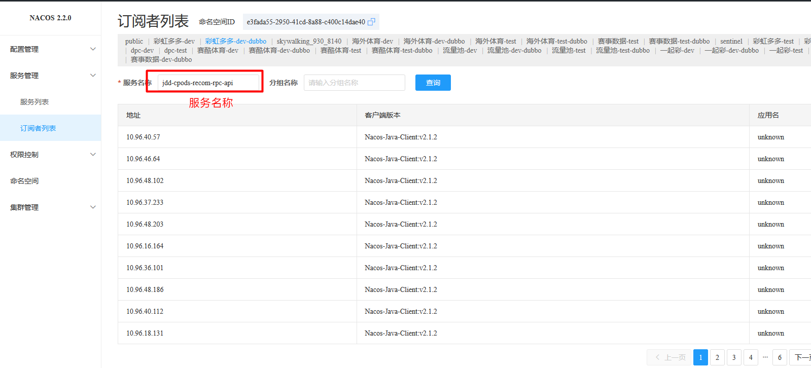  
选择一个命名空间并且在服务名称处输入某个服务名称,显示所有调用该服务的记录  

### 1.4 nacos集群搭建
**说明:**  
nacos集群需要配置三个节点  
docker启动nacos的配置可以从官网获取:[https://nacos.io/zh-cn/docs/quick-start-docker.html](https://nacos.io/zh-cn/docs/quick-start-docker.html)
1.更换数据源  
nacos默认使用的数据库是内嵌的derby数据库,这是一种内存型的数据库;因为现在有三个nacos为了让它们之间的数据同步就需要使用外置的统一的数据源MySQL  
使用docker创建MySQL数据源;这里创建最普通的MySQL即可,详情参考docker创建MySQL  

**使用Navicat连接数据库**  
使用Navicat连接数据库并创建nacos数据库,在该数据库下运行nacos官方提供的建表SQL;
这个建表语句一般可以进入nacos容器后在conf目录下找到scheme.sql(可以先创建一个nacos然后拿到该版本的SQL建表语句之后再删除该nacos)  
也可以访问 [https://github.com/alibaba/nacos/blob/master/distribution/conf/mysql-schema.sql](https://github.com/alibaba/nacos/blob/master/distribution/conf/mysql-schema.sql)来获取[SQL建表语句](resources/springcloud/mysql-schema.sql)  
<font color="#00FF00">注意这里有坑,数据库的字符编码不能随便设置</font>

**运行后效果如下图所示:**  
  

2.创建nacos集群  
**nacos1:**  
```shell
docker run \
-p 8870:8848 \
-p 9880:9848 \
-p 9890:9849 \
--name nacos1 \
-e PREFER_HOST_MODE=ip \
-e MODE=cluster  \
-e NACOS_SERVERS="192.168.149.130:8871 192.168.149.130:8872" \
-e SPRING_DATASOURCE_PLATFORM=mysql \
-e MYSQL_SERVICE_HOST=192.168.149.130 \
-e MYSQL_SERVICE_PORT=7901 \
-e MYSQL_SERVICE_DB_NAME=nacos \
-e MYSQL_SERVICE_USER=root \
-e MYSQL_SERVICE_PASSWORD=root \
-e NACOS_AUTH_TOKEN_EXPIRE_SECONDS=18000 \
-e JVM_XMS=256m \
-e JVM_XMX=256m \
-e NACOS_SERVER_IP=192.168.149.130 \
-d nacos/nacos-server:v1.4.3
```
**解释:**  
* 这里192.168.149.130是虚拟机的IP,宿主机的IP;用于连接MySQL使用
* `MODE=cluster` 模式选择集群
* `NACOS_SERVERS = "192.168.149.130:8871 192.168.149.130:8872"` 另外两个集群的IP地址和端口
* `SPRING_DATASOURCE_PLATFORM=msyql` 使用的数据库为MySQL
* `MYSQL_SERVICE_HOST=192.168.149.130` 数据库的IP
* `MYSQL_SERVICE_PORT=7901` 数据库的端口
* `MYSQL_SERVICE_DB_NAME=nacos` 使用那个库作为nacos的数据库
* `MYSQL_SERVICE_USER=root` 连接数据库的用户名
* `MYSQL_SERVICE_PASSWORD=root` 连接数据库的密码
* `NACOS_SERVER_IP=192.168.149.130` 当前nacos服务器的IP,真实的生产环境中该IP就填Linux主机的IP即可;这里是填写的虚拟机IP

此时进入nacos集群管理页面,可以看到集群配置已经生效,效果如下:  
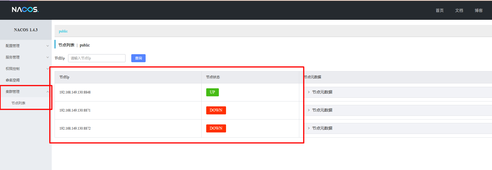
*只不过这里另外两台集群还没有上线所以是红色的*  

**nacos2:**
```shell
docker run \
-p 8871:8848 \
-p 9881:9848 \
-p 9891:9849 \
--name nacos2 \
-e PREFER_HOST_MODE=ip \
-e MODE=cluster  \
-e NACOS_SERVERS="192.168.149.130:8870 192.168.149.130:8872" \
-e SPRING_DATASOURCE_PLATFORM=mysql \
-e MYSQL_SERVICE_HOST=192.168.149.130 \
-e MYSQL_SERVICE_PORT=7901 \
-e MYSQL_SERVICE_DB_NAME=nacos \
-e MYSQL_SERVICE_USER=root \
-e MYSQL_SERVICE_PASSWORD=root \
-e NACOS_AUTH_TOKEN_EXPIRE_SECONDS=18000 \
-e JVM_XMS=256m \
-e JVM_XMX=256m \
-e NACOS_SERVER_IP=192.168.149.130 \
-d nacos/nacos-server:v1.4.3
```

**nacos3:**  
```shell
docker run \
-p 8872:8848 \
-p 9882:9848 \
-p 9892:9849 \
--name nacos3 \
-e PREFER_HOST_MODE=ip \
-e MODE=cluster  \
-e NACOS_SERVERS="192.168.149.130:8870 192.168.149.130:8871" \
-e SPRING_DATASOURCE_PLATFORM=mysql \
-e MYSQL_SERVICE_HOST=192.168.149.130 \
-e MYSQL_SERVICE_PORT=7901 \
-e MYSQL_SERVICE_DB_NAME=nacos \
-e MYSQL_SERVICE_USER=root \
-e MYSQL_SERVICE_PASSWORD=root \
-e NACOS_AUTH_TOKEN_EXPIRE_SECONDS=18000 \
-e JVM_XMS=256m \
-e JVM_XMX=256m \
-e NACOS_SERVER_IP=192.168.149.130 \
-d nacos/nacos-server:v1.4.3
```

**最终效果如下:**  
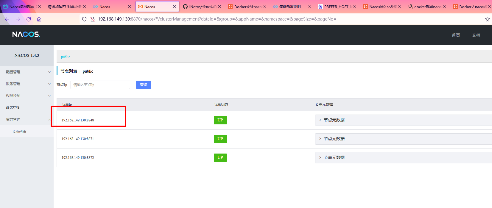  
*注意:这里的第一个IP的端口显示的是有点问题的,因为第一个默认是当前节点的在docker内部的IP和端口;IP已经通过NACOS_SERVER_IP修改为Linux宿主机IP了,但是端口是改不掉的(除非修改启动nacos的端口),不过只要注意NACOS_SERVERS填写不错误就行了*  
另外如果此时进入容器,查看<font color="#00FF00">cluster.conf</font>文件的内容就是我们配置的集群内容了:  
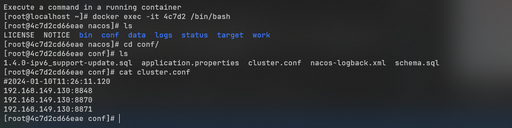

3.配置NGINX  
*需求:配置NGINX使用反向代理负载均衡流量到三台nacos服务器上*  

3.1 拉取镜像  
`docker pull nginx`  

3.2 直接先启动(为了拷贝配置文件)  
*提示:有的时候docker挂载配置文件,启动容器后会提示找不到conf,这是因为这种镜像在启动的时候并没有同步配置文件;那么一种解决方案就是先启动一个容器,把容器中的配置文件拷贝出来,然后把该容器删掉;之后再启动一次并且设置挂载*  
```shell
docker run \
-p 80:80 \
--name nginx \
-d nginx
```

3.3 拷贝文件  
```shell
mkdir {~/software/nginx,~/software/nginx/html,~/software/nginx/logs}
# 把containerID替换为你的NGINX镜像id
docker container cp [containerID]:/etc/nginx ~/software/nginx/conf/
```

3.4 停止容器删除容器  
```shell
docker stop [containerID]
docker rm [containerID]
```

3.5 启动nginx  
```shell
docker run -p 9001:80 --name nginx \
-v ~/software/nginx/html:/usr/share/nginx/html \
-v ~/software/nginx/logs:/var/log/nginx \
-v ~/software/nginx/conf:/etc/nginx \
-d nginx
```

此时访问`LinuxIP:9001`就能够看到nginx的响应信息了  


3.6 配置nacos负载均衡  
```shell
# 备份nginx配置文件
cp ~/software/nginx/conf/conf.d/default.conf ~/software/nginx/conf/conf.d/default_backup.conf
# 编辑nginx配置文件
vim ~/software/nginx/conf/conf.d/default.conf
```
**在配置文件中添加如下内容:**  
```shell
# 添加nacos集群的地址
upstream nacoscluster {
    server 192.168.149.130:8870 weight=1;
    server 192.168.149.130:8871 weight=1;
    server 192.168.149.130:8872 weight=1;
}

server{
  # something
  location /nacos/{
    proxy_pass http://nacoscluster/nacos/;
  }
}

```

3.7 重启nginx  
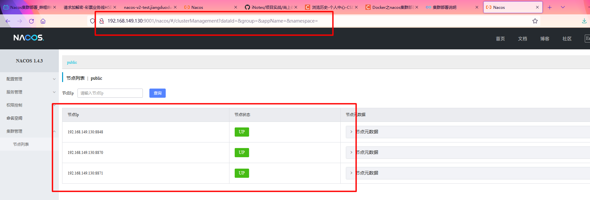  
集群搭建成功  

3.8 将微服务注册中心的地址改为nginx地址  
```yml
spring:
  cloud:
    nacos:
      discovery:
        server-addr: 192.168.149.130:9001
```
再次查看nacos情况,成功注册  
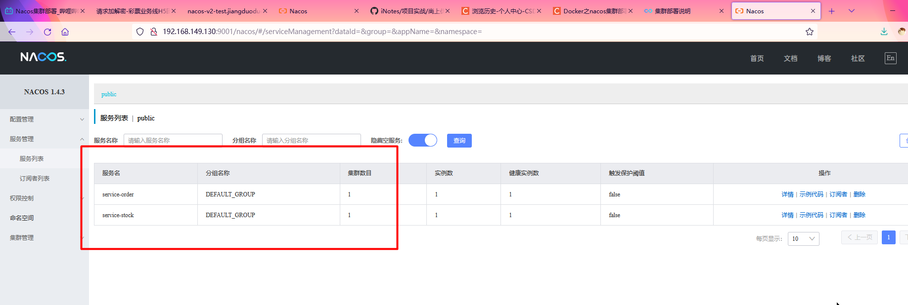  


## 2.负载均衡器
**目录**  
2.1 负载均衡的基本介绍  
2.2 Ribbon的使用方式  
2.3 Ribbon负载均衡策略  
2.4 LoadBalancer使用方式  


### 2.1 负载均衡的基本介绍
1.解决方案  
目前负载均衡分为两种解决方案:服务端负载均衡、客户端负载均衡  
* 服务端负载均衡:又分为硬件负载均衡(如F5)和软件负载均衡(如nginx)  
  * 硬件负载均衡:当一个服务调用另外一个服务发送请求时,因为流量最终肯定要走交换机,所以直接通过硬件交换机做负载均衡
  * 软件负载均衡:在服务消费者和服务提供者中间增加一层nginx服务器来做负载均衡

  <font color="#00FF00">区别:</font>硬件性能更好,但需要额外的成本,软件性能稍低但便宜
* 客户端负载均衡:直接在服务消费者端做负载均衡,通过获取目标服务列表在远程调用的时候通过代码来控制负载均衡

2.Ribbon  
`Ribbon`就是客户端的负载均衡,通过`LoadBalancer`获取到服务提供的所有机器实例,Ribbon会自动基于某种规则(轮询、随机、自定义)去调用这些服务

3.常见负载均衡算法  
* 轮询:负载均衡的默认实现方式,轮询调用目标服务
* 随机:随机调用目标服务
* 加权轮询:按照权重对目标服务进行调用
* 地址hash:对客户端请求的IP地址进行hash取模调用;这种调用方式的特点是,在服务器不动态扩缩容的情况下,同一个IP发出的所有请求的调用链是一致的
* 最小链接数:即使请求均衡了,但是压力不一定均衡;最小连接数就是根据服务器的情况(如请求积压等参数)将请求分配到压力最小的服务器上

### 2.2 Ribbon的使用方式
1.使用方式  
实际上在1.2 nacos基本环境搭建 =>第6步服务调用就是Ribbon的负载均衡器使用案例  
注意配置`@LoadBalanced`注解
nacos默认是支持Ribbon的,所以<font color="#00FF00">引入nacos依赖的时候会自动依赖ribbon</font>

### 2.3 Ribbon负载均衡策略
1.IRule接口  
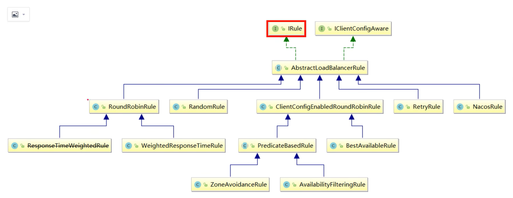  
*解释:所有的负载均衡策略都实现了IRule接口,它的每一种实现类都是一种负载均衡策略;choose是该接口最重要的方法,用来选择一个服务实例*  

AbstractLoadBalancerRule:抽象类,该抽象类主要定义了一个ILoadBalancer,这里定义它的主要目的是<font color="#00FF00">辅助负载均衡策略选取合适的服务端实例</font>

2.实现类详解  
* RandomRule:随机
* RoundRobinRule:轮询;通过一个计数器每次调用时都会增加1,将计数器的结果取模服务总数得到调用的实例下标
* RetryRule:在轮询的基础上增加**重试**功能,在调用时还是轮询获取服务,如果不能获取服务则会有一个重试的过程,重试时会依次轮询获取下一个服务,如果在deadline时间到来之前还没有获取到有效服务则会返回null
* WeightResponseTimeRule:这种策略会根据每一个实例的运行情况来计算出实例的**权重**,该策略内部有一个定时器,该定时器会每隔30s计算一次各个服务的实例,计算规则,<font color="#00FF00">如果一个服务的响应时间越短则权重越大</font>
* NacosRule:根据服务在nacos中配置的权重来进行负载均衡;服务在nacos中配置权重的方式见:1.3 nacos界面说明
* ClientConfigEnableRoundRobinRule:该策略类似RoundRobinRule
* BestAvaliable:继承自ClientConfigEnableRoundRobinRule;该策略会根据LoadBalancedStats中保存的服务实例的状态信息来<font color="#00FF00">过滤掉失效的服务实例,顺便找出并发请求最小的服务实例进行使用</font>;然而LoadBalancedStats有可能会null,如果为null时会退化为ClientConfigEnableRoundRobinRule策略
* ZoneAvoidanceRule:负载均衡默认规则(轮询),间接继承ClientConfigEnableRoundRobinRule;但该实现类增加了区域选择功能,假设现在服务消费者在北京,两个服务提供者一个在天津一个在上海,则最终肯定是调用在天津的服务提供者;并且每次都是调用天津的服务提供者,如果没有区域则会退化为负载均衡策略
* AvaliablityFilteringRule:先过滤掉故障实例再选择并发较小的实例

3.修改默认的负载均衡策略  
修改默认的负载均衡策略有两种方式:配置类、yml配置文件

3.1 通过配置类修改负载均衡策略
通过编写配置类,向容器中添加IRule实现类即可  
```java
@Configuration
public class RibbonConfig {
    public IRule iRule() {
        // 使用nacos负载均衡策略
        return new NacosRule();
    }
}
```

<font color="#00FF00">还可以针对不同服务提供方使用不同的负载均衡策略</font>  

```java
@SpringBootApplication
@RibbonClients(value = {
        @RibbonClient(name = "mall-order",configuration = RibbonConfig.class),
        @RibbonClient(name = "mall-account",configuration = RibbonConfig.class)
})
public class OrderApplication {
    @LoadBalanced
    public static void main(String[] args) {
        SpringApplication.run(OrderApplication.class, args);
    }
}
```
这里就对mall-order和mall-account服务提供方配置了具体的负载均衡策略,如果不配置默认就是对所有的服务提供方都使用上述RibbonConfig类配置的负载均衡策略  

**注意:** 这里有个坑,这个RibbonConfig不能被@ComponentScan注解扫描到;所以这里我修改了一下目录结构,将RibbonConfig类放到了启动类的父包的同级包下;如果该配置类能够被扫描到,则<font color="#FF00FF">会将所有服务提供方的负载均衡策略都设置为该配置类里的负载均衡策略</font>  
  

3.2 通过配置类修改负载均衡策略
```yml
服务提供者名称:
  ribbon:
    NFLoadBalancerRuleClassName: 负载均衡策略的全限定名
```
例如:
```yml
service-stock:
  ribbon:
    NFLoadBalancerRuleClassName: com.alibaba.cloud.nacos.ribbon.NacosRule
```
这里就设置了调用目标服务service-stock时使用nacos的负载均衡策略

4.实现自定义负载均衡策略  
```java
public class CustomRule extends AbstractLoadBalancerRule {
    @Override
    public void initWithNiwsConfig(IClientConfig iClientConfig) {

    }

    @Override
    public Server choose(Object o) {
        // 获取当前服务列表
        ILoadBalancer loadBalancer = this.getLoadBalancer();
        List<Server> reachableServers = loadBalancer.getReachableServers();
        // 随机获取一个实例
        int random = ThreadLocalRandom.current().nextInt(reachableServers.size());

        return reachableServers.get(random);
    }
}
```
<font color="#00FF00">使用第三步将的方式来使用当前这个负载均衡策略即可</font>

5.立即加载  
*解释:默认所有的负载均衡器都是懒加载的,那么当服务第一次远程调用时有可能会卡顿甚至超时,所以可以将负载均衡器设置为立即加载*  
修改yml配置文件  
```yml
ribbon:
  eager-load:
    # 开启ribbon立即加载
    enabled: true
    # 还可以再这里配置哪些服务是需要立即加载的;这里配置mall-order服务的负载均衡器是立即加载
    # 多个配置用逗号,隔开;如果不配置则所有服务都是立即加载
    # clients: mall-order
```

### 2.4 LoadBalancer使用方式
Ribbon是nacos默认的负载均衡器,本节介绍LoadBalancer这个负载均衡器  
1.LoadBalancer提供两种负载均衡客户端  
* RestTemplate:基于HTTP的远程调用
* WebClient:基于WebFlux的远程调用(注意现在还没有讲OpenFeign,之前使用远程调用时一直是基于RestTemplate的),LoadBalancer支持使用响应式编程的方式进行远程调用

2.排除nacos中对ribbon的依赖  
*提示:高版本可能不需要排除,高版本nacos默认不再依赖ribbon*  
```xml
<!--服务注册发现-->
<dependencies>
    <dependency>
        <groupId>org.springframework.boot</groupId>
        <artifactId>spring-boot-starter-web</artifactId>
    </dependency>

    <!--服务注册发现-->
    <dependency>
        <groupId>com.alibaba.cloud</groupId>
        <artifactId>spring-cloud-starter-alibaba-nacos-discovery</artifactId>
        <exclusions>
            <exclusion>
                <!--将ribbon排除-->
                <groupId>org.springframework.cloud</groupId>
                <artifactId>spring-cloud-starter-netflix-ribbon</artifactId>
            </exclusion>
        </exclusions>
    </dependency>

    <!--添加LoadBalancer依赖-->
    <dependency>
        <groupId>org.springframework.cloud</groupId>
        <artifactId>spring-cloud-starter-loadbalancer</artifactId>
    </dependency>

</dependencies>
```

3.修改yml配置文件  
```yml
spring:
  cloud:
    loadbalancer:
      retry:
        # 启用loadbalancer
        enabled: true
```

4.自定义负载均衡策略  
和之前大同小异,需要往容器中添加ReactorLoadBalancer的实现类  
接着使用`@LoadBalancerClients`注解来针对某个服务提供者使用特定的负载均衡策略(类似之前@RibbonClients)  
只不过loadbalancer没有提供配置文件的方式来自定义负载均衡策略  

## 3.远程调用
**目录:**  
3.1 Feign基本环境搭建  
3.2 OpenFeign自定义配置  


### 3.1 Feign基本环境搭建
1.Feign基本介绍  
Feign是开放的声明式、模板化的HTTP客户端;Feign就是远程调用组件,Feign支持自带的注解以及JAX-RS注解等  
OpenFeign对Feign做了增强,使其支持SpringMVC注解,并且OpenFeign还整合了Ribbon和Nacos;所以OpenFeign没有支持LoadBalancer,OpenFeign不支持异步调用

2.OpenFeign基本环境搭建  
2.1 创建新模块order-openfeign  

2.2 修改pom文件,添加OpenFeign依赖
```xml
<dependency>
    <groupId>org.springframework.cloud</groupId>
    <artifactId>spring-cloud-starter-openfeign</artifactId>
</dependency>
```

2.3 添加主启动类  
在项目下创建io.github.cnsukidayo.cloud.order包,在该包下创建OrderApplication主启动类  
为主启动类上添加`@EnableFeignClients`注解来启用OpenFeign  
```java
@SpringBootApplication
@EnableFeignClients
public class OrderApplication {
    @LoadBalanced
    public static void main(String[] args) {
        SpringApplication.run(OrderApplication.class, args);
    }
}
```

2.4 编写yml文件  
这里就不用nacos集群环境了(别忘了service-stock模块的yml也要修改nacos地址)  
```yml
server:
  port: 8081
spring:
  application:
    name: service-order
  cloud:
    nacos:
      discovery:
        server-addr: 192.168.149.130:8870
        username: nacos
        password: nacos
        namespace: public
```

2.5 完善service-stock模块中的接口  
在该模块的io.github.cnsukidayo.cloud.stock包下创建api包单独作为本模块对外提供的接口;在该包下创建StockController类  
```java
@RestController()
@RequestMapping("/api/stock/inner")
public class StockController {

    @Value("${server.port}")
    private String port;

    @GetMapping("reduce")
    public String reduce() {
        return "扣减库存" + port;
    }

}
```

2.6 编写远程调用接口  
在io.github.cnsukidayo.cloud.order包下创建feign包,该包用于存放OpenFeign远程调用的接口;这里为了方便就没有单独建一个模块放这些远程调用接口  
在该包下创建StockFeignService接口  
```java
@FeignClient(name = "service-stock", path = "/api/stock/inner")
public interface StockFeignService {

    @GetMapping("reduce")
    String reduce();
}
```
`@FeignClient`  
* name:目标服务的名称(服务提供者的名称)
* path:远程调用的前缀(这里正好和StockController接口对应上)
* configuration:设置配置类(可以设置当前远程调用接口的日志级别)
* fallback:指定远程调用熔断降级时执行的类,该类需要实现当前接口,并且保持参数一致(详情见5.6 OpenFeign整合降级)

<font color="#FF00FF">所以这里的实现和JPA很类似,都是使用动态代理完成的;</font>

2.7 编写服务消费者接口  
在order-openfeign模块中创建controller包,在该包下创建OrderController  
```java
@RestController
@RequestMapping("/api/order")
public class OrderController {

    private final StockFeignService stockFeignService;

    public OrderController(StockFeignService stockFeignService) {
        this.stockFeignService = stockFeignService;
    }

    @GetMapping("add")
    public String add() {
        return stockFeignService.reduce();
    }

}
```

2.8 测试运行  
访问地址[http://localhost:8081/api/order/add](http://localhost:8081/api/order/add)成功显示扣减库存8082  
并且OpenFeign也是默认支持负载均衡的  

### 3.2 OpenFeign自定义配置
1.OpenFeign日志级别  
OpenFeign有四种级别的日志  
* NONE:不记录任何日志
* BASIC:仅记录请求方法、URL、响应状态码以及执行时间
* HEADERS:在BASIC的基础上记录请求和响应的header
* FULL:记录请求和响应的header、body和元数据

使用示例-<font color="#00FF00">全局配置</font>(所有远程调用都使用该日志配置):
```java
@Configuration
public class FeignConfig {

    @Bean
    public Logger.Level feignLoggerLevel() {
        return Logger.Level.FULL;
    }

}
```
由于Feign的日志受到SpringBoot的管理,并且Feign默认的输出级别是debug;所以仅仅这样还不够,这里还需要把Feign接口所在的包的日志级别设置为至少debug  
在order-openfeign模块的yml添加如下配置
```yml
logging:
  level:
    io.github.cnsukidayo.cloud.order.feign: debug
```
测试运行,成功打印日志  

使用示例-<font color="#00FF00">局部配置</font>(针对不同的OpenFeign接口使用不同的日志级别)  
其实这里的配置类似3.1 通过配置类修改负载均衡策略=>@RibbonClients注解哪边的效果  
提供一个配置类然后不把该配置类添加到容器中
```java
public class FeignConfig {

    @Bean
    public Logger.Level feignLoggerLevel() {
        return Logger.Level.FULL;
    }
}
```

在远程调用接口StockFeignService的@FeignClient注解设置configuration为刚才的注解类  
```java
@FeignClient(name = "service-stock", path = "/api/stock/inner", configuration = FeignConfig.class)
public interface StockFeignService {

    @GetMapping("reduce")
    String reduce();
}
```

通过<font color="#00FF00">配置文件</font>完成Feign的日志配置  
```yml
feign:
  client:
    config:
      service-stock: #对应的服务名,这里不是设置接口;是整个系统中只要调用的目标服务是该服务就使用如下配置
        logger-level: full #设置日志等级为full
```

2.~~契约配置~~  
*提示:后续的配置将只记录yml的局部配置方式,暂时略过全局的配置方式;如果有需要后续额可以加上.全局配置指的是通过Config类进行配置的方式*  

*提示:之前说过OpenFeign是基于Feign的,使其支持SpringMVC注解*  
原生Feign的注解中,使用@RequestLine来替代@RequestMapping,使用@Param来替代@PathVariable注解,如果需要兼容老版本的Feign不使用现在SpringMVC的注解,则可以使用契约配置,切换为原来的Feign注解  
当然我们这里没这个需要,<font color="#00FF00">这节完全可以跳过</font>  

配置类的配置方式:
```java
@Bean
public Contract feignContract(){
  return new Contract.Default();
}
```

配置文件的配置方式:  
```yml
feign:
  client:
    config:
      service-stock:
      contract: feign.Contract.Default
```

3.超时时间配置  
配置类方式  
```java
@Configuration
public class FeignConfig {

    @Bean
    public Request.Options options() {
      /*
      args0:连接的超时时间(默认为2s)
      args1:请求处理的超时时间(默认为5s)
      */
      return new Request.Options(5000,10000);
    }
}
```

配置文件:  
```yml
feign:
  client:
    config:
      service-stock:
        # 连接超时时间
        connect-timeout: 5000
        # 处理超时时间
        read-timeout: 3000
```

4.配置请求拦截器  
*解释:这里的拦截器意思是,在OpenFeign请求前做一些前置处理*  
*提示:貌似没有响应拦截器*  
实现`RequestInterceptor`接口并添加到容器中即可  

配置类:
```java
@Component
public class FeignAuthRequestInterceptor implements RequestInterceptor {
    @Override
    public void apply(RequestTemplate template) {
        System.out.println("==============请求");
        // 业务逻辑
        String access_token = UUID.randomUUID().toString();
        template.header("Authorization", access_token);
    }
}
```

配置文件:  
```yml
feign:
  client:
    config:
      service-stock:
        # 指定拦截器数组
        request-interceptors:
          # 配置拦截器的类全限定名
          - io.github.cnsukidayo.cloud.order.config.FeignAuthRequestInterceptor
```

## 4.服务配置中心
**目录:**  
4.1 服务配置中心概念介绍  
4.2 nacos配置管理界面  
4.3 权限管理  
4.4 读取配置中心文件  
4.5 其它扩展配置  
4.6 配置文件的优先级  

### 4.1 服务配置中心概念介绍
1.服务注册中心特征  
* 维护性:方便管理和维护,不需要记住每一个节点上有哪些配置信息;采用集中式管理
* 时效性:配置更改完成立马生效,不需要重启
* 安全性:不把配置文件信息放在应用本体中,保障了安全性;程序员只有开发环境的配置,没有生产环境的配置

2.配置中心组件对比  
目前配置中心的组件有:nacos、config、apollo
* Spring Cloud Config 大部分场景需要结合git使用,动态变更还需要依赖Spring Cloud Bus消息总线来通知所有客户端信息变化
* Spring Cloud Config不提供可视化界面
* <font color="#00FF00">nacos config 使用长轮询更新配置,一旦配置有变动后通知服务的速度非常快</font>
* apollo在功能上几乎和nacos差不多,<font color="#00FF00">但nacos的性能比apollo优秀很多</font>

### 4.2 nacos配置管理界面
1.命名空间  
之前在1.3节已经讲过命名空间
<font color="#FF00FF">命名空间的约定:产品线+环境</font> 例如这里有两个命名空间,淘宝-dev、天猫-test  


2.配置组  
*提示:配置组是基于命名空间的,即<font color="#00FF00">一个服务只能读取到它所在的命名空间下的配置</font>;远程调用的时候也只能调用该命名空间下面的服务列表*  

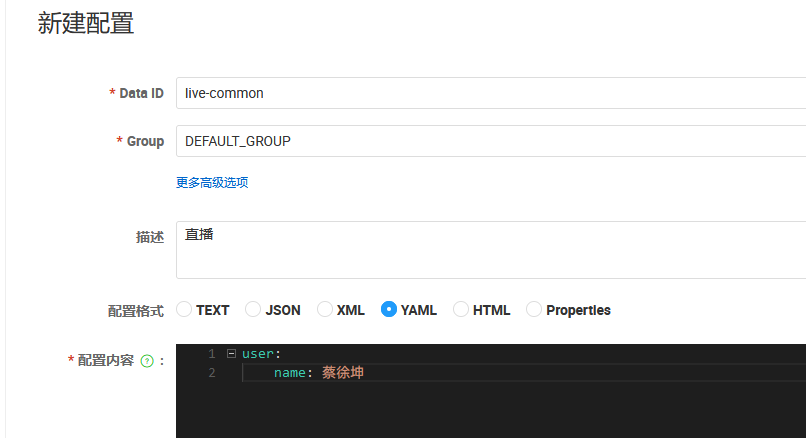  
* Data ID:可以按照项目来进行分组
  例如当前在淘宝-dev这个命名空间下,有一个配置分组是live-common,代表这是直播项目的配置,其中Group指定为gift(表示这是礼物微服务的配置)
  但实际上一般不会这么细致,一般Group都是使用默认
  可以通过live-common、live-database的这种方式来区分配置;前者是直播项目的通用配置,后者是直播项目数据库的配置
* Group:可以按照项目的服务来进行分组

3.历史版本  
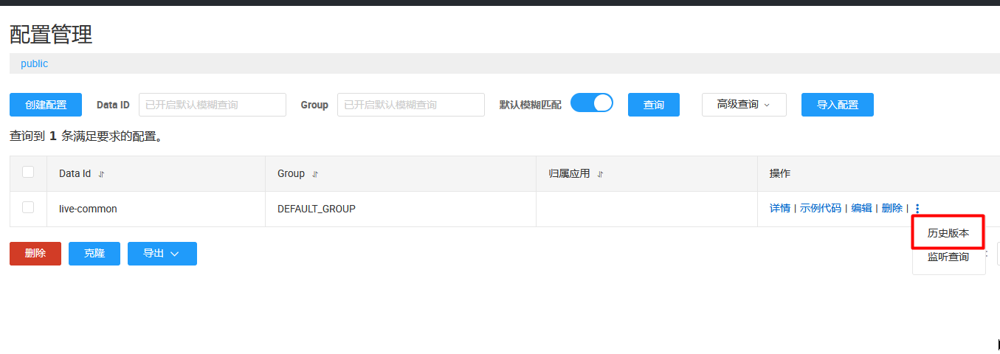  
发布成功之后就可以看到配置信息了,接着点击历史版本可以看到所有的历史修改记录  
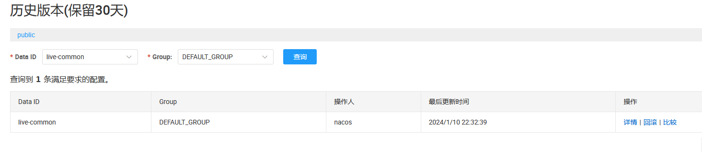  
<font color="#00FF00">另外这里的监听查询可以监听当前配置文件有没有正确的推送到服务上</font>  

4.克隆  
还可以针对配置文件进行克隆
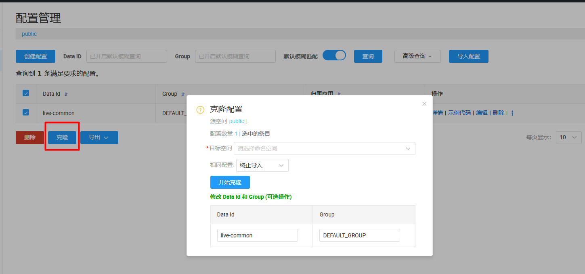  

### 4.3 权限管理
1.用户列表  
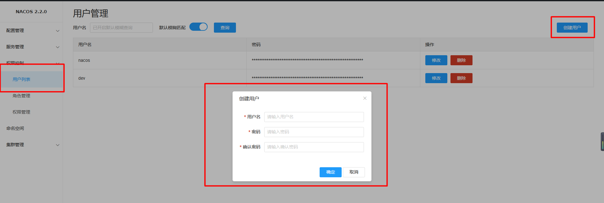  
可以点击左侧的用户列表->创建用户来新增用户  

2.角色管理  
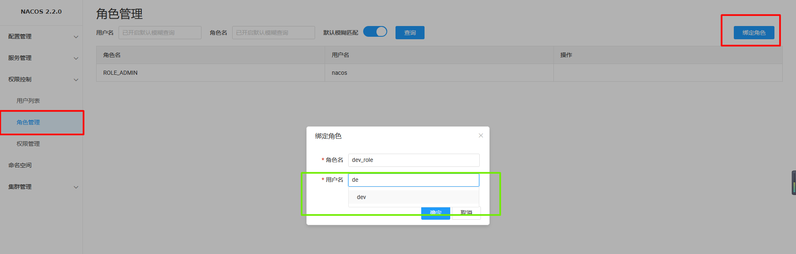  
可以针对用户添加角色,例如这里为dev用户分配了dev_role角色  

3.权限管理  
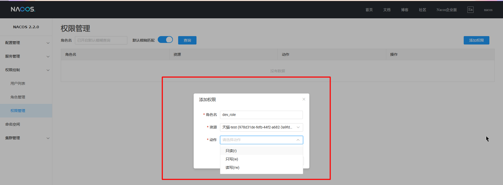  
<font color="#00FF00">权限管理可以针对角色分配该角色在不同命名空间下的权限(分为只读、只写、读写权限)</font>  

### 4.4 读取配置中心文件
*提示:4.4节和4.5节很多内容约定都发生了变化,因为是旧版教程所以新版需要自已判断一下*
1.创建配置文件  
这里还是使用4.2 nacos配置管理界面=>2.配置组=>live-common中的配置文件  

2.修改pom文件  
*提示:这里在service-stock模块中进行演示*  
```xml
<dependencies>
    <dependency>
        <groupId>org.springframework.boot</groupId>
        <artifactId>spring-boot-starter-web</artifactId>
    </dependency>

    <!--服务注册发现-->
    <dependency>
        <groupId>com.alibaba.cloud</groupId>
        <artifactId>spring-cloud-starter-alibaba-nacos-discovery</artifactId>
    </dependency>

    <dependency>
        <groupId>com.alibaba.cloud</groupId>
        <artifactId>spring-cloud-starter-alibaba-nacos-config</artifactId>
    </dependency>

</dependencies>
```

~~3.编写bootstrap.yml配置文件~~
<font color="#FF00FF">使用配置中心必须使用bootstrap.yml/properties配置文件来配置nacos远程配置中心的地址</font>  
```yml
spring:
  application:
    # name必须设置为配置中心对应的Data Id的值
    name: live-common
  cloud:
    nacos:
      # 配置nacos服务器地址
      server-addr: 192.168.230.225:8848
      # 必须配置账户和密码
      username: nacos
      password: nacos
      config:
        # 设置命名空间
        namespace: public
        # 设置分组
        group: DEFAULT_GROUP
```

*提示:新版已经不需要使用bootstrap.yml配置文件了,而且2.0的版本和1.0又对应不上,所以暂且跳过*  
详情可以参考:[https://github.com/alibaba/spring-cloud-alibaba/blob/2.2.x/spring-cloud-alibaba-examples/nacos-example/readme-zh.md]([https://](https://github.com/alibaba/spring-cloud-alibaba/blob/2.2.x/spring-cloud-alibaba-examples/nacos-example/readme-zh.md))

4.获取变量  
实际上通过`application.getEnvironment().getProperty("key")`方法就可以获取到配置信息了;是不是TM的似曾相识?  

### 4.5 其它扩展配置
1.读取配置文件类型  
默认读取配置文件的时候会从properties中进行读取,修改bootstrap.yml配置文件来读取nacos配置中心的<font color="#00FF00">yml类型</font>的配置文件  
但是如果使用下面将的第3步使用自定义DataId的方式读取配置文件时是不需要指定配置文件的类型的  
```yml
spring:
  cloud:
    nacos:
      config:
        file-extension: yaml
```

2.关闭动态刷新  
*提示:默认nacos中的配置信息发生更改后,微服务可以在1s以内感知到并更新配置*
可以通过以下配置来关闭动态刷新  
```yml
spring:
  cloud:
    nacos:
      config:
        # 此时微服务就不会从配置中心更新配置了
        refresh-enabled: false
```

3.<font color="#00FF00">自定义Data ID</font>  
在4.4 读取配置中心文件=>3.编写bootstrap.yml配置文件时提到过`spring.application.name`的配置必须设置为dataId的值,假设服务名不能设置为dataId的值;或者一个服务需要读取多个配置文件时可以使用<font color="#00FF00">shared-configs</font>或者<font color="#00FF00">extension-configs</font>  
```yml
spring:
  application:
    name: service-stock
  cloud:
    nacos:
      # 配置nacos服务器地址
      server-addr: 192.168.230.225:8848
      # 必须配置账户和密码
      username: nacos
      password: nacos
      config:
        shared-configs:
          - data-id: live-common
            refresh: true
            group: DEFAULT_GROUP
          - data-id: live-data
            refresh: true
            group: DEFAULT_GROUP
      # 不需要指定配置文件类型了
        # file-extension: yaml
        namespace: public
```
此示例为当前service-stock模块读取命名空间中namespace为public下data-id为live-common和live-data中的配置文件;并且后读取的live-data优先级会高于live-common  

```yml
spring:
  application:
    name: service-stock
  cloud:
    nacos:
      # 配置nacos服务器地址
      server-addr: 192.168.230.225:8848
      # 必须配置账户和密码
      username: nacos
      password: nacos
      config:
        shared-configs:
          - data-id: live-common
            refresh: true
            group: DEFAULT_GROUP
          - data-id: live-data
            refresh: true
            group: DEFAULT_GROUP
        # 不需要指定配置文件类型了
        # file-extension: yaml
        namespace: public
        extension-configs[0]:
          data-id: live-common
          refresh: true
          group: DEFAULT_GROUP
        extension-configs[1]:
          data-id: live-data
          refresh: true
          group: DEFAULT_GROUP
```


*提示:shared-configs和都是数组,在Spring中配置数组中有两种方式一种就是-另一种就是下标方式;此外<font color="#00FF00">shared-configs优先级要高于extension-configs</font>*  
除了通过在yml配置文件中指定shared-configs或extension-configs的方式来读取多个配置外,还可以通过第6点使用注解的方式来指定读取的配置  

4.@RefreshScope注解  
将@Value注解标注在属性上读取到的远程配置是不会自动刷新的,如下  
```java
// 该配置不会自动刷新
@Value("${test.name}")
private String name;
```

此时需要配合@RefreshScope注解来进行使用  
```java
@RestController
@RefreshScope
public class TestController{
    // 配置可以自动刷新
    @Value("${test.name}")
    private String name;
}
```

5.@NacosValue  
可以直接使用@NacosValue注解来读取nacos配置中心的配置,它的效果类似@Value但是用来专门读取nacos  
```java
@RestController
public class TestController{
    @NacosValue("${test.name}")
    private String name;
}
```

6.@NacosPropertySources  
该注解一般标注在主启动类上,`@NacosPropertySources`注解内部又由`@NacosPropertySource`注解的数组组成  
`@NacosPropertySource`注解用于指定当前服务读取配置中心对应命名空间下的<font color="#00FF00">指定Data I和Group的配置</font>  
* name:给当前的配置起一个名字,这个属性没说法一般指定与groupId一致的内容即可
* dataId:dataId对应nacos远程配置中心设置的值
* groupId:groupId对应nacos远程配置中心设置的值
* autoRefreshed:是否自动刷新配置
* first:当指定该值时before和after属性将被忽略,是不是优先读取当前的配置


### 4.6 配置文件的优先级
todo


## 5.服务降级
**目录:**  
5.1 服务降级基本环境搭建  
5.2 Sentinel上手体验  
5.3 Sentinel控制台  
5.4 流控规则  
5.5 熔断规则  
5.6 OpenFeign整合降级  
5.7 热点参数流控  
5.8 系统保护规则  
5.9 sentinel持久化模式  


### 5.1 服务降级基本环境搭建
1.分布式系统可用性问题  
在分布式系统中,如果系统遇到激增流量、被其它服务拖垮、异常未处理等情况时很有可能会导致服务可用性降低;说白了就是<font color="#FF00FF">缺乏高可用防护/容错机制尤其是针对流量的保护</font>  
所以在分布式系统中如果不进行容错机制的处理,很有可能造成<font color="#00FF00">服务雪崩</font>(见1.1 微服务基本概念介绍=>4.SOA)

2.常见服务不可用的原因  
* 激增流量导致系统CPU飚高,无法正常处理请求
* 激增流量打垮冷系统(数据库连接未创建,缓存未预热)
* 消息投递速度过快,导致消息处理积压
* 慢SQL查询卡爆连接池
* 第三方服务不响应,卡满连接池
* 业务调用持续出现异常

3.服务雪崩样例图  
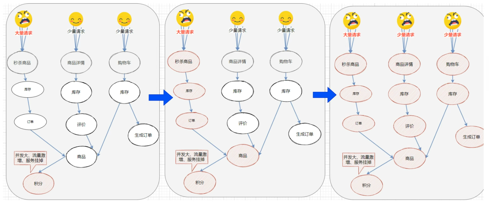  
假设图中积分服务能承受的压力较小,当大量请求来到秒杀商品这条调用链时,最终会将积分服务打垮,从而导致大量的请求积压在商品服务;最终导致整个秒杀商品不可用  
然而由于<font color="#00FF00">商品服务是别的服务的共享服务</font>最终会导致服务雪崩  
<font color="#FF00FF">服务雪崩:因服务提供者不可用导致服务调用者的不可用,并将不可用逐渐放大的过程就叫服务雪崩效应</font>  

4.常见的容错机制  
* 超时机制:原本服务提供者不可用会导致消费者请求强制等待,从而造成系统资源耗尽;加入超时机制,一旦超时就释放资源;这种方式一定程度上可以抑制资源耗尽的问题
  <font color="#00FF00">可以在OpenFeign的配置文件使用connectTimeout、readTimeout属性设置超时时间</font>
* 服务限流:一般会提前对服务进行压力测试,之后线上就会使用该压测数据对服务进行限流
* 线程池隔离:该效果类似限流,用户的请求将不再直接访问服务,而是通过线程池中的空闲线程来访问服务,<font color="#00FF00">如果线程池已满则会进行降级处理</font>,用户的请求不会被阻塞,可以立即看到一个结果(如友好的提示信息)
* <font color="#FF00FF">服务熔断</font>:熔断这个概念起源于股市或者电力系统中的保险丝,说白了就是防止流量(电量)太大从而烧毁整个系统
  但在分布式系统中如果调用一个服务屡次出现响应失败的情况,<font color="#00FF00">可以直接熔断该服务后续就不调用该服务</font>,它对比超时机制而言是不会再去调用服务的
  熔断一般会给目标服务设置阈值,例如十分钟供目标服务进行修复,如果修复成功就恢复使用不成功就继续熔断,<font color="#00FF00">在熔断期间必须要进行服务降级(服务熔断必服务降级)</font>
  服务降级说白了就是一个兜底的方法,当服务被熔断后服务将不再被调用,此时服务消费者需要准备一个本地的回调,<font color="#00FF00">快速返回一个缺省值</font>.例如使用<font color="#00FF00">备用接口、缓存、mock数据</font>等.不过这种使用方式也要看场景
  根据服务的性质还可以把服务分为强依赖和弱依赖
  * 弱依赖:例如这里的积分服务就是弱依赖,在秒杀商品这个功能里;就算积分服务挂掉了,它也不影响整个库存、订单、商品的调用链;实际上可以对该服务做降级处理,记录当前下单商品的id这条日志;后续采用调度通过该日志信息做<font color="#FF00FF">补偿</font>
  * 强依赖:例如这里的订单库存服务宕机后显然整个秒杀服务都不可用了

  <font color="#00FF00">所以降级一般会在弱依赖中进行实现</font>

5.Sentinel组件  
Sentinel组件是阿里巴巴开源的面向分布式微服务架构的高可用防护组件,是一个被广泛验证的组件  
Sentinel以流量为切入点,提供了<font color="#00FF00">限流、流量整形、熔断降级、系统负载保护、热点防护</font>等多个维度的防护手段  
Sentinel的高级版本-><font color="#FF00FF">AHAS(收费)</font>
<font color="#00FF00">可以对Sentinel组件进行扩展(高级部分)</font>
Sentinel由核心库与DashBoard组成,核心库是不依赖于DashBoard的;

### 5.2 Sentinel上手体验
**目录:**  
5.2.1 Java代码方式使用Sentinel  
5.2.2 @SentinelResource注解  
5.2.3 代码设置熔断规则  

#### 5.2.1 Java代码方式使用Sentinel
1.新建sentinel-demo模块  

2.修改pom文件
*提示:这里没有整合SpringcloudAlibab,只使用Sentinel核心库是可以不与springcloud整合的,因为Sentinel本质是基于接口进行限流的*
```xml
<?xml version="1.0" encoding="UTF-8"?>
<project xmlns="http://maven.apache.org/POM/4.0.0"
         xmlns:xsi="http://www.w3.org/2001/XMLSchema-instance"
         xsi:schemaLocation="http://maven.apache.org/POM/4.0.0 http://maven.apache.org/xsd/maven-4.0.0.xsd">
    <modelVersion>4.0.0</modelVersion>
    <parent>
        <groupId>org.springframework.boot</groupId>
        <artifactId>spring-boot-starter-parent</artifactId>
        <version>2.3.11.RELEASE</version>
        <relativePath/>
    </parent>

    <groupId>com.github.cnsukidayo</groupId>
    <artifactId>sentinel-demo</artifactId>

    <properties>
        <maven.compiler.source>9</maven.compiler.source>
        <maven.compiler.target>9</maven.compiler.target>
        <project.build.sourceEncoding>UTF-8</project.build.sourceEncoding>
    </properties>

    <dependencies>
        <dependency>
            <groupId>org.springframework.boot</groupId>
            <artifactId>spring-boot-starter-web</artifactId>
        </dependency>

        <!--sentinel核心库-->
        <dependency>
            <groupId>com.alibaba.csp</groupId>
            <artifactId>sentinel-core</artifactId>
            <version>1.8.0</version>
        </dependency>

        <dependency>
            <groupId>org.projectlombok</groupId>
            <artifactId>lombok</artifactId>
            <version>1.18.18</version>
        </dependency>

        <dependency>
            <groupId>com.alibaba.csp</groupId>
            <artifactId>sentinel-annotation-aspectj</artifactId>
            <version>1.8.0</version>
        </dependency>

    </dependencies>

</project>
```

3.写yml  
```yml
server:
  port: 8080
```

4.主启动类  
```java
@SpringBootApplication
public class Application {

    public static void main(String[] args) {
        SpringApplication.run(Application.class, args);
    }
}
```

5.controller  
```java
@RestController
@RequestMapping("/sentinel")
@Slf4j
public class HelloController {

    public static final String RESOURCE_NAME = "hello";
    public static final String USER_RESOURCE_NAME = "user";
    public static final String DEGRADE_RESOURCE_NAME = "degrade";

    @RequestMapping(value = "hello")
    public String hello() {
        Entry entry = null;
        try {
            // 定义资源名称,通常与接口请求地址一致
            entry = SphU.entry(RESOURCE_NAME);
            String str = "hello world";
            log.info("============" + str + "===========");
            return str;
        } catch (BlockException e) {
            log.info("block");
            return "被流控了!";
        } catch (Exception exception) {
            // 若需要配置降级规则,需要使用这种方式记录业务异常
            Tracer.traceEntry(exception, entry);
        } finally {
            if (entry != null) {
                entry.exit();
            }
        }

        return null;
    }

    // 初始化方法
    @PostConstruct
    private static void initFlowRules() {
        // 流控规则集合
        List<FlowRule> rules = new ArrayList<>();

        // 一个FlowRule就是一个流控规则
        FlowRule rule = new FlowRule();
        /*
        为哪个资源进行流控的规则限制
        这里就和上面controller中的方法对应起来了
        表明当前rule是针对上述RESOURCE_NAME的规则进行限制的,谁用了这个资源就会被该规则流控
         */
        rule0.setResource(RESOURCE_NAME);
        // 设置流控规则为QPS(实际上还有很多规则可以参考官方文档)
        rule.setGrade(RuleConstant.FLOW_GRADE_QPS);
        // 设置受保护的阈值,每秒只有一次
        rule.setCount(1);
        rules.add(rule);
        // 加载配置好的规则
        FlowRuleManager.loadRules(rules);
    }
}
```

6.启动测试  
一旦访问量超过1/s则会被流控

#### 5.2.2 @SentinelResource注解
**痛点:**  
5.2.1的写法代码侵入性太强,每一个controller都需要这么编写;解决方法是使用@SentinelResource注解  

1.创建配置文件添加SentinelResourceAspect  
```java
@Configuration
public class SentinelConfig {

    @Bean
    public SentinelResourceAspect sentinelResourceAspect(){
        return new SentinelResourceAspect();
    }
}
```

2.编写controller  
```java
@RestController
@RequestMapping("/sentinel")
@Slf4j
public class HelloController {


    public static final String RESOURCE_NAME = "hello";
    public static final String USER_RESOURCE_NAME = "user";
    public static final String DEGRADE_RESOURCE_NAME = "degrade";

    @RequestMapping(value = "hello")
    public String hello() {
        Entry entry = null;
        try {
            // 定义资源名称,通常与接口请求地址一致
            entry = SphU.entry(RESOURCE_NAME);
            String str = "hello world";
            log.info("============" + str + "===========");
            return str;
        } catch (BlockException e) {
            log.info("block");
            return "被流控了!";
        } catch (Exception exception) {
            // 若需要配置降级规则,需要使用这种方式记录业务异常
            Tracer.traceEntry(exception, entry);
        } finally {
            if (entry != null) {
                entry.exit();
            }
        }

        return null;
    }

    /*
    // 初始化方法
    @PostConstruct
    private static void initFlowRules() {
        // 流控规则集合
        List<FlowRule> rules = new ArrayList<>();

        // 一个FlowRule就是一个流控规则
        FlowRule rule = new FlowRule();
        为哪个资源进行流控的规则限制
        这里就和上面controller中的方法对应起来了
        表明当前rule是针对上述RESOURCE_NAME的规则进行限制的,谁用了这个资源就会被该规则流控
        rule.setRefResource(RESOURCE_NAME);
        // 设置流控规则为QPS(实际上还有很多规则可以参考官方文档)
        rule.setGrade(RuleConstant.FLOW_GRADE_THREAD);
        // 设置受保护的阈值,每秒只有一次
        rule.setCount(0);
        rules.add(rule);
        // 加载配置好的规则
        FlowRuleManager.loadRules(rules);
    }
    */

    @RequestMapping("user")
    @SentinelResource(value = USER_RESOURCE_NAME, blockHandler = "blockHandlerForGetUser")
    public User getUser(String id) {
        return new User("蔡徐坤");
    }

    /**
     * 流控方法必须为public
     * 方法返回值必须与被流控方法(原方法)保持一致
     * 参数必须与原方法保持一致(并且顺序也一直)
     * 可以在流控方法最后添加一个BlockException(可以通过该异常获取当前是类似类型的流控)
     * @param id 拿到被流控方法的入参
     * @param e  拿到异常
     */
    public User blockHandlerForGetUser(String id, BlockException e) {
        e.printStackTrace();
        return new User("流控");
    }
}
```

`@SentinelResource`  
* value:设置资源
* blockHandler:流控降级后的处理方法(不需要在耦合在接口中);默认该方法必须与被流控方法声明在一个类中
* blockHandlerClass:默认流控方式是和被流控方法在一个类中,如果想流控方法单独在一个类中,通过设置改属性提供流控方法所在的类;并且<font color="#00FF00">如果声明在别的类中则流控方法必须为静态方法</font>
* fallback:当接口中出现了异常就可以交给fallback指定的方法进行处理;注意和blockHandler区分,blockHandler是接口被流控后指定的处理方法;fallback的方法约定与blockHandler一致
  如果同时指定了fallback和blockHandler,<font color="#00FF00">则blockHandler方法的优先级是要高于fallback方法的</font>
* fallbackClass:同blockHandlerClass
* exceptionsToIgnore:排除哪些异常不使用fallback处理

*个人感觉异常处理的方法没必要,这可能会扰乱事务的处理*

#### 5.2.3 代码设置熔断规则
1.controller  
```java
@RestController
@RequestMapping("/sentinel")
@Slf4j
public class HelloController {
    public static final String DEGRADE_RESOURCE_NAME = "degrade";
    
    @RequestMapping("degrade")
    @SentinelResource(value = DEGRADE_RESOURCE_NAME, entryType = EntryType.IN, blockHandler = "blockHandlerForFb")
    public User degrade(String id) {
        throw new RuntimeException("异常");
    }

    public User blockHandlerForFb(String id, BlockException e) {
        return new User("熔断");
    }

    @PostConstruct
    public void initDegradeRule() {
        List<DegradeRule> degradeRules = new ArrayList<>();
        DegradeRule degradeRule = new DegradeRule();
        degradeRule.setResource(DEGRADE_RESOURCE_NAME);
        // 设置规则策略:异常数
        degradeRule.setGrade(RuleConstant.DEGRADE_GRADE_EXCEPTION_COUNT);
        // 阈值
        degradeRule.setCount(2);
        // 触发熔断最小请求数
        degradeRule.setMinRequestAmount(2);
        // 统计时长,一分钟执行了两次出现了两次异常则触发熔断
        degradeRule.setStatIntervalMs(60 * 1000);

        /*
        熔断降级独有的,设置熔断持续时长,一旦熔断之后在这个时间窗口内的所有请求都熔断
        时间窗口结束之后会恢复方法的请求,但如果在恢复之后第一次调用方法就出现异常则会直接熔断
         */
        degradeRule.setTimeWindow(10);


        degradeRules.add(degradeRule);
        DegradeRuleManager.loadRules(degradeRules);
    }
}
```

2.启动测试  
演示效果是,第一次请求异常、第二次请求异常;第三次请求返回Json熔断  

**<font color="#FF00FF">流控设置在服务提供者,熔断设置在服务消费者</font>**
在分布式系统中一个服务即可能作为服务消费者也可能作为服务提供者,当作为服务提供者时需要通过流控来<font color="#00FF00">保护自身</font>,当作为服务消费者时需要通过熔断来<font color="#00FF00">约束自身</font>  

### 5.3 Sentinel控制台
**目录:**  
5.3.1 Sentinel基本环境搭建  
5.3.2 SpringCloudAlibaba整合Sentinel  

#### 5.3.1 Sentinel基本环境搭建
1.选择版本  
按照alibaba提供的版本说明进行下载[https://github.com/alibaba/spring-cloud-alibaba/wiki/%E7%89%88%E6%9C%AC%E8%AF%B4%E6%98%8E](https://github.com/alibaba/spring-cloud-alibaba/wiki/%E7%89%88%E6%9C%AC%E8%AF%B4%E6%98%8E)  

2.下载sentinel  
SentinelDocker地址:[https://hub.docker.com/r/bladex/sentinel-dashboard/tags?page=1&ordering=last_updated](https://hub.docker.com/r/bladex/sentinel-dashboard/tags?page=1&ordering=last_updated)  

拉取镜像:
```shell
docker pull bladex/sentinel-dashboard:1.8.0
```

运行容器:  
```shell
docker run \
-p 8858:8858 \
--name sentinelDashboard \
-d bladex/sentinel-dashboard:1.8.0
```

3.访问sentinelDashBoard  
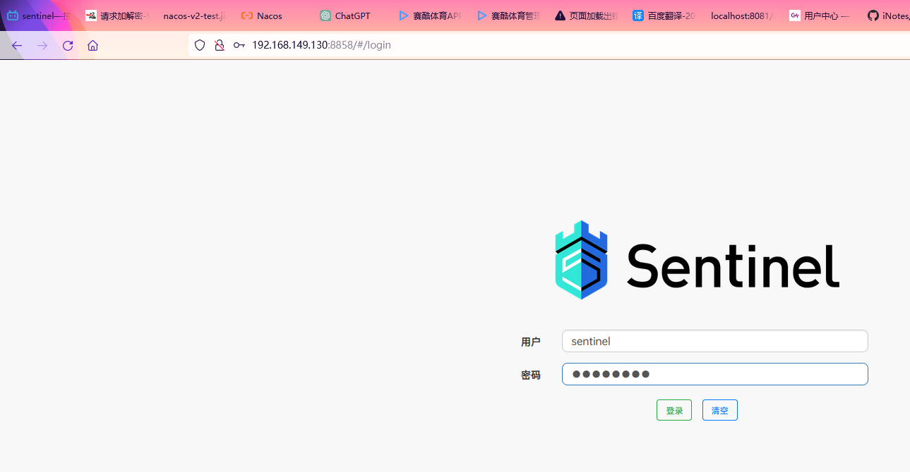  
账号密码都输入sentinel即可登陆  

4.详情配置  
sentinel的详情配置见:[https://github.com/alibaba/Sentinel/wiki/%E6%8E%A7%E5%88%B6%E5%8F%B0](https://github.com/alibaba/Sentinel/wiki/%E6%8E%A7%E5%88%B6%E5%8F%B0)  
docker的配置方式暂时还没有找到  

5.修改pom文件  
还是在sentinel-demo模块下,修改pom文件引入sentinelDashBoard依赖  
```xml
<!-- 整合控制台 -->
<dependency>
    <groupId>com.alibaba.csp</groupId>
    <artifactId>sentinel-transport-simple-http</artifactId>
    <version>1.8.0</version>
</dependency>
```

*注意:现在这个模块还没有整合SpringCloudAlibaba,后续整合Alibaba的时候这些pom都不需要这么麻烦*  

6.配置启动参数  
现在还需要配置服务启动时连接sentinel的地址,配置方式是使用Java运行时参数  
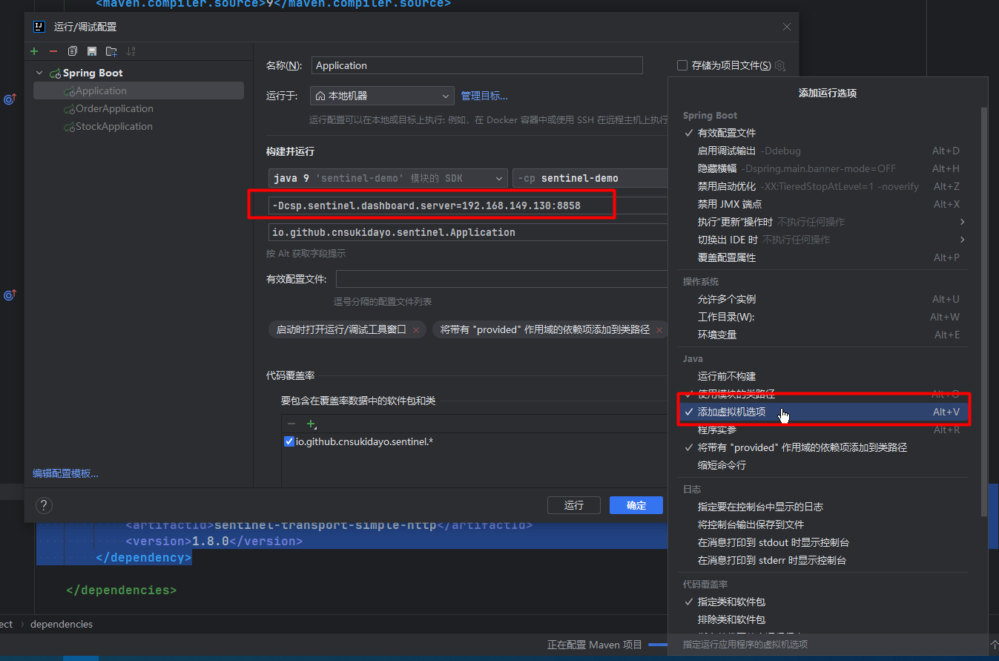  
`-Dcsp.sentinel.dashboard.server=192.168.149.130:8858`  
修改为对应的IP+端口即可  

7.启动测试  
启动微服务并且随便访问一个接口,一段时间之后刷新sentinel就可以看到相关服务了  
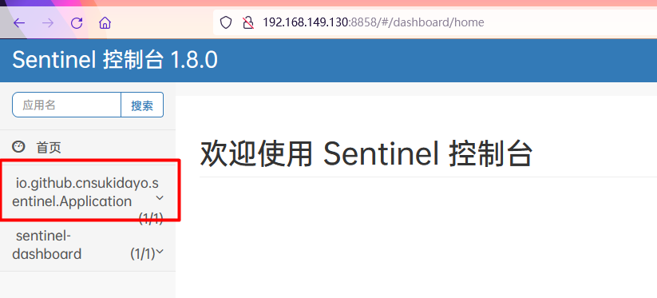  

#### 5.3.2 SpringCloudAlibaba整合Sentinel
1.创建sentinel-alibaba模块  

2.修改pom文件  
```xml
<?xml version="1.0" encoding="UTF-8"?>
<project xmlns="http://maven.apache.org/POM/4.0.0"
         xmlns:xsi="http://www.w3.org/2001/XMLSchema-instance"
         xsi:schemaLocation="http://maven.apache.org/POM/4.0.0 http://maven.apache.org/xsd/maven-4.0.0.xsd">
    <modelVersion>4.0.0</modelVersion>
    <parent>
        <groupId>io.github.cnsukidayo</groupId>
        <artifactId>springcloud</artifactId>
        <version>1.0-SNAPSHOT</version>
    </parent>

    <groupId>com.github.cnsukidayo</groupId>
    <artifactId>sentinel-alibaba</artifactId>

    <properties>
        <maven.compiler.source>9</maven.compiler.source>
        <maven.compiler.target>9</maven.compiler.target>
        <project.build.sourceEncoding>UTF-8</project.build.sourceEncoding>
    </properties>

    <dependencies>
        <dependency>
            <groupId>org.springframework.boot</groupId>
            <artifactId>spring-boot-starter-web</artifactId>
        </dependency>
        <!--sentinel启动器-->
        <dependency>
            <groupId>com.alibaba.cloud</groupId>
            <artifactId>spring-cloud-starter-alibaba-sentinel</artifactId>
        </dependency>
    </dependencies>

</project>
```

3.修改yml配置文件  
```yml
server:
  port: 8060
spring:
  application:
    name: sentinel-alibaba
  cloud:
    sentinel:
      transport:
        # 配置dashboard地址
        dashboard: 192.168.149.130:8858
```

4.启动测试  
*同理还是需要先访问一下服务的接口,否则不会在sentinel中进行显示*  
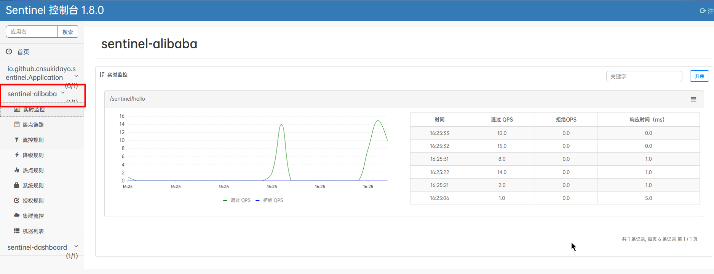  

### 5.4 流控规则
**目录:**  
5.4.1 流控规则  
5.4.2 流控模式  
5.4.3 流控效果  

#### 5.4.1 流控规则
提示:所有的规则都是服务于降级的,不能本末倒置  

1.实时监控  
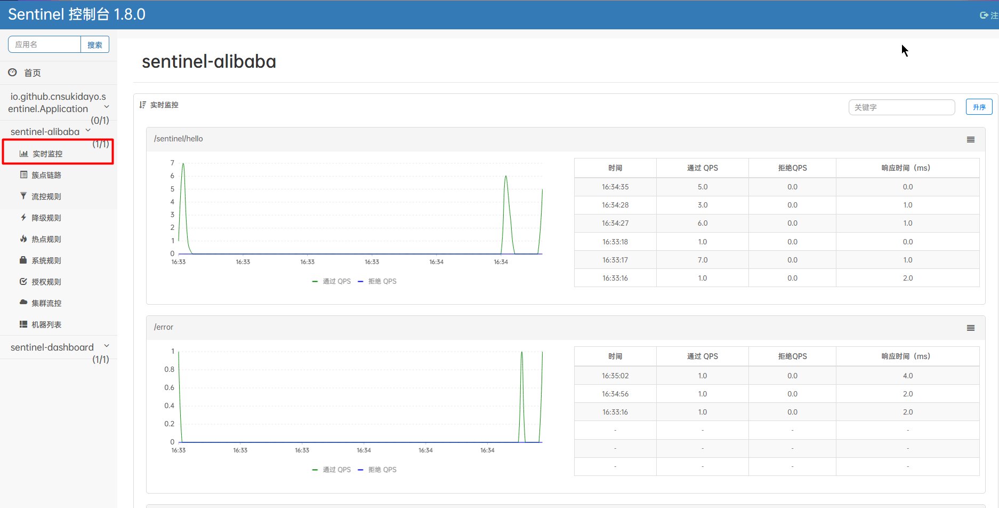  
<font color="#00FF00">用于实时监控所有服务调用情况的</font>  

2.簇点链路  
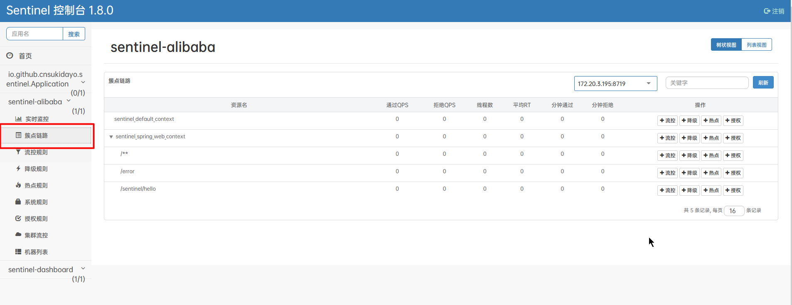  
<font color="#00FF00">用于显示所有可以进行流控、降级规则设置的资源</font>  

3.流控规则使用场景  
* 应多洪峰流量:秒杀、大促、下单、订单回流
* 消息型场景:削峰填谷、冷热启动
* 付费系统:根据流量付费

4.流控规则  
4.1 <font color="#00FF00">QPS</font>:设置QPS限制  
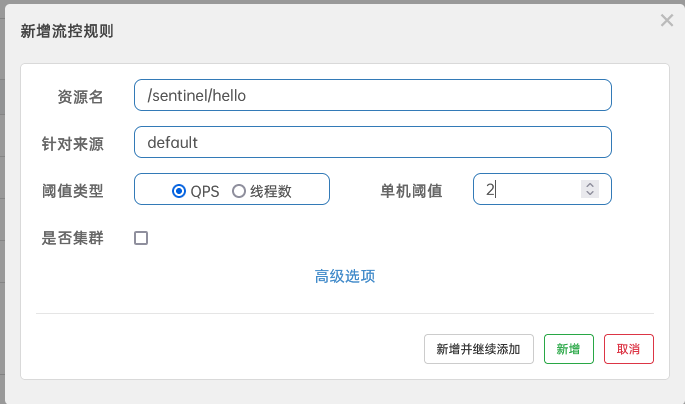  
这里新增了一个规则限制每秒的请求数量为2,当超过阈值后sentinel会返回默认的降级内容`Blocked by Sentinel (flow limiting)`  
如果需要自定义返回降级内容,可以通过之前的5.2.2 @SentinelResource注解节的内容来自定义  

4.2 <font color="#00FF00">线程数</font>:设置服务提供者线程数,也就是服务端当前创建了多少个线程来处理请求,一旦线程数量超过阈值则会降级  
这种流控方式用于保护业务线程池不被<font color="#00FF00">慢调用</font>耗尽,慢调用就是调用目标服务时间太长,从而导致大量的请求积压在服务调用方,<font color="#00FF00">导致服务调用方线程数飙升</font>,设置线程数流控规则可以避免  
这里直接测试不好显示效果,改造一下controller;并且把流控规则设置为线程数2  
然后用两个浏览器进行测试即可  
```java
@GetMapping("hello")
public String hello() {
    try {
        TimeUnit.MILLISECONDS.sleep(500);
    } catch (InterruptedException e) {
        throw new RuntimeException(e);
    }
    return "Hello";
}
```

5.统一降级信息返回结果  
*提示:之前如果想自定义降级的返回信息可以使用@SentinelResource注解,但是每一个controller都需要写一个对应的降级方法显得麻烦,实际上可以用一个统一的降级处理;<font color="#00FF00">两种方式实现降级处理的区别就是粒度</font>*  

5.1 创建BlockExceptionHandler实现类  
*统一异常处理(降级处理)是通过实现BlockExceptionHandler接口来完成的*  
在exception包下创建MyBlockExceptionHandler类  
```java
@Component
public class MyBlockExceptionHandler implements BlockExceptionHandler {
    private final Logger logger = LoggerFactory.getLogger(MyBlockExceptionHandler.class);

    @Override
    public void handle(HttpServletRequest request, HttpServletResponse response, BlockException e) throws Exception {
        // getRule() 获取规则的详情信息
        logger.info("BlockException ===============>" + e.getRule());
        Result r = null;
        if (e instanceof FlowException) {
            r = Result.error(101, "接口限流了");
        } else if (e instanceof DegradeException) {
            r = Result.error(102, "服务降级了");
        } else if (e instanceof ParamFlowException) {
            r = Result.error(103, "热点参数限流了");
        } else if (e instanceof SystemBlockException) {
            r = Result.error(104, "触发系统保护规则了");
        } else if (e instanceof AuthorityException) {
            r = Result.error(105, "授权规则不通过");
        }
        // 返回json数据
        response.setStatus(500);
        response.setCharacterEncoding("utf-8");
        response.setContentType(MediaType.APPLICATION_JSON_VALUE);
        new ObjectMapper().writeValue(response.getWriter(),r);
    }
}
```

5.2 在domian包下创建Result类  
```java
public class Result<T> {

    private Integer code;
    private String message;
    private T data;

    public Result(Integer code, String message) {
        this.code = code;
        this.message = message;
    }

    public Result(Integer code, String message, T data) {
        this.code = code;
        this.message = message;
        this.data = data;
    }

    public static Result error(Integer code, String message) {
        return new Result(code, message);
    }
    // 提供getter/setter方法
}
```

5.3 启动测试  
配置接口限流规则为QPS=1;快速刷新浏览器收到返回信息如下  
```json
{   
    "code":101,
    "message":"接口限流了",
    "data":null
}
```

#### 5.4.2 流控模式
**流控模式是流控规则的高级用法,点击流控规则的高级选项展开流控模式选项**  
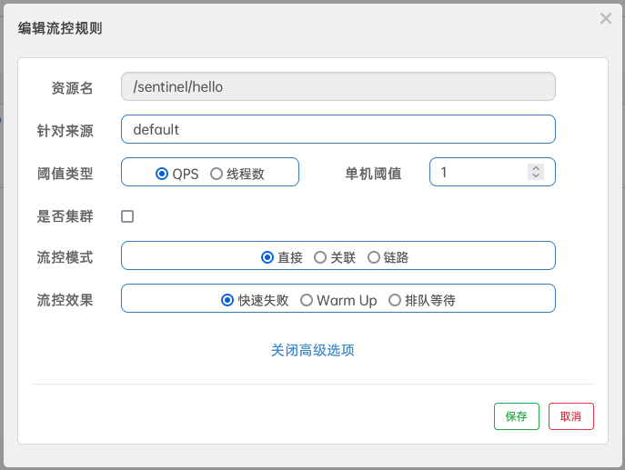  

1.直接  
默认选项,当资源名(资源名就是接口访问路径)超过阈值之后该接口就降级  

2.关联  
在关联界面中会让你输入<font color="#00FF00">关联资源</font>选项,关联资源也是一个**接口的路径**(当然可以直接从簇点链路里面查到所有的资源),它的意思是一旦关联资源的流量超过了限流规则的阈值之后,则会将当前资源降级(而不是关联资源)  

**使用场景:**  
假设现在有两个接口,一个是查询订单接口一个是下单接口;当下单接口流量较大时希望限制查询订单接口就可以使用关联  
注意在配置的时候,因为要对查询订单接口限流所以就在查询订单上配置限流规则,然后关联下单接口  
*提示:这里测试的话可以使用jmeter进行测试,持续请求下单接口然后访问查询接口看效果*  

3.链路  
在链路界面中需要设置<font color="#00FF00">入口资源</font>,它的意思是对当前资源进行流控判断,但受到影响的是入口资源  
假设现在有两个接口test1和test2接口它们都调用了getUser这个接口  
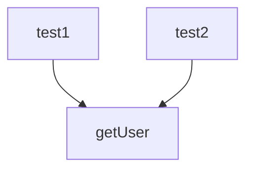
```mermaid
flowchart TB
   test1 --> getUser
   test2 --> getUser
```
<font color="#00FF00">sentinel不仅可以对接口进行流控还可以对业务方法进行流控</font>  
此时如果对getUser接口进行流控则最终test1和test2都会受到影响,如果只希望test2受到影响而test1不受影响就可以使用链路  
同理在配置的时候,因为对getUser进行限流,所以就在getUser资源上配置限流规则;一旦getUser到达阈值后<font color="#00FF00">对链路test2进行限流</font>  
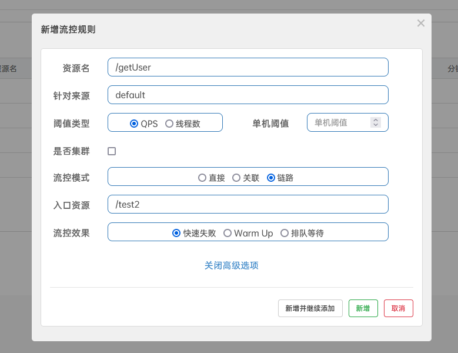  
总结:在所有进入getUser的调用链中,一旦getUser达到阈值,则对入口/test2进行流控  
<font color="#00FF00">链路和关联正好相反</font>:  
关联=> 对关联资源判断->限制当前资源
链路=> 对当前资源判断->限制入口资源

3.1 创建controller  
```java
@RestController
@RequestMapping("/sentinel")
public class TestController {

    private final UserService userService;

    public TestController(UserService userService) {
        this.userService = userService;
    }

    @GetMapping("test1")
    public String test1() {
        return userService.getUser();
    }

    @GetMapping("test2")
    public String test2() {
        return userService.getUser();
    }
}
```

3.2 编写service  
```java
@Service
public class UserService {
    @SentinelResource(value = "getUser")
    public String getUser() {
        return "getUser";
    }
}
```
注意该Service被@SentinelResource注解标注(<font color="#00FF00">sentinel支持对service层的方法流控</font>),资源名称是getUser  
*提示:这里由于使用了@SentinelResource注解,所以该方法被流控的话不会走sentinel默认的降级处理;也不会走全局的降级处理方法,会返回500;如果需要自定义可以使用之前的blockHandler属性来指定降级方法*

3.3 修改yml配置文件
```yml
spring:
  cloud:
    sentinel:
      # 将这个设置为false即可
      web-context-unify: false
```

3.4 测试运行  
结果显示,当流量达到getUser方法的阈值之后test2方法将被流控而test1方法不会  


#### 5.4.3 流控效果  
**流控效果是流控规则的高级用法,点击流控规则的高级选项展开流控效果选项**  
  

1.快速失败  
默认的流控效果,当流控接口达到降级阈值之后会直接放弃这部分流量  

2.Warm up  
在该界面下要求输入一个<font color="#00FF00">预热时长</font>;这是为了避免洪峰流量到来一下子打垮系统,而是让流量慢慢进入系统从而让系统<font color="#00FF00">冷启动</font>  
假设QPS设置为10,预热时长设置为5;那么当流量到来时不是一下子打到10,而是在这5s之内慢慢递增到10  
递增的时候遵循如下公式:  
<font color="#00FF00">冷加载因子</font>默认为3,最开始只能接受<font color="#00FF00">QPS/冷加载因子</font>量的请求,如果最开始请求量超出这个值则系统进行流控拒绝请求,经过设定的<font color="#00FF00">预热时长</font>之后逐渐升至设定的QPS阈值  

3.排队等待  
在该界面下要求输入一个<font color="#00FF00">超时时间</font>;假设这里QPS设置为10,超时时间设置为5,当洪峰流量到来时假设为20;那么系统不会立即放弃这部分流量,而是会保留这部分流量5s,尝试在接下来的5s之内能够消化这部分流量,如果消化不了则再返回异常  
Wram Up用于处理激增流量,而排队等待用于处理脉冲流量  
* 激增流量:系统运行平稳,突然出现大量的请求量,之后流量又回归平稳
* 脉冲流量:系统运行平稳,突然出现很高的请求量,之后回归平稳,一段时间后再次出现很高的请求量  

  
那么脉冲流量就有这么一个特点,每次脉冲到来之间会有一段间隔时间,排队等待的思想就是利用这段间隔时间,将部分流量转移到这段时间进行处理;即所谓的<font color="#FF00FF">削峰填谷</font>  

4.面试题  
* 如何判断流量是激增流量还是脉冲流量?(自已想的)
  感觉可以从业务角度先分析一波,然后还可以通过流量监控工具进行分析,分析之后能将分析结果立即应用于接口
* 如何设置排队等待的时长
  其实可以从用户的视角来看排队等待,即一个系统能提供的QPS是固定的;即一个请求最大允许等待多长时间,其实排队等待时间不能设置的太长

### 5.5 熔断降级规则
1.进入熔断设置页面  
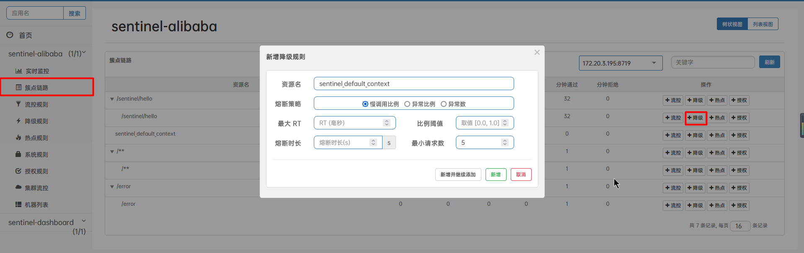  
点击簇点链路=>选择资源=>降级  

2.慢调用比例  
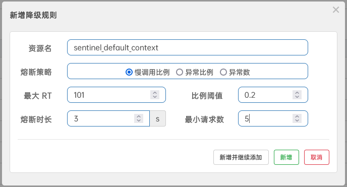  

* 最大RT:当前允许的最大响应时间,大于该值就是慢调用
* 比例阈值:当单位时间内慢调用的比例大于该阈值时就会对服务进行熔断
* 熔断时长:熔断多长时间
* 最小请求数:单位时间内请求数量大于该值时才会触发熔断

图中配置代表,单位时间内调用时长大于101ms的慢调用数量超过5次并且比例达到0.2时会熔断3s  
注意这里配置在sentinel_default_context这个资源上,如果是在远程调用中发现该接口的执行时间过长(说明该服务调用的服务故障了),那么该接口就会理解返回错误信息,不会再去调用目标服务了;<font color="#FF00FF">表明目标服务被熔断了</font>(而不是sentinel_default_context这个服务被熔断了)<font color="#00FF00">即熔断规则配置在服务调用方</font>;

3.异常比例  
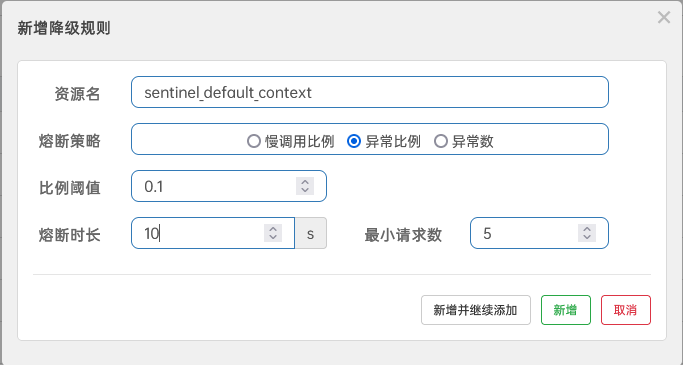  
同理,是对服务产生异常的比例进行判断的  
使用jmeter进行测试运行1s内发送10个请求,发现前5次都是异常,第6次开始就是熔断  

4.异常数  
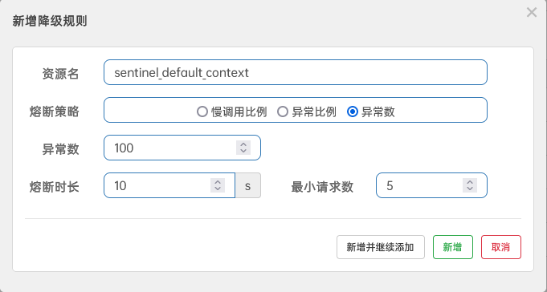  
根据异常数进行熔断  

### 5.6 OpenFeign整合降级
1.创建openfeign-sentinel模块  

2.编写pom文件  
```xml
<dependencies>
    <dependency>
        <groupId>org.springframework.boot</groupId>
        <artifactId>spring-boot-starter-web</artifactId>
    </dependency>

    <!--服务注册发现-->
    <dependency>
        <groupId>com.alibaba.cloud</groupId>
        <artifactId>spring-cloud-starter-alibaba-nacos-discovery</artifactId>
    </dependency>

    <dependency>
        <groupId>org.springframework.cloud</groupId>
        <artifactId>spring-cloud-starter-openfeign</artifactId>
    </dependency>

    <!--添加sentinel依赖-->
    <dependency>
        <groupId>com.alibaba.cloud</groupId>
        <artifactId>spring-cloud-starter-alibaba-sentinel</artifactId>
    </dependency>
</dependencies>
```
3.编写主启动类  
```java
@SpringBootApplication
@EnableFeignClients
public class Application {
    public static void main(String[] args) {
        SpringApplication.run(Application.class, args);
    }
}
```


4.编写yml配置文件  
<font color="#FF00FF">这里不需要关联sentinel的DashBoard,因为熔断是sentinel自带的功能</font>(sentinel有核心库和DashBoard两个组件,这两个组件是独立运行的,之前5.2 Sentinel上手体验节讲的就是sentinel的核心库)  

```yml
server:
  port: 8089
spring:
  application:
    name: service-order
  cloud:
    nacos:
      discovery:
        server-addr: 192.168.230.225:8848
        username: nacos
        password: nacos
        namespace: public

feign:
  sentinel:
    # 开启feign整合sentinel
    enabled: true
```

5.编写controller  
在当前模块的controller包下创建OrderController  
```java
@RestController
@RequestMapping("/api/order")
public class OrderController {

    private final StockFeignService stockFeignService;

    public OrderController(StockFeignService stockFeignService) {
        this.stockFeignService = stockFeignService;
    }

    @GetMapping("add")
    public String add() {
        return stockFeignService.reduceE();
    }
}
```

6.编写远程调用接口  
*提示:这里还是远程调用之前的service-stock模块中的StockController接口;先把该模块中bootstrap.yml配置文件中的内容注释掉*  
在当前模块下创建feign文件夹,再在该文件夹下创建StockFeignService接口  
```java
@FeignClient(value = "service-stock", path = "/api/stock/inner")
public interface StockFeignService {
    @GetMapping("reduceE")
    String reduceE();
}
```


7.StockController  
还是决定把服务提供者的接口代码粘贴一下,这里重点测试reduceE方法,该方法会抛出异常,并且该异常将传播到openfeign-sentinel模块  
```java
@RestController()
@RequestMapping("/api/stock/inner")
public class StockController {

    @Value("${server.port}")
    private String port;

    @GetMapping("reduce")
    public String reduce() {
        return "扣减库存" + port;
    }

    @GetMapping("reduceE")
    public String reduceE() {
        int a = 1 / 0;
        return "扣减库存" + port;
    }
}
```

8.编写降级类  
还是在openfeign-sentinel的feign目录下编写降级类,意思就是指定服务调用者调用目标方法出现熔断时需要执行的降级方法  
该类必须实现Feign接口  
```java
@Component
public class StockFeignServiceFallback implements StockFeignService{
    @Override
    public String reduceE() {
        return "降级啦!";
    }
}
```

### 5.7 热点参数流控
1.什么是热点参数  
* 假设有一个商品查询接口,该所有商品都调用该接口;如果根据商品ID进行查询,其中必然有些商品ID是热点参数,那么就可以针对这些热点商品进行防护  
* 还有一类场景是针对某些接口进行<font color="#00FF00">防刷</font>,比如短信验证码验证接口(不是获取接口),有可能会暴力请求短信验证接口,那么<font color="#00FF00">为了保障其它的用户正常访问该接口就可以针对当前暴力破解的用户进行限制</font>  

2.实现原理  
热点淘汰策略LRU+Token Bucket流控  

3.编写controller  
来到sentinel-alibaba模块,在该模块下的controller包下创建HotController 
```java
@RestController
@RequestMapping("/sentinel")
public class HotController {

    @RequestMapping("getById/{id}")
    @SentinelResource(value = "getById", blockHandler = "hotBlockHandler")
    public String getById(@PathVariable("id") Integer id) {
        System.out.println("正常访问");
        return "正常访问";
    }

    public String hotBlockHandler(@PathVariable("id") Integer id, BlockException e) {
        return "热点异常处理";
    }
}
```
注意热点流控规则必须结合`@SentinelResource`注解进行使用,否则是不会生效的

4.启动测试  

5.来到sentinel控制面板  
* 参数索引:指定要进行热点流控的参数在方法入参中的位置(索引)
* 单机阈值:单机阈值在这里分为两种解释
  * 当接口参数大部分都是热点参数时,单机阈值就是针对热点参数进行流控的;之后在高级界面配置的都是对普通值进行流控
  * 当接口参数大部分都是普通参数时,单击阈值就是针对普通参数进行流控的;之后在高级界面配置的都是对热点值进行流控
* 统计窗口时长:多次时间内请求(热点请求/普通请求)的QPS达到单击阈值触发流控

*先假设我们上面接口的大部分参数都是普通参数,那么在热点规则面板中设置的阈值就是针对普通参数进行流控的*  
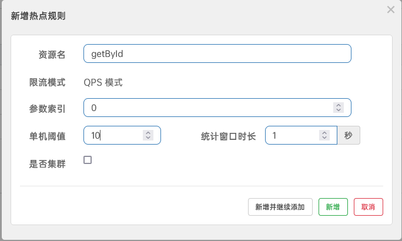  
对于图中的配置,因为接口大部分都是普通参数,意思就是普通流量一秒钟可以访问10次接口(<font color="#00FF00">限流模式为QPS,单击阈值为10</font>)

点击新增后对刚才的热点流控规则点击编辑=>高级选项,来到如下界面,在该界面可以对热点参数进行流控设置  
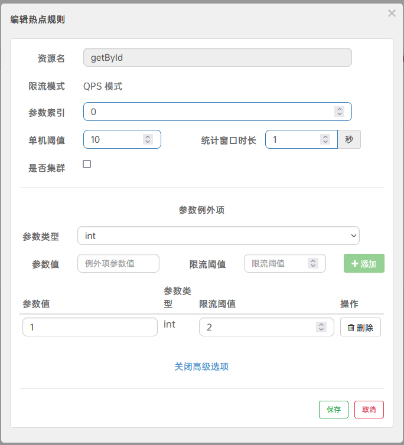  
例如这里就对热点参数1限制它的访问频率为2,别的参数加起来限制在1s内10次即可  
<font color="#00FF00">说白了该规则就是,有单独配置参数只规则的走单独配置的QPS规则,没有单独配置的走全局的QPS</font>

6.运行测试访问  
发现当参数为1并且访问频率大于1s两次时成功触发流控  

### 5.8 系统保护规则
1.使用场景  
* 容量评估不到位,某个大流量接口限流配置不合理或没有配置,导致系统崩溃,来不及进行处理
* 突然发现机器的Load和CPU usage等开始飚高,但却没有办法很快确认到底是什么原因造成的,也来不及处理
* 当其中一台机器挂掉之后,本该由这台机器处理的流量被负载均衡到另外的机器上,另外的机器也被打挂了,引起系统雪崩
* 希望有个全局的兜底保护,即使缺乏容量评估也希望有一定的保护机制

结合系统指标和服务容量,<font color="#00FF00">希望能够自适应动态调整流量</font>  

2.系统规则  
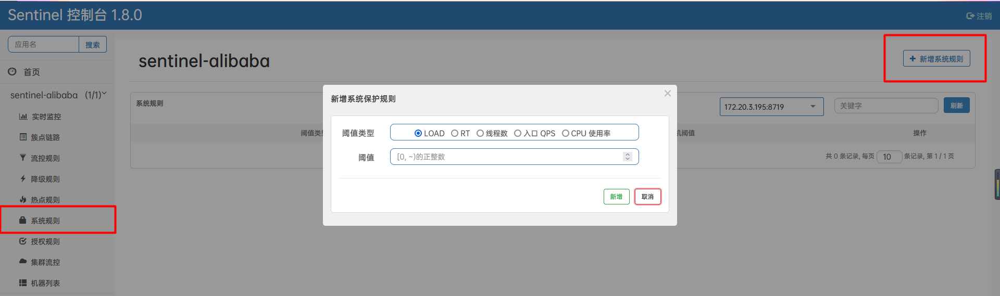  
点击系统规则=>新增系统规则 
进行系统规则的设置是不需要选择资源的,因为它是一种全局的配置规则  

3.CPU使用率  
根据当前服务所在的操作系统CPU的使用率进行控制,参数填入一个小数(百分比)

4.RT  
根据当前服务所有入口流量的平均RT阈值进行流控  

5.线程数  
根据当前服务所有入口流量的并发线程数达到阈值进行流控  

6.入口QPS  
当单台机器上所有入口流量的QPS达到阈值进行流控  

### 5.9 sentinel持久化模式
1.问题  
sentinel默认的所有配置都是保存在内存当中的,一旦服务重启之后维护在sentinel中的配置全都丢失了  

2.sentinel持久化模式  
* 原始模式:应用重启之后规则就会消失,不能用于生产环境
* 拉模式:将数据信息写入到本地文件
* 推模式:生产环境下推荐使用该模式,这种模式的配置中心一般是nacos、zookpeer;数据推送的操作不由服务进行,而是由sentinel控制台统一进行管理然后推送到服务配置中心,接着配置中心将数据推送到sentinel数据源,sentinel数据源将数据更新到本地服务  
  <font color="#00FF00">sentinel控制台->配置中心->sentinel数据源->sentinel</font>

3.推模式  

3.1 引入pom依赖  
引入sentinel数据源到本地微服务依赖  
```xml
<dependency>
    <groupId>com.alibaba.csp</groupId>
    <artifactId>sentinel-datasource-extension</artifactId>
</dependency>
```

3.2 nacos远程配置中心  
由于使用远程配置中心存储数据,所以需要再nacos中创建一个远程配置用于保存sentinel中的配置信息  
假设有如下配置  
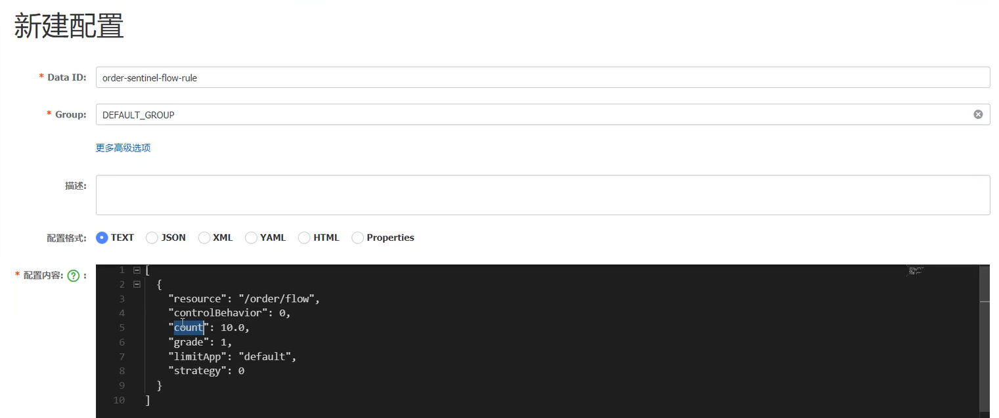  
这段配置是手工的配置,表示对/order/flow接口进行限流  

3.3 设置服务的yml  
```yml
server:
  port: 8060
spring:
  application:
    name: sentinel-alibaba
  cloud:
    sentinel:
      transport:
        # 配置dashboard地址
        dashboard: 192.168.149.130:8858
      web-context-unify: false
      # dataSource是一个Map集合,可以回顾一下yml中如何编写Map集合
      datasource:
        # key:可以随意指定
        flow-rule:
          # 设置使用nacos配置中心,
          nacos:
            # 设置nacos的远程地址
            server-addr: 192.168.149.130:8848
            username: nacos
            password: nacos
            data-id: order-sentinel-flow-rule
          # zk: 设置使用zookpeer配置中心
          # consul: 设置使用consul配置中心
```

3.3 大坑  
现在的这种配置太鸡肋了;还要人手动配置yml文件,并且如果通过sentinel的控制面板修改了一些配置文件它是不支持直接推送到nacos的  
//todo 这里要补


## 6.分布式事务
6.1 分布式事务基本概念介绍  
6.2 seata基本环境搭建  
6.3 seata客户端搭建  
6.4 seata实现分布式事务  
6.5 seata原理  

### 6.1 分布式事务基本概念介绍
1.Seata介绍  
Seata提供了高性能和简单易用的分布式事务,seata提供了AT、TCC、SAGA、XA事务模式.AT模式是阿里首推的模式,阿里云分布式事务的收费版本是GTS  
[SeataGitHub](https://github.com/apache/incubator-seata)
[Seata官网](https://seata.io/zh-cn/)  

2.分布式事务解决方案  
可以参看MySQL笔记2.事务=>2.5 分布式事务  

3.AT模式  
AT模式(auto transaction)是一种无侵入式的分布式事务解决方案  
AT模式类似<font color="#00FF00">二阶段提交</font>  

**AT是如何做到对业务的无侵入:**  
* 在一阶段(准备阶段)seata会拦截业务SQL,首先解析SQL语义,找到业务SQL要更新的业务数据,在业务数据被更新之前将其保存为`before image`(类似二阶段提交的undo日志,通过before image可以实现数据的回滚),然后执行业务SQL更新业务数据,在业务数据更新完成之后,再将更新的数据保存成`after image`(类似二阶段提交的redo日志)最后生成<font color="#00FF00">行锁-写锁</font>,以上操作全部在一个数据库事务内完成,这样保障了一阶段操作的原子性
* 二阶段提交:因为业务SQL在一阶段已经提交至数据库,所以seata框架只需要将一阶段保存的快照数据和行锁删掉,完成数据清理即可
* 二阶段回滚:如果二阶段操作是回滚的话,seata就需要回滚一阶段已经执行的业务SQL,回滚方式就是使用`before image`(undo);但在还原前要首先校验脏写,对比数据库当前的数据与after image是否一致,如果一致的话就说明没有脏写可以还原数据,如果不一致就说明有脏写,此时就需要转人工处理
  还原的时候是通过`before image`生成逆向SQL来还原数据

4.三个角色  
在seata架构中一共有三个角色  
* 事务协调者(TC):维护全局和分支事务的状态,驱动全局事务提交或回滚
* 事务管理器(TM):定义全局事务的范围,开始全局事务、提交或回滚全局事务
* 资源管理器(RM):管理分支事务处理的资源,与TC交谈以注册分支事务和报告分支事务的状态,并驱动分支事务提交或回滚

<font color="#00FF00">其中TC为单独部署的服务,TM和RM由微服务集成</font>

### 6.2 seata基本环境搭建
1.选择版本  
按照alibaba提供的版本说明进行下载[https://github.com/alibaba/spring-cloud-alibaba/wiki/版本说明](https://github.com/alibaba/spring-cloud-alibaba/wiki/%E7%89%88%E6%9C%AC%E8%AF%B4%E6%98%8E) 

2.下载seata  
SeataDocker地址:[https://hub.docker.com/r/seataio/seata-server](https://hub.docker.com/r/seataio/seata-server)  

2.1 启动docker容器  
```shell
docker run \
--name seata-server \
-p 8091:8091 \
-p 7091:7091 \
-d seataio/seata-server:1.3.0
```

2.2 创建宿主机文件夹  
```shell
mkdir -p ~/software/seata-server/sessionStore
mkdir -p ~/software/seata-server/resources
```

2.3 将docker配置文件拷贝到宿主机  
```shell
docker cp [seataContainId]:/seata-server/resources ~/software/seata-server/resources
docker cp [seataContainId]:/seata-server/sessionStore ~/software/seata-server/sessionStore
```

2.4 删除容器  

2.5 重新启动容器并挂载验证容器是否启动成功  
```shell
docker run \
--name seata-server \
-p 8091:8091 \
-p 7091:7091 \
-e SEATA_IP=192.168.149.131 \
-v ~/software/seata-server/resources:/seata-server/resources \
-v ~/software/seata-server/sessionStore:/seata-server/sessionStore \
-d seataio/seata-server:1.3.0
```
* `-e SEATA_IP=192.168.149.131` 这一步的IP必须指定为宿主机的IP
* `-p` 端口号最好不要修改
关于修改seata的配置见步骤4  

*提示:*  
进入seata容器命令:`docker exec -it [seataContainerId] sh`  


3.Seata数据持久化方式  
Seata数据持久化支持三种方式  
* file:默认单机模式,全局事务会话信息保存在内存中,当事务完成后会持久化到本地的root.data文件中,性能较高;<font color="#00FF00">但这种模式不支持seata集群</font>(因为数据只保存在单机上)
* db:高可用模式,全局事务信息通过db共享,相应的性能差一些
* redis:性能较高,存在事务信息丢失风险;需要配置适合当前场景的redis持久化配置
  *如果事务这样的信息存放在redis或MySQL中,那么MySQL宕机是没有redis可怕的,毕竟MySQL拥有二阶段提交机制,redis可没有;但redis有相关的持久化机制,可以具体选择;redis持久化机制见redis笔记*

4.修改seata数据持久化方式  
<font color="#00FF00">这里采用db方式进行数据持久化</font>

**创建seata数据库**  
启动数据库,并在数据库中创建一个seata数据库
从seata的github上下载建表语句:[https://github.com/apache/incubator-seata/tree/1.3.0/script/server/db](https://github.com/apache/incubator-seata/tree/1.3.0/script/server/db)  
  
使用图中的 [mysql.sql](resources/springcloud/mysql(seata).sql) 语句使用Navicat进行运行即可
这个SQL会生成三张表,global_table、lock_table、branch_table  
关于这三张表的介绍详情见6.5 seata原理=>3.seata的三张表  

**修改配置文件**
回到宿主机的挂载目录下,进入resource目录下,备份file.conf配置文件,并修改改文件内容如下:  

```shell
store{
  mode = "db"
  db {
    datasource = "druid"
    dbType = "mysql"
    driverClassName = "com.mysql.jdbc.Driver"
    # 设置数据库连接地址
    url = "jdbc:mysql://192.168.149.131:7901/seata"
    # 设置账号密码
    user = "root"
    password = "root"
    minConn = 5
    maxConn = 30
    globalTable = "global_table"
    branchTable = "branch_table"
    lockTable = "lock_table"
    queryLimit = 100
    maxWait = 5000
  }
}
```

5.修改seata的nacos配置  
*提示:seata服务的注册中心配置和配置中心配置是可以分下来的*  
* 微服务通过与<font color="#00FF00">seata集群</font>交互来完成分布式事务,微服务如何感知seata集群以及微服务如何负载均衡地调用seata集群,就是通过nacos注册中心来完成的,所以这里需要将seata注册到nacos中  
* <font color="#00FF00">同理seata集群之间的配置也是需要使用nacos配置中心进行同步的</font>,假设seata的配置需要发送改变时就不需要手动更改每一台seata的配置了  

示意图如下:  
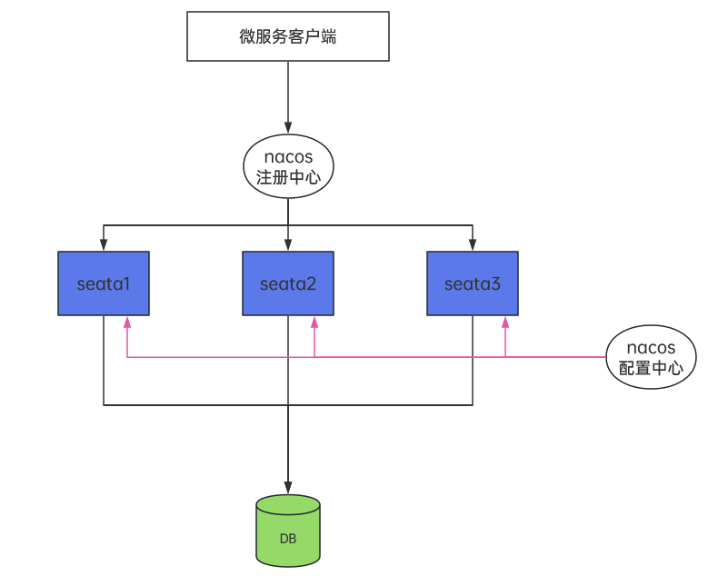  
回到宿主机的挂载目录下,进入resource目录下,备份registry.conf配置文件,并修改改文件内容如下:  
```shell
# 设置注册中心的配置
registry {
  type = "nacos"
  # loadBalancer = "RandomLoadBalance"
  nacos {
    application = "seata-server"
    # 这里指定nacos的地址,线上环境中这里可以使用nacos集群的地址(nginx配置的地址)
    serverAddr = "192.168.149.131:8870"
    # 指定分组
    group = "SEATA_GROUP"
    # 指定命名空间
    namespace = ""
    cluster = "default"
    # 指定nacos的用户
    username = "nacos"
    password = "nacos"
  }
}
# 设置配置中心的配置
config {
  type = "nacos"
  nacos {
    serverAddr = "192.168.149.131:8870"
    namespace = ""
    group = "SEATA_GROUP"
    username = "nacos"
    password = "nacos"
  }
}
```

6.创建config.txt配置文件  
在当前的resource目录下新建config.txt配置文件,内容可以从[https://github.com/apache/incubator-seata/tree/1.3.0/script/config-center](https://github.com/apache/incubator-seata/tree/1.3.0/script/config-center)获取  
[点击预览config.txt](resources/springcloud/config.txt)  
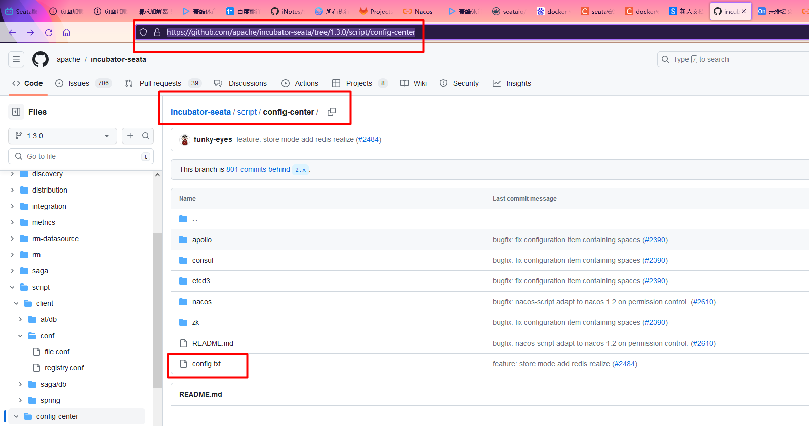  
该配置文件的作用是初始化nacos配置中心,待会需要将该配置文件推送到nacos  
<font color="#00FF00">这个配置文件太恶心了,高版本不需要改配置文件</font>  

主要修改以下部分的内容:  
```properties
# 事务分组,主要用于解决异地机房停电容错,这里my_test_tx_group可以设置为guangzhou,即service.vgroupMapping.guangzhou=default 不是把后面的default改为广州;配置完成之后对应的客户端也需要进行设置;后面的这个default必须等于上面registry.conf配置文件中cluster = "default"的值
service.vgroupMapping.guangzhou=default
store.db.dbType=mysql
store.db.driverClassName=com.mysql.jdbc.Driver
store.db.url=jdbc:mysql://192.168.149.131:7901/seata?useUnicode=true
store.db.user=root
store.db.password=root
```

**事务分组与高可用**  
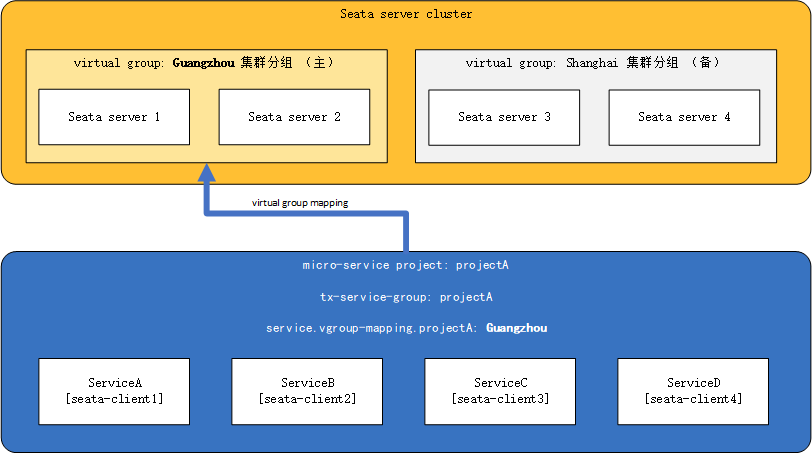  
<font color="#00FF00">不同的seata集群就可以设置不同的事务分组</font>,例如这里seata1和seata2设置的事务分组为guangzhou;seata3和seata4设置的事务分组为shanghai  

微服务客户端就可以通过如下配置来选择使用哪一个事务分组  
```properties
seata.tx-service-group=projectA
seata.service.vgroup-mapping.projectA=Guangzhou
```
假设guangzhou的集群断电了,那就可以通过配置文件快速切换到上海  
```properties
seata.service.vgroup-mapping.projectA=Shanghai
```
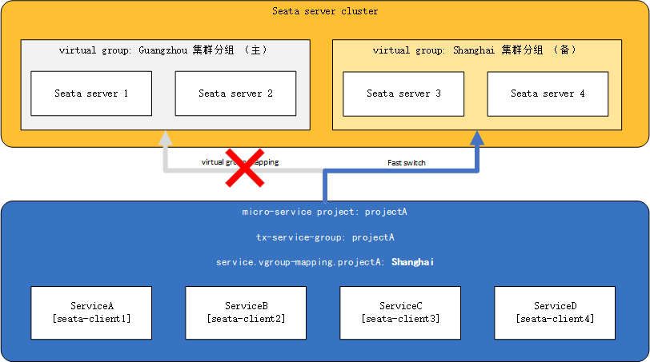  

7.将config.txt配置文件推送到nacos  
这里需要使用官方的脚本文件进行推送,下载地址: [https://github.com/apache/incubator-seata/tree/1.3.0/script/config-center/nacos](https://github.com/apache/incubator-seata/tree/1.3.0/script/config-center/nacos)  
文件可以预览:resources/springcloud/nacos-config.sh  
把脚本文件复制到虚拟机resources目录下  
运行脚本文件  
`sh nacos-config.sh -h [nacosIP地址] -p [nacosPort] -g [group] -t [namespace]`  
* nacosIP地址:远端的nacosIP地址
* nacosPort:远端的nacos端口
* group:要推送到哪个分组下面
* namespace:对应nacos命名空间ID字段,如果不写就是public;命名空间ID字段是那个UUID

`sh nacos-config.sh -h 192.168.149.131 -p 8870 -g DEFAULT_GROUP ` 
注意这里还有个小坑,现在脚本文件和config.txt文件是放在一个目录下的都在resources目录下,需要把脚本文件nacos-config.sh放到config.txt的子级目录下,这里在resources目录下创建一个script目录,接着将nacos-config.sh文件移至该目录下;再次之前上述命令

运行后的效果如下  
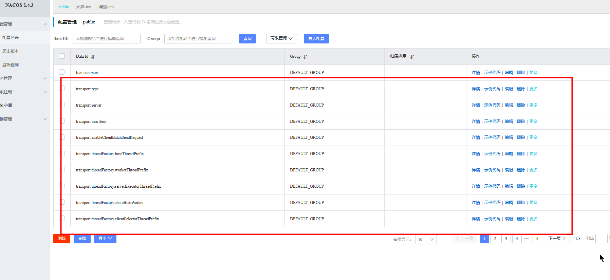  
*一共有8页全是一项一项的配置特别恶心,但是没办法它就是这么玩的;<font color="#00FF00">新版本不会有这个问题</font>*  

8.重启seata  
查看nacos可以看到seata-server已经注册到nacos中  
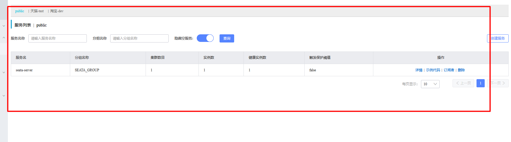  

### 6.3 seata客户端搭建
1.创建数据库  
创建seata_order和seata_stock数据库并在数据库中分别创建order_tbl和stock_tbl代表订单表和库存表,表定义如下  
```sql
CREATE TABLE `seata_order`.`order_tbl`  (
  `id` int NOT NULL COMMENT '订单id',
  `product_id` int NULL DEFAULT NULL COMMENT '商品id',
  `total_amount` int NULL DEFAULT NULL COMMENT '金额',
  `status` int NULL DEFAULT NULL COMMENT '状态',
  PRIMARY KEY (`id`) USING BTREE
) ENGINE = InnoDB CHARACTER SET = utf8mb4 COLLATE = utf8mb4_0900_ai_ci ROW_FORMAT = Dynamic;
```
```sql
CREATE TABLE `seata_stock`.`stock_tbl`  (
  `id` int NOT NULL COMMENT '库存id',
  `product_id` int NULL DEFAULT NULL COMMENT '商品id',
  `count` int NULL DEFAULT NULL COMMENT '库存数量',
  PRIMARY KEY (`id`) USING BTREE
) ENGINE = InnoDB CHARACTER SET = utf8mb4 COLLATE = utf8mb4_0900_ai_ci ROW_FORMAT = Dynamic;
```
在stock表中插入一条数据  
`INSERT INTO seata_stock.stock_tbl (id, product_id, count) VALUES (1, 9, 100)`

2.创建两个子模块  
分别创建seata-order和seata-stock模块  

3.修改pom  
将两个子模块的pom文件均修改为如下内容  
```xml
<dependencies>
    <dependency>
        <groupId>org.springframework.boot</groupId>
        <artifactId>spring-boot-starter-jdbc</artifactId>
    </dependency>

    <dependency>
        <groupId>org.springframework.boot</groupId>
        <artifactId>spring-boot-starter-web</artifactId>
    </dependency>

    <dependency>
        <groupId>org.mybatis.spring.boot</groupId>
        <artifactId>mybatis-spring-boot-starter</artifactId>
        <version>2.1.4</version>
    </dependency>

    <dependency>
        <groupId>mysql</groupId>
        <artifactId>mysql-connector-java</artifactId>
    </dependency>

    <dependency>
        <groupId>com.alibaba</groupId>
        <artifactId>druid-spring-boot-starter</artifactId>
        <version>1.2.3</version>
    </dependency>

    <!--服务注册发现-->
    <dependency>
        <groupId>com.alibaba.cloud</groupId>
        <artifactId>spring-cloud-starter-alibaba-nacos-discovery</artifactId>
    </dependency>

    <dependency>
        <groupId>org.springframework.cloud</groupId>
        <artifactId>spring-cloud-starter-openfeign</artifactId>
    </dependency>

</dependencies>
```

4.创建yml配置文件  
修改两个子模块的yml配置文件如下,要改的记得改一下  
```yml
server:
  port: 8081
spring:
  application:
    name: seata-order
  cloud:
    nacos:
      discovery:
        server-addr: 192.168.149.131:8870
        username: nacos
        password: nacos
        namespace: public
  datasource:
    driverClassName: com.mysql.jdbc.Driver
    username: root
    password: root
    url: jdbc:mysql://192.168.149.131:7901/seata_order?useUnicode=true&characterEncoding=utf8&characterSetResults=utf8&useSSL=false
mybatis:
  mapper-locations: classpath:mybatis/*.xml
  type-aliases-package: io.github.cnsukidayo.order.entity
  configuration:
    map-underscore-to-camel-case: true
```

5.创建主启动类  
seata-order模块  
```java
@SpringBootApplication
@MapperScan(basePackages = "io.github.cnsukidayo.order.dao")
@EnableFeignClients
public class SeataOrderApplication {
    public static void main(String[] args) {
        SpringApplication.run(SeataOrderApplication.class,args);
    }
}
```

seata-stock模块  
```java
@SpringBootApplication
@MapperScan(basePackages = "io.github.cnsukidayo.stock.dao")
@EnableFeignClients
public class SeataStockApplication {
    public static void main(String[] args) {
        SpringApplication.run(SeataStockApplication.class, args);
    }
}
```

6.编辑seata-order模块  

6.1 创建controller  
```java
@RestController
@RequestMapping("/api/order")
public class OrderController {

    private final OrderService orderService;

    public OrderController(OrderService orderService) {
        this.orderService = orderService;
    }

    @GetMapping("add/{id}")
    public void add(@PathVariable("id") Integer id) {
        Order order = new Order();
        order.setId(id);
        order.setProductId(9);
        order.setTotalAmount(100);
        order.setStatus(0);
        orderService.add(order);
    }

}
```

6.2 创建service  
```java
public interface OrderService {
    List<Order> list();
    void add(Order order);
}
```
对应的实现类  
```java
@Service
public class OrderServiceImpl implements OrderService {

    private final OrderMapper orderMapper;
    private final StockFeign stockFeign;

    public OrderServiceImpl(OrderMapper orderMapper,
                            StockFeign stockFeign) {
        this.orderMapper = orderMapper;
        this.stockFeign = stockFeign;
    }

    @Override
    public List<Order> list() {
        return orderMapper.list();
    }

    @Override
    @Transactional
    public void add(Order order) {
        orderMapper.insert(order);
        stockFeign.reduce(order.getProductId());
        // 在没有使用分布式事务前,这里会导致订单表回滚,但库存表修改成功
        int i = 1 / 0;
    }
}
```

6.3 创建dao  
```java
public interface OrderMapper {
    List<Order> list();
    void insert(Order order);
}
```

6.4 创建entity实体类  
```java
public class Order {

    private Integer id;

    private Integer productId;

    private Integer totalAmount;

    private Integer status;
    // 提供getter/setter方法
}
```

6.5 创建远程调用接口  
```java
@FeignClient(name = "seata-stock", path = "/api/stock")
public interface StockFeign {
    @GetMapping("reduce/{productId}")
    void reduce(@PathVariable("productId") Integer productId);
}
```

6.6 创建对应的mapper  
```xml
<?xml version="1.0" encoding="UTF-8"?>
<!DOCTYPE mapper PUBLIC "-//mybatis.org//DTD Mapper 3.0//EN" "http://mybatis.org/dtd/mybatis-3-mapper.dtd">
<mapper namespace="io.github.cnsukidayo.order.dao.OrderMapper">

    <select id="list" resultType="Order">
        select *
        from order_tbl;
    </select>

    <insert id="insert" parameterType="Order">
        insert into order_tbl(id, product_id, total_amount, status)
        VALUES (#{id}, #{productId}, #{totalAmount}, #{status})
    </insert>
</mapper>
```

**seata-order模块最终效果大致如下:**  
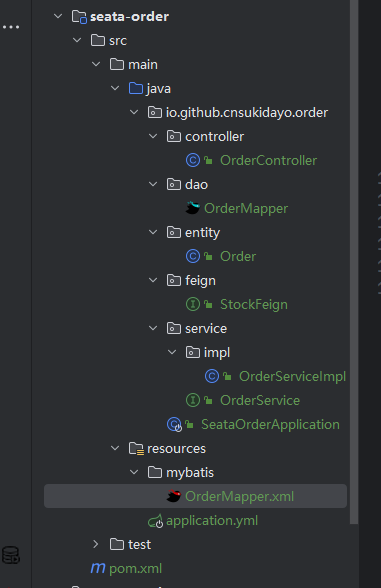  

7.编辑seata-stock模块  

7.1 创建controller  
```java
@RestController
@RequestMapping("/api/stock")
public class StockController {

    private final StockService stockService;

    public StockController(StockService stockService) {
        this.stockService = stockService;
    }

    @GetMapping("reduce/{productId}")
    public void reduce(@PathVariable("productId") Integer productId) {
        stockService.reduce(productId);
    }
}
```

7.2 创建service  
```java
public interface StockService {
    void reduce(Integer productId);
}
```
对应的实现  
```java
@Service
public class StockServiceImpl implements StockService {

    private final StockMapper stockMapper;

    public StockServiceImpl(StockMapper stockMapper) {
        this.stockMapper = stockMapper;
    }

    @Override
    public void reduce(Integer productId) {
        stockMapper.reduce(productId);
    }
}
```

7.3 创建entity  
```java
public class Stock {

    private Integer id;
    private Integer productId;
    private Integer count;
    // 提供getter/setter
}
```

7.4 创建dao  
```java
@Mapper
public interface StockMapper {
    void reduce(@Param("productId") Integer productId);
}
```

7.5 创建mapper  
```xml
<?xml version="1.0" encoding="UTF-8"?>
<!DOCTYPE mapper PUBLIC "-//mybatis.org//DTD Mapper 3.0//EN" "http://mybatis.org/dtd/mybatis-3-mapper.dtd">
<mapper namespace="io.github.cnsukidayo.stock.dao.StockMapper">
    <select id="reduce">
        update stock_tbl
        set count = count - 1
        where product_id = #{productId}
    </select>
</mapper>
```

**seata-stock模块最终效果大致如下:**  
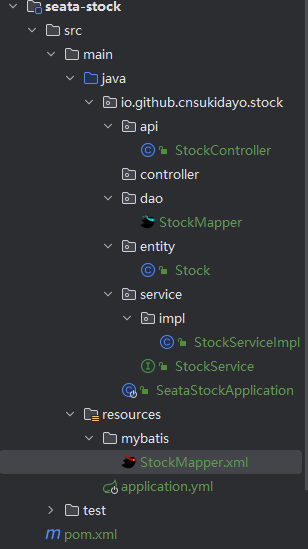  

### 6.4 seata实现分布式事务
*提示6.4节的内容基于6.3的环境*  

1.添加seata依赖  
```xml
<dependency>
    <groupId>com.alibaba.cloud</groupId>
    <artifactId>spring-cloud-starter-alibaba-seata</artifactId>
</dependency>
```

2.为每个微服务的数据库添加undo_log表  
这里为seata-order和seata-stock数据库添加该表  
该表的SQL定义:[https://github.com/apache/incubator-seata/blob/1.3.0/script/client/at/db/mysql.sql](https://github.com/apache/incubator-seata/blob/1.3.0/script/client/at/db/mysql.sql)  
[点击预览undo_log.sql](resources/springcloud/undo_log.sql)  
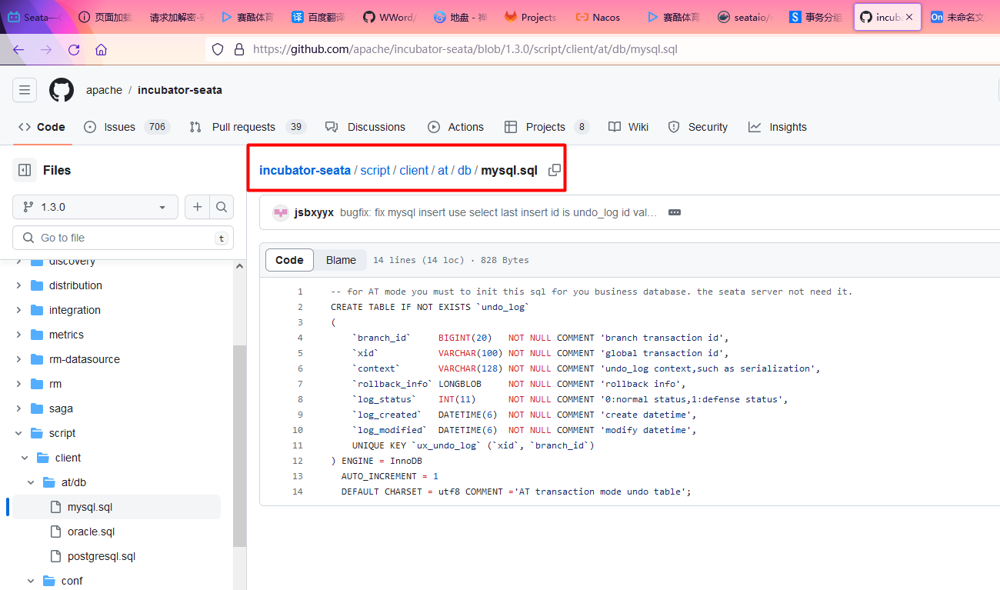  

3.配置事务分组  
事务分组详情见:6.2 seata基本环境搭建=>6.创建config.txt配置文件=>事务分组与高可用  
<font color="#00FF00">当时配置的事务分组是guangzhou</font>  

修改两个子模块的yml配置文件添加如下内容:  
```yml
spring:
  application:
    alibaba:
      seata:
        # 设置事务分组为guangzhou
        tx-service-group: guangzhou
```

还有另外一种配置方法是放到seata下面配置,正好和下面的第4步配置对应起来,这种配置方式好一点  
```yml
seata:
  # 设置事务分组为guangzhou
  tx-service-group: guangzhou
  service:
    # vgroup-mapping是一个Map
    vgroup-mapping:
      # key为分组事务名,value就是之前在6.2 seata基本环境搭建=>7.将config.txt配置文件推送到nacos中配置的value
      guangzhou: default
```

4.配置seata服务  
因为微服务需要与seata服务进行通讯才能完成分布式事务,而seata又是注册在nacos中的,所以这里需要配置当前微服务要与nacos中配置的哪个seata服务通讯  
<font color="#00FF00">此外这里还需要配置seata的配置中心</font>
之前在6.2 seata基本环境搭建=>7.将config.txt配置文件推送到nacos 推送到nacos的配置中一部分是seata服务的配置,还有一部分是seata客户端的配置

```yml
seata:
  registry:
    # 表明seata服务注册在nacos中,因为seata可以注册在很多不同的注册中心
    type: nacos
    nacos:
      # 配置nacos的地址(这里不要混淆,虽然上面已经配置过nacos的地址了,不代表这里不用配置;想想如果seata注册在zookpeer中呢?)
      # 上面配置的nacos是当前服务要注册到的注册中心的地址
      server-addr: 192.168.149.131:8870
      # seata在nacos中注册的名称(可以在nacos控制面板->服务列表里看到)
      application: seata-server
      # group: SEATA_GROUP 配置seata的group
      username: nacos
      password: nacos
  config:
    type: nacos
    nacos:
      server-addr: 192.168.149.131:8870
      username: nacos
      password: nacos
      # group: SEATA_GROUP 这里分分组配置要注意,有可能不是默认值
```

5.修改@Transaction注解为@GlobalTransaction注解  
修改OrderServiceImpl中的add方法如下  
```java
@GlobalTransactional
@Override
public void add(Order order) {
    orderMapper.insert(order);
    stockFeign.reduce(order.getProductId());
    int i  = 1 / 0;
}
```

6.测试运行  
访问:[http://localhost:8081/api/order/add/100](http://localhost:8081/api/order/add/100)  
控制台打印除零异常,查看数据库发现没有插入订单也没有更新库存,成功yes!  
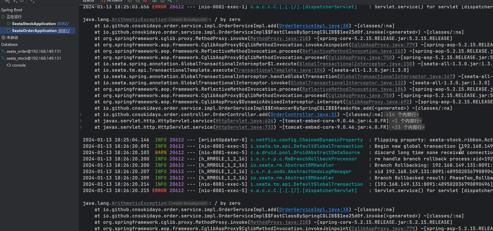  

*注意这里有很多坑,如果出现读取不到nacos中服务的问题,有可能是group和nacos中配置的不一样,一定要注意观察对应nacos中的配置*

### 6.5 seata原理
在seata架构中一共有三个角色  
* 事务协调者(TC):维护全局和分支事务的状态,驱动全局事务提交或回滚
* 事务管理器(TM):定义全局事务的范围,开始全局事务、提交或回滚全局事务
* 资源管理器(RM):管理分支事务处理的资源,与TC交谈以注册分支事务和报告分支事务的状态,并驱动分支事务提交或回滚

1.分布式事务流程概述  
1.1 TM事务管理器请求TC事务协调者开启一个全局事务,TC事务协调者会生成一个XID作为全局事务的编号,XID会在微服务的调用链路中传播,保证<font color="#00FF00">多个微服务的子事务</font>关联在一起
1.2 RM资源管理器请求TC事务协调者将本地事务注册为全局事务的分支事务,通过全局事务的XID进行关联
1.3 TM事务管理器请求TC告诉XID对应的全局事务进行提交还是回滚
1.4 TC事务协调者驱动RM资源管理器们将XID对应的本地事务进行提交还是回滚  

2.流程图  
 

3.seata的三张表  
之前说过seata数据库一共有三张表分别为:<font color="#00FF00">global_table、lock_table、branch_table</font>  

* global_table:全局事务表,每一个全局事务都会在该表中生成一条记录
* branch_table:分支事务表,每一个分支事务都会在改表中生成一条记录
  什么时候生成,当微服务A执行了一条SQL后就会生成一条记录
* lock_table:锁表,也就是在插入记录后会生成的<font color="#00FF00">行锁</font>信息
  通过该表可以完成事务与事务之间的隔离,有点像MVCC

4.undo_log  
在每个数据库还存在一张undo_log表;详情见6.4 seata实现分布式事务=>2.为每个微服务的数据库添加undo_log表  
实际上<font color="#00FF00">before_image和after_image</font>信息就存放在这张表的<font color="#00FF00">rollback_info</font>字段下  
执行如下SQL来观察这些信息  
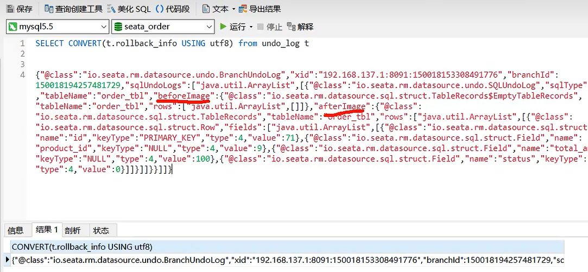  
<font color="#00FF00">通过此元数据就可以逆向生成SQL来执行回滚操作</font>  


## 7.网关

*注意:这里顺序乱了,这里还需要把P60看一下*

**目录:**  
7.1 网关基本介绍  
7.2 gateway基本环境搭建  
7.3 gateway整合nacos  
7.4 gateway路由断言工厂  
7.5 gateway过滤器工厂  
7.6 gateway整合sentinel  
7.7 nginx整合gateway  


### 7.1 网关基本介绍
**痛点:**  
* 每个业务都会需要鉴权、限流、权限校验、跨域等逻辑;可以使用网关将这部分内容抽离出来放到统一的地方完成(也就是网关的功能)
* 网关提供了流量的统一入口

所以网关提供了哪些功能?可以参考<font color="#00FF00">kong</font>笔记  

1.gateway基本介绍  
Spring Cloud Gateway是由<font color="#00FF00">WebFlux + Netty + Reactor</font>实现的响应式的API网关,它不能再传统的servlet容器中使用,也不能构成成war包

2.gateway特点  
* 动态路由,能够匹配任意请求属性
* 支持路径重写
* 集成SpringCloud的服务发现功能(nacos、eruka)
* 可集成流控降级功能(sentinel、hystrix)
* 可以对路由指定易于编写的Predicate(断言)和Filter(过滤器)

3.核心概念
* 路由:路由是网关中最基础的部分,路由信息包括一个ID、一个目的URI、一组断言工厂、一组filter组成;如果断言为真,则说明请求的URL和配置的路由匹配
* 断言:Java8中的断言函数,断言函数类型是Spring5框架中的ServerWebExchange,断言函数允许开发者去定义匹配Http request中的任何信息,比如<font color="#00FF00">请求头、参数、cookie</font>等
* 过滤器:SpringCloudGateway分为<font color="#00FF00">Gateway Filter和Global Filter</font>,Filter可以对请求和响应进行处理

4.Spring Cloud Gateway工作原理  
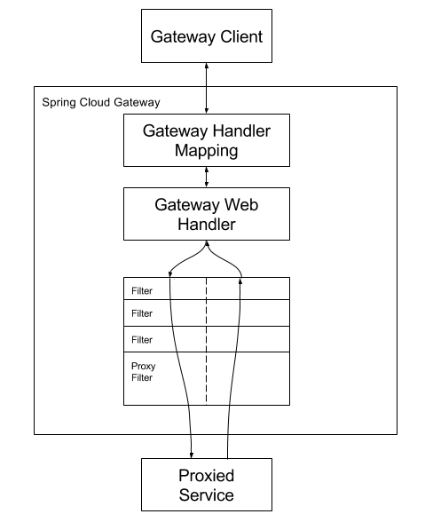  
客户端向Spring Cloud Gateway发出请求.如果映射器(Gateway Handler Mapping)确定请求与路由匹配(断言匹配),则将其发送到网关Web处理程序(Gateway Web Handler).Web处理程序通过特定的过滤链来处理该请求,过滤器被虚线分割的原因是过滤器可以在发送代理请求之前和之后运行逻辑.所有pre过滤器先执行,然后执行代理过滤器(proxy filter),代理过滤器请求完成后,执行post过滤器  

个人总结:<font color="#00FF00">一个请求过来时会扫描所有<font color="#FF00FF">断言工厂</font>,断言匹配的会转发到对应的<font color="#FF00FF">路由</font>,在路由之前会经过一系列的<font color="#FF00FF">过滤器</font></font>  

### 7.2 gateway基本环境搭建
1.创建gateway模块  

2.修改pom文件  
```xml
<dependency>
    <groupId>org.springframework.cloud</groupId>
    <artifactId>spring-cloud-starter-gateway</artifactId>
</dependency>
```

3.创建主启动类  
```java
@SpringBootApplication
public class GatewayApplication {
    public static void main(String[] args) {
        SpringApplication.run(GatewayApplication.class, args);
    }
}
```

4.编写yml配置文件 
```yml
server:
  port: 8088
spring:
  application:
    name: api-gateway
  cloud:
    gateway:
      # 路由规则
      routes:
        - id: order-openfeign #路由的唯一标识,一般写成微服务名称
          uri: http://localhost:8081 # 需要转发的地址
          # 断言规则,用于路由规则的匹配
          predicates:
            - Path=/order-openfeign/** # 访问http://localhost:8088/order-openfeign/api/hello/ping
          # 过滤规则
          filters:
            - StripPrefix=1 # 会转发到 http://localhost:8081/api/hello/ping 接口(通过这里的过滤器实现,转发之前去掉第一层路径)
        # - id: service-stock 可以配置多个
```

5.编写order-openfeign模块  
因为这里转发到了order-openfeign模块模块,所以这里需要编写/api/hello/ping这个接口,内容如下  
```java
@RestController
@RequestMapping("/api/hello")
public class HelloController {

    @GetMapping("ping")
    public String ping() {
        return "pong";
    }
}
```

6.启动运行  
启动gateway和order-openfeign模块,访问地址:[http://localhost:8088/order-openfeign/api/hello/ping](http://localhost:8088/order-openfeign/api/hello/ping)  

### 7.3 gateway整合nacos
1.问题  
上面的gateway在路由order-openfeign这个微服务的时候使用的是写死的地址,弊端就是一旦远程微服务的地址改变了就很不好;所以这里要整合nacos,<font color="#00FF00">需要把目标路由的微服务地址动态变换</font>  

2.添加gateway模块的pom依赖  
```xml
<!--nacos服务注册与发现-->
<dependency>
    <groupId>com.alibaba.cloud</groupId>
    <artifactId>spring-cloud-starter-alibaba-nacos-discovery</artifactId>
</dependency>
```

3.修改gateway模块的yml  
将当前gateway注册到nacos中,并且修改转发的目标URI;将http改为lb代表转发时使用<font color="#00FF00">负载均衡</font>;将地址改成<font color="#00FF00">目标服务的服务名</font>即可  
*提示:这里lb使用的是nacos的<font color="#00FF00">本地</font>负载均衡策略,nacos的负载均衡策略是通过ribbon完成的*
*提示:将地址改为<font color="#00FF00">目标服务名</font>就可以进行路由,本质上是通过全局过滤器进行实现的*
```yml
server:
  port: 8088
spring:
  application:
    name: api-gateway
  cloud:
    nacos:
      discovery:
        server-addr: 192.168.230.128:8870
        username: naocs
        password: nacos
    gateway:
      discovery:
        locator:
          enabled: true # 当使用nacos的时候就不需要配置断言、路由了,nacos会自动将服务名作为前缀;不过这种方式并不常用
```

4.启动测试  
访问地址:[http://localhost:8088/order-openfeign/api/hello/ping](http://localhost:8088/order-openfeign/api/hello/ping) 

### 7.4 gateway路由断言工厂
**目录:**  
7.4.1 内置路由断言工厂  
7.4.2 自定义路由断言工厂  


#### 7.4.1 内置路由断言工厂
**解释:**  
路由断言工厂就是断言,当请求gateway的时候会使用断言对当前的请求进行匹配,如果匹配成功就路由转发,如果匹配失败就404  
内置断言工厂就是gateway内置的一批断言规则  
所有的断言工厂可以参照官网:[https://docs.spring.io/spring-cloud-gateway/reference/spring-cloud-gateway/request-predicates-factories.html](https://docs.spring.io/spring-cloud-gateway/reference/spring-cloud-gateway/request-predicates-factories.html)  

**规则大全:**  
注意这里面的很多规则都是支持正则匹配的,而不但但是字符串的匹配  
* `- Path=/red/{segment},/blue/{segment}` 路径匹配,多个路径使用逗号,隔开
* `- After=2017-01-20T17:42:47.789-07:00[America/Denver]` 当前请求的时间必须在该时间之后
* `- Before=2017-01-20T17:42:47.789-07:00[America/Denver]` 当前请求的时间必须在该时间之前
* `- Between=2017-01-20T17:42:47.789-07:00[America/Denver], 2017-01-21T17:42:47.789-07:00[America/Denver]` 当前请求的时间必须在该之间段内
* `- Cookie=chocolate, regular` 必须携带name为chocolate的cookie,并且cookie的value必须与regular正则表达式匹配
* `- Header=X-Request-Id, \d+` 必须携带key为X-Request-Id的请求头,并且请求头的value必须与后面的正则表达式匹配(这里是\d+正则表达式)
* `- Host=**.somehost.org,**.anotherhost.org` 请求头的Host的value值必须为**.somehost.org或者**.anotherhost.org
* `- Method=GET,POST` 请求的方法类型必须为GET或POST
* `- Query=color,red.` 请求时必须携带请求参数color,如果不需要限定值是什么就不写逗号后面的内容,如果需要限制值是什么也是支持正则表达式的(例如这里的值可以是red.)
* `- RemoteAddr=192.168.1.1/24` 请求地址
* 权重工厂
  ```yml
  spring:
  cloud:
    gateway:
      routes:
      - id: weight_high
        uri: https://weighthigh.org
        predicates:
        - Weight=group1, 8
      - id: weight_low
        uri: https://weightlow.org
        predicates:
        - Weight=group1, 2
  ```
  在这种配置规则下会把80%的流量转发给https://weighthigh.org ,而把20%的流量转发给https://weightlow.org  
  <font color="#00FF00">通过权重工厂就可以实现灰度发布,蓝绿发布</font>
* `- XForwardedRemoteAddr=192.168.1.1/24` 请求头必须携带该请求参数

1.演示  
```yml
server:
  port: 8088
spring:
  application:
    name: api-gateway
  cloud:
    nacos:
      discovery:
        server-addr: 192.168.230.128:8870
        username: naocs
        password: nacos

    gateway:
      # 路由规则
      routes:
        - id: order-openfeign #路由的唯一标识,一般写成微服务名称
          uri: lb://order-openfeign # 需要转发的服务名
          # 断言规则,用于路由规则的匹配
          predicates:
            # 因为没有过滤器参数,此时请求/api/hello前缀时就会匹配order-openfeign服务
            - Path=/api/hello/**
            - Query=color,green
```

访问接口:[http://localhost:8088/api/hello/ping?color=green](http://localhost:8088/api/hello/ping?color=green) 发现成功,如果把请求参数改一下就会404  


#### 7.4.2 自定义路由断言工厂
通过参照内置的断言工厂来实现自定义的断言工厂  
断言工厂需要满足以下几个条件:  
* 必须添加到Spring容器中
* 命名格式必须是<font color="#FF00FF">xxxRoutePredicateFactory</font>,因为底层是通过反射来获取类名之后可以在配置文件中编写
  例如QueryRoutePredicateFactory反射会读取到Query,那么在gateway的配置项predicates中就可以使用-Query来指定内容了
* 必须继承自AbstractRoutePredicateFactory
* 必须在当前类中编写一个静态的内部类Config,该内部类就是用于接收在yml中对predicates进行配置的配置信息的
  必须声明getter/setter方法
  并且属性名也是有讲究的,在yml中指定参数时,一个逗号就代表一个参数;假设QueryRoutePredicateFactory有两个条件(分别是key-color和value-green),那么内部类就必须有key和value这两个参数来映射它们对应的值,所以在实现shortcutFieldOrder方法的时候就要对应顺序  
  shortcutFieldOrder方法返回一个字符串List,List中存放的内容必须要指定为Config类中参数的名称,并且在赋值时候会按照List中指定的参数顺序进行赋值(看不懂就看下面的例子吧)
  例如List返回值为["key","value"]则代表将-Query=color,green的color赋值给Config类中的key属性,将greent赋值给Config类中的value属性
  - - -
  比如在QueryRoutePredicateFactory类中就有一个Config类,它就是用于接收例如上面的color和green这两个参数的

1.实现自已的断言工厂  
**需求:**  
实现一个CheckAuth的断言工厂,只要yml的predicates配置的内容为admin则断言成功,这个需求和前端没有什么交互  
```java
@Component
public class CheckAuthRoutePredicateFactory extends AbstractRoutePredicateFactory<CheckAuthRoutePredicateFactory.Config> {

    public static final String NAME = "name";

    public CheckAuthRoutePredicateFactory(Class<Config> configClass) {
        super(configClass);
    }

    @Override
    public Predicate<ServerWebExchange> apply(CheckAuthRoutePredicateFactory.Config config) {
        return new GatewayPredicate() {
            @Override
            public boolean test(ServerWebExchange exchange) {
                // 如果指定的值为admin就返回true,否则返回false
                return config.getName().equals("admin");
            }

        };
    }

    @Override
    public List<String> shortcutFieldOrder() {
        return Arrays.asList(NAME);
    }

    /**
     * 用于接收yml配置文件中的断言信息的
     */
    @Validated
    public static class Config {

        private String name;

        public String getName() {
            return name;
        }

        public void setName(String name) {
            this.name = name;
        }
    }   
}
```

2.修改yml配置文件  
```yml
server:
  port: 8088
spring:
  application:
    name: api-gateway
  cloud:
    nacos:
      discovery:
        server-addr: 192.168.230.128:8870
        username: naocs
        password: nacos

    gateway:
      routes:
        - id: order-openfeign 
          uri: lb://order-openfeign
          predicates:
            - Path=/api/hello/**
            - Query=color,green
            - CheckAuth=admin
```

3.测试运行  
当yml配置文件中CheckAuth的值指定为admin时则可以访问,否则显示404  
访问接口:[http://localhost:8088/api/hello/ping](http://localhost:8088/api/hello/ping)

### 7.5 gateway过滤器工厂
*提示:过滤器工厂和路由断言工厂非常相似*  
**目录:**  
7.5.1 内置过滤器  
7.5.2 自定义过滤器  
7.5.3 全局过滤器  

#### 7.5.1 内置过滤器
**解释:**  
过滤器允许修改传入的HTTP请求或响应  
内置过滤器就是gateway内置的一批过滤器  
所有的过滤器可以参照官网:[https://docs.spring.io/spring-cloud-gateway/reference/spring-cloud-gateway/gatewayfilter-factories.html](https://docs.spring.io/spring-cloud-gateway/reference/spring-cloud-gateway/gatewayfilter-factories.html)  
官网这里一共有31个过滤器  

**规则大全:**  
* `-AddRequestHeader=X-Request-Red, Blue-{segment}` 添加请求头
* `-PrefixPath=/mypath` 转发的时候添加请求前缀
* `- RedirectTo=302, https://baidu.com/` 重定向到百度

#### 7.5.2 自定义过滤器
* 必须添加到Spring容器中
* 命名格式必须是<font color="#FF00FF">xxxGatewayFilterFactory</font>
* 必须继承自AbstractNameValueGatewayFilterFactory
* 如果有Config的需求可以添加Config内部类,<font color="#00FF00">Config类不是必须的</font>  
  Config类的使用效果和之前路由断言工厂一模一样


1.创建自定义过滤器  
**需求:**  
在请求的时候如果有请求参数name=admin就能访问,否则不允许访问  
*提示:这里的需求用断言也可以实现,这里就是演示一下自定义过滤器*
```java
@Component
public class CheckAuthGatewayFilterFactory extends AbstractGatewayFilterFactory<CheckAuthGatewayFilterFactory.Config> {

    public static final String VALUE = "value";

    public CheckAuthGatewayFilterFactory() {
        super(CheckAuthGatewayFilterFactory.Config.class);
    }

    @Override
    public List<String> shortcutFieldOrder() {
        return Arrays.asList(VALUE);
    }

    @Override
    public GatewayFilter apply(CheckAuthGatewayFilterFactory.Config config) {
        return new GatewayFilter() {
            @Override
            public Mono<Void> filter(ServerWebExchange exchange, GatewayFilterChain chain) {
                // 获取请求参数,如果不等于value值就失败,否则就正常访问
                String name = exchange.getRequest().getQueryParams().getFirst("name");
                if (config.getValue().equals(name)) {
                    return chain.filter(exchange);
                }else {
                    // 如果错误就设置状态码为404
                    exchange.getResponse().setStatusCode(HttpStatus.NOT_FOUND);
                    exchange.getResponse().setComplete();
                }
                return chain.filter(exchange);
            }
        };
    }


    public static class Config {
        private String value;

        public String getValue() {
            return value;
        }

        public void setValue(String value) {
            this.value = value;
        }
    }
}
```

2.修改yml配置文件  
```yml
server:
  port: 8088
spring:
  application:
    name: api-gateway
  cloud:
    nacos:
      discovery:
        server-addr: 192.168.230.128:8870
        username: naocs
        password: nacos

    gateway:
      # 路由规则
      routes:
        - id: order-openfeign
          uri: lb://order-openfeign
          predicates:
            - Path=/api/hello/**
          filters:
            - CheckAuth=admin
```

3.测试运行  
当yml配置文件中CheckAuth的值指定为admin时则可以访问,否则显示404  
访问接口:[http://localhost:8088/api/hello/ping?name=admin](http://localhost:8088/api/hello/ping?name=admin)


#### 7.5.3 全局过滤器
*提示:内置过滤器和自定义过滤器都是针对单个路由生效的,而全局过滤器是针对所有路由都生效*  

1.内置全局过滤器  
*提示:同理SpringCloudGateway也是内置了一批全局的过滤器*  
* `LoadBalancerClientFilter`:通过负载均衡客户端根据路由的URL解析转换为真实的请求URL
* `NettyRoutingFilter`:通过HttpClient客户端转发请求真实的URL并将响应写入到当前请求的响应中
* `NettyWriteResponseFilter`:同上
* `WebSocketRoutingFilter`:负责处理WebSocket类型的请求响应信息
* `ForwardPathFilter`:解析路径,并将路径转发
* `RouteToRequestUrlFilter`:转换路由中的URL
* `WebClienHttpRoutingFilter`:通过WebClient客户端发请求真实的URL并将响应信息写入到当前的请求响应中
* `WebClientWriteResponseFilter`:同上

2.自定义全局过滤器  
这里编写一个日志过滤器  
```java
@Component
public class LogFilter implements GlobalFilter {

    private final Logger logger = LoggerFactory.getLogger(LogFilter.class);

    @Override
    public Mono<Void> filter(ServerWebExchange exchange, GatewayFilterChain chain) {
        logger.info(exchange.getRequest().getPath().value());
        return chain.filter(exchange);
    }
}
```

3.跨域请求配置  
```yml
spring:
  cloud:
    gateway:
      globalcors:
        cors-configurations:
          '[/**]': # 允许跨域访问的资源
            allowedOrigins: "https://docs.spring.io" # 跨域允许的来源,一般配置为公司的域名即已知的来源,例如 jdd.com
            allowedMethods:
            - GET
```
* `allowedOrigins`:跨域允许的来源,一般配置为公司的域名即已知的来源,例如 jdd.com

还可以针对<font color="#00FF00">路由级别</font>进行跨域请求的配置(摘自官网):  
```yml
spring:
  cloud:
    gateway:
      routes:
      - id: cors_route
        uri: https://example.org
        predicates:
        - Path=/service/**
        metadata:
          cors
            allowedOrigins: '*'
            allowedMethods:
              - GET
              - POST
            allowedHeaders: '*'
            maxAge: 30
```

4.跨域请求代码方式  
```java
@Configuration
public class CorsConfig {
    @Bean
    public CorsWebFilter corsWebFilter() {
        CorsConfiguration corsConfiguration = new CorsConfiguration();
        corsConfiguration.addAllowedMethod("*");
        corsConfiguration.addAllowedOrigin("*");
        corsConfiguration.addAllowedHeader("*");
        UrlBasedCorsConfigurationSource source = new UrlBasedCorsConfigurationSource();
        source.registerCorsConfiguration("/**",corsConfiguration);
        return new CorsWebFilter(source);
    }
}
```

### 7.6 gateway整合sentinel  
**目录:**  
7.6.1 gateway整合sentinel基本环境搭建  
7.6.2 gateway整合sentinel详细配置  


#### 7.6.1 gateway整合sentinel基本环境搭建
1.添加gateway模块的依赖  
```xml
<!--gateway整合sentinel-->
<dependency>
    <groupId>com.alibaba.cloud</groupId>
    <artifactId>spring-cloud-alibaba-sentinel-gateway</artifactId>
</dependency>
<!--sentinel依赖-->
<dependency>
    <groupId>com.alibaba.cloud</groupId>
    <artifactId>spring-cloud-starter-alibaba-sentinel</artifactId>
</dependency>
```

2.修改yml配置文件  
*提示:这里gateway转发的服务还是order-openfeign*  
```yml
server:
  port: 8088
spring:
  application:
    name: api-gateway
  cloud:
    nacos:
      discovery:
        server-addr: 192.168.230.128:8870
        username: naocs
        password: nacos

    gateway:
      # 路由规则
      routes:
        - id: order-openfeign
          uri: lb://order-openfeign
          predicates:
            - Path=/api/hello/**

    # 配置sentinel-控制台
    sentinel:
      transport:
        dashboard: 192.168.230.128:8858
```

3.修改主启动类  
```java
@SpringBootApplication
public class GatewayApplication {
    public static void main(String[] args) {
        // 添加上这一行,否则有时可能sentinel不能识别gateway;因为sentinel为gateway提供了特殊的API
        System.setProperty("csp.sentinel.app.type", "1");
        SpringApplication.run(GatewayApplication.class, args);
    }
}
```

4.启动访问接口,查看sentinel  
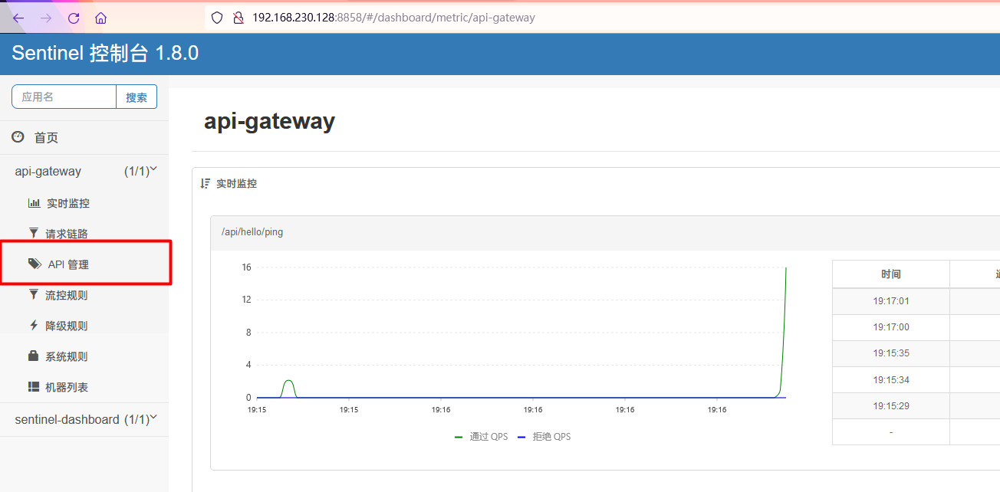  
可以看到左侧的菜单栏也发生了变化,这是因为sentinel为gateway单独提供了不一样的设置

#### 7.6.2 gateway整合sentinel详细配置
1.打开流控面板  
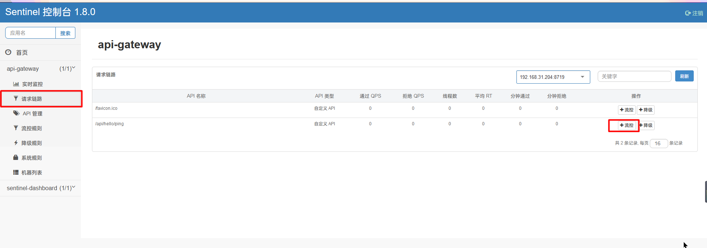  
点击左侧的API管理->流控 会打开不一样的gateway专享流控面板  
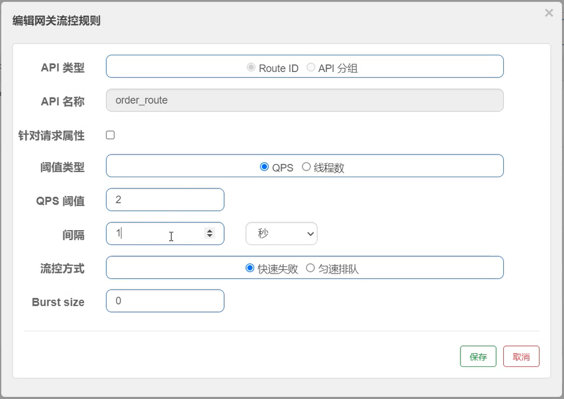  

* QPS:按照QPS进行限流
* QPS阈值:在规定的时间<font color="#00FF00">间隔</font>内达到阈值后会限流
* 间隔:同上
* 流控方式:快速失败和匀速排队(这两个效果和之前一样)
* Burst Size:宽容次数,假设这里该值设置为1;则1s请求3次以上才会进行限流

2.勾选请求属性  
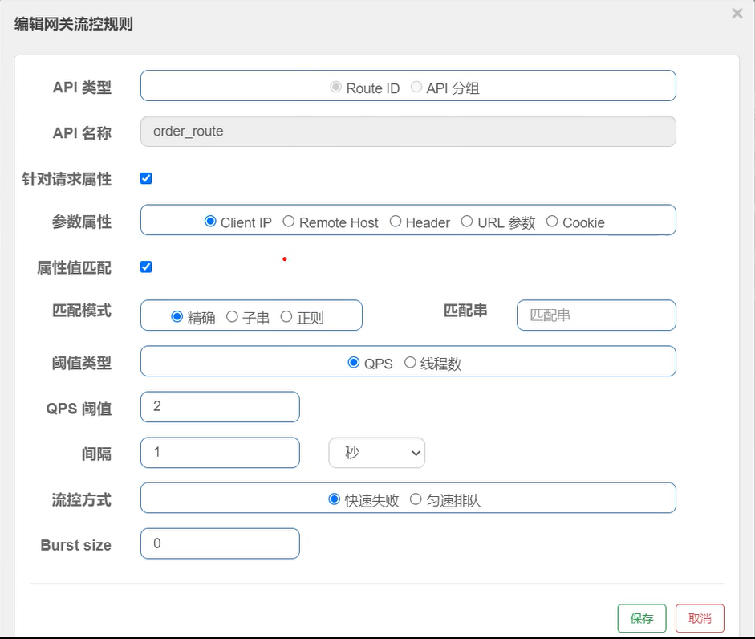  
<font color="#00FF00">请求属性:就类似之前gateway的断言,当有流量进来时要进行断言匹配,<font color="#FF00FF">匹配成功的才会触发流控</font></font>

* Client IP:限制请求IP
* Remote Host:远程主机
* Header:请求头
* URL参数:请求参数
* Cookie:Cookie

假设这里设置Client IP为127.0.0.1,<font color="#00FF00">那么只有当虚拟机访问该接口时才会触发流控</font>,如果使用外面的Windows宿主机则不会触发流控(因为IP不是127.0.0.1)  

3.API管理  
*提示:上述方式是对路由进行流控,粒度是比较细的,如果需要对一组API进行管理就可以使用左侧*
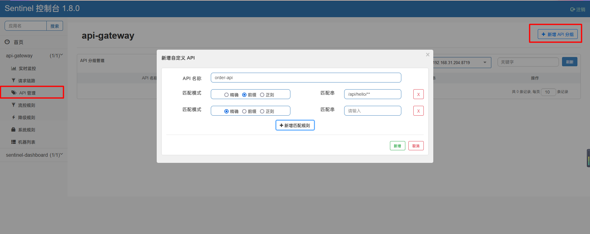  
可以看到这种管理方式是比较灵活的,它支持三种匹配模式:精确、前缀、正则;并且支持多个匹配模式,通过这种方式来一次性管理多个API  
点击新增后就可以看到API分组了,接着来到流控规则就可以对刚才的API分组进行流控了  

4.自定义降级方法  
*提示:同理现在的降级方法都是sentinel默认的,现在需要自定义降级方法*
详情见:5.4.1 流控规则=>5.统一降级信息返回结果  
```java
@Configuration
public class GatewayConfig {
    @PostConstruct
    public void init(){
        BlockRequestHandler blockRequestHandler = new BlockRequestHandler() {
            @Override
            public Mono<ServerResponse> handleRequest(ServerWebExchange exchange, Throwable t) {
                // 自定义异常处理
                return ServerResponse.status(HttpStatus.OK)
                        .contentType(MediaType.APPLICATION_JSON)
                        .body(BodyInserters.fromValue("降级了!"));
            }
        };
        WebFluxCallbackManager.setBlockHandler(blockRequestHandler);
    }
}
```

### 7.7 nginx整合gateway
**解释:** 
为了保障网关的高可用还必须对网关进行集群,所以在最外层还需要使用NGINX做反向代理  
详情见:附录=>1.微服务基本概念介绍=>1.1 微服务基本概念介绍=>5.微服务架构

## 8.链路追踪
**目录:**  
8.1 skywalking基本环境搭建  
8.2 skywalking接入微服务  
8.3 使用MySQL持久化skywalking  
8.4 自定义链路追踪  
8.5 日志  
8.6 告警  
8.7 skywalking更多功能  


### 8.1 skywalking基本环境搭建
1.skywalking介绍  
skywalking是一个国产的开源框架,是分布式系统应用程序的<font color="#00FF00">性能监视工具</font>,转为微服务、云原生架构和基于容器架构(Docker、K8S、mesos;mesos是大数据相关的)而设计,包括了<font color="#00FF00">分布式追踪、性能指标分析、应用和服务依赖分析</font>等功能  
[Github](https://github.com/apache/skywalking)  
[skywalking官网](https://skywalking.apache.org/)  
[Docker](https://hub.docker.com/r/apache/skywalking-oap-server)  
[中文文档(社区版)](https://skyapm.github.io/document-cn-translation-of-skywalking/)  
[agent历史版本下载](https://archive.apache.org/dist/skywalking/)  

2.skywalking特点  
* 埋点方式:无侵入,字节码增强
* 支持语言:Java/.net/NodeJs/php/go
* 支持APM(Application Performance Managment)
* 支持webflux
* 存储机制:H2、ES、MySQL
* 高性能,相较于Zipkin和PinPoint这类链路追踪框架,skywalking的性能是最好的  
  PinPoint是棒子开发的,很垃圾
* 通过Java探针(Agent)方式进行增强

3.skywalking部署概念介绍  
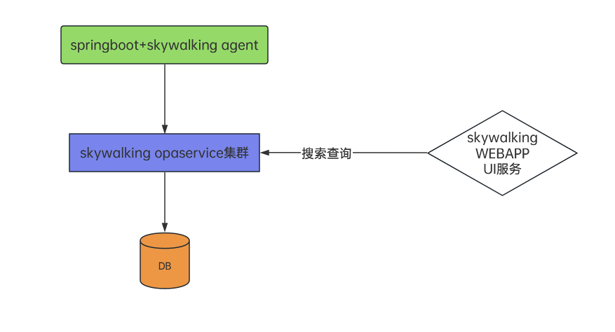  
* skywalking agent负责与业务系统绑定在一起,负责手机各种监控数据
* skywalking oapservice是负责处理数据监控的,比如接收skywalking agent的监控数据并存储在数据库中;接受并处理skywalking webapp的前端请求;skywalking opaservice通常以<font color="#00FF00">集群</font>的方式存在
* skywalking webapp前端界面用于展示数据
* 用于存储监控数据的数据库,MySQL/ES

4.部署skywalking opaservice  
4.1 启动docker容器  
```shell
docker run \
--name skywalking-oap \
-d apache/skywalking-oap-server:8.5.0-es7
```

4.2 创建目录  
`mkdir -p ~/software/skywalking/config`

4.3 拷贝配置文件  
`docker cp [containerId]:/skywalking/config ~/software/skywalking/`  

4.4 删除容器  
```shell
docker stop [containerId]
docker rm [containerId]
```

4.5 重启容器  
```shell
docker run \
-p 1234:1234 \
-p 11800:11800 \
-p 12800:12800 \
--name skywalking-oap \
-v ~/software/skywalking/config:/skywalking/config \
-d apache/skywalking-oap-server:8.5.0-es7
```
**解释:**
* `-p 11800:11800` 用于接收agent微服务数据的
* `-p 12800:12800` 用于接收web前端的访问请求


5.部署
5.1 启动容器  
```shell
docker run --name oap-ui \
-p 8090:8080 \
-e SW_OAP_ADDRESS=http://192.168.149.131:12800 \
-d apache/skywalking-ui:8.5.0
```

**解释:**  
* `-e SW_OAP_ADDRESS=http://192.168.149.131:12800` oap服务的地址

6.启动测试  
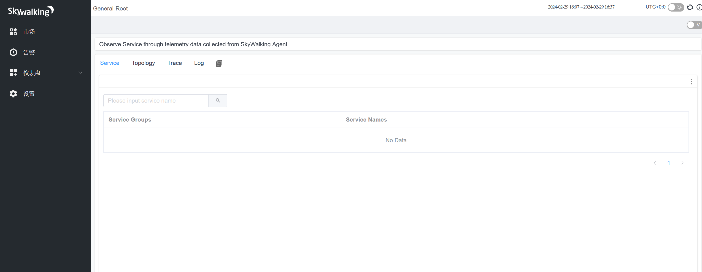  

### 8.2 skywalking接入微服务
**目录:**  
8.2.1 skywalking接入单个微服务  
8.2.2 skywalking接入多个微服务  

#### 8.2.1 skywalking接入单个微服务
1.下载agent包  
打开8.1节介绍的agent下载地址,下载对应版本的apm包,注意在高版本agent单独拆分下来了不需要再下载apm包了,而是直接去官网上下载  
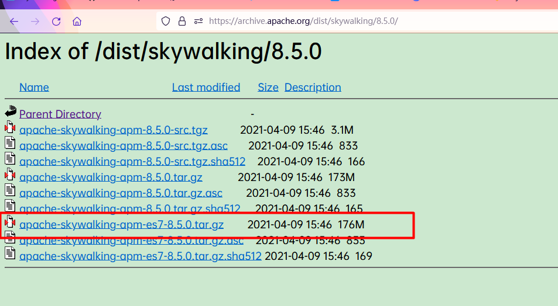  
找到agent路径下的agent包即可  
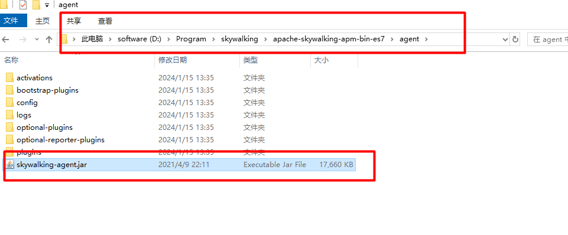  

2.添加启动参数  
之前说过skywalking是以探针的方式无侵入来进行管控的,所以在启动的时候需要指定agent参数来让它引用skywalking-agent.jar  
这里以order-openfeign模块为例进行演示,编辑gateway启动配置添加如下内容  
```shell
# 填入agent地址
-javaagent:/path/to/skywalking-agent.jar
# 在skywalking上显示的名称
-DSW_AGENT_NAME=api-service
# 填入agent服务oap地址
-DSW_AGENT_COLLECTOR_BACKEND_SERVICES=192.168.149.131:11800
```

这里有大坑,无法直接监控gateway服务,需要安装插件;但是又没有找到如何在docker环境下安装插件的方法  

3.启动运行  
成功显示监控画面  
  


#### 8.2.2 skywalking接入多个微服务
1.skywalking接入多个微服务实际上就是在每个微服务添加agent  


### 8.3 使用MySQL持久化skywalking
skywalking默认是把数据放在内存中的,一旦服务重启后数据就会丢失,并且随着运行时间的变长内存就也会爆满  

1.备份配置文件
进入~/software/skywalking/config文件夹,备份application.yml配置文件  


2.修改application.yml配置文件  
进入~/software/skywalking/config文件夹,修改application.yml配置文件  
```yml
storage:
  selector: ${SW_STORAGE:mysql}
    mysql:
    properties:
      jdbcUrl: ${SW_JDBC_URL:"jdbc:mysql://192.168.230.128:7901/swtest"}
      dataSource.user: ${SW_DATA_SOURCE_USER:root}
      dataSource.password: ${SW_DATA_SOURCE_PASSWORD:sukidayo}
```

3.新建数据库  
来到Navicat新建上面的数据库swtest  

4.将mysql-connector-java-8.0.25.jar驱动复制到容器的ext-libs目录下  
**解释:**  
这里如果直接重启会报错没有驱动,所以这里先把启动复制到虚拟机中,如果没有驱动就从本地的Maven仓库中找一个驱动(反之是通用的);然后拷贝到虚拟机中,再将宿主机上的驱动复制到容器中的ext-libs目录下即可  

5.重启容器  
一段时间过后查看数据库,相关的表已经建立  
  


### 8.4 自定义链路追踪
1.问题  
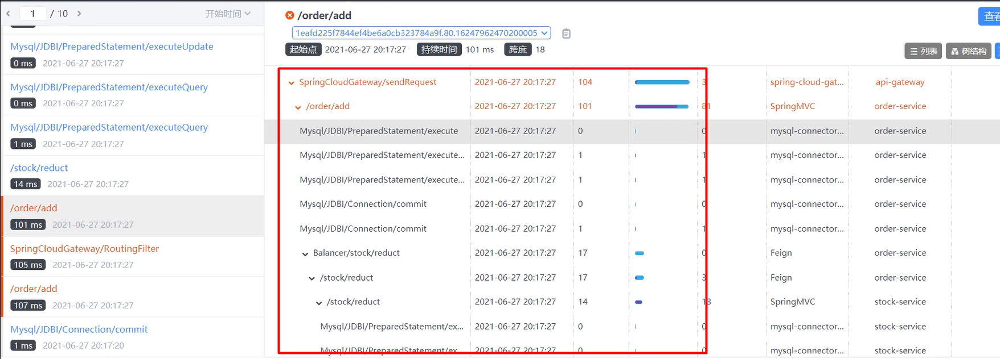  
在这张图的链路追踪中,可以看到从网关层面到服务层面到远程调用甚至是MySQL的所有链路信息都有,<font color="#00FF00">但是这张图目前还没有service层的代码</font>,如果需要在链路中加上service层的信息就需要自定义链路最终  

2.修改order-openfeign模块的依赖  
依旧在order-openfeign模块模块下进行实验,添加pom文件的依赖如下  
```xml
<!--sky walking工具类;注意版本号和skyWalking对应上-->
<dependency>
    <groupId>org.apache.skywalking</groupId>
    <artifactId>apm-toolkit-trace</artifactId>
    <version>8.5.0</version>
</dependency>
```

3.编写Service层代码  
```java
public interface HelloService {
    String ping(String name);
}
```

<font color="#00FF00">只需要在service层的代码中添加@Trace标签接口</font>
```java
@Service
public class HelloServiceImpl implements HelloService {
    @Trace
    @Override
    public String ping(String name) {
        return "pong" + name;
    }
}
```

4.编写controller层的代码  
```java
@RestController
@RequestMapping("/api/hello")
public class HelloController {

    private final HelloService helloService;

    public HelloController(HelloService helloService) {
        this.helloService = helloService;
    }

    @GetMapping("ping")
    public String ping(@RequestParam("name") String name) {
        return helloService.ping(name);
    }

}
```

5.启动测试  
  
可以看到service层的代码已经成功添加到链路中了

6.记录请求参数和返回值  
如果需要记录方法的请求参数和返回值就需要使用@Tags标签  
```java
@Service
public class HelloServiceImpl implements HelloService {
    @Trace
    @Tags({
            @Tag(key = "ping",value = "returnedObj"),
            @Tag(key = "ping",value = "arg[0]")
    })
    @Override
    public String ping(String name) {
        return "pong" + name;
    }
}

```

**解释:**  
@Tag注解的key一般是方法名,当value是returnedObj时表明记录该方法的返回值  
当value是arg[index]表明记录该方法的第几个参数  
<font color="#00FF00">注意@Tags标签要和@Trace标签一起使用</font>  

7.启动测试  
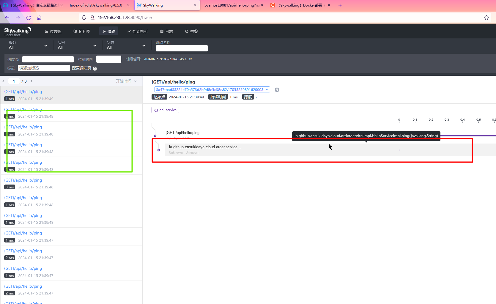  
此时点击图中红色方框中的内容,就会在左侧绿色方框区域弹出一个面板显示当前方法的入参和返回值  

### 8.5 日志
1.需求  
希望微服务的日志能够记录当前<font color="#00FF00">追踪链路的ID</font>,通过追踪链路的ID就可以从skywalking中找到对应的追踪记录  

2.添加logback-spring.xml配置  
如果需要使用其它的日志框架就陪配置该框架对应的日志文件  
```xml
<?xml version="1.0" encoding="UTF-8"?>
<configuration>
    <!--导入springboot日志框架的默认配置-->
    <include resource="org/springframework/boot/logging/logback/defaults.xml"/>

    <appender name="CONSOLE" class="ch.qos.logback.core.ConsoleAppender">
        <encoder class="ch.qos.logback.core.encoder.LayoutWrappingEncoder">
            <layout class="org.apache.skywalking.apm.toolkit.log.logback.v1.x.TraceIdPatternLogbackLayout">
                <!--添加[%tid]代表traceID(追踪链路的ID)-->
                <Pattern>${CONSOLE_LOG_PATTERN:-%clr(%d{${LOG_DATEFORMAT_PATTERN:-yyyy-MM-dd HH:mm:ss.SSS}}){faint} %clr(${LOG_LEVEL_PATTERN:-%5p}) %clr(${PID:- }){magenta} [%tid] %clr(---){faint} %clr([%15.15t]){faint} %clr(%-40.40logger{39}){cyan} %clr(:){faint} %m%n${LOG_EXCEPTION_CONVERSION_WORD:-%wEx}}</Pattern>
            </layout>
        </encoder>
    </appender>

    <root level="INFO">
        <appender-ref ref="console"/>
    </root>

</configuration>
```

3.添加pom依赖  
```xml
<!--添加日志对应的类-->
<dependency>
    <groupId>org.apache.skywalking</groupId>
    <artifactId>apm-toolkit-logback-1.x</artifactId>
    <version>8.5.0</version>
</dependency>
```

4.启动测试  
```shell
-2024-01-15 22:19:33.454  INFO 10580 [TID:85d92c01b82f4b898583733769ceda02.77.17053283734450001] --- [nio-8081-exec-1] o.a.c.c.C.[Tomcat].[localhost].[/]       : Initializing Spring DispatcherServlet 'dispatcherServlet'
-2024-01-15 22:19:33.454  INFO 10580 [TID:85d92c01b82f4b898583733769ceda02.77.17053283734450001] --- [nio-8081-exec-1] o.s.web.servlet.DispatcherServlet        : Initializing Servlet 'dispatcherServlet'
-2024-01-15 22:19:33.459  INFO 10580 [TID:85d92c01b82f4b898583733769ceda02.77.17053283734450001] --- [nio-8081-exec-1] o.s.web.servlet.DispatcherServlet        : Completed initialization in 5 ms
```
此时便能从控制台看到请求的日志ID了  

5.搜索  
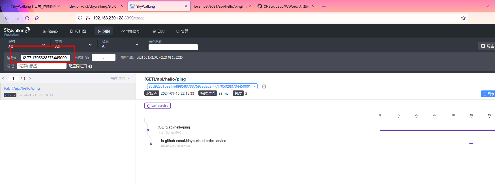  
把上述完整的ID复制到追踪ID中进行查询  

6.skywalking日志采集  
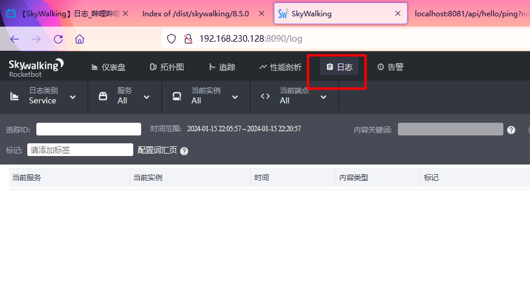  
现在skywalking日志面板中的日志还是空白,所以这里需要修改日志的配置文件,<font color="#00FF00">来将日志推送到skywalking的日志监控面板中</font>  
<font color="#FF00FF">通过这种方式就可以实现分布式系统的日志采集</font>,就不需要每次都到控制台中查看日志了  

6.1 修改logback-spring.xml配置  
```xml
<?xml version="1.0" encoding="UTF-8"?>
<configuration>
    <!--导入springboot日志框架的默认配置-->
    <include resource="org/springframework/boot/logging/logback/defaults.xml"/>

    <appender name="console" class="ch.qos.logback.core.ConsoleAppender">
        <encoder class="ch.qos.logback.core.encoder.LayoutWrappingEncoder">
            <layout class="org.apache.skywalking.apm.toolkit.log.logback.v1.x.TraceIdPatternLogbackLayout">
                <!--添加[%tid]代表traceID(追踪链路的ID)-->
                <Pattern>-%clr(%d{${LOG_DATEFORMAT_PATTERN:-yyyy-MM-dd HH:mm:ss.SSS}}){faint} %clr(${LOG_LEVEL_PATTERN:-%5p}) %clr(${PID:- }){magenta} [%tid] %clr(---){faint} %clr([%15.15t]){faint} %clr(%-40.40logger{39}){cyan} %clr(:){faint} %m%n${LOG_EXCEPTION_CONVERSION_WORD:-%wEx}</Pattern>
            </layout>
        </encoder>
    </appender>

    <appender name="grpc-log" class="org.apache.skywalking.apm.toolkit.log.logback.v1.x.log.GRPCLogClientAppender">
        <encoder class="ch.qos.logback.core.encoder.LayoutWrappingEncoder">
            <layout class="org.apache.skywalking.apm.toolkit.log.logback.v1.x.mdc.TraceIdMDCPatternLogbackLayout">
                <Pattern>%d{yyyy-MM-dd HH:mm:ss.SSS} [%X{tid}] [%thread] %-5level %logger{36} -%msg%n</Pattern>
            </layout>
        </encoder>
    </appender>

    <root level="INFO">
        <appender-ref ref="console"/>
        <appender-ref ref="grpc-log"/>
    </root>

</configuration>
```

6.2 启动测试  
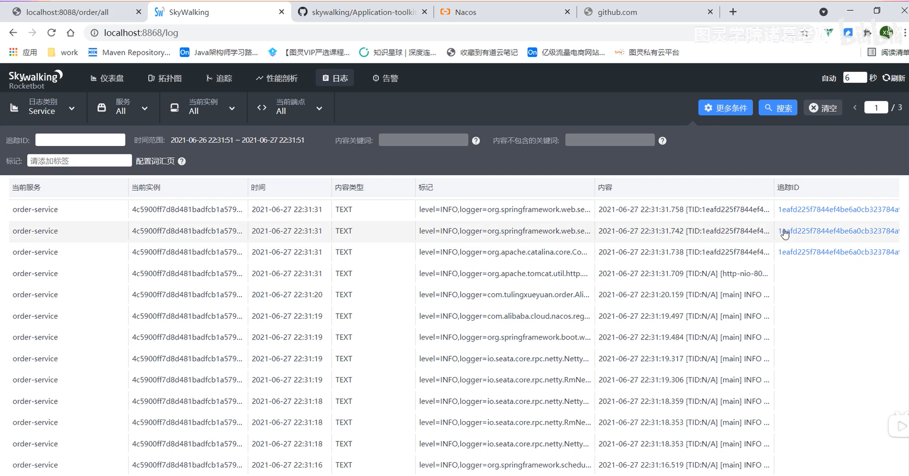  
理论上这里就会显示如图所示的日志界面了,不过这里我没跑起来;没跑起来是因为docker的原因导致的  
还需要配置以下内容(具体怎么配置还不知道)  
```properties
plugin.toolkit.log.grpc.reporter.server_host=${SW_GRPC_LOG_SERVER_HOST:127.0.0.1}
plugin.toolkit.log.grpc.reporter.server_port=${SW_GRPC_LOG_SERVER_PORT:11800}
plugin.toolkit.log.grpc.reporter.max_message_size=${SW_GRPC_LOG_MAX_MESSAGE_SIZE:10485760}
plugin.toolkit.log.grpc.reporter.upstream_timeout=${SW_GRPC_LOG_GRPC_UPSTREAM_TIMEOUT:30}
```

### 8.6 告警  
**目录:**  
8.6.1 告警信息  
8.6.2 WebHook  


#### 8.6.1 告警信息
1.告警规则  
skywalking的默认告警规则在<font color="#00FF00">config/alarm-settings.yml</font>文件中配置  
* 过去3分钟内服务平均响应时间超过1秒
* 过去2分钟服务成功率低于80%
* 过去3分钟内服务响应时间超过1s的百分比
* 服务实例在过去2分钟内平均响应时间超过1s,并且实例名称与正则表达式匹配
* 过去2分钟内端点平均响应时间超过1秒
* 过去2分钟内数据库访问平均响应时间超过1秒
* 过去2分钟内端点关系平均响应时间超过1秒

2.配置解释  
一个告警往往由以下条件构成  
* Rule Name:规则名称,也是告警也是在告警信息中显示的唯一名称.必须以_rule结尾,前缀可自定义
* Metrics name:度量名称,取值为oal脚本中的度量名,目前只支持1ong、double和int类型.详见Offical OAL Script
* Include names:该规则作用于哪些实体名称,比如服务名,终端名(可选,默认为全部)
* Exclude names:该规则作不用于哪些实体名称,比如服务名,终端名(可选,默认为空)
* Threshold:阈值
* OP:操作符,目前支持>、<、=
* Period:多久告警规则需要被核实一下.这是一个时间窗口,与后端部署环境时间相匹配
* Count:在一个Period窗口中,如果values超过Threshold值(按op),达到Count值,需要发送警报
* Silence period:在时间N中触发报警后,在TN->TN +period这个阶段不告警.默认情况下,它和Period一样,这意味着相同的告警(在同一个Metrics name拥有相同的ld)在同一个Period内只会触发一次
* message:告警信息


3.修改HelloServiceImpl中的内容  
```java
@Service
public class HelloServiceImpl implements HelloService {
    @Trace
    @Tags({
            @Tag(key = "ping",value = "returnedObj"),
            @Tag(key = "ping",value = "arg[0]")
    })
    @Override
    public String ping(String name) {
        try {
            TimeUnit.SECONDS.sleep(3);
        } catch (InterruptedException e) {
            throw new RuntimeException(e);
        }
        return "pong" + name;
    }
}
```
这里为了测试在ping方法里面睡眠了3秒  

4.启动服务多次请求进行测试  
多次刷新请求便能在告警面板中看到刚才的请求  
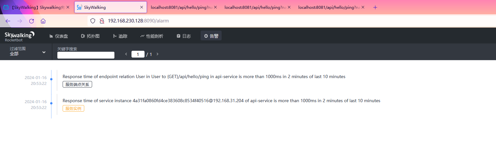  


#### 8.6.2 WebHook
1.WebHook概念介绍    
网络钩子,它的含义是当出现告警信息时可以由skywalking来<font color="#00FF00">主动调用我们服务的接口</font>来发送警告,通过这种方式当出现告警信息时就可以发送邮件给开发人员  
SkyWalking的告警信息会通过HTTP请求进行发送,<font color="#00FF00">请求方法为POST,context-type为application/json,其JSON数据是基于AlarmMessage进行序列化的</font>  

2.修改alarm-settings.yml  
在alarm-settings.yml配置文件中添加webhook配置项  
```yml
webhooks:
  - http://192.168.31.204:8081/alarm/receive
```

3.拷贝AlarmMessage类  
来到当前skywalking对应版本的github,搜索AlarmMessage类,这个类就是webhook回调时传送的JSON数据,把该类复制到项目中使用即可  
```java
/*
 * Licensed to the Apache Software Foundation (ASF) under one or more
 * contributor license agreements.  See the NOTICE file distributed with
 * this work for additional information regarding copyright ownership.
 * The ASF licenses this file to You under the Apache License, Version 2.0
 * (the "License"); you may not use this file except in compliance with
 * the License.  You may obtain a copy of the License at
 *
 *     http://www.apache.org/licenses/LICENSE-2.0
 *
 * Unless required by applicable law or agreed to in writing, software
 * distributed under the License is distributed on an "AS IS" BASIS,
 * WITHOUT WARRANTIES OR CONDITIONS OF ANY KIND, either express or implied.
 * See the License for the specific language governing permissions and
 * limitations under the License.
 *
 */

package org.apache.skywalking.oap.server.core.alarm;

import lombok.Getter;
import lombok.Setter;

/**
 * Alarm message represents the details of each alarm.
 */
@Setter
@Getter
public class AlarmMessage {
    private int scopeId;
    private String scope;
    private String name;
    private String id0;
    private String id1;
    private String ruleName;
    private String alarmMessage;
    private long startTime;
    private transient boolean onlyAsCondition;
}
```

**属性解释:**  
* scopedId:scopedId
* scope:scope
* name:目标scope实体名称
* id1:id1
* ruleName:告警规则名称
* alarmMessage:告警消息内容
* startTime:告警时间

3.还是在order-openfeign模块中编写NotifyController  
```java
@RestController
@RequestMapping("/alarm")
public class NotifyController {

    @PostMapping("receive")
    public void receive(@RequestBody List<AlarmMessage> alarmMessage) {
        StringBuilder sb = new StringBuilder();
        for (AlarmMessage message : alarmMessage) {
            sb.append("scopedId").append(message.getScopeId())
                    .append("\nscope:").append(message.getScope())
                    .append("\n 目标scope实体名称:").append(message.getName())
                    .append("\nid1:").append(message.getId1())
                    .append("\n告警规则名称:").append(message.getRuleName())
                    .append("\n告警消息内容:").append(message.getAlarmMessage())
                    .append("\n告警时间:").append(message.getStartTime())
                    .append("\n\n--------------\n\n");
        }
        System.out.println(sb);
    }
}
```

4.重启skywalking容器  
一段时间后控制台打印如下内容  
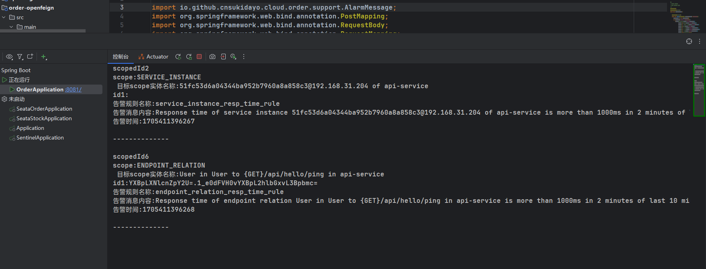  


### 8.7 skywalking更多功能
**目录:**  
8.7.1 性能剖析  
8.7.2 日志  
8.7.3 skywalking集群  

#### 8.7.1 性能剖析
点击顶部的路由<font color="#00FF00">性能剖析</font>  
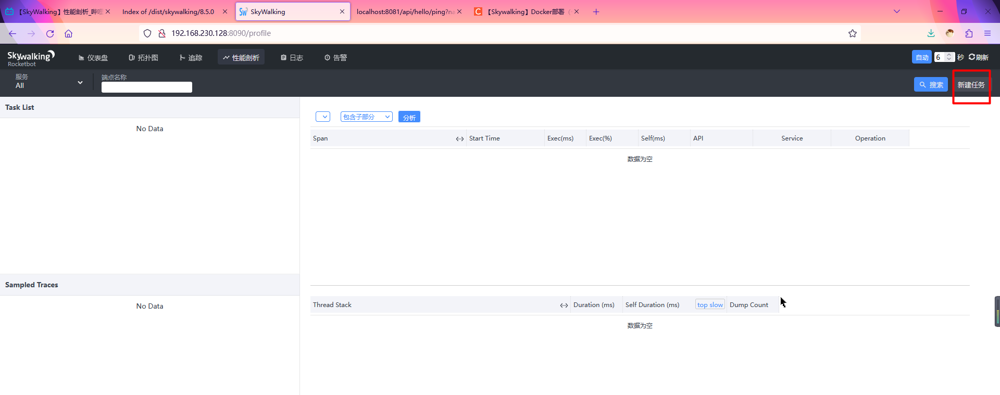  

1.作用  
通过性能剖析就能检测当前程序中的那一段代码性能比较慢  

2.操作流程  
*提示:这里还是对order-openfeign的ping方法进行性能监控*  
2.1 新建任务  
点击右侧的新建任务  
  

2.2 参数解释  
* 服务:选择当前要监控的服务
* 端点名称:输入当前要监控的那个端点(controller)  
* 监控时间:可以指定什么时候开始监控
* 监控持续时间:监控持续多次时间
* 起始监控时间:第一次开始的间隔
* 监控间隔:每次监控间隔多长时间
* 最大采样数:必须请求数量达到这个数量后才会分析  

3.启动测试  
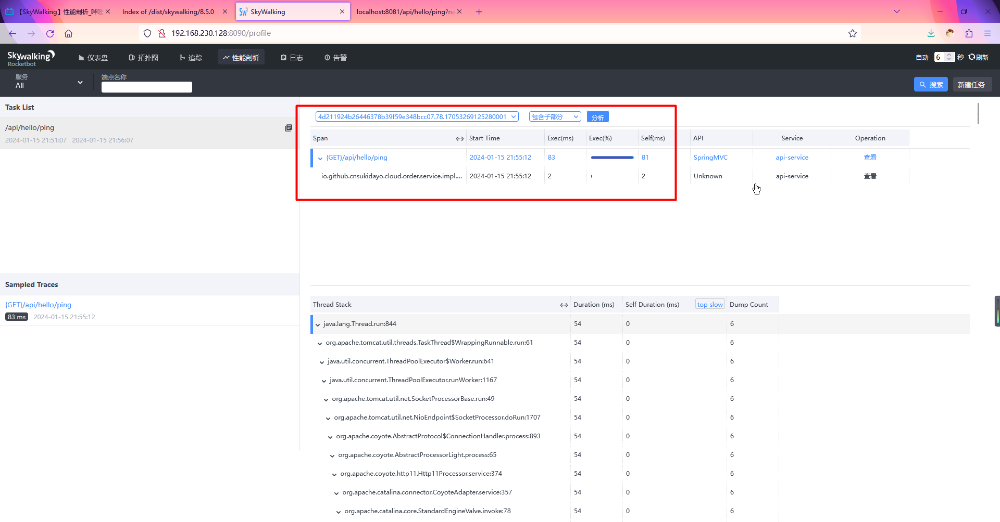  
此时便能看到相应的时间占用情况  
<font color="#00FF00">甚至它还能看方法调用的堆栈信息</font>  

#### 8.7.2 日志
  
详情见8.5 日志=>6.skywalking日志  

#### 8.7.3 skywalking集群
**介绍:**  
SkyWalking集群是将SkyWalking oap作为一个服务注册到nacos上的,搭建一个skywalking集群至少需要:  
* nacos集群(至少一个nacos)
* ES/MySQL集群(至少一个)
* skywalking集群
* skywalking UI(也可以是集群,用NGINX代理统一入口)  

1.修改application.yml  
```yml
cluster:
  # 使用nacos注册中心
  selector: ${SW_CLUSTER:nacos}
  nacos:
    # skywalking注册到nacos中的服务名称
    serviceName: ${SW_SERVICE_NAME:"SkyWalking_OAP_Cluster"}
    # 地址
    hostPort: ${SW_CLUSTER_NACOS_HOST_PORT:localhost:8848}
    # Nacos Configuration namespace 命名空间
    namespace: ${SW_CLUSTER_NACOS_NAMESPACE:"public"}
    # Nacos auth username 账号和密码
    username: ${SW_CLUSTER_NACOS_USERNAME:""}
    password: ${SW_CLUSTER_NACOS_PASSWORD:""}
    # Nacos auth accessKey
    accessKey: ${SW_CLUSTER_NACOS_ACCESSKEY:""}
    secretKey: ${SW_CLUSTER_NACOS_SECRETKEY:""}
```

2.修改UI容器中的webapp.yml  
进入容器,修改/skywalking/webapp/webapp.yml配置文件  
```yml
server:
  port: 8080

collector:
  path: /graphql
  ribbon:
    ReadTimeout: 10000
    # Point to all backend's restHost:restPort, split by ,
    # 在这个地方指定skywalking集群的所有地址,用逗号分隔每个集群
    listOfServers: 127.0.0.1:12800
```

3.修改微服务探针的启动参数  
```shell
-javaagent:E:\Program\Skywalking\apache-skywalking-apm-bin-es7\agent\skywalking-agent.jar
-DSW_AGENT_NAME=api-service
# 在这个地方指定skywalking集群的所有地址,用逗号分隔每个集群
-DSW_AGENT_COLLECTOR_BACKEND_SERVICES=192.168.230.128:11800
```


## 9.服务网格  
https://www.zhihu.com/question/398181565/answer/2850564275


# 附录:  
**目录:**  
1.微服务基本概念介绍  


## 1.微服务基本概念介绍
**目录:**  
1.1 微服务基本概念介绍  
1.2 实验环境介绍  
1.3 SpringBoot与Springcloud版本对应表  
1.4 组件说明  
1.5 基本环境搭建  

### 1.1 微服务基本概念介绍
一个微服务需要由哪些内容组成  
服务的注册与发现、服务调用、服务网关、服务配置中心、负载均衡、服务熔断、服务降级、服务消息队列、服务监控、全链路追踪  
*提示:这里的服务监控包含日志收集*  
SpringCloud是一套服务的总和  

**发展历史介绍:**  
1.ORM单体应用  

2.MVC垂直架构  
这种架构说白了就是拆分系统,例如将淘宝、天猫、支付宝都单独拆分为一个独立的单体应用  
*这种架构的问题是,系统与系统之间没有交互性,无法相互调用*  

3.RPC分布式服务  
这种架构就是将所有系统公共的部分抽离出一个单独的系统,供这些系统进行使用;例如淘宝、天猫这两个系统都有用户模块、订单模块、库存模块;于是乎就将这些模块拆分出来  
*在这个阶段很多分布式场景下的问题开始出现,比如分布式缓存、分布式session、分布式锁;并且在这种架构中使用远程调用一般是通过HTTP、Dubbo的方式去进行请求,还算不上真正的远程调用,因为真正的远程调用还要考虑负载均衡、节点的健康状况等因素,在这种架构下的实现是比较复杂的*  

4.SOA  
SOA架构就是为了解决在RPC分布式架构中调用关系复杂,难以维护的问题  
SOA使用治理中心ESB,ESB会管理所有的服务(模块),每个服务都需要将自已注册到治理中心ESB的总线(BUS)中,那么治理中心就会监控所有的服务,当某一个服务出现宕机的情况,那么治理中心就会将该服务排除  
并且ESB还可以进行协议转换,例如使用ESB就可以完成两个异构系统之间的服务调用  
*缺点:服务间会有依赖关系,一旦某个环节出错会影响较大(服务雪崩)*  
什么是服务雪崩,假设下单服务需要调用订单服务、库存服务、短信服务,此时短信服务崩溃那就有可能导致整个服务的不可用,从而使得服务雪崩;这种也称为<font color="#00FF00">扇出</font>  

5.微服务架构  

**一种可用的微服务架构**  
  
*提示:最外层的流量肯定还是走NGINX的,NGINX要通过负载均衡的算法把流量转到网关上,当然在这中间可以做分片*  
这里的Kong实际上是<font color="#00FF00">kubernetes-ingress-controller</font>并且Kong在转发外部流量的时候是通过K8S的服务名来完成的(这点是推测,但至少不可能是IP地址;因为节点的IP是会变的)  


**名词解释:**  
* 水平扩容:增加节点的数量
* 垂直扩容:增加单台服务器的硬件

### 1.2 实验环境介绍  
经过慎重考虑,决定本次实验环境完全按照教程,使用OpenJdk9+SpringBoot2.0  

### 1.3 SpringBoot与Springcloud版本对应表  
  
也可以访问以下连接查看最新版本支持情况:[https://start.spring.io/actuator/info](https://start.spring.io/actuator/info)  
还可以访问SpringCloudAlibaba的说明:[https://github.com/alibaba/spring-cloud-alibaba/wiki/版本说明](https://github.com/alibaba/spring-cloud-alibaba/wiki/%E7%89%88%E6%9C%AC%E8%AF%B4%E6%98%8E)  


### 1.4 组件说明  
排名分先后顺序  
* 服务注册中心:`zookpeer`、`nacos`、consul、eureak
* 服务调用:`Dubbo`、`OpenFeign`、Feign
* 负载均衡:`Ribbon`、LoadBalancer
* 服务降级:`Sentinel`、Resilience4j、Hystrix
* 服务网关:`Kong`、`gateway`、Zuul
* 服务配置:`nacos`、Config
* 服务总线:`nacos`、Bus
* 链路追踪:`Zipkin`、`Skywalking`
* 分布式事务:`Seata`
* 服务网格:`Istio`

### 1.5 基本环境搭建
1.创建父工程  

2.修改pom文件  
```xml
<?xml version="1.0" encoding="UTF-8"?>
<project xmlns="http://maven.apache.org/POM/4.0.0"
         xmlns:xsi="http://www.w3.org/2001/XMLSchema-instance"
         xsi:schemaLocation="http://maven.apache.org/POM/4.0.0 http://maven.apache.org/xsd/maven-4.0.0.xsd">
    <modelVersion>4.0.0</modelVersion>

    <groupId>io.github.cnsukidayo</groupId>
    <artifactId>springcloud</artifactId>
    <version>1.0-SNAPSHOT</version>
    <!--修改为pom打包的时候不会打包为jar包,因为父工程只管理配置-->
    <packaging>pom</packaging>
    <modules>
        <module>service-order</module>
        <module>service-stock</module>
    </modules>

    <properties>
        <maven.compiler.source>9</maven.compiler.source>
        <maven.compiler.target>9</maven.compiler.target>
        <project.build.sourceEncoding>UTF-8</project.build.sourceEncoding>
        <spring.cloud.alibaba.version>2.2.5.RELEASE</spring.cloud.alibaba.version>
        <spring.boot.version>2.3.11.RELEASE</spring.boot.version>
        <spring.cloud.version>Hoxton.SR8</spring.cloud.version>
    </properties>

    <dependencies>
        <dependency>
            <groupId>org.springframework.boot</groupId>
            <artifactId>spring-boot-starter</artifactId>
        </dependency>


        <dependency>
            <groupId>org.springframework.boot</groupId>
            <artifactId>spring-boot-starter-test</artifactId>
            <scope>test</scope>
            <exclusions>
                <exclusion>
                    <groupId>org.junit.vintage</groupId>
                    <artifactId>junit-vintage-engine</artifactId>
                </exclusion>
            </exclusions>
        </dependency>
    </dependencies>

    <dependencyManagement>
        <!--type:pom 因为一个项目只能有一个parent,所以这里使用这种方式来变相让SpringCloudAlibaba来管理项目-->
        <dependencies>
            <dependency>
                <groupId>com.alibaba.cloud</groupId>
                <artifactId>spring-cloud-alibaba-dependencies</artifactId>
                <version>${spring.cloud.alibaba.version}</version>
                <type>pom</type>
                <scope>import</scope>
            </dependency>
            <!--SpringBoot的版本管理-->
            <dependency>
                <groupId>org.springframework.boot</groupId>
                <artifactId>spring-boot-starter-parent</artifactId>
                <version>${spring.boot.version}</version>
                <type>pom</type>
                <scope>import</scope>
            </dependency>
            <!--SpringCloud的版本管理-->
            <dependency>
                <groupId>org.springframework.cloud</groupId>
                <artifactId>spring-cloud-dependencies</artifactId>
                <version>${spring.cloud.version}</version>
                <type>pom</type>
                <scope>import</scope>
            </dependency>

        </dependencies>

    </dependencyManagement>

    <!--<build>-->
    <!--    <plugins>-->
    <!--        <plugin>-->
    <!--            <groupId>org.springframework.boot</groupId>-->
    <!--            <artifactId>spring-boot-maven-plugin</artifactId>-->
    <!--        </plugin>-->
    <!--    </plugins>-->
    <!--</build>-->


</project>
```

3.创建子模块  
分别创建两个子模块订单模块(service-order)和库存模块(service-stock)  
为这两个模块添加如下pom内容:  
```xml
<dependencies>
    <dependency>
        <groupId>org.springframework.boot</groupId>
        <artifactId>spring-boot-starter-web</artifactId>
    </dependency>
</dependencies>
```


