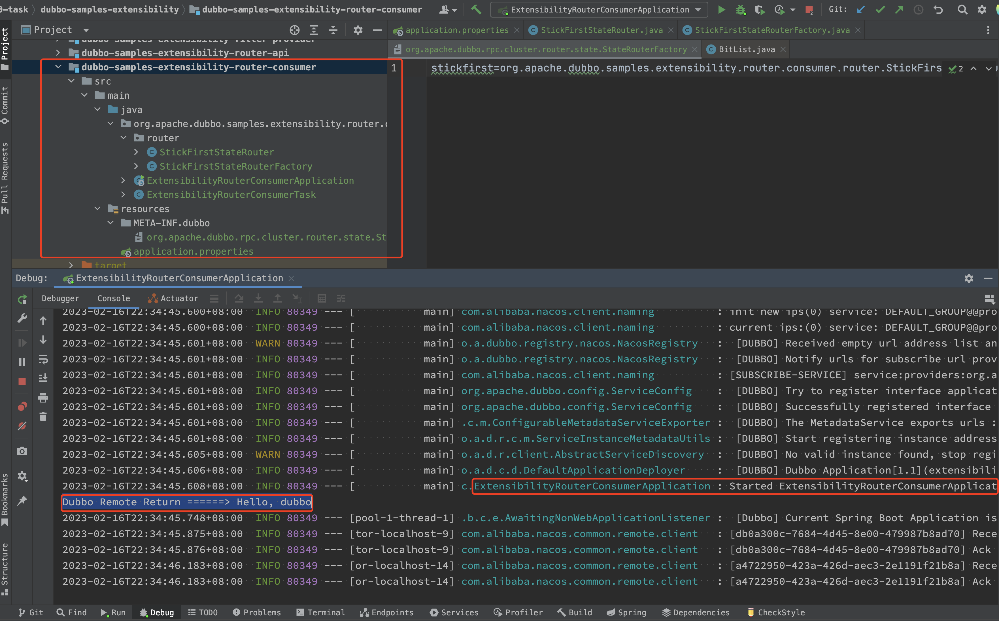
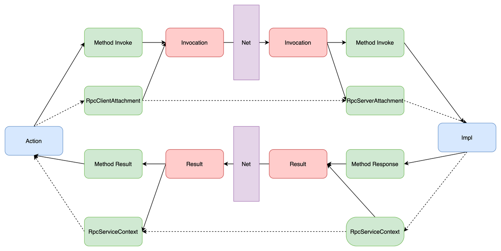

# 目录  
1.任务  
2.SDK手册  
3.其他  


## 1.任务  
**目录:**  
1.1 开发任务  
1.2 部署服务  
1.3 流量管理  
1.4 微服务生态  
1.5 观测服务  
1.6 通信协议  
1.7 限流降级  
1.8 自定义扩展  

### 1.1 开发任务
**目录:**  
1.1.1 发布调用dubbo  
1.1.2 异步调用  
1.1.3 版本与分组  
1.1.4 上下文参数传递  
1.1.5 泛化调用  
1.1.6 IDL开发服务  


#### 1.1 发布调用dubbo  
1.编写pom  
*提示:本次示例基于springboot3.0,本次案例来源于dubbo-sample=>1-basic=>dubbo-samples-spring-boot*  
```xml
<!-- registry dependency -->
<dependency>
    <groupId>com.alibaba.nacos</groupId>
    <artifactId>nacos-client</artifactId>
    <version>${nacos.version}</version>
</dependency>

<!-- dubbo dependency-->
<dependency>
    <groupId>org.apache.dubbo</groupId>
    <artifactId>dubbo-spring-boot-starter</artifactId>
    <version>${dubbo.version}</version>
</dependency>

<dependency>
    <groupId>org.springframework.boot</groupId>
    <artifactId>spring-boot-starter</artifactId>
</dependency>
```

2.定义服务接口  
类似于OpenFeign一样需要定义一个服务接口  
```java
public interface DemoService {
    String sayHello(String name);
}
```

3.服务接口实现  
```java
@DubboService
public class DemoServiceImpl implements DemoService {
    @Override
    public String sayHello(String name) {
        return "Hello " + name;
    }
}
```
*提示:这里需要使用@DubboService注解将服务注册到Spring中*  

4.服务消费者  
```java
@Component
public class Task implements CommandLineRunner {
    @DubboReference
    private DemoService demoService;

    @Override
    public void run(String... args) throws Exception {
        String result = demoService.sayHello("world");
        System.out.println("Receive result ======> " + result);

        new Thread(()-> {
            while (true) {
                try {
                    Thread.sleep(1000);
                    System.out.println(new Date() + " Receive result ======> " + demoService.sayHello("world"));
                } catch (InterruptedException e) {
                    e.printStackTrace();
                    Thread.currentThread().interrupt();
                }
            }
        }).start();
    }
}
```
*提示:通过@DubboReference注解对需要调用的服务进行依赖注入*  

5.编写服务消费者和服务生产者的yml  
```yml
dubbo:
  application:
    # 这里是服务提供者,如果是服务消费者就使用服务消费者的名称
    name: dubbo-springboot-demo-provider
    # 关闭qos
    qos-enable: false
  protocol:
    name: dubbo
    port: -1
  registry:
    # 选择一个合适的注册中心,推荐使用nacos
    # address: nacos://${nacos.address:192.168.230.128}:8848?username=nacos&password=nacos
    # address: zookeeper://${zookeeper.address:192.168.230.128}:2181
```

6.编写服务消费者和服务提供者的启动类  
```java
@SpringBootApplication
@EnableDubbo
public class ConsumerApplication {

    public static void main(String[] args) {
        SpringApplication.run(ConsumerApplication.class, args);
    }
}
```
*提示:不管是服务消费者还是服务提供者,都需要在启动类上标注@EnableDubbo注解*  

7.运行  
运行成功后在消费者控制台成功打印如下内容  
  
同理查看远程nacos的信息  
服务列表和配置列表两个地方都有了两个微服务的相关信息,并且点击进入服务消费者或者服务生产者的详情会看到当前服务的元数据信息  
  

#### 1.1.2 异步调用
*提示:本节的示例来自dubbo-sample->2-advanced->dubbo-samples-async-simple-boot*  

1.接口定义  
```java
public interface AsyncService {
    /**
     * 同步调用方法
     */
    String invoke(String param);
    /**
     * 异步调用方法
     */
    CompletableFuture<String> asyncInvoke(String param);
}
```

2.服务实现  
```java
@DubboService
public class AsyncServiceImpl implements AsyncService {

    @Override
    public String invoke(String param) {
        try {
            long time = ThreadLocalRandom.current().nextLong(1000);
            Thread.sleep(time);
            StringBuilder s = new StringBuilder();
            s.append("AsyncService invoke param:").append(param).append(",sleep:").append(time);
            return s.toString();
        }
        catch (InterruptedException e) {
            Thread.currentThread().interrupt();
        }
        return null;
    }

    @Override
    public CompletableFuture<String> asyncInvoke(String param) {
        // 建议为supplyAsync提供自定义线程池
        return CompletableFuture.supplyAsync(() -> {
            try {
                // Do something
                long time = ThreadLocalRandom.current().nextLong(1000);
                Thread.sleep(time);
                StringBuilder s = new StringBuilder();
                s.append("AsyncService asyncInvoke param:").append(param).append(",sleep:").append(time);
                return s.toString();
            } catch (InterruptedException e) {
                Thread.currentThread().interrupt();
            }
            return null;
        });
    }
}
```
通过`return CompletableFuture.supplyAsync()`,业务执行已从Dubbo线程切换到业务线程,避免了对Dubbo线程池的阻塞  
**理解:** 这句话是什么意思?每当来一个请求Dubbo都会起一个线程去处理,假设该线程要执行的业务方法时长非常长,则该线程会一直阻塞处理不被利用,而现在dubbo调用`asyncInvoke()`方法,该方法快速返回一个CompletableFuture接口不阻塞,dubbo拿到该返回对象就会自动使用业务线程来执行该方法,dubbo线程会立即得到释放,等到执行完毕之后再将结果返回出去.  

3.消费端异步  
```java
@DubboReference
private AsyncService asyncService;

@Override
public void run(String... args) throws Exception {
    //调用异步接口
    CompletableFuture<String> future1 = asyncService.asyncInvoke("async call request1");
    future1.whenComplete((v, t) -> {
        if (t != null) {
            t.printStackTrace();
        } else {
            System.out.println("AsyncTask Response-1: " + v);
        }
    });
    //两次调用并非顺序返回
    CompletableFuture<String> future2 = asyncService.asyncInvoke("async call request2");
    future2.whenComplete((v, t) -> {
        if (t != null) {
            t.printStackTrace();
        } else {
            System.out.println("AsyncTask Response-2: " + v);
        }
    });
    //consumer异步调用
    CompletableFuture<String> future3 =  CompletableFuture.supplyAsync(() -> {
        return asyncService.invoke("invoke call request3");
    });
    future3.whenComplete((v, t) -> {
        if (t != null) {
            t.printStackTrace();
        } else {
            System.out.println("AsyncTask Response-3: " + v);
        }
    });

    System.out.println("AsyncTask Executed before response return.");
}
```
*提示:这里的whenComplete()方法并不会阻塞,这样就可以做到同时发送多个远程调用,而不是等一个远程调用处理完毕之后再处理一个远程调用;这里的三个远程全是异步的*  

4.使用场景  
* 对于服务提供者来说,如果接口比较耗时,避免dubbo线程被阻塞,可以使用异步将线程切换到业务线程
* 对于服务消费者来说,要一次性调用多个dubbo接口,并且这些接口在时间上没有严格的顺序就可以使用异步调用
  最终组装数据的时候可以同步等待所有接口返回完毕后再组装数据,这个例子可以看之前的尚上优选项目


#### 1.1.3 版本与分组  
在dubbo中接口并不能唯一确定一个服务,<font color="#00FF00">只有接口+分组+版本号才能唯一确定一个服务</font>
*提示:本节的示例可以参考dubbo-sample->2-advanced->dubbo-samples-group*  
1.使用场景  
* 当同一个接口针对不同的业务场景、不同的使用需求或者不同的功能模块等场景,可使用服务分组来区分不同的实现方式.同时,这些不同实现所提供的服务是可并存的,也支持互相调用
* <font color="#00FF00">当接口实现需要升级又要保留原有实现的情况下,即出现不兼容升级时,我们可以使用不同版本号进行区分</font>

2.接口定义  
```java
public interface DevelopService {
    String invoke(String param);
}
```

3.接口实现  
使用`@DubboService`注解,添加group参数和version参数  
**接口实现1**  
```java
@DubboService(group = "group1",version = "1.0")
public class DevelopProviderServiceV1 implements DevelopService{
    @Override
    public String invoke(String param) {
        StringBuilder s = new StringBuilder();
        s.append("ServiceV1 param:").append(param);
        return s.toString();
    }
}
```

**接口实现2**  
```java
@DubboService(group = "group2",version = "2.0")
public class DevelopProviderServiceV2 implements DevelopService{
    @Override
    public String invoke(String param) {
        StringBuilder s = new StringBuilder();
        s.append("ServiceV2 param:").append(param);
        return s.toString();
    }
}
```

4.客户端调用  
> 使用`@DubboReference`注解,添加group参数和version参数  

```java
@DubboReference(group = "group1",version = "1.0")
private DevelopService developService;

@DubboReference(group = "group2",version = "2.0")
private DevelopService developServiceV2;

@Override
public void run(String... args) throws Exception {
    //调用DevelopService的group1分组实现
    System.out.println("Dubbo Remote Return ======> " + developService.invoke("1"));
    //调用DevelopService的group2分组实现
    System.out.println("Dubbo Remote Return ======> " + developServiceV2.invoke("2"));
}
```

4.小总结  
某个服务接口需要通过<font color="#FF00FF">接口+分组+版本号</font>才能唯一确定,这点相较于OpenFeign优势就非常大了  


#### 1.1.4 上下文参数传递
*提示:本节的示例可以参考dubbo-sample->2-advanced->dubbo-samples-async-simple-boot*  
*提示:本章的知识在2.2 高级特性和用法=>2.2.1 框架与服务=>2.2.1.14 调用链路传递隐式参数中还有详细的介绍*  

在Dubbo3中,RpcContext被拆分为四大模块,它们分别担任不同的职责:  
* ServiceContext:在Dubbo内部使用,用于传递调用链路上的参数信息,如invoker对象等
* ClientAttachment:在Client端使用,往ClientAttachment中写入的参数将被传递到Server端
* ServerAttachment:在Server端使用,从ServerAttachment中读取的参数是从Client中传递过来的
  ServerAttachment和ClientAttachment是对应的
* ServerContext:在Client端和Server端使用,用于从Server端回传Client端使用,Server端写入到ServerContext的参数在调用结束后可以在Client端的ServerContext获取到

流程图大致如下  
  


1.接口定义  
*提示:setAttachment设置的KV对,在完成下面一次远程调用会被清空,即多次远程调用要多次设置*  
```java
public interface ContextService {
    String invoke(String param);
}
```

2.服务实现  
```java
@DubboService
public class ContextServiceImpl implements ContextService{
    @Override
    public String invoke(String param) {
        //ServerAttachment接收客户端传递过来的参数
        Map<String, Object> serverAttachments = RpcContext.getServerAttachment().getObjectAttachments();
        System.out.println("ContextService serverAttachments:" + JSON.toJSONString(serverAttachments));
        //往客户端传递参数
        RpcContext.getServerContext().setAttachment("serverKey","serverValue");
        StringBuilder s = new StringBuilder();
        s.append("ContextService param:").append(param);
        return s.toString();
    }
}
```
`setAttachment`方法是设置一个KV键值对  
其中path、group、version、dubbo、token、timeout这几个字段是保留字段,不可以设置  

3.接口调用  
```java
//往服务端传递参数
RpcContext.getClientAttachment().setAttachment("clientKey1","clientValue1");
String res = contextService.invoke("context1");
//接收传递回来参数
Map<String, Object> clientAttachment = RpcContext.getServerContext().getObjectAttachments();
System.out.println("ContextTask clientAttachment:" + JSON.toJSONString(clientAttachment));
System.out.println("ContextService Return : " + res);
```

#### 1.1.5 泛化调用
泛化调用:是指调用方没有服务方提供的API(SDK)的情况下,对服务方进行调用,并且可以正常拿到调用结果  
之前的实验结果有一个前提是服务消费者拥有<font color="#00FF00">定义的接口</font>并且使用`@DubboReference`直接依赖注入了该接口,假设现在服务消费者没有该接口的定义,则如何调用目标服务并拿到返回值便是泛化调用  

*提示:本节示例参考自2-advanced=>dubbo-samples-generic=>dubbo-samples-generic-call*  

1.接口定义  
```java
public interface DevelopService {
    String invoke(String param);
}
```

2.接口实现1  
```java
@DubboService(group = "group1",version = "1.0")
public class DevelopProviderServiceV1 implements DevelopService{
    @Override
    public String invoke(String param) {
        StringBuilder s = new StringBuilder();
        s.append("ServiceV1 param:").append(param);
        return s.toString();
    }
}
```

3.消费者调用  
```java
@Component
public class GenericTask implements CommandLineRunner {

    @Override
    public void run(String... args) throws Exception {
        GenericService genericService = buildGenericService("org.apache.dubbo.samples.develop.DevelopService","group2","2.0");
        //传入需要调用的方法,参数类型列表,参数列表
        Object result = genericService.$invoke("invoke", new String[]{"java.lang.String"}, new Object[]{"g1"});
        System.out.println("GenericTask Response: " + JSON.toJSONString(result));
    }

    private GenericService buildGenericService(String interfaceClass, String group, String version) {
        ReferenceConfig<GenericService> reference = new ReferenceConfig<>();
        reference.setInterface(interfaceClass);
        reference.setVersion(version);
        //开启泛化调用
        reference.setGeneric("true");
        reference.setTimeout(30000);
        reference.setGroup(group);
        ReferenceCache cache = SimpleReferenceCache.getCache();
        try {
            return cache.get(reference);
        } catch (Exception e) {
            throw new RuntimeException(e.getMessage());
        }
    }
}
```

4.通过Spring使用泛化调用  
4.1 消费者在原有的`dubbo:reference`标签加上`generic=true`的属性  
```xml
 <dubbo:reference id="helloService" generic = "true" interface="org.apache.dubbo.samples.generic.call.api.HelloService"/>
```

4.2 获取Bean容器,通过Bean容器拿到`GenericService`实例  

4.3 调用`$invoke`方法获取结果  
```java
private static GenericService genericService;

public static void main(String[] args) throws Exception {
	ClassPathXmlApplicationContext context = new ClassPathXmlApplicationContext("spring/generic-impl-consumer.xml");
	context.start();
	//服务对应bean的名字由xml标签的id决定
	genericService = context.getBean("helloService");
	//获得结果
	Object result = genericService.$invoke("sayHello", new String[]{"java.lang.String"}, new Object[]{"world"});
}
```

5.Protobuf对象泛化调用  
一般泛化调用只能用于生成的服务参数为POJO的情况,而GoogleProtobuf的对象是基于Builder生成的非正常POJO,可以通过protobuf-json泛化调用  

5.1 通过Spring对Google Protobuf对象泛化调用  
```xml
<dubbo:reference id="barService" interface="com.foo.BarService" generic="protobuf-json" />
```

5.2 在Java代码获取barService并开始泛化调用  
```java
GenericService barService = (GenericService) applicationContext.getBean("barService");
Object result = barService.$invoke("sayHello",new String[]{"org.apache.dubbo.protobuf.GooglePbBasic$CDubboGooglePBRequestType"}, new Object[]{"{\"double\":0.0,\"float\":0.0,\"bytesType\":\"Base64String\",\"int32\":0}"});
```

5.3 通过API方式对Google Protobuf对象泛化调用  
没什么用,不介绍了  


#### 1.1.6 IDL开发服务
Dubbo开发的基本流程是:用户定义RPC服务,通过约定的配置方式将RPC声明为dubbo服务,然后就可以基于服务API进行变成了,<font color="#00FF00">对服务提供者来说是提供RPC服务的具体实现,而对服务消费者来说则是使用特定数据发起服务调用</font>.  
我们之前使用的特定数据实际上是依赖注入的`@DubboReference`接口,<font color="#FF00FF">IDL的思想是为了具备通用性,为了能够实现跨语言调用而提出的一种通用的接口定义格式</font>  
*提示:本节内容参考自3-extensions=>protocol=>dubbo-samples-triple*  

1.定义服务  
Dubbo3推荐使用IDL定义跨语言服务  
```proto
syntax = "proto3";

option java_multiple_files = true;
option java_package = "org.apache.dubbo.demo";
option java_outer_classname = "DemoServiceProto";
option objc_class_prefix = "DEMOSRV";

package demoservice;

// The demo service definition.
service DemoService {
  rpc SayHello (HelloRequest) returns (HelloReply) {}
}

// The request message containing the user's name.
message HelloRequest {
  string name = 1;
}

// The response message containing the greetings
message HelloReply {
  string message = 1;
}
```
以上是使用IDL定义服务的一个简单示例(它的作用就类似我们之前定义的Java接口,但为了通用性别的语言肯定没有Java接口这种说法,<font color="#FF00FF">所以就高度抽象出一种语言无关的接口定义,这就是IDL</font>),我们可以把它命名为DemoService.proto,即IDL定义的服务文件名以.proto结尾;<font color="#00FF00">那么这个文件就可以做到一次编写到处使用了</font>  

proto文件中定义了RPC服务名称DemoService与方法签名S`ayHello (HelloRequest) returns (HelloReply) {}`,同时还定义了方法的入参结构体、出参结构体HelloRequest与HelloReply.IDL格式的服务依赖<font color="#00FF00">Protobuf编译器</font>,用来生成可以被用户调用的客户端与服务端编程API,<font color="#DDDD00">Dubbo在原生Protobuf Compiler的基础上提供了适配多种语言的特有插件</font>,框架特有的API与编程模型  
> 使用Dubbo3 IDL定义的服务只允许一个入参与出参,这种形式的服务签名有两个优势,一是对多语言实现更友好,二是可以保证服务的向后兼容性,依赖于Protobuf序列化的兼容性,我们可以很容易的调整传输的数据结构如增、删字段等,完全不用担心接口的兼容性

2.编译服务  
根据当前采用的比编程语言,配置相应的Protobuf插件,编译后将产生生产语言相关的服务定义stub  
Java compiler配置参考(本质是通过Maven插件来实现的)  
```xml
<plugin>
    <groupId>org.xolstice.maven.plugins</groupId>
    <artifactId>protobuf-maven-plugin</artifactId>
    <version>0.6.1</version>
    <configuration>
        <protocArtifact>com.google.protobuf:protoc:${protoc.version}:exe:${os.detected.classifier}
        </protocArtifact>
        <pluginId>grpc-java</pluginId>
        <pluginArtifact>io.grpc:protoc-gen-grpc-java:${grpc.version}:exe:${os.detected.classifier}
        </pluginArtifact>
        <protocPlugins>
            <protocPlugin>
                <id>dubbo</id>
                <groupId>org.apache.dubbo</groupId>
                <artifactId>dubbo-compiler</artifactId>
                <version>3.0.10</version>
                <mainClass>org.apache.dubbo.gen.tri.Dubbo3TripleGenerator</mainClass>
            </protocPlugin>
        </protocPlugins>
    </configuration>
    <executions>
        <execution>
            <goals>
                <goal>compile</goal>
                <goal>test-compile</goal>
                <goal>compile-custom</goal>
                <goal>test-compile-custom</goal>
            </goals>
        </execution>
    </executions>
</plugin>
```

Java语言通过Protobuf生成的stub如下,实际上就是生成之前我们手动定义的那个Java接口  
```java
@javax.annotation.Generated(
value = "by Dubbo generator",
comments = "Source: DemoService.proto")
public interface DemoService {
    static final String JAVA_SERVICE_NAME = "org.apache.dubbo.demo.DemoService";
    static final String SERVICE_NAME = "demoservice.DemoService";

    org.apache.dubbo.demo.HelloReply sayHello(org.apache.dubbo.demo.HelloRequest request);

    CompletableFuture<org.apache.dubbo.demo.HelloReply> sayHelloAsync(org.apache.dubbo.demo.HelloRequest request);
}
```

Go语言生成的stub如下  
```go
func _DUBBO_Greeter_SayHello_Handler(srv interface{}, ctx context.Context, dec func(interface{}) error, interceptor grpc.UnaryServerInterceptor) (interface{}, error) {
	in := new(HelloRequest)
	if err := dec(in); err != nil {
		return nil, err
	}
	base := srv.(dgrpc.Dubbo3GrpcService)
	args := []interface{}{}
	args = append(args, in)
	invo := invocation.NewRPCInvocation("SayHello", args, nil)
	if interceptor == nil {
		result := base.GetProxyImpl().Invoke(ctx, invo)
		return result.Result(), result.Error()
	}
	info := &grpc.UnaryServerInfo{
		Server:     srv,
		FullMethod: "/main.Greeter/SayHello",
	}
	handler := func(ctx context.Context, req interface{}) (interface{}, error) {
		result := base.GetProxyImpl().Invoke(context.Background(), invo)
		return result.Result(), result.Error()
	}
	return interceptor(ctx, in, info, handler)
}
```

3.配置并加载服务  
服务提供者负责提供具体的dubbo服务实现,也就是遵循RPC签名所约束的格式,去实现具体的业务逻辑代码.在实现服务之后,<font color="#00FF00">要将服务实现注册为标准的Dubbo服务</font>,之后Dubbo框架就能根据接收到的请求转发给服务实现,执行方法,并将结果返回.  
消费端的配置会更简单一些,只需要声明IDL定义的服务为标准的Dubbo服务,框架就可以帮助开发者生成相应的proxy,开发者将完全<font color="#FF00FF">面向proxy编程</font>,基本上Dubbo所有语言的实现都保证了proxy依据IDL服务定义暴露标准化的接口  

Java生产者端代码示例  
```java
public class DemoServiceImpl implements DemoService {
    private static final Logger logger = LoggerFactory.getLogger(DemoServiceImpl.class);

    @Override
    public HelloReply sayHello(HelloRequest request) {
        logger.info("Hello " + request.getName() + ", request from consumer: " + RpcContext.getContext().getRemoteAddress());
        return HelloReply.newBuilder()
    .setMessage("Hello " + request.getName() + ", response from provider: "
            + RpcContext.getContext().getLocalAddress())
    .build();
    }

    @Override
    public CompletableFuture<HelloReply> sayHelloAsync(HelloRequest request) {
        return CompletableFuture.completedFuture(sayHello(request));
    }
}
```

4.服务生产者注册服务(以Spring XML为例)  
```xml
<bean id="demoServiceImpl" class="org.apache.dubbo.demo.provider.DemoServiceImpl"/>
<dubbo:service serialization="protobuf" interface="org.apache.dubbo.demo.DemoService" ref="demoServiceImpl"/>
```

5.服务消费者引用服务  
```xml
<dubbo:reference scope="remote" id="demoService" check="false" interface="org.apache.dubbo.demo.DemoService"/>
```

6.服务消费者使用服务proxy  
```java
public void callService() throws Exception {
    // do something...
    DemoService demoService = context.getBean("demoService", DemoService.class);
    HelloRequest request = HelloRequest.newBuilder().setName("Hello").build();
    HelloReply reply = demoService.sayHello(request);
    System.out.println("result: " + reply.getMessage());
}
```

### 1.2 部署服务  
**目录:**  
1.2.1 部署到虚拟机  
1.2.2 部署到docker  
1.2.3 部署到K8S+docker  
1.2.4 部署到K8S+Containerd  

#### 1.2.2 部署到docker
1.工作原理  
  

2.详情  
详情见:[https://cn.dubbo.apache.org/zh-cn/overview/tasks/deploy/deploy-on-docker/](https://cn.dubbo.apache.org/zh-cn/overview/tasks/deploy/deploy-on-docker/)  


### 1.3 流量管理
**目录:**  
1.3.1 流量管理基本介绍  
1.3.2 调整超时时间  
1.3.3 服务重试  
1.3.4 访问日志  
1.3.5 同区域优先  
1.3.6 环境隔离  
1.3.7 参数路由  
1.3.8 权重比例  
1.3.9 服务降级  
1.3.10 固定机器导流  


#### 1.3.1 流量管理基本介绍
1.实验环境  
本次实验环境基于一个简单的线上商城微服务系统演示了Dubbo的流量管控能力  
线上商城架构图如下  
  
系统由5个微服务应用组成:  
* Frontend商城主页:作为与用户交互的web界面,通过调用User、Detail、Order模块为用户提供服务
* User用户服务:负责用户数据管理、身份校验等
* Order订单服务:提供订单创建、订单查询等服务,调用`Detail`服务校验商品库存等信息
* Detail商品详情服务:展示商品详情信息,调用`Comment`服务展示用户对商品的评论记录
* Comment评论服务:管理用户对商品的评论数据

2.部署商城系统  
本节的代码参考自:dubbo-sample=>10-task=>dubbo-samples-shop  

3.完整部署的架构图  
  
`Order`订单服务有两个版本V1和V2,V2是订单服务优化后发布的新版本
* 版本v1只是简单的创建订单,不展示订单详情
* 版本v2在订单创建成功后会展示订单的收货地址详情

`Detail`和`Comment`服务也分别有两个版本v1和v2,我们通过多个版本来演示流量导流后的效果  
* 版本v1默认为所有请求提供服务
* 版本v2模拟被部署在<font color="#00FF00">特定的区域的服务</font>,因此v2实例会带有特定的标签
  关于标签详情见dubboBasis笔记 2.dubbo功能=>2.5 流量管理=>2.5.2 标签路由

4.支撑环境  
除了上述的微服务外,示例还拉起了nacos注册中心、Dubbo Admin控制台和Skywalking链路追踪  

#### 1.3.2 调整超时时间
1.需求解释  
商城项目通过org.apache.dubbo.samples.UserService提供用户信息管理服务,访问 http://localhost:8080/ 打开商城并输入任意账号密码,点击Login即可以正常登录到系统  
  
有些场景下,User服务的运行速度会变慢,比如存储用户数据的数据库负载过高导致查询变慢,这时就会出现UserService访问超时的情况,导致登录失败  
  

2.动态调整超时时间  
为了解决突发的登录超时问题,我们只需要<font color="#00FF00">适当增加UserService服务调用的等待时间即可</font>  

3.1 打开Dubbo Admin控制台  
3.2 在左侧导航栏选择[服务治理]>[动态配置]  
3.3 点击"创建",输入服务`org.apache.dubbo.samples.UserService`和新的超时时间如2000即可  
  

4.规则解释  
```yml
configVersion: v3.0
enabled: true
configs:
    # 针对服务提供者
  - side: provider
    parameters:
      timeout: 2000
```
从`UserService`<font color="#00FF00">服务提供者视角</font>,将超时时间总体调整为2S,超时是针对服务提供者的  
`side: provider`配置会将规则发送到服务提供方实例,所有UserService服务实例会基于新的timeout值进行重新发布,并通过注册中心通知给所有消费方  
如果要基于服务粒度,<font color="#00FF00">则需要使用之前提到的scope: service作用域</font>  

#### 1.3.3 服务重试  
1.实验背景  
现在Frontend这个微服务需要访问User这个微服务,获取用户的个人信息;但User这个微服务本身可能存在网络不稳定等问题导致Frontend微服务获取用户信息的时候超时  
此时就可以通过设置Frontend微服务的超时次数从而使得数据最终能够展示出来  

2.1 打开Dubbo Admin控制台  
2.2 点击左侧导航栏选择**服务治理 -> 动态配置**  
2.3 点击创建,输入服务`org.apache.dubbo.samples.UserService`和失败重试次数即可  

3.规则详解  
规则key:`org.apache.dubbo.samples.UserService`  
规则体:  
```yml
configVersion: v3.0
enabled: true
configs:
    # 规则针对服务消费者
  - side: consumer
    parameters:
      # 设置重试次数为5次
      retries: 5
```

关于这里的key再说一下,dubbo中key就表明当前规则要对哪个对象生效,同时它需要配合scope使用  
<font color="#00FF00">当scope:service时,</font><font color="#FF00FF">key应该是该规则生效的服务名(Service)比如org.apache.dubbo.samples.CommentService,表明当前规则只对所有微服务的接口生效</font>  
<font color="#00FF00">当scope:application时,</font><font color="#FF00FF">则key应该是该规则应该生效的应用名称,比如说my-dubbo-service;则表明该规则对所有my-dubbo-service微服务下的所有接口生效</font>  

#### 1.3.4 访问日志  
1.实验背景  
商城的所有用户服务都由`User`应用的`UserService`提供,通过这个任务,我们为`User`应用的某一台或几台机器<font color="#00FF00">开启访问日志</font>,以便观察用户服务的整体访问情况  

2.动态开启访问日志  
通过dubbo的`accesslog`标记识别访问日志的开启状态   

3.1 打开Dubbo Admin控制台  
3.2 点击左侧导航栏选择**服务治理 -> 动态配置**  
3.3 点击创建,输入应用名`shop-user`并勾选开启访问日志  

4.再次登陆页面,查看任意一台User实例机器(物理机器),可以看到如下格式的访问日志  
```shell
[2022-12-30 12:36:31.15900] -> [2022-12-30 12:36:31.16000] 192.168.0.103:60943 -> 192.168.0.103:20884 - org.apache.dubbo.samples.UserService login(java.lang.String,java.lang.String) ["test",""], dubbo version: 3.2.0-beta.4-SNAPSHOT, current host: 192.168.0.103
[2022-12-30 12:36:33.95900] -> [2022-12-30 12:36:33.95900] 192.168.0.103:60943 -> 192.168.0.103:20884 - org.apache.dubbo.samples.UserService getInfo(java.lang.String) ["test"], dubbo version: 3.2.0-beta.4-SNAPSHOT, current host: 192.168.0.103
[2022-12-30 12:36:31.93500] -> [2022-12-30 12:36:34.93600] 192.168.0.103:60943 -> 192.168.0.103:20884 - org.apache.dubbo.samples.UserService getInfo(java.lang.String) ["test"], dubbo version: 3.2.0-beta.4-SNAPSHOT, current host: 192.168.0.103
```  

5.规则详解  
规则key:`shop-user`(表明为所有shop-user应用开启)  
规则体:  
```yml
configVersion: v3.0
enabled: true
configs:
  - side: provider
    parameters:
      accesslog: true
```

accesslog的有效值如下:
* `true`或`default`时,访问日志将随业务logger一同输出,此时可以在应用内提前配置 `dubbo.accesslog`appender调整日志的输出位置和格式
* 具体的文件路径如`/home/admin/demo/dubbo-access.log`这样访问日志将打印到指定的文件内容

在Admin界面,还可以单独指定开启某一台机器的访问日志,以方便精准排查问题,对应的后台规则如下  
```yml
configVersion: v3.0
enabled: true
configs:
  - match
     address:
       oneof:
        - wildcard: "{ip}:*"
    side: provider
    parameters:
      accesslog: true
```

#### 1.3.5 同区域优先  
1.实验背景  
当应用部署在多个不同机房/区域的时候,<font color="#00FF00">应用之间相互调用就会出现跨区域的情况</font>,而跨区域调用会增加响应时间,影响用户体验.同机房/区域优先是指应用调用服务时,<font color="#00FF00">优先调用同机房/区域的服务提供者</font>,避免了跨区域带来的网络延时,从而减少了调用的响应时间.  

2.任务详情  
之前说过`Detail`和`Comment`这两个服务的V1和V2版本分别部署在不同的区域,假设Detail和Comment服务的V1版本都部署在Beijing,Detail和Comment服务都部署在Hangzhou,为了保证服务调用的响应速度,<font color="#FF00FF">我们需要增加同区域优先的调用规则</font>  
只有当同区域内的服务出现故障不可用的时候才允许跨区域调用  
  

3.1 登陆Dubbo Admin控制台  
3.2 在左侧导航栏选择**服务治理->条件路由**  
3.3 点击创建按钮,填入要启用同区域优先的服务如`org.apache.dubbo.samples.CommentService`与区域标识如`region`即可  

4.规则详解  
规则key:`org.apache.dubbo.samples.CommentService`  
```yml
configVersion: v3.0
enabled: true
force: false
key: org.apache.dubbo.samples.CommentService
conditions:
  - '=> region = $region'
```
*提示:这里的表达式是条件路由表达式*  

这里使用的是条件路由;`region`为我们示例中的区域标识,<font color="#00FF00">会自动的识别当前发起调用的一方所在的区域值</font>,假设请求到达hangzhou区域部署的Detail后,从Detail发出的请求自动筛选URL地址中带有region=hangzhou标识的Comment地址(`$region 代表引用当前服务的区域`),<font color="#00FF00">如果发现有可用的地址子集则将请求发出,如果没有匹配条件的地址,则随机发往任意可用区地址</font>

*提示:`force: false`表示当同区域无有效地址时,可以跨区域调用*  


#### 1.3.6 环境隔离  
1.实验背景  
无论是在日常开发测试环境还是在预发生产环境,我们经常会遇到流量隔离环境的需求.  
利用dubbo提供的标签路由能力,可以非常灵活的实现流量隔离能力,可以单独为集群中某一个或多个应用划分隔离环境,也可以为整个微服务集群划分隔离环境,可以在部署静态的标记隔离环境,也可以在运行态通过规则动态的隔离出一部分机器环境  

2.任务详情  
为商城建立一套完整的线上灰度验证环境,灰度环境和线上环境<font color="#00FF00">共享一套物理集群</font>,需要我们通过dubbo标签路由从逻辑上完全隔离出一套环境,做到灰度流量和线上流量互不干扰  
  

3.1 登陆Dubbo Admin控制台  
3.2 在左侧导航栏选择**服务治理->标签路由**  
3.3 点击创建,输入`shop-detail`和流量隔离条件保存即可;同理为`shop-comment`、`shop-order`创建相同的隔离规则  

4.规则详解  
我们需要通过Admin为`shop-detail、shop-comment、shop-order、shop-user`四个应用分别设置标签归组规则,以`shop-detail`为例  
规则key:`shop-detail`  
规则体:  
```yml
configVersion: v3.0
force: true
enabled: true
key: shop-detail
tags:
  - name: gray
    match:
      - key: env
        value:
          exact: gray
```
其中,`name`为灰度环境的流量匹配条件,只有请求上下文中带有`dubbo.tag=gray`的流量才会被转发到隔离环境地址子集.请求上下文可通过`RpcContext.getClientAttachment().setAttachment("dubbo.tag", "gray")`传递  
`match`指定了地址子集筛选条件,示例中我们匹配了所有地址URL中带有env=gray标签的地址列表,也就是说`shop-detail`服务发起的请求匹配的<font color="#FF00FF">地址子集</font><font color="#FF00FF">地址子集</font>也只能是gray(商城示例中v2版本部署的实例都带已经被打上这个标签)

*注意:这一套规则适用于集群中所有对应的微服务,这里的示例已经为集群中某些节点打上了gray标签,至于如何给某个具体的机器打标签,详情见:dubboBasis=>2.5 流量管理=>2.5.2 标签路由*  

`force`指定了是否允许流量跳出灰度隔离环境,这决定了某个服务发现灰度隔离环境没有可用地址时的行为,默认值为false表示会fallback到不属于任何隔离环境(不带标签)的普通地址集.示例中设置`froce: true`表示当灰度环境地址子集为空时,服务调用失败(No provider exception)  

#### 1.3.7 参数路由  
1.实验背景  
根据请求参数值转发流量,例如在微服务实践中,根据参数(如用户ID)路由流量,将一部分用户请求转发到最新发布的产品版本  

2.任务详情  
商城系统新增了VIP用户服务,现在商城有两类用户:普通用户和VIP用户,其中VIP用户可以看到比普通用户更低的商品价格  
我们以VIP用户dubbo登陆系统,在部署的实例中只有`detail V2`版本才能识别VIP用户并提供特价服务,因此我们要确保`dubbo`用户始终访问`detail V2`从而享受低价的商品  
  
*提示:现在将要为`detail V2`微服务的`DetailService`添加参数路由规则,如果用户参数是`dubbo`就转发到V2版本的服务*  

3.1 打开Dubbo Admin 控制台
3.2 在左侧导航栏选择**服务治理->参数路由**  
3.3 点击创建,输入如下内容
规则key:`org.apache.dubbo.samples.DetailService`  
规则体:  
```yml
configVersion: v3.0
key: org.apache.dubbo.samples.DetailService
scope: service
force: false
enabled: true
priority: 1
conditions:
  - method=getItem & arguments[1]=dubbo => detailVersion=v2
```

3.4 解释  
* `method=getItem & arguments[1]=dubbo`表示流量规则匹配`DetailService`接口的`getItem`方法调用的第二个参数,当参数值为dubbo时做进一步的地址子集筛选
* `detailVersion=v2`将过滤出所有带有`detailVersion=v2`标识的URL地址子集(<font color="#00FF00">在示例部署中,我们所有detail v2的实例都已经打上了detailVersion=v2标签</font>)

*提示:本质还是条件路由+标签*  
*提示:`force: false`表示如果没有detailVersion=v2的地址,则随机访问所有可用地址*  
条件路由支持很多匹配规则,详情见笔记dubboBasis=>2.dubbo笔记=>2.5流量管理=>2.5.3 条件路由 =>3.1 参数支持  


#### 1.3.8 权重比例  
1.实验背景  
dubbo提供了基于权重的负载均衡算法,可以实现<font color="#FF00FF">按比例</font>的流量分布;以基于权重的流量调度算法为基础,通过规则动态调整单个或一组机器的权重,可以在运行态改变流量的分布  

2.使用场景  
* 当一组机器负载过高,通过动态调低权重可以有效减少新请求流入,改善整体成功率的同时给高负载机器提供喘息的机会  
* 刚刚发布的新版本服务,先通过赋予新版本低权重控制少量比例的流量进入,待验证运行稳定后恢复正常权重,并完全替换老版本
* 服务多区域部署或者非对等部署时,通过高、低权重的设置,控制不同区域的流量比例

3.任务详情  
商城系统的`Order`订单服务发布了V2版本,在V2版本中优化了下单体验  
现在订单服务的V1和V2版本总体上是50%概率接收到流量,说明两者具有相同的默认权重.接下来我们需要引导20%流量到V2版本,80%流量依然访问V1版本  
  

4.dubbo流量权重规则  
在调整权重之前,需要知道dubbo实例的权重(weight)都是绝对值,每个实例的默认权重(weight)是100.举个例子,如果一个服务部署有两个实例,实例A权重值为100,实例B权重值为200,则A和B收到的流量分布为1:2  

5.1 打开dubbo Admin控制台  
5.2 在左侧导航栏选择**服务治理->动态配置**  
5.3 点击创建,输入如下内容  
规则key:`org.apache.dubbo.samples.UserService`  
规则体:  
```yml
configVersion: v3.0
scope: service
key: org.apache.dubbo.samples.OrderService
configs:
  - side: provider
    match:
      param:
        - key: orderVersion
          value:
            exact: v2
    parameters:
      weight: 25
```

5.4 解释  
* side:表明当前规则针对所有提供者生效
* match:用于进一步匹配某个微服务
  这里是匹配带有orderVersion=v2标签的微服务实例
* weight:权重
  因为v1版本默认的权重是100,这样v2和v1接收到的流量就变成了25:100即1:4比例


#### 1.3.9 服务降级  
1.实验背景  
服务降级的核心目标是针对<font color="#00FF00">弱依赖</font>服务,在弱依赖不可用或调用失败时,通过返回降级结果尽可能维持功能完整性  
关于弱依赖和强依赖微服务可以看SpringCloud笔记5.服务降级=>5.1 服务降级基本环境搭建=>4.常见的容错机制  
服务降级一般针对的都是弱依赖服务  

2.任务详情  
商城系统的`Detail`商品详情服务会调用`Comment`评论服务展示用户对商品的评论记录,然而评论信息的确实在很多时候并不会影响用户浏览和购买物品,因此<font color="#00FF00">评论服务属于商品详情页面的弱依赖.</font>接下来我们就模拟在大促前夕常用的一个策略,通过服务降级提前关闭商品详情页对于评论服务的调用(返回一些本地预先准备好的历史评论数据),来降低集群整体负载水位并提高响应速度  
  

3.1 打开Dubbo Admin
3.2 在左侧导航栏选择**流量管理->服务降级**  
3.3 点击创建,输入如下内容  
规则key:`org.apache.dubbo.samples.CommentService`  
规则体:  
```yml
configVersion: v3.0
enabled: true
configs:
  - side: consumer
    parameters:
      mock: force:return Mock Comment
```

等待降级规则推送完成后,刷新商品详情服务`Detail`,发现商品评论信息已经变为我们预先设置"Mock Comment"因为商品详情页的Comment服务调用已经在本地短路,并没有真正的发送到后端服务提供者机器上  

4.其它使用场景  
由于微服务分布式的特点,不同的服务或应用之间都有相互依赖关系,因此一个服务或应用很难不依赖其他服务而独立部署工作;<font color="#00FF00">但测试环境下并不是所有服务都是随时就绪的状态</font>,这对于微服务强调的服务独立演进是一个很大的障碍,通过服务降级这个功能,我们可以模拟或短路应用对其他服务的依赖,<font color="#FF00FF">从而可以让应用按照自己预期的行为Mock外部服务调用的返回结果</font>  
关于服务Mock详情见1.5 观测服务=>1.5.1 Admin=>3.服务Mock  


#### 1.3.10 固定机器导流  
1.实验背景  
由于负载均衡机制,我们无法预测某一次请求具体会落到哪一台机器上,但有时如果能控制请求固定的发往某一台机器在一些场景下会非常有用处,比如当开发者在测试甚至线上环境排查一些复杂问题时,如果能在某一台机器上稳定复现问题,对于最终的问题排查会带来很大的帮助.  

2.任务详情  
本任务我们将以`User`服务作为示例,将商城中`Frontend`应用对用户详情方法的调用`UserService#getInfo`全部导流到一台固定实例上去  
  

3.1 打开Dubbo Admin
3.2 在左侧导航栏选择**服务治理->条件路由**  
3.3 点击创建,输入如下内容  
规则key:`org.apache.dubbo.samples.UserService`  
规则体:  
```yml
configVersion: v3.0
enabled: true
force: false
conditions:
  - 'method=getInfo => host = {your ip address}'
```

*提示:替换{your ip address}为User实际部署的地址*  

等待规则推送后,多次访问`Frontend`应用,触发用户详情服务调用,可以看到只有规则中指定的实例在持续刷新如下日志:  
```shell
Received getInfo request......
```  


### 1.4 微服务生态  
**目录:**  
1.4.1 事务管理  
1.4.2 HTTP网关  


#### 1.4.1 事务管理  
*提示:本节的示例可以参考dubbo-sample->2-advanced->dubbo-samples-seata*  

1.本章就是讲解seata组件  
关于seata组件详情可以看springcloud笔记=>6.分布式事务  


#### 1.4.2 HTTP网关  
1.背景  
Apache Dubbo一般会作为后端系统间RPC调用的实现框架,当需要提供HTTP接口给到前端时,会通过一个<font color="#00FF00">胶水层</font>将Dubbo Service包装成HTTP接口,再交付到前端系统  

得益于Apache Dubbo的应用场景优势,Apache APISIX(Apache APISIX是一个开源网关)基于开源项目tengine/mod_dubbo模块为Apache Dubbo服务配备了HTTP网关能力.通过dubbo-proxy插件,可以轻松地将Dubbo Service发布为HTTP服务  
  
*提示:也就是说如果要将Dubbo Service作为流量的入口可以使用`dubbo-proxy`,但实际上并不会这么做,dubbo只要做好它RPC调用的事情就行了,你会把OpenFeign定义的服务生产接口对接到网关吗?实际上不会,只是内部使用而已*  

### 1.5 观测服务  
**目录:**  
1.5.1 Admin  
1.5.2 链路追踪  
1.5.3 Grafana  
1.5.4 Prometheus  


#### 1.5.1 Admin  
1.背景  
首先需要安装Dubbo Admin控制台,安装教程详情见:  //todo  


2.功能介绍  
Admin控制台提供了从开发、测试到流量治理等不同层面的丰富功能,功能总体上可分为以下几类:  
* 服务状态与依赖关系查询
* 服务在线测试与文档管理
* 集群状态监控
* 实例诊断
* 流量管控

3.服务Mock  
服务Mock通过无代码嵌入的方式将Consumer对Provider的请求进行拦截,动态的对Consumer的请求进行放行或返回用户自定义的Mock数据.从而解决在前期开发过程中,Consumer所依赖的Provider未准备就绪时,造成Consumer开发方的阻塞问题  

3.1 在Consumer引入依赖  
Consumer应用引入服务Mock依赖,添加JVM启动参数`-Denable.dubbo.admin.mock=true`开启服务Mock功能  
```xml
<denpendency>
  <groupId>org.apache.dubbo.extensions</groupId>
  <artifactId>dubbo-mock-admin</artifactId>
  <version>${version}</version>
</denpendency>
```

3.2 在Dubbo Admin中配置对应的Mock数据  
  
*提示:上述配置的服务名肯定是配置的服务提供者*  

4.服务文档管理  
相当于swagger对于RESTful风格的Web服务的作用,使用该功能可以有效的管理Dubbo接口文档(这个没什么用)  
  

5.流量管理  
Admin提供了四种路由规则的可视化管理支持,分别是条件路由规则、标签路由规则、动态配置规则、脚本路由规则  
这部分的内容详情见1.3流量管理这一章  


#### 1.5.2 链路追踪  
1.说明  
目前Dubbo内置了Micrometer(Micrometer为最流行的可观察性系统在检测客户端上提供了一个统一的门面,相当于日志领域的SLF4J,SpringBoot3内置的可观测门面组件)  

2.Tracing相关概念  
* Span:基本工作单元.例如,发送RPC是一个新的span,发送对RPC的响应也是如此.Span还有其他数据,例如description、带时间戳的事件、键值注释(标签)、导致它们的跨度的ID和进程ID(通常是IP地址).跨度可以启动和停止,并且它们会跟踪它们的时间信息.创建跨度后,您必须在将来的某个时间点停止它  
* Trace:一组形成树状结构的跨度.例如,如果您运行分布式大数据存储,则可能会通过请求形成跟踪PUT
* Annotation/Event:用于及时记录一个事件的存在
* Tracing context:为了使分布式跟踪工作,跟踪上下文(跟踪标识符、跨度标识符等)必须通过进程(例如通过线程)和网络传播
* Log correlation:部分跟踪上下文(例如跟踪标识符、跨度标识符)可以填充到给定应用程序的日志中.然后可以将所有日志收集到一个存储中,并通过跟踪ID对它们进行分组.这样就可以从所有按时间顺序排列的服务中获取单个业务操作(跟踪)的所有日志
* Latency analysis tools:一种收集导出跨度并可视化整个跟踪的工具.允许轻松进行延迟分析
* Tracer:处理span生命周期的库(Dubbo目前支持OpenTelemetry和Brave)它可以通过Exporter创建、启动、停止和报告Spans到外部系统(如Zipkin、Jagger等)
* Exporter:将产生的Trace信息通过http等接口上报到外部系统,比如上报到Zipkin

3.将Dubbo接入skywalking全链路监控体系  
*提示:本节示例来自dubbo-sample=>4-governance=>dubbo-samples-spring-boot-tracing-skywalking*  

3.1 添加依赖  
```xml
<!-- 为了能够将Micrometer及相关Metrics依赖添加到classpath;需要添加icrometer Observation的相关以来 -->
<dependency>
    <groupId>org.apache.dubbo</groupId>
    <artifactId>dubbo-metrics-api</artifactId>
</dependency>
<!-- 为了将Dubbo Micrometer tracing数据集成到Skywalking,需要添加如下依赖 -->
<dependency>
    <groupId>org.apache.skywalking</groupId>
    <artifactId>apm-toolkit-micrometer-1.10</artifactId>
</dependency>
```

3.2 配置ObservationRegistry  
```java
@Configuration
public class ObservationConfiguration {
    @Bean
    ApplicationModel applicationModel(ObservationRegistry observationRegistry) {
        ApplicationModel applicationModel = ApplicationModel.defaultModel();
        observationRegistry.observationConfig()
                .observationHandler(new ObservationHandler.FirstMatchingCompositeObservationHandler(
                        new SkywalkingSenderTracingHandler(), new SkywalkingReceiverTracingHandler(),
                        new SkywalkingDefaultTracingHandler()
                ));
        applicationModel.getBeanFactory().registerBean(observationRegistry);
        return applicationModel;
    }
}
```

3.3 启动Skywalking OAP  
就是启动Skywalking  

3.4 启动demo  
启动Provider和Consumer并确保skywalking-agent参数被正确设置,skywalking-agent确保数据可以被正确的上报到后台系统.  
* 考虑到skywalking-agent本身也有内置的Dubbo拦截器,为了确保示例能使用Dubbo自带的Micrometer集成,我么你需要删除skywalking-agent自带的拦截器,直接将plugins目录删除即可  
  个人感觉官网这里的描述可能不太恰当,因为agent有很多的plugins,可以考虑单独删除dubbo相关的plugin
* 配置Skywalking OAP服务器地址(这一步是教你怎么配置Skywalking Agent,和dubbo本身没什么关系)
  配置agent.config文件中的collector.backend_service为Skywalking OAP的服务器地址

启动生产者和消费者  
```shell
java -javaagent:/path/to/skywalking-agent/skywalking-agent.jar -jar dubbo-samples-spring-boot-tracing-skwalking-provider-1.0-SNAPSHOT.jar
java -javaagent:/path/to/skywalking-agent/skywalking-agent.jar -jar dubbo-samples-spring-boot-tracing-skwalking-consumer-1.0-SNAPSHOT.jar
```

3.5 访问Skywalking-UI  
此时就应该能看到服务的情况了  

### 1.6 通信协议
1.6.1 开发Dubbo2服务  
1.6.2 开发gRPC服务  
1.6.3 开发Triple服务  
1.6.4 开发WEB应用  
1.6.5 调用SpringCloud  
1.6.6 单端口多协议  

#### 1.6.6 单端口多协议  


### 1.7 限流降级  
**目录:**  
1.7.1 Sentinel限流  


#### 1.7.1 Sentinel限流  
1.示例架构说明  
*提示:本节示例来自dubbo-sample=>4-governance=>dubbo-samples-sentinel*  

2.使用教程  
没什么特别的,就是介绍sentinel怎么用于dubbo,还不是dubbo控制台  

### 1.8 自定义扩展  
**目录:**  
1.8.1 自定义扩展介绍  
1.8.2 Filter  
1.8.3 Protocol  
1.8.4 Registry  
1.8.5 Router  

#### 1.8.1 自定义扩展介绍  
1.dubbo扩展设计理念  
* 平等对待第三方的实现,在Dubbo中,所有内部实现和第三方实现都是平等的,<font color="#00FF00">用户可以基于自身业务需求,替换Dubbo提供的原生实现</font>
* 每个扩展点只封装一个变化因子,最大化复用.每个扩展点的实现者,往往都<font color="#00FF00">只是关心一件事</font>.如果用户有需求需要进行扩展,那么只需要对其关注的扩展点进行扩展就好,极大的减少用户的工作量

2.基于Java SPI的扩展能力设计  
*提示:SPI(service provider interface),详情可以参靠:[Java SPI概念](https://blog.csdn.net/qq_52423918/article/details/130968307)*  
Dubbo中的扩展能力是从JDK标准的SPI扩展点发现机制加强而来,它改进了JDK标准的SPI以下问题:  
* JDK标准的SPI会一次性实例化扩展点所有实现(饿汉加载)
* 如果扩展点加载失败,连扩展点的名称都拿不到了.比如:JDK标准的ScriptEngine,通过 getName()获取脚本类型的名称,但如果RubyScriptEngine因为所依赖的jruby.jar不存在,导致RubyScriptEngine类加载失败,这个失败原因被吃掉了,和ruby对应不起来,当用户执行ruby脚本时,会报不支持ruby,而不是真正失败的原因

用户能够基于Dubbo提供的扩展能力,很方便基于自身需求扩展<font color="#00FF00">其他协议、过滤器、路由</font>等  
* 按需加载:Dubbo是懒汉式加载扩展类
* 增加扩展类的IOC能力:Dubbo的扩展能力并不仅仅只是发现扩展服务实现类,而是在此基础上更进一步,如果该扩展类的属性依赖其他对象,则Dubbo会自动的完成该<font color="#00FF00">依赖对象的注入功能</font>
* 增加扩展类的AOP能力:Dubbo扩展能力会自动的发现扩展类的包装类,完成包装类的构造,增强扩展类的功能
* 具备动态选择扩展实现的能力:Dubbo扩展会基于参数,在运行时动态选择对应的扩展类,提高了Dubbo的扩展能力
* 可以对扩展实现进行排序:能够基于用户需求,指定扩展实现的执行顺序
* 提供扩展点的Adaptive能力:该能力可以使的一些扩展类在consumer端生效,一些扩展类在provider端生效

3.扩展点加载流程  
  

#### 1.8.2 Filter  
通过自定义过滤器,可以对返回的结果进行统一的处理、验证等,减少对开发人员的打扰  
*提示:本节的示例可以参考dubbo-sample->10-task->dubbo-samples-extensibility->dubbo-samples-extensibility-filter-\*(一共有三个模块)*  

1.配置修改  
修改`dubbo-samples-extensibility-filter-provider`模块的application.properties的nacos地址为本机的nacos地址  
同理修改`dubbo-samples-extensibility-filter-consumer`模块的nacos地址为本机  

2.任务详情  
对所有调用Provider的服务请求在返回的结果后面统一添加`'s customized AppendedFilter`这段话  

3.实现方式  
在Provider中自定义一个Filter,在Filter中修改返回结果,文件结构如下:  
```shell
src
 |-main
    |-java
        |-org
            |-apache
                |-dubbo
                    |-samples
                        |-extensibility
                            |-filter
                                |-provider
                                    |-AppendedFilter.java (实现Filter接口)
    |-resources
        |-META-INF
            |-application.properties (Dubbo Provider配置文件)
            |-dubbo
                |-org.apache.dubbo.rpc.Filter (纯文本文件)
```
**注意:** 这里在resource目录下的`org.apache.dubbo.rpc.Filter`文件很关键,之前说过dubbo采用类似SPI的机制加载,所以把动态扩展的类的全限定名放入这个文件夹里面.
`org.apache.dubbo.rpc.Filter`文件的内容如下:  
```shell
appended=org.apache.dubbo.samples.extensibility.filter.provider.AppendedFilter
```

4.AppendedFilter类  
```java
public class AppendedFilter implements Filter {

    @Override
    public Result invoke(Invoker<?> invoker, Invocation invocation) throws RpcException {
        Result result= invoker.invoke(invocation);
        // Obtain the returned value
        Result appResponse = ((AsyncRpcResult) result).getAppResponse();
        // Appended value
        appResponse.setValue(appResponse.getValue()+"'s customized AppendedFilter");
        return result;
    }
}
```

5.修改application.properties内容  
添加如下配置,表示启用key=appended对应的扩展类,也就是在`org.apache.dubbo.rpc.Filter`文件中指定的是一个KV键值对,key代表扩展类的名称,value代表扩展类的全限定名,<font color="#00FF00">要启用一个扩展类还必须在这里配置上对应的key</font>  
```properties
# Apply AppendedFilter
dubbo.provider.filter=appended
```

6.测试运行  
  


#### 1.8.3 Protocol  
*提示:本节的示例可以参考dubbo-sample->10-task->dubbo-samples-extensibility->dubbo-samples-extensibility-protocol-\*(一共有四个模块)*  
Dubbo通过协议扩展实现了很多内置的功能,同时也支持很多常用的协议;所有的自定义协议在`org.apache.dubbo.rpc.Protocol`文件中可以看到,以Dubbo3为例具体如下  
```shell
# Dubbo通过协议扩展实现的内置功能
filter=org.apache.dubbo.rpc.cluster.filter.ProtocolFilterWrapper
qos=org.apache.dubbo.qos.protocol.QosProtocolWrapper
registry=org.apache.dubbo.registry.integration.InterfaceCompatibleRegistryProtocol
service-discovery-registry=org.apache.dubbo.registry.integration.RegistryProtocol
listener=org.apache.dubbo.rpc.protocol.ProtocolListenerWrapper
mock=org.apache.dubbo.rpc.support.MockProtocol
serializationwrapper=org.apache.dubbo.rpc.protocol.ProtocolSerializationWrapper
securitywrapper=org.apache.dubbo.rpc.protocol.ProtocolSecurityWrapper

# Dubbo对外支持的常用协议
dubbo=org.apache.dubbo.rpc.protocol.dubbo.DubboProtocol
injvm=org.apache.dubbo.rpc.protocol.injvm.InjvmProtocol
rest=org.apache.dubbo.rpc.protocol.rest.RestProtocol
grpc=org.apache.dubbo.rpc.protocol.grpc.GrpcProtocol
tri=org.apache.dubbo.rpc.protocol.tri.TripleProtocol
```

*提示:这个文件可以在org.apache.dubbo:dubbo的META-INF/internal目录下找到*
  
可以看到,在Dubbo中通过协议扩展的能力实现了过滤、监控数据采集、服务发现、监听器、mock、序列化、安全等一系列能力,同时对外提供了dubbo(一个协议)、injvm、rest、grpc和tri协议  

自定义的协议实现有两种方式:
* 对原有协议进行包装改造,添加特定的业务逻辑;这种方式实现起来比较简单,dubbo中的`ProtocolFilterWrapper`、`QosProtocolWrapper`、`ProtocolListenerWrapper`就是采用这种方式实现的
* 完全自定义一套协议,这种实现方式比较复杂,一般常见的协议dubbo都实现了,并且通过了大量生产实践

1.配置修改  
修改`dubbo-samples-extensibility-protocol-provider`模块的application.properties的nacos地址为本机的nacos地址  
同理修改`dubbo-samples-extensibility-protocol-consumer`模块的nacos地址为本机  

2.任务详情  
基于现有的`dubbo`协议来实现自定义协议`edubbo`  

3.目录结构  
3.1 在`dubbo-samples-extensibility-protocol-common`模块下添加`EnhancedProtocol`类  

3.2 在`dubbo-samples-extensibility-protocol-provider`模块下添加如下内容  
```shell
src
 |-main
    |-java
        |-org
            |-apache
                |-dubbo
                    |-samples
                        |-extensibility
                            |-protocol
                                |-provider
                                    |-ExtensibilityProtocolProviderApplication.java
                                    |-ExtensibilityProtocolServiceImpl.java
    |-resources
        |-META-INF
            |-application.properties (Dubbo Provider配置文件)
            |-dubbo
                |-org.apache.dubbo.rpc.Protocol (纯文本文件)
```

3.3 在`dubbo-samples-extensibility-protocol-consumer`模块下添加如下内容  
```shell
src
 |-main
    |-java
        |-org
            |-apache
                |-dubbo
                    |-samples
                        |-extensibility
                            |-protocol
                                |-consumer
                                    |-ExtensibilityProtocolConsumerApplication.java
                                    |-ExtensibilityProtocolConsumerTask.java
    |-resources
        |-META-INF
            |-application.properties (Dubbo Consumer配置文件)
            |-dubbo
                |-org.apache.dubbo.rpc.Protocol (纯文本文件)
```

*提示:这里的两个类和3.2步提到的两个类就是生产者和消费者类,本身并没有什么特别的,也就是这里会启动一个定时任务,让consumer去调用provider*  

4.代码详情  
4.1 EnhancedProtocol类  
```java
public class EnhancedProtocol implements Protocol {

    public EnhancedProtocol(FrameworkModel frameworkModel) {
        this.protocol = new DubboProtocol(frameworkModel);
    }

    private final Protocol protocol;

    @Override
    public int getDefaultPort() {
        return this.protocol.getDefaultPort();
    }

    @Override
    public <T> Exporter<T> export(Invoker<T> invoker) throws RpcException {
        // do something
        return this.protocol.export(invoker);
    }

    @Override
    public <T> Invoker<T> refer(Class<T> type, URL url) throws RpcException {
        // do something
        return this.protocol.refer(type, url);
    }

    @Override
    public void destroy() {
        this.protocol.destroy();
    }

    @Override
    public List<ProtocolServer> getServers() {
        return protocol.getServers();
    }
}
```

4.2 `dubbo-samples-extensibility-protocol-provider`模块的SPI配置  
在`resources/META-INF/dubbo/org.apache.dubbo.rpc.Protocol`文件中添加如下配置  
```shell
edubbo=org.apache.dubbo.samples.extensibility.protocol.common.EnhancedProtocol
```

4.3 `dubbo-samples-extensibility-protocol-consumer`模块的SPI配置  
在`resources/META-INF/dubbo/org.apache.dubbo.rpc.Protocol`文件中添加如下配置  
```shell
edubbo=org.apache.dubbo.samples.extensibility.protocol.common.EnhancedProtocol
```

5.修改配置文件  
和之前1.8.2 Filter=>5.修改application.properties内容一节中的效果一致,<font color="#00FF00">现在要启用edubbo对应的EnhancedProtocol这个扩展类</font>,需要在consumer和provider模块的application.properties配置文件中添加如下内容  
```properties
dubbo.consumer.protocol=edubbo
```

6.测试运行  
启动成功之后应该能在控制台看到edubbo协议的字样  

#### 1.8.4 Registry  

#### 1.8.5 Router  
通过自定义路由,可以根据业务场景的特点来实现特定的路由方式  
*提示:本节的示例可以参考dubbo-sample->10-task->dubbo-samples-extensibility->dubbo-samples-extensibility-router-\*(一共有三个模块)*  

1.配置修改  
修改`dubbo-samples-extensibility-router-provider`模块的application.properties的nacos地址为本机的nacos地址  
同理修改`dubbo-samples-extensibility-router-consumer`模块的nacos地址为本机  

2.任务详情  
对所有的请求都使用第一提供服务的Provider,如果该Provider下线,则从新选择一个新的Provider  

3.目录结构  
在Consumer中自定义一个Router,在Router中将<font color="#00FF00">第一次调用的Provider</font>保存下来,如果后续有请求调用且Provider列表中<font color="#00FF00">包含第一次调用时使用的Provider</font>(因为有一种情况是第一次调用的Provider宕机了),则继续使用第一次调用时使用的Provider,否则重新选去一个Provider  
3.1 在`dubbo-samples-extensibility-router-consumer`模块下添加如下内容  
```shell
src
 |-main
    |-java
        |-org
            |-apache
                |-dubbo
                    |-samples
                        |-extensibility
                            |-router
                                |-consumer
                                    |-router
                                        |-StickFirstStateRouter.java (实现StateRouter接口)
                                        |-StickFirstStateRouterFactory.java (实现StateRouterFactory接口)
    |-resources
        |-META-INF
            |-application.properties (Dubbo Consumer配置文件)
            |-dubbo
                |-org.apache.dubbo.rpc.cluster.router.state.StateRouterFactory (纯文本文件)
```

4.代码实现  
4.1 StickFirstStateRouter类  
```java
public class StickFirstStateRouter<T> extends AbstractStateRouter<T> implements ConfigurationListener {
    public StickFirstStateRouter(URL url) {
        super(url);
    }

    public static final String NAME = "STICK_FIRST_ROUTER";
    private static final ErrorTypeAwareLogger logger = LoggerFactory.getErrorTypeAwareLogger(StickFirstStateRouter.class);
    private volatile BitList<Invoker<T>> firstInvokers;

    @Override
    protected BitList<Invoker<T>> doRoute(BitList<Invoker<T>> invokers, URL url, Invocation invocation, boolean needToPrintMessage, Holder<RouterSnapshotNode<T>> routerSnapshotNodeHolder, Holder<String> messageHolder) throws RpcException {
        if (CollectionUtils.isEmpty(invokers)) {
            if (needToPrintMessage) {
                messageHolder.set("Directly Return. Reason: Invokers from previous router is empty.");
            }
            return invokers;
        }
        BitList<Invoker<T>> copy = invokers.clone();
        if (CollectionUtils.isEmpty(copy)) {
            this.firstInvokers = new BitList<>(BitList.emptyList());
            this.firstInvokers.add(copy.get(0));
        } else {
            this.firstInvokers = copy.and(invokers);
            if(CollectionUtils.isEmpty(this.firstInvokers)){
                this.firstInvokers.add(copy.get(0));
            }
        }
        return this.firstInvokers;
    }

    @Override
    public void process(ConfigChangedEvent event) {
        if (logger.isDebugEnabled()) {
            logger.debug("Notification of tag rule, change type is: " + event.getChangeType() + ", raw rule is:\n " +
                    event.getContent());
        }
        // Reset
        if (event.getChangeType().equals(ConfigChangeType.DELETED)) {
            this.firstInvokers = null;
        }
    }

    @Override
    public void stop() {
        super.stop();
        this.firstInvokers = null;
    }
}
```

4.2 StickFirstStateRouterFactory类  
```java
public class StickFirstStateRouterFactory implements StateRouterFactory {
    @Override
    public <T> StateRouter<T> getRouter(Class<T> interfaceClass, URL url) {
        return new StickFirstStateRouter<>(url);
    }
}
```

4.3 修改`resources/META-INF/dubbo/org.apache.dubbo.rpc.cluster.router.state.StateRouterFactory`中的文件内容  
```shell
stickfirst=org.apache.dubbo.samples.extensibility.router.consumer.router.StickFirstStateRouterFactory
```

5.修改application.yml配置文件的内容  
添加如下配置  
```properties
dubbo.consumer.router=stickfirst
```

6.测试运行  
  


## 2.SDK手册  
**目录:**  
2.1 快速入门  
2.2 高级特性和用法  
2.3 参考手册  
2.4 升级和兼容  
2.5 错误码  

### 2.1 快速入门  
**目录:**  
2.1.1 快速部署一个微服务应用  
2.1.2 基于Dubbo API开发微服务应用  
2.1.3 基于Spring Boot Starter开发微服务应用  
2.1.4 基于Spring XML开发微服务应用  
2.1.5 IDL定义跨语言服务  


#### 2.1.1 快速部署一个微服务应用  
*提示:详情见dubboBasis笔记=>1.dubbo入门=>1.2体会dubbo的第一个示例*  

#### 2.1.2 基于Dubbo API开发微服务应用  
*提示:详情见dubboBasis笔记=>1.dubbo入门=>1.2体会dubbo的第一个示例*  

#### 2.1.3 基于Spring Boot Starter开发微服务应用  
*提示:详情见ubboBasis笔记=>1.dubbo入门=>使用dubbo开发微服务项目*  

#### 2.1.4 基于Spring XML开发微服务应用  
略过,如有兴趣可以参照官网  

#### 2.1.5 IDL定义跨语言服务  
*提示:如有兴趣可以参见官网,本笔记对在1.1开发任务=>1.1.6 IDL开发服务中有对IDL进行介绍*  


### 2.2 高级特性和用法  
**目录:**  
2.2.1 框架与服务  
2.2.2 可观测性  
2.2.3 诊断与调优  
2.2.4 提升安全性  
2.2.5 其它  
2.2.6 Triple协议  

#### 2.2.1 框架与服务  
**目录:**  
2.2.1.1 端口协议复用  
2.2.1.2 分布式事务  
2.2.1.3 分组聚合  
2.2.1.4 服务分版本  
2.2.1.5 启动时检查  
2.2.1.6 响应式编程  
2.2.1.7 参数校验  
2.2.1.8 服务分组  
2.2.1.9 集群容错  
2.2.1.10 服务降级  
2.2.1.11 异步调用  
2.2.1.12 流式调用  
2.2.1.13 线程池隔离  
2.2.1.14 调用链路传递隐式参数  
2.2.1.15 动态指定IP调用  
2.2.1.20 泛化调用(客户端泛化)  


##### 2.2.1.1 端口协议复用
*提示:详情见1.6 通信协议=>1.6.6单端口多协议*  

##### 2.2.1.2 分布式事务  
*提示:详情见1.4 微服务生态=>1.4.1 事务管理*  

##### 2.2.1.3 分组聚合  
1.特性说明  
通过分组对结果进行聚合并返回聚合后的结果,比如菜单服务,用group区分同一接口的多种实现,现在消费方需从每种group中调用一次并返回结果,<font color="#00FF00">对结果进行合并之后返回</font>,这样就可以实现聚合菜单项  
*提示:本节的示例来自dubbo-sample->2-advanced->dubbo-samples-merge*  

2.使用场景  
<font color="#FF00FF">将多个服务提供者分组作为一个提供者进行访问</font>,<font color="#00FF00">应用程序能够像访问一个服务一样访问多个服务</font>,并允许更有效地使用资源  

3.使用方式  
*提示:在dubbo中接口并不能唯一确定一个服务,<font color="#00FF00">只有接口+分组+版本号才能唯一确定一个服务</font>*  

3.1 搜索所有分组  
```xml
<dubbo:reference interface="com.xxx.MenuService" group="*" merger="true" />
```
*提示:使用这种配置表明,将`MenuService`下所有分组的调用结果进行合并*  
**注意:** 也就是说在使用分组聚合时,<font color="#00FF00">一个Consumer会调用对应的所有Provider</font>;而不是只调用一个Provider  

3.2 合并指定分组  
```xml
<dubbo:reference interface="com.xxx.MenuService" group="aaa,bbb" merger="true" />
```
*提示:使用这种配置表明,将`MenuService`下的`aaa`和`bbb`分组的调用结果进行合并*  

3.3 指定方法合并  
```xml
<dubbo:reference interface="com.xxx.MenuService" group="*">
    <dubbo:method name="getMenuItems" merger="true" />
</dubbo:reference>
```
*提示:使用这种配置表明,将`MenuService`下所有分组的`getMenuItems`方法的调用结果进行合并,别的没有指定的方法依旧只调用一个group*  

3.4 某个方法不合并  
```xml
<dubbo:reference interface="com.xxx.MenuService" group="*" merger="true">
    <dubbo:method name="getMenuItems" merger="false" />
</dubbo:reference>
```
*提示:使用这种配置表明,`MenuService`下的`getMenuItems`方法不合并*  

3.5 指定合并策略  
```xml
<dubbo:reference interface="com.xxx.MenuService" group="*">
    <dubbo:method name="getMenuItems" merger="mymerge" />
</dubbo:reference>
```
*提示:指定合并策略,默认根据<font color="#00FF00">返回值类型</font>自动匹配,如果同一个类型有两个合并器,需要指定合并器的名称*  
关于合并器的内容详情见2.3 参考手册=>:
说白了,<font color="#FF00FF">现在要调用多个接口并将多个接口的返回值合并为一个结果,那合并这些返回值的策略就需要使用到合并器</font>,合并器的使用是基于返回值的类型来匹配的,如果对于一种返回值有多个合并器则需要具体指定当前使用的合并器名称  

3.6 指定合并方法  
```xml
<dubbo:reference interface="com.xxx.MenuService" group="*">
    <dubbo:method name="getMenuItems" merger=".addAll" />
</dubbo:reference>
```
*提示:指定合并方法,将调用返回结果的指定方法进行合并,合并方法的参数类型必须是返回结果类型本身;实际上这也相当于是一种合并策略,就是说将分组调用的结果传入到`addAll()`方法里面,最终由`addAll()`处理并将结果返回,并且addAll方法的入参类型必须与分组调用返回的类型匹配*  

##### 2.2.1.4 服务分版本  
*提示:在dubbo中接口并不能唯一确定一个服务,<font color="#00FF00">只有接口+分组+版本号才能唯一确定一个服务</font>*  
本节可以参考:1.任务=>1.1开发任务=>1.1.3 版本与分组  

##### 2.2.1.5 启动时检查 
1.特性说明  
Dubbo默认会在启动时检查依赖的服务是否可用,如果不可用会抛出异常阻止Spring初始化完成,从而尽早的发现错误,默认`check="true"`  
可以通过`check="false"`关闭检查;比如测试时有些服务不关心或者出现了循环依赖,必须有一方先启动  
如果你的Spring容器是懒加载的,或者通过API编程延迟引用服务,请关闭check,<font color="#FF00FF">否则服务临时不可用时,会抛出异常</font>,拿到null引用,如果 check="false",总是会返回引用,当服务恢复时,能自动连上  

2.使用场景  
* 单向依赖:服务间有依赖关系建议使用默认设置,无依赖关系可以使用`check=false`
* 相互依赖:即循环依赖(不建议设置check=false)
* 延迟加载处理

3.使用方式  
3.1 关闭某个服务的启动时检查  
```xml
<dubbo:reference interface="com.foo.BarService" check="false" />
```

3.2 关闭所有服务的启动检查  
```xml
<dubbo:consumer check="false" />
```
*提示:如果关闭了所有服务的启动检查,但是某个服务又显示地指定了例如3.1步中的格式,即开启了某个服务的检查,则该服务会开启检查*  

3.3 关闭注册中心启动时检查  
```xml
<dubbo:registry check="false" />
```
*提示:3.1和3.2步都是指当前服务已经订阅了注册中心,但是获取到的目标服务的提供者列表为空时是否报错的配置,当前配置是如果当前服务订阅/注册到注册中心失败时是否继续运行启动,如果设置为这里的false代表允许启动,此时后台将定时重试注册行为*  

3.4 通过dubbo.properties进行设置  
```properties
dubbo.reference.com.foo.BarService.check=false
dubbo.consumer.check=false
dubbo.registry.check=false
```

##### 2.2.1.6 响应式编程  
1.特性说明  
此特性基于Triple协议和Project Reactor实现,3.1.0版本以上支持,用户仅需编写IDL文件,并指定protobuf插件的相应Generator,即可生成并使用支持响应式编程API的stub代码  
有四种调用模式,分别是OneToOne、OneToMany、ManyToOne、ManyToMany,分别对应 Unary调用、服务端流、客户端流、双向流.在Reactor的实现中,One对应Mono,Many对应Flux  
Reactive Stream提供了一套标准的异步流处理API,在能够让应用写出事件驱动的程序的同时,也通过BackPressure的方式保证了节点的稳定.Triple协议在通信协议层面为Dubbo框架增加了流式场景的支持,在此基础上能够实现上层包括大文件传输和推送机制的业务需求  
Dubbo + Reactive Stream Stub的组合模式可以给用户带来最方便的流式使用方式以及全链路异步性能提升  
*提示:本节的示例可以参考dubbo-sample->3-extensions->protocol->dubbo-samples-triple-reactor*  

2.使用场景  
系统需要处理大量并发请求而不会使任何服务器过载.大量用户提供实时数据的系统,希望确保系统能够处理负载而不会崩溃或变慢  

*提示:Triple使用方式可参考;如有兴趣可以参见官网,本笔记对在1.1开发任务=>1.1.6 IDL开发服务中有对IDL进行介绍*  
// todo 

3.添加依赖  
```xml
<!-- 添加Reactor Triple的相关依赖 -->
<dependency>
    <groupId>org.reactivestreams</groupId>
    <artifactId>reactive-streams</artifactId>
</dependency>
<dependency>
    <groupId>io.projectreactor</groupId>
    <artifactId>reactor-core</artifactId>
</dependency>
```

4.设置protobuf Maven插件  
仅需将mainClass修改为`org.apache.dubbo.gen.tri.reactive.ReactorDubbo3TripleGenerator`,并确保`${compiler.version}`>= 3.1.0  
```xml
<build>
    <plugins>
        <plugin>
            <groupId>org.xolstice.maven.plugins</groupId>
            <artifactId>protobuf-maven-plugin</artifactId>
            <version>0.6.1</version>
            <configuration>
                <protocArtifact>com.google.protobuf:protoc:${protoc.version}:exe:${os.detected.classifier}
                </protocArtifact>
                <pluginId>grpc-java</pluginId>
                <pluginArtifact>io.grpc:protoc-gen-grpc-java:${grpc.version}:exe:${os.detected.classifier}
                </pluginArtifact>
                <protocPlugins>
                    <protocPlugin>
                        <id>dubbo</id>
                        <groupId>org.apache.dubbo</groupId>
                        <artifactId>dubbo-compiler</artifactId>
                        <version>${compiler.version}</version>
                        <mainClass>org.apache.dubbo.gen.tri.reactive.ReactorDubbo3TripleGenerator</mainClass>
                    </protocPlugin>
                </protocPlugins>
            </configuration>
            <executions>
                <execution>
                    <goals>
                        <goal>compile</goal>
                    </goals>
                </execution>
            </executions>
        </plugin>
    </plugins>
</build>
```

5.编写并编译IDL文件  
IDL文件编写与原生的Triple协议完全一致,编译后默认会在`target/generated-sources/protobuf/java`目录下看到相应代码  
```go
syntax = "proto3";

option java_multiple_files = true;

package org.apache.dubbo.samples.triple.reactor;

// The request message containing the user's name.
message GreeterRequest {
  string name = 1;
}

// The response message containing the greetings
message GreeterReply {
  string message = 1;
}

service GreeterService {

  rpc greetOneToOne(GreeterRequest) returns (GreeterReply);

  rpc greetOneToMany(GreeterRequest) returns (stream GreeterReply);

  rpc greetManyToOne(stream GreeterRequest) returns (GreeterReply);

  rpc greetManyToMany(stream GreeterRequest) returns (stream GreeterReply);
}
```

6.使用示例  
6.1 添加服务端接口实现  
```java
public class GreeterServiceImpl extends DubboGreeterServiceTriple.GreeterServiceImplBase {
    
    private static final Logger LOGGER = LoggerFactory.getLogger(GreeterServiceImpl.class);

    @Override
    public Flux<GreeterReply> greetManyToMany(Flux<GreeterRequest> request) {
        return request.doOnNext(req -> LOGGER.info("greetManyToMany get data: {}", req))
                .map(req -> GreeterReply.newBuilder().setMessage(req.getName() + " -> server get").build())
                .doOnNext(res -> LOGGER.info("greetManyToMany response data: {}", res));
    }
}
```

6.2 添加服务端接口启动类  
```java
public class ReactorServer {

    private static final int PORT = 50052;

    public static void main(String[] args) {
        ServiceConfig<GreeterService> reactorService = new ServiceConfig<>();
        reactorService.setInterface(GreeterService.class);
        reactorService.setRef(new GreeterServiceImpl());

        DubboBootstrap bootstrap = DubboBootstrap.getInstance();
        bootstrap.application(new ApplicationConfig("tri-reactor-stub-server"))
                .registry(new RegistryConfig("zookeeper://127.0.0.1:2181"))
                .protocol(new ProtocolConfig(CommonConstants.TRIPLE, PORT))
                .service(reactorService)
                .start();
    }
}
```

6.3 添加服务端启动类和消费程序  
```java

public class ReactorConsumer {

    private static final Logger LOGGER = LoggerFactory.getLogger(ReactorConsumer.class);

    private final GreeterService greeterService;

    public ReactorConsumer() {
        ReferenceConfig<GreeterService> referenceConfig = new ReferenceConfig<>();
        referenceConfig.setInterface(GreeterService.class);
        referenceConfig.setProtocol(CommonConstants.TRIPLE);
        referenceConfig.setProxy(CommonConstants.NATIVE_STUB);
        referenceConfig.setTimeout(10000);

        DubboBootstrap bootstrap = DubboBootstrap.getInstance();
        bootstrap.application(new ApplicationConfig("tri-reactor-stub-server"))
                .registry(new RegistryConfig("zookeeper://127.0.0.1:2181"))
                .reference(referenceConfig)
                .start();
        GreeterService greeterService = referenceConfig.get();
    }
    
    public static void main(String[] args) throws IOException {
        ReactorConsumer reactorConsumer = new ReactorConsumer();
        reactorConsumer.consumeManyToMany();
        System.in.read();
    }
    
    private void consumeManyToMany() {
        greeterService.greetManyToMany(Flux.range(1, 10)
                    .map(num ->
                        GreeterRequest.newBuilder().setName(String.valueOf(num)).build())
                    .doOnNext(req -> LOGGER.info("consumeManyToMany request data: {}", req)))
                .subscribe(res -> LOGGER.info("consumeManyToMany get response: {}", res));
    }
}
```

7.代码测试  
分别启动生产者和服务消费者  

##### 2.2.1.7 参数校验  
1.特征说明  
参数验证功能是基于JSR303实现的,<font color="#00FF00">用户只需标识JSR303标准的验证annotation</font>,并通过声明filter来实现验证  

2.添加依赖  
```xml
<dependency>
    <groupId>javax.validation</groupId>
    <artifactId>validation-api</artifactId>
    <version>1.0.0.GA</version>
</dependency>
<dependency>
    <groupId>org.hibernate</groupId>
    <artifactId>hibernate-validator</artifactId>
    <version>4.2.0.Final</version>
</dependency>
```

3.使用场景  
<font color="#FF00FF">服务端</font>(Provider)在向外提供接口服务时,解决各种接口参数校验问题  
*提示:本节的示例可以参考dubbo-sample->2-advanced->dubbo-samples-validation*  

4.参数标注示例  
```java
public class ValidationParameter implements Serializable {
    private static final long serialVersionUID = 7158911668568000392L;
 
    @NotNull // 不允许为空
    @Size(min = 1, max = 20) // 长度或大小范围
    private String name;
 
    @NotNull(groups = ValidationService.Save.class) // 保存时不允许为空,更新时允许为空 ,表示不更新该字段
    @Pattern(regexp = "^\\s*\\w+(?:\\.{0,1}[\\w-]+)*@[a-zA-Z0-9]+(?:[-.][a-zA-Z0-9]+)*\\.[a-zA-Z]+\\s*$")
    private String email;
 
    @Min(18) // 最小值
    @Max(100) // 最大值
    private int age;
 
    @Past // 必须为一个过去的时间
    private Date loginDate;
 
    @Future // 必须为一个未来的时间
    private Date expiryDate;
    // 提供getter/setter方法
}
```

5.分组验证示例  
```java
public interface ValidationService { // 缺省可按服务接口区分验证场景,如：@NotNull(groups = ValidationService.class)   
    @interface Save{} // 与方法同名接口,首字母大写,用于区分验证场景,如：@NotNull(groups = ValidationService.Save.class),可选
    void save(ValidationParameter parameter);
    void update(ValidationParameter parameter);
}
```
**解释:**  
首先这里定义了一个ValidationService,这个Service中有两个方法save方法和update方法,这里需要在这个类下定义一个与方法名相同的首字母大写的注解,表明对save方法中的参数进行`@Save`这个注解的分组校验;那么在方法对应的参数ValidationParameter中就需要使用`groups`字段指定对应的分组注解,那么在执行目标方法时就会对特定的分组进行校验,如果目标方法不是该分组的就不校验.  
**简化:**  
这里说的太复杂了,可以简化一下,分组校验是<font color="#FF00FF">针对方法级别的</font>,如果对某个方法有特定的校验规则就<font color="#00FF00">定义一个对应的注解在Service类中</font>,接着对哪个参数实行特定的校验规则就在该参数上的`groups`属性中指定对应的注解.  

6.关联校验示例  
```java
public interface ValidationService {   
    @GroupSequence(Update.class) // 同时验证Update组规则
    @interface Save{}
    void save(ValidationParameter parameter);
 
    @interface Update{} 
    void update(ValidationParameter parameter);
}
```

7.在客户端验证参数  
```xml
<dubbo:reference id="validationService" interface="org.apache.dubbo.examples.validation.api.ValidationService" validation="true" />
```
*提示:在消费者端进行参数的校验*  

8.服务端验证参数  
```xml
<dubbo:service interface="org.apache.dubbo.examples.validation.api.ValidationService" ref="validationService" validation="true" />
```
*提示:在生产者端进行参数的校验*  

> 如果需要启动客户端验证,并且使用jdk17,择需添加jvm启动参数`--add-opens java.base/java.lang=ALL-UNNAMED`做兼容处理  

9.验证异常信息  
```java
public class ValidationConsumer {   
    public static void main(String[] args) throws Exception {
        String config = ValidationConsumer.class.getPackage().getName().replace('.', '/') + "/validation-consumer.xml";
        ClassPathXmlApplicationContext context = new ClassPathXmlApplicationContext(config);
        context.start();
        ValidationService validationService = (ValidationService)context.getBean("validationService");
        // Error
        try {
            parameter = new ValidationParameter();
            validationService.save(parameter);
            System.out.println("Validation ERROR");
        } catch (RpcException e) { // 抛出的是RpcException
            ConstraintViolationException ve = (ConstraintViolationException) e.getCause(); // 里面嵌了一个ConstraintViolationException
            Set<ConstraintViolation<?>> violations = ve.getConstraintViolations(); // 可以拿到一个验证错误详细信息的集合
            System.out.println(violations);
        }
    } 
}
```
*提示:参数验证失败后会抛出一个RpcException异常,里面嵌套了Hibernate的ConstraintViolationException异常*  

##### 2.2.1.8 服务分组  
服务分组说的比较多了,详情见:1.1.3版本与分组、2.2.1.4服务分版本、2.2.1.3分组聚合  

##### 2.2.1.9 集群容错  
1.特性说明  
当集群调用失败时,Dubbo提供了多种容错方案,缺省为failover重试  
  
各节点关系:  
* 这里的`Invoker`是`Provider`的<font color="#FF00FF">一个</font>可调用`Service`的抽象,<font color="#00FF00">Invoker封装了Provider地址及Service接口信息</font>
* `Directory`代表多个`Invoker`,可以把它看成`List<Invoker>`,但与List不同的是它的值可能是动态变化的,比如注册中心推送变更
* `Cluster`将<font color="#00FF00">Directory中的多个Invoker伪装成一个Invoker</font>,对上层透明,伪装过程包含了容错逻辑,调用失败后重试另一个
* `Router`负责从多个`Invoker`中按路由规则选出子集,比如读写分离、应用隔离等
  *提示:`Router`*主要是负责选择不同类型的`Invoker`*  
* `LoadBalance`负责从多个`Invoker`中选出具体的一个用于本次调用,选的过程包含了负载均衡算法,调用失败后需要重选
  *提示:`LoadBalance`主要是从相同类型的`Invoker`中进行具体的调用,因为服务可能是集群的,最终具体调用某个服务的时候还需要再筛选,<font color="#00FF00">这点要与Router区分下来</font>*

通过使用服务注册表和负载均衡,可以提高集群提供的容错能力,服务注册表用于存储有关可用服务及其位置的信息,负载均衡用于确保请求均匀分布在集群中的所有服务器上,如果一台服务器发生故障,负载将转移到其他可用服务器  
*总结一下这张图:最外层的流量通过Dubbo集群容错策略从Cluster处调用服务,Cluster把流量转发到Directory,接着Directory把流量转发到Router,Router转发到LoadBalance,最终调用服务本体Invoker*  


2.使用场景  
多个服务器部署同一集群中,运行同一应用程序,如果一台服务器出现故障,其他服务器将接管负载,确保应用程序对用户仍然可用
Dubbo的集群容错默认有如下策略:Failover、Failfast、Failsafe、Failback、Forking、Broadcast、Available、Mergeable、ZoneAware  
如果需要可以自定义扩展集群容错策略,详情见:集群扩展  //todo  

3.使用方式  
3.1 Failover策略  
在这种策略下,失败会自动切换,当出现失败重试其它服务器,通常用于读操作,但重试会带来更长的延迟,可通过`retries="2"`来设置重试次数  
配置如下:  
```xml
<!-- 在服务提供者一方配置 -->
<dubbo:service retries="2" />
<!-- 在服务消费者一方配置 -->
<dubbo:reference retries="2" />
<!-- 针对某个方法进行配置 -->
<dubbo:reference>
    <dubbo:method name="findFoo" retries="2" />
</dubbo:reference>
```
*提示:这种策略是默认的策略*  

3.2 Failfast  
快速失败,只发起一次调用,失败立即报错;通常用于非幂等性的写操作,比如新增记录  

3.3 Failsafe  
失败安全,出现异常时,直接忽略;通常用于写入审计日志等操作  

3.4 Failback  
失败自动恢复,后台记录失败请求,定时重发;通常用于消息通知操作  

3.5 Forking  
<font color="#FF00FF">并行调用</font>多个服务器,只要一个成功即返回;通常用于实时性要求较高的读操作,<font color="#00FF00">但需要浪费更多服务资源</font>;可通过`forks="2"`来设置最大并行数  

3.6 Broadcast  
广播调用所有提供者,逐个调用,任意一台报错则报错;通常用于通知所有提供者更新缓存或日志等<font color="#FF00FF">本地资源信息</font>(注意是本地)  
高版本的dubbo,可以通过`broadcast.fail.percent`配置节点调用失败的比例,当达到这个比例之后`BroadcastClusterInvoker`将不再调用其它节点,直接抛出异常  
broadcast.fail.percent<font color="#00FF00">取值在0～100范围内</font>;默认情况下当全部调用失败后,才会抛出异常;<font color="#00FF00">broadcast.fail.percent只是控制的当失败后是否继续调用其他节点</font>,并不改变结果(任意一台报错则报错)  
`broadcast.fail.percent=20`代表了当20%的节点调用失败就抛出异常,不再调用其他节点;这个值默认是100  
```java
@reference(cluster = "broadcast", parameters = {"broadcast.fail.percent", "20"})
``` 
*解释:cluster表明要使用哪种策略,parameters是对这种策略具体使用什么样的配置/参数*  

3.7 Available  
调用目前可用的实例(只调用一个),如果当前没有可用的实例,则抛出异常;通常用于不需要负载均衡的场景  

3.8 Mergeable  
<font color="#00FF00">将集群中的调用结果聚合起来返回结果</font>,通常和group一起配合使用;<font color="#00FF00">通过分组对结果进行聚合并返回聚合后的结果</font>,比如菜单服务,用group区分同一接口的多种实现,<font color="#00FF00">现在消费方需从每种group中调用一次并返回结果,对结果进行合并之后返回</font>,这样就可以实现聚合菜单项  
*提示:合并分组调用详情见2.2.1.3 分组聚合*  

3.9 ZoneAware  
<font color="#00FF00">多注册中心订阅</font>的场景,<font color="#FF00FF">注册中心集群间的负载均衡</font>(也就是从服务注册中心的层面进行负载均衡);对于多注册中心间的选址策略有如下四种:指定优先级、同中心优先、权重轮询、缺省值  
* 指定优先级  
  被设置为`preferred="true"`的注册中心将会被优先选择
  ```xml
  <dubbo:registry address="zookeeper://127.0.0.1:2181" preferred="true" />
  ```
* 同中心优先  
  检查当前请求所属的区域,优先选择具有<font color="#00FF00">相同区域的注册中心</font>
  ```xml
  <dubbo:registry address="zookeeper://127.0.0.1:2181" zone="beijing" />
  ```
* 权重轮询
  根据每个注册中心的权重分配流量
  ```xml
  <dubbo:registry id="beijing" address="zookeeper://127.0.0.1:2181" weight="100" />
  <dubbo:registry id="shanghai" address="zookeeper://127.0.0.1:2182" weight="10" />
  ```
* 默认
  选择一个可用的注册中心

4.使用方式  
使用方式分为两种,一种是使用xml的方式使用,一种是使用注解的方式使用;注解的方式上面已经讲过  
```xml
<!-- 分别在服务消费者和服务提供者方指定集群的容错策略,但是策略最终都是针对服务消费者而言的,只是说这个策略在这两个地方配置都可以;都是针对某个接口调用时的负载均衡策略是什么 -->
<dubbo:service cluster="failsafe" />
<dubbo:reference cluster="failsafe" />
```


##### 2.2.1.10 服务降级  
*提示:本章可以参考1.7.1 Sentinel限流*  

1.Mock使用方式1  
当服务降级的时候希望可以返回一个模拟数据(Mock值),从而保障业务还能正常运行  
```xml
<dubbo:reference id="demoService" interface="com.xxx.service.DemoService" mock="true" />
```
这种方式需要在相同包下面有类+Mock的后缀实现类,即`com.xxx.service`包下有`DemoServiceMock`类  

2.Mock使用方式2  
```xml
<dubbo:reference id="demoService" interface="com.xxx.service.DemoService" mock="com.xxx.service.DemoServiceMock" />
```
这种方式直接指定Mock类的全路径  

3.Mock使用方式3  
`mock="[fail|force] return|throw xxx"`格式  
* `fail|force`:表示调用失败或不调用强制执行mock方法,如果不指定关键字默认为fail
* `return`表示返回指定结果,`throw`表示抛出指定异常
* `xx`当前面是return时候这里表示返回一个接口的默认值,当前面是throw时候这里表示抛出一个异常

例如:
```xml
<dubbo:reference id="demoService" interface="com.xxx.service.DemoService" mock="return" />
<dubbo:reference id="demoService" interface="com.xxx.service.DemoService" mock="return null" />
<dubbo:reference id="demoService" interface="com.xxx.service.DemoService" mock="fail:return aaa" />
<dubbo:reference id="demoService" interface="com.xxx.service.DemoService" mock="force:return true" />
<dubbo:reference id="demoService" interface="com.xxx.service.DemoService" mock="fail:throw" />
<dubbo:reference id="demoService" interface="com.xxx.service.DemoService" mock="force:throw java.lang.NullPointException" />
```
4.配置dubbo-admin使用  
详情见1.5.1 Admin=>3.服务Mock

##### 2.2.1.11 异步调用  
1.背景  
从dubbo2.7开始,dubbo的所有异步编程接口开始以CompletableFuture为基础  
基于<font color="#FF00FF">NIO</font>的非阻塞实现并行调用,<font color="#00FF00">客户端不需要启动多线程即可完成并行调用多个远程服务,相对多线程开销较小</font>  
  

2.使用场景  
将用户请求内容发送到目标请求,当目标请求遇到高流量或需要长时间处理,异步调用功能将允许<font color="#00FF00">立即向用户返回响应</font>,同时目标请求继续后台处理请求,当目标请求返回结果时,将内容显示给用户  
*提示:本节的示例可以参考dubbo-sample->2-advanced->dubbo-samples-async*  

3.使用  
详情见1.1.2 异步调用  

##### 2.2.1.12 流式调用  

##### 2.2.1.13 线程池隔离  
1.特性说明  
一种新的线程池管理方式,使得提供者应用内各个服务的线程池隔离开来,互相独立;<font color="#00FF00">某个服务的线程池资源耗尽不会影响其他正常服务</font>  

2.使用方式  
使用线程池隔离来确保Dubbo用于<font color="#FF00FF">调用远程方法的线程与微服务用于执行其任务的线程是分开的</font>;可以通过防止线程阻塞或相互竞争来帮助提高系统的性能和稳定性  
配置参数:  
* `ApplicationConfig`新增`executor-management-mode`参数,配置的值为`default`和`isolation`;默认为`isolation`
  * `executor-management-mode = default`使用原有<font color="#00FF00">以协议端口为粒度、服务间共享</font>的线程池管理方式
  * `executor-management-mode = isolation`使用新增的以<font color="#00FF00">服务三元组为粒度、服务间隔离</font>的线程管理方案
* 当使用`executor-management-mode = isolation`配置时,新增`Executor executor`参数,<font color="#00FF00">用以服务间隔离的线程池</font>可以由用户配置化、提供自己想要的线程池

目前有三种使用方式:API、XML、Annotation

3.API用法  
```java
public void test() {
	// provider app
	DubboBootstrap providerBootstrap = DubboBootstrap.newInstance();

	ServiceConfig serviceConfig1 = new ServiceConfig();
	serviceConfig1.setInterface(DemoService.class);
	serviceConfig1.setRef(new DemoServiceImpl());
	serviceConfig1.setVersion(version1);
	// set executor1 for serviceConfig1, max threads is 10
	NamedThreadFactory threadFactory1 = new NamedThreadFactory("DemoService-executor");
	ExecutorService executor1 = Executors.newFixedThreadPool(10, threadFactory1);
	serviceConfig1.setExecutor(executor1);

	ServiceConfig serviceConfig2 = new ServiceConfig();
	serviceConfig2.setInterface(HelloService.class);
	serviceConfig2.setRef(new HelloServiceImpl());
	serviceConfig2.setVersion(version2);
	// set executor2 for serviceConfig2, max threads is 100
	NamedThreadFactory threadFactory2 = new NamedThreadFactory("HelloService-executor");
	ExecutorService executor2 = Executors.newFixedThreadPool(100, threadFactory2);
	serviceConfig2.setExecutor(executor2);

	ServiceConfig serviceConfig3 = new ServiceConfig();
	serviceConfig3.setInterface(HelloService.class);
	serviceConfig3.setRef(new HelloServiceImpl());
	serviceConfig3.setVersion(version3);
	// Because executor is not set for serviceConfig3, the default executor of serviceConfig3 is built using
	// the threadpool parameter of the protocolConfig ( FixedThreadpool , max threads is 200)
	serviceConfig3.setExecutor(null);

	// It takes effect only if [executor-management-mode=isolation] is configured
	// 当使用executor-management-mode = isolation配置时setExecutor()方法才会生效
	ApplicationConfig applicationConfig = new ApplicationConfig("provider-app");
	applicationConfig.setExecutorManagementMode("isolation");

	providerBootstrap
	.application(applicationConfig)
	.registry(registryConfig)
	// export with tri and dubbo protocol
	.protocol(new ProtocolConfig("tri", 20001))
	.protocol(new ProtocolConfig("dubbo", 20002))
	.service(serviceConfig1)
	.service(serviceConfig2)
	.service(serviceConfig3);

	providerBootstrap.start();
}
```

4.XML用法  
```xml
<beans xmlns:xsi="http://www.w3.org/2001/XMLSchema-instance"
       xmlns:dubbo="http://dubbo.apache.org/schema/dubbo"
       xmlns="http://www.springframework.org/schema/beans"
       xsi:schemaLocation="http://www.springframework.org/schema/beans http://www.springframework.org/schema/beans/spring-beans-4.3.xsd
       http://dubbo.apache.org/schema/dubbo http://dubbo.apache.org/schema/dubbo/dubbo.xsd">

  <!-- NOTE: we need config executor-management-mode="isolation" -->
  <dubbo:application name="demo-provider" executor-management-mode="isolation">
  </dubbo:application>

  <dubbo:config-center address="zookeeper://127.0.0.1:2181"/>
  <dubbo:metadata-report address="zookeeper://127.0.0.1:2181"/>
  <dubbo:registry id="registry1" address="zookeeper://127.0.0.1:2181?registry-type=service"/>

  <dubbo:protocol name="dubbo" port="-1"/>
  <dubbo:protocol name="tri" port="-1"/>

  <!-- expose three service with dubbo and tri protocol-->
  <bean id="demoServiceV1" class="org.apache.dubbo.config.spring.impl.DemoServiceImpl"/>
  <bean id="helloServiceV2" class="org.apache.dubbo.config.spring.impl.HelloServiceImpl"/>
  <bean id="helloServiceV3" class="org.apache.dubbo.config.spring.impl.HelloServiceImpl"/>

  <!-- customized thread pool -->
  <bean id="executor-demo-service"
        class="org.apache.dubbo.config.spring.isolation.spring.support.DemoServiceExecutor"/>
  <bean id="executor-hello-service"
        class="org.apache.dubbo.config.spring.isolation.spring.support.HelloServiceExecutor"/>

  <!-- this service use [executor="executor-demo-service"] as isolated thread pool-->
  <dubbo:service executor="executor-demo-service"
                 interface="org.apache.dubbo.config.spring.api.DemoService" version="1.0.0" group="Group1"
                 timeout="3000" ref="demoServiceV1" registry="registry1" protocol="dubbo,tri"/>

  <!-- this service use [executor="executor-hello-service"] as isolated thread pool-->
  <dubbo:service executor="executor-hello-service"
                 interface="org.apache.dubbo.config.spring.api.HelloService" version="2.0.0" group="Group2"
                 timeout="5000" ref="helloServiceV2" registry="registry1" protocol="dubbo,tri"/>

  <!-- not set executor for this service, the default executor built using threadpool parameter of the protocolConfig -->
  <dubbo:service interface="org.apache.dubbo.config.spring.api.HelloService" version="3.0.0" group="Group3"
                 timeout="5000" ref="helloServiceV3" registry="registry1" protocol="dubbo,tri"/>

</beans>
```

5.Annotation用法  
```java
@Configuration
@EnableDubbo(scanBasePackages = "org.apache.dubbo.config.spring.isolation.spring.annotation.provider")
public class ProviderConfiguration {
    @Bean
    public RegistryConfig registryConfig() {
        RegistryConfig registryConfig = new RegistryConfig();
        registryConfig.setAddress("zookeeper://127.0.0.1:2181");
        return registryConfig;
    }

    // NOTE: we need config executor-management-mode="isolation"
    @Bean
    public ApplicationConfig applicationConfig() {
        ApplicationConfig applicationConfig = new ApplicationConfig("provider-app");

        applicationConfig.setExecutorManagementMode("isolation");
        return applicationConfig;
    }

    // expose services with dubbo protocol
    @Bean
    public ProtocolConfig dubbo() {
        ProtocolConfig protocolConfig = new ProtocolConfig("dubbo");
        return protocolConfig;
    }

    // expose services with tri protocol
    @Bean
    public ProtocolConfig tri() {
        ProtocolConfig protocolConfig = new ProtocolConfig("tri");
        return protocolConfig;
    }

    // customized thread pool
    @Bean("executor-demo-service")
    public Executor demoServiceExecutor() {
        return new DemoServiceExecutor();
    }

    // customized thread pool
    @Bean("executor-hello-service")
    public Executor helloServiceExecutor() {
        return new HelloServiceExecutor();
    }
}
```

```java
// customized thread pool
public class DemoServiceExecutor extends ThreadPoolExecutor {
    public DemoServiceExecutor() {
        super(10, 10, 60, TimeUnit.SECONDS, new LinkedBlockingDeque<>(),
            new NamedThreadFactory("DemoServiceExecutor"));
    }
}
```

```java
// customized thread pool
public class HelloServiceExecutor extends ThreadPoolExecutor {
    public HelloServiceExecutor() {
        super(100, 100, 60, TimeUnit.SECONDS, new LinkedBlockingDeque<>(),
            new NamedThreadFactory("HelloServiceExecutor"));
    }
}
```

```java
// "executor-hello-service" is beanName
@DubboService(executor = "executor-demo-service", version = "1.0.0", group = "Group1")
public class DemoServiceImplV1 implements DemoService {

  @Override
  public String sayName(String name) {
    return "server name";
  }

  @Override
  public Box getBox() {
    return null;
  }
}
```

```java
@DubboService(version = "3.0.0", group = "Group3")
public class HelloServiceImplV2 implements HelloService {
    private static final Logger logger = LoggerFactory.getLogger(HelloServiceImplV2.class);

    @Override
    public String sayHello(String name) {
        return "server hello";
    }
}
```

```java
@DubboService(executor = "executor-hello-service", version = "2.0.0", group = "Group2")
public class HelloServiceImplV3 implements HelloService {
    private static final Logger logger = LoggerFactory.getLogger(HelloServiceImplV3.class);

    @Override
    public String sayHello(String name) {
        return "server hello";
    }
}
```

##### 2.2.1.14 调用链路传递隐式参数  
1.特性说明  
可以通过`RpcContext`上的`setAttachment`和`getAttachment`在服务消费方和提供方之间进行参数的隐式传递  
*提示:这点知识在1.1.4 上下文参数传递中有讲到过*   
*提示:本节的示例可以参考dubbo-sample->2-advanced->dubbo-samples-rpccontext*  

2.背景  
上下文信息是RPC框架很重要的一个功能,使用`RpcContext`可以为单次调用指定不同配置.如分布式链路追踪场景,其实现原理就是在全链路的上下文中维护一个traceId,<font color="#00FF00">Consumer和Provider通过传递traceId来连接一次RPC调用,分别上报日志后可以在追踪系统中串联并展示完整的调用流程</font>.这样可以更方便地发现异常,定位问题.Dubbo中的`RpcContext`是一个`ThreadLocal`的临时状态记录器,当接收到RPC请求或发起RPC请求时,<font color="#00FF00">RpcContext的状态都会变化</font>比如:**A调B,B调C,则B机器上,在B调C之前,RpcContext记录的是A和B的信息,在B调C之后,RpcContext记录的是B和C的信息**  

在Dubbo3中,RpcContext被拆分为四大模块,它们分别担任不同的职责:  
* ServiceContext:在Dubbo内部使用,用于传递调用链路上的参数信息,如invoker对象等
* ClientAttachment:在Client端使用,往ClientAttachment中写入的参数将被传递到Server端
* ServerAttachment:在Server端使用,从ServerAttachment中读取的参数是从Client中传递过来的
  ServerAttachment和ClientAttachment是对应的
* ServerContext:在Client端和Server端使用,用于从Server端回传Client端使用,Server端写入到ServerContext的参数在调用结束后可以在Client端的ServerContext获取到

流程图大致如下  
 
这个流程图是我自已画的不够细致,下面是官方的流程图  
  
如上图所示,<font color="#00FF00">消费端发起调用的时候可以直接通过Method Invoke向远程的服务发起调用,同时消费端往RpcClientAttachment写入的数据会连同Invoke的参数信息写入到Invocation中</font>.消费端的Invocation经过序列化后通过网络传输发送给服务端,<font color="#00FF00">服务端解析Invocation生成Method Invoke的参数和RpcServerAttachment,然后发起真实调用</font>.<font color="#DDDD00">在服务端处理结束之后,Method Response结果会连同RpcServiceContext一起生成Result对象.服务端的Result结果对象经过序列化后通过网络传输发送回消费端,消费端解析Result生成Method Response结果和RpcServiceContext,返回真实调用结果和上下文给消费端</font>

> path、group、version、dubbo、token、timeout几个key是保留字段,请使用其它值

3.使用方式  
> `setAttachment`设置的KV对,在完成下面一次远程调用会被清空,即多次远程调用要多次设置

3.1 在服务消费方端设置隐式参数
```java
RpcContext.getClientAttachment().setAttachment("index", "1"); // 隐式传参，后面的远程调用都会隐式将这些参数发送到服务器端，类似cookie，用于框架集成，不建议常规业务使用
xxxService.xxx(); // 远程调用
// ...
```

3.2 在服务提供方端获取隐式参数
```java
public class XxxServiceImpl implements XxxService {
    public void xxx() {
        // 获取客户端隐式传入的参数，用于框架集成，不建议常规业务使用
        String index = RpcContext.getServerAttachment().getAttachment("index");
    }
}
```

3.3 在服务提供方写入回传参数
```java
public class XxxServiceImpl implements XxxService {
    public void xxx() {
        String index = xxx;
        RpcContext.getServerContext().setAttachment("result", index);
    }
}
```

3.4 在消费端获取回传参数
```java
xxxService.xxx(); // 远程调用
String result = RpcContext.getServerContext().getAttachment("result");
// ...
```

4.参数透传问题  
* 在Dubbo2.7中,在A端设置的参数,调用B以后,如果B继续调用了C,原来在A中设置的参数也会被带到C端过去,造成参数污染的问题.Dubbo 3对RpcContext进行了重构,支持可选参数透传,默认不开启参数透传
* 在Dubbo 3中提供了如下的SPI,默认无实现,用户可以自行定义实现,select的结果(可以从RpcClientAttachment获取当前所有参数)将作为需要透传的键值对传递到下一跳,如果返回null则表示不透传参数
```java
@SPI
public interface PenetrateAttachmentSelector {
    /**
     * Select some attachments to pass to next hop.
     * These attachments can fetch from {@link RpcContext#getServerAttachment()} or user defined.
     *
     * @return attachment pass to next hop
     */
    Map<String, Object> select();
}
```

##### 2.2.1.15 动态指定IP调用  
1.特性说明  
说用dubbo扩展,实现指定IP调用  

2.使用场景  
发起请求的时候需要指定本次调用的服务端,如消息回调、流量隔离等  

3.pom依赖  
```xml
<dependency>
  <groupId>org.apache.dubbo.extensions</groupId>
  <artifactId>dubbo-cluster-specify-address-dubbo3</artifactId>
  <version>1.0.0</version>
</dependency>
```

4.调用示例  
```java
ReferenceConfig<DemoService> referenceConfig = new ReferenceConfig<>();
// ... init
DemoService demoService = referenceConfig.get();

// for invoke
// 1. find 10.10.10.10:20880 exist
// 2. if not exist, create a invoker to 10.10.10.10:20880 if `needToCreate` is true (only support in Dubbo 3.x's implementation)
UserSpecifiedAddressUtil.setAddress(new Address("10.10.10.10", 20880, true));
demoService.sayHello("world");


// 为了执行
// 1. 寻找10.10.10.10的任意端口是否存在
// 2. 如果不存在并且Address的第三个参数是true的话就创建一个invoker到10.10.10.10:20880
UserSpecifiedAddressUtil.setAddress(new Address("10.10.10.10", 0, true));
demoService.sayHello("world");
```

5.参数说明  
```java
public class Address implements Serializable {
    // ip - priority: 3
    private String ip;

    // ip+port - priority: 2
    private int port;

    // address - priority: 1
    private URL urlAddress;
    
    private boolean needToCreate = false;

    // ignore setter and getter
}
```
**解释:**  
* `urlAddress`为最高优先级,如果指定了目标的URL地址,会优先使用该地址(不再匹配后续)
* ip+port(非 0 端口)为第二优先级,会从注册中心已经推送的地址中进行匹配(不再匹配后续)
* ip为第三优先级,会从注册中心已经推送的地址中进行匹配  

特别的,如果指定了`needToCreate`为`true`将会自动根据传入的参数构建一个invoker,对于通过指定ip(+port)方式指定的地址,将会自动使用注册中心中第一个地址的参数为模板进行创建;如果无地址将基于Dubbo协议自动创建.如需定制创建invoker的逻辑请实现`org.apache.dubbo.rpc.cluster.specifyaddress.UserSpecifiedServiceAddressBuilder`接口  
在构建完`Address`参数每次请求前通过`UserSpecifiedAddressUtil`工具类传递给dubbo框架,例如上面第4步的调用示例那样  

> 必须每次都设置,而且设置后必须马上发起调用,如果出现拦截器报错(Dubbo框架内remove此值是在选址过程进行的)建议设置null以避免ThreadLocal内存泄漏导致影响后续调用


##### 2.2.1.20 泛化调用(客户端泛化)  
*提示:本节的知识可以参考1.任务=>1.1 开发任务=>1.1.5泛化调用*  


## 3.其他  
