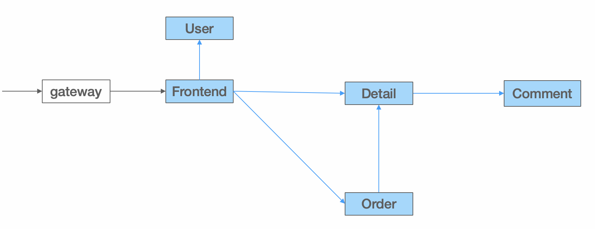
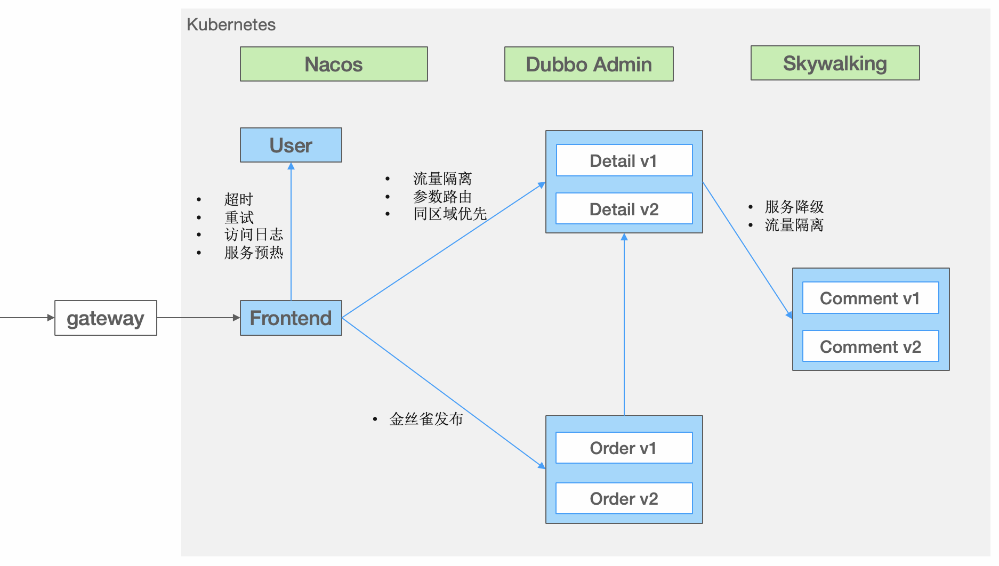
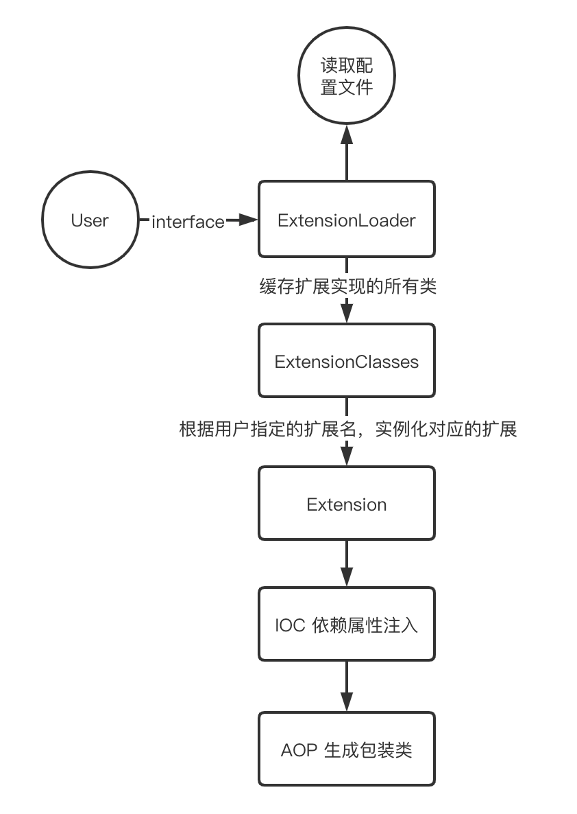

# 目录 
1.dubbo入门  
2.dubbo功能  

## 1.dubbo入门  
**目录:**  
1.1 dubbo基本介绍  
1.2 体会dubbo的第一个示例  
1.3 使用dubbo开发微服务项目  
1.4 dubbo架构介绍  
1.5 dubbo与gRPC、Spring Cloud、Istio的关系  
1.6 核心优势  

### 1.1 dubbo基本介绍
1.背景  
dubbo是一个微服务框架,用于向用户提供`跨进程`的RPC`远程调用`;如下图所示,服务消费者可以通过注册中心(`zookeeper`)感知服务提供者,从而将请求发送给正确的服务提供者.  
  
一句话总结,什么是dubbo:<font color="#FF00FF">dubbo是一款支持云原生的高性能的RPC调用框架,同时dubbo在云原生+服务网格、服务开发框架层面、通信协议、服务治理、可视化等方面更加优秀</font>,解决了SpringCloud体系的各种问题.

### 1.2 体会dubbo的第一个示例
1.获取dubbo演示代码  
*提示:这里通过完成一个dubbo的远程调用来演示dubbo的效果*  
执行如下命令从获取项目代码:  
`git clone --depth=1 --branch master git@github.com:apache/dubbo-samples.git`  

2.项目结构  
下载后的项目结构如下:  
```console
.
├── codestyle        // 开发使用的 style 配置文件

├── 1-basic          // 基础的入门用例
├── 2-advanced       // 高级用法
├── 3-extensions     // 扩展使用示例
├── 4-governance     // 服务治理用例
├── 10-task          // Dubbo 学习系列示例

├── 99-integration   // 集成测试使用
├── test             // 集成测试使用
└── tools            // 三方组件快速启动工具
```
项目代码结构由三部分构成:代码风格文件、测试代码、集成测试  
* 代码风格:是开发dubbo代码时使用的,其中包括IDEA的配置文件
* 测试代码:教材的核心内容,其中包括五个部分  
  面向初学者的basic入门用例  
  面向开发人员的advanced高级用法  
  面向中间件维护者的extensions Dubbo周边扩展使用示例  
  面向生产的governance服务治理用例
  Dubbo学习系列
* 集成测试:是dubbo自身用于测试`测试代码`中所有sample示例是否正常的部分,保证dubbo每个版本的变更不会影响sample示例的使用  

3.启动zookpeer  
*提示:dubbo需要使用服务注册中心zookpeer,这里采用docker的方式启动*  
执行如下命令安装zookpeer  
```shell
docker run \
--name dubbo-zookeeper \
-p 2181:2181 \
-d zookeeper
```
启动成功之后查看docker日志:  
  

4.启动服务提供者  
在IDEA中点击右侧的Maven,执行`clean->compile`  
  

运行1-basic->dubbo-samples-api->provider->application示例启动服务提供者  
等待控制台出现如下字样则代表启动成功:  
```shell
11:16:01.973 |-INFO  [main] he.dubbo.config.bootstrap.DubboBootstrap:322 -|  [DUBBO] DubboBootstrap awaiting ..., dubbo version: 3.3.0-beta.1, current host: 192.168.149.1
```

5.启动服务消费者  
运行1-basic->dubbo-samples-api->client->application  
消费者启动成功后看到控制台打印如下内容表示一次服务调用成功:  
```shell
Receive result ======> hi, dubbo
```

6.1 消费者是如何发现提供者的?  

6.2 消费者发起请求的流程  
在Dubbo的调用模型中,`Dubbo是连接服务消费者和服务提供者的桥梁`  
在本例中,服务提供者实现了GreetingsService接口,具体代码如下:  
```java
public class GreetingsServiceImpl implements GreetingsService {
    @Override
    public String sayHi(String name) {
        return "hi, " + name;
    }
}
```

同时服务消费者通过Dubbo订阅了该接口  
```java
public interface GreetingsService {
    String sayHi(String name);
}
```
服务消费者调用接口的过程中,Dubbo会将该请求封装成网络请求;接着将该请求发送到服务提供者进行实际的调用.  

实际上服务消费者是通过Dubbo的动态代理来实现的;具体代码如下:  
```java
ReferenceConfig<GreetingsService> reference =
        ReferenceBuilder.<GreetingsService>newBuilder()
        .interfaceClass(GreetingsService.class)
        .url("tri://localhost:50052")
        .build();
DubboBootstrap.getInstance().reference(reference).start();
GreetingsService service = reference.get();

String message = service.sayHi("dubbo");

System.out.println("Receive result ======> " + message);
```

6.3 多个服务提供者实例  
*提示:dubbo也是支持多个服务提供者供消费者进行调用的*  
这里只需要修改GreetingsServiceImpl接口sayHi方法中的实现,然后启动三个不同实现内容的服务提供者,接着让服务消费者去调用接口,会发现这些请求被随机分配到不同的服务提供者上.  

6.4 dubbo启动示例  
**服务提供者代码示例如下:**  
```java
// 修改1-basic->dubbo-samples-api->provider->application中的代码如下  
// 定义所有的服务
ServiceConfig<GreetingsService> service = new ServiceConfig<>();
service.setInterface(GreetingsService.class);
service.setRef(new GreetingsServiceImpl());

// 启动 Dubbo
DubboBootstrap.getInstance()
        .application("first-dubbo-provider")
        .registry(new RegistryConfig(ZOOKEEPER_ADDRESS))
        .protocol(new ProtocolConfig("dubbo", -1))
        .service(service)
        .start();
``` 

**服务消费者代码示例如下:**  
```java
// 修改1-basic->dubbo-samples-api->client->application
// 定义所有的订阅
ReferenceConfig<GreetingsService> reference = new ReferenceConfig<>();
reference.setInterface(GreetingsService.class);

// 启动 Dubbo
DubboBootstrap.getInstance()
        .application("first-dubbo-consumer")
        .registry(new RegistryConfig(ZOOKEEPER_ADDRESS))
        .reference(reference)
        .start();

// 获取订阅到的 Stub
GreetingsService service = reference.get();
// 像普通的 java 接口一样调用
String message = service.sayHi("dubbo");
```

### 1.3 使用dubbo开发微服务项目
1.启动服务注册中心zookpeer  
参考1.2=>第3步=>启动zookpeer  
本次环境使用Linux的docker方式启动,Linux的IP为:192.168.149.130;zookpeer的端口为`2181`  

2.项目基本环境搭建  
在idea中创建dubbo-springboot-demo根模块,删除根模块的src等信息  
本次环境一共使用三个模块:`dubbo-spring-boot-demo-interface`、`dubbo-spring-boot-demo-provider`、`dubbo-spring-boot-demo-consumer`;分别是公共模块、服务提供者模块、服务消费者模块.  
最终的目录结构如下所示:  
  

3.修改根模块dubbo-springboot-demo的pom配置文件  
配置参考如下:  
```xml
<groupId>org.apache.dubbo</groupId>
<artifactId>dubbo-spring-boot-demo</artifactId>
<version>1.0-SNAPSHOT</version>
<packaging>pom</packaging>

<modules>
    <module>dubbo-spring-boot-demo-interface</module>
    <module>dubbo-spring-boot-demo-provider</module>
    <module>dubbo-spring-boot-demo-consumer</module>
</modules>

<properties>
    <dubbo.version>3.2.0-beta.4</dubbo.version>
    <spring-boot.version>2.7.8</spring-boot.version>
    <maven.compiler.source>17</maven.compiler.source>
    <maven.compiler.target>17</maven.compiler.target>
    <project.build.sourceEncoding>UTF-8</project.build.sourceEncoding>
</properties>

<dependencyManagement>
    <dependencies>
        <!-- Spring Boot -->
        <dependency>
            <groupId>org.springframework.boot</groupId>
            <artifactId>spring-boot-dependencies</artifactId>
            <version>${spring-boot.version}</version>
            <type>pom</type>
            <scope>import</scope>
        </dependency>

        <!-- Dubbo -->
        <dependency>
            <groupId>org.apache.dubbo</groupId>
            <artifactId>dubbo-bom</artifactId>
            <version>${dubbo.version}</version>
            <type>pom</type>
            <scope>import</scope>
        </dependency>

        <dependency>
            <groupId>org.apache.dubbo</groupId>
            <artifactId>dubbo-dependencies-zookeeper-curator5</artifactId>
            <version>${dubbo.version}</version>
            <type>pom</type>
        </dependency>
    </dependencies>
</dependencyManagement>


<build>
    <pluginManagement>
        <plugins>
            <plugin>
                <groupId>org.springframework.boot</groupId>
                <artifactId>spring-boot-maven-plugin</artifactId>
                <version>${spring-boot.version}</version>
            </plugin>
        </plugins>
    </pluginManagement>
</build>
```

4.修改`dubbo-spring-boot-demo-provider`、`dubbo-spring-boot-demo-consumer`模块的pom配置文件  
参考配置如下:  
```xml
<dependencies>
    <dependency>
        <groupId>org.apache.dubbo</groupId>
        <artifactId>dubbo-spring-boot-demo-interface</artifactId>
        <version>${project.parent.version}</version>
    </dependency>

    <!-- dubbo -->
    <dependency>
        <groupId>org.apache.dubbo</groupId>
        <artifactId>dubbo-spring-boot-starter</artifactId>
    </dependency>
    <dependency>
        <groupId>org.apache.dubbo</groupId>
        <artifactId>dubbo-dependencies-zookeeper-curator5</artifactId>
        <type>pom</type>
        <exclusions>
            <exclusion>
                <artifactId>slf4j-reload4j</artifactId>
                <groupId>org.slf4j</groupId>
            </exclusion>
        </exclusions>
    </dependency>

    <!-- spring boot starter -->
    <dependency>
        <groupId>org.springframework.boot</groupId>
        <artifactId>spring-boot-starter</artifactId>
    </dependency>

</dependencies>
```

5.定义服务接口  
*解释:就类似之前OpenFeign需要将远程调用接口单独定义到一个模块中一样*  
来到dubbo-spring-boot-demo-interface模块,创建包`org.apache.dubbo.samples.api`,在该包下创建`DemoService`接口,定义如下:  
```java
public interface DemoService {
    String sayHello(String name);
}
```

6.创建实现类  
在dubbo-spring-boot-demo-provider模块下创建org.apache.dubbo.samples.provider包,在该包下创建第5步定义的接口的实现类DemoServiceImpl  
```java
@DubboService
public class DemoServiceImpl implements DemoService {

    @Override
    public String sayHello(String name) {
        return "Hello " + name;
    }
}
```
**注意:该类被@DubboService注解修饰**

7.配置yml  
dubbo-spring-boot-demo-provider模块的yml配置文件:  
```yml
dubbo:
  application:
    name: dubbo-springboot-demo-provider
  protocol:
    name: dubbo
    port: -1
  registry:
    address: zookeeper://${zookeeper.address:127.0.0.1}:2181
```
dubbo-spring-boot-demo-consumer模块的yml配置文件:  
```yml
dubbo:
  application:
    name: dubbo-springboot-demo-consumer
  protocol:
    name: dubbo
    port: -1
  registry:
    address: zookeeper://${zookeeper.address:127.0.0.1}:2181
```
*注意:可以看到这里的配置使用了${zookeeper.address}这种引用的方式,所以需要对这两个模块启动的配置信息添加`环境变量`,效果如下:*  
  

8.创建启动类  
创建生产者模块的启动类:  
在生产者模块下创建org.apache.dubbo.springboot.demo.provider包,在该包下创建ProviderApplication类  
```java
@SpringBootApplication
@EnableDubbo
public class ProviderApplication {
    public static void main(String[] args) {
        SpringApplication.run(ProviderApplication.class, args);
    }
}
```
*注意:这里使用了@EnableDubbo注解,表示开启dubbo的自动配置*  

创建消费者模块的启动类:  
在消费者模块下创建org.apache.dubbo.springboot.demo.consumer包,在该包下创建ConsumerApplication类  
```java
@SpringBootApplication
@EnableDubbo
public class ConsumerApplication {

    public static void main(String[] args) {
        SpringApplication.run(ConsumerApplication.class, args);
    }
}
```

9.创建消费者请求任务  
在消费者模块的org.apache.dubbo.springboot.demo.consumer包下创建Task类:  
```java
@Component
public class Task implements CommandLineRunner {
    @DubboReference
    private DemoService demoService;

    @Override
    public void run(String... args) throws Exception {
        String result = demoService.sayHello("world");
        System.out.println("Receive result ======> " + result);

        new Thread(()-> {
            while (true) {
                try {
                    Thread.sleep(1000);
                    System.out.println(new Date() + " Receive result ======> " + demoService.sayHello("world"));
                } catch (InterruptedException e) {
                    e.printStackTrace();
                    Thread.currentThread().interrupt();
                }
            }
        }).start();
    }
}
```
*解释:当应用启动时run方法就会执行,这是一个定时任务不停地调用DemoService来实现远程调用*  
**注意:这里的DemoService被`@DubboReference`注解修饰**  

11.测试运行  
确保环境变量已经添加为Linux系统的IP  
首先启动生产者模块(dubbo-spring-boot-demo-provider),再启动消费者模块(dubbo-spring-boot-demo-consumer);  
消费者模块的打印信息如下:  
  

12.QOS问题  
因为dubbo新版本默认对telnet命令添加了支持,并且telnet的默认端口是22222,所以如果在一台服务器里面同时启动consumer和provider可能就会报端口冲突的异常.  
解决的办法可以修改端口也可以取消telnet功能  

### 1.4 dubbo架构介绍
1.dubbo的工作原理  
  
以上是Dubbo的工作原理图,从抽象架构上分为两层:<font color="#00FF00">服务治理抽象控制面</font>和<font color="#00FF00">Dubbo数据面</font>  
*提示:在kong中也有类似的数据面和控制面的概念,服务网格中对控制平面和数据平面有更全面的解释*  
* 服务治理控制面:  
  服务治理控制面不是特指如注册中心类的单个具体组件,而是对Dubbo治理体系的抽象表达.控制面包含<font color="#00FF00">协调服务发现的注册中心、流量管控策略、Dubbo Admin控制台等,如果采用了Service Mesh架构则还包含Istio等服务网格控制面</font>  
* Dubbo数据面:  
  数据面代表集群部署的所有<font color="#00FF00">Dubbo进程</font>(所有微服务模块),进程之间通过`RPC`协议实现数据交换,Dubbo定义了微服务应用开发与调用规范并负责完成数据传输的编解码工作  
  * 服务消费者(Dubbo Consumer),发起业务调用或RPC通信的Dubbo进程
  * 服务提供者(Dubbo Provider),接收业务调用或RPC通信的Dubbo进程

2.Dubbo数据面  
从数据面视角,dubbo解决了如下问题(dubbo的作用):  
* Dubbo作为`服务开发框架`约束了微服务定义、开发与调用的规范,定义了服务治理流程及适配模式
* Dubbo作为`RPC通信协议实现`解决服务间数据传输的编解码问题

  

3.服务开发框架  
微服务的目标是构建足够小的、自包含的、独立演进的、可以随时部署运行的分布式应用程序;Dubbo在微服务应用开发框架之上抽象了一套**RPC服务定义、暴露、调用与治理的编程规范**;从而解决各个微服务模块之间的各种调用问题;说白了就是dubbo就是一个微服务框架.  
  

Dubbo作为服务开发框架包含的具体内容如下:  
* RPC服务定义、开发范式:Dubbo支持通过IDL定义服务,也支持编程语言特有的服务开发定义方式,如通过Java Interface定义服务
* RPC服务发布与调用API:Dubbo支持同步、异步、Reactive Streaming等服务调用编程模式,还支持请求上下文API、设置超时时间等
* 服务治理策略、流程与适配方式:作为服务框架数据面,Dubbo定义了服务地址发现、负载均衡策略、基于规则的流量路由、Metrics 指标采集等服务治理抽象,并适配到特定的产品实现

4.通信协议  
Dubbo从设计上不绑定任何一款特定通信协议,dubbo**支持HTTP/2、REST、gRPC、JsonRPC、Thrift、Hessian2等几乎所有主流的通信协议**.  
*提示:采用这种多协议的好处是,可以根据场景自由选择不同的协议,提高了灵活性*  
  
特点:  
* dubbo支持协议扩展,dubbo支持将内部私有协议适配到dubbo框架上.  
* dubbo支持多协议暴露,<font color="#00FF00">可以在单个端口上暴露多个协议</font>;dubbo能够自动识别并确保请求被正确处理;<font color="#00FF00">也可以将同一个RPC服务发布在不同的端口</font>  

特点总结:  
* 不绑定通信协议(<font color="#00FF00">支持多任意通信协议</font>)
* 提供高性能通信协议实现
* 支持流式通信模型
* 不绑定序列化协议
* 支持单个服务的多协议暴露
* 支持单端口多协议发布
* 支持一个应用内多个服务使用不同通信协议

5.dubbo服务治理  
**什么是服务治理:**  
`服务开发框架`解决了开发与通信的问题;但在微服务集群环境下,我们仍需要解决<font color="#00FF00">无状态服务节点动态变化、外部化配置、日志跟踪、可观测性、流量管理、高可用性、数据一致性</font>等一系列问题,我们将这些问题统称为服务治理

dubbo抽象了一套微服务治理模式并发布了对应的官方实现,服务治理可帮助简化微服务开发与运维,让开发者更专注在微服务业务本身  
dubbo服务治理功能:  
  

* 地址发现:  
  Dubbo服务发现具备高性能、支持大规模集群、服务级元数据配置等优势,默认提供 Nacos、Zookeeper、Consul等多种注册中心适配,与 Spring Cloud、Kubernetes Service模型打通,支持自定义扩展
* 负载均衡:  
  Dubbo 默认提供加权随机、加权轮询、最少活跃请求数优先、最短响应时间优先、一致性哈希和自适应负载等策略
* 流量路由:  
  Dubbo支持通过一系列流量规则控制服务调用的流量分布与行为,基于这些规则可以实现基于<font color="#00FF00">权重的比例流量分发、灰度验证、金丝雀发布、按请求参数的路由、同区域优先、超时配置、重试、限流降级</font>等能力.
* 链路追踪:  
  Dubbo官方通过适配OpenTelemetry提供了对Tracing全链路追踪支持,用户可以接入支持OpenTelemetry标准的产品如Skywalking、Zipkin等.另外,很多社区如Skywalking、Zipkin等在官方也提供了对Dubbo的适配
* 可观测性:  
  Dubbo实例通过<font color="#00FF00">Prometheus</font>等上报QPS、RT、请求次数、成功率、异常次数等多维度的可观测指标帮助了解服务运行状态,通过接入Grafana、Admin控制台帮助实现数据指标可视化展示

6.dubbo admin  
Admin dashboard提供了dubbo的集群可视化,通过admin可以来管理dubbo  
  

7.服务网格  
将Dubbo接入Istio等服务网格治理体系  
  

8.总结  
<font color="#FF00FF">dubbo是一款支持云原生的高性能的RPC调用框架,同时dubbo在云原生+服务网格、服务开发框架层面、通信协议、服务治理、可视化等方面更加优秀</font>,解决了SpringCloud体系的各种问题  


### 1.5 dubbo与gRPC、Spring Cloud、Istio的关系
1.dubbo与springcloud  
  

共同点:  
* Dubbo和Spring Cloud<font color="#00FF00">都侧重在对分布式系统中常见问题模式的抽象</font>(如服务发现、负载均衡、动态配置等),同时对每一个问题都提供了配套组件实现,形成了一套微服务整体解决方案,让使用Dubbo及Spring Cloud的用户在开发微服务应用时可以专注在业务逻辑开发上
* <font color="#00FF00">Dubbo和Spring Cloud都完全兼容Spring体系的应用开发模式</font>
  为什么说dubbo和springcloud都完全兼容spring体系的开发,这句话很有韵味;因为springcloud是基于spring的一个微服务解决方案  

Spring Cloud的优势:  
* 同样都支持Spring开发体系的情况下,Spring Cloud得到更多的原生支持
* 对一些常用的微服务模式做了抽象如服务发现、动态配置、异步消息等,同时包括一些批处理任务、定时任务、持久化数据访问等领域也有涉猎
* 基于HTTP的通信模式,加上相对比较完善的入门文档和演示demo和starters,让开发者在第一感觉上更易于上手

Spring Cloud的问题:  
* 只提供抽象模式的定义不提供官方稳定实现,开发者只能寻求类似Netflix、Alibaba、Azure等不同厂商的实现套件,而每个厂商支持的完善度、稳定性、活跃度各异
* 有微服务全家桶却不是能拿来就用的全家桶,demo上手容易,但落地推广与长期使用的成本非常高
* <font color="#00FF00">欠缺服务治理能力</font>,尤其是流量管控方面如负载均衡、流量路由方面能力都比较弱
* <font color="#00FF00">编程模型与通信协议绑定HTTP</font>,在性能、与其他RPC体系互通上存在障碍
* 总体架构与实现只适用于小规模微服务集群实践,当集群规模增长后就会遇到地址推送效率、内存占用等各种瓶颈的问题,但此时迁移到其他体系却很难实现
* 很多微服务实践场景的问题需要用户独自解决,比如优雅停机、启动预热、服务测试,再比如双注册、双订阅、延迟注册、服务按分组隔离、集群容错等
* 代码侵入性太强,业务代码与服务治理代码打包在一起

springcloud的劣势就是dubbo的优势:  
* 完全支持Spring&Spring Boot开发模式,同时在服务发现、动态配置等基础模式上提供与Spring Cloud对等的能力
* 是企业级微服务实践方案的整体输出,Dubbo考虑到了企业微服务实践中会遇到的各种问题如优雅上下线、多注册中心、流量管理等,因此其在生产环境的长期维护成本更低
* 在通信协议和编码上选择更灵活,包括rpc通信层协议如HTTP、HTTP/2(Triple、gRPC)、TCP二进制协议、rest等,序列化编码协议Protobuf、JSON、Hessian2等,支持单端口多协议
* Dubbo从设计上突出服务服务治理能力,如权重动态调整、标签路由、条件路由等,支持Proxyless等多种模式接入Service Mesh体系
* 高性能的RPC协议编码与实现
* Dubbo是在超大规模微服务集群实践场景下开发的框架,可以做到百万实例规模的集群水平扩容,应对集群增长带来的各种问题
* Dubbo提供Java外的多语言实现,使得构建多语言异构的微服务体系成为可能

2.dubbo与gRPC  
Dubbo与gRPC最大的差异在于两者的定位上:
* <font color="#00FF00">gRPC定位为一款RPC框架</font>,Google推出它的核心目标是定义云原生时代的rpc通信规范与标准实现;
* Dubbo定位是一款<font color="#00FF00">微服务开发框架</font>,它侧重解决微服务实践从服务定义、开发、通信到治理的问题,因此Dubbo同时提供了RPC通信、与应用开发框架的适配、服务治理等能力

Dubbo服务间可通过多种RPC协议通信并支持灵活切换.因此,可以在Dubbo开发的微服务中选用gRPC通信,Dubbo完全兼容gRPC,并将gRPC设计为内置原生支持的协议之一  
  

3.dubbo与Istio  
Service Mesh是近年来在云原生背景下诞生的一种微服务架构,<font color="#FF00FF">在Kubernetes体系下</font>,让微服务开发中的更多能力如流量拦截、服务治理等<font color="#FF00FF">下沉并成为基础设施</font>,让微服务开发、升级更轻量.Istio是Service Mesh的开源代表实现,它从部署架构上分为<font color="#00FF00">数据面与控制面</font>,从这一点上与Dubbo总体架构是基本一致的,Istio带来的主要变化在于:  
* 数据面,Istio通过引入<font color="#FF00FF">Sidecar</font>实现了对服务流量的透明拦截,<font color="#FF00FF">Sidecar通常是与Dubbo等开发的传统微服务组件部署在一起</font>
* 控制面,将之前抽象的服务治理中心聚合为一个具有统一实现的具体组件,并实现了与底层基础设施如Kubernetes无缝适配

Dubbo已经实现了对Istio体系的全面接入,可以用Istio控制面治理Dubbo服务,而在数据面部署架构上,针对Sidecar引入的复杂性与性能问题,Dubbo还支持无代理的Proxyless模式.除此之外,Dubbo Mesh体系还解决了Istio架构落地过程中的很多问题,包括提供更灵活的数据面部署架构、更低的迁移成本等  
  

### 1.6 核心优势  
**目录:**  
1.6.1 快速易用  
1.6.2 超高性能  

#### 1.6.1 快速易用
1.支持多种编程语言、使用任意通信协议  

2.支持多种语言SDK  
dubbo提供了几乎所有主流语言的SDK实现,定义了<font color="#00FF00">统一的微服务开发范式</font>  

3.任意通信协议  
Dubbo从设计上不绑定任何一款特定通信协议,dubbo**支持HTTP/2、REST、gRPC、JsonRPC、Thrift、Hessian2等几乎所有主流的通信协议**.  
*提示:采用这种多协议的好处是,可以根据场景自由选择不同的协议,提高了灵活性*  
  
特点:  
* dubbo支持协议扩展,dubbo支持将内部私有协议适配到dubbo框架上.  
* dubbo支持多协议暴露,<font color="#00FF00">可以在单个端口上暴露多个协议</font>;dubbo能够自动识别并确保请求被正确处理;<font color="#00FF00">也可以将同一个RPC服务发布在不同的端口</font>  

#### 1.6.2 超高性能  
1.高性能数据传输
Dubbo内置支持<font color="#FF00FF">Dubbo2、Triple</font>两款高性能通信协议:  
* Dubbo2是基于TCP传输协议之上构建的二进制私有RPC通信协议,是一款非常简单、紧凑、高效的通信协议
* Triple是基于HTTP/2的新一代RPC通信协议,在网关穿透性、通用性以及Streaming通信上具备优势,<font color="#00FF00">Triple完全兼容gRPC协议</font>

2.性能对比  
* 较小报文场景createUser(创建用户)、existUser(判断用户是否存在,返回仅仅是Boolean)、getUser(得到用户信息),dubbo3.2版本的<font color="#FF00FF">Triple</font>协议性能与gRPC同场景性能基本持平
* <font color="#DDDD00">较大报文场景listUser(展示所有用户)相较于gRPC性能低11%</font>
  *性能还是比不过gRPC*

3.构建可伸缩的微服务集群  
* 注册中心的存储容量瓶颈
* 节点动态变化带来的地址推送与解析效率下降
* 消费端存储大量网络地址的资源开销
* 复杂的网络链接管理
* 高峰期的流量无损上下线
* 异常节点的自动节点管理

以上内容直接关系到微服务集群的稳定性,dubbo的优势就在于几乎无限水平扩容的集群规模,dubbo就是着重解决上述问题的  

4.智能化流量调度  
Dubbo3内置了具备自适应感知集群负载状态、智能调节流量分布的限流与调度算法实现,从消费者、提供者两个不同视角智能调整流量分布,<font color="#00FF00">最大限度确保将流量调度到具有最佳处理能力的实例上,从而提升整个集群的吞吐量与稳定性</font>.

5.自适应负载均衡  
更加高级的负载均衡算法,这里是针对于Ribbon的负载均衡算法来说的  

6.自适应限流  
<font color="#00FF00">传统的sentinel是提前对服务器进行压测从而找到节点平衡值,设置的是一个<font color="#FF00FF">静态</font>的最大并发值</font>自适应限流算法可以<font color="#FF00FF">动态调整</font>服务端机器的最大并发值,使其可以在保证机器不过载的前提下,尽可能多的处理接收到的请求.


## 2.dubbo功能
*提示:这里说的功能主要说的就是dubbo具备哪些服务治理的能力,概念比较多;本章基本上是对附录=>1.dubbo入门=>1.4dubbo架构介绍,这一节中提到的dubbo诸多功能更加详细介绍*  
**目录:**  
2.1 微服务开发  
2.2 服务发现  
2.3 负载均衡  
2.4 负载均衡  
2.5 流量管理  
2.x 服务发现(补充)  


### 2.1 微服务开发
详情见:附录=>1.dubbo入门=>1.3使用dubbo开发微服务项目  

### 2.2 服务发现
dubbo提供的是一种`Client-Based`的服务发现机制,依赖第三方注册中心组件来协调服务发现过程,支持常见的注册中心,如Nacos、Consul、zookpeer  

1.面向百万示例集群的服务发现机制  
  
dubbo相较于传统的服务发现框架有如下优势:  
* 首先,Dubbo注册中心以<font color="#FF00FF">应用粒度</font>聚合实例数据,消费者按消费需求<font color="#00FF00">精准订阅</font>,避免了大多数开源框架如Istio、Spring Cloud等全量订阅带来的性能瓶颈
  <font color="#FF00FF">Dubbo是精确订阅不是全量订阅,并且是以应用粒度聚合示例,应用粒度对应的是服务粒度,应用粒度更粗从而能避免更多的数据开销</font>
* 其次,Dubbo SDK在实现上对<font color="#00FF00">消费端地址列表处理过程做了大量优化,地址通知增加了异步、缓存、bitmap等多种解析优化</font>,避免了地址更新常出现的消费端进程资源波动
* 最后,在功能丰富度和易用性上,服务发现除了同步ip、port等端点基本信息到消费者外,Dubbo还将服务端的RPC/HTTP服务及其配置的<font color="#FF00FF">元数据</font>信息同步到消费端,这让消费者、提供者两端的更细粒度的协作成为可能,Dubbo基于此机制提供了很多差异化的治理能力
  <font color="#FF00FF">dubbo还同步了元数据信息</font>

2.高效地址推送实现  
dubbo3是以<font color="#FF00FF">应用粒度</font>聚合实例数据,从而减少传输的数据量,提升了性能,并且dubbo3实现了<font color="#FF00FF">按需精准订阅地址信息</font>,比如一个消费者依赖app1、app2则只会订阅app1、app2的地址列表更新,大幅减轻了冗余数据推送.  
  

3.元数据配置  
除了与注册中心的交互,dubbo3还有一条额外的元数据通路;即元数据服务(MetadataService),实例地址与元数据共同组成了消费者端有效的地址列表  
  
完整工作流程如上图所示,首先消费者中注册中心收到地址(ip:port)信息,<font color="#00FF00">然后与提供者建立连接并通过元数据服务读取到对端元数据配置信息</font>(也就是说元数据不是从注册中心中获取的),两部分信息共同组装成dubbo消费端有效的面向服务的地址列表.  

4.配置方式  
dubbo服务发现支持多种注册中心组件,例如nacos、zookpeer、consul、Redis  
dubbo还支持一个应用内配置<font color="#00FF00">多注册中心</font>的场景,例如双注册、双订阅.由此可以实现<font color="#FF00FF">不同集群地址数据互通、集群迁移</font>等场景  

### 2.3 负载均衡
1.负载均衡策略  
dubbo提供了如下的负载均衡策略  
|             算法              |          特性           |                         备注                         |
|:-----------------------------:|:-----------------------:|:----------------------------------------------------:|
|  Weighted Random LoadBalance  |        加权随机         |                默认算法,默认权重相同                |
|    RoundRobin LoadBalance     |        加权轮询         |   借鉴于Nginx的平滑加权轮询算法,默认权重相同,    |
|    LeastActive LoadBalance    | 最少活跃优先 + 加权随机 |                 背后是能者多劳的思想                 |
| Shortest-Response LoadBalance | 最短响应优先 + 加权随机 |                   更加关注响应速度                   |
|  ConsistentHash LoadBalance   |       一致性哈希        |      确定的入参,确定的提供者,适用于有状态请求      |
|        P2C LoadBalance        |   Power of Two Choice   | 随机选择两个节点后,继续选择"连接数"较小的那个节点 |
|     Adaptive LoadBalance      |     自适应负载均衡      |  在P2C算法基础上,选择二者中load最小的那个节点   |

*提示:每种算法的详细介绍这里就不贴了,详情可参照官网*  


### 2.5 流量管理
**目录:**  
2.5.1 流量管理介绍  
2.5.2 条件路由  
2.5.3 标签路由  
2.5.4 脚本路由  
2.5.5 动态配置  
2.5.6 限流与熔断  

#### 2.5.1 流量管理介绍


### 2.x 服务发现(补充)
https://cn.dubbo.apache.org/zh-cn/blog/2023/01/30/dubbo3-%E5%BA%94%E7%94%A8%E7%BA%A7%E6%9C%8D%E5%8A%A1%E5%8F%91%E7%8E%B0%E8%AE%BE%E8%AE%A1/
