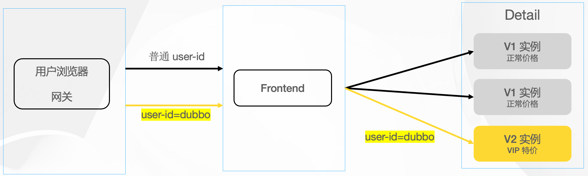

# 目录  
1.任务  


## 1.任务  
**目录:**  
1.1 开发任务  
1.2 部署服务  
1.3 流量管理  
1.4 微服务生态  
1.5 观测服务  

### 1.1 开发任务
**目录:**  
1.1.1 发布调用dubbo  
1.1.2 异步调用  
1.1.3 版本与分组  
1.1.4 上下文参数传递  
1.1.5 泛化调用  
1.1.6 IDL开发服务  


#### 1.1 发布调用dubbo  
1.编写pom  
*提示:本次示例基于springboot3.0,本次案例来源于dubbo-sample=>1-basic=>dubbo-samples-spring-boot*  
```xml
<!-- registry dependency -->
<dependency>
    <groupId>com.alibaba.nacos</groupId>
    <artifactId>nacos-client</artifactId>
    <version>${nacos.version}</version>
</dependency>

<!-- dubbo dependency-->
<dependency>
    <groupId>org.apache.dubbo</groupId>
    <artifactId>dubbo-spring-boot-starter</artifactId>
    <version>${dubbo.version}</version>
</dependency>

<dependency>
    <groupId>org.springframework.boot</groupId>
    <artifactId>spring-boot-starter</artifactId>
</dependency>
```

2.定义服务接口  
类似于OpenFeign一样需要定义一个服务接口  
```java
public interface DemoService {
    String sayHello(String name);
}
```

3.服务接口实现  
```java
@DubboService
public class DemoServiceImpl implements DemoService {
    @Override
    public String sayHello(String name) {
        return "Hello " + name;
    }
}
```
*提示:这里需要使用@DubboService注解将服务注册到Spring中*  

4.服务消费者  
```java
@Component
public class Task implements CommandLineRunner {
    @DubboReference
    private DemoService demoService;

    @Override
    public void run(String... args) throws Exception {
        String result = demoService.sayHello("world");
        System.out.println("Receive result ======> " + result);

        new Thread(()-> {
            while (true) {
                try {
                    Thread.sleep(1000);
                    System.out.println(new Date() + " Receive result ======> " + demoService.sayHello("world"));
                } catch (InterruptedException e) {
                    e.printStackTrace();
                    Thread.currentThread().interrupt();
                }
            }
        }).start();
    }
}
```
*提示:通过@DubboReference注解对需要调用的服务进行依赖注入*  

5.编写服务消费者和服务生产者的yml  
```yml
dubbo:
  application:
    # 这里是服务提供者,如果是服务消费者就使用服务消费者的名称
    name: dubbo-springboot-demo-provider
    # 关闭qos
    qos-enable: false
  protocol:
    name: dubbo
    port: -1
  registry:
    # 选择一个合适的注册中心,推荐使用nacos
    # address: nacos://${nacos.address:192.168.230.128}:8848?username=nacos&password=nacos
    # address: zookeeper://${zookeeper.address:192.168.230.128}:2181
```

6.编写服务消费者和服务提供者的启动类  
```java
@SpringBootApplication
@EnableDubbo
public class ConsumerApplication {

    public static void main(String[] args) {
        SpringApplication.run(ConsumerApplication.class, args);
    }
}
```
*提示:不管是服务消费者还是服务提供者,都需要在启动类上标注@EnableDubbo注解*  

7.运行  
运行成功后在消费者控制台成功打印如下内容  
  
同理查看远程nacos的信息  
服务列表和配置列表两个地方都有了两个微服务的相关信息,并且点击进入服务消费者或者服务生产者的详情会看到当前服务的元数据信息  
  

#### 1.1.2 异步调用
*提示:本节的示例来自dubbo-sample->2-advanced->dubbo-samples-async-simple-boot*  

1.接口定义  
```java
public interface AsyncService {
    /**
     * 同步调用方法
     */
    String invoke(String param);
    /**
     * 异步调用方法
     */
    CompletableFuture<String> asyncInvoke(String param);
}
```

2.服务实现  
```java
@DubboService
public class AsyncServiceImpl implements AsyncService {

    @Override
    public String invoke(String param) {
        try {
            long time = ThreadLocalRandom.current().nextLong(1000);
            Thread.sleep(time);
            StringBuilder s = new StringBuilder();
            s.append("AsyncService invoke param:").append(param).append(",sleep:").append(time);
            return s.toString();
        }
        catch (InterruptedException e) {
            Thread.currentThread().interrupt();
        }
        return null;
    }

    @Override
    public CompletableFuture<String> asyncInvoke(String param) {
        // 建议为supplyAsync提供自定义线程池
        return CompletableFuture.supplyAsync(() -> {
            try {
                // Do something
                long time = ThreadLocalRandom.current().nextLong(1000);
                Thread.sleep(time);
                StringBuilder s = new StringBuilder();
                s.append("AsyncService asyncInvoke param:").append(param).append(",sleep:").append(time);
                return s.toString();
            } catch (InterruptedException e) {
                Thread.currentThread().interrupt();
            }
            return null;
        });
    }
}
```
通过`return CompletableFuture.supplyAsync()`,业务执行已从Dubbo线程切换到业务线程,避免了对Dubbo线程池的阻塞  
**理解:** 这句话是什么意思?每当来一个请求Dubbo都会起一个线程去处理,假设该线程要执行的业务方法时长非常长,则该线程会一直阻塞处理不被利用,而现在dubbo调用`asyncInvoke()`方法,该方法快速返回一个CompletableFuture接口不阻塞,dubbo拿到该返回对象就会自动使用业务线程来执行该方法,dubbo线程会立即得到释放,等到执行完毕之后再将结果返回出去.  

3.消费端异步  
```java
@DubboReference
private AsyncService asyncService;

@Override
public void run(String... args) throws Exception {
    //调用异步接口
    CompletableFuture<String> future1 = asyncService.asyncInvoke("async call request1");
    future1.whenComplete((v, t) -> {
        if (t != null) {
            t.printStackTrace();
        } else {
            System.out.println("AsyncTask Response-1: " + v);
        }
    });
    //两次调用并非顺序返回
    CompletableFuture<String> future2 = asyncService.asyncInvoke("async call request2");
    future2.whenComplete((v, t) -> {
        if (t != null) {
            t.printStackTrace();
        } else {
            System.out.println("AsyncTask Response-2: " + v);
        }
    });
    //consumer异步调用
    CompletableFuture<String> future3 =  CompletableFuture.supplyAsync(() -> {
        return asyncService.invoke("invoke call request3");
    });
    future3.whenComplete((v, t) -> {
        if (t != null) {
            t.printStackTrace();
        } else {
            System.out.println("AsyncTask Response-3: " + v);
        }
    });

    System.out.println("AsyncTask Executed before response return.");
}
```
*提示:这里的whenComplete()方法并不会阻塞,这样就可以做到同时发送多个远程调用,而不是等一个远程调用处理完毕之后再处理一个远程调用;这里的三个远程全是异步的*  

4.使用场景  
* 对于服务提供者来说,如果接口比较耗时,避免dubbo线程被阻塞,可以使用异步将线程切换到业务线程
* 对于服务消费者来说,要一次性调用多个dubbo接口,并且这些接口在时间上没有严格的顺序就可以使用异步调用
  最终组装数据的时候可以同步等待所有接口返回完毕后再组装数据,这个例子可以看之前的尚上优选项目


#### 1.1.3 版本与分组  
在dubbo中接口并不能唯一确定一个服务,<font color="#00FF00">只有接口+分组+版本号才能唯一确定一个服务</font>
*提示:本节的示例可以参考dubbo-sample->2-advanced->dubbo-samples-group*  
1.使用场景  
* 当同一个接口针对不同的业务场景、不同的使用需求或者不同的功能模块等场景,可使用服务分组来区分不同的实现方式.同时,这些不同实现所提供的服务是可并存的,也支持互相调用
* <font color="#00FF00">当接口实现需要升级又要保留原有实现的情况下,即出现不兼容升级时,我们可以使用不同版本号进行区分</font>

2.接口定义  
```java
public interface DevelopService {
    String invoke(String param);
}
```

3.接口实现  
使用`@DubboService`注解,添加group参数和version参数  
**接口实现1**  
```java
@DubboService(group = "group1",version = "1.0")
public class DevelopProviderServiceV1 implements DevelopService{
    @Override
    public String invoke(String param) {
        StringBuilder s = new StringBuilder();
        s.append("ServiceV1 param:").append(param);
        return s.toString();
    }
}
```

**接口实现2**  
```java
@DubboService(group = "group2",version = "2.0")
public class DevelopProviderServiceV2 implements DevelopService{
    @Override
    public String invoke(String param) {
        StringBuilder s = new StringBuilder();
        s.append("ServiceV2 param:").append(param);
        return s.toString();
    }
}
```

4.客户端调用  
> 使用`@DubboReference`注解,添加group参数和version参数  

```java
@DubboReference(group = "group1",version = "1.0")
private DevelopService developService;

@DubboReference(group = "group2",version = "2.0")
private DevelopService developServiceV2;

@Override
public void run(String... args) throws Exception {
    //调用DevelopService的group1分组实现
    System.out.println("Dubbo Remote Return ======> " + developService.invoke("1"));
    //调用DevelopService的group2分组实现
    System.out.println("Dubbo Remote Return ======> " + developServiceV2.invoke("2"));
}
```

4.小总结  
某个服务接口需要通过<font color="#FF00FF">接口+分组+版本号</font>才能唯一确定,这点相较于OpenFeign优势就非常大了  


#### 1.1.4 上下文参数传递
*提示:本节的示例可以参考dubbo-sample->2-advanced->dubbo-samples-async-simple-boot*  

在Dubbo3中,RpcContext被拆分为四大模块,它们分别担任不同的职责:  
* ServiceContext:在Dubbo内部使用,用于传递调用链路上的参数信息,如invoker对象等
* ClientAttachment:在Client端使用,往ClientAttachment中写入的参数将被传递到Server端
* ServerAttachment:在Server端使用,从ServerAttachment中读取的参数是从Client中传递过来的
  ServerAttachment和ClientAttachment是对应的
* ServerContext:在Client端和Server端使用,用于从Server端回传Client端使用,Server端写入到ServerContext的参数在调用结束后可以在Client端的ServerContext获取到

流程图大致如下  
  


1.接口定义  
*提示:setAttachment设置的KV对,在完成下面一次远程调用会被清空,即多次远程调用要多次设置*  
```java
public interface ContextService {
    String invoke(String param);
}
```

2.服务实现  
```java
@DubboService
public class ContextServiceImpl implements ContextService{
    @Override
    public String invoke(String param) {
        //ServerAttachment接收客户端传递过来的参数
        Map<String, Object> serverAttachments = RpcContext.getServerAttachment().getObjectAttachments();
        System.out.println("ContextService serverAttachments:" + JSON.toJSONString(serverAttachments));
        //往客户端传递参数
        RpcContext.getServerContext().setAttachment("serverKey","serverValue");
        StringBuilder s = new StringBuilder();
        s.append("ContextService param:").append(param);
        return s.toString();
    }
}
```
`setAttachment`方法是设置一个KV键值对  
其中path、group、version、dubbo、token、timeout这几个字段是保留字段,不可以设置  

3.接口调用  
```java
//往服务端传递参数
RpcContext.getClientAttachment().setAttachment("clientKey1","clientValue1");
String res = contextService.invoke("context1");
//接收传递回来参数
Map<String, Object> clientAttachment = RpcContext.getServerContext().getObjectAttachments();
System.out.println("ContextTask clientAttachment:" + JSON.toJSONString(clientAttachment));
System.out.println("ContextService Return : " + res);
```

#### 1.1.5 泛化调用
泛化调用:是指调用方没有服务方提供的API(SDK)的情况下,对服务方进行调用,并且可以正常拿到调用结果  
之前的实验结果有一个前提是服务消费者拥有<font color="#00FF00">定义的接口</font>并且使用`@DubboReference`直接依赖注入了该接口,假设现在服务消费者没有该接口的定义,则如何调用目标服务并拿到返回值便是泛化调用  

*提示:本节示例参考自2-advanced=>dubbo-samples-generic=>dubbo-samples-generic-call*  

1.接口定义  
```java
public interface DevelopService {
    String invoke(String param);
}
```

2.接口实现1  
```java
@DubboService(group = "group1",version = "1.0")
public class DevelopProviderServiceV1 implements DevelopService{
    @Override
    public String invoke(String param) {
        StringBuilder s = new StringBuilder();
        s.append("ServiceV1 param:").append(param);
        return s.toString();
    }
}
```

3.消费者调用  
```java
@Component
public class GenericTask implements CommandLineRunner {

    @Override
    public void run(String... args) throws Exception {
        GenericService genericService = buildGenericService("org.apache.dubbo.samples.develop.DevelopService","group2","2.0");
        //传入需要调用的方法,参数类型列表,参数列表
        Object result = genericService.$invoke("invoke", new String[]{"java.lang.String"}, new Object[]{"g1"});
        System.out.println("GenericTask Response: " + JSON.toJSONString(result));
    }

    private GenericService buildGenericService(String interfaceClass, String group, String version) {
        ReferenceConfig<GenericService> reference = new ReferenceConfig<>();
        reference.setInterface(interfaceClass);
        reference.setVersion(version);
        //开启泛化调用
        reference.setGeneric("true");
        reference.setTimeout(30000);
        reference.setGroup(group);
        ReferenceCache cache = SimpleReferenceCache.getCache();
        try {
            return cache.get(reference);
        } catch (Exception e) {
            throw new RuntimeException(e.getMessage());
        }
    }
}
```

#### 1.1.6 IDL开发服务
Dubbo开发的基本流程是:用户定义RPC服务,通过约定的配置方式将RPC声明为dubbo服务,然后就可以基于服务API进行变成了,<font color="#00FF00">对服务提供者来说是提供RPC服务的具体实现,而对服务消费者来说则是使用特定数据发起服务调用</font>.  
我们之前使用的特定数据实际上是依赖注入的`@DubboReference`接口,<font color="#FF00FF">IDL的思想是为了具备通用性,为了能够实现跨语言调用而提出的一种通用的接口定义格式</font>  
*提示:本节内容参考自3-extensions=>protocol=>dubbo-samples-triple*  

1.定义服务  
Dubbo3推荐使用IDL定义跨语言服务  
```proto
syntax = "proto3";

option java_multiple_files = true;
option java_package = "org.apache.dubbo.demo";
option java_outer_classname = "DemoServiceProto";
option objc_class_prefix = "DEMOSRV";

package demoservice;

// The demo service definition.
service DemoService {
  rpc SayHello (HelloRequest) returns (HelloReply) {}
}

// The request message containing the user's name.
message HelloRequest {
  string name = 1;
}

// The response message containing the greetings
message HelloReply {
  string message = 1;
}
```
以上是使用IDL定义服务的一个简单示例(它的作用就类似我们之前定义的Java接口,但为了通用性别的语言肯定没有Java接口这种说法,<font color="#FF00FF">所以就高度抽象出一种语言无关的接口定义,这就是IDL</font>),我们可以把它命名为DemoService.proto,即IDL定义的服务文件名以.proto结尾;<font color="#00FF00">那么这个文件就可以做到一次编写到处使用了</font>  

proto文件中定义了RPC服务名称DemoService与方法签名S`ayHello (HelloRequest) returns (HelloReply) {}`,同时还定义了方法的入参结构体、出参结构体HelloRequest与HelloReply.IDL格式的服务依赖<font color="#00FF00">Protobuf编译器</font>,用来生成可以被用户调用的客户端与服务端编程API,<font color="#DDDD00">Dubbo在原生Protobuf Compiler的基础上提供了适配多种语言的特有插件</font>,框架特有的API与编程模型  
> 使用Dubbo3 IDL定义的服务只允许一个入参与出参,这种形式的服务签名有两个优势,一是对多语言实现更友好,二是可以保证服务的向后兼容性,依赖于Protobuf序列化的兼容性,我们可以很容易的调整传输的数据结构如增、删字段等,完全不用担心接口的兼容性

2.编译服务  
根据当前采用的比编程语言,配置相应的Protobuf插件,编译后将产生生产语言相关的服务定义stub  
Java compiler配置参考(本质是通过Maven插件来实现的)  
```xml
<plugin>
    <groupId>org.xolstice.maven.plugins</groupId>
    <artifactId>protobuf-maven-plugin</artifactId>
    <version>0.6.1</version>
    <configuration>
        <protocArtifact>com.google.protobuf:protoc:${protoc.version}:exe:${os.detected.classifier}
        </protocArtifact>
        <pluginId>grpc-java</pluginId>
        <pluginArtifact>io.grpc:protoc-gen-grpc-java:${grpc.version}:exe:${os.detected.classifier}
        </pluginArtifact>
        <protocPlugins>
            <protocPlugin>
                <id>dubbo</id>
                <groupId>org.apache.dubbo</groupId>
                <artifactId>dubbo-compiler</artifactId>
                <version>3.0.10</version>
                <mainClass>org.apache.dubbo.gen.tri.Dubbo3TripleGenerator</mainClass>
            </protocPlugin>
        </protocPlugins>
    </configuration>
    <executions>
        <execution>
            <goals>
                <goal>compile</goal>
                <goal>test-compile</goal>
                <goal>compile-custom</goal>
                <goal>test-compile-custom</goal>
            </goals>
        </execution>
    </executions>
</plugin>
```

Java语言通过Protobuf生成的stub如下,实际上就是生成之前我们手动定义的那个Java接口  
```java
@javax.annotation.Generated(
value = "by Dubbo generator",
comments = "Source: DemoService.proto")
public interface DemoService {
    static final String JAVA_SERVICE_NAME = "org.apache.dubbo.demo.DemoService";
    static final String SERVICE_NAME = "demoservice.DemoService";

    org.apache.dubbo.demo.HelloReply sayHello(org.apache.dubbo.demo.HelloRequest request);

    CompletableFuture<org.apache.dubbo.demo.HelloReply> sayHelloAsync(org.apache.dubbo.demo.HelloRequest request);
}
```

Go语言生成的stub如下  
```go
func _DUBBO_Greeter_SayHello_Handler(srv interface{}, ctx context.Context, dec func(interface{}) error, interceptor grpc.UnaryServerInterceptor) (interface{}, error) {
	in := new(HelloRequest)
	if err := dec(in); err != nil {
		return nil, err
	}
	base := srv.(dgrpc.Dubbo3GrpcService)
	args := []interface{}{}
	args = append(args, in)
	invo := invocation.NewRPCInvocation("SayHello", args, nil)
	if interceptor == nil {
		result := base.GetProxyImpl().Invoke(ctx, invo)
		return result.Result(), result.Error()
	}
	info := &grpc.UnaryServerInfo{
		Server:     srv,
		FullMethod: "/main.Greeter/SayHello",
	}
	handler := func(ctx context.Context, req interface{}) (interface{}, error) {
		result := base.GetProxyImpl().Invoke(context.Background(), invo)
		return result.Result(), result.Error()
	}
	return interceptor(ctx, in, info, handler)
}
```

3.配置并加载服务  
服务提供者负责提供具体的dubbo服务实现,也就是遵循RPC签名所约束的格式,去实现具体的业务逻辑代码.在实现服务之后,<font color="#00FF00">要将服务实现注册为标准的Dubbo服务</font>,之后Dubbo框架就能根据接收到的请求转发给服务实现,执行方法,并将结果返回.  
消费端的配置会更简单一些,只需要声明IDL定义的服务为标准的Dubbo服务,框架就可以帮助开发者生成相应的proxy,开发者将完全<font color="#FF00FF">面向proxy编程</font>,基本上Dubbo所有语言的实现都保证了proxy依据IDL服务定义暴露标准化的接口  

Java生产者端代码示例  
```java
public class DemoServiceImpl implements DemoService {
    private static final Logger logger = LoggerFactory.getLogger(DemoServiceImpl.class);

    @Override
    public HelloReply sayHello(HelloRequest request) {
        logger.info("Hello " + request.getName() + ", request from consumer: " + RpcContext.getContext().getRemoteAddress());
        return HelloReply.newBuilder()
    .setMessage("Hello " + request.getName() + ", response from provider: "
            + RpcContext.getContext().getLocalAddress())
    .build();
    }

    @Override
    public CompletableFuture<HelloReply> sayHelloAsync(HelloRequest request) {
        return CompletableFuture.completedFuture(sayHello(request));
    }
}
```

4.服务生产者注册服务(以Spring XML为例)  
```xml
<bean id="demoServiceImpl" class="org.apache.dubbo.demo.provider.DemoServiceImpl"/>
<dubbo:service serialization="protobuf" interface="org.apache.dubbo.demo.DemoService" ref="demoServiceImpl"/>
```

5.服务消费者引用服务  
```xml
<dubbo:reference scope="remote" id="demoService" check="false" interface="org.apache.dubbo.demo.DemoService"/>
```

6.服务消费者使用服务proxy  
```java
public void callService() throws Exception {
    // do something...
    DemoService demoService = context.getBean("demoService", DemoService.class);
    HelloRequest request = HelloRequest.newBuilder().setName("Hello").build();
    HelloReply reply = demoService.sayHello(request);
    System.out.println("result: " + reply.getMessage());
}
```

### 1.2 部署服务  
**目录:**  
1.2.1 部署到虚拟机  
1.2.2 部署到docker  
1.2.3 部署到K8S+docker  
1.2.4 部署到K8S+Containerd  

#### 1.2.2 部署到docker
1.工作原理  
  

2.详情  
详情见:[https://cn.dubbo.apache.org/zh-cn/overview/tasks/deploy/deploy-on-docker/](https://cn.dubbo.apache.org/zh-cn/overview/tasks/deploy/deploy-on-docker/)  


### 1.3 流量管理
**目录:**  
1.3.1 流量管理基本介绍  
1.3.2 调整超时时间  
1.3.3 服务重试  
1.3.4 访问日志  
1.3.5 同区域优先  
1.3.6 环境隔离  
1.3.7 参数路由  
1.3.8 权重比例  
1.3.9 服务降级  
1.3.10 固定机器导流  


#### 1.3.1 流量管理基本介绍
1.实验环境  
本次实验环境基于一个简单的线上商城微服务系统演示了Dubbo的流量管控能力  
线上商城架构图如下  
  
系统由5个微服务应用组成:  
* Frontend商城主页:作为与用户交互的web界面,通过调用User、Detail、Order模块为用户提供服务
* User用户服务:负责用户数据管理、身份校验等
* Order订单服务:提供订单创建、订单查询等服务,调用`Detail`服务校验商品库存等信息
* Detail商品详情服务:展示商品详情信息,调用`Comment`服务展示用户对商品的评论记录
* Comment评论服务:管理用户对商品的评论数据

2.部署商城系统  
本节的代码参考自:dubbo-sample=>10-task=>dubbo-samples-shop  

3.完整部署的架构图  
  
`Order`订单服务有两个版本V1和V2,V2是订单服务优化后发布的新版本
* 版本v1只是简单的创建订单,不展示订单详情
* 版本v2在订单创建成功后会展示订单的收货地址详情

`Detail`和`Comment`服务也分别有两个版本v1和v2,我们通过多个版本来演示流量导流后的效果  
* 版本v1默认为所有请求提供服务
* 版本v2模拟被部署在<font color="#00FF00">特定的区域的服务</font>,因此v2实例会带有特定的标签
  关于标签详情见dubboBasis笔记 2.dubbo功能=>2.5 流量管理=>2.5.2 标签路由

4.支撑环境  
除了上述的微服务外,示例还拉起了nacos注册中心、Dubbo Admin控制台和Skywalking链路追踪  

#### 1.3.2 调整超时时间
1.需求解释  
商城项目通过org.apache.dubbo.samples.UserService提供用户信息管理服务,访问 http://localhost:8080/ 打开商城并输入任意账号密码,点击Login即可以正常登录到系统  
  
有些场景下,User服务的运行速度会变慢,比如存储用户数据的数据库负载过高导致查询变慢,这时就会出现UserService访问超时的情况,导致登录失败  
  

2.动态调整超时时间  
为了解决突发的登录超时问题,我们只需要<font color="#00FF00">适当增加UserService服务调用的等待时间即可</font>  

3.1 打开Dubbo Admin控制台  
3.2 在左侧导航栏选择[服务治理]>[动态配置]  
3.3 点击"创建",输入服务`org.apache.dubbo.samples.UserService`和新的超时时间如2000即可  
  

4.规则解释  
```yml
configVersion: v3.0
enabled: true
configs:
    # 针对服务提供者
  - side: provider
    parameters:
      timeout: 2000
```
从`UserService`<font color="#00FF00">服务提供者视角</font>,将超时时间总体调整为2S,超时是针对服务提供者的  
`side: provider`配置会将规则发送到服务提供方实例,所有UserService服务实例会基于新的timeout值进行重新发布,并通过注册中心通知给所有消费方  
如果要基于服务粒度,<font color="#00FF00">则需要使用之前提到的scope: service作用域</font>  

#### 1.3.3 服务重试  
1.实验背景  
现在Frontend这个微服务需要访问User这个微服务,获取用户的个人信息;但User这个微服务本身可能存在网络不稳定等问题导致Frontend微服务获取用户信息的时候超时  
此时就可以通过设置Frontend微服务的超时次数从而使得数据最终能够展示出来  

2.1 打开Dubbo Admin控制台  
2.2 点击左侧导航栏选择**服务治理 -> 动态配置**  
2.3 点击创建,输入服务`org.apache.dubbo.samples.UserService`和失败重试次数即可  

3.规则详解  
规则key:`org.apache.dubbo.samples.UserService`  
规则体:  
```yml
configVersion: v3.0
enabled: true
configs:
    # 规则针对服务消费者
  - side: consumer
    parameters:
      # 设置重试次数为5次
      retries: 5
```

关于这里的key再说一下,dubbo中key就表明当前规则要对哪个对象生效,同时它需要配合scope使用  
<font color="#00FF00">当scope:service时,</font><font color="#FF00FF">key应该是该规则生效的服务名(Service)比如org.apache.dubbo.samples.CommentService,表明当前规则只对所有微服务的接口生效</font>  
<font color="#00FF00">当scope:application时,</font><font color="#FF00FF">则key应该是该规则应该生效的应用名称,比如说my-dubbo-service;则表明该规则对所有my-dubbo-service微服务下的所有接口生效</font>  

#### 1.3.4 访问日志  
1.实验背景  
商城的所有用户服务都由`User`应用的`UserService`提供,通过这个任务,我们为`User`应用的某一台或几台机器<font color="#00FF00">开启访问日志</font>,以便观察用户服务的整体访问情况  

2.动态开启访问日志  
通过dubbo的`accesslog`标记识别访问日志的开启状态   

3.1 打开Dubbo Admin控制台  
3.2 点击左侧导航栏选择**服务治理 -> 动态配置**  
3.3 点击创建,输入应用名`shop-user`并勾选开启访问日志  

4.再次登陆页面,查看任意一台User实例机器(物理机器),可以看到如下格式的访问日志  
```shell
[2022-12-30 12:36:31.15900] -> [2022-12-30 12:36:31.16000] 192.168.0.103:60943 -> 192.168.0.103:20884 - org.apache.dubbo.samples.UserService login(java.lang.String,java.lang.String) ["test",""], dubbo version: 3.2.0-beta.4-SNAPSHOT, current host: 192.168.0.103
[2022-12-30 12:36:33.95900] -> [2022-12-30 12:36:33.95900] 192.168.0.103:60943 -> 192.168.0.103:20884 - org.apache.dubbo.samples.UserService getInfo(java.lang.String) ["test"], dubbo version: 3.2.0-beta.4-SNAPSHOT, current host: 192.168.0.103
[2022-12-30 12:36:31.93500] -> [2022-12-30 12:36:34.93600] 192.168.0.103:60943 -> 192.168.0.103:20884 - org.apache.dubbo.samples.UserService getInfo(java.lang.String) ["test"], dubbo version: 3.2.0-beta.4-SNAPSHOT, current host: 192.168.0.103
```  

5.规则详解  
规则key:`shop-user`(表明为所有shop-user应用开启)  
规则体:  
```yml
configVersion: v3.0
enabled: true
configs:
  - side: provider
    parameters:
      accesslog: true
```

accesslog的有效值如下:
* `true`或`default`时,访问日志将随业务logger一同输出,此时可以在应用内提前配置 `dubbo.accesslog`appender调整日志的输出位置和格式
* 具体的文件路径如`/home/admin/demo/dubbo-access.log`这样访问日志将打印到指定的文件内容

在Admin界面,还可以单独指定开启某一台机器的访问日志,以方便精准排查问题,对应的后台规则如下  
```yml
configVersion: v3.0
enabled: true
configs:
  - match
     address:
       oneof:
        - wildcard: "{ip}:*"
    side: provider
    parameters:
      accesslog: true
```

#### 1.3.5 同区域优先  
1.实验背景  
当应用部署在多个不同机房/区域的时候,<font color="#00FF00">应用之间相互调用就会出现跨区域的情况</font>,而跨区域调用会增加响应时间,影响用户体验.同机房/区域优先是指应用调用服务时,<font color="#00FF00">优先调用同机房/区域的服务提供者</font>,避免了跨区域带来的网络延时,从而减少了调用的响应时间.  

2.任务详情  
之前说过`Detail`和`Comment`这两个服务的V1和V2版本分别部署在不同的区域,假设Detail和Comment服务的V1版本都部署在Beijing,Detail和Comment服务都部署在Hangzhou,为了保证服务调用的响应速度,<font color="#FF00FF">我们需要增加同区域优先的调用规则</font>  
只有当同区域内的服务出现故障不可用的时候才允许跨区域调用  
  

3.1 登陆Dubbo Admin控制台  
3.2 在左侧导航栏选择**服务治理->条件路由**  
3.3 点击创建按钮,填入要启用同区域优先的服务如`org.apache.dubbo.samples.CommentService`与区域标识如`region`即可  

4.规则详解  
规则key:`org.apache.dubbo.samples.CommentService`  
```yml
configVersion: v3.0
enabled: true
force: false
key: org.apache.dubbo.samples.CommentService
conditions:
  - '=> region = $region'
```
*提示:这里的表达式是条件路由表达式*  

这里使用的是条件路由;`region`为我们示例中的区域标识,<font color="#00FF00">会自动的识别当前发起调用的一方所在的区域值</font>,假设请求到达hangzhou区域部署的Detail后,从Detail发出的请求自动筛选URL地址中带有region=hangzhou标识的Comment地址(`$region 代表引用当前服务的区域`),<font color="#00FF00">如果发现有可用的地址子集则将请求发出,如果没有匹配条件的地址,则随机发往任意可用区地址</font>

*提示:`force: false`表示当同区域无有效地址时,可以跨区域调用*  


#### 1.3.6 环境隔离  
1.实验背景  
无论是在日常开发测试环境还是在预发生产环境,我们经常会遇到流量隔离环境的需求.  
利用dubbo提供的标签路由能力,可以非常灵活的实现流量隔离能力,可以单独为集群中某一个或多个应用划分隔离环境,也可以为整个微服务集群划分隔离环境,可以在部署静态的标记隔离环境,也可以在运行态通过规则动态的隔离出一部分机器环境  

2.任务详情  
为商城建立一套完整的线上灰度验证环境,灰度环境和线上环境<font color="#00FF00">共享一套物理集群</font>,需要我们通过dubbo标签路由从逻辑上完全隔离出一套环境,做到灰度流量和线上流量互不干扰  
  

3.1 登陆Dubbo Admin控制台  
3.2 在左侧导航栏选择**服务治理->标签路由**  
3.3 点击创建,输入`shop-detail`和流量隔离条件保存即可;同理为`shop-comment`、`shop-order`创建相同的隔离规则  

4.规则详解  
我们需要通过Admin为`shop-detail、shop-comment、shop-order、shop-user`四个应用分别设置标签归组规则,以`shop-detail`为例  
规则key:`shop-detail`  
规则体:  
```yml
configVersion: v3.0
force: true
enabled: true
key: shop-detail
tags:
  - name: gray
    match:
      - key: env
        value:
          exact: gray
```
其中,`name`为灰度环境的流量匹配条件,只有请求上下文中带有`dubbo.tag=gray`的流量才会被转发到隔离环境地址子集.请求上下文可通过`RpcContext.getClientAttachment().setAttachment("dubbo.tag", "gray")`传递  
`match`指定了地址子集筛选条件,示例中我们匹配了所有地址URL中带有env=gray标签的地址列表,也就是说`shop-detail`服务发起的请求匹配的<font color="#FF00FF">地址子集</font><font color="#FF00FF">地址子集</font>也只能是gray(商城示例中v2版本部署的实例都带已经被打上这个标签)

*注意:这一套规则适用于集群中所有对应的微服务,这里的示例已经为集群中某些节点打上了gray标签,至于如何给某个具体的机器打标签,详情见:dubboBasis=>2.5 流量管理=>2.5.2 标签路由*  

`force`指定了是否允许流量跳出灰度隔离环境,这决定了某个服务发现灰度隔离环境没有可用地址时的行为,默认值为false表示会fallback到不属于任何隔离环境(不带标签)的普通地址集.示例中设置`froce: true`表示当灰度环境地址子集为空时,服务调用失败(No provider exception)  

#### 1.3.7 参数路由  
1.实验背景  
根据请求参数值转发流量,例如在微服务实践中,根据参数(如用户ID)路由流量,将一部分用户请求转发到最新发布的产品版本  

2.任务详情  
商城系统新增了VIP用户服务,现在商城有两类用户:普通用户和VIP用户,其中VIP用户可以看到比普通用户更低的商品价格  
我们以VIP用户dubbo登陆系统,在部署的实例中只有`detail V2`版本才能识别VIP用户并提供特价服务,因此我们要确保`dubbo`用户始终访问`detail V2`从而享受低价的商品  
  
*提示:现在将要为`detail V2`微服务的`DetailService`添加参数路由规则,如果用户参数是`dubbo`就转发到V2版本的服务*  

3.1 打开Dubbo Admin 控制台
3.2 在左侧导航栏选择**服务治理->参数路由**  
3.3 点击创建,输入如下内容
规则key:`org.apache.dubbo.samples.DetailService`  
规则体:  
```yml
configVersion: v3.0
key: org.apache.dubbo.samples.DetailService
scope: service
force: false
enabled: true
priority: 1
conditions:
  - method=getItem & arguments[1]=dubbo => detailVersion=v2
```

3.4 解释  
* `method=getItem & arguments[1]=dubbo`表示流量规则匹配`DetailService`接口的`getItem`方法调用的第二个参数,当参数值为dubbo时做进一步的地址子集筛选
* `detailVersion=v2`将过滤出所有带有`detailVersion=v2`标识的URL地址子集(<font color="#00FF00">在示例部署中,我们所有detail v2的实例都已经打上了detailVersion=v2标签</font>)

*提示:本质还是条件路由+标签*  
*提示:`force: false`表示如果没有detailVersion=v2的地址,则随机访问所有可用地址*  
条件路由支持很多匹配规则,详情见笔记dubboBasis=>2.dubbo笔记=>2.5流量管理=>2.5.3 条件路由 =>3.1 参数支持  


#### 1.3.8 权重比例  
1.实验背景  
dubbo提供了基于权重的负载均衡算法,可以实现<font color="#FF00FF">按比例</font>的流量分布;以基于权重的流量调度算法为基础,通过规则动态调整单个或一组机器的权重,可以在运行态改变流量的分布  

2.使用场景  
* 当一组机器负载过高,通过动态调低权重可以有效减少新请求流入,改善整体成功率的同时给高负载机器提供喘息的机会  
* 刚刚发布的新版本服务,先通过赋予新版本低权重控制少量比例的流量进入,待验证运行稳定后恢复正常权重,并完全替换老版本
* 服务多区域部署或者非对等部署时,通过高、低权重的设置,控制不同区域的流量比例

3.任务详情  
商城系统的`Order`订单服务发布了V2版本,在V2版本中优化了下单体验  
现在订单服务的V1和V2版本总体上是50%概率接收到流量,说明两者具有相同的默认权重.接下来我们需要引导20%流量到V2版本,80%流量依然访问V1版本  
  

4.dubbo流量权重规则  
在调整权重之前,需要知道dubbo实例的权重(weight)都是绝对值,每个实例的默认权重(weight)是100.举个例子,如果一个服务部署有两个实例,实例A权重值为100,实例B权重值为200,则A和B收到的流量分布为1:2  

5.1 打开dubbo Admin控制台  
5.2 在左侧导航栏选择**服务治理->动态配置**  
5.3 点击创建,输入如下内容  
规则key:`org.apache.dubbo.samples.UserService`  
规则体:  
```yml
configVersion: v3.0
scope: service
key: org.apache.dubbo.samples.OrderService
configs:
  - side: provider
    match:
      param:
        - key: orderVersion
          value:
            exact: v2
    parameters:
      weight: 25
```

5.4 解释  
* side:表明当前规则针对所有提供者生效
* match:用于进一步匹配某个微服务
  这里是匹配带有orderVersion=v2标签的微服务实例
* weight:权重
  因为v1版本默认的权重是100,这样v2和v1接收到的流量就变成了25:100即1:4比例


#### 1.3.9 服务降级  
1.实验背景  
服务降级的核心目标是针对<font color="#00FF00">弱依赖</font>服务,在弱依赖不可用或调用失败时,通过返回降级结果尽可能维持功能完整性  
关于弱依赖和强依赖微服务可以看SpringCloud笔记5.服务降级=>5.1 服务降级基本环境搭建=>4.常见的容错机制  
服务降级一般针对的都是弱依赖服务  

2.任务详情  
商城系统的`Detail`商品详情服务会调用`Comment`评论服务展示用户对商品的评论记录,然而评论信息的确实在很多时候并不会影响用户浏览和购买物品,因此<font color="#00FF00">评论服务属于商品详情页面的弱依赖.</font>接下来我们就模拟在大促前夕常用的一个策略,通过服务降级提前关闭商品详情页对于评论服务的调用(返回一些本地预先准备好的历史评论数据),来降低集群整体负载水位并提高响应速度  
  

3.1 打开Dubbo Admin
3.2 在左侧导航栏选择**流量管理->服务降级**  
3.3 点击创建,输入如下内容  
规则key:`org.apache.dubbo.samples.CommentService`  
规则体:  
```yml
configVersion: v3.0
enabled: true
configs:
  - side: consumer
    parameters:
      mock: force:return Mock Comment
```

等待降级规则推送完成后,刷新商品详情服务`Detail`,发现商品评论信息已经变为我们预先设置"Mock Comment"因为商品详情页的Comment服务调用已经在本地短路,并没有真正的发送到后端服务提供者机器上  

4.其它使用场景  
由于微服务分布式的特点,不同的服务或应用之间都有相互依赖关系,因此一个服务或应用很难不依赖其他服务而独立部署工作;<font color="#00FF00">但测试环境下并不是所有服务都是随时就绪的状态</font>,这对于微服务强调的服务独立演进是一个很大的障碍,通过服务降级这个功能,我们可以模拟或短路应用对其他服务的依赖,<font color="#FF00FF">从而可以让应用按照自己预期的行为Mock外部服务调用的返回结果</font>  
关于服务Mock详情见1.5 观测服务=>1.5.1 Admin=>3.服务Mock  


#### 1.3.10 固定机器导流  
1.实验背景  
由于负载均衡机制,我们无法预测某一次请求具体会落到哪一台机器上,但有时如果能控制请求固定的发往某一台机器在一些场景下会非常有用处,比如当开发者在测试甚至线上环境排查一些复杂问题时,如果能在某一台机器上稳定复现问题,对于最终的问题排查会带来很大的帮助.  

2.任务详情  
本任务我们将以`User`服务作为示例,将商城中`Frontend`应用对用户详情方法的调用`UserService#getInfo`全部导流到一台固定实例上去  
  

3.1 打开Dubbo Admin
3.2 在左侧导航栏选择**服务治理->条件路由**  
3.3 点击创建,输入如下内容  
规则key:`org.apache.dubbo.samples.UserService`  
规则体:  
```yml
configVersion: v3.0
enabled: true
force: false
conditions:
  - 'method=getInfo => host = {your ip address}'
```

*提示:替换{your ip address}为User实际部署的地址*  

等待规则推送后,多次访问`Frontend`应用,触发用户详情服务调用,可以看到只有规则中指定的实例在持续刷新如下日志:  
```shell
Received getInfo request......
```  


### 1.4 微服务生态  
**目录:**  
1.4.1 事务管理  
1.4.2 HTTP网关  


#### 1.4.1 事务管理  
*提示:本节的示例可以参考dubbo-sample->2-advanced->dubbo-samples-seata*  

1.本章就是讲解seata组件  
关于seata组件详情可以看springcloud笔记=>6.分布式事务  


#### 1.4.2 HTTP网关  
1.背景  
Apache Dubbo一般会作为后端系统间RPC调用的实现框架,当需要提供HTTP接口给到前端时,会通过一个<font color="#00FF00">胶水层</font>将Dubbo Service包装成HTTP接口,再交付到前端系统  

得益于Apache Dubbo的应用场景优势,Apache APISIX(Apache APISIX是一个开源网关)基于开源项目tengine/mod_dubbo模块为Apache Dubbo服务配备了HTTP网关能力.通过dubbo-proxy插件,可以轻松地将Dubbo Service发布为HTTP服务  
  
*提示:也就是说如果要将Dubbo Service作为流量的入口可以使用`dubbo-proxy`,但实际上并不会这么做,dubbo只要做好它RPC调用的事情就行了,你会把OpenFeign定义的服务生产接口对接到网关吗?实际上不会,只是内部使用而已*  

### 1.5 观测服务  
**目录:**  
1.5.1 Admin  
1.5.2 链路追踪  
1.5.3 Grafana  
1.5.4 Prometheus  


#### 1.5.1 Admin  
1.背景  
首先需要安装Dubbo Admin控制台,安装教程详情见:  //todo  


2.功能介绍  
Admin控制台提供了从开发、测试到流量治理等不同层面的丰富功能,功能总体上可分为以下几类:  
* 服务状态与依赖关系查询
* 服务在线测试与文档管理
* 集群状态监控
* 实例诊断
* 流量管控

3.服务Mock  
服务Mock通过无代码嵌入的方式将Consumer对Provider的请求进行拦截,动态的对Consumer的请求进行放行或返回用户自定义的Mock数据.从而解决在前期开发过程中,Consumer所依赖的Provider未准备就绪时,造成Consumer开发方的阻塞问题  

3.1 在Consumer引入依赖  
Consumer应用引入服务Mock依赖,添加JVM启动参数`-Denable.dubbo.admin.mock=true`开启服务Mock功能  
```xml
<denpendency>
  <groupId>org.apache.dubbo.extensions</groupId>
  <artifactId>dubbo-mock-admin</artifactId>
  <version>${version}</version>
</denpendency>
```

3.2 在Dubbo Admin中配置对应的Mock数据  
  
*提示:上述配置的服务名肯定是配置的服务提供者*  

4.服务文档管理  
相当于swagger对于RESTful风格的Web服务的作用,使用该功能可以有效的管理Dubbo接口文档(这个没什么用)  
  

5.流量管理  
Admin提供了四种路由规则的可视化管理支持,分别是条件路由规则、标签路由规则、动态配置规则、脚本路由规则  
这部分的内容详情见1.3流量管理这一章  


#### 1.5.2 链路追踪  
1.说明  
目前Dubbo内置了Micrometer(Micrometer为最流行的可观察性系统在检测客户端上提供了一个统一的门面,相当于日志领域的SLF4J,SpringBoot3内置的可观测门面组件)  

2.Tracing相关概念  
* Span:基本工作单元.例如,发送RPC是一个新的span,发送对RPC的响应也是如此.Span还有其他数据,例如description、带时间戳的事件、键值注释(标签)、导致它们的跨度的ID和进程ID(通常是IP地址).跨度可以启动和停止,并且它们会跟踪它们的时间信息.创建跨度后,您必须在将来的某个时间点停止它  
* Trace:一组形成树状结构的跨度.例如,如果您运行分布式大数据存储,则可能会通过请求形成跟踪PUT
* Annotation/Event:用于及时记录一个事件的存在
* Tracing context:为了使分布式跟踪工作,跟踪上下文(跟踪标识符、跨度标识符等)必须通过进程(例如通过线程)和网络传播
* Log correlation:部分跟踪上下文(例如跟踪标识符、跨度标识符)可以填充到给定应用程序的日志中.然后可以将所有日志收集到一个存储中,并通过跟踪ID对它们进行分组.这样就可以从所有按时间顺序排列的服务中获取单个业务操作(跟踪)的所有日志
* Latency analysis tools:一种收集导出跨度并可视化整个跟踪的工具.允许轻松进行延迟分析
* Tracer:处理span生命周期的库(Dubbo目前支持OpenTelemetry和Brave)它可以通过Exporter创建、启动、停止和报告Spans到外部系统(如Zipkin、Jagger等)
* Exporter:将产生的Trace信息通过http等接口上报到外部系统,比如上报到Zipkin

3.将Dubbo接入skywalking全链路监控体系  
*提示:本节示例来自dubbo-sample=>4-governance=>dubbo-samples-spring-boot-tracing-skywalking*  

3.1 添加依赖  
```xml
<!-- 为了能够将Micrometer及相关Metrics依赖添加到classpath;需要添加icrometer Observation的相关以来 -->
<dependency>
    <groupId>org.apache.dubbo</groupId>
    <artifactId>dubbo-metrics-api</artifactId>
</dependency>
<!-- 为了将Dubbo Micrometer tracing数据集成到Skywalking,需要添加如下依赖 -->
<dependency>
    <groupId>org.apache.skywalking</groupId>
    <artifactId>apm-toolkit-micrometer-1.10</artifactId>
</dependency>
```

3.2 配置ObservationRegistry  
```java
@Configuration
public class ObservationConfiguration {
    @Bean
    ApplicationModel applicationModel(ObservationRegistry observationRegistry) {
        ApplicationModel applicationModel = ApplicationModel.defaultModel();
        observationRegistry.observationConfig()
                .observationHandler(new ObservationHandler.FirstMatchingCompositeObservationHandler(
                        new SkywalkingSenderTracingHandler(), new SkywalkingReceiverTracingHandler(),
                        new SkywalkingDefaultTracingHandler()
                ));
        applicationModel.getBeanFactory().registerBean(observationRegistry);
        return applicationModel;
    }
}
```

3.3 启动Skywalking OAP  
就是启动Skywalking  

3.4 启动demo  
启动Provider和Consumer并确保skywalking-agent参数被正确设置,skywalking-agent确保数据可以被正确的上报到后台系统.  
* 考虑到skywalking-agent本身也有内置的Dubbo拦截器,为了确保示例能使用Dubbo自带的Micrometer集成,我么你需要删除skywalking-agent自带的拦截器,直接将plugins目录删除即可  
  个人感觉官网这里的描述可能不太恰当,因为agent有很多的plugins,可以考虑单独删除dubbo相关的plugin
* 配置Skywalking OAP服务器地址(这一步是教你怎么配置Skywalking Agent,和dubbo本身没什么关系)
  配置agent.config文件中的collector.backend_service为Skywalking OAP的服务器地址

启动生产者和消费者  
```shell
java -javaagent:/path/to/skywalking-agent/skywalking-agent.jar -jar dubbo-samples-spring-boot-tracing-skwalking-provider-1.0-SNAPSHOT.jar
java -javaagent:/path/to/skywalking-agent/skywalking-agent.jar -jar dubbo-samples-spring-boot-tracing-skwalking-consumer-1.0-SNAPSHOT.jar
```

3.5 访问Skywalking-UI  
此时就应该能看到服务的情况了  


