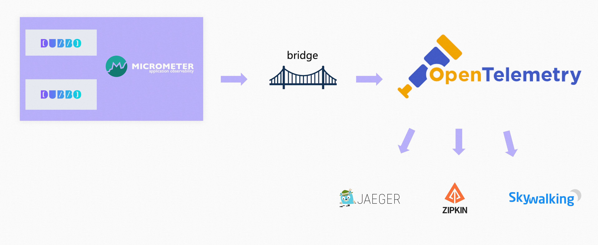

# 目录  
1.快速入门  
2.高级特性和用法  
3.参考手册  
4.升级和兼容  
5.错误码  


## 1.快速入门  
**目录:**  
1.1 快速部署一个微服务应用  
1.2 基于Dubbo API开发微服务应用  
1.3 基于Spring Boot Starter开发微服务应用  
1.4 基于Spring XML开发微服务应用  
1.5 IDL定义跨语言服务  

### 1.1 快速部署一个微服务应用  
*提示:详情见dubboBasis笔记=>1.dubbo入门=>1.2体会dubbo的第一个示例*  

### 1.2 基于Dubbo API开发微服务应用  
*提示:详情见dubboBasis笔记=>1.dubbo入门=>1.2体会dubbo的第一个示例*  

### 1.3 基于Spring Boot Starter开发微服务应用  
*提示:详情见ubboBasis笔记=>1.dubbo入门=>使用dubbo开发微服务项目*  

### 1.4 基于Spring XML开发微服务应用  
略过,如有兴趣可以参照官网  

### 1.5 IDL定义跨语言服务  
*提示:如有兴趣可以参见官网,本笔记对在1.1开发任务=>1.1.6 IDL开发服务中有对IDL进行介绍*  


## 2.高级特性和用法  
**目录:**  
2.1 框架与服务  
2.2 可观测性  
2.3 诊断与调优  
2.4 提升安全性  
2.5 其它  
2.6 Triple协议  

### 2.1 框架与服务  
**目录:**  
2.1.1 端口协议复用  
2.1.2 分布式事务  
2.1.3 分组聚合  
2.1.4 服务分版本  
2.1.5 启动时检查  
2.1.6 响应式编程  
2.1.7 参数校验  
2.1.8 服务分组  
2.1.9 集群容错  
2.1.10 服务降级  
2.1.11 异步调用  
2.1.12 流式调用  
2.1.13 线程池隔离  
2.1.14 调用链路传递隐式参数  
2.1.15 动态指定IP调用  
2.1.16 RPC调用上下文  
2.1.17 服务接口Json兼容性检测  
2.1.18 一致性哈希选址  
2.1.19 只订阅  
2.1.20 调用触发事件通知  
2.1.21 多协议  
2.1.22 服务端回调客户端  
2.1.23 本地伪装  
2.1.24 多注册中心  
2.1.25 本地存根  
2.1.26 回声测试  
2.1.27 调用信息记录  
2.1.28 泛化调用(客户端泛化)  
2.1.29 泛化调用(服务端泛化)  
2.1.30 本地调用  
2.1.31 延迟暴露  


#### 2.1.1 端口协议复用
*提示:详情见1.6 通信协议=>1.6.6单端口多协议*  

#### 2.1.2 分布式事务  
*提示:详情见1.4 微服务生态=>1.4.1 事务管理*  

#### 2.1.3 分组聚合  
1.特性说明  
通过分组对结果进行聚合并返回聚合后的结果,比如菜单服务,用group区分同一接口的多种实现,现在消费方需从每种group中调用一次并返回结果,<font color="#00FF00">对结果进行合并之后返回</font>,这样就可以实现聚合菜单项  
*提示:本节的示例来自dubbo-sample->2-advanced->dubbo-samples-merge*  

2.使用场景  
<font color="#FF00FF">将多个服务提供者分组作为一个提供者进行访问</font>,<font color="#00FF00">应用程序能够像访问一个服务一样访问多个服务</font>,并允许更有效地使用资源  

3.使用方式  
*提示:在dubbo中接口并不能唯一确定一个服务,<font color="#00FF00">只有接口+分组+版本号才能唯一确定一个服务</font>*  

3.1 搜索所有分组  
```xml
<dubbo:reference interface="com.xxx.MenuService" group="*" merger="true" />
```
*提示:使用这种配置表明,将`MenuService`下所有分组的调用结果进行合并*  
**注意:** 也就是说在使用分组聚合时,<font color="#00FF00">一个Consumer会调用对应的所有Provider</font>;而不是只调用一个Provider  

3.2 合并指定分组  
```xml
<dubbo:reference interface="com.xxx.MenuService" group="aaa,bbb" merger="true" />
```
*提示:使用这种配置表明,将`MenuService`下的`aaa`和`bbb`分组的调用结果进行合并*  

3.3 指定方法合并  
```xml
<dubbo:reference interface="com.xxx.MenuService" group="*">
    <dubbo:method name="getMenuItems" merger="true" />
</dubbo:reference>
```
*提示:使用这种配置表明,将`MenuService`下所有分组的`getMenuItems`方法的调用结果进行合并,别的没有指定的方法依旧只调用一个group*  

3.4 某个方法不合并  
```xml
<dubbo:reference interface="com.xxx.MenuService" group="*" merger="true">
    <dubbo:method name="getMenuItems" merger="false" />
</dubbo:reference>
```
*提示:使用这种配置表明,`MenuService`下的`getMenuItems`方法不合并*  

3.5 指定合并策略  
```xml
<dubbo:reference interface="com.xxx.MenuService" group="*">
    <dubbo:method name="getMenuItems" merger="mymerge" />
</dubbo:reference>
```
*提示:指定合并策略,默认根据<font color="#00FF00">返回值类型</font>自动匹配,如果同一个类型有两个合并器,需要指定合并器的名称*  
关于合并器的内容详情见2.3 参考手册=>:
说白了,<font color="#FF00FF">现在要调用多个接口并将多个接口的返回值合并为一个结果,那合并这些返回值的策略就需要使用到合并器</font>,合并器的使用是基于返回值的类型来匹配的,如果对于一种返回值有多个合并器则需要具体指定当前使用的合并器名称  

3.6 指定合并方法  
```xml
<dubbo:reference interface="com.xxx.MenuService" group="*">
    <dubbo:method name="getMenuItems" merger=".addAll" />
</dubbo:reference>
```
*提示:指定合并方法,将调用返回结果的指定方法进行合并,合并方法的参数类型必须是返回结果类型本身;实际上这也相当于是一种合并策略,就是说将分组调用的结果传入到`addAll()`方法里面,最终由`addAll()`处理并将结果返回,并且addAll方法的入参类型必须与分组调用返回的类型匹配*  

#### 2.1.4 服务分版本  
*提示:在dubbo中接口并不能唯一确定一个服务,<font color="#00FF00">只有接口+分组+版本号才能唯一确定一个服务</font>*  
本节可以参考:1.任务=>1.1开发任务=>1.1.3 版本与分组  

#### 2.1.5 启动时检查 
1.特性说明  
Dubbo默认会在启动时检查依赖的服务是否可用,如果不可用会抛出异常阻止Spring初始化完成,从而尽早的发现错误,默认`check="true"`  
可以通过`check="false"`关闭检查;比如测试时有些服务不关心或者出现了循环依赖,必须有一方先启动  
如果你的Spring容器是懒加载的,或者通过API编程延迟引用服务,请关闭check,<font color="#FF00FF">否则服务临时不可用时,会抛出异常</font>,拿到null引用,如果 check="false",总是会返回引用,当服务恢复时,能自动连上  

2.使用场景  
* 单向依赖:服务间有依赖关系建议使用默认设置,无依赖关系可以使用`check=false`
* 相互依赖:即循环依赖(不建议设置check=false)
* 延迟加载处理

3.使用方式  
3.1 关闭某个服务的启动时检查  
```xml
<dubbo:reference interface="com.foo.BarService" check="false" />
```

3.2 关闭所有服务的启动检查  
```xml
<dubbo:consumer check="false" />
```
*提示:如果关闭了所有服务的启动检查,但是某个服务又显示地指定了例如3.1步中的格式,即开启了某个服务的检查,则该服务会开启检查*  

3.3 关闭注册中心启动时检查  
```xml
<dubbo:registry check="false" />
```
*提示:3.1和3.2步都是指当前服务已经订阅了注册中心,但是获取到的目标服务的提供者列表为空时是否报错的配置,当前配置是如果当前服务订阅/注册到注册中心失败时是否继续运行启动,如果设置为这里的false代表允许启动,此时后台将定时重试注册行为*  

3.4 通过dubbo.properties进行设置  
```properties
dubbo.reference.com.foo.BarService.check=false
dubbo.consumer.check=false
dubbo.registry.check=false
```

#### 2.1.6 响应式编程  
1.特性说明  
此特性基于Triple协议和Project Reactor实现,3.1.0版本以上支持,用户仅需编写IDL文件,并指定protobuf插件的相应Generator,即可生成并使用支持响应式编程API的stub代码  
有四种调用模式,分别是OneToOne、OneToMany、ManyToOne、ManyToMany,分别对应 Unary调用、服务端流、客户端流、双向流.在Reactor的实现中,One对应Mono,Many对应Flux  
Reactive Stream提供了一套标准的异步流处理API,在能够让应用写出事件驱动的程序的同时,也通过BackPressure的方式保证了节点的稳定.Triple协议在通信协议层面为Dubbo框架增加了流式场景的支持,在此基础上能够实现上层包括大文件传输和推送机制的业务需求  
Dubbo + Reactive Stream Stub的组合模式可以给用户带来最方便的流式使用方式以及全链路异步性能提升  
*提示:本节的示例可以参考dubbo-sample->3-extensions->protocol->dubbo-samples-triple-reactor*  

2.使用场景  
系统需要处理大量并发请求而不会使任何服务器过载.大量用户提供实时数据的系统,希望确保系统能够处理负载而不会崩溃或变慢  

*提示:Triple使用方式可参考;如有兴趣可以参见官网,本笔记对在1.1开发任务=>1.1.6 IDL开发服务中有对IDL进行介绍*  
// todo 

3.添加依赖  
```xml
<!-- 添加Reactor Triple的相关依赖 -->
<dependency>
    <groupId>org.reactivestreams</groupId>
    <artifactId>reactive-streams</artifactId>
</dependency>
<dependency>
    <groupId>io.projectreactor</groupId>
    <artifactId>reactor-core</artifactId>
</dependency>
```

4.设置protobuf Maven插件  
仅需将mainClass修改为`org.apache.dubbo.gen.tri.reactive.ReactorDubbo3TripleGenerator`,并确保`${compiler.version}`>= 3.1.0  
```xml
<build>
    <plugins>
        <plugin>
            <groupId>org.xolstice.maven.plugins</groupId>
            <artifactId>protobuf-maven-plugin</artifactId>
            <version>0.6.1</version>
            <configuration>
                <protocArtifact>com.google.protobuf:protoc:${protoc.version}:exe:${os.detected.classifier}
                </protocArtifact>
                <pluginId>grpc-java</pluginId>
                <pluginArtifact>io.grpc:protoc-gen-grpc-java:${grpc.version}:exe:${os.detected.classifier}
                </pluginArtifact>
                <protocPlugins>
                    <protocPlugin>
                        <id>dubbo</id>
                        <groupId>org.apache.dubbo</groupId>
                        <artifactId>dubbo-compiler</artifactId>
                        <version>${compiler.version}</version>
                        <mainClass>org.apache.dubbo.gen.tri.reactive.ReactorDubbo3TripleGenerator</mainClass>
                    </protocPlugin>
                </protocPlugins>
            </configuration>
            <executions>
                <execution>
                    <goals>
                        <goal>compile</goal>
                    </goals>
                </execution>
            </executions>
        </plugin>
    </plugins>
</build>
```

5.编写并编译IDL文件  
IDL文件编写与原生的Triple协议完全一致,编译后默认会在`target/generated-sources/protobuf/java`目录下看到相应代码  
```go
syntax = "proto3";

option java_multiple_files = true;

package org.apache.dubbo.samples.triple.reactor;

// The request message containing the user's name.
message GreeterRequest {
  string name = 1;
}

// The response message containing the greetings
message GreeterReply {
  string message = 1;
}

service GreeterService {

  rpc greetOneToOne(GreeterRequest) returns (GreeterReply);

  rpc greetOneToMany(GreeterRequest) returns (stream GreeterReply);

  rpc greetManyToOne(stream GreeterRequest) returns (GreeterReply);

  rpc greetManyToMany(stream GreeterRequest) returns (stream GreeterReply);
}
```

6.使用示例  
6.1 添加服务端接口实现  
```java
public class GreeterServiceImpl extends DubboGreeterServiceTriple.GreeterServiceImplBase {
    
    private static final Logger LOGGER = LoggerFactory.getLogger(GreeterServiceImpl.class);

    @Override
    public Flux<GreeterReply> greetManyToMany(Flux<GreeterRequest> request) {
        return request.doOnNext(req -> LOGGER.info("greetManyToMany get data: {}", req))
                .map(req -> GreeterReply.newBuilder().setMessage(req.getName() + " -> server get").build())
                .doOnNext(res -> LOGGER.info("greetManyToMany response data: {}", res));
    }
}
```

6.2 添加服务端接口启动类  
```java
public class ReactorServer {

    private static final int PORT = 50052;

    public static void main(String[] args) {
        ServiceConfig<GreeterService> reactorService = new ServiceConfig<>();
        reactorService.setInterface(GreeterService.class);
        reactorService.setRef(new GreeterServiceImpl());

        DubboBootstrap bootstrap = DubboBootstrap.getInstance();
        bootstrap.application(new ApplicationConfig("tri-reactor-stub-server"))
                .registry(new RegistryConfig("zookeeper://127.0.0.1:2181"))
                .protocol(new ProtocolConfig(CommonConstants.TRIPLE, PORT))
                .service(reactorService)
                .start();
    }
}
```

6.3 添加服务端启动类和消费程序  
```java

public class ReactorConsumer {

    private static final Logger LOGGER = LoggerFactory.getLogger(ReactorConsumer.class);

    private final GreeterService greeterService;

    public ReactorConsumer() {
        ReferenceConfig<GreeterService> referenceConfig = new ReferenceConfig<>();
        referenceConfig.setInterface(GreeterService.class);
        referenceConfig.setProtocol(CommonConstants.TRIPLE);
        referenceConfig.setProxy(CommonConstants.NATIVE_STUB);
        referenceConfig.setTimeout(10000);

        DubboBootstrap bootstrap = DubboBootstrap.getInstance();
        bootstrap.application(new ApplicationConfig("tri-reactor-stub-server"))
                .registry(new RegistryConfig("zookeeper://127.0.0.1:2181"))
                .reference(referenceConfig)
                .start();
        GreeterService greeterService = referenceConfig.get();
    }
    
    public static void main(String[] args) throws IOException {
        ReactorConsumer reactorConsumer = new ReactorConsumer();
        reactorConsumer.consumeManyToMany();
        System.in.read();
    }
    
    private void consumeManyToMany() {
        greeterService.greetManyToMany(Flux.range(1, 10)
                    .map(num ->
                        GreeterRequest.newBuilder().setName(String.valueOf(num)).build())
                    .doOnNext(req -> LOGGER.info("consumeManyToMany request data: {}", req)))
                .subscribe(res -> LOGGER.info("consumeManyToMany get response: {}", res));
    }
}
```

7.代码测试  
分别启动生产者和服务消费者  

#### 2.1.7 参数校验  
1.特征说明  
参数验证功能是基于JSR303实现的,<font color="#00FF00">用户只需标识JSR303标准的验证annotation</font>,并通过声明filter来实现验证  

2.添加依赖  
```xml
<dependency>
    <groupId>javax.validation</groupId>
    <artifactId>validation-api</artifactId>
    <version>1.0.0.GA</version>
</dependency>
<dependency>
    <groupId>org.hibernate</groupId>
    <artifactId>hibernate-validator</artifactId>
    <version>4.2.0.Final</version>
</dependency>
```

3.使用场景  
<font color="#FF00FF">服务端</font>(Provider)在向外提供接口服务时,解决各种接口参数校验问题  
*提示:本节的示例可以参考dubbo-sample->2-advanced->dubbo-samples-validation*  

4.参数标注示例  
```java
public class ValidationParameter implements Serializable {
    private static final long serialVersionUID = 7158911668568000392L;
 
    @NotNull // 不允许为空
    @Size(min = 1, max = 20) // 长度或大小范围
    private String name;
 
    @NotNull(groups = ValidationService.Save.class) // 保存时不允许为空,更新时允许为空 ,表示不更新该字段
    @Pattern(regexp = "^\\s*\\w+(?:\\.{0,1}[\\w-]+)*@[a-zA-Z0-9]+(?:[-.][a-zA-Z0-9]+)*\\.[a-zA-Z]+\\s*$")
    private String email;
 
    @Min(18) // 最小值
    @Max(100) // 最大值
    private int age;
 
    @Past // 必须为一个过去的时间
    private Date loginDate;
 
    @Future // 必须为一个未来的时间
    private Date expiryDate;
    // 提供getter/setter方法
}
```

5.分组验证示例  
```java
public interface ValidationService { // 缺省可按服务接口区分验证场景,如：@NotNull(groups = ValidationService.class)   
    @interface Save{} // 与方法同名接口,首字母大写,用于区分验证场景,如：@NotNull(groups = ValidationService.Save.class),可选
    void save(ValidationParameter parameter);
    void update(ValidationParameter parameter);
}
```
**解释:**  
首先这里定义了一个ValidationService,这个Service中有两个方法save方法和update方法,这里需要在这个类下定义一个与方法名相同的首字母大写的注解,表明对save方法中的参数进行`@Save`这个注解的分组校验;那么在方法对应的参数ValidationParameter中就需要使用`groups`字段指定对应的分组注解,那么在执行目标方法时就会对特定的分组进行校验,如果目标方法不是该分组的就不校验.  
**简化:**  
这里说的太复杂了,可以简化一下,分组校验是<font color="#FF00FF">针对方法级别的</font>,如果对某个方法有特定的校验规则就<font color="#00FF00">定义一个对应的注解在Service类中</font>,接着对哪个参数实行特定的校验规则就在该参数上的`groups`属性中指定对应的注解.  

6.关联校验示例  
```java
public interface ValidationService {   
    @GroupSequence(Update.class) // 同时验证Update组规则
    @interface Save{}
    void save(ValidationParameter parameter);
 
    @interface Update{} 
    void update(ValidationParameter parameter);
}
```

7.在客户端验证参数  
```xml
<dubbo:reference id="validationService" interface="org.apache.dubbo.examples.validation.api.ValidationService" validation="true" />
```
*提示:在消费者端进行参数的校验*  

8.服务端验证参数  
```xml
<dubbo:service interface="org.apache.dubbo.examples.validation.api.ValidationService" ref="validationService" validation="true" />
```
*提示:在生产者端进行参数的校验*  

> 如果需要启动客户端验证,并且使用jdk17,择需添加jvm启动参数`--add-opens java.base/java.lang=ALL-UNNAMED`做兼容处理  

9.验证异常信息  
```java
public class ValidationConsumer {   
    public static void main(String[] args) throws Exception {
        String config = ValidationConsumer.class.getPackage().getName().replace('.', '/') + "/validation-consumer.xml";
        ClassPathXmlApplicationContext context = new ClassPathXmlApplicationContext(config);
        context.start();
        ValidationService validationService = (ValidationService)context.getBean("validationService");
        // Error
        try {
            parameter = new ValidationParameter();
            validationService.save(parameter);
            System.out.println("Validation ERROR");
        } catch (RpcException e) { // 抛出的是RpcException
            ConstraintViolationException ve = (ConstraintViolationException) e.getCause(); // 里面嵌了一个ConstraintViolationException
            Set<ConstraintViolation<?>> violations = ve.getConstraintViolations(); // 可以拿到一个验证错误详细信息的集合
            System.out.println(violations);
        }
    } 
}
```
*提示:参数验证失败后会抛出一个RpcException异常,里面嵌套了Hibernate的ConstraintViolationException异常*  

#### 2.1.8 服务分组  
服务分组说的比较多了,详情见:1.1.3版本与分组、2.2.1.4服务分版本、2.2.1.3分组聚合  

#### 2.1.9 集群容错  
1.特性说明  
当集群调用失败时,Dubbo提供了多种容错方案,缺省为failover重试  
  
各节点关系:  
* 这里的`Invoker`是`Provider`的<font color="#FF00FF">一个</font>可调用`Service`的抽象,<font color="#00FF00">Invoker封装了Provider地址及Service接口信息</font>
* `Directory`代表多个`Invoker`,可以把它看成`List<Invoker>`,但与List不同的是它的值可能是动态变化的,比如注册中心推送变更
* `Cluster`将<font color="#00FF00">Directory中的多个Invoker伪装成一个Invoker</font>,对上层透明,伪装过程包含了容错逻辑,调用失败后重试另一个
* `Router`负责从多个`Invoker`中按路由规则选出子集,比如读写分离、应用隔离等
  *提示:`Router`*主要是负责选择不同类型的`Invoker`*  
* `LoadBalance`负责从多个`Invoker`中选出具体的一个用于本次调用,选的过程包含了负载均衡算法,调用失败后需要重选
  *提示:`LoadBalance`主要是从相同类型的`Invoker`中进行具体的调用,因为服务可能是集群的,最终具体调用某个服务的时候还需要再筛选,<font color="#00FF00">这点要与Router区分下来</font>*

通过使用服务注册表和负载均衡,可以提高集群提供的容错能力,服务注册表用于存储有关可用服务及其位置的信息,负载均衡用于确保请求均匀分布在集群中的所有服务器上,如果一台服务器发生故障,负载将转移到其他可用服务器  
*总结一下这张图:最外层的流量通过Dubbo集群容错策略从Cluster处调用服务,Cluster把流量转发到Directory,接着Directory把流量转发到Router,Router转发到LoadBalance,最终调用服务本体Invoker*  


2.使用场景  
多个服务器部署同一集群中,运行同一应用程序,如果一台服务器出现故障,其他服务器将接管负载,确保应用程序对用户仍然可用
Dubbo的集群容错默认有如下策略:Failover、Failfast、Failsafe、Failback、Forking、Broadcast、Available、Mergeable、ZoneAware  
如果需要可以自定义扩展集群容错策略,详情见:集群扩展  //todo  

3.使用方式  
3.1 Failover策略  
在这种策略下,失败会自动切换,当出现失败重试其它服务器,通常用于读操作,但重试会带来更长的延迟,可通过`retries="2"`来设置重试次数  
配置如下:  
```xml
<!-- 在服务提供者一方配置 -->
<dubbo:service retries="2" />
<!-- 在服务消费者一方配置 -->
<dubbo:reference retries="2" />
<!-- 针对某个方法进行配置 -->
<dubbo:reference>
    <dubbo:method name="findFoo" retries="2" />
</dubbo:reference>
```
*提示:这种策略是默认的策略*  

3.2 Failfast  
快速失败,只发起一次调用,失败立即报错;通常用于非幂等性的写操作,比如新增记录  

3.3 Failsafe  
失败安全,出现异常时,直接忽略;通常用于写入审计日志等操作  

3.4 Failback  
失败自动恢复,后台记录失败请求,定时重发;通常用于消息通知操作  

3.5 Forking  
<font color="#FF00FF">并行调用</font>多个服务器,只要一个成功即返回;通常用于实时性要求较高的读操作,<font color="#00FF00">但需要浪费更多服务资源</font>;可通过`forks="2"`来设置最大并行数  

3.6 Broadcast  
广播调用所有提供者,逐个调用,任意一台报错则报错;通常用于通知所有提供者更新缓存或日志等<font color="#FF00FF">本地资源信息</font>(注意是本地)  
高版本的dubbo,可以通过`broadcast.fail.percent`配置节点调用失败的比例,当达到这个比例之后`BroadcastClusterInvoker`将不再调用其它节点,直接抛出异常  
broadcast.fail.percent<font color="#00FF00">取值在0～100范围内</font>;默认情况下当全部调用失败后,才会抛出异常;<font color="#00FF00">broadcast.fail.percent只是控制的当失败后是否继续调用其他节点</font>,并不改变结果(任意一台报错则报错)  
`broadcast.fail.percent=20`代表了当20%的节点调用失败就抛出异常,不再调用其他节点;这个值默认是100  
```java
@reference(cluster = "broadcast", parameters = {"broadcast.fail.percent", "20"})
``` 
*解释:cluster表明要使用哪种策略,parameters是对这种策略具体使用什么样的配置/参数*  

3.7 Available  
调用目前可用的实例(只调用一个),如果当前没有可用的实例,则抛出异常;通常用于不需要负载均衡的场景  

3.8 Mergeable  
<font color="#00FF00">将集群中的调用结果聚合起来返回结果</font>,通常和group一起配合使用;<font color="#00FF00">通过分组对结果进行聚合并返回聚合后的结果</font>,比如菜单服务,用group区分同一接口的多种实现,<font color="#00FF00">现在消费方需从每种group中调用一次并返回结果,对结果进行合并之后返回</font>,这样就可以实现聚合菜单项  
*提示:合并分组调用详情见2.2.1.3 分组聚合*  

3.9 ZoneAware  
<font color="#00FF00">多注册中心订阅</font>的场景,<font color="#FF00FF">注册中心集群间的负载均衡</font>(也就是从服务注册中心的层面进行负载均衡);对于多注册中心间的选址策略有如下四种:指定优先级、同中心优先、权重轮询、缺省值  
* 指定优先级  
  被设置为`preferred="true"`的注册中心将会被优先选择
  ```xml
  <dubbo:registry address="zookeeper://127.0.0.1:2181" preferred="true" />
  ```
* 同中心优先  
  检查当前请求所属的区域,优先选择具有<font color="#00FF00">相同区域的注册中心</font>
  ```xml
  <dubbo:registry address="zookeeper://127.0.0.1:2181" zone="beijing" />
  ```
* 权重轮询
  根据每个注册中心的权重分配流量
  ```xml
  <dubbo:registry id="beijing" address="zookeeper://127.0.0.1:2181" weight="100" />
  <dubbo:registry id="shanghai" address="zookeeper://127.0.0.1:2182" weight="10" />
  ```
* 默认
  选择一个可用的注册中心

4.使用方式  
使用方式分为两种,一种是使用xml的方式使用,一种是使用注解的方式使用;注解的方式上面已经讲过  
```xml
<!-- 分别在服务消费者和服务提供者方指定集群的容错策略,但是策略最终都是针对服务消费者而言的,只是说这个策略在这两个地方配置都可以;都是针对某个接口调用时的负载均衡策略是什么 -->
<dubbo:service cluster="failsafe" />
<dubbo:reference cluster="failsafe" />
```


#### 2.1.10 服务降级  
*提示:本章可以参考1.7.1 Sentinel限流*  

1.Mock使用方式1  
当服务降级的时候希望可以返回一个模拟数据(Mock值),从而保障业务还能正常运行  
```xml
<dubbo:reference id="demoService" interface="com.xxx.service.DemoService" mock="true" />
```
这种方式需要在相同包下面有类+Mock的后缀实现类,即`com.xxx.service`包下有`DemoServiceMock`类  

2.Mock使用方式2  
```xml
<dubbo:reference id="demoService" interface="com.xxx.service.DemoService" mock="com.xxx.service.DemoServiceMock" />
```
这种方式直接指定Mock类的全路径  

3.Mock使用方式3  
`mock="[fail|force] return|throw xxx"`格式  
* `fail|force`:表示调用失败或不调用强制执行mock方法,如果不指定关键字默认为fail
* `return`表示返回指定结果,`throw`表示抛出指定异常
* `xx`当前面是return时候这里表示返回一个接口的默认值,当前面是throw时候这里表示抛出一个异常

例如:
```xml
<dubbo:reference id="demoService" interface="com.xxx.service.DemoService" mock="return" />
<dubbo:reference id="demoService" interface="com.xxx.service.DemoService" mock="return null" />
<dubbo:reference id="demoService" interface="com.xxx.service.DemoService" mock="fail:return aaa" />
<dubbo:reference id="demoService" interface="com.xxx.service.DemoService" mock="force:return true" />
<dubbo:reference id="demoService" interface="com.xxx.service.DemoService" mock="fail:throw" />
<dubbo:reference id="demoService" interface="com.xxx.service.DemoService" mock="force:throw java.lang.NullPointException" />
```
4.配置dubbo-admin使用  
详情见1.5.1 Admin=>3.服务Mock

#### 2.1.11 异步调用  
1.背景  
从dubbo2.7开始,dubbo的所有异步编程接口开始以CompletableFuture为基础  
基于<font color="#FF00FF">NIO</font>的非阻塞实现并行调用,<font color="#00FF00">客户端不需要启动多线程即可完成并行调用多个远程服务,相对多线程开销较小</font>  
  

2.使用场景  
将用户请求内容发送到目标请求,当目标请求遇到高流量或需要长时间处理,异步调用功能将允许<font color="#00FF00">立即向用户返回响应</font>,同时目标请求继续后台处理请求,当目标请求返回结果时,将内容显示给用户  
*提示:本节的示例可以参考dubbo-sample->2-advanced->dubbo-samples-async*  

3.使用  
详情见1.1.2 异步调用  

#### 2.1.12 流式调用  

#### 2.1.13 线程池隔离  
1.特性说明  
一种新的线程池管理方式,使得提供者应用内各个服务的线程池隔离开来,互相独立;<font color="#00FF00">某个服务的线程池资源耗尽不会影响其他正常服务</font>  

2.使用方式  
使用线程池隔离来确保Dubbo用于<font color="#FF00FF">调用远程方法的线程与微服务用于执行其任务的线程是分开的</font>;可以通过防止线程阻塞或相互竞争来帮助提高系统的性能和稳定性  
配置参数:  
* `ApplicationConfig`新增`executor-management-mode`参数,配置的值为`default`和`isolation`;默认为`isolation`
  * `executor-management-mode = default`使用原有<font color="#00FF00">以协议端口为粒度、服务间共享</font>的线程池管理方式
  * `executor-management-mode = isolation`使用新增的以<font color="#00FF00">服务三元组为粒度、服务间隔离</font>的线程管理方案
* 当使用`executor-management-mode = isolation`配置时,新增`Executor executor`参数,<font color="#00FF00">用以服务间隔离的线程池</font>可以由用户配置化、提供自己想要的线程池

目前有三种使用方式:API、XML、Annotation

3.API用法  
```java
public void test() {
	// provider app
	DubboBootstrap providerBootstrap = DubboBootstrap.newInstance();

	ServiceConfig serviceConfig1 = new ServiceConfig();
	serviceConfig1.setInterface(DemoService.class);
	serviceConfig1.setRef(new DemoServiceImpl());
	serviceConfig1.setVersion(version1);
	// set executor1 for serviceConfig1, max threads is 10
	NamedThreadFactory threadFactory1 = new NamedThreadFactory("DemoService-executor");
	ExecutorService executor1 = Executors.newFixedThreadPool(10, threadFactory1);
	serviceConfig1.setExecutor(executor1);

	ServiceConfig serviceConfig2 = new ServiceConfig();
	serviceConfig2.setInterface(HelloService.class);
	serviceConfig2.setRef(new HelloServiceImpl());
	serviceConfig2.setVersion(version2);
	// set executor2 for serviceConfig2, max threads is 100
	NamedThreadFactory threadFactory2 = new NamedThreadFactory("HelloService-executor");
	ExecutorService executor2 = Executors.newFixedThreadPool(100, threadFactory2);
	serviceConfig2.setExecutor(executor2);

	ServiceConfig serviceConfig3 = new ServiceConfig();
	serviceConfig3.setInterface(HelloService.class);
	serviceConfig3.setRef(new HelloServiceImpl());
	serviceConfig3.setVersion(version3);
	// Because executor is not set for serviceConfig3, the default executor of serviceConfig3 is built using
	// the threadpool parameter of the protocolConfig ( FixedThreadpool , max threads is 200)
	serviceConfig3.setExecutor(null);

	// It takes effect only if [executor-management-mode=isolation] is configured
	// 当使用executor-management-mode = isolation配置时setExecutor()方法才会生效
	ApplicationConfig applicationConfig = new ApplicationConfig("provider-app");
	applicationConfig.setExecutorManagementMode("isolation");

	providerBootstrap
	.application(applicationConfig)
	.registry(registryConfig)
	// export with tri and dubbo protocol
	.protocol(new ProtocolConfig("tri", 20001))
	.protocol(new ProtocolConfig("dubbo", 20002))
	.service(serviceConfig1)
	.service(serviceConfig2)
	.service(serviceConfig3);

	providerBootstrap.start();
}
```

4.XML用法  
```xml
<beans xmlns:xsi="http://www.w3.org/2001/XMLSchema-instance"
       xmlns:dubbo="http://dubbo.apache.org/schema/dubbo"
       xmlns="http://www.springframework.org/schema/beans"
       xsi:schemaLocation="http://www.springframework.org/schema/beans http://www.springframework.org/schema/beans/spring-beans-4.3.xsd
       http://dubbo.apache.org/schema/dubbo http://dubbo.apache.org/schema/dubbo/dubbo.xsd">

  <!-- NOTE: we need config executor-management-mode="isolation" -->
  <dubbo:application name="demo-provider" executor-management-mode="isolation">
  </dubbo:application>

  <dubbo:config-center address="zookeeper://127.0.0.1:2181"/>
  <dubbo:metadata-report address="zookeeper://127.0.0.1:2181"/>
  <dubbo:registry id="registry1" address="zookeeper://127.0.0.1:2181?registry-type=service"/>

  <dubbo:protocol name="dubbo" port="-1"/>
  <dubbo:protocol name="tri" port="-1"/>

  <!-- expose three service with dubbo and tri protocol-->
  <bean id="demoServiceV1" class="org.apache.dubbo.config.spring.impl.DemoServiceImpl"/>
  <bean id="helloServiceV2" class="org.apache.dubbo.config.spring.impl.HelloServiceImpl"/>
  <bean id="helloServiceV3" class="org.apache.dubbo.config.spring.impl.HelloServiceImpl"/>

  <!-- customized thread pool -->
  <bean id="executor-demo-service"
        class="org.apache.dubbo.config.spring.isolation.spring.support.DemoServiceExecutor"/>
  <bean id="executor-hello-service"
        class="org.apache.dubbo.config.spring.isolation.spring.support.HelloServiceExecutor"/>

  <!-- this service use [executor="executor-demo-service"] as isolated thread pool-->
  <dubbo:service executor="executor-demo-service"
                 interface="org.apache.dubbo.config.spring.api.DemoService" version="1.0.0" group="Group1"
                 timeout="3000" ref="demoServiceV1" registry="registry1" protocol="dubbo,tri"/>

  <!-- this service use [executor="executor-hello-service"] as isolated thread pool-->
  <dubbo:service executor="executor-hello-service"
                 interface="org.apache.dubbo.config.spring.api.HelloService" version="2.0.0" group="Group2"
                 timeout="5000" ref="helloServiceV2" registry="registry1" protocol="dubbo,tri"/>

  <!-- not set executor for this service, the default executor built using threadpool parameter of the protocolConfig -->
  <dubbo:service interface="org.apache.dubbo.config.spring.api.HelloService" version="3.0.0" group="Group3"
                 timeout="5000" ref="helloServiceV3" registry="registry1" protocol="dubbo,tri"/>

</beans>
```

5.Annotation用法  
```java
@Configuration
@EnableDubbo(scanBasePackages = "org.apache.dubbo.config.spring.isolation.spring.annotation.provider")
public class ProviderConfiguration {
    @Bean
    public RegistryConfig registryConfig() {
        RegistryConfig registryConfig = new RegistryConfig();
        registryConfig.setAddress("zookeeper://127.0.0.1:2181");
        return registryConfig;
    }

    // NOTE: we need config executor-management-mode="isolation"
    @Bean
    public ApplicationConfig applicationConfig() {
        ApplicationConfig applicationConfig = new ApplicationConfig("provider-app");

        applicationConfig.setExecutorManagementMode("isolation");
        return applicationConfig;
    }

    // expose services with dubbo protocol
    @Bean
    public ProtocolConfig dubbo() {
        ProtocolConfig protocolConfig = new ProtocolConfig("dubbo");
        return protocolConfig;
    }

    // expose services with tri protocol
    @Bean
    public ProtocolConfig tri() {
        ProtocolConfig protocolConfig = new ProtocolConfig("tri");
        return protocolConfig;
    }

    // customized thread pool
    @Bean("executor-demo-service")
    public Executor demoServiceExecutor() {
        return new DemoServiceExecutor();
    }

    // customized thread pool
    @Bean("executor-hello-service")
    public Executor helloServiceExecutor() {
        return new HelloServiceExecutor();
    }
}
```

```java
// customized thread pool
public class DemoServiceExecutor extends ThreadPoolExecutor {
    public DemoServiceExecutor() {
        super(10, 10, 60, TimeUnit.SECONDS, new LinkedBlockingDeque<>(),
            new NamedThreadFactory("DemoServiceExecutor"));
    }
}
```

```java
// customized thread pool
public class HelloServiceExecutor extends ThreadPoolExecutor {
    public HelloServiceExecutor() {
        super(100, 100, 60, TimeUnit.SECONDS, new LinkedBlockingDeque<>(),
            new NamedThreadFactory("HelloServiceExecutor"));
    }
}
```

```java
// "executor-hello-service" is beanName
@DubboService(executor = "executor-demo-service", version = "1.0.0", group = "Group1")
public class DemoServiceImplV1 implements DemoService {

  @Override
  public String sayName(String name) {
    return "server name";
  }

  @Override
  public Box getBox() {
    return null;
  }
}
```

```java
@DubboService(version = "3.0.0", group = "Group3")
public class HelloServiceImplV2 implements HelloService {
    private static final Logger logger = LoggerFactory.getLogger(HelloServiceImplV2.class);

    @Override
    public String sayHello(String name) {
        return "server hello";
    }
}
```

```java
@DubboService(executor = "executor-hello-service", version = "2.0.0", group = "Group2")
public class HelloServiceImplV3 implements HelloService {
    private static final Logger logger = LoggerFactory.getLogger(HelloServiceImplV3.class);

    @Override
    public String sayHello(String name) {
        return "server hello";
    }
}
```

#### 2.1.14 调用链路传递隐式参数  
1.特性说明  
可以通过`RpcContext`上的`setAttachment`和`getAttachment`在服务消费方和提供方之间进行参数的隐式传递  
*提示:这点知识在1.1.4 上下文参数传递中有讲到过*   
*提示:本节的示例可以参考dubbo-sample->2-advanced->dubbo-samples-rpccontext*  

2.背景  
上下文信息是RPC框架很重要的一个功能,使用`RpcContext`可以为单次调用指定不同配置.如分布式链路追踪场景,其实现原理就是在全链路的上下文中维护一个traceId,<font color="#00FF00">Consumer和Provider通过传递traceId来连接一次RPC调用,分别上报日志后可以在追踪系统中串联并展示完整的调用流程</font>.这样可以更方便地发现异常,定位问题.Dubbo中的`RpcContext`是一个`ThreadLocal`的临时状态记录器,当接收到RPC请求或发起RPC请求时,<font color="#00FF00">RpcContext的状态都会变化</font>比如:**A调B,B调C,则B机器上,在B调C之前,RpcContext记录的是A和B的信息,在B调C之后,RpcContext记录的是B和C的信息**  

在Dubbo3中,RpcContext被拆分为四大模块,它们分别担任不同的职责:  
* ServiceContext:在Dubbo内部使用,用于传递调用链路上的参数信息,如invoker对象等
* ClientAttachment:在Client端使用,往ClientAttachment中写入的参数将被传递到Server端
* ServerAttachment:在Server端使用,从ServerAttachment中读取的参数是从Client中传递过来的
  ServerAttachment和ClientAttachment是对应的
* ServerContext:在Client端和Server端使用,用于从Server端回传Client端使用,Server端写入到ServerContext的参数在调用结束后可以在Client端的ServerContext获取到

流程图大致如下  
 
这个流程图是我自已画的不够细致,下面是官方的流程图  
  
如上图所示,<font color="#00FF00">消费端发起调用的时候可以直接通过Method Invoke向远程的服务发起调用,同时消费端往RpcClientAttachment写入的数据会连同Invoke的参数信息写入到Invocation中</font>.消费端的Invocation经过序列化后通过网络传输发送给服务端,<font color="#00FF00">服务端解析Invocation生成Method Invoke的参数和RpcServerAttachment,然后发起真实调用</font>.<font color="#DDDD00">在服务端处理结束之后,Method Response结果会连同RpcServiceContext一起生成Result对象.服务端的Result结果对象经过序列化后通过网络传输发送回消费端,消费端解析Result生成Method Response结果和RpcServiceContext,返回真实调用结果和上下文给消费端</font>

> path、group、version、dubbo、token、timeout几个key是保留字段,请使用其它值

3.使用方式  
> `setAttachment`设置的KV对,在完成下面一次远程调用会被清空,即多次远程调用要多次设置

3.1 在服务消费方端设置隐式参数
```java
RpcContext.getClientAttachment().setAttachment("index", "1"); // 隐式传参,后面的远程调用都会隐式将这些参数发送到服务器端,类似cookie,用于框架集成,不建议常规业务使用
xxxService.xxx(); // 远程调用
// ...
```

3.2 在服务提供方端获取隐式参数
```java
public class XxxServiceImpl implements XxxService {
    public void xxx() {
        // 获取客户端隐式传入的参数,用于框架集成,不建议常规业务使用
        String index = RpcContext.getServerAttachment().getAttachment("index");
    }
}
```

3.3 在服务提供方写入回传参数
```java
public class XxxServiceImpl implements XxxService {
    public void xxx() {
        String index = xxx;
        RpcContext.getServerContext().setAttachment("result", index);
    }
}
```

3.4 在消费端获取回传参数
```java
xxxService.xxx(); // 远程调用
String result = RpcContext.getServerContext().getAttachment("result");
// ...
```

4.参数透传问题  
* 在Dubbo2.7中,在A端设置的参数,调用B以后,如果B继续调用了C,原来在A中设置的参数也会被带到C端过去,造成参数污染的问题.Dubbo 3对RpcContext进行了重构,支持可选参数透传,默认不开启参数透传
* 在Dubbo 3中提供了如下的SPI,默认无实现,用户可以自行定义实现,select的结果(可以从RpcClientAttachment获取当前所有参数)将作为需要透传的键值对传递到下一跳,如果返回null则表示不透传参数
```java
@SPI
public interface PenetrateAttachmentSelector {
    /**
     * Select some attachments to pass to next hop.
     * These attachments can fetch from {@link RpcContext#getServerAttachment()} or user defined.
     *
     * @return attachment pass to next hop
     */
    Map<String, Object> select();
}
```

#### 2.1.15 动态指定IP调用  
1.特性说明  
说用dubbo扩展,实现指定IP调用  

2.使用场景  
发起请求的时候需要指定本次调用的服务端,如消息回调、流量隔离等  

3.pom依赖  
```xml
<dependency>
  <groupId>org.apache.dubbo.extensions</groupId>
  <artifactId>dubbo-cluster-specify-address-dubbo3</artifactId>
  <version>1.0.0</version>
</dependency>
```

4.调用示例  
```java
ReferenceConfig<DemoService> referenceConfig = new ReferenceConfig<>();
// ... init
DemoService demoService = referenceConfig.get();

// for invoke
// 1. find 10.10.10.10:20880 exist
// 2. if not exist, create a invoker to 10.10.10.10:20880 if `needToCreate` is true (only support in Dubbo 3.x's implementation)
UserSpecifiedAddressUtil.setAddress(new Address("10.10.10.10", 20880, true));
demoService.sayHello("world");


// 为了执行
// 1. 寻找10.10.10.10的任意端口是否存在
// 2. 如果不存在并且Address的第三个参数是true的话就创建一个invoker到10.10.10.10:20880
UserSpecifiedAddressUtil.setAddress(new Address("10.10.10.10", 0, true));
demoService.sayHello("world");
```

5.参数说明  
```java
public class Address implements Serializable {
    // ip - priority: 3
    private String ip;

    // ip+port - priority: 2
    private int port;

    // address - priority: 1
    private URL urlAddress;
    
    private boolean needToCreate = false;

    // ignore setter and getter
}
```
**解释:**  
* `urlAddress`为最高优先级,如果指定了目标的URL地址,会优先使用该地址(不再匹配后续)
* ip+port(非 0 端口)为第二优先级,会从注册中心已经推送的地址中进行匹配(不再匹配后续)
* ip为第三优先级,会从注册中心已经推送的地址中进行匹配  

特别的,如果指定了`needToCreate`为`true`将会自动根据传入的参数构建一个invoker,对于通过指定ip(+port)方式指定的地址,将会自动使用注册中心中第一个地址的参数为模板进行创建;如果无地址将基于Dubbo协议自动创建.如需定制创建invoker的逻辑请实现`org.apache.dubbo.rpc.cluster.specifyaddress.UserSpecifiedServiceAddressBuilder`接口  
在构建完`Address`参数每次请求前通过`UserSpecifiedAddressUtil`工具类传递给dubbo框架,例如上面第4步的调用示例那样  

> 必须每次都设置,而且设置后必须马上发起调用,如果出现拦截器报错(Dubbo框架内remove此值是在选址过程进行的)建议设置null以避免ThreadLocal内存泄漏导致影响后续调用

#### 2.1.16 RPC调用上下文  
1.特性说明  
<font color="#00FF00">上下文中存放的是当前调用过程中所需的环境信息</font>,所有配置信息都将转换为URL的参数,详情[schema配置参考手册](https://cn.dubbo.apache.org/zh-cn/overview/mannual/java-sdk/reference-manual/config/properties/)中的对应URL参数一列  

2.使用方式  
本章的内容可以参考2.2.1.14 调用链路传递隐式参数节的内容  

#### 2.1.17 服务接口Json兼容性检测  
1.特性说明  
`Dubbo`目前支持`Rest`协议进行服务调用,`Rest`协议默认会使用`JSON`作为序列化方式,但`JSON`并不支持`Java`的一些特殊用法,如`接口`和`抽象类`等  
`Dubbo 3.3`版本在服务发布流程中增加了`服务接口JSON兼容性检测`功能,可以确保服务接口传输对象是否可以被JSON序列化,进一步提升Rest服务接口的正确性  

2.使用场景  
使用`Rest`作为通信协议,`JSON`作为序列化方式时,对服务接口进行兼容性检查,确保服务接口传输对象可以正确地被JSON序列化  

3.使用方式  
当使用`Rest`协议作为通信协议,`JSON`作为序列化方式时,可以在`xml`文件中通过配置`protocol`的`json-check-level`属性来配置`JSON`兼容性检查的级别  
目前有三种级别,每种级别的具体含义如下:  
* `disabled`:表示`不开启JSON兼容性检查`,此时不会对接口进行兼容性检查
* `warn`:表示开启`JSON兼容性检查`,如果出现不兼容的情况,将会以`warn`级别的日志形式将不兼容的接口名称打印输出到终端
  默认使用这种级别
* `strict`:表示开启`JSON兼容性检查`,如果出现不兼容的情况,将会在启动时抛出IllegalStateException异常,<font color="#00FF00">终止启动流程</font>,<font color="#00FF00">同时会将不兼容的接口名称存放在异常信息中</font>

4.使用示例  
```xml

<beans>
    <context:component-scan base-package="com.example.rest"/>

    <bean name="dubboConfig" class="com.example.rest.config.DubboConfig"></bean>

    <dubbo:application name="rest-provider" owner="programmer" organization="dubbo"/>

    <dubbo:registry address="zookeeper://${zookeeper.address:127.0.0.1}:2180"/>

    <!-- 将JSON兼容性检查级别设为disabled  -->
    <dubbo:protocol name="rest" port="8880" threads="300" json-check-level="disabled"/>

    <!-- 将JSON兼容性检查级别设为warn  -->
    <dubbo:protocol name="rest" port="8880" threads="300" json-check-level="warn"/>

    <!-- 将JSON兼容性检查级别设为strict  -->
    <dubbo:protocol name="rest" port="8880" threads="300" json-check-level="strict"/>
</beans>
```

#### 2.1.18 一致性哈希选址
1.特性说明  
在分布式系统中跨多个节点均匀分布请求的方法,使用哈希算法创建请求的哈希并根据哈希值确定哪个节点应该处理请求,算法确保每个节点处理的请求数量大致相等.如果一个节点发生故障,其他节点可以快速接管请求,保持系统高可用性,即使一个节点出现故障,系统的数据映射到系统中有限数量节点的哈希算法,在系统中添加或删除节点时,只需更改有限数量的映射,确保数据均匀分布在系统中的所有节点上提高系统的性能  

2.使用场景  
在有多台服务端的时候根据请求参数,进行一致性哈希散列选择服务端

3.使用方式  
3.1 注解配置  
```java
@DubboReference(loadbalance = "consistenthash")
```

3.2 API配置  
```java
referenceConfig.setLoadBalance(“consistenthash”);
```

3.3 Properties配置  
```properties
dubbo.reference.loadbalance=consistenthash
```

3.4 XML配置  
```xml
<dubbo:reference loadbalance="consistenthash" />
```

默认采用第一个参数作为哈希key,如果需要切换参数,可以指定`hash.arguments`属性  
```java
ReferenceConfig<DemoService> referenceConfig = new ReferenceConfig<DemoService>();
// ... init
Map<String, String> parameters = new HashMap<String, String>();
parameters.put("hash.arguments", "1");
parameters.put("sayHello.hash.arguments", "0,1");
referenceConfig.setParameters(parameters);
referenceConfig.setLoadBalance("consistenthash");
referenceConfig.get();
```

#### 2.1.19 只订阅  
1.特性说明  
为方便开发测试,经常会在线下共用一个所有服务可用的注册中心,这时如果一个正在开发中的服务提供者注册,可能会影响消费者不能正常运行.  
可以让服务提供者开发方,<font color="#00FF00">只订阅服务</font>(开发的服务可能依赖其它服务),而不注册正在开发的服务,通过直连测试正在开发的服务  
  

**使用场景:**  
* 消费者是一个正在开发但尚未部署的新应用程序.<font color="#00FF00">消费者希望订阅未注册的服务</font>,以确保在部署后能够访问所需的服务
  图中Develop消费者通过直连的方式消费Develop服务提供者
* 消费者是正在更新或修改的现有应用程序;消费者希望订阅未注册的服务以确保它能够访问更新或修改的服务.
* 消费者是在暂存环境中开发或测试的应用程序.消费者希望订阅未注册的服务,以确保在开发或测试时能够访问所需的服务

2.使用方式  
禁用注册配置  
```xml
<!-- 不注册到注册中心 -->
<dubbo:registry address="10.20.153.10:9090" register="false" />
<!-- 另外一种配置方式 -->
<dubbo:registry address="10.20.153.10:9090?register=false" />
```

#### 2.1.20 调用触发事件通知  
1.特性说明  
在调用之前、调用之后、出现异常时,会触发`oninvoke`、`onreturn`、`onthrow`三个事件.可以配置当事件发生时,通知(<font color="#00FF00">回调</font>)哪个类的哪个方法  

2.使用场景  
调用服务方法前我们可以记录开始时间,调用结束后统计整个调用耗费,发生异常时我们可以告警或打印错误日志或者调用服务前后记录请求日志、响应日志等  
*提示:说白了就是一个事件回调*  

3.使用方式  
3.1 服务提供者与服务消费者共享服务接口  
```java
interface IDemoService {
    public Person get(int id);
}
```

3.2 服务提供者实现  
```java
class NormalDemoService implements IDemoService {
    public Person get(int id) {
        return new Person(id, "charles`son", 4);
    }
}
```

3.3 服务提供者配置  
```java
<dubbo:application name="rpc-callback-demo" />
<dubbo:registry address="zookeeper://127.0.0.1:2181"/>
<bean id="demoService" class="org.apache.dubbo.callback.implicit.NormalDemoService" />
<dubbo:service interface="org.apache.dubbo.callback.implicit.IDemoService" ref="demoService" version="1.0.0" group="cn"/>
```

3.4 服务消费者Callback(回调)接口  
```java
interface Notify {
    public void onreturn(Person msg, Integer id);
    public void onthrow(Throwable ex, Integer id);
}
```

3.5 服务消费者Callback实现  
```java
class NotifyImpl implements Notify {
    public Map<Integer, Person> ret = new HashMap<Integer, Person>();
    public Map<Integer, Throwable> errors = new HashMap<Integer, Throwable>();
    
    public void onreturn(Person msg, Integer id) {
        System.out.println("onreturn:" + msg);
        ret.put(id, msg);
    }
    
    public void onthrow(Throwable ex, Integer id) {
        errors.put(id, ex);
    }
}
```

3.6 服务消费者Callback配置  
两者叠加存在以下几种组合情况:  
* 异步回调模式:`async=true onreturn="xxx"`  
* 同步回调模式:`async=false onreturn="xxx"`  
* 异步无回调:`async=true`  
* 同步无回调:`async=false`  

`callback`与`async`功能正交分解,`async=true`表示结果马上返回,`async=false`默认,`onreturn`表示是否需要回调  
```xml
<bean id ="demoCallback" class = "org.apache.dubbo.callback.implicit.NotifyImpl" />
<dubbo:reference id="demoService" interface="org.apache.dubbo.callback.implicit.IDemoService" version="1.0.0" group="cn" >
      <dubbo:method name="get" async="true" onreturn = "demoCallback.onreturn" onthrow="demoCallback.onthrow" />
</dubbo:reference>
```
**解释:**  
这段代码对于get方法采取了同步回调的策略,当远程调用的方法返回结果时会同步调用`demoCallback.onreturn`方法,当远程调用产生异常时会调用`demoCallback.onthrow`方法  


4.测试代码  
```java
IDemoService demoService = (IDemoService) context.getBean("demoService");
NotifyImpl notify = (NotifyImpl) context.getBean("demoCallback");
int requestId = 2;
Person ret = demoService.get(requestId);
Assert.assertEquals(null, ret);
//for Test：只是用来说明callback正常被调用，业务具体实现自行决定.
for (int i = 0; i < 10; i++) {
    if (!notify.ret.containsKey(requestId)) {
        Thread.sleep(200);
    } else {
        break;
    }
}
Assert.assertEquals(requestId, notify.ret.get(requestId).getId());
```

#### 2.1.21 多协议  
1.特性说明  
Dubbo允许配置多协议,在<font color="#FF00FF">不同服务上支持不同协议或者同一服务上同时支持多种协议</font>  

2.使用场景  
与不同系统的兼容:如果你正在与一个<font color="#00FF00">支持特定协议的系统集成</font>,你可以使用Dubbo对该协议的支持来方便通信.例如,如果您正在与使用RMI的遗留系统进行集成,则可以使用Dubbo的RMI协议支持与该系统进行通信.使用多种协议可以提供灵活性,<font color="#00FF00">并允许您为您的特定用例选择最佳协议</font>  
* 改进的性能:不同的协议可能具有不同的性能特征,这取决于传输的数据量和网络条件等因素.通过使用多种协议,可以根据您的性能要求选择最适合给定情况的协议
* 安全性:一些协议可能提供比其他协议更好的安全特性.HTTPS协议通过加密传输的数据来提供安全通信,这对于保护敏感数据非常有用
* 易用性:某些协议在某些情况下可能更易于使用.如果正在构建Web应用程序并希望与远程服务集成,使用HTTP协议可能比使用需要更复杂设置的协议更方便

3.使用方式  
3.1 不同服务不同协议  
```xml
<?xml version="1.0" encoding="UTF-8"?>
<beans xmlns="http://www.springframework.org/schema/beans"
    xmlns:xsi="http://www.w3.org/2001/XMLSchema-instance"
    xmlns:dubbo="http://dubbo.apache.org/schema/dubbo"
    xsi:schemaLocation="http://www.springframework.org/schema/beans http://www.springframework.org/schema/beans/spring-beans-4.3.xsd http://dubbo.apache.org/schema/dubbo http://dubbo.apache.org/schema/dubbo/dubbo.xsd"> 
    <dubbo:application name="world"  />
    <dubbo:registry id="registry" address="10.20.141.150:9090" username="admin" password="hello1234" />
    <!-- 多协议配置 -->
    <dubbo:protocol name="dubbo" port="20880" />
    <dubbo:protocol name="rmi" port="1099" />
    <!-- 使用dubbo协议暴露服务 -->
    <dubbo:service interface="com.alibaba.hello.api.HelloService" version="1.0.0" ref="helloService" protocol="dubbo" />
    <!-- 使用rmi协议暴露服务 -->
    <dubbo:service interface="com.alibaba.hello.api.DemoService" version="1.0.0" ref="demoService" protocol="rmi" /> 
</beans>
```
*提示:上述配置是应用对外暴露多个端口,每个端口使用不同的协议*  

3.2 多协议暴露服务  
```xml
<?xml version="1.0" encoding="UTF-8"?>
<beans xmlns="http://www.springframework.org/schema/beans"
    xmlns:xsi="http://www.w3.org/2001/XMLSchema-instance"
    xmlns:dubbo="http://dubbo.apache.org/schema/dubbo"
    xsi:schemaLocation="http://www.springframework.org/schema/beans http://www.springframework.org/schema/beans/spring-beans-4.3.xsd http://dubbo.apache.org/schema/dubbo http://dubbo.apache.org/schema/dubbo/dubbo.xsd">
    <dubbo:application name="world"  />
    <dubbo:registry id="registry" address="10.20.141.150:9090" username="admin" password="hello1234" />
    <!-- 多协议配置 -->
    <dubbo:protocol name="dubbo" port="20880" />
    <dubbo:protocol name="hessian" port="8080" />
    <!-- 使用多个协议暴露服务 -->
    <dubbo:service id="helloService" interface="com.alibaba.hello.api.HelloService" version="1.0.0" protocol="dubbo,hessian" />
</beans>
```
*提示:上述配置是应用对外暴露多个端口,每个端口使用不同的协议,同一个服务能够使用多个不同的协议/端口*  

#### 2.1.22 服务端回调客户端  
1.特性说明  
参数回调方式与调用本地callback或listener相同,只需要在Spring的配置文件中声明哪个参数是callback类型即可.Dubbo将基于长连接生成反向代理,<font color="#00FF00">这样就可以从服务器端调用客户端</font>  
*提示:本节的示例可以参考dubbo-sample->2-advanced->dubbo-samples-callback*  

2.使用场景  
回调函数通知客户端执行结果,或发送通知,在方法执行时间比较长时,类似异步调用,审批工作流中回调客户端审批结果  

3.使用方式  
3.1 服务接口示例  
```java
public interface CallbackService {
    void addListener(String key, CallbackListener listener);
}
public interface CallbackListener {
    void changed(String msg);
}
```

3.2 服务提供者接口实现  
```java
public class CallbackServiceImpl implements CallbackService {
     
    private final Map<String, CallbackListener> listeners = new ConcurrentHashMap<String, CallbackListener>();
  
    public CallbackServiceImpl() {
        Thread t = new Thread(new Runnable() {
            public void run() {
                while(true) {
                    try {
                        for(Map.Entry<String, CallbackListener> entry : listeners.entrySet()){
                           try {
                               entry.getValue().changed(getChanged(entry.getKey()));
                           } catch (Throwable t) {
                               listeners.remove(entry.getKey());
                           }
                        }
                        Thread.sleep(5000); // 定时触发变更通知
                    } catch (Throwable t) { // 防御容错
                        t.printStackTrace();
                    }
                }
            }
        });
        t.setDaemon(true);
        t.start();
    }
  
    public void addListener(String key, CallbackListener listener) {
        listeners.put(key, listener);
        listener.changed(getChanged(key)); // 发送变更通知
    }
     
    private String getChanged(String key) {
        return "Changed: " + new SimpleDateFormat("yyyy-MM-dd HH:mm:ss").format(new Date());
    }
}
```

3.3 服务提供者配置示例  
```xml
<bean id="callbackService" class="com.callback.impl.CallbackServiceImpl" />
<dubbo:service interface="com.callback.CallbackService" ref="callbackService" connections="1" callbacks="1000">
    <dubbo:method name="addListener">
        <dubbo:argument index="1" callback="true" />
        <!--也可以通过指定类型的方式-->
        <!--<dubbo:argument type="com.demo.CallbackListener" callback="true" />-->
    </dubbo:method>
</dubbo:service>
```


3.4 服务消费者示例  
```xml
<dubbo:reference id="callbackService" interface="com.callback.CallbackService" />
```

3.5 服务消费者调用示例  
```java
ClassPathXmlApplicationContext context = new ClassPathXmlApplicationContext("classpath:consumer.xml");
context.start();
 
CallbackService callbackService = (CallbackService) context.getBean("callbackService");
 
// 相当于这里的第二个参数CallbackListener会被服务端回调,这个功能很神奇
callbackService.addListener("foo.bar", new CallbackListener(){
    public void changed(String msg) {
        System.out.println("callback1:" + msg);
    }
});
```

#### 2.1.23 本地伪装  
本章可以参考2.2.1.10 服务降级  
1.特性说明  
在Dubbo3中有一种机制可以实现<font color="#00FF00">轻量级的服务降级</font>,也就是本地伪装  
Mock是Stub的一个子集,便于服务提供方在客户端执行容错逻辑,因经常需要在出现RpcException(比如网络失败，超时等)时进行容错,而在出现业务异常(比如登录用户名密码错误)时不需要容错,如果用Stub;可能就需要捕获并依赖RpcException类,而用Mock就可以不依赖RpcException,因为它的约定就是只有出现RpcException时才执行  

2.使用场景  
本地伪装常被用于服务降级;比如某验权服务,当服务提供方全部挂掉后,假如此时服务消费方发起了一次远程调用,那么本次调用将会失败并抛出一个RpcException异常  
为了<font color="#FF00FF">避免出现这种直接抛出异常的情况出现</font>,那么客户端就可以利用本地伪装来提供Mock数据返回授权失败  
*提示:远程调用的异常分为两种,一种是调用出现网络超时、失败等非业务异常,另一张破那个就是业务失败异常,比如订单不存在等异常,<font color="#00FF00">对于非业务异常我们不希望它抛出RpcException就可以使用Mock</font>*  

3.使用方式  
3.1 开启Mock配置  
```xml
<dubbo:reference interface="com.foo.BarService" mock="true" />
<!-- 或者 -->
<dubbo:reference interface="com.foo.BarService" mock="com.foo.BarServiceMock" />
```
**实现类的约定:** 在<font color="#00FF00">interface</font>旁边放一个Mock实现,它实现`BarService`接口,并有一个无参构造函数.同时,如果没有在配置文件中显示指定Mock类的时候(即上述的第一种配置),那么需要保障Mock类的全限定名是`原全限定类名+Mock`的形式,例如`com.foo.BarServiceMock`否则将会Mock失败  

3.2 使用return关键字Mock返回值  
使用`return`来返回一个字符串表示的对象,作为Mock的返回值,合法的字符串可以是:  
* empty:代表空,返回<font color="#00FF00">基本类型的默认值、集合类的空值、自定义实体类的空对象</font>,如果返回值是一个实体类,那么此时返回的将会是一个<font color="#FF00FF">属性都为默认值</font>的空对象而不是null  
* null:返回`null`
* true:返回`true`
* false:返回`false`
* JSON字符串:返回反序列化`JSON串`后所得到的对象

3.3 例子  
如果服务的消费方经常需要try-catch捕获异常,如:  
```java
public class DemoService {

    public Offer findOffer(String offerId) {
        Offer offer = null;
        try {
            offer = offerService.findOffer(offerId);
        } catch (RpcException e) {
            logger.error(e);
        }

        return offer;
    }
}
```

那么请考虑改为Mock实现,并在Mock实现中return null.如果只是想简单的<font color="#00FF00">忽略异常</font>,在 2.0.11以上版本可用:  
```xml
<dubbo:reference interface="com.foo.BarService" mock="return null" />
```

3.4 使用throw关键字Mock抛出异常  
使用throw来返回一个Exception对象,作为Mock的返回值,当调用出错时抛出一个默认的RPCException,例如:  
```xml
<dubbo:reference interface="com.foo.BarService" mock="throw"/>
```  
当然也可以抛出一个自定义异常,不过该自定义异常必须有一个入参为String的构造函数,该构造函数将用于接受异常信息,例如:  
```xml
<dubbo:reference interface="com.foo.BarService" mock="throw com.foo.MockException"/>
```

3.5 使用force和fail关键字来配置Mock的行为  
* `force`:代表强制使用Mock行为,<font color="#00FF00">在这种情况下不会走远程调用</font>
* `fail`:与默认行为一致,只有当远程调用发生错误时才使用Mock行为.也就是说,配置的时候其实是可以不使用fail关键字的,直接使用throw或者return就可以了  

**强制返回指定值:**  
```xml
<dubbo:reference interface="com.foo.BarService" mock="force:return fake"/>
```  

**强制抛出指定异常:**  
```xml
<dubbo:reference interface="com.foo.BarService" mock="force:throw com.foo.MockException"/>
```

**调用失败时返回指定值:**  
```xml
<dubbo:reference interface="com.foo.BarService" mock="fail:return fake"/>

<!-- 等价于以下写法 -->
<dubbo:reference interface="com.foo.BarService" mock="return fake"/>
```

**调用失败时抛出异常:**  
```xml
<dubbo:reference interface="com.foo.BarService" mock="fail:throw com.foo.MockException"/>

<!-- 等价于以下写法 -->
<dubbo:reference interface="com.foo.BarService" mock="throw com.foo.MockException"/>
```

**在方法级别配置Mock:**  
Mock可以在方法级别上指定,假定`com.foo.BarService`上有好几个方法,我们可以单独为`sayHello()`方法指定Mock行为,具体配置如下所示,在本例中只要`sayHello()`被调用到时,强制返回"fake":  
```xml
<dubbo:reference id="demoService" check="false" interface="com.foo.BarService">
    <dubbo:parameter key="sayHello.mock" value="force:return fake"/>
</dubbo:reference>
```

#### 2.1.24 多注册中心  
1.特性说明  
Dubbo支持<font color="#00FF00">同一服务向多注册中心同时注册</font>,或者不同服务分别注册到不同的注册中心上去,甚至可以同时引用注册在不同注册中心上的同名服务.另外,注册中心是支持自定义扩展的  

2.使用场景  
* 高可用:多个注册服务器确保即使其中一个注册服务器出现故障,服务仍然可用
* 负载:同时访问大量服务,使用多个注册服务器帮助在多个服务器之间分配负载提高系统的整体性能和可扩展性
* 区域:不同地理位置的服务,使用多个注册服务器来确保根据其位置注册和发现服务减少请求需要传输的距离来帮助提高系统的性能和可靠性
* 安全:使用多个注册服务器;期望将一台注册服务器用于内部服务,另一台用于外部服务,以确保只有授权的客户端才能访问您的内部服务

3.使用方式  
3.1 多注册中心注册  
例如:中文站有些服务来不及在青岛部署,只在杭州部署,而青岛的其它应用需要引用此服务,就可以将服务同时注册到两个注册中心  
*解释:有两个注册中心,一个是青岛的一个是杭州的,注册在青岛的服务希望访问杭州的服务,此时就可以将需要使用杭州服务的部分青岛的服务也注册一份到杭州的注册中心*  
```xml
<?xml version="1.0" encoding="UTF-8"?>
<beans xmlns="http://www.springframework.org/schema/beans"
    xmlns:xsi="http://www.w3.org/2001/XMLSchema-instance"
    xmlns:dubbo="http://dubbo.apache.org/schema/dubbo"
    xsi:schemaLocation="http://www.springframework.org/schema/beans http://www.springframework.org/schema/beans/spring-beans-4.3.xsd http://dubbo.apache.org/schema/dubbo http://dubbo.apache.org/schema/dubbo/dubbo.xsd">
    <dubbo:application name="world"  />
    <!-- 多注册中心配置 -->
    <dubbo:registry id="hangzhouRegistry" address="10.20.141.150:9090" />
    <dubbo:registry id="qingdaoRegistry" address="10.20.141.151:9010" default="false" />
    <!-- 向多个注册中心注册 -->
    <dubbo:service interface="com.alibaba.hello.api.HelloService" version="1.0.0" ref="helloService" registry="hangzhouRegistry,qingdaoRegistry" />
</beans>
```

3.2 不同服务使用不同注册中心  
例如:有些服务是专门为国际站设计的,有些服务是专门为中文站设计的  
```xml
<?xml version="1.0" encoding="UTF-8"?>
<beans xmlns="http://www.springframework.org/schema/beans"
    xmlns:xsi="http://www.w3.org/2001/XMLSchema-instance"
    xmlns:dubbo="http://dubbo.apache.org/schema/dubbo"
    xsi:schemaLocation="http://www.springframework.org/schema/beans http://www.springframework.org/schema/beans/spring-beans-4.3.xsd http://dubbo.apache.org/schema/dubbo http://dubbo.apache.org/schema/dubbo/dubbo.xsd">
    <dubbo:application name="world"  />
    <!-- 多注册中心配置 -->
    <dubbo:registry id="chinaRegistry" address="10.20.141.150:9090" />
    <dubbo:registry id="intlRegistry" address="10.20.154.177:9010" default="false" />
    <!-- 向中文站注册中心注册 -->
    <dubbo:service interface="com.alibaba.hello.api.HelloService" version="1.0.0" ref="helloService" registry="chinaRegistry" />
    <!-- 向国际站注册中心注册 -->
    <dubbo:service interface="com.alibaba.hello.api.DemoService" version="1.0.0" ref="demoService" registry="intlRegistry" />
</beans>
```

3.3 多注册中心引用  
例如:假设某应用需同时调用中文站和国际站的HelloService服务,HelloService在中文站和国际站均有部署,接口及版本号都一样,但连的数据库不一样,<font color="#00FF00">此时就可以引用不同注册中心中的同一个服务</font>  
```xml
<?xml version="1.0" encoding="UTF-8"?>
<beans xmlns="http://www.springframework.org/schema/beans"
    xmlns:xsi="http://www.w3.org/2001/XMLSchema-instance"
    xmlns:dubbo="http://dubbo.apache.org/schema/dubbo"
    xsi:schemaLocation="http://www.springframework.org/schema/beans
    http://www.springframework.org/schema/beans/spring-beans-4.3.xsd
    http://dubbo.apache.org/schema/dubbo
    http://dubbo.apache.org/schema/dubbo/dubbo.xsd">
    <dubbo:application name="world"  />
    <!-- 多注册中心配置 -->
    <dubbo:registry id="chinaRegistry" address="10.20.141.150:9090" />
    <dubbo:registry id="intlRegistry" address="10.20.154.177:9010" default="false" />
    <!-- 引用中文站服务 -->
    <dubbo:reference id="chinaHelloService" interface="com.alibaba.hello.api.HelloService" version="1.0.0" registry="chinaRegistry" />
    <!-- 引用国际站服务 -->
    <dubbo:reference id="intlHelloService" interface="com.alibaba.hello.api.HelloService" version="1.0.0" registry="intlRegistry" />
</beans>
```
如果只是测试环境临时需要连接两个不同注册中心,<font color="#FF00FF">使用竖号分隔多个不同类型的注册中心地址,使用逗号分割同一类型注册中心的地址</font>  
```xml
<?xml version="1.0" encoding="UTF-8"?>
<beans xmlns="http://www.springframework.org/schema/beans"
    xmlns:xsi="http://www.w3.org/2001/XMLSchema-instance"
    xmlns:dubbo="http://dubbo.apache.org/schema/dubbo"
    xsi:schemaLocation="http://www.springframework.org/schema/beans
    http://www.springframework.org/schema/beans/spring-beans-4.3.xsd 
    http://dubbo.apache.org/schema/dubbo
    http://dubbo.apache.org/schema/dubbo/dubbo.xsd">
    <dubbo:application name="world"  />
    <!-- 多注册中心配置，竖号分隔表示同时连接多个不同注册中心，同一注册中心的多个集群地址用逗号分隔 -->
    <dubbo:registry address="10.20.141.150:9090|10.20.154.177:9010" />
    <!-- 引用服务 -->
    <dubbo:reference id="helloService" interface="com.alibaba.hello.api.HelloService" version="1.0.0" />
</beans>
```

#### 2.1.25 本地存根  
1.特性说明  
使用远程服务调用后,客户端通常只剩下接口,而实现全在服务器端,<font color="#00FF00">但提供方有些时候想在客户端也执行部分逻辑</font>  
  
**上图解释:**  
* <font color="#FF00FF">stub</font>:stub即存根<font color="#00FF00">是一种被设计用于替代真实实现的轻量级组件或模块</font>,这些存根在开发过程中用作替代品,以便进行系统集成和测试.存根通常提供与实际组件相同的接口,但它们的实现<font color="#00FF00">仅限于提供硬编码的响应或简单的行为,而不涉及复杂的业务逻辑</font>.这种做法有助于并行开发,允许开发人员在不依赖实际实现的情况下继续工作
  假设我们正在开发一个在线购物应用程序,该应用程序需要与信用卡支付服务进行集成;此时我们就可以创建一个信用卡支付服务的存根,这个存根将模拟信用卡支付服务的接口供在线购物应用程序进行模拟调用,存根的实际实现只是返回一个硬编码的成功支付响应,而不涉及实际的支付处理  
* 消费者端的Action接口引用了xxxService这个接口,真正调用的时候会调用stub存根类,存根类会执行部分逻辑,接着存根类会调用目标接口的方法,目标接口又被dubbo的代理类(xxxServiceProxy)代理进行声明式的接口实现去真正调用远程服务接口,如果出现异常则会回调Mock类的对应方法
* 图中inherit是扩展的意思

2.使用场景  
做ThreadLocal缓存,提前验证参数,调用失败后伪造容错数据等等,此时就需要在API中带上Stub,客户端生成Proxy实例,会把Proxy通过构造函数传给Stub,然后把Stub暴露给用户,Stub可以决定要不要去调Proxy  

3.使用方式  
3.1 Spring配置文件  
```xml
<!-- 使用这种方式就类似Mock类一样,默认需要在该接口下提供一个接口名+Stub的实现类才会生效 -->
<dubbo:consumer interface="com.foo.BarService" stub="true" />
<!-- 或者 -->
<dubbo:consumer interface="com.foo.BarService" stub="com.foo.BarServiceStub" />
```

3.2 提供stub实现  
```java
public class BarServiceStub implements BarService {
    private final BarService barService;
    
    // 构造函数传入真正的远程代理对象
    // 必须要有能够传入目标接口的构造方法
    public BarServiceStub(BarService barService){
        this.barService = barService;
    }
 
    public String sayHello(String name) {
        // 此代码在客户端执行, 你可以在客户端做ThreadLocal本地缓存，或预先验证参数是否合法，等等
        try {
            return barService.sayHello(name);
        } catch (Exception e) {
            // 你可以容错，可以做任何AOP拦截事项
            return "容错数据";
        }
    }
}
```

#### 2.1.26 回声测试  
1.特性说明  
<font color="#00FF00">回声测试用于检测服务是否可用</font>,回声测试按照正常请求流程执行,能够测试整个调用是否通畅,可用于监控.执行回声测试,客户端发送一个包含特定值(如字符串)的请求.<font color="#00FF00">服务器应使用相同的值进行响应</font>,从而验证请求是否已成功接收和处理.如果响应与请求不匹配,则表示服务运行不正常.  
要求Dubbo服务器正在运行,并且服务器和客户端之间具有网络连接.在客户端,必须配置Dubbo客户端以连接到服务器,客户端将向服务器发送请求,然后服务器应返回与请求相同的响应  

2.使用场景  
<font color="#00FF00">测试验证是否可以调用服务以及响应是否正确</font>,对于在生产环境中使用服务之前验证服务的场景十分有效.echo测试是验证Dubbo服务基本功能的一种简单有效的方法,在将服务部署到生产环境之前执行此测试非常重要,以确保服务按预期工作.  
*提示:本节的示例可以参考dubbo-sample->2-advanced->dubbo-samples-echo*  

3.使用方式  
所有服务自动实现EchoService接口(Dubbo的服务默认都实现了该接口),只需将任意服务引用类型强转为`EchoService`即可使用.  
```xml
<!-- spring配置 -->
<dubbo:reference id="memberService" interface="com.xxx.MemberService" />
```

3.1 代码测试  
```java
// 远程服务引用
MemberService memberService = ctx.getBean("memberService"); 
 
EchoService echoService = (EchoService) memberService; // 强制转型为EchoService

// 回声测试可用性
String status = echoService.$echo("OK"); 
 
assert(status.equals("OK"));
```

#### 2.1.27 调用信息记录  
1.特性说明  
dubbo3中日志分为`日志适配`和`访问日志`,如果想记录每一次请求信息,可开启访问日志,类似于Apache的访问日志  

2.使用场景  
基于审计需要等类似<font color="#00FF00">nginx accesslog</font>输出的场景  

3.使用方式  
3.1 log4j日志  
将访问日志输出到当前应用的log4j日志,这种配置的输出目的地会共用log4j的输出目的地  
```xml
<dubbo:protocol accesslog="true" />
```

3.2 指定文件  
```xml
<dubbo:protocol accesslog="http://10.20.160.198/wiki/display/dubbo/foo/bar.log" />
```


#### 2.1.28 泛化调用(客户端泛化)  
*提示:本节的知识可以参考1.任务=>1.1 开发任务=>1.1.5泛化调用*  

#### 2.1.29 泛化调用(服务端泛化)  
1.特性说明  
服务端泛化<font color="#00FF00">主要用于服务器端没有API接口及模型类元的情况</font>,参数及返回值的所有POJO均用Map表示,通常用于框架集成,比如:实现一个通用的远程服务Mock框架,可通过实现`GenericService`接口处理所有服务请求  

2.使用场景  
* 注册服务:服务提供者在服务注册表中注册服务,例如Zookeeper服务注册表存储有关服务的信息,例如其接口、实现类和地址
* 部署服务:服务提供商将服务部署在服务器并使其对消费者可用
* 调用服务:使用者使用服务注册表生成的代理调用服务,代理将请求转发给服务提供商,服务提供商执行服务并将响应发送回消费者
* 监视服务:提供者和使用者可以使用Dubbo框架监视服务,允许他们查看服务的执行情况,并在必要时进行调整

3.使用方式  
在Java代码中实现`GenericService`接口(服务提供者)  
```java
public class MyGenericService implements GenericService {
 
    public Object $invoke(String methodName, String[] parameterTypes, Object[] args) throws GenericException {
        if ("sayHello".equals(methodName)) {
            return "Welcome " + args[0];
        }
    }
}
```
**解释:**  
因为是泛化实现,所以并不知道服务消费者具体调用的是哪个接口,`$invoke`方法就得有三个参数:方法名、方法的参数类型、方法的参数值  
这三个值实际上就是<font color="#FF00FF">方法签名</font>  
如果加上`$invoke`方法本身的返回值就构成了<font color="#FF00FF">方法描述符</font>
*注意:方法描述符不要和方法签名弄混了*  


3.1 通过Spring暴露泛化实现  
```xml
<bean id="genericService" class="com.foo.MyGenericService" />
<dubbo:service interface="com.foo.BarService" ref="genericService" />
```

3.2 通过API方式暴露泛化实现  
```java
// 用org.apache.dubbo.rpc.service.GenericService可以替代所有接口实现 
GenericService xxxService = new XxxGenericService(); 

// 该实例很重量，里面封装了所有与注册中心及服务提供方连接，请缓存 
ServiceConfig<GenericService> service = new ServiceConfig<GenericService>();
// 弱类型接口名 
service.setInterface("com.xxx.XxxService");  
service.setVersion("1.0.0"); 
// 指向一个通用服务实现 
service.setRef(xxxService); 
 
// 暴露及注册服务 
service.export();
```

#### 2.1.30 本地调用  
1.特性说明  
本地调用使用了`injvm`协议,是一个伪协议,它不开启端口,<font color="#00FF00">不发起远程调用</font>,只在JVM内直接关联,但执行Dubbo的Filter链  
*提示:它除了不真实发送远程调用,别的该执行的都执行了*  

2.使用场景  
当我们需要调用远程服务时,远程服务并没有开发完成,使用`injvm`协议在本地实现类似服务,<font color="#00FF00">调用此服务时可以调用我们本地的实现服务</font>  
*提示:这种效果就类似使用服务Mock中的foce关键字,详情见2.2.1.23 本地伪装=>3.5 使用force和fail关键字来配置Mock的行为,但是和Mock还是有区别的,<font color="#00FF00">Mock是指定执行哪个类,而本地调用是在本地模拟远程的服务,并且调用的时候走本地调用而不是远程</font>,<font color="#FF00FF">它们两个是有区别的</font>*  

3.使用方式  
3.1 定义`injvm`协议  
```xml
<dubbo:protocol name="injvm" />
```

3.2 设置服务协议  
```xml
<dubbo:service protocol="injvm" />
```

3.3 优先使用injvm  
```xml
<dubbo:reference injvm="true" .../>
<dubbo:service injvm="true" .../>
```

> Dubbo从2.2.0开始<font color="#00FF00">每个服务都会在本地暴露</font>,无需进行任何配置即可进行本地引用,如果不希望服务进行远程暴露,只需要在provider将protocol设置成injvm即可  
> 每个服务在本地暴露和直接把服务注入到消费者上是有区别的,假设A接口想调用B接口,而B接口在项目中已经有实现了,当然可以把B接口直接注入到A接口中,但这种是<font color="#00FF00">依赖注入</font>,但如果B接口暴露在本地了,那A接口可以使用`@DubboReference`注解把B接口的远程调用接口注入进来,虽然从最终结果上都是A接口调用了本地的B接口,<font color="#FF00FF">但方式是不同的</font>,一个是依赖注入一个是远程调用(实际上是本地调用)  


3.4 自动暴露  
从`2.2.0`开始,每个服务默认都会在本地暴露;在引用服务的时候,默认优先引用本地服务.如果希望引用远程服务可以使用一下配置强制引用远程服务  
```xml
<dubbo:reference ... scope="remote" />
```

3.5 动态配置调用行为  
从`3.2`开始,Dubbo提供API可以让用户在代码中动态地指定<font color="#00FF00">本次调用</font>是本地调用还是远程调用,当没有配置的时候默认优先使用本地调用  
```java
// 配置本次调用为远程调用
RpcContext.getServiceContext().setLocalInvoke(false);
// 配置本次调用为本地调用
RpcContext.getServiceContext().setLocalInvoker(true);
```

#### 2.1.31 延迟暴露  
1.特性说明  
如果你的服务需要预热时间,比如初始化缓存、等待相关资源就位,可以使用`delay`进行延迟暴露;<font color="#00FF00">延迟的时间是从Spring初始化完成后开始计算</font>  

2.使用场景  
当服务完全配置并准备好向外界暴露时才会触发服务的暴露,保证服务在准备就绪时暴露,提高了服务系统可靠性  

3.使用方式  
```xml
<!-- 延迟5s暴露服务 -->
<dubbo:service delay="5000" />
```

4.Spring 2.x初始化死锁问题  
4.1 触发条件  
在Spring解析到`<dubbo:service />`时,就已经向外暴露了服务,而Spring还在接着初始化其它Bean;如果这时有请求进来,并且服务的实现类里有调用`applicationContext.getBean()`的用法就会触发死锁  

4.2 请求线程导致Bean调用`applicationContext.getBean()`,先同步`singletonObjects`判断Bean是否存在,不存在就同步`beanDefinitionMap`进行初始化,并再次同步`singletonObjects`写入Bean实例缓存  

4.3 而Spring初始化线程,因不需要判断Bean的存在,直接同步`beanDefinitionMap`进行初始化,并同步`singletonObjects`写入Bean实例缓存  
这样就导致getBean线程,先锁`singletonObjects`,再锁`beanDefinitionMap`,再次锁`singletonObjects`  
而Spring初始化线程,先锁`beanDefinitionMap`再锁`singletonObjects`,反向锁导致线程死锁,不能提供服务,启动不了  

5.避免方法  
5.1 强烈建议不要在服务的实现类中有`applicationContext.getBean()`的调用,全部采用IoC注入的方式使用Spring的Bean
5.2 如果实在要调`getBean()`,可以将Dubbo的配置放在Spring的最后加载
5.3 如果不想依赖配置顺序,可以使用`<dubbo:provider delay="-1" />`,使Dubbo在Spring容器初始化完后,再暴露服务
这个配置是dubbo老版本才会生效,<font color="#FF00FF">新版本默认dubbo对外暴露的服务会在spring容器初始化完成后才会暴露</font>  
5.4 如果大量使用`getBean()`,相当于已经把Spring退化为工厂模式在用,可以将Dubbo的服务隔离单独的Spring容器  
5.5 基于Spring的`ContextRefreshedEvent`事件触发暴露  

### 2.2 可观测性  
**目录:**  
2.2.1 可观测性介绍  
2.2.2 Metrics  
2.2.3 链路追踪  
2.2.4 日志管理  

#### 2.2.1 可观测性介绍
1.什么是可观测性  
可观测性是从外部观察正在运行的系统的内部状态的能力.它由日志记录、指标和跟踪三大支柱组成  

2.Dubbo可观测性  
为了深入观察Dubbo内部的运行状,Dubbo可观测性包括许多附加功能,帮助您在将应用程序推向生产时监视和管理应用程序.您可以选择使用HTTP端点或JMX来管理和监视应用程序.审计、运行状况和度量收集也可以自动应用于应用程序

#### 2.2.2 Metrics  
1.概述  
之前在K8S、skywalking等笔记中也有提到过Metrics,它就是一种度量/监控相关的概念  
Dubbo Metrics的总体设计请参考 3.其他=>提案=>指标埋点  
*提示:本节的示例可以参考dubbo-sample->4-governance->dubbo-samples-metrics-spring-boot*  
本节完整配置手册见2.3 参考手册=>配置说明=>配置项手册  

2.引入依赖  
```xml
<dependency>
    <groupId>org.apache.dubbo</groupId>
    <artifactId>dubbo-spring-boot-observability-starter</artifactId>
    <version>3.2.0</version>
</dependency>
```

3.代码结构与工作流程  
  

根据上图架构,指标接口是Dubbo对外暴露指标数据的出口,以下是指标接口的具体定义:  
```java
public interface MetricsService {
  String DEFAULT_EXTENSION_NAME = "default";

  String VERSION = "1.0.0";

  Map<MetricsCategory, List<MetricsEntity>> getMetricsByCategories(List<MetricsCategory> categories);

  Map<MetricsCategory, List<MetricsEntity>> getMetricsByCategories(String serviceUniqueName, List<MetricsCategory> categories);

  Map<MetricsCategory, List<MetricsEntity>> getMetricsByCategories(String serviceUniqueName, String methodName, Class<?>[] parameterTypes, List<MetricsCategory> categories);
}
```

//todo 看不懂

#### 2.2.3 链路追踪  
1.概述  
Dubbo内置了全链路追踪能力,可以通过引入`spring-boot-starter`或者相关依赖开启链路跟踪能力,并且可以将追踪得到的数据导入Zipkin、Skywalking等系统实现数据的可视化与分析  
Dubbo借助`Micrometer Observation`完成`Tracing`的所有埋点工作,依赖`Micrometer`提供的各种`Bridge`适配,可以将追踪数据导入各种后端系统(如Zipkin、Skywalking),具体工作原理如下:  
  

2.引入Pom依赖  
以`Dubbo Spring Boot`应用为例,通过加入如下依赖即可开启链路追踪,并使用`zipkin exporter bridge`将链路追踪数据导入`Zipkin`后端系统  
```xml
<dependency>
    <groupId>org.apache.dubbo</groupId>
    <artifactId>dubbo-spring-boot-tracing-otel-zipkin-starter</artifactId>
    <version>3.2.1-SNAPSHOT</version>
</dependency>
```

*更多完整的示例可以参考:1.5 观测服务=>1.5.2 链路追踪*  

3.关联日志  
Dubbo Tracing还实现了与日志系统的自动关联,即将tracing-id、span-id等信息自动置入日志MDC上下文,你只需要设置日志输出格式中包含类似 `%X{traceId:-},%X{spanId:-}]`,即可实现业务日志与tracing系统的自动关联  
*提示:具体示例可以参考dubbo-sample->4-governance->dubbo-samples-tracing*  


#### 2.2.4 日志管理  
1.基本介绍  
在Dubbo框架内<font color="#00FF00">所有的日志输出</font>都是通过LoggerFactory这个静态工厂类来获得Logger的对象实体,并且抽离了一个LoggerAdapter用于对接第三方日志框架,所以就有了JDKLoggerAdapter、Log4jLoggerAdapter、SLF4JLoggerAdapter等一些实现子类,分别对接了不同Log第三方实现.这些日志框架在Dubbo中的优先级如下表所示(这里的优先级指未配置logger提供方的情况下,有Dubbo框架自已选择使用的日志框架优先级):  
|第三方日志框架|优先级|
|:-:|:-:|
|Log4j|最高(默认就用这个)|
|SLF4J|次高(上面没有采用这个)|
|Common Logging|次低|
|JDK log|最低|

Dubbo日志的调用方式,针对不同的日志打印系统,<font color="#00FF00">采用统一的API调用及输出</font>,如:  
```java
public class ChannelHandlerDispatcher implements ChannelHandler {

    private static final ErrorTypeAwareLogger logger = LoggerFactory.getErrorTypeAwareLogger(ChannelHandlerDispatcher.class);
```

Dubbo采用的日志输出方式首先从dubbo.application.logger系统环境变量中获取值,来判断具体采用何种日志输出框架,如果没有则按照默认的加载顺序加载相应的日志输出类,直到加载成功,顺序就是上表给出的顺序:log4jLogger > slf4jLogger > JclLogger > JdkLogger  
Dubbo默认的日志加载逻辑是在LoggerFactory类开始加载的时候就选择对应的日志提供方,而LoggerFactory类会从jvm环境参数中获取`dubbo.application.logger`的值,然后根据该值创建对应的日志提供者,所以可以通过`java -Ddubbo.application.logger=xxxx`参数指定对应的日志实现框架,如果是容器部署就需要通过容器启动时的环境变量来指定  

2.使用Log4j来提供日志输出  
Dubbo默认使用Log4j作为日志输出框架,通过配置name为`com.alibaba.dubbo`的logger就可以关联到对应的appender,如下:  
```xml
<appender name="dubboAppender" class="org.apache.log4j.DailyRollingFileAppender"> 
        <param name="File" value="E:/dubbo.log" />  
        <param name="DatePattern" value="'.'yyyy-MM-dd'.log'" />  
        <layout class="org.apache.log4j.PatternLayout"> 
         <param name="ConversionPattern"
            value="[%d{MMdd HH:mm:ss SSS\} %-5p] [%t] %c{3\} - %m%n" /> 
        </layout>  
</appender> 
<logger name="com.alibaba.dubbo" additivity="false"> 
        <priority value ="info"/>  
        <appender-ref ref="dubboAppender" />  
</logger>
```

3.使用logback来提供日志输出  
这种情况,默认是看不到dubbo的日志输出的,除非出现异常,被你当前系统的日志框架拦截住了.我这里就拿当前使用最多的日志框架logback来做示例.我们知道logback天生和slf4j进行了集成,所以要在项目里面使用logback,调用slf4j暴露的接口就可以.所以要把dubbo的日志输出切换到logback,也就变成了切换到slf4j了  
```xml
<timestamp key="byDate" datePattern="yyyyMMdd"/>
    <!-- dubbo log -->
    <appender name="dubboRolling" class="ch.qos.logback.core.rolling.RollingFileAppender">
        <Encoding>UTF-8</Encoding>
        <file>${LOG_HOME_DUBBO}/MTP-DUBBO.log</file>
        <rollingPolicy class="ch.qos.logback.core.rolling.TimeBasedRollingPolicy">
            <fileNamePattern>${LOG_HOME_DUBBO}/DEMO-%d{yyyy-MM-dd}.%i-DUBBO.zip</fileNamePattern>
            <maxHistory>30</maxHistory>
            <TimeBasedFileNamingAndTriggeringPolicy class="ch.qos.logback.core.rolling.SizeAndTimeBasedFNATP">
                <MaxFileSize>100MB</MaxFileSize>
            </TimeBasedFileNamingAndTriggeringPolicy>
        </rollingPolicy>
        <encoder>
            <pattern>%d{yyyy-MM-dd HH:mm:ss.SSS} [%thread] %-5level %logger{36} - %msg%n</pattern>
            <immediateFlush>true</immediateFlush>
        </encoder>
    </appender>
    <logger name="com.alibaba.dubbo" level="DEBUG">
        <appender-ref ref="dubboRolling"/>
    </logger>
```

Dubbo也可以将日志信息保存或记录在文件中  
4.1 使用`accesslog`输出到`log4j`  
```xml
<dubbo:protocol accesslog="true" name="dubbo" port="20880"/>
<dubbo:protocol accesslog="true" name="rmi" port="1099" />
```

4.2 输出到文件  
```xml
<dubbo:protocol accesslog="http://localhost/log.txt" name="dubbo" port="20880"/>
<dubbo:protocol accesslog="http://localhost/log2.txt" name="rmi" port="1099" />
```


### 2.3 诊断与调优  
**目录:**  
2.3.1 请求耗时采样  
2.3.2 服务端线程模型  
2.3.3 消费端线程模型  
2.3.4 服务引用配置对象缓存  
2.3.5 路由状态采集  
2.3.6 负载均衡  
2.3.7 注册信息简化  


#### 2.3.1 请求耗时采样  
1.功能说明  
性能采样功能可以对Dubbo处理链路上的各处耗时进行检测,在出现超时的时候`(usageTime / timeout > profilerWarnPercent * 100)`通过日志记录调用的耗时  
此功能分为`simple profiler`和`detail profiler`两个模式,其中`simple profiler`模式默认开启,`detail profiler`模式默认关闭.`detail profiler`相较`simple profiler`模式多采集了每个`filter`的处理耗时、协议上的具体耗时等.在`simple profiler`模式下如果发现`Dubbo`框架内部存在耗时长的情况,<font color="#00FF00">可以开启detail profiler模式,以便更好地排查问题</font>  

2.使用场景  
需要对Dubbo请求的精确耗时进行采集分析的场景,如服务不明原因的超时等  

3.使用方式  
`simple profiler`默认开启,对于远程调用处理时间超过超时时间3/4的,都会通过日志打印出慢调用信息,如果需要开启`detail profiler`模式或者修改超时告警比例,可以参考2.3 参考手册=>QOS操作手册=>性能采样命令  
// todo  

4.日志说明  
慢调用超时的日志格式参考如下  
```shell
[Dubbo-Consumer] execute service 接口#方法 cost 实际耗时, this invocation almost (maybe already) timeout. Timeout: 超时时间
invocation context:
请求上下文
thread info: 
Start time: 开始请求时间（nano 时间）
+-[ Offset: 当前节点开始时间; Usage: 当前节点使用总耗时, 当前节点耗时比例 ] 当前节点描述
  +-[ Offset: 当前节点开始时间; Usage: 当前节点使用总耗时, 当前节点耗时比例 ] 当前节点描述
```

**例子如下**  
```shell
methodA() {
  do something (1)
  methodB (2)
  do something (3)
}

methodB() {
  do something (4)
  methodC (5)
  do something (6)
}

methodC() {
  do something (7)
}
 
+-[ Offset: 0 ms; Usage: (1) + (2) + (3) ms] execute methodA
  +-[ Offset: (1) ms; Usage: (4) + (5) + (6) = (2) ms ] execute methodB
    +-[ Offset: (1) + (4) ms; Usage: (7) = (5) ms ] execute methodC
    
(1) (2) (3) ... 均为时间占位符
```
**解释:**  
这里有三个方法设计到层级调用的关系,所以日志的显示也是三个层级,其次对于methodA,它的执行时长为(1) + (2) + (3);对于methodB,它的执行时长是(4) + (5) + (6)并且这个值就等于methodA中的(2);并且由于执行methodB之前先执行了(1),所以它的偏移量从(1)开始算起,methodC同理  


5.simple profiler模式示例  
**Consumer侧**  
```shell
[19/07/22 07:08:35:035 CST] main  WARN proxy.InvokerInvocationHandler:  [DUBBO] [Dubbo-Consumer] execute service org.apache.dubbo.samples.api.GreetingsService#sayHi cost 1003.015746 ms, this invocation almost (maybe already) timeout. Timeout: 1000ms
invocation context:
path=org.apache.dubbo.samples.api.GreetingsService;
remote.application=first-dubbo-consumer;
interface=org.apache.dubbo.samples.api.GreetingsService;
version=0.0.0;
timeout=1000;
thread info: 
Start time: 285821581299853
+-[ Offset: 0.000000ms; Usage: 1003.015746ms, 100% ] Receive request. Client invoke begin. ServiceKey: org.apache.dubbo.samples.api.GreetingsService MethodName:sayHi
  +-[ Offset: 7.987015ms; Usage: 994.207928ms, 99% ] Invoker invoke. Target Address: xx.xx.xx.xx:20880, dubbo version: 3.0.10-SNAPSHOT, current host: xx.xx.xx.xx
```

**Provider侧**  
```shell
[19/07/22 07:08:35:035 CST] DubboServerHandler-30.227.64.173:20880-thread-2  WARN filter.ProfilerServerFilter:  [DUBBO] [Dubbo-Provider] execute service org.apache.dubbo.samples.api.GreetingsService:0.0.0#sayHi cost 808.494672 ms, this invocation almost (maybe already) timeout. Timeout: 1000ms
client: xx.xx.xx.xx:51604
invocation context:
input=281;
path=org.apache.dubbo.samples.api.GreetingsService;
remote.application=first-dubbo-consumer;
dubbo=2.0.2;
interface=org.apache.dubbo.samples.api.GreetingsService;
version=0.0.0;
timeout=1000;
thread info: 
Start time: 285821754461125
+-[ Offset: 0.000000ms; Usage: 808.494672ms, 100% ] Receive request. Server invoke begin.
  +-[ Offset: 1.030912ms; Usage: 804.236342ms, 99% ] Receive request. Server biz impl invoke begin., dubbo version: 3.0.10-SNAPSHOT, current host: xx.xx.xx.xx
```

6.detail profiler模式示例  
**Consumer侧**  
```shell
[19/07/22 07:10:59:059 CST] main  WARN proxy.InvokerInvocationHandler:  [DUBBO] [Dubbo-Consumer] execute service org.apache.dubbo.samples.api.GreetingsService#sayHi cost 990.828336 ms, this invocation almost (maybe already) timeout. Timeout: 1000ms
invocation context:
path=org.apache.dubbo.samples.api.GreetingsService;
remote.application=first-dubbo-consumer;
interface=org.apache.dubbo.samples.api.GreetingsService;
version=0.0.0;
timeout=1000;
thread info: 
Start time: 285965458479241
+-[ Offset: 0.000000ms; Usage: 990.828336ms, 100% ] Receive request. Client invoke begin. ServiceKey: org.apache.dubbo.samples.api.GreetingsService MethodName:sayHi
  +-[ Offset: 0.852044ms; Usage: 989.899439ms, 99% ] Filter org.apache.dubbo.rpc.cluster.filter.support.ConsumerContextFilter invoke.
     +-[ Offset: 1.814858ms; Usage: 988.924876ms, 99% ] Filter org.apache.dubbo.rpc.protocol.dubbo.filter.FutureFilter invoke.
        +-[ Offset: 1.853211ms; Usage: 988.877928ms, 99% ] Filter org.apache.dubbo.monitor.support.MonitorClusterFilter invoke.
           +-[ Offset: 1.873243ms; Usage: 988.661708ms, 99% ] Filter org.apache.dubbo.rpc.cluster.router.RouterSnapshotFilter invoke.
              +-[ Offset: 2.159140ms; Usage: 0.504939ms, 0% ] Router route.
              +-[ Offset: 8.125823ms; Usage: 981.748366ms, 99% ] Cluster org.apache.dubbo.rpc.cluster.support.FailoverClusterInvoker invoke.
                 +-[ Offset: 8.258359ms; Usage: 981.612033ms, 99% ] Invoker invoke. Target Address: xx.xx.xx.xx:20880, dubbo version: 3.0.10-SNAPSHOT, current host: xx.xx.xx.xx
```

**Provider侧**  
```shell
[19/07/22 07:10:59:059 CST] DubboServerHandler-30.227.64.173:20880-thread-2  WARN filter.ProfilerServerFilter:  [DUBBO] [Dubbo-Provider] execute service org.apache.dubbo.samples.api.GreetingsService:0.0.0#sayHi cost 811.017347 ms, this invocation almost (maybe already) timeout. Timeout: 1000ms
client: xx.xx.xx.xx:52019
invocation context:
input=281;
path=org.apache.dubbo.samples.api.GreetingsService;
remote.application=first-dubbo-consumer;
dubbo=2.0.2;
interface=org.apache.dubbo.samples.api.GreetingsService;
version=0.0.0;
timeout=1000;
thread info: 
Start time: 285965612316294
+-[ Offset: 0.000000ms; Usage: 811.017347ms, 100% ] Receive request. Server invoke begin.
  +-[ Offset: 1.096880ms; Usage: 809.916668ms, 99% ] Filter org.apache.dubbo.rpc.filter.EchoFilter invoke.
     +-[ Offset: 1.133478ms; Usage: 809.866204ms, 99% ] Filter org.apache.dubbo.rpc.filter.ClassLoaderFilter invoke.
        +-[ Offset: 1.157563ms; Usage: 809.838572ms, 99% ] Filter org.apache.dubbo.rpc.filter.GenericFilter invoke.
           +-[ Offset: 1.202075ms; Usage: 809.736843ms, 99% ] Filter org.apache.dubbo.rpc.filter.ContextFilter invoke.
              +-[ Offset: 1.433193ms; Usage: 809.504401ms, 99% ] Filter org.apache.dubbo.auth.filter.ProviderAuthFilter invoke.
                 +-[ Offset: 1.470760ms; Usage: 809.464291ms, 99% ] Filter org.apache.dubbo.rpc.filter.ExceptionFilter invoke.
                    +-[ Offset: 1.489103ms; Usage: 809.440183ms, 99% ] Filter org.apache.dubbo.monitor.support.MonitorFilter invoke.
                       +-[ Offset: 1.515757ms; Usage: 809.381893ms, 99% ] Filter org.apache.dubbo.rpc.filter.TimeoutFilter invoke.
                          +-[ Offset: 1.526632ms; Usage: 809.366553ms, 99% ] Filter org.apache.dubbo.rpc.protocol.dubbo.filter.TraceFilter invoke.
                             +-[ Offset: 1.536964ms; Usage: 809.335907ms, 99% ] Filter org.apache.dubbo.rpc.filter.ClassLoaderCallbackFilter invoke.
                                +-[ Offset: 1.558545ms; Usage: 804.276436ms, 99% ] Receive request. Server biz impl invoke begin., dubbo version: 3.0.10-SNAPSHOT, current host: xx.xx.xx.xx
```

#### 2.3.2 服务端线程模型  
1.功能说明  
<font color="#00FF00">Dubbo协议的和Triple协议目前的线程模型还并没有对齐</font>,本节分开介绍Triple协议和Dubbo协议的线程模型  

2.Dubbo协议—Provider端(服务端)线程模型  
介绍Dubbo协议的Provider端线程模型之前,先介绍Dubbo对channel上的操作抽象成了五种行为:  
* 建立连接(`connected`):主要的职责是在记录channel中记录`read`、`write`的时间,以及处理<font color="#00FF00">建立连接</font>后的回调逻辑
  比如dubbo支持在<font color="#00FF00">连接</font>后自定义回调的hook(onconnect),即在该操作中执行
* 断开连接(`disconnected`):主要的职责是在channel中移除`read`、`write`的时间,以及处理<font color="#00FF00">断开连接</font>后的回调逻辑
  比如dubbo支持在<font color="#00FF00">断开</font>后自定义回调的hook(ondisconnect),即在该操作中执行
* 发送消息(`sent`):包括发送请求和发送响应,记录write的时间
  <font color="#00FF00">对于consumer来说write是发送请求,对于provider来说write是发送响应</font>
* 接受消息(`received`):包括接受请求和接收响应,记录read的时间
  <font color="#00FF00">对于consumer来说read是接收响应,对于provider来说read是接收请求</font>
* 异常捕获(`caught`):用于处理在channel上发生的各种异常

Dubbo框架的线程模型与以上这五种行为息息相关,Dubbo协议Provider线程模型可以分为五类,也就是`AllDispatcher、DirectDispatcher、MessageOnlyDispatcher、ExecutionDispatcher、ConnectionOrderedDispatcher`  

2.1 AllDispatcher  
  
* 在IO线程中执行的操作有
  * `sent`操作在IO线程上执行
  * 序列化响应在IO线程上执行
* 在Dubbo线程中执行的操作有
  * `connected、disconnected、received、caught`都是在Dubbo线程上执行的
  * 反序列化请求的行为在Dubbo中做的

*注意:因为是provider,所以是<font color="#00FF00">序列化响应和反序列化请求</font>,而不是序列化请求反序列化响应*  

2.2 DirectDispatcher  
  
* 在IO线程中执行的操作有
  * `received、connected、disconnected、caught、sent`操作在IO线程上执行
  * 反序列化请求和序列化响应在IO线程上执行
* Dubbo线程没有执行任何操作

2.3 ExecutionDispatcher  
  
* 在IO线程中执行的操作有
  * `sent、connected、disconnected、caught`操作在IO线程上执行
  * 序列化响应在IO线程上执行
* 在Dubbo线程中执行的操作有
  * `received`都是在Dubbo线程上执行的
  * 反序列化请求的行为在Dubbo中做的

2.4 MessageOnlyDispatcher  
在Provider端,`MessageOnlyDispatcher`和`ExecutionDispatcher`的线程模型是一致的,区别仅在Consumer端  
* 在IO线程中执行的操作有
  * `sent、connected、disconnected、caught`操作在IO线程上执行
  * 序列化响应在IO线程上执行
* 在Dubbo线程中执行的操作有
  * `received`都是在Dubbo线程上执行的
  * 反序列化请求的行为在Dubbo中做的

2.5 ConnectionOrderedDispatcher  
  
* 在IO线程中执行的操作有
  * `sent`操作在IO线程上执行
  * 序列化响应在IO线程上执行
* 在Dubbo线程中执行的操作有
  * `received、connected、disconnected、caught`都是在Dubbo线程上执行的.但是connected和disconnected两个行为是与其他两个行为通过线程池隔离开的.并且在Dubbo connected thread pool中提供了链接限制、告警灯能力
  * 反序列化请求的行为在Dubbo中做的


3.使用场景  
异步处理,连接管理,资源管理,负载均衡,容错等  

4.线程模型配置方式  
拿yaml的配置方式举例:在protocol下配置`dispatcher: all`,<font color="#00FF00">即可把dubbo协议的线程模型调整为AllDispatcher</font>  
```yml
dubbo:
  application:
    name: dubbo-springboot-demo-provider
  protocol:
    name: dubbo
    port: -1
    dispatcher: all
  registry:
    id: zk-registry
    address: zookeeper://127.0.0.1:2181
  config-center:
    address: zookeeper://127.0.0.1:2181
  metadata-report:
    address: zookeeper://127.0.0.1:2181
```

5.Triple协议—Provider端线程模型  
  
Triple协议Provider线程模型目前还比较简单,目前<font color="#00FF00">序列化和反序列化</font>操作都在Dubbo线程上工作,而IO线程并没有承载这些工作  

#### 2.3.3 消费端线程模型  
1.功能说明  
2.7.5引入了Servicerepository的概念,在服务注册阶段提前生成`ServiceDescriptor`和`MethodDescriptor`,以减少RPC调用阶段计算Service原信息带来的资源消耗  

2.使用场景  
并发请求,负载均衡,连接管理,超时处理,容错等  

3.历史包袱  
对2.7.5版本之前的Dubbo应用,尤其是一些消费端应用,当面临需要消费大量服务且并发数比较大的大流量场景时(典型如网关类场景),经常会出现消费端线程数分配过多的问题,改进后的消费端线程池模型,<font color="#00FF00">通过复用业务端被阻塞的线程</font>,很好地解决了该问题  

4.新版本2.7.5的线程池模型  
  
4.1 业务线程发出请求,拿到一个Future实例  
4.2 在调用`future.get()`之前,先调用`ThreadlessExecutor.wait()`,wait会使业务线程在一个阻塞队列上等待,直到队列中被加入元素  
4.3 当业务数据返回后,生成一个Runnable Task并放入ThreadlessExecutor队列  
4.4 业务线程将Task取出并在本线程中执行:反序列化业务数据并set到Future  
4.5 业务线程拿到结果直接返回  

这样,相比于老的线程池模型,由业务线程自己负责监测并解析返回结果,免去了额外的消费端线程池开销  
关于性能优化,在后续版本会从以下两个方面入手:  
* RPC调用链路.目前能看到的点包括:进一步减少执行链路的内存分配、在保证协议兼容性的前提下提高协议传输效率、提高<font color="#FF00FF">Filter、Router</font>等计算效率
* 服务治理链路;进一步减少地址推送、服务治理规则推送等造成的内存、cpu资源消耗


#### 2.3.4 服务引用配置对象缓存  
1.功能说明  
`ReferenceConfig`实例很重(ReferenceConfig实例看上面的内容),封装了与注册中心的连接以及与提供者的连接,需要缓存.否则重复生成`ReferenceConfig`可能造成性能问题并且会有<font color="#00FF00">内存和连接泄漏</font>.在API方式编程时,容易忽略此问题  
因此自`2.4.0`版本开始,dubbo提供了简单的工具类`ReferenceConfigCache`用于缓存`ReferenceConfig`实例  

2.使用场景  
网关等存在动态创建订阅的场景,由于ReferenceConfig本身很重,会创建特别多的中间对象,而proxy本身是可以复用的,所以通过ReferenceConfigCache可以缓存这部分的属性  

3.使用方式  
3.1 清除并销毁  
消除Cache中的`ReferenceConfig`将销毁`ReferenceConfig`并释放对应的资源  
```java
ReferenceConfig<XxxService> reference = new ReferenceConfig<XxxService>();  
reference.setInterface(XxxService.class);  
reference.setVersion("1.0.0");  
ReferenceConfigCache cache = ReferenceConfigCache.getCache();  
// cache.get方法中会缓存 Reference对象，并且调用ReferenceConfig.get方法启动ReferenceConfig  
XxxService xxxService = cache.get(reference);  
// 注意！ Cache会持有ReferenceConfig，不要在外部再调用ReferenceConfig的destroy方法，导致Cache内的ReferenceConfig失效！  
// 使用xxxService对象  
xxxService.sayHello();  
```
**销毁**
```java
ReferenceConfigCache cache = ReferenceConfigCache.getCache();  
cache.destroy(reference);  
```
默认`ReferenceConfigCache`把相同服务Group、接口、版本的`ReferenceConfig`认为是相同的,缓存一份,即以服务Group、接口、版本为缓存的key  

3.2 修改策略  
可以修改这个策略,在`ReferenceConfigCache.getCache`时,传一个`KeyGenerator`,详情见`ReferenceConfigCache`类的方法  
```java
KeyGenerator keyGenerator = new ...  
ReferenceConfigCache cache = ReferenceConfigCache.getCache(keyGenerator);
```

#### 2.3.5 路由状态采集  
1.功能说明  
路由状态收集功能可<font color="#00FF00">用于识别可能影响服务性能的任何潜在问题</font>,用户在尝试访问服务时不会遇到任何问题,允许用户检查路由的状态是启用还是禁用,确保仅使用授权的服务,并且访问仅限于具有适当授权的人员  

2.使用场景  
Dubbo的很多流量治理能力是基于<font color="#FF00FF">Router</font>进行实现的,在生产环境中,如果出现流量结果不符合预期的情况,可以通过路由状态命令来查看路由的状态,以此来定位可能存在的问题  
*提示:Router详情见1.8 自定义扩展=>1.8.5 Router*  

3.使用方式  
3.1 查看路由缓存状态  
Dubbo在收到地址变更的时候,会将地址信息推送给所有的`Router`,这些Router可以在此阶段<font color="#00FF00">提前计算路由的分组</font>,缓存起来,以避免在调用时需要遍历所有的提供者计算分组参数.在Dubbo3中引入的`StateRouter`提供了通过`qos`命令工具实时获取每个路由的状态的能力  
**注：此功能仅支持`StateRoute`,且StateRouter需要基于AbstractStateRouter实现doBuildSnapshot接口**  

3.2 查看实际请求的路由计算结果  
Dubbo 3中默认在路由筛选后为空的时候打印路由计算的节点状态.运维人员可以通过日志判断每个路由的计算结果是否符合预期  
```shell
No provider available after route for the service 服务 from registry 注册中心地址 on the consumer 消费端IP using the dubbo version 3.0.7. Router snapshot is below: 
[ Parent (Input: 当前节点输入地址数) (Current Node Output: 当前节点计算结果数) (Chain Node Output: 当前节点和后级节点交集结果数) ] Input: 输入的地址示例（显示最多 5 个） -> Chain Node Output: 当前节点输出的地址示例（显示最多 5 个）
  [ 路由名称 (Input: 当前节点输入地址数) (Current Node Output: 当前节点计算结果数) (Chain Node Output: 当前节点和后级节点交集结果数) Router message: 路由日志 ] Current Node Output: 当前节点输出的地址示例（显示最多 5 个）
    [ 路由名称 (Input: 当前节点输入地址数) (Current Node Output: 当前节点计算结果数) (Chain Node Output: 当前节点和后级节点交集结果数) Router message: 路由日志 ] Current Node Output: 当前输入的地址示例（显示最多 5 个）
```

**注意:**  
* 路由日志需要依赖路由实现判断`needToPrintMessage`参数,并在需要时写入`messageHolder`路由日志  
* 由于多级路由结果是结果取交集的,<font color="#00FF00">所以当前节点计算结果数可能和后级取交后为空</font>

3.3 开启路由全采样  
在一些特殊情况下,请求可能调用到错误的服务端,但是因为选址非空,所以无法看到路由的过程信息,此时可以<font color="#00FF00">通过qos开启路由全采样</font>,通过qos的`getRecentRouterSnapshot`命令可以远程获取最近的路由快照  

#### 2.3.6 负载均衡  
1.功能说明  
* dubbo的负载均衡详情见:dubboBasis=>2.dubbo功能=>2.3 负载均衡  
* 如果要扩展更多负载均衡策略,详情见:2.SDK手册=>2.3 参考手册=>负载均衡扩展 //todo

2.使用场景  
* 高可用性:部署服务的多个实例以确保即使一个或多个实例失败服务仍然可用,负载均衡功能可用于在这些实例之间<font color="#00FF00">分配传入的请求确保以负载均衡方式使用每个实例的方式</font>,还能最大限度地降低服务停机的风险
* 流量管理:限制指向特定服务实例的流量,以防止过载或确保公平的资源分配,负载均衡特性提供了`Round Robin、Weighted Round Robin、Random、Least Active Load Balancing`等多种负载均衡策略,可以用来实现流量控制
* 服务划分:将一个服务划分成多个逻辑组件,<font color="#00FF00">每个逻辑组件可以部署在不同的实例上</font>,使用负载均衡以确保每个分区以平衡的方式在这些实例之间分配请求,同时在实例发生故障的情况下提供故障转移功能
* 性能优化:负载均衡可用于优化服务的性能,通过跨多个实例分发请求可以<font color="#00FF00">利用可用的计算资源来缩短响应时间</font>并减少延迟

3.使用方式  
> 只需要调整loadbalance相应取值即可,每种负载均衡策略取值请参见文档最上方表格

```xml
<!-- 服务端设置服务级别的负载均衡 -->
<dubbo:service interface="..." loadbalance="roundrobin" />
<!-- 客户端设置服务级别的负载均衡 -->
<dubbo:reference interface="..." loadbalance="roundrobin" />
<!-- 服务端设置方法级别的负载均衡 -->
<dubbo:service interface="...">
    <dubbo:method name="..." loadbalance="roundrobin"/>
</dubbo:service>
<!-- 客户端设置方法级别的负载均衡 -->
<dubbo:reference interface="...">
    <dubbo:method name="..." loadbalance="roundrobin"/>
</dubbo:reference>
```

#### 2.3.7 注册信息简化  
1.功能说明  
Dubbo Provider中的服务配置项(即`<dubbo:service xxx>`)有接近30个配置项,排除注册中心服务治理需要之外,很大一部分配置项是Provider自已使用,<font color="#00FF00">不需要透传给消费者</font>,<font color="#FF00FF">这部分数据不需要进入注册中心</font>,而只需要以key-value的形式持久化存储.  
Dubbo Consumer中的配置项也有近20个,服务消费者列表中只需要关注`application,version,group,ip,dubbo `版本等少量配置,其他配置也可以以key-value形式持久化存储  
这些数据是以服务为维度注册进入注册中心,导致了数据量的膨胀,进而引发注册中心(如zookeeper)的网络开销增大,性能降低  

> 设计目标和宗旨
> 1.期望<font color="#FF00FF">简化</font>进入注册中心的provider和consumer配置数量
> 2.期望将部分配置项以其他形式存储;这些配置项需要满足:不在服务调用链路上,同时这些配置项不在注册中心的核心链路上(服务查询,服务列表)

*提示:dubbo中的所有配置项可以参考[配置项手册](https://cn.dubbo.apache.org/zh-cn/overview/mannual/java-sdk/reference-manual/config/properties/)*  

**注意:简化注册中心的配置,只在2.7之后的版本中进行支持,开启简化配置后会减少进入注册中心中的配置,<font color="#FF00FF">dubbo官方提到本版本还是保留了部分配置,后续会逐渐删除所有的配置项</font>,因为<font color="#00FF00">dubbo3的配置项不再从注册中心获取了,而是直接从目标服务获取</font>**  

2.使用场景  
数据量大导致注册中心的网络开销增大,性能降低  

3.使用方式  
3.1 默认使用方式  
*提示:本节的示例可以参考dubbo-sample->3-extensions->registry->dubbo-samples-simplified-registry->dubbo-samples-simplified-registry-nosimple*  

启动之后查看zookpeer或者nacos发现有很多不需要的配置都进入了注册中心,同理consumer也有这个问题  

3.2 dubbo.properties  
*提示:本节的示例可以参考dubbo-sample->3-extensions->registry->dubbo-samples-simplified-registry->dubbo-samples-simplified-registry-properties*  
在该示例中有一个dubbo.properties配置文件,内容如下:  
```properties
# 开启简化配置
dubbo.registry.simplified=true
# 添加额外key
dubbo.registry.extra-keys=retries,owner
```
provide端的xml配置如下:  
```xml
<beans xmlns:xsi="http://www.w3.org/2001/XMLSchema-instance"
       xmlns:dubbo="http://dubbo.apache.org/schema/dubbo"
       xmlns="http://www.springframework.org/schema/beans"
       xsi:schemaLocation="http://www.springframework.org/schema/beans http://www.springframework.org/schema/beans/spring-beans-4.3.xsd
       http://dubbo.apache.org/schema/dubbo http://dubbo.apache.org/schema/dubbo/dubbo.xsd">
    <!-- optional -->
    <dubbo:application name="simplified-registry-xml-provider"/>
    <dubbo:registry address="zookeeper://127.0.0.1:2181"/>
    <bean id="demoService" class="org.apache.dubbo.samples.simplified.registry.nosimple.impl.DemoServiceImpl"/>
    <dubbo:service async="true" interface="org.apache.dubbo.samples.simplified.registry.nosimple.api.DemoService" version="1.2.3" group="dubbo-simple"
                   ref="demoService" executes="4500" retries="7" owner="vict" timeout="5300"/>

</beans>
```
**结果**  
由于本示例的配置开启了配置简化功能,所以会大幅减少配置,但默认必须保留的配置是不会减少的,必须保留的配置详情见[必须保留的配置](https://cn.dubbo.apache.org/zh-cn/overview/mannual/java-sdk/advanced-features-and-usage/performance/simplify-registry-data/),并且由于这里使用了`extra-keys`参数指定了额外的配置`retries,owner`所以即使这两个配置不是必须配置,最终依旧会添加到注册中心  

3.3 注解方式  
*提示:本节的示例可以参考dubbo-sample->3-extensions->registry->dubbo-samples-simplified-registry->dubbo-samples-simplified-registry-annotation*  
*提示:最终的结果和第3.2步中的结果一致*  
<font color="#00FF00">注解的方式应该是不常用的,真实生产一般是把dubbo.properties放到nacos配置中心中去</font>  

privider端bean配置:  
```java
// 等同于dubbo.properties配置，用@Bean形式进行配置
@Bean
public RegistryConfig registryConfig() {
    RegistryConfig registryConfig = new RegistryConfig();
    registryConfig.setAddress("zookeeper://127.0.0.1:2181");
    registryConfig.setSimplified(true);
    registryConfig.setExtraKeys("retries,owner");
    return registryConfig;
}
```
```java
// 暴露服务
@DubboService(version = "1.1.8", group = "d-test", executes = 4500, retries = 7, owner = "victanno", timeout = 5300)
public class AnnotationServiceImpl implements AnnotationService {
    @Override
    public String sayHello(String name) {
        System.out.println("async provider received: " + name);
        return "annotation: hello, " + name;
    }
}
```

