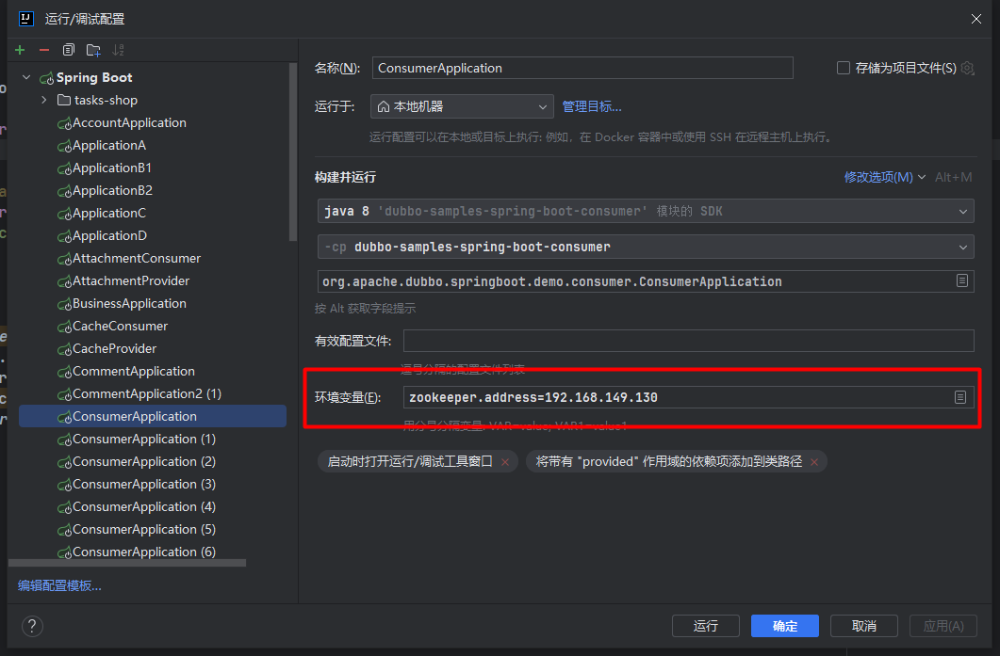
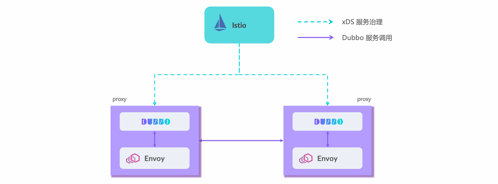
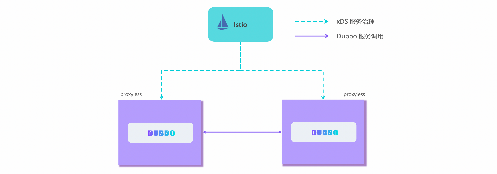

# 目录 
1.dubbo入门  
2.dubbo功能  
3.dubbo博客  

## 1.dubbo入门  
**目录:**  
1.1 dubbo基本介绍  
1.2 体会dubbo的第一个示例  
1.3 使用dubbo开发微服务项目  
1.4 dubbo架构介绍  
1.5 dubbo与gRPC、Spring Cloud、Istio的关系  
1.6 核心优势  

### 1.1 dubbo基本介绍
1.背景  
dubbo是一个微服务框架,用于向用户提供`跨进程`的RPC`远程调用`;如下图所示,服务消费者可以通过注册中心(`zookeeper`)感知服务提供者,从而将请求发送给正确的服务提供者.  
  
一句话总结,什么是dubbo:<font color="#FF00FF">dubbo是一款支持云原生的高性能的RPC调用框架,同时dubbo在云原生+服务网格、服务开发框架层面、通信协议、服务治理、可视化等方面更加优秀</font>,解决了SpringCloud体系的各种问题.

### 1.2 体会dubbo的第一个示例
1.获取dubbo演示代码  
*提示:这里通过完成一个dubbo的远程调用来演示dubbo的效果*  
执行如下命令从获取项目代码:  
`git clone --depth=1 --branch master git@github.com:apache/dubbo-samples.git`  

2.项目结构  
下载后的项目结构如下:  
```console
.
├── codestyle        // 开发使用的 style 配置文件

├── 1-basic          // 基础的入门用例
├── 2-advanced       // 高级用法
├── 3-extensions     // 扩展使用示例
├── 4-governance     // 服务治理用例
├── 10-task          // Dubbo 学习系列示例

├── 99-integration   // 集成测试使用
├── test             // 集成测试使用
└── tools            // 三方组件快速启动工具
```
项目代码结构由三部分构成:代码风格文件、测试代码、集成测试  
* 代码风格:是开发dubbo代码时使用的,其中包括IDEA的配置文件
* 测试代码:教材的核心内容,其中包括五个部分  
  面向初学者的basic入门用例  
  面向开发人员的advanced高级用法  
  面向中间件维护者的extensions Dubbo周边扩展使用示例  
  面向生产的governance服务治理用例
  Dubbo学习系列
* 集成测试:是dubbo自身用于测试`测试代码`中所有sample示例是否正常的部分,保证dubbo每个版本的变更不会影响sample示例的使用  

3.启动zookpeer  
*提示:dubbo需要使用服务注册中心zookpeer,这里采用docker的方式启动*  
执行如下命令安装zookpeer  
```shell
docker run \
--name dubbo-zookeeper \
-p 2181:2181 \
-d zookeeper
```
启动成功之后查看docker日志:  
  

4.启动服务提供者  
在IDEA中点击右侧的Maven,执行`clean->compile`  
  

运行1-basic->dubbo-samples-api->provider->application示例启动服务提供者  
等待控制台出现如下字样则代表启动成功:  
```shell
11:16:01.973 |-INFO  [main] he.dubbo.config.bootstrap.DubboBootstrap:322 -|  [DUBBO] DubboBootstrap awaiting ..., dubbo version: 3.3.0-beta.1, current host: 192.168.149.1
```

5.启动服务消费者  
运行1-basic->dubbo-samples-api->client->application  
消费者启动成功后看到控制台打印如下内容表示一次服务调用成功:  
```shell
Receive result ======> hi, dubbo
```

6.1 消费者是如何发现提供者的?  

6.2 消费者发起请求的流程  
在Dubbo的调用模型中,`Dubbo是连接服务消费者和服务提供者的桥梁`  
在本例中,服务提供者实现了GreetingsService接口,具体代码如下:  
```java
public class GreetingsServiceImpl implements GreetingsService {
    @Override
    public String sayHi(String name) {
        return "hi, " + name;
    }
}
```

同时服务消费者通过Dubbo订阅了该接口  
```java
public interface GreetingsService {
    String sayHi(String name);
}
```
服务消费者调用接口的过程中,Dubbo会将该请求封装成网络请求;接着将该请求发送到服务提供者进行实际的调用.  

实际上服务消费者是通过Dubbo的动态代理来实现的;具体代码如下:  
```java
ReferenceConfig<GreetingsService> reference =
        ReferenceBuilder.<GreetingsService>newBuilder()
        .interfaceClass(GreetingsService.class)
        .url("tri://localhost:50052")
        .build();
DubboBootstrap.getInstance().reference(reference).start();
GreetingsService service = reference.get();

String message = service.sayHi("dubbo");

System.out.println("Receive result ======> " + message);
```

6.3 多个服务提供者实例  
*提示:dubbo也是支持多个服务提供者供消费者进行调用的*  
这里只需要修改GreetingsServiceImpl接口sayHi方法中的实现,然后启动三个不同实现内容的服务提供者,接着让服务消费者去调用接口,会发现这些请求被随机分配到不同的服务提供者上.  

6.4 dubbo启动示例  
**服务提供者代码示例如下:**  
```java
// 修改1-basic->dubbo-samples-api->provider->application中的代码如下  
// 定义所有的服务
ServiceConfig<GreetingsService> service = new ServiceConfig<>();
service.setInterface(GreetingsService.class);
service.setRef(new GreetingsServiceImpl());

// 启动 Dubbo
DubboBootstrap.getInstance()
        .application("first-dubbo-provider")
        .registry(new RegistryConfig(ZOOKEEPER_ADDRESS))
        .protocol(new ProtocolConfig("dubbo", -1))
        .service(service)
        .start();
``` 

**服务消费者代码示例如下:**  
```java
// 修改1-basic->dubbo-samples-api->client->application
// 定义所有的订阅
ReferenceConfig<GreetingsService> reference = new ReferenceConfig<>();
reference.setInterface(GreetingsService.class);

// 启动 Dubbo
DubboBootstrap.getInstance()
        .application("first-dubbo-consumer")
        .registry(new RegistryConfig(ZOOKEEPER_ADDRESS))
        .reference(reference)
        .start();

// 获取订阅到的 Stub
GreetingsService service = reference.get();
// 像普通的 java 接口一样调用
String message = service.sayHi("dubbo");
```

### 1.3 使用dubbo开发微服务项目
1.启动服务注册中心zookpeer  
参考1.2=>第3步=>启动zookpeer  
本次环境使用Linux的docker方式启动,Linux的IP为:192.168.149.130;zookpeer的端口为`2181`  

2.项目基本环境搭建  
在idea中创建dubbo-springboot-demo根模块,删除根模块的src等信息  
本次环境一共使用三个模块:`dubbo-spring-boot-demo-interface`、`dubbo-spring-boot-demo-provider`、`dubbo-spring-boot-demo-consumer`;分别是公共模块、服务提供者模块、服务消费者模块.  
最终的目录结构如下所示:  
  

3.修改根模块dubbo-springboot-demo的pom配置文件  
配置参考如下:  
```xml
<groupId>org.apache.dubbo</groupId>
<artifactId>dubbo-spring-boot-demo</artifactId>
<version>1.0-SNAPSHOT</version>
<packaging>pom</packaging>

<modules>
    <module>dubbo-spring-boot-demo-interface</module>
    <module>dubbo-spring-boot-demo-provider</module>
    <module>dubbo-spring-boot-demo-consumer</module>
</modules>

<properties>
    <dubbo.version>3.2.0-beta.4</dubbo.version>
    <spring-boot.version>2.7.8</spring-boot.version>
    <maven.compiler.source>17</maven.compiler.source>
    <maven.compiler.target>17</maven.compiler.target>
    <project.build.sourceEncoding>UTF-8</project.build.sourceEncoding>
</properties>

<dependencyManagement>
    <dependencies>
        <!-- Spring Boot -->
        <dependency>
            <groupId>org.springframework.boot</groupId>
            <artifactId>spring-boot-dependencies</artifactId>
            <version>${spring-boot.version}</version>
            <type>pom</type>
            <scope>import</scope>
        </dependency>

        <!-- Dubbo -->
        <dependency>
            <groupId>org.apache.dubbo</groupId>
            <artifactId>dubbo-bom</artifactId>
            <version>${dubbo.version}</version>
            <type>pom</type>
            <scope>import</scope>
        </dependency>

        <dependency>
            <groupId>org.apache.dubbo</groupId>
            <artifactId>dubbo-dependencies-zookeeper-curator5</artifactId>
            <version>${dubbo.version}</version>
            <type>pom</type>
        </dependency>
    </dependencies>
</dependencyManagement>


<build>
    <pluginManagement>
        <plugins>
            <plugin>
                <groupId>org.springframework.boot</groupId>
                <artifactId>spring-boot-maven-plugin</artifactId>
                <version>${spring-boot.version}</version>
            </plugin>
        </plugins>
    </pluginManagement>
</build>
```

4.修改`dubbo-spring-boot-demo-provider`、`dubbo-spring-boot-demo-consumer`模块的pom配置文件  
参考配置如下:  
```xml
<dependencies>
    <dependency>
        <groupId>org.apache.dubbo</groupId>
        <artifactId>dubbo-spring-boot-demo-interface</artifactId>
        <version>${project.parent.version}</version>
    </dependency>

    <!-- dubbo -->
    <dependency>
        <groupId>org.apache.dubbo</groupId>
        <artifactId>dubbo-spring-boot-starter</artifactId>
    </dependency>
    <dependency>
        <groupId>org.apache.dubbo</groupId>
        <artifactId>dubbo-dependencies-zookeeper-curator5</artifactId>
        <type>pom</type>
        <exclusions>
            <exclusion>
                <artifactId>slf4j-reload4j</artifactId>
                <groupId>org.slf4j</groupId>
            </exclusion>
        </exclusions>
    </dependency>

    <!-- spring boot starter -->
    <dependency>
        <groupId>org.springframework.boot</groupId>
        <artifactId>spring-boot-starter</artifactId>
    </dependency>

</dependencies>
```

5.定义服务接口  
*解释:就类似之前OpenFeign需要将远程调用接口单独定义到一个模块中一样*  
来到dubbo-spring-boot-demo-interface模块,创建包`org.apache.dubbo.samples.api`,在该包下创建`DemoService`接口,定义如下:  
```java
public interface DemoService {
    String sayHello(String name);
}
```

6.创建实现类  
在dubbo-spring-boot-demo-provider模块下创建org.apache.dubbo.samples.provider包,在该包下创建第5步定义的接口的实现类DemoServiceImpl  
```java
@DubboService
public class DemoServiceImpl implements DemoService {

    @Override
    public String sayHello(String name) {
        return "Hello " + name;
    }
}
```
**注意:该类被@DubboService注解修饰**

7.配置yml  
dubbo-spring-boot-demo-provider模块的yml配置文件:  
```yml
dubbo:
  application:
    name: dubbo-springboot-demo-provider
  protocol:
    name: dubbo
    port: -1
  registry:
    address: zookeeper://${zookeeper.address:127.0.0.1}:2181
```
dubbo-spring-boot-demo-consumer模块的yml配置文件:  
```yml
dubbo:
  application:
    name: dubbo-springboot-demo-consumer
  protocol:
    name: dubbo
    port: -1
  registry:
    address: zookeeper://${zookeeper.address:127.0.0.1}:2181
```
*注意:可以看到这里的配置使用了${zookeeper.address}这种引用的方式,所以需要对这两个模块启动的配置信息添加`环境变量`,效果如下:*  
  

8.创建启动类  
创建生产者模块的启动类:  
在生产者模块下创建org.apache.dubbo.springboot.demo.provider包,在该包下创建ProviderApplication类  
```java
@SpringBootApplication
@EnableDubbo
public class ProviderApplication {
    public static void main(String[] args) {
        SpringApplication.run(ProviderApplication.class, args);
    }
}
```
*注意:这里使用了@EnableDubbo注解,表示开启dubbo的自动配置*  

创建消费者模块的启动类:  
在消费者模块下创建org.apache.dubbo.springboot.demo.consumer包,在该包下创建ConsumerApplication类  
```java
@SpringBootApplication
@EnableDubbo
public class ConsumerApplication {

    public static void main(String[] args) {
        SpringApplication.run(ConsumerApplication.class, args);
    }
}
```

9.创建消费者请求任务  
在消费者模块的org.apache.dubbo.springboot.demo.consumer包下创建Task类:  
```java
@Component
public class Task implements CommandLineRunner {
    @DubboReference
    private DemoService demoService;

    @Override
    public void run(String... args) throws Exception {
        String result = demoService.sayHello("world");
        System.out.println("Receive result ======> " + result);

        new Thread(()-> {
            while (true) {
                try {
                    Thread.sleep(1000);
                    System.out.println(new Date() + " Receive result ======> " + demoService.sayHello("world"));
                } catch (InterruptedException e) {
                    e.printStackTrace();
                    Thread.currentThread().interrupt();
                }
            }
        }).start();
    }
}
```
*解释:当应用启动时run方法就会执行,这是一个定时任务不停地调用DemoService来实现远程调用*  
**注意:这里的DemoService被`@DubboReference`注解修饰**  

11.测试运行  
确保环境变量已经添加为Linux系统的IP  
首先启动生产者模块(dubbo-spring-boot-demo-provider),再启动消费者模块(dubbo-spring-boot-demo-consumer);  
消费者模块的打印信息如下:  
  

12.QOS问题  
因为dubbo新版本默认对telnet命令添加了支持,并且telnet的默认端口是22222,所以如果在一台服务器里面同时启动consumer和provider可能就会报端口冲突的异常.  
解决的办法可以修改端口也可以取消telnet功能  

### 1.4 dubbo架构介绍
1.dubbo的工作原理  
  
以上是Dubbo的工作原理图,从抽象架构上分为两层:<font color="#00FF00">服务治理抽象控制面</font>和<font color="#00FF00">Dubbo数据面</font>  
*提示:在kong中也有类似的数据面和控制面的概念,服务网格中对控制平面和数据平面有更全面的解释*  
* 服务治理控制面:  
  服务治理控制面不是特指如注册中心类的单个具体组件,而是对Dubbo治理体系的抽象表达.控制面包含<font color="#00FF00">协调服务发现的注册中心、流量管控策略、Dubbo Admin控制台等,如果采用了Service Mesh架构则还包含Istio等服务网格控制面</font>  
* Dubbo数据面:  
  数据面代表集群部署的所有<font color="#00FF00">Dubbo进程</font>(所有微服务模块),进程之间通过`RPC`协议实现数据交换,Dubbo定义了微服务应用开发与调用规范并负责完成数据传输的编解码工作  
  * 服务消费者(Dubbo Consumer),发起业务调用或RPC通信的Dubbo进程
  * 服务提供者(Dubbo Provider),接收业务调用或RPC通信的Dubbo进程

2.Dubbo数据面  
从数据面视角,dubbo解决了如下问题(dubbo的作用):  
* Dubbo作为`服务开发框架`约束了微服务定义、开发与调用的规范,定义了服务治理流程及适配模式
* Dubbo作为`RPC通信协议实现`解决服务间数据传输的编解码问题

  

3.服务开发框架  
微服务的目标是构建足够小的、自包含的、独立演进的、可以随时部署运行的分布式应用程序;Dubbo在微服务应用开发框架之上抽象了一套**RPC服务定义、暴露、调用与治理的编程规范**;从而解决各个微服务模块之间的各种调用问题;说白了就是dubbo就是一个微服务框架.  
  

Dubbo作为服务开发框架包含的具体内容如下:  
* RPC服务定义、开发范式:Dubbo支持通过IDL定义服务,也支持编程语言特有的服务开发定义方式,如通过Java Interface定义服务
* RPC服务发布与调用API:Dubbo支持同步、异步、Reactive Streaming等服务调用编程模式,还支持请求上下文API、设置超时时间等
* 服务治理策略、流程与适配方式:作为服务框架数据面,Dubbo定义了服务地址发现、负载均衡策略、基于规则的流量路由、Metrics 指标采集等服务治理抽象,并适配到特定的产品实现

4.通信协议  
Dubbo从设计上不绑定任何一款特定通信协议,dubbo**支持HTTP/2、REST、gRPC、JsonRPC、Thrift、Hessian2等几乎所有主流的通信协议**.  
*提示:采用这种多协议的好处是,可以根据场景自由选择不同的协议,提高了灵活性*  
  
特点:  
* dubbo支持协议扩展,dubbo支持将内部私有协议适配到dubbo框架上.  
* dubbo支持多协议暴露,<font color="#00FF00">可以在单个端口上暴露多个协议</font>;dubbo能够自动识别并确保请求被正确处理;<font color="#00FF00">也可以将同一个RPC服务发布在不同的端口</font>  

特点总结:  
* 不绑定通信协议(<font color="#00FF00">支持多任意通信协议</font>)
* 提供高性能通信协议实现
* 支持流式通信模型
* 不绑定序列化协议
* 支持单个服务的多协议暴露
* 支持单端口多协议发布
* 支持一个应用内多个服务使用不同通信协议

5.dubbo服务治理  
**什么是服务治理:**  
`服务开发框架`解决了开发与通信的问题;但在微服务集群环境下,我们仍需要解决<font color="#00FF00">无状态服务节点动态变化、外部化配置、日志跟踪、可观测性、流量管理、高可用性、数据一致性</font>等一系列问题,我们将这些问题统称为服务治理

dubbo抽象了一套微服务治理模式并发布了对应的官方实现,服务治理可帮助简化微服务开发与运维,让开发者更专注在微服务业务本身  
dubbo服务治理功能:  
  

* 地址发现:  
  Dubbo服务发现具备高性能、支持大规模集群、服务级元数据配置等优势,默认提供 Nacos、Zookeeper、Consul等多种注册中心适配,与 Spring Cloud、Kubernetes Service模型打通,支持自定义扩展
* 负载均衡:  
  Dubbo 默认提供加权随机、加权轮询、最少活跃请求数优先、最短响应时间优先、一致性哈希和自适应负载等策略
* 流量路由:  
  Dubbo支持通过一系列流量规则控制服务调用的流量分布与行为,基于这些规则可以实现基于<font color="#00FF00">权重的比例流量分发、灰度验证、金丝雀发布、按请求参数的路由、同区域优先、超时配置、重试、限流降级</font>等能力.
* 链路追踪:  
  Dubbo官方通过适配OpenTelemetry提供了对Tracing全链路追踪支持,用户可以接入支持OpenTelemetry标准的产品如Skywalking、Zipkin等.另外,很多社区如Skywalking、Zipkin等在官方也提供了对Dubbo的适配
* 可观测性:  
  Dubbo实例通过<font color="#00FF00">Prometheus</font>等上报QPS、RT、请求次数、成功率、异常次数等多维度的可观测指标帮助了解服务运行状态,通过接入Grafana、Admin控制台帮助实现数据指标可视化展示

6.dubbo admin  
Admin dashboard提供了dubbo的集群可视化,通过admin可以来管理dubbo  
  

7.服务网格  
将Dubbo接入Istio等服务网格治理体系  
  

8.总结  
<font color="#FF00FF">dubbo是一款支持云原生的高性能的RPC调用框架,同时dubbo在云原生+服务网格、服务开发框架层面、通信协议、服务治理、可视化等方面更加优秀</font>,解决了SpringCloud体系的各种问题  


### 1.5 dubbo与gRPC、Spring Cloud、Istio的关系
1.dubbo与springcloud  
  

共同点:  
* Dubbo和Spring Cloud<font color="#00FF00">都侧重在对分布式系统中常见问题模式的抽象</font>(如服务发现、负载均衡、动态配置等),同时对每一个问题都提供了配套组件实现,形成了一套微服务整体解决方案,让使用Dubbo及Spring Cloud的用户在开发微服务应用时可以专注在业务逻辑开发上
* <font color="#00FF00">Dubbo和Spring Cloud都完全兼容Spring体系的应用开发模式</font>
  为什么说dubbo和springcloud都完全兼容spring体系的开发,这句话很有韵味;因为springcloud是基于spring的一个微服务解决方案  

Spring Cloud的优势:  
* 同样都支持Spring开发体系的情况下,Spring Cloud得到更多的原生支持
* 对一些常用的微服务模式做了抽象如服务发现、动态配置、异步消息等,同时包括一些批处理任务、定时任务、持久化数据访问等领域也有涉猎
* 基于HTTP的通信模式,加上相对比较完善的入门文档和演示demo和starters,让开发者在第一感觉上更易于上手

Spring Cloud的问题:  
* 只提供抽象模式的定义不提供官方稳定实现,开发者只能寻求类似Netflix、Alibaba、Azure等不同厂商的实现套件,而每个厂商支持的完善度、稳定性、活跃度各异
* 有微服务全家桶却不是能拿来就用的全家桶,demo上手容易,但落地推广与长期使用的成本非常高
* <font color="#00FF00">欠缺服务治理能力</font>,尤其是流量管控方面如负载均衡、流量路由方面能力都比较弱
* <font color="#00FF00">编程模型与通信协议绑定HTTP</font>,在性能、与其他RPC体系互通上存在障碍
* 总体架构与实现只适用于小规模微服务集群实践,当集群规模增长后就会遇到地址推送效率、内存占用等各种瓶颈的问题,但此时迁移到其他体系却很难实现
* 很多微服务实践场景的问题需要用户独自解决,比如优雅停机、启动预热、服务测试,再比如双注册、双订阅、延迟注册、服务按分组隔离、集群容错等
* 代码侵入性太强,业务代码与服务治理代码打包在一起

springcloud的劣势就是dubbo的优势:  
* 完全支持Spring&Spring Boot开发模式,同时在服务发现、动态配置等基础模式上提供与Spring Cloud对等的能力
* 是企业级微服务实践方案的整体输出,Dubbo考虑到了企业微服务实践中会遇到的各种问题如优雅上下线、多注册中心、流量管理等,因此其在生产环境的长期维护成本更低
* 在通信协议和编码上选择更灵活,包括rpc通信层协议如HTTP、HTTP/2(Triple、gRPC)、TCP二进制协议、rest等,序列化编码协议<font color="#00FF00">Fastjson、Protobuf、Hessian2、Kryo、FST</font>等,支持单端口多协议
  在springcloud体系中只能使用HTTP解析+JSON序列化协议  
* Dubbo从设计上突出服务服务治理能力,如权重动态调整、标签路由、条件路由等,支持Proxyless等多种模式接入Service Mesh体系
* 高性能的RPC协议编码与实现
* Dubbo是在超大规模微服务集群实践场景下开发的框架,可以做到百万实例规模的集群水平扩容,应对集群增长带来的各种问题
* Dubbo提供Java外的多语言实现,使得构建多语言异构的微服务体系成为可能

2.dubbo与gRPC  
Dubbo与gRPC最大的差异在于两者的定位上:
* <font color="#00FF00">gRPC定位为一款RPC框架</font>,Google推出它的核心目标是定义云原生时代的rpc通信规范与标准实现;
* Dubbo定位是一款<font color="#00FF00">微服务开发框架</font>,它侧重解决微服务实践从服务定义、开发、通信到治理的问题,因此Dubbo同时提供了RPC通信、与应用开发框架的适配、服务治理等能力
  <font color="#00FF00">所以从开放能力上来说dubbo比gRPC更加强大,使用场景更加宽泛</font>  

Dubbo服务间可通过多种RPC协议通信并支持灵活切换.因此,可以在Dubbo开发的微服务中选用gRPC通信,Dubbo完全兼容gRPC,并将gRPC设计为内置原生支持的协议之一  
  

3.dubbo与Istio  
Service Mesh是近年来在云原生背景下诞生的一种微服务架构,<font color="#FF00FF">在Kubernetes体系下</font>,让微服务开发中的更多能力如流量拦截、服务治理等<font color="#FF00FF">下沉并成为基础设施</font>,让微服务开发、升级更轻量.Istio是Service Mesh的开源代表实现,它从部署架构上分为<font color="#00FF00">数据面与控制面</font>,从这一点上与Dubbo总体架构是基本一致的,Istio带来的主要变化在于:  
* 数据面,Istio通过引入<font color="#FF00FF">Sidecar</font>实现了对服务流量的透明拦截,<font color="#FF00FF">Sidecar通常是与Dubbo等开发的传统微服务组件部署在一起</font>
* 控制面,将之前抽象的服务治理中心聚合为一个具有统一实现的具体组件,并实现了与底层基础设施如Kubernetes无缝适配

Dubbo已经实现了对Istio体系的全面接入,可以用Istio控制面治理Dubbo服务,而在数据面部署架构上,针对Sidecar引入的复杂性与性能问题,Dubbo还支持无代理的Proxyless模式.除此之外,Dubbo Mesh体系还解决了Istio架构落地过程中的很多问题,包括提供更灵活的数据面部署架构、更低的迁移成本等  
  

### 1.6 核心优势  
**目录:**  
1.6.1 快速易用  
1.6.2 超高性能  

#### 1.6.1 快速易用
1.支持多种编程语言、使用任意通信协议  

2.支持多种语言SDK  
dubbo提供了几乎所有主流语言的SDK实现,定义了<font color="#00FF00">统一的微服务开发范式</font>  

3.任意通信协议  
Dubbo从设计上不绑定任何一款特定通信协议,dubbo**支持HTTP/2、REST、gRPC、JsonRPC、Thrift、Hessian2等几乎所有主流的通信协议**.  
*提示:采用这种多协议的好处是,可以根据场景自由选择不同的协议,提高了灵活性*  
  
特点:  
* dubbo支持协议扩展,dubbo支持将内部私有协议适配到dubbo框架上.  
* dubbo支持多协议暴露,<font color="#00FF00">可以在单个端口上暴露多个协议</font>;dubbo能够自动识别并确保请求被正确处理;<font color="#00FF00">也可以将同一个RPC服务发布在不同的端口</font>  

#### 1.6.2 超高性能  
1.高性能数据传输
Dubbo内置支持<font color="#FF00FF">Dubbo2、Triple</font>两款高性能通信协议:  
* Dubbo2是基于TCP传输协议之上构建的二进制私有RPC通信协议,是一款非常简单、紧凑、高效的通信协议
* Triple是基于HTTP/2的新一代RPC通信协议,在网关穿透性、通用性以及Streaming通信上具备优势,<font color="#00FF00">Triple完全兼容gRPC协议</font>  
  <font color="#FF00FF">在云原生时代我们更推荐使用Triple协议</font>

2.性能对比  
* 较小报文场景createUser(创建用户)、existUser(判断用户是否存在,返回仅仅是Boolean)、getUser(得到用户信息),dubbo3.2版本的<font color="#FF00FF">Triple</font>协议性能与gRPC同场景性能基本持平
* <font color="#DDDD00">较大报文场景listUser(展示所有用户)相较于gRPC性能低11%</font>
  *性能还是比不过gRPC*

3.构建可伸缩的微服务集群  
* 注册中心的存储容量瓶颈
* 节点动态变化带来的地址推送与解析效率下降
* 消费端存储大量网络地址的资源开销
* 复杂的网络链接管理
* 高峰期的流量无损上下线
* 异常节点的自动节点管理

以上内容直接关系到微服务集群的稳定性,dubbo的优势就在于几乎无限水平扩容的集群规模,dubbo就是着重解决上述问题的  

4.智能化流量调度  
Dubbo3内置了具备自适应感知集群负载状态、智能调节流量分布的限流与调度算法实现,从消费者、提供者两个不同视角智能调整流量分布,<font color="#00FF00">最大限度确保将流量调度到具有最佳处理能力的实例上,从而提升整个集群的吞吐量与稳定性</font>.

5.自适应负载均衡  
更加高级的负载均衡算法,这里是针对于Ribbon的负载均衡算法来说的  

6.自适应限流  
<font color="#00FF00">传统的sentinel是提前对服务器进行压测从而找到节点平衡值,设置的是一个<font color="#FF00FF">静态</font>的最大并发值</font>自适应限流算法可以<font color="#FF00FF">动态调整</font>服务端机器的最大并发值,使其可以在保证机器不过载的前提下,尽可能多的处理接收到的请求.


## 2.dubbo功能
*提示:这里说的功能主要说的就是dubbo具备哪些服务治理的能力,概念比较多;本章基本上是对附录=>1.dubbo入门=>1.4dubbo架构介绍,这一节中提到的dubbo诸多功能更加详细介绍*  
**目录:**  
2.1 微服务开发  
2.2 服务发现  
2.3 负载均衡  
2.4 负载均衡  
2.5 流量管理  
2.6 通信协议  
2.7 观测服务  
2.8 认证鉴权  
2.9 服务网格  
2.x 服务发现(补充)  


### 2.1 微服务开发
详情见:附录=>1.dubbo入门=>1.3使用dubbo开发微服务项目  

### 2.2 服务发现
dubbo提供的是一种`Client-Based`的服务发现机制,依赖第三方注册中心组件来协调服务发现过程,支持常见的注册中心,如Nacos、Consul、zookpeer  

1.面向百万示例集群的服务发现机制  
  
dubbo相较于传统的服务发现框架有如下优势:  
* 首先,Dubbo注册中心以<font color="#FF00FF">应用粒度</font>聚合实例数据,消费者按消费需求<font color="#00FF00">精准订阅</font>,避免了大多数开源框架如Istio、Spring Cloud等全量订阅带来的性能瓶颈
  <font color="#FF00FF">Dubbo是精确订阅不是全量订阅,并且是以应用粒度聚合示例,应用粒度对应的是服务粒度,应用粒度更粗从而能避免更多的数据开销</font>
* 其次,Dubbo SDK在实现上对<font color="#00FF00">消费端地址列表处理过程做了大量优化,地址通知增加了异步、缓存、bitmap等多种解析优化</font>,避免了地址更新常出现的消费端进程资源波动
* 最后,在功能丰富度和易用性上,服务发现除了同步ip、port等端点基本信息到消费者外,Dubbo还将服务端的RPC/HTTP服务及其配置的<font color="#FF00FF">元数据</font>信息同步到消费端,这让消费者、提供者两端的更细粒度的协作成为可能,Dubbo基于此机制提供了很多差异化的治理能力
  <font color="#FF00FF">dubbo还同步了元数据信息</font>

2.高效地址推送实现  
dubbo3是以<font color="#FF00FF">应用粒度</font>聚合实例数据,从而减少传输的数据量,提升了性能,并且dubbo3实现了<font color="#FF00FF">按需精准订阅地址信息</font>,比如一个消费者依赖app1、app2则只会订阅app1、app2的地址列表更新,大幅减轻了冗余数据推送.  
  

3.元数据配置  
除了与注册中心的交互,dubbo3还有一条额外的元数据通路;即元数据服务(MetadataService),<font color="#FF00FF">实例地址与元数据共同组成了消费者端有效的地址列表</font>  
从用户视角来看元数据中心是只读的,元数据中心的唯一写入方式是dubbo进程实例,dubbo实例会在启动之后将一些内部状态(如服务列表、服务配置、服务定义格式等)上报到元数据中心.
  
完整工作流程如上图所示,首先消费者中注册中心收到地址(ip:port)信息,<font color="#00FF00">然后与提供者建立连接并通过元数据服务读取到对端元数据配置信息</font>(也就是说元数据不是从注册中心中获取的),两部分信息共同组装成dubbo消费端有效的面向服务的地址列表.  

4.配置方式  
dubbo服务发现支持多种注册中心组件,例如nacos、zookpeer、consul、Redis  
dubbo还支持一个应用内配置<font color="#00FF00">多注册中心</font>的场景,例如双注册、双订阅.由此可以实现<font color="#FF00FF">不同集群地址数据互通、集群迁移</font>等场景  

### 2.3 负载均衡
1.负载均衡策略  
dubbo提供了如下的负载均衡策略  
|             算法              |          特性           |                       备注                        |
|:-----------------------------:|:-----------------------:|:-------------------------------------------------:|
|  Weighted Random LoadBalance  |        加权随机         |               默认算法,默认权重相同               |
|    RoundRobin LoadBalance     |        加权轮询         |    借鉴于Nginx的平滑加权轮询算法,默认权重相同,    |
|    LeastActive LoadBalance    | 最少活跃优先 + 加权随机 |               背后是能者多劳的思想                |
| Shortest-Response LoadBalance | 最短响应优先 + 加权随机 |                 更加关注响应速度                  |
|  ConsistentHash LoadBalance   |       一致性哈希        |     确定的入参,确定的提供者,适用于有状态请求      |
|        P2C LoadBalance        |   Power of Two Choice   | 随机选择两个节点后,继续选择"连接数"较小的那个节点 |
|     Adaptive LoadBalance      |     自适应负载均衡      |   在P2C算法基础上,选择二者中load最小的那个节点    |

*提示:每种算法的详细介绍这里就不贴了,详情可参照官网*  


### 2.5 流量管理
**目录:**  
2.5.1 流量管理介绍  
2.5.2 标签路由  
2.5.3 条件路由  
2.5.4 脚本路由  
2.5.5 动态配置  
2.5.6 限流与熔断  

#### 2.5.1 流量管理介绍
Dubbo的流量管控规则可以基于<font color="#00FF00">应用、服务、方法、参数</font>等粒度精准的控制流量走向,<font color="#00FF00">根据请求的目标服务、方法以及请求体中的其他附加参数进行匹配</font>,符合匹配条件的流量会进一步的按照特定规则转发到一个地址子集.流量管控规则(路由器)有以下几种:  
* 条件路由规则
* 标签路由规则
* 脚本路由规则
* 动态配置规则

1.工作原理  
Dubbo消费者在调用目标服务时会把目标服务的实例地址集合传给一个<font color="#00FF00">路由器</font>,路由器根据请求上下文(Request Context)和(Router Rule)实际的路由规则定义对输入地址进行匹配,所有匹配成功的实例组成一个<font color="#00FF00">地址子集</font>,最终地址子集作为输出结果继续交给下一个路由器或者负载均衡组件处理.  
在Dubbo中,多个路由器组成一条路由链共同协作,<font color="#FF00FF">前一个路由器的输出作为另一个路由器的输入</font>,经过层层路由规则筛选后,最终生成有效的地址集合.也就是责任链模式   

#### 2.5.2 标签路由
1.标签路由规则  
<font color="#00FF00">标签路由说白了就是对服务实例进行分组,给某些服务实例打标签,这样在请求的时候指定当前请求只能发送到对应标签的服务实例上,从而做到隔离.</font>标签路由可以作为蓝绿发布、灰度发布等场景能力的基础.  
标签主要是对服务提供者一端的实例进行分组,目前有两种方式可以完成实例分组,分别是`动态规则打标`和`静态规则打标`  
`动态规则打标`可以在运行时动态的圈住一组机器实例,而`静态规则打标`则需要实例重启后才能生效;动态规则相较于静态规则优先级更高,当两种规则出现冲突时以动态规则为准  
*注意:标签路由是一套严格隔离的流量体系,一旦打了标签则这部分地址子集就被隔离出来,只有带有对应标签的请求流量可以访问这个地址子集,这部分地址<font color="#FF00FF">不再接收没有标签或者具有不同标签的流量,可以理解为无标签服务也作为一种分类,并不是说无标签服务是通用流量</font>*  
<font color="#00FF00">并且在标签路由下,所有服务的标签规则都是一致的,也就是说它的作用域只有application,这点要和动态配置规则区分下来</font>  

2.静态打标  
Provider:
静态打标需要再服务提供者实例启动前确定,并且必须通过特定的参数`tag`指定;可以通过如下三种方式打标(服务提供者)  
```xml
<dubbo:provider tag="gray"/>
<dubbo:service tag="gray"/>
java -jar xxx-provider.jar -Ddubbo.provider.tag=gray
```

Consumer:  
```java
RpcContext.getContext().setAttachment(Constants.TAG_KEY, "gray");
```

3.动态打标  
Provider:  
相比于静态打标只能通过`tag`属性设置,且在启动阶段就已经固定下来,动态标签可以匹配任意多个属性,根据指定的匹配条件将Provider实例动态的划分到不同的流量分组中  
以下条件路由示例在`shop-detail`应用中圈出了一个环境隔离`gray`,`gray`环境包含所有带有`env=gray`标识的机器实例,其余不匹配`env=gray`继续留在默认分组(无tag)  
这段配置是dubbo的yml配置,不是spring的配置,后续会学习到  
```yml
configVersion: v3.0
force: true
enabled: true
key: shop-detail
tags:
  - name: gray
    match:
      - key: env
        value:
          exact: gray
```
<font color="#00FF00">key表明当前规则要应用到哪个名称的服务实例上,例如这里的路由规则就是针对shop-detail这个微服务</font>  

Consumer:  
服务消费者方的设置方式与静态打标规则一致  
```java
RpcContext.getContext().setAttachment(Constants.TAG_KEY, "Hangzhou");
```

> 请求标签的作用域仅为一次点对点的RPC请求,例如A->B->C调用链路上,如果A->B调用通过setAttachment设置了`tag`参数,则该参数不会在B->C的调用中生效,同样的如果A->B->C这次调用结束后,如果A还需要相同的tag参数则在发起调用之前还需要再设置一次`setAttachment`  

4.标签路由规则主体  
以上述第3点中动态打标为示例进行解释  
|     属性      |  类型   |                                                 描述                                                  | 是否必须 |
|:-------------:|:-------:|:-----------------------------------------------------------------------------------------------------:|:--------:|
| configVersion | String  |                                    标签路由的版本,当前的版本为v3.0                                    |   必须   |
|      key      | String  |                                   此规则要应用到哪个目标微服务上面                                    |   必须   |
|   enabaled    | boolean |                                           是否启用当前规则                                            |   必须   |
|     tags      |  Tag[]  |                                            规则的标签定义                                             |   必须   |
|     force     | boolean | tags路由规则实例子集为空时的行为<br>true表示不返回提供程序异常,而false表示回退到没有任何标记的子集。 |   可选   |
|    runtime    | boolean |                       是为每个rpc调用运行路由规则,还是使用路由缓存（如果可用）                       |   可选   |

**标签定义Tag的格式:**  
| 属性  |      类型      |                     描述                      | 是否必须 |
|:-----:|:--------------:|:---------------------------------------------:|:--------:|
| name  |     String     | 用于匹配请求上下文中的dubbo.tag值的标记的名称 |    是    |
| match | MatchCondition | 要将实例分类为此标记的成员所需满足的一组标准  |    否    |
  

5.K8S打标  
除了通过在应用内使用xml文件的方式给服务打标之外,dubbo会自动读取机器的环境变量信息给应用打标,那么结合K8S,Dubbo就能自动读取以下环境变量配置:  
```yml
spec:
  containers:
  - name: detail
    image: apache/demo-detail:latest
    env:
    - name: DUBBO_LABELS
      value: "region=hangzhou; env=gray"
```


#### 2.5.3 条件路由
相较于标签路由规则,条件路由规则更加灵活,在标签路由规则中如果给提供者打上了标签,则消费者在调用时必须提供相应的标签本次请求才会到目标服务上,否则本次请求会进入无标签集合中  
而在<font color="#00FF00">条件路由中所有的实例都是一样的</font>,不存在分组隔离的问题,条件路由规则主体`conditions`是形如<font color="#FF00FF">[match] => [filter]</font>的规则  
* =>之前的内容即`match`是匹配条件,也就是说本次消费者要不要走当前这个<font color="#FF00FF">条件路由器</font>,是根据match来决定的,是在消费者端做的一次匹配
* =>之后的内容即`filter`是过滤条件,它的效果就类似标签路由规则;通过filter的表达式来从服务提供者列表中过滤出符合条件的<font color="#00FF00">地址子集</font>
  * 如果匹配条件为空,则表明对所有请求生效,如:`=> status!=staging`
  * 如果过滤条件为空,则表明禁止来自相应请求的访问,如:`application = product =>`
    这个的意思就是说如果消费者的请求参数匹配`application = product`则经过该路由器之后它将无法匹配到任何一个<font color="#00FF00">地址子集</font>

**条件路由规则示例:**  
基于以下示例规则,所有org.apache.dubbo.demo.CommentService服务调用都将被转发到与当前消费端机器具有相同region标记的地址子集(也就是服务提供者在相同region这个分类下).$region是特殊引用符号,执行过程中将读取消费端机器的实际的region值替代  
```yml
configVersion: v3.0
scope: service
enabled: true
force: true
runtime: true
key: org.apache.dubbo.samples.CommentService
conditions:
  - '=> region = $region'
```

1.条件路由规则主体  
*提示:这里以上述的条件路由规则示例为例进行说明*
|     属性      |   类型   |                                                                                                                描述                                                                                                                 | 是否必须 |
|:-------------:|:--------:|:-----------------------------------------------------------------------------------------------------------------------------------------------------------------------------------------------------------------------------------:|:--------:|
| configVersion |  String  |                                                                                                    条件路由的版本,当前版本为v3.0                                                                                                    |    是    |
|     scope     |  String  |                                                                                       支持service和application两种规则<br>这里使用的是service                                                                                       |    是    |
|      key      |  String  | 应用到的目标服务或者应用程序的标识符  <br> 当`scope:service`时,key应该是该规则生效的服务名比如org.apache.dubbo.samples.CommentService       <br> 当`scope:application`时,则key应该是该规则应该生效的应用名称,比如说my-dubbo-service |    是    |
|    enabled    | boolean  |                                                                                                          是否启用当前规则                                                                                                           |    是    |
|  conditions   | Stirng[] |                                                                                                        配置中定义的条件规则                                                                                                         |    是    |
|     force     | boolean  |                                                                      conditions后路由规则为空时的行为,true则抛出一个异常,false则会忽略规则直接去请求其它的实例                                                                      |    否    |
|    runtime    | boolean  |                                                                                            是否为每个 rpc 调用运行路由规则或使用路由缓存                                                                                            |    否    |

2.conditions条件  
*提示:conditions条件在上述已经进行过说明*  

3.<font color="#00FF00">匹配过滤</font>条件  
*提示:匹配和过滤都是使用下面的规则的*  
3.1 参数支持 
* 服务调用上下文,如interface、method、group、version等
* 请求上下,如:attachments[key] = value
* 方法参数,如:arguments[0] = tom
* URL本身的字段,如:protocol,host,port等
* URL上任务扩展参数,如:application,organization等
* 支持开发者自定义扩展

3.2 条件支持
* 等号 = 表示"匹配",如:method = getComment
* 不等号 != 表示"不匹配",如:method != getComment

3.3 值支持
* 以逗号,分隔多个值,如:host != 10.20.153.10,10.20.153.11
* 以星号\*结尾表示通配符,如:host != 10.20.\*
* 以美元符\$开头,表示引用消费者参数,如:region = \$region
* 整数值范围,如:userId = 1~100、userId = 101~
* 支持开发者自定义扩展

#### 2.5.4 脚本路由  
如果配置了脚本路由,则<font color="#00FF00">后续所有请求都会先执行一遍这个脚本</font>脚本过滤出来的地址即为请求允许发送到的、有效的<font color="#00FF00">地址子集</font>  
```yml
configVersion: v3.0
key: demo-provider
type: javascript
enabled: true
script: |
  (function route(invokers,invocation,context) {
      var result = new java.util.ArrayList(invokers.size());
      for (i = 0; i < invokers.size(); i ++) {
          if ("10.20.3.3".equals(invokers.get(i).getUrl().getHost())) {
              result.add(invokers.get(i));
          }
      }
      return result;
  } (invokers, invocation, context)); // 表示立即执行方法  
```

#### 2.5.5 动态配置
通过dubbo提供的动态配置规则,可以动态修改dubbo进程的运行时行为(可以动态调整RPC调用行为),整个过程不需要重启,例如超时时间、临时开启Access Log、修改Tracing 采样率、调整限流降级参数、负载均衡、线程池配置、日志等级、给机器实例<font color="#00FF00">动态打标签</font>等.  
以下示例将org.apache.dubbo.samples.UserService服务的超时参数调整为2000ms  
```yml
configVersion: v3.0
# 注意这里的作用域为service,作用域可以选择service和application
scope: service
key: org.apache.dubbo.samples.UserService
enabled: true
configs:
  - side: provider
    parameters:
      timeout: 2000
```
scope支持service、application两个可选值,意思是当前动态配置规则对哪种粒度的服务生效,是针对当前这个服务还是针对当前这个应用(即所有服务) 

以下示例将所有`shop-detail`微服务的accesslog功能开启  
```yml
configVersion: v3.0
scope: application
key: shop-detail
configs:
  - side: provider
    parameters:
      accesslog: 'true'
```

以下是一个服务级别的配置示例,`key:org.apache.dubbo.samples.UserService`和`side:consumer`说明这条配置对所有consumer的UserService接口生效,在调用失败后将有4次重试,`match`条件进一步限制了消费端的范围,限定为只对微服务名为`shop-detail`的实例生效  


#### 2.5.6 限流与熔断
1.回顾  
<font color="#FF00FF">限流是站在服务提供方来说的,降级是站在服务消费方来说的</font>  

2.流量控制  
<font color="#00FF00">流量控制更多的是站在Dubbo服务提供者视角来保证服务稳定性</font>,通过明确的为dubbo服务设置请求上限阈值,确保服务所处理的请求数量始终在一个合理范围之内,从而确保系统整体的稳定性  
在1.dubbo入门=>1.6 dubbo核心优势=>1.6.2 超高性能中介绍过dubbo的自适应限流  
dubbo提供两种限流的能力:  
* 静态:由用户预先设置一个固定的限流值,dubbo通过集成sentinel来实现静态限流
* 动态:dubbo框架自动根据系统或集群负载情况执行限流,关于这种模式后续会介绍

3.熔断降级  
<font color="#00FF00">熔断降级则是更多的从Dubbo服务消费者视角来保障系统稳定性的重要手段</font>,

### 2.6 通信协议  
详情见1.dubbo入门=>1.4 dubbo架构介绍=>4.通信协议介绍的已经很好了  

### 2.7 观测服务
1.可观测指标  
dubbo内部维护了多个维度的可观测指标,总体来说分为三个维度:  
* Admin:控制台可视化展示了集群中的应用、服务、实例及依赖关系,<font color="#00FF00">支持流量治理规则下发</font>,同时还提供如服务测试、mock、文档管理等提升研发测试效率的工具
* Metrics:Dubbo统计了一系列的流量指标如QPS、RT(Response Time)、成功请求数、失败请求数等,还包括一系列的内部组件状态如线程池数、服务健康状态等
* Tracing:dubbo支持主流的链路追踪工具,包括skywalking、Zipkin
* Logging:dubbo支持多种日志框架适配,同时dubbo还支持Access Log记录请求轨迹

2.Admin  
  

3.Metrics  
可以通过Grafana可视化的查看Metrics指标  
  

4.Tracing  
  


### 2.8 认证鉴权
为了保证服务与服务之间的通信是安全的,Dubbo提供了构建安全微服务通信体系(零信任体系)的完善机制:  
* 避免通信过程中的中间人攻击,Dubbo提供了身份认证(Authentication)和基于TLS的通信链路加密能力
* 控制服务间的访问鉴权(Authorization),Dubbo提供了mTLS和权限检查机制

1.架构  
一套完整的零信任体系包含多个组成部分:  
* 一个根证书机构(CA)来负责管理key和certificate
* 一个安全策略的管理和分发中心,来负责将安全策略实时下发给数据面组件:
  * 认证策略
  * 鉴权策略
  * 安全命名信息(Secure Naming Information)
* 数据面组件(Dubbo)负责识别和执行身份认证、加密、策略解析等动作
* 一系列的工具和生态,配合完成安全审计、数据链路监控等工作

2.Dubbo mTLS流程  
在Istio部署架构下,可以通过控制面认证策略开启或关闭Channel Authentication的双向认证,双向认证的工作流程如下:
* 通过Istio下发认证策略,开启双向认证
* Dubbo客户端同服务端开启双向TLS握手,在此期间Dubbo客户端会做secure naming check以检查服务端的身份(它被证实是有运行这个服务的合法身份)
* 客户端和服务端之间建立一条双向的mTLS链接,随后发起正常的加密通信
* Dubbo服务端收到请求后,识别客户端身份并检查其是否有权限访问响应的资源

3.Authorization鉴权  
Dubbo抽象了一套鉴权的扩展机制,但当前在具体实现上只支持Istio体系,因此其鉴权能力与Istio官方描述对等  

### 2.9 服务网格  
1.Dubbo Mesh架构图  

* 控制面:Istio作为统一控制面,为集群提供Kubernetes适配、服务发现、证书管理、可观测性、流量治理等能力
* 数据面:Dubbo应用实例作为<font color="#00FF00">数据面组件</font>,支持两种部署模式
  * Proxy模式:Dubbo进程与Envoy部署在同一pod,进出Dubbo的流量都经Envoy代理拦截,由Envoy执行流量管控,但是通信协议还是用的Dubbo的  
    这种模式就是纯服务网格Istio架构  
  * Proxyless模式:Dubbo进程独立部署,进程间直接通信,通过xDS协议与控制面直接交互

2.Proxy Mesh模式  
在proxy模式下,Dubbo与Envoy等边车(Proxy or Sidecar)部署在一起  
  
* Dubbo与Envoy部署在同一个Pod中,Istio实现对流量和治理的统一管控
* Dubbo只提供面向业务应用的<font color="#00FF00">编程API、RPC通信能力</font>,其余流量管控能力如地址发现、负载均衡、路由寻址等都下沉到Envoy,Envoy拦截所有进出流量并完成路由寻址等服务治理工作
  <font color="#FF00FF">此时dubbo不具备服务治理能力,虽然流量是从Envoy走,但是依旧采用dubbo的RPC通信</font>
* 控制面与Envoy之间通过图中虚线所示的xDS协议进行配置分发

在Proxy模式下,Dubbo3通信层选用Triple、gRPC、REST等基于HTTP的通信协议可以获得更好的网关穿透性与性能体验

3.Proxyless Mesh  
在Proxyless模式下,没有Envoy等代理组件,Dubbo进程保持独立部署并直接通信,Istio控制面通过xDS与Dubbo进程进行治理能力交互  
  

3.1 为什么需要Proxyless Mesh  
Proxy模式很好的实现了治理能力与有很多优势,如平滑升级、多语言、业务侵入小等,但也带来了一些额外的问题,比如:  
* Sidecar通信带来了额外的性能损耗,这在复杂拓扑的网络调用中将变得尤其明显
* Sidecar的存在让应用的生命周期管理变得更加复杂
* 部署环境受限,并不是所有的环境都能满足Sidecar部署与请求拦截要求

在Proxyless模式下,Dubbo进程之间继续保持直连通信模式:  
* 没有额外的Proxy中转损耗,因此更适用于性能敏感应用
* 更有利于遗留系统的平滑迁移
* 架构简单,容易运维部署
* 适用于几乎所有的部署环境


## 3.dubbo博客
**目录:**  
3.1 服务发现


### 3.1 服务发现(补充)  
1.服务发现基本原理  
  
dubbo从设计之初就内置了服务地址发现的能力,Provider注册地址到注册中心,Consumer通过订阅实时获取注册中心的地址更新,在收到地址列表后consumer基于特定的负载均衡策略发起对provider的RPC调用  
在这个过程中:  
* 每个Provider通过特定的key向注册中心注册本机可访问地址
* 注册中心通过这个key对provider实例地址进行聚合
* Consumer通过同样的key从注册中心订阅,以便及时收到聚合后的地址列表

2.数据结构1
  
首先,看右下角provider实例内部的数据与行为.Provider部署的应用中通常会有多个Service,也就是Dubbo2中的服务,每个service都可能会有其独有的配置,<font color="#00FF00">我们所讲的service服务发布的过程,其实就是基于这个服务配置生成地址URL的过程</font>,生成的地址数据如图所示;同样的,其他服务也都会生成地址  
<font color="#FF00FF">即图中dubbo://...就是服务发布的地址</font>  

注册中心以service服务名为数据划分依据,将一个服务下的所有地址数据都作为子节点进行聚合,子节点的内容就是实际可访问的URL,格式就是上面provider生成的URL格式  

3.数据结构2
  

这里把URL地址数据划分成了几份:  
* 实例可访问地址
  主要信息包含ip port,是消费端将基于这条数据生成tcp网络链接,作为后续RPC数据的传输载体
  说白了就是真实可以访问的地址信息
* RPC元数据
  元数据用于定义和描述一次RPC请求,一方面表明这条地址数据是与某条具体的RPC服务有关的,它的版本号、分组以及方法相关信息
  <font color="#00FF00">并且为什么说dubbo是一个接口级服务发现,从这里就可以看出服务的提供者可以只对服务消费者暴露一个接口</font>  
* RPC配置数据
  部分配置用于控制RPC调用的行为,还有一部分配置用于同步Provider进程实例的状态,典型的如超时时间、数据编码的序列化方式等
* RPC自定义元数据
  这部分内容区别于以上框架预定义的各项配置,给了用户更大的灵活性,用户可任意扩展并添加自定义元数据,以进一步丰富实例状态

由此我们可以得出几条结论:  
* 地址发现聚合的key就是RPC粒度的服务
* 注册中心同步的数据不止包含地址,<font color="#00FF00">还包含了各种元数据以及配置</font>
* Dubbo实现了支持应用、RPC服务、方法粒度的服务治理能力

4.易用性的代价  
  
当集群规模较小时不会出现上述问题,但当集群规模增长,整个集群内的机器达到一定数量时会开始遇到性能瓶颈,总结出如下两点问题:  
* 注册中心集群容量达到上限阈值;由于所有的URL地址数据都被发送到注册中心,注册中心的存储容量达到上限,推送效率也随之下降
* 在消费端Dubbo2框架常驻内存已超40%,每次地址推送带来的cpu等资源消耗率也非常高,影响正常的业务调用

出现这个问题的主要原因就是因为采用了<font color="#00FF00">接口级地址模型</font>,粒度太细了导致要同步的数据量太大  
在上图青蓝色的部分,就有说明了,最终要同步的URL数量是:<font color="#FF00FF">实例数*接口数</font>  

5.dubbo3应用级服务发现  
面对这一问题,在dubbo3架构下,不得不重新思考两个问题:  
* 如何在保留易用性、功能性的同时,<font color="#00FF00">重新组织URL地址数据</font>,避免冗余数据的出现,让Dubbo3能支撑更大规模集群水平扩容?
* 如何在地址发现层面与其他的微服务体系如Kubernetes、Spring Cloud打通?

  
Dubbo3的基本思路是,地址发现链路上的聚合元素也就是我们之前提到的<font color="#00FF00">Key由服务调整为应用</font>,另外注册中心同步的数据内容上做了大幅精简,只保留最核心的ip、port地址数据  

6.应用级服务发现-注册中心数据结构
  
这是升级之后应用级地址发现的内部数据结构进行详细分析.对比之前接口级的地址发现模型,我们主要关注<font color="#FFC800">橙色部分</font>的变化(橙色部分一共有三处发生了变化).首先,在provider实例这一侧,相比于之前每个RPC Service注册一条地址数据,一个provider实例只会注册一条地址到注册中心;而在注册中心这一侧,地址以应用名为粒度做聚合,应用名节点下是精简过后的provider实例地址

7.点对点元数据  
  
即元数据信息不再从服务注册中心获取,这也和2.dubbo功能=>2.2 服务发现=>3.元数据配置中的内容对应上,在这种模式下元数据的传输量将不再是一个问题  

这里我们个重点看消费端Consumer的地址订阅行,消费端分两步读取地址数据,<font color="#00FF00">首先是从注册中心收到精简后的地址,随后通过调用MetadataService元数据服务,读取对端的元数据信息</font>.在收到这两部分数据之后,消费端会完成地址数据的聚合,最终在运行态还原出类似Dubbo2的URL地址格式.
<font color="#FF00FF">实例地址与元数据共同组成了消费者端有效的地址列表</font>  


