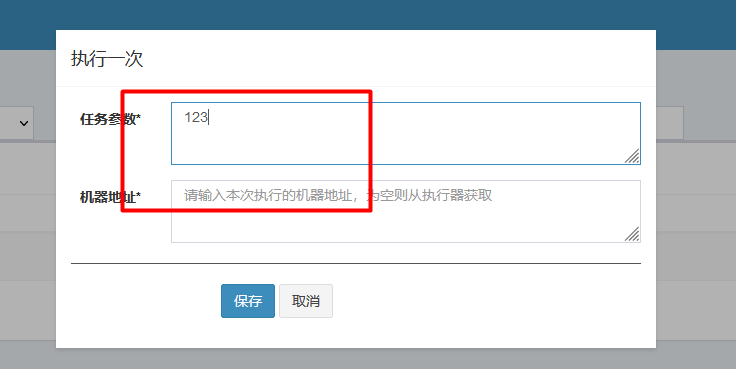

# 目录  
1.xxl-job基本介绍  


## 1.xxl-job基本介绍  
1.1 定时任务的实现方式  
1.2 分布式任务分片原理  
1.3 简单上手  

### 1.1 定时任务的实现方式  
* Java自带的Timer类
* ScheduledExecutorService(线程池)
* Spring task
* xxl-job

1.SpringTask使用存在的问题  
* 执行一次
* 更改执行时间  
  如果需要更改执行时间,需要修改代码、提交测试、重新打包上线
* 暂停任务  
  比如一些定时报警的需求,当报警突然变得很多,这个时候需要暂停一下让其停止发送报警,我们可以用配置的开关去做,再逻辑中判断定时任务开关是否打开来做.这样做虽然也比较简单,但是我们这样需要新添加一些与任务无关的逻辑
* 监控  
  没有管理界面,不方便查看任务执行情况  
* 分片执行  
  单台服务器处理大批量数据时间太长、效率低下,需要其它机器协同执行

2.解决方案  
`XXL-JOB`:支持任务分片、文档完善、提供管理平台、接入简单、弹性扩容  
**特性:**  
为了保证分布式的XXL-JOB不会重复执行任务,XXL-JOB通过调度中心获取数据库的锁来保证集群中执行任务的唯一性,如果短任务很多,随着调度中心集群数量增加,那么数据库的锁竞争会比较验证,从而导致性能下降.  

### 1.2 分布式任务分片原理
为了能保证多个服务器之间互不干扰,只执行各自自已的任务;所有引入了`分片`  
  
调度中心会把当前接入平台的执行器数量给到具体的执行器(例如这里有3个执行器),然后给每个执行器分配一个具体的分片.  
例如这里给执行器0的参数,意思是现在有3片分片;你拿到的分片是0.那么执行器0就会去执行0~10000的任务  

架构图:  
  

### 1.3 简单上手  
  
xxl-job各模块说明如下:  
* xxl-job-admin:平台(springboot)  
* xxl-job-core:核心包
* xxl-job-executor-sample-frameless:无框架的实例代码
* xxl-job-executor-sample-springboot:springboot代码示例

1.yml配置文件说明(xxl-job-admin)  
```yml
### web(注意)
server.servlet.context-path=/ # 注意上下文配置后面演示demo时会用到
### xxl-job, datasource(数据库相关配置)  

### xxl-job, email(预警邮件)  

### xxl-job, access token(是否需要token)
```

2.启动xxl-job-admin  
启动效果如下:  
  

3.什么是任务  
其实xxl-job中的一个任务也是一个springboot服务,`xxl-job-admin`只是调度中心  
  
通过`@XxlJob`注解来定义一个任务注意这里的值是`demoJobHandler`  

4.修改xxl-job-executor-sample-springboot项目下application.properties的配置  
```yml
xxl.job.admin.addresses=http://127.0.0.1:8080/ # 调度中心的地址,注意要和上面server.servlet.context-path指定的路径保持一致

### xxl-job, access token(是否需要token)注意和上面xxl-job-admin中application.yml中指定的token一致,如果xxl-job-admin启用了token的话
xxl.job.accessToken=

### xxl-job executor appname
xxl.job.executor.appname=xxl-job-executor-sample # 执行器的名称,之后会用到

```

5.新增执行器  
注意来到`执行器管理`页面执行  
  
这里的APPName实际上就是第四步的yml文件中的`xxl.job.executor.appname`指定的值  

6.启动xxl-job-executor-sample-springboot项目  
一段时间之后,刷新页面即可看到服务已经注册成功  
  

7.新增任务  
来到任务管理界面,找到刚才的执行器,点击右侧的新增  
  

  
注意`JobHandler`的值就是上面`@XxlJob`注解里面的值  

8.执行任务  
点击右侧的执行一次,然后再设置任务参数后点击保存  



9.执行结果  
  
可以看到成功打印出`HelloWorld`  
这是因为demoJobHandler对应的job代码如下:  
```java
@XxlJob("demoJobHandler")
public void demoJobHandler() throws Exception {
    XxlJobHelper.log("XXL-JOB, Hello World.");

    for (int i = 0; i < 5; i++) {
        XxlJobHelper.log("beat at:" + i);
        TimeUnit.SECONDS.sleep(2);
    }
    // default success
}
```

附录:  
A.环境变量一键复制  


## 附录  
A.环境变量一键复制  


### A.环境变量一键复制  
DUBBO_NAMESPACE=81f231bc-ab8e-4249-b7db-eb0bd3884776;CPODS_DUBBO_NAMESPACE=81f231bc-ab8e-4249-b7db-eb0bd3884776;JDDDATA_DUBBO_NAMESPACE=0381e78c-bc6b-4802-98dd-d5c6e4193341;CPODS_DUBBO_HOST=nacos://172.28.136.121:38848;JDDDATA_DUBBO_HOST=nacos://172.28.136.121:31848;NACOS_NAMESPACE=81f231bc-ab8e-4249-b7db-eb0bd3884776;NACOS_HOST=nacos-test.jiangduoduo.com:80


