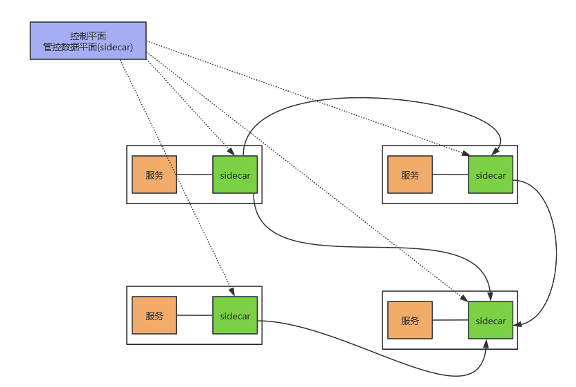

# 目录  
1.Istio  

**附录:**  
1.服务网格的发展背景  

## 1.Istio
**目录:**  
1.1 Istio基本介绍  
1.2 Istio特征  

### 1.1 Istio基本介绍  
1.什么是Istio  
Istio是一个独立的基础设施层,用来处理服务之间的通信,它是由google、IBM和Lyft共同发起的开源项目.它最初的设计目标是在kubernetes的基础上,以非侵入的方式运行在集群中的微服务旁边,提供流量管理、安全加固、服务监控和策略管理等功能  
Istio有助于降低部署的复杂性,并减轻开发团队的压力.它是一个完全开放源代码的服务网格,透明的分层到现有的分布式应用程序上,它也是一个平台,包括允许它集成到任何日志平台、遥测或策略系统中的api.Istio的多种功能集使我们能够成功、高效地运行分布式微服务体系结构,并提供一种统一的方式来保护、连接和监视微服务.  

2.SpringCloud架构与Istio架构  
  
总体来讲就是服务治理代码放到基础设施层完成与业务代码剥离  

### 1.2 Istio特征
1.Istio特征概述  
* 连接:对网格内部的服务之间的调用所产生的流量进行智能管理,并以此为基础对微服务的部署、测试和升级等操作提供有力的保障
  *注意:通信分为两种,一种是内部服务访问外部服务,一种是外部服务访问内部服务;即微服务分别作为生产者和消费者的场景*  
* 安全:为网格内部的服务之间的调用提供认证、加密和鉴权的支持,在不侵入代码的情况下,加固现有的服务,提供其安全性
* 策略:在控制平面定制策略,并在服务中实施
* 观察:对服务之间的调用进行跟踪和测量,获取服务的状态信息(就是对服务进行监控)

2.连接  
相对于传统的单体应用,微服务的端点数量会急剧增加,现代的应用系统在部分或者全部生命周期中,都存在同一服务的不同版本,为不同的客户、场景或者业务提供不同的服务.同时,同一服务的不同版本也可能有不同的访问要求,甚至产生了在生产环境中进行测试的新方法论.错综复杂的服务关系对开发者来说都是很严峻的考验.  
针对目前场景的业务形态,这里画一个简单的示意图来描述Service Mesh的连接功能  
  
图中提出的连接问题,Istio已经帮助我们解决了  

3.安全  
安全问题在过去私有基础设施结合单体应用的环境下,这一问题并不突出,然而进入容器云时代之后以下问题出现了  
* 有大量容器漂浮在容器云中,采用传统的网络策略应多这种浮动的应用是比较吃力的
* 在由不同的语言、平台所实现的微服务之间,实施一致的访问也经常会因为实现不一致而困难重重
* 如果是共享集群,则服务的认证和加密变得尤为重要
  * 服务之间的通信要防止其它服务监听
  * 只有提供有效身份的客户端才可以访问指定的服务
  * 服务之间的相互访问应该提供更细粒度的控制功能

4.策略  
Istio通过可动态插拔、可扩展的策略实现访问控制、速率限制、配额管理等功能使得资源在消费者之间公平分配  
在Istio中使用Mixer作为策略的执行者,Envoy的每次调用,在逻辑上都会通过Mixer进行事先预检和事后报告,这样Mixer就拥有了对流量的部分控制能力,在Istio中还有为数众多的内部适配器及进程外适配器,可以和外部软件设施在一起完成策略的制定和执行  
* Mixer:Mixer在整个服务网格中执行访问控制和策略执行,并从Envoy代理和其他服务收集遥测数据
* Envoy:在Istio框架中使用Envoy作为代理,使用的是C++开发的软件,用于为服务网格中的所有服务提供所有的入站和出站流量,唯一一个与数据平面打交道的

5.观察  
通过观察Istio就能提供服务的监控和链路的追踪功能  
效果类似skywalking、Prometheus  

## 附录  
**目录:**  
1.服务网格的发展背景  

### 1.服务网格的发展背景  
**目录:**  
1.1 SpringCloud的存在的问题  
1.2 SideCar(边车代理模式)  
1.3 Linkerd  
1.4 Istio  

#### 1.1 SpringCloud的存在的问题
前提知识见:SpringCloud笔记 附录=>1.1 微服务基本概念介绍  
*提示:这里不是说微服务架构的问题,是springcloud存在的问题*  

* 业务代码里面有Maven依赖、加上注解、配置打包成jar包的时候还需要把这些非业务代码融合在一起,代码侵入性较高  
* 开发人员需要投入很多的精力来学习springcloud;业务代码开发者应该把更多的精力投入到业务熟悉度上,而不应该是非业务上
* 微服务是多语言调用(项目之间多语言),维护成本高
* 微服务拆分越细,感觉是轻量级了,但是维护成本高

**问题解决思路:**  
* 微服务架构最终要解决的自始至终只有一个问题便是服务之间通信的问题,不应该将非业务代码融合到业务代码中  

#### 1.2 SideCar(边车代理模式)
边车代理模式说白了就是解决富容器(docker)的问题  
详情可见:[一文带你搞懂 Kubernetes 容器边车模式](https://zhuanlan.zhihu.com/p/645463183)  
说白了就是在一个pod中,各个容器之间共享同一个`Network Namespace`,并且可以共享同一个`Volume`(挂载)  
在这种模式下这些代理功能既不是耦合在应用程序中,也不是集中式的集群部署,而是作为独立进程被部署在应用程序的旁边,即每一个服务器上或pod中.  
这样一个服务器上的多个应用程序就能共享这个代理,然后通过控制平面和数据平面进行统一管理.  
  

* 控制平面:节点以控制平面的角色运行,会将最新配置信息更新给数据平面的节点  
* 数据平面:节点以数据平面的角色运行,会从控制平面的节点接受最新的配置信息并提供代理服务;一般SideCar就是数据平面,由单独的控制平面来控制SideCar  
  例如图中的蓝色方框就是SideCar,绿色方框就是微服务,除此之外应该还有一个控制平面与每个数据平面通信(图中没有画出)  

**解决的问题**  
通过SideCar它就可以降低微服务架构相关的复杂性,它提供了负载均衡、服务发现、流量管理、断路器等功能,它对流量有一定的治理功能  
  

#### 1.3 Linkerd  
1.介绍  
Linkerd是由Twitter开源的一个服务网格项目,Linkerd能够很好地结合kubernetes所提供的功能,在每个Kubernetes Node上都部署运行一个Linkerd实例,用代理的方式将加入Mesg的Pod通信转接给Linkerd,这一Linkerd就能在通信链路中完成对通信的控制和监控.  
在2017年1月份Linkerd加入CNCF云原生组织,并发布了1.0版本  

2.优点  
* 无需侵入业务代码就能够管理服务的流量
* 兼容kubernetes提供的所有功能

3.为什么不流行(缺点)  
* 部署繁琐
* 只是实现了数据平面的问题,没有对数据平面进行管理

#### 1.4 Istio
1.介绍  
Istio是由google、IBM和Lyft共同发起的开源项目,Istio可以轻松创建带有负载均衡、身份验证、监控的网络服务,使得服务的业务代码改动很少或者根本不用改动,通过内部部署SideCar代理来拦截所有的网络通讯,使用控制平面来进行网络管理,控制平面就是用于管理数据平面(也就是SideCar),Istio既有数据平面也有控制平面  

2.数据平面与控制平面  
  
Istio既有数据平面也有控制平面,Linkerd只有数据平面

3.Istio解决的问题  
* 可以自动负载均衡HTTP、gRPC、Websocket、TCP协议的流量  
* 通过丰富的路由规则、重试、故障切换和故障注入对流量行为进行细粒度控制
* 支持访问的控制、速率限制和配置API(能够进行限流)
* 集群内部所有的流量自动均衡、日志和跟踪,包括集群入口和出口
* 通过基于强大的身份验证和授权设计,能够确保集群中服务间通信安全
* 提供服务的注册与发现

4.服务网格(Service Mesh)  
服务网格:微服务应用进行网络交互,随着规模和复杂性增加,服务跟服务调用错综复杂  
  

**特点:**  
* 服务网格是一种处理服务通信的基础设施
* 支撑云原生,服务网格适用于在云原生场景下帮助应用程序在复杂的服务间可靠地传输请求  
  所有的数据平面统一由控制平面来操控,所以能保证服务间的通信可靠性  
* 网络代理,一般通过SideCar对应用执行网络代理  
* 轻量级网络代理与应用程序部署在一起,对应用程序透明,应用程序只关注业务代码

5.云原生  
先看总结:云原生就是将原生应用上云的一个过程以及云上的一些列解决方案 
**云原生解决了什么问题:**  
* 云原生能够统一基础平台,能够让项目更加方便地部署在不同的云平台  
  因为云平台也分为公有云、私有云和混合云,采用K8S作为底层架构;可以帮助开发者屏蔽操作系统,这样不管是什么类型的云都是基于K8S这个基础平台,所以它可以更方便地让应用进行部署  
  所以云原生的根基是K8S  
* 能够帮助解决日志监控(Prometheus)
* 能够解决代理(Envoy)
* 能够解决分布式链路追踪(jaeger)

**云原生项目:**  
* Kubernetes:生产级的容器编排项目
* Prometheus:为云原生应用程序提供实时的监控、报警包括强大的查询和可视化能力;还集成了很多开源的流行的数据的导入与导出
* Envoy:网络代理、能够最大限度地减少内存和CPU的使用,同时它还提供了负载均衡、微服务环境的跟踪
* containerd:由docker开发并基于DockerEngine标准开发的容器化组件(类似docker),是K8S的底层组件
* jaeger:分布式追踪系统,监控大型的微服务环境
* Fluentd:统一的日志记录工具,可以收集任何数据源的数据;包括数据库、应用程序、可穿戴设备并且能够与监控工具配合使用

**孵化中的云原生项目:**  
* OpenTracing:为不同的平台提供中立的API,使开发者人员可以轻松地应用分布式跟踪
* gRPC:高性能开源通用的RPC框架,支持各种语言
* CNI:网络插件(这个之前在K8S的笔记中介绍过,它也是K8S的网络插件)
* etcd:高可用的分布式键值对数据库
  etcd的使用场景很多,也有把它作为服务配置中心使用的

**国内的云原生项目:**  
* Tencent Service Mesh:腾讯的Service Mesh的落地产品
* Tencent Cloud Mesh:腾讯的Service Mesh的落地产品
* 阿里云服务网格(ASM):阿里的Service Mesh的落地产品
* CSE Mesh:华为云的Service Mesh

*这些云产品的设计思想都借鉴了service mesh,所以目前主流的解决方案就是Istio*  
