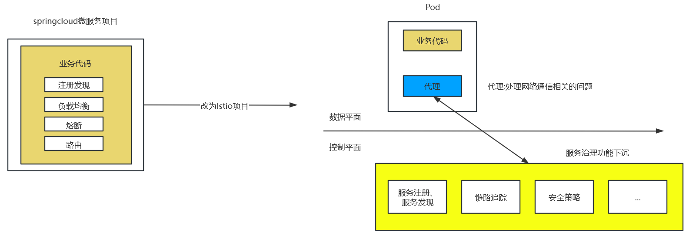

# 目录  
1.Istio  

**附录:**  
1.服务网格的发展背景  
2.Istio介绍

## 1.Istio
**目录:**  

## 附录  
**目录:**  
1.服务网格的发展背景  
2.Istio介绍  

### 1.服务网格的发展背景  
**目录:**  
1.1 SpringCloud的存在的问题  
1.2 SideCar(边车代理模式)  
1.3 Linkerd  
1.4 Istio  

#### 1.1 SpringCloud的存在的问题
前提知识见:SpringCloud笔记 附录=>1.1 微服务基本概念介绍  
*提示:这里不是说微服务架构的问题,是springcloud存在的问题*  

* 业务代码里面有Maven依赖、加上注解、配置打包成jar包的时候还需要把这些非业务代码融合在一起,代码侵入性较高  
* 开发人员需要投入很多的精力来学习springcloud;业务代码开发者应该把更多的精力投入到业务熟悉度上,而不应该是非业务上
* 语言绑定,SpringCloud框架只能供Java语言程序使用,别的语言无法使用
* 微服务是多语言调用(项目之间多语言),维护成本高
* 微服务拆分越细,感觉是轻量级了,但是维护成本高

**问题解决思路:**  
* 微服务架构最终要解决的自始至终只有一个问题便是服务之间通信的问题,不应该将非业务代码融合到业务代码中  

#### 1.2 SideCar(边车代理模式)
边车代理模式说白了就是解决富容器(docker)的问题  
详情可见:[一文带你搞懂 Kubernetes 容器边车模式](https://zhuanlan.zhihu.com/p/645463183)  
说白了就是在一个pod中,各个容器之间共享同一个`Network Namespace`,并且可以共享同一个`Volume`(挂载)  
在这种模式下这些代理功能既不是耦合在应用程序中,也不是集中式的集群部署,而是作为独立进程被部署在应用程序的旁边,即每一个服务器上或pod中.  
这样一个服务器上的多个应用程序就能共享这个代理,然后通过控制平面和数据平面进行统一管理.  
  

* 控制平面:节点以控制平面的角色运行,会将最新配置信息更新给数据平面的节点  
* 数据平面:节点以数据平面的角色运行,会从控制平面的节点接受最新的配置信息并提供代理服务;一般SideCar就是数据平面,由单独的控制平面来控制SideCar  
  例如图中的蓝色方框就是SideCar,绿色方框就是微服务,除此之外应该还有一个控制平面与每个数据平面通信(图中没有画出)  

**解决的问题**  
通过SideCar它就可以降低微服务架构相关的复杂性,它提供了负载均衡、服务发现、流量管理、断路器等功能,它对流量有一定的治理功能  
  

#### 1.3 Linkerd  
1.介绍  
Linkerd是由Twitter开源的一个服务网格项目,Linkerd能够很好地结合kubernetes所提供的功能,在每个Kubernetes Node上都部署运行一个Linkerd实例,用代理的方式将加入Mesg的Pod通信转接给Linkerd,这一Linkerd就能在通信链路中完成对通信的控制和监控.  
在2017年1月份Linkerd加入CNCF云原生组织,并发布了1.0版本  

2.优点  
* 无需侵入业务代码就能够管理服务的流量
* 兼容kubernetes提供的所有功能

3.为什么不流行(缺点)  
* 部署繁琐
* 只是实现了数据平面的问题,没有对数据平面进行管理

#### 1.4 Istio
1.介绍  
Istio是由google、IBM和Lyft共同发起的开源项目,Istio可以轻松创建带有负载均衡、身份验证、监控的网络服务,使得服务的业务代码改动很少或者根本不用改动,通过内部部署SideCar代理来拦截所有的网络通讯,使用控制平面来进行网络管理,控制平面就是用于管理数据平面(也就是SideCar),Istio既有数据平面也有控制平面  

2.数据平面与控制平面  
  
Istio既有数据平面也有控制平面,Linkerd只有数据平面

3.Istio解决的问题  
* 可以自动负载均衡HTTP、gRPC、Websocket、TCP协议的流量  
* 通过丰富的路由规则、重试、故障切换和故障注入对流量行为进行细粒度控制
* 支持访问的控制、速率限制和配置API(能够进行限流)
* 集群内部所有的流量自动均衡、日志和跟踪,包括集群入口和出口
* 通过基于强大的身份验证和授权设计,能够确保集群中服务间通信安全
* 提供服务的注册与发现

4.服务网格(Service Mesh)  
服务网格:微服务应用进行网络交互,随着规模和复杂性增加,服务跟服务调用错综复杂  
  

**特点:**  
* 服务网格是一种处理服务通信的基础设施
* 支撑云原生,服务网格适用于在云原生场景下帮助应用程序在复杂的服务间可靠地传输请求  
  所有的数据平面统一由控制平面来操控,所以能保证服务间的通信可靠性  
* 网络代理,一般通过SideCar对应用执行网络代理  
* 轻量级网络代理与应用程序部署在一起,对应用程序透明,应用程序只关注业务代码

5.云原生  
先看总结:云原生就是将原生应用上云的一个过程以及云上的一些列解决方案 
**云原生解决了什么问题:**  
* 云原生能够统一基础平台,能够让项目更加方便地部署在不同的云平台  
  因为云平台也分为公有云、私有云和混合云,采用K8S作为底层架构;可以帮助开发者屏蔽操作系统,这样不管是什么类型的云都是基于K8S这个基础平台,所以它可以更方便地让应用进行部署  
  所以云原生的根基是K8S  
* 能够帮助解决日志监控(Prometheus)
* 能够解决代理(Envoy)
* 能够解决分布式链路追踪(jaeger)

**云原生项目:**  
* Kubernetes:生产级的容器编排项目
* Prometheus:为云原生应用程序提供实时的监控、报警包括强大的查询和可视化能力;还集成了很多开源的流行的数据的导入与导出
* Envoy:网络代理、能够最大限度地减少内存和CPU的使用,同时它还提供了负载均衡、微服务环境的跟踪
* containerd:由docker开发并基于DockerEngine标准开发的容器化组件(类似docker),是K8S的底层组件
* jaeger:分布式追踪系统,监控大型的微服务环境
* Fluentd:统一的日志记录工具,可以收集任何数据源的数据;包括数据库、应用程序、可穿戴设备并且能够与监控工具配合使用

**孵化中的云原生项目:**  
* OpenTracing:为不同的平台提供中立的API,使开发者人员可以轻松地应用分布式跟踪
* gRPC:高性能开源通用的RPC框架,支持各种语言
* CNI:网络插件(这个之前在K8S的笔记中介绍过,它也是K8S的网络插件)
* etcd:高可用的分布式键值对数据库
  etcd的使用场景很多,也有把它作为服务配置中心使用的

**国内的云原生项目:**  
* Tencent Service Mesh:腾讯的Service Mesh的落地产品
* Tencent Cloud Mesh:腾讯的Service Mesh的落地产品
* 阿里云服务网格(ASM):阿里的Service Mesh的落地产品
* CSE Mesh:华为云的Service Mesh

*这些云产品的设计思想都借鉴了service mesh,所以目前主流的解决方案就是Istio*  

### 2.Istio介绍
**目录:**   
2.1 Istio基本介绍  
2.2 Istio特征  
2.3 Istio与服务治理  
2.4 Istio架构  
2.5 Istio组件介绍  

### 2.1 Istio基本介绍  
1.什么是Istio  
Istio是一个独立的基础设施层,用来处理服务之间的通信,它是由google、IBM和Lyft共同发起的开源项目.它最初的设计目标是在kubernetes的基础上,以非侵入的方式运行在集群中的微服务旁边,提供流量管理、安全加固、服务监控和策略管理等功能  
Istio有助于降低部署的复杂性,并减轻开发团队的压力.它是一个完全开放源代码的服务网格,透明的分层到现有的分布式应用程序上,它也是一个平台,包括允许它集成到任何日志平台、遥测或策略系统中的api.Istio的多种功能集使我们能够成功、高效地运行分布式微服务体系结构,并提供一种统一的方式来保护、连接和监视微服务.  

2.SpringCloud架构与Istio架构  
  
总体来讲就是服务治理代码放到基础设施层完成与业务代码剥离  

### 2.2 Istio特征
1.Istio特征概述  
* 连接:对网格内部的服务之间的调用所产生的流量进行智能管理,并以此为基础对微服务的部署、测试和升级等操作提供有力的保障
  *注意:通信分为两种,一种是内部服务访问外部服务,一种是外部服务访问内部服务;即微服务分别作为生产者和消费者的场景*  
* 安全:为网格内部的服务之间的调用提供认证、加密和鉴权的支持,在不侵入代码的情况下,加固现有的服务,提供其安全性
* 策略:在控制平面定制策略,并在服务中实施
* 观察:对服务之间的调用进行跟踪和测量,获取服务的状态信息(就是对服务进行监控)

2.连接  
相对于传统的单体应用,微服务的端点数量会急剧增加,现代的应用系统在部分或者全部生命周期中,都存在同一服务的不同版本,为不同的客户、场景或者业务提供不同的服务.同时,同一服务的不同版本也可能有不同的访问要求,甚至产生了在生产环境中进行测试的新方法论.错综复杂的服务关系对开发者来说都是很严峻的考验.  
针对目前场景的业务形态,这里画一个简单的示意图来描述Service Mesh的连接功能  
  
图中提出的连接问题,Istio已经帮助我们解决了  

3.安全  
安全问题在过去私有基础设施结合单体应用的环境下,这一问题并不突出,然而进入容器云时代之后以下问题出现了  
* 有大量容器漂浮在容器云中,采用传统的网络策略应多这种浮动的应用是比较吃力的
* 在由不同的语言、平台所实现的微服务之间,实施一致的访问也经常会因为实现不一致而困难重重
* 如果是共享集群,则服务的认证和加密变得尤为重要
  * 服务之间的通信要防止其它服务监听
  * 只有提供有效身份的客户端才可以访问指定的服务
  * 服务之间的相互访问应该提供更细粒度的控制功能

4.策略  
Istio通过可动态插拔、可扩展的策略实现访问控制、速率限制、配额管理等功能使得资源在消费者之间公平分配  
在Istio中使用Mixer作为策略的执行者,Envoy的每次调用,在逻辑上都会通过Mixer进行事先预检和事后报告,这样Mixer就拥有了对流量的部分控制能力,在Istio中还有为数众多的内部适配器及进程外适配器,可以和外部软件设施在一起完成策略的制定和执行  
* Mixer:Mixer在整个服务网格中执行访问控制和策略执行,并从Envoy代理和其他服务收集遥测数据
* Envoy:在Istio框架中使用Envoy作为代理,使用的是C++开发的软件,用于为服务网格中的所有服务提供所有的入站和出站流量,唯一一个与数据平面打交道的

5.观察  
通过观察Istio就能提供服务的监控和链路的追踪功能  
效果类似skywalking、Prometheus  

### 2.3 Istio与服务治理
1.服务治理形式
服务治理有三种形式:在应用程序中包含治理逻辑、治理逻辑独立的代码、治理逻辑独立的进程  

1.1 在应用程序中包含治理逻辑  
简单来讲就是自已写代码逻辑来实现治理逻辑,把治理的功能写入业务代码里

1.2 治理逻辑独立的代码  
将应用程序中包含的治理逻辑的代码抽离出来形成公共的类库,这种思想的代表就是SpringCloud

1.3 治理逻辑独立的进程  
为了解决第二种方式会侵入用户代码的问题,进一步进行解耦把治理的逻辑从用户的业务代码里剥离出来,即SiceCar模式.在这种形式下用户的代码和治理逻辑都可以以独立的进程存在,从而实现两种代码的无耦合,并且与开发语言无关,升级也是相互独立  

2.kubernetes介绍  
kubernetes面向基础设计,将计算、网络、存储等资源进行紧密整合,为容器提供最佳运行环境,并面向应用提供封装好的、易用的工作负载与服务编排接口,以及运维所需的资源规格、弹性、运行参数、调度等配置管理接口,是新一代的云原生基础设施平台.  
kubernetes的service组件已经可以实现服务注册、服务发现、负载均衡、服务通信,但对于服务治理的相关功能如:服务熔断、服务限流、链路追踪kubernetes都不支持  

3.Istio
Istio能够提供服务发现、熔断、链路最终、限流  
所以Istio能够解决kubernetes的不足,实现服务治理功能;同理kubernetes能够帮助Istio实现数据平面(通过Pod实现)、统一服务发现(通过K8S的Ingress实现)、基于CRD规则扩展自定义资源(通过apiserver保存到etcd)  
Istio与kubernetes是相辅相成的  
云原生应用采用kubernetes构建应用编排能力,采用Istio构建服务治理能力,将逐渐成为企业技术转型的标准配置  

4.SideCar模式的问题  
* 需要对SideCar代理进行维护
* 请求多了一步访问流程,多了一步进过代理的流程

### 2.4 Istio架构
1.Istio架构图
Istio架构分为控制平面和数据平面两部分  
* 数据平面:由一组智能代理(Envoy)组成,被部署为SideCar.这些代理通过一个通用的策略和遥测中心传递及控制微服务之间的所有网络通信
* 控制平面:管理并配置代理来进行流量路由,此外,控制平面配置Mixer来执行策略和收集遥测数据

  

* Pilot:提供服务发现和路由规则
* Mixer:策略控制组件,例如限流功能
* Citadel:起到安全作用,可以保证服务与服务通信间的安全
* Envoy:代理,处理服务的流量

请求流程:
*注意:这个请求流程非常重要*    
从前端服务开始,前端服务的Pod创建时会自动注入SideCar(Envoy)代理,外部请求通过gateway网关,网关会把请求转发给前端服务Pod里的Envoy组件,当前端服务Pod收到流量时会发生流量拦截,会被Envoy拦截,Envoy会拦截这个Pod的所有进出口流量  
前端服务的Envoy代理会调用控制平面Pilot服务发现接口来获取目标服务的实例列表,此时前端的Envoy就有了所有后端服务(这里的服务A和服务B)的实例列表,由于后台服务有多个版本,所以前端服务还需要从控制平面Pilot中获取后台服务的负载均衡配置,然后根据Pilot路由规则把流量分发给指定的后台服务的版本上面,此时前端服务的Envoy和后端服务的Envoy就能够进行通信,为了能够保证通信是安全的,Envory还需要从控制平面Citadel中获取服务通信的证书和密钥,因为Citadel组件维护了服务代理通信需要的证书和密钥,此时两个Envoy是安全的,而通信双方的Envoy都会连接到控制平面的Mixer组件,用于上报访问的数据.上报数据就是为了让控制平面能够控制数据平面,能够监控服务  

2.架构图详解  
*提示:本节将对上述架构图中的编号进行详细讲解,是对第一节中的请求流程的补充说明*  
* 第一步自动注入:kubernetes在创建Pod的时候,apiserver会调用控制平面的SideCar服务(图中没有画出)sidecar-injector会修改应用程序的描述信息(描述信息就是创建Pod的Yml文件),为该Yml文件添加一个sidecar容器  
* 第二步流量拦截:代理容器拦截Pod容器的入口流量和出口流量,例如图中gateway流量转发到前端服务容器后,流量会被代理容器拦截
  内部的拦截流程:首先后端服务Pod的网卡会收到通信的数据包,数据包会被iptables进行拦截,iptables能够对数据包进行检测以及访问控制.Pod在创建的时候会设置iptables路由规则,从而让iptables能够将流量转发到代理容器
    
* 第三步服务发现:在第二步流量拦截中,Envoy已经能够将网络的流量进行拦截,Envoy在把流量分发到后台服务之前,需要先到控制平面的Pilot调用服务发现接口来获取后端服务的实例地址列表
* 第四步负载均衡:前端服务从Pilot发现后端服务实例列表之后,还需要从Pilot中获取后端服务的负载均衡策略,根据负载均衡策略来选择服务实例,并连接对应的实例地址;所以前端需要负载均衡来指明请求对应哪个实例地址
* 第五步流量治理:流量治理就是根据转发规则来控制流量(例如限流,访问的频率控制)
  流量规则也来自于控制平面Pilot(这点和1.5节说的冲突了,1.5节说流量规则来自Mixer,个人更加倾向流量规则来自Mixer)  
* 第六点访问安全:访问安全指服务之间通过双方的Envoy进行双向认证和通道加密,确保发送流量不会被劫持
  证书和密钥统一由控制平面的Citadel来维护
* 第七点服务监控:在服务间通信时通信双方的Envoy会连接到控制平面的Mixer进行数据上报,Mixer通过adapter把数据发送给监控的后端,比如Prometheus
  
* 第八点策略执行:用于控制服务与服务的访问,判断请求是拒绝还是发送,这个控制的权限也来源于控制平面的Mixer
  如果数据平面的前端服务需要把请求转发给后端服务,前端服务首先需要先调用控制平面的Mixer组件,来检查本次请求是放行还是拒绝
* 第九点外部访问:外部的所有请求都需要经过gateway,网关把流量转发给前端服务的Envoy

### 2.5 Istio组件介绍
**目录:**  
2.5.1 Pilot  
2.5.2 Mixer  
2.5.3 Citadel  
2.5.4 Galley  
2.5.5 SideCar-injector  
2.5.6 Envoy  
2.5.7 IngressGateway  

#### 2.5.1 Pilot
1.服务注册中心功能  
Pilot拥有服务注册中心和数据平面下发规则的功能,Pilot本身不做服务注册,它会提供一个API接口,对接已有的服务注册系统,比如Eureak、nacos;具体的实现由注册中心厂商实现  
  
* Platform Adapter主要是用于对接不同的注册中心,因为不同的注册中心有不同的实现细节,就像JDBC一样,不同的数据库会有不同的驱动  
* Abstract model主要作用是对Platform Adapter进行抽象,将不同注册中心的差异抽象为公共的接口,从特定平台细节中解耦
* Envoy API:负责与Pod里的代理Envoy进行通信

2.数据平面下发功能  
pilot负责将各种规则转换成Envoy可识别的格式,通过标准的协议发送给Envoy,指导Envoy完成动作,在通信上Envoy通过gRPC流式订阅Pilot的配置资源  
Pilot将表达的路由规则分发到Envoy上,Envoy根据该路由规则进行流量转发,配置规则和流程图如下:  
  

#### 2.5.2 Mixer
Mixer分为policy和Telemetry;Policy用于向Envoy提供准入策略控制,黑白名单控制,速率限制等相关策略;Telemetry为Envoy提供了数据上报和日志收集服务,以用于监控告警和日志查询  

1.Telemetry  
  

2.Policy  
数据面在转发服务的请求前调用Policy的Check接口是否允许访问,Mixer根据配置将请求转发到对应的Adapter做对应检查,给代理返回允许访问还是拒绝.可以对接如配额、授权、黑白名单等不同的控制后端,对服务的访问进行可扩展的控制.  

#### 2.5.3 Citadel  
Citadel负责管理各个服务的密钥和证书,Envoy存储Citadel下发的密钥和证书,便于后续服务数据安全传输  

#### 2.5.4 Galley
Galley并不是服务数据平面的组件,它在控制平面上为其它组件提供支持,Galley主要负责配置管理,并将这些配置信息提供给控制面的Pilot和Mixer组件使用,这样其他控制面的组件只需要和Galley打交道,从而与底层平台解耦  

  
**优势:**  
* 能够将配置统一管理,方便配置问题排查
* 能够增加配置复用度
* 配置跟配置隔离,组件访问配置增加了权限控制

1.配置分发协议  
Galley采用MCP的协议进行配置的分发,MCP中有三个角色:source、sink、resource  
* source:配置的提供者(就是Galley组件)
* sink:配置的消费端(例如Mixer、Pilot)
* resource:yml配置文件

  

#### 2.5.5 SideCar-injector
*提示:在之前1.4 Istio架构=>2.架构图详解=>第一步就说过,Pod启动时会注入sidecar-injector*  
1.注入的两种方式  
注入`sidecar-injector`有两种方式:  
* 使用istioctl命令进行手动注入
* 基于kubernetes自动注入(注入过程对用户透明)

#### 2.5.6 Envoy  
1.介绍  
在Istio框架中使用Envoy作为代理,使用的是C++开发的软件,用于为服务网格中的所有服务提供所有的入站和出站流量,唯一一个与数据平面打交道的  

2.Envoy组成  
Envoy由Pilot agent、Envoy组成;
* Pilot agent的主要作用是生成Envoy配置,负责启动Envoy进程,负责监控envoy进程的运行状态  
* Envoy的主要作用是负责拦截Pod的流量,从控制平面pilot获取配置和服务发现,能够上报数据给控制平面的mixer组件

#### 2.5.7 IngressGateway
外部的请求根据IngressGateway的端口,把请求转发给IngressGateway,由IngressGateway把请求转发给网格内部的服务  
这个gateway就是1.4 Istio架构=>2.架构图=>第9步中的gateway  

