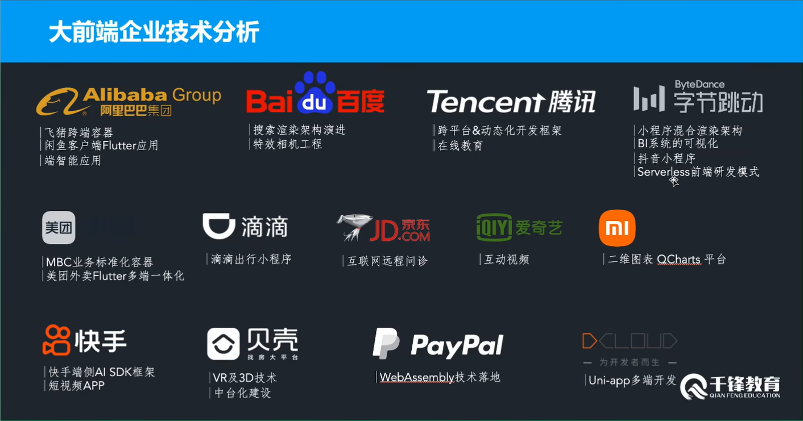
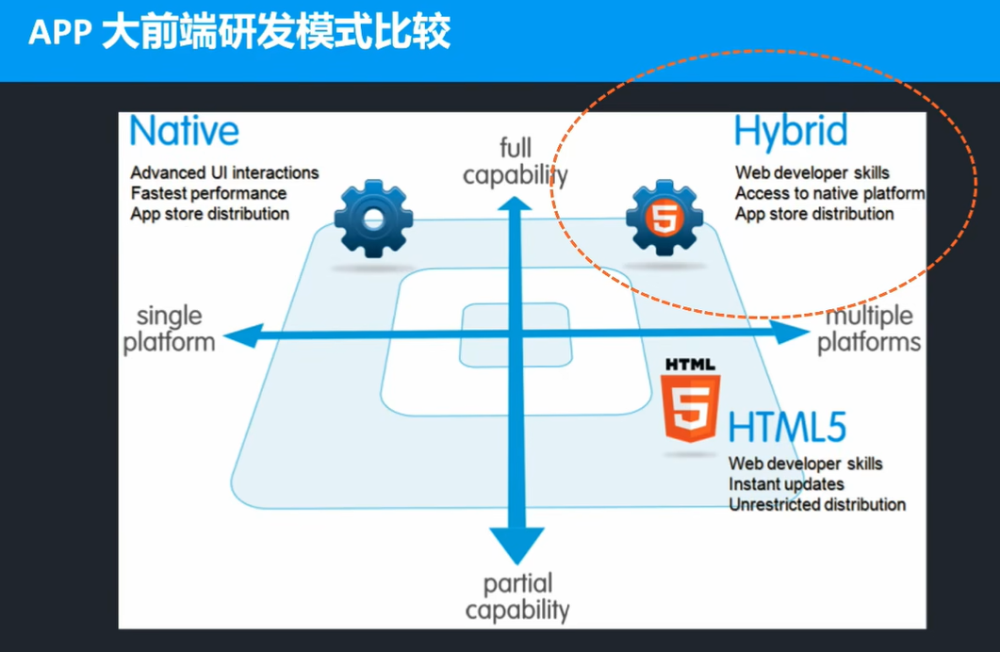
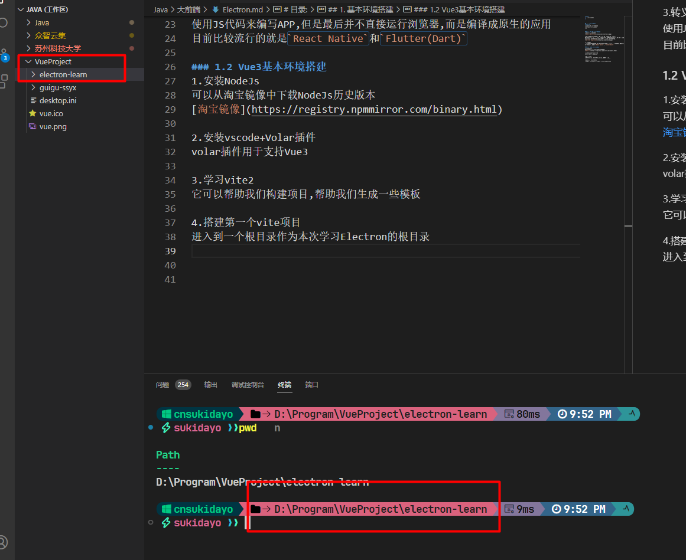
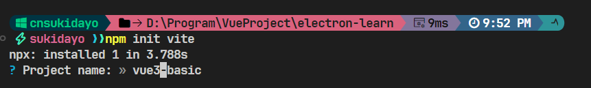
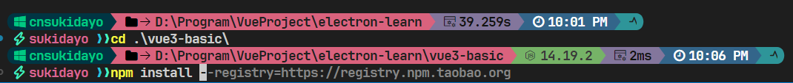
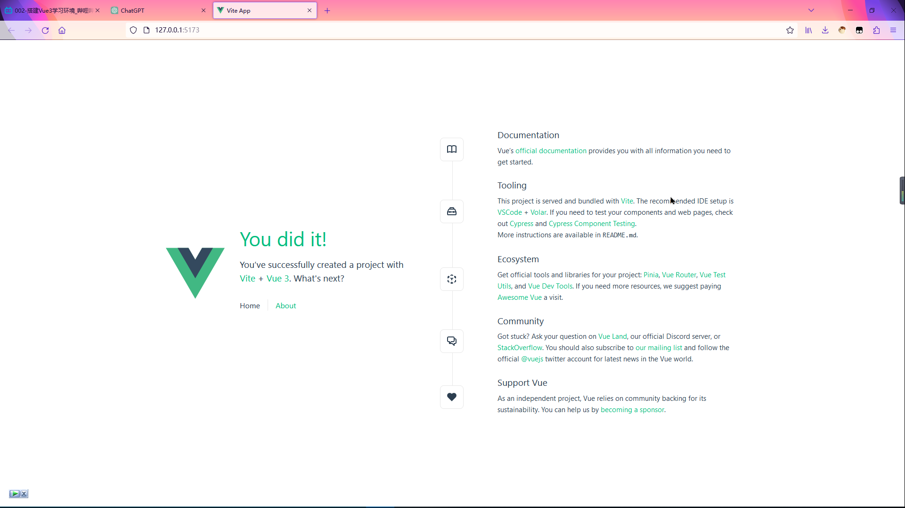
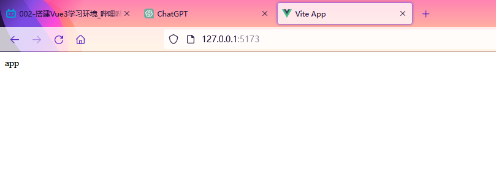

# 目录:  
1. 基本环境搭建  


## 1. 基本环境搭建  
**目录:**  
1.1 大前端基本概念介绍  
1.2 Vue3基本环境搭建  
1.3 Vue3  


### 1.1 大前端基本概念介绍  
1.企业中使用的例子  
  

2.大前端技术说白了就是原生开发和H5开发之前取一个折中  
就对Android开发而言,相当于把H5嵌入到原生的Android当中,大前端开发的性能肯定是介于两者之间的,它的跨平台性也是介于两者之间的.  
  

3.转义技术  
使用JS代码来编写APP,但是最后并不直接运行浏览器,而是编译成原生的应用  
目前比较流行的就是`React Native`和`Flutter(Dart)`  

### 1.2 Vue3基本环境搭建  
1.安装NodeJs  
可以从淘宝镜像中下载NodeJs历史版本  
[淘宝镜像](https://registry.npmmirror.com/binary.html)

2.安装vscode+Volar插件  
volar插件用于支持Vue3  

3.学习vite2  
它可以帮助我们构建项目,帮助我们生成一些模板  

4.搭建第一个vite项目  
进入到一个根目录作为本次学习Electron的根目录  
  

执行`npm init vite`命令,它会询问你要创建的项目名称  
这里输入了vue3-basic作为项目的名称  
  
Select a framework(选择框架为vue):vue  
Select a variant(选择框架的变体为Customize with create-vue):Customize with create-vue(这一步基本上都是否,就是最简安装)  

此时它提示进入vue3-basic目录后执行`npm install`  
  

5.文件目录介绍  
* package.json:NodeJs的包管理配置文件  
* node_modules:项目依赖的所有模块(包)就存放该目录下  
* public:静态资源,该目录下的所有文件可以在浏览器直接访问  
  可以在public目录下测试创建一个test.html文件,然后直接在浏览器中访问该文件
* src:vite项目下所有的内容  
  * main.js:入口文件
  * App.vue:第一个vue组件
  * components:存放子组件的目录  
  * assets:资源文件
  * index.html:入口文件
    观看index.html内容,可以看到该文件引入了main.js文件;所以它们两个都是入口文件
* vite.config.js:vite的配置文件


6.执行`npm run dev`运行项目  
可以发现项目很快就运行起来了  
  

7.清空目录下不需要的文件  
删除src目录下除了assets目录外的其它目录  
删除main.js入口文件  
删除index.html文件中对main.js引入的代码  

8.删除完成之后,保存刷新页面可以看到页面已经变成空白了  
在index.html文件的\<body\>标签中写入文本内容,接着访问根路径可以到效果已经应用,说明Vue项目访问根路径默认就是访问index.html  

9.在src目录下创建main.js文件  
这个文件的名称可以随意  
mian.js文件内容如下:  
```js
console.log(100)
```

10.在index.html文件中引入该js文件  
index.html内容如下:  
```html
<!DOCTYPE html>
<html lang="en">
  <head>
    <meta charset="UTF-8">
    <link rel="icon" href="/favicon.ico">
    <meta name="viewport" content="width=device-width, initial-scale=1.0">
    <title>Vite App</title>
  </head>
  <body>
    <div>Hello</div>
    <script src="src/main.js"></script>
  </body>
</html>
```
应用之后浏览器控制台会打印100  

11.在src下面创建App.vue文件  
这种文件称之为SFC(single file component)单文件组件  
app.vue文件内容:  
```js
<script>

</script>

<template>
  <div>
    app
  </div>
</template>
```

通过在main.js中引入App.vue来引入vue组件  
这种引入方式是通过ES6的语法来进行引入的,所以这里需要修改index.html和main.js文件  
index.html中修改引入main.js的内容为:  
```html
<!-- 需要指定挂载节点的id,方面main.js中使用该节点进行挂载 -->
<div id="app"></div>
<script type="module" src="src/main.js"></script>
```
mian.js文件中的内容:  
```js
// 从vue中结构出createApp这个组件
import { createApp } from 'vue' 
// 引入我们编写的App.vue组件
import App from './App.vue'

// 调用createApp这个函数,将我们的App组件传入
const app = createApp(App)

// 调用app方法的mount方法将app挂载到index.html中
// div的id值为app的节点下面,此时便可以正常渲染

app.mount('#app')

console.log(100)
```

保存并刷新浏览器查看最终的效果:  
  
可以看到app.vue中的内容已经成功被解析出来  


12.SFC文件  
SFC(single file component)单文件组件,主要由三个部分构成`<script>`、`<template>`、`<style lang="css">`  
即单文件组件可以写:<font color="#00FF00">逻辑、模板、样式</font>  

修改App.vue文件中的内容:  
```js
<script>

</script>

<template>
  <div>
    app
  </div>
</template>

<style lang="css">

  div{
    font-size: 50px;
  }

</style>

```
刷新浏览器,可以发现字体app已经变大,说明单文件组件的功能十分强大


### 1.3 Vue3
**目录:**  
1.3.1 初入vue3  
1.3.2 模板语法  
1.3.3 响应式基础  


