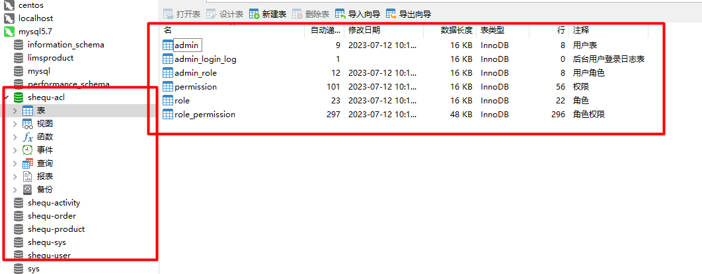
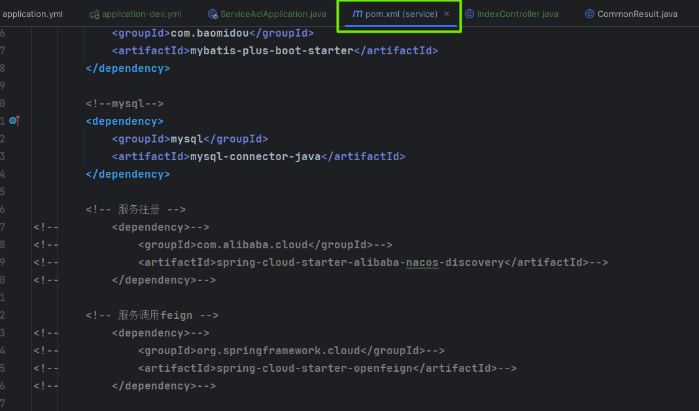
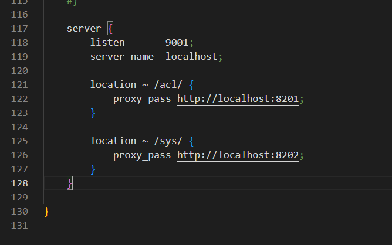
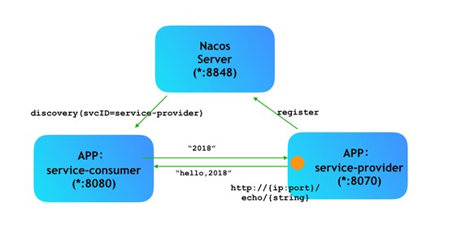
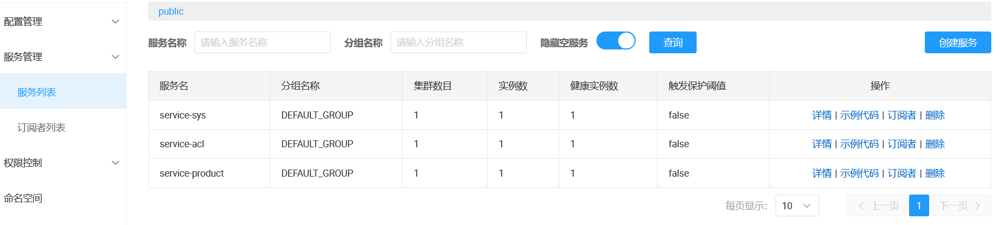
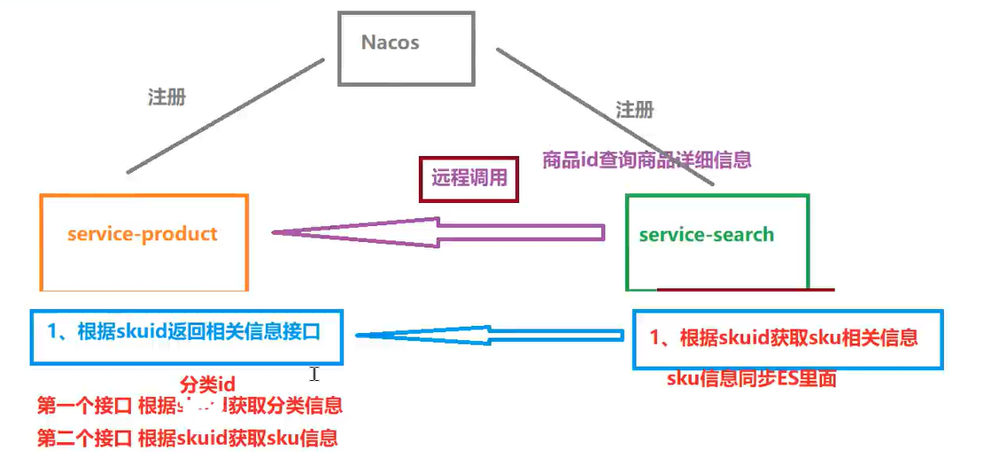
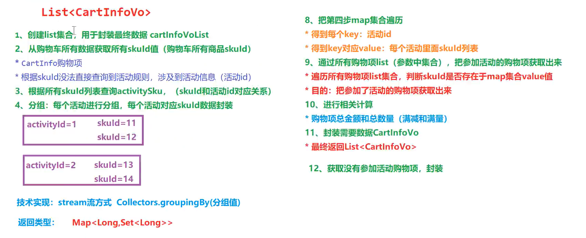

# 目录
1. 搭建后端环境
2. 平台管理端
3. 权限管理模块
4. 系统管理模块
5. 整合nginx
6. 商品信息管理模块
7. SpringCloud相关概念
8. SpringCloud-Nacos
9. 整合ES+MQ实现商品上下架
10. 营销活动管理模块
11. 整合gateway网关
12. 微信小程序端  
13. 部署与总结  

## 1.搭建后端环境
**目录:**  
1.1 项目结构  
1.2 项目配置文件内容更改  
1.3 准备接口相关工具类  
1.4 编写统一返回接口类  
1.5 编写统一异常处理类  
1.6 配置swagger  
1.7 定义实体类  

### 1.1 项目结构
1.创建父模块guigu-xxys-parent,父模块用于配置Maven、管理pom;删除src目录.  
  
2.在父模块下创建common模块  
  
3.建立以下所有模块  
  
模块说明:
* guigu-xxys-parent:父工程
  * common:存放公共内容
    * common-util:存放公共配置了
    * service-util:存放业务模块中相关的工具类,相关的配置文件.
  * model:存放项目中相关的实体类
  * service:具体业务模块
### 1.2 项目配置文件内容更改
1.在parent模块的pom文件中修改如下内容:  
```xml
<?xml version="1.0" encoding="UTF-8"?>
<project xmlns="http://maven.apache.org/POM/4.0.0"
         xmlns:xsi="http://www.w3.org/2001/XMLSchema-instance"
         xsi:schemaLocation="http://maven.apache.org/POM/4.0.0 http://maven.apache.org/xsd/maven-4.0.0.xsd">
    <modelVersion>4.0.0</modelVersion>

    <groupId>com.atguigui</groupId>
    <artifactId>guigu-xxys-parent</artifactId>
    <version>1.0-SNAPSHOT</version>
    <packaging>pom</packaging>
    <modules>
        <module>common</module>
        <module>model</module>
        <module>service</module>
    </modules>

    <parent>
        <groupId>org.springframework.boot</groupId>
        <artifactId>spring-boot-starter-parent</artifactId>
        <version>2.3.6.RELEASE</version>
    </parent>

    <properties>
        <maven.compiler.source>9</maven.compiler.source>
        <maven.compiler.target>9</maven.compiler.target>
        <project.build.sourceEncoding>UTF-8</project.build.sourceEncoding>
        <skipTests>true</skipTests>
        <cloud.version>Hoxton.SR8</cloud.version>
        <alibaba.version>2.2.2.RELEASE</alibaba.version>
        <mybatis-plus.version>3.4.1</mybatis-plus.version>
        <mysql.version>8.0.30</mysql.version>
        <jwt.version>0.7.0</jwt.version>
        <fastjson.version>2.0.0</fastjson.version>
        <httpclient.version>4.5.1</httpclient.version>
        <easyexcel.version>3.1.0</easyexcel.version>
        <aliyun.version>4.1.1</aliyun.version>
        <oss.version>3.9.1</oss.version>
        <knife4j.version>2.0.8</knife4j.version>
        <jodatime.version>2.10.1</jodatime.version>
        <xxl-job.version>2.3.0</xxl-job.version>
    </properties>
    <!--配置dependencyManagement锁定依赖的版本-->
    <dependencyManagement>
        <dependencies>
            <dependency>
                <groupId>org.springframework.cloud</groupId>
                <artifactId>spring-cloud-dependencies</artifactId>
                <version>${cloud.version}</version>
                <type>pom</type>
                <scope>import</scope>
            </dependency>
            <dependency>
                <groupId>com.alibaba.cloud</groupId>
                <artifactId>spring-cloud-alibaba-dependencies</artifactId>
                <version>${alibaba.version}</version>
                <type>pom</type>
                <scope>import</scope>
            </dependency>
            <!--mybatis-plus 持久层-->
            <dependency>
                <groupId>com.baomidou</groupId>
                <artifactId>mybatis-plus-boot-starter</artifactId>
                <version>${mybatis-plus.version}</version>
            </dependency>
            <dependency>
                <groupId>mysql</groupId>
                <artifactId>mysql-connector-java</artifactId>
                <version>${mysql.version}</version>
            </dependency>
            <dependency>
                <groupId>com.github.xiaoymin</groupId>
                <artifactId>knife4j-spring-boot-starter</artifactId>
                <version>2.0.8</version>
            </dependency>
            <dependency>
                <groupId>io.jsonwebtoken</groupId>
                <artifactId>jjwt</artifactId>
                <version>${jwt.version}</version>
            </dependency>
            <dependency>
                <groupId>org.apache.httpcomponents</groupId>
                <artifactId>httpclient</artifactId>
                <version>${httpclient.version}</version>
            </dependency>
            <dependency>
                <groupId>com.alibaba</groupId>
                <artifactId>fastjson</artifactId>
                <version>${fastjson.version}</version>
            </dependency>
            <dependency>
                <groupId>com.alibaba</groupId>
                <artifactId>easyexcel</artifactId>
                <version>${easyexcel.version}</version>
            </dependency>
            <dependency>
                <groupId>com.aliyun</groupId>
                <artifactId>aliyun-java-sdk-core</artifactId>
                <version>${aliyun.version}</version>
            </dependency>
            <!--日期时间工具-->
            <dependency>
                <groupId>joda-time</groupId>
                <artifactId>joda-time</artifactId>
                <version>${jodatime.version}</version>
            </dependency>
            <dependency>
                <groupId>com.xuxueli</groupId>
                <artifactId>xxl-job-core</artifactId>
                <version>${xxl-job.version}</version>
            </dependency>
        </dependencies>
    </dependencyManagement>
</project>
```

2.在common的pom文件中修改如下内容:  
```xml
<?xml version="1.0" encoding="UTF-8"?>
<project xmlns="http://maven.apache.org/POM/4.0.0"
         xmlns:xsi="http://www.w3.org/2001/XMLSchema-instance"
         xsi:schemaLocation="http://maven.apache.org/POM/4.0.0 http://maven.apache.org/xsd/maven-4.0.0.xsd">
    <modelVersion>4.0.0</modelVersion>
    <parent>
        <groupId>com.atguigui</groupId>
        <artifactId>guigu-xxys-parent</artifactId>
        <version>1.0-SNAPSHOT</version>
    </parent>

    <artifactId>common</artifactId>
    <packaging>pom</packaging>
    <modules>
        <module>untitled-util</module>
        <module>service-util</module>
    </modules>

    <properties>
        <maven.compiler.source>9</maven.compiler.source>
        <maven.compiler.target>9</maven.compiler.target>
        <project.build.sourceEncoding>UTF-8</project.build.sourceEncoding>
    </properties>

    <dependencies>
        <dependency>
            <groupId>org.springframework.boot</groupId>
            <artifactId>spring-boot-starter-web</artifactId>
            <scope>provided</scope>
        </dependency>

        <!--lombok用来简化实体类:需要安装lombok插件-->
        <dependency>
            <groupId>org.projectlombok</groupId>
            <artifactId>lombok</artifactId>
        </dependency>
        <!-- https://doc.xiaominfo.com/knife4j/documentation/ -->
        <dependency>
            <groupId>com.github.xiaoymin</groupId>
            <artifactId>knife4j-spring-boot-starter</artifactId>
        </dependency>

        <!--用来转换json使用 {JavaObject - json | json - JavaObject}-->
        <dependency>
            <groupId>com.alibaba</groupId>
            <artifactId>fastjson</artifactId>
        </dependency>

        <!-- 服务调用feign -->
        <dependency>
            <groupId>org.springframework.cloud</groupId>
            <artifactId>spring-cloud-starter-openfeign</artifactId>
            <scope>provided</scope>
        </dependency>

    </dependencies>

</project>
```

3.在common-util的pom文件中修改如下内容:  
```xml
<?xml version="1.0" encoding="UTF-8"?>
<project xmlns="http://maven.apache.org/POM/4.0.0"
         xmlns:xsi="http://www.w3.org/2001/XMLSchema-instance"
         xsi:schemaLocation="http://maven.apache.org/POM/4.0.0 http://maven.apache.org/xsd/maven-4.0.0.xsd">
    <modelVersion>4.0.0</modelVersion>
    <parent>
        <groupId>com.atguigui</groupId>
        <artifactId>common</artifactId>
        <version>1.0-SNAPSHOT</version>
    </parent>

    <artifactId>common-util</artifactId>

    <properties>
        <maven.compiler.source>9</maven.compiler.source>
        <maven.compiler.target>9</maven.compiler.target>
        <project.build.sourceEncoding>UTF-8</project.build.sourceEncoding>
    </properties>

    <dependencies>
        <dependency>
            <groupId>org.apache.httpcomponents</groupId>
            <artifactId>httpclient</artifactId>
        </dependency>

        <dependency>
            <groupId>io.jsonwebtoken</groupId>
            <artifactId>jjwt</artifactId>
        </dependency>

        <dependency>
            <groupId>joda-time</groupId>
            <artifactId>joda-time</artifactId>
        </dependency>

        <dependency>
            <groupId>com.atguigu</groupId>
            <artifactId>model</artifactId>
            <version>1.0-SNAPSHOT</version>
            <scope>provided</scope>
        </dependency>
    </dependencies>

</project>
```  

4.在service-util的pom文件中修改如下内容:  
```xml
<?xml version="1.0" encoding="UTF-8"?>
<project xmlns="http://maven.apache.org/POM/4.0.0"
         xmlns:xsi="http://www.w3.org/2001/XMLSchema-instance"
         xsi:schemaLocation="http://maven.apache.org/POM/4.0.0 http://maven.apache.org/xsd/maven-4.0.0.xsd">
    <modelVersion>4.0.0</modelVersion>
    <parent>
        <groupId>com.atguigui</groupId>
        <artifactId>common</artifactId>
        <version>1.0-SNAPSHOT</version>
    </parent>

    <artifactId>service-util</artifactId>

    <properties>
        <maven.compiler.source>9</maven.compiler.source>
        <maven.compiler.target>9</maven.compiler.target>
        <project.build.sourceEncoding>UTF-8</project.build.sourceEncoding>
    </properties>

    <dependencies>
        <dependency>
            <groupId>com.atguigu</groupId>
            <artifactId>common-util</artifactId>
            <version>1.0-SNAPSHOT</version>
        </dependency>

        <!-- redis -->
        <dependency>
            <groupId>org.springframework.boot</groupId>
            <artifactId>spring-boot-starter-data-redis</artifactId>
        </dependency>

        <!-- spring2.X集成redis所需common-pool2-->
        <dependency>
            <groupId>org.apache.commons</groupId>
            <artifactId>commons-pool2</artifactId>
            <version>2.6.0</version>
        </dependency>

        <!-- redisson 分布式锁-->
        <dependency>
            <groupId>org.redisson</groupId>
            <artifactId>redisson</artifactId>
            <version>3.11.2</version>
        </dependency>

        <!--mybatis-plus-->
        <dependency>
            <groupId>com.baomidou</groupId>
            <artifactId>mybatis-plus-boot-starter</artifactId>
            <scope>provided</scope>
        </dependency>
        <dependency>
            <groupId>com.atguigu</groupId>
            <artifactId>model</artifactId>
            <version>1.0-SNAPSHOT</version>
            <scope>compile</scope>
        </dependency>
    </dependencies>

</project>
```

5.model的pom文件中修改如下内容:
```xml
<?xml version="1.0" encoding="UTF-8"?>
<project xmlns="http://maven.apache.org/POM/4.0.0"
         xmlns:xsi="http://www.w3.org/2001/XMLSchema-instance"
         xsi:schemaLocation="http://maven.apache.org/POM/4.0.0 http://maven.apache.org/xsd/maven-4.0.0.xsd">
    <modelVersion>4.0.0</modelVersion>
    <parent>
        <groupId>com.atguigui</groupId>
        <artifactId>guigu-xxys-parent</artifactId>
        <version>1.0-SNAPSHOT</version>
    </parent>

    <artifactId>model</artifactId>

    <properties>
        <maven.compiler.source>9</maven.compiler.source>
        <maven.compiler.target>9</maven.compiler.target>
        <project.build.sourceEncoding>UTF-8</project.build.sourceEncoding>
    </properties>

    <dependencies>
        <dependency>
            <groupId>org.projectlombok</groupId>
            <artifactId>lombok</artifactId>
        </dependency>

        <!--mybatis-plus-->
        <dependency>
            <groupId>com.baomidou</groupId>
            <artifactId>mybatis-plus-boot-starter</artifactId>
            <scope>provided</scope>
        </dependency>

        <dependency>
            <groupId>com.github.xiaoymin</groupId>
            <artifactId>knife4j-spring-boot-starter</artifactId>
            <!--在引用时请在maven中央仓库搜索2.X最新版本号-->
            <scope>provided</scope>
        </dependency>

        <dependency>
            <groupId>org.springframework.boot</groupId>
            <artifactId>spring-boot-starter-data-mongodb</artifactId>
            <scope>provided</scope>
        </dependency>

        <dependency>
            <groupId>com.alibaba</groupId>
            <artifactId>fastjson</artifactId>
            <scope>provided</scope>
        </dependency>

        <!--创建索引库的-->
        <dependency>
            <groupId>org.springframework.boot</groupId>
            <artifactId>spring-boot-starter-data-elasticsearch</artifactId>
            <scope>provided</scope>
        </dependency>
    </dependencies>

</project>
```

6.service的pom文件中修改如下内容:
```xml
<?xml version="1.0" encoding="UTF-8"?>
<project xmlns="http://maven.apache.org/POM/4.0.0"
         xmlns:xsi="http://www.w3.org/2001/XMLSchema-instance"
         xsi:schemaLocation="http://maven.apache.org/POM/4.0.0 http://maven.apache.org/xsd/maven-4.0.0.xsd">
    <modelVersion>4.0.0</modelVersion>
    <parent>
        <groupId>com.atguigui</groupId>
        <artifactId>guigu-xxys-parent</artifactId>
        <version>1.0-SNAPSHOT</version>
    </parent>

    <artifactId>service</artifactId>

    <properties>
        <maven.compiler.source>9</maven.compiler.source>
        <maven.compiler.target>9</maven.compiler.target>
        <project.build.sourceEncoding>UTF-8</project.build.sourceEncoding>
    </properties>

    <dependencies>
        <!--依赖服务的工具类-->
        <dependency>
            <groupId>com.atguigu</groupId>
            <artifactId>service-util</artifactId>
            <version>1.0-SNAPSHOT</version>
        </dependency>
        <!--数据载体-->
        <dependency>
            <groupId>com.atguigu</groupId>
            <artifactId>model</artifactId>
            <version>1.0-SNAPSHOT</version>
        </dependency>

        <!--web 需要启动项目-->
        <dependency>
            <groupId>org.springframework.boot</groupId>
            <artifactId>spring-boot-starter-web</artifactId>
        </dependency>

        <!--mybatis-plus-->
        <dependency>
            <groupId>com.baomidou</groupId>
            <artifactId>mybatis-plus-boot-starter</artifactId>
        </dependency>

        <!--mysql-->
        <dependency>
            <groupId>mysql</groupId>
            <artifactId>mysql-connector-java</artifactId>
        </dependency>

        <!-- 服务注册 -->
        <dependency>
            <groupId>com.alibaba.cloud</groupId>
            <artifactId>spring-cloud-starter-alibaba-nacos-discovery</artifactId>
        </dependency>

        <!-- 服务调用feign -->
        <dependency>
            <groupId>org.springframework.cloud</groupId>
            <artifactId>spring-cloud-starter-openfeign</artifactId>
        </dependency>

        <!-- 流量控制 -->
        <dependency>
            <groupId>com.alibaba.cloud</groupId>
            <artifactId>spring-cloud-starter-alibaba-sentinel</artifactId>
        </dependency>

        <!--开发者工具-->
        <dependency>
            <groupId>org.springframework.boot</groupId>
            <artifactId>spring-boot-devtools</artifactId>
            <optional>true</optional>
        </dependency>
    </dependencies>

</project>
```

**提示:idea中安装lombok插件**

### 1.3 准备接口相关工具类
1.在service-util模块中编写mybatis-plus的配置文件  
在java文件夹下新建包com.atguigu.ssyx.common.config  
在该包下新建一个类MybatisPlusConfig
```java
@Configuration
@MapperScan("com.atguigu.ssxy.*.mapper")
public class MybatisPlusConfig {

    /**
     * 新的分页插件,一缓和二缓遵循mybatis的规则,
     * 需要设置 MybatisConfiguration#useDeprecatedExecutor = false
     * 避免缓存出现问题(该属性会在旧插件移除后一同移除)
     */
    @Bean
    public MybatisPlusInterceptor mybatisPlusInterceptor() {
        MybatisPlusInterceptor interceptor = new MybatisPlusInterceptor();
        interceptor.addInnerInterceptor(new PaginationInnerInterceptor(DbType.MYSQL));
        return interceptor;
    }

    @Bean
    public ConfigurationCustomizer configurationCustomizer() {
        return configuration -> configuration.setUseDeprecatedExecutor(false);
    }
}
```
@MapperScan注解填写扫描的Mapper**类**的路径,注意DbType填写上我们自已的数据库类型.

### 1.4 编写统一返回接口类
1.在service-util模块中建立统一的状态码返回枚举类  
在java文件夹下新建包com.atguigu.ssyx.common.result  
在该包下新建一个类ResultCodeEnum
```java
@Getter
public enum ResultCodeEnum {

    SUCCESS(200,"成功"),
    FAIL(201, "失败"),
    SERVICE_ERROR(2012, "服务异常"),
    DATA_ERROR(204, "数据异常"),
    ILLEGAL_REQUEST(205, "非法请求"),
    REPEAT_SUBMIT(206, "重复提交"),

    LOGIN_AUTH(208, "未登陆"),
    PERMISSION(209, "没有权限"),

    ORDER_PRICE_ERROR(210, "订单商品价格变化"),
    ORDER_STOCK_FALL(204, "订单库存锁定失败"),
    CREATE_ORDER_FAIL(210, "创建订单失败"),

    COUPON_GET(220, "优惠券已经领取"),
    COUPON_LIMIT_GET(221, "优惠券已发放完毕"),

    URL_ENCODE_ERROR( 216, "URL编码失败"),
    ILLEGAL_CALLBACK_REQUEST_ERROR( 217, "非法回调请求"),
    FETCH_ACCESSTOKEN_FAILD( 218, "获取accessToken失败"),
    FETCH_USERINFO_ERROR( 219, "获取用户信息失败"),


    SKU_LIMIT_ERROR(230, "购买个数不能大于限购个数"),
    REGION_OPEN(240, "该区域已开通"),
    REGION_NO_OPEN(240, "该区域未开通"),
    ;

    private Integer code;

    private String message;

    private ResultCodeEnum(Integer code, String message) {
        this.code = code;
        this.message = message;
    }
}
```
2.在service-util模块中建立统一结果返回类,所有接口都返回该类.  
在result包下建立一个新类CommonResult
```java
@Data
public class CommonResult<T> {

    //状态码
    private Integer code;
    //信息
    private String message;
    //数据
    private T data;

    //构造私有化
    private CommonResult() { }

    /**
     * 构造一个通用的返回对象<br>
     * 设置数据,返回对象的方法
     *
     * @param data           返回的数据
     * @param resultCodeEnum 状态码
     * @param <T>            泛型约束
     * @return 返回值不为null
     */
    public static <T> CommonResult<T> build(T data, ResultCodeEnum resultCodeEnum) {
        //创建Result对象,设置值,返回对象
        CommonResult<T> commonResult = new CommonResult<>();
        //判断返回结果中是否需要数据
        if (data != null) {
            //设置数据到result对象
            commonResult.setData(data);
        }
        //设置其他值
        commonResult.setCode(resultCodeEnum.getCode());
        commonResult.setMessage(resultCodeEnum.getMessage());
        //返回设置值之后的对象
        return commonResult;
    }

    //成功的方法
    public static<T> CommonResult<T> ok(T data) {
        CommonResult<T> commonResult = build(data, ResultCodeEnum.SUCCESS);
        return commonResult;
    }

    //失败的方法
    public static<T> CommonResult<T> fail(T data) {
        return build(data,ResultCodeEnum.FAIL);
    }
}
```   
### 1.5 编写统一异常处理类
**引入**:系统在运行过程中如果出现了异常,默认会直接返回异常信息,比如500错误提示.但是我们想让异常结果也实现为统一的返回结果对象,并且统一处理系统的异常信息,那么需要进行统一异常处理.  
1.在service-util模块中建立统一异常处理类,还是新建com.atguigu.ssyx.common.exception包;然后新建一个GlobalExceptionHandler类:
```java
@ControllerAdvice
public class GlobalExceptionHandler {

    @ExceptionHandler(Exception.class)
    @ResponseBody
    public CommonResult<?> error(Exception e) {
        e.printStackTrace();
        return CommonResult.fail(null);
    }
}
```
2.如何编写自定义异常类?  
**引入**:现在的问题在于捕获的异常是Exception,粒度太高;如果只想捕获自已的异常那么就可以编写一个自定义的异常类,编写过程如下:  
2.1 创建异常类,继承RuntimeException  
2.2 在异常类中定义属性,生成对应的方法  
2.3 在全局异常处理类中定义自定义异常的执行方法  
2.4 手动抛出自定义异常(此时就会被全部异常处理类捕获)
在exception包中创建基础异常:
```java
@Data
public abstract class AbstractSSYXException extends RuntimeException {

    private Integer code;

    /**
     * 通过状态码和错误信息创建异常对象
     *
     * @param message 创建异常时携带的信息
     * @param code    创建异常时指定的状态码
     */
    public AbstractSSYXException(String message, Integer code) {
        super(message);
        this.code = code;
    }

    /**
     * 接受枚举类型对象
     *
     * @param resultCodeEnum 传入的对象不能为null,通用返回状态码
     */
    public AbstractSSYXException(ResultCodeEnum resultCodeEnum) {
        this(resultCodeEnum.getMessage(), resultCodeEnum.getCode());
    }   
}
```

3.在GlobalExceptionHandler中添加对应的处理方法
```java
@ControllerAdvice
public class GlobalExceptionHandler {

    @ExceptionHandler(Exception.class)
    @ResponseBody
    public CommonResult<?> handleGlobalException(Exception e) {
        e.printStackTrace();
        return CommonResult.fail(null);
    }

    @ExceptionHandler(AbstractSSYXException.class)
    @ResponseBody
    public CommonResult<?> handleAbstractSSYXException(AbstractSSYXException e) {
        e.printStackTrace();
        return CommonResult.fail(null);
    }
}
```
### 1.6 配置swagger  
引入:swagger是文档管理工具,能根据接口实时生成在线文档.  
**引入knife4j**:knife4j是为Java MVC集成swagger生成API文档的增强解决方案.所以knife4j是增强的swagger.  
使用knife4j需要添加依赖(之前已经复制过了):  
```xml
<dependency>
    <groupId>com.github.xiaoymin</groupId>
    <artifactId>knife4j-spring-boot-starter</artifactId>
</dependency>
```
在service-util模块中的config包中添加swagger的配置类:  


解释:
swagger支持分类管理接口,也就是说接口也是有分类的.例如有针对管理员的管理员接口和针对用户的用户接口.
主要的其实是Docket,ParameterBuilder实际上是一些默认的信息.  
Docket类的`groupName`方法指定了当前当前这类接口的是哪个组的,由此就可以对接口的进行分组(分类).例如这里有两组分别是webApi、adminApi;一个是用户用的接口,一个是管理员使用的接口.  
`apiInfo`方法指定的是本组接口的一些基本信息,这里调用apiInfo方法传入的参数来源于webApiInfo()、adminApiInfo()这两个方法.这两个方法都返回ApiInfo指定了本组接口的一些基本信息.  
ApiInfoBuilder:该类用于构造ApiInfo;建造者模式,见名思意看它有哪些参数.  
|    属性     |   解释   |
| :---------: | :------: |
|    title    |   标题   |
| description | 描述信息 |
|   version   |   版本   |
|   contact   | 联系方式 |

`apis`方法指定当前组显示哪个包里面的相关内容  
`paths`指定当前分组显示的接口的路径匹配表达式(例如webapi就只显示/api开头的接口,而adminapi就只显示/admin开头的接口)  
`globalOperationParameters`方法指定全局的参数,方法的入参就是List\<Parameter\>.

### 1.7 定义实体类  
**提示:** 直接从资料中拿即可,直接引入到model模块的Java源码路径下.  
enums包下面是枚举类.  
model包下面是相关的实体类.  
vo包下面是前端发送请求对应的类,相当于之前的param包  
**注解说明:** 和mybatis笔记中的内容是一致的
|    注解     |     解释     |
| :---------: | :----------: |
| @TableName  | 类对应的表明 |
| @TableField | 数据库字段名 |
| @TableLogic |   逻辑删除   |

**BaseEntity:** 基础的实体类,所以的实体类继承自该类  
该类包含一些通用参数:id、createTime、updateTime、isDeleted

## 2.平台管理端
**目录:**  
2.1 安装相关软件  
2.2 导入前端项目  
2.3 前端登陆接口的改造  
2.4 后端登陆接口编写  
2.5 权限管理模块

### 2.1 安装相关软件
1.安装NodeJS  
Node.js是一个事件驱动I/O服务端JavaScript环境,基于google的V8引擎,V8引擎执行JavaScript的速度非常快,性能非常好.简单来说Node.js就是运行在服务端的JavaScript.  
在控制台输入`node -v`查看当前node是否安装成功.  
2.安装vscode  
安装vsccode插件:中文包、Live Server、Vetur、vue-helper  

### 2.2 导入前端项目  
1.在vscode中创建一个文件夹,命名为guigu-ssyx作为我们前端的项目,然后打开该文件夹,点击**工具栏**中的文件->将工作区另存为,然后将生成的文件保存到当前目录下.  
2.进入到该文件夹下,运行  
`npm install --location=global @vue/cli`该命令相当于安装vue的依赖;脚手架插件(全局安装命令行工具)  
`vue create vue-test`创建一个vue项目,项目名称为vue-test.选择创建Vue2项目  
如果在创建这一步报错,则需要以管理员身份打开cmd,然后运行`Set-ExecutionPolicy -Scope CurrentUser`,接着在cmd中输入RemoteSigned.  

`cd vue-test` 进入该vue项目  
`npm run serve`启动项目,按照提示信息访问项目    
`ctrl+c`终止项目运行  
3.项目结构说明:  
node_modeles:项目的依赖内容  
public:公共资源  
src:项目源码(核心内容)  
  * main.js:项目的入口  

package.json:罗列项目用到的哪些依赖,类似于pom.xml  
vue.config.js:项目的核心配置文件  
4.vue-admin-template介绍:  
(1)vue-element-admin是基于Vue和Element-ui的一套后台管理系统集成方案.vue-admin-template是基于vue-element-admin的一套后台管理系统基础模板\(最少精简版\),可作为模板进行二次开发.  
(2)vue是一套用于构建用户界面的渐进式框架.Vue的核心库只关注视图层,不仅易于上手,还便于与第三方库或既有项目整合.另一方面,当与现代化的工具链以及各种支持类库结合使用时,Vue也完全能够为复杂的单页应用提供驱动.  
(3)element-ui是饿了么前端出品的基于Vue.js的后台组件库,方便程序员进行页面快速布局和构建.  
4.将资料提供的前端项目解压,并作为前端项目的工作区.  
5.创建完成后项目的结构:  
  
进入到红色方框选中的路径,然后运行`npm run dev`启动项目,注意工作区文件所在的位置,以及项目的整体结构.运行成功后浏览器跳转:  
  
6.项目结构说明:  
**提示:** 这是针对给出的资料而言的,第三步自已创建的项目比较会多一些内容.  
build:构建相关的  
dist:项目最终打包后会存放该文件夹下  
mock:存放模拟服务器,模拟接口、模拟数据通过mock来实现  
node_modules:同上(存放依赖)
public:同上(公共资源)
src:同上(源码文件;核心文件)
  * api:存放后端接口的路径(也就是前端请求后端接口的路径文件)
  * assets:存放静态资源
  * components:存放相关组件
  * icons:存放相关图标
  * layout:存放页面的相关布局
  * router:路由,注意这里的路由好像和我们正常所说的路由不是一个概念.教材中提到在网页页面左侧的选择栏就称之为路由.(个人信息、部门添加这些路由就在router中进行定义)
  
    * store:相关的js文件
    * styles:相关的css文件
  * utils:相关的工具
    * request.js:通过该工具类发送相关的请求
  * views:相关的页面
  * main.js:程序的入口

package.json:同上(存放项目用到哪些依赖)  
vue.config.js:存放项目相关的配置文件

**总结:** 后序我们主要操作api和views文件夹内的内容.

7.插件安装:
vetur、vue-helper

### 2.3 登陆接口的改造
1.找到前端项目 src/api/user.js 由三个接口组成  
login:登录接口 /admin/acl/index/login  
getInfo:得到个人信息 /admin/acl/index/getInfo  
logout:登出接口 /admin/acl/index/logout  
2.查看js文件 src/store/modules/user.js 查看编写的接口需要返回哪些信息  
login:需要返回token信息  
getInfo:需要返回name、avatar信息  

### 2.4 后端登陆接口编写 
1.删除service模块下面的src目录,在service模块下面创建一个子模块service-acl  
注意创建的时候要选择在service模块下面创建子模块(不要选成parent)  
2.在service-acl模块中创建application.yml和application-dev.yml  
application.yml:
```yml
spring:
  application:
    name: service-acl
  profiles:
    active: dev
```

```yml
server:
  port: 8201

# 日志相关的配置内容
mybatis-plus:
  configuration:
    log-impl: org.apache.ibatis.logging.stdout.StdOutImpl

# 数据库相关配置
spring:
  datasource:
    type: com.zaxxer.hikari.HikariDataSource
    driver-class-name: com.mysql.cj.jdbc.Driver
    url: jdbc:mysql://localhost:3308/shequ-acl?characterEncoding=utf-8&useSSL=false
    username: root
    password: 123456

  # 数据库中日期的json格式
  jackson:
    date-format: yyyy-MM-dd HH:mm:ss
    time-zone: GMT+8
```

3.在service-acl模块下建立一个包com.atguigu.ssyx  
然后在该包下创建一个启动类ServiceAclApplication:
```java
@SpringBootApplication
public class ServiceAclApplication {

    public static void main(String[] args) {
        SpringApplication.run(ServiceAclApplication.class, args);
    }

}
```

4.创建数据库并导入相关的初始数据(这里采用MySQL5.7版本);注意MySQL5.7版本的端口号是**3308**,注意把application.yml配置文件中的端口号改过来.  
在资料文件夹里面有一个数据库.sql,将其导入到当前的数据库中(运行SQL文件)  


5.还是在service-acl模块下的com.atguigu.ssyx下面新建一个包acl  
然后再在该包下面创建三个子包controller、service、mapper  
然后在controller包下面创建IndexController类;方法中的三个路径正好对应2.3节前端页面指定的请求路径
```java
@RestController
@RequestMapping("/admin/acl/index")
public class IndexController {

    /**
     * login登陆接口
     *
     * @return 返回token
     */
    @PostMapping("login")
    public CommonResult<Map<String, String>> login() {
        // 返回token值
        Map<String, String> map = new HashMap<>();
        map.put("token", ",token-admin");
        return CommonResult.ok(map);
    }

    /**
     * getInfo获取信息<br>
     * 查看前端文件发现,前端需要的参数为name和avatar
     *
     * @return 返回用户的个人信息
     */
    @GetMapping("info")
    public CommonResult<Map<String, String>> info() {
        Map<String, String> map = new HashMap<>();
        map.put("name", "admin");
        map.put("avatar", "https://wpimg.wallstcn.com/f778738c-e4f8-4870-b634-56703b4acafe.gif");
        return CommonResult.ok(map);
    }

    @PostMapping("logout")
    public CommonResult<?> logout() {
        return CommonResult.ok(null);
    }

}
```

6.修改前端 **.env.development** 文件的内容如下:  
修改端口号的内容和后端的端口号一致  
```shell
# just a flag
ENV = 'development'

# base api
# VUE_APP_BASE_API = '/dev-api'
# 修改为本地接口地址
VUE_APP_BASE_API = 'http://localhost:8201'
```

实际上前端是通过ajax封装的axios来完成请求的,看下面的**request.js**文件里面的内容,实际上创建一个axios实例的时候需要指定基础的URL,该URL就是访问后端接口的地址.  
可以看到axios在进行请求的时候有两个拦截器分别为请求拦截器和响应拦截器,拦截器的概念和后端拦截器的概念异曲同工,当发一个请求的时候会先走**请求拦截器**,当请求结束获取响应的时候也会走**响应拦截器**.  
修改响应状态码是**200**,默认的响应状态码是**20000**.状态码要和后端返回的状态码对应,当返回一个响应时响应拦截器会判断响应的状态码,如果不是200则表示失败,弹出失败信息;如果是200则代表成功收到返回信息.

utils/request.js文件内容:
```javascript
// create an axios instance
const service = axios.create({
  baseURL: process.env.VUE_APP_BASE_API, // url = base url + request url 和上面对应
  // withCredentials: true, // send cookies when cross-domain requests
  timeout: 5000 // request timeout
})

// request interceptor 请求拦截器
service.interceptors.request.use(
  config => {
    // do something before request is sent

    if (store.getters.token) {
      // let each request carry token
      // ['X-Token'] is a custom headers key
      // please modify it according to the actual situation
      config.headers['token'] = getToken()
    }
    return config
  },
  error => {
    // do something with request error
    console.log(error) // for debug
    return Promise.reject(error)
  }
)

// response interceptor 响应拦截器
service.interceptors.response.use(
  /**
   * If you want to get http information such as headers or status
   * Please return  response => response
  */

  /**
   * Determine the request status by custom code
   * Here is just an example
   * You can also judge the status by HTTP Status Code
   */
  response => {
    const res = response.data

    // 修改为200   if the custom code is not 20000, it is judged as an error.
    if (res.code !== 200) {
      Message({
        message: res.message || 'Error',
        type: 'error',
        duration: 5 * 1000
      })
```

7.启动服务进行测试  
前端运行`npm run dev`
后端启动主类  
不出意外,此时会产生一个异常  
`com.alibaba.nacos.api.exception.NacosException: failed to req API:/nacos/v1/ns/instance after all servers([localhost:8848]) tried: java.net.ConnectException: Connection refused: connect`  
**原因:** 这是因为当前的模块中引入了微服务的Nacos组件,springboot启动时会进行自动配置,但是我们的项目目前还没有使用到这些内容,所以这里先把pom文件中的相关依赖注释.  

刷新之后重新运行  
**细节:** Springboot默认是会扫描主类所在的包和主类下面的所有包,那现在分模块了也必须保证springboot能扫描到别的模块下的类;**所以只要所有模块类的路径都在springboot主类所在的子包路径下即可.** 例如现在主类的路径是service-acl模块下com.atguigu.ssyx包下,所以只要别的模块的类都在com.atguigu.ssyx包下那么就可以被当前模块扫描到.  
此时访问路径一个固定的路径`localhost:port/doc.html`就能访问到swagger生成的在线文档,如果能访问到则代表项目启动成功.  
  

8.添加swagger相关注解  
@Api:类的信息说明  
@ApiOperation:controller接口说明  
**提示:** swagger注解的详情信息见springboot.txt文档
```java
@Api(tags = "登陆接口")
@RestController
@RequestMapping("/admin/acl/index")
public class IndexController {

    /**
     * login登陆接口
     *
     * @return 返回token
     */
    @ApiOperation("登陆")
    @PostMapping("login")
    public CommonResult<Map<String, String>> login() {
        // 返回token值
        Map<String, String> map = new HashMap<>();
        map.put("token", ",token-admin");
        return CommonResult.ok(map);
    }

    /**
     * getInfo获取信息<br>
     * 查看前端文件发现,前端需要的参数为name和avatar
     *
     * @return 返回用户的个人信息
     */
    @ApiOperation("获取信息")
    @GetMapping("info")
    public CommonResult<Map<String, String>> info() {
        Map<String, String> map = new HashMap<>();
        map.put("name", "admin");
        map.put("avatar", "https://wpimg.wallstcn.com/f778738c-e4f8-4870-b634-56703b4acafe.gif");
        return CommonResult.ok(map);
    }

    @ApiOperation("退出")
    @PostMapping("logout")
    public CommonResult<?> logout() {
        return CommonResult.ok(null);
    }

}
```

重新运行项目发现配置已经生效  

9.重启前端测试项目  
首先Ctrl+C停止项目,然后运行`npm run dev`命令启动前端项目  
**注意:** 前端的配置信息要按照第6步搞好  
此时点击登录按钮发现还是出错,原因是因为跨域问题.  
  
**跨域:** 访问协议、IP地址、端口 这三者前后端只要有不一样的就会存在跨域问题,现在前端的端口是9528后端是8080.所以出现跨域问题.  
**本质:** 浏览器对Ajax请求的一种安全策略.  
**解决方式:** 这里暂时的解决方式是在controller中添加注解.`@CrossOrigin`
```java
@Api(tags = "登陆接口")
@CrossOrigin
@RestController
@RequestMapping("/admin/acl/index")
public class IndexController {
    // do something...
}
```

10.重启后端进行测试,成功!


## 3.权限管理模块  
**目录:**  
3.1 开发角色管理接口  
3.2 开发用户管理接口  
3.3 开发为用户分配角色接口  
3.4 菜单管理需求分析  
3.5 开发菜单管理接口  
3.6 为角色分配菜单操作权限  

### 3.1 开发角色管理接口  
1.同理还是在com.atguigu.ssyx.acl.controller包下建立一个RoleController类  
查看前端src/api/acl/role.js文件中关于role请求路径的相关内容,然后依据该内容填写后端接口对应的路径.前端的路径是/admin/acl/role  
```java
@Api(tags = "角色接口")
@CrossOrigin
@RestController
@RequestMapping("/admin/acl/role")
public class RoleController {
} 
```
2.创建service  
RoleService:需要继承自IService接口,并且规定泛型,该接口中有许多mybatis-plus为我们定义好的CRUD方法.
```java
public interface RoleService extends IService<Role> {
}
```
RoleServiceImpl:RoleService接口的实现类,由于RoleService继承自IService而IService是一个接口,都是抽象方法;这里理应需要我们手动来实现所有的方法.但实际上mybatis-plus已经为我们实现好了这些方法,只需要我们的service层的实现类继承自ServiceImpl类即可,并且规定泛型.  
第一个泛型是操作该实体类的**Mapper**(RoleMapper)接口,第二个泛型就是要操作的实体类.
```java
@Service
public class RoleServiceImpl extends ServiceImpl<RoleMapper, Role> implements RoleService {
}
```
3.创建mapper
```java
@Repository
public interface RoleMapper extends BaseMapper<Role> {
}
```
使用mybatis-plus必须继承自**BaseMapper\<T\>**接口,里面的泛型填上当前Mapper操作哪个实体类.  

4.需求分析  
**定义:** controller层要对外暴露6个功能,分别为:角色列表(条件分页查询)、根据ID查询角色、添加角色、修改角色、根据ID删除角色、批量删除角色.**这些功能都是根据前端role.js文件中定义的内容得到的,实际开发中会有接入文档**  

5.角色条件分页查询  
主要看RoleController和RoleServiceImpl的改动  
```java
@Api(tags = "角色接口")
@CrossOrigin
@RestController
@RequestMapping("/admin/acl/role")
public class RoleController {

    private final RoleService roleService;

    public RoleController(RoleService roleService) {
        this.roleService = roleService;
    }

    @ApiOperation("角色条件分页查询")
    @GetMapping("{current}/{limit}")
    public CommonResult<IPage<Role>> pageList(@PathVariable Long current,
                                              @PathVariable Long limit,
                                              RoleQueryVo roleQueryVo) {
        /*
        创建page对象,传递当前页和每页记录数
        current:当前页
        limit:每页显示的记录数
         */
        Page<Role> pageParam = new Page<>(current, limit);
        // 调用service方法实现条件分页查询,返回分页对象
        IPage<Role> pageModel = roleService.selectRolePage(pageParam, roleQueryVo);
        return CommonResult.ok(pageModel);
    }

}
```
**注意:** RoleQueryVo是查询条件,该类中有一个roleName参数指定模糊查询的角色的名称.
```java
@Service
public class RoleServiceImpl extends ServiceImpl<RoleMapper, Role> implements RoleService {
    @Override
    public IPage<Role> selectRolePage(Page<Role> pageParam, RoleQueryVo roleQueryVo) {
        // 获取条件值,分页查询的时候可以根据角色名称来进行分页查询.如果没有条件值(即没有角色名称)则进行模糊查询
        String roleName = roleQueryVo.getRoleName();
        // 创建mp条件对象
        LambdaQueryWrapper<Role> wrapper = new LambdaQueryWrapper<>();
        // 判断查询条件是否为空,不为空则封装查询条件
        if (!StringUtils.isEmpty(roleName)) {
            /*
             这种写法相当于 roleName like ?
             问号?代表占位符,也就是这里的args1参数指定的内容
             LambdaQueryWrapper采用了Builder模式,最终通过调用baseMapper对象的方法传入LambdaQueryWrapper从而实现SQL语句的执行
             */
            wrapper.like(Role::getRoleName, roleName);
        }
        // 调用方法实现条件分页查询
        Page<Role> rolePage = baseMapper.selectPage(pageParam, wrapper);
        // 返回分页对象
        return rolePage;
    }
}
```

测试之前可以先打开IDEA的服务功能,点击更多工具栏找到服务,然后点击添加服务->运行配置类型->springboot.这样后序有多个服务启动和关闭的时候就会方便很多.  
**细节:** 此时如果直接运行会报错,这是因为没有配置mapper的路径(或者配置错误),回到service-util模块,找到MybatisPlusConfig类,将类上注解@MapperScan里面的内容改为`@MapperScan("com.atguigu.ssyx.*.mapper")`  
测试访问http://localhost:8201/doc.html#/home,调试条件分页查询接口成功!  


6.完成剩余接口的编写  
**注意:** 前两个方法都是get请求,当前这个方法是post请求.
  
并且前端如果发送的get请求则携带请求参数时使用的字段叫`searchObj`而如果是post请求则使用的请求体字段是`data`.

```java
@Api(tags = "角色接口")
@CrossOrigin
@RestController
@RequestMapping("/admin/acl/role")
public class RoleController {

    private final RoleService roleService;

    public RoleController(RoleService roleService) {
        this.roleService = roleService;
    }

    @ApiOperation("角色条件分页查询")
    @GetMapping("{current}/{limit}")
    public CommonResult<IPage<Role>> pageList(@PathVariable Long current,
                                              @PathVariable Long limit,
                                              RoleQueryVo roleQueryVo) {
        /*
        创建page对象,传递当前页和每页记录数
        current:当前页
        limit:每页显示的记录数
         */
        Page<Role> pageParam = new Page<>(current, limit);
        // 调用service方法实现条件分页查询,返回分页对象
        IPage<Role> pageModel = roleService.selectRolePage(pageParam, roleQueryVo);
        return CommonResult.ok(pageModel);
    }

    @ApiOperation("根据ID查询角色")
    @GetMapping("get/{id}")
    public CommonResult<Role> get(@PathVariable Long id) {
        Role role = roleService.getById(id);
        return CommonResult.ok(role);
    }

    @ApiOperation("添加角色")
    @PostMapping("save")
    public CommonResult<?> save(@RequestBody Role role) {
        boolean is_success = roleService.save(role);
        if (is_success) {
            return CommonResult.ok(null);
        } else {
            return CommonResult.fail(null);
        }
    }

    @ApiOperation("修改角色")
    @PutMapping("update")
    public CommonResult<?> update(@RequestBody Role role) {
        roleService.updateById(role);
        return CommonResult.ok(null);
    }

    @ApiOperation("根据ID删除角色")
    @DeleteMapping("remove/{id}")
    public CommonResult<?> delete(@PathVariable Long id) {
        roleService.removeById(id);
        return CommonResult.ok(null);
    }

    @ApiOperation("批量删除角色")
    @DeleteMapping("batchRemove")
    public CommonResult<?> batchRemove(@RequestBody List<Long> idList) {
        // json的数组[1,2,3] 对应Java中的List集合
        roleService.removeByIds(idList);
        return CommonResult.ok(null);
    }
}
```

7.运行测试  
**注意:** 在测试的时候,调用接口时并不是所有的字段都需要传递;例如Role实体类是继承自BaseEntity实体类的,BaseEntity里面的字段都是自动生成的并不需要传递.  
测试在前端页面运行!

### 3.2 开发用户管理接口
1.用户管理需求:  
admin用户表和role角色表的关系;这里的admin表就是用户表  
* 一个用户可以有多个角色;例如用户张三可以是系统管理员也可以是平台管理员.  
* 一个角色里面可以有很多用户;例如系统管理员可以是张三,可以是李四.  
* 总之这两张表之间是多对多的关系
  
  
  

**定义:** controller层要对外暴露这些接口,分别为用户列表(条件分页查询)、用户添加、用户修改(包括根据ID查询和修改)、用户删除(包括根据ID删除和批量删除).  
**扩展功能:** 为用户分配角色

2.同理还是在com.atguigu.ssyx.acl.controller包下建立一个AdminController类  
查看前端src/api/acl/user.js文件中关于user请求路径的相关内容,然后依据该内容填写后端接口对应的路径.前端的路径是/admin/acl/user  
```java
@Api(tags = "用户接口")
@RestController
@RequestMapping("/admin/acl/user")
@CrossOrigin
public class AdminController {
}
```

3.创建service
```java
public interface AdminService extends IService<Admin> {
}
```
```java
@Service
public class AdminServiceImpl extends ServiceImpl<AdminMapper, Admin> implements AdminService {
}
```
4.创建mapper
```java
@Repository
public interface AdminMapper extends BaseMapper<Admin> {
}
```

5.编写第一步中定义的所有接口(除了扩展接口)  
```java
@Api(tags = "用户接口")
@RestController
@RequestMapping("/admin/acl/user")
@CrossOrigin
public class AdminController {

    private final AdminService adminService;

    public AdminController(AdminService adminService) {
        this.adminService = adminService;
    }

    @ApiOperation("用户列表")
    @GetMapping("{current}/{limit}")
    public CommonResult<IPage<Admin>> pageList(@PathVariable Long current,
                                               @PathVariable Long limit,
                                               AdminQueryVo adminQueryVo) {
        Page<Admin> page = new Page<>(current, limit);
        IPage<Admin> pageModel = adminService.selectAdminPage(page, adminQueryVo);
        return CommonResult.ok(pageModel);
    }

    @ApiOperation("根据ID查询")
    @GetMapping("get/{id}")
    public CommonResult<Admin> get(@PathVariable Long id) {
        Admin admin = adminService.getById(id);
        return CommonResult.ok(admin);
    }

    @ApiOperation("添加用户")
    @PostMapping("save")
    public CommonResult<?> save(@RequestBody Admin admin) {
        adminService.save(admin);
        return CommonResult.ok(null);
    }

    @ApiOperation("修改用户")
    @PutMapping("update")
    public CommonResult<?> update(@RequestBody Admin admin) {
        adminService.updateById(admin);
        return CommonResult.ok(null);
    }

    @ApiOperation("根据id删除用户")
    @DeleteMapping("remove/{id}")
    public CommonResult<?> remove(@PathVariable Long id) {
        adminService.removeById(id);
        return CommonResult.ok(null);
    }

    @ApiOperation("批量删除用户")
    @DeleteMapping("batchRemove")
    public CommonResult<?> batchRemove(@RequestBody List<Long> idList) {
        adminService.removeByIds(idList);
        return CommonResult.ok(null);
    }
}
```
```java
@Service
public class AdminServiceImpl extends ServiceImpl<AdminMapper, Admin> implements AdminService {
    @Override
    public IPage<Admin> selectAdminPage(Page<Admin> pageParam, AdminQueryVo adminQueryVo) {
        String username = adminQueryVo.getUsername();
        String name = adminQueryVo.getName();
        LambdaQueryWrapper<Admin> lambdaQueryWrapper = new LambdaQueryWrapper<>();
        if (!StringUtils.isEmpty(username)) {
            lambdaQueryWrapper.eq(Admin::getUsername, username);
        }
        if (!StringUtils.isEmpty(name)) {
            lambdaQueryWrapper.like(Admin::getName, name);
        }

        Page<Admin> page = baseMapper.selectPage(pageParam, lambdaQueryWrapper);
        return page;
    }
}
```

6.运行测试  
先进行swagger接口测试,再进行前端测试  
现在出现了一个问题,就是添加用户的时候用户的密码是明文存储的,现在要加密.  

7.加密用户的密码  
在common-util模块下创建一个包com.atguigu.ssyx.common.utils,然后将资料里面提供的一个MD5加密工具类复制到该包下.  
service层进行修改:  
```java
@Override
public boolean save(Admin admin) {
    String password = admin.getPassword();
    String passwordMD5 = MD5.encrypt(password);
    admin.setPassword(passwordMD5);
    return super.save(admin);
}
```

### 3.3 开发为用户分配角色接口
1.为用户分配角色步骤:  
  
**接口:**  
* 查询所有角色列表和根据用户ID查询用户已经分配角色列表(该接口会返回两个集合,一个是所有角色一个是用户已经分配到的角色集合)  
* 分配角色  
  (1) 参数:用户ID 和 角色ID列表 例如为张三用户分配两个角色;参数:张三ID和分配的两个角色的ID  
  (2) 根据用户ID删除之前分配过角色数据,操作用户角色关系表(admin_role)  
  (3) 重新添加,把用户和角色关系数据,重新添加到用户角色关系表(admin_role)

2.在com.atguigu.ssyx.acl.service包下创建AdminRoleService接口和类(这里不需要创建controller)  
```java
public interface AdminRoleService extends IService<AdminRole> {
}
```

3.创建其余类 AdminRoleServiceImpl、AdminRoleMapper
```java
@Service
public class AdminRoleServiceImpl extends ServiceImpl<AdminRoleMapper, AdminRole> implements AdminRoleService {
}
```
```java
@Repository
public interface AdminRoleMapper extends BaseMapper<AdminRole> {
}
```

4.查看前端src/api/acl/user.js文件中关于user请求路径的相关内容,然后依据该内容填写后端接口对应的路径.前端的路径是/admin/acl/user.相关接口放到AdminController中进行实现.  
AdminController添加如下内容:
```java
    /**
     * 获取所有角色<br>
     * 并且根据角色ID查询用户分配角色列表
     *
     * @param adminId 用户的ID
     * @return 返回用户的角色列表
     */
    @ApiOperation("获取用户角色")
    @GetMapping("toAssign/{adminId}")
    public CommonResult<Map<String, Object>> toAssign(@PathVariable Long adminId) {
        Map<String, Object> map = roleService.getRoleByAdminId(adminId);
        return CommonResult.ok(map);
    }

    @ApiOperation("为用户进行角色分配")
    @PostMapping("doAssign")
    public CommonResult<?> doAssign(@RequestParam("adminId") Long adminId,
                                    @RequestParam("roleId") @ApiParam("多个角色id") Long[] roleIds) {
        roleService.saveAdminRole(adminId, roleIds);
        return CommonResult.ok(null);
    }
```

RoleService添加如下内容:
```java
Map<String, Object> getRoleByAdminId(Long adminId);

void saveAdminRole(Long adminId, Long[] roleIds);
```

RoleServiceImpl添加如下内容:
```java
@Override
public Map<String, Object> getRoleByAdminId(Long adminId) {
    Map<String, Object> result = new HashMap<>();
    // 1、查询所有的角色 LambdaQueryWrapper实际上相当于条件,可以理解为查询参数的封装.
    List<Role> roles = baseMapper.selectList(null);
    result.put("allRolesList", roles);

    /*
     2、根据用户ID查询用户分配角色列表
     ① 根据用户ID查询当前用户已经分配的所有角色的ID列表(admin_role);返回List<AdminRole>
     ② 通过第一步返回的列表,获取所有角色的ID的列表List<Long>
     ③ 创建新的list集合,用于存储当前用户已分配的角色
     ④ 遍历上面的roles角色列表,得到每个角色.判断第二步中返回的集合的ID是否在roles中,如果在则添加到第三步创建的集合中.
     */
    LambdaQueryWrapper<AdminRole> adminRoleLambdaQueryWrapper = new LambdaQueryWrapper<>();
    adminRoleLambdaQueryWrapper.eq(AdminRole::getAdminId, adminId);
    List<AdminRole> adminRoleList = adminRoleService.list(adminRoleLambdaQueryWrapper);
    List<Long> roleIdList = adminRoleList.stream().map(AdminRole::getRoleId).collect(Collectors.toList());
    List<Role> assignRoleList = new ArrayList<>();
    roles.stream().filter(role -> roleIdList.contains(role.getId())).forEach(assignRoleList::add);
    result.put("assignRoles", assignRoleList);
    return result;
}

@Override
public void saveAdminRole(Long adminId, Long[] roleIds) {
    // 1、删除用户已经分配过的角色 根据用户ID删除admin_role表里对应的数据(直接删除)
    LambdaQueryWrapper<AdminRole> lambdaQueryWrapper = new LambdaQueryWrapper<>();
    lambdaQueryWrapper.eq(AdminRole::getAdminId, adminId);
    adminRoleService.remove(lambdaQueryWrapper);
    // 2、重新分配 遍历roleId,然后把每个角色ID + 用户ID 添加到admin_role表中
    List<AdminRole> adminRoleList = new ArrayList<>(roleIds.length);
    for (Long roleId : roleIds) {
        AdminRole adminRole = new AdminRole();
        adminRole.setAdminId(adminId);
        adminRole.setRoleId(roleId);
        adminRoleList.add(adminRole);
    }
    // 批量添加
    adminRoleService.saveBatch(adminRoleList);
}
```

5.启动后端和前端进行测试

### 3.4 菜单管理需求分析  
**回顾:** 之前我们提到vue的路由,实际上就是侧边栏上有什么内容的一种格式定义.见2.2的第6点.  
  
**说明:** 所以不同角色的用户登录后台管理系统拥有不同的菜单权限与功能权限,而前端是基于vue-admin-template这个模块开发的,因此我们菜单表设计也必须基于前端模板进行设计.  
    
例如这张图所示,首先第一层是权限管理,在权限管理下方的是用户管理、角色管理、菜单管理.然后在用户管理下面还有细分,例如查询、添加、修改、删除按钮之类的.  
实际上页面上有哪些按钮,哪些路由(侧边栏有哪些按钮)的信息也是可以定义到数据库中的.

1.数据库中是如何设计表然后来存储这些信息的?  
找到shequ-acl数据库中的permission表  
  
**重点字段说明:**
* type:菜单类型,分为:目录、菜单、按钮
  * 目录:一个分类(可以理解为一级菜单)、目录下级节点可以为目录与菜单(**权限管理**)
  * 菜单:一个具体页面,菜单的下级节点只能是按钮(**用户管理**)
  * 按钮:页面上暴露的功能(**查询按钮**、**分配角色**)
* to_code:对应路由里面的路由地址path
* code:对用菜单的功能权限标识
  
2.如何存储这种层级关系?  
**答:** 通过ID和PID表示层级关系,PID就是parentID  
**例子:** ①省-市-区 ②评论区的回复  
  

### 3.5 开发菜单管理接口
1.编写controller、service、mapper  
```java
@RestController
@RequestMapping("/admin/acl/permission")
@Api(tags = "菜单管理")
@CrossOrigin
public class PermissionController {
}
```
```java
public interface PermissionService extends IService<Permission> {
}
```
```java
@Service
public class PermissionServiceImpl extends ServiceImpl<PermissionMapper, Permission> implements PermissionService {
}
```
```java
@Repository
public interface PermissionMapper extends BaseMapper<Permission> {
}
```
2.表结构分析  
  
**解释:**  
一个用户对应多个角色,一个角色可以操作多个菜单,它们之间的关系都是多对多.只有给用户分配角色,那么用户才能拥有对相应菜单的操作权限.所以菜单是最小的分配单元.  

3.查看前端src/api/acl/permission.js文件中关于permission请求路径的相关内容,然后依据该内容填写后端接口对应的路径.前端的路径是/admin/acl/permission  

**定义:** controller层要对外暴露这些接口,分别为查询所有菜单、添加菜单、修改菜单、递归删除菜单.

4.修改相关接口实现  
**注意:** 对于删除菜单接口而言,由于一个菜单(目录)下面可能有多个按钮(菜单),所以这里需要递归删除该菜单下的所有按钮.  
  
**注意:** 同样对于查询接口而言,返回的数据必须带有层级结构.返回的是一个List\<Permission\>集合.集合内是所有顶层菜单(目录)的定义.  
注意观察Permission类,里面有一个字段叫children(List\<Permission\>类型),被`@TableField(exist = false)`注解修饰,代表数据库中可以没有与该属性对应的字段.实际上该属性的作用就是用于展示层级关系的.Permisson的所有直接子目录(菜单)会被存放于该字段中.然后children字段集合的每个元素又都可以有自已的子目录(菜单)项.  

修改PermissionController内容:
```java
@RestController
@RequestMapping("/admin/acl/permission")
@Api(tags = "菜单管理")
@CrossOrigin
public class PermissionController {

    private PermissionService permissionService;

    public PermissionController(PermissionService permissionService) {
        this.permissionService = permissionService;
    }

    @ApiOperation("查询所有菜单")
    @GetMapping
    public CommonResult<List<Permission>> list() {
        List<Permission> list = permissionService.queryAllPermission();
        return CommonResult.ok(list);
    }

    @ApiOperation("添加菜单")
    @PostMapping("save")
    public CommonResult<?> save(@RequestBody Permission permission) {
        permissionService.save(permission);
        return CommonResult.ok(null);
    }

    @ApiOperation("修改菜单")
    @PostMapping("update")
    public CommonResult<?> update(@RequestBody Permission permission) {
        permissionService.updateById(permission);
        return CommonResult.ok(null);
    }

    @ApiOperation("递归删除菜单")
    @DeleteMapping("remove/{id}")
    public CommonResult<?> remove(@PathVariable Long id) {
        permissionService.removeChildById(id);
        return CommonResult.ok(null);
    }
}
```

修改PermissionService:
```java
public interface PermissionService extends IService<Permission> {
    List<Permission> queryAllPermission();

    void removeChildById(Long id);
}
```

修改PermissionServiceImpl:
```java
@Service
public class PermissionServiceImpl extends ServiceImpl<PermissionMapper, Permission> implements PermissionService {


    @Override
    public List<Permission> queryAllPermission() {
        // 1、查询所有菜单
        List<Permission> allPermissionList = baseMapper.selectList(null);
        // 2、转换为要求的数据格式
        List<Permission> result = PermissionHelper.buildPermission(allPermissionList);
        return result;
    }

    @Override
    public void removeChildById(Long id) {
        // idList有所有要删除的菜单的ID
        List<Long> idList = new ArrayList<>();

        // 根据当前菜单的ID,获取到当前菜单下面的所有子菜单的ID
        this.getAllPermissionId(id, idList);
        idList.add(id);

        baseMapper.deleteBatchIds(idList);
    }

    /**
     * 根据当前的ID得到所有子菜单的ID的方法
     *
     * @param id     传入当前菜单项的ID
     * @param idList 保存所有数据的集合
     */
    private void getAllPermissionId(Long id, List<Long> idList) {
        LambdaQueryWrapper<Permission> lambdaQueryWrapper = new LambdaQueryWrapper<>();
        lambdaQueryWrapper.eq(Permission::getPid, id);
        List<Permission> childList = baseMapper.selectList(lambdaQueryWrapper);
        childList.forEach(child -> {
            idList.add(child.getId());
            this.getAllPermissionId(child.getId(), idList);
        });
    }
}
```

在service-acl模块下新建一个包com.atguigu.ssyx.acl.utils,然后在里面创建一个PermissionHelper类作为构建带层级关系的Permission的工具类:
```java
public class PermissionHelper {
    /**
     * 构建具有层级关系的Permission
     *
     * @param allPermissionList 所有的Permission集合
     * @return 返回具有层级格式的Permission
     */
    public static List<Permission> buildPermission(List<Permission> allPermissionList) {
        // 创建最终数据封装List集合
        List<Permission> tress = new ArrayList<>();
        for (Permission permission : allPermissionList) {
            if (permission.getPid() == 0) {
                permission.setLevel(1);
                tress.add(findChildren(permission, allPermissionList));
            }
        }
        return tress;
    }

    private static Permission findChildren(Permission permission, List<Permission> allPermissionList) {
        Long parentId = permission.getId();
        int childLevel = permission.getLevel() + 1;
        // 用于存放当前节点的所有直接子节点
        permission.setChildren(new ArrayList<>());
        for (Permission permissionIter : allPermissionList) {
            if (permissionIter.getPid().equals(parentId)) {
                permissionIter.setLevel(childLevel);
                permission.getChildren().add(findChildren(permissionIter, allPermissionList));
            }
        }
        return permission;
    }
}
```

5.测试运行

### 3.6 为角色分配菜单操作权限

1.参考3.3自行实现

2.同理还是在com.atguigu.ssyx.acl.controller包下建立一个RolePermission类  
查看前端src/api/acl/permission.js文件中关于permission请求路径的相关内容,然后依据该内容填写后端接口对应的路径.前端的路径是/admin/acl/permission   
**设计图:**


**接口:**  由两个接口构成
* 查询所有菜单和根据用户ID查询角色已经分配过的菜单(该接口会返回两个集合,一个是所有菜单一个是角色已经分配到的菜单集合)  
* 分配菜单  
  (1) 参数:角色ID 和 菜单ID列表 
  (2) 根据角色ID删除之前分配过菜单数据,操作角色菜单关系表(role_permission)  
  (3) 重新添加,把角色和菜单关系数据,重新添加到角色菜单关系表(role_permission)

3.实现相关接口  
在PermissionController中添加如下内容:
```java
    @ApiOperation("获取角色菜单")
    @GetMapping("toAssign/{roleId}")
    public CommonResult<List<Permission>> toAssign(@PathVariable Long roleId) {
        List<Permission> permissionList = permissionService.getPermissionByPermissionId(roleId);
        return CommonResult.ok(permissionList);
    }

    @ApiOperation("为角色进行菜单分配")
    @PostMapping("doAssign")
    public CommonResult<?> doAssign(@RequestParam("roleId") Long roleId,
                                    @RequestParam("permissionId") @ApiParam("多个菜单ID") Long[] permissionIds) {
        permissionService.saveRolePermission(roleId, permissionIds);
        return CommonResult.ok(null);
    }
```

在PermissionService中添加如下内容:
```java
public interface PermissionService extends IService<Permission> {
    List<Permission> getPermissionByPermissionId(Long roleId);

    void saveRolePermission(Long roleId, Long[] permissionIds);
}
```

在PermissionServiceImpl中添加如下内容:
```java
@Service
public class PermissionServiceImpl extends ServiceImpl<PermissionMapper, Permission> implements PermissionService {
    private final RolePermissionService rolePermissionService;

    public PermissionServiceImpl(RolePermissionService rolePermissionService) {
        this.rolePermissionService = rolePermissionService;
    }
        @Override
    public List<Permission> getPermissionByPermissionId(Long roleId) {
        // 1、查询所有的权限
        List<Permission> permissions = queryAllPermission();
        // 2、根据角色ID查询角色分配权限列表
        LambdaQueryWrapper<RolePermission> lambdaQueryWrapper = new LambdaQueryWrapper<>();
        lambdaQueryWrapper.eq(RolePermission::getRoleId, roleId);
        List<RolePermission> rolePermissionList = rolePermissionService.list(lambdaQueryWrapper);
        List<Long> permissionIdList = rolePermissionList.stream().map(RolePermission::getPermissionId).collect(Collectors.toList());
        permissions.forEach(new Consumer<>() {
            @Override
            public void accept(Permission permission) {
                permission.getChildren().forEach(this);
                if (permissionIdList.contains(permission.getId())) permission.setSelect(true);
            }
        });
        return permissions;
    }

    @Override
    public void saveRolePermission(Long roleId, Long[] permissionIds) {
        // 1、删除角色已经分配过的权限 根据角色ID删除role_permission表里对应的数据(直接删除)
        LambdaQueryWrapper<RolePermission> lambdaQueryWrapper = new LambdaQueryWrapper<>();
        lambdaQueryWrapper.eq(RolePermission::getRoleId, roleId);
        rolePermissionService.remove(lambdaQueryWrapper);
        // 2、重新分配 遍历permissionIds,然后把每个角色ID + 权限ID 添加到role_permission表中
        List<RolePermission> rolePermissionList = new ArrayList<>(permissionIds.length);
        for (Long permissionId : permissionIds) {
            RolePermission rolePermission = new RolePermission();
            rolePermission.setRoleId(roleId);
            rolePermission.setPermissionId(permissionId);
            rolePermissionList.add(rolePermission);
        }
        // 批量添加
        rolePermissionService.saveBatch(rolePermissionList);
    }
}
```

添加RolePermission相关的接口及Mapper
```java
public interface RolePermissionService extends IService<RolePermission> {
}
```
```java
@Service
public class RolePermissionServiceImpl extends ServiceImpl<RolePermissionMapper,RolePermission> implements RolePermissionService {
}
```
```java
@Repository
public interface RolePermissionMapper extends BaseMapper<RolePermission> {
}
```

4.测试运行

## 4.系统管理模块
**目录:**  
4.1 需求分析  
4.2 表设计  
4.3 搭建模块环境  
4.4 开发查询开通区域列表接口  
4.5 开发添加开通区域接口  
4.6 开发查询仓库接口  
4.7 开发查询区域接口  
4.8 开发删除开通区域和取消开通区域接口  

### 4.1 需求分析
1.对开通社区团购的区域进行管理,设计区域、仓库、开通区域.  
区域:省市区直辖区,就是具体的一个地理位置.  
仓库:商品会存放在不同的仓库中,例如一个物品可能有上海仓库、杭州仓库等  
开通区域:区域与仓库之间是相互独立的,是一种一对多的关系(**一个区域只能开通一次,一个区域只能与一个仓库打通**).将区域与仓库之间的关系存放到开通区域这张表中.  
2.主要涉及的功能:  
* 开通区域列表:例如区域名称是上海市,仓库的名称是华东仓库,状态是开通.
  
* 添加开通区域
  
* 删除开通区域
* 取消开通区域  

### 4.2 表设计
**使用的数据库为shequ-sys**;该库中有三张表region、ware、region_ware  
**region:区域表**   
**注意:** 和之前一样,该表通过id和parent_id的对应关系来表示省市区的层级关系.  
  
  
**ware:仓库表**  
**说明:** 维护各个区域对应的仓库信息,包含仓库名称,仓库地址等信息.  


**region_ware:开通区域表**  
**说明:** 维护开通社区团购的区域和对应的仓库的关系.


### 4.3 搭建模块环境  
1.因为现在是开发新的模块,所以在service模块下新建一个service-sys模块  
2.在模块的resources下创建yml配置文件:  

application.yml:
```yml
spring:
  application:
    name: service-sys
  profiles:
    active: dev
```

application-dev.yml:
```yml
server:
  port: 8202

# 日志相关的配置内容
mybatis-plus:
  configuration:
    log-impl: org.apache.ibatis.logging.stdout.StdOutImpl

# 数据库相关配置
spring:
  datasource:
    type: com.zaxxer.hikari.HikariDataSource
    driver-class-name: com.mysql.cj.jdbc.Driver
    url: jdbc:mysql://localhost:3308/shequ-sys?characterEncoding=utf-8&useSSL=false
    username: root
    password: 123456

  # 数据库中日期的json格式
  jackson:
    date-format: yyyy-MM-dd HH:mm:ss
    time-zone: GMT+8
```

3.创建springboot启动类  
在模块下创建com.atguigu.ssyx包.然后在该包下创建ServiceSysApplication类  
```java
@SpringBootApplication
public class ServiceSysApplication {
    public static void main(String[] args) {
        SpringApplication.run(ServiceSysApplication.class, args);
    }
}
```

4.导入实体类,之前已经导入过了.路径为model模块->com.atguigu.ssyx.model.sys  
5.使用代码生成器帮助我们生成实体类对应的controller、service、mapper  
代码生成器只是一个工具,仅仅是节约我们的开发时间,完全可以手动去写这些类.  
**首先:** 来到service-util模块下,将资料文件中的03代码生成器文件夹中的依赖复制到该模块的pom文件中(service-util).  
然后在service-util的test目录下建立一个com.atguigu.ssyx  
把资料文件中的CodeGet.java文件复制到该包下.  
**注意:** 这个文件的某些内容是需要修改的,例如代码生成的路径(全局配置)、数据源的配置、包配置、策略配置  
```java
public class CodeGet {

    public static void main(String[] args) {

        // 1、创建代码生成器
        AutoGenerator mpg = new AutoGenerator();

        // 2、全局配置
        // 全局配置
        GlobalConfig gc = new GlobalConfig();
        // 这个地方的路径需要改为当前service-sys模块的绝对路径,后面的内容不变
        gc.setOutputDir("D:\\Program\\Java Project\\guigu-ssys-parent\\service\\service-sys"+"/src/main/java");

        gc.setServiceName("%sService");	//去掉Service接口的首字母I
        gc.setAuthor("atguigu");
        gc.setOpen(false);
        mpg.setGlobalConfig(gc);

        // 3、数据源配置
        DataSourceConfig dsc = new DataSourceConfig();
        dsc.setUrl("jdbc:mysql://localhost:3308/guigu-auth?serverTimezone=GMT%2B8&useSSL=false");
        dsc.setDriverName("com.mysql.cj.jdbc.Driver");
        dsc.setUsername("root");
        dsc.setPassword("123456");
        dsc.setDbType(DbType.MYSQL);
        mpg.setDataSource(dsc);

        // 4、包配置
        PackageConfig pc = new PackageConfig();
        // 最终生成包的路径为com.atguigu.ssyx.sys + 三个子包
        pc.setParent("com.atguigu.ssyx");
        pc.setModuleName("sys"); //模块名
        pc.setController("controller");
        pc.setService("service");
        pc.setMapper("mapper");
        mpg.setPackageInfo(pc);

        // 5、策略配置
        StrategyConfig strategy = new StrategyConfig();

        // 设置表名称
        strategy.setInclude("region", "ware", "region_ware");

        strategy.setNaming(NamingStrategy.underline_to_camel);//数据库表映射到实体的命名策略

        strategy.setColumnNaming(NamingStrategy.underline_to_camel);//数据库表字段映射到实体的命名策略
        strategy.setEntityLombokModel(true); // lombok 模型 @Accessors(chain = true) setter链式操作

        strategy.setRestControllerStyle(true); //restful api风格控制器
        strategy.setControllerMappingHyphenStyle(true); //url中驼峰转连字符

        mpg.setStrategy(strategy);

        // 6、执行
        mpg.execute();
    }
}
```
6.运行执行  
7.改造生成的文件  
生成出来的内容包含了实体类,但是项目的model模块已经同意定义了实体类,所以这里删除生成的实体类.  
将当前模块所有引用刚才生成的实体类的地方的引用路径,修改为model模块的引用路径.  

### 4.4 开发查询开通区域列表接口
1.查看前端src/api/sys/regionWare.js文件中关于regionWare请求路径的相关内容,然后依据该内容填写后端接口对应的路径.前端的路径是/admin/sys/regionWare  
**注意:** 之前的文件夹是acl,现在已经变成sys文件夹了;说明现在的是一个新的模块  

修改RegionWareController中的内容:
```java
@Api(tags = "开通区域接口")
@RestController
@RequestMapping("/admin/sys/regionWare")
@CrossOrigin
public class RegionWareController {

    private final RegionWareService regionWareService;

    public RegionWareController(RegionWareService regionWareService) {
        this.regionWareService = regionWareService;
    }

    @ApiOperation("开通区域列表")
    @GetMapping("{page}/{limit}")
    public CommonResult<IPage<RegionWare>> list(@PathVariable Long page,
                                                @PathVariable Long limit,
                                                RegionWareQueryVo regionWareQueryVo) {
        Page<RegionWare> pageParam = new Page<>(page, limit);
        IPage<RegionWare> pageModel = regionWareService.selectPageRegionWare(pageParam, regionWareQueryVo);
        return CommonResult.ok(pageModel);
    }
}
```

修改RegionWareService的内容:
```java
public interface RegionWareService extends IService<RegionWare> {
    IPage<RegionWare> selectPageRegionWare(Page<RegionWare> pageParam, RegionWareQueryVo regionWareQueryVo);
}
```

修改RegionWareServiceImpl的内容:
```java
@Service
public class RegionWareServiceImpl extends ServiceImpl<RegionWareMapper, RegionWare> implements RegionWareService {

    @Override
    public IPage<RegionWare> selectPageRegionWare(Page<RegionWare> pageParam, RegionWareQueryVo regionWareQueryVo) {
        String keyword = regionWareQueryVo.getKeyword();
        LambdaQueryWrapper<RegionWare> lambdaQueryWrapper = new LambdaQueryWrapper<>();
        if (!StringUtils.isEmpty(keyword)) {
            lambdaQueryWrapper
                    .like(RegionWare::getRegionName, keyword)
                    .or()
                    .like(RegionWare::getWareName, keyword);
        }
        IPage<RegionWare> regionWarePage = baseMapper.selectPage(pageParam, lambdaQueryWrapper);
        return regionWarePage;
    }
}
```

2.测试接口

### 4.5 开发添加开通区域接口
**接口:** 根据效果图中的内容,实际上要实现两个功能.  
①显示当前系统的所有仓库  
②开通根据区域关键字查询区域信息  
③将选择的区域和选择的仓库添加到开通区域表中(region_ware)  

**说明:** 实际上可以看出,仓库是小头;仓库实际上很少全国只有几个.所以开通一个区域说白了就是某个区域与某个仓库之间打通了(**并且一个区域只开通一次**).只有将某个仓库添加到某个区域,才能说明该区域开通了.  

**接口地址:** 还是通过查看前端文件来得知  

1.查看前端src/api/sys/regionWare.js文件中关于regionWare请求路径的相关内容,然后依据该内容填写后端接口对应的路径.前端的路径是/admin/sys/regionWare

2.实现接口③添加开通区域  
**添加**内容到CommonResult(service-util模块)中的内容:
```java
    /**
     * 构造一个通用的返回对象<br>
     * 设置数据,返回对象的方法
     *
     * @param data    the data of response
     * @param code    the code of response
     * @param message the message of response
     * @param <T>     泛型
     * @return 返回值不为null
     */
    public static <T> CommonResult<T> build(T data, Integer code, String message) {
        //创建Result对象,设置值,返回对象
        CommonResult<T> commonResult = new CommonResult<>();
        //判断返回结果中是否需要数据
        if (data != null) {
            //设置数据到result对象
            commonResult.setData(data);
        }
        //设置其他值
        commonResult.setCode(code);
        commonResult.setMessage(message);
        //返回设置值之后的对象
        return commonResult;
    }
```
在exception包(service-util)下创建一个SimpleSsyxException类:  
该异常类作为简单异常的抛出,异常本身不携带相关信息.  
```java
public class SimpleSsyxException extends AbstractSsyxException {


    public SimpleSsyxException(String message, Integer code) {
        super(message, code);
    }

    public SimpleSsyxException(ResultCodeEnum resultCodeEnum) {
        super(resultCodeEnum);
    }
}
```
**修改**GlobalExceptionHandler中的内容:
```java
@ExceptionHandler(AbstractSsyxException.class)
@ResponseBody
public CommonResult<?> handleAbstractSSYXException(AbstractSsyxException e) {
    e.printStackTrace();
    return CommonResult.build(null, e.getCode(), e.getMessage());
}
```

在RegionWareController中添加如下内容:  
```java
@ApiOperation("添加开通区域")
@PostMapping("save")
public CommonResult<?> addRegionWare(@RequestBody RegionWare regionWare) {
    regionWareService.saveRegionWare(regionWare);
    return CommonResult.ok(null);
}
```

在RegionWareService中添加如下内容:  
```java
public interface RegionWareService extends IService<RegionWare> {
    void saveRegionWare(RegionWare regionWare);
}
```

在RegionWareServiceImpl接口中实现saveRegionWare反复:  
```java
@Override
public void saveRegionWare(RegionWare regionWare) {
    // 判断区域是否已经开头了
    LambdaQueryWrapper<RegionWare> lambdaQueryWrapper = new LambdaQueryWrapper<>();
    lambdaQueryWrapper.eq(RegionWare::getRegionId, regionWare.getRegionId());
    // 查询当前有几条数据,如果大于0代表当前区域已经开通了
    Integer count = baseMapper.selectCount(lambdaQueryWrapper);
    if (count > 0) {
        throw new SimpleSsyxException(ResultCodeEnum.REGION_OPEN);
    }
    baseMapper.insert(regionWare);
}
```

### 4.6 开发查询仓库接口  
1.查看前端src/api/sys/ware.js文件中关于ware请求路径的相关内容,然后依据该内容填写后端接口对应的路径.前端的路径是/admin/sys/ware  

2.实现接口①查询所有仓库  
修改WareController的内容如下:  
```java
@Api("仓库管理接口")
@RestController
@RequestMapping("/admin/sys/ware")
@CrossOrigin
public class WareController {

    private final WareService wareService;

    public WareController(WareService wareService) {
        this.wareService = wareService;
    }

    @ApiOperation("查询所有仓库列表")
    @GetMapping("findAllList")
    public CommonResult<List<Ware>> findAllList() {
        List<Ware> list = wareService.list();
        return CommonResult.ok(list);
    }
}
```

### 4.7 开发查询区域接口 
1.查看前端src/api/sys/region.js文件中关于region请求路径的相关内容,然后依据该内容填写后端接口对应的路径.前端的路径是/admin/sys/region  

2.实现接口②根据区域关键字查询区域列表信息  
修改RegionController的内容如下:  
```java
@Api("区域管理接口")
@RestController
@RequestMapping("/admin/sys/region")
@CrossOrigin
public class RegionController {

    private final RegionService regionService;

    public RegionController(RegionService regionService) {
        this.regionService = regionService;
    }

    @ApiOperation("根据区域关键字查询区域列表信息")
    @GetMapping("findRegionByKeyword/{keyword}")
    public CommonResult<List<Region>> findRegionByKeyword(@PathVariable("keyword") String keyword) {
        List<Region> list = regionService.getRegionByKeyword(keyword);
        return CommonResult.ok(list);
    }
}
```

添加RegionService中的内容:  
```java
public interface RegionService extends IService<Region> {
    List<Region> getRegionByKeyword(String keyword);
}
```

添加RegionServiceImpl中的内容:  
```java
@Service
public class RegionServiceImpl extends ServiceImpl<RegionMapper, Region> implements RegionService {

    @Override
    public List<Region> getRegionByKeyword(String keyword) {
        LambdaQueryWrapper<Region> lambdaQueryWrapper = new LambdaQueryWrapper<>();
        lambdaQueryWrapper.like(Region::getName, keyword);
        List<Region> list = baseMapper.selectList(lambdaQueryWrapper);
        return list;
    }
}
```

3.对4.5-4.7的所有接口统一测试完成.

### 4.8 开发删除开通区域和取消开通区域接口
1.查看前端src/api/sys/regionWare.js文件中关于regionWare请求路径的相关内容,然后依据该内容填写后端接口对应的路径.前端的路径是/admin/sys/regionWare  
所以这里是在RegionWareController中添加内容.

2.在RegionWareController中添加如下两个接口  
```java
@ApiOperation("删除开通区域")
@DeleteMapping("remove/{id}")
public CommonResult<?> remove(@PathVariable Long id) {
    regionWareService.removeById(id);
    return CommonResult.ok(null);
}

@ApiOperation("取消开通区域")
@DeleteMapping("updateStatus/{id}/{status}")
public CommonResult<?> updateStatus(@PathVariable Long id,
                                    @PathVariable Integer status) {
    regionWareService.updateStatus(id, status);
    return CommonResult.ok(null);
}
```

3.在RegionWareService中添加如下内容  
```java
public interface RegionWareService extends IService<RegionWare> {
    void updateStatus(Long id, Integer status);
}
```

4.在RegionWareServiceImpl中添加如下内容  
```java
@Service
public class RegionWareServiceImpl extends ServiceImpl<RegionWareMapper, RegionWare> implements RegionWareService {
    @Override
    public void updateStatus(Long id, Integer status) {
        RegionWare regionWare = baseMapper.selectById(id);
        regionWare.setStatus(status);
        baseMapper.updateById(regionWare);
    }
}
```

## 5.整合nginx
**目录:**  
5.1 安装nginx  
5.2 配置Nginx  
5.3 启动nginx  
5.4 修改前端配置  


**问题:** 根据4.3的内容可知,当前模块service-sys对外暴露的端口是8202.但是前端中配置的端口还是8201,所以现在前端是无法访问到service-sys模块的.  
现在希望前端只配置一个端口(路径),就可以访问到后端的8201和8202端口该如何实现?

**介绍:** Nginx("engine x")是一个高性能的HTTP和反向代理服务器,特点是占有内存少,并发能力强,事实上nginx的并发能力确实在同类型的网页服务器中表现较好,中国大陆使用nginx网站用户有:百度、京东、新浪、网易、腾讯、淘宝等.Nginx可以作为静态页面的web服务器,同时还支持CGI协议的动态语言,比如perl、php等.但是不支持java.Java程序只能通过与tomcat配合完成.Nginx专为性能优化而开发,性能是其最重要的考量,实现上非常注重效率 ,能经受高负载的考验,有报告表明能支持高达 50,000个并发连接数.  
nginx的默认端口号是80  

**实现反向代理:** 首先定义nginx的端口号为9001;接着对nginx进行配置,当请求路径中带/acl的时候则去访问后端service-acl模块(8201端口);当请求路径中带/sys的时候则去访问后端service-sys模块(8202端口).对外暴露9001 由nginx来最终决定访问哪个端口.


### 5.1 安装nginx
访问[Nginx官网](http://nginx.org/),找到右侧的侧边栏,有一个download按钮.点击后进入[Nginx下载页面](http://nginx.org/en/download.html).在**Legacy versions**中可以看到Windows版本的Nginx,例如**nginx/Windows-1.22.1** 下载即可.  
解压到本地目录即可

### 5.2 配置Nginx  
1.找到conf文件中的nginx.conf配置文件打开,将http->server->listen里面原来是80的端口改为81.  
  

2.将以下内容复制到http级别下面  
```properties
http {
   ............
    server {
        listen       9001;
        server_name  localhost;

        location ~ /acl/ {           
            proxy_pass http://localhost:8201;
        }      

        location ~ /sys/ {           
            proxy_pass http://localhost:8202;
        }
    }
}
```



**配置解释:** 
```properties
http {
   ............
    server {
        # listen监听的端口号
        listen       9001;  
        # 服务名称就是本地
        server_name  localhost;
        # ~代表正则匹配,如果路径中包含acl就转发到8201中去
        location ~ /acl/ {           
            proxy_pass http://localhost:8201;
        }      

        location ~ /sys/ {           
            proxy_pass http://localhost:8202;
        }
    }
}
```

### 5.3 启动和关闭nginx
1.启动nginx 用cmd的方式运行nginx;不要直接双击运行.也就是用命令的方式启动  
2.关闭nginx的时候 也是使用命令的方式关闭,使用 `nginx.exe -s stop` 命令关闭nginx.  

### 5.4 修改前端配置
1.修改前端 **.env.development** 文件的内容如下:  
修改端口号的内容和nginx暴露的端口号(9001)一致  
```shell
# just a flag
ENV = 'development'

# base api
# VUE_APP_BASE_API = '/dev-api'
# 修改为本地接口地址
VUE_APP_BASE_API = 'http://localhost:9001'
```

2.重启前端`npm run dev`使配置文件生效  

3.测试前端  

## 6.商品信息管理模块
**目录:**  
6.1 需求分析  
6.2 表分析  
6.3 搭建service-product模块环境  
6.4 开发商品分类接口
6.5 开发平台属性分组接口  
6.6 开发商品SKU管理接口  

### 6.1 需求分析
1.商品分类  
维护商品分类的基本信息,实现商品分类的CRUD操作.  
例如:用户想在社区团购购买玩具商品,那么玩具就要属于某个分类;那么搜索的时候就通过分类进行搜索.如果用户想买手机那就通过数码家电分类进行搜索.  

2.平台属性分组  
这个部分分为两个内容;平台属性分组和平台属性.  
**平台属性就是商品属性**.例如有一个平台属性称为*手机*,那么该手机拥有品牌、颜色、重量等等相关属性.每一个商品属性就是一个平台属性.  
**平台属性分组是平台属性的集合** 例如手机可以作为一个平台属性分组;电饭煲同样可以作为一个平台属性分组.当我添加一个手机商品的时候(手机平台属性分组)就必须指定该手机对应的品牌、颜色、重量等在平台属性分组中定义的平台属性内容.

  

**平台属性分组:**  
  

**平台属性:**  
  

3.商品SKU管理  
**名词解释**:  
SPU(Standard Product Unit):标准化产品单元.是商品信息聚合的最小单位,是一组可复用、易检索的标准化信息的集合,该集合描述了一个产品的特性.通俗点讲,属性值、特性相同的商品就可以称为一个SPU.

例如:品牌苹果+型号:5s可以确定一个产品,即SPU  
再加上颜色白色,尺码4.0,即表示一个SKU,SKU是从属于SPU的关系

SKU=Stock Keeping Unit(库存量单位),即库存进出计量的单位,可以是以件,盒,托盘等为单位.SKU这是对于大型连锁超市DC(配送中心)物流管理的一个必要的方法.当下已经被我们引申为产品统一编号的简称,每种产品均对应有唯一的SKU号.

SKU通俗来讲就是一个产品最小的出库单位
例如:一款手机产品有红黑白三个颜色,那么一台红色手机就是一个sku.
例如:一件T恤除了有颜色还有尺码,那么一件s码绿色体恤就是单个sku.

**个人理解:**  
SPU就是你可以定位到的一件商品,例如小米13标准版.但是在真正购买的时候,用户还需要选择商品的颜色、手机内存的版本;所以最终能下单的某个商品就是SKU.  

### 6.2 表分析
1.当前模块使用的数据库为shequ-product  
  

2.表介绍  
attr表:平台(商品)属性表,存放商品有哪些属性的表  
attr_group:作平台属性分组和平台属性管理的表;实际上就是平台属性分组表  
category:商品分类表;例如蔬菜、数码产品  
sku_*:商品相关的表  
sku_attr_value:商品属性表;例如手机商品有颜色、重量等属性  
sku_info:表示商品的基本信息  
sku_image:商品的图片  
sku_poster:商品宣传海报图片  
sku-detail:商品的详情信息表  

### 6.3 搭建service-product模块环境  
1.在service模块下面创建一个service-product模块  

2.在模块的resources下创建yml配置文件:  

application.yml:
```yml
spring:
  application:
    name: service-product
  profiles:
    active: dev
```

application-dev.yml:
```yml
server:
  port: 8203

# 日志相关的配置内容
mybatis-plus:
  configuration:
    log-impl: org.apache.ibatis.logging.stdout.StdOutImpl

# 数据库相关配置
spring:
  datasource:
    type: com.zaxxer.hikari.HikariDataSource
    driver-class-name: com.mysql.cj.jdbc.Driver
    url: jdbc:mysql://localhost:3308/shequ-product?characterEncoding=utf-8&useSSL=false
    username: root
    password: 123456

  # 数据库中日期的json格式
  jackson:
    date-format: yyyy-MM-dd HH:mm:ss
    time-zone: GMT+8
```

3.创建springboot启动类  
在模块下创建com.atguigu.ssyx包.然后在该包下创建ServiceProductApplication类  
```java
@SpringBootApplication
public class ServiceProductApplication {
    public static void main(String[] args) {
        SpringApplication.run(ServiceProductApplication.class, args);
    }
}
```

4.同样使用4.3第5步使用的代码生成器,稍作修改后运行使用:  
**注意:** 还是来到service-util模块下,找到test目录下的CodeGet文件,然后修改内容如下  
```java
public class CodeGet {

    public static void main(String[] args) {

        // 1、创建代码生成器
        AutoGenerator mpg = new AutoGenerator();

        // 2、全局配置
        // 全局配置
        GlobalConfig gc = new GlobalConfig();
        gc.setOutputDir("D:\\Program\\Java Project\\guigu-ssys-parent\\service\\service-product" + "/src/main/java");

        gc.setServiceName("%sService");    //去掉Service接口的首字母I
        gc.setAuthor("atguigu");
        gc.setOpen(false);
        mpg.setGlobalConfig(gc);

        // 3、数据源配置
        DataSourceConfig dsc = new DataSourceConfig();
        dsc.setUrl("jdbc:mysql://localhost:3308/shequ-product?characterEncoding=utf-8&useSSL=false");
        dsc.setDriverName("com.mysql.cj.jdbc.Driver");
        dsc.setUsername("root");
        dsc.setPassword("123456");
        dsc.setDbType(DbType.MYSQL);
        mpg.setDataSource(dsc);

        // 4、包配置
        PackageConfig pc = new PackageConfig();
        pc.setParent("com.atguigu.ssyx");
        pc.setModuleName("product"); //模块名
        pc.setController("controller");
        pc.setService("service");
        pc.setMapper("mapper");
        mpg.setPackageInfo(pc);

        // 5、策略配置
        StrategyConfig strategy = new StrategyConfig();
        // 设置表名称
        strategy.setInclude("attr", "attr_group", "category","sku_attr_value","sku_info","sku_image","sku_poster");

        strategy.setNaming(NamingStrategy.underline_to_camel);//数据库表映射到实体的命名策略

        strategy.setColumnNaming(NamingStrategy.underline_to_camel);//数据库表字段映射到实体的命名策略
        strategy.setEntityLombokModel(true); // lombok 模型 @Accessors(chain = true) setter链式操作

        strategy.setRestControllerStyle(true); //restful api风格控制器
        strategy.setControllerMappingHyphenStyle(true); //url中驼峰转连字符

        mpg.setStrategy(strategy);

        // 6、执行
        mpg.execute();
    }
}
```
  

6.运行执行  

7.改造生成的文件  
生成出来的内容包含了实体类,但是项目的model模块已经同意定义了实体类,所以这里删除生成的实体类.  
将当前模块所有引用刚才生成的实体类的地方的引用路径,修改为model模块的引用路径.  
将controller包下的****SkuAttrValueController**、SkuImageController、SkuPosterController**文件进行删除.  

### 6.4 开发商品分类接口
1.查看前端src/api/product/category.js文件中关于category请求路径的相关内容,然后依据该内容填写后端接口对应的路径.前端的路径是/admin/product/category  

2.编写相关类CategoryController、CategoryService、CategoryServiceImpl  

CategoryController
```java
@Api(tags = "商品分类接口")
@RestController
@RequestMapping("/admin/product/category")
@CrossOrigin
public class CategoryController {

    private final CategoryService categoryService;

    public CategoryController(CategoryService categoryService) {
        this.categoryService = categoryService;
    }

    @ApiOperation("商品分类列表")
    @GetMapping("{page}/{limit}")
    public CommonResult<IPage<Category>> list(@PathVariable Long page,
                                              @PathVariable Long limit,
                                              CategoryQueryVo categoryQueryVo) {
        Page<Category> pageParam = new Page<>(page, limit);
        IPage<Category> pageModel = categoryService.selectPageCategory(pageParam, categoryQueryVo);
        return CommonResult.ok(pageModel);
    }

    @ApiOperation(value = "获取商品分类信息")
    @GetMapping("get/{id}")
    public CommonResult<Category> get(@PathVariable Long id) {
        Category category = categoryService.getById(id);
        return CommonResult.ok(category);
    }

    @ApiOperation(value = "新增商品分类")
    @PostMapping("save")
    public CommonResult<?> save(@RequestBody Category category) {
        categoryService.save(category);
        return CommonResult.ok(null);
    }

    @ApiOperation(value = "修改商品分类")
    @PutMapping("update")
    public CommonResult<?> updateById(@RequestBody Category category) {
        categoryService.updateById(category);
        return CommonResult.ok(null);
    }

    @ApiOperation(value = "删除商品分类")
    @DeleteMapping("remove/{id}")
    public CommonResult<?> remove(@PathVariable Long id) {
        categoryService.removeById(id);
        return CommonResult.ok(null);
    }

    @ApiOperation(value = "根据id列表删除商品分类")
    @DeleteMapping("batchRemove")
    public CommonResult<?> batchRemove(@RequestBody List<Long> idList) {
        categoryService.removeByIds(idList);
        return CommonResult.ok(null);
    }

    @ApiOperation(value = "获取全部商品分类")
    @GetMapping("findAllList")
    public CommonResult<List<Category>> findAllList() {
        List<Category> list = categoryService.list();
        return CommonResult.ok(list);
    }
}
```

CategoryService
```java
public interface CategoryService extends IService<Category> {
    IPage<Category> selectPageCategory(Page<Category> pageParam, CategoryQueryVo categoryQueryVo);
}
```

CategoryServiceImpl
```java
@Service
public class CategoryServiceImpl extends ServiceImpl<CategoryMapper, Category> implements CategoryService {

    @Override
    public IPage<Category> selectPageCategory(Page<Category> pageParam, CategoryQueryVo categoryQueryVo) {
        String name = categoryQueryVo.getName();
        LambdaQueryWrapper<Category> lambdaQueryWrapper = new LambdaQueryWrapper<>();
        if (!StringUtils.isEmpty(name)) {
            lambdaQueryWrapper.like(Category::getName, name);
        }
        Page<Category> categoryPage = baseMapper.selectPage(pageParam, lambdaQueryWrapper);
        return categoryPage;
    }
    
}
```

3.**根据5.2节中的内容修改nginx配置**  
因为现在是一个新的模块service-product,端口为8203所以需要在Nginx中进行配置.
```properties
http {
   ............
    server {
        listen       9001;
        server_name  localhost;

        location ~ /acl/ {           
            proxy_pass http://localhost:8201;
        }      

        location ~ /sys/ {           
            proxy_pass http://localhost:8202;
        }

        location ~ /product/ {           
            proxy_pass http://localhost:8203;
        }
    }
}
```

4.重启nginx,进行前端测试成功.

### 6.5 开发平台属性分组接口  
1.查看前端src/api/product/attrGroup.js文件中关于attrGroup请求路径的相关内容,然后依据该内容填写后端接口对应的路径.前端的路径是/admin/product/attrGroup  

2.实现平台属性分组管理的相关接口AttrGroupController、AttrGroupService、AttrGroupServiceImpl

AttrGroupController
```java
@Api(tags = "平台属性分组接口")
@RestController
@RequestMapping("/admin/product/attrGroup")
@CrossOrigin
public class AttrGroupController {

    private final AttrGroupService attrGroupService;

    public AttrGroupController(AttrGroupService attrGroupService) {
        this.attrGroupService = attrGroupService;
    }

    @ApiOperation("平台属性分组列表")
    @GetMapping("{page}/{limit}")
    public CommonResult<IPage<AttrGroup>> list(@PathVariable Long page,
                                               @PathVariable Long limit,
                                               AttrGroupQueryVo attrGroupQueryVo) {
        Page<AttrGroup> pageParam = new Page<>(page, limit);
        IPage<AttrGroup> pageModel = attrGroupService.selectPageAttrGroup(pageParam, attrGroupQueryVo);
        return CommonResult.ok(pageModel);
    }

    @ApiOperation("查询所有平台属性分组列表")
    @GetMapping("findAllList")
    public CommonResult<List<AttrGroup>> findAllList() {
        List<AttrGroup> list = attrGroupService.findAllListAttrGroup();
        return CommonResult.ok(list);
    }

    @ApiOperation(value = "获取")
    @GetMapping("get/{id}")
    public CommonResult<AttrGroup> get(@PathVariable Long id) {
        AttrGroup attrGroup = attrGroupService.getById(id);
        return CommonResult.ok(attrGroup);
    }

    @ApiOperation(value = "新增")
    @PostMapping("save")
    public CommonResult<?> save(@RequestBody AttrGroup attrGroup) {
        attrGroupService.save(attrGroup);
        return CommonResult.ok(null);
    }

    @ApiOperation(value = "修改")
    @PutMapping("update")
    public CommonResult<?> updateById(@RequestBody AttrGroup attrGroup) {
        attrGroupService.updateById(attrGroup);
        return CommonResult.ok(null);
    }

    @ApiOperation(value = "删除")
    @DeleteMapping("remove/{id}")
    public CommonResult<?> remove(@PathVariable Long id) {
        attrGroupService.removeById(id);
        return CommonResult.ok(null);
    }

    @ApiOperation(value = "根据id列表删除")
    @DeleteMapping("batchRemove")
    public CommonResult<?> batchRemove(@RequestBody List<Long> idList) {
        attrGroupService.removeByIds(idList);
        return CommonResult.ok(null);
    }

}
```

AttrGroupService
```java
public interface AttrGroupService extends IService<AttrGroup> {
    IPage<AttrGroup> selectPageAttrGroup(Page<AttrGroup> pageParam, AttrGroupQueryVo attrGroupQueryVo);
    List<AttrGroup> findAllListAttrGroup();
}
```

AttrGroupServiceImpl
```java
@Service
public class AttrGroupServiceImpl extends ServiceImpl<AttrGroupMapper, AttrGroup> implements AttrGroupService {

    @Override
    public IPage<AttrGroup> selectPageAttrGroup(Page<AttrGroup> pageParam, AttrGroupQueryVo attrGroupQueryVo) {
        String name = attrGroupQueryVo.getName();
        LambdaQueryWrapper<AttrGroup> lambdaQueryWrapper = new LambdaQueryWrapper<>();
        if (!StringUtils.isEmpty(name)) {
            lambdaQueryWrapper.like(AttrGroup::getName, name);
        }
        Page<AttrGroup> pageModel = baseMapper.selectPage(pageParam, lambdaQueryWrapper);
        return pageModel;
    }

    @Override
    public List<AttrGroup> findAllListAttrGroup() {
        QueryWrapper<AttrGroup> queryWrapper = new QueryWrapper<>();
        // 这里填入的参数是表里的参数,代表通过id字段进行降序排序
        queryWrapper.orderByDesc("id");
        List<AttrGroup> list = baseMapper.selectList(queryWrapper);
        return list;
    }
}
```

3.测试运行

4.查看前端src/api/product/attr.js文件中关于attr请求路径的相关内容,然后依据该内容填写后端接口对应的路径.前端的路径是/admin/product/attr  
现在要完成平台属性管理接口(和上面区分下来)  

5.查看表结构attr  
attr_group和attr之间的关系是一对多,也就是一个平台属性分组对应多个平台属性.

6.实现平台属性管理的相关接口AttrController、AttrService、AttrServiceImpl  

AttrController
```java
@Api(tags = "平台属性管理接口")
@RestController
@RequestMapping("/admin/product/attr")
@CrossOrigin
public class AttrController {

    private final AttrService attrService;

    public AttrController(AttrService attrService) {
        this.attrService = attrService;
    }

    @ApiOperation("根据平台属性分组ID查询")
    @GetMapping("{groupId}")
    public CommonResult<List<Attr>> list(@PathVariable Long groupId) {
        List<Attr> list = attrService.getAttrListByGroupId(groupId);
        return CommonResult.ok(list);
    }

    @ApiOperation(value = "获取")
    @GetMapping("get/{id}")
    public CommonResult<Attr> get(@PathVariable Long id) {
        Attr attr = attrService.getById(id);
        return CommonResult.ok(attr);
    }

    @ApiOperation(value = "新增")
    @PostMapping("save")
    public CommonResult<?> save(@RequestBody Attr attr) {
        attrService.save(attr);
        return CommonResult.ok(null);
    }

    @ApiOperation(value = "修改")
    @PutMapping("update")
    public CommonResult<?> updateById(@RequestBody Attr attr) {
        attrService.updateById(attr);
        return CommonResult.ok(null);
    }

    @ApiOperation(value = "删除")
    @DeleteMapping("remove/{id}")
    public CommonResult<?> remove(@PathVariable Long id) {
        attrService.removeById(id);
        return CommonResult.ok(null);
    }

    @ApiOperation(value = "根据id列表删除")
    @DeleteMapping("batchRemove")
    public CommonResult<?> batchRemove(@RequestBody List<Long> idList) {
        attrService.removeByIds(idList);
        return CommonResult.ok(null);
    }
}
```
AttrService
```java
public interface AttrService extends IService<Attr> {
    List<Attr> getAttrListByGroupId(Long groupId);
}
```
AttrServiceImpl
```java
@Service
public class AttrServiceImpl extends ServiceImpl<AttrMapper, Attr> implements AttrService {

    @Override
    public List<Attr> getAttrListByGroupId(Long groupId) {
        LambdaQueryWrapper<Attr> lambdaQueryWrapper = new LambdaQueryWrapper<>();
        lambdaQueryWrapper.eq(Attr::getAttrGroupId, groupId);
        List<Attr> list = baseMapper.selectList(lambdaQueryWrapper);
        return list;
    }
}
```

7.测试运行

### 6.6 开发商品SKU管理接口  
**名词解释:** 查看6.1第三步中对于SKU的解释  
**提示:** 由于该功能稍显复杂,所以这里再拆分出一个三级目录  
**目录:**  
6.6.1 商品SKU列表功能  
6.6.2 商品SKU添加功能  
6.6.3 上传商品图片接口  
6.6.4 商品SKU修改功能  
6.6.5 商品SKU删除功能    
6.6.6 商品审核、商品上架/下架、商品新人专享  

#### 6.6.1 商品SKU列表功能  
1.查看前端src/api/product/skuInfo.js文件中关于skuInfo请求路径的相关内容,然后依据该内容填写后端接口对应的路径.前端的路径是/admin/product/skuInfo  

2.实现相关接口SkuInfoController、SkuInfoService、SkuInfoServiceImpl  

```java
@Api(tags = "SKU管理功能接口")
@RestController
@RequestMapping("/admin/product/skuInfo")
@CrossOrigin
public class SkuInfoController {

    private final SkuInfoService skuInfoService;

    public SkuInfoController(SkuInfoService skuInfoService) {
        this.skuInfoService = skuInfoService;
    }

    @ApiOperation("sku列表")
    @GetMapping("{page}/{limit}")
    public CommonResult<IPage<SkuInfo>> list(@PathVariable Long page,
                             @PathVariable Long limit,
                             SkuInfoQueryVo skuInfoQueryVo) {
        Page<SkuInfo> pageParam = new Page<>(page, limit);
        IPage<SkuInfo> pageModel = skuInfoService.selectPageSkuInfo(pageParam, skuInfoQueryVo);
        return CommonResult.ok(pageModel);
    }
}
```
```java
public interface SkuInfoService extends IService<SkuInfo> {
    IPage<SkuInfo> selectPageSkuInfo(Page<SkuInfo> pageParam, SkuInfoQueryVo skuInfoQueryVo);
}
```
```java
@Service
public class SkuInfoServiceImpl extends ServiceImpl<SkuInfoMapper, SkuInfo> implements SkuInfoService {

    @Override
    public IPage<SkuInfo> selectPageSkuInfo(Page<SkuInfo> pageParam, SkuInfoQueryVo skuInfoQueryVo) {
        String keyword = skuInfoQueryVo.getKeyword();
        Long categoryId = skuInfoQueryVo.getCategoryId();
        String skuType = skuInfoQueryVo.getSkuType();
        LambdaQueryWrapper<SkuInfo> lambdaQueryWrapper = new LambdaQueryWrapper<>();
        if (!StringUtils.isEmpty(keyword)) {
            lambdaQueryWrapper.like(SkuInfo::getSkuName, keyword);
        }
        if (!StringUtils.isEmpty(categoryId)) {
            lambdaQueryWrapper.like(SkuInfo::getCategoryId, categoryId);
        }
        if (!StringUtils.isEmpty(skuType)) {
            lambdaQueryWrapper.like(SkuInfo::getSkuType, skuType);
        }
        Page<SkuInfo> pageModel = baseMapper.selectPage(pageParam, lambdaQueryWrapper);
        return pageModel;
    }
}
```

#### 6.6.2 商品SKU添加功能 
**1.提示:** SKU信息分为几个部分;一个SKU商品会向这四张表中添加数据完成商品SKU信息添加  
* SKU基本信息->sku_info表里面
* SKU平台属性信息->sku_attr_value表里面 由sku_info与sku_attr_value之间形成一对多的关系.
* SKU商品的图片信息->sku_image表
* SKU商品的宣传海报->sku_poster表

2.查看前端src/api/product/skuInfo.js文件中关于skuInfo请求路径的相关内容,然后依据该内容填写后端接口对应的路径.前端的路径是/admin/product/skuInfo  

3.实现相关接口  
SkuInfoController添加以下内容:
```java
@ApiOperation("添加商品SKU信息")
@PostMapping("save")
public CommonResult<?> save(@RequestBody SkuInfoVo skuInfoVo) {
    skuInfoService.saveSkuInfo(skuInfoVo);
    return CommonResult.ok(null);
}
```
SkuInfoService添加以下内容:
```java
public interface SkuInfoService extends IService<SkuInfo> {
    void saveSkuInfo(SkuInfoVo skuInfoVo);
}
```
SkuInfoServiceImpl添加以下内容:
```java
@Service
public class SkuInfoServiceImpl extends ServiceImpl<SkuInfoMapper, SkuInfo> implements SkuInfoService {
    /**
     * sku图片
     **/
    private final SkuImageService skuImageService;
    /**
     * sku平台属性
     */
    private final SkuAttrValueService skuAttrValueService;
    /**
     * sku海报
     */
    private final SkuPosterService skuPosterService;

    public SkuInfoServiceImpl(SkuImageService skuImageService,
                              SkuAttrValueService skuAttrValueService,
                              SkuPosterService skuPosterService) {
        this.skuImageService = skuImageService;
        this.skuAttrValueService = skuAttrValueService;
        this.skuPosterService = skuPosterService;
    }
    
    @Override
    public void saveSkuInfo(SkuInfoVo skuInfoVo) {
        // 1、添加SKU基本信息
        SkuInfo skuInfo = new SkuInfo();
        BeanUtils.copyProperties(skuInfoVo, skuInfo);
        baseMapper.insert(skuInfo);
        // 2、保存sku海报
        List<SkuPoster> skuPosterList = skuInfoVo.getSkuPosterList();
        if (!CollectionUtils.isEmpty(skuPosterList)) {
            // 遍历,向每个海报对象添加商品ID(sku_id)因为sku_id只有上一步添加完毕止之后才能得到
            skuPosterList.forEach(skuPoster -> skuPoster.setSkuId(skuInfo.getId()));
            skuPosterService.saveBatch(skuPosterList);
        }
        // 3、保存SKU图片
        List<SkuImage> skuImagesList = skuInfoVo.getSkuImagesList();
        if (!CollectionUtils.isEmpty(skuImagesList)) {
            skuImagesList.forEach(skuImage -> skuImage.setSkuId(skuInfo.getId()));
            skuImageService.saveBatch(skuImagesList);
        }
        // 4、保存SKU平台属性
        List<SkuAttrValue> skuAttrValueList = skuInfoVo.getSkuAttrValueList();
        if (!CollectionUtils.isEmpty(skuAttrValueList)) {
            skuAttrValueList.forEach(skuAttrValue -> skuAttrValue.setSkuId(skuInfo.getId()));
            skuAttrValueService.saveBatch(skuAttrValueList);
        }
    }
}
```

#### 6.6.3 上传商品图片接口
1.使用阿里云oss进行图片存储服务  
申请阿里云账号->实名认证->开通"对象存储OSS"服务->进入管理控制台  
点击左侧侧边栏的Bucket列表->点击创建Bucket  
  
点击确定即可(然后图中的配置进行创建,没给出的就用默认)  
2.创建阿里云账号ID和密钥  
鼠标悬停右上角头像,在弹出的dialog中点击AccessKey管理.  
  
**说明:** 阿里云对每个用户支持多个子账号的创建,因为主账号的权限太高随便使用不太安全,所以主账户可以创建子账户;主账户通过给子账户分配权限,平常使用的时候就通过子账户来获取阿里云的服务.相当于角色管理吧,这里就直接使用主账户的AccessKey了.  
**接着**点击创建AccessKey进行认证,结果是两个值;一个是ID一个是密钥.  
  
AccessKey ID `LTAI5tHYVMzZmjT7yQa6a8jY`  
AccessKey Secret `B7kcpZlwP63JCn1VrPx2vsyXy7xAQm`

3.查看阿里云相关文档->Java简单上传->上传文件流  
  
**点击Java简单上传->上传文件流**
  

4.在service-product模块中引入相关依赖pom.xml  
```xml
<dependencies>
    <!-- 阿里云oss依赖 -->
    <dependency>
        <groupId>com.aliyun.oss</groupId>
        <artifactId>aliyun-sdk-oss</artifactId>
        <version>3.15.1</version>
    </dependency>
    <!-- 日期工具栏依赖 -->
    <dependency>
        <groupId>joda-time</groupId>
        <artifactId>joda-time</artifactId>
        <version>2.10.1</version>
    </dependency>
</dependencies>
```
5.在application-dev.yml中添加如下内容:  
这里面Key的内容都是随便起的,但是value不能写错.后序会用到这些值  
```properties
aliyun:
  endpoint: oss-cn-nanjing.aliyuncs.com
  key-id: LTAI5tHYVMzZmjT7yQa6a8jY
  key-secret: B7kcpZlwP63JCn1VrPx2vsyXy7xAQm
  bucket-name: cnsukidayo
```
**endpoint** 地域节点;在Bucket列表->概览中可以看到;例如这里是`oss-cn-nanjing.aliyuncs.com`  
  
**keyid** 第二步生成的ID  
**keysecret** 第二步生成的密钥  
**bucketname** bucket名称(也就是第一步中定义的名称)  


6.编写相关功能接口FileUploadController、FileUploadService、FileUploadServiceImpl  
在service-product模块的controller包下创建一个FileUploadController类专门用于完成文件的上传功能.  
```java
@Api(tags = "文件上传接口")
@RestController
@RequestMapping("admin/product")
@CrossOrigin
public class FileUploadController {

    private final FileUploadService fileUploadService;

    public FileUploadController(FileUploadService fileUploadService) {
        this.fileUploadService = fileUploadService;
    }

    @ApiOperation("图片上传")
    @PostMapping("fileUpload")
    public CommonResult<?> fileUpload(@RequestParam("file") MultipartFile multipartFile) {
        String url = fileUploadService.uploadFile(multipartFile);
        return CommonResult.ok(url);
    }
}
```

在service包下创建FileUploadService接口  
```java
public interface FileUploadService {
    String uploadFile(MultipartFile multipartFile);
}
```

在service.impl包下创建FileUploadServiceImpl实现类  
```java
@Service
public class FileUploadServiceImpl implements FileUploadService {

    @Value("${aliyun.endpoint}")
    private String endpoint;

    @Value("${aliyun.key-id}")
    private String accessKey;

    @Value("${aliyun.key-secret}")
    private String accessKeySecret;

    @Value("${aliyun.bucket-name}")
    private String bucketName;

    @Override
    public String uploadFile(MultipartFile file) {
        // 创建OSSClient实例.
        OSS ossClient = new OSSClientBuilder().build(endpoint, accessKey, accessKeySecret);
        String resultPath = null;
        try {
            // 获取文件输入流
            InputStream inputStream = file.getInputStream();
            // 生成文件的名称,随机名称
            String objectName = file.getOriginalFilename();
            objectName = UUID.randomUUID().toString().replaceAll("-", "") + objectName.substring(objectName.lastIndexOf('.'));
            // 对上传文件进行分组,根据当前年/月/日 objectName:2023/7/1/UUID.png
            String currentDateTime = new DateTime().toString("yyyy/MM/dd");
            objectName = currentDateTime + "/" + objectName;
            /*
            args0:bucket名称
            args1:上传到阿里云的文件的路径(包含名称),这里获取的是文件的原始名称
            args2:文件的输入流
             */
            PutObjectRequest putObjectRequest = new PutObjectRequest(bucketName, objectName, inputStream);
            PutObjectResult result = ossClient.putObject(putObjectRequest);
            // 如果上传成功,则返回200.返回上传之后图片的路径
            resultPath = "https://" + bucketName + "." + endpoint + "/" + objectName;
        } catch (Exception ce) {
            System.out.println("Caught an ClientException, which means the client encountered "
                    + "a serious internal problem while trying to communicate with OSS, "
                    + "such as not being able to access the network.");
            System.out.println("Error Message:" + ce.getMessage());
        } finally {
            if (ossClient != null) {
                ossClient.shutdown();
            }
        }
        return resultPath;
    }
}
```

7.swagger测试+前端测试  

#### 6.6.4 商品SKU修改功能  
1.查看前端src/api/product/skuInfo.js文件中关于skuInfo请求路径的相关内容,然后依据该内容填写后端接口对应的路径.前端的路径是/admin/product/skuInfo  

2.实际上商品修改分为两个部分:①是先根据商品ID查出商品的详情信息②是修改商品信息  

在SkuInfoController中添加如下信息
```java
@ApiOperation("获取sku信息")
@GetMapping("get/{id}")
public CommonResult<SkuInfoVo> get(@PathVariable Long id) {
    SkuInfoVo skuInfoVo = skuInfoService.getSkuInfoVo(id);
    return CommonResult.ok(skuInfoVo);
}

@ApiOperation("修改SKU")
@PutMapping("update")
public CommonResult<?> update(@RequestBody SkuInfoVo skuInfoVo) {
    skuInfoService.updateSkuInfo(skuInfoVo);
    return CommonResult.ok(null);
}
```

在SkuInfoService中添加如下信息  
```java
SkuInfoVo getSkuInfoVo(Long id);
void updateSkuInfo(SkuInfoVo skuInfoVo);
```

在SkuInfoServiceImpl中添加如下信息  
```java
@Override
public SkuInfoVo getSkuInfoVo(Long id) {
    SkuInfoVo skuInfoVo = new SkuInfoVo();
    // 根据ID查询sku基本信息
    SkuInfo skuInfo = baseMapper.selectById(id);
    // 根据id查询商品图片列表
    List<SkuImage> skuImageList = skuImageService.getImageListBySkuId(id);
    // 根据id查询商品海报列表
    List<SkuPoster> skuPosterList = skuPosterService.getPosterListBySkuId(id);
    // 根据id查询商品属性信息列表
    List<SkuAttrValue> skuAttrValueList = skuAttrValueService.getAttrValueListBySkuId(id);
    BeanUtils.copyProperties(skuInfo, skuInfoVo);
    skuInfoVo.setSkuImagesList(skuImageList);
    skuInfoVo.setSkuPosterList(skuPosterList);
    skuInfoVo.setSkuAttrValueList(skuAttrValueList);
    return skuInfoVo;
}

@Override
public void updateSkuInfo(SkuInfoVo skuInfoVo) {
    //修改sku基本信息
    SkuInfo skuInfo = new SkuInfo();
    BeanUtils.copyProperties(skuInfoVo, skuInfo);
    baseMapper.updateById(skuInfo);

    Long skuId = skuInfoVo.getId();
    //海报信息
    LambdaQueryWrapper<SkuPoster> lambdaQueryWrapper = new LambdaQueryWrapper<>();
    lambdaQueryWrapper.eq(SkuPoster::getSkuId, skuId);
    skuPosterService.remove(lambdaQueryWrapper);
    List<SkuPoster> skuPosterList = skuInfoVo.getSkuPosterList();
    if (!CollectionUtils.isEmpty(skuPosterList)) {
        // 遍历,向每个海报对象添加商品ID(sku_id)因为sku_id只有上一步添加完毕止之后才能得到
        skuPosterList.forEach(skuPoster -> skuPoster.setSkuId(skuId));
        skuPosterService.saveBatch(skuPosterList);
    }
    // 商品图片
    skuImageService.remove(new LambdaQueryWrapper<SkuImage>().eq(SkuImage::getSkuId, skuId));
    List<SkuImage> skuImagesList = skuInfoVo.getSkuImagesList();
    if (!CollectionUtils.isEmpty(skuImagesList)) {
        skuImagesList.forEach(skuImage -> skuImage.setSkuId(skuId));
        skuImageService.saveBatch(skuImagesList);
    }
    // 商品属性
    skuAttrValueService.remove(new LambdaQueryWrapper<SkuAttrValue>().eq(SkuAttrValue::getSkuId, skuId));
    List<SkuAttrValue> skuAttrValueList = skuInfoVo.getSkuAttrValueList();
    if (!CollectionUtils.isEmpty(skuAttrValueList)) {
        skuAttrValueList.forEach(skuAttrValue -> skuAttrValue.setSkuId(skuId));
        skuAttrValueService.saveBatch(skuAttrValueList);
    }
}
```

在SkuImageService中添加如下内容  
```java
public interface SkuImageService extends IService<SkuImage> {
    List<SkuImage> getImageListBySkuId(Long id);
}
```

在SkuImageServiceImpl中添加如下内容  
```java
@Service
public class SkuImageServiceImpl extends ServiceImpl<SkuImageMapper, SkuImage> implements SkuImageService {
    @Override
    public List<SkuImage> getImageListBySkuId(Long id) {
        LambdaQueryWrapper<SkuImage> lambdaQueryWrapper = new LambdaQueryWrapper<>();
        lambdaQueryWrapper.eq(SkuImage::getSkuId, id);
        List<SkuImage> skuImageList = baseMapper.selectList(lambdaQueryWrapper);
        return skuImageList;
    }
}
```

在SkuPosterService中添加如下内容  
```java
public interface SkuPosterService extends IService<SkuPoster> {
    List<SkuPoster> getPosterListBySkuId(Long id);
}
```

在SkuPosterServiceImpl中添加如下内容  
```java
@Service
public class SkuPosterServiceImpl extends ServiceImpl<SkuPosterMapper, SkuPoster> implements SkuPosterService {
    @Override
    public List<SkuPoster> getPosterListBySkuId(Long id) {
        LambdaQueryWrapper<SkuPoster> lambdaQueryWrapper = new LambdaQueryWrapper<>();
        lambdaQueryWrapper.eq(SkuPoster::getSkuId, id);
        return baseMapper.selectList(lambdaQueryWrapper);
    }
}
```

在SkuAttrValueService中添加如下内容  
```java
public interface SkuAttrValueService extends IService<SkuAttrValue> {
    List<SkuAttrValue> getAttrValueListBySkuId(Long id);
}
```

在SkuAttrValueServiceImpl中添加如下内容  
```java
@Service
public class SkuAttrValueServiceImpl extends ServiceImpl<SkuAttrValueMapper, SkuAttrValue> implements SkuAttrValueService {
    @Override
    public List<SkuAttrValue> getAttrValueListBySkuId(Long id) {
        LambdaQueryWrapper<SkuAttrValue> lambdaQueryWrapper = new LambdaQueryWrapper<>();
        lambdaQueryWrapper.eq(SkuAttrValue::getSkuId, id);
        return baseMapper.selectList(lambdaQueryWrapper);
    }
}
```

#### 6.6.5 商品SKU删除功能  

1.实现相关接口SkuInfoController  

在SkuInfoController中添加如下内容  
```java
@ApiOperation(value = "删除")
@DeleteMapping("remove/{id}")
public CommonResult<?> remove(@PathVariable Long id) {
    skuInfoService.removeById(id);
    return CommonResult.ok(null);
}

@ApiOperation(value = "根据id列表删除")
@DeleteMapping("batchRemove")
public CommonResult<?> batchRemove(@RequestBody List<Long> idList) {
    skuInfoService.removeByIds(idList);
    return CommonResult.ok(null);
}
```

2.测试运行6.6.4-6.6.5相关的接口  

#### 6.6.6 商品审核、商品上架/下架、商品新人专享
1.查看数据库sku_info表中字段  
  
**分析:** 现在要完成商品的审核、上架/下架、新人专享的状态的切换.  
实际上就是状态的切换,并没有什么难度  

2.查看前端src/api/product/skuInfo.js文件中关于skuInfo请求路径的相关内容,然后依据该内容填写后端接口对应的路径.前端的路径是/admin/product/skuInfo  

3.完成商品审核相关接口的编写  
SkuInfoController中添加如下内容  
```java
@ApiOperation("商品审核")
@GetMapping("check/{skuId}/{status}")
public CommonResult<?> check(@PathVariable Long skuId,
                                @PathVariable Integer status) {
    skuInfoService.check(skuId, status);
    return CommonResult.ok(null);
}
```

SkuInfoService中添加如下内容  
```java
void check(Long skuId, Integer status);
```

SkuInfoServiceImpl中添加如下内容  
```java
@Override
public void check(Long skuId, Integer status) {
    SkuInfo skuInfo = baseMapper.selectById(skuId);
    skuInfo.setCheckStatus(status);
    baseMapper.updateById(skuInfo);
}
```

4.完成商品上架/下架相关功能  
**注意:** 稍有不一样的地方在于,如果一个商品下架了那么用户在搜索的时候就搜不到该商品了;所以这里后续会整合MQ与ES.(商品上架与下架需要做不同的操作)  

SkuInfoController中添加如下内容  
```java
@ApiOperation("商品上架")
@GetMapping("publish/{skuId}/{status}")
public CommonResult<?> publish(@PathVariable Long skuId,
                                @PathVariable Integer status) {
    skuInfoService.publish(skuId, status);
    return CommonResult.ok(null);
}
```

SkuInfoService中添加如下内容  
```java
void publish(Long skuId, Integer status);
```

SkuInfoServiceImpl中添加如下内容  
```java
@Override
public void publish(Long skuId, Integer status) {
    SkuInfo skuInfo = baseMapper.selectById(skuId);
    skuInfo.setPublishStatus(status);
    baseMapper.updateById(skuInfo);
    if (status == 1) {
        // todo 整合MQ把数据同步到ES中去
    } else {
        // todo 整合MQ把数据同步到ES中去
    }
}
```

5.完成商品新人专享相关功能  

SkuInfoController中添加如下内容  
```java
@ApiOperation("新人专享")
@GetMapping("isNewPerson/{skuId}/{status}")
public CommonResult<?> isNewPerson(@PathVariable("skuId") Long skuId,
                            @PathVariable("status") Integer status) {
    skuInfoService.isNewPerson(skuId, status);
    return CommonResult.ok(null);
}
```

SkuInfoService中添加如下内容  
```java
void isNewPerson(Long skuId, Integer status);
```

SkuInfoServiceImpl中添加如下内容  
```java
@Override
public void isNewPerson(Long skuId, Integer status) {
    SkuInfo skuInfoUp = new SkuInfo();
    skuInfoUp.setId(skuId);
    skuInfoUp.setIsNewPerson(status);
    baseMapper.updateById(skuInfoUp);
}
```

6.前端完成测试  

## 7.SpringCloud相关概念
**注意:** 本节概念介绍不写目录

### 7.1 微服务的由来

微服务最早由Martin Fowler与James Lewis于2014年共同提出,微服务架构风格是一种使用一套小服务来开发单个应用的方式途径,每个服务运行在自己的进程中,并使用轻量级机制通信,通常是HTTP API,这些服务基于业务能力构建,并能够通过自动化部署机制来独立部署,这些服务使用不同的编程语言实现,以及不同数据存储技术,并保持最低限度的集中式管理. 

### 7.2 微服务本质

(1)微服务,关键其实不仅仅是微服务本身,而是系统要提供一套基础的架构,这种架构使得微服务可以独立的部署、运行、升级,不仅如此,这个系统架构还让微服务与微服务之间在结构上"松耦合",而在功能上则表现为一个统一的整体.这种所谓的"统一的整体"表现出来的是统一风格的界面,统一的权限管理,统一的安全策略,统一的上线过程,统一的日志和审计方法,统一的调度方式,统一的访问入口等等.  
(2)微服务的目的是有效的拆分应用,实现敏捷开发和部署.  
(3)微服务提倡的理念团队间应该是 inter-operate, not integrate .inter-operate是定义好系统的边界和接口,在一个团队内全栈,让团队自治,原因就是因为如果团队按照这样的方式组建,将沟通的成本维持在系统内部,每个子系统就会更加内聚,彼此的依赖耦合能变弱,跨系统的沟通成本也就能降低.

### 7.3 什么样的项目适合微服务

微服务可以按照业务功能本身的独立性来划分,如果系统提供的业务是非常底层的,如:操作系统内核、存储系统、网络系统、数据库系统等等,这类系统都偏底层,功能和功能之间有着紧密的配合关系,如果强制拆分为较小的服务单元,会让集成工作量急剧上升,并且这种人为的切割无法带来业务上的真正的隔离,所以无法做到独立部署和运行,也就不适合做成微服务了.

### 7.4 微服务开发框架

目前微服务的开发框架,最常用的有以下四个:

Spring Cloud:http://projects.spring.io/spring-cloud(现在非常流行的微服务架构)

Dubbo:http://dubbo.io

Dropwizard:http://www.dropwizard.io (关注单个微服务的开发)

Consul、etcd&etc.(微服务的模块)

### 7.5 什么是Spring Cloud

Spring Cloud是一系列框架的集合.它利用Spring Boot的开发便利性简化了分布式系统基础设施的开发,如服务发现、服务注册、配置中心、消息总线、负载均衡、 熔断器、数据监控等,都可以用Spring Boot的开发风格做到一键启动和部署.Spring并没有重复制造轮子,它只是将目前各家公司开发的比较成熟、经得起实际考验的服务框架组合起来,通过SpringBoot风格进行再封装屏蔽掉了复杂的配置和实现原理,最终给开发者留出了一套简单易懂、易部署和易维护的分布式系统开发工具包

### 7.6 Spring Cloud和Spring Boot是什么关系

Spring Boot 是 Spring 的一套快速配置脚手架,可以基于Spring Boot 快速开发单个微服务,Spring Cloud是一个基于Spring Boot实现的开发工具；Spring Boot专注于快速、方便集成的单个微服务个体,Spring Cloud关注全局的服务治理框架； Spring Boot使用了默认大于配置的理念,很多集成方案已经帮你选择好了,能不配置就不配置,Spring Cloud很大的一部分是基于Spring Boot来实现,必须基于Spring Boot开发.可以单独使用Spring Boot开发项目,但是Spring Cloud离不开 Spring Boot.

### 7.7 Spring Cloud主要基础服务组件

服务发现——Netflix Eureka (Nacos)

服务调用——Netflix Feign 

熔断器——Netflix Hystrix (Sentinel)

服务网关——Spring Cloud GateWay 

分布式配置——Spring Cloud Config  (Nacos)

后面带括号就就是现在还活跃的,后面带括号的表示前面的组件现在不更新了.

### 7.8 Spring Cloud的版本

Spring Cloud并没有熟悉的数字版本号,而是对应一个开发代号.


开发代号看似没有什么规律,但实际上首字母是有顺序的,比如:Dalston版本,我们可以简称 D 版本,对应的 Edgware 版本我们可以简称 E 版本.

**springboot与springcloud之间有对应关系,必须用对应关系来开发.本项目使用的springcloud是H版本**

## 8.SpringCloud-Nacos  
**目录:**  
8.1 基本概念  
8.2 Nacos下载和安装  
8.3 服务注册  


### 8.1 基本概念  
1.Nacos是阿里巴巴推出来的一个新开源项目,是一个更易于构建云原生应用的动态服务发现、配置管理和服务管理平台.Nacos致力于帮助您发现、配置和管理微服务.Nacos提供了一组简单易用的特性集,帮助您快速实现动态服务发现、服务配置、服务元数据及流量管理.Nacos 帮助您更敏捷和容易地构建、交付和管理微服务平台.Nacos是构建以"服务"为中心的现代应用架构(例如微服务范式、云原生范式)的服务基础设施.  

2.常见的注册中心:  
相对于SpringCloudEureka来说,Nacos更强大.Nacos=SpringCloudEureka+SpringCloudConfig  
Nacos可以与Spring,Spring Boot,SpringCloud集成,并能代替SpringCloudEureka,SpringCloudConfig  
通过NacosServer和spring-cloud-starter-alibaba-nacos-discovery实现服务的注册与发现.

3.Nacos的主要功能  
Nacos是以服务为主要服务对象的中间件,Nacos支持所有主流的服务发现、配置和管理.  
Nacos主要提供以下四大功能:  
1.服务发现和服务健康监测  
2.动态配置服务  
3.动态DNS服务  
4.服务及其元数据管理  

4.Nacos结构图  
  
**解释:**  
Nacos Server服务注册中心  
service-consumer 服务消费者  
service-provider 服务生产者  

### 8.2 Nacos下载和安装

**下载地址:** [https://github.com/alibaba/nacos/releases](https://github.com/alibaba/nacos/releases)  

**往下拉找到Assets,然后下载Windows里面的内容即可.**  
tar.gz是linux版本的;zip是Windows版本的  

  

解压到没有中文的路径下

1.参开官方文档修改配置文件  
[官方文档](https://nacos.io/zh-cn/docs/v2/guide/user/auth.html)  
根据官方文档,现在有安全的策略,之前是不需要配置的  

修改nacos->conf->application.properties的内容,将上述公开的密钥复制到配置文件中,实际使用的时候需要自已生成该密钥  
  

2.启动nacos  
在 **nacos/bin** 目录下运行命令启动nacos  
`startup.cmd -m standalone`  
启动成功后出现  
  

3.访问nacos  
访问[http://localhost:8848/naco](http://localhost:8848/nacos)  
用户名和密码:nacos/nacos  

### 8.3 服务注册  
**注意:** 曾经在2.4的第7步中我们把微服务注册相关的依赖给暂时屏蔽了.所以现在要想使用微服务那么就引入相关的依赖.  
在service模块的pom文件中,将注释掉的**服务注册**与**服务调用feign依赖**开启  

1.在service-acl、service-sys、service-product模块的application.yml配置文件中添加nacos的相关配置.  
在application.yml文件中添加如下内容;注意层级不要搞错了
```yml
spring:
  cloud:
    nacos:
      discovery:
        server-addr: localhost:8848
```

  

2.在这三个服务(三个模块)的启动类上添加`@EnableDiscoveryClient`注解;表示启动自动配置.  

3.启动这三个服务,查看nacos管理页面中的信息  
服务注册成功时,会在控制台显示`nacos registry, DEFAULT_GROUP service-acl 192.168.0.100:8201 register finished`该日志信息.  
  

## 9.整合ES+MQ实现商品上下架
**目录:**  
9.1 功能介绍  
9.2 ES环境搭建  
9.3 搭建service-search模块环境  
9.4 实现商品上架/下架相关接口-ES部分  
9.5 实现商品上架/下架相关接口-RabbitMQ部分  
9.6 实现商品上架/下架最终步骤  

### 9.1 功能介绍
**提示:** 在之前6.6.6第4步曾说过要整合ES+MQ实现商品上架/下架功能.  
service-product:商品模块  
service-search:待会创建的模块;主要操作Elasticsearch  
**处理流程:** 按照正常的处理流程就是product模块去调用search模块中的方法,但这种方式耦合度太高.现在的想法是**通过MQ来实现异步解耦**的操作.product模块向MQ发送消息,search模块从MQ中接收消息.然后search模块将信息同步到ES中去.  
但是product向MQ发送消息的时候只发送商品的ID,search从MQ中也只接收商品的ID信息.search模块得到商品ID之后,必须通过该ID得到商品的详细信息才能同步数据到ES.而商品详细信息是product模块的功能.所以search服务需要远程调用product服务中相关的接口(通过商品ID查询商品详细信息).  
所以这两个服务都必须要**注册到nacos中去**,只有这样search服务才能调用product服务.

**流程图:**  
  

### 9.2 ES环境搭建
**1.ElasticSearch介绍**  
**概述:**  
Elasticsearch(简称ES)是一个分布式、高扩展、高实时的、RESTful风格的搜索与数据分析引擎.它能很方便的使大量数据具有搜索、分析和探索的能力.充分利用Elasticsearch的水平伸缩性,能使数据在生产环境变得更有价值.Elasticsearch的实现原理主要分为以下几个步骤,首先用户将数据提交到Elasticsearch数据库中,再通过分词控制器去将对应的语句分词,将其权重和分词结果一并存入数据,当用户搜索数据时候,再根据权重将结果排名,打分,再将返回结果呈现给用户.

Elasticsearch是面向文档型数据库,一条数据在这里就是一个文档,用JSON作为文档序列化的格式,比如下面这条用户数据(一条数据就是一条JSON):

```json
{
    "name" :     "John",
    "sex" :      "Male",
    "age" :      25,
    "birthDate": "1990/05/01",
    "about" :    "I love to go rock climbing",
    "interests": [ "sports", "music" ]
}
```

用Mysql这样的数据库存储就会容易想到建立一张User表,有各个字段等,在ElasticSearch里这就是一个文档,当然这个文档会属于一个User的类型,各种各样的类型存在于一个索引当中.这里有一份简易的将Elasticsearch和关系型数据术语对照表:


**索引(Index)**  
一个索引就是一个拥有几分相似特征的文档的集合.比如说,你可以有一个客户数据的索引,另一个产品目录的索引,还有一个订单数据的索引.一个索引由一个名字来标识(必须全部是小写字母),并且当我们要对这个索引中的文档进行索引、搜索、更新和删除的时候,都要使用到这个名字.在一个集群中,可以定义任意多的索引.  
能搜索的数据必须索引,这样的好处是可以提高查询速度,比如:新华字典前面的目录就是索引的意思,目录可以提高查询速度.  
**Elasticsearch索引的精髓:一切设计都是为了提高搜索的性能.**

**类型(Type)**  
在一个索引中,你可以定义一种或多种类型.  
一个类型是你的索引的一个逻辑上的分类/分区,其语义完全由你来定.通常,会为具有一组共同字段的文档定义一个类型.不同的版本,类型发生了不同的变化.本项目使用7.x的版本.  

| 版本    | Type                                            |
| ------- | ----------------------------------------------- |
| 5.x     | 支持多种type                                    |
| 6.x     | 只能有一种type                                  |
| **7.x** | **默认不再支持自定义索引类型(默认类型为:_doc)** |

**文档(Document)**  
一个文档是一个可被索引的基础信息单元,也就是一条数据  
比如:你可以拥有某一个客户的文档,某一个产品的一个文档,当然,也可以拥有某个订单的一个文档.文档以**JSON(Javascript Object Notation)格式**来表示,而JSON是一个到处存在的互联网数据交互格式.  
在一个index/type里面,你可以存储任意多的文档.

**字段(Field)**  
相当于是数据表的字段,对文档数据根据不同属性进行的分类标识.

**映射(Mapping)**  
mapping是处理数据的方式和规则方面做一些限制,如:某个字段的数据类型、默认值、分析器、是否被索引等等.这些都是映射里面可以设置的,其它就是处理ES里面数据的一些使用规则设置也叫做映射,按照最优规则处理数据对性能提高很大,因此才需要建立映射,并且需要思考如何建立映射才能对性能更好.(相当于数据库的约束)  

**2.安装ES**  
下载ES安装文件,选择7.8.0版本下载  
[ES下载地址:https://www.elastic.co/cn/downloads/past-releases#elasticsearch](https://www.elastic.co/cn/downloads/past-releases#elasticsearch)  
在ES服务里面安装插件**分词器**  
为什么需要分词器?例如搜索**我是中国人**那么ES就会把这个句子拆成5个字,并认为它们之间是没有关联的;然而事实上这个句子里面有很多词;例如 中国、中国人、国人等.所以就需要分词器来分词.  
[IK分词器下载地址:https://github.com/medcl/elasticsearch-analysis-ik/releases](https://github.com/medcl/elasticsearch-analysis-ik/releases)  
这里下载7.8.0(与elasticsearch版本对应)  
  
把IK分词器解压到elasticsearch的**plugins/ik**目录下.  
  

3.启动ES服务  
**前提条件:** 系统中配置好JDK的环境变量  
进入Elasticsearch/bin/目录下,cmd运行`elasticsearch.bat`命令  
启动完成之后会出现`publish_address {127.0.0.1:9200}, bound_addresses {127.0.0.1:9200}, {[::1]:9200}`这行日志信息.  
访问[http://localhost:9200](http://localhost:9200)如果返回JSON信息则代表请求成功.  

4.使用PostMan来对ES进行测试请求.因为ES是基于RESTful风格的,所以使用这种测试工具会十分方便.  

### 9.3 搭建service-search模块环境
1.在service模块下创建service-search模块  

2.修改service-search模块中引入pom依赖  
```xml
<dependencies>
    <dependency>
        <groupId>org.springframework.boot</groupId>
        <artifactId>spring-boot-starter-data-elasticsearch</artifactId>
    </dependency>
</dependencies>
```

3.创建application.yml和application-dev.yml配置文件    
application.yml
```yml
spring:
  application:
    name: service-search
  profiles:
    active: dev
```

application-dev.yml  
**解释:** feign的配置因为在9.1中提到,search服务需要调用product服务.所以需要远程调用组件feign来完成功能.  
```yml
server:
  port: 8204
feign:
  sentinel:
    enabled: true
  client:
    config:
      default:   #配置全局的feign的调用超时时间  如果 有指定的服务配置 默认的配置不会生效
        connectTimeout: 30000 # 指定的是 消费者 连接服务提供者的连接超时时间 是否能连接  单位是毫秒
        readTimeout: 50000  # 指定的是调用服务提供者的 服务 的超时时间()  单位是毫秒
spring:
  main:
    allow-bean-definition-overriding: true #当遇到同样名字的时候,是否允许覆盖注册
  elasticsearch:
    rest:
      uris: http://localhost:9200  #elasticsearch的端口
  rabbitmq:
    host: 192.168.197.128
    port: 5672
    username: guest
    password: guest
    publisher-confirm-type: CORRELATED
    publisher-returns: true
    listener:
      simple:
        prefetch: 1
        concurrency: 3
        acknowledge-mode: manual
  redis:
    host: localhost
    port: 6379
    database: 0
    timeout: 1800000
    password:
    lettuce:
      pool:
        max-active: 20 #最大连接数
        max-wait: -1    #最大阻塞等待时间(负数表示没限制)
        max-idle: 5    #最大空闲
        min-idle: 0     #最小空闲
```

4.创建启动类  
com.atguigui.ssyx.ServiceSearchApplication
```java
@SpringBootApplication(exclude = DataSourceAutoConfiguration.class)//取消数据源自动配置,这样就不会连接MySQL了.
@EnableDiscoveryClient
@EnableFeignClients
public class ServiceSearchApplication {

    public static void main(String[] args) {
        SpringApplication.run(ServiceSearchApplication.class, args);
    }

}
```

5.创建相关接口实现类  
在service-search模块下创建com.atguigu.ssyx.search包.然后在该包下创建controller、service和repository包.SkuApiController、SkuService、SkuServiceImpl、SkuRepository(该类放在repository包下)  

SkuApiController  
```java
@RestController
@RequestMapping("api/search/sku")
public class SkuApiController {
}
```

SkuService
```java
public interface SkuService {
}
```

SkuServiceImpl
```java
@Service
public class SkuServiceImpl implements SkuService {
}
```

SkuRepository
```java
public interface SkuRepository extends ElasticsearchRepository<SkuEs, Long> {
}
```

### 9.4 实现商品上架/下架相关接口-ES部分

1.首先完成search服务中根据SKU的ID从product服务中获取SKU的相关信息.  
  
**分析:** 要完成两个接口  
* 根据分类id获取分类信息
* 根据skuid获取sku信息

2.在service-product模块中编写相关内容  
在该模块下新建一个com.atguigui.ssyx.product.api包专门用于完成远程调用  
在该包下创建ProductInnerController类  
```java
@RestController
@RequestMapping("/api/product")
public class ProductInnerController {

    private final CategoryService categoryService;
    private final SkuInfoService skuInfoService;

    public ProductInnerController(CategoryService categoryService,
                                  SkuInfoService skuInfoService) {
        this.categoryService = categoryService;
        this.skuInfoService = skuInfoService;
    }

    @ApiOperation("根据分类id获取分类信息")
    @GetMapping("inner/getCategory/{categoryId}")
    public Category getCategory(@PathVariable Long categoryId) {
        return categoryService.getById(categoryId);
    }

    @ApiOperation("根据skuid获取sku信息")
    @GetMapping("inner/getSkuInfo/{skuId}")
    public SkuInfo getSkuInfo(@PathVariable Long skuId) {
        return skuInfoService.getById(skuId);
    }
}
```

3.原本search模块想要调用product模块,必须在search模块中定义inner接口,将该接口与product的服务绑定;然后在search模块中注入该inner接口后调用.现在的想法是再创建一个模块,该模块专门写与服务进行绑定的接口.  
**guigu-ssyx-parent模块下创建一个service-client模块**删掉该模块的src目录  
**再在service-client模块下创建service-product-client模块**  
**service-client模块引入依赖:**  
```xml
<dependencies>
    <dependency>
        <groupId>com.atguigu</groupId>
        <artifactId>common-util</artifactId>
        <version>1.0-SNAPSHOT</version>
        <scope>provided </scope>
    </dependency>

    <dependency>
        <groupId>com.atguigu</groupId>
        <artifactId>model</artifactId>
        <version>1.0-SNAPSHOT</version>
        <scope>provided </scope>
    </dependency>

    <dependency>
        <groupId>org.springframework.boot</groupId>
        <artifactId>spring-boot-starter-web</artifactId>
        <scope>provided </scope>
    </dependency>

    <!-- 服务调用feign -->
    <dependency>
        <groupId>org.springframework.cloud</groupId>
        <artifactId>spring-cloud-starter-openfeign</artifactId>
        <scope>provided </scope>
    </dependency>
</dependencies>
```

4.在service-product-client模块下建立com.atguigui.ssyx.client.product包  
然后在该包下创建ProductFeignClient接口  
```java
@FeignClient(value = "service-product")
public interface ProductFeignClient {
}
```

关于value后面值的解释,由于当前接口是与product服务进行绑定的,所以在这里要填写上product服务中application.yml文件中spring.application.name所指定的内容.  
```yml
spring:
  application:
    name: service-product
```

继续补充,接口中两个方法的定义和第2步给出的定义是一致的.并且最好把@PathVariable注解后面的内容加上.  
```java
@FeignClient(value = "service-product")
public interface ProductFeignClient {

    @GetMapping("/api/product/inner/getCategory/{categoryId}")
    Category getCategory(@PathVariable("categoryId") Long categoryId);

    @GetMapping("/api/product/inner/getSkuInfo/{skuId}")
    SkuInfo getSkuInfo(@PathVariable("skuId") Long skuId);

}
```

5.将当前模块service-product-client模块引入到service-search模块中去  
```xml
<dependency>
    <groupId>com.atguigu</groupId>
    <artifactId>service-product-client</artifactId>
    <version>1.0-SNAPSHOT</version>
</dependency>
```

6.在search模块中添加相关接口实现SkuApiController、SkuService、SkuServiceImpl  

在SkuApiController中添加如下内容  
```java
@RestController
@RequestMapping("api/search/sku")
public class SkuApiController {

    private final SkuService skuService;

    public SkuApiController(SkuService skuService) {
        this.skuService = skuService;
    }

    @ApiOperation("上架商品")
    @GetMapping("inner/upperSku/{skuId}")
    public CommonResult<?> upperSku(@PathVariable Long skuId) {
        skuService.upperSku(skuId);
        return CommonResult.ok(null);
    }

    @ApiOperation("下架商品")
    @GetMapping("inner/lowerSku/{skuId}")
    public CommonResult<?> lowerSku(@PathVariable Long skuId) {
        skuService.lowerSku(skuId);
        return CommonResult.ok(null);
    }
}
```

在SkuService中添加如下内容  
```java
public interface SkuService {
    void upperSku(Long skuId);
    void lowerSku(Long skuId);
}
```

在SkuServiceImpl中添加如下内容  
```java
@Service
public class SkuServiceImpl implements SkuService {

    private final SkuRepository skuRepository;
    private final ProductFeignClient productFeignClient;

    public SkuServiceImpl(SkuRepository skuRepository,
                          ProductFeignClient productFeignClient) {
        this.skuRepository = skuRepository;
        this.productFeignClient = productFeignClient;
    }

    @Override
    public void upperSku(Long skuId) {
        // 1、通过远程调用,根据skuid获取相关信息
        SkuInfo skuInfo = productFeignClient.getSkuInfo(skuId);
        if (skuInfo == null) {
            return;
        }
        Category category = productFeignClient.getCategory(skuInfo.getCategoryId());
        // 2、获取数据封装SkuEs对象
        SkuEs skuEs = new SkuEs();
        // 封装分类
        if (category != null) {
            skuEs.setCategoryId(category.getId());
            skuEs.setCategoryName(category.getName());
        }
        // 封装sku信息部分
        skuEs.setId(skuInfo.getId());
        skuEs.setKeyword(skuInfo.getSkuName()+","+skuEs.getCategoryName());
        skuEs.setWareId(skuInfo.getWareId());
        skuEs.setIsNewPerson(skuInfo.getIsNewPerson());
        skuEs.setImgUrl(skuInfo.getImgUrl());
        skuEs.setTitle(skuInfo.getSkuName());
        // 目前都是普通商品
        if(Objects.equals(skuInfo.getSkuType(), SkuType.COMMON.getCode())) {
            skuEs.setSkuType(0);
            skuEs.setPrice(skuInfo.getPrice().doubleValue());
            skuEs.setStock(skuInfo.getStock());
            skuEs.setSale(skuInfo.getSale());
            skuEs.setPerLimit(skuInfo.getPerLimit());
        }
        // 调用方法添加ES
        skuRepository.save(skuEs);
    }

    @Override
    public void lowerSku(Long skuId) {
        skuRepository.deleteById(skuId);
    }
}
```

### 9.5 实现商品上架/下架相关接口-RabbitMQ部分
1.rabbitMQ简介  
**以商品订单场景为例**  
如果商品服务和订单服务是两个不同的微服务,在下单的过程中订单服务需要调用商品服务进行扣库存操作.按照传统的方式,下单过程要等到调用完毕之后才能返回下单成功,如果网络产生波动等原因使得商品服务扣库存延迟或者失败,会带来较差的用户体验,如果在高并发的场景下,这样的处理显然是不合适的,那怎么进行优化呢？这就需要消息队列登场了.  
消息队列提供一个异步通信机制,消息的发送者不必一直等待到消息被成功处理才返回,而是立即返回.消息中间件负责处理网络通信,如果网络连接不可用,消息被暂存于队列当中,当网络畅通的时候在将消息转发给相应的应用程序或者服务,当然前提是这些服务订阅了该队列.如果在商品服务和订单服务之间使用消息中间件,既可以提高并发量,又降低服务之间的耦合度.  
RabbitMQ就是这样一款消息队列.RabbitMQ是一个开源的消息代理的队列服务器,用来通过普通协议在完全不同的应用之间共享数据.(有点类似操作系统中信箱的概念)

**MQ的详细知识见之前的学习资料**  

**典型应用场景:**  
异步处理.把消息放入消息中间件中,等到需要的时候再去处理.


流量削峰.例如秒杀活动,在短时间内访问量急剧增加,使用消息队列,当消息队列满了就拒绝响应,跳转到错误页面,这样就可以使得系统不会因为超负载而崩溃


2.安装rabbitMQ  
这里选择安装在linux中  
**前提条件:** 必须装有docker并且运行docker  
运行`systemctl status docker`命令查看docker运行的状态.  

**安装rabbitMQ**
```shell
#拉取镜像
docker pull rabbitmq:3.8-management
#创建容器启动
docker run -d --restart=always -p 5672:5672 -p 15672:15672 --name rabbitmq rabbitmq:3.8-management
#查看所有容器
docker images
#查看容器运行的情况
docker ps
```

3.浏览器访问rabbitMQ后台  
[访问路径:http://IP:15672](http://192.168.217.131:15672/)
账号+密码:guest  

4.完善相关模块  
在common模块下创建rabbit-util模块  
在pom文件中引入相关依赖  
```xml
<dependencies>
    <!--rabbitmq消息队列-->
    <dependency>
        <groupId>org.springframework.cloud</groupId>
        <artifactId>spring-cloud-starter-bus-amqp</artifactId>
    </dependency>
</dependencies>
```

5.在rabbit-util模块下创建com.atguigu.ssyx.mq包  
然后再在该包下创建service包,在该包下创建RabbitService类  
```java
@Service
public class RabbitService {

    private final RabbitTemplate rabbitTemplate;

    public RabbitService(RabbitTemplate rabbitTemplate) {
        this.rabbitTemplate = rabbitTemplate;
    }

    /**
     * 发送消息的方法
     *
     * @param exchange   交换机
     * @param routingKey 路由
     * @param message    消息
     * @return 返回是否发送成功的标识
     */
    public boolean sendMessage(String exchange, String routingKey, Object message) {
        rabbitTemplate.convertAndSend(exchange, routingKey, message);
        return true;
    }

}
```

6.配置mq消息转换器  
因为MQ默认只能发送字符串,为了能发送一个对象(转为JSON对象),所以需要配置消息转换器.  
在com.atguigu.ssyx.mq包下创建一个config包,然后在该包中添加一个配置类用于配置消息转换器.  
```java
@Configuration
public class MQConfig {

    @Bean
    public MessageConverter messageConverter() {
        return new Jackson2JsonMessageConverter();
    }
}
```

7.mq消息确认机制  
在MQ中有这么几种角色  
* sender:消息的发送者
* exchange:交换机.这个交换机和计算机网络中的交换机在概念上很相近.本质都是转发消息(数据帧);但是这里的交换机是不带存储功能的;也就是说重点关注的是它的**转发**特征.  
* queue:消息队列(相当于linux系统中进程通讯的信箱的概念)
* consumer:消息的接受者(消费者)

首先发送端发送消息到交换机;此时会产生一个确认,确认该消息是否到交换机.之后交换机根据routingKey进行匹配,可以使用多种模式.进行匹配之后会把消息发送到某个或某几个消息队列中.最后消费者会从队列中进行消费,消费的时候消费端会进行一次确认,用于确(告知MQ)认当前消息是否已经被消费了.  


在config包中再创建一个确认类MQProducerAckConfig
```java
@Component
public class MQProducerAckConfig implements RabbitTemplate.ReturnCallback,RabbitTemplate.ConfirmCallback {

    //  我们发送消息使用的是 private RabbitTemplate rabbitTemplate; 对象
    //  如果不做设置的话 当前的rabbitTemplate 与当前的配置类没有任何关系！
    @Autowired
    private RabbitTemplate rabbitTemplate;

    //  设置 表示修饰一个非静态的void方法,在服务器加载Servlet的时候运行.并且只执行一次！
    @PostConstruct
    public void init(){
        rabbitTemplate.setReturnCallback(this);
        rabbitTemplate.setConfirmCallback(this);
    }

    /**
     * 表示消息是否正确发送到了交换机上
     * @param correlationData   消息的载体
     * @param ack   判断是否发送到交换机上
     * @param cause 原因
     */
    @Override
    public void confirm(CorrelationData correlationData, boolean ack, String cause) {
        if(ack){
            System.out.println("消息发送成功！");
        }else {
            System.out.println("消息发送失败！"+cause);
        }
    }

    /**
     * 消息如果没有正确发送到队列中,则会走这个方法！如果消息被正常处理,则这个方法不会走！
     * @param message
     * @param replyCode
     * @param replyText
     * @param exchange
     * @param routingKey
     */
    @Override
    public void returnedMessage(Message message, int replyCode, String replyText, String exchange, String routingKey) {
        System.out.println("消息主体: " + new String(message.getBody()));
        System.out.println("应答码: " + replyCode);
        System.out.println("描述:" + replyText);
        System.out.println("消息使用的交换器 exchange : " + exchange);
        System.out.println("消息使用的路由键 routing : " + routingKey);
    }
}
```

8.添加常量类  
**作用说明:** 用于保存交换机、路由Key、队列名称等常量  
在com.atguigu.ssyx.mq包下创建一个constant包,然后在该包下创建一个MqConst常量类  
```java
public class MqConst {
    /**
     * 消息补偿
     */
    public static final String MQ_KEY_PREFIX = "ssyx.mq:list";
    public static final int RETRY_COUNT = 3;

    /**
     * 商品上下架
     */
    public static final String EXCHANGE_GOODS_DIRECT = "ssyx.goods.direct";
    public static final String ROUTING_GOODS_UPPER = "ssyx.goods.upper";
    public static final String ROUTING_GOODS_LOWER = "ssyx.goods.lower";
    //队列
    public static final String QUEUE_GOODS_UPPER  = "ssyx.goods.upper";
    public static final String QUEUE_GOODS_LOWER  = "ssyx.goods.lower";

    /**
     * 团长上下线
     */
    public static final String EXCHANGE_LEADER_DIRECT = "ssyx.leader.direct";
    public static final String ROUTING_LEADER_UPPER = "ssyx.leader.upper";
    public static final String ROUTING_LEADER_LOWER = "ssyx.leader.lower";
    //队列
    public static final String QUEUE_LEADER_UPPER  = "ssyx.leader.upper";
    public static final String QUEUE_LEADER_LOWER  = "ssyx.leader.lower";

    //订单
    public static final String EXCHANGE_ORDER_DIRECT = "ssyx.order.direct";
    public static final String ROUTING_ROLLBACK_STOCK = "ssyx.rollback.stock";
    public static final String ROUTING_MINUS_STOCK = "ssyx.minus.stock";

    public static final String ROUTING_DELETE_CART = "ssyx.delete.cart";
    //解锁普通商品库存
    public static final String QUEUE_ROLLBACK_STOCK = "ssyx.rollback.stock";
    public static final String QUEUE_SECKILL_ROLLBACK_STOCK = "ssyx.seckill.rollback.stock";
    public static final String QUEUE_MINUS_STOCK = "ssyx.minus.stock";
    public static final String QUEUE_DELETE_CART = "ssyx.delete.cart";

    //支付
    public static final String EXCHANGE_PAY_DIRECT = "ssyx.pay.direct";
    public static final String ROUTING_PAY_SUCCESS = "ssyx.pay.success";
    public static final String QUEUE_ORDER_PAY  = "ssyx.order.pay";
    public static final String QUEUE_LEADER_BILL  = "ssyx.leader.bill";

    //取消订单
    public static final String EXCHANGE_CANCEL_ORDER_DIRECT = "ssyx.cancel.order.direct";
    public static final String ROUTING_CANCEL_ORDER = "ssyx.cancel.order";
    //延迟取消订单队列
    public static final String QUEUE_CANCEL_ORDER  = "ssyx.cancel.order";

    /**
     * 定时任务
     */
    public static final String EXCHANGE_DIRECT_TASK = "ssyx.exchange.direct.task";
    public static final String ROUTING_TASK_23 = "ssyx.task.23";
    //队列
    public static final String QUEUE_TASK_23  = "ssyx.queue.task.23";
}
```

### 9.6 实现商品上架/下架最终步骤  
1.在service-product模块中引入9.5的rabbit-util模块  
```xml
<dependency>
    <groupId>com.atguigu</groupId>
    <artifactId>rabbit-util</artifactId>
    <version>1.0-SNAPSHOT</version>
</dependency>
```

2.在service-product模块的application-dev.yml中添加如下内容(注意层级关系)  
```yml
spring:
  rabbitmq:
    host: 192.168.217.131 #填上rabbitMQ运行的服务器的IP地址
    port: 5672
    username: guest
    password: guest
    publisher-confirm-type: CORRELATED  #发布确认模式,消息是否被成功发送到交换机
    publisher-returns: true
    listener:
      simple:
        prefetch: 1
        concurrency: 3
        acknowledge-mode: manual   #消费端手动确认 9.5的第7节
```

3.编写发送端的相关接口;找到SkuInfoServiceImpl类,修改类的内容如下:  
```java
private final RabbitService rabbitService;  //这里自已依赖注入
@Override
public void publish(Long skuId, Integer status) {
    SkuInfo skuInfo = baseMapper.selectById(skuId);
    skuInfo.setPublishStatus(status);
    baseMapper.updateById(skuInfo);
    if (status == 1) {
        // 上架
        rabbitService.sendMessage(MqConst.EXCHANGE_GOODS_DIRECT, MqConst.ROUTING_GOODS_UPPER, skuId);
    } else {
        // 下架
        rabbitService.sendMessage(MqConst.EXCHANGE_GOODS_DIRECT, MqConst.ROUTING_GOODS_LOWER, skuId);
    }
}
```

4.在service-search模块中引入9.5的rabbit-util模块  
```xml
<dependency>
    <groupId>com.atguigu</groupId>
    <artifactId>rabbit-util</artifactId>
    <version>1.0-SNAPSHOT</version>
</dependency>
```

5.之前在9.3的步骤3中已经配置过service-search模块的application-dev.yml配置文件,再次查看该配置把rabbitMQ的端口号修改正确以及其余的相关配置.  

6.现在的问题是search模块如何从MQ中获取消息?  
在service-search模块中新建一个包receiver,然后创建一个SkuReceiver接收器类  
```java
@Component
public class SkuReceiver {

    private final SkuService skuService;

    public SkuReceiver(SkuService skuService) {
        this.skuService = skuService;
    }

    /**
     * 商品上架<br>
     * {@code @RabbitListener}注解表示该方法用于监听MQ,bindings用于绑定交换机、队列信息.实际上就是表明当前监听器具体监听MQ中的哪个队列.<br>
     * exchange用于指定交换机、key指定路由、value指定队列.<br>
     * durable = true 代表启动消息的持久化
     *
     * @param skuId   接受的内容
     * @param message 接受的消息
     * @param channel channel
     * @throws IOException IO异常
     */
    @RabbitListener(bindings = @QueueBinding(
            exchange = @Exchange(value = MqConst.EXCHANGE_GOODS_DIRECT),
            key = {MqConst.ROUTING_GOODS_UPPER},
            value = @Queue(value = MqConst.QUEUE_GOODS_UPPER, durable = "true")
    ))
    public void upperSku(Long skuId, Message message, Channel channel) throws IOException {
        if (null != skuId) {
            skuService.upperSku(skuId);
        }
        /*
         * 需要手动确认消息
         * 第一个参数:表示收到的消息的标号
         * 第二个参数:如果为true表示可以签收多个消息
         */
        channel.basicAck(message.getMessageProperties().getDeliveryTag(), false);
    }

    /**
     * 商品下架
     *
     * @param skuId   接受的内容
     * @param message 接受的消息
     * @param channel channel
     * @throws IOException IO异常
     */
    @RabbitListener(bindings = @QueueBinding(
            exchange = @Exchange(value = MqConst.EXCHANGE_GOODS_DIRECT),
            key = {MqConst.ROUTING_GOODS_LOWER},
            value = @Queue(value = MqConst.QUEUE_GOODS_LOWER, durable = "true")
    ))
    public void lowerSku(Long skuId, Message message, Channel channel) throws IOException {
        if (null != skuId) {
            skuService.lowerSku(skuId);
        }
        channel.basicAck(message.getMessageProperties().getDeliveryTag(), false);
    }
}
```

7.测试  
启动Nginx、Nacos、ES服务、rabbitMQ、四个微服务模块、postman  
创建一个新商品,然后将该商品审核并且上架.此时查看rabbitMQ的后台管理界面.绿色框中标识的内容表明这个队列有流量通过.(说明发送过消息了)  
  
来到Postman中测试ES  
发送GET请求`http://localhost:9200/_cat/indices?v`查看当前的索引库  
响应内容:  
  
可以看到index索引的名称是skues,这是因为在SkuEs类中定义了索引的名称为skues;该类的详细内容自已看.    
  

发送POST请求
```json
POST http://localhost:9200/skues/_search
{
    "query": {
        "match_all": {}
    }
}
```
查看skues索引库中所有的数据


8.完善删除功能.
**问题:** 现在删除一个商品只是把商品从数据库中删除了,而ES中还保留着该商品的信息,所以删除接口需要改进.  
在service-product模块中作如下修改  
```java
public interface SkuInfoService extends IService<SkuInfo> {
    void removeById(Long id);
}
```

```java
@Service
public class SkuInfoServiceImpl extends ServiceImpl<SkuInfoMapper, SkuInfo> implements SkuInfoService {
    @Override
    public void removeById(Long id) {
        publish(id, 0);
        super.removeById(id);
    }
}
```

SkuInfoController不做更改  

## 10. 营销活动管理模块
**目录:**  
10.1 需求分析&表结构  
10.2 搭建环境  
10.3 开发营销活动管理接口  
10.4 开发营销活动规则相关接口  
10.5 开发优惠卷管理接口  


### 10.1 需求分析  
1.本项目的营销活动包含:满减满量活动、商品现金满减优惠卷  
* 满减满量活动:当商品购买达到一定的数量可以打折、当金额达到一定数量可以减价  
* 商品现金满减优惠卷:涉及优惠卷的领取、优惠卷的有效期、优惠卷的适用范围  

2.表结构  
  
* activity:营销活动相关表
  * activity_info:营销活动的基本信息
  * activity_rule:存放营销活动的规则
  *  activity_sku:当前营销针对的商品列表
* coupon:优惠卷相关表
  * coupon_info:优惠卷的基本信息表
  * coupon_range:优惠卷对哪些商品有效
  * coupon_use:优惠卷的领用表(领了一次就不能领第二次了,记录优惠卷的领取情况)  

### 10.2 搭建环境
1.在service模块中创建service-activity模块  

2.添加application.yml和application-dev.yml配置文件,和之前的配置基本一样.稍微要注意的就是端口号不能相同以及数据库配置.  
application.yml  
```yml
spring:
  application:
    name: service-activity
  profiles:
    active: dev
```

application-dev.yml
```yml
server:
  port: 8205
feign:
  sentinel:
    enabled: true
  client:
    config:
      default:   #配置全局的feign的调用超时时间  如果 有指定的服务配置 默认的配置不会生效
        connectTimeout: 30000 # 指定的是 消费者 连接服务提供者的连接超时时间 是否能连接  单位是毫秒
        readTimeout: 50000  # 指定的是调用服务提供者的 服务 的超时时间()  单位是毫秒
# 日志相关的配置内容
mybatis-plus:
  configuration:
    log-impl: org.apache.ibatis.logging.stdout.StdOutImpl

# 数据库相关配置
spring:
  datasource:
    type: com.zaxxer.hikari.HikariDataSource
    driver-class-name: com.mysql.cj.jdbc.Driver
    url: jdbc:mysql://localhost:3308/shequ-activity?characterEncoding=utf-8&useSSL=false
    username: root
    password: 123456
  cloud:
    nacos:
      discovery:
        server-addr: localhost:8848

  # 数据库中日期的json格式
  jackson:
    date-format: yyyy-MM-dd HH:mm:ss
    time-zone: GMT+8
```

3.创建包com.atguigu.ssyx  
然后在该包下创建ServiceActivityApplication启动类  
```java
@SpringBootApplication
public class ServiceActivityApplication {
	
	public static void main(String[] args) {
		SpringApplication.run(ServiceActivityApplication.class, args);
	}
}
```

4.使用工具类生成相关的代码(4.3节第5步);文件内容稍作修改  
  
生成!

5.修改生成出来的内容,将模块的结构改为如下内容  
  
**接着把引用实体类的部分改为引用common模块中的实体类**  
**将相关mapper接口上标注`@Repository`注解**

### 10.3 开发营销活动管理接口  
1.查看前端src/api/activity/activityInfo.js文件中关于activityInfo请求路径的相关内容,然后依据该内容填写后端接口对应的路径.前端的路径是/admin/activity/activityInfo  

2.编写相关接口实现  
**注意:**  
在ActivityInfo实体类中有两个属性比价特殊,一个是activityType表示活动的类型.它是一个枚举类型;1代表满减、2代表满量打折(对应数据库中activity_type只能取值1或2).但直接将1或2传递到前端显然不合适.所以在这个实体类中还有一个被`@TableField(exist = false)`注解修饰的activityTypeString属性.它就是活动类型的字符串表示形式(由activityType枚举中取到对应的值)  

在ActivityInfoController中添加内容  
删除和修改功能自行完成(这里没有完成)
```java
@Api(tags = "营销活动接口")
@RestController
@RequestMapping("/admin/activity/activityInfo")
@CrossOrigin
public class ActivityInfoController {

    private final ActivityInfoService activityInfoService;

    public ActivityInfoController(ActivityInfoService activityInfoService) {
        this.activityInfoService = activityInfoService;
    }

    @ApiOperation("分页查询营销活动列表")
    @GetMapping("{page}/{limit}")
    public CommonResult<IPage<ActivityInfo>> list(@PathVariable Long page,
                                                  @PathVariable Long limit) {
        Page<ActivityInfo> pageParam = new Page<>(page, limit);
        IPage<ActivityInfo> pageModel = activityInfoService.selectPage(pageParam);
        return CommonResult.ok(pageModel);
    }

    @ApiOperation("添加营销活动")
    @PostMapping("save")
    public CommonResult<?> save(@RequestBody ActivityInfo activityInfo) {
        activityInfoService.save(activityInfo);
        return CommonResult.ok(null);
    }

    @ApiOperation("删除营销活动")
    @DeleteMapping("remove/{id}")
    public CommonResult<?> remove(@PathVariable Long id) {
        activityInfoService.removeById(id);
        return CommonResult.ok(null);
    }

    @ApiOperation(value = "修改营销活动")
    @PutMapping("update")
    public CommonResult<?> updateById(@RequestBody ActivityInfo activityInfo) {
        activityInfoService.updateById(activityInfo);
        return CommonResult.ok(null);
    }
}
```

ActivityInfoService
```java
public interface ActivityInfoService extends IService<ActivityInfo> {
    IPage<ActivityInfo> selectPage(Page<ActivityInfo> pageParam);
}
```

ActivityInfoServiceImpl
```java
@Service
public class ActivityInfoServiceImpl extends ServiceImpl<ActivityInfoMapper, ActivityInfo> implements ActivityInfoService {

    @Override
    public IPage<ActivityInfo> selectPage(Page<ActivityInfo> pageParam) {
        Page<ActivityInfo> activityInfoPage = baseMapper.selectPage(pageParam, null);
        activityInfoPage.getRecords().forEach(activityInfo -> activityInfo.setActivityTypeString(activityInfo.getActivityType().getComment()));
        return activityInfoPage;
    } 
}
```

### 10.4 开发营销活动规则相关接口
**解释:** 10.3开发的功能只是营销活动的一个名称,并没有实际的功能,仅供展示.所以当定义好一个营销活动之后需要给改活动添加相关的营销规则.  

**营销活动规则相关接口**  
* 根据活动id获取活动规则数据  
* 在活动里面添加规则数据  
* 根据关键字查询匹配的SKU列表信息(作用是设置优惠的对象)

**目录:**  
10.4.1 根据活动id获取活动规则数据
10.4.2 在活动里面添加规则数据
10.4.3 根据关键字查询匹配的SKU列表信息
10.4.4 最终测试

#### 10.4.1 根据活动id获取活动规则数据

1.编写相关接口实现  
ActivityInfoController
```java
@ApiOperation("根据活动id获取活动规则数据")
@GetMapping("findActivityRuleList/{id}")
public CommonResult<Map<String,Object>> findActivityRuleList(@PathVariable Long id) {
    Map<String,Object> activityRuleMap = activityInfoService.findActivityRuleList(id);
    return CommonResult.ok(activityRuleMap);
}
```

ActivityInfoService添加如下内容  
```java
public interface ActivityInfoService extends IService<ActivityInfo> {
    Map<String, Object> findActivityRuleList(Long id);
}
```

ActivityInfoServiceImpl添加如下内容  
```java
@Service
public class ActivityInfoServiceImpl extends ServiceImpl<ActivityInfoMapper, ActivityInfo> implements ActivityInfoService {
    // 自已在构造方法里依赖注入
    private final ProductFeignClient productFeignClient; 

    @Override
    public Map<String, Object> findActivityRuleList(Long id) {
        Map<String, Object> result = new HashMap<>();
        // 1、根据活动id查询,查询规则列表activity_rule表
        LambdaQueryWrapper<ActivityRule> wrapperActivityRule = new LambdaQueryWrapper<>();
        wrapperActivityRule.eq(ActivityRule::getActivityId, id);
        List<ActivityRule> activityRuleList = activityRuleMapper.selectList(wrapperActivityRule);
        result.put("activityRuleList", activityRuleList);
        // 2、根据活动id查询,查询使用当前规则的商品列表
        LambdaQueryWrapper<ActivitySku> wrapperActivitySku = new LambdaQueryWrapper<>();
        wrapperActivitySku.eq(ActivitySku::getActivityId, id);
        List<ActivitySku> activitySkuList = activitySkuMapper.selectList(wrapperActivitySku);
        result.put("activitySkuList", activitySkuList);
        // 获取所有skuId
        List<Long> skuIdList = activitySkuList.stream().map(ActivitySku::getSkuId).collect(Collectors.toList());
        // 3、通过远程调用service-product模块中的接口,根据skuid列表得到对应商品的信息
        List<SkuInfo> skuInfoList = productFeignClient.findSkuInfoList(skuIdList);
        result.put("skuInfoList", skuInfoList);
        return result;
    }
}
```

**解释说明:** 由于我们需要根据skuid获取sku(商品)的详细信息,而商品的详细信息是存放在shequ-product表中的,由service-product模块来进行操作.所以我们需要使用service-product模块提供的服务.  

2.在service-product模块中提供相关服务  
在ProductInnerController中添加如下内容  
```java
@RestController
@RequestMapping("/api/product")
public class ProductInnerController {
    @ApiOperation("根据skuid列表获取sku信息")
    @PostMapping("inner/findSkuInfoList")
    public List<SkuInfo> findSkuInfoList(@RequestBody List<Long> skuIds) {
        return skuInfoService.findSkuInfoList(skuIds);
    }
}
```

在SkuInfoService接口中添加如下内容  
```java
public interface SkuInfoService extends IService<SkuInfo> {
    List<SkuInfo> findSkuInfoList(List<Long> skuIds);
}
```

在SkuInfoServiceImpl接口中添加如下内容  
```java
@Service
public class SkuInfoServiceImpl extends ServiceImpl<SkuInfoMapper, SkuInfo> implements SkuInfoService {
    @Override
    public List<SkuInfo> findSkuInfoList(List<Long> skuIds) {
        return baseMapper.selectBatchIds(skuIds);
    }
}
```

3.在service-product-util模块中提供相关接口支持  
```java
@FeignClient(value = "service-product")
public interface ProductFeignClient {
    @PostMapping("/api/product/inner/findSkuInfoList")
    List<SkuInfo> findSkuInfoList(@RequestBody List<Long> skuIds);
}
```

4.在service-activity模块中添加相关依赖  
```xml
<dependencies>
    <dependency>
        <groupId>com.atguigu</groupId>
        <artifactId>service-product-client</artifactId>
        <version>1.0-SNAPSHOT</version>
    </dependency>
</dependencies>
```

5.修改ServiceActivityApplication启动类的相关内容(添加注解支持)  
```java
@SpringBootApplication
@EnableDiscoveryClient
@EnableFeignClients
public class ServiceActivityApplication {
	public static void main(String[] args) {
		SpringApplication.run(ServiceActivityApplication.class, args);
	}
}
```

#### 10.4.2 在活动里面添加规则数据

**介绍:** 为某个活动添加具体的规则以及活动作用的商品范围  

1.完成相关功能接口的编写  
在ActivityInfoController中添加如下内容  

```java
@ApiOperation("在活动里面添加规则数据")
@PostMapping("saveActivityRule")
public CommonResult<?> saveActivityRule(@RequestBody ActivityRuleVo activityRuleVo) {
    activityInfoService.saveActivityRule(activityRuleVo);
    return CommonResult.ok(null);
}
```

在ActivityInfoService中添加如下内容  
```java
public interface ActivityInfoService extends IService<ActivityInfo> {
    void saveActivityRule(ActivityRuleVo activityRuleVo);
}
```

在ActivityInfoServiceImpl中添加如下内容  
```java
    @Override
    public void saveActivityRule(ActivityRuleVo activityRuleVo) {
        Long activityId = activityRuleVo.getActivityId();
        // 1、根据活动ID先删除先前的规则数据
        activityRuleMapper.delete(new LambdaQueryWrapper<ActivityRule>().eq(ActivityRule::getActivityId, activityId));
        // 2、根据活动id删除先前的activity_sku数据
        activitySkuMapper.delete(new LambdaQueryWrapper<ActivitySku>().eq(ActivitySku::getActivityId, activityId));
        // 3、获取规则列表数据
        List<ActivityRule> activityRuleList = activityRuleVo.getActivityRuleList();
        // 先查询到当前活动是那种类型的活动,将ActivityRule中有两个属性进行单独的封装
        ActivityInfo activityInfo = baseMapper.selectById(activityId);
        activityRuleList.forEach(activityRule -> {
            activityRule.setActivityId(activityId);
            activityRule.setActivityType(activityInfo.getActivityType());
        });
        // 4、获取数据范围
        List<ActivitySku> activitySkuList = activityRuleVo.getActivitySkuList();
        activitySkuList.forEach(activitySku -> {
            activitySku.setActivityId(activityId);
            activitySkuMapper.insert(activitySku);
        });
    }
```

#### 10.4.3 根据关键字查询匹配的SKU列表信息  
**功能介绍:** 现在为了方便前端可以选择当前规则作用的商品选择,需要实现根据商品名称匹配商品sku信息的查询.  

1.在service-controller模块中提供相关的结构  

在ActivityInfoController中添加如下内容  
```java
@Api(tags = "营销活动接口")
@RestController
@RequestMapping("/admin/activity/activityInfo")
@CrossOrigin
public class ActivityInfoController {
    @ApiOperation("根据关键字查询匹配sku信息")
    @GetMapping("findSkuInfoByKeyword/{keyword}")
    public CommonResult<List<SkuInfo>> findSkuInfoByKeyword(@PathVariable String keyword) {
        List<SkuInfo> skuInfoList = activityInfoService.findSkuInfoByKeyword(keyword);
        return CommonResult.ok(skuInfoList);
    }
}
```

在ActivityInfoService中添加如下内容  
```java
public interface ActivityInfoService extends IService<ActivityInfo> {
    List<SkuInfo> findSkuInfoByKeyword(String keyword);
}
```

在ActivityInfoServiceImpl中添加如下内容  
```java
@Service
public class ActivityInfoServiceImpl extends ServiceImpl<ActivityInfoMapper, ActivityInfo> implements ActivityInfoService {
    // 完成构造器的自动注入
    private final ProductFeignClient productFeignClient;

    @Override
    public List<SkuInfo> findSkuInfoByKeyword(String keyword) {
        // 1、根据关键字查询sku匹配内容列表.通过远程调用来service-product模块来实现
        // 2、判断添加商品之前是否参加过活动,如果之前参加过,活动正在进行则排除该商品
        return null;
    }

}
```

2.通过远程调用根据关键字查询SKU信息  
**问题:** 现在sku的详细信息是存放在shequ-product模块中的,是通过service-product模块进行控制的.所以当前的service-activity模块需要调用色service-product模块提供的服务.

来到service-product模块的ProductInnerController类下(在api包下)  
```java
@RestController
@RequestMapping("/api/product")
public class ProductInnerController {
    @ApiOperation("根据关键字查询匹配sku信息")
    @GetMapping("inner/findSkuInfoByKeyword/{keyword}")
    public List<SkuInfo> findSkuInfoByKeyword(@PathVariable("keyword") String keyword) {
        return skuInfoService.findSkuInfoByKeyword(keyword);
    }
}
```

在SkuInfoService中添加如下内容  
```java
public interface SkuInfoService extends IService<SkuInfo> {
    List<SkuInfo> findSkuInfoByKeyword(String keyword);
}
```

在SkuInfoServiceImpl中添加如下内容  
```java
@Override
public List<SkuInfo> findSkuInfoByKeyword(String keyword) {
    List<SkuInfo> skuInfoList = baseMapper.selectList(new LambdaQueryWrapper<SkuInfo>().like(SkuInfo::getSkuName, keyword));
    return skuInfoList;
}
```

同理需要编写绑定接口,来到service-product-client模块下  
在ProductFeignClient接口中添加如下内容  
```java
@FeignClient(value = "service-product")
public interface ProductFeignClient {

@GetMapping("/api/product/inner/findSkuInfoByKeyword/{keyword}")
List<SkuInfo> findSkuInfoByKeyword(@PathVariable("keyword") String keyword);
}
```

3.完善ActivityInfoServiceImpl中的内容  

**问题:** 现在虽然可以通过名称模糊查询sku信息,但并不是所有的商品都可以参加活动.目前正在进行活动的商品是不可以参加活动的,即一个商品同时只能参加一个活动.所以必须排除那些正在参加活动的商品后把结果返回前端.(注意一个商品同一时间只能参加一个活动/优惠卷)  

**解决:**  
根据activity_info和activity_sku表来判断当前商品是否正在参与活动,通过编写SQL语句进行实现.  
通过查询现在正在进行的所有活动(activity_info),然后通过连接查询activity_sku表.  
从而得到已经在activity_sku表中存在的sku_id的集合(当前正在进行活动的商品的集合),然后把正在参加活动的商品排除即可.  

```sql
SELECT
	sku.sku_id 
FROM
	`activity_info` info
	INNER JOIN activity_sku sku ON info.id = sku.activity_id 
WHERE
	sku.sku_id IN ( 1, 2, 3 ) 
	AND now( ) BETWEEN info.start_time 
	AND info.end_time
	
```

4.在当前模块service-activity的resources资源目录下创建mapper文件夹,然后再在里面创建一个ActivityInfoMapper.xml文件.现在要编写SQL语句并与mapper接口绑定了.

ActivityInfoMapper(xml):
```xml
<?xml version="1.0" encoding="UTF-8"?>
<!DOCTYPE mapper PUBLIC "-//mybatis.org//DTD Mapper 3.0//EN" "http://mybatis.org/dtd/mybatis-3-mapper.dtd">
<mapper namespace="com.atguigu.ssyx.activity.mapper.ActivityInfoMapper">
    <select id="selectSkuIdListExist" resultType="long">
        SELECT sku.sku_id
        FROM `activity_info` info
        INNER JOIN activity_sku sku ON info.id = sku.activity_id
        <where>
            <if test="skuIdList !=null">
                and sku.sku_id in
                <foreach collection="skuIdList" item="skuId" index="index" open="(" separator="," close=")">
                    #{skuId}
                </foreach>
            </if>
        </where>
        AND now() BETWEEN info.start_time
        AND info.end_time
    </select>
</mapper>
```

来到对应的接口ActivityInfoMapper(java)  
```java
public interface ActivityInfoMapper extends BaseMapper<ActivityInfo> {

    List<Long> selectSkuIdListExist(@Param("skuIdList") List<Long> skuIdList);
}
```

完善ActivityInfoServiceImpl的findSkuInfoByKeyword方法  
```java
@Override
public List<SkuInfo> findSkuInfoByKeyword(String keyword) {
    // 1、根据关键字查询sku匹配内容列表.通过远程调用来service-product模块来实现
    List<SkuInfo> skuInfoList = productFeignClient.findSkuInfoByKeyword(keyword);
    // 从skuInfoList集合获取所有skuId
    List<Long> skuIdList = skuInfoList.stream().map(SkuInfo::getId).collect(Collectors.toList());
    /*
    2、判断添加商品之前是否参加过活动,如果之前参加过,活动正在进行则排除该商品
    根据activity_info和activity_sku表来判断当前商品是否正在参与活动,通过编写SQL语句进行实现.
    通过查询现在正在进行的所有活动(activity_info),然后通过连接查询activity_sku表.
    从而得到已经在activity_sku表中存在的sku_id的集合(当前正在进行活动的商品的集合),然后把正在参加活动的商品排除即可
        */
    List<Long> existSkuIdList = baseMapper.selectSkuIdListExist(skuIdList);
    List<SkuInfo> result = skuInfoList.stream().filter(skuInfo -> !existSkuIdList.contains(skuInfo.getId())).collect(Collectors.toList());
    return result;
}
```

#### 10.4.4 最终测试

1.在nginx中添加相应配置  
```properties
server {
    listen       9001;
    server_name  localhost;

    location ~ /acl/ {           
        proxy_pass http://localhost:8201;
    }      

    location ~ /sys/ {           
        proxy_pass http://localhost:8202;
    }

    location ~ /product/ {           
        proxy_pass http://localhost:8203;
    }

    location ~ /search/ {           
        proxy_pass http://localhost:8204;
    }

    location ~ /activity/ {           
        proxy_pass http://localhost:8205;
    }
}
```

2.启动nginx、nacos、ES、前端、rabbitMQ  

3.启动所有服务(一共5个)  

4.查看活动列表报错`Caused by: org.apache.ibatis.executor.result.ResultMapException: Error attempting to get column 'activity_type' from result set.  Cause: java.lang.IllegalArgumentException: No enum constant com.atguigu.ssyx.enums.ActivityType.1`  
在mybatis-plus中可以直接在实体类中写枚举类型(ActivityInfo实体类的ActivityType就是一个枚举类型).现在报错是因为无法转换的原因,所以需要在当前模块,service-activity和service-product模块的的application-dev.yml中将配置做如下修改  
`type-enums-package`是枚举类型的包路径  
```yml
mybatis-plus:
  configuration:
    log-impl: org.apache.ibatis.logging.stdout.StdOutImpl
  type-enums-package: com.atguigu.ssyx.enums
```

5.查看活动列表成功,但是点击活动的规则按钮报错  
**原因:** 后端缺少一个根据活动id查询活动详细信息的接口  

在ActivityInfoController中添加内容  
```java
@ApiOperation("根据营销活动id查询营销活动的详细信息")
@GetMapping("get/{id}")
public CommonResult<ActivityInfo> get(@PathVariable Long id) {
    ActivityInfo activityInfo = activityInfoService.getById(id);
    activityInfo.setActivityTypeString(activityInfo.getActivityType().getComment());
    return CommonResult.ok(activityInfo);
}
```

**还是报错,原因是远程调用如果传入的集合是空会报错**  
修改service-product模的SkuInfoServiceImpl  
```java
@Override
public List<SkuInfo> findSkuInfoList(List<Long> skuIds) {
    return CollectionUtils.isEmpty(skuIds) ? new ArrayList<>() : baseMapper.selectBatchIds(skuIds);
}
```

6.在添加活动的作用范围搜索商品时,如果搜索的内容在数据库中无法匹配到任何一个SKU,则会报错  


修改ActivityInfoServiceImpl中findSkuInfoByKeyword方法  
```java
@Override
public List<SkuInfo> findSkuInfoByKeyword(String keyword) {
    // 1、根据关键字查询sku匹配内容列表.通过远程调用来service-product模块来实现
    List<SkuInfo> skuInfoList = productFeignClient.findSkuInfoByKeyword(keyword);
    // 判断:如果根据关键字查询不到匹配的内容,直接返回空集
    if (CollectionUtils.isEmpty(skuInfoList)) {
        return skuInfoList;
    }
    // 从skuInfoList集合获取所有skuId
    List<Long> skuIdList = skuInfoList.stream().map(SkuInfo::getId).collect(Collectors.toList());
    /*
    2、判断添加商品之前是否参加过活动,如果之前参加过,活动正在进行则排除该商品
    根据activity_info和activity_sku表来判断当前商品是否正在参与活动,通过编写SQL语句进行实现.
    通过查询现在正在进行的所有活动(activity_info),然后通过连接查询activity_sku表.
    从而得到已经在activity_sku表中存在的sku_id的集合(当前正在进行活动的商品的集合),然后把正在参加活动的商品排除即可
        */
    List<Long> existSkuIdList = baseMapper.selectSkuIdListExist(skuIdList);
    List<SkuInfo> result = skuInfoList.stream().filter(skuInfo -> !existSkuIdList.contains(skuInfo.getId())).collect(Collectors.toList());
    return result;
}
```

7.测试完成  

### 10.5 开发优惠卷管理接口

**功能分析:**  
* 优惠卷列表功能  
* 根据优惠卷id查询优惠卷规则  
* 添加优惠卷规则功能  

1.查看前端src/api/activity/couponInfo.js文件中关于couponInfo请求路径的相关内容,然后依据该内容填写后端接口对应的路径.前端的路径是/admin/activity/couponInfo  
目前还是在service-activity模块  

**2.完成优惠卷列表功能**  

在CouponInfoController中添加
```java
@Api(tags = "优惠卷管理接口")
@RestController
@RequestMapping("/admin/activity/couponInfo")
@CrossOrigin
public class CouponInfoController {

    private final CouponInfoService couponInfoService;

    public CouponInfoController(CouponInfoService couponInfoService) {
        this.couponInfoService = couponInfoService;
    }

    @ApiOperation("优惠卷分页查询")
    @GetMapping("{page}/{limit}")
    public CommonResult<IPage<CouponInfo>> list(@PathVariable Long page,
                                                @PathVariable Long limit) {
        IPage<CouponInfo> pageModel = couponInfoService.selectPageCouponInfo(page, limit);
        return CommonResult.ok(pageModel);
    }

    @ApiOperation("添加优惠卷")
    @PostMapping("save")
    public CommonResult<?> save(@RequestBody CouponInfo couponInfo) {
        couponInfoService.save(couponInfo);
        return CommonResult.ok(null);
    }

    @ApiOperation("根据id查询优惠卷")
    @GetMapping("get/{id}")
    public CommonResult<CouponInfo> get(@PathVariable Long id) {
        CouponInfo couponInfo = couponInfoService.getCouponInfo(id);
        return CommonResult.ok(couponInfo);
    }
}
```

在CouponInfoService中添加  
```java
public interface CouponInfoService extends IService<CouponInfo> {

    IPage<CouponInfo> selectPageCouponInfo(Long page, Long limit);

    CouponInfo getCouponInfo(Long id);
}
```

在CouponInfoServiceImpl中添加  
```java
@Service
public class CouponInfoServiceImpl extends ServiceImpl<CouponInfoMapper, CouponInfo> implements CouponInfoService {

    @Override
    public IPage<CouponInfo> selectPageCouponInfo(Long page, Long limit) {
        Page<CouponInfo> pageParam = new Page<>(page, limit);
        Page<CouponInfo> couponInfoPage = baseMapper.selectPage(pageParam, null);
        // 和之前一样,枚举类型的转换
        couponInfoPage.getRecords().forEach(this::convertEnum2String);
        return couponInfoPage;
    }

    @Override
    public CouponInfo getCouponInfo(Long id) {
        CouponInfo couponInfo = baseMapper.selectById(id);
        convertEnum2String(couponInfo);
        return couponInfo;
    }

    private void convertEnum2String(CouponInfo couponInfo) {
        couponInfo.setCouponTypeString(couponInfo.getCouponType().getComment());
        CouponRangeType rangeType = couponInfo.getRangeType();
        if (rangeType != null) {
            couponInfo.setRangeTypeString(rangeType.getComment());
        }
    }
}
```

**3.完成优惠卷规则相关功能**  

CouponInfoController添加  
```java
@ApiOperation("根据优惠卷id查询规则数据")
@GetMapping("findCouponRuleList/{id}")
public CommonResult<Map<String, Object>> findCouponRuleList(@PathVariable Long id) {
    Map<String, Object> map = couponInfoService.findCouponRuleList(id);
    return CommonResult.ok(map);
}
```

CouponInfoService中添加  
```java
public interface CouponInfoService extends IService<CouponInfo> {
    Map<String, Object> findCouponRuleList(Long id);
}
```

CouponInfoServiceImpl中添加  
```java
@Service
public class CouponInfoServiceImpl extends ServiceImpl<CouponInfoMapper, CouponInfo> implements CouponInfoService {
    // 添加构造方法的自动注入
    private final ProductFeignClient productFeignClient;

    @Override
    public Map<String, Object> findCouponRuleList(Long id) {
        Map<String, Object> result = new HashMap<>();
        // 1、根据优惠卷id查询优惠卷基本信息 coupon_info
        CouponInfo couponInfo = baseMapper.selectById(id);
        /*
        2、根据优惠卷id查询coupon_range 查询对应range_id的值
        如果当前规则的类型是sku 则range_id就是skuid
        如果规则类型是category 则range_id就是分类id值
         */
        List<CouponRange> couponRangeList = couponRangeMapper.selectList(new LambdaQueryWrapper<CouponRange>().eq(CouponRange::getCouponId, id));
        List<Long> rangeIdList = couponRangeList.stream().map(CouponRange::getRangeId).collect(Collectors.toList());
        /*
        3、根据不同的规则类型分别判断封装不同的数据
        如果规则类型是sku,则获取到skuid,远程调用根据多个skuid值获取对应sku信息
        如果规则类型是分类,则得到分类id(分类也是之前product中的内容),远程调用根据多个分类id值获取对应分类信息
         */
        if (CollectionUtils.isEmpty(rangeIdList)) {
            if (couponInfo.getRangeType() == CouponRangeType.SKU) {
                List<SkuInfo> skuInfoList = productFeignClient.findSkuInfoList(rangeIdList);
                result.put("skuInfoList", skuInfoList);
            } else if (couponInfo.getRangeType() == CouponRangeType.CATEGORY) {
                List<Category> categoryList = productFeignClient.findCategoryList(rangeIdList);
                result.put("categoryList", categoryList);
            }
        }
        return result;
    }
}
```

在CouponRangeMapper上添加注解  
```java
@Repository
public interface CouponRangeMapper extends BaseMapper<CouponRange> {
}
```

在service-product模块中的ProductInnerController类添加如下内容  
```java
@RestController
@RequestMapping("/api/product")
public class ProductInnerController {
    @ApiOperation("根据category的id列表获取category信息")
    @PostMapping("inner/findCategoryList")
    public List<Category> findCategoryList(@RequestBody List<Long> categoryIdList) {
        return categoryService.listByIds(categoryIdList);
    }
}
```

在service-product-util模块中添加接口绑定  
ProductFeignClient添加内容  
```java
@FeignClient(value = "service-product")
public interface ProductFeignClient {
    @PostMapping("/api/product/inner/findCategoryList")
    List<Category> findCategoryList(@RequestBody List<Long> categoryIdList);
}
```

**4.添加优惠卷规则功能**  

CouponInfoController中添加如下内容  
```java
@ApiOperation("添加优惠卷规则数据")
@PostMapping("saveCouponRule")
public CommonResult<?> saveCouponRule(@RequestBody CouponRuleVo couponRuleVo) {
    couponInfoService.saveCouponRule(couponRuleVo);
    return CommonResult.ok(null);
}
```

CouponInfoService中添加如下内容  
```java
void saveCouponRule(CouponRuleVo couponRuleVo);
```

CouponInfoServiceImpl中添加如下内容  
```java
@Override
public void saveCouponRule(CouponRuleVo couponRuleVo) {
    // 1、根据优惠卷id删除规则数据
    couponRangeMapper.delete(new LambdaQueryWrapper<CouponRange>().eq(CouponRange::getCouponId, couponRuleVo.getCouponId()));
    // 2、更新优惠卷基本信息
    CouponInfo couponInfo = baseMapper.selectById(couponRuleVo.getCouponId());
    couponInfo.setRangeType(couponRuleVo.getRangeType());
    couponInfo.setConditionAmount(couponRuleVo.getConditionAmount());
    couponInfo.setAmount(couponRuleVo.getAmount());
    couponInfo.setConditionAmount(couponRuleVo.getConditionAmount());
    couponInfo.setRangeDesc(couponRuleVo.getRangeDesc());
    baseMapper.updateById(couponInfo);
    // 3、添加优惠卷新规则数据
    List<CouponRange> couponRangeList = couponRuleVo.getCouponRangeList();
    couponRangeList.forEach(couponRange -> {
        couponRange.setCouponId(couponRuleVo.getCouponId());
        couponRangeMapper.insert(couponRange);
    });
}
```

5.前端测试功能  

## 11. 整合gateway网关
**目录:**  
11.1 基本概念  
11.2 搭建后端环境

### 11.1 基本概念  
**引入目的:** 不在需要nginx做反向代理,通过gateway来实现反向代理(或者说是服务的转发)、统一配置跨域请求  
**Spring cloud gateway**是spring官方基于Spring 5.0、Spring Boot2.0和Project Reactor等技术开发的网关,Spring Cloud Gateway旨在为微服务架构提供简单、有效和统一的API路由管理方式,Spring Cloud Gateway作为Spring Cloud生态系统中的网关,目标是替代Netflix Zuul,其不仅提供统一的路由方式,并且还基于Filter链的方式提供了网关基本的功能,例如:安全、监控/埋点、限流等.  
  

**Spring Cloud Gateway核心概念**  
网关提供API全托管服务,丰富的API管理功能,辅助企业管理大规模的API,以降低管理成本和安全风险,包括协议适配、协议转发、安全策略、防刷、流量、监控日志等贡呢.一般来说网关对外暴露的URL或者接口信息,我们统称为路由信息.如果研发过网关中间件或者使用过Zuul的人,会知道网关的核心是Filter以及Filter Chain(Filter责任链).Sprig Cloud Gateway也具有路由和Filter的概念.下面介绍一下Spring Cloud Gateway中几个重要的概念.  
**(1)路由.** 路由是网关最基础的部分,路由信息有一个ID、一个目的URL、一组断言和一组Filter组成.如果断言路由为真,则说明请求的URL和配置匹配  
**(2)断言**.Java8中的断言函数.Spring Cloud Gateway中的断言函数输入类型是Spring5.0框架中的ServerWebExchange.Spring Cloud Gateway中的断言函数允许开发者去定义匹配来自于http request中的任何信息,比如请求头和参数等.  
**(3)过滤器**.一个标准的Spring webFilter.Spring cloud gateway中的filter分为两种类型的Filter,分别是Gateway Filter和Global Filter.过滤器Filter将会对请求和响应进行修改处理  
  
如图所示,Spring cloud Gateway发出请求.然后再由Gateway Handler Mapping中找到与请求相匹配的路由,将其发送到Gateway web handler.Handler再通过指定的过滤器链将请求发送到实际的服务执行业务逻辑,然后返回.  

### 11.2 搭建后端环境

1.在guigu-ssyx-parent模块下创建一个service-gateway模块  

2.在pom.xml文件中添加依赖  
```xml
<dependencies>
    <dependency>
        <groupId>com.alibaba.cloud</groupId>
        <artifactId>spring-cloud-starter-alibaba-nacos-discovery</artifactId>
    </dependency>

    <dependency>
        <groupId>org.springframework.cloud</groupId>
        <artifactId>spring-cloud-starter-gateway</artifactId>
    </dependency>
</dependencies>
```

3.在resources下创建application.yml和application-dev.yml  
application.yml
```yml
spring:
  application:
    name: service-gateway
  profiles:
    active: dev
```
application-dev.yml  
```yml
server:
  port: 8200

# 微服务相关配置
spring:
  cloud:
    nacos:
      discovery:
        server-addr: localhost:8848
    gateway:
      discovery:
        locator:
          enabled: true #开启配置
      routes:
        - id: service-acl #服务名称,要和application.yml中定义的服务名称一致
          uri: lb://service-acl #lb代表负载均衡,该服务可以做集群,这里会自动地进行负载均衡
          predicates:
            - Path=/*/acl/** #路径断言,当访问的路径中包含acl则去访问uri给出的地址(也就是会访问service-acl模块/服务).例如/admin/acl/user就会被匹配

        - id: service-sys
          uri: lb://service-sys
          predicates:
            - Path=/*/sys/**

        - id: service-product
          uri: lb://service-product
          predicates:
            - Path=/*/product/**

        - id: service-activity
          uri: lb://service-activity
          predicates:
            - Path=/*/activity/**

        - id: service-order
          uri: lb://service-order
          predicates:
            - Path=/*/order/**

        - id: service-payment
          uri: lb://service-payment
          predicates:
            - Path=/*/payment/**

        - id: service-user
          uri: lb://service-user
          predicates:
            - Path=/*/user/**

        - id: service-search
          uri: lb://service-search
          predicates:
            - Path=/*/search/**

        - id: service-home
          uri: lb://service-home
          predicates:
            - Path=/*/home/**

        - id: service-cart
          uri: lb://service-cart
          predicates:
            - Path=/*/cart/**
```

4.在当前模块service-gateway下创建一个包com.gtguigu.ssyx  
在该包下创建启动类ServiceGatewayApplication  
```java
@SpringBootApplication
@EnableDiscoveryClient
public class ServiceGatewayApplication {

    public static void main(String[] args) {
        SpringApplication.run(ServiceGatewayApplication.class, args);
    }
}
```

5.在com.atguigu.ssyx下创建config包  
跨域不一定都会有跨域问题.因为跨域问题是浏览器对于ajax请求的一种安全限制:一个页面发起的ajax请求,只能是与当前页域名相同的路径,这能有效的阻止跨站攻击.因此:跨域问题 是针对ajax的一种限制.  
但是这却给我们的开发带来了不便,而且在实际生产环境中,肯定会有很多台服务器之间交互,地址和端口都可能不同.  

在该包下创建CorsConfig配置类  
```java
@Configuration
public class CorsConfig {

    @Bean
    public CorsWebFilter corsFilter() {
        CorsConfiguration config = new CorsConfiguration();
        config.addAllowedMethod("*");
        config.addAllowedOrigin("*");
        config.addAllowedHeader("*");
        UrlBasedCorsConfigurationSource source = new UrlBasedCorsConfigurationSource(new PathPatternParser());
        source.registerCorsConfiguration("/**", config);
        return new CorsWebFilter(source);
    }
}
```

**后序我们直接在网管中就解决了跨域问题**  

6.修改前端的端口为**8200**,因为现在网关的端口号为8200了.  
修改 **.env.development** 内容  
```shell
# just a flag
ENV = 'development'

# base api
# VUE_APP_BASE_API = '/dev-api'
VUE_APP_BASE_API = 'http://localhost:8200'
```

7.重启前端,停止nginx  

8.删除所有controller层的@CrossOrigin注解

9.启动所有服务,测试成功!  

## 12. 微信小程序端
**目录:**  
12.1 环境搭建  
12.2 用户登录接口  
12.3 登陆拦截器  
12.4 首页数据显示接口  
12.5 商品分类和搜索    
12.6 显示商品详细信息  
12.7 购物车功能  
12.8 商品订单功能  
12.9 订单支付功能  

### 12.1 环境搭建

1.申请小程序测试号  
[申请地址:https://mp.weixin.qq.com/wxamp/sandbox?doc=1](https://mp.weixin.qq.com/wxamp/sandbox?doc=1)  
使用微信扫描二维码进行申请,申请成功之后,进入登陆界面登陆,然后获取小程序ID和秘钥.
  
AppID(小程序ID)wxd8bcacf7b4cdcdb9  
AppSecret(小程序密钥)f8b685df19d08beec6b49077fb9b699d  

2.安装微信web开发工具  
[地址:https://developers.weixin.qq.com/miniprogram/dev/devtools/download.html](https://developers.weixin.qq.com/miniprogram/dev/devtools/download.html)  
  
安装打开即可  
创建一个新的小程序项目;**APPID**使用测试号即可.  
进入项目之后点击**设置->安全设置->打开服务端口**  
**安装微信web开发工具是为了便于测试的**  

3.安装HBuilder运行  
**开发微信小程序还需要使用HBuilder**  
[下载地址:https://www.dcloud.io/hbuilderx.html](https://www.dcloud.io/hbuilderx.html)  
下载完成后直接解压即可  
打开HBuilder后将资料中给出的小程序端代码导入到项目中(打开小程序项目)  
**点击文件->打开目录->选择资料给出的小程序代码**  

4.配置内网穿透  
**开启内网穿透,映射到端口8200**  
因为小程序必须要访问域名才可以不能访问本地的ip,所以需要使用内网穿透.  
HBuilder设置小程序访问的域名地址;来到common/http.http.interceptor.js文件中  
```JavaScript
Vue.prototype.$u.http.setConfig({
    //baseUrl: 'https://gmall-prod.atguigu.cn/api',
    baseUrl: 'http://cnsukidayo.w3.luyouxia.net/api',
    loadingText: '请求中...', // 请求loading中的文字提示
    loadingTime: 800, // 在此时间内,请求还没回来的话,就显示加载中动画,单位ms
    loadingMask: true, // 展示loading的时候,是否给一个透明的蒙层,防止触摸穿透
});
```
  

5.在HBuilder中启动小程序项目  
**打开配置 manifest.json(在右上角搜索该文件即可)**  
Dcloud_AppID 与 Vue 版本的设置  


**小程序运行选项配置**  
- AppId 为开发人员自己的小程序 AppId(第1步中得到的id)
- 检查安全域名和 TLS 版本与微信开发者工具的配置是相反的,所以在此是不需要选择
- 地址位置的应用需要进行权限的配置,可以填写获取位置的需求描述

  

**运行设置**  
想要将当前项目运行到小程序,需要进行将 Hbuilder与微信开发者工具进行关联,所以需要在Hbuilder开发工具,"运行"->"运行到小程序模拟器"->"运行时设置"->"微信开发者工具路径"中进行路径设置.  
  
  

**最后运行:** 运行->运行到小程序模拟器->微信开发者工具  
运行过程中可能会有提示,提示你某个插件没有装,那就按照提示等待安装即可.  
运行之前要先关闭已经打开的微信开发工具,因为HBuilder会自动打开微信开发者工具  

### 12.2 用户登录接口  
**目录:**  
12.2.1 概念解释  
12.2.2 基本环境搭建  
12.2.3 整合相关工具类说明  
12.2.4 整合JWT  
12.2.5 整合Redis  
12.2.6 封装小程序id和密钥的工具类  
12.2.7 整合HTTPClient请求工具类  
12.2.8 实现相关接口  
12.2.9 测试登陆接口  

#### 12.2.1 概念解释  
页面效果图:

**登陆流程图:**  
[图片官网地址](https://developers.weixin.qq.com/miniprogram/dev/framework/open-ability/login.html)


* 前端调用wx.login()获取临时登录凭证code,并回传到开发者服务器.
* 调用 auth.code2Session 接口(调用接口时需要提供三个参数,appid、appsecret、code),换取用户唯一标识 OpenID 、用户在微信开放平台帐号下的唯一标识UnionID(若当前小程序已绑定到微信开放平台帐号)和会话密钥session_key.
* 之后开发者服务器可以根据用户标识来生成自定义登录态,用于后续业务逻辑中前后端交互时识别用户身份.

1.对应接口  
* 微信用户授权登录  
  根据微信登录返回到服务器端的临时登录凭证code,调用微信接口获取session_key和openid,更新当前用户信息,生成用户唯一标识token.
* 更新用户信息.

#### 12.2.2 基本环境搭建 
1.在service模块下创建一个service-user模块  

2.在该模块下创建相关配置文件application.yml和application-dev.yml  
application.yml
```yml
spring:
  application:
    name: service-user
  profiles:
    active: dev
```
application-dev.yml  
```yml
server:
  port: 8206

# mybatis相关配置
mybatis-plus:
  type-enums-package: com.atguigu.ssyx.enums
  configuration:
    log-impl: org.apache.ibatis.logging.stdout.StdOutImpl

# 数据库相关配置
spring:
  datasource:
    type: com.zaxxer.hikari.HikariDataSource
    driver-class-name: com.mysql.cj.jdbc.Driver
    url: jdbc:mysql://localhost:3308/shequ-user?characterEncoding=utf-8&useSSL=false
    username: root
    password: 123456
  cloud:
    nacos:
      discovery:
        server-addr: localhost:8848

  # 数据库中日期的json格式
  jackson:
    date-format: yyyy-MM-dd HH:mm:ss
    time-zone: GMT+8
```

3.创建启动类  
在当前模块下创建com.atguigu.ssyx包,在该报下创建主启动ServiceUserApplication类  
```java
@SpringBootApplication
@EnableDiscoveryClient
@EnableFeignClients
public class ServiceUserApplication {

    public static void main(String[] args) {
        SpringApplication.run(ServiceUserApplication.class, args);
    }
}
```  

#### 12.2.3 整合相关工具类说明
**提示:** 严格按照流程图得到  
* 生成token的工具类(整合JWT)
* 整合Redis
* 获取小程序id和密钥的工具类  
* HttpClient工具类请求微信服务器

#### 12.2.4 整合JWT
1.JWT的基本概念  

什么是token?
答:按照一定规则生成登陆用户唯一标识,对生成唯一标识进行编码加密处理.  
使用JWT工具生成唯一标识token,进行编码加密处理.  

什么是JWT?  
JWT(Json Web Token)是为了在网络应用环境间传递声明而执行的一种基于JSON的开放标准.  
JWT的声明一般被用来在身份提供者和服务提供者间传递被认证的用户身份信息,以便于从资源服务器获取资源.比如用在用户登录上.  
JWT最重要的作用就是对token信息的**防伪**作用.  

一个JWT由**三个部分组成:公共部分、私有部分、签名部分**.最后由这三者组合进行base64编码得到JWT.  
  

* 公共部分  
  主要是该JWT的相关配置参数,比如签名的加密算法、格式类型、过期时间等等.  
  Key=ATGUIGU
* 私有部分  
  用户自定义的内容,根据实际需要真正要封装的信息.
  userInfo{用户的Id,用户的昵称nickName}  
* 签名部分  
  SaltiP:当前服务器的Ip地址{linux 中配置代理服务器的ip}  
  主要用户对JWT生成字符串的时候,进行加密{盐值}  
  最终组成 key+salt+userInfo = token!  
  base64编码,并不是加密,只是把明文信息变成了不可见的字符串.但是其实只要用一些工具就可以把base64编码解成明文,所以不要在JWT中放入涉及私密的信息.  

2.整合JWT  
来到common-util模块下,在utils包下创建JwtHelper工具类  
```java
public class JwtHelper {
    // 过期时间365天不过期,单位ms
    private static final long tokenExpiration = 365L * 24 * 60 * 60 * 1000;
    // JWT加密的密钥
    private static final String tokenSignKey = "ssyx";

    /**
     * 根据UserID和UserName生成token
     *
     * @param userId   用户的id(从微信接口获取)
     * @param userName 用户的名称(从微信接口获取)
     * @return 返回token
     */
    public static String createToken(Long userId, String userName) {
        String token = Jwts.builder()
                // 分组
                .setSubject("ssyx-USER")
                // 设置token的过期时间
                .setExpiration(new Date(System.currentTimeMillis() + tokenExpiration))
                // 对应第6步图中的私有部分
                .claim("userId", userId)
                .claim("userName", userName)
                // HS512:加密算法 tokenSignKey:加密的密钥
                .signWith(SignatureAlgorithm.HS512, tokenSignKey)
                // 编码加密散发
                .compressWith(CompressionCodecs.GZIP)
                .compact();
        return token;
    }

    /**
     * 根据token获取用户的id
     *
     * @param token 用户token
     * @return 返回用户的id
     */
    public static Long getUserId(String token) {
        if (StringUtils.isEmpty(token)) return null;

        Jws<Claims> claimsJws = Jwts.parser().setSigningKey(tokenSignKey).parseClaimsJws(token);
        Claims claims = claimsJws.getBody();
        Integer userId = (Integer) claims.get("userId");
        return userId.longValue();
    }

    /**
     * 根据用户的token获取用户的名称
     *
     * @param token 用户的token
     * @return 返回用户的名称
     */
    public static String getUserName(String token) {
        if (StringUtils.isEmpty(token)) return "";

        Jws<Claims> claimsJws = Jwts.parser().setSigningKey(tokenSignKey).parseClaimsJws(token);
        Claims claims = claimsJws.getBody();
        return (String) claims.get("userName");
    }

    public static void removeToken(String token) {
        //jwttoken无需删除,客户端扔掉即可.
    }
}
```

#### 12.2.5 整合Redis  
**作用:** Redis存储当前登陆用户信息并设置有效时间  

1.来到service-util模块,在config包下创建RedisConfig类  
**实际上这是官方提供的配置类,直接复制**  
```java
@Configuration
@EnableCaching
public class RedisConfig {

    // 使用默认标签做缓存
    @Bean
    public KeyGenerator wiselyKeyGenerator() {
        return (target, method, params) -> {
            StringBuilder sb = new StringBuilder();
            sb.append(target.getClass().getName());
            sb.append(method.getName());
            for (Object obj : params) {
                sb.append(obj.toString());
            }
            return sb.toString();
        };
    }

    // 声明模板
    /*
    ref = 表示引用
    value = 具体的值
    <bean class="org.springframework.data.redis.core.RedisTemplate" >
        <property name="defaultSerializer" ref = "">
    </bean>
     */
    //  工具类:
    @Bean
    public RedisTemplate<Object, Object> redisTemplate(RedisConnectionFactory redisConnectionFactory) {
        RedisTemplate<Object, Object> redisTemplate = new RedisTemplate<>();
        redisTemplate.setConnectionFactory(redisConnectionFactory);
        Jackson2JsonRedisSerializer jackson2JsonRedisSerializer = new Jackson2JsonRedisSerializer(Object.class);
        ObjectMapper objectMapper = new ObjectMapper();
        objectMapper.setVisibility(PropertyAccessor.ALL, JsonAutoDetect.Visibility.ANY);
        objectMapper.enableDefaultTyping(ObjectMapper.DefaultTyping.NON_FINAL);
        jackson2JsonRedisSerializer.setObjectMapper(objectMapper);
        //  将Redis 中 string ,hash 数据类型,自动序列化！
        redisTemplate.setKeySerializer(new StringRedisSerializer());
        redisTemplate.setValueSerializer(jackson2JsonRedisSerializer);
        redisTemplate.setHashKeySerializer(new StringRedisSerializer());
        redisTemplate.setHashValueSerializer(jackson2JsonRedisSerializer);

        redisTemplate.afterPropertiesSet();
        return redisTemplate;
    }

    @Bean
    public CacheManager cacheManager(RedisConnectionFactory factory) {
        RedisSerializer<String> redisSerializer = new StringRedisSerializer();
        Jackson2JsonRedisSerializer jackson2JsonRedisSerializer = new Jackson2JsonRedisSerializer(Object.class);

        //解决查询缓存转换异常的问题
        ObjectMapper om = new ObjectMapper();
        om.setVisibility(PropertyAccessor.ALL, JsonAutoDetect.Visibility.ANY);
        om.enableDefaultTyping(ObjectMapper.DefaultTyping.NON_FINAL);
        jackson2JsonRedisSerializer.setObjectMapper(om);

        // 配置序列化(解决乱码的问题),过期时间600秒
        RedisCacheConfiguration config = RedisCacheConfiguration.defaultCacheConfig()
                .entryTtl(Duration.ofDays(365))
                .serializeKeysWith(RedisSerializationContext.SerializationPair.fromSerializer(redisSerializer))
                .serializeValuesWith(RedisSerializationContext.SerializationPair.fromSerializer(jackson2JsonRedisSerializer))
                .disableCachingNullValues();

        RedisCacheManager cacheManager = RedisCacheManager.builder(factory)
                .cacheDefaults(config)
                .build();
        return cacheManager;
    }
}
```

2.因为Redis中放数据是通过K-V的形式来存放的,所以这里创建一个常量类用于存放Redis需要使用的常量,类似于之前rabbitMQ使用的常量类.  
在service-util下面创建一个constant包,然后创建一个RedisConstant常量类  
```java
public class RedisConst {

    public static final String SKUKEY_PREFIX = "sku:";
    public static final String SKUKEY_SUFFIX = ":info";
    //单位:秒
    public static final long SKUKEY_TIMEOUT = 24 * 60 * 60;
    // 定义变量,记录空对象的缓存过期时间 缓存穿透key的过期时间
    public static final long SKUKEY_TEMPORARY_TIMEOUT = 10 * 60;

    //单位:秒 尝试获取锁的最大等待时间
    public static final long SKULOCK_EXPIRE_PX1 = 1;
    //单位:秒 锁的持有时间
    public static final long SKULOCK_EXPIRE_PX2 = 1;
    public static final String SKULOCK_SUFFIX = ":lock";

    public static final String USER_KEY_PREFIX = "user:";
    public static final String USER_CART_KEY_SUFFIX = ":cart";
    public static final long USER_CART_EXPIRE = 60 * 60 * 24 * 7;
    public static final String SROCK_INFO = "stock:info:";
    public static final String ORDER_REPEAT = "order:repeat:";

    //用户登录
    public static final String USER_LOGIN_KEY_PREFIX = "user:login:";
    public static final String ADMIN_LOGIN_KEY_PREFIX = "admin:login:";
    //    public static final String userinfoKey_suffix = ":info";
    public static final int USERKEY_TIMEOUT = 365;
    public static final String ORDER_SKU_MAP = "order:sku:";

    //秒杀商品前缀
    public static final String SECKILL_TIME_MAP = "seckill:time:map";
    public static final String SECKILL_SKU_MAP = "seckill:sku:map";
    public static final String SECKILL_SKU_LIST = "seckill:sku:list:";
    public static final String SECKILL_USER_MAP = "seckill:user:map:";
    public static final String SECKILL_ORDERS_USERS = "seckill:orders:users";
    public static final String SECKILL_STOCK_PREFIX = "seckill:stock:";
    public static final String SECKILL_USER = "seckill:user:";
    //用户锁定时间 单位:秒
    public static final int SECKILL__TIMEOUT = 60 * 60 * 1;
}
```

3.因为当前使用Redis的模块是service-user,所以来到该模块下修改application-dev.yml加上Redis的相关配置  
```yml
spring:
  redis:
    host: localhost
    port: 6379
    database: 0
    timeout: 1800000
    password:
    lettuce:
      pool:
        max-active: 20 #最大连接数
        max-wait: -1    #最大阻塞等待时间(负数表示没限制)
        max-idle: 5    #最大空闲
        min-idle: 0     #最小空闲
```

启动Redis!  

#### 12.2.6 封装小程序id和密钥的工具类  
1.在service-user模块中的application-dev.yml配置文件中加入自定义配置,设置当前小程序的id和密钥  
`AppID(小程序ID)wxd8bcacf7b4cdcdb9`  
`AppSecret(小程序密钥)f8b685df19d08beec6b49077fb9b699d`  

```yml
wx:
  open:
    # 小程序微信公众平台appId
    app_id: wxd8bcacf7b4cdcdb9
    # 小程序微信公众平台api秘钥
    app_secret: f8b685df19d08beec6b49077fb9b699d
```

2.创建包com.atguigu.ssyx.user.utils,在该包下创建ConstantPropertiesUtil用于读取配置文件中的内容  
```java
@Component
public class ConstantPropertiesUtil implements InitializingBean {

    @Value("${wx.open.app_id}")
    private String appId;

    @Value("${wx.open.app_secret}")
    private String appSecret;

    public static String WX_OPEN_APP_ID;
    public static String WX_OPEN_APP_SECRET;

    @Override
    public void afterPropertiesSet() throws Exception {
        WX_OPEN_APP_ID = appId;
        WX_OPEN_APP_SECRET = appSecret;
    }
}
```

#### 12.2.7 整合HTTPClient请求工具类  
1.在utils包下创建一个HttpClientUtils类  
**作用:** 请求微信服务端的接口工具类    
```java
import org.apache.commons.io.IOUtils;
import org.apache.commons.lang.StringUtils;
import org.apache.http.Consts;
import org.apache.http.HttpEntity;
import org.apache.http.HttpResponse;
import org.apache.http.NameValuePair;
import org.apache.http.client.HttpClient;
import org.apache.http.client.config.RequestConfig;
import org.apache.http.client.config.RequestConfig.Builder;
import org.apache.http.client.entity.UrlEncodedFormEntity;
import org.apache.http.client.methods.HttpGet;
import org.apache.http.client.methods.HttpPost;
import org.apache.http.conn.ConnectTimeoutException;
import org.apache.http.conn.ssl.SSLConnectionSocketFactory;
import org.apache.http.conn.ssl.SSLContextBuilder;
import org.apache.http.conn.ssl.TrustStrategy;
import org.apache.http.conn.ssl.X509HostnameVerifier;
import org.apache.http.entity.ContentType;
import org.apache.http.entity.StringEntity;
import org.apache.http.impl.client.CloseableHttpClient;
import org.apache.http.impl.client.HttpClients;
import org.apache.http.impl.conn.PoolingHttpClientConnectionManager;
import org.apache.http.message.BasicNameValuePair;

import javax.net.ssl.SSLContext;
import javax.net.ssl.SSLException;
import javax.net.ssl.SSLSession;
import javax.net.ssl.SSLSocket;
import java.io.IOException;
import java.net.SocketTimeoutException;
import java.security.GeneralSecurityException;
import java.security.cert.CertificateException;
import java.security.cert.X509Certificate;
import java.util.ArrayList;
import java.util.List;
import java.util.Map;
import java.util.Map.Entry;
import java.util.Set;


public class HttpClientUtils {

    public static final int connTimeout = 10000;
    public static final int readTimeout = 10000;
    public static final String charset = "UTF-8";
    private static HttpClient client = null;

    static {
        PoolingHttpClientConnectionManager cm = new PoolingHttpClientConnectionManager();
        cm.setMaxTotal(128);
        cm.setDefaultMaxPerRoute(128);
        client = HttpClients.custom().setConnectionManager(cm).build();
    }

    public static String postParameters(String url, String parameterStr) throws ConnectTimeoutException, SocketTimeoutException, Exception {
        return post(url, parameterStr, "application/x-www-form-urlencoded", charset, connTimeout, readTimeout);
    }

    public static String postParameters(String url, String parameterStr, String charset, Integer connTimeout, Integer readTimeout) throws ConnectTimeoutException, SocketTimeoutException, Exception {
        return post(url, parameterStr, "application/x-www-form-urlencoded", charset, connTimeout, readTimeout);
    }

    public static String postParameters(String url, Map<String, String> params) throws ConnectTimeoutException,
            SocketTimeoutException, Exception {
        return postForm(url, params, null, connTimeout, readTimeout);
    }

    public static String postParameters(String url, Map<String, String> params, Integer connTimeout, Integer readTimeout) throws ConnectTimeoutException,
            SocketTimeoutException, Exception {
        return postForm(url, params, null, connTimeout, readTimeout);
    }

    public static String get(String url) throws Exception {
        return get(url, charset, null, null);
    }

    public static String get(String url, String charset) throws Exception {
        return get(url, charset, connTimeout, readTimeout);
    }

    /**
     * 发送一个 Post 请求, 使用指定的字符集编码.
     *
     * @param url
     * @param body        RequestBody
     * @param mimeType    例如 application/xml "application/x-www-form-urlencoded" a=1&b=2&c=3
     * @param charset     编码
     * @param connTimeout 建立链接超时时间,毫秒.
     * @param readTimeout 响应超时时间,毫秒.
     * @return ResponseBody, 使用指定的字符集编码.
     * @throws ConnectTimeoutException 建立链接超时异常
     * @throws SocketTimeoutException  响应超时
     * @throws Exception
     */
    public static String post(String url, String body, String mimeType, String charset, Integer connTimeout, Integer readTimeout)
            throws ConnectTimeoutException, SocketTimeoutException, Exception {
        HttpClient client = null;
        HttpPost post = new HttpPost(url);
        String result = "";
        try {
            if (StringUtils.isNotBlank(body)) {
                HttpEntity entity = new StringEntity(body, ContentType.create(mimeType, charset));
                post.setEntity(entity);
            }
            // 设置参数
            Builder customReqConf = RequestConfig.custom();
            if (connTimeout != null) {
                customReqConf.setConnectTimeout(connTimeout);
            }
            if (readTimeout != null) {
                customReqConf.setSocketTimeout(readTimeout);
            }
            post.setConfig(customReqConf.build());

            HttpResponse res;
            if (url.startsWith("https")) {
                // 执行 Https 请求.
                client = createSSLInsecureClient();
                res = client.execute(post);
            } else {
                // 执行 Http 请求.
                client = HttpClientUtils.client;
                res = client.execute(post);
            }
            result = IOUtils.toString(res.getEntity().getContent(), charset);
        } finally {
            post.releaseConnection();
            if (url.startsWith("https") && client != null && client instanceof CloseableHttpClient) {
                ((CloseableHttpClient) client).close();
            }
        }
        return result;
    }

    /**
     * 提交form表单
     *
     * @param url
     * @param params
     * @param connTimeout
     * @param readTimeout
     * @return
     * @throws ConnectTimeoutException
     * @throws SocketTimeoutException
     * @throws Exception
     */
    public static String postForm(String url, Map<String, String> params, Map<String, String> headers, Integer connTimeout, Integer readTimeout) throws ConnectTimeoutException,
            SocketTimeoutException, Exception {

        HttpClient client = null;
        HttpPost post = new HttpPost(url);
        try {
            if (params != null && !params.isEmpty()) {
                List<NameValuePair> formParams = new ArrayList<NameValuePair>();
                Set<Entry<String, String>> entrySet = params.entrySet();
                for (Entry<String, String> entry : entrySet) {
                    formParams.add(new BasicNameValuePair(entry.getKey(), entry.getValue()));
                }
                UrlEncodedFormEntity entity = new UrlEncodedFormEntity(formParams, Consts.UTF_8);
                post.setEntity(entity);
            }

            if (headers != null && !headers.isEmpty()) {
                for (Entry<String, String> entry : headers.entrySet()) {
                    post.addHeader(entry.getKey(), entry.getValue());
                }
            }
            // 设置参数
            Builder customReqConf = RequestConfig.custom();
            if (connTimeout != null) {
                customReqConf.setConnectTimeout(connTimeout);
            }
            if (readTimeout != null) {
                customReqConf.setSocketTimeout(readTimeout);
            }
            post.setConfig(customReqConf.build());
            HttpResponse res = null;
            if (url.startsWith("https")) {
                // 执行 Https 请求.
                client = createSSLInsecureClient();
                res = client.execute(post);
            } else {
                // 执行 Http 请求.
                client = HttpClientUtils.client;
                res = client.execute(post);
            }
            return IOUtils.toString(res.getEntity().getContent(), "UTF-8");
        } finally {
            post.releaseConnection();
            if (url.startsWith("https") && client != null
                    && client instanceof CloseableHttpClient) {
                ((CloseableHttpClient) client).close();
            }
        }
    }

    /**
     * 发送一个 GET 请求
     *
     * @param url
     * @param charset
     * @param connTimeout 建立链接超时时间,毫秒.
     * @param readTimeout 响应超时时间,毫秒.
     * @return
     * @throws ConnectTimeoutException 建立链接超时
     * @throws SocketTimeoutException  响应超时
     * @throws Exception
     */
    public static String get(String url, String charset, Integer connTimeout, Integer readTimeout)
            throws ConnectTimeoutException, SocketTimeoutException, Exception {

        HttpClient client = null;
        HttpGet get = new HttpGet(url);
        String result = "";
        try {
            // 设置参数
            Builder customReqConf = RequestConfig.custom();
            if (connTimeout != null) {
                customReqConf.setConnectTimeout(connTimeout);
            }
            if (readTimeout != null) {
                customReqConf.setSocketTimeout(readTimeout);
            }
            get.setConfig(customReqConf.build());

            HttpResponse res = null;

            if (url.startsWith("https")) {
                // 执行 Https 请求.
                client = createSSLInsecureClient();
                res = client.execute(get);
            } else {
                // 执行 Http 请求.
                client = HttpClientUtils.client;
                res = client.execute(get);
            }
            result = IOUtils.toString(res.getEntity().getContent(), charset);
        } finally {
            get.releaseConnection();
            if (url.startsWith("https") && client != null && client instanceof CloseableHttpClient) {
                ((CloseableHttpClient) client).close();
            }
        }
        return result;
    }

    /**
     * 从 response 里获取 charset
     *
     * @param ressponse
     * @return
     */
    @SuppressWarnings("unused")
    private static String getCharsetFromResponse(HttpResponse ressponse) {
        // Content-Type:text/html; charset=GBK
        if (ressponse.getEntity() != null && ressponse.getEntity().getContentType() != null && ressponse.getEntity().getContentType().getValue() != null) {
            String contentType = ressponse.getEntity().getContentType().getValue();
            if (contentType.contains("charset=")) {
                return contentType.substring(contentType.indexOf("charset=") + 8);
            }
        }
        return null;
    }

    /**
     * 创建 SSL连接
     *
     * @return
     * @throws GeneralSecurityException
     */
    private static CloseableHttpClient createSSLInsecureClient() throws GeneralSecurityException {
        try {
            SSLContext sslContext = new SSLContextBuilder().loadTrustMaterial(null, new TrustStrategy() {
                public boolean isTrusted(X509Certificate[] chain, String authType) throws CertificateException {
                    return true;
                }
            }).build();
            SSLConnectionSocketFactory sslsf = new SSLConnectionSocketFactory(sslContext, new X509HostnameVerifier() {

                @Override
                public boolean verify(String arg0, SSLSession arg1) {
                    return true;
                }

                @Override
                public void verify(String host, SSLSocket ssl)
                        throws IOException {
                }

                @Override
                public void verify(String host, X509Certificate cert)
                        throws SSLException {
                }

                @Override
                public void verify(String host, String[] cns,
                                   String[] subjectAlts) throws SSLException {
                }
            });
            return HttpClients.custom().setSSLSocketFactory(sslsf).build();
        } catch (GeneralSecurityException e) {
            throw e;
        }
    }
}
```

#### 12.2.8 实现相关接口  
1.在HBuilder中查询common/http.api.js文件;可以看到所有的请求路径  

2.流程分析
1. 获取小程序传来的code值;临时票据
2. 请求微信接口服务,携带code+小程序id+小程序密钥
3. 请求微信服务接口,返回两个值 session_key和openId
openId是微信的唯一标识
4. 如果是第一次使用微信授权登录(通过user表的openid来判断),则添加微信用户信息到数据库中去,操作user表
5. 根据userId查询提货点和团长信息(业务信息)  
   提货点:用户到什么地方提货(xx省xx市xx区xx街道);操作user_delivery表  
   团长:团员找谁去提货;团长是管理团员购买货物的人;操作leader表
6. 使用JWT工具根据userID和userName生成token字符串
7. 获取当前登录用户信息,放到Redis里面,设置有效时间
8. 需要数据封装到map中进行返回

3.在service-user模块的下创建com.atguigu.ssyx.user.controller包  
在该包中创建WeixinApiController类  
```java
@Api(tags = "微信相关接口")
@RestController
@RequestMapping("/api/user/weixin")
public class WeixinApiController {

    private final UserService userService;

    public WeixinApiController(UserService userService) {
        this.userService = userService;
    }

    @ApiOperation("微信登录获取openid")
    @GetMapping("wxLogin/{code}")
    public CommonResult<Map<String, Object>> loginWx(@PathVariable @ApiParam("临时票据值") String code) {
        Map<String, Object> map = userService.loginWx(code);
        return CommonResult.ok(map);
    }
}
```

4.在service-user模块的下创建com.atguigu.ssyx.user.service包
在该包中创建UserService接口  
```java
public interface UserService extends IService<User> {
    Map<String,Object> loginWx(String code);

    LeaderAddressVo getLeaderAddressVoByUserId(Long userId);

    UserLoginVo getUserLoginVo(Long id);
}
``` 

5.在service-user模块的下创建com.atguigu.ssyx.user.service.impl包
在该包中创建UserServiceImpl类  
```java
@Service
public class UserServiceImpl extends ServiceImpl<UserMapper, User> implements UserService {

    private final UserDeliveryMapper userDeliveryMapper;

    private final LeaderMapper leaderMapper;

    private final RedisTemplate<Object, Object> redisTemplate;

    public UserServiceImpl(UserDeliveryMapper userDeliveryMapper,
                           LeaderMapper leaderMapper,
                           RedisTemplate<Object, Object> redisTemplate) {
        this.userDeliveryMapper = userDeliveryMapper;
        this.leaderMapper = leaderMapper;
        this.redisTemplate = redisTemplate;
    }

    @Override
    public Map<String, Object> loginWx(String code) {
        // 1、获取小程序传来的code值;临时票据
        String wxOpenAppId = ConstantPropertiesUtil.WX_OPEN_APP_ID;
        String wxOpenAppSecret = ConstantPropertiesUtil.WX_OPEN_APP_SECRET;
        // 2、请求微信接口服务,携带code+小程序id+小程序密钥
        // %s代表占位符
        StringBuffer url = new StringBuffer()
                .append("https://api.weixin.qq.com/sns/jscode2session")
                .append("?appid=%s")
                .append("&secret=%s")
                .append("&js_code=%s")
                .append("&grant_type=authorization_code");
        String tokenUrl = String.format(url.toString(),
                wxOpenAppId,
                wxOpenAppSecret,
                code);
        // 3、请求微信服务接口,返回两个值 session_key和openId
        String result = null;
        try {
            result = HttpClientUtils.get(tokenUrl);
        } catch (Exception e) {
            throw new SimpleSsyxException(ResultCodeEnum.FETCH_ACCESSTOKEN_FAILD);
        }
        // openId是微信的唯一标识
        JSONObject jsonObject = JSONObject.parseObject(result);
        String sessionKey = jsonObject.getString("session_key");
        String openid = jsonObject.getString("openid");
        // 4、如果是第一次使用微信授权登录(通过user表的openid来判断),则添加微信用户信息到数据库中去,操作user表
        LambdaQueryWrapper<User> lambdaQueryWrapper = new LambdaQueryWrapper<>();
        lambdaQueryWrapper.eq(User::getOpenId, openid);
        User user = baseMapper.selectOne(lambdaQueryWrapper);
        if (user == null) {
            user = new User();
            user.setOpenId(openid);
            user.setNickName(openid);
            user.setPhotoUrl("");
            user.setUserType(UserType.USER);
            user.setIsNew(0);
            baseMapper.insert(user);
        }
        // 5、根据userId查询提货点和团长信息(业务信息)
        // 提货点:用户到什么地方提货(xx省xx市xx区xx街道);操作user_delivery表
        // 团长:团员找谁去提货;团长是管理团员购买货物的人;操作leader表
        LeaderAddressVo leaderAddressVo = getLeaderAddressVoByUserId(user.getId());
        // 6、使用JWT工具根据userID和userName生成token字符串
        String token = JwtHelper.createToken(user.getId(), user.getNickName());
        // 7、获取当前登录用户信息,放到Redis里面,设置有效时间
        UserLoginVo userLoginVo = getUserLoginVo(user.getId());
        redisTemplate.opsForValue().
                set(RedisConst.USER_LOGIN_KEY_PREFIX + user.getId(),
                        userLoginVo,
                        RedisConst.USERKEY_TIMEOUT,
                        TimeUnit.DAYS);
        // 8、需要数据封装到map中进行返回
        Map<String, Object> map = new HashMap<>();
        map.put("user", user);
        map.put("token", token);
        map.put("leaderAddressVo", leaderAddressVo);
        return map;
    }

    @Override
    public LeaderAddressVo getLeaderAddressVoByUserId(Long userId) {
        // 根据用户id查询用户默认的团长id(通过isDefault=1来指定)
        UserDelivery userDelivery = userDeliveryMapper.selectOne(new LambdaQueryWrapper<UserDelivery>()
                .eq(UserDelivery::getUserId, userId)
                .eq(UserDelivery::getIsDefault, 1));
        // 拿着上面查询团长id查询leader表查询团长其它信息
        if (userDelivery == null) {
            return null;
        }
        Leader leader = leaderMapper.selectById(userDelivery.getLeaderId());
        // 封装数据到LeaderAddressVo
        LeaderAddressVo leaderAddressVo = new LeaderAddressVo();
        BeanUtils.copyProperties(leader, leaderAddressVo);
        leaderAddressVo.setUserId(userId);
        leaderAddressVo.setLeaderId(leader.getId());
        leaderAddressVo.setLeaderName(leader.getName());
        leaderAddressVo.setLeaderPhone(leader.getPhone());
        leaderAddressVo.setWareId(userDelivery.getWareId());
        leaderAddressVo.setStorePath(leader.getStorePath());
        leaderAddressVo.setProvince(String.valueOf(leader.getProvince()));
        leaderAddressVo.setDistrict(String.valueOf(leader.getDistrict()));
        leaderAddressVo.setCity(String.valueOf(leader.getCity()));
        leaderAddressVo.setLongitude(String.valueOf(leader.getLongitude()));
        leaderAddressVo.setLatitude(String.valueOf(leader.getLatitude()));
        return leaderAddressVo;
    }

    @Override
    public UserLoginVo getUserLoginVo(Long id) {
        User user = baseMapper.selectById(id);
        UserLoginVo userLoginVo = new UserLoginVo();
        userLoginVo.setUserId(id);
        userLoginVo.setNickName(user.getNickName());
        userLoginVo.setPhotoUrl(user.getPhotoUrl());
        userLoginVo.setIsNew(user.getIsNew());
        userLoginVo.setOpenId(user.getOpenId());
        // 根据用户id查询用户默认的团长id(通过isDefault=1来指定)
        UserDelivery userDelivery = userDeliveryMapper.selectOne(new LambdaQueryWrapper<UserDelivery>()
                .eq(UserDelivery::getUserId, id)
                .eq(UserDelivery::getIsDefault, 1));
        // UserLoginVo相较于普通的User多了 团长ID和仓库ID这两个属性
        if (userDelivery != null) {
            userLoginVo.setLeaderId(userDelivery.getLeaderId());
            userLoginVo.setWareId(userDelivery.getWareId());
        } else {
            userLoginVo.setLeaderId(1L);
            userLoginVo.setWareId(1L);
        }
        return userLoginVo;
    }   
}
```

6.在service-user模块的下创建com.atguigu.ssyx.user.service.mapper包
在该包中创建UserMapper接口  
```java
@Repository
public interface UserMapper extends BaseMapper<User> {
}
```

创建UserDeliveryMapper接口  
```java
@Repository
public interface UserDeliveryMapper extends BaseMapper<UserDelivery> {
}
```

创建LeaderMapper接口  
```java
@Repository
public interface LeaderMapper extends BaseMapper<Leader> {
}
```

#### 12.2.9 测试登陆接口
1.启动nacos服务、Redis  

2.启动两个微服务模块  
* gateway网关
* service-user模块

3.启动内网穿透

4.设置内网穿透配置  
因为小程序必须要访问域名才可以不能访问本地的ip,所以需要使用内网穿透.  
HBuilder设置小程序访问的域名地址;来到common/http.http.interceptor.js文件中  
```JavaScript
Vue.prototype.$u.http.setConfig({
    //baseUrl: 'https://gmall-prod.atguigu.cn/api',
    baseUrl: 'http://cnsukidayo.w3.luyouxia.net/api',
    loadingText: '请求中...', // 请求loading中的文字提示
    loadingTime: 800, // 在此时间内,请求还没回来的话,就显示加载中动画,单位ms
    loadingMask: true, // 展示loading的时候,是否给一个透明的蒙层,防止触摸穿透
});
```  


5.报错,这是因为JDk版本问题  
在parent模块的pom文件中添加如下内容  
```xml
<properties>
    <jaxb-api.version>2.3.0</jaxb-api.version>
    <jaxb-impl.version>2.3.0</jaxb-impl.version>
    <jaxb-core.version>2.3.0</jaxb-core.version>
    <activation.version>1.1.1</activation.version>
</properties>
<dependency>
    <groupId>javax.xml.bind</groupId>
    <artifactId>jaxb-api</artifactId>
    <version>${jaxb-api.version}</version>
</dependency>
<dependency>
    <groupId>com.sun.xml.bind</groupId>
    <artifactId>jaxb-impl</artifactId>
    <version>${jaxb-impl.version}</version>
</dependency>
<dependency>
    <groupId>com.sun.xml.bind</groupId>
    <artifactId>jaxb-core</artifactId>
    <version>${jaxb-core.version}</version>
</dependency>
<dependency>
    <groupId>javax.activation</groupId>
    <artifactId>activation</artifactId>
    <version>${activation.version}</version>
</dependency>
```

同理在common-util的pom文件中添加如下内容  
```xml
<dependency>
    <groupId>javax.xml.bind</groupId>
    <artifactId>jaxb-api</artifactId>
</dependency>
<dependency>
    <groupId>com.sun.xml.bind</groupId>
    <artifactId>jaxb-impl</artifactId>
</dependency>
<dependency>
    <groupId>com.sun.xml.bind</groupId>
    <artifactId>jaxb-core</artifactId>
</dependency>
<dependency>
    <groupId>javax.activation</groupId>
    <artifactId>activation</artifactId>
</dependency>
```

### 12.3 登陆拦截器  

**页面效果:**


1.需求分析  
微信授权登录之后,如果已经选择提货点,进入首页,显示数据.  
* 显示当前登录用户的提货点地址信息
* 显示新人专享商品
* 显示商品分类
* 显示用户首页秒杀数据
* 显示热销商品

2.对应接口  
* 登陆拦截器  
* 获取首页数据接口  

**难点:** 当前是微服务架构,用户在service-user模块进行登录之后别的模块(服务)该如何获取到用户的登陆信息?  

3.拦截器使用场景  
* 微信授权登录,调用后端接口wxLogin,接口生成token,登录用户信息存入Redis,返回token
* 前端接收到微信登录接口返回的token
* 每次发送请求时候,把token放到请求头里面
* 后端从请求头获取token,从token中获取userId,根据userId获取登录的用户信息

**什么是拦截器:**

在AOP(Aspect-Oriented Programming)中用于在某个方法或字段被访问之前,进行拦截然后在之前或之后加入某些操作,拦截是AOP的一种实现策略.

**如何用拦截器:**
* 实现HandlerInterceptor接口或者它的实现子类:HandlerInterceptorAdapter  
* 实现接口中的方法:  
  preHandle:在业务处理器处理请求之前被调用.  
  postHandle:在业务处理器处理请求执行完成后.  
  afterCompletion:在完全处理完请求后被调用,可用于清理资源等.
* 创建配置类,配置拦截器需要拦截的路径.  

**前端是如何发送token的?**  
查看http.interceptor.js文件的内容,该文件和之前VUE中的的request.js文件是一样的,都是前端的请求拦截器.  
具体做法就是前端每次请求的时候都会把token放到请求头里面.  
  

**总体流程:**  
  

**细节:** 当从Redis中获取到用户信息之后(结合流程图),然后会将该用户信息存放到ThreadLocal中,因为一个请求对应一个线程.  

4.创建ThreadLocal的工具类  
在service-util模块下创建auth包(com.auguigu.ssyx.common)  
在该包下创建AuthContextHolder类  
```java
public class AuthContextHolder {

    /**
     * 用户id
     */
    private static final ThreadLocal<Long> USER_ID = new ThreadLocal<>();
    /**
     * 用户仓库id
     */
    private static final ThreadLocal<Long> WARE_ID = new ThreadLocal<>();
    /**
     * 用户信息对象
     */
    private static final ThreadLocal<UserLoginVo> USER_LOGIN_VO = new ThreadLocal<>();

    public static void setUserId(Long userId) {
        USER_ID.set(userId);
    }

    public static Long getUserId() {
        return USER_ID.get();
    }

    public static void setWareId(Long wareId) {
        WARE_ID.set(wareId);
    }

    public static Long getWareId() {
        return WARE_ID.get();
    }

    public static void setUserLoginVo(UserLoginVo userLoginVo) {
        USER_LOGIN_VO.set(userLoginVo);
    }

    public static UserLoginVo getUserLoginVo() {
        return USER_LOGIN_VO.get();
    }
}
```

5.编写相关的拦截器  
在auth包下创建UserLoginInterceptor类  
```java
public class UserLoginInterceptor implements HandlerInterceptor {

    private final RedisTemplate<Object, Object> redisTemplate;

    public UserLoginInterceptor(RedisTemplate<Object, Object> redisTemplate) {
        this.redisTemplate = redisTemplate;
    }

    @Override
    public boolean preHandle(HttpServletRequest request, HttpServletResponse response, Object handler) throws Exception {
        this.getUserLoginVo(request);
        return true;
    }

    private void getUserLoginVo(HttpServletRequest request) {
        // 1、从请求头中获取token
        String token = request.getHeader("token");
        // 2、判断token不为空
        if (!StringUtils.isEmpty(token)) {
            Long userId = JwtHelper.getUserId(token);
            // 3、根据userId从Redis中获取用户信息
            UserLoginVo userLoginVo = (UserLoginVo) redisTemplate.opsForValue().get(RedisConst.USER_LOGIN_KEY_PREFIX + userId);
            if (userLoginVo != null) {
                AuthContextHolder.setUserId(userLoginVo.getUserId());
                AuthContextHolder.setWareId(userLoginVo.getWareId());
                AuthContextHolder.setUserLoginVo(userLoginVo);
            }
        }
    }
}
```

6.向springboot中注册拦截器  
```java
@Configuration
public class LoginMvcConfigurerAdapter extends WebMvcConfigurationSupport {

    private final RedisTemplate<Object, Object> redisTemplate;

    public LoginMvcConfigurerAdapter(RedisTemplate<Object, Object> redisTemplate) {
        this.redisTemplate = redisTemplate;
    }

    @Override
    public void addInterceptors(InterceptorRegistry registry) {
        //添加自定义拦截器,设置路径
        registry.addInterceptor(new UserLoginInterceptor(redisTemplate))
                .addPathPatterns("/api/**")
                .excludePathPatterns("/api/user/weixin/wxLogin/*");
        super.addInterceptors(registry);
    }
}
```

**之前WEB端的接口是以/admin开头的,所以不会产生问题**  
**但是远程调用的相关api也是以/api开头的,所以这里远程调用相关的api可能会受到拦截器拦截**

7.编写测试接口  
通过编写一个更新用户昵称与头像的接口来测试拦截器是否生效  
来到service-user模块,为WeixinApiController添加相关内容  
```java
@ApiOperation(value = "更新用户昵称与头像")
@PostMapping("/auth/updateUser")
public CommonResult<?> updateUser(@RequestBody User user) {
    // 获取当前用户登录的id
    User updateUser = userService.getById(AuthContextHolder.getUserId());
    //把昵称更新为微信用户
    updateUser.setNickName(user.getNickName().replaceAll("[ue000-uefff]", "*"));
    updateUser.setPhotoUrl(user.getPhotoUrl());
    userService.updateById(updateUser);
    return CommonResult.ok(null);
}
```

### 12.4 首页数据显示接口
**目录:**
12.4.1 基本环境搭建  
12.4.2 首页数据显示接口(步骤1-3)  
12.4.3 service-search模块的编写(步骤4)  
12.4.4 功能测试  


#### 12.4.1 基本环境搭建  
1.在service模块下新建service-home模块  

2.添加application.yml和application-dev.yml配置文件  
application.yml
```yml
spring:
  application:
    name: service-home
  profiles:
    active: dev
```
application-dev.yml  
```yml
server:
  port: 8207
feign:
  sentinel:
    enabled: true
  client:
    config:
      default:   #配置全局的feign的调用超时时间  如果 有指定的服务配置 默认的配置不会生效
        connectTimeout: 50000 # 指定的是 消费者 连接服务提供者的连接超时时间 是否能连接  单位是毫秒
        readTimeout: 50000  # 指定的是调用服务提供者的 服务 的超时时间()  单位是毫秒
spring:
  main:
    allow-bean-definition-overriding: true #当遇到同样名字的时候,是否允许覆盖注册
  redis:
    host: localhost
    port: 6379
    database: 0
    timeout: 1800000
    password:
    lettuce:
      pool:
        max-active: 20 #最大连接数
        max-wait: -1    #最大阻塞等待时间(负数表示没限制)
        max-idle: 5    #最大空闲
        min-idle: 0     #最小空闲
  jackson:
    date-format: yyyy-MM-dd HH:mm:ss
    time-zone: GMT+8
```

3.创建包com.atguigu.ssyx,然后在该包下创建主启动类.当前模块暂时不使用数据库  
ServiceHomeApplication
```java
@SpringBootApplication(exclude = DataSourceAutoConfiguration.class)//取消数据源自动配置
@EnableDiscoveryClient
@EnableFeignClients
public class ServiceHomeApplication {

	public static void main(String[] args) {
		SpringApplication.run(ServiceHomeApplication.class, args);
	}
}
```

4.在当前模块下创建com.atguigu.ssyx.home包,然后在该包下创建controller包和service包  

5.在controller包下创建HomeApiController
```java
@Api(tags = "首页接口")
@RestController
@RequestMapping("/api/home")
public class HomeApiController {
}
```

6.在service包下创建  
```java
public interface HomeService {
}
```

7.在service.impl包下创建(这里是和之前不同的)  
```java
@Service
public class HomeServiceImpl implements HomeService {
}
```

#### 12.4.2 首页数据显示接口

1.查看微信前端common/http.api.js文件中关于index请求路径的相关内容,然后依据该内容填写后端接口对应的路径.前端的路径是/api/home

2.修改HomeApiController添加如下内容  
```java
@Api(tags = "首页接口")
@RestController
@RequestMapping("/api/home")
public class HomeApiController {

    private final HomeService homeService;

    public HomeApiController(HomeService homeService) {
        this.homeService = homeService;
    }

    @ApiOperation("首页数据显示接口")
    @GetMapping("index")
    public CommonResult<Map<String, Object>> index() {
        Long userId = AuthContextHolder.getUserId();
        Map<String, Object> map = homeService.homeData(userId);
        return CommonResult.ok(map);
    }
}
```

HomeService添加内容
```java
public interface HomeService {
    Map<String, Object> homeData(Long userId);
}
```

**HomeServiceImpl实现接口流程分析**    
1.根据userId获取当前登录用户提货地址信息.通过远程调用service-user模块获取需要数据  
2.获取所有分类.远程调用service-product模块接口  
3.获取新人专享商品.远程调用service-product模块接口  
4.获取爆款产品.远程调用service-search(商品信息是存放在ES中的)  
5.封装数据到map进行返回  

4.编写service-user模块的相关远程调用接口(实现步骤1)  
由于接口需要远程调用service-user模块的接口,所以在service-user模块下创建一个com.atguigu.ssyx.user.api包,然后创建LeaderAddressApiController类  
**之前忘记强调了,所有的远程调用的Controller直接返回对象即可,不必使用CommonResult封装**  

LeaderAddressApiController
```java
@RestController
@RequestMapping("/api/user/leader")
public class LeaderAddressApiController {

    private final UserService userService;

    public LeaderAddressApiController(UserService userService) {
        this.userService = userService;
    }

    @GetMapping("inner/getUserAddressByUserId/{userId}")
    @ApiOperation("根据userId查询提货点和团长信息")
    public LeaderAddressVo getUserAddressByUserId(@PathVariable Long userId) {
        return userService.getLeaderAddressVoByUserId(userId);
    }
}
```

5.编写远程调用的绑定接口  
在service-client模块下建立一个新的模块service-user-client模块  
然后在该模块下创建一个接口com.atguigu.ssyx.client.user.UserFeignClient  
  

UserFeignClient内容如下  
```java
@FeignClient("service-user")
public interface UserFeignClient {

    @GetMapping("/api/user/leader/inner/getUserAddressByUserId/{userId}")
    LeaderAddressVo getUserAddressByUserId(@PathVariable Long userId);

}
```

6.将service-user-client模块引入到service-home模块中,这样最终才能进行调用  
```xml
<dependencies>
    <dependency>
        <groupId>com.atguigu</groupId>
        <artifactId>service-user-client</artifactId>
        <version>1.0-SNAPSHOT</version>
    </dependency>
</dependencies>
```

7.编写service-product模块的相关远程调用接口(实现步骤2)  
在ProductInnerController类中添加如下内容  
```java
@ApiOperation(value = "获取所有分类信息")
@GetMapping("inner/findAllCategoryList")
public List<Category> findAllCategoryList() {
    return categoryService.list();
}
```

然后在service-product-client模块中绑定相关接口  
ProductFeignClient添加如下内容  
```java
public interface ProductFeignClient {
    @GetMapping("/api/product/inner/findAllCategoryList")
    List<Category> findAllCategoryList();
}
```

同理还是在service-home模块中引入service-product-util模块  
```xml
<dependency>
    <groupId>com.atguigu</groupId>
    <artifactId>service-product-client</artifactId>
    <version>1.0-SNAPSHOT</version>
</dependency>
```

8.编写service-product模块的相关远程调用接口(实现步骤3)  
在ProductInnerController中添加如下内容  
```java
@ApiOperation(value = "获取新人专享商品信息")
@GetMapping("inner/findNewPersonSkuInfoList")
public List<SkuInfo> findNewPersonSkuInfoList() {
    return skuInfoService.findNewPersonList();
}
```

SkuInfoService接口添加如下内容  
```java
List<SkuInfo> findNewPersonList();
```

在SkuInfoServiceImpl实现类中添加如下内容  
```java
@Override
public List<SkuInfo> findNewPersonList() {
    /*
        条件1 isNewPerson字段为1
        条件2 publishStatus字段为1
        条件3 因为屏幕不能全部显示,所以只显示3个
        baseMapper没有直接限制结果个数的查询语句,所以有两种实现个数限制的方法
        一种是直接查出所有的数据,然后只取其中的前三条
        另一种是通过分页查询的方式取得前3条,获取第一页中的数据,每一页显示3条数据
        */
    Page<SkuInfo> pageParam = new Page<>(1, 3);
    LambdaQueryWrapper<SkuInfo> lambdaQueryWrapper = new LambdaQueryWrapper<>();
    lambdaQueryWrapper.eq(SkuInfo::getIsNewPerson, 1)
            .eq(SkuInfo::getPublishStatus, 1)
            .orderByDesc(SkuInfo::getStock);
    Page<SkuInfo> skuInfoPage = baseMapper.selectPage(pageParam, lambdaQueryWrapper);
    List<SkuInfo> records = skuInfoPage.getRecords();
    return records;
}
```

然后在service-product-client模块中绑定相关接口  
ProductFeignClient添加如下内容
```java
@FeignClient(value = "service-product")
public interface ProductFeignClient {
    @GetMapping("/api/product/inner/findNewPersonSkuInfoList")
    List<SkuInfo> findNewPersonSkuInfoList();
}
```

9.回到service-home模块中,阶段性地看一下目前HomeServiceImpl类的内容  
```java
@Override
public Map<String, Object> homeData(Long userId) {
    Map<String, Object> result = new HashMap<>();
    // 1、根据userId获取当前登录用户提货地址信息.通过远程调用service-user模块接口获取需要数据
    LeaderAddressVo userAddressVo = userFeignClient.getUserAddressByUserId(userId);
    result.put("userAddressVo", userAddressVo);
    // 2、获取所有分类.远程调用service-product模块接口
    List<Category> categoryList = productFeignClient.findAllCategoryList();
    result.put("categoryList", categoryList);
    // 3、获取新人专享商品.远程调用service-product模块接口
    List<SkuInfo> newPersonSkuInfoList = productFeignClient.findNewPersonSkuInfoList();
    result.put("newPersonSkuInfoList", newPersonSkuInfoList);
    // 4、获取爆款产品.远程调用service-search(商品信息是存放在ES中的),根据score评分降序排序

    // 5、封装数据到map进行返回
    return result;
}
```

#### 12.4.3 service-search模块的编写(步骤4)  

1.Spring Data概述  

Spring Data是一个用于简化数据库、非关系型数据库、索引库访问,并支持云服务的开源框架.其主要目标是使得对数据的访问变得方便快捷,并支持map-reduce框架和云计算数据服务.Spring Data可以极大的简化JPA(Elasticsearch...)的写法,可以在几乎不用写实现的情况下,实现对数据的访问和操作.除了CRUD外,还包括如分页、排序等一些常用的功能. 

按照Spring Data的规范的规定,根据方法名称自动实现查询功能.查询方法以find | read | get开头(比如 find、findBy、read、readBy、get、getBy),涉及查询条件时,条件的属性用条件关键字连接,要注意的是:条件属性以首字母大写.直接在接口中定义查询方法,如果是符合规范的,可以不用写实现,即不用写SQL,目前支持的关键字写法如下:


2.在service-search模块中创建com.atguigu.ssyx.search.api包  
在该包下创建SkuApiController类  
```java
@RestController
@RequestMapping("/api/search/sku")
public class SkuApiController {

    private final SkuService skuService;

    public SkuApiController(SkuService skuService) {
        this.skuService = skuService;
    }

    @ApiOperation(value = "获取爆品商品")
    @GetMapping("inner/findHotSkuList")
    public List<SkuEs> findHotSkuList() {
        return skuService.findHotSkuList();
    }
}
```

在SkuService中添加如下内容  
```java
public interface SkuService {
    List<SkuEs> findHotSkuList();
}
```


在SkuServiceImpl中添加如下内容  
**提示:** 使用Spring Data对ES进行操作,上面提到过SpringData可以用于简化数据库、非关系型数据库、索引库访问.总之它是通用的框架.  
**查询:** 根据方法名得出查询的语义(约定)  

```java
@Override
public List<SkuEs> findHotSkuList() {
    /*
    find read get 开头
    关联条件关键字
    同样不可能吧所有商品都查询出来,比如只显示现在最火的10个商品.所以需要通过Pageable来进行分页查询
    从而限制查询的数据量.args0:第几页(0代表第一页) args1:每页多少数据
    这里导入的类都是SpringData包下的,不是mybatisPlus的
        */
    Pageable pageable = PageRequest.of(0, 10);
    Page<SkuEs> pageModel = skuRepository.findByOrderByHotScoreDesc(pageable);
    List<SkuEs> skuEsList = pageModel.getContent();
    return skuEsList;
}
```

SkuRepository中添加如下内容  
```java
public interface SkuRepository extends ElasticsearchRepository<SkuEs, Long> {
    // 不需要写实现的语句
    Page<SkuEs> findByOrderByHotScoreDesc(Pageable pageable);
}

```

3.编写相关的绑定接口  
在service-client模块下创建一个新的service-search-client模块  
在该模块下创建一个com.atguigu.ssyx.client.search包  
在该包下创建SkuFeignClient接口  
SkuFeignClient
```java
@FeignClient("service-search")
public interface SkuFeignClient {

    /**
     * 获取爆款商品
     *
     * @return 返回的结果数量不超过10个
     */
    @GetMapping("/api/search/sku/inner/findHotSkuList")
    List<SkuEs> findHotSkuList();

}
```

4.在service-home模块中引入service-search-client模块  
```xml
<dependency>
    <groupId>com.atguigu</groupId>
    <artifactId>service-search-client</artifactId>
    <version>1.0-SNAPSHOT</version>
</dependency>
```

5.回到service-home模块中,修改HomeServiceImpl内容如下  
```java
@Service
public class HomeServiceImpl implements HomeService {

    private final UserFeignClient userFeignClient;

    private final ProductFeignClient productFeignClient;

    private final SkuFeignClient skuFeignClient;

    public HomeServiceImpl(UserFeignClient userFeignClient,
                           ProductFeignClient productFeignClient,
                           SkuFeignClient skuFeignClient) {
        this.userFeignClient = userFeignClient;
        this.productFeignClient = productFeignClient;
        this.skuFeignClient = skuFeignClient;
    }

    @Override
    public Map<String, Object> homeData(Long userId) {
        Map<String, Object> result = new HashMap<>();
        // 1、根据userId获取当前登录用户提货地址信息.通过远程调用service-user模块接口获取需要数据
        LeaderAddressVo leaderAddressVo = userFeignClient.getUserAddressByUserId(userId);
        result.put("leaderAddressVo", leaderAddressVo);
        // 2、获取所有分类.远程调用service-product模块接口
        List<Category> categoryList = productFeignClient.findAllCategoryList();
        result.put("categoryList", categoryList);
        // 3、获取新人专享商品.远程调用service-product模块接口
        List<SkuInfo> newPersonSkuInfoList = productFeignClient.findNewPersonSkuInfoList();
        result.put("newPersonSkuInfoList", newPersonSkuInfoList);
        // 4、获取爆款产品.远程调用service-search(商品信息是存放在ES中的),根据score评分降序排序
        List<SkuEs> hotSkuList = skuFeignClient.findHotSkuList();
        result.put("hotSkuList", hotSkuList);
        // 5、封装数据到map进行返回
        return result;
    }
}
```

#### 12.4.4 功能测试

1.启动nacos、Redis、ES、rabbitMQ、gateway、Home、product、search、user、内网穿透、HBuilder、微信开发工具.  

2.启动search模块的时候报错,来到service-search模型下可以看到api和controller模块下都有SkuApiController这个类,所以将api包里面的类的方法移动到controller包下的类,然后将api包删去.

3.修改数据库,找到之前测试过的用户的id  
  
在user_delivery表中添加一个该用户对应的团长信息  
  

4.运行小程序进行测试

### 12.5 商品分类和搜索   

1.需求分析  

**页面效果**  
  

**点击分类**  
* 左侧显示商品分类,右侧显示对应商品分类下的商品列表.  
* 如果商品分类下没有数据,则显示空内容.

**对应接口**  
* 获取分类
* 搜索某分类下的商品

2.在service-home模块中的controller包下创建CategoryApiController(获取分类接口)  
```java
@Api(tags = "商品分类")
@RestController
@RequestMapping("api/home")
public class CategoryApiController {

    private final ProductFeignClient productFeignClient;

    public CategoryApiController(ProductFeignClient productFeignClient) {
        this.productFeignClient = productFeignClient;
    }

    @ApiOperation(value = "获取分类信息")
    @GetMapping("category")
    public CommonResult<List<Category>> index() {
        return CommonResult.ok(productFeignClient.findAllCategoryList());
    }
}
```
3.在service-search模块中完成第二个接口(搜索某分类下的商品)

**注意:** 正常来说应该在service-home模块中完成该接口,然后用远程调用调用service-user模块,但是这里为了简单就直接卸载search模块了.  

**查询流程:** 
* 查询商品的时候要根据用户所处的仓库进行查询;所以查询有两个条件 用户所处仓库id和分类id  
  向SkuEsQueryVo设置wareId
* 调用SkuRepository方法,根据SpringData命名规则定义方法,进行查询
  判断keyword是否为空,如果为空,则根据仓库id+分类id进行查询
  如果key不为空则根据仓库id+分类id+keyword进行查询
* 查询商品目前参加的优惠活动

在当前模的SkuApiController中添加如下内容  
SkuApiController  
```java
@ApiOperation(value = "搜索商品")
@GetMapping("{page}/{limit}")
public CommonResult<Page<SkuEs>> listSku(@ApiParam("当前页码") @PathVariable Integer page,
                            @ApiParam("每页记录数") @PathVariable Integer limit,
                            @ApiParam("查询对象") SkuEsQueryVo skuEsQueryVo) {
    // 创建pageable对象,0代表第一页
    Pageable pageable = PageRequest.of(page - 1, limit);
    Page<SkuEs> pageModel = skuService.search(pageable, skuEsQueryVo);
    return CommonResult.ok(pageModel);
}
```

SkuService中添加内容  
```java
public interface SkuService {
    Page<SkuEs> search(Pageable pageable, SkuEsQueryVo skuEsQueryVo);
}
```

在SkuServiceImpl中添加如下内容(内容完善在第7步)
```java
@Service
public class SkuServiceImpl implements SkuService {
    @Override
    public Page<SkuEs> search(Pageable pageable, SkuEsQueryVo skuEsQueryVo) {
        /*
        1、查询商品的时候要根据用户所处的仓库进行查询;所以查询有两个条件 用户所处仓库id和分类id
        向SkuEsQueryVo设置wareId
         */
        skuEsQueryVo.setWareId(AuthContextHolder.getWareId());
        // 2、调用SkuRepository方法,根据SpringData命名规则定义方法,进行查询
        Page<SkuEs> pageModel = null;
        String keyword = skuEsQueryVo.getKeyword();
        if (StringUtils.isEmpty(keyword)) {
            // 判断keyword是否为空,如果为空,则根据仓库id+分类id进行查询
            // 注意传参的时候要按照顺序传递,这边是先写的CategoryId后写的WareId所以,传入参数的顺序也是先写category再写wareid.第三个参数是分页查询的参数
            pageModel = skuRepository.findByCategoryIdAndWareId(skuEsQueryVo.getCategoryId(), skuEsQueryVo.getWareId(), pageable);
        } else {
            //如果key不为空则根据仓库id+keyword进行查询
            pageModel = skuRepository.findByKeywordAndWareId(skuEsQueryVo.getKeyword(), skuEsQueryVo.getWareId(), pageable);
        }
        // 3、查询商品目前参加的优惠活动
        List<SkuEs> skuEsList = pageModel.getContent();
        if (!CollectionUtils.isEmpty(skuEsList)) {
            // 遍历skuEsList,得到所有skuid
            List<Long> skuIdList = skuEsList.stream().map(SkuEs::getId).collect(Collectors.toList());
            /*
            根据skuid列表进行远程调用,调用service-activity里面的接口得到数据(营销活动)进行封装
            返回Map<Long,List<String>>
            map集合的key就是skuId的值,Long类型
            map集合的value是List集合,是该商品对应的参加的营销活动对应的多个规则列表
            一个商品参加一个活动,但一个活动可以有多少活动规则(可以查看activity_rule表)
            例如有中秋节减满活动,可以有两个活动规则:满20元减1元,满58元减8元
             */
            Map<Long, List<String>> skuIdToRuleListMap = null;
            if (skuIdToRuleListMap != null)
                skuEsList.forEach(skuEs -> skuEs.setRuleList(skuIdToRuleListMap.get(skuEs.getId())));
        }
        return pageModel;
    }
}
```

在SkuRepository中添加如下内容  
SkuRepository
```java
public interface SkuRepository extends ElasticsearchRepository<SkuEs, Long> {

    Page<SkuEs> findByCategoryIdAndWareId(Long categoryId, Long wareId, Pageable pageable);

    Page<SkuEs> findByKeywordAndWareId(String keyword, Long wareId, Pageable pageable);
}

```

4.编写service-activity模块的远程调用接口  
在该模块下创建com.atguigu.ssyx.activity.api包,然后在该包下创建ActivityApiController类  
```java
@Api(tags = "促销与优惠券接口")
@RestController
@RequestMapping("/api/activity")
public class ActivityApiController {

    private final ActivityInfoService activityInfoService;

    public ActivityApiController(ActivityInfoService activityInfoService) {
        this.activityInfoService = activityInfoService;
    }

    @ApiOperation(value = "根据skuId列表获取促销信息")
    @PostMapping("inner/findActivity")
    public Map<Long, List<String>> findActivity(@RequestBody List<Long> skuIdList) {
        return activityInfoService.findActivity(skuIdList);
    }
}
```

在ActivityInfoService中添加如下内容  
```java
public interface ActivityInfoService extends IService<ActivityInfo> {
    Map<Long, List<String>> findActivity(List<Long> skuIdList);
}
```

在ActivityInfoServiceImpl中实现相关方法  
```java
@Override
public Map<Long, List<String>> findActivity(List<Long> skuIdList) {
    Map<Long, List<String>> result = new HashMap<>();
    // 遍历skuIdList,得到每个skuid
    skuIdList.forEach(skuid -> {
        // 根据skuid进行查询,查询sku对应活动里面规则列表.另外过期的活动不需要查询(筛除已过期的活动)
        List<ActivityRule> activityRuleList = baseMapper.findActivityRule(skuid);
        if (!CollectionUtils.isEmpty(activityRuleList)) {
            List<String> ruleList = new ArrayList<>(activityRuleList.size());
            // 注意ActivityRule类中ruleDesc属性是查询不到的,必须手动封装
            activityRuleList.forEach(activityRule -> ruleList.add(this.getRuleDesc(activityRule)));
            result.put(skuid, ruleList);
        }
    });
    return result;
}
```

在ActivityInfoMapper中添加相关内容  
```java
public interface ActivityInfoMapper extends BaseMapper<ActivityInfo> {

    List<ActivityRule> findActivityRule(Long skuid);
}
```

在ActivityInfoMapper中添加以下内容  
```java
public interface ActivityInfoMapper extends BaseMapper<ActivityInfo> {
    /**
     * 根据skuid进行查询,查询sku对应活动里面规则列表.
     *
     * @param skuid skuid
     * @return 返回值不为null
     */
    List<ActivityRule> findActivityRule(Long skuid);
}
```

在ActivityInfoMapper.xml中编写相关的SQL语句(对应接口)  
SQL语句
```sql
SELECT
	* 
FROM
	activity_info info
	INNER JOIN activity_sku sku ON info.id = sku.activity_id
	INNER JOIN activity_rule rule ON info.id = rule.activity_id 
WHERE
	sku.sku_id = ? 
	AND NOW( ) BETWEEN info.start_time 
	AND info.end_time 
ORDER BY
	rule.condition_amount DESC
```

ActivityInfoMapper.xml
```xml
<!--自定义结果映射,联系一下该知识点-->
<resultMap id="ActivityRuleMap" type="com.atguigu.ssyx.model.activity.ActivityRule" autoMapping="true"/>

<select id="findActivityRule" resultMap="ActivityRuleMap">
    SELECT info.activity_type as activityType,
            rule.id,
            rule.activity_id,
            rule.condition_amount,
            rule.condition_num,
            rule.benefit_amount,
            rule.benefit_discount
    FROM activity_info info
                INNER JOIN activity_sku sku ON info.id = sku.activity_id
                INNER JOIN activity_rule rule ON info.id = rule.activity_id
    WHERE sku.sku_id = #{skuId}
        AND NOW() BETWEEN info.start_time
        AND info.end_time
    ORDER BY rule.condition_amount DESC
</select>
```

5.编写远程调用的绑定接口  
在service-client模块下创建service-activity-client模块  
在该模块下创建com.atguigu.ssyx.activity.client包  
在该包下创建ActivityFeignClient接口  
```java
@FeignClient("service-activity")
public interface ActivityFeignClient {
    /**
     * 根据skuId列表获取促销信息
     *
     * @param skuIdList skuid列表
     * @return 返回值不为null
     */
    @PostMapping("/api/activity/inner/findActivity")
    Map<Long, List<String>> findActivity(@RequestBody List<Long> skuIdList);
}

```

6.在service-search模块中引入service-activity-client模块  
```xml
<dependency>
    <groupId>com.atguigu</groupId>
    <artifactId>service-activity-client</artifactId>
    <version>1.0-SNAPSHOT</version>
</dependency>
```

7.回到service-search模块,完善SkuServiceImpl的内容  

8.测试运行  
数据部分需要做修改,例如现在是31的用户.那么在user_delivery表中要让该用户对应某个leader_id和ware_id.  
然后来到product数据库的sku_info表中根据上面ware_id能找到对应的商品(也就是当前用户所存在的仓库地区是有商品的).然后就能得到skuid  
确保activity_info表中有活动,这样能找到activity_id,通过这个activity_id能在activity_rule这张表里面找到该活动对应的规则.  
最后能在activity_sku表里面找到activity_id活动规则作用的商品范围(对应skuid)skuid和上面的skuid能有对应即可.

把所有服务启动起来!

### 12.6 显示商品详细信息
**目录:**  
12.6.1 需求分析  
12.6.2 CompletableFuture异步编排  
12.6.3 开发商品详情接口  
12.6.4 功能测试  

#### 12.6.1 需求分析
**页面效果:**

  
**功能分析:**
点击某个商品,进入商品详情页面,显示商品详细信息.

**商品详情功能:**  
根据商品skuId查询;需要多次远程调用  
* sku信息(涉及到多张表,获取基本信息+图片等内容sku_detail、sku_image、sku_info、sku_poster),调用service-product服务  
* 获取sku对应优惠卷信息;远程调用service-activity服务  
* 更新sku商品的热度(每当有一个人看一个商品时就把该商品的热度+1).将SkuEs实体类中hotScore字段的值+1.远程调用service-search服务

  

**问题引入:**  
核心点就是之前远程调用都是同步调用的方式,必须等第一个远程调用的数据获取到之后才调用第二个远程调用.如果每个远程调用都需花费很多时间那么方法总体的执行事件就会较长.所以采用多线程来优化.让多个线程同时去进行远程调用.  

  

#### 12.6.2 CompletableFuture异步编排  

为了解决上述提到的问题,采用多线程来进行优化,这里先复习一下多线程的概念.  

1.进程线程概念复习
进程:进程是一个具有一定**独立功能的程序**关于某个数据集合的一次运行活动.它是操作系统动态执行的基本单元,在传统的操作系统中,进程既是基本的分配单元,也是基本的执行单元.

线程:通常在**一个进程中可以包含若干个线程**,当然一个进程中至少有一个线程,不然没有存在的意义.线程可以利用进程所拥有的资源,在引入线程的操作系统中,通常都是把进程作为分配资源的基本单位,而把线程作为独立运行和独立调度的基本单位,由于线程比进程更小,基本上不拥有系统资源,故对它的调度所付出的开销就会小得多,能更高效的提高系统多个程序间并发执行的程度.

2.并发、串行和并行

* 并发:同一时刻多个线程在访问同一个资源,多个线程对一个点  
  ​例子:春运抢票、微信抢红包、电商秒杀...
* 串行-同步串行:代表多任务按先后顺序执行,并且都是同一个线程来执行.(单道批处理程序)
  
* 串行-异步串行:代表多任务按先后顺序执行,并由不同的线程来执行.(并发)
  
* 并行:多项任务一起执行,之后再汇总
  例子:泡方便面,电水壶烧水,一边撕调料倒入桶中
  
* 任务合并:一个任务的执行依赖于前面多个任务执行的返回值,并且这些任务可以由同一个线程执行,也可以由不同的线程执行;
  

3.创建线程的方式
* 继承Thread类
* 实现Runnable接口
* 使用Callable接口
* 使用线程池

4.线程池
**线程池的优势**:线程复用；控制最大并发数；管理线程.  
创建线程池  


线程池的7个重要参数  
  

1.corePoolSize:线程池中的常驻核心线程数  
2.maximumPoolSize:线程池中能够容纳同时 执行的最大线程数,此值必须大于等于1  
3.keepAliveTime:多余的空闲线程的存活时间 当前池中线程数量超过corePoolSize时,当空闲时间达到keepAliveTime时,多余线程会被销毁直到 只剩下corePoolSize个线程为止  
4.unit:keepAliveTime的单位  
5.workQueue:任务队列,被提交但尚未被执行的任务  
6.threadFactory:表示生成线程池中工作线程的线程工厂,用于创建线程,**一般默认的即可**  
7.handler:拒绝策略,表示当队列满了,并且工作线程大于 等于线程池的最大线程数(maximumPoolSize)时,如何来拒绝 请求执行的runnable的策略  

5.CompletableFuture概述  
Future是Java 5添加的类,用来描述一个异步计算的结果.你可以使用isDone方法检查计算是否完成,或者使用get阻塞住调用线程,直到计算完成返回结果,你也可以使用cancel方法停止任务的执行.  
在Java 8中, CompletableFuture提供了非常强大的Future的扩展功能,可以帮助我们简化异步编程的复杂性,提供了函数式编程的能力,可以通过回调的方式处理计算结果,并且提供了转换和组合CompletableFuture的方法.  
CompletableFuture和FutureTask同属于Future接口的实现类,都可以获取线程的执行结果.  
  


6.创建异步对象  
CompletableFuture提供了四个静态方法来创建一个异步操作.  
  
参数executor代表是否指定某个线程池来执行当前的CompletableFuture对象  
没有指定Executor的方法会使用**ForkJoinPool.commonPool()** 作为它的线程池执行异步代码.如果指定线程池,则使用指定的线程池运行.以下所有的方法都类同.  
**\- runAsync方法不支持返回值;supplyAsync只是多了一个返回值而已**

示例代码:

```java
import java.util.concurrent.CompletableFuture;
import java.util.concurrent.ExecutorService;
import java.util.concurrent.Executors;

public class Demo1 {
    public static void main(String[] args) {
        ExecutorService executorService = Executors.newFixedThreadPool(3);
        System.out.println("main begin....");
        CompletableFuture<Void> completableFuture =
                CompletableFuture.runAsync(()->{
                    System.out.println("当前线程:"+Thread.currentThread().getId());
                    int result = 1024;
                    System.out.println("result:"+result);
                },executorService);
        System.out.println("main over....");
    }
}
```
**\- supplyAsync可以支持返回值.**  

示例代码:

```java
import java.util.concurrent.CompletableFuture;
import java.util.concurrent.ExecutionException;
import java.util.concurrent.ExecutorService;
import java.util.concurrent.Executors;

public class Demo2 {
    public static void main(String[] args) throws Exception {
        ExecutorService executorService = Executors.newFixedThreadPool(3);
        System.out.println("main begin....");
        CompletableFuture<Integer> completableFuture =
                CompletableFuture.supplyAsync(()->{
                    System.out.println("当前线程:"+Thread.currentThread().getId());
                    int result = 1024;
                    System.out.println("result:"+result);
                    return result;
                },executorService);
        //获取返回结果
        Integer value = completableFuture.get();
        System.out.println("main over...."+value);
    }
}
```

7.计算完成时回调方法  
当CompletableFuture的计算结果完成,或者抛出异常的时候,可以执行特定的Action.主要是下面的方法:  
  
whenComplete可以处理正常或异常的计算结果,exceptionally处理异常情况.BiConsumer<? super T,? super Throwable>可以定义处理业务  

**whenComplete 和 whenCompleteAsync 的区别:**

whenComplete:是执行当前任务的线程执行继续执行whenComplete的任务.

whenCompleteAsync:是执行把whenCompleteAsync这个任务继续提交给线程池来进行执行.

方法不以Async结尾,意味着Action使用相同的线程执行,而Async可能会使用其他线程执行(如果是使用相同的线程池,也可能会被同一个线程选中执行)

代码示例:

```java
public class Demo3 {
    public static void main(String[] args) throws Exception {
        ExecutorService executorService = Executors.newFixedThreadPool(3);
        System.out.println("main begin....");
        CompletableFuture<Integer> completableFuture =
                CompletableFuture.supplyAsync(()->{
                    System.out.println("当前线程:"+Thread.currentThread().getId());
                    int result = 10/0;
                    System.out.println("result:"+result);
                    return result;
                },executorService)
                        .whenComplete((rs,exception)->{
                            System.out.println("结果:"+rs);
                            System.out.println(exception);
                        });
        System.out.println("main over....");
    }
}
```
8.线程串行化方法  
thenApply方法:当一个线程依赖另一个线程时,获取上一个任务返回的结果,并返回当前任务的返回值.(实际上这种执行方式对于CompletableFuture而言还是同步执行的)  
   
thenAccept方法:消费处理结果.接收任务的处理结果,并消费处理,无返回结果.  
  
thenRun方法:只要上面的任务执行完成,就开始执行thenRun,只是处理完任务后,执行thenRun的后续操作  
  
带有Async默认是异步执行的.这里所谓的异步指的是不在当前线程内执行.  

**串行化代码演示:**

```java
import java.util.concurrent.CompletableFuture;
import java.util.concurrent.ExecutorService;
import java.util.concurrent.Executors;

public class Demo4 {
    public static void main(String[] args) {
        ExecutorService executorService = Executors.newFixedThreadPool(3);
        // 线程1执行返回的结果:100
        CompletableFuture<Integer> futureA =
                CompletableFuture.supplyAsync(() -> {
                    int res = 100;
                    System.out.println("线程一:"+res);
                    return res;
                });

        // 线程2 获取到线程1执行的结果
        CompletableFuture<Integer> futureB = futureA.thenApplyAsync((res)->{
            System.out.println("线程二--"+res);
            return ++res;
        },executorService);

        //线程3: 无法获取futureA返回结果
        CompletableFuture<Void> futureC = futureA.thenRunAsync(() -> {
            System.out.println("线程三....");
        }, executorService);
    }
}
```

9.多任务组合

```java
public static CompletableFuture<Void> allOf(CompletableFuture<?>... cfs);

public static CompletableFuture<Object> anyOf(CompletableFuture<?>... cfs);
```

allOf:等待所有任务完成  
anyOf:只要有一个任务完成  

```java
import java.util.concurrent.CompletableFuture;
import java.util.concurrent.ExecutionException;
import java.util.concurrent.ExecutorService;
import java.util.concurrent.Executors;

public class Demo5 {
    public static void main(String[] args) throws ExecutionException, InterruptedException {
        ExecutorService executorService = Executors.newFixedThreadPool(4);
        // 线程1
        CompletableFuture<Integer> futureA =
                CompletableFuture.supplyAsync(() -> {
                    System.out.println(Thread.currentThread().getName()+"--begin..");
                    int res = 100;
                    System.out.println("一:"+res);
                    System.out.println(Thread.currentThread().getName()+"--over..");
                    return res;
                },executorService);

        // 线程2
        CompletableFuture<Integer> futureB =
                CompletableFuture.supplyAsync(() -> {
                    System.out.println(Thread.currentThread().getName()+"--begin..");
                    int res = 30;
                    System.out.println("二:"+res);
                    System.out.println(Thread.currentThread().getName()+"--over..");
                    return res;
                },executorService);

        CompletableFuture<Void> all = CompletableFuture.allOf(futureA,futureB);
        all.get();
        System.out.println("over....");
    }
}
```

#### 12.6.3 开发商品详情接口  

1.来到service-home模块,在controller包下创建ItemApiController类 
```java
@Api(tags = "商品详情")
@RestController
@RequestMapping("api/home")
public class ItemApiController {

    private final ItemService itemService;

    public ItemApiController(ItemService itemService) {
        this.itemService = itemService;
    }

    @ApiOperation(value = "获取sku详细信息")
    @GetMapping("item/{id}")
    public CommonResult<Map<String, Object>> index(@PathVariable Long id) {
        Long userId = AuthContextHolder.getUserId();
        Map<String, Object> map = itemService.item(id, userId);
        return CommonResult.ok(map);
    }
}
```

在service包下创建ItemService接口  
```java
public interface ItemService {
    Map<String, Object> item(Long id, Long userId);
}
```

在service.impl包下创建实现类ItemServiceImpl  
```java
@Service
public class ItemServiceImpl implements ItemService {
    // 提供构造方法注入
    private final ThreadPoolExecutor threadPoolExecutor;

    private final ProductFeignClient productFeignClient;

    private final ActivityFeignClient activityFeignClient;

    private final SkuFeignClient skuFeignClient;

    @Override
    public Map<String, Object> item(Long skuid, Long userId) {
        Map<String, Object> result = new HashMap<>();
        // 1、远程调用根据skuid异步获取SkuInfo
        CompletableFuture<SkuInfoVo> skuInfoCompletableFuture = CompletableFuture.supplyAsync(() -> {
            SkuInfoVo skuInfoVo = productFeignClient.getSkuInfoVo(skuid);
            result.put("skuInfoVo", skuInfoVo);
            return skuInfoVo;
        }, threadPoolExecutor);
        // 2、远程调用异步获取优惠卷信息,因为优惠卷是针对用户而言的,可能有些用户领取了优惠卷有些用户没有领取.
        CompletableFuture<Void> activityCompletableFuture = CompletableFuture.runAsync(() -> {
            Map<String, Object> activityAndCouponMap = activityFeignClient.findActivityAndCoupon(skuid, userId);
            result.putAll(activityAndCouponMap);
        }, threadPoolExecutor);
        // 3、远程调用更新商品热度
        CompletableFuture<Void> hotCompletableFuture = CompletableFuture.runAsync(() -> skuFeignClient.incrHotScore(skuid), threadPoolExecutor);
        // 任务组合
        CompletableFuture.allOf(
                        skuInfoCompletableFuture,
                        activityCompletableFuture,
                        hotCompletableFuture).
                join();
        return result;
    }

}
```

创建线程池对象(因为CompletableFuture需要使用线程池)  
在service-home模块下创建com.atguigu.ssyx.home.config包然后在该包下创建ThreadPoolConfig类,向容器中添加线程池Bean.  
```java
@Configuration
public class ThreadPoolConfig {

    @Bean
    public ThreadPoolExecutor threadPoolExecutor() {
        /*
        自定义线程池
        ThreadPoolExecutor自带的拒绝策略如下:
        1. AbortPolicy(默认):直接抛出RejectedExecutionException异常阻止系统正常运行
        2. CallerRunsPolicy:“调用者运行”一种调节机制,该策略既不会抛弃任务,也不会抛出异常,而是将某些任务回退到调用者,从而降低新任务的流量.
        3. DiscardOldestPolicy:抛弃队列中等待最久的任务,然后把当前任务加人队列中 尝试再次提交当前任务.
        4. DiscardPolicy:该策略默默地丢弃无法处理的任务,不予任何处理也不抛出异常. 如果允许任务丢失,这是最好的一种策略.
         */
        return new ThreadPoolExecutor(
                2,
                5,
                2,
                TimeUnit.SECONDS,
                new ArrayBlockingQueue<>(3),
                Executors.defaultThreadFactory(),
                new ThreadPoolExecutor.AbortPolicy()
        );
    }

}
```

2.编写相关service-product模块相关的远程调用接口  
来到service-product模块下的api包下,在ProductInnerController中添加如下内容  
ProductInnerController  
```java
@ApiOperation("根据skuid获取sku信息")
@GetMapping("inner/getSkuInfoVo/{skuId}")
public SkuInfoVo getSkuInfoVo(@PathVariable("skuId") Long skuId) {
    return skuInfoService.getSkuInfoVo(skuId);
}
```

getSkuInfoVo方法已经实现过了,所以service层不需要改变.  

3.在service-product-client模块中编写相关的绑定接口 
在ProductFeignClient中添加如下内容
```java
@GetMapping("/api/product/inner/getSkuInfoVo/{skuId}")
SkuInfoVo getSkuInfoVo(@PathVariable("skuId") Long skuId);
```

4.编写相关service-activity模块相关的远程调用接口  
来到service-activity模块下的api包下,在ActivityApiController中添加如下内容  
ActivityApiController  
```java
@ApiOperation(value = "根据skuId获取促销与优惠券信息")
@GetMapping("inner/findActivityAndCoupon/{skuId}/{userId}")
public Map<String, Object> findActivityAndCoupon(@PathVariable Long skuId,
                                                    @PathVariable Long userId) {
    return activityInfoService.findActivityAndCoupon(skuId, userId);
}
```

在ActivityInfoService中添加如下内容  
```java
public interface ActivityInfoService extends IService<ActivityInfo> {
    Map<String, Object> findActivityAndCoupon(Long skuId, Long userId);
    List<ActivityRule> findActivityRule(Long skuId);
}
```

在ActivityInfoServiceImpl中实现相关方法  
```java
@Service
public class ActivityInfoServiceImpl extends ServiceImpl<ActivityInfoMapper, ActivityInfo> implements ActivityInfoService {
    @Override
    public Map<String, Object> findActivityAndCoupon(Long skuId, Long userId) {
        // 1、根据skuid获取sku营销活动,一个商品对应多个规则
        List<ActivityRule> activityRuleList = this.findActivityRule(skuId);
        // 2、根据skuid+userid查询优惠卷信息
        List<CouponInfo> couponInfoList = couponInfoService.findCouponInfoList(skuId, userId);
        // 3、封装到map集合,返回
        Map<String, Object> result = new HashMap<>();
        result.put("couponInfoList", couponInfoList);
        result.put("activityRuleList", activityRuleList);
        return result;
    }
    @Override
    public List<ActivityRule> findActivityRule(Long skuId) {
        List<ActivityRule> activityRuleList = baseMapper.findActivityRule(skuId);
        activityRuleList.forEach(activityRule -> activityRule.setRuleDesc(getRuleDesc(activityRule)));
        return activityRuleList;
    }

}
```

在CouponInfoService中添加如下内容  
```java
public interface CouponInfoService extends IService<CouponInfo> {
    List<CouponInfo> findCouponInfoList(Long skuId, Long userId);
}
```

在CouponInfoServiceImpl中实现相关方法  
```java
@Service
public class CouponInfoServiceImpl extends ServiceImpl<CouponInfoMapper, CouponInfo> implements CouponInfoService {
    @Override
    public List<CouponInfo> findCouponInfoList(Long skuId, Long userId) {
        // 1、根据skuid远程调用获取skuInfo信息
        SkuInfo skuInfo = productFeignClient.getSkuInfo(skuId);
        // 2、根据条件进行查询:skuId+分类id+userid
        List<CouponInfo> couponInfoList = baseMapper.selectCouponInfoList(skuId, skuInfo.getCategoryId(), userId);
        return couponInfoList;
    }
}
```

在CouponRangeMapper接口中添加如下内容  
```java
public interface CouponInfoMapper extends BaseMapper<CouponInfo> {

    List<CouponInfo> selectCouponInfoList(Long skuId, Long categoryId, Long userId);
}
```

同样在resources/mapper目录下创建CouponInfoMapper.xml文件进行SQL语句的编写  
```SQL
SELECT
	* 
FROM
	coupon_info info
	LEFT JOIN coupon_range crange ON info.id = crange.coupon_id
	LEFT JOIN coupon_use cuse ON info.id = cuse.coupon_id 
	AND cuse.user_id = ? 
WHERE
	(
		info.range_type = 1 
		OR ( info.range_type = 2 AND crange.range_id = 1 ) 
		OR ( info.range_type = 3 AND crange.range_id = 1 ) 
	) 
	AND NOW( ) BETWEEN info.start_time 
	AND info.end_time 
ORDER BY
	info.amount DESC
```

CouponInfoMapper.xml
```xml
<mapper namespace="com.atguigu.ssyx.activity.mapper.CouponInfoMapper">
    <!--根据skuId+userId查询优惠卷信息-->
    <resultMap id="CouponInfoMap" type="com.atguigu.ssyx.model.activity.CouponInfo" autoMapping="true"/>
    <select id="selectCouponInfoList" resultMap="CouponInfoMap">
        SELECT info.id
             , info.coupon_type
             , info.coupon_name
             , info.amount
             , info.condition_amount
             , info.start_time
             , info.end_time
             , info.range_type
             , info.range_desc
             , info.publish_count
             , info.per_limit
             , info.use_count
             , info.receive_count
             , info.expire_time
             , info.publish_status
             , info.create_time
             , info.update_time
             , info.is_deleted
             , cuse.coupon_status
        FROM coupon_info info
                 LEFT JOIN coupon_range crange ON info.id = crange.coupon_id
                 LEFT JOIN coupon_use cuse ON info.id = cuse.coupon_id
            AND cuse.user_id = #{userId}
        WHERE (
                    info.range_type = 1
                OR (info.range_type = 2 AND crange.range_id = #{skuId})
                OR (info.range_type = 3 AND crange.range_id = #{categoryId})
            )
          AND NOW() BETWEEN info.start_time
            AND info.end_time
        ORDER BY info.amount DESC
    </select>

</mapper>
```

5.在service-activity-client模块中编写相关的绑定接口 
在ActivityFeignClient中添加如下内容
```java
@GetMapping("/api/activity/inner/findActivityAndCoupon/{skuId}/{userId}")
Map<String, Object> findActivityAndCoupon(@PathVariable Long skuId,
                                            @PathVariable Long userId);
```

6.回到service-home模块,在模块中添加引入service-activity-client模块  
```xml
<dependency>
    <groupId>com.atguigu</groupId>
    <artifactId>service-activity-client</artifactId>
    <version>1.0-SNAPSHOT</version>
</dependency>
```

7.编写相关service-search模块相关的远程调用接口  

**说明:**  
实现功能,更新商品热度;更新ES里面hotScore  
**问题:**  
热度:商品被用户查看了一次,更新一次ES里面hotScore,ES数据存到磁盘里面,每次更新进行IO操作.(频繁进行IO操作导致性能下降)  
使用Redis实现,商品每次被查看,在Redis进行+1操作.约定规则,Redis的值达到这个规则之后,采取更新一次ES(说白了就是延迟写)**规则:hotScore%10==0**  
Redis支持哪些数据类型:String、List、Set、Hash、**Zset**  
Zset不能存放宠物元素,每个成员关联一个评分score,根据评分对成员进行排序.(热搜就通过这个来实现)  

来到service-search模块下的controller包下,在SkuApiController中添加如下内容  
SkuApiController  
```java
@ApiOperation("更新商品incrHotScore(热度)")
@GetMapping("inner/incrHotScore/{skuId}")
public Boolean incrHotScore(@PathVariable("skuId") Long skuId) {
    skuService.incrHotScore(skuId);
    return true;
}
```

在SkuService中添加如下内容  
SkuService
```java
public interface SkuService {
    void incrHotScore(Long skuId);
}
```

在SkuServiceImpl中实现相关方法,添加如下内容  
```java
@Service
public class SkuServiceImpl implements SkuService {
    // 添加相关的构造方法注入
    private final RedisTemplate<Object, Object> redisTemplate;

    @Override
    public void incrHotScore(Long skuId) {
        String key = "hotScore";
        /*
         redis保存数据,每次+1,简单理解一下里面的所有参数
         args0:相当于存放到哪个ZSet集合中(相当于某个set对象)
         args1:相当于Set的key
         args2:key对应增长的value
         方法返回值为增长之后该字段对应的值
         */
        Double hotScore = redisTemplate.opsForZSet().incrementScore(key, "skuId:" + skuId, 1);
        if (hotScore % 10 == 0) {
            // 更新ES,相当于延迟更新
            Optional<SkuEs> skuEsOptional = skuRepository.findById(skuId);
            skuEsOptional.ifPresent(skuEs -> {
                skuEs.setHotScore(Math.round(hotScore));
                skuRepository.save(skuEs);
            });
        }
    }
}
```

8.在service-search-client模块中添加相关接口绑定  
在SkuFeignClient中添加如下内容  
```java
@FeignClient("service-search")
public interface SkuFeignClient {
    @GetMapping("/api/search/sku/inner/incrHotScore/{skuId}")
    Boolean incrHotScore(@PathVariable("skuId") Long skuId);
}
```

#### 12.6.4 功能测试

1.启动环境+gateway、activity、search、product、user、home  
2.最终效果  
  

### 12.7 购物车功能  
**目录:**  
12.7.1 需求分析  
12.7.2 环境搭建  
12.7.3 添加和删除购物车接口  
12.7.4 购物车列表接口  
12.7.5 带优惠卷的购物车  
12.7.6 测试  
12.7.7 更新购物车选中状态  


#### 12.7.1 需求分析

1.页面效果


2.功能分析
选择商品,点击添加购物车,选择商品数量,在购物车中可以看到添加的商品.  

3.相关接口
* 加入购物车
* 购物车列表
* 切换购物车商品的选中状态
* 删除购物车
* 带活动的购物车列表

#### 12.7.2 环境搭建  
1.在service模块下创建service-cart模块  

2.在模块下创建application.yml和application-dev.yml配置文件  
application.yml
```yml
spring:
  application:
    name: service-cart
  profiles:
    active: dev
```

application-dev.yml
```yml
server:
  port: 8208
feign:
  sentinel:
    enabled: true
  client:
    config:
      default:   #配置全局的feign的调用超时时间  如果 有指定的服务配置 默认的配置不会生效
        connectTimeout: 30000 # 指定的是 消费者 连接服务提供者的连接超时时间 是否能连接  单位是毫秒
        readTimeout: 50000  # 指定的是调用服务提供者的 服务 的超时时间()  单位是毫秒
spring:
  main:
    allow-bean-definition-overriding: true #当遇到同样名字的时候,是否允许覆盖注册
  cloud:
    nacos:
      discovery:
        server-addr: localhost:8848
  redis:
    host: localhost
    port: 6379
    database: 0
    timeout: 1800000
    password:
    lettuce:
      pool:
        max-active: 20 #最大连接数
        max-wait: -1    #最大阻塞等待时间(负数表示没限制)
        max-idle: 5    #最大空闲
        min-idle: 0     #最小空闲
  jackson:
    date-format: yyyy-MM-dd HH:mm:ss
    time-zone: GMT+8
```

3.创建com.atguigu.ssyx,然后在该包下创建启动类ServiceCartApplication  
```java
@SpringBootApplication(exclude = DataSourceAutoConfiguration.class)//取消数据源自动配置
@EnableDiscoveryClient
@EnableFeignClients
public class ServiceCartApplication {
    public static void main(String[] args) {
        SpringApplication.run(ServiceCartApplication.class, args);
    }
}
```

4.在com.atguigu.ssyx包下创建controller和service包  
在controller包下创建CartApiController类  
CartApiController  
```java
@RestController
@RequestMapping("/api/cart")
public class CartApiController {   
}
```

在service包下创建CartInfoService接口  
```java
public interface CartInfoService {
}
```

在service.impl包下创建CartInfoServiceImpl类   
```java
@Service
public class CartInfoServiceImpl implements CartInfoService {
}
```

#### 12.7.3 添加和删除购物车接口  

1.知识点回顾  
**Redis的hash类型复习**  

* Redis应用场景:把商品添加到购物车里面,购物车存储的地方.使用Redis存储购物车  
* 使用Redis中的哪个类型存储购物车更加合适?  
  hash类型存储购物车  
  区别用户:userId  
  商品内容:skuId+num
* hash类型是map集合类型,双层map集合.

Redis中的hash类型是一个键值对集合,hash特别适合用于存储对象. 类似Java里面的双层Map<String,Map<String,Object>>,项目中购物车数据使用Redis的hash类型进行存储.  
  
  

2.完成添加商品到购物车  
在CartApiController内容如下  
CartApiController
```java
@RestController
@RequestMapping("/api/cart")
public class CartApiController {

    private final CartInfoService cartInfoService;

    public CartApiController(CartInfoService cartInfoService) {
        this.cartInfoService = cartInfoService;
    }

    @ApiOperation("添加商品到购物车")
    @GetMapping("addToCart/{skuId}/{skuNum}")
    public CommonResult<?> addToCart(@PathVariable("skuId") @ApiParam("商品id") Long skuId,
                                     @PathVariable("skuNum") @ApiParam("商品数量") Integer skuNum) {
        // 当前登录用户的用户id,购物车是针对用户而言的
        Long userId = AuthContextHolder.getUserId();
        cartInfoService.addToCart(skuId, userId, skuNum);
        return CommonResult.ok(null);
    }
}
```

在CartInfoService中添加如下内容  
```java
public interface CartInfoService {
    void addToCart(Long skuId, Long userId, Integer skuNum);
}
```

CartInfoServiceImpl中添加如下内容  
```java
@Service
public class CartInfoServiceImpl implements CartInfoService {
    // 添加构造方法注入
    private final RedisTemplate redisTemplate;
    private final ProductFeignClient productFeignClient;
    @Override
    public void addToCart(Long skuId, Long userId, Integer skuNum) {
        // 1、因为购物车数据存储到Redis里面.从redis里面根据key获取当前用户购物车的数据,这个key包含userId
        String cartKey = this.getCartKey(userId);
        BoundHashOperations<String, String, CartInfo> hashOperations = redisTemplate.boundHashOps(cartKey);
        /*
        2、根据第一步查询的结果,得到的是skuId+skuNum的关系(也就是商品id和商品数量)
        进行判断,判断结果里面是否有skuid
        判断是否是第一次添加这个商品到购物车
         */
        CartInfo cartInfo = null;
        if (hashOperations.hasKey(skuId.toString())) {
            /*
            3、如果结果里面包含skuId,代表不是第一次添加
            根据skuId,获取对应数量,更新数量
             */
            cartInfo = hashOperations.get(skuId.toString());
            // 把购物车中存在的商品之前数量获取,再进行数量跟新操作.
            Integer currentSkuNumber = cartInfo.getSkuNum() + skuNum;
            if (currentSkuNumber < 1) {
                return;
            }
            cartInfo.setSkuNum(currentSkuNumber);
            cartInfo.setCurrentBuyNum(currentSkuNumber);
            // 判断商品数量不能大于限购数量
            Integer perLimit = cartInfo.getPerLimit();
            if (currentSkuNumber > perLimit) {
                throw new SimpleSsyxException(ResultCodeEnum.SKU_LIMIT_ERROR);
            }
            // 是否默认选中,如果第一次将某个商品加入到购物车,则会在购物车界面默认选中该商品
            cartInfo.setIsChecked(1);
            cartInfo.setUpdateTime(new Date());
        } else {
            // 4、如果结果里面没有skuId,则代表是第一次添加.直接进行添加
            skuNum = 1;
            cartInfo = new CartInfo();
            // 根据skuid远程调用获取sku信息
            SkuInfo skuInfo = productFeignClient.getSkuInfo(skuId);
            if (skuInfo == null) {
                throw new SimpleSsyxException(ResultCodeEnum.DATA_ERROR);
            }
            cartInfo.setSkuId(skuId);
            cartInfo.setCategoryId(skuInfo.getCategoryId());
            cartInfo.setSkuType(skuInfo.getSkuType());
            cartInfo.setIsNewPerson(skuInfo.getIsNewPerson());
            cartInfo.setUserId(userId);
            cartInfo.setCartPrice(skuInfo.getPrice());
            cartInfo.setSkuNum(skuNum);
            cartInfo.setCurrentBuyNum(skuNum);
            cartInfo.setSkuType(SkuType.COMMON.getCode());
            cartInfo.setPerLimit(skuInfo.getPerLimit());
            cartInfo.setImgUrl(skuInfo.getImgUrl());
            cartInfo.setSkuName(skuInfo.getSkuName());
            cartInfo.setWareId(skuInfo.getWareId());
            cartInfo.setIsChecked(1);
            cartInfo.setStatus(1);
            cartInfo.setCreateTime(new Date());
            cartInfo.setUpdateTime(new Date());
        }
        // 5、更新redis缓存
        hashOperations.put(skuId.toString(), cartInfo);
        // 6、设置有效时间.业务逻辑是用户添加商品到购物车如果没有购买则会清空购物车;过期时间是一天
        setCartKeyExpire(cartKey);
    }

    /**
     * 返回当前用户的购物车在Redis中存储的key
     *
     * @param userId 用户id
     * @return 返回值不为null
     */
    private String getCartKey(Long userId) {
        return RedisConst.USER_KEY_PREFIX + userId + RedisConst.USER_CART_KEY_SUFFIX;
    }

    /**
     * 设置key的过期时间
     *
     * @param key key的过期时间
     */
    private void setCartKeyExpire(String key) {
        redisTemplate.expire(key, RedisConst.USER_CART_EXPIRE, TimeUnit.SECONDS);
    }
}
```

在pom文件中添加service-product-client远程调用的模块  
```xml
<dependencies>
    <dependency>
        <groupId>com.atguigu</groupId>
        <artifactId>service-product-client</artifactId>
        <version>1.0-SNAPSHOT</version>
    </dependency>
</dependencies>
```

3.测试购物车添加功能  
因为目前购物车列表还没有完成,所以测试的结果在redis中进行查看  
打开redis客户端,使用`FLUSHDB`将redis进行清空  
来到小程序端进行测试  

  

另外redis关于hash数据的获取命令是不能直接用get的,这部分redis的知识还是看之前的教程.

4.完成删除购物车相关的接口编写  
**接口列表:**  
1.根据skuid从购物车中删除商品  
2.清空购物车  
3.批量删除购物车  

在CartApiController中添加如下内容  
```java
@ApiOperation("根据skuid删除购物车")
@DeleteMapping("deleteCart/{skuId}")
public CommonResult<?> deleteCart(@PathVariable("skuId") Long skuId) {
    Long userId = AuthContextHolder.getUserId();
    cartInfoService.deleteCart(skuId, userId);
    return CommonResult.ok(null);
}

@ApiOperation("清空购物车")
@DeleteMapping("deleteAllCart")
public CommonResult<?> deleteAllCart() {
    Long userId = AuthContextHolder.getUserId();
    cartInfoService.deleteAllCart(userId);
    return CommonResult.ok(null);
}

@ApiOperation("批量删除购物车内容")
@PostMapping("batchDeleteCart")
public CommonResult<?> batchDeleteCart(@RequestBody @ApiParam("多个skuid") List<Long> skuIdList) {
    Long userId = AuthContextHolder.getUserId();
    cartInfoService.batchDeleteCart(skuIdList, userId);
    return CommonResult.ok(null);
}
```

在CartInfoService中添加如下内容  
```java
public interface CartInfoService {
    void deleteCart(Long skuId, Long userId);
    void deleteAllCart(Long userId);
    void batchDeleteCart(List<Long> skuIdList, Long userId);
}
```

在CartInfoServiceImpl中添加如下内容  
```java
@Service
public class CartInfoServiceImpl implements CartInfoService {
    @Override
    public void deleteCart(Long skuId, Long userId) {
        BoundHashOperations<String, String, CartInfo> hashOperations = redisTemplate.boundHashOps(getCartKey(userId));
        if (hashOperations.hasKey(skuId.toString())) {
            hashOperations.delete(skuId.toString());
        }
    }

    @Override
    public void deleteAllCart(Long userId) {
        BoundHashOperations<String, String, CartInfo> hashOperations = redisTemplate.boundHashOps(getCartKey(userId));
        List<CartInfo> cartInfoList = hashOperations.values();
        Optional.ofNullable(cartInfoList).ifPresent(cartInfos -> cartInfos.forEach(cartInfo -> hashOperations.delete(cartInfo.getSkuId().toString())));
    }

    @Override
    public void batchDeleteCart(List<Long> skuIdList, Long userId) {
        BoundHashOperations<String, String, CartInfo> hashOperations = redisTemplate.boundHashOps(getCartKey(userId));
        skuIdList.forEach(skuId -> hashOperations.delete(skuId.toString()));
    }
}
```

5.测试运行,清空微信小程序缓存.  
清空redis缓存内容  

#### 12.7.4 购物车列表接口  

1.还是在service-cart模块中,在CartApiController中添加如下内容  
```java
@ApiOperation("购物车列表")
@GetMapping("cartList")
public CommonResult<List<CartInfo>> cartList() {
    Long userId = AuthContextHolder.getUserId();
    List<CartInfo> cartInfoList = cartInfoService.getCartList(userId);
    return CommonResult.ok(cartInfoList);
}
```

在CartInfoService中添加如下内容  
```java
public interface CartInfoService {
    List<CartInfo> getCartList(Long userId);
}
```

在CartInfoServiceImpl中添加如下内容  
```java
@Override
public List<CartInfo> getCartList(Long userId) {
    List<CartInfo> cartInfoList = new ArrayList<>();
    if (StringUtils.isEmpty(userId)) {
        return cartInfoList;
    }
    String cartKey = this.getCartKey(userId);
    BoundHashOperations<String, String, CartInfo> hashOperations = redisTemplate.boundHashOps(cartKey);
    cartInfoList = hashOperations.values();
    Optional.ofNullable(cartInfoList).ifPresent(cartInfos -> cartInfos.sort((o1, o2) -> o1.getCreateTime().compareTo(o2.getCreateTime())));
    return cartInfoList;
}
```


#### 12.7.5 带优惠卷的购物车

1.在CartApiController中添加如下内容  
```java
@ApiOperation("带优惠卷的购物车")
@GetMapping("activityCartList")
public CommonResult<OrderConfirmVo> activityCartList() {
    Long userId = AuthContextHolder.getUserId();
    OrderConfirmVo orderTradeVo = cartInfoService.findCartActivityAndCoupon(userId);
    return CommonResult.ok(orderTradeVo);
}
```

2.在CartInfoService中添加如下内容  
```java
public interface CartInfoService {
    OrderConfirmVo findCartActivityAndCoupon(Long userId);
}
```

3.在service-cart模块中引入service-activity-client远程调用接口绑定模块  
```xml
<dependency>
    <groupId>com.atguigu</groupId>
    <artifactId>service-activity-client</artifactId>
    <version>1.0-SNAPSHOT</version>
</dependency>
```

4.在CartInfoServiceImpl中添加如下内容  
```java
@Service
public class CartInfoServiceImpl implements CartInfoService {
    // 自已添加构造方法注入
    private final ActivityFeignClient activityFeignClient;

    @Override
    public OrderConfirmVo findCartActivityAndCoupon(Long userId) {
        List<CartInfo> cartInfoList = this.getCartList(userId);
        OrderConfirmVo orderTradeVo = activityFeignClient.findCartActivityAndCoupon(cartInfoList, userId);
        return orderTradeVo;
    }
}
```

5.来到service-activity模块的ActivityApiController类下添加如下方法  
```java
@ApiOperation(value = "获取购物车满足条件的促销与优惠券信息")
@PostMapping("/api/activity/inner/findCartActivityAndCoupon/{userId}")
public OrderConfirmVo findCartActivityAndCoupon(@RequestBody List<CartInfo> cartInfoList,
                                                @PathVariable("userId") Long userId) {
    return activityInfoService.findCartActivityAndCoupon(cartInfoList, userId);
}
```

**步骤说明:**  
1、获取购物车,每个购物项参与活动,根据活动规则分组.一个规则对应多个商(CartInfoVo对象)  
2、计算参与活动之后的金额  
3、获取购物车可以使用优惠卷列表  
4、计算商品使用优惠卷之后金额.一次只能使用一张优惠卷  
5、计算没有参与活动,没有使用优惠卷原始金额  
6、参与活动,使用优惠卷总金额  
7、封装需要的数据到CartInfoVo返回  

  
  

在ActivityInfoService中添加如下内容   
```java
public interface ActivityInfoService extends IService<ActivityInfo> {
    OrderConfirmVo findCartActivityAndCoupon(List<CartInfo> cartInfoList, Long userId);
    List<CartInfoVo> findCartActivityList(List<CartInfo> cartInfoList);
}
```

在ActivityInfoServiceImpl中添加如下内容  
```java
@Service
public class ActivityInfoServiceImpl extends ServiceImpl<ActivityInfoMapper, ActivityInfo> implements ActivityInfoService {
    @Override
    public OrderConfirmVo findCartActivityAndCoupon(List<CartInfo> cartInfoList, Long userId) {
        // 1、获取购物车,每个购物项参与活动,根据活动规则分组.一个规则对应多个商品 (CartInfoVo对象)
        List<CartInfoVo> cartInfoVoList = this.findCartActivityList(cartInfoList);
        // 2、计算参与活动之后的金额
        BigDecimal activityReduceAmount = cartInfoVoList.stream()
                .filter(cartInfoVo -> cartInfoVo.getActivityRule() != null)
                .map(cartInfoVo -> cartInfoVo.getActivityRule().getReduceAmount())
                .reduce(BigDecimal.ZERO, BigDecimal::add);
        // 3、获取购物车可以使用优惠卷列表
        List<CouponInfo> couponInfoList = couponInfoService.findCartCouponInfo(cartInfoList, userId);
        // 4、计算商品使用优惠卷之后金额.一次只能使用一张优惠卷
        BigDecimal couponReduceAmount = new BigDecimal(0);
        if (!CollectionUtils.isEmpty(couponInfoList)) {
            couponReduceAmount = couponInfoList.stream()
                    .filter(couponInfo -> couponInfo.getIsOptimal() == 1)
                    .map(CouponInfo::getAmount)
                    .reduce(BigDecimal.ZERO, BigDecimal::add);
        }
        // 5、计算没有参与活动,没有使用优惠卷原始金额
        BigDecimal originalTotalAmount = cartInfoList.stream()
                .filter(cartInfo -> cartInfo.getIsChecked() == 1)
                .map(cartInfo -> cartInfo.getCartPrice().multiply(new BigDecimal(cartInfo.getSkuNum())))
                .reduce(BigDecimal.ZERO, BigDecimal::add);
        // 6、参与活动,使用优惠卷总金额
        BigDecimal totalAmount = originalTotalAmount.subtract(activityReduceAmount).subtract(couponReduceAmount);
        // 7、封装需要的数据到CartInfoVo返回
        OrderConfirmVo orderConfirmVo = new OrderConfirmVo();
        orderConfirmVo.setCarInfoVoList(cartInfoVoList);
        orderConfirmVo.setActivityReduceAmount(activityReduceAmount);
        orderConfirmVo.setCouponInfoList(couponInfoList);
        orderConfirmVo.setCouponReduceAmount(couponReduceAmount);
        orderConfirmVo.setOriginalTotalAmount(originalTotalAmount);
        orderConfirmVo.setTotalAmount(totalAmount);
        return orderConfirmVo;
    }

    @Override
    public List<CartInfoVo> findCartActivityList(List<CartInfo> cartInfoList) {
        // 创建最终返回集合
        List<CartInfoVo> cartInfoVoList = new ArrayList<>();
        // 获取所有skuid
        List<Long> skuIdList = cartInfoList.stream().map(CartInfo::getSkuId).collect(Collectors.toList());
        // 根据所有skuId获取参与活动
        List<ActivitySku> activitySkuList = baseMapper.selectCartActivity(skuIdList);
        /*
        根据活动进行分组,每个活动里面有哪些skuId信息
        map里面key是分组字段 活动id
        value是每组里面sku列表数据,set集合
        活动->商品
         */
        Map<Long, Set<Long>> activityIdToSkuIdListMap = activitySkuList.stream().collect(Collectors.groupingBy(
                ActivitySku::getActivityId,
                Collectors.mapping(ActivitySku::getSkuId, Collectors.toSet())));
        // 获取活动里面规则数据(通过活动id获取) key:活动id value:该活动对应的所有规则数据 活动->规则
        Map<Long, List<ActivityRule>> activityIdToActivityRuleListMap = new HashMap<>();
        // 所有活动id
        List<Long> activityIdSet = activitySkuList.stream().map(ActivitySku::getActivityId).collect(Collectors.toList());
        if (!CollectionUtils.isEmpty(activityIdSet)) {
            // activity_rule表
            LambdaQueryWrapper<ActivityRule> wrapper = new LambdaQueryWrapper<>();
            wrapper.in(ActivityRule::getActivityId, activityIdSet);
            wrapper.orderByDesc(ActivityRule::getConditionAmount, ActivityRule::getConditionNum);
            List<ActivityRule> activityRuleList = activityRuleMapper.selectList(wrapper);
            // 封装到activityIdToActivityRuleListMap里面
            // 根据活动id进行分组
            activityIdToActivityRuleListMap = activityRuleList.stream().collect(Collectors.groupingBy(
                    activityRule -> activityRule.getActivityId()));
        }
        // 有活动的购物项skuid
        Set<Long> activitySkuIdSet = new HashSet<>();
        if (!CollectionUtils.isEmpty(activityIdToSkuIdListMap)) {
            // 遍历activityIdToSkuIdListMap集合
            Iterator<Map.Entry<Long, Set<Long>>> iterator = activityIdToSkuIdListMap.entrySet().iterator();
            while (iterator.hasNext()) {
                Map.Entry<Long, Set<Long>> entry = iterator.next();
                // 活动id
                Long activityId = entry.getKey();
                // 每个活动对应skuId列表
                Set<Long> currentActivitySkuIdSet = entry.getValue();
                // 获取当前活动对应购物项列表,哪些商品有活动就进行封装,没有就不进行封装.
                List<CartInfo> currenActivityCartInfoList = cartInfoList.stream()
                        .filter(cartInfo -> currentActivitySkuIdSet.contains(cartInfo.getSkuId())).collect(Collectors.toList());
                // 计算购物项总金额和总数量
                BigDecimal activityTotalAmount = this.computeTotalAmount(currenActivityCartInfoList);
                int activityTotalNum = this.computeCartNum(currenActivityCartInfoList);
                // 计算活动对应规则
                // 根据activityId获取活动对应规则
                List<ActivityRule> currentActivityRuleList = activityIdToActivityRuleListMap.get(activityId);
                ActivityType activityType = currentActivityRuleList.get(0).getActivityType();
                // 判断活动类型:满减还是打折
                ActivityRule activityRule = null;
                if (activityType == ActivityType.FULL_REDUCTION) {
                    // 满减
                    activityRule = this.computeFullReduction(activityTotalAmount, currentActivityRuleList);
                } else {
                    // 满量
                    activityRule = this.computeFullDiscount(activityTotalNum, activityTotalAmount, currentActivityRuleList);
                }
                //CartInfoVo封装
                CartInfoVo cartInfoVo = new CartInfoVo();
                cartInfoVo.setActivityRule(activityRule);
                cartInfoVo.setCartInfoList(currenActivityCartInfoList);
                cartInfoVoList.add(cartInfoVo);
                // 记录哪些购物项参与活动
                activitySkuIdSet.addAll(currentActivitySkuIdSet);
            }
        }
        // 没有活动购物项skuid
        // 获取哪些skuId没有参加活动
        skuIdList.removeAll(activitySkuIdSet);
        if (!CollectionUtils.isEmpty(skuIdList)) {
            // skuId对应购物项
            Map<Long, CartInfo> skuIdCartInfoMap = cartInfoList.stream().collect(Collectors.toMap(CartInfo::getSkuId, cartInfo -> cartInfo));
            for (Long skuId : skuIdList) {
                CartInfoVo cartInfoVo = new CartInfoVo();
                cartInfoVo.setActivityRule(null);       //没有活动
                List<CartInfo> cartInfos = new ArrayList<>();
                cartInfos.add(skuIdCartInfoMap.get(skuId));
                cartInfoVo.setCartInfoList(cartInfos);
                cartInfoVoList.add(cartInfoVo);
            }
        }
        return cartInfoVoList;
    }

    /**
     * 计算满量打折最优规则
     *
     * @param totalNum
     * @param activityRuleList //该活动规则skuActivityRuleList数据,已经按照优惠折扣从大到小排序了
     */
    private ActivityRule computeFullDiscount(Integer totalNum, BigDecimal totalAmount, List<ActivityRule> activityRuleList) {
        ActivityRule optimalActivityRule = null;
        //该活动规则skuActivityRuleList数据,已经按照优惠金额从大到小排序了
        for (ActivityRule activityRule : activityRuleList) {
            //如果订单项购买个数大于等于满减件数,则优化打折
            if (totalNum.intValue() >= activityRule.getConditionNum()) {
                BigDecimal skuDiscountTotalAmount = totalAmount.multiply(activityRule.getBenefitDiscount().divide(new BigDecimal("10")));
                BigDecimal reduceAmount = totalAmount.subtract(skuDiscountTotalAmount);
                activityRule.setReduceAmount(reduceAmount);
                optimalActivityRule = activityRule;
                break;
            }
        }
        if (null == optimalActivityRule) {
            //如果没有满足条件的取最小满足条件的一项
            optimalActivityRule = activityRuleList.get(activityRuleList.size() - 1);
            optimalActivityRule.setReduceAmount(new BigDecimal("0"));
            optimalActivityRule.setSelectType(1);

            StringBuffer ruleDesc = new StringBuffer()
                    .append("满")
                    .append(optimalActivityRule.getConditionNum())
                    .append("元打")
                    .append(optimalActivityRule.getBenefitDiscount())
                    .append("折,还差")
                    .append(totalNum - optimalActivityRule.getConditionNum())
                    .append("件");
            optimalActivityRule.setRuleDesc(ruleDesc.toString());
        } else {
            StringBuffer ruleDesc = new StringBuffer()
                    .append("满")
                    .append(optimalActivityRule.getConditionNum())
                    .append("元打")
                    .append(optimalActivityRule.getBenefitDiscount())
                    .append("折,已减")
                    .append(optimalActivityRule.getReduceAmount())
                    .append("元");
            optimalActivityRule.setRuleDesc(ruleDesc.toString());
            optimalActivityRule.setSelectType(2);
        }
        return optimalActivityRule;
    }

    /**
     * 计算满减最优规则
     *
     * @param totalAmount
     * @param activityRuleList //该活动规则skuActivityRuleList数据,已经按照优惠金额从大到小排序了
     */
    private ActivityRule computeFullReduction(BigDecimal totalAmount, List<ActivityRule> activityRuleList) {
        ActivityRule optimalActivityRule = null;
        //该活动规则skuActivityRuleList数据,已经按照优惠金额从大到小排序了
        for (ActivityRule activityRule : activityRuleList) {
            //如果订单项金额大于等于满减金额,则优惠金额
            if (totalAmount.compareTo(activityRule.getConditionAmount()) > -1) {
                //优惠后减少金额
                activityRule.setReduceAmount(activityRule.getBenefitAmount());
                optimalActivityRule = activityRule;
                break;
            }
        }
        if (null == optimalActivityRule) {
            //如果没有满足条件的取最小满足条件的一项
            optimalActivityRule = activityRuleList.get(activityRuleList.size() - 1);
            optimalActivityRule.setReduceAmount(new BigDecimal("0"));
            optimalActivityRule.setSelectType(1);

            StringBuffer ruleDesc = new StringBuffer()
                    .append("满")
                    .append(optimalActivityRule.getConditionAmount())
                    .append("元减")
                    .append(optimalActivityRule.getBenefitAmount())
                    .append("元,还差")
                    .append(totalAmount.subtract(optimalActivityRule.getConditionAmount()))
                    .append("元");
            optimalActivityRule.setRuleDesc(ruleDesc.toString());
        } else {
            StringBuffer ruleDesc = new StringBuffer()
                    .append("满")
                    .append(optimalActivityRule.getConditionAmount())
                    .append("元减")
                    .append(optimalActivityRule.getBenefitAmount())
                    .append("元,已减")
                    .append(optimalActivityRule.getReduceAmount())
                    .append("元");
            optimalActivityRule.setRuleDesc(ruleDesc.toString());
            optimalActivityRule.setSelectType(2);
        }
        return optimalActivityRule;
    }

    private BigDecimal computeTotalAmount(List<CartInfo> cartInfoList) {
        BigDecimal total = new BigDecimal("0");
        for (CartInfo cartInfo : cartInfoList) {
            //是否选中
            if (cartInfo.getIsChecked().intValue() == 1) {
                BigDecimal itemTotal = cartInfo.getCartPrice().multiply(new BigDecimal(cartInfo.getSkuNum()));
                total = total.add(itemTotal);
            }
        }
        return total;
    }

    private int computeCartNum(List<CartInfo> cartInfoList) {
        int total = 0;
        for (CartInfo cartInfo : cartInfoList) {
            //是否选中
            if (cartInfo.getIsChecked().intValue() == 1) {
                total += cartInfo.getSkuNum();
            }
        }
        return total;
    }
}
```

在ActivityInfoMapper中添加如下内容  
```java
public interface ActivityInfoMapper extends BaseMapper<ActivityInfo> {
    List<ActivitySku> selectCartActivity(List<Long> skuIdList);
}
```

在ActivityInfoMapper.xml中添加如下内容  
根据所有skuid列表获取参与活动
```sql
SELECT
	* 
FROM
	activity_info info
	INNER JOIN activity_sku sku ON info.id = sku.activity_id 
WHERE
	sku.sku_id IN ( ) 
	AND NOW( ) BETWEEN info.start_time 
	AND info.end_time
```

在ActivityInfoMapper.xml
```xml
<resultMap id="ActivitySkuMap" type="com.atguigu.ssyx.model.activity.ActivitySku" autoMapping="true"/>
<select id="selectCartActivity" resultMap="ActivitySkuMap">
    SELECT
    info.id as activityId,
    sku.sku_id as skuId
    FROM
    activity_info info
    INNER JOIN activity_sku sku ON info.id = sku.activity_id
    <where>
        and sku.sku_id in
        <foreach collection="skuIdList" item="skuId" index="index" open="(" separator="," close=")">
            #{skuId}
        </foreach>
    </where>
    AND NOW( ) BETWEEN info.start_time
    AND info.end_time
</select>

```

6.在CouponInfoService中添加如下内容  
```java
public interface CouponInfoService extends IService<CouponInfo> {
    List<CouponInfo> findCartCouponInfo(List<CartInfo> cartInfoList, Long userId);
    Map<Long, List<Long>> findCouponIdToSkuIdMap(List<CartInfo> cartInfoList, List<CouponRange> couponRangeList);
}
```

7.在CouponInfoServiceImpl中实现相关接口  
```java
@Service
public class CouponInfoServiceImpl extends ServiceImpl<CouponInfoMapper, CouponInfo> implements CouponInfoService {
    @Override
    public List<CouponInfo> findCartCouponInfo(List<CartInfo> cartInfoList, Long userId) {
        // 1、根据userId获取用户全部优惠卷 coupon_use coupon_info
        List<CouponInfo> userAllCouponInfoList = baseMapper.selectCartCouponInfoList(userId);
        if (CollectionUtils.isEmpty(userAllCouponInfoList)) {
            return new ArrayList<>();
        }
        // 2、从第一步返回list集合中,获取所有优惠卷id列表
        List<Long> couponIdList = userAllCouponInfoList.stream().map(BaseEntity::getId).collect(Collectors.toList());
        // 3、查询优惠卷使用范围 coupon_range couponRangeList
        LambdaQueryWrapper<CouponRange> wrapper = new LambdaQueryWrapper<>();
        wrapper.in(CouponRange::getCouponId, couponIdList);
        List<CouponRange> couponRangeList = couponRangeMapper.selectList(wrapper);
        // 4、获取优惠卷对应的skuId列表 返回Map<Long,List<Long>> key:优惠卷id value:skuId列表 优惠卷id进行分组得到Map集合
        Map<Long, List<Long>> couponIdToSkuIdMap = this.findCouponIdToSkuIdMap(cartInfoList, couponRangeList);
        // 5、遍历全部优惠卷集合,判断优惠卷类型 全场通用、sku和分类 三类
        BigDecimal reduceAmount = new BigDecimal(0);
        CouponInfo optimalCouponInfo = null;
        for (CouponInfo couponInfo : userAllCouponInfoList) {
            //全场通用
            //判断是否满足优惠使用门槛
            //计算购物车商品的总价
            BigDecimal totalAmount = this.computeTotalAmount(cartInfoList);
            if (totalAmount.subtract(couponInfo.getConditionAmount()).doubleValue() >= 0) {
                couponInfo.setIsSelect(1);
            } else {
                // 优惠卷id获取对应skuId列表
                List<Long> skuIdList = couponIdToSkuIdMap.get(couponInfo.getId());
                // 满足使用范围购物项
                List<CartInfo> currentCartInfoList = cartInfoList.stream()
                        .filter(cartInfo -> skuIdList.contains(cartInfo.getSkuId()))
                        .collect(Collectors.toList());
                if (totalAmount.subtract(couponInfo.getConditionAmount()).doubleValue() >= 0) {
                    couponInfo.setIsSelect(1);
                }
            }
            if (couponInfo.getIsSelect() == 1 && couponInfo.getAmount().subtract(reduceAmount).doubleValue() > 0) {
                reduceAmount = couponInfo.getAmount();
                optimalCouponInfo = couponInfo;
            }
        }
        // 6、封装数据,返回List<CouponInfo>
        if(null != optimalCouponInfo) {
            optimalCouponInfo.setIsOptimal(1);
        }
        return userAllCouponInfoList;
    }

    @Override
    public Map<Long, List<Long>> findCouponIdToSkuIdMap(List<CartInfo> cartInfoList, List<CouponRange> couponRangeList) {
        Map<Long, List<Long>> couponIdToSkuIdMap = new HashMap<>();
        // couponRangeList根据优惠卷id进行分组
        Map<Long, List<CouponRange>> couponRangeToRangeListMap = couponRangeList.stream().collect(Collectors.groupingBy(
                CouponRange::getCouponId));
        // 遍历map集合
        Iterator<Map.Entry<Long, List<CouponRange>>> iterator = couponRangeToRangeListMap.entrySet().iterator();
        while (iterator.hasNext()) {
            Map.Entry<Long, List<CouponRange>> entry = iterator.next();
            Long couponId = entry.getKey();
            List<CouponRange> rangeList = entry.getValue();
            // 创建集合set
            Set<Long> skuIdSet = new HashSet<>();
            for (CartInfo cartInfo : cartInfoList) {
                for (CouponRange couponRange : rangeList) {
                    // 判断 全场通用就不需要封装了
                    if (couponRange.getRangeType() == CouponRangeType.SKU
                            && couponRange.getRangeId().longValue() == cartInfo.getSkuId().longValue()) {
                        skuIdSet.add(cartInfo.getSkuId());
                    } else if (couponRange.getRangeType() == CouponRangeType.CATEGORY
                            && couponRange.getRangeId().longValue() == cartInfo.getCategoryId().longValue()) {
                        skuIdSet.add(cartInfo.getSkuId());
                    }
                }
            }
            couponIdToSkuIdMap.put(couponId, new ArrayList<>(skuIdSet));
        }
        return couponIdToSkuIdMap;
    }

    private BigDecimal computeTotalAmount(List<CartInfo> cartInfoList) {
        BigDecimal total = new BigDecimal("0");
        for (CartInfo cartInfo : cartInfoList) {
            //是否选中
            if (cartInfo.getIsChecked().intValue() == 1) {
                BigDecimal itemTotal = cartInfo.getCartPrice().multiply(new BigDecimal(cartInfo.getSkuNum()));
                total = total.add(itemTotal);
            }
        }
        return total;
    }

}
```

8.在CouponInfoMapper中添加如下内容  
```java
public interface CouponInfoMapper extends BaseMapper<CouponInfo> {
    List<CouponInfo> selectCartCouponInfoList(@Param("userId") Long userId);
}
```

9.在CouponInfoMapper.xml中添加如下内容  
**根据userId获取用户所有优惠卷**  
```sql
SELECT
	* 
FROM
	coupon_use cuse
	INNER JOIN coupon_use info ON cuse.coupon_id = info.id 
WHERE
	cuse.user_id = 1 
	AND info.expire_time >= NOW( ) 
ORDER BY
	info.amount DESC
```

```xml
<!--根据userId获取用户所有优惠卷-->
<select id="selectCartCouponInfoList" resultMap="CouponInfoMap">
    select
    info.id,info.coupon_type,info.coupon_name,
    info.amount,info.condition_amount,info.start_time,
    info.end_time,info.range_type,info.range_desc,info.publish_count,
    info.per_limit,info.use_count,info.receive_count,info.expire_time,info.publish_status,
    info.create_time,info.update_time,info.is_deleted
    ,cuse.coupon_status
    from coupon_use cuse
    left join coupon_info info on cuse.coupon_id = info.id
    <where>
        and cuse.user_id = #{userId}
        and now() between info.start_time and info.end_time
    </where>
    order by info.amount desc
</select>
```

10 .在service-activity-client模块中的ActivityFeignClient添加如下内容  
```java
@PostMapping("inner/findCartActivityAndCoupon/{userId}")
OrderConfirmVo findCartActivityAndCoupon(@RequestBody List<CartInfo> cartInfoList,
                                            @PathVariable("userId") Long userId);
```


#### 12.7.6 测试 
1.gateway、cart、activity、home、product、search、user  

2.效果  
  

#### 12.7.7 更新购物车选中状态  

1.编写相关接口实现
CartApiController中添加如下内容
```java
@ApiOperation("更新选中状态")
@GetMapping("checkCart/{skuId}/{isChecked}")
public CommonResult<?> checkCart(@PathVariable(value = "skuId") Long skuId,
                                    @PathVariable(value = "isChecked") Integer isChecked) {
    Long userId = AuthContextHolder.getUserId();
    cartInfoService.checkCart(userId, isChecked, skuId);
    return CommonResult.ok(null);
}

@ApiOperation("全选中")
@GetMapping("checkAllCart/{isChecked}")
public CommonResult<?> checkAllCart(@PathVariable(value = "isChecked") Integer isChecked) {
    Long userId = AuthContextHolder.getUserId();
    cartInfoService.checkAllCart(userId, isChecked);
    return CommonResult.ok(null);
}

@ApiOperation(value = "批量选择购物车")
@PostMapping("batchCheckCart/{isChecked}")
public CommonResult<?> batchCheckCart(@RequestBody List<Long> skuIdList,
                                        @PathVariable(value = "isChecked") Integer isChecked) {
    Long userId = AuthContextHolder.getUserId();
    cartInfoService.batchCheckCart(skuIdList, userId, isChecked);
    return CommonResult.ok(null);
}
```

在CartInfoService中添加如下内容

```java
public interface CartInfoService {
    void checkCart(Long userId, Integer isChecked, Long skuId);
    void checkAllCart(Long userId, Integer isChecked);
    void batchCheckCart(List<Long> skuIdList, Long userId, Integer isChecked);
}
```

在CartInfoServiceImpl中添加如下内容  
```java
@Service
public class CartInfoServiceImpl implements CartInfoService {
    @Override
    public void checkCart(Long userId, Integer isChecked, Long skuId) {
        String cartKey = this.getCartKey(userId);
        BoundHashOperations<String, String, CartInfo> hashOperations = redisTemplate.boundHashOps(cartKey);
        CartInfo cartInfo = hashOperations.get(skuId.toString());
        if (cartInfo != null) {
            cartInfo.setIsChecked(isChecked);
        }
        hashOperations.put(skuId.toString(), cartInfo);
        this.setCartKeyExpire(cartKey);
    }

    @Override
    public void checkAllCart(Long userId, Integer isChecked) {
        String cartKey = this.getCartKey(userId);
        BoundHashOperations<String, String, CartInfo> hashOperations = redisTemplate.boundHashOps(cartKey);
        List<CartInfo> cartInfoList = hashOperations.values();
        cartInfoList.forEach(cartInfo -> {
            cartInfo.setIsChecked(isChecked);
            hashOperations.put(cartInfo.getSkuId().toString(), cartInfo);
        });
        this.setCartKeyExpire(cartKey);
    }

    @Override
    public void batchCheckCart(List<Long> skuIdList, Long userId, Integer isChecked) {
        String cartKey = this.getCartKey(userId);
        BoundHashOperations<String, String, CartInfo> hashOperations = redisTemplate.boundHashOps(cartKey);
        skuIdList.forEach(skuId -> {
            CartInfo cartInfo = hashOperations.get(skuId.toString());
            if (cartInfo != null) {
                cartInfo.setIsChecked(isChecked);
            }
            hashOperations.put(cartInfo.getSkuId().toString(), cartInfo);
        });
        this.setCartKeyExpire(cartKey);
    }
}
```

2.测试

来到redis看当前商品的选中状态  
  

接着在小程序端不勾选1号商品  
  

查看redis中的内容  
  


### 12.8 商品订单功能  
**目录:**  
12.8.1 需求分析  
12.8.2 基本环境搭建  
12.8.3 订单确认功能  
12.8.4 订单提交功能  
12.8.5 查询订单详情信息功能  
12.8.6 功能测试  

#### 12.8.1 需求分析
1.页面效果  
  

2.功能分析  
1.对订单进行确认  
2.现价、原价等信息的显示  
3.设置提货人的联系方式  
4.订单的生成操作  


#### 12.8.2 基本环境搭建 

1.在service模块下创建service-order子模块  


2.在service-order模块下创建application.yml和application-dev.yml配置文件  
application.yml
```yml
spring:
  application:
    name: service-order
  profiles:
    active: dev
```

application-dev.yml
```yml
server:
  port: 8209
mybatis-plus:
  type-enums-package: com.atguigu.ssyx.enums
  configuration:
    log-impl: org.apache.ibatis.logging.stdout.StdOutImpl
  mapper-locations: classpath:mapper/*.xml
feign:
  sentinel:
    enabled: true
  client:
    config:
      default:   #配置全局的feign的调用超时时间  如果 有指定的服务配置 默认的配置不会生效
        connectTimeout: 30000 # 指定的是 消费者 连接服务提供者的连接超时时间 是否能连接  单位是毫秒
        readTimeout: 50000  # 指定的是调用服务提供者的 服务 的超时时间()  单位是毫秒
spring:
  main:
    allow-bean-definition-overriding: true #当遇到同样名字的时候,是否允许覆盖注册
  rabbitmq:
    host: 192.168.217.131
    port: 5672
    username: guest
    password: guest
  redis:
    host: localhost
    port: 6379
    database: 0
    timeout: 1800000
    password:
    lettuce:
      pool:
        max-active: 20 #最大连接数
        max-wait: -1    #最大阻塞等待时间(负数表示没限制)
        max-idle: 5    #最大空闲
        min-idle: 0     #最小空闲
  datasource:
    type: com.zaxxer.hikari.HikariDataSource
    driver-class-name: com.mysql.cj.jdbc.Driver
    url: jdbc:mysql://localhost:3308/shequ-order?characterEncoding=utf-8&useSSL=false
    username: root
    password: 123456
    hikari:
      connection-test-query: SELECT 1
      connection-timeout: 60000
      idle-timeout: 500000
      max-lifetime: 540000
      maximum-pool-size: 5
      minimum-idle: 3
      pool-name: GuliHikariPool
  jackson:
    date-format: yyyy-MM-dd HH:mm:ss
    time-zone: GMT+8
```

3.创建主启动类
在当前模块下创建com.atguigu.ssyx包,在该包下创建ServiceOrderApplication主启动类  
```java
@SpringBootApplication
@EnableDiscoveryClient
@EnableFeignClients
public class ServiceOrderApplication {

	public static void main(String[] args) {
		SpringApplication.run(ServiceOrderApplication.class, args);
	}

}
```

4.这里再次使用代码生成器稍作修改后运行使用:  
**注意:** 还是来到service-util模块下,找到test目录下的CodeGet文件,然后修改内容如下  
```java
public class CodeGet {

    public static void main(String[] args) {

        // 1、创建代码生成器
        AutoGenerator mpg = new AutoGenerator();

        // 2、全局配置
        // 全局配置
        GlobalConfig gc = new GlobalConfig();
        gc.setOutputDir("D:\\Program\\Java Project\\guigu-ssys-parent\\service\\service-order" + "/src/main/java");

        gc.setServiceName("%sService");    //去掉Service接口的首字母I
        gc.setAuthor("atguigu");
        gc.setOpen(false);
        mpg.setGlobalConfig(gc);

        // 3、数据源配置
        DataSourceConfig dsc = new DataSourceConfig();
        dsc.setUrl("jdbc:mysql://localhost:3308/shequ-order?characterEncoding=utf-8&useSSL=false");
        dsc.setDriverName("com.mysql.cj.jdbc.Driver");
        dsc.setUsername("root");
        dsc.setPassword("123456");
        dsc.setDbType(DbType.MYSQL);
        mpg.setDataSource(dsc);

        // 4、包配置
        PackageConfig pc = new PackageConfig();
        pc.setParent("com.atguigu.ssyx");
        pc.setModuleName("order"); //模块名
        pc.setController("controller");
        pc.setService("service");
        pc.setMapper("mapper");
        mpg.setPackageInfo(pc);

        // 5、策略配置
        StrategyConfig strategy = new StrategyConfig();
        // 设置表名称
        strategy.setInclude("order_info","order_item","");

        strategy.setNaming(NamingStrategy.underline_to_camel);//数据库表映射到实体的命名策略

        strategy.setColumnNaming(NamingStrategy.underline_to_camel);//数据库表字段映射到实体的命名策略
        strategy.setEntityLombokModel(true); // lombok 模型 @Accessors(chain = true) setter链式操作

        strategy.setRestControllerStyle(true); //restful api风格控制器
        strategy.setControllerMappingHyphenStyle(true); //url中驼峰转连字符

        mpg.setStrategy(strategy);

        // 6、执行
        mpg.execute();
    }
}
```

5.修改生成出来的内容目录结构  
删除生成的实体类,修正实体类的引用.  
保留结构如下  
  

6.修改OrderInfoController中的内容如下(controller层中的内容直接给出)  
OrderInfoController
```java
@Api(value = "Order管理", tags = "Order管理")
@RestController
@RequestMapping(value = "/api/order")
public class OrderInfoController {

    private final OrderInfoService orderService;

    public OrderInfoController(OrderInfoService orderService) {
        this.orderService = orderService;
    }

    @ApiOperation("生成订单")
    @PostMapping("auth/submitOrder")
    public CommonResult<Long> submitOrder(@RequestBody OrderSubmitVo orderParamVo) {
        Long userId = AuthContextHolder.getUserId();
        Long orderId = orderService.submitOrder(orderParamVo);
        return CommonResult.ok(orderId);
    }

    @ApiOperation("确认订单")
    @GetMapping("auth/confirmOrder")
    public CommonResult<OrderConfirmVo> confirm() {
        OrderConfirmVo orderConfirmVo = orderService.confirmOrder();
        return CommonResult.ok(orderConfirmVo);
    }

    @ApiOperation("获取订单详情")
    @GetMapping("auth/getOrderInfoById/{orderId}")
    public CommonResult<OrderInfo> getOrderInfoById(@PathVariable("orderId") Long orderId) {
        OrderInfo orderInfo = orderService.getOrderInfoById(orderId);
        return CommonResult.ok(orderInfo);
    }
}
```

修改OrderInfoService的内容如下  
OrderInfoService
```java
public interface OrderInfoService extends IService<OrderInfo> {
    Long submitOrder(OrderSubmitVo orderParamVo);
    OrderConfirmVo confirmOrder();
    OrderInfo getOrderInfoById(Long orderId);
}
```


#### 12.8.3 订单确认功能  

1.在service-order模块下引入service-user-client模块的远程调用接口  
引入service-cart-client远程调用接口  
引入service-activity-client远程调用接口  
```xml
<dependencies>
    <dependency>
        <groupId>com.atguigu</groupId>
        <artifactId>service-user-client</artifactId>
        <version>1.0-SNAPSHOT</version>
    </dependency>
    <dependency>
        <groupId>com.atguigu</groupId>
        <artifactId>service-cart-client</artifactId>
        <version>1.0-SNAPSHOT</version>
    </dependency>
</dependencies>
```

2.在service-cart模块中CartApiController类中添加如下内容  
```java
@ApiOperation("根据用户Id 查询购物车列表")
@GetMapping("inner/getCartCheckedList/{userId}")
public List<CartInfo> getCartCheckedList(@PathVariable("userId") Long userId) {
    return cartInfoService.getCartCheckedList(userId);
}
```

在CartInfoService中添加如下内容  
```java
public interface CartInfoService {
    List<CartInfo> getCartCheckedList(Long userId);
}
```

在CartInfoServiceImpl中添加如下内容  
```java
@Service
public class CartInfoServiceImpl implements CartInfoService {
    @Override
    public List<CartInfo> getCartCheckedList(Long userId) {
        String cartKey = this.getCartKey(userId);
        BoundHashOperations<String, String, CartInfo> hashOperations = redisTemplate.boundHashOps(cartKey);
        List<CartInfo> cartInfoList = hashOperations.values();
        List<CartInfo> cartInfoListNew = cartInfoList.stream().filter(cartInfo -> cartInfo.getIsChecked() == 1).collect(Collectors.toList());
        return cartInfoListNew;
    }
}
```

3.编写远程调用相关接口  
在service-client模块下创建service-cart-client模块  
在该模块下创建com.atguigu.ssyx.cart.client包  
在该包中创建CartFeignClient接口  
```java
@FeignClient("service-cart")
public interface CartFeignClient {
    @GetMapping("/api/cart/inner/getCartCheckedList/{userId}")
    List<CartInfo> getCartCheckedList(@PathVariable("userId") Long userId);
}
```

4.修改OrderInfoServiceImpl中的内容如下  
OrderInfoServiceImpl
```java
@Override
public OrderConfirmVo confirmOrder() {
    // 获取用户id
    Long userId = AuthContextHolder.getUserId();
    // 获取用户团长信息
    LeaderAddressVo leaderAddressVo = userFeignClient.getUserAddressByUserId(userId);
    // 获取购物车里面选中的商品
    List<CartInfo> cartInfoList = cartFeignClient.getCartCheckedList(userId);
    // 唯一标识订单
    String orderNo = System.currentTimeMillis() + "";
    redisTemplate.opsForValue().set(RedisConst.ORDER_REPEAT + orderNo, orderNo, 24, TimeUnit.HOURS);
    // 获取购物车满足条件活动和优惠卷信息
    OrderConfirmVo orderConfirmVo = activityFeignClient.findCartActivityAndCoupon(cartInfoList, userId);
    // 封装其它值
    orderConfirmVo.setLeaderAddressVo(leaderAddressVo);
    orderConfirmVo.setOrderNo(orderNo);
    return orderConfirmVo;
}
```

5.启动服务测试

  


#### 12.8.4 订单提交功能  

**流程**  
1.设置给哪个用户生成订单 设置orderParamVo的userId  
2.订单不能重复提交,重复提交验证.通过redis+lua脚本进行判断(lua脚本保证原子性操作,其实是锁的机制)  
获取传递过来的订单 orderNo(是在确认订单中生成的订单号)  
拿着orderNo到redis进行查询  
如果redis中有相同的orderNo,表示该提交时正常的提交订单,则把redis的orderNo删除  
如果redis中没有相同orderNo,表示重复提交了,不能再往后进行  
3.验证库存 并且 锁定库存(加锁机制)  
比如仓库有10个西红柿,我想买2个西红柿  
验证库存,查询库存里面是否有充足的西红柿  
库存充足,库存锁定 2锁定(目前没有真正减库存)  
4.下单过程 向两张表添加数据order_info和order_item  
5.更新购物车中的内容

**分布式锁基本概念**

分布式锁(多服务共享锁)在分布式的部署环境下,通过锁机制来让多客户端互斥的对共享资源进行访问.


**上述图中存在问题:** 假如某个时刻,redis里面的某个商品库存为1,此时两个请求同时到来,其中一个请求执行到上图的第3步,更新数据库的库存为0,但是第4步还没有执行.而另外一个请求执行到了第2步,发现库存还是1,就继续执行第3步.这样的结果,是导致卖出了2个商品,然而其实库存只有1个.  
**解决方案:** 用锁把2、3、4步锁住,让他们执行完之后,另一个线程才能进来执行第2步.  
**如果现在要增加一台机器,如下图**  

  
假设此时两个用户的请求同时到来,但是落在了不同的机器上,那么这两个请求是可以同时执行了,还是会出现库存超卖的问题.为什么呢？因为上图中的两个A系统,运行在两个不同的JVM里面,他们加的锁只对属于自己JVM里面的线程有效,对于其他JVM的线程是无效的.因此,这里的问题是Java提供的原生锁机制在多机部署场景下失效了这是因为两台机器加的锁不是同一个锁(两个锁在不同的JVM里面).
那么,我们只要保证两台机器加的锁是同一个锁,问题不就解决了吗？此时,就该分布式锁登场了,分布式锁的思路是:在整个系统提供一个全局、唯一的获取锁的“东西”,然后每个系统在需要加锁时,都去问这个“东西”拿到一把锁,这样不同的系统拿到的就可以认为是同一把锁.至于这个“东西”,可以是Redis、Zookeeper,也可以是数据库  
**Redisson分布式锁**  
Redisson分布式锁解决分布式环境下并发安全问题,完全实现了juc的功能,不仅有锁,还都是分布式锁  
  

**注意**  
注意看一下sku_info表里面lock_stock字段和stock字段.lock_stock是被锁定的库存,而stock是真正剩余的库存.  

1.service-util模块的com.atguigu.ssyx.common.config包下添加Redisson配置类  
Redisson  
```java
@Data
@Configuration
@ConfigurationProperties("spring.redis")
public class RedissonConfig {

    private String host;

    private String addresses;

    private String password;

    private String port;

    private int timeout = 3000;
    private int connectionPoolSize = 64;
    private int connectionMinimumIdleSize=10;
    private int pingConnectionInterval = 60000;
    private static String ADDRESS_PREFIX = "redis://";

    /**
     * 自动装配
     *
     */
    @Bean
    RedissonClient redissonSingle() {
        Config config = new Config();
        //  判断redis 的host是否为空
        if(StringUtils.isEmpty(host)){
            throw new RuntimeException("host is  empty");
        }
        //  配置host，port等参数
        SingleServerConfig serverConfig = config.useSingleServer()
                //redis://127.0.0.1:7181
                .setAddress(ADDRESS_PREFIX + this.host + ":" + port)
                .setTimeout(this.timeout)
                .setPingConnectionInterval(pingConnectionInterval)
                .setConnectionPoolSize(this.connectionPoolSize)
                .setConnectionMinimumIdleSize(this.connectionMinimumIdleSize);
        //  判断进入redis 是否密码
        if(!StringUtils.isEmpty(this.password)) {
            serverConfig.setPassword(this.password);
        }
        // RedissonClient redisson = Redisson.create(config);
        return Redisson.create(config);
    }
}
```

2.编写service-product相关远程调用相关接口  

在ProductInnerController中添加如下内容  
在ProductInnerController
```java
@ApiOperation("验证和锁定库存")
@PostMapping("inner/checkAndLock/{orderNo}")
public Boolean checkAndLock(@RequestBody List<SkuStockLockVo> skuStockLockVoList,
                            @PathVariable String orderNo) {
    return skuInfoService.checkAndLock(skuStockLockVoList, orderNo);
}
```

在SkuInfoService中添加如下内容  
SkuInfoService
```java
public interface SkuInfoService extends IService<SkuInfo> {
    Boolean checkAndLock(List<SkuStockLockVo> skuStockLockVoList, String orderNo);
}
```

SkuInfoServiceImpl中实现相关方法
```java
    // 提供构造方法依赖注入
    private final RedisTemplate redisTemplate;

    private final RedissonClient redissonClient;
    @Override
    public Boolean checkAndLock(List<SkuStockLockVo> skuStockLockVoList, String orderNo) {
        // 1、判断SkuStockLockVo集合是否为空
        if (CollectionUtils.isEmpty(skuStockLockVoList)) {
            throw new SimpleSsyxException(ResultCodeEnum.DATA_ERROR);
        }
        // 2、遍历SkuStockLockVo得到每个商品,验证库存并锁定库存,具备原子性
        skuStockLockVoList.forEach(this::testAndSet);
        // 3、只要有一个商品锁定失败,所有锁定成功的商品都解锁(请求保持)
        boolean flag = skuStockLockVoList.stream().anyMatch(skuStockLockVo -> !skuStockLockVo.getIsLock());
        if (flag) {
            // 所有锁定商品都解锁
            skuStockLockVoList.stream()
                    .filter(SkuStockLockVo::getIsLock)
                    .forEach(skuStockLockVo -> baseMapper.unlockStock(skuStockLockVo.getSkuId(), skuStockLockVo.getSkuNum()));
            return false;
        }
        // 4、如果所有商品都锁定成功了,redis缓存相关数据,为了方便后面解锁和减库存
        redisTemplate.opsForValue().set(RedisConst.SROCK_INFO + orderNo, skuStockLockVoList);
        return true;
    }

    /**
     * 验证库存并锁定库存
     *
     * @param skuStockLockVo 待锁定的商品
     */
    private void testAndSet(SkuStockLockVo skuStockLockVo) {
        // 获取锁 公平锁,防止非公平锁导致饥饿现象
        RLock rLock = this.redissonClient.getFairLock(RedisConst.SKUKEY_PREFIX + skuStockLockVo.getSkuId());
        // 加锁
        rLock.lock();
        try {
            // 验证库存
            SkuInfo skuInfo = baseMapper.checkStock(skuStockLockVo.getSkuId(), skuStockLockVo.getSkuNum());
            // 判断
            if (skuInfo == null) {
                skuStockLockVo.setIsLock(false);
                return;
            }
            // 锁定库存:update
            Integer rows = baseMapper.localStock(skuStockLockVo.getSkuId(), skuStockLockVo.getSkuNum());
            if (rows == 1) {
                skuStockLockVo.setIsLock(true);
            }
        } finally {
            // 解锁
            rLock.unlock();
        }
    }
```

在SkuInfoMapper中添加如下内容  
SkuInfoMapper
```java
public interface SkuInfoMapper extends BaseMapper<SkuInfo> {

    void unlockStock(@Param("skuId") Long skuId, @Param("skuNum") Integer skuNum);

    SkuInfo checkStock(@Param("skuId") Long skuId, @Param("skuNum") Integer skuNum);

    Integer localStock(@Param("skuId") Long skuId, @Param("skuNum") Integer skuNum);
}

```

在resources/mapper目录下创建SkuInfoMapper.xml文件  
SkuInfoMapper.xml
```xml
<?xml version="1.0" encoding="UTF-8"?>
<!DOCTYPE mapper PUBLIC "-//mybatis.org//DTD Mapper 3.0//EN" "http://mybatis.org/dtd/mybatis-3-mapper.dtd">
<mapper namespace="com.atguigu.ssyx.product.mapper.SkuInfoMapper">
    <resultMap id="skuInfoMap" type="com.atguigu.ssyx.model.product.SkuInfo" autoMapping="true"/>
    <!--验证库存 for update表示加锁操作,表示对当前这条记录进行加锁,那么别的回话就不能修好当前记录-->
    <select id="checkStock" resultMap="skuInfoMap">
        select check_status,
               is_new_person,
               sort,
               sku_code,
               price,
               market_price,
               stock,
               lock_stock,
               low_stock,
               sale,
               ware_id,
               create_time,
               update_time,
               is_deleted
        from sku_info
        where id = #{skuId}
          and stock - lock_stock > #{skuNum} for
        update
    </select>
    <!--锁定库存,注意lock_stock字段-->
    <update id="localStock">
        update sku_info
        set lock_stock = lock_stock + #{skuNum}
        where id = #{skuId}
    </update>

    <!--解锁库存,注意lock_stock字段-->
    <update id="unlockStock">
        update sku_info
        set lock_stock = lock_stock - #{skuNum}
        where id = #{skuId}
    </update>
</mapper>
```

在service-product模块的application-dev.yml中添加redis配置  
application-dev.yml
```yml
spring:
  redis:
    host: localhost
    port: 6379
    database: 0
    timeout: 1800000
    password:
    lettuce:
      pool:
        max-active: 20 #最大连接数
        max-wait: -1    #最大阻塞等待时间(负数表示没限制)
        max-idle: 5    #最大空闲
        min-idle: 0     #最小空闲
```

3.在service-product-client模块中绑定相关接口  
ProductFeignClient
```java
@FeignClient(value = "service-product")
public interface ProductFeignClient {
    @PostMapping("/api/product/inner/checkAndLock/{orderNo}")
    Boolean checkAndLock(@RequestBody List<SkuStockLockVo> skuStockLockVoList, @PathVariable String orderNo);
}
```

4.回到service-order模块中,继续进行实现
添加远程调用相关依赖,将service-product-client模块引入service-order模块  
```xml
<dependency>
    <groupId>com.atguigu</groupId>
    <artifactId>service-product-client</artifactId>
    <version>1.0-SNAPSHOT</version>
</dependency>
<dependency>
    <groupId>com.atguigu</groupId>
    <artifactId>rabbit-util</artifactId>
    <version>1.0-SNAPSHOT</version>
</dependency>
```
在OrderInfoServiceImpl中实现相关方法  
将资料中给出02工具类-计算金额工具类中的代码直接复制到当前类中  

将资料中给出02工具类-DateUtil.java复制到common-util模块中

**完善内容**  
  

**关系说明**  
  

OrderInfoServiceImpl  
```java
@Service
public class OrderInfoServiceImpl extends ServiceImpl<OrderInfoMapper, OrderInfo> implements OrderInfoService {
    // 提供构造方法注入
    private final ProductFeignClient productFeignClient;
    private final RabbitService rabbitService;

     @Override
    public Long submitOrder(OrderSubmitVo orderParamVo) {
        // 1、设置给哪个用户生成订单 设置orderParamVo的userId
        Long userId = AuthContextHolder.getUserId();
        orderParamVo.setUserId(userId);
        // 2、订单不能重复提交,重复提交验证.通过redis+lua脚本进行判断(lua脚本保证原子性操作,其实是锁的机制)
        // 获取传递过来的订单 orderNo(是在确认订单中生成的订单号)
        String orderNo = orderParamVo.getOrderNo();
        if (StringUtils.isEmpty(orderNo)) {
            throw new SimpleSsyxException(ResultCodeEnum.ILLEGAL_REQUEST);
        }
        // 拿着orderNo到redis进行查询 redis官方提供的脚本.
        // 这段脚本的意思是,拿着orderNo到redis中get查询如果redis能查到则将该值删除并且返回1.如果没有相同则返回0
        String script = "if(redis.call('get', KEYS[1]) == ARGV[1]) then return redis.call('del', KEYS[1]) else return 0 end";
        // 如果redis中有相同的orderNo,表示该提交时正常的提交订单,则把redis的orderNo删除
        Boolean flag = (Boolean) redisTemplate.execute(new DefaultRedisScript(script, Boolean.class), Arrays.asList(RedisConst.ORDER_REPEAT + orderNo), orderNo);
        // 如果redis中没有相同orderNo,表示重复提交了,不能再往后进行
        if (!flag) {
            throw new SimpleSsyxException(ResultCodeEnum.REPEAT_SUBMIT);
        }
        /*
        3、验证库存 并且 锁定库存(加锁机制)
        比如仓库有10个西红柿,我想买2个西红柿
        验证库存,查询库存里面是否有充足的西红柿
        库存充足,库存锁定 2锁定(目前真正减库存)
         */
        // 远程调用service-cart模块,获取当前用户购物车商品(选中的购物项)
        List<CartInfo> cartInfoList = cartFeignClient.getCartCheckedList(userId);
        // 购物车有很多商品,商品不同类型,重点处理普通类型商品
        List<CartInfo> commonSkuList = cartInfoList.stream()
                .filter(cartInfo -> cartInfo.getSkuType() == SkuType.COMMON.getCode())
                .collect(Collectors.toList());
        // 把获取到的购物车里面普通类型商品list集合,转换List<SkuStockLockVo>
        if (!CollectionUtils.isEmpty(commonSkuList)) {
            List<SkuStockLockVo> commonStockLockVoList = commonSkuList.stream().map(item -> {
                SkuStockLockVo skuStockLockVo = new SkuStockLockVo();
                skuStockLockVo.setSkuId(item.getSkuId());
                skuStockLockVo.setSkuNum(item.getSkuNum());
                return skuStockLockVo;
            }).collect(Collectors.toList());
            // 远程调用service-product模块实现锁定商品(验证库存并锁定库存,保证具备原子性)
            Boolean isLockSuccess = productFeignClient.checkAndLock(commonStockLockVoList, orderNo);
            if (!isLockSuccess) {
                throw new SimpleSsyxException(ResultCodeEnum.ORDER_STOCK_FALL);
            }
        }
        // 4、下单过程 向两张表添加数据order_info和order_item
        Long orderId = this.saveOrder(orderParamVo, cartInfoList);
        // 下单完成,删除购物车记录.发送MQ消息进行实现
        rabbitService.sendMessage(MqConst.EXCHANGE_ORDER_DIRECT, MqConst.ROUTING_DELETE_CART, orderParamVo.getUserId());
        // 5、返回订单id
        return orderId;
    }

    @Override
    public OrderInfo getOrderInfoById(Long orderId) {
        return null;
    }

    @Transactional(rollbackFor = {Exception.class})
    public Long saveOrder(OrderSubmitVo orderParamVo, List<CartInfo> cartInfoList) {
        if (CollectionUtils.isEmpty(cartInfoList)) {
            throw new SimpleSsyxException(ResultCodeEnum.DATA_ERROR);
        }
        // 查询用户提货点和团长信息
        Long userId = AuthContextHolder.getUserId();
        LeaderAddressVo leaderAddressVo = userFeignClient.getUserAddressByUserId(userId);
        if (leaderAddressVo == null) {
            throw new SimpleSsyxException(ResultCodeEnum.DATA_ERROR);
        }
        // 计算金额
        // 营销活动金额
        Map<String, BigDecimal> activitySplitAmount = this.computeActivitySplitAmount(cartInfoList);
        // 优惠卷金额
        Map<String, BigDecimal> couponInfoSplitAmount = this.computeCouponInfoSplitAmount(cartInfoList, orderParamVo.getCouponId());
        // 封装订单项数据
        List<OrderItem> orderItemList = new ArrayList<>();
        for (CartInfo cartInfo : cartInfoList) {
            OrderItem orderItem = new OrderItem();
            orderItem.setId(null);
            orderItem.setCategoryId(cartInfo.getCategoryId());
            if (cartInfo.getSkuType() == SkuType.COMMON.getCode()) {
                orderItem.setSkuType(SkuType.COMMON);
            } else {
                orderItem.setSkuType(SkuType.SECKILL);
            }
            orderItem.setSkuId(cartInfo.getSkuId());
            orderItem.setSkuName(cartInfo.getSkuName());
            orderItem.setSkuPrice(cartInfo.getCartPrice());
            orderItem.setImgUrl(cartInfo.getImgUrl());
            orderItem.setSkuNum(cartInfo.getSkuNum());
            orderItem.setLeaderId(orderParamVo.getLeaderId());

            // 营销活动金额
            BigDecimal activityAmount = activitySplitAmount.get("activity:" + orderItem.getSkuId());
            if (activityAmount == null) {
                activityAmount = new BigDecimal(0);
            }
            orderItem.setSplitActivityAmount(activityAmount);
            // 优惠卷金额
            BigDecimal couponAmount = couponInfoSplitAmount.get("coupon:" + orderItem.getSkuId());
            if (couponAmount == null) {
                couponAmount = new BigDecimal(0);
            }
            orderItem.setSplitCouponAmount(couponAmount);
            // 总金额
            BigDecimal skuTotalAmount = orderItem.getSkuPrice().multiply(new BigDecimal(orderItem.getSkuNum()));
            // 优惠之后金额
            BigDecimal splitTotalAmount = skuTotalAmount.subtract(activityAmount).subtract(couponAmount);
            orderItem.setSplitTotalAmount(splitTotalAmount);
            orderItemList.add(orderItem);
        }
        // 封装订单OrderInfo数据
        OrderInfo orderInfo = new OrderInfo();
        orderInfo.setUserId(userId);  // 用户id
        orderInfo.setOrderNo(orderParamVo.getOrderNo()); // 订单号唯一标识
        orderInfo.setOrderStatus(OrderStatus.UNPAID);   //订单状态,生成成功未支付
        orderInfo.setLeaderId(orderParamVo.getLeaderId());  // 团长id
        orderInfo.setLeaderName(leaderAddressVo.getLeaderName());
        orderInfo.setLeaderPhone(leaderAddressVo.getLeaderPhone());
        orderInfo.setTakeName(leaderAddressVo.getTakeName());
        orderInfo.setReceiverName(orderParamVo.getReceiverName());
        orderInfo.setReceiverPhone(orderParamVo.getReceiverPhone());
        orderInfo.setReceiverProvince(leaderAddressVo.getProvince());
        orderInfo.setReceiverCity(leaderAddressVo.getCity());
        orderInfo.setReceiverDistrict(leaderAddressVo.getDistrict());
        orderInfo.setReceiverAddress(leaderAddressVo.getDetailAddress());
        orderInfo.setWareId(cartInfoList.get(0).getWareId());
        orderInfo.setProcessStatus(ProcessStatus.UNPAID);
        //计算订单金额
        BigDecimal originalTotalAmount = this.computeTotalAmount(cartInfoList);
        BigDecimal activityAmount = activitySplitAmount.get("activity:total");
        if (null == activityAmount) activityAmount = new BigDecimal(0);
        BigDecimal couponAmount = couponInfoSplitAmount.get("coupon:total");
        if (null == couponAmount) couponAmount = new BigDecimal(0);
        BigDecimal totalAmount = originalTotalAmount.subtract(activityAmount).subtract(couponAmount);
        //计算订单金额
        orderInfo.setOriginalTotalAmount(originalTotalAmount);
        orderInfo.setActivityAmount(activityAmount);
        orderInfo.setCouponAmount(couponAmount);
        orderInfo.setTotalAmount(totalAmount);

        //计算团长佣金
        BigDecimal profitRate = new BigDecimal(0);//orderSetService.getProfitRate();
        BigDecimal commissionAmount = orderInfo.getTotalAmount().multiply(profitRate);
        orderInfo.setCommissionAmount(commissionAmount);
        // 添加数据到订单基本信息表
        baseMapper.insert(orderInfo);
        // 添加订单里面订单项
        orderItemList.forEach(orderItem -> {
            orderItem.setOrderId(orderInfo.getId());
            orderItemMapper.insert(orderItem);
        });
        // 如果当前订单使用优惠卷,更新优惠卷状态
        if (orderInfo.getCouponId() != null) {
            activityFeignClient.updateCouponInfoUseStatus(orderInfo.getCouponId(), userId, orderInfo.getId());
        }
        // 下单成功,记录用户购物商品数量,放到redis中
        // hash类型 key:userId field:skuid value:skuNum
        String orderSkuKey = RedisConst.ORDER_SKU_MAP + orderParamVo.getUserId();
        BoundHashOperations<String, String, Integer> hashOperations = redisTemplate.boundHashOps(orderSkuKey);
        cartInfoList.forEach(cartInfo -> {
            if (hashOperations.hasKey(cartInfo.getSkuId().toString())) {
                Integer orderSkuNum = hashOperations.get(cartInfo.getSkuId().toString()) + cartInfo.getSkuNum();
                hashOperations.put(cartInfo.getSkuId().toString(), orderSkuNum);
            }
        });
        redisTemplate.expire(orderSkuKey, DateUtil.getCurrentExpireTimes(), TimeUnit.SECONDS);
        // 订单id
        return orderInfo.getId();
    }

    //计算总金额
    private BigDecimal computeTotalAmount(List<CartInfo> cartInfoList) {
        BigDecimal total = new BigDecimal(0);
        for (CartInfo cartInfo : cartInfoList) {
            BigDecimal itemTotal = cartInfo.getCartPrice().multiply(new BigDecimal(cartInfo.getSkuNum()));
            total = total.add(itemTotal);
        }
        return total;
    }

    /**
     * 计算购物项分摊的优惠减少金额
     * 打折：按折扣分担
     * 现金：按比例分摊
     *
     * @param cartInfoParamList
     * @return
     */
    private Map<String, BigDecimal> computeActivitySplitAmount(List<CartInfo> cartInfoParamList) {
        Map<String, BigDecimal> activitySplitAmountMap = new HashMap<>();

        //促销活动相关信息
        List<CartInfoVo> cartInfoVoList = activityFeignClient.findCartActivityList(cartInfoParamList);

        //活动总金额
        BigDecimal activityReduceAmount = new BigDecimal(0);
        if (!CollectionUtils.isEmpty(cartInfoVoList)) {
            for (CartInfoVo cartInfoVo : cartInfoVoList) {
                ActivityRule activityRule = cartInfoVo.getActivityRule();
                List<CartInfo> cartInfoList = cartInfoVo.getCartInfoList();
                if (null != activityRule) {
                    //优惠金额， 按比例分摊
                    BigDecimal reduceAmount = activityRule.getReduceAmount();
                    activityReduceAmount = activityReduceAmount.add(reduceAmount);
                    if (cartInfoList.size() == 1) {
                        activitySplitAmountMap.put("activity:" + cartInfoList.get(0).getSkuId(), reduceAmount);
                    } else {
                        //总金额
                        BigDecimal originalTotalAmount = new BigDecimal(0);
                        for (CartInfo cartInfo : cartInfoList) {
                            BigDecimal skuTotalAmount = cartInfo.getCartPrice().multiply(new BigDecimal(cartInfo.getSkuNum()));
                            originalTotalAmount = originalTotalAmount.add(skuTotalAmount);
                        }
                        //记录除最后一项是所有分摊金额， 最后一项=总的 - skuPartReduceAmount
                        BigDecimal skuPartReduceAmount = new BigDecimal(0);
                        if (activityRule.getActivityType() == ActivityType.FULL_REDUCTION) {
                            for (int i = 0, len = cartInfoList.size(); i < len; i++) {
                                CartInfo cartInfo = cartInfoList.get(i);
                                if (i < len - 1) {
                                    BigDecimal skuTotalAmount = cartInfo.getCartPrice().multiply(new BigDecimal(cartInfo.getSkuNum()));
                                    //sku分摊金额
                                    BigDecimal skuReduceAmount = skuTotalAmount.divide(originalTotalAmount, 2, RoundingMode.HALF_UP).multiply(reduceAmount);
                                    activitySplitAmountMap.put("activity:" + cartInfo.getSkuId(), skuReduceAmount);

                                    skuPartReduceAmount = skuPartReduceAmount.add(skuReduceAmount);
                                } else {
                                    BigDecimal skuReduceAmount = reduceAmount.subtract(skuPartReduceAmount);
                                    activitySplitAmountMap.put("activity:" + cartInfo.getSkuId(), skuReduceAmount);
                                }
                            }
                        } else {
                            for (int i = 0, len = cartInfoList.size(); i < len; i++) {
                                CartInfo cartInfo = cartInfoList.get(i);
                                if (i < len - 1) {
                                    BigDecimal skuTotalAmount = cartInfo.getCartPrice().multiply(new BigDecimal(cartInfo.getSkuNum()));

                                    //sku分摊金额
                                    BigDecimal skuDiscountTotalAmount = skuTotalAmount.multiply(activityRule.getBenefitDiscount().divide(new BigDecimal("10")));
                                    BigDecimal skuReduceAmount = skuTotalAmount.subtract(skuDiscountTotalAmount);
                                    activitySplitAmountMap.put("activity:" + cartInfo.getSkuId(), skuReduceAmount);

                                    skuPartReduceAmount = skuPartReduceAmount.add(skuReduceAmount);
                                } else {
                                    BigDecimal skuReduceAmount = reduceAmount.subtract(skuPartReduceAmount);
                                    activitySplitAmountMap.put("activity:" + cartInfo.getSkuId(), skuReduceAmount);
                                }
                            }
                        }
                    }
                }
            }
        }
        activitySplitAmountMap.put("activity:total", activityReduceAmount);
        return activitySplitAmountMap;
    }

    //优惠卷优惠金额
    private Map<String, BigDecimal> computeCouponInfoSplitAmount(List<CartInfo> cartInfoList, Long couponId) {
        Map<String, BigDecimal> couponInfoSplitAmountMap = new HashMap<>();

        if (null == couponId) return couponInfoSplitAmountMap;
        CouponInfo couponInfo = activityFeignClient.findRangeSkuIdList(cartInfoList, couponId);

        if (null != couponInfo) {
            //sku对应的订单明细
            Map<Long, CartInfo> skuIdToCartInfoMap = new HashMap<>();
            for (CartInfo cartInfo : cartInfoList) {
                skuIdToCartInfoMap.put(cartInfo.getSkuId(), cartInfo);
            }
            //优惠券对应的skuId列表
            List<Long> skuIdList = couponInfo.getSkuIdList();
            if (CollectionUtils.isEmpty(skuIdList)) {
                return couponInfoSplitAmountMap;
            }
            //优惠券优化总金额
            BigDecimal reduceAmount = couponInfo.getAmount();
            if (skuIdList.size() == 1) {
                //sku的优化金额
                couponInfoSplitAmountMap.put("coupon:" + skuIdToCartInfoMap.get(skuIdList.get(0)).getSkuId(), reduceAmount);
            } else {
                //总金额
                BigDecimal originalTotalAmount = new BigDecimal(0);
                for (Long skuId : skuIdList) {
                    CartInfo cartInfo = skuIdToCartInfoMap.get(skuId);
                    BigDecimal skuTotalAmount = cartInfo.getCartPrice().multiply(new BigDecimal(cartInfo.getSkuNum()));
                    originalTotalAmount = originalTotalAmount.add(skuTotalAmount);
                }
                //记录除最后一项是所有分摊金额， 最后一项=总的 - skuPartReduceAmount
                BigDecimal skuPartReduceAmount = new BigDecimal(0);
                if (couponInfo.getCouponType() == CouponType.CASH || couponInfo.getCouponType() == CouponType.FULL_REDUCTION) {
                    for (int i = 0, len = skuIdList.size(); i < len; i++) {
                        CartInfo cartInfo = skuIdToCartInfoMap.get(skuIdList.get(i));
                        if (i < len - 1) {
                            BigDecimal skuTotalAmount = cartInfo.getCartPrice().multiply(new BigDecimal(cartInfo.getSkuNum()));
                            //sku分摊金额
                            BigDecimal skuReduceAmount = skuTotalAmount.divide(originalTotalAmount, 2, RoundingMode.HALF_UP).multiply(reduceAmount);
                            couponInfoSplitAmountMap.put("coupon:" + cartInfo.getSkuId(), skuReduceAmount);

                            skuPartReduceAmount = skuPartReduceAmount.add(skuReduceAmount);
                        } else {
                            BigDecimal skuReduceAmount = reduceAmount.subtract(skuPartReduceAmount);
                            couponInfoSplitAmountMap.put("coupon:" + cartInfo.getSkuId(), skuReduceAmount);
                        }
                    }
                }
            }
            couponInfoSplitAmountMap.put("coupon:total", couponInfo.getAmount());
        }
        return couponInfoSplitAmountMap;
    }
}
```

5.在service-activity模块的ActivityApiController方法中添加相关内容  
ActivityApiController
```java
    // 提供构造方法注入
    private final CouponInfoService couponInfoService;

    @ApiOperation("获取购物项对应的规则数据")
    @PostMapping("inner/findCartActivityList")
    public List<CartInfoVo> findCartActivityList(@RequestBody List<CartInfo> cartInfoList) {
        return activityInfoService.findCartActivityList(cartInfoList);
    }

    @ApiOperation("获取购物车对应优惠卷信息")
    @PostMapping("inner/findRangeSkuIdList/{couponId}")
    public CouponInfo findRangeSkuIdList(@RequestBody List<CartInfo> cartInfoList,
                                         @PathVariable Long couponId) {
        return couponInfoService.findRangeSkuIdList(cartInfoList, couponId);
    }

    @ApiOperation("更新优惠卷使用状态")
    @GetMapping("inner/updateCouponInfoUseStatus/{couponId}/{userId}/{orderId}")
    public Boolean updateCouponInfoUseStatus(@PathVariable("couponId") Long couponId,
                                             @PathVariable("userId") Long userId,
                                             @PathVariable("orderId") Long orderId) {
        couponInfoService.updateCouponInfoUseStatus(couponId, userId,orderId);
        return Boolean.TRUE;
    }

```

在service-activity模块中的application.yml中添加redis的相关配置  
```yml
spring:
  redis:
    host: localhost
    port: 6379
    database: 0
    timeout: 1800000
    password:
    lettuce:
      pool:
        max-active: 20 #最大连接数
        max-wait: -1    #最大阻塞等待时间(负数表示没限制)
        max-idle: 5    #最大空闲
        min-idle: 0     #最小空闲
```

6.在service-activity-client编写相关绑定接口  
在ActivityFeignClient中添加如下内容  
```java
public interface ActivityFeignClient {
    @PostMapping("/api/activity/inner/findCartActivityList")
    List<CartInfoVo> findCartActivityList(@RequestBody List<CartInfo> cartInfoList);

    @PostMapping("/api/activity/inner/findRangeSkuIdList/{couponId}")
    CouponInfo findRangeSkuIdList(@RequestBody List<CartInfo> cartInfoList, @PathVariable Long couponId);

    @GetMapping("/api/activity/inner/updateCouponInfoUseStatus/{couponId}/{userId}/{orderId}")
    Boolean updateCouponInfoUseStatus(@PathVariable("couponId") Long couponId,
                                      @PathVariable("userId") Long userId,
                                      @PathVariable("orderId") Long orderId);
}
```

7.在CouponInfoService中添加如下内容  
CouponInfoService
```java
CouponInfo findRangeSkuIdList(List<CartInfo> cartInfoList, Long couponId);
void updateCouponInfoUseStatus(Long couponId, Long userId, Long orderId);
```

在CouponInfoServiceImpl中实现相关方法  
```java
@Service
public class CouponInfoServiceImpl extends ServiceImpl<CouponInfoMapper, CouponInfo> implements CouponInfoService {
    // 构造方法注入
    private final CouponUseMapper couponUseMapper;
    @Override
    public CouponInfo findRangeSkuIdList(List<CartInfo> cartInfoList, Long couponId) {
        // 根据优惠卷id基本信息查询
        CouponInfo couponInfo = baseMapper.selectById(couponId);
        if (couponInfo == null) {
            return null;
        }
        List<CouponRange> couponRangeList = couponRangeMapper.selectList(new LambdaQueryWrapper<CouponRange>().eq(CouponRange::getCouponId, couponId));
        // 对应sku信息
        Map<Long, List<Long>> couponIdToSkuIdMap = this.findCouponIdToSkuIdMap(cartInfoList, couponRangeList);
        // 遍历map 得到value值,封装到couponInfo对象
        List<Long> skuIdList = couponIdToSkuIdMap.entrySet().iterator().next().getValue();
        couponInfo.setSkuIdList(skuIdList);
        return couponInfo;
    }

    @Override
    public void updateCouponInfoUseStatus(Long couponId, Long userId, Long orderId) {
        // 根据couponId查询优惠卷信息
        CouponUse couponUse = couponUseMapper.selectOne(new LambdaQueryWrapper<CouponUse>()
                .eq(CouponUse::getCouponId, couponId)
                .eq(CouponUse::getUserId, userId)
                .eq(CouponUse::getOrderId, orderId));
        // 设置修改值
        couponUse.setCouponStatus(CouponStatus.USED);
        // 调用方法修改
        couponUseMapper.updateById(couponUse);
    }
}
```

8.开启事务相关的自动配置
来到service-util模块下的MybatisPlusConfig配置类,在该配置类上添加`@EnableTransactionManagement`注解开启事务的自动配置  
```java
@Configuration
@MapperScan("com.atguigu.ssyx.*.mapper")
@EnableTransactionManagement
public class MybatisPlusConfig {

}
```

9.来到service-cart模块中,引入rabbit-util模块  
因为cart模块需要处理订单成功后的删除购物车操作,通过rabbit的异步操作来实现.  
```xml
<dependency>
    <groupId>com.atguigu</groupId>
    <artifactId>rabbit-util</artifactId>
    <version>1.0-SNAPSHOT</version>
</dependency>
```

在application-dev模块中添加rabbit的配置内容  
```yml
spring:
  rabbitmq:
    host: 192.168.217.131 #填上rabbitMQ运行的服务器的IP地址
    port: 5672
    username: guest
    password: guest
    publisher-confirm-type: CORRELATED  #发布确认模式，消息是否被成功发送到交换机
    publisher-returns: true
    listener:
      simple:
        prefetch: 1
        concurrency: 3
        acknowledge-mode: manual   #消费端手动确认
```

在当前模块下创建receiver包,然后在该包下创建CartReceiver类  
CartReceiver  
```java
@Component
public class CartReceiver {

    private final CartInfoService cartInfoService;

    public CartReceiver(CartInfoService cartInfoService) {
        this.cartInfoService = cartInfoService;
    }

    @RabbitListener(bindings = @QueueBinding(
            value = @Queue(value = MqConst.QUEUE_DELETE_CART, durable = "true"),
            exchange = @Exchange(value = MqConst.EXCHANGE_ORDER_DIRECT),
            key = {MqConst.ROUTING_DELETE_CART}
    ))
    public void deleteCart(Long userId, Message message, Channel channel) throws IOException {
        if (null != userId) {
            cartInfoService.deleteCartCheck(userId);
        }
        channel.basicAck(message.getMessageProperties().getDeliveryTag(), false);
    }

}
```

在CartInfoService中添加如下内容  
```java
public interface CartInfoService {
    void deleteCartCheck(Long userId);
}
```

在CartInfoServiceImpl中添加如下内容  
CartInfoServiceImpl
```java
@Override
public void deleteCartCheck(Long userId) {
    // 根据userId查询选中购物车记录
    List<CartInfo> cartInfoList = this.getCartCheckedList(userId);
    // 查询list数据处理,得到skuid集合
    List<Long> skuIdList = cartInfoList.stream().map(CartInfo::getSkuId).collect(Collectors.toList());
    // 构建redis的key值.hash类型 key filed-value
    String cartKey = this.getCartKey(userId);
    // 根据key查询filed-value结构
    BoundHashOperations<String, String, CartInfo> hashOperations = redisTemplate.boundHashOps(cartKey);
    //根据filed(skuid)删除redis数据
    skuIdList.forEach(skuId-> hashOperations.delete(skuId.toString()));
}
```

#### 12.8.5 查询订单详情信息功能  

在OrderInfoServiceImpl中添加如下内容  
```java
@Service
public class OrderInfoServiceImpl extends ServiceImpl<OrderInfoMapper, OrderInfo> implements OrderInfoService {
    // 添加构造方法注入
    private final OrderItemMapper orderItemMapper;

    @Override
    public OrderInfo getOrderInfoById(Long orderId) {
        // 根据orderId查询订单基本信息
        OrderInfo orderInfo = baseMapper.selectById(orderId);
        // 根据orderId查询订单所有订单项list列表
        List<OrderItem> orderItemList = orderItemMapper.selectList(new LambdaQueryWrapper<OrderItem>().eq(OrderItem::getOrderId, orderInfo.getId()));
        orderInfo.setOrderItemList(orderItemList);
        return orderInfo;
    }
}
```

#### 12.8.6 功能测试  

1.启动服务:Order、Cart、Activity、gateway、Home、Product、Search、User  

如果有哪个模块没有启动成功报redission错误则在该模块的application-dev.yml配置文件中添加redis的配置信息.  


### 12.9 订单支付功能  
**目录**  
12.9.1 需求分析  
12.9.2 基本环境搭建  
12.9.3 创建预付订单接口  
12.9.4 查询订单支付状态  
12.9.5 更新状态和扣减库存  
12.9.6 订单查询功能  

#### 12.9.1 需求分析
**页面效果**  
  

**功能分析**  
点击支付订单,生成微信支付二维码,使用微信扫描完成支付.

**对应接口**  
1.生成微信支付二维码  
2.查询微信支付状态  

#### 12.9.2 基本环境搭建  
1.在service模块下创建service-payment模块  

2.在resources目录下创建配置文件application.yml和application-dev.yml
application.yml
```yml
spring:
  application:
    name: service-payment
  profiles:
    active: dev
```

application-dev.yml
```yml
server:
  port: 8210
mybatis-plus:
  type-enums-package: com.atguigu.ssyx.enums
  configuration:
    log-impl: org.apache.ibatis.logging.stdout.StdOutImpl
  mapper-locations: classpath:mapper/*.xml
feign:
  sentinel:
    enabled: true
  client:
    config:
      default:   #配置全局的feign的调用超时时间  如果 有指定的服务配置 默认的配置不会生效
        connectTimeout: 30000 # 指定的是 消费者 连接服务提供者的连接超时时间 是否能连接  单位是毫秒
        readTimeout: 50000  # 指定的是调用服务提供者的 服务 的超时时间（）  单位是毫秒
spring:
  main:
    allow-bean-definition-overriding: true #当遇到同样名字的时候，是否允许覆盖注册
  rabbitmq:
    host: 192.168.56.101
    port: 5672
    username: guest
    password: guest
    publisher-confirm-type: CORRELATED
    publisher-returns: true
    listener:
      simple:
        prefetch: 1
        concurrency: 3
        acknowledge-mode: manual
  redis:
    host: localhost
    port: 6379
    database: 0
    timeout: 1800000
    password:
    lettuce:
      pool:
        max-active: 20 #最大连接数
        max-wait: -1    #最大阻塞等待时间(负数表示没限制)
        max-idle: 5    #最大空闲
        min-idle: 0     #最小空闲
  datasource:
    type: com.zaxxer.hikari.HikariDataSource
    driver-class-name: com.mysql.cj.jdbc.Driver
    url: jdbc:mysql://localhost:3308/shequ-order?characterEncoding=utf-8&useSSL=false
    username: root
    password: 123456
    hikari:
      connection-test-query: SELECT 1
      connection-timeout: 60000
      idle-timeout: 500000
      max-lifetime: 540000
      maximum-pool-size: 5
      minimum-idle: 3
      pool-name: GuliHikariPool
  jackson:
    date-format: yyyy-MM-dd HH:mm:ss
    time-zone: GMT+8
# 微信
weixin:
  #小程序微信公众平台appId
  appId: wxd8bcacf7b4cdcdb9 #appid
  partner: 1481962542 #商户号
  partnerkey: MXb72b9RfshXZD4FRGV5KLqmv5bx9LT9 #商户密钥
  notifyurl: http://gmall-prod.atguigu.cn/api/payment/weixin/notify #当支付成功后微信会回调我们的接口,这个字段就是告诉微信回调哪个接口  
  cert: D:\yygh_work\yygh_parent\service\service-order\src\main\resources\apiclient_cert.p12
```

3.创建com.atguigu.ssyx包,并在该包下创建主启动类ServicePaymentApplication  
ServicePaymentApplication  
```java
@SpringBootApplication
@EnableDiscoveryClient
@EnableFeignClients
public class ServicePaymentApplication {

	public static void main(String[] args) {
		SpringApplication.run(ServicePaymentApplication.class, args);
	}

}
```

4.导入微信支付SDK
```xml
<dependencies>
    <dependency>
        <groupId>com.github.wxpay</groupId>
        <artifactId>wxpay-sdk</artifactId>
        <version>0.0.3</version>
    </dependency>
</dependencies>
```

5.在com.atguigu.ssyx包下创建controller包和service包和mapper包  
在controller包下创建WeixinController
```java
@Api(tags = "微信支付接口")
@RestController
@RequestMapping("/api/payment/weixin")
public class WeixinController {
}
```

在service包下创建WeixinService接口和PaymentInfoService接口  
```java
public interface WeixinService {
}
```

```java
public interface PaymentInfoService extends IService<PaymentInfo> {
}
```

在service.impl包下创建WeixinServiceImpl和PaymentInfoServiceImpl  
```java
@Service
public class WeixinServiceImpl implements WeixinService {
}
```

```java
@Service
public class PaymentInfoServiceImpl extends ServiceImpl<PaymentInfoMapper, PaymentInfo> implements PaymentInfoService {
}
```

创建mapper包并在该包下创建PaymentInfoMapper接口
```java
public interface PaymentInfoMapper extends BaseMapper<PaymentInfo> {
}
```

#### 12.9.3 创建预付订单接口

**注意:** 只有企业号才可以申请微信支付,个人号是无法申请微信支付的,所以这里的接口不好实现.  

微信支付接入文档:
[https://developers.weixin.qq.com/miniprogram/dev/api/payment/wx.requestPayment.html](https://developers.weixin.qq.com/miniprogram/dev/api/payment/wx.requestPayment.html)

**流程图:**  
  

1.在service-payment模块下创建utils包,将02工具类/微信支付里面的两个工具类复制到utils包下(注意这里没有说是复制到utils模块下)  

2.在WeixinController中添加如下内容  
WeixinController
```java
@Api(tags = "微信支付接口")
@RestController
@RequestMapping("/api/payment/weixin")
public class WeixinController {
    // 提供构造方法注入
    private final WeixinService weixinPayService;

    private final PaymentInfoService paymentInfoService;

    @ApiOperation(value = "调用微信支付系统生成预付单")
    @GetMapping("/createJsapi/{orderNo}")
    public CommonResult<Map<String, String>> createJsapi(@ApiParam("订单No") @PathVariable("orderNo") String orderNo) {
        Map<String, String> map = weixinPayService.createJsapi(orderNo);
        return CommonResult.ok(map);
    }
}
```

在WeixinService中添加如下内容  
WeixinService
```java
public interface WeixinService {
    Map<String, String> createJsapi(String orderNo);
}
```

在WeixinServiceImpl中实现相关方法  
WeixinServiceImpl
```java
    // 提供构造方法注入
    private final PaymentInfoService paymentInfoService;

    private final RedisTemplate redisTemplate;

    @Override
    public Map<String, String> createJsapi(String orderNo) {
        // 1、向payment_info支付记录表中添加记录,目前的支付状态:正在支付
        PaymentInfo paymentInfo = paymentInfoService.getPaymentInfoByOrderNo(orderNo);
        if (paymentInfo == null) {
            paymentInfo = paymentInfoService.savePaymentInfo(orderNo);
        }
        // 2、封装微信支付系统接口需要参数
        Map<String, String> paramMap = new HashMap<>();
        paramMap.put("appid", ConstantPropertiesUtils.APPID);
        paramMap.put("mch_id", ConstantPropertiesUtils.PARTNER);
        paramMap.put("nonce_str", WXPayUtil.generateNonceStr());
        paramMap.put("body", paymentInfo.getSubject());
        paramMap.put("out_trade_no", paymentInfo.getOrderNo());
        int totalFee = paymentInfo.getTotalAmount().multiply(new BigDecimal(100)).intValue();
        paramMap.put("total_fee", String.valueOf(totalFee));
        paramMap.put("spbill_create_ip", "127.0.0.1");
        paramMap.put("notify_url", ConstantPropertiesUtils.NOTIFYURL);
        paramMap.put("trade_type", "JSAPI");
        // openid
        UserLoginVo userLoginVo = (UserLoginVo) redisTemplate.opsForValue().get(RedisConst.USER_LOGIN_KEY_PREFIX + paymentInfo.getUserId());
        if (null != userLoginVo && !StringUtils.isEmpty(userLoginVo.getOpenId())) {
            paramMap.put("openid", userLoginVo.getOpenId());
        } else {
            paramMap.put("openid", "oD7av4igt-00GI8PqsIlg5FROYnI");
        }
        // 3、使用HttpClient调用微信支付系统的接口
        HttpClient client = new HttpClient("https://api.mch.weixin.qq.com/pay/unifiedorder");
        // 设置参数,xml格式
        try {
            client.setXmlParam(WXPayUtil.generateSignedXml(paramMap, ConstantPropertiesUtils.PARTNERKEY));
            client.setHttps(true);
            client.post();
            // 4、调用微信支付系统接口之后,返回结果 prepay_id
            String xml = client.getContent();
            Map<String, String> resultMap = WXPayUtil.xmlToMap(xml);
            // 5、封装需要数据包含预付单标识 prepay_id
            Map<String, String> parameterMap = new HashMap<>();
            String prepayId = String.valueOf(resultMap.get("prepay_id"));
            String packages = "prepay_id=" + prepayId;
            parameterMap.put("appId", ConstantPropertiesUtils.APPID);
            parameterMap.put("nonceStr", resultMap.get("nonce_str"));
            parameterMap.put("package", packages);
            parameterMap.put("signType", "MD5");
            parameterMap.put("timeStamp", String.valueOf(new Date().getTime()));
            String sign = WXPayUtil.generateSignature(parameterMap, ConstantPropertiesUtils.PARTNERKEY);

            //返回结果
            Map<String, String> result = new HashMap();
            result.put("timeStamp", parameterMap.get("timeStamp"));
            result.put("nonceStr", parameterMap.get("nonceStr"));
            result.put("signType", "MD5");
            result.put("paySign", sign);
            result.put("package", packages);
            if (null != resultMap.get("result_code")) {
                //微信支付二维码2小时过期，可采取2小时未支付取消订单
                redisTemplate.opsForValue().set(orderNo, result, 120, TimeUnit.MINUTES);
            }
            // 6、返回结果
            return result;
        } catch (Exception e) {
            throw new RuntimeException(e);
        }
    }
```

在PaymentInfoService中添加如下内容  
PaymentInfoService
```java
public interface PaymentInfoService extends IService<PaymentInfo> {
    PaymentInfo getPaymentInfoByOrderNo(String orderNo);
    PaymentInfo savePaymentInfo(String orderNo);
}
```

3.来到service-order模块,在OrderInfoController类中添加如下内容  
OrderInfoController
```java
@ApiOperation("根据orderNo查询订单信息")
@GetMapping("inner/getOrderInfo/{orderNo}")
public OrderInfo getOrderInfo(@PathVariable("orderNo") String orderNo) {
    OrderInfo orderInfo = orderService.getOrderInfoByOrderNo(orderNo);
    return orderInfo;
}
```

在OrderInfoService中添加如下内容  
OrderInfoService
```java
public interface OrderInfoService extends IService<OrderInfo> {
    OrderInfo getOrderInfoByOrderNo(String orderNo);
}
```

在OrderInfoServiceImpl中实现相关方法
OrderInfoServiceImpl
```java
@Service
public class PaymentInfoServiceImpl extends ServiceImpl<PaymentInfoMapper, PaymentInfo> implements PaymentInfoService {

    private final OrderFeignClient orderFeignClient;

    public PaymentInfoServiceImpl(OrderFeignClient orderFeignClient) {
        this.orderFeignClient = orderFeignClient;
    }

    @Override
    public PaymentInfo getPaymentInfoByOrderNo(String orderNo) {
        PaymentInfo paymentInfo = baseMapper.selectOne(new LambdaQueryWrapper<PaymentInfo>().eq(PaymentInfo::getOrderId, orderNo));
        return paymentInfo;
    }

    @Override
    public PaymentInfo savePaymentInfo(String orderNo) {
        // 远程调用,根据orderNo查询订单信息
        OrderInfo orderInfo = orderFeignClient.getOrderInfo(orderNo);
        if (orderInfo == null) {
            throw new SimpleSsyxException(ResultCodeEnum.DATA_ERROR);
        }
        // 封装到paymentInfo对象中
        PaymentInfo paymentInfo = new PaymentInfo();
        paymentInfo.setCreateTime(new Date());
        paymentInfo.setOrderId(orderInfo.getId());
        paymentInfo.setPaymentType(PaymentType.WEIXIN);
        paymentInfo.setUserId(orderInfo.getUserId());
        paymentInfo.setOrderNo(orderInfo.getOrderNo());
        paymentInfo.setPaymentStatus(PaymentStatus.UNPAID);
        // 订单的概要信息
        String subject = "userId:" + orderInfo.getUserId() + "下订单";
        paymentInfo.setSubject(subject);
        // 支付金额(应该从getTotalAmount得到),但这里为了测试就用0.01
        //paymentInfo.setTotalAmount(order.getTotalAmount());
        paymentInfo.setTotalAmount(new BigDecimal("0.01"));
        baseMapper.insert(paymentInfo);
        // 调用方法实现添加
        return paymentInfo;
    }
}
```

4.在service-client模块下创建service-order-client模块,将相关接口进行绑定  

在该模块下创建com.atguigu.ssyx.order.client包,在该包下创建OrderFeignClient接口  
OrderFeignClient
```java
@FeignClient("service-order")
public interface OrderFeignClient {
    @GetMapping("/api/order/inner/getOrderInfo/{orderNo}")
    OrderInfo getOrderInfo(@PathVariable("orderNo") String orderNo);
}
```

5.在service-payment模块中引入service-order-client模块
```xml
<dependency>
    <groupId>com.atguigu</groupId>
    <artifactId>service-order-client</artifactId>
    <version>1.0-SNAPSHOT</version>
</dependency>
```

#### 12.9.4 查询订单支付状态

1.在ResultCodeEnum枚举类中添加订单支付相关的枚举类  
```java
public enum ResultCodeEnum {
PAYMENT_SUCCESS(241, "订单支付成功"),
PAYMENT_WAITING(242, "订单支付中"),
PAYMENT_FAIL(243, "订单支付失败");
}
```

2.在WeixinController中添加如下内容  
WeixinController
```java
@ApiOperation(value = "查询支付状态")
@GetMapping("/queryPayStatus/{orderNo}")
public CommonResult<?> queryPayStatus(@ApiParam("订单No") @PathVariable("orderNo") String orderNo) {
    // 1、调用微信支付系统接口查询订单支付状态
    Map<String, String> resultMap = weixinPayService.queryPayStatus(orderNo);
    // 微信支付系统返回值为null,支付失败
    if (resultMap == null) {
        return CommonResult.build(null, ResultCodeEnum.PAYMENT_FAIL);
    }
    /*
        如果微信支付系统返回值成功,判断支付成功
        支付成功,修改支付记录表状态:已经支付
        支付成功,修改订单记录已经支付,库存扣减
        */
    if ("SUCCESS".equals(resultMap.get("trade_state"))) {
        //更改订单状态，处理支付结果
        String out_trade_no = resultMap.get("out_trade_no");
        paymentInfoService.paySuccess(out_trade_no, resultMap);
        return CommonResult.build(null, ResultCodeEnum.PAYMENT_SUCCESS);
    }
    return CommonResult.build(null, ResultCodeEnum.PAYMENT_WAITING);
}
```

在WeixinService中添加如下内容  
WeixinService
```java
public interface WeixinService {
    Map<String, String> queryPayStatus(String orderNo);
}
```
在WeixinServiceImpl中实现相关方法
WeixinServiceImpl
```java
@Service
public class WeixinServiceImpl implements WeixinService {
    @Override
    public Map<String, String> queryPayStatus(String orderNo) {
        // 封装数据
        Map<String,String> paramMap = new HashMap<>();
        paramMap.put("appid", ConstantPropertiesUtils.APPID);
        paramMap.put("mch_id", ConstantPropertiesUtils.PARTNER);
        paramMap.put("out_trade_no", orderNo);
        paramMap.put("nonce_str", WXPayUtil.generateNonceStr());

        //2、设置请求
        HttpClient client = new HttpClient("https://api.mch.weixin.qq.com/pay/orderquery");
        try {
            client.setXmlParam(WXPayUtil.generateSignedXml(paramMap, ConstantPropertiesUtils.PARTNERKEY));
            client.setHttps(true);
            client.post();
            //3、返回第三方的数据
            String xml = client.getContent();
            Map<String, String> resultMap = WXPayUtil.xmlToMap(xml);
            return resultMap;
        } catch (Exception e) {
            throw new RuntimeException(e);
        }
    }
}
```

在PaymentInfoService中添加如下内容  
```java
public interface PaymentInfoService extends IService<PaymentInfo> {
    void paySuccess(String orderNo, Map<String, String> resultMap);
}
```

在PaymentInfoServiceImpl中实现相关方法  
PaymentInfoServiceImpl
```java
@Service
public class PaymentInfoServiceImpl extends ServiceImpl<PaymentInfoMapper, PaymentInfo> implements PaymentInfoService {
    @Override
    public void paySuccess(String orderNo, Map<String, String> resultMap) {
        // 1、查询当前订单支付记录表状态是否已经支付
        PaymentInfo paymentInfo = baseMapper.selectOne(new LambdaQueryWrapper<PaymentInfo>().eq(PaymentInfo::getOrderNo, orderNo));
        if (paymentInfo.getPaymentStatus() != PaymentStatus.UNPAID) {
            return;
        }
        // 2、如果支付记录表支付状态没有支付,更新
        paymentInfo.setPaymentStatus(PaymentStatus.PAID);
        paymentInfo.setTradeNo(resultMap.get("transaction_id"));
        paymentInfo.setCallbackContent(resultMap.toString());
        baseMapper.updateById(paymentInfo);
        // 3、整合rabbitMQ 修改订单记录已经支付,库存扣减

    }
}
```

3.其实目前微信这边的流程就已经走完了,所以可以测试了(rabbitMQ的后序内容是服务器来保证)  
启动服务:payment、order、cart、activity、gateway、home、product、search、user.

不过目前小程序需要商户才能进行支付;个人开发是没法支付的.

#### 12.9.5 更新状态和扣减库存
1.继续完善接口  
在service-payment模块中引入rabbit-util模块  
```xml
<dependency>
    <groupId>com.atguigu</groupId>
    <artifactId>rabbit-util</artifactId>
    <version>1.0-SNAPSHOT</version>
</dependency>
```

**流程:** 

**注意之前提交订单时并没有进行库存扣减操作,而是锁定库存操作,所以现在才是真正的扣减库存操作.**  

2.修改PaymentInfoServiceImpl中的内容,添加向rabbitMQ发送消息的步骤  
```java
@Override
public void paySuccess(String orderNo, Map<String, String> resultMap) {
    // 1、查询当前订单支付记录表状态是否已经支付
    PaymentInfo paymentInfo = baseMapper.selectOne(new LambdaQueryWrapper<PaymentInfo>().eq(PaymentInfo::getOrderNo, orderNo));
    if (paymentInfo.getPaymentStatus() != PaymentStatus.UNPAID) {
        return;
    }
    // 2、如果支付记录表支付状态没有支付,更新
    paymentInfo.setPaymentStatus(PaymentStatus.PAID);
    paymentInfo.setTradeNo(resultMap.get("transaction_id"));
    paymentInfo.setCallbackContent(resultMap.toString());
    baseMapper.updateById(paymentInfo);
    // 3、整合rabbitMQ 修改订单记录已经支付,库存扣减
    rabbitService.sendMessage(MqConst.EXCHANGE_PAY_DIRECT, MqConst.ROUTING_PAY_SUCCESS, orderNo);
}
```

3.来到order模块中,创建一个receiver包.在该包下创建OrderReceiver类  

```java
@Component
public class OrderReceiver {

    private final OrderInfoService orderInfoService;

    public OrderReceiver(OrderInfoService orderInfoService) {
        this.orderInfoService = orderInfoService;
    }

    /**
     * 订单支付，更改订单状态与通知扣减库存
     *
     * @param orderNo 订单号
     * @throws IOException IO异常
     */
    @RabbitListener(bindings = @QueueBinding(
            value = @Queue(value = MqConst.QUEUE_ORDER_PAY, durable = "true"),
            exchange = @Exchange(value = MqConst.EXCHANGE_PAY_DIRECT),
            key = {MqConst.ROUTING_PAY_SUCCESS}
    ))
    public void orderPay(String orderNo, Message message, Channel channel) throws IOException {
        if (!StringUtils.isEmpty(orderNo)) {
            // 支付成功！ 修改订单状态为已支付
            orderInfoService.orderPay(orderNo);
        }
        channel.basicAck(message.getMessageProperties().getDeliveryTag(), false);
    }

}
```

4.在OrderInfoService中添加如下内容  
```java
public interface OrderInfoService extends IService<OrderInfo> {
    void orderPay(String orderNo);
}
```
5.在OrderInfoServiceImpl中添加如下内容  
OrderInfoServiceImpl
```java
@Override
public void orderPay(String orderNo) {
    // 查询订单转台是否已经修改完成了支付状态
    OrderInfo orderInfo = this.getOrderInfoByOrderNo(orderNo);
    if (orderInfo == null || orderInfo.getOrderStatus() != OrderStatus.UNPAID) {
        return;
    }
    // 更新状态
    this.updateOrderStatus(orderInfo.getId());
    // 扣减库存
    rabbitService.sendMessage(MqConst.EXCHANGE_ORDER_DIRECT, MqConst.ROUTING_MINUS_STOCK, orderNo);
}

private void updateOrderStatus(Long id) {
    OrderInfo orderInfo = baseMapper.selectById(id);
    orderInfo.setOrderStatus(OrderStatus.WAITING_DELEVER);
    orderInfo.setProcessStatus(ProcessStatus.WAITING_DELEVER);
    baseMapper.updateById(orderInfo);
}
```

6.来到service-product模块.在该模块下创建receiver包,在receiver包下创建StockReceiver类  
StockReceiver
```java
@Component
public class StockReceiver {

    private final SkuInfoService skuInfoService;

    public StockReceiver(SkuInfoService skuInfoService) {
        this.skuInfoService = skuInfoService;
    }

    /**
     * 扣减库存成功，更新订单状态
     *
     * @param orderNo
     * @throws IOException IO异常
     */
    @RabbitListener(bindings = @QueueBinding(
            value = @Queue(value = MqConst.QUEUE_MINUS_STOCK, durable = "true"),
            exchange = @Exchange(value = MqConst.EXCHANGE_ORDER_DIRECT),
            key = {MqConst.ROUTING_MINUS_STOCK}
    ))
    public void minusStock(String orderNo, Message message, Channel channel) throws IOException {
        if (!StringUtils.isEmpty(orderNo)) {
            skuInfoService.minusStock(orderNo);
        }
        channel.basicAck(message.getMessageProperties().getDeliveryTag(), false);
    }
}
```

在SkuInfoService中添加如下内容  
```java
public interface SkuInfoService extends IService<SkuInfo> {
    void minusStock(String orderNo);
}
```

在SkuInfoServiceImpl中添加如下内容  
```java
@Override
public void minusStock(String orderNo) {
    // 从redis中获取锁定库存信息,在之前锁定库存方法时留下的相关数据
    List<SkuStockLockVo> skuStockLockVoList = (List<SkuStockLockVo>) redisTemplate.opsForValue().get(RedisConst.SROCK_INFO + orderNo);
    if (CollectionUtils.isEmpty(skuStockLockVoList)) {
        return;
    }
    // 遍历集合,得到每个对象,删减库存
    skuStockLockVoList.forEach(skuStockLockVo -> baseMapper.minusStock(skuStockLockVo.getSkuId(), skuStockLockVo.getSkuNum()));
    // 删除redis中的数据
    redisTemplate.delete(RedisConst.SROCK_INFO + orderNo);
}
```

在SkuInfoMapper中添加如下内容  
```java
public interface SkuInfoMapper extends BaseMapper<SkuInfo> {
    void minusStock(@Param("skuId") Long skuId, @Param("skuNum") Integer skuNum);
}
```

在SkuInfoMapper.xml中添加如下内容  
在SkuInfoMapper.xml
```xml
<update id="minusStock">
    update sku_info
    set stock      = stock - #{skuNum},
        lock_stock = lock_stock - #{skuNum},
        sale       = sale + #{skuNum}
    where id = #{skuId}
</update>
```

7.测试接口  

#### 12.9.6 订单查询功能  
**页面效果**
  
**功能分析**
查询用户不同类型的订单(待付款、待发货、待提货等)

1.来到service-order模块下在OrderInfoController中添加如下内容  
OrderInfoController
```java
@Api(value = "Order管理", tags = "Order管理")
@RestController
@RequestMapping(value = "/api/order")
public class OrderInfoController {
    @ApiOperation(value = "获取用户订单分页列表")
    @GetMapping("auth/findUserOrderPage/{page}/{limit}")
    public CommonResult<IPage<OrderInfo>> findUserOrderPage(@ApiParam("当前页码") @PathVariable Long page,
                                                            @ApiParam("每页记录数") @PathVariable Long limit,
                                                            @ApiParam("查询对象") OrderUserQueryVo orderUserQueryVo) {
        Long userId = AuthContextHolder.getUserId();
        orderUserQueryVo.setUserId(userId);
        Page<OrderInfo> pageParam = new Page<>(page, limit);
        IPage<OrderInfo> pageModel = orderService.findUserOrderPage(pageParam, orderUserQueryVo);
        return CommonResult.ok(pageModel);
    }
}
```

2.在OrderInfoService中添加如下内容  
OrderInfoService
```java
public interface OrderInfoService extends IService<OrderInfo> {
    IPage<OrderInfo> findUserOrderPage(Page<OrderInfo> pageParam, OrderUserQueryVo orderUserQueryVo);
}
```

3.在OrderInfoServiceImpl中添加如下内容  
OrderInfoServiceImpl
```java
@Service
public class OrderInfoServiceImpl extends ServiceImpl<OrderInfoMapper, OrderInfo> implements OrderInfoService {
    @Override
    public IPage<OrderInfo> findUserOrderPage(Page<OrderInfo> pageParam, OrderUserQueryVo orderUserQueryVo) {
        LambdaQueryWrapper<OrderInfo> wrapper = new LambdaQueryWrapper<>();
        wrapper.eq(OrderInfo::getUserId, orderUserQueryVo.getUserId());
        wrapper.eq(OrderInfo::getOrderStatus, orderUserQueryVo.getOrderStatus());
        Page<OrderInfo> pageModel = baseMapper.selectPage(pageParam, wrapper);
        // 获取每个订单,把每个订单里面订单项查询封装
        List<OrderInfo> orderInfoList = pageModel.getRecords();
        for (OrderInfo orderInfo : orderInfoList) {
            List<OrderItem> orderItemList = orderItemMapper.selectList(new LambdaQueryWrapper<OrderItem>().eq(OrderItem::getOrderId, orderInfo.getId()));
            // 把订单项集合封装到每个订单里面
            orderInfo.setOrderItemList(orderItemList);
            // 封装订单状态名称
            orderInfo.getParam().put("orderStatusName", orderInfo.getOrderStatus().getComment());
        }
        return pageModel;
    }
}
```

4.测试


## 13.部署与总结  
**目录:**  
13.1 部署前端项目  
13.2 部署小程序端项目  
13.3 后端部署  


### 13.1 部署前端项目

1.来到vue的项目下;之前做开发环境的时候在.env.development文件里面修改了前端请求的路径.而现在到生产环境下使用的是.env.production这个文件.所以修改.env.production文件的前端请求路径.  

  

2.在集成终端中打开,运行`npm run build:prod` 命令构建当前的项目(将vue打包)  
构建完成之后出现了dist目录,dist目录就是打包后的目录.直接将该文件夹里面的内容复制到nginx中的html目录下就可以了.  

### 13.2 部署小程序端项目

小程序的发行必须是企业号,不能是测试号.  
HBuilder->点击发行->小程序-微信(仅适用于uni-app)->填写小程序名称、小程序appid->勾选自动上传微信平台->填写版本号、请选择微信代码上传密钥文件(详细步骤见文档)  

### 13.3 后端部署  

**后端运行环境(Linux)**  
* Java
* Maven
* docker
* MySQL
* RabbitMQ
* Redis
* Nacos
* ElasticSearch

1.将Java配置文件中用到的环境都改为虚拟机(Linux)中的地址,即配置Redis、MySQL、RabbitMQ的地址为虚拟机的地址而不是之前的地址.

2.把项目进行打包jar命令(使用IDEA)  
在service和service-gateway模块下添加Maven打包插件依赖  
版本要和当前使用的JDK版本一致  
```xml
    <build>
        <plugins>
            <plugin>
                <groupId>org.springframework.boot</groupId>
                <artifactId>spring-boot-maven-plugin</artifactId>
            </plugin>
            <plugin>
                <artifactId>maven-compiler-plugin</artifactId>
                <configuration>
                    <source>9</source>
                    <target>9</target>
                </configuration>
            </plugin>
            <plugin>
                <groupId>org.apache.maven.plugins</groupId>
                <artifactId>maven-compiler-plugin</artifactId>
                <configuration>
                    <source>9</source>
                    <target>9</target>
                </configuration>
            </plugin>
        </plugins>
    </build>
```

3.来到Maven构建工具,package即可(在parent模块下运行).真正的顺序实际上是由上至下到package
  

4.运行`java -jar` 命令运行,但是这样一个个运行态麻烦.

**使用docker进行部署**  

5.把jar包制作成docker镜像

在Linux系统下创建一个ssyx目录,然后在该目录下创建DockerFile文件(文件没有后缀名).并将所有的jar包放入该文件夹下.  

**创建DockerFile文件** 文件没有后缀名  
```dockerfile
FROM openjdk:8-jdk-alpine
VOLUME /tmp
ADD ./service-gateway.jar service-gateway.jar
ENTRYPOINT ["java","-jar","/service-gateway.jar", "&"]
```

**解释:** 
* FROM:基础镜像(依赖环境)  
* VOLUME:声明卷(挂载目录)  
* ADD:添加哪些jar包(jar包所在位置)  
* ENTRYPOINT:运行的命令  

**docker build命令完成镜像制作**

还是在ssyx目录下,运行`docker build -t [imageName]:[Version] . `命令创建docker镜像  
例如:`docker build -t service-gateway:[1.0.0] . `
imageName:镜像的名称  
version:镜像的版本  

运行`docker images` 可以看到所有的镜像

6.通过docker容器启动
运行 `docker run -d -p 8200:8200 service-gateway:1.0.0` 命令启动docker容器


