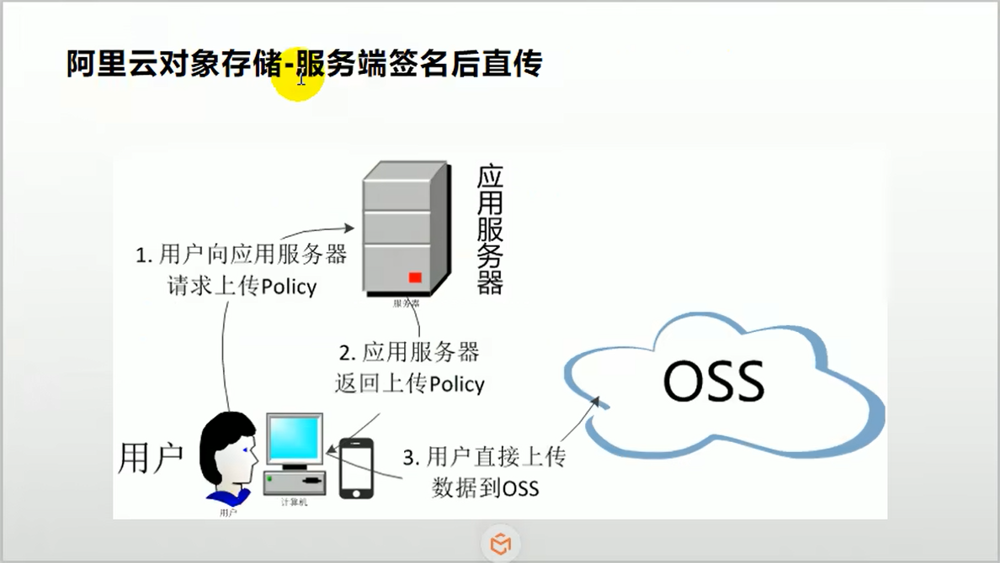
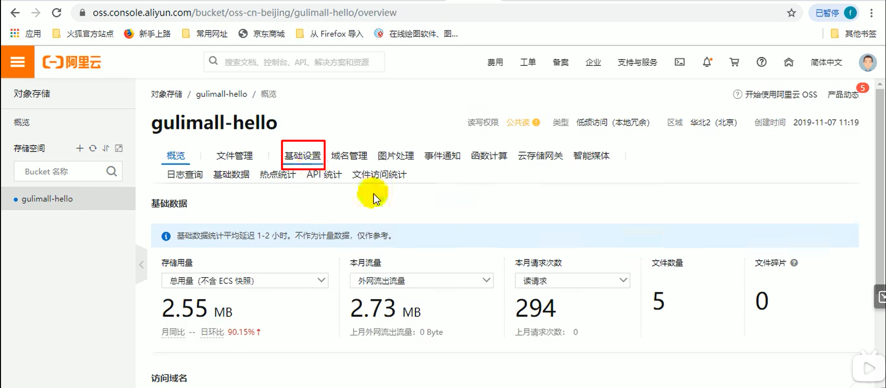
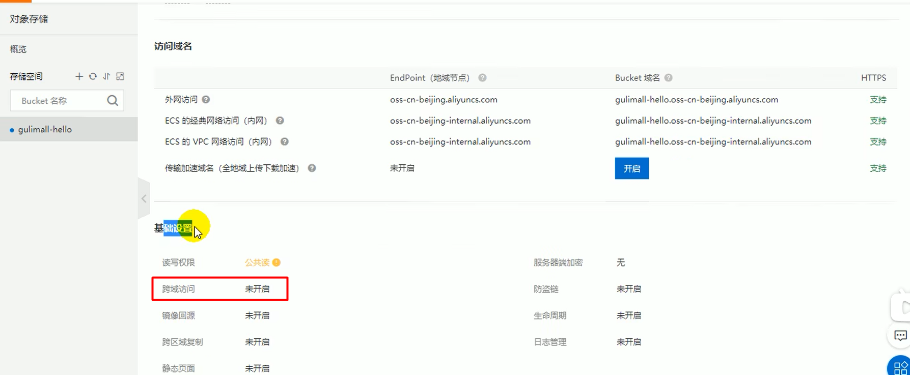
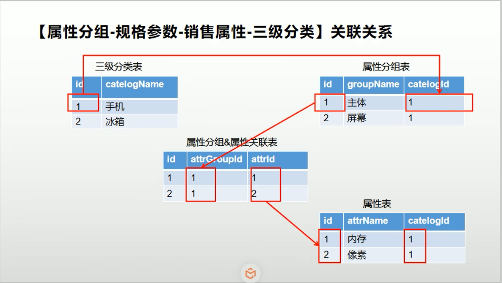
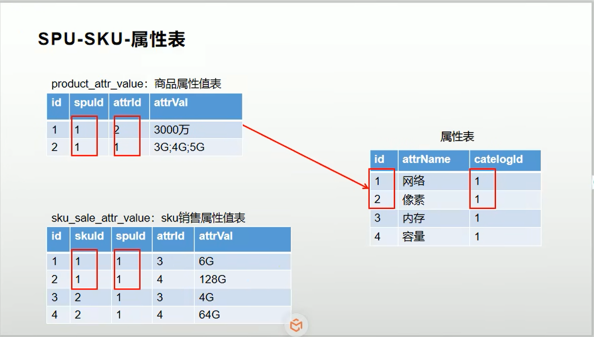
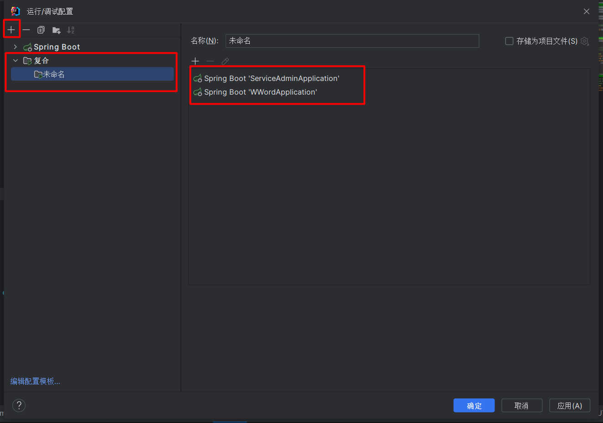
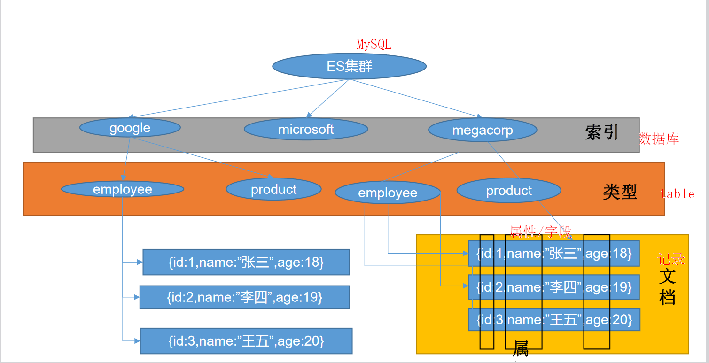

# 目录: 
1. 商品服务
2. ElasticSearch  


## 1.商品服务
**目录:**  
1.1 OSS对象存储服务  
1.2 Java校验  
1.3 SPU和SKU的概念  
1.4 @JsonInclude注解  
1.5 创建compound复合  
1.6 @Transactional不会滚的方法  

### 1.1 OSS对象存储服务  
**目录:**  
1.1.1 使用SpringCloudAlibabaOSS对象存储服务组件  
1.1.2 浏览器/客户端直接提交文件  
1.1.3 配置跨域访问  

#### 1.1.1使用SpringCloudAlibabaOSS对象存储服务组件  
**介绍:** 之前我们在尚尚优选项目中使用的是自已手动构建OSSClient对象,比较麻烦,通过使用SpringCloudAlibabaOSS组件来帮助我们使用阿里云的OSS服务.  

1.访问[SpringCloud-Alibaba官方网站](https://github.com/alibaba/spring-cloud-alibaba).找到OSS的项目示例.
> Examples
> > [Alibaba Cloud OSS Example](https://github.com/alibaba/aliyun-spring-boot/tree/master/aliyun-spring-boot-samples/aliyun-oss-spring-boot-sample)  

2.按照文档的操作步骤,先导入starter...
```xml
<dependency>
    <groupId>com.alibaba.cloud</groupId>
    <artifactId>aliyun-oss-spring-boot-starter</artifactId>
</dependency>
```

3.在需要使用该组件的模块的配置文件application.yml中配置相关的内容.  
```properties
// application.properties
alibaba.cloud.access-key=your-ak
alibaba.cloud.secret-key=your-sk
alibaba.cloud.oss.endpoint=***
```

4.直接在项目中依赖注入OSSClient对象.  

#### 1.1.2 浏览器/客户端直接提交文件  
**问题描述:** 目前存在的问题是,浏览器每次上传一个文件,都需要服务器做一个中间的转换操作,十分浪费性能.现在的想法是能不能直接让浏览器去访问阿里云的OSS服务器,直接在客户端完成上传的操作?

**解决思路:** 客户端需要上传文件时,先从我们的服务器拿到一个policy,也可以认为其是一次性session,浏览器拿到这个session后就可以直接利用该session上传文件到OSS服务器.  
  


**提示:** 可以将项目中用到的所有第三方服务单独放到一个三方服务模块中去.(也就是再创建一个新的模块)  

1.[访问OSS官方文档](https://help.aliyun.com/zh/oss/)  
实践教程->网站与移动应用->Web端直传实践->服务端签名直传并设置上传回调->[Java](https://help.aliyun.com/zh/oss/use-cases/java-1)

2.根据文档内容进行学习使用  

3.主要关注下面CallbackServer类的doGet方法.

4.因为文档中使用的是servlet,所以我们创建一个controller,模仿写出相应的方法;注意这里上传成功后还可以设置阿里云的回调URL(但是这里没有设置)  
```java

    // 设置自动注入的构造方法
    private OSS ossClient;

    @GetMapping("oss/policy")
    protected Map<String,String> policy(){
        // 阿里云账号AccessKey拥有所有API的访问权限，风险很高。强烈建议您创建并使用RAM用户进行API访问或日常运维，请登录RAM控制台创建RAM用户。
        String accessId = "yourAccessKeyId";
        String accessKey = "yourAccessKeySecret";
        // Endpoint以华东1（杭州）为例，其它Region请按实际情况填写。
        String endpoint = "oss-cn-hangzhou.aliyuncs.com";
        // 填写Bucket名称，例如examplebucket。
        String bucket = "examplebucket";
        // 填写Host地址，格式为https://bucketname.endpoint。
        String host = "https://examplebucket.oss-cn-hangzhou.aliyuncs.com";
        // 设置上传回调URL，即回调服务器地址，用于处理应用服务器与OSS之间的通信。OSS会在文件上传完成后，把文件上传信息通过此回调URL发送给应用服务器。
        String callbackUrl = "https://192.168.0.0:8888";
        // 设置上传到OSS文件的前缀，可置空此项。置空后，文件将上传至Bucket的根目录下。
        String dir = "exampledir/";
        
        // 创建ossClient实例。
        OSS ossClient = new OSSClientBuilder().build(endpoint, accessId, accessKey);
        Map<String, String> respMap = null;
        try {
            long expireTime = 30;
            long expireEndTime = System.currentTimeMillis() + expireTime * 1000;
            Date expiration = new Date(expireEndTime);
            PolicyConditions policyConds = new PolicyConditions();
            policyConds.addConditionItem(PolicyConditions.COND_CONTENT_LENGTH_RANGE, 0, 1048576000);
            policyConds.addConditionItem(MatchMode.StartWith, PolicyConditions.COND_KEY, dir);

            String postPolicy = ossClient.generatePostPolicy(expiration, policyConds);
            byte[] binaryData = postPolicy.getBytes("utf-8");
            String encodedPolicy = BinaryUtil.toBase64String(binaryData);
            String postSignature = ossClient.calculatePostSignature(postPolicy);

            respMap = new LinkedHashMap<String, String>();
            respMap.put("accessid", accessId);
            respMap.put("policy", encodedPolicy);
            respMap.put("signature", postSignature);
            respMap.put("dir", dir);
            respMap.put("host", host);
            respMap.put("expire", String.valueOf(expireEndTime / 1000));
            // respMap.put("expire", formatISO8601Date(expiration));
        } catch (Exception e) {
            // Assert.fail(e.getMessage());
            System.out.println(e.getMessage());
        }
        return respMap;
    }
```

#### 1.1.3 配置跨域访问  
**解释:** 因为现在交给客户端访问阿里云的OSS对象存储服务,而Vue本身又是跨域请求的,所以必须在阿里云配置跨域请求的相关设置.

1.来到阿里云的某个桶的基础设置下  
  

2.在下面有一个基础设置里面的跨域访问  
  

参照1.2给出的java调用文档访问地址,进行跨域的配置.  


### 1.2 Java校验  
**目录:**  
1.2.1 BingResult的作用  
1.2.2 异常处理  
1.2.3 分组校验  
1.2.4 自定义校验注解  

#### 1.2.1 BindingResult的作用  
**解释:** 通过BindingResult可以获取本次校验的结果信息.  

```java
public void save(@Valid @RequestBody User user,BindingResult bindingResult){
    // 通过bindingResult可以获取本次校验的结果,用法是直接在入参里面跟上一个BindingResult对象会自动传入.
}
```

**特性:** 如果在Controller中写了BindingResult这个对象,那么参数校验失败就不会产生异常了,而是将校验结果封装到该对象中,否则参数校验失败会抛出异常.异常默认会被spring处理,所以我们要配置全局统一的参数校验失败异常捕获逻辑.该异常就是MethodArgumentNotValidException

在`@RestControllerAdvice`类中捕获相关的异常

#### 1.2.2异常处理  
项目需要自定义异常响应码,而且是5位的需要与前端约定好;放在响应体的code字段中.  
定义一个全局的异常枚举类,需要Integer字段(代码响应码)还有String类型的字段,代表该异常码对应的提示信息.  

#### 1.2.3 JSR303分组校验  
校验分组的概念  
首先必须先定义分组,分组定义为接口,例如以下两个分组,CreateCheck和UpdateCheck.表示分别在创建对象时检查,更新对象时检查.  
**使用场景:** 对于同一个请求参数(需要做参数校验的请求参数),在不同的情况下做不同的参数校验.  
**注意:** 在分组校验的时候,对于没有指定分组的注解是不生效的,那么没有指定分组的注解要生效则必须是非分组校验(也就是注解不指定groups字段)  

```java
public interface CreateCheck {
}
```

```java
public interface UpdateCheck {
}
```

下面定义一个param类  
```java
@Data
public class TestValiated {
    @NotNull(message = "修改必须指定品牌id", groups = {UpdateGroup.class})
    @Null(message = "新增不能指定id", groups = {AddGroup.class})
    @Min(message = "用户名或邮箱长度不小于 {value}",value = 6,groups = {AddGroup.class})
    private Long brandId;
}
```

看看校验的时候是怎么指定校验参数的  
```java
@RequestMapping("/addValidated")
public String addValidated(@Validated(AddGroup.class) @RequestBody TestValiated brand){
    return "success";
}
```

#### 1.2.4 自定义校验注解  
**需求:** 我们想做一个自定义参数校验的注解`@ListValue`该注解有一个values属性(字符串类型)用于指定被标注的字段只能指定哪些值.  
例如,以下这段注解表明showStatus的值只能为0或1  
```java
@ListValue(values={0,1})
private Integer showStatus;
```

1.参照JSR303之前的注解完成我们自定义注解的编写  

```java
@Target({ METHOD, FIELD, ANNOTATION_TYPE, CONSTRUCTOR, PARAMETER, TYPE_USE })
@Retention(RUNTIME)
@Documented
@Constraint(validatedBy = { })
public @interface ListValue {

	String message() default "{io.github.cnsukidayo.validation}";

	Class<?>[] groups() default { };

	Class<? extends Payload>[] payload() default { };

    int[] values() default{ };

}
```

message:当参数校验出错后,默认的提示信息去哪里获取;之前我们都是手动指定message的值,覆盖了默认的配置.实际上当参数校验失败后message是指向一个配置文件的,该配置文件就存放了参数校验失败后默认显示的内容.  
这里我们指向了io.github.cnsukidayo.validation这个配置,根据JSR303的约定,该配置从当前项目的resources目录下(类路径下)的ValidationMessages.properties中获取.  
所以我们在resources目录下创建ValidationMessages.properties配置文件.并在该配置文件中添加对应的K-V信息  

2.关于@Constraint注解  
@Constraint注解可以指定校验器,在validatedBy字段中指定ConstraintValidator校验器.  

3.编写自定义的ConstraintValidator<?,?>校验器  
ConstraintValidator需要指定两个泛型,第一个泛型指定校验注解本身(这里是ListValue);第二个泛型指定该注解是标注在哪个类型上方的,这里是Integer.  

```java
/**
 * @author sukidayo
 * @date 2023/8/19 17:39
 */
public class CustomConstraintValidator implements ConstraintValidator<ListValue, Integer> {


    Set<Integer> set = new HashSet<>();

    /**
     * 初始化方法,传入的属性是标注的注解实例对象.<br>
     * 代表该注解实际标注的内容是什么.通过它就能得到value数组.
     *
     * @param listValue annotation instance for a given constraint declaration
     */
    @Override
    public void initialize(ListValue listValue) {
        int[] values = listValue.values();
        for (int value : values) {
            set.add(value);
        }
    }

    /**
     * 校验逻辑,value对象是实际传入的对象值(前端提交的值)
     *
     * @param value   object to validate
     * @param context context in which the constraint is evaluated 校验的上下文环境信息
     * @return 返回是否校验成功
     */
    @Override
    public boolean isValid(Integer value, ConstraintValidatorContext context) {
        return set.contains(value);
    }
}
```

4.在@ListValue注解的@Constraint注解指定自定义校验器  
`@Constraint(validatedBy = {CustomConstraintValidator.class})`  

5.可以指定多个不同的校验器,从而实现对多种数据类型的校验.例如现在只能校验Integer,还可以编写能够校验Long类型的校验器,然后配置到validatedBy里面即可.

### 1.3 SPU和SKU的概念  

**提示:** 尚上优选项目也提到过这个概念  

**名词解释**:  
SPU(Standard Product Unit):标准化产品单元.是商品信息聚合的最小单位,是一组可复用、易检索的标准化信息的集合,该集合描述了一个产品的特性.通俗点讲,属性值、特性相同的商品就可以称为一个SPU.

例如:品牌苹果+型号:5s可以确定一个产品,即SPU  
再加上颜色白色,尺码4.0,即表示一个SKU,SKU是从属于SPU的关系

SKU=Stock Keeping Unit(库存量单位),即库存进出计量的单位,可以是以件,盒,托盘等为单位.SKU这是对于大型连锁超市DC(配送中心)物流管理的一个必要的方法.当下已经被我们引申为产品统一编号的简称,每种产品均对应有唯一的SKU号.

SKU通俗来讲就是一个产品最小的出库单位
例如:一款手机产品有红黑白三个颜色,那么一台红色手机就是一个sku.
例如:一件T恤除了有颜色还有尺码,那么一件s码绿色体恤就是单个sku.

**个人理解:**  
SPU就是你可以定位到的一件商品,例如小米13标准版.但是在真正购买的时候,用户还需要选择商品的颜色、手机内存的版本;

**基本属性:**  
例如小米13,例如小米13不管它是什么颜色的、内存什么规格的.但它们都是骁龙8gen2的芯片、1080P的屏幕等这些公共的信息就称之为SPU(规格与包装).而真正购买时所使用的白色、256G版本才称之为SKU.  

1.分类与SPU的关系:  
例如手机分类下,它们应该有相同的SPU结构.例如刚才所说的小米13的芯片是8gen2这是它的SPU属性.同样属于手机分类的苹果;它的芯片就是A15.它们都有一个共同的SPU属性就是芯片,所以分类还应该定义SPU的结构信息(即创建一个商品时必须指定哪些SPU信息).  

2.数据库表设计  
  
  

### 1.4 @JsonInclude注解  

**解释:**  
在springboot中只要是涉及到Jackson组件进行序列化和反序列的目标对象时,目标对象的字段值都受到Jackson注解的影响.  

1.@JsonInclude注解  
`Include value() default Include.ALWAYS`  
该注解代表的意思是,序列化一个对象为Json字符串时,如果被该注解标识的字段为null时,采取的策略是什么.看Include这个枚举类:  
ALWAYS:永远包含该字段,则会给一个空值  
NON_EMPTY:只有当目标属性为非空时才序列化该字段,否则最终序列化出来的结果将没有该字段.  

### 1.5 创建compound复合配置  
**解释:** 利用compound可以批量启动和关闭微服务  
  

### 1.6 @Transactional不会滚的方法  
**方法一:** 自已捕获这个异常就不会回滚,只有执行方法的过程中出现了异常才会回滚.  
**方法二:**  见高级部分  

## 2. ElasticSearch  
**目录:**  
2.1 ElasticSearch介绍  
2.2 在Linux上使用docker下载ElasticSearch  
2.3 安装ES的可视化界面kibana  
2.4 初步检索  

### 2.1 ElasticSearch介绍  

1.文档地址:  
官方英文文档: [https://www.elastic.co/guide/en/elasticsearch/reference/current/index.html](https://www.elastic.co/guide/en/elasticsearch/reference/current/index.html)  
官方中文: [https://www.elastic.co/guide/cn/elasticsearch/guide/current/foreword_id.html](https://www.elastic.co/guide/cn/elasticsearch/guide/current/foreword_id.html)  

2.相关基本概念见尚上优选的ES部分和ElasticSearch笔记  

3.ElasticSearch与MySQL的对应关系  
  
其中**类型**就是相当于定义了Json的结构,因为ES中存储的是JSON数据.其次这里的一条条记录(Json)就是一个文档.  

4.ElasticSearch的使用场景  
它十分适用于**全文检索**的情况,例如数据库中存储了5条记录,分别是:  
1.红海行动  
2.探索红海行动  
3.红海特别行动  
4.红海记录篇  
5.特工红海特别探索  
然后ElasticSearch会对它们进行分词并形成一个所谓的倒排索引:  
|   词   |   记录    |
| :----: | :-------: |
|  红海  | 1,2,3,4,5 |
|  行动  |   1,2,3   |
|  探索  |    2,5    |
|  特别  |    3,5    |
| 纪录片 |     4     |
|  特工  |     5     |

查询的请求是:红海特工行动
通过分词器,把红海特工行动拆分为三个单词,分别是红海、特工、行动.  
然后这三个单词匹配到的记录是第1行的1,2,3,4,5;第5行的5;第2行的1,2,3.  
最后根据相关性得分得出结果,这里会发现第3条和第5条记录都匹配到了两个词.但是第三条记录中一共6个字我们的搜索词占了4个,也就是它的占比达到2/3.而第5条记录,一共8个字我们的搜索词也占了4个,它的占比达到了1/2.所以最终会发现第3条记录的相关性更高.  
**而如果这些搜索用MySQL来实现则会十分复杂,而且效率也未必高**  

5.ES中的所有数据都是放在内存中,所以它的效率是十分高效的.ES中的所有数据都是来自MySQL的.  

### 2.2 在Linux上使用docker下载ElasticSearch    
1.下载镜像文件  
`docker pull elasticsearch:7.4.2`

2.之前说过docker就理解为一个OS/环境/容器  
可以在当前用户目录下创建一个ElasticSearch目录用于存放容器中ElasticSearch的配置文件,之后会将容器中的配置文件挂载到外部的ElasticSearch目录上.  
这样做的好处是,以后添加插件或者修改配置就不需要进入容器内部进行修改.  

3.来到~/ElasticSearch目录下创建一个config目录  
然后执行`echo "http.host:0.0.0.0" >> ~/ElasticSearch/config/elasticsearch.yml`相当于在容器外部创建了容器内ES的配置  
同理再在~/ElasticSearch目录下**创建一个data目录和plugins目录**  
执行命令,创建并启动容器  
```shell
docker run --name elasticsearch -p 9200:9200 -p 9300:9300 \
-e "discover.type=signal-node" \
-e ES_JAVA_OPTS="-Xms64m -Xmx128m" \
-v ~/ElasticSearch/config/elasticsearch.yml:/usr/share/elasticsearch/config/elasticsearch.yml \
-v ~/ElasticSearch/data:/usr/share/elasticsearch/data \
-v ~/ElasticSearch/plugins:/usr/share/elasticsearch/plugins \
-d elasticsearch:7.4.2
```
**解释:**  
首先镜像相当于是一个类,真正启动的时候要给镜像一个名称,一个镜像可以被多次启动(实例化);每个镜像通过id进行区分.  
这里我们给elasticsearch镜像取名为elasticsearch,并且映射了两个端口.9200是我们调用ES发送请求时所使用的端口,9300是ES在分布式情况下各个节点之间通信的端口.  
-e "discover.type=signal-node" 参数代表是单节点运行  
-e ES_JAVA_OPTS="-Xms64m -Xmx128m" 参数代表的是ES使用的内存,初始64M最大128M.  
-v 就是挂在,将容器中的文件系统挂在到宿主机的文件系统上.  
-d 代表启动哪个镜像  

4.启动之后可能会保存  
一种错误是因为我们使用了文件挂在,当前用户对刚才创建的文件是有rwx权限的,而同组和别的组用户就没有这些权限了.  
执行`chmod -R 777 ~/ElasticSearch/`  

5.注意第三步的命令已经创建了一个容器,此时我们并不需要再创建一个容器,运行`docker ps -a`查看所有的容器,找到刚才ES容器的ID,然后执行`docker start [id]`即可  

### 2.3 安装ES的可视化界面kibana  
**介绍:**  
ElasticSearch和Kibana之间的关系就像MySQL和Navicat之间的关系一样.  
1.拉取kibana镜像  

2.启动kibana  
`docker run --name kibana -e ELASTICSEARCH_HOSTS=http://192.168.0.127:9200 -p 5601:5601 -d kibana:7.4.2`  
**参数说明:**  
-e ELASTICSEARCH_HOSTS 后面指代的值是elasticsearch服务所在的地址,并且如果服务是本机的则IP最好不要写localhost,就写IP即可.  
kibana默认的端口是5601  

### 2.4 初步检索
**目录:**  
2.4.1 _cat  
2.4.2 索引一个文档  
2.4.3 查询数据  


#### 2.4.1 _cat  
`GET /_cat/nodes:`查看所有节点    
`GET /_cat/health:`查看es健康状况  
`GET /_cat/master:`查看主节点  
`GET /_cat/indices:`查看所有索引  

#### 2.4.2 索引一个文档  
**解释:** 将一条记录保存到一个索引的某个类型下面,相当于将一条记录(文档)保存到某个数据库(索引)的某个表(类型)中.  

1.添加一条记录  
发送PUT请求`http://localhost:9200/mail/external/1`  
```json
//请求体
{
    "name":"cnsukidayo"
}
```
其中mail是索引;external是类型;后面的1是给这条数据指定id  
响应内容:
```json
{
    "_index": "mail",
    "_type": "external",
    "_id": "1",
    "_version": 1,
    "result": "created",
    "_shards": {
        "total": 2,
        "successful": 1,
        "failed": 0
    },
    "_seq_no": 0,
    "_primary_term": 1
}
```
|      key      |                          value                          |
| :-----------: | :-----------------------------------------------------: |
|    _index     |                  代表数据在哪个索引下                   |
|     _type     |                  代表数据在哪个类型下                   |
|      _id      |                        数据的id                         |
|   _version    |                       数据的版本                        |
|    _result    | 最终的结果;如果是新建则值是created,如果是更新就是update |
|    _shards    |                     分片集群的信息                      |
|    _seq_no    |                       乐观锁操作                        |
| _primary_term |                       乐观锁操作                        |

**解释:**  
* 首先带'\_'的都是元数据  
* 对于\_version和\_result字段,如果此时再次发送一个相同请求则version会在原来的基础上+1.并且\_result字段也会变为update(而不是created)  
* 还可以发送post请求保存/更新数据,**POST和PUT请求方式一模一样,只是请求方式不同**,他们的区别在于:**POST请求不需要传id,而PUT请求必须传id.** 并且创建完成后它会自动返回一个唯一id(因为我们没有指定id,性质类似自增id)  

#### 2.4.3 查询数据
1.发送Get请求`localhost:9200/mail/external/1`查询的路径和之前一致.  
响应结果:  
```json
{
    "_index": "mail",
    "_type": "external",
    "_id": "1",
    "_version": 1,
    "_seq_no": 0,
    "_primary_term": 1,
    "found": true,
    "_source": {
        "name": "cnsukidayo"
    }
}
```
**解释:**  
_seq_no:当数据发生变动时会增加(serialize_number)  
_primary_term:分片如果发生变化,例如机器重启;主分片重新选举等会发生变化.后序集群再讲.  
found:是否查到数据  
_source:真正查询到的数据  

2.模拟并发修改  
我们实际上是通过_seq_no来进行乐观锁的数据修改的,现在两个用户同时查询到目标数据的_seq_no值为0.  
他们两个都想更改该数据,但它们两个使用了乐观锁的语法.  
`PUT http://localhost:9200/mail/external/1?if_seq_no=1&if_primary_term=1`  
请求体:
```json
{
    "name":"1"
}
```
第二个人的请求:  
`PUT http://localhost:9200/mail/external/1?if_seq_no=1&if_primary_term=1`  
请求体:
```json
{
    "name":"2"
}
```
这段请求的语法表明,只有当_seq_no=1并且_primary_term=1时才修改成功.  
现在A用户先发送请求,提示成功.B用户再发送请求,提示409错误.  

