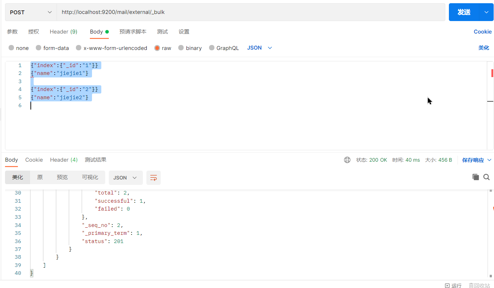

# 目录: 
1. 商品服务
2. ElasticSearch  


## 1.商品服务
**目录:**  
1.1 OSS对象存储服务  
1.2 Java校验  
1.3 SPU和SKU的概念  
1.4 @JsonInclude注解  
1.5 创建compound复合  
1.6 @Transactional不会滚的方法  

### 1.1 OSS对象存储服务  
**目录:**  
1.1.1 使用SpringCloudAlibabaOSS对象存储服务组件  
1.1.2 浏览器/客户端直接提交文件  
1.1.3 配置跨域访问  

#### 1.1.1使用SpringCloudAlibabaOSS对象存储服务组件  
**介绍:** 之前我们在尚尚优选项目中使用的是自已手动构建OSSClient对象,比较麻烦,通过使用SpringCloudAlibabaOSS组件来帮助我们使用阿里云的OSS服务.  

1.访问[SpringCloud-Alibaba官方网站](https://github.com/alibaba/spring-cloud-alibaba).找到OSS的项目示例.
> Examples
> > [Alibaba Cloud OSS Example](https://github.com/alibaba/aliyun-spring-boot/tree/master/aliyun-spring-boot-samples/aliyun-oss-spring-boot-sample)  

2.按照文档的操作步骤,先导入starter...
```xml
<dependency>
    <groupId>com.alibaba.cloud</groupId>
    <artifactId>aliyun-oss-spring-boot-starter</artifactId>
</dependency>
```

3.在需要使用该组件的模块的配置文件application.yml中配置相关的内容.  
```properties
// application.properties
alibaba.cloud.access-key=your-ak
alibaba.cloud.secret-key=your-sk
alibaba.cloud.oss.endpoint=***
```

4.直接在项目中依赖注入OSSClient对象.  

#### 1.1.2 浏览器/客户端直接提交文件  
**问题描述:** 目前存在的问题是,浏览器每次上传一个文件,都需要服务器做一个中间的转换操作,十分浪费性能.现在的想法是能不能直接让浏览器去访问阿里云的OSS服务器,直接在客户端完成上传的操作?

**解决思路:** 客户端需要上传文件时,先从我们的服务器拿到一个policy,也可以认为其是一次性session,浏览器拿到这个session后就可以直接利用该session上传文件到OSS服务器.  
  


**提示:** 可以将项目中用到的所有第三方服务单独放到一个三方服务模块中去.(也就是再创建一个新的模块)  

1.[访问OSS官方文档](https://help.aliyun.com/zh/oss/)  
实践教程->网站与移动应用->Web端直传实践->服务端签名直传并设置上传回调->[Java](https://help.aliyun.com/zh/oss/use-cases/java-1)

2.根据文档内容进行学习使用  

3.主要关注下面CallbackServer类的doGet方法.

4.因为文档中使用的是servlet,所以我们创建一个controller,模仿写出相应的方法;注意这里上传成功后还可以设置阿里云的回调URL(但是这里没有设置)  
```java

    // 设置自动注入的构造方法
    private OSS ossClient;

    @GetMapping("oss/policy")
    protected Map<String,String> policy(){
        // 阿里云账号AccessKey拥有所有API的访问权限,风险很高.强烈建议您创建并使用RAM用户进行API访问或日常运维,请登录RAM控制台创建RAM用户.
        String accessId = "yourAccessKeyId";
        String accessKey = "yourAccessKeySecret";
        // Endpoint以华东1\(杭州\)为例,其它Region请按实际情况填写.
        String endpoint = "oss-cn-hangzhou.aliyuncs.com";
        // 填写Bucket名称,例如examplebucket.
        String bucket = "examplebucket";
        // 填写Host地址,格式为https://bucketname.endpoint.
        String host = "https://examplebucket.oss-cn-hangzhou.aliyuncs.com";
        // 设置上传回调URL,即回调服务器地址,用于处理应用服务器与OSS之间的通信.OSS会在文件上传完成后,把文件上传信息通过此回调URL发送给应用服务器.
        String callbackUrl = "https://192.168.0.0:8888";
        // 设置上传到OSS文件的前缀,可置空此项.置空后,文件将上传至Bucket的根目录下.
        String dir = "exampledir/";
        
        // 创建ossClient实例.
        OSS ossClient = new OSSClientBuilder().build(endpoint, accessId, accessKey);
        Map<String, String> respMap = null;
        try {
            long expireTime = 30;
            long expireEndTime = System.currentTimeMillis() + expireTime * 1000;
            Date expiration = new Date(expireEndTime);
            PolicyConditions policyConds = new PolicyConditions();
            policyConds.addConditionItem(PolicyConditions.COND_CONTENT_LENGTH_RANGE, 0, 1048576000);
            policyConds.addConditionItem(MatchMode.StartWith, PolicyConditions.COND_KEY, dir);

            String postPolicy = ossClient.generatePostPolicy(expiration, policyConds);
            byte[] binaryData = postPolicy.getBytes("utf-8");
            String encodedPolicy = BinaryUtil.toBase64String(binaryData);
            String postSignature = ossClient.calculatePostSignature(postPolicy);

            respMap = new LinkedHashMap<String, String>();
            respMap.put("accessid", accessId);
            respMap.put("policy", encodedPolicy);
            respMap.put("signature", postSignature);
            respMap.put("dir", dir);
            respMap.put("host", host);
            respMap.put("expire", String.valueOf(expireEndTime / 1000));
            // respMap.put("expire", formatISO8601Date(expiration));
        } catch (Exception e) {
            // Assert.fail(e.getMessage());
            System.out.println(e.getMessage());
        }
        return respMap;
    }
```

#### 1.1.3 配置跨域访问  
**解释:** 因为现在交给客户端访问阿里云的OSS对象存储服务,而Vue本身又是跨域请求的,所以必须在阿里云配置跨域请求的相关设置.

1.来到阿里云的某个桶的基础设置下  
  

2.在下面有一个基础设置里面的跨域访问  
  

参照1.2给出的java调用文档访问地址,进行跨域的配置.  


### 1.2 Java校验  
**目录:**  
1.2.1 BingResult的作用  
1.2.2 异常处理  
1.2.3 分组校验  
1.2.4 自定义校验注解  

#### 1.2.1 BindingResult的作用  
**解释:** 通过BindingResult可以获取本次校验的结果信息.  

```java
public void save(@Valid @RequestBody User user,BindingResult bindingResult){
    // 通过bindingResult可以获取本次校验的结果,用法是直接在入参里面跟上一个BindingResult对象会自动传入.
}
```

**特性:** 如果在Controller中写了BindingResult这个对象,那么参数校验失败就不会产生异常了,而是将校验结果封装到该对象中,否则参数校验失败会抛出异常.异常默认会被spring处理,所以我们要配置全局统一的参数校验失败异常捕获逻辑.该异常就是MethodArgumentNotValidException

在`@RestControllerAdvice`类中捕获相关的异常

#### 1.2.2异常处理  
项目需要自定义异常响应码,而且是5位的需要与前端约定好;放在响应体的code字段中.  
定义一个全局的异常枚举类,需要Integer字段(代码响应码)还有String类型的字段,代表该异常码对应的提示信息.  

#### 1.2.3 JSR303分组校验  
校验分组的概念  
首先必须先定义分组,分组定义为接口,例如以下两个分组,CreateCheck和UpdateCheck.表示分别在创建对象时检查,更新对象时检查.  
**使用场景:** 对于同一个请求参数(需要做参数校验的请求参数),在不同的情况下做不同的参数校验.  
**注意:** 在分组校验的时候,对于没有指定分组的注解是不生效的,那么没有指定分组的注解要生效则必须是非分组校验(也就是注解不指定groups字段)  

```java
public interface CreateCheck {
}
```

```java
public interface UpdateCheck {
}
```

下面定义一个param类  
```java
@Data
public class TestValiated {
    @NotNull(message = "修改必须指定品牌id", groups = {UpdateGroup.class})
    @Null(message = "新增不能指定id", groups = {AddGroup.class})
    @Min(message = "用户名或邮箱长度不小于 {value}",value = 6,groups = {AddGroup.class})
    private Long brandId;
}
```

看看校验的时候是怎么指定校验参数的  
```java
@RequestMapping("/addValidated")
public String addValidated(@Validated(AddGroup.class) @RequestBody TestValiated brand){
    return "success";
}
```

#### 1.2.4 自定义校验注解  
**需求:** 我们想做一个自定义参数校验的注解`@ListValue`该注解有一个values属性(字符串类型)用于指定被标注的字段只能指定哪些值.  
例如,以下这段注解表明showStatus的值只能为0或1  
```java
@ListValue(values={0,1})
private Integer showStatus;
```

1.参照JSR303之前的注解完成我们自定义注解的编写  

```java
@Target({ METHOD, FIELD, ANNOTATION_TYPE, CONSTRUCTOR, PARAMETER, TYPE_USE })
@Retention(RUNTIME)
@Documented
@Constraint(validatedBy = { })
public @interface ListValue {

	String message() default "{io.github.cnsukidayo.validation}";

	Class<?>[] groups() default { };

	Class<? extends Payload>[] payload() default { };

    int[] values() default{ };

}
```

message:当参数校验出错后,默认的提示信息去哪里获取;之前我们都是手动指定message的值,覆盖了默认的配置.实际上当参数校验失败后message是指向一个配置文件的,该配置文件就存放了参数校验失败后默认显示的内容.  
这里我们指向了io.github.cnsukidayo.validation这个配置,根据JSR303的约定,该配置从当前项目的resources目录下(类路径下)的ValidationMessages.properties中获取.  
所以我们在resources目录下创建ValidationMessages.properties配置文件.并在该配置文件中添加对应的K-V信息  

2.关于@Constraint注解  
@Constraint注解可以指定校验器,在validatedBy字段中指定ConstraintValidator校验器.  

3.编写自定义的ConstraintValidator<?,?>校验器  
ConstraintValidator需要指定两个泛型,第一个泛型指定校验注解本身(这里是ListValue);第二个泛型指定该注解是标注在哪个类型上方的,这里是Integer.  

```java
/**
 * @author sukidayo
 * @date 2023/8/19 17:39
 */
public class CustomConstraintValidator implements ConstraintValidator<ListValue, Integer> {


    Set<Integer> set = new HashSet<>();

    /**
     * 初始化方法,传入的属性是标注的注解实例对象.<br>
     * 代表该注解实际标注的内容是什么.通过它就能得到value数组.
     *
     * @param listValue annotation instance for a given constraint declaration
     */
    @Override
    public void initialize(ListValue listValue) {
        int[] values = listValue.values();
        for (int value : values) {
            set.add(value);
        }
    }

    /**
     * 校验逻辑,value对象是实际传入的对象值(前端提交的值)
     *
     * @param value   object to validate
     * @param context context in which the constraint is evaluated 校验的上下文环境信息
     * @return 返回是否校验成功
     */
    @Override
    public boolean isValid(Integer value, ConstraintValidatorContext context) {
        return set.contains(value);
    }
}
```

4.在@ListValue注解的@Constraint注解指定自定义校验器  
`@Constraint(validatedBy = {CustomConstraintValidator.class})`  

5.可以指定多个不同的校验器,从而实现对多种数据类型的校验.例如现在只能校验Integer,还可以编写能够校验Long类型的校验器,然后配置到validatedBy里面即可.

### 1.3 SPU和SKU的概念  

**提示:** 尚上优选项目也提到过这个概念  

**名词解释**:  
SPU(Standard Product Unit):标准化产品单元.是商品信息聚合的最小单位,是一组可复用、易检索的标准化信息的集合,该集合描述了一个产品的特性.通俗点讲,属性值、特性相同的商品就可以称为一个SPU.

例如:品牌苹果+型号:5s可以确定一个产品,即SPU  
再加上颜色白色,尺码4.0,即表示一个SKU,SKU是从属于SPU的关系

SKU=Stock Keeping Unit(库存量单位),即库存进出计量的单位,可以是以件,盒,托盘等为单位.SKU这是对于大型连锁超市DC(配送中心)物流管理的一个必要的方法.当下已经被我们引申为产品统一编号的简称,每种产品均对应有唯一的SKU号.

SKU通俗来讲就是一个产品最小的出库单位
例如:一款手机产品有红黑白三个颜色,那么一台红色手机就是一个sku.
例如:一件T恤除了有颜色还有尺码,那么一件s码绿色体恤就是单个sku.

**个人理解:**  
SPU就是你可以定位到的一件商品,例如小米13标准版.但是在真正购买的时候,用户还需要选择商品的颜色、手机内存的版本;

**基本属性:**  
例如小米13,例如小米13不管它是什么颜色的、内存什么规格的.但它们都是骁龙8gen2的芯片、1080P的屏幕等这些公共的信息就称之为SPU(规格与包装).而真正购买时所使用的白色、256G版本才称之为SKU.  

1.分类与SPU的关系:  
例如手机分类下,它们应该有相同的SPU结构.例如刚才所说的小米13的芯片是8gen2这是它的SPU属性.同样属于手机分类的苹果;它的芯片就是A15.它们都有一个共同的SPU属性就是芯片,所以分类还应该定义SPU的结构信息(即创建一个商品时必须指定哪些SPU信息).  

2.数据库表设计  
  
  

### 1.4 @JsonInclude注解  

**解释:**  
在springboot中只要是涉及到Jackson组件进行序列化和反序列的目标对象时,目标对象的字段值都受到Jackson注解的影响.  

1.@JsonInclude注解  
`Include value() default Include.ALWAYS`  
该注解代表的意思是,序列化一个对象为Json字符串时,如果被该注解标识的字段为null时,采取的策略是什么.看Include这个枚举类:  
ALWAYS:永远包含该字段,则会给一个空值  
NON_EMPTY:只有当目标属性为非空时才序列化该字段,否则最终序列化出来的结果将没有该字段.  

### 1.5 创建compound复合配置  
**解释:** 利用compound可以批量启动和关闭微服务  
  

### 1.6 @Transactional不会滚的方法  
**方法一:** 自已捕获这个异常就不会回滚,只有执行方法的过程中出现了异常才会回滚.  
**方法二:**  见高级部分  

## 2. ElasticSearch  
**目录:**  
2.1 ElasticSearch介绍  
2.2 在Linux上使用docker下载ElasticSearch  
2.3 安装ES的可视化界面kibana  
2.4 初步检索  
2.5 高级检索  
2.6 映射mapping  
2.7 分词  
2.8 springboot整合ES  

### 2.1 ElasticSearch介绍  

1.文档地址:  
官方英文文档: [https://www.elastic.co/guide/en/elasticsearch/reference/current/index.html](https://www.elastic.co/guide/en/elasticsearch/reference/current/index.html)  
官方中文: [https://www.elastic.co/guide/cn/elasticsearch/guide/current/foreword_id.html](https://www.elastic.co/guide/cn/elasticsearch/guide/current/foreword_id.html)  

2.相关基本概念见尚上优选的ES部分和ElasticSearch笔记  

3.ElasticSearch与MySQL的对应关系  
  
其中**类型**就是相当于定义了Json的结构,因为ES中存储的是JSON数据.其次这里的一条条记录(Json)就是一个文档.  
在ES8+中已经没有类型的概念了,详情见2.6.1.

4.ElasticSearch的使用场景  
它十分适用于**全文检索**的情况,例如数据库中存储了5条记录,分别是:  
1.红海行动  
2.探索红海行动  
3.红海特别行动  
4.红海记录篇  
5.特工红海特别探索  
然后ElasticSearch会对它们进行分词并形成一个所谓的倒排索引:  
|   词   |   记录    |
| :----: | :-------: |
|  红海  | 1,2,3,4,5 |
|  行动  |   1,2,3   |
|  探索  |    2,5    |
|  特别  |    3,5    |
| 纪录片 |     4     |
|  特工  |     5     |

查询的请求是:红海特工行动
通过分词器,把红海特工行动拆分为三个单词,分别是红海、特工、行动.  
然后这三个单词匹配到的记录是第1行的1,2,3,4,5;第5行的5;第2行的1,2,3.  
最后根据相关性得分得出结果,这里会发现第3条和第5条记录都匹配到了两个词.但是第三条记录中一共6个字我们的搜索词占了4个,也就是它的占比达到2/3.而第5条记录,一共8个字我们的搜索词也占了4个,它的占比达到了1/2.所以最终会发现第3条记录的相关性更高.  
**而如果这些搜索用MySQL来实现则会十分复杂,而且效率也未必高**  

5.ES中的所有数据都是放在内存中,所以它的效率是十分高效的.ES中的所有数据都是来自MySQL的.  

### 2.2 在Linux上使用docker下载ElasticSearch    
1.下载镜像文件  
`docker pull elasticsearch:7.4.2`

2.之前说过docker就理解为一个OS/环境/容器  
可以在当前用户目录下创建一个ElasticSearch目录用于存放容器中ElasticSearch的配置文件,之后会将容器中的配置文件挂载到外部的ElasticSearch目录上.  
这样做的好处是,以后添加插件或者修改配置就不需要进入容器内部进行修改.  

3.来到~/ElasticSearch目录下创建一个config目录  
然后执行`echo "http.host:0.0.0.0" >> ~/data/ElasticSearch/config/elasticsearch.yml`相当于在容器外部创建了容器内ES的配置  
同理再在~/ElasticSearch目录下**创建一个data目录和plugins目录**  
执行命令,创建并启动容器  
```shell
docker run --name elasticsearch -p 9200:9200 -p 9300:9300 \
-e "discover.type=signal-node" \
-e ES_JAVA_OPTS="-Xms64m -Xmx128m" \
-v ~/data/ElasticSearch/config/elasticsearch.yml:/usr/share/elasticsearch/config/elasticsearch.yml \
-v ~/data/ElasticSearch/data:/usr/share/elasticsearch/data \
-v ~/data/ElasticSearch/plugins:/usr/share/elasticsearch/plugins \
-d elasticsearch:7.4.2
```
**解释:**  
首先镜像相当于是一个类,真正启动的时候要给镜像一个名称,一个镜像可以被多次启动(实例化);每个镜像通过id进行区分.  
这里我们给elasticsearch镜像取名为elasticsearch,并且映射了两个端口.9200是我们调用ES发送请求时所使用的端口,9300是ES在分布式情况下各个节点之间通信的端口.  
-e "discover.type=signal-node" 参数代表是单节点运行  
-e ES_JAVA_OPTS="-Xms64m -Xmx128m" 参数代表的是ES使用的内存,初始64M最大128M.  
-v 就是挂在,将容器中的文件系统挂在到宿主机的文件系统上.  
-d 代表启动哪个镜像  

4.启动之后可能会保存  
一种错误是因为我们使用了文件挂在,当前用户对刚才创建的文件是有rwx权限的,而同组和别的组用户就没有这些权限了.  
执行`chmod -R 777 ~/data/ElasticSearch/`  

5.注意第三步的命令已经创建了一个容器,此时我们并不需要再创建一个容器,运行`docker ps -a`查看所有的容器,找到刚才ES容器的ID,然后执行`docker start [id]`即可  

### 2.3 安装ES的可视化界面kibana  
**介绍:**  
ElasticSearch和Kibana之间的关系就像MySQL和Navicat之间的关系一样.  
1.拉取kibana镜像  

2.启动kibana  
`docker run --name kibana -e ELASTICSEARCH_HOSTS=http://192.168.0.127:9200 -p 5601:5601 -d kibana:7.4.2`  
**参数说明:**  
-e ELASTICSEARCH_HOSTS 后面指代的值是elasticsearch服务所在的地址,并且如果服务是本机的则IP最好不要写localhost,就写IP即可.  
kibana默认的端口是5601  

### 2.4 初步检索
**目录:**  
2.4.1 _cat  
2.4.2 索引一个文档  
2.4.3 查询数据  
2.4.4 更新文档  
2.4.5 删除文档&索引  
2.4.6 批量API  


#### 2.4.1 _cat  
`GET /_cat/nodes:`查看所有节点    
`GET /_cat/health:`查看es健康状况  
`GET /_cat/master:`查看主节点  
`GET /_cat/indices:`查看所有索引  

#### 2.4.2 索引一个文档  
**解释:** 将一条记录保存到一个索引的某个类型下面,相当于将一条记录(文档)保存到某个数据库(索引)的某个表(类型)中.  

1.添加一条记录  
发送PUT请求`http://localhost:9200/mail/external/1`  
```json
//请求体
{
    "name":"cnsukidayo"
}
```
其中mail是索引;external是类型;后面的1是给这条数据指定id  
响应内容:
```json
{
    "_index": "mail",
    "_type": "external",
    "_id": "1",
    "_version": 1,
    "result": "created",
    "_shards": {
        "total": 2,
        "successful": 1,
        "failed": 0
    },
    "_seq_no": 0,
    "_primary_term": 1
}
```
|      key      |                          value                          |
| :-----------: | :-----------------------------------------------------: |
|    _index     |                  代表数据在哪个索引下                   |
|     _type     |                  代表数据在哪个类型下                   |
|      _id      |                        数据的id                         |
|   _version    |                       数据的版本                        |
|    _result    | 最终的结果;如果是新建则值是created,如果是更新就是update |
|    _shards    |                     分片集群的信息                      |
|    _seq_no    |                       乐观锁操作                        |
| _primary_term |                       乐观锁操作                        |

**解释:**  
* 首先带'\_'的都是元数据  
* 对于\_version和\_result字段,如果此时再次发送一个相同请求则version会在原来的基础上+1.并且\_result字段也会变为update(而不是created)  
* 还可以发送post请求保存/更新数据,**POST和PUT请求方式一模一样,只是请求方式不同**,他们的区别在于:**POST请求不需要传id,而PUT请求必须传id.** 并且创建完成后它会自动返回一个唯一id(因为我们没有指定id,性质类似自增id)  

#### 2.4.3 查询数据
1.发送Get请求`localhost:9200/mail/external/1`查询的路径和之前一致.  
响应结果:  
```json
{
    "_index": "mail",
    "_type": "external",
    "_id": "1",
    "_version": 1,
    "_seq_no": 0,
    "_primary_term": 1,
    "found": true,
    "_source": {
        "name": "cnsukidayo"
    }
}
```
**解释:**  
_seq_no:当数据发生变动时会增加(serialize_number)  
_primary_term:分片如果发生变化,例如机器重启;主分片重新选举等会发生变化.后序集群再讲.  
found:是否查到数据  
_source:真正查询到的数据  

2.模拟并发修改  
我们实际上是通过_seq_no来进行乐观锁的数据修改的,现在两个用户同时查询到目标数据的_seq_no值为0.  
他们两个都想更改该数据,但它们两个使用了乐观锁的语法.  
`PUT http://localhost:9200/mail/external/1?if_seq_no=1&if_primary_term=1`  
请求体:
```json
{
    "name":"1"
}
```
第二个人的请求:  
`PUT http://localhost:9200/mail/external/1?if_seq_no=1&if_primary_term=1`  
请求体:
```json
{
    "name":"2"
}
```
这段请求的语法表明,只有当_seq_no=1并且_primary_term=1时才修改成功.  
现在A用户先发送请求,提示成功.B用户再发送请求,提示409错误.  

#### 2.4.4 更新文档  
1.发送POST请求`POST mail/external/1/_update`进行数据的更新  
请求体:
```json
{
    "doc":{
        "name":"3"
    }
}
```

2.执行上面的命令,查看返回结果;可以看到_version属性变为了2;result的值为updated  
```json
{
    "_index": "mail",
    "_type": "external",
    "_id": "1",
    "_version": 2,
    "result": "updated",
    "_shards": {
        "total": 2,
        "successful": 1,
        "failed": 0
    },
    "_seq_no": 1,
    "_primary_term": 2
}
```

3.再次执行上述的更新命令;可以发现_贝version的属性值还是2,并且result的值变为noop  
```json
{
    "_index": "mail",
    "_type": "external",
    "_id": "1",
    "_version": 2,
    "result": "noop",
    "_shards": {
        "total": 0,
        "successful": 0,
        "failed": 0
    },
    "_seq_no": 1,
    "_primary_term": 2
}
```

**原因解释:**  
此种更新方式,它会比较更新前后的内容,如果更新前后的内容没有变化;实际上并不会进行更新.(_version版本号不会变化,并且result会变为noop;包括_seq_no也不会变)  

4.还有一种更新方式见2.4.2;2.4.2说的是增加实际上也是一种更新.并且注意2.4.2节所述的更新有PUT和POST两种方式它们是有区别的.  

#### 2.4.5 删除文档&索引  
1.执行DELETE请求`DELETE http://localhost:9200/mail/external/1`  
响应内容:  
```json
{
    "_index": "mail",
    "_type": "external",
    "_id": "1",
    "_version": 3,
    "result": "deleted",
    "_shards": {
        "total": 2,
        "successful": 1,
        "failed": 0
    },
    "_seq_no": 2,
    "_primary_term": 2
}
```

**解释:**  
删除时的路径和添加时的路径的意思是一致的,详情见2.4.2  

2.此时再次查询会显示  
`GET localhost:9200/mail/external/1`
```json
{
    "_index": "mail",
    "_type": "external",
    "_id": "1",
    "found": false
}
```

3.删除索引  
`DELETE http://localhost:9200/mail`

4.删除类型  
实际上在ElasticSearch中并没有提供删除类型的操作,可以通过删除一个类型下的所有数据从而达到删除类型的效果.  

5.现在删除索引mail  
然后再次执行GET语句`GET localhost:9200/mail/external/1`  
显示结果:此时就代表连索引都找不到了  
```json
{
    "error": {
        "root_cause": [
            {
                "type": "index_not_found_exception",
                "reason": "no such index [mail]",
                "resource.type": "index_expression",
                "resource.id": "mail",
                "index_uuid": "_na_",
                "index": "mail"
            }
        ],
        "type": "index_not_found_exception",
        "reason": "no such index [mail]",
        "resource.type": "index_expression",
        "resource.id": "mail",
        "index_uuid": "_na_",
        "index": "mail"
    },
    "status": 404
}
```

#### 2.4.6 批量API  
1.发送POST请求`POST http://localhost:9200/mail/external/_bulk`  
请求体:  
```json
{"index":{"_id":"1"}}
{"name":"jiejie1"}

{"index":{"_id":"2"}}
{"name":"jiejie2"}

```
注意这里的请求体还是填写为json  
这段请求体的意思表明新增两个文档  
  
响应体:  
```json
{
    "took": 30,
    "errors": false,
    "items": [
        {
            "index": {
                "_index": "mail",
                "_type": "external",
                "_id": "1",
                "_version": 2,
                "result": "updated",
                "_shards": {
                    "total": 2,
                    "successful": 1,
                    "failed": 0
                },
                "_seq_no": 1,
                "_primary_term": 1,
                "status": 200
            }
        },
        {
            "index": {
                "_index": "mail",
                "_type": "external",
                "_id": "2",
                "_version": 1,
                "result": "created",
                "_shards": {
                    "total": 2,
                    "successful": 1,
                    "failed": 0
                },
                "_seq_no": 2,
                "_primary_term": 1,
                "status": 201
            }
        }
    ]
}
```

**解释:**  
在ES的批量操作中,每两行json为一个操作;第一行为进行的操作,第二行为具体的数据.并且上下两个操作之间必须多加一个换行符.  
**并且最后一个操作结束后还必须添加一个换行**  
语法格式:  
`{"action":{"metadata"}}`  
`requestBody`  
另外注意看请求路径,这里是对mail索引的external类型进行的批量操作.  
在action中指定的操作,除了这里的新增,上述的各种增删改查都是可以的.  
**每一条操作都是独立的,并没有一致性的特性**

**took:** 执行的时长(单位ms)  
**errors:** 是否有错误

2.一个复杂的案例  
发送POST请求`POST http://localhost:9200/_bulk`  
请求体:  
```json
{"delete":{"_index":"website","_type":"blog","_id":"123"}}

{"create":{"_index":"website","_type":"blog","_id":"123"}}
{"title":"My first Blog"}

{"index":{"_index":"website","_type":"blog"}}
{"title":"My second post"}

{"update":{"_index":"website","_type":"blog","_id":"123"}}
{"doc":{"title":"Update My Blog"}}

```

响应:  
```json
{
    "took": 405,
    "errors": false,
    "items": [
        {
            "delete": {
                "_index": "website",
                "_type": "blog",
                "_id": "123",
                "_version": 1,
                "result": "not_found",
                "_shards": {
                    "total": 2,
                    "successful": 1,
                    "failed": 0
                },
                "_seq_no": 0,
                "_primary_term": 1,
                "status": 404
            }
        },
        {
            "create": {
                "_index": "website",
                "_type": "blog",
                "_id": "123",
                "_version": 2,
                "result": "created",
                "_shards": {
                    "total": 2,
                    "successful": 1,
                    "failed": 0
                },
                "_seq_no": 1,
                "_primary_term": 1,
                "status": 201
            }
        },
        {
            "index": {
                "_index": "website",
                "_type": "blog",
                "_id": "7pXEK4oBTQ2EfMJ8hHPQ",
                "_version": 1,
                "result": "created",
                "_shards": {
                    "total": 2,
                    "successful": 1,
                    "failed": 0
                },
                "_seq_no": 2,
                "_primary_term": 1,
                "status": 201
            }
        },
        {
            "update": {
                "_index": "website",
                "_type": "blog",
                "_id": "123",
                "_version": 3,
                "result": "updated",
                "_shards": {
                    "total": 2,
                    "successful": 1,
                    "failed": 0
                },
                "_seq_no": 3,
                "_primary_term": 1,
                "status": 200
            }
        }
    ]
}
```

**解释:**  
首先这里没有指定索引和类型,所以这是一个针对ES全局的操作.  
* 第一个操作:这是一个delete操作,delete操作只有一行是没有请求体的.目前这里没有数据所以显示404.
* 第二个操作:create是创建一个文档
* 第三个操作:index也是创建一个文档,没有指定id;ES会自动创建id  
* 第四个操作:更新文档

3.action大全  

|  操作  |   含义   |
| :----: | :------: |
| create | 创建文档 |
| index  | 创建文档 |
| update | 更新文档 |
| delete | 删除文档 |

4.添加测试数据  
[https://github.com/elastic/elasticsearch/blob/7.5/docs/src/test/resources/accounts.json](https://github.com/elastic/elasticsearch/blob/7.5/docs/src/test/resources/accounts.json)  
下载该文件后还需要对该文件进行处理,因为该文件的每个操作结束之后没有加上换行符.  
复制处理后的JSON,然后执行`POST http://localhost:9200/bank/account/_bulk`请求体就是上面处理后的JSON  
后序的高级检索功能都是基于该内容完成的

### 2.5 高级检索
**目录:**  
2.5.1 格式介绍  
2.5.2 DSL语法格式  
2.5.3 查询条件大全  
2.5.4 ES数据分析(aggregations)   

#### 2.5.1 格式介绍

**官方文档地址:**  
[https://www.elastic.co/guide/index.html](https://www.elastic.co/guide/index.html)  

1.ES支持的两种检索格式  
* 一种是通过使用REST_request_uri发送搜索参数\(uri+检索参数\)
* 另一种是通过REST_request_body发送\(uri+请求体\)

2.使用request_uri方式;说白了就是在请求参数中写检索条件  
`GET bank/_search?q=*&sort=account_number:asc`  
响应结果:  
|        字段         |                                   含义                                   |
| :-----------------: | :----------------------------------------------------------------------: |
|        took         |                                 执行时长                                 |
|      timed_out      |                                 是否超时                                 |
|       _shards       | (在集群情况相下)告诉我们多少个分片被搜索了,以及统计了成功/失败的搜索分片 |
|        hits         |                           命中的记录(搜索结果)                           |
|  hits.total.value   |                                 总记录数                                 |
| hits.total.relation |                     这次检索的关系(这里是eq表示相等)                     |
|   hits.max_score    |                                 最大得分                                 |
|      hits.hits      |            真正命中的记录(默认为前10的记录,不会显示所有记录)             |
|  hits.hits._score   |                              当前记录的得分                              |
|   hits.hits.sort    |                              当前记录的排序                              |

3.使用REST_request_body;说白了就是在请求体中放上查询条件  
发送GET请求`GET localhost:9200/bank/_search`  
请求体:  
```json
{
    "query": {
        "match_all": {}
    },
    "sort": [
        {
            "account_number": "asc"
        },
        {
            "balance":"desc"
        }
    ]
}
```

**解释:**  
查询条件query是match_all,sort排序条件是先按照账号(account_number进行升序)再按照balance进行降序.  
第二种查询方式实际上称为 **<font color="#00FF00">Query DSL</font>**  以后我们都采用这种查询条件存放在json当中的方式进行查询.  


#### 2.5.2 DSL语法格式  
```json
{
    "QUERY_NAME":{
        "ARGUMENT": "VALUE",
        "ARGUMENT": "VALUE"
    }
}
```

最外层是一个大括号,然后里面填上**QUERY_NAME**查询的名称.然后再在里面填写上**ARGUMENT**查询的条件,再填上条件对应的条件值.  

例如:
```json
{
    "query": {
        "match_all": {}
    },
    "sort": [
        {
            "account_number": "asc"
        },
        {
            "balance": "desc"
        }
    ],
    "from": 0,
    "size": 20
}
```
这里的from和size就是查询条件的key\(这里做的是一个分页查询\).  

* 如果是针对某个字段的查询条件,例如上面的`account_number`显然就不是一个查询条件key了.它的格式如下:  
```json
{
    "QUERY_NAME": {
        "FIELD_NAME": {
            "ARGUMENT": "VALUE",
            "ARGUMENT": "VALUE"
        }
    }
}
``` 
`FIELD_NAME`代表要对这个字段做哪些查询条件  

#### 2.5.3 查询条件大全  

1.\_source 只显示固定的几个字段  
**注意:** 目前我们导入的数据中,一个account对象有account_number、balance、firstname、lastname、age等等许多字段.  
请求体:  
```json
{
    "query": {
        "match_all": {}
    },
    "_source":["age","balance"]
}
```

响应体:  
最终在_source字段下只会显示age和balance属性了.  

2.match & match_all  
**match**的意思是匹配,match也是一个查询条件;里面内容是字段的查询条件.  
```json
{
    "query": {
        "match": {
            "account_number": 20
        }
    },
    "_source": [
        "age"
    ]
}
```
查询结果如下:  
```json
{
    "took": 3,
    "timed_out": false,
    "_shards": {
        "total": 1,
        "successful": 1,
        "skipped": 0,
        "failed": 0
    },
    "hits": {
        "total": {
            "value": 1,
            "relation": "eq"
        },
        "max_score": 1.0,
        "hits": [
            {
                "_index": "bank",
                "_type": "account",
                "_id": "20",
                "_score": 1.0,
                "_source": {
                    "age": 36
                }
            }
        ]
    }
}
```
注意此时的max_score和_score字段.  
match对数值类型的查询是精确查询,对字符串的查询就是模糊查询.  
查询条件:  
```json
{
    "query": {
        "match": {
            "address": "Kings"
        }
    }
}
```

响应体:  
```json
{
    "took": 7,
    "timed_out": false,
    "_shards": {
        "total": 1,
        "successful": 1,
        "skipped": 0,
        "failed": 0
    },
    "hits": {
        "total": {
            "value": 2,
            "relation": "eq"
        },
        "max_score": 5.990829,
        "hits": [
            {
                "_index": "bank",
                "_type": "account",
                "_id": "20",
                "_score": 5.990829,
                "_source": {
                    "account_number": 20,
                    "balance": 16418,
                    "firstname": "Elinor",
                    "lastname": "Ratliff",
                    "age": 36,
                    "gender": "M",
                    "address": "282 Kings Place",
                    "employer": "Scentric",
                    "email": "elinorratliff@scentric.com",
                    "city": "Ribera",
                    "state": "WA"
                }
            },
            {
                "_index": "bank",
                "_type": "account",
                "_id": "722",
                "_score": 5.990829,
                "_source": {
                    "account_number": 722,
                    "balance": 27256,
                    "firstname": "Roberts",
                    "lastname": "Beasley",
                    "age": 34,
                    "gender": "F",
                    "address": "305 Kings Hwy",
                    "employer": "Quintity",
                    "email": "robertsbeasley@quintity.com",
                    "city": "Hayden",
                    "state": "PA"
                }
            }
        ]
    }
}
```
可以关注这两个结果的_score得分结果.  

3.match_phrase 短语匹配  
假如我们在上面第2步的模糊查询条件如下:  
```json
{
    "query": {
        "match": {
            "address": "mill road"
        }
    }
}
```
ES在进行查询的时候会对mill road进行分词;如果我们不想ES进行分词而将整个mill road作为一个整体(短语)进行查询,则可以使用match_phranse查询条件.  

```json
{
    "query": {
        "match_phrase": {
            "address": "mill road"
        }
    }
}
```

**利用精确检索达到相同效果**  
请求体:  
```json
{
    "query": {
        "match_phrase": {
            "address.keyword": "mill road"
        }
    }
}
```
使用**keyword**相当于把后面的值整体座位address的值.  
它们两个的区别在于:keyword会把后面的值就把address的精确值,也就是必须完全一致才会被匹配.而match_phrase是只要包含这个短语即可,不一定要完全一致.  

4.multi_match 多字段匹配  
请求体:  
```json
{
    "query": {
        "multi_match": {
            "query": "mill movico",
            "fields": [
                "state",
                "address"
            ]
        }
    }
}
```

这段是什么意思,之前我们的match和match_phrase在进行查询的时候都是只匹配一个字段,而这里我们匹配两个字段;也就是说只要state和address中有mill就会被匹配到.  
所以**这里的query已经不是查询属性了**而应该是查询条件;后面的mill就是条件值.  
**<font color="#00FF00">并且multi_match默认是包含分词的</font>** 也就是说,只要state中包含mill 或 movico 或者address中包含mill 或 movico 就会被检索到.

5.bool 复合查询  
请求体:  
```json
{
    "query": {
        "bool": {
            "must": [
                {
                    "match": {
                        "gender": "M"
                    }
                },
                {
                    "match": {
                        "address": "mill"
                    }
                }
            ],
            "must_not": [
                {
                    "match": {
                        "age": 28
                    }
                }
            ],
            "should": {
                "match": {
                    "lastname": "Wallce"
                }
            }
        }
    }
}
```

**解释:**  
* **bool** 表示这是一个复合查询,其中must表示必须;也就是目标结果必须满足的查询条件,must是一个数组里面填写多个查询条件.  
* **must_not** 表示必须不满足的条件;例如这里查询的目标结果必须不满足年龄是38的这个条件.  
* **should** 表示应该满足的条件;也就是说should指定的查询条件最好满足,当然也可以不满足;只是对最终相关性得分的计算会有影响.  

6.range 区间  
请求体:  
```json
{
    "query": {
        "bool": {
            "must": [
                {
                    "range": {
                        "age": {
                            "gte": 18,
                            "lte": 30
                        }
                    }
                }
            ]
        }
    }
}
```

7.filter 过滤器  
**解释:** 这部分主要是概念方面的;参照官方文档例如上面的must_not就是一个过滤器(filter),过滤器与正常的查询条件最大的不同是,过滤器不会提供相关性得分.  
例如must命中的记录会增加分数,按照道理must_not命中的也应该增加分数;但实际must_not命中的记录会直接被过滤掉;并且满足must_not条件的所有文档并不会增强相关性得分.  
请求体:  
```json
{
    "query": {
        "bool": {
            "filter": {
                "range": {
                    "age": {
                        "gte": 18,
                        "lte": 30
                    }
                }
            }
        }
    }
}
```

**注意:** 这里的filter的意思不是过滤掉目标年龄在18-30之间的文档,它没有任何查询条件的意思;它仅仅相当于是一个副词说明满足filter的所有文档他们的相关性得分不会计算;这里可以运行查看结果.  
**之前所有的查询条件都可以用filter来实现**  

8.term 精确检索  
根据官方文档推荐,如果目标值是精确值字段(例如age、id)可以使用term来查询;而涉及到文本字符的检索可以使用match查询条件.  
请求体:  
```json
{
    "query": {
        "term": {
            "age": 28
        }
    }
}
```

**约定:** 以后只要是非text字段的都用term条件;而text字段的都用match条件.  

#### 2.5.4 ES数据分析
**介绍:** 聚合提供了从数据中分组和提取数据的能力.最简单的聚合方法大致等于SQL GROUP BY和SQL聚合函数.在Elasticsearch中,您有执行搜索返回hits\(命中结果\),并且同时返回聚合结果,把一个响应中的所有hit\(命中结果\)分隔开的能力.这是非常强大且有效的,
您可以执行查询和多个聚合,并且在一次使用中得到各自的\(任何一个的\)返回结果,使用一次简洁和简化的API来避免网络往返.  

1.aggregations 执行聚合  
基本语法格式:  
```json
{
    "aggregations":{
        "<aggregations_name>":{
            "<aggregations_type>":{
                <aggregations_body>
            }
            [,"meta":{[<meta_data_body>]}]?
            [,"aggregations":{[<sub_aggregations>]+}]?
        }
        [,"<aggregations_name_2>":{...}]*
    }
}
```

* aggregations_name聚合的名称;这个名称是自已起的
* aggregations_type聚合的类型(可以理解为函数,例如求和、求平均等)
* aggregations_body聚合内容
* meta元数据

2.利用聚合-搜索address中包含mill的所有人的平均年龄分布  
```json
{
    "query": {
        "match": {
            "address": "mill"
        }
    },
    "aggs": {
        "ageAgg": {
            "terms": {
                "field": "age",
                "size": 10
            }
        }
    }
}
```
**分析:**  
首先筛选了address中包含mill的所有人,最终查询到四个人,并且和之前一样会放到hits属性下,查询结果和聚合执行结果是分开的.  
* aggs:代表我们自定义的聚合函数  
* term:表示这是一个分布型的聚合函数
* field:代表要对age字段进行分析
* size:代表最终显示的结果个数

响应结果:在响应结果中多了一个属性aggregations,重点看它  
```json
{
    "aggregations": {
        "ageAgg": {
            "doc_count_error_upper_bound": 0,
            "sum_other_doc_count": 0,
            "buckets": [
                {
                    "key": 38,
                    "doc_count": 2
                },
                {
                    "key": 28,
                    "doc_count": 1
                },
                {
                    "key": 32,
                    "doc_count": 1
                }
            ]
        }
    }
}
```

**分析:**  
可以看到有一个ageAgg属性,该属性值就是我们编写的聚合执行结果  
* doc_count_error_upper_bound:错误信息
* sum_other_doc_count:统计其它文档的数量  
* buckets:桶
  * 现在桶里面有三个对象,有38、28、32按照年龄的值进行聚合;它们的数量分别为2 1 1.

3.利用聚合来查询平均年龄,在刚才第二步的基础上编写  
请求体:  
```json
{
    "query": {
        "match": {
            "address": "mill"
        }
    },
    "aggs": {
        "ageAgg": {
            "terms": {
                "field": "age",
                "size": 10
            }
        },
        "ageAvg":{
            "avg":{
                "field":"age"
            }
        }
    }
}
```

**分析:**
我们添加一个新的聚合函数称为ageAvg,函数的类型是avg.对age字段进行平均值计算.  

响应体:  
```json
{
    "aggregations": {
        "ageAgg": {
            "doc_count_error_upper_bound": 0,
            "sum_other_doc_count": 0,
            "buckets": [
                {
                    "key": 38,
                    "doc_count": 2
                },
                {
                    "key": 28,
                    "doc_count": 1
                },
                {
                    "key": 32,
                    "doc_count": 1
                }
            ]
        },
        "ageAvg": {
            "value": 34.0
        }
    }
}
```

**分析:**  
结果值为34  

4.子聚合  
**要求:** 按照年龄聚合并且请求这些年龄段的人的平均薪资  
请求体:首先查询出所有所有年龄的分布情况  
```json
{
    "query": {
        "match_all": {}
    },
    "size": 0,
    "aggs": {
        "ageAgg": {
            "terms": {
                "field": "age",
                "size": 100
            }
        }
    }
}
```

**注意:** 之前说过,聚合之间是互不影响的;是相互独立的;如果我写信的聚合,那在ageAgg下再创建一个新的聚合即可.  
但现在是想要上一步的聚合结果作为下一步的聚合数据则需要使用子聚合.

请求体:  
```json
{
    "query": {
        "match_all": {}
    },
    "size": 0,
    "aggs": {
        "ageAgg": {
            "terms": {
                "field": "age",
                "size": 100
            },
            "aggs": {
                "ageAvg": {
                    "avg": {
                        "field": "balance"
                    }
                }
            }
        }
    }
}
```
响应体:在buckets中的记录;这里为了方便只看一条记录进行分析  
```json
{
    "key": 31,
    "doc_count": 61,
    "ageAvg": {
        "value": 28312.918032786885
    }
}
```
**分析:** 年龄为31的用户,共有61条记录,它们的平均薪资是28312  

### 2.6 映射mapping 
**目录:**  
2.6.1 mapping介绍  
2.6.2 mapping创建  
2.6.3 添加新的映射字段  
2.6.4 更新映射字段  


#### 2.6.1 mapping介绍  
**解释:** 其实现在的ES已经没有类型的概念了
**问题:** 那类型从而而来?实际上现在当我们第一次在一个索引下的一个类型下存储一条文档时,ES会尝试推断出我们存储的json数据的每个字段的类型.  
`GET localhost:9200/bank/_mapping` 查询某个index下所有类型的相关信息.  
**问题:** 你会发现我们在查看的时候是查看一个索引下的所有类型中的所有属性的类型,这是为什么?  
假设现在有bank索引,它的下面有两个类型分别是account和order;而ES在进行处理的时候是不会区分这两个类型下的所有属性的,也就是说如果account类型下的json文件中有name属性,order类型下的json文件中也有name属性,那么ES会把他俩认为是同一个类型.  
所以这就是为什么ES高版本取消类型的原因.  
响应体举例说明:  
```json
{
    "bank": {
        "mappings": {
            "properties": {
                "address": {
                    "type": "text",
                    "fields": {
                        "keyword": {
                            "type": "keyword",
                            "ignore_above": 256
                        }
                    }
                }
            }
        }
    }
}
```

**解释:**  
address就是我们定义的属性字段,ES推导它的类型是text;其中type:keyword是它的子属性,用于做精确匹配的.  

#### 2.6.2 mapping创建  
现在的ES已经移除类型了,我们可以在创建索引的时候指定该索引下数据的映射规则(mapping)  
发送请求`PUT /my_index`  创建一个my_index索引  
请求体:  
```json
{
    "mappings": {
        "properties": {
            "age": {
                "type": "integer"
            },
            "email": {
                "type": "keyword"
            },
            "name": {
                "type": "text",
                "index": true
            }
        }
    }
}
```

**注意:** keyword字段本身就是一个字符串类型,只不过该字段必须完全匹配时才能被查询到;见2.5.3第3步  
* type:指定字段类型  
* index:指定字段能否被索引,默认都为true;如果一个字段不被索引那么它就无法通过该字段检索数据.  

响应体:  
```json
{
    "acknowledged": true,
    "shards_acknowledged": true,
    "index": "my_index"
}
```

#### 2.6.3 添加新的映射字段  
发送PUT请求`localhost:9200/my_index/_mapping`  
请求体:  
```json
{
    "properties": {
        "employee-id": {
            "type": "keyword",
            "index": false
        }
    }
}
```

#### 2.6.4 更新映射字段  
**需求:** 修改bank索引中某些字段的类型  
**注意:** 很遗憾ES没办法更新映射字段,因为当映射字段创建时它的索引格式就已经确定了,如果更改会打乱.  
**解决办法:** 创建新的索引并指定好映射字段类型,然后将数据迁移到新的索引上.  

1.发送PUT请求创建新的索引new_bank`PUT localhost:9200/new_bank`  
```json
{
    "mappings": {
        "properties": {
            "account_number": {
                "type": "long"
            },
            "address": {
                "type": "text"
            },
            "age": {
                "type": "integer"
            },
            "balance": {
                "type": "long"
            },
            "city": {
                "type": "text"
            },
            "email": {
                "type": "keyword"
            },
            "employer": {
                "type": "keyword"
            },
            "firstname": {
                "type": "text"
            },
            "gender": {
                "type": "keyword"
            },
            "lastname": {
                "type": "text",
                "fields": {
                    "keyword": {
                        "type": "keyword",
                        "ignore_above": 256
                    }
                }
            },
            "state": {
                "type": "keyword"
            }
        }
    }
}
```

2.迁移数据  
**这里分为老版本和新版本两种不同的迁移方式**.老版本就是指还有类型的版本,新版本就是没有类型的版本(ES8)  
**老版本:**  
发送POST请求`POST localhost:9200/_reindex`
```json
{
    "source": {
        "index": "bank",
        "type": "account"
    },
    "dest": {
        "index": "new_bank"
    }
}
```
* source.index:旧索引
* source.type:旧索引的旧类型
* dest.index:新索引  

**新版本:**  
发送POST请求`POST localhost:9200/_reindex`
```json
{
    "source": {
        "index": "bank"
    },
    "dest": {
        "index": "new_bank"
    }
}
```
新版本没有类型这一说法所以就不需要指定type了  

### 2.7 分词 
**目录:**  
2.7.1 中文分词安装  
2.7.2 添加自定义分词  

#### 2.7.1 中文分词安装  
**介绍:**  
一个tokenizer\(分词器\)接收一个字符流,将之分割为独立的 tokens\(词元,通常是独立的单词\),然后输出tokens流.  
例如,whitespace tokenizer 遇到空白字符时分割文本.它会将文本 "Quick brown fox!"分割为 [Quick, brown, fox!].  
该tokenizer\(分词器\)还负责记录各个term\(词条\)的顺序或 position 位置\(用于 phrase 短语和 word proximity 词近邻查询\),以及 term\(词条\)所代表的原始 word\(单词\)的 start
\(起始\)和 end\(结束\)的 character offsets\(字符偏移量\)\(用于高亮显示搜索的内容\).  
Elasticsearch 提供了很多内置的分词器,可以用来构建 custom analyzers\(自定义分词器\).  

**ES内置了很多分词器:**  
* standard analyzer:语言的默认分词器

1.测试分词器的分词效果  
发送POST请求`POST localhost:9200/_analyze`  
请求体:  
```json
{
    "analyzer": "standard",
    "text": "The 2 QUICK Brown-Foxes jumped over the lazy dog's bone"
}
```

**自行查看响应**  

2.安装中文分词器  
**详情见尚上优选ES中文分词器**  
这里安装的也是IK分词器,所以直接参照尚上优选即可  
但这里咱们的ES是安装在docker中的  
原版的安装方法是将分词器导入到docker容器中ES的plugins目录下,但现在我们已经将容器中ES的plugins目录挂载到`~/data/ElasticSearch/plugins`这个目录下,所以直接将插件解压到该目录即可.  

3.查看已安装的所有插件  
来到ES的bin目录下执行  
`elasticsearch-plugin list`

4.测试中文分词器  
发送POST请求`POST localhost:9200/_analyze`  
ik有两种分词器:ik_smart和ik_max_word  
请求体:  
```json
{
    "analyzer": "ik_smart",
    "text": "红海行动"
}
```

#### 2.7.2 添加自定义分词  
**问题:** 分词插件的问题在于不能实时更新热门词库,如果我们想添加自定义的分词规则怎么办?  

1.首先需要启动nginx容器  
执行`docker run -p 80:80 --name nginx -d nginx:1.10`

2.将容器内的配置文件拷贝到当前目录  
执行`docker container cp nginx:/etc/nginx ~/data/`  

3.关闭nginx  
执行`docker stop nginx`

4.删除nginx镜像  
执行`docker rm nginx`  

5.重命名
执行`mv nginx conf`  将刚才复制的nginx文件夹重命名为conf文件夹  
执行`mkdir nginx`  创建nginx文件夹
执行`mv conf /nginx` 将conf文件夹移动到nginx文件夹中  

6.运行nginx并且设置文件挂载  
```shell
docker run -p 80:80 --name nginx \
-v ~/data/nginx/html:/usr/share/nginx/html \
-v ~/data/nginx/logs:/var/log/nginx \
-v ~/data/nginx/conf:/etc/nginx \
-d nginx:1.10
```
此时nginx就启动成功并且设置挂在了  

7.来到~/data/nginx/html目录下  
执行`mkdir es` 在当前目录下创建es目录;以后所有关于es的文件都会放到该目录下.  
进入es目录;创建fenci.txt文件`vim fenci.txt`  
编辑文件的内容如下:  
```txt
尚硅谷
乔碧萝
```
**保存并退出,** 在该文件里的内容就是指定我们自定义的分词内容,现在会把尚硅谷和乔碧萝作为一个词了.  

8.配置ik分词器的远程词库地址  
进入`~/data/ElasticSearch/plugins/ik/config/`  
执行`vim IKAnalyzer.cfg.xml`编辑文件  
将`<entry key...`这一行的注释删除  
编辑其内容为:`<entry key="remote_ext_dict">http://192.168.56.10/es/fenci.txt</entry>` 里面填上刚才我们编写的分词文件的地址.注意ip地址不要填写localhost,最好填写本机的ip地址.  
说白了就是通过在本地起一个nginx服务,然后给nginx服务添加静态文件,里面填上我们新增的单词内容;然后再让ES去请求本地nginx服务的内容从而间接得到分词的内容.  

9.重启ES
`docker restart elasticsearch`  

10.以后如果还有新的分词,就去修改~/data/nginx/html/fenci.txt文件;然后重启ES就可以了.  

### 2.8 springboot整合ES  
**目录:**  
2.8.1 springboot整合ES  
2.8.2 测试ES  
2.8.3 测试复杂检索  

#### 2.8.1 springboot整合ES  
**介绍:** ES有两个端口9200和9300,实际上这两个端口都可以操作ES;但官方推荐对9200进行操作,否则会出现很多问题.  
ES官方推荐通过JavaRESTClient对ES进行操作.  
**这里可以结合尚上优选的ES部分进行学习**  

1.创建一个新的模块search  

2.添加pom依赖  
```xml
<dependency>
    <groupId>org.elasticsearch.client</groupId>
    <artifactId>elasticsearch-rest-high-level-client</artifactId>
    <version>7.4.2</version>
</dependency>
```
**version**字段和ES的版本是对应的.  
并且需要确保由elasticsearch-rest-high-level-client依赖库依赖的其它依赖库也是对应的版本,因为有的时候springboot-parent会自动指定版本,如果是这种情况就需要我们手动指定版本了.  

3.配置ES  
如果是使用springdata来操作ES则会非常简单(就可以参照之前尚上优选),但这里不是所以需要我们手动配置.  
在config目录下创建ElasticSearchConfig.java类
```java
public class ElasticSearchConfig {
    @Bean
    public RestHighLevelClient client() {
        // 如果ES是集群,则可以在builder方法里填上多个HttpHost实例
        RestClientBuilder builder = RestClient.builder(new HttpHost("192.168.56.10", 9200,
"http"));
        return new RestHighLevelClient(builder);
}
}
```

4.进行测试  
```java
@RunWith(SpringRunner.class)
@SpringBootTest
public class Test{

    @Autowired
    private RestHightLevelClient client;

    @Test
    void test1() throws IOException {
        Product product = new Product();
        product.setSpuName("华为");
        product.setId(10L);
        IndexRequest request = new IndexRequest("product").id("20").source("spuName","华为","id",20L);
        try {
            IndexResponse response = client.index(request, RequestOptions.DEFAULT);
            System.out.println(request.toString());
            IndexResponse response2 = client.index(request, RequestOptions.DEFAULT);
        } catch (ElasticsearchException e) {
            if (e.status() == RestStatus.CONFLICT) {
            }
        }
    }
}
```

#### 2.8.2 测试ES  

1.编写RequestOptions  
```java
public class ElasticSearchConfig {
    public static final RequestOptions COMMON_OPTION;
    static{
        RequestOptions.Builder builder = RequestOptions.    DEFAULT.toBuilder();
        COMMON_OPTIONS = builder.build();
    }
}
```

2.保存数据到ES  
```java
@RunWith(SpringRunner.class)
@SpringBootTest
public class Test{

    @Autowired
    private RestHightLevelClient client;

    @Test
    public void indexData(){
        // 指定索引
        IndexRequest indexRequest = new IndexRequest("users");
        // 指定id
        indexRequest.id("1");
        // 方式一
        // 直接自已写K-V对
        indexRequest.source("username","张三","age",18);
        // 方式二
        // 直接传入JSON
        User user = new User();
        String jsonString = JSON.toJSONString(user);
        indexRequest.source(jsonString,XContentType.JSON);
        // 执行 上述两种方式二选一即可,一般用第二种方式
        IndexResponse index = client.index(indexRequest,ElasticSearchConfig.COMMON_OPTION);
        // 提取有用的响应数据
        System.out.println(index);
    }

}
```

#### 2.8.3 测试复杂检索  
```java
@RunWith(SpringRunner.class)
@SpringBootTest
public class Test{

    @Autowired
    private RestHightLevelClient client;

    @Test
    public void searchData(){
        // 1、创建检索请求
        SearchRequest searchRequest = new SearchRequest();
        // 指定索引
        searchRequest.indices("bank");
        // 指定DLS,检索条件
        SearchSourceBuilder sourceBuilder = new SearchSourceBuilder();
        searchRequest.source(searchSourceBuilder);

        // 1.1构造检索条件 
        sourceBuilder.query(QueryBuilders.matchQuery("address","mill"));
        System.out.println(sourceBuilder);
        
        // 2、执行检索
        SearchResponse searchResponse = client.search(searchRequest,ElasticSearchConfig.COMMON_OPTION);

        // 3、分析结果 searchResponse
        System.out.println(searchResponse);
    }

}
```
